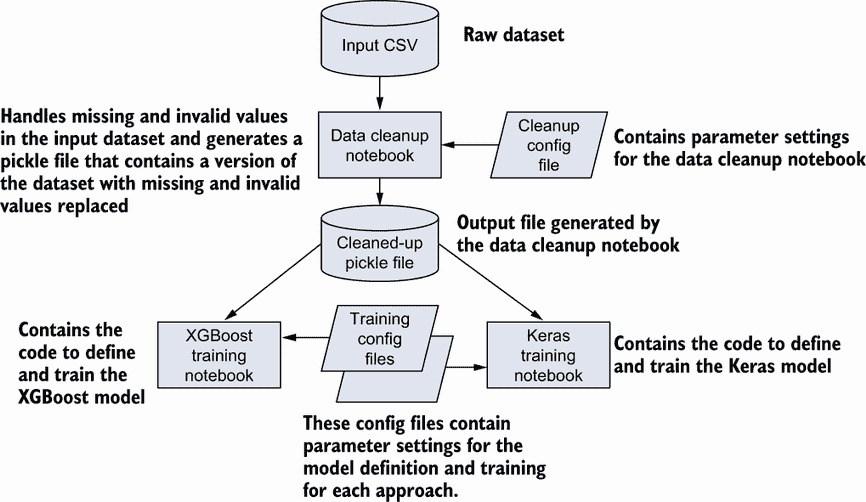
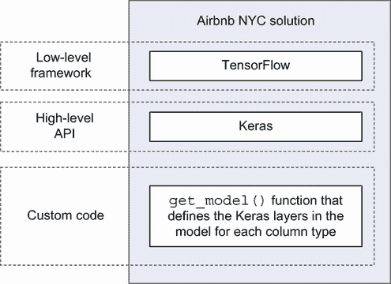
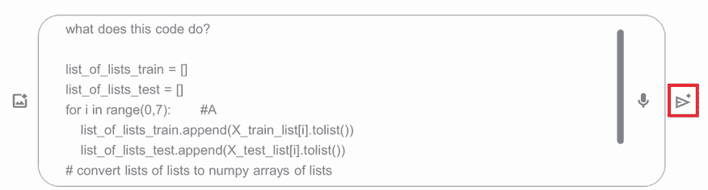
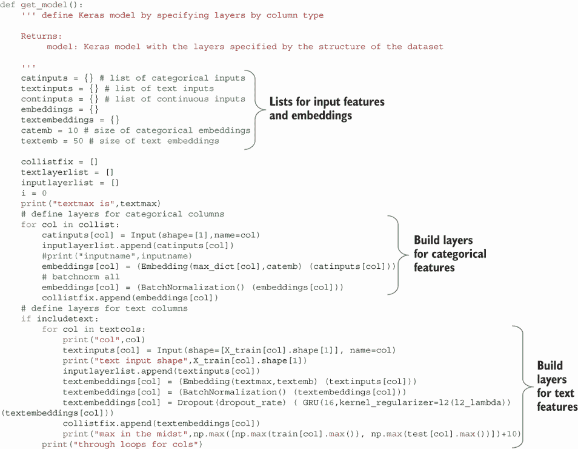
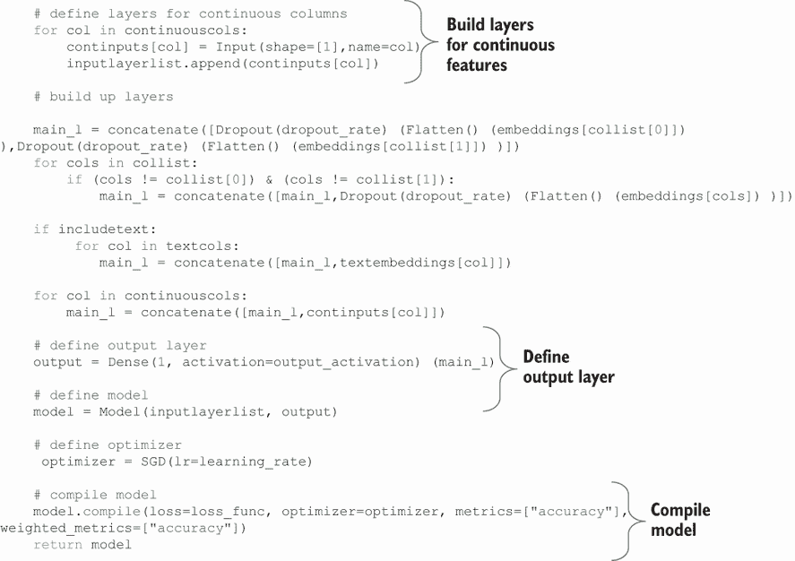
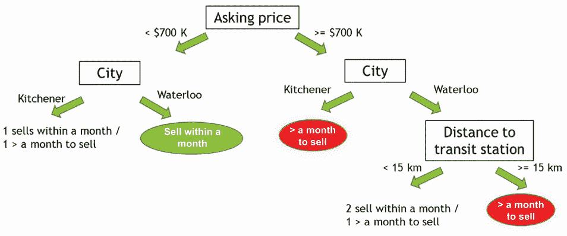
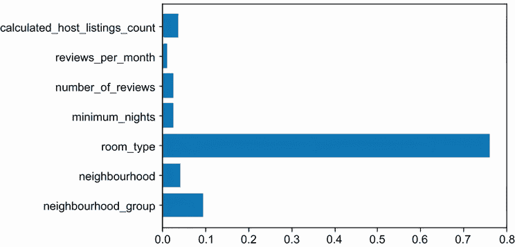
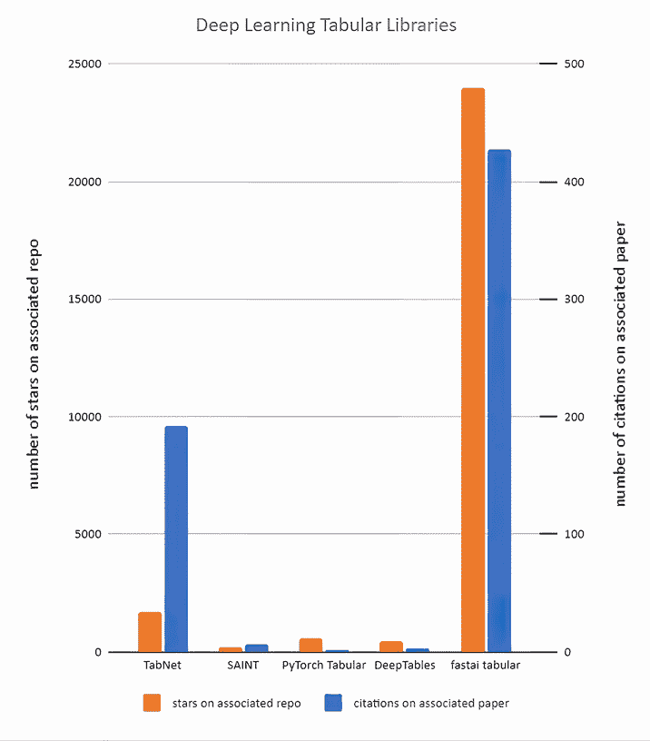
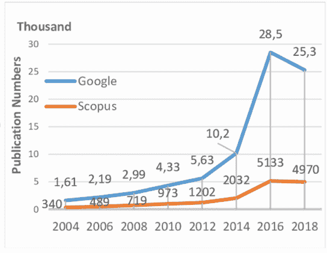

# 3 机器学习与深度学习对比

本章涵盖

+   将机器学习和深度学习作为解决表格数据问题的方法的比较

+   从简洁性方面比较机器学习和深度学习

+   从透明度方面比较机器学习和深度学习

+   从效果方面比较机器学习和深度学习

在数据科学界，关于表格数据的最佳机器学习方法的公开辩论正在进行。有些人断言，像 XGBoost 或 LightGBM 这样的梯度提升技术对于大多数表格数据问题来说是优越的。其他人则主张在分析工具包中包含深度学习。在本章中，我们将通过两个具体的例子来检验这两种方法：

+   预测纽约市 Airbnb 列表的价格。在这个例子中，我们使用一个真实的 Airbnb 列表数据集来训练模型，预测新的列表价格是否会高于或低于该市场的平均列表价格。我们将使用这个例子来检验简洁性、透明度和效果。

+   预测一个地区房地产市场中的房产在售出之前在市场上的时间长度。在这个例子中，我们使用一个虚构的房地产列表数据集来说明透明度的可解释性方面。

我们将关注三个在解释科学和商业数据方面具有特别价值的标准：

+   *简洁性*—在应用代码和框架核心 API 方面越简单，越好。

+   *透明度*—一种可解释且能轻易向商业利益相关者解释的解决方案是最好的。

+   *效果*—提供最佳结果且训练和实施时间更短的解决方案更可取。此外，随着新方法被发现，研究兴趣可以导致更有效的结果。

## 3.1 预测纽约市 Airbnb 的价格

为了比较机器学习和深度学习的简洁性，我们将对比两种针对特定表格数据分类问题的解决方案：预测纽约市 Airbnb 列表的价格是否会高于或低于该市场的平均价格。我们将比较的两种解决方案是

+   *机器学习*—由使用 XGBoost（一种流行的基于梯度的方法）的解决方案表示。

+   *深度学习*—由使用 Keras 功能 API 的解决方案表示。

我们将比较这些解决方案的代码复杂性，并回顾这两个解决方案告诉我们关于机器学习和深度学习方法相对简洁性的整体问题的信息。

### 3.1.1 纽约市 Airbnb 数据集

为了解决预测纽约市 Airbnb 列表的价格是否高于或低于平均价格的问题，我们使用了一个包含纽约市 Airbnb 列表详细信息的表格数据集。图 3.1 包括了纽约市 Airbnb 数据集列的描述以及每列的数据类型，而您可以在图 3.2 中看到的数据集样本已在 Kaggle 上共享：[`mng.bz/avJ7`](https://mng.bz/avJ7)。

数据集中的每一行都包含单个列表的信息，而数据集中的每一列都包含给定特征的列表的所有值。


图 3.1 Airbnb 纽约市数据集中列的详细信息


图 3.2 Airbnb 纽约市数据集的行样本

Airbnb 纽约市数据集具有使其成为比较解决表格数据问题方法的好选择的特征：

+   它具有方便的大小。大约有 49,000 条记录，它足够大以引起兴趣，但又不至于庞大到需要像 Spark 这样的特殊“大数据”工具来处理。

+   它拥有足够多的列来进行机器学习和深度学习的比较。正如我们将在后续章节中发现的那样，只有三到四列的数据集会立即倾向于经典的机器学习方法。拥有数百列的数据集将很难进行审查。Airbnb 纽约市数据集拥有“恰到好处”的列数——足够让深度学习有机会发光，但又不会让数据集对人类来说难以理解。

+   由于数据集有合理数量的行和列，因此很容易在电子表格中快速查看它，这意味着我们不必每次想要回答有关数据集的问题时都编写 Python 代码。使用电子表格，您可以快速排序、筛选和计数数据集的各个方面，并利用 Excel 或 Google Sheets 的脚本功能进行更详细的调查。Airbnb 纽约市数据集适合在电子表格中进行审查，这意味着它可以以最小的努力进行审查。

+   数据集包括一系列有趣的列类型，包括几种连续列（`minimum_nights`是整数值，`price`和`reviews_per_month`是浮点值，而`latitude`和`longitude`是地理空间值），分类列（`neighbourhood_group`、`neighbourhood`和`room_type`），以及自由文本列（`name`和`host_name`）。

+   数据集有一些瑕疵——例如，某些列中存在缺失值——但它并不那么混乱，以至于在使用它来训练模型之前需要进行大规模的清理。这使得围绕这个数据集构建应用程序变得方便，而不会因为清理而分心太多。

+   它是开源的，并且基于真实业务的真实数据。正如我们将在本书的后续章节中看到的那样，使用表格数据探索机器学习和深度学习的一个挑战是缺乏代表真实业务问题的实质性开源表格数据集。Airbnb 数据集是非平凡表格数据集的罕见例子，其中包含来自运营业务的信息。

+   使用这个数据集，模型的目标是显而易见的：`价格`。在我们的案例中，我们根据`价格`来推导目标——即给定的列表价格是否高于或低于数据集中列表的中位数价格。

在本小节中，我们初步了解了 Airbnb 纽约数据集。在下一个小节中，我们将查看用于训练模型的该数据集的代码。

### 3.1.2 代码简介

现在我们已经介绍了 Airbnb 纽约数据集，让我们来看看解决方案的代码。在本节中，我们不会深入探讨代码的所有细节，但了解各个部分如何组合在一起是很重要的。

图 3.3 总结了构成两个解决方案的文件。



图 3.3 Airbnb 纽约解决方案的构成文件

以下是对构成解决方案的文件的更多细节：

+   *输入 CSV* ([`mng.bz/avJ7`](https://mng.bz/avJ7))。

+   *数据清理笔记本* ([`mng.bz/gawV`](https://mng.bz/gawV))。请注意，虽然 XGBoost 和 Keras 版本的代码使用相同的清理笔记本，但 XGBoost 具有内置功能，例如处理缺失值，这意味着仅 XGBoost 版本的清理笔记本可能比通用版本更简单。

+   *清理配置文件* ([`mng.bz/ey7Q`](https://mng.bz/ey7Q))。

+   *XGBoost 训练配置文件* ([`mng.bz/pKOz`](https://mng.bz/pKOz))。

+   *Keras 训练配置文件* ([`mng.bz/vKpr`](https://mng.bz/vKpr))。

+   *XGBoost 训练笔记本* ([`mng.bz/YDGA`](https://mng.bz/YDGA))。在梯度提升解决方案中，我们选择了 XGBoost，因为它非常受欢迎，而且如果遇到任何问题，网上关于 XGBoost 的指导资料非常丰富。

+   *Keras 训练笔记本* ([`mng.bz/JYwP`](https://mng.bz/JYwP))。我们选择 Keras 作为代表性的深度学习方法，因为它与 PyTorch 或在其之上运行的 fastai 等替代方案不同，Keras 与原始 TensorFlow 一样，在商业应用中最常用。我们选择 Keras 而不是在“比较梯度提升方法与深度学习的研究成果”部分介绍的表格深度学习库之一，因为 Keras 比任何这些库都更广泛使用，并且其 API 可以与 XGBoost 的 API 进行更“苹果对苹果”的比较，而不是将专门为表格数据设计的深度学习库与 XGBoost 的一般功能进行比较。

为了您的方便，XGBoost 和 Keras 解决方案被共享在两个单独的文件夹中，但两个解决方案之间的大部分代码是通用的：

+   你可以在[`mng.bz/GeEO`](https://mng.bz/GeEO)找到 XGBoost 解决方案的代码。

+   你可以在[`mng.bz/zZ4Q`](https://mng.bz/zZ4Q)找到 Keras 解决方案的代码。

这两个仓库之间的差异仅限于训练笔记本和训练配置文件。

### 3.1.3 使用 Keras 的深度学习解决方案

在深入挖掘 Airbnb 数据集和解决方案中使用的代码的细节之前，让我们将 Keras 解决方案置于其软件堆栈的上下文中。图 3.4 显示了 Keras 解决方案解决 Airbnb 价格预测问题的堆栈。



图 3.4 Airbnb NYC Keras 解决方案的堆栈

在第八章中，我们将更详细地介绍图 3.4 中显示的堆栈层。目前，我们可以观察到 Keras 是我们用来实现 Airbnb 问题深度学习解决方案的高级深度学习 API。有两个低级深度学习框架，我们将在本章中考察的深度学习解决方案依赖于 TensorFlow 低级框架，因为 Keras 就是建立在它之上的。

### 3.1.4 训练特征

两个解决方案的目标都是预测给定的 Airbnb 列表的价格是否高于或低于输入数据集的平均价格。为了实现这个目标，两个模型都在同一组特征上进行了训练。我们将用于训练模型的特征子集在模型训练的配置文件中定义：[`mng.bz/OBoE`](https://mng.bz/OBoE)。以下是指定用于训练模型特征的配置文件的部分：

```py
categorical: # categorical columns
      - 'neighbourhood_group'
      - 'neighbourhood'
      - 'room_type'
continuous: # continuous columns
      - 'minimum_nights'
      - 'number_of_reviews'
      - 'reviews_per_month'
      - 'calculated_host_listings_count'
```

配置文件还包括一个列表，其中明确排除了从训练过程中排除的特征：

```py
excluded: # columns that are not used as input features for training
      - 'price'
      - 'id'
      - 'latitude'
      - 'longitude'
      - 'host_id'
      - 'last_review'
      - 'name'
      - 'host_name'
      - 'availability_365'
```

这些列没有被用作训练模型的特征的原因如下：

+   `price`没有被包括为训练模型的特征，因为它定义了模型的目标，即列表的价格是否高于或低于输入数据集的平均价格。

+   两个 ID 列没有被包括为特征，因为它们不携带任何关于列表价格的信息，因为它们只是分配给列表和房东的数字 ID。

+   我们不使用`latitude`或`longitude`作为特征，因为列表的地理位置已经编码在用于训练模型的`neighbourhood_group`和`neighbourhood`特征中。如果我们没有这些特征来用于列表的地理位置，我们可以使用`latitude`和`longitude`值（或从它们导出的极坐标：[`mng.bz/0Q66`](https://mng.bz/0Q66)）来根据位置对列表进行聚类或将它们转换为极坐标。使用每个列表的原始纬度和经度作为特征可能会导致过拟合，因为每个列表都会有一对独特的值（`latitude`，`longitude`）。

+   `name`和`host_name`列不作为特征，因为它们是某种任意的标记集，允许人类读者识别列表。一个有趣的练习是将`host_name`作为特征，看看它是否提供了与具有相同主人的列表价格相关的某种信号。

+   我们决定不将`availabiltiy_365`包含在特征集中，因为该列难以解释。

我们已经检查了我们将用于训练模型以预测 Airbnb 列表价格是否高于或低于平均价格的特征。在下一节中，我们将比较基于此数据集训练的梯度提升和深度学习模型的代码简单性。

### 3.1.5 比较梯度提升和深度学习解决方案

正如我们之前提到的，解决 Airbnb 纽约问题的两种解决方案仅在少数地方有所不同。图 3.5 再次显示了解决方案的文件结构，其中突出显示了两种方法之间的差异文件。


图 3.5 XGBoost 和 Keras 解决方案之间不同的 Airbnb 解决方案文件

如果解决方案仅在四个文件中有所不同，我们如何使用这个例子来对比 XGBoost 与 Keras 深度学习的简单性？表 3.1 比较了应用程序的多个方面的代码复杂性。

表 3.1 比较 XGBoost 和 Keras 在三个领域的代码复杂性

| 代码复杂性方面 | XGBoost | Keras 深度学习模型 |
| --- | --- | --- |
| 数据准备 | 需要代码块将 numpy 数组列表转换为 numpy 数组列表 | NA——数据准备是为 Keras 深度学习解决方案设计的 |
| 模型定义 | 单个语句，与 Scikit-learn 模式一致 | 需要代码块来定义模型的层，每个列类型（连续、分类、文本）都有独特的层集 |
| 模型训练 | 单个语句，与 Scikit-learn 模式一致 | 需要的代码块，以允许回调控制训练过程，避免提供无益的训练迭代，并确保训练过程输出性能最佳的训练模型 | 定义回调对象所需的代码块，以实现高效的 Keras 训练周期 |
| 模型保存 | 单个语句，与 Scikit-learn 模式一致 | 作为模型保存回调的一部分包含在内 |
| 模型加载 | 代码块——需要安装最新版本的 XGBoost 或加载的模型将因错误`AttributeError: 'XGBClassifier'对象没有属性'_le'`而失败 | 单个语句 |

让我们看看 Airbnb 纽约解决方案中这些代码复杂性的各个方面。

XGBoost 解决方案有一些额外的数据准备代码。Airbnb 纽约解决方案最初是用 Keras 深度学习编写的，然后使用 Keras 解决方案作为起点创建了 XGBoost 解决方案。原始的 Keras 模型需要以 numpy 数组列表的形式提供训练输入。XGBoost 需要以列表的 numpy 数组形式提供输入。以下列表包含 XGBoost 训练笔记本中转换原始数据格式为 XGBoost 所需格式的代码。

列表 3.1 XGBoost 的数据准备代码

```py
list_of_lists_train = []
list_of_lists_test = []
for i in range(0,7):                                     ①
    list_of_lists_train.append(X_train_list[i].tolist())
    list_of_lists_test.append(X_test_list[i].tolist())
# convert lists of lists to numpy arrays of lists
xgb_X_train = np.array(list_of_lists_train).T            ②
xgb_X_test = np.array(list_of_lists_test).T              ③
```

① 定义训练和测试数据集的列表的列表（每个特征一个列表）

② 将列表的列表转换为 numpy 数组的列表

③ 将测试列表的列表转换为 numpy 数组的列表

注意，虽然这是一个 XGBoost 代码相对于 Keras 代码具有一些额外复杂性的真实示例，但这种额外的代码并非 XGBoost 固有的需求，而是由于 XGBoost 解决方案是从 Keras 解决方案改编而来的方式所必需的。

要进一步确认 XGBoost 数据准备代码的作用，请访问 Gemini（[`gemini.google.com`](https://gemini.google.com)），将代码粘贴到输入字段中，并附带提示“这段代码做什么？”然后点击提交按钮，如图 3.6 所示。



图 3.6 在 Gemini 中输入解释代码的请求

您将获得一个解释代码功能以及以下摘要的响应：

```py
In essence, the code does the following:
It extracts specific elements from 
two input lists (X_train_list and X_test_list).
It arranges those elements into a specific format (lists of lists).
It converts those lists into NumPy arrays, 
preparing the data for further processing 
or model training.
```

现在我们已经比较了 XGBoost 和 Keras 在数据准备方面的差异，让我们比较两种解决方案的模型定义代码。

以下是为 Airbnb 纽约问题定义的 XGBoost 模型——遵循 Scikit-learn 模式的单行代码：

```py
model = XGBClassifier()
```

让我们看看 Keras 解决方案的模型定义代码是什么样的。图 3.7 显示了定义 Airbnb 纽约问题深度学习模型的函数的初始部分。



图 3.7 Airbnb 纽约问题的 Keras 深度学习解决方案的模型定义（第一部分）

图 3.8 展示了定义 Airbnb 纽约问题深度学习模型的其余函数。



图 3.8 Airbnb 纽约问题的 Keras 深度学习解决方案的模型定义（第二部分）

图 3.9 展示了 Airbnb 问题的模型可视化。


图 3.9 Airbnb 问题的 Keras 模型可视化

这是一种极端的对比——深度学习模型本可以定义得更简单。这个模型定义指定了每个列类型（连续、分类和文本）的不同 Keras 层。这不是表格数据模型可能的最小层定义，但它非常灵活。它将能够处理具有各种连续、分类和文本列组合的表格数据集。此外，这个模型定义包括指定文本列层的代码，而我们没有选择任何文本列来训练 Airbnb 模型，因此这段代码可以被省略，而不会影响 Airbnb 纽约解决方案的 Keras 版本。尽管如此，XGBoost 模型定义的简洁性与 Keras 模型定义的复杂性之间的差异突出了 XGBoost 的一个优势：XGBoost 中的模型定义代码比 Keras 中的更简单。

我们已经比较了数据准备代码和模型定义代码。接下来，让我们比较 XGBoost 和 Keras 解决方案中的模型训练代码。在 XGBoost 解决方案中，通过一行代码完成训练，并接受所有具有默认值的参数的默认值：

```py
model.fit(xgb_X_train, dtrain.target)
```

以下列表显示，对于 Keras 解决方案，需要设置两种不同的拟合语句版本和几个额外的参数（包括批量大小和训练过程中将运行的默认 epoch 数）。

列表 3.2 Keras 的拟合语句

```py
if early_stop:
       modelfit = model.fit(X_train_list, dtrain.target, 
epochs=epochs, batch_size=batch_size
        , validation_data=(X_valid_list, dvalid.target),
verbose=1,callbacks=callback_list)                         ①
else:
    modelfit = model.fit(X_train_list, 
dtrain.target, epochs=epochs, batch_size=batch_size
         , validation_data=(X_valid_list, 
dvalid.target), verbose=1)                                 ②
```

① 包含一个参数的拟合语句，该参数列出用于早期停止和模型保存的回调

② 不包含回调的拟合语句

XGBoost 和 Keras 在训练代码的复杂性上没有太大的差异。然而，为了使 Keras 的训练过程高效，我们需要使用回调来避免浪费训练周期，并在训练过程结束时得到一个次优化的训练模型。有关使用 Keras 回调优化训练过程的详细信息，请参阅《结构化数据深度学习》第六章 ([`mng.bz/KGx0`](https://mng.bz/KGx0))。

在查看 Keras 解决方案的回调语句之前，让我们看看 Gemini 能告诉我们关于 fit 语句的什么信息。同样，让我们将此代码提交给 Gemini，并在前面加上提示“这段代码做什么？”如果你第一次没有得到满意的答案，点击“重新生成草稿”以获取另一个答案。在第二次使用 Gemini 时，我们得到了对代码的详细描述，包括以下对 fit 语句参数的描述：

```py
In both cases, it trains the model using model.fit(), 
which is a common method for training models in 
machine learning libraries like TensorFlow or Keras.
Key arguments passed to model.fit():
X_train_list: Training data features.
dtrain.target: Training data targets (labels).
epochs: Number of training iterations.
batch_size: Number of samples per training step.
validation_data: Validation data for monitoring performance (optional).
verbose: Level of output during training (1 for progress bars).
callbacks: List of callbacks to be executed during 
training (only in the early_stop case) 
```

Gemini 还提供了以下摘要：

```py
The code conditionally trains a model with or without early stopping.
Early stopping is a technique to prevent overfitting 
and improve model generalization.
The specific implementation of early stopping depends 
on the contents of callback_list.
To fully understand its purpose, more context about the 
model, training process, and early stopping criteria 
is needed.
```

注意在最后一行，Gemini 通过正确地指出，仅给定训练片段，它无法推断出完整解决方案的所有细节，从而对其分析的限制进行了说明。

列表 3.3 显示了定义用于 Keras 模型训练步骤的回调的代码。这段代码在 Keras 版本的 Airbnb NYC 解决方案中增加了额外的复杂性。

列表 3.3 Keras 的回调语句

```py
   callback_list = []
    es = EarlyStopping(monitor=es_monitor, 
mode=es_mode, verbose=1,
patience = patience_threshold)                             ①
    callback_list.append(es)                               ②
    model_path = get_model_path()
    save_model_path = 
os.path.join(model_path,'scmodel'+modifier+"_"+str(experiment_number)+'.h5')
    mc = ModelCheckpoint(save_model_path, 
monitor=es_monitor, mode=es_mode, 
verbose=1, save_best_only=True)                            ③
    callback_list.append(mc)                               ④
```

① 定义了一个早期停止回调对象，指定一旦性能停止提高，训练过程就应该停止

② 将第一个回调添加到训练过程中要使用的回调列表中

③ 定义一个模型保存回调对象，以确保在整个训练运行中性能最优的模型是在训练运行结束时保存的模型

④ 将第二个回调添加到训练过程中要使用的回调列表中

一旦我们训练了模型，我们希望将其保存到文件中，以便我们可以在另一个会话或作为模型部署的一部分加载和练习它。在我们的简单示例中，我们将模型保存和重新加载到用于训练模型的同一个笔记本中。保存 XGBoost 模型的语句是

```py
model.save_model(xgb_save_model_path)
```

对于 Keras，我们不需要显式保存模型的语句，因为模型会自动随着模型保存回调一起保存。

下面的列表显示了在 XGBoost 中加载模型的代码。

列表 3.4 XGBoost 的模型加载语句

```py
loaded_saved_model =  xgb.XGBClassifier()                 ①
loaded_saved_model.load_model(xgb_save_model_path)        ②
```

① 定义了一个新的 XGBoost 分类器对象

② 使用 save_model 语句保存的模型加载新的 XGBoost 分类器对象

加载 Keras 模型的语句是

```py
saved_model = load_model(save_model_path)
```

XGBoost 和 Keras 之间一个额外的区别是，如果你尝试加载一个保存的 XGBoost 分类器模型（例如我们为 Airbnb NYC 问题训练的模型）并运行预测，如果你不在非常新的 XGBoost 版本上，你会得到一个错误。为了解决这个问题，XGBoost 模型训练笔记本中包含了以下语句，以确保 XGBoost 是最新版本：

```py
!pip install --upgrade XGBoost
```

在本节中，我们比较了 XGBoost 和 Keras 在数据准备、模型定义、模型训练和模型保存方面的代码简洁性。接下来，我们将讨论从这个比较中可以得出的结论。

### 3.1.6 结论

对于数据科学项目来说，最好的建议之一就是采取尽可能简单的方法。将奥卡姆剃刀原则应用于数据科学项目，以简化任务。如果解决问题有多种方法，请选择最简单的方法。如果线性回归可以解决问题，那么为什么还要使用支持向量机？如果传统的编码方法可以解决问题，那么为什么还要使用机器学习呢？如果你采取最简单的方法，你可能会更快地获得初步结果，更快地完成整个解决方案的开发，并且在部署后维护系统也会更加容易。

为了回答经典机器学习和深度学习在简单性方面的比较问题，我们比较了使用每种方法解决一个具体问题的解决方案：Airbnb 纽约市价格预测问题。通过回答这个问题，我们可以将“保持简单”的原则应用于表格数据问题。

在前面的子节中，我们回顾了 Airbnb 纽约市表格数据集，并比较了使用该数据集训练的两个解决方案的复杂性——一个使用梯度提升方法（XGBoost），另一个使用深度学习（Keras）。XGBoost 解决方案需要一些额外的数据准备代码，但这些额外的代码是 XGBoost 解决方案从深度学习解决方案中改编而来的产物，而不是 XGBoost 的直接需求。对于 XGBoost 解决方案，模型定义只需要一行代码，模型训练也只需要一行代码。而对于 Keras 来说，模型定义需要很多行代码，模型训练需要的代码行数比 XGBoost 多，特别是为了利用 Keras 回调确保高效的训练过程。保存和加载模型的代码复杂性在 XGBoost 解决方案和 Keras 解决方案中大致相同。虽然 Airbnb 纽约市问题不能代表所有表格数据问题，但它为我们提供了将梯度提升方法和深度学习方法进行苹果对苹果比较的机会，并且比较的结论是 XGBoost 代码更简单。XGBoost 解决方案的代码行数更少，模型定义和模型训练的语句更简单，在 XGBoost 中比在 Keras 中需要的非默认参数值更少。

在我们得出关于梯度提升和深度学习比较简单性的结论之前，我们需要注意，Keras 并不是唯一可用的深度学习方法。还有其他处理表格数据的深度学习方法，其中一些方法定义和训练模型的代码比我们为 Airbnb 纽约问题所检查的 Keras 代码更简单。例如，使用 fastai 框架（[`docs.fast.ai/`](https://docs.fast.ai/)），我们将在第九章中更详细地介绍，你可以定义一个用于处理表格数据的模型，训练它，并用不到 10 行代码来获取预测。Tensorflow 预置估算器（[`mng.bz/9Y51`](https://mng.bz/9Y51)）是另一种简单的表格数据深度学习方法。使用这些预置估算器，你可以在表格数据集上训练一个模型，并通过与 XGBoost API 一样简单的 API 从模型中获取预测。这些只是两个代码比 Keras 更简单的深度学习方法的例子。Keras 的优点是它非常灵活，其灵活性是企业在生产系统中经常使用 Keras 而较少在生产部署中看到简单方法（如 fastai）的原因之一。

现在我们已经从简单性的角度比较了机器学习和深度学习，在下一节中，我们将从透明度的角度比较这两种方法。

## 3.2 透明度

当比较梯度提升技术与深度学习时，有两个与透明度相关的方面：可解释性（即解释模型工作原理的难易程度）和特征重要性（即确定哪个特征影响最大的难易程度）。在本节中，我们将根据这两个透明度方面比较梯度提升与深度学习。

为了比较梯度提升和深度学习的可解释性，我们将考虑一个简单、人为构造的数据集，以及在这个数据集上训练的模型如何进行解释。

我们将使用的数据集包含特定房地产市场的房屋信息，如表 3.2 所示。

表 3.2 房屋上市时间数据集

| 上市时间（周） | 城市 | 出售价格（千美元） | 到交通站距离（公里） |
| --- | --- | --- | --- |
| 6 | Kitchener | 600 | 10 |
| 5 | Waterloo | 700 | 5 |
| 12 | Kitchener | 900 | 20 |
| 6 | Waterloo | 700 | 15 |
| 1 | Waterloo | 500 | 5 |
| 4 | Waterloo | 600 | 5 |
| 8 | Waterloo | 750 | 5 |
| 2 | Kitchener | 500 | 5 |
| 9 | Kitchener | 1000 | 5 |
| 4 | Waterloo | 750 | 10 |

我们将在下一节回到 Airbnb 数据集。目前，这个房地产数据集足够简单，可以很容易地说明可解释性。

该数据集包括房屋所在的城镇、房屋的挂牌价格以及房屋到最近的交通站的距离，以及房屋售出前在市场上停留的周数。我们想要使用这个数据集训练一个模型，该模型将预测一个新挂牌的房屋将在市场上停留超过一个月还是不到一个月。

### 3.2.1 可解释性

假设我们想要给非专业人士、商业观众一个关于决策树模型如何用于解决这个数据集的“上市时间”问题的想法。我们可以创建一个如图 3.10 所示的插图，以给出这样一个决策树如何工作的粗略概念。



图 3.10 决策树插图

注意，这个插图不包含任何术语，也不假设读者有任何机器学习背景。决策树的目的很明显。注意这个决策树是一个粗略的简化，与这种简单的决策树和梯度提升模型之间存在重要的技术差异。例如，XGBoost 使用多个决策树，所以这个插图本身不足以解释 XGBoost 模型。尽管如此，它表明，对于一些经典的机器学习算法，可以在不强迫非专业人士学习它们的详细技术信息的情况下，给非专业人士一个关于算法如何工作的直观理解。

如果我们想要给同样是非专业人士的观众一个关于深度学习模型如何被训练来解决相同的“上市时间”问题的总体感觉呢？我们可以从一个如图 3.11 所示的通用神经网络示意图开始。


图 3.11 神经网络插图

这样的插图可能有助于解释“深度学习”中的“深度”，但它并没有提供关于模型实际是如何训练的任何见解。如果我们放大以展示网络中单个节点的工作，如图 3.12 所示，会有帮助吗？


图 3.12 神经网络中节点的简单插图

大多数非专业人士会发现解读图 3.12 很困难。如果放大神经网络细节并不能提高可解释性，那么如果我们采取不同的方法，借鉴神经网络与生物神经元之间的类比，如图 3.13 所示，会怎么样呢？这个插图试图将整个神经网络与网络中单个节点（一个“神经元”）的工作联系起来，然后将该节点与生物神经元联系起来。


图 3.13 将神经网络与生物神经元联系起来

引用生物学类比提出了两个问题。首先，这个类比本身是有争议的。一些行业专家认为神经网络的工作方式与生物神经元完全不同（例如，[`mng.bz/jp2P`](https://mng.bz/jp2P)）。即使你接受神经网络与生物神经元之间的类比是有效的，使用这个类比来解释深度学习系统也可能导致严重的误解，如果非专业人士从类比中推断出简单的深度学习系统具有类似大脑的能力。其次，这个类比并没有真正阐明深度学习模型是如何训练的。大多数人知道什么是生物神经元，但他们不知道生物神经元实际上是如何工作的。如果类比的基础本身就是一个谜，那么类比是没有帮助的。总的来说，神经网络节点与生物神经元之间的类比，充其量是一个孤立的奇思妙想，并不能帮助非专业人士理解深度学习实际上是如何工作的。

从这个例子中我们可以得出什么结论？尽管有成百上千万的人已经对深度学习有了足够的了解，能够欣赏其所能和不能做到的事情，但当试图向商业受众解释深度学习时，深度学习仍然存在一些难以克服的障碍。与可以简单用易懂的插图解释其基本原理的决策树不同，深度学习不适合用一张简单的图片来解释。即使今天，有了像 fastai 这样的易于访问的深度学习框架和数百个关于深度学习的免费在线资源，那些在线性代数、微积分和编程方面有相当背景的人仍然需要几个月的时间来获得对深度学习工作原理的深刻理解。我们断言，不可能通过一个简单的插图将这种直觉传递给非专业人士，更不用说创建一个能够立即解释特定数据集如何工作的深度学习工作原理的即时可访问的解释。

### 3.2.2 特征重要性

在上一节中，我们根据透明度的一个方面比较了机器学习和深度学习方法：向非专业人士解释方法有多容易。在本节中，我们将探讨透明度的另一个方面：确定给定特征对整个模型性能的重要性有多容易。

回到 Airbnb 纽约市的例子，我们可以看到 XGBoost 解决方案使用了 XGBoost 内置的 API 来确定特征重要性：

```py
model.feature_importances_
```

XGBoost 提供了几种不同的选项来计算特征重要性。默认的是增益，它是在特征被使用的所有分割中的平均增益，其中增益是指特征根据目标（在我们的案例中，是列表价格是否高于或低于中位数）将输入示例（在我们的案例中，是 Airbnb 列表）区分的程度。

在 Airbnb 纽约的例子中，该 API 的输出显示了每个特征的增益值。用于训练模型的第三个特征（`room_type`）影响最大，其次是第一个特征（`neighbourhood_group`）：

```py
array([0.10064548, 0.0438753 , 0.7586573 , 0.01957352, 0.02225152,
       0.01597736, 0.03901952], dtype=float32)
```

我们可以使用以下语句以图表形式展示特征重要性值：

```py
plt.barh(np.array(final_features), model.feature_importances_)
```

该语句的输出是一个图表，显示了每个特征的相对重要性，如图 3.14 所示。



图 3.14 根据 XGBoost 的 Airbnb 纽约问题特征重要性

此图表清楚地表明，根据 XGBoost 内置的特征重要性，`room_type`是最重要的特征，其次是`neighbourhood_group`，其他所有特征对模型行为的重要性相对较小。

`room_type`特征值的取值范围是

+   整个住宅/公寓

+   私人房间

+   共享房间

直观上，`room_type`对列表价格的影响应该是显著的。我们预计整个住宅列表和共享房间列表之间的价格差异会很大。

现在我们已经了解了如何获取 XGBoost 模型的特征重要性，让我们考虑如何获取 Airbnb 纽约问题的 Keras 解决方案的特征重要性。与 XGBoost 不同，Keras（以及深度学习框架）没有内置的确定特征重要性的方法。然而，你可以应用外部方法来获取与 XGBoost 内置特征重要性类似的特征重要性。例如，你可以使用像 lime ([`github.com/marcotcr/lime`](https://github.com/marcotcr/lime)) 或 shap ([`github.com/slundberg/shap`](https://github.com/slundberg/shap)) 这样的工具来获取 Keras 深度学习模型的特征重要性。探讨这些特征重要性分析方法超出了本章的范围。目前，我们只需注意，使用 XGBoost，你可以通过几行代码就获得特征重要性的基本概念，而对于像 Keras 这样的深度学习框架，这种简单的方法是不可用的。

### 3.2.3 结论

在本节中，我们根据以下两个方面的透明度比较了机器学习和深度学习：

+   *可解释性*——解释模型工作原理有多容易，尤其是向业务利益相关者或其他非数据科学专家解释？与看似黑盒的模型相比，业务利益相关者对可以通过某种直观方式理解的模型会更有信心。更重要的是，对于像汽车保险这样的监管行业，透明度不仅仅是用模型工作原理的易于理解的抽象来安慰业务利益相关者的问题。这些行业的监管者期望获得关于模型如何工作以及模型行为如何随着模型新版本的部署而变化的详细且易于理解的解释。

+   *特征重要性*—确定哪些特征对模型行为影响最大的难易程度如何？

我们已经看到，机器学习比深度学习更具可解释性，XGBoost 提供了内置的特征重要性 API，而 Keras 没有内置的确定特征重要性的功能。现在，我们已经从透明度的角度比较了机器学习和深度学习，在下一节中，我们将从效果的角度比较这两种方法。

## 3.3 效率

我们已经从简单性和透明度的角度比较了机器学习和深度学习。现在，让我们看看这两种方法在效率方面的比较。我们将查看效率的两个方面：

+   *性能*—我们将回到 Airbnb NYC 的例子，比较应用程序的 XGBoost 版本与 Keras 版本的相对性能。在 Airbnb NYC 问题中，我们训练一个模型来预测新的列表价格是否高于或低于平均价格。我们将比较每种方法产生的预测准确率以及运行每种方法代码所需的时间。

+   *研究*—我们将比较支持与反对将深度学习应用于表格数据这一想法的研究数量。

### 3.3.1 评估性能

首先，我们将查看 Airbnb NYC 应用程序的 XGBoost 和 Keras 版本的性能。我们将比较每种方法“即开即用”的结果。

一旦我们训练了 XGBoost 模型，我们可以使用以下语句获取训练模型在测试数据集上的准确率：

```py
y_pred = model.predict(xgb_X_test)
xgb_predictions = [round(value) for value in y_pred]
xgb_accuracy = accuracy_score(test.target, xgb_predictions)
print("Accuracy: %.2f%%" % (xgb_accuracy * 100.0))
```

对于训练笔记本的一次运行，我们得到以下结果：

```py
Accuracy: 79.24%
```

在训练配置文件（[`mng.bz/pKOz`](https://mng.bz/pKOz)）中的原始参数设置下，重复运行代码，我们得到 79% 到 81% 的准确率。在标准的 Colab 环境中运行笔记本的时间在 3 到 4 秒之间。

对于 Keras 模型，在标准的 Colab 环境中，使用训练配置文件（[`mng.bz/vKpr`](https://mng.bz/vKpr)）中的原始参数设置运行，模型具有以下关键性能特征：

+   *准确率*—测试准确率在 80% 到 81% 之间

+   *运行笔记本的耗时*—在 10 到 15 秒之间。这是在没有使用 Colab 上的 GPU 的情况下。作为一个练习，你可以尝试在 Colab 上使用和没有 GPU 运行 Keras 训练笔记本，并比较运行笔记本所需的时间。

如果我们将 XGBoost 和 Keras 在 Airbnb NYC 问题上的性能进行比较，XGBoost 在训练速度方面表现更优。这个例子并不能完全说明问题，我们将在后续章节中看到，通过一些耐心和调整，深度学习解决方案可以与 XGBoost 相媲美，甚至在某些情况下超越其性能。这个简单的性能比较的目的是为了说明 XGBoost 无需大量调整和微调就能提供良好的性能。

## 3.4 深入挖掘

本书范围之外，无法提供所有近期关于表格数据深度学习支持与反对的详细研究综述，但在这个部分，我们将更深入地研究这些研究，并试图了解哪一方在研究竞赛中“获胜”。

文章“表格数据深度学习简史”([`mng.bz/W2x1`](https://mng.bz/W2x1))是近期学术工作的优秀总结，也是深入了解深度学习和表格数据研究的良好起点。

以下是一些当前支持使用深度学习进行表格数据研究的文献。与发表在非表格数据（包括文本和图像）上的数千篇深度学习研究论文相比，关于深度学习在表格数据上应用的研究论文数量非常少。

除了为表格数据的深度学习提出论点外，以下论文还介绍了用于表格数据深度学习的库。这些库提供了将深度学习应用于表格数据集的便捷方式。在第八章中，我们将通过更多示例应用深度学习于表格数据，并探讨本章用于 Airbnb NYC 问题的基于 Keras 方法的替代方案。

+   SAINT：通过行注意力和对比预训练改进的表格数据神经网络 ([`arxiv.org/abs/2106.01342`](https://arxiv.org/abs/2106.01342))。我们将在后续章节中更详细地探讨这个框架。

+   TabNet：通过行注意力和对比预训练改进的表格数据神经网络 ([`arxiv.org/abs/1908.07442`](https://arxiv.org/abs/1908.07442))。我们将在后续章节中更详细地探讨这个框架。

+   PyTorch Tabular：一个用于表格数据的深度学习框架 ([`arxiv.org/abs/2104.13638`](https://arxiv.org/abs/2104.13638))。本文介绍了一个基于 PyTorch 的库，这是我们将在后续章节中再次回顾的另一个库。

+   fastai：一个基于 PyTorch 的深度学习分层 API ([`arxiv.org/abs/2002.04688`](https://arxiv.org/abs/2002.04688))。本文介绍了 fastai，这是一个构建在 PyTorch 之上的高级框架。该框架包括对表格数据的显式支持。

+   Deep Tables ([`deeptables.readthedocs.io/en/latest/`](https://deeptables.readthedocs.io/en/latest/))。

+   DANets：用于表格数据分类和回归的深度抽象网络 ([`arxiv.org/abs/2112.02962`](https://arxiv.org/abs/2112.02962))。

这些论文中的每一篇都包含我们可以用来验证研究结果的代码，更重要的是，可以确定库的鲁棒性。如果我们想使用这些库中的任何一个来解决使用深度学习的现实世界表格数据问题，我们需要评估这些库是否易于使用，并且是否与当前的深度学习框架兼容。图 3.15 显示了这些库中一些库的相对流行度，基于它们的论文获得的引用数量以及它们的仓库获得的星标数量。



图 3.15 表格数据深度学习库的流行度

库的流行度很重要。如果一个库被广泛使用，它更有可能在各种环境中工作。我们不能想当然地认为一个库会在每个环境中工作。正如我们在第八章中将要看到的，一些库在 Colab 中无法工作，例如，这意味着评估它们很困难。此外，如果你使用的是数百或数千名其他机器学习实践者都在使用的库，你更有可能找到问题的答案和问题的解决方案。如果你是少数几个使用该库的人之一，你可能会成为第一个遇到给定问题的人，你需要花时间解决问题，而不是简单地找到 Stack Overflow 上的现有解决方案。

对表格数据深度学习的批评者已经为他们的论点贡献了研究，包括以下论文：

+   为什么基于树的模型在表格数据上仍然优于深度学习？([`arxiv.org/abs/2207.08815`](https://arxiv.org/abs/2207.08815))

+   表格数据：深度学习并非你所需要的一切 ([`arxiv.org/abs/2106.03253`](https://arxiv.org/abs/2106.03253))

+   深度神经网络和表格数据：综述 ([`arxiv.org/abs/2110.01889`](https://arxiv.org/abs/2110.01889))

这个列表，以及之前列出的支持深度学习的论文列表，绝对不是详尽的。然而，可以说，支持使用表格数据深度学习的研究比反对使用表格数据深度学习的研究更多。

在所有关于深度学习的研究论文中，有多少比例涉及表格数据？很难得到一个确切的比率，但考虑图 3.16，它显示了 2018 年之前十五年内发布的深度学习论文数量。



图 3.16 按年份发布的深度学习文章数量。文章数量是通过在 Scopus 和 Google Scholar 上使用查询“深度学习”得到的搜索结果。

此图显示，近年来每年都有数以万计的论文发表在深度学习主题上。在过去的几年里，每年关于深度学习和表格数据的论文发表量不到 100 篇。

了解深度学习研究中处理表格数据比例的一种方法是在 Google Scholar（[`scholar.google.com/`](https://scholar.google.com/)）上做一些搜索。考虑符合以下搜索条件的 Google Scholar 搜索结果数量：

+   “深度学习”：约 1.6 百万篇

+   “深度学习”与“表格数据”或“结构化数据”相关，排除“图结构”：约 34,500 条

+   “深度神经网络”：约 530,000 篇

+   “深度神经网络”与“表格数据”或“结构化数据”相关，排除“图结构”和“深度学习”：约 1,500 篇

确定深度学习研究中处理表格数据比例的另一种方法是，在 arXiv（[`arxiv.org/`](https://arxiv.org/)）上做一些搜索。考虑符合以下搜索条件的 arXiv 论文数量：

+   标题中包含“深度学习”：约 32,000 条

+   “深度学习”与“表格数据”或“结构化数据”相关：约 200 条

+   标题中包含“深度神经网络”：约 17,500 条

+   “深度神经网络”与“表格数据”或“结构化数据”相关：约 11 条

从 Google Scholar 和 arXiv 的搜索结果来看，很清楚，在深度学习研究中，只有极小比例的研究涉及表格数据。

总结来说，我们可以得出以下关于深度学习与表格数据研究的结论：

+   支持深度学习与表格数据的出版物比反对的出版物要多。

+   几篇关于深度学习与表格数据的研究论文包括了实现论文中描述方法的库。到目前为止，这些库还没有成为对深度学习与表格数据感兴趣的数据科学家们的明确首选。

+   在所有关于深度学习的研究中，处理深度学习和表格数据的研究仅占极小部分。

基于这些结论，可以清楚地看出，在研究领域，机器学习和深度学习都不是明确的赢家。在关于深度学习与表格数据的辩论中，当涉及到研究时，陪审团仍然没有定论。

我们已经从三个标准：简单性、透明度和有效性，比较了机器学习和深度学习。图 3.17 总结了这两种方法在这三个标准上的比较情况。


图 3.17 机器学习和深度学习与表格数据比较的总结

这就结束了我们对机器学习和深度学习的比较。在下一章中，我们将超越简单的 Airbnb NYC 示例，使用 XGBoost 深入探讨机器学习与表格数据的细节。

## 摘要

+   我们可以用三个特征来比较机器学习和深度学习：简单性、透明性和有效性。

+   代码的相对简单性让我们可以预见到哪个解决方案最初更容易构建，长期来看也更容易维护。

+   解决方案的可透明性包括向非专业人士解释模型有多容易，以及评估用于训练模型的特征的相对重要性有多容易。

+   有效性包括每种方法在商业应用和研究中的成功。

+   当从代码简单性方面比较机器学习和深度学习时，机器学习表现得更为出色。

+   当从透明性方面比较机器学习和深度学习时，机器学习再次表现得更为出色。

+   当从有效性方面比较机器学习和深度学习时，两种方法非常接近，难以一概而论“出类拔萃”，尽管额外的调整可能会揭示两种方法结果之间的更多差异。

+   对于其他成功指标，包括在 Kaggle 竞赛中的成功、商业上的成功以及研究重点，目前还没有定论。
