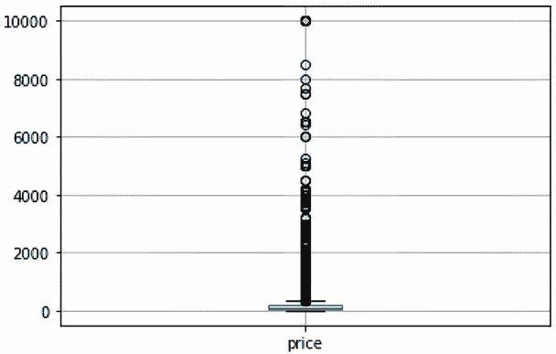
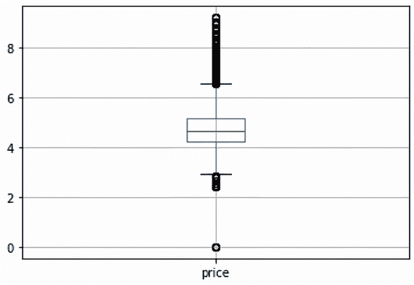
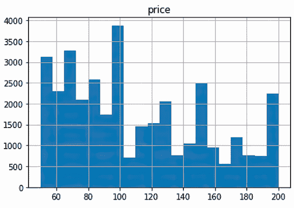
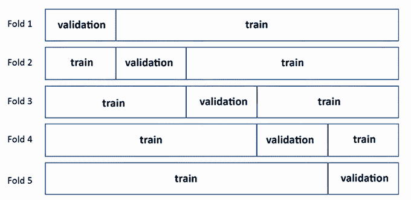
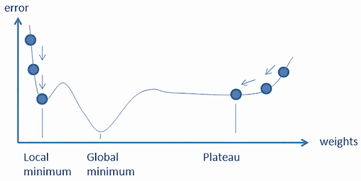

# 第四章：表格数据的经典算法

本章涵盖

+   Scikit-learn 简介

+   探索和处理 Airbnb 纽约市数据集的特征

+   一些经典的机器学习技术

根据问题不同，经典机器学习算法通常是处理表格数据的最实用方法。这些工具和算法背后有着数十年的研究和实践，提供了丰富的解决方案供选择。

在本章中，我们将介绍用于使用表格数据进行预测的经典机器学习中的基本算法。我们专注于线性模型，因为它们仍然是挑战性基线和生产中稳健模型的常见解决方案。此外，讨论线性模型有助于我们构建可以在深度学习架构和更高级的机器学习算法（如梯度提升决策树，这是下一章的主题之一）中找到的概念和思想。

我们还将为您快速介绍 Scikit-learn，这是一个强大且多功能的机器学习库，我们将使用它继续探索 Airbnb 纽约市数据集。我们将避免冗长的数学定义和教科书细节，而是提供示例和实际建议，以将这些模型应用于表格数据问题。

## 4.1 Scikit-learn 简介

Scikit-learn 是一个用于经典机器学习的开源库。它始于 2007 年，是 David Cournapeau 的一个 Google Summer of Code 项目，后来成为 SciKits（Scipy 工具包的简称：[`projects.scipy.org/scikits.html`](https://projects.scipy.org/scikits.html)）的一部分，直到 INRIA（法国国家信息与自动化研究所）及其基金会接管了项目及其开发。我们提供了一个简短的例子，说明 Scikit-learn 如何快速解决大多数机器学习问题。在我们的起始示例中，

1.  我们创建了一个用于分类问题的合成数据集，目标具有二进制平衡标签，一半为正标签，一半为负标签。

1.  我们设置了一个管道，标准化特征并将它们传递给逻辑回归模型，这是分类问题中最简单和最有效的基于统计的机器学习算法之一。

1.  我们使用交叉验证来评估其性能。

1.  最后，在交叉验证结果确保我们处理问题的方法正确后，我们在所有可用数据上训练了一个模型。

列表 4.1 展示了基于合成数据的简单分类问题中 Scikit-learn 提供的完整列表和大多数功能。在创建数据后，我们定义了一个管道，将统计标准化与基本模型、逻辑回归相结合用于分类。所有内容首先被送入一个函数，该函数自动估计其在评估指标（准确率）上的性能以及预测正确的时间。最后，考虑到其评估的性能是合适的，我们使用所有数据重新拟合相同的机器学习算法。

列表 4.1 使用 Scikit-learn 解决分类问题的示例

```py
import numpy as np
from sklearn.datasets import make_classification
from sklearn.preprocessing import StandardScaler
from sklearn.linear_model import LogisticRegression
from sklearn.model_selection import cross_validate
from sklearn.pipeline import Pipeline

X, y = make_classification(n_features=32,
                           n_redundant=0,
                           n_informative=24,
                           random_state=1,
                           n_clusters_per_class=1
                           )                            ①

model = LogisticRegression()                            ②

pipeline = Pipeline(
    [('processing', StandardScaler()),
     ('modeling', model)])                              ③

cv_scores = cross_validate(estimator=pipeline, 
                           X=X, 
                           y=y,
                           scoring="accuracy",
                           cv=5)                        ④

mean_cv = np.mean(cv_scores['test_score'])
std_cv = np.std(cv_scores['test_score'])
print(f"accuracy: {mean_cv:0.3f} ({std_cv:0.3f})")      ⑤

model.fit(X, y) 
```

① 生成具有指定特性的合成数据集

② 创建 LogisticRegression 模型的实例

③ 创建一个管道，按顺序应用标准缩放和逻辑回归模型

④ 使用定义的管道执行五折交叉验证，计算准确率得分

⑤ 打印交叉验证测试准确率得分的平均值和标准差

⑥ 将逻辑回归模型拟合到整个数据集 X 及其对应的标签 y

生成的输出报告了分类中获得的交叉验证准确率：

```py
accuracy 0.900 (0.032)
```

这里关键的不是模型，而是做事的程序，这对于所有表格问题都是标准的，无论你使用的是经典机器学习模型还是前沿的深度学习算法。Scikit-learn 完美地将这样的程序嵌入到其 API 中，从而证明了它是表格数据问题的多才多艺且不可或缺的工具。在接下来的章节中，我们将探讨其特性和工作原理，因为我们将在本书的示例中多次重用其程序。

### 4.1.1 Scikit-learn 包的常见特性

Scikit-learn 包的关键特性是

+   它提供了广泛的分类和回归模型，以及聚类、降维、预处理和模型选择的功能。大多数模型在数据在计算机内存中处理时将在内存中工作，当数据无法适应内存并从磁盘访问时将在内存外工作，从而允许从超出可用计算机内存的数据中学习。

+   在其模型范围内，它提供了一个一致的 API（类方法如`fit`、`partial_fit`、`predict`、`predict_proba`、`transform`），这些 API 可以快速学习和重用，并且专注于模型从数据中学习和预测所必需的转换和处理过程。Scikit-learn 的 API 还提供了自动分离训练数据和测试数据的功能，能够在数据管道中链式使用其元素，并通过检查使用的类的公共属性来访问其参数。

+   最初 Scikit-learn 专注于 NumPy 数组和无序矩阵，后来扩展到了 pandas DataFrame，使得实践者可以将它们作为输入使用。在后续版本中（自 1.1.3 版本起），您可以保留关键 DataFrame 特征，例如列名以及 Scikit-learn 函数和类所进行的转换。Scikit-learn 最近为 pandas DataFrame 提供的支持一直备受期待，确实对于本书的主题——表格数据，是至关重要的。

+   要定义每个 Scikit-learn 类的工作参数，您只需使用标准的 Python 类型和类（字符串、浮点数、列表）。此外，所有此类参数的默认值已经设置为适当的值，以便您可以从一个基线开始创建，并在此基础上进行改进。

+   感谢一群顶尖的贡献者（如 Andreas Mueller、Oliver Grisel、Fabian Pedregosa、Gael Varoquaux 和 Gilles Loupe），Scikit-learn 一直在持续发展中。团队不断进行调试，并会根据算法的稳健性和可扩展性，定期添加新功能和新模型，或淘汰旧模型。

+   该包还提供了广泛且易于访问的文档，其中包含您可以在线咨询的示例（[`scikit-learn.org/stable/user_guide.html`](https://scikit-learn.org/stable/user_guide.html)）或使用`help()`命令离线查看。

根据您的操作系统和安装偏好，如果您想安装 Scikit-learn，只需遵循[`scikit-learn.org/stable/install.html`](https://scikit-learn.org/stable/install.html)上的说明。与 pandas ([`pandas.pydata.org/`](https://pandas.pydata.org/))一起，Scikit-learn 是表格数据分析与建模的核心库。它提供了一系列专门针对结构化数据的机器学习和统计算法；实际上，输入必须是一个 pandas DataFrame、NumPy 数组或无序矩阵。这些算法都得到了良好的建立，因为 Scikit-learn 团队决定根据“自发表以来至少三年、200+引用、广泛使用和实用性”的标准将任何算法包含在包中。有关 Scikit-learn 中算法包含要求的更多详细信息，请参阅[`mng.bz/8OMw`](https://mng.bz/8OMw)。

### 4.1.2 常见 Scikit-learn 接口

Scikit-learn 的另一个关键特性是它非常适合表格数据问题，那就是它当前的估计器 API，即*fit, predict/transform*接口。这样的估计器 API 不仅限于 Scikit-learn，而且被广泛认为是处理训练和测试数据最有效的方法。许多其他项目都采用了它（见[`mng.bz/EaWO`](https://mng.bz/EaWO)）。实际上，遵循 Scikit-learn API，你自动将数据科学项目中所有最佳实践融入其中。特别是，你严格区分训练数据、验证数据和测试数据，这是任何表格数据建模成功不可或缺的一步，我们将在下一节通过重新介绍 Airbnb NYC 数据集来展示这一点。

在深入探讨更多实际例子之前，我们提供一些关于 Scikit-learn 估计器的基础知识。首先，我们在 Scikit-learn 中区分四种类型的对象，每种对象都有不同的接口。一个类可以同时实现多个对象。估计器只是其中之一，尽管它们是最重要的，因为 Scikit-learn 的大多数类都是估计器。在下面的例子中，我们定义了一个机器学习估计器，即使用 Scikit-learn 提供的 LogisticRegression 类进行分类的逻辑回归（将在本章稍后讨论）：

```py
from sklearn.linear_model import LogisticRegression
model = LogisticRegression(C=1.0)
```

*估计器*是一个对象，它通过`.fit`方法从数据中学习。它可以应用于监督学习，将数据与目标相关联，或者应用于仅涉及数据的无监督学习：

+   对于监督学习：`estimator` = `estimator.fit(data, targets)`

+   对于无监督学习：`estimator` = `estimator.fit(data)`

在内部，估计器使用数据来估计一些参数，这些参数用于后续将数据映射回预测或转换它。在过程中收集的参数和其他信息作为对象属性提供。

Scikit-learn 的其他典型对象包括以下内容：

+   *转换器*是一个对象，它专注于对数据进行转换：

```py
transformed_data = transformer.transform(data)
```

+   *预测器*是一个对象，它通过`.predict`方法（预测一般结果）和`.predict_proba`方法（预测概率）来映射给定数据的一些预测响应：

```py
prediction = predictor.predict(data) 
probability = predictor.predict_proba(data)
```

+   *模型*是一个对象，它通过`.score`方法提供一些数据的拟合优度，这在许多统计方法中很典型：

```py
score = model.score(data)
```

无论你需要估计器还是转换器，每个类都是通过将其分配给一个变量并指定其参数来实例化的。

在幕后，所有这些类都存储着它们任务的参数。一些参数直接从数据中学习，通常被称为模型的权重或参数。你可以将这些视为数学公式中的系数：由数据和计算确定的未知值。其他的是用户在实例化时提供的，可以是配置或初始化设置，或者影响算法如何从数据中学习的参数。我们通常将后者称为*超参数*。它们往往根据机器学习模型的不同而有所不同；因此，当解释每个算法时，我们将讨论最重要的那些。

所有算法的配置和设置参数都是相似的。例如，`random_state`设置有助于定义一个随机种子，以便在用相同的数据使用模型时复制模型的确切行为。由于设置了随机种子，结果在不同的运行中不会改变。配置参数`n_jobs`将允许你设置在计算中想要使用的 CPU 处理器数量，从而加快模型完成工作所需的时间，但同时也防止你同时进行其他计算机操作。根据算法的不同，其他可用的类似设置可能定义模型使用的容限或内存缓存。

正如我们提到的，这些超参数中的一些影响模型的操作方式，而另一些则影响模型从数据中学习的方式。让我们回顾一下我们之前的例子：

```py
from sklearn.linear_model import LogisticRegression
model = LogisticRegression(C=1.0)
```

在影响模型从数据中学习过程的超参数中，在我们的例子中，我们可以引用 C 参数，该参数通过取不同的值，指导机器学习算法在从数据中提炼模式时应用一些约束。当我们介绍每个机器学习算法时，我们将解决每个算法需要固定的所有参数。重要的是要注意，你通常在实例化类的时候设置超参数。

在类实例化之后，你通常提供用于学习的数据以及一些关于如何处理它的有限指令——例如，通过给每个数据实例赋予不同的权重。在这个阶段，我们说你在数据上训练或调整类的参数。这个阶段通常被称为“调整估计器”，是通过将数据作为 NumPy 数组、稀疏矩阵或 pandas DataFrame 传递给`.fit`方法来完成的：

```py
X = [[-1, -1], [-2, -1], [1, 1], [2, 1]]
y = [1, 1, 0, 0]
model.fit(X, y)
```

由于训练模型需要将答案映射到某些数据上，`.fit`方法需要输入数据矩阵和答案向量。这种行为对于模型来说是典型的，因为 Scikit-learn 中的某些其他类也会输入数据。`.fit`方法在 Scikit-learn 中的所有转换类中也很常见。例如，仅对数据进行拟合是所有处理预处理的类的典型做法，正如你可以在[`mng.bz/N161`](https://mng.bz/N161)中检查的那样，因为转换也需要从特征中学习一些信息。例如，如果你需要标准化数据，你必须首先学习数据中每个数值特征的均值和标准差。Scikit-learn 的 StandardScaler([`mng.bz/DMgw`](https://mng.bz/DMgw))正是这样做的：

```py
from sklearn.preprocessing import StandardScaler
processing = StandardScaler().fit(X)
```

在我们的例子中，我们实例化了用于标准化数据的类（StandardScaler），然后立即拟合数据本身。由于`.fit`方法返回用于拟合过程的实例化类，你可以通过结合这两个步骤安全地获取包含所有学习参数的类。这种做法在构建数据管道和训练模型时非常有用，因为它帮助你将学习数据中的某些活动与将所学内容应用于新数据的行为分开。这样，你就不会混淆训练、验证或测试数据中的信息。

根据底层操作的复杂性和提供的数据量，拟合模型或处理数据的函数可能需要一些时间。拟合完成后，将会有更多属性可供你使用，具体取决于你使用的算法。

对于一个训练好的模型，你可以通过应用`.predict`方法，基于任何新数据获得预测的响应向量。这既适用于分类问题，也适用于回归问题：

```py
X_test = [[-1, 1], [2, -1]]
model.predict(X_test)
```

假设你正在处理一个分类任务；相反，你必须获取一个特定类别对新样本进行正确预测的概率。在这种情况下，你需要使用`.predict_proba`方法，这个方法仅适用于某些模型：

```py
model.predict_proba(X_test)
```

处理数据的类没有`.predict`方法。然而，它们使用`.transform`方法，如果该类已经通过一些训练数据实例化和拟合以学习转换所需的关键参数，它将返回转换后的数据：

```py
processing.transform(X)
```

由于转换通常应用于提供关键参数的相同数据，`.fit_transform`方法，它结合了拟合和转换两个阶段，将导致一个方便的快捷方式：

```py
processing.fit_transform(X)
```

### 4.1.3 Scikit-learn 管道简介

你还可以使用 Scikit-learn 提供的实用函数，如将一系列转换和预测包装起来，选择性决定要转换的内容，并通过这些函数将不同的转换序列连接起来：

+   *管道* ([`mng.bz/lYx8`](https://mng.bz/lYx8))

+   *ColumnTransformer* ([`mng.bz/BXM8`](https://mng.bz/BXM8))

+   *FeatureUnion* ([`mng.bz/dX2O`](https://mng.bz/dX2O))

Pipeline 命令允许你创建一系列 Scikit-learn 类，这些类将导致数据的一系列转换，并且最终可以结束于一个模型及其预测。通过这种方式，你可以将任何模型与其所需的数据转换集成在一起，并一次性处理所有相关参数——转换的参数和模型本身的参数。Pipeline 命令是 Scikit-learn 包中将表格数据从源头移动到预测的核心命令。在实例化时设置它，你只需要提供一个包含步骤名称和要执行的 Scikit-learn 类或模型的元组的列表。一旦实例化，你可以按照 Scikit-learn 的常见 API 规范（fit，transform/predict）使用它。管道将按顺序执行所有预定义的步骤，返回最终结果。当然，你可以访问、检查和调整管道序列的单个步骤以获得更好的结果和性能，但你也可以将管道作为一个单独的宏命令来处理。

然而，表格列可能具有不同的类型，需要相当不同的转换序列，或者你可能已经设计了两种不同的数据处理方式，你希望将它们结合起来。ColumnTransformer 和 FeatureUnion 是 Scikit-learn 命令，可以帮助你在这种情况下。ColumnTransformer 允许你仅对某些列（你可以通过它们的名称或列序列中的位置索引来定义）应用特定的转换或转换序列。该命令接受一个元组的列表，就像 Pipeline 命令一样，但它需要一个转换的名称，一个执行它的 Scikit-learn 类，以及一个要应用转换的列名称或索引列表。由于它只是一个转换命令，其理想的使用方式是在管道内部，其中其转换可以是模型数据输入的一部分。FeatureUnion，相反，只是将两个不同管道的结果连接起来的简单方法。你可以使用简单的 NumPy 命令，如 `np.hstack` ([`mng.bz/rKJD`](https://mng.bz/rKJD)) 来实现相同的结果。然而，当使用 FeatureUnion 时，你有优势，即该命令可以适应 Scikit-learn 管道，因此可以自动作为模型数据输入的一部分使用。

Scikit-learn 及其 Pipeline、ColumnTransformer 和 FeatureUnion 提供的操作模块化和 API 一致性将允许您轻松创建复杂的数据转换，将其作为一个单独的命令处理，从而使您的代码高度可读、紧凑且易于维护。在下一节中，我们将回到我们使用的 Airbnb 纽约市数据集。我们将创建一系列 Scikit-learn 中的转换序列，以展示 Scikit-learn 及其管道函数是如何正确处理您的表格数据问题的。我们还将指出，通过一个定义良好的管道，您如何轻松地在表格数据的机器学习不同选项之间切换。

## 4.2 探索和处理 Airbnb 纽约市数据集的特征

之前介绍的 Airbnb 纽约市数据集是演示目的的一个完美例子，因为它是一个代表现实世界问题的数据集，并且由于其各种类型的列。我们将不得不创建和组合不同的管道来处理不同的特征，接下来的章节将给我们一个机会来展示比本章中可以找到的更高级的处理技术。

目前，我们将我们将要处理的特征放入一个名为`excluding_list`的列表中。它们是需要特殊处理的特征，例如纬度和经度度数或最后评论的日期（`last_review`）。此外，数据集还展示了一些可能作为目标的列：价格、列出物业的可用性（`availability_365`）和评论数量（`number_of_reviews`）。就我们的目的而言，我们更倾向于使用价格。因为它是一个大于零的连续值集合，我们可以立即将其用作回归目标。此外，通过在平均值或中位数上进行拆分，或将值分箱到十分位，我们可以快速将价格变量转换为二元或多类分类目标。除了价格之外，我们使用所有其他特征作为预测特征或进行更高级的特征工程。

在以下子节中，我们将展示一种逐步探索数据集的方法，基于有用的列过滤数据集，并设置我们的目标变量。原则上，我们将遵循第二章中讨论*探索性数据分析*（EDA）时提供的提示和示例。在下一节中，我们将利用我们的发现，准备合适的数据管道，这些管道将在以下段落中修订表格数据的机器学习不同选项时被重用。

### 4.2.1 数据集探索

在探索数据集的第一步中，我们导入相关的包（NumPy 和 pandas），定义要排除的特征列表，以及基于我们在上一章中建立的知识，为分类和连续特征定义单独的列表，并从当前工作目录加载数据。要执行的代码是

```py
import numpy as np
import pandas as pd
excluding_list = ['price', 'id', 'latitude', 
                  'longitude', 'host_id', 
                  'last_review', 'name', 
                  'host_name']                       ①
categorical = ['neighbourhood_group',
               'neighbourhood',
               'room_type']                          ②
continuous = ['minimum_nights',
              'number_of_reviews',
              'reviews_per_month',
              'Calculated_host_listings_count']      ③
data = pd.read_csv("./AB_NYC_2019.csv")
```

① 列出要排除在分析之外的列名

② 列出数据集中可能代表分类变量的列名

③ 列出数据集中代表连续数值变量的列名

一旦代码片段完成数据的加载，我们首先检查数据框中返回了多少行和列：

```py
data.shape
```

我们将获得 48,895 行可用——对于一个表格问题来说是一个合理的数量，允许我们使用任何可用的学习算法——以及 16 列。由于我们只对一些列感兴趣——那些我们在名为分类和连续变量的变量中定义的列——我们首先根据它们具有的唯一值数量对分类特征进行低基数和高基数的分类：

```py
data[categorical].nunique()
```

命令产生了以下输出：

```py
neighbourhood_group      5
neighbourhood          221
room_type                3
```

我们处理分类特征的标准方法是对其应用**独热编码**，为原始特征中的每个唯一值创建一个二进制变量。然而，使用独热编码，具有超过 20 个唯一值的特征会导致数据集中列数过多和数据稀疏。当你的数据主要是零值时，你就有数据稀疏的问题，这是一个问题，特别是对于神经网络和通常对于在线算法来说，因为学习变得更加困难。在第六章中，我们将介绍处理具有过多唯一值特征的技术，这些特征被称为**高基数分类特征**。对于本章的示例，我们将区分低基数和高基数分类特征，并仅处理低基数特征：

```py
low_card_categorical = ['neighbourhood_group', 'room_type']
high_card_categorical = ['neighbourhood']
```

接下来，在定义了这一点（目前，我们将只使用数值和低基数分类特征）之后，我们需要弄清楚我们的数据中是否存在任何缺失情况。以下命令要求标记真实缺失值，然后计算它们在特征中的数量：

```py
data[low_card_categorical + continuous].isna().sum()
```

我们得到了以下结果，指出只有`reviews_per_month`特征存在问题：

```py
neighbourhood_group                   0
room_type                             0
minimum_nights                        0
number_of_reviews                     0
reviews_per_month                 10052
calculated_host_listings_count        0
availability_365                      0
```

正如我们在第二章中提到的，处理缺失值不应该是一个自动化的过程；相反，它需要数据科学家对数据进行一些反思，以确定是否存在某些原因导致它们缺失。在这种情况下，很明显，数据源存在处理问题，因为如果你检查最小值，这将导致一个大于零的值：

```py
data.reviews_per_month.min()
```

报告的最小值是 0.01。在这里，当没有足够的评论来制作统计数据时，我们会遇到一个缺失值。因此，我们可以用零值来替换这个特征的缺失值。在过滤了用于预测的特征并检查了缺失值之后，因为大多数机器学习算法在存在缺失输入数据的情况下无法工作，除了少数如梯度提升实现 XGBoost 或 LightGBM（将在下一章讨论）之外，我们可以继续检查我们的目标。EDA 的这一部分，即*目标分析*，通常被忽视，但它是相当重要的，因为在表格问题中，并非所有机器学习算法都能处理相同类型的目标。例如，具有许多零值、厚尾和多个众数的目标对于某些模型来说很难处理，并导致你的模型欠拟合。让我们先检查价格特征的分布。直方图，即绘制值落在值范围（称为箱）中的频率，对于了解你的数据如何分布特别有帮助。例如，直方图可以告诉你你的数据是否类似于已知的分布，如正态分布，或者突出显示在哪些值附近有峰值以及数据在哪里更密集（见图 4.1）。如果你使用的是 pandas DataFrame，可以通过调用`hist`方法来绘制直方图，该方法通过绘制值落在值范围（箱）中的频率来描述数据分布：

```py
data[["price"]].hist(bins=10)
```


图 4.1 描述价格特征分布的直方图

图 4.1 中显示的分布极度向右倾斜，因为有许多异常值，因为绘制的值范围达到 10,000。然而，在 2,000 之前，很难区分任何表示频率的条形。通过绘制箱线图，这一点变得更加明显，箱线图是当一个人想要可视化一个变量的分布的核心部分所在位置时非常有用的工具。一个变量的*箱线图*是一个图表，其中分布的关键测量值被描绘为一个带有“胡须”的箱：两条延伸到变量分布预期极限之外的线条。箱由四分位数范围（IQR）界定，由第 25 和第 75 百分位数确定，并由中位数线分为两部分。胡须向上向下延伸到 IQR 的 1.5 倍。胡须边缘之上或之下的一切都被认为是*异常值*：一个不寻常或意外的值。让我们再次使用 pandas DataFrame 中内置的方法，即箱线图方法，绘制价格变量的箱线图（见图 4.2）：

```py
data[["price"]].boxplot()
```



图 4.2 一个箱线图，突出了价格特征的分布及其在大价格值上的右重尾

毫不奇怪，箱线和须线在图表的下半部分被挤压，几乎无法区分。箱线图上部的上限处延伸出一个长队列的异常值。这是一个明显的右偏分布案例。在这种情况下，一个标准的解决方案是使用对数变换来转换目标变量。通常的做法是添加一个常数以将值偏移到正数域，以处理零和以下的值。在我们的案例中，这是不必要的，因为所有值都是正数且大于零。在下面的代码片段中，我们通过应用对数变换来表示变换后的价格特征（参见图 4.3 和图 4.4）：

```py
np.log1p(data["price"]).hist(bins=20)
data[["price"]].apply(lambda x: np.log1p(x)).boxplot()
```


图 4.3 对数变换后的价格特征的直方图，显示出更加对称



图 4.4 对数变换后的价格特征的箱线图，显示出分布两端的极端值持续存在

现在，分布，由新的直方图和箱线图表示，更加对称，尽管很明显分布两侧都有异常观测值。由于我们的目标是说明性的，我们可以忽略原始分布，而专注于有意义的目标表示。例如，我们可以只保留低于 1,000 的价格值（参见图 4.5）。在下面的代码片段中，我们生成一个仅关注低于 1,000 的价格值的直方图：

```py
data[["price"]][data.price <= 1000].hist(bins=20)
```


图 4.5 对于低于 1,000 的价格特征的直方图，仍然显示出右偏的长尾

这里表示的分布仍然是右偏的，但它更类似于在电子商务或其他长尾产品销售中常见的分布。此外，如果我们关注 50 到 200 的范围，分布将看起来更加均匀（参见图 4.6）。在下面的代码片段中，我们进一步将焦点仅限于 50 到 200 之间的价格，并绘制相应的直方图：

```py
data[["price"]][(data.price >= 50) & (data.price <= 200)].hist(bins=20)
```



图 4.6 对于 50 到 200 之间的价格特征的直方图，显示出在整个范围内的分布值

因此，我们可以创建两个由布尔值组成的掩码变量，这可以帮助我们根据我们想要测试的算法类型来过滤目标。`price_capped`变量在演示某些机器学习算法如何轻松处理长尾时将非常有用：

```py
price_capped = data.price <= 1000
price_window = (data.price >= 50) & (data.price <= 200)
```

图 4.7 显示了相对于上限价格箱线图，呈现右侧异常值，但至少箱线图是可见的。


图 4.7 对于低于 1,000 的价格特征的箱线图，其右尾显示出极端值的长尾

图 4.8 显示了相对于窗口价格箱线图，没有显示出异常值：

```py
data[["price"]][price_window].boxplot()
```


图 4.8 展示了价格特征的箱线图，对于 50 到 200 之间的值，显示出略微右偏的分布，没有极端值

在完成我们对预测因子和目标以及一些基本特征选择的探索之后，我们准备四个不同的目标，这些目标将与我们的一些示例一起使用：

```py
target_mean = (data["price"] > data["price"].mean()).astype(int)
target_median = (data["price"] > data["price"].median()).astype(int)
target_multiclass = pd.qcut(data["price"], q=5, labels=False)
target_regression = data["price"]
```

我们准备了两个二元目标，`target_mean` 和 `target_median`，以及一个基于百分位数的多类目标，有五个不同的类别，用于分类目的。

特别是，重要的是要注意我们的 `target_median` 是一个二元平衡目标。因此，我们可以安全地使用准确率作为良好的性能度量。作为测试，如果你尝试计数值，你会得到正负类别的案例几乎相等：

```py
target_median.value_counts()
```

你会得到结果

```py
0    24472
1    24423
```

相反，如果你尝试在 `target_mean` 目标变量上做同样的事情，你会得到

```py
target_mean.value_counts()
```

你将获得一个不平衡的分布，倾向于负案例；也就是说，由于我们之前观察到的偏斜分布，均值以下的案例更多：

```py
0    34016
1    14879
```

在这种情况下，当评估机器学习分类器的结果时，我们更倾向于使用如接收者操作特征曲线下面积（ROC-AUC）或平均精度等指标——两者都非常适合排序。最后，对于多类目标，计算五个类别中的每一个案例的数量显示，它们的分布也是平衡的：

```py
target_multiclass.value_counts()
```

此命令返回以下结果

```py
0    10063
1     9835
2     9804
3    10809
4     8384
```

对于回归目标，`target_regression` 是未经变换的原始目标。然而，我们将使用它的子集，并根据我们将要展示的机器学习算法相应地进行变换。

在完成我们对数据、目标和下一段中的一些基本特征选择的探索之后，我们将使用积木方法准备几个管道，以伴随我们对表格数据问题不同机器学习选项的发现。

### 4.2.2 管道准备

我们将使用之前看到的 Scikit-learn 中的 Pipeline 和 ColumnTransformer 类来准备管道。在积木方法中，我们首先创建应用于其他数据类型的不同操作，这些数据类型表征了表格数据集中的特征。

以下代码定义了三个核心过程，这些过程将在本章中多次重复使用：

+   *分类独热编码*——分类特征被转换为二进制形式。如果一个值之前从未见过，它将被忽略。

+   *数值直接通过*——使用零作为值来填充数值特征。

+   *数值标准化*——在填充缺失值后，数值特征通过减去它们的平均值并除以它们的标准差进行缩放

定义这些过程的代码如下所示。

列表 4.2 设置表格学习管道的积木

```py
from sklearn.pipeline import Pipeline
from sklearn.compose import ColumnTransformer
from sklearn.preprocessing import OneHotEncoder
from sklearn.preprocessing import OrdinalEncoder
from sklearn.impute import SimpleImputer
from sklearn.preprocessing import StandardScaler

categorical_onehot_encoding = OneHotEncoder(
       handle_unknown='ignore')                       ①
numeric_passthrough = SimpleImputer(
       strategy="constant", fill_value=0)             ②
numeric_standardization = Pipeline([
       ("imputation", SimpleImputer(strategy="constant", fill_value=0)),
       ("standardizing", StandardScaler())
       ])                                             ③
```

① 将分类特征转换为独热编码格式

② 用零替换缺失的数值

③ 管道用零替换缺失的数值并标准化特征

在这个阶段，我们可以根据每个机器学习算法的需求，编写特定的转换管道来处理数据。例如，在这个例子中，我们设置了一个管道，该管道将低类别特征进行独热编码，并将数值特征的缺失值简单地填充为零。这样的管道是通过 ColumnTransformer 函数创建的，这是一个粘合函数，它同时结合了对不同特征集应用的操作。这是一种非常适合大多数机器学习模型的优秀转换策略：

```py
column_transform = ColumnTransformer(
                [('categories', 
                  categorical_onehot_encoding, 
                  low_card_categorical),              ①
                 ('numeric', 
                  numeric_passthrough, 
                  continuous),                        ②
                ],
    remainder='drop',                                 ③
    verbose_feature_names_out=False,                  ④
    sparse_threshold=0.0                              ⑤
)
```

① 管道的第一步：独热编码类别特征

② 管道的第二步：处理数值特征

③ 管道未处理的特征将从结果中删除。

④ 特征的名称保持与原始名称相同。

⑤ 结果始终是一个密集矩阵（即 NumPy 数组）

我们可以立即运行此代码片段并检查该管道如何转换我们的 Airbnb NYC 数据：

```py
X = column_transform.fit_transform(data)
print(type(X), X.dtype, X.shape)
```

结果是输出现在是一个由浮点数组成的 NumPy 数组，其形状增加到 13 列。实际上，由于独热编码，类别特征中的每个值都变成了一个单独的特征：

```py
<class 'numpy.ndarray'> float64 (48895, 13)
```

下一节将探讨表格数据的主要机器学习技术。每个技术都将伴随其列转换类，这些类将被集成到包含模型的管道中。

## 4.3 经典机器学习

为了解释经典机器学习技术对于表格数据的差异，我们首先将介绍算法的核心特性，然后通过一个代码片段展示其工作，在参考的表格问题上，即 Airbnb NYC 数据集上运行。以下是我们将在示例中使用的一些最佳实践，以允许不同方法的可重复性和可比性：

+   我们定义了一个包含数据转换和建模的管道。

+   我们设置一个错误度量，例如回归的均方根误差（RMSE）或分类的准确度，并使用相同的交叉验证策略进行测量。

+   我们报告交叉验证估计误差的平均值和标准差——这对于确定模型在不同数据样本上是否具有恒定的性能至关重要。

在上一节中，我们介绍了 Scikit-learn 提供的不同工具，用于构建集成特征处理和机器学习模型的管道。在本节中，我们将介绍推荐的评估指标以及 Scikit-learn `cross_validate`命令如何进行交叉验证估计。

让我们先回顾一下*评估指标*。我们决定使用 RMSE，这是回归任务中常用的一个度量，以及准确率，这是当类别具有大致相同的样本大小时，平衡二元和多类分类问题的另一个标准度量。在随后的章节中，我们还将使用适合不平衡分类问题的度量，例如 ROC-AUC 和平均精度。

*交叉验证*是数据科学中当您打算估计机器学习模型在除训练数据外，从相同数据分布中抽取的任何数据上的预期性能时的实际标准。需要注意的是，交叉验证基于这样的想法，即您的数据可能会在未来发生变化，但不会发生根本性的变化，来估计您模型未来的性能。为了正确工作，模型期望您未来将使用相同的特征，并且它们将具有相同的唯一值（如果是一个分类特征），具有相似的分布（对于分类和数值特征），最重要的是，特征将与您的目标变量保持相同的关系。

假设数据分布在未来将保持一致这一假设通常并不成立，因为在现实世界中，经济动态、消费者市场以及社会和政治情况变化非常快。在现实世界中，您的模型可能会遇到概念漂移，即特征与目标之间的建模关系不再代表现实。因此，当处理新数据时，您的模型将表现不佳。交叉验证是评估模型在创建时的最佳工具，因为它基于您当时可用的信息，并且因为，如果设计得当，它不会受到您的机器学习模型过度拟合训练数据的能力的影响。即使与未来的性能相比，交叉验证的结果被证明是错误的，其有用性仍然成立，通常是因为潜在的数据分布已经发生变化。此外，如留一法或自助法等替代方法，随着计算成本的提高，提供了更好的估计，而如训练/测试集分割等更直接的方法在估计上则不太可靠。

在其最简单的形式中，*k 折交叉验证*（在 Scikit-learn 中通过 KFold 函数实现：[`mng.bz/VVM0`](https://mng.bz/VVM0)）基于将你的可用训练数据分成 k 个分区，并构建 k 个版本的你的模型，每次由不同的 k-1 个分区提供数据，然后在剩下的一个未使用的分区上进行测试（样本外性能）。k 个分数的平均值和标准差将提供一个估计及其不确定性水平的量化，用作对未来未见数据的预期性能的模型估计。图 4.9 展示了当 k 设置为 5 时的 k 折验证：每一行代表每个折叠中的数据分区。一个折叠的验证部分总是与其他的不同，而训练部分总是不同地组成。



图 4.9 五折交叉验证策略中数据在训练和验证之间的分布

设置 k 的正确值取决于你有多少可用训练数据，在它上训练模型需要多少计算成本，你收到的样本是否捕捉到了你想要建模的数据分布的所有可能变化，以及你打算为什么目的获取性能估计。作为一个一般性的经验法则，k 的值如 5 或 10 是最佳选择，其中 k = 10 更适合精确的性能评估，而 k = 5 是一个在模型、特征和超参数评估等活动中的精度和计算成本之间取得良好平衡的好值（因此它将用于我们的示例）。

为了对你的模型进行一般性能估计，你可以通过在 KFold 函数（或其变体，提供样本分层或对时间维度的控制：[`mng.bz/xKne`](https://mng.bz/xKne)）上进行一系列迭代来构建必要的交叉验证迭代，或者依赖 `cross_validate` 过程（[`mng.bz/AQyK`](https://mng.bz/AQyK)），它会为你处理所有事情并只返回结果。对于测试不同算法的目的，`cross_validate` 非常方便，因为，给定适当的参数，它将生成一系列指标：

+   交叉验证测试分数（样本外性能）

+   交叉验证训练分数（样本内性能）

+   适应时间和预测时间（用于评估计算成本）

+   不同交叉验证折叠上的训练估计器

我们需要做的就是提供一个估计器，它可以是一个具有 fit 方法的 Scikit-learn 对象，包括预测器和目标，交叉验证策略，以及列表中的单个或多个评分函数。这个估计器应以可调用的形式提供，使用`make_scorer`命令创建（[`mng.bz/ZlAO`](https://mng.bz/ZlAO)）。在下一节中，我们将开始看到如何使用这些输入获取交叉验证的性能估计，从经典的机器学习算法如线性回归和逻辑回归开始。

### 4.3.1 线性回归和逻辑回归

在线性回归中，这是一种统计方法，通过拟合线性方程到观测数据来模拟因变量与一个或多个自变量之间的关系。你首先需要将所有特征转换为数值型，并将它们放入一个矩阵中，包括独热编码的类别特征。算法的目标是在列向量（系数）中找到最优的权重值，这样当乘以特征矩阵时，可以得到一个结果向量，最好地近似你的目标（预测）。换句话说，算法试图最小化目标与通过乘以权重向量得到的预测之间的残差平方和。在这个过程中，你可以考虑使用预测基线（所谓的截距或偏差）或对权重值施加约束，使它们只能是正数。

由于线性回归算法只是一个加权求和，你必须注意三个关键方面：

+   确保没有缺失值，因为除非你将它们填充为某个值，否则它们不能用于乘法或加法运算。

+   确保你已经处理了异常值，因为它们会影响算法在训练和预测中的工作。

+   验证特征和目标尽可能线性相关（即，它们有良好的皮尔逊相关系数）：与目标弱相关的特征往往会给模型增加噪声，并且它们往往会使其欠拟合，甚至在数量多时，甚至过拟合。

由于加权特征的求和给出了预测，因此很容易确定对预测输出影响最大的因素以及每个特征如何对其做出贡献。观察每个特征的系数可以让你了解算法的行为。这种理解在你必须向监管机构或利益相关者解释模型如何工作时非常有价值，以及当你想从假设或领域专家知识的角度检查预测是否合理时。

然而，回归模型在幕后如何工作的简单方式也存在隐藏的陷阱。当数据中的两个或多个特征高度相关时，这在统计学上被称为“多重共线性”，回归模型中的解释可能会变得非常复杂，即使这两个特征都有效地对预测做出了贡献。通常，只有一个许多中的显著系数，而其他则取很小的值，好像它们与目标无关。实际上，情况往往相反，理解特征在回归预测中的作用相对容易，这可能导致重要的概念误解。

线性回归算法的另一个巨大优势是，由于它只是些乘法和加法，因此在任何软件平台上实现它都非常容易，甚至可以通过在脚本中手动编码来实现。其他机器学习算法更复杂，因此比线性回归更复杂的算法从头开始实现可能会容易出错和出现 bug。然而，尽管手动编码任何机器学习模型对于交付项目来说是不切实际的，但我们必须指出，手动编码任何机器学习模型可以是一种宝贵的学习经历，让你更深入地理解算法的内部工作原理，并使你更有能力在未来解决和优化类似模型的性能。我们在第五章中展示了某些算法的一些可管理的从头开始实现，以供学习之用。

我们将从一个线性回归模型的例子开始，该模型从头到尾应用于我们的 Airbnb 纽约市数据。这个例子遵循图 4.10 中提出的方案，这个方案我们将为每个经典机器学习算法进行复制，它基于 Scikit-learn 的管道和交叉验证评估函数。


图 4.10 经典机器学习算法示例组织方案

该方案相当线性。来自逗号分隔值文件的输入首先通过 ColumnTransformer，这是数据准备部分，它根据列名对数据进行转换、丢弃数据或让它原样通过，然后是一个机器学习模型。这两个部分都被一个由`cross_validate`函数测试的管道所包裹，该函数执行交叉验证并记录计算时间、训练模型和一定数量的折叠上的性能。最后，选择结果来展示模型是如何工作的。此外，我们可以通过管道访问模型系数和权重，以获得更多关于我们测试的算法功能的见解。

应用此架构，我们只需在列表 4.3 中使用纯线性回归模型，因为此算法通常不需要指定任何参数。对于与模型可解释性相关的特殊应用，你可以指定 `fit_intercept` 为 false 以从模型中移除截距并仅从特征中得出所有预测，或者将正参数设置为 true 以仅获得正系数。

列表 4.3 线性回归

```py
from sklearn.linear_model import LinearRegression
from sklearn.metrics import make_scorer, mean_squared_error
from sklearn.model_selection import KFold
from sklearn.model_selection import cross_validate

column_transform = ColumnTransformer(
    [('categories', categorical_onehot_encoding, low_card_categorical),
     ('numeric', numeric_passthrough, continuous)],
    remainder='drop',
    verbose_feature_names_out=False,
    sparse_threshold=0.0)                                   ①

model = LinearRegression()                                  ②

model_pipeline = Pipeline(
    [('processing', column_transform),
     ('modeling', model)]                                   ③
)

cv = KFold(5, shuffle=True, random_state=0)                 ④
rmse =  make_scorer(mean_squared_error, 
                    squared=False)                          ⑤

cv_scores = cross_validate(estimator=model_pipeline, 
                           X=data[price_window], 
                           y=target_regression[price_window],
                           scoring=rmse,
                           cv=cv, 
                           return_train_score=True,
                           return_estimator=True)           ⑥

mean_cv = np.mean(cv_scores['test_score'])
std_cv = np.std(cv_scores['test_score'])
fit_time = np.mean(cv_scores['fit_time'])
score_time = np.mean(cv_scores['score_time'])
print(f"{mean_cv:0.3f} ({std_cv:0.3f})", 
      f"fit: {fit_time:0.2f}", 
      f"secs pred: {score_time:0.2f} secs")                 ⑦
```

① ColumnTransformer，将数据转换为数值特征并填充缺失数据

② 纯线性回归模型

③ 组装 ColumnTransformer 和模型的管道

④ 基于 5 折交叉验证和随机抽样的交叉验证策略

⑤ 从均方误差派生的评估指标函数

⑥ 自动交叉验证过程

⑦ 以评估指标、标准差、拟合度和预测时间为单位报告结果

运行列出的代码将产生以下 RMSE 结果：

```py
33.949 (0.274) fit: 0.06 secs pred: 0.01 secs
```

这是一个很好的结果，在极短的时间内获得（使用标准的 Google Colab 实例或 Kaggle 笔记本），可以作为更复杂尝试的基准。例如，如果你尝试运行列表 4.4 中的代码，你会意识到你可以通过更少但准确准备的特征获得类似的结果。这被称为 *特征工程*，做这件事的有趣之处在于你可以获得更好的结果，或者用更少的特征获得相同的结果，这些特征对领域或商业专家来说更有意义。例如，我们在代码列表中通过生成与特定值相关的二进制特征、组合特征和使用对数函数转换它们来创建各种新的特征。

列表 4.4 线性回归的定制数据准备

```py
data_2 = data[[]].copy()                                            ①
data_2['neighbourhood_group_Manhattan'] = ( 
   (data['neighbourhood_group']=='Manhattan')
   .astype(int))                                                    ②
data_2['neighbourhood_group_Queens'] = (

(data['neighbourhood_group']=='Queens').astype(int))                ③
data_2['room_type_Entire home/apt'] = (
                           (data['room_type']=='Entire 
home/apt').astype(int))                                             ④
data_2['minimum_nights_log'] = np.log1p(
                        data["minimum_nights"])                     ⑤
data_2['number_of_reviews_log'] = np.log1p(
                        data["number_of_reviews"])                  ⑥
label1 = 'neighbourhood_group_Manhattan*room_type_Entire home/apt'
data_2[label1] = (
   data_2['neighbourhood_group_Manhattan'] *
   data_2['room_type_Entire home/apt'])                             ⑦
label2 = 'availability_365*neighbourhood_group_Manhattan'
data_2[label2] = (data['availability_365'] *
   data_2['neighbourhood_group_Manhattan'])                         ⑧
label3 = 'availability_365*room_type_Entire home/apt'
data_2[label3] = (data['availability_365'] *
   data_2['room_type_Entire home/apt'])                             ⑨

rmse = make_scorer(mean_squared_error, squared=False)
cv = KFold(5, shuffle=True, random_state=0)

cv_scores = cross_validate(estimator=LinearRegression(), 
                           X=data_2[price_window], 
                           y=target_regression[price_window],
                           scoring=rmse,
                           cv=cv, 
                           return_train_score=True,
                           return_estimator=True)

mean_cv = np.mean(cv_scores['test_score'])
std_cv = np.std(cv_scores['test_score'])
print(f"{mean_cv:0.5f}, {std_cv:0.5f}")
```

① 创建一个空的 DataFrame

② 一个二进制列，指示 'neighbourhood_group' 是否为 'Manhattan'

③ 一个二进制列，指示 'neighbourhood_group' 是否为 'Queens'

④ 一个二进制列，指示 'room_type' 是否为 'Entire home/apt'

⑤ 包含 'minimum_nights' 列中值自然对数加 1 的列

⑥ 包含 'number_of_reviews' 列中值自然对数加 1 的列

⑦ 二进制 'neighbourhood_group_Manhattan' 和 'room_type_Entire home/apt' 列的乘积

⑧ 'availability_365' 与二进制 'neighbourhood_group_Manhattan' 列的乘积

⑨ 'availability_365' 与二进制 'room_type_Entire home/apt' 列的乘积

结果 RMSE 为

```py
33.937 (0.240)
```

尽管结果与之前的实验相当，但这次你使用的是具有更少特征的数据集，这些特征是通过特定的转换创建的，例如分类特征的 one-hot 编码，对数值特征应用特定的函数（即立方、平方、对数或平方根转换）以及通过将特征相乘。根据我们的经验，由合理的特征工程和领域专业知识生成的具有更少、更有意义的特征的模型通常更受商业用户接受，即使它的预测性能与纯粹的数据驱动模型相当甚至更差。

将特征相乘是一个仅在处理线性回归模型时才会遇到的操作；得到的结果被称为特征之间的交互。交互通过将两个或多个特征相乘得到一个新的特征来实现。所有这些对特征的转换都是为了尽可能地将每个特征与目标之间的关系线性化。好的结果可以通过自动方法或基于你对数据和问题的了解来获得。将此类转换应用于特征是线性回归模型家族的典型特征。它们对我们在本章和随后的章节中将要探索的更复杂的算法影响很小或没有影响。在定义特征应该如何表达上投入时间，是线性回归模型的一个优点也是一个缺点。然而，我们可以通过正则化自动执行它，正如我们将在下一节中提出的。

下一节将讨论线性模型（线性回归和逻辑回归）中的正则化。当你有很多特征并且它们的相互多重共线性（当你有两个预测变量高度相关时）不允许线性回归模型找到预测的最佳系数，因为它们不稳定且不可靠——例如，在符号和大小方面显示出你未曾预期的系数时，正则化是最佳解决方案。 

### 4.3.2 正则化方法

线性回归模型通常足够简单，以至于人类可以直接将其理解为应用于特征的系数公式。这意味着，当应用于现实世界问题时，它们可能只是复杂动态的粗略近似，从而系统地错过正确的预测。技术上，它们是具有高偏差的模型。对此的补救措施是通过添加越来越多的特征及其转换（对数、平方、根转换等）以及通过使特征与许多其他特征（通过乘法）相互作用，使它们的公式更加复杂。这样，线性回归模型可以减少其偏差，成为一个更好的预测器。然而，与此同时，模型的方差也会增加，它可能会开始过度拟合。

奥卡姆剃刀原则，即认为在竞争假设中，应该选择假设最少的那个（[`mng.bz/RV40`](https://mng.bz/RV40)），对于线性模型来说效果完美，而对于应用于表格数据的神经网络来说则无关紧要，因为越复杂越好。因此，线性模型应该尽可能简单，以满足问题的需求。正是在这里，正则化登场，帮助你降低线性模型的复杂性，直到它适合问题。正则化是一种通过限制模型的复杂性来减少机器学习中的过拟合的技术，从而有效地提高其泛化性能。正则化之所以有效，是因为线性回归模型在寻找最佳预测系数时会受到惩罚。所使用的惩罚基于系数的求和。因此，回归模型被激励保持系数尽可能小，如果不是将其设置为零。将回归系数约束在限制其幅度有两个显著的影响：

+   它避免了任何形式的数据记忆和过拟合（即，当特征数量远大于可用示例时，需要采取某些特定的系数值）。

+   随着系数收缩的发生，估计值会稳定下来，因为多重共线性特征将调整其系数的值或集中在仅一个特征上。

在优化过程中，系数会多次更新，这些步骤被称为迭代。在每一步中，每个回归系数都会朝着其最优值进行修正。最优值由梯度决定，可以理解为表示在该步骤中极大改善系数方向的数字。更详细的解释将在本章结束。惩罚是一种约束形式，迫使模型优化得到的权重具有特定的特征。我们有两种正则化的变体：

+   第一种变体是通过对系数的绝对值求和来计算惩罚：这被称为 L1 正则化。它使系数变得稀疏，因为它可以将某些系数推到零，使相关的特征变得无关紧要。

+   第二种选项是通过求和系数的平方来计算惩罚：这被称为 L2 正则化，其效果通常是减小系数的大小（计算速度也相对较快）。

L1 正则化（或 Lasso 回归）将许多系数推向零值，从而隐式地选择了有用的特征（将系数设为零意味着该特征在预测中不起任何作用）。此外，系数总是以相同的强度推向零（技术上，指向解的梯度总是+1 或-1）。因此，通过优化步骤，与目标关联度较低的特征会迅速被分配一个零系数，并在预测中变得完全无关。简而言之，如果有两个或更多特征是多重共线的，并且都具有很强的预测性，通过应用 L1 正则化，你将只有一个特征的系数与零不同。

相反，在 L2 正则化（或 Ridge 回归）中，系数平方的事实阻止了负值和正值在惩罚中相互抵消，并使较大的系数具有更大的权重。结果是系数集通常较小，多重共线特征往往具有相似的系数值。所有涉及的特征都包含在求和中。你可以注意到更重要的特征，因为与标准回归不同，特征在预测中的作用不会被其与其他特征的关联所隐藏。L2 正则化倾向于衰减系数。它在优化步骤中按比例进行；技术上，指向解的梯度倾向于越来越小。因此，系数可以达到零值或接近零。尽管如此，即使特征必须与预测完全无关，也需要许多优化迭代，并且相当耗时。因此，在 L2 正则化中重新考虑两个或更多多重共线特征的先例，与只保留一个非零系数的 L1 回归不同，所有特征都将具有非零、相似大小的系数。

在我们的例子中，我们首先尝试通过我们可用特征之间的系统交互来创建新的特征，然后执行 L2 和 L1 惩罚回归来比较它们的结果和结果系数。PolynomialFeatures 是 Scikit-learn 函数（[`mng.bz/2ynd`](https://mng.bz/2ynd)），它通过将特征与其他特征以及自身多次相乘来自动创建特征之间的乘积。这个过程让人联想到数学中的*多项式展开*，其中幂的和被表达为其单个项：

(*a* + *b*)² = *a*² + 2*ab* + *b*²

Scikit-learn 使这个过程变得更容易，因为当你声明一个度数时，函数会自动创建到该度数的多项式展开。你可以决定是否只保留交互项。这个过程对于回归模型来说很有趣，

+   *交互作用*有助于回归模型更好地考虑更多特征的联合值，因为特征通常不会单独与目标相关，而是在与其他特征的协同作用下相关。

+   一个特征的*幂*集合有助于将其建模为曲线。例如，a + a²是一个抛物线形状的曲线。

虽然使用多项式展开可以避免为您的特定问题创建特定特征的繁重任务，但它有一个缺点，因为它会显著增加模型使用的特征数量。更多的特征通常提供更多的预测能力，但它们也意味着更多的噪声、更多的多重共线性以及模型只是记住示例并过度拟合问题的更多机会。应用惩罚可以帮助我们使用 L2 惩罚解决这个问题，并使用 L1 惩罚选择要保留的特征。

在列表 4.5 中的代码中，我们测试了应用 L2 正则化，并在列表 4.6 中，依次应用 L1 正则化到相同的多项式展开。注意每种正则化的影响很重要。在这个第一个例子中，我们应用 L2 正则化（Ridge）。由于正则化在您有大量预测特征时才有意义，我们使用多项式展开从旧特征中创建新特征。然后，我们将 ridge 模型设置为高 alpha 值以处理增加的共线性特征数量。

列表 4.5 L2 正则化线性回归

```py
from sklearn.preprocessing import PolynomialFeatures
from sklearn.linear_model import Ridge, Lasso

column_transform = ColumnTransformer(
    [('categories', categorical_onehot_encoding, low_card_categorical),
     ('numeric', numeric_passthrough, continuous)],
    remainder='drop',
    verbose_feature_names_out=False,
    sparse_threshold=0.0)

polynomial_expansion = PolynomialFeatures(degree=2)              ①

model = Ridge(alpha=2500.0)                                      ②

model_pipeline = Pipeline(
    [('processing', column_transform),
     ('polynomial_expansion', polynomial_expansion),
     ('standardizing', numeric_standardization),
     ('modeling', model)]
)                                                                ③

cv = KFold(5, shuffle=True, random_state=0)
rmse =  make_scorer(mean_squared_error, squared=False)

cv_scores = cross_validate(estimator=model_pipeline, 
                           X=data[price_window], 
                           y=target_regression[price_window],
                           scoring=rmse,
                           cv=cv, 
                           return_train_score=True,
                           return_estimator=True)                ④

mean_cv = np.mean(cv_scores['test_score'])
std_cv = np.std(cv_scores['test_score'])
fit_time = np.mean(cv_scores['fit_time'])
score_time = np.mean(cv_scores['score_time'])
print(f"{mean_cv:0.3f} ({std_cv:0.3f})", 
      f"fit: {fit_time:0.2f} secs pred: {score_time:0.2f} secs") ⑤
```

① 对特征进行二次多项式展开的 PolynomialFeatures 实例

② 一个具有正则化强度（alpha）为 2,500 的 Ridge 回归模型实例

③ 用于列转换、多项式展开、标准化和 Ridge 回归建模的管道

④ 使用定义的管道进行五折交叉验证并计算 RMSE 分数

⑤ 打印交叉验证测试 RMSE 分数的均值和标准差

脚本产生以下输出：

```py
33.738 (0.275) fit: 0.13 secs pred: 0.03 secs
```

如果我们计算非零系数的数量（四舍五入到小数点后五位以排除极小的值），我们得到

```py
(cv_scores['estimator'][0]['modeling'].coef_.round(5)!=0).sum()
```

在 105 个系数中有 91 个具有非零值。

在下一个例子中，我们应用 L1 正则化，并将结果与上一个例子进行比较。虽然程序与最后一个代码列表相同，但我们这次求助于 lasso 模型。

列表 4.6 L1 正则化线性回归

```py
model = Lasso(alpha=0.1)                                         ①

model_pipeline = Pipeline(
    [('processing', column_transform),
     ('polynomial_expansion', polynomial_expansion),
     ('standardizing', numeric_standardization),
     ('modeling', model)]
)                                                                ②

cv = KFold(5, shuffle=True, random_state=0)
rmse =  make_scorer(mean_squared_error, squared=False)

cv_scores = cross_validate(estimator=model_pipeline, 
                           X=data[price_window], 
                           y=target_regression[price_window],
                           scoring=rmse,
                           cv=cv, 
                           return_train_score=True,
                           return_estimator=True)                ③

mean_cv = np.mean(cv_scores['test_score'])
std_cv = np.std(cv_scores['test_score'])
fit_time = np.mean(cv_scores['fit_time'])
score_time = np.mean(cv_scores['score_time'])
print(f"{mean_cv:0.3f} ({std_cv:0.3f})", 
      f"fit: {fit_time:0.2f} secs pred: {score_time:0.2f} secs") ④
```

① 一个具有正则化强度（alpha）为 0.1 的 Lasso 回归模型实例

② 应用列转换、多项式展开、标准化和 Lasso 回归建模的管道

③ 使用定义的管道进行五折交叉验证并计算 RMSE 分数

④ 打印交叉验证测试 RMSE 分数的均值和标准差

结果输出为

```py
33.718 (0.269) fit: 0.64 secs pred: 0.03 secs
```

如果我们通过检查由交叉验证周期构建的第一个模型中的非零系数数量，这次我们得到的更少：

```py
(cv_scores['estimator'][0]['modeling'].coef_.round(5) !=0).sum()
```

有 53 个非零系数，工作系数的数量已经减半。通过增加 Lasso 调用的 alpha 参数，我们可以获得使用系数的更大幅度的减少，尽管代价是更高的计算时间。在某个点上，应用更高的 L1 惩罚并不会改善预测结果。为了预测目的，你必须通过试错或使用方便的自动函数（如 LassoCV [`mng.bz/1XoV`](https://mng.bz/1XoV) 或 RidgeCV [`mng.bz/Pdn9`](https://mng.bz/Pdn9)）来找到正确的 alpha，这些函数将为你进行实验。

有趣的是，正则化也被用于神经网络中。神经网络使用基于系数矩阵的顺序矩阵乘法从特征过渡到预测，这是线性回归工作的扩展。尽管神经网络有更多的复杂性；然而，在矩阵乘法的这个方面，它们与回归模型相似。基于类似的工作原理，你可能发现为你的表格数据问题拟合深度学习架构并在此过程中应用 L2 惩罚是有益的，这样网络的系数就会衰减并分布，或者应用 L1 惩罚，这样系数就会变得稀疏，其中许多被设置为 0。在下一节中，我们将继续讨论线性模型，通过发现如何解决分类问题来继续我们的讨论。

### 4.3.3 逻辑回归

线性回归模型可以有效地扩展到分类。在二元分类问题中，你拥有两个类别（一个正类和一个负类），你使用与回归相同的方法（特征矩阵、系数向量、偏置）。然而，你使用对数几率函数（关于这种统计分布的详细信息，请参阅[`mng.bz/JY20`](https://mng.bz/JY20)）来转换目标。这种转换函数被称为*链接函数*。在优化方面，算法使用伯努利条件分布（关于修订这种分布，请参阅[`mng.bz/wJoq`](https://mng.bz/wJoq)）作为参考，而不是正态分布。因此，你得到从 0 到 1 的范围内的输出值，表示样本属于正类的概率。这被称为逻辑回归。逻辑回归是解决二元分类问题以及多类和多标签问题的相当直观和实用的方法。

在列表 4.7 中，我们复制了与线性回归相同的方法——这次尝试构建一个模型来猜测一个示例的目标值是否高于中位数。请注意，变换是相同的，尽管这次我们使用了逻辑回归模型。我们的目标是判断目标值是否高于中位数的类别。这样的目标是一个二元平衡结果，其中标签的一半是正的，一半是负的。

列表 4.7 逻辑回归

```py
from sklearn.linear_model import LogisticRegression
from sklearn.metrics import make_scorer, accuracy_scorehttps://mng.bz/JY20

accuracy = make_scorer(accuracy_score)
cv = KFold(5, shuffle=True, random_state=0)
model = LogisticRegression(solver="saga",
                           penalty=None,
                           max_iter=1_000)                       ①

column_transform = ColumnTransformer(
    [('categories', categorical_onehot_encoding, low_card_categorical),
     ('numeric', numeric_standardization, continuous)],
    remainder='drop',
    verbose_feature_names_out=False,
    sparse_threshold=0.0)                                        ②

model_pipeline = Pipeline(
    [('processing', column_transform),
     ('modeling', model)])                                       ③

cv_scores = cross_validate(estimator=model_pipeline, 
                           X=data, 
                           y=target_median,
                           scoring=accuracy,
                           cv=cv, 
                           return_train_score=True,
                           return_estimator=True)                ④

mean_cv = np.mean(cv_scores['test_score'])
std_cv = np.std(cv_scores['test_score'])
fit_time = np.mean(cv_scores['fit_time'])
score_time = np.mean(cv_scores['score_time'])
print(f"{mean_cv:0.3f} ({std_cv:0.3f})", 
      f"fit: {fit_time:0.2f} secs pred: {score_time:0.2f} secs") ⑤
```

① 使用“saga”求解器、无惩罚和最多 1,000 次迭代的逻辑回归模型实例

② 应用独热编码到分类特征的列转换器，并对数值特征进行标准化

③ 依次应用列转换和逻辑回归建模的管道

④ 使用定义的管道进行五折交叉验证并计算准确率分数

⑤ 打印交叉验证测试准确率分数的均值和标准差

脚本产生以下分数：

```py
0.821 (0.004) fit: 3.00 secs pred: 0.02 secs
```

由于特征处理相同，我们只需关注注意逻辑回归相对于线性回归有一些特定的参数。特别是，你可以直接设置惩罚而不改变算法，并决定将使用什么优化器（使用参数求解器）。每个优化器允许特定的惩罚，并且它可以根据你的数据特性更有效或更无效：

+   lbfgs 用于 L2 或无惩罚。

+   liblinear 用于 L1 和 L2 惩罚——更适合小型数据集，对于多类问题仅限于一对一方案。

+   newton-cg 用于 L2 或无惩罚。

+   newton-cholesky 用于 L2 或无惩罚。

+   saga 用于 L2 或无惩罚——非常适合大型数据集。它需要标准化特征（或所有特征都具有相似尺度/标准差）。

+   saga 无惩罚，L1，L2，弹性网络（L1 和 L2 惩罚的混合）——非常适合大型数据集，它需要标准化特征（或所有特征都具有相似尺度/标准差）。

在列表 4.8 中，我们使用 L2 惩罚对多类目标进行测试，以查看如何使用`multi_class`参数设置为“ovr”（一对一）轻松处理多个目标，这是一个将多类问题转换为为每个要预测的类构建二进制模型的解决方案。在预测时，所有类的预测概率被归一化以总和为 1.0，并取对应最高概率的类作为预测类。这种方法类似于神经网络中使用的 softmax 函数方法，其中任意实数值向量被转换为概率分布，其中所有元素的总和为 1（有关 softmax 的更详细解释，请参阅[`mng.bz/qxYw`](https://mng.bz/qxYw)）。一对一方法的替代方案是多项式选项，其中单个回归模型直接对所有类的概率分布进行建模。

当类间关系很重要时（例如，用于排名或基于置信度的决策）或当需要紧凑的单模型解决方案时，多项式方法更受欢迎。

列表 4.8 L2 正则化的多类线性回归

```py
from sklearn.linear_model import LogisticRegression
from sklearn.metrics import make_scorer, accuracy_score

accuracy = make_scorer(accuracy_score)
cv = KFold(5, shuffle=True, random_state=0)
model = LogisticRegression(penalty="l2", C=0.1, solver="sag", 
multi_class="ovr", max_iter=1_000)                               ①

column_transform = ColumnTransformer(
    [('categories', categorical_onehot_encoding, low_card_categorical),
     ('numeric', numeric_standardization, continuous)],
    remainder='drop',
    verbose_feature_names_out=False,
    sparse_threshold=0.0)                                        ②

model_pipeline = Pipeline(
    [('processing', column_transform),
     ('modeling', model)])                                       ③

cv_scores = cross_validate(estimator=model_pipeline, 
                           X=data, 
                           y=target_multiclass,
                           scoring=accuracy,
                           cv=cv, 
                           return_train_score=True,
                           return_estimator=True)                ④

mean_cv = np.mean(cv_scores['test_score'])
std_cv = np.std(cv_scores['test_score'])
fit_time = np.mean(cv_scores['fit_time'])
score_time = np.mean(cv_scores['score_time'])
print(f"{mean_cv:0.3f} ({std_cv:0.3f})", 
      f"fit: {fit_time:0.2f}",
      f"secs pred: {score_time:0.2f} secs")                      ⑤
```

① 使用 L2 惩罚、正则化 C=0.1、“sag”求解器和“ovr”多类策略的逻辑回归模型实例

② 应用独热编码到分类特征的列转换器，并对数值特征进行标准化

③ 依次应用列转换和逻辑回归建模的管道

④ 使用定义的管道进行交叉验证并计算准确度分数

⑤ 打印交叉验证测试准确度分数的平均值和标准差

将目标预测为类别肯定比猜测目标价格是否超过阈值更复杂：

```py
0.435 (0.002) fit: 31.08 secs pred: 0.02 secs
```

从这个输出中，重要的是要注意交叉验证折叠的训练时间已经飙升了 10 倍。原因是应用惩罚系数涉及到算法优化过程更多的迭代，以达到一个稳定的结果，并且现在正在为每个类别构建一个模型。一般来说，考虑惩罚需要更长的 L2 惩罚计算时间，甚至 L1 惩罚需要更长的时间。通过设置`max_iter`参数，你可以对算法的迭代次数进行限制，但请注意，通过截断算法收敛所需的时间所得到的结果不一定是最优的。

### 4.3.4 广义线性方法

通过对数变换将线性回归扩展到二元分类的想法可以应用于除了伯努利条件分布之外的分布。这是由目标决定的，目标可能代表分类数据、计数数据或其他已知分布不是正态分布的数据。正如我们在上一段中看到的，多类问题可以使用伯努利分布（多个逻辑回归的 one-versus-rest 策略）和多项式分布进行建模。其他问题，如金融或保险等领域的典型问题，需要不同的方法。例如，Scikit-learn 包提到了一些现实世界的应用及其最佳拟合分布（参考，见[`mng.bz/7py9`](https://mng.bz/7py9)）：

+   *气候建模*—每年降雨事件的数量（计数数据的泊松分布和离散事件）。泊松分布用于建模事件，如呼叫中心的呼叫次数或餐厅的顾客数量），每次事件的降雨量（使用伽马分布，一个具有偏斜和长尾的理论分布，对于建模很有用），或每年的总降雨量（Tweedie 分布，这是一个泊松分布和伽马分布的复合分布）。

+   *风险建模或保险政策定价*—每年索赔事件的数量或保单持有人数量（泊松分布），每次事件的成本（伽马分布），每年每个保单持有人的总成本（Tweedie 分布）。

+   *预测性维护*—每年生产中断事件的数量（泊松分布），中断的持续时间（伽马分布），以及每年的总中断时间（Tweedie 分布）。

图 4.11 显示了三种分布——泊松、Tweedie 和伽马——在不同平均值下的情况。Tweedie 分布的幂等于 1.5，是泊松和伽马分布的混合。


图 4.11 比较泊松、Tweedie 和伽马分布在不同的分布平均值（mu）下

当然，你可以尝试任何你想要的分布——甚至是一个普通的回归模型——对于任何这种情况。然而，使用适合优化特定分布的适当广义线性模型来处理每个分布，通常能保证最佳结果。

我们不深入探讨每种分布的细节；你只需要知道，通用线性模型的瑞士军刀是`TweedieRegressor` ([`mng.bz/mGOr`](https://mng.bz/mGOr))。这个 Scikit-learn 实现，根据幂参数的不同，可以让你快速测试正态分布（常规回归）、泊松分布 ([`mng.bz/4a4w`](https://mng.bz/4a4w))、伽马分布 ([`mng.bz/QDvG`](https://mng.bz/QDvG))、逆高斯分布（用于非负正偏斜数据），以及伽马和泊松的混合（Tweedie 分布）（见表 4.1）。

表 4.1 幂值及其对应的统计分布

| 功率 | 分布 |
| --- | --- |
| 0 | 正态 |
| 1 | 泊松 |
| (1,2) | 复合泊松伽马 |
| 2 | 伽马 |
| 3 | 逆高斯 |

在列表 4.9 中，我们测试了 TweedieRegressor 提供的不同分布在整个 Airbnb 纽约市数据集价格分布上的效果，这是一个我们之前因为 EDA 显示的重尾分布而避免的模型拟合。我们通过逐个测试这些分布在整个价格值范围内来完成，因为我们相信使用这种专业分布将解决我们的目标重尾问题。重要的是要记住，由于它们的公式，这些分布存在局限性：

+   *正常*——任何类型的值

+   *泊松*——零或正值

+   *Tweedie、伽马、逆高斯*——只有非零正值

这意味着，如果你有负值或零值，你必须通过添加偏移值来调整你的数据。因此，根据所建模的分布，我们根据上述限制将目标值裁剪到下限。

列表 4.9 Tweedie 回归

```py
from sklearn.linear_model import TweedieRegressor
from sklearn.metrics import make_scorer, mean_squared_error
from sklearn.model_selection import KFold
from sklearn.model_selection import cross_validate

experiments = [
     ['normal', 0, float('-inf')],
     ['poisson', 1, 0.0],
     ['tweedie', 1.5, 0.1],
     ['gamma', 2, 0.1],
     ['inverse gaussian', 3, 0.1]]                           ①

for experiment, power, min_val in experiments:               ②

    column_transform = ColumnTransformer(
        [('categories', categorical_onehot_encoding, low_card_categorical),
         ('numeric', numeric_standardization, continuous)],
        remainder='drop',
        verbose_feature_names_out=False,
        sparse_threshold=0.0)

    model = TweedieRegressor(power=power, 
                             max_iter=1_000)                 ③

    model_pipeline = Pipeline(
        [('processing', column_transform),
         ('modeling', model)])

    cv = KFold(5, shuffle=True, random_state=0)
    rmse =  make_scorer(mean_squared_error, squared=False)

    cv_scores = cross_validate(estimator=model_pipeline, 
                   X=data, 
                            y=target_regression.clip(
                                   lower=min_val),           ④
                               scoring=rmse,
                               cv=cv, 
                               return_train_score=True,
                               return_estimator=True)

    mean_cv = np.mean(cv_scores['test_score'])
    std_cv = np.std(cv_scores['test_score'])
    fit_time = np.mean(cv_scores['fit_time'])
    score_time = np.mean(cv_scores['score_time'])
    print(f"{experiment:18}: {mean_cv:0.3f} ({std_cv:0.3f})", 
          f"fit: {fit_time:0.2f}",
          f"secs pred: {score_time:0.2f} secs")              ⑤
```

① 一个由分布名称、幂参数和最小目标值组成的实验列表

② 遍历实验列表中的分布名称和幂参数

③ 当前实验指定幂参数的 TweedieRegressor 模型实例

④ 根据使用的分布将目标回归数据裁剪到最小值

⑤ 打印实验名称以及交叉验证的结果

结果的最佳拟合是泊松和幂为 1.5 的 Tweedie 分布：

```py
normal            : 233.858 (15.826) fit: 0.13 secs pred: 0.03 secs
poisson           : 229.189 (16.075) fit: 0.66 secs pred: 0.03 secs
tweedie           : 229.607 (16.047) fit: 0.46 secs pred: 0.03 secs
gamma             : 233.991 (15.828) fit: 0.22 secs pred: 0.03 secs
inverse gaussian  : 239.577 (15.453) fit: 0.18 secs pred: 0.03 secs
```

记住，广义线性模型性能的秘密在于它们在优化阶段努力模拟的特定分布。当面临类似问题时，我们可以在比广义线性模型更先进的算法上使用类似的分布，尤其是在梯度提升实现上，如 XGBoost 或 LightGBM，这些将在下一章中讨论。在下一节中，我们将处理与大数据集相关的一种不同方法。

### 4.3.5 使用随机梯度下降处理大型数据集

当你的表格数据集无法适应你的系统内存时，无论是云实例还是你的台式电脑，你在建模方面的选择就会减少。除了将在本书第三部分讨论的深度学习解决方案之外，另一个选择，即使用经典机器学习，是求助于离核学习。在离核学习中，你将数据保留在其存储中（例如，你的数据仓库），并且让模型逐步从中学习，使用从你的数据中提取的小样本，称为*批次*。这在实际中是可行的，因为现代数据存储允许以一定的延迟成本选择特定的数据样本：即从数据相关操作开始到完成或响应的时间间隔。此外，还有处理和实时处理数据的工具（例如，Apache Kafka 或 Amazon Kinetics），可以将数据重定向到离核学习算法。

这也是由于线性/逻辑回归模型算法上可行的。这两个模型都是由你用于学习的特征的相关系数的加法组成的。离核学习首先使用数据的一些小样本来估计这些系数，然后使用从你的数据中提取的越来越多的批次来更新这些系数。最终，尽管这个过程特别长，但你最终估计的系数不会与你能够将所有数据拟合到内存中时获得的系数有很大不同。

对于你的离核建模需要使用多少这样的批次，以及你是否需要多次重复使用它们，这是一个经验实验的问题：它取决于问题和你要使用的数据。尽管提供新的未见数据批次可能会简单地延长你的训练阶段，但让算法再次看到相同的批次可能会导致它过拟合。不幸的是，在大多数情况下，你需要多次重复相同的批次，因为离核学习不像优化那样简单；它需要很长时间，即使我们谈论的是大量数据，你也可能需要在同一数据上做更多的遍历。幸运的是，你可以依靠正则化技术，如 L1 和 L2 正则化，来避免过拟合。

在列表 4.10 中，我们重新审视了我们的逻辑回归示例，并将其转换为离线处理。首先，我们将数据分割成训练集和测试集，因为在使用离线学习策略时创建交叉验证过程很复杂。在实际的离线学习设置中，交叉验证不仅复杂，而且往往不可行，因为在这样的设置中，你通常只处理一次示例。毕竟，它们是从源中流出的，并且通常被丢弃。通常的验证策略是收集一个用于测试目的的示例列表，或者使用每 n 个中的一个批次作为离样本测试批次。在我们的例子中，我们更喜欢保留一个测试集。

列表 4.10 带 L2 正则化的离线逻辑回归

```py
from sklearn.linear_model import SGDClassifier
from sklearn.model_selection import train_test_split
from sklearn.utils import gen_batches
from sklearn.metrics import accuracy_score

def generate_batches(X, 
                     y, 
                     batch_size, 
                     random_state):                                 ①
    """split dataset into batches """
    examples = len(X)
    batches = gen_batches(n=examples, 
                          batch_size=batch_size)                    ②
    sequence = np.arange(examples)
    if random_state:
        np.random.seed(random_state)                                ③
        np.random.shuffle(sequence)

    for batch in batches:
        items = sequence[batch]
        yield(X.iloc[items], y.iloc[items])                         ④

model = SGDClassifier(loss="log_loss", 
                      average=True,
                      penalty='l2', 
                      alpha=0.001)                                  ⑤

column_transform = ColumnTransformer(
    [('categories', categorical_onehot_encoding, low_card_categorical),
     ('numeric', numeric_standardization, continuous)], 
    remainder='drop',
    verbose_feature_names_out=False,
    sparse_threshold=0.0)

X_train, X_test, y_train, y_test = train_test_split(data, target_median, 
                                                    test_size=0.20, 
                                                    random_state=0) ⑥
iterations = 10
for j in range(iterations):                                         ⑦
    generator = generate_batches(X_train, y_train, batch_size=256, 
random_state=j)
    for k, (Xt, yt) in enumerate(generator):
        if k == 0:
            column_transform.fit(Xt)
                    Xt = column_transform.transform(Xt)
        if k == 0:
            model.partial_fit(Xt, yt, classes=(0, 1))               ⑧
        else:
            model.partial_fit(Xt, yt)                               ⑨

predictions = model.predict(column_transform.transform(X_test)) 
score = accuracy_score(y_true=y_test, y_pred=predictions)
print(f"Accuracy on test set: {score:0.3f}")                        ⑩
```

① 定义一个函数以生成用于训练的数据批次

② 生成用于处理的数据索引批次

③ 如果提供了随机状态，则对示例序列进行洗牌

④ 生成输入特征及其对应标签的批次

⑤ 创建一个具有逻辑损失、平均、L2 惩罚和 alpha 正则化的 SGDClassifier 模型实例

⑥ 使用 80-20 的比例将数据集和目标划分为训练集和测试集

⑦ 遍历训练数据批次，在第一个批次上拟合列转换器

⑧ 使用部分拟合在第一个批次上训练模型，指定类别

⑨ 使用部分拟合在后续批次上进一步训练模型

⑩ 打印测试数据预测的准确度得分

然后将训练数据分割成多个批次，并将每个批次提交给*随机梯度下降*（SGD）算法进行学习。SGD 不是一个独立的算法，而是线性模型的优化过程，通过迭代地从数据的小批次或甚至单独的示例中学习模型权重来优化模型权重。它基于*梯度下降*优化过程，也用于深度学习。梯度下降从模型权重的初始猜测开始，计算误差。下一步涉及计算误差的梯度，该梯度是通过取误差相对于模型权重的偏导数的向量的负值获得的。由于梯度可以解释为在误差表面上取最陡下降，梯度下降的一个常见例子就是将其想象为从山的高处沿着最陡的下坡路下降到最低的山谷。在这个类比中，“山脉”代表误差表面，“最低的山谷”代表误差函数的最小值。图 4.12 通过从随机的高点逐渐下降到碗形误差曲线的最低点来直观地表示这个过程。

除了类比之外，重要的是要记住，梯度决定了在这一步应该如何调整权重以减少误差。通过重复迭代，可以通过调整模型的权重来最小化误差。然而，权重的更新方式可能会显著影响结果。如果更新过大且果断，算法可能会采取过宽的步骤，可能导致模型超过目标并爬上误差曲线。在最坏的情况下，这可能导致误差持续恶化，没有恢复的可能。相反，采取较小的步骤通常更安全，但可能计算负担较重。这种步骤的大小由学习率决定，这是一个调节更新如何进行的参数。


图 4.12 在简单优化景观中的梯度下降优化过程

线性模型可以通过梯度下降法轻松优化，因为它们的误差表面简单且呈碗状。然而，像梯度提升（将在下一章讨论）和深度学习架构等更复杂的模型，由于它们的复杂性更高，参数相互关联且误差景观更复杂，可能在优化过程中遇到挑战。根据起始点，如图 4.13 所示，这些模型在优化过程中可能会陷入局部最小值或平台期，导致次优结果。



图 4.13 在复杂误差景观中的梯度下降，展示了局部最小值和平台期如何导致次优解

使用 Scikit-learn 的`partial_fit`方法可以通过 SGD 学习线性模型，该方法在经过有信息量的起始（算法需要知道目标标签）后，可以通过逐批部分拟合来学习。相同的程序会重复多次，称为迭代或周期，以巩固和改进学习，尽管重复相同的例子太多次也可能导致过拟合。算法会看到相同的例子，尽管顺序不同，每次都会更新其系数。为了避免系数发生突然变化，这在批次中出现异常值时经常发生，更新的系数不会替换现有的系数。相反，它们会被平均在一起，允许更渐进的过渡。

完成所有学习过程后，你将得到以下结果：

```py
Accuracy on test set: 0.818
```

结果与核心学习逻辑回归相当。虽然离核学习仅限于最简单的机器学习算法，如线性或逻辑回归，但当样本太多无法装入内存时，它是一种在表格数据上训练的有效方法。所有深度学习解决方案也使用批次的流式处理思想，这将在关于表格数据的深度神经网络方法章节中再次讨论，包括如*早期停止*这样的策略，这是一种在必要时中断数据迭代的迭代技术，以避免由于算法对先前迭代中看到的示例过度暴露而导致数据过拟合。

我们现在可以预见，这种学习策略的基本配方是示例顺序的随机化。由于优化是渐进的，如果你的数据以特定的方式排序，它将导致偏差优化，这可能导致次优学习。以相同顺序重复相同的批次可能会对你的结果产生负面影响。因此，随机化顺序对于训练更好的算法至关重要。然而，另一个与随机梯度下降（SGD）相关的重要点是数据准备阶段。在这个阶段，你应该包括所有特征缩放操作，因为优化过程对特征的规模敏感，以及所有特征工程和特征交互计算，并且尽可能将其设置为确定性，因为当你的数据被分成多个批次时，使用全局参数，如特征的最大/最小值或平均值和标准差可能很困难。

### 4.3.6 选择你的算法

作为一般规则，你应该首先考虑机器学习算法根据你拥有的行数和列数以不同的方式缩放。从可用的行数开始，当操作大约或少于 10²行数据时，你必须严格使用基于规则或基于统计的简单算法。对于多达 10³行，基于线性组合的模型，如线性回归和逻辑回归，是最适合的，因为它们往往不会过拟合少量数据。从大约 10³行到 10⁴-10⁵行，通常无法判断哪种算法效果更好。因此，这完全取决于测试和实验。在这里，深度学习解决方案只有在存在可以利用的结构时才能超越其他选择，例如有序的信息系列或层次结构。多达 10⁹行，梯度提升家族的解决方案可能是最有效的。再次强调，你可能会发现，对于特定问题，如广告行业，其中你需要估计许多固定的交互，例如显示设备、网站和广告之间的交互，离核学习可能是一个更好的解决方案。

核外学习是指某些机器学习算法在从数据学习时可以采用的学习策略：不是一次性地从数据中学习，而是从较小的数据样本、批次或甚至从单个示例中一点一点地学习，这也被称作在线学习。最后，根据我们的经验，在数据集超过 10⁹行的情况下，深度学习解决方案和一些核外学习算法往往表现更好，因为它们可以有效地处理如此大量的数据，而其他机器学习算法可能被迫从数据的子样本中学习或找到其他次优解。

关于列，我们发现一些算法需要更好地与具有多个列的数据集进行缩放，特别是如果它们呈现稀疏信息——也就是说，许多二元特征。数据集越稀疏，可以通过数据集中总数值中零值的百分比来衡量，你可能就越早需要应用在线学习算法或深度学习。

然而，除了可扩展性原因，这与内存和计算复杂度相关之外，每个机器学习解决方案在模型控制、开放性和解决方案的可理解性方面也满足不同的需求。因此，表格问题中的需求多样性和机器学习中的模型多样性反驳了“一个最好的算法就足够了”的观念，这个观念是你工作所需的全部。换句话说，你之所以需要尝试更多的机器学习模型，不仅仅是因为“没有免费的午餐”，正如大卫·沃尔珀特和威廉·麦克雷德提出的著名定理所述（更多详情请见[`www.no-free-lunch.org`](http://www.no-free-lunch.org)）。出乎意料的是，往往存在一些情况下，劣势算法意外地击败了同类最佳算法。需要更多算法的原因主要是，当你作为一个工匠/艺术家从不同的角度看待你的问题时，你可能需要不同的工具来完成这项任务。

在下一章中，我们将介绍一类更强大的机器学习算法，即集成算法，最后，梯度提升家族及其成功且流行的实现，如 XGBoost 和 LightGBM。

## 摘要

+   确定机器学习算法涉及多个因素：示例和特征的数量、预期的性能、预测速度和可解释性。作为一个一般性的规则，

    +   统计机器学习适用于案例数量较少的数据集。

    +   经典机器学习适用于具有适度案例数量的数据集。

    +   梯度提升算法对于具有适度到大量案例的数据集特别有效。

    +   对于大量数据的数据集，深度学习解决方案是最可行和最有效的。

+   Scikit-learn 是一个开源的机器学习库，提供了广泛的分类和回归模型，以及聚类、降维、预处理和模型选择等功能。我们可以将其核心优势总结如下：

    +   模型间一致的 API

    +   支持内存和离核学习

    +   支持与 pandas DataFrame 一起工作

    +   适用于表格问题

    +   易于安装

    +   丰富的文档

+   线性回归是转换为数值（对于分类特征使用 one-hot 编码）的加权特征的加权和：

    +   算法找到最优的权重值（系数），以最小化目标值和预测值之间的残差平方和。

    +   线性回归易于解释和理解每个特征如何对最终结果产生影响。

    +   特征之间的高相关性（多重共线性）可能导致概念上的误解。

    +   线性回归在计算上简单且易于实现。

    +   线性回归在拟合具有非线性数据的复杂问题方面有限，除非在事先通过特征工程（如创建多项式特征）仔细准备特征，否则无法捕捉非线性关系。

+   正则化通过降低回归模型的复杂性和提高其泛化性能来防止过拟合。有两种类型的正则化：

    +   L1 正则化（或 Lasso 回归）将许多系数推向零值，从而使得模型中的一些特征变得无关紧要。

    +   L2 正则化通常减小系数的大小。

    +   L1 正则化对于特征选择有帮助，而 L2 正则化在许多特征的情况下减少过拟合，同时计算速度更快。

+   线性回归可以通过使用 logit 函数转换目标值和伯努利条件分布来扩展到分类问题，从而优化算法。这导致了一个逻辑回归模型，可用于二元分类、多类和多标签问题。逻辑回归易于实现和理解，但与线性回归具有相同的局限性。

+   将目标值转换的方法也可以应用于其他分布，例如泊松和伽马分布，具体取决于数据的性质。由此产生的广义线性模型可用于各种现实世界的应用，如气候建模、风险评估和预测性维护。然而，需要注意的是，如果没有正确理解每个情况下所应用的特定分布，结果可能不是最优的。
