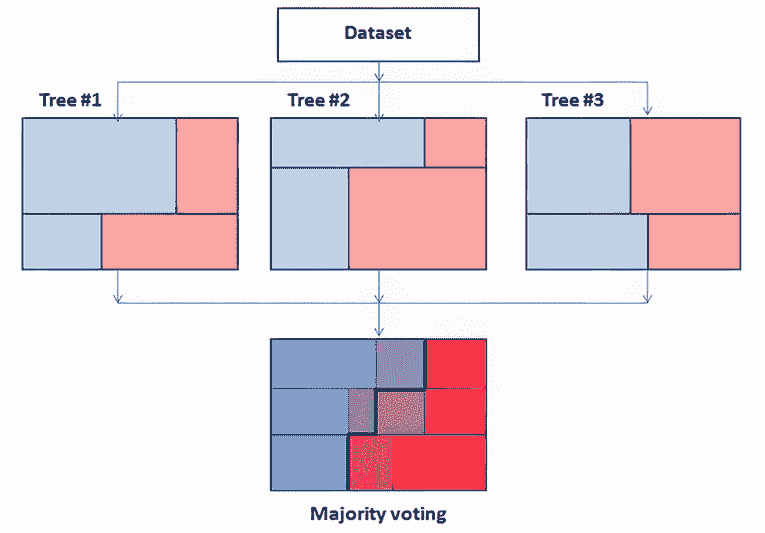
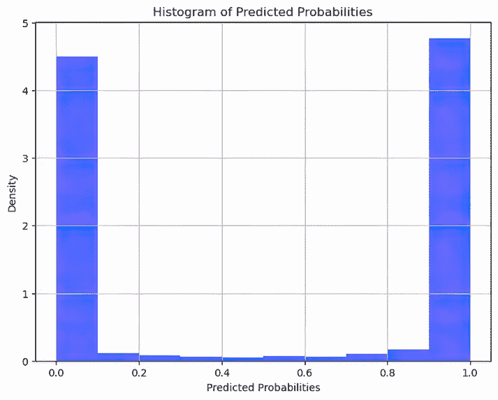
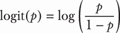
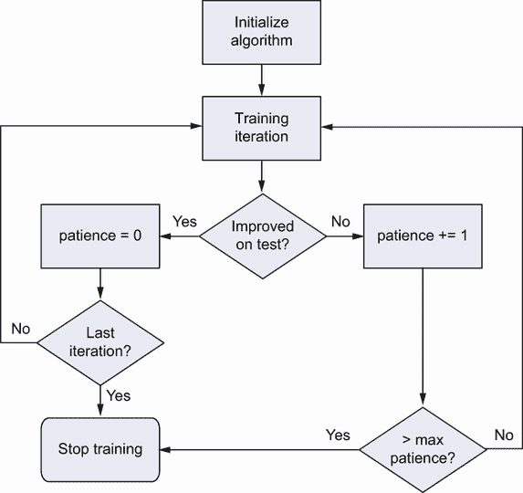

# 第五章：决策树和梯度提升

本章涵盖

+   决策树及其集成

+   梯度提升决策树

+   Scikit-learn 的梯度提升决策树选项

+   XGBoost 算法及其创新

+   LightGBM 算法的工作原理

到目前为止，我们已经探讨了基于线性模型的机器学习算法，因为它们可以处理来自只有几行几列的数据集的表格问题，并找到一种方法来扩展到有数百万行和许多列的问题。此外，线性模型训练和获取预测的速度快。此外，它们相对容易理解、解释和调整。线性模型还有助于我们理解本书中将要构建的许多概念，例如 L1 和 L2 正则化和梯度下降。

本章将讨论一种不同的经典机器学习算法：决策树。决策树是随机森林和提升等集成模型的基础。我们将特别关注一种机器学习集成算法——梯度提升，以及其实现 eXtreme Gradient Boosting (XGBoost)和 Light Gradient Boosted Machines (LightGBM)，它们被认为是表格数据的最佳解决方案。

## 5.1 树方法简介

树模型是一系列不同种类的集成算法，由于性能良好和数据预处理要求低，因此是处理表格数据的首选方法。集成算法是一组机器学习模型，它们共同贡献于单个预测。所有基于树的集成模型都是基于决策树，这是一种自 20 世纪 60 年代以来流行的算法。决策树背后的基本思想，无论它们是用于分类还是回归，都是你可以将训练集分割成子集，在这些子集中，你的预测更有利，因为有一个占主导地位的目标类（在分类问题中）或者目标值的变异性降低（即它们都非常接近；这指的是回归问题）。

图 5.1 展示了构成决策树的关键元素方案。决策树试图解决的问题是根据腿和眼睛的数量对动物进行分类。你从树的根开始，这对应于你拥有的整个数据集，并设置一个分割条件。条件通常是真/假——所谓的二分分割。尽管如此，一些决策树的变体允许在同一个节点应用多个条件，从而产生多个分割，每个分割基于特征的不同值或标签来决定。每个分支都导向另一个节点，在那里可以应用新的条件，或者导向一个终端节点，该节点用于基于终止于此的实例进行预测。


图 5.1 构成决策树的关键元素，如根、分支和叶子，根据腿和眼睛的数量对动物进行分类

分割是基于算法在特征中进行的故意搜索，以及在特征内部，其观察到的值。在分类问题中，决策树算法寻找最佳特征和特征值组合，将数据分割成具有同质目标的子集。在分类问题中，子集中目标的同质性通常使用熵、信息增益或基尼不纯度等标准来衡量：

+   *熵*衡量子集中标签分布的无序度或随机度。

+   *信息增益*，从熵中衍生出来，衡量通过基于特定特征的分割数据来减少关于数据类别标签的不确定性。

+   *基尼不纯度*衡量在子集中随机选择一个元素被随机标记为子集中标签分布的概率。

如果决策树用于回归，它将采用与分类不同的分割标准。在回归中，目标是分割数据以最小化结果均方误差、平均绝对误差或简单地每个子集中目标变量的方差。在训练过程中，会自动选择最佳特征，决策树的大部分计算都是为了确定最佳特征分割。然而，一旦树构建完成，预测新数据的类别标签或目标值相对快速且直接，涉及从根开始遍历树，根据有限特征集的值结束于叶子。

决策树易于计算，也相对容易可视化。它们不需要缩放或建模非线性，或者以其他方式转换你的特征或输出目标，因为它们可以单独考虑其分布的单个部分来近似目标与预测变量之间的任何非线性关系。基本上，它们是将曲线切割成部分，使得每一部分看起来像一条线。另一方面，决策树容易过拟合，最终导致过多的分割来拟合你正在工作的训练数据。随着时间的推移，已经设计了不同的策略来避免过拟合：

+   限制树中的分割数量

+   在构建后，通过剪枝分割节点来减少它们的过拟合

图 5.2 展示了决策树的不同视角。图 5.1 基于两个特征将树可视化为一个图，而图 5.2 则从数据本身分区的角度来可视化决策树。树的每个分割在图表中都是一条线，对于这个树，有七条垂直线（因此是 x 轴上特征的二进制条件的结果）和三条水平线（因此是 y 轴上的特征），总共 10 个分割。你可以认为决策树是成功的，因为每个类别都很好地分离到其分区中（每个分区最终都是一个终端节点）。然而，通过观察，也变得明显的是，某些分区只是为了适应空间中某个位置上的示例而被划分出来。有几个分区只包含一个单独的案例。任何新的示例如果与训练分布不完全匹配（一个过拟合的情况），都有可能被错误分类。


图 5.2 如何将一个完全成长的决策树分支也解释为一系列数据集分割

图 5.3 展示了使用更少的分割来可视化相同的问题——每个特征两个分割。你可以通过向后剪枝之前的树分割，移除包含训练样本过少的那些分割，或者你通过一开始就限制树的成长来实现这一点——例如，通过施加最大分割数。如果你使用更少的分区，树可能不会像以前那样完美地拟合训练数据。然而，一个更简单的方法提供了更多的信心，即新实例很可能会被正确分类，因为解决方案明确依赖于训练集中的单个点。


图 5.3 通过剪枝或限制其增长获得的一个更简单的决策树处理的问题

从欠拟合和过拟合的角度考虑这个算法，它是一个高方差算法，因为其复杂性总是倾向于超过给定的问题和数据应有的复杂度。通过调整很难找到它的最佳点。实际上，使用决策树实现更准确预测的最好方法不是作为单一模型，而是作为模型集合的一部分。在接下来的小节中，我们将探讨集合方法，如 bagging、随机森林和基于决策树的梯度提升，这是一种高级方法。

在本章中，我们将回到 Airbnb 纽约市数据集，以说明核心梯度提升决策树实现以及该技术是如何工作的。以下列表中的代码重新审视了之前用来展示其他经典机器学习算法的数据和一些关键函数和类。

列表 5.1 重新审视 Airbnb 纽约市数据集

```py
import numpy as np
import pandas as pd
from sklearn.preprocessing import OneHotEncoder, OrdinalEncoder
from sklearn.compose import ColumnTransformer
from sklearn.impute import SimpleImputer

data = pd.read_csv("./AB_NYC_2019.csv")
excluding_list = ['price', 'id', 'latitude', 'longitude', 'host_id', 
                  'last_review', 'name', 'host_name']              ①
low_card_categorical = ['neighbourhood_group',
   _    _               'room_type']                               ②
high_card_categorical = ['neighbourhood']                          ③
continuous = ['minimum_nights', 'number_of_reviews', 'reviews_per_month', 
              'calculated_host_listings_count', 'availability_365']
target_mean = (
    (data["price"] > data["price"].mean())
    .astype(int))                                                  ④
target_median = (
    (data["price"] > data["price"].median())
    .astype(int))                                                  ⑤
target_multiclass = pd.qcut(
    data["price"], q=5, labels=False)                              ⑥
target_regression = data["price"]                                  ⑦
categorical_onehot_encoding = OneHotEncoder(handle_unknown='ignore')
categorical_ord_encoding = 
OrdinalEncoder(handle_unknown="use_encoded_value", unknown_value=np.nan)
numeric_passthrough = SimpleImputer(strategy=”constant", fill_value=0)

column_transform = ColumnTransformer(
    [('low_card_categories', 
      categorical_onehot_encoding, 
      low_card_categorical),
     ('high_card_categories', 
      categorical_ord_encoding, 
      high_card_categorical),
     ('numeric', 
      numeric_passthrough, 
      continuous),
    ],
    remainder='drop',
    verbose_feature_names_out=False,
    sparse_threshold=0.0)                                          ⑧
```

① 需要从数据处理中排除的特征列表

② 需要独热编码的低基数分类特征列表

③ 需要按顺序编码的高基数分类特征列表

④ 创建一个二元目标，表示价格是否高于平均值（不平衡的二元目标）

⑤ 创建一个二元目标，表示价格是否高于中位数（平衡的二元目标）

⑥ 通过将价格划分为五个类别来创建一个多类目标

⑦ 将回归目标设置为价格列

⑧ 创建一个列转换器，对不同的特征组应用不同的转换

代码使用 pandas 库读取包含 2019 年纽约市 Airbnb 列表数据的 CSV 文件。然后定义了几个列表，将数据的特征分类到不同的类型：

+   `excluding_list`—应从分析中排除的特征列表，例如唯一标识符和文本特征

+   `low_card_categorical`—具有低基数（少量唯一值）的分类特征子集，将进行独热编码

+   `high_card_categorical`—具有高基数（许多唯一值）的分类特征子集，将使用序数编码进行编码

+   `continuous`—一个连续数值特征的列表，这些特征将被标准化以进行分析

然后，代码根据数据的“价格”特征创建几个目标变量：

+   `target_mean`—一个二元变量，表示价格是否高于所有列表的平均价格

+   `target_median`—一个二元变量，表示价格是否高于所有列表的中位数价格

+   `target_multiclass`—一个基于价格分布分位数划分的五个类别的变量

+   `target_regression`—实际的价格值，这些值将被用于回归分析

所有这些目标使我们能够处理不同的回归和分类问题，从而测试机器学习算法。在本章中，我们将始终使用`target_median`，但你可以通过在代码中做小的改动来实验所有其他目标。

接下来，代码设置了几种转换器，以预处理本章分析中的数据：

+   `categorical_onehot_encoding`—用于低基数分类特征的独热编码转换器

+   `categorical_ord_encoding`—用于高基数分类特征的序数编码转换器

+   `numeric_passthrough`—一个简单传递连续数值特征的转换器

最后，代码设置了一个`ColumnTransformer`对象，该对象将根据特征类型对每个特征子集应用适当的转换器。它对低基数分类特征应用独热编码，并将连续数值特征传递通过。转换器被设置为丢弃未在转换步骤中明确包含的任何特征，并输出简洁的特征名称。`sparse_threshold`参数设置为零，以确保转换器始终返回密集数组。

列表 5.2 展示了如何将标准决策树模型应用于我们的示例问题。正如在上一章中看到的示例一样，我们从 Scikit-learn 库中导入必要的模块，定义一个基于准确率的自定义评分指标，并设置五折交叉验证策略。然后我们定义一个名为`column_transform`的列转换器，它负责数据预处理。它包括

+   使用函数`categorical_onehot_encoding`对特定的低基数分类列进行分类变量转换

+   使用函数`numeric_passthrough`对连续变量进行数值特征传递

+   丢弃任何剩余未处理的列（`remainder='drop'`）

+   设置一些选项，如抑制详细特征名称和未应用稀疏矩阵表示

在这一点上，使用交叉验证测试结合列转换器和决策树分类器模型的管道，返回准确度分数以及平均拟合时间和评分时间。

在交叉验证过程和数据管道的底层，数据集在训练过程中被决策树分类器根据特征的一个分割值多次分割。这个过程可以从算法上解释为“贪婪”，因为决策树在每一步都选择具有最佳分割的特征，而不考虑其他替代方案是否可能带来更好的结果。尽管这种方法很简单，但决策树是有效的机器学习算法。这个过程会一直进行，直到没有更多的分割可以改善训练，如下面的列表所示。

列表 5.2 一个决策树分类器

```py
from sklearn.tree import DecisionTreeClassifier
from sklearn.pipeline import Pipeline
from sklearn.metrics import make_scorer, accuracy_score
from sklearn.model_selection import KFold, cross_validate

accuracy = make_scorer(accuracy_score)
cv = KFold(5, shuffle=True, random_state=0)

column_transform = ColumnTransformer(
    [('categories', categorical_onehot_encoding, low_card_categorical),
     ('numeric', numeric_passthrough, continuous)],              ①
    remainder='drop',
    verbose_feature_names_out=False,
    sparse_threshold=0.0)

model = DecisionTreeClassifier(random_state=0)                   ②

model_pipeline = Pipeline(
    [('processing', column_transform),
     ('modeling', model)])                                       ③

cv_scores = cross_validate(estimator=model_pipeline, 
                           X=data, 
                           y=target_median,
                           scoring=accuracy,
                           cv=cv, 
                           return_train_score=True,
                           return_estimator=True)                ④

mean_cv = np.mean(cv_scores['test_score'])
std_cv = np.std(cv_scores['test_score'])
fit_time = np.mean(cv_scores['fit_time'])
score_time = np.mean(cv_scores['score_time'])
print(f"{mean_cv:0.3f} ({std_cv:0.3f})", 
      f"fit: {fit_time:0.2f}",
      f"secs pred: {score_time:0.2f} secs")                      ⑤
```

① 创建一个列转换器，对分类和数值特征应用不同的转换

② 决策树分类器的一个实例

③ 依次应用列转换和决策树模型的管道

④ 使用定义的管道进行五折交叉验证，计算准确度分数，并返回附加信息

⑤ 打印交叉验证准确度分数的均值和标准差

我们在准确度方面获得的结果是

```py
0.761 (0.005) fit: 0.22 secs pred: 0.01 secs
```

与其他机器学习算法的先前实验结果进行比较后，结果可能会更好。我们可以确定这一点，因为决策树已经过拟合，最终构建了太多的分支。我们可以通过尝试和错误来限制其增长以获得更好的性能（你必须声明`max_depth`参数来这样做）。然而，还有更好的方法可以从这个算法中获得改进的结果。在下一小节中，我们将检查这些方法中的第一个，它基于基于示例和使用的特征的变体构建的多个决策树。

### 5.1.1 折叠和采样

我们已经检查了所有基于决策树的单一学习算法。同类型的集成算法是下一步可以帮助你在你的问题上实现更多预测能力的步骤。这个想法是直观的：如果一个单一算法可以在某个水平上表现，使用多个模型或链式连接它们的见解（这样可以使一个从另一个的结果和错误中学习）应该会产生更好的结果。有两种核心的集成策略：

+   *平均法*—通过平均多个模型的预测来获得预测。模型构建方式的不同，例如通过粘贴、袋装、随机子空间和随机补丁（我们将在本节中看到），会导致不同的结果。这种类型集成模型的最好例子是随机森林算法，它是基于类似随机补丁的方法构建的。

+   *提升法*—预测是通过链式模型的加权平均来构建的，这些模型是依次建立在先前模型结果之上的。提升算法的最好例子是梯度提升机，如 XGBoost 和 LightGBM。

在接下来的子节中，我们将探讨随机森林。在深入研究随机森林算法之前，有必要花一些时间在其他平均方法上，这不仅因为随机补丁方法建立在它们之上，而且因为它们指出了在需要减少估计的方差时始终值得应用于表格数据的解决方案，从而获得更可靠的预测，无论你希望在你的数据上使用哪种机器学习模型。

*粘贴*是首先要考虑的方法。随机森林算法的创造者 Leo Breiman 建议，粘贴包括创建一组不同的模型，这些模型是在通过不重复抽样的子样本上训练的，这些子样本是从你的训练数据中获得的。在回归问题的情况下，通过平均来汇总模型的预测，在分类任务的情况下，通过多数投票来汇总。

粘贴的优点是

+   通过仅部分增加偏差来减少预测的方差，从而提高结果，偏差是衡量模型预测值与真实值之间距离的指标。

+   预测结果更稳健，受异常值影响较小。

+   减少训练时需要学习的数据量，从而减少内存需求。

缺点是

+   减少可用的数据量，这会增加偏差，因为有可能通过采样排除数据分布中的重要部分。

+   非常计算密集，具有复杂的算法

最后一个缺点取决于你的时间限制或可用资源。从历史上看，建议使用弱模型（即由于它们的简单性而非常快就能训练的机器学习模型，如线性回归或 k 最近邻模型）应用平均方法。从业者观察到，结合多个弱模型可以击败单个更复杂算法的结果。然而，弱模型通常存在高偏差问题，通过子采样，你只在其估计中引入了一些方差，但它们的偏差问题基本上没有改变。使用平均方法的主要优势在于，它通过以略微增加的偏差为代价来减少估计的方差。由于弱模型本质上携带大量的偏差，它们可能无法实现与应用于更复杂模型相同的方法的可比结果。在需要通过减少估计的方差来获得更显著改进的情况下，使用平均策略可以与更复杂的模型更有效地结合。

*Bagging*，也被 Leo Breimar 提出作为一种更好的解决方案，与粘贴不同，因为你从子采样切换到自助采样。自助采样包括多次从数据样本中带替换地采样，以近似统计量的总体分布。自助采样是一种常用的统计技术，它允许我们估计相对于从我们的样本中抽取的潜在数据总体，统计量的变异性与不确定性。通过使用从可用样本中获取的信息，通过多次重采样来模拟原始总体行为，自助采样模拟了总体的行为，而无需显式了解其统计分布。

在机器学习中使用自助采样的原因是为了估计模型性能的不确定性或评估统计量的分布。此外，自助采样有助于创建更多样化的原始数据集变体，用于训练和集成目的。这是基于观察，如果所使用的模型的预测较少相关（即更多样化），则平均多个模型可以减少方差。子采样创建多样化的数据集进行训练。然而，它有局限性，因为如果你进行积极的子采样——例如，选择不到原始数据的 50%——你往往会引入偏差。

相比之下，如果你以更有限的方式进行子采样，例如使用 90%的数据，得到的子样本将倾向于相关。相反，自助法更有效，因为平均而言，你会在每个自助法中使用大约 63.2%的原始数据。有关此类计算比例的详细统计解释，请参阅详细交叉验证答案[`mng.bz/zZ0w`](https://mng.bz/zZ0w)。此外，带替换的采样往往会产生模仿原始数据分布的结果。自助法创建了一组更多样化的数据集来学习，从而产生一组更多样化的预测，可以更有效地进行集成，减少方差。

事实上，由于在平均过程中我们正在构建一个预测分布，并将分布的中心作为我们的预测，平均预测越接近随机分布，分布中心受模型（如过拟合）收集到的数据问题的影响就越小。

相比之下，通过*随机子空间*，由 T. Ho [“The Random Subspace Method for Constructing Decision Forests,” *Pattern Analysis and Machine Intelligence*, 20(8), 832-844, 1998]引入，采样仅限于特征。这是因为用于集成的模型是决策树，这种模型通过仅使用每个模型的一部分特征来显著降低估计的高方差。改进的结果是因为在特征子样本上训练的模型往往会产生不相关的预测——所有的决策树都会过拟合数据，但相对于彼此而言，方式不同。

最后，通过*随机补丁* [G. Louppe 和 P. Geurts, “Ensembles on Random Patches,” in *Machine Learning and Knowledge Discovery in Databases* (2012): 346–361]，同时使用样本和特征的采样，以实现更多不相关的预测，从而可以更有效地进行平均。

粘贴、Bagging、随机子空间和随机补丁都可以使用 Scikit-learn 的 Bagging 函数实现。通过以下参数，可以控制`BaggingClassifier`对分类任务和`BaggingRegressor`对回归任务的训练数据的行为：

+   `bootstrap`

+   `max_sample`

+   `max_features`

通过根据每种平均方法的规范组合它们，你可以获得我们描述的所有四种平均策略（见表 5.1）。

表 5.1 Bagging 和采样策略

| 平均策略 | 数据会发生什么 | BaggingClassifier/BaggingRegressor 的参数 |
| --- | --- | --- |
| Pasting | 使用不替换方式对训练示例进行采样 | `bootstrap = False` `max_samples < 1.0` `max_features = 1.0`  |
| Bagging | 使用替换方式（自助法）对训练示例进行采样 | `bootstrap = True` `max_samples = 1.0` `max_features = 1.0`  |
| 随机子空间 | 采样特征（不替换） | `bootstrap = False` `max_samples = 1.0` `max_features < 1.0`  |
| 随机补丁 | 在不替换的情况下采样训练示例和特征 | `bootstrap = False` `max_samples < 1.0` `max_features < 1.0`  |

通过在参数估计器中输入所需的 Scikit-learn 模型类，您可以决定用于构建集成所使用的算法。默认情况下是决策树，但您可以选择您更喜欢弱或强模型。在以下示例中，我们应用了一个 Bagged 分类器，将决策树模型的数量设置为 300。以下列表显示了所有模型共同贡献以改善低性能，正如我们从列表 5.2 中看到的那样，决策树往往会产生这种问题的低性能。

列表 5.3 基于 Bagged 树的分类器

```py
from sklearn.ensemble import BaggingClassifier
from sklearn.tree import DecisionTreeClassifier
from sklearn.metrics import accuracy_score

accuracy = make_scorer(accuracy_score)
cv = KFold(5, shuffle=True, random_state=0)
model = BaggingClassifier(
    estimator=DecisionTreeClassifier(),                     ①
    n_estimators=300, 
    bootstrap=True,                                         ②
    max_samples=1.0,                                        ③
    max_features=1.0,                                       ④
    random_state=0)

column_transform = ColumnTransformer(
    [('categories', categorical_onehot_encoding, low_card_categorical),
     ('numeric', numeric_passthrough, continuous)],
    remainder='drop',
    verbose_feature_names_out=False,
    sparse_threshold=0.0)                                   ⑤

model_pipeline = Pipeline(
    [('processing', column_transform),
     ('modeling', model)])                                  ⑥

cv_scores = cross_validate(estimator=model_pipeline, 
                           X=data, 
                           y=target_median,
                           scoring=accuracy,
                           cv=cv, 
                           return_train_score=True,
                           return_estimator=True)           ⑦

mean_cv = np.mean(cv_scores['test_score'])
std_cv = np.std(cv_scores['test_score'])
fit_time = np.mean(cv_scores['fit_time'])
score_time = np.mean(cv_scores['score_time'])
print(f"{mean_cv:0.3f} ({std_cv:0.3f})", 
      f"fit: {fit_time:0.2f}", 
      f"secs pred: {score_time:0.2f} secs")                 ⑧
```

① 基于决策树创建 BaggingClassifier 集成模型

② 为 BaggingClassifier 设置自助采样

③ 为 BaggingClassifier 设置不进行特征采样

④ 为 BaggingClassifier 设置不进行数据采样

⑤ 应用不同转换到分类和数值特征的列转换器

⑥ 依次应用列转换和 Bagging 分类器模型的管道

⑦ 使用定义的管道进行五折交叉验证并计算准确度分数

⑧ 打印交叉验证准确度分数的均值和标准差

结果需要更多一些时间，但看起来很有希望，但它们仍然不足以与我们的基于支持向量机和逻辑回归的先前解决方案竞争：

```py
0.809 (0.004) fit: 37.93 secs pred: 0.83 secs
```

在下一小节中，我们通过重新审视随机森林来进一步探讨集成，随机森林利用 Bagging 中的随机补丁是有充分理由的。

### 5.1.2 使用随机森林进行预测

随机森林的工作原理与 Bagging 类似。然而，它同时应用随机补丁（在不替换的情况下采样训练示例和特征）：在训练每个模型之前对样本进行自助采样，并在建模期间对特征进行子采样。由于随机森林集成中使用的基本算法是由二分分割构建的决策树，因此在采样一组特征作为分割本身的潜在候选时，特征采样发生在每个树的分割处。

允许集成中的每个决策树生长到其极限可能会导致数据过拟合和估计的高方差；采用自助抽样和特征抽样可能有助于缓解这些问题。自助抽样确保模型在来自同一分布的不同数据样本上训练，而在每个分割处的特征抽样保证了不同的树结构。这种组合有助于生成一组彼此相当不同的模型。不同的模型产生非常不同的预测（因此，我们可以说它们的预测相当不相关），这对于平均技术来说是一个巨大的优势，因为当集成到一个单一的预测向量时，结果将更加可靠和准确。

图 5.4 展示了随机森林的工作原理。该图说明了具有两个类别的数据集的二元分类问题。数据集使用多棵决策树建模，采用自助抽样和特征抽样技术。这些技术导致数据集的不同分区，如图中顶部部分所示，由三个示例结果表示。这些树以不同的方式划分数据集空间，展示了它们分割策略的变异性。为了简化表示，只显示了两个特征，从而更清楚地理解这个过程。

最后，当所有结果通过多数投票合并在一起时，即选择出现频率更高的分类作为预测类别，随机森林将提供由所有树的结果得出的更好预测。这如图中底部部分所示，其中不同的阴影表示在特定分区中一个或另一个类的普遍性。多数投票中的类之间的最终边界以黑色多边形线表示。当使用多棵树时，这条线甚至可以更平滑，类似于曲线。如果给集成足够多的模型，集成方法可以近似任何曲线。



图 5.4 随机森林如何通过多数投票结合其决策树的不同数据分区来得出结果

该算法最初由 Leo Breiman 和 Adele Cutler([`mng.bz/0Qlp`](https://mng.bz/0Qlp))设计，尽管商业上受到保护，但该算法已被开源——因此其实现有许多不同的名称。除了更好的预测外，随机森林还开辟了更多有趣的可能性，因为你可以使用该算法来确定特征重要性并测量数据集中案例相似度的大小。

在列表 5.4 的例子中，我们测试了随机森林在 Airbnb NYC 数据集上如何处理我们的分类问题。在应用决策树时，除了算法外，与我们的标准数据处理没有区别。One-hot 编码将低类别特征转换为二进制，而数值特征保持不变。

列表 5.4 随机森林分类器

```py
from sklearn.ensemble import RandomForestClassifier
from sklearn.metrics import accuracy_score

accuracy = make_scorer(accuracy_score)
cv = KFold(5, shuffle=True, random_state=0)
model = RandomForestClassifier(n_estimators=300, 
                               min_samples_leaf=3,
                               random_state=0)              ①

column_transform = ColumnTransformer(
    [('categories', categorical_onehot_encoding, low_card_categorical),
     ('numeric', numeric_passthrough, continuous)],
    remainder='drop',
    verbose_feature_names_out=False,
    sparse_threshold=0.0)                                   ②

model_pipeline = Pipeline(
    [('processing', column_transform),
     ('modeling', model)])                                  ③

cv_scores = cross_validate(estimator=model_pipeline, 
                           X=data, 
                           y=target_median,
                           scoring=accuracy,
                           cv=cv, 
                           return_train_score=True,
                           return_estimator=True)           ④

mean_cv = np.mean(cv_scores['test_score'])
std_cv = np.std(cv_scores['test_score'])
fit_time = np.mean(cv_scores['fit_time'])
score_time = np.mean(cv_scores['score_time'])
print(f"{mean_cv:0.3f} ({std_cv:0.3f})", 
      f"fit: {fit_time:0.2f}", 
      f"secs pred: {score_time:0.2f} secs")                 ⑤
```

① 具有 300 个估计器和在叶子节点上的最小样本数设置为 3 的 RandomForestClassifier

② 一种对分类特征和数值特征应用不同转换的列转换器

③ 依次应用列转换和随机森林分类器模型的管道

④ 使用定义的管道进行五折交叉验证并计算准确度分数

⑤ 打印交叉验证准确度分数的均值和标准差

运行脚本后，你将获得以下结果，这实际上是本章中针对此问题的最佳性能：

```py
0.826 (0.004) fit: 12.29 secs pred: 0.68 secs
```

随机森林获得良好结果的关键在于明智地选择其少数超参数。尽管随机森林算法在默认参数下表现良好，无需多想，但微调它将带来更好的结果。首先，算法的目的是减少估计的方差，这通过设置足够高的`n_estimators`数量来实现。原理是，如果你有很多树，你就有结果分布，如果结果是随机抽取的，由于大数定律，你会有回归到平均值（最佳预测）的效果。通常，示例的重新抽样和考虑分割的特征的抽样足以使森林中的树足够不同，可以被认为是“随机抽取”。然而，你需要足够的抽取次数才能有适当的回归到平均值。

你需要一些测试来微调你将构建多少棵树，因为总有一个最佳点：在达到一定数量的树之后，你不会获得任何更多的改进，有时性能的下降反而会出现。此外，算法构建过多的树会增加其计算成本，训练和推理所需的时间将更多。然而，无论你训练多少棵树，如果你的方差在随机森林模型的默认设置下开始很高，你几乎无法减少它。在这里，方差和偏差之间的权衡就出现了；也就是说，你可以通过一些偏差来换取一些方差，这意味着你正在过度拟合数据。

你可以通过以下调整来为随机森林设置适当的偏差：

+   通过设置`max_features`参数来降低在寻找最佳分割时考虑的特征数量

+   通过设置`max_depth`参数来设置每个树的最大分割数，从而限制其增长到预定义的某个程度

+   通过设置`min_samples_leaf`参数（数值大于 1）来设置树终端叶子中的最小示例数，从而限制其增长

在下一节中，我们探讨极端随机树（ERT），这是随机森林的一个变体，当数据更大且噪声较多时非常有用。

### 5.1.3 退回到极端随机树

ERT（在 Scikit-learn 中也称为 extra-trees）是一种更随机的随机森林算法。原因是集成中单个树进行分割时候选者的选择。在随机森林中，算法为每个分割采样其候选者，然后从候选者中选择最佳特征。相反，ERT 中要分割的特征不是在可能的候选者中进行评估，而是随机选择。之后，算法在随机选择的特征中评估最佳的分割点。这有一些后果。首先，由于生成的树更加不相关，ERT 的预测方差更小——但代价是更高的偏差。随机分割特征对预测的准确性有影响。其次，ERT 在计算上更高效，因为它不需要测试特征集，而是每次只测试一个特征以找到最佳的分割。所有这些特性使 ERT 最适合处理

+   *高维数据* 因为它将比任何其他决策树集成算法更快地分割特征

+   *噪声数据* 因为随机特征和样本选择过程可以帮助减少噪声数据点的影响，使模型对极端值更加鲁棒

+   *不平衡数据* 因为，由于随机特征选择，数据少数子集的信号不会系统地排除，以利于数据多数子集

以下列表通过替换列表 5.4 中的随机森林来测试 ERT，在列表 5.4 中，你使用 Airbnb NYC 数据集构建了一个模型，以确定列表价格是否高于或低于中位数。

列表 5.5 ERTs 分类器

```py
from sklearn.ensemble import ExtraTreesClassifier

accuracy = make_scorer(accuracy_score)
cv = KFold(5, shuffle=True, random_state=0)
model = ExtraTreesClassifier(n_estimators=300, 
                             min_samples_leaf=3,
                             random_state=0)                  ①

column_transform = ColumnTransformer(
    [('categories', categorical_onehot_encoding, low_card_categorical),
     ('numeric', numeric_passthrough, continuous)],
    remainder='drop',
    verbose_feature_names_out=False,
    sparse_threshold=0.0)                                     ②

model_pipeline = Pipeline(
    [('processing', column_transform),
     ('modeling', model)])                                    ③

cv_scores = cross_validate(estimator=model_pipeline, 
                           X=data, 
                           y=target_median,
                           scoring=accuracy,
                           cv=cv, 
                           return_train_score=True,
                           return_estimator=True)             ④

mean_cv = np.mean(cv_scores['test_score'])
std_cv = np.std(cv_scores['test_score'])
fit_time = np.mean(cv_scores['fit_time'])
score_time = np.mean(cv_scores['score_time'])
print(f"{mean_cv:0.3f} ({std_cv:0.3f})", 
      f"fit: {fit_time:0.2f}",
      f"secs pred: {score_time:0.2f} secs")                   ⑤
```

① 一个具有 300 个估计器和在叶节点上的最小样本数设置为 3 的 ExtraTreesClassifier

② 一个列转换器，对分类和数值特征应用不同的转换

③ 一个管道，按顺序应用列转换和随机森林分类器模型

④ 使用定义的管道进行五折交叉验证并计算准确度分数

⑤ 打印交叉验证中准确度分数的平均值和标准差

你获得的结果比使用随机森林略好一些：

```py
0.823 (0.004) fit: 4.99 secs pred: 0.42 secs
```

如果你运行这个示例，你会看到，在给定相同的 dataset 和构建相同数量的树的情况下，使用 ETR 训练比使用随机森林要快得多。当你的 dataset 更大（更多案例）甚至更宽（更多特征）时，ETR 成为一个有趣的替代方案，因为它节省了大量选择分割特征的时间，因为它是随机决定的。相比之下，随机森林算法必须在选择中寻找最佳特征。

当许多共线性噪声特征与目标相关时，随机决定分割是一个巨大的优势。该算法避免像由寻找最佳拟合目标的特征驱动的算法那样选择相同的信号。此外，您还可以通过观察 ETR 的特征分割的工作动态，将其视为另一种以方差与偏差进行交易的方式。对于算法来说，随机分割是一个限制，因为它会导致生成的树集非常不相关。

在下一节中，我们通过考察梯度提升来完善我们对基于树的集成方法的概述。这种略有不同的集成方法通常比袋装或随机补丁对表格数据问题更有效。

## 5.2 梯度提升

在近年来，*梯度提升决策树*（GBDT）已牢固地确立了自己在表格数据问题上的尖端方法地位。GBDT 通常被认为是在多个领域广泛问题上的最先进机器学习方法，包括多类分类、广告点击预测和搜索引擎排名。当应用于标准表格问题时，您可以期望 GBDT 的表现优于神经网络、支持向量机、随机森林和袋装集成。

首先，GBDT 处理异构特征的能力以及它在选择损失函数和评估指标方面的灵活性，使该算法最适合表格数据预测建模任务。总的来说，GBDT 为表格数据问题提供了以下好处：

+   通过适当的超参数调整，它可以在所有其他技术中实现最佳性能。

+   不需要对特征进行缩放或其他单调变换。

+   它自动捕捉数据中的非线性关系。

+   它对异常值和噪声数据具有鲁棒性。

+   它自动处理缺失数据。

+   它自动选择最佳特征，并可以报告它们的重要性。

所有这些特性都取决于算法的工作方式，结合决策树序列进行梯度下降优化。实际上，在梯度提升中，从常数开始，您按顺序向集成中添加树模型，每个模型都以前一个模型的误差为依据进行校正，类似于梯度下降优化。梯度提升代表了原始提升方法的演变。在 Adaboost 等模型中使用原始提升时，您只需对基于前一个模型残差的模型进行平均。

在 Adaboost 中，算法对一系列弱学习器进行拟合，任何持续击败随机猜测的机器学习算法（有关如何选择弱学习器的解释，请参阅[`mng.bz/KG9P`](https://mng.bz/KG9P)）。然后，它对错误预测赋予更多权重，对正确预测赋予较少权重。加权有助于算法更多地关注难以预测的观测值。在分类中通过多数投票或在回归中通过预测的平均值后，这个过程通过多次修正而结束。

相比之下，在梯度提升中，你依赖于双重优化：首先是单个树根据其优化函数努力减少误差的优化，然后是总体优化，涉及计算提升模型的求和误差，其形式模仿梯度下降，其中你逐渐修正模型的预测。由于你还有一个基于第二层的优化，即基于整个集成过程误差的优化，因此梯度提升比之前看到的树集成更灵活，因为它允许在计算模型预测求和与预期结果差异时使用任意损失函数。

图 5.5 可视化地表示了添加新树后训练误差如何降低。每一棵树都参与梯度下降风格的优化，有助于预测前一棵树残差误差的修正。


图 5.5 梯度下降法与提升树的工作原理

如果梯度下降在优化中提供最优结果和灵活性，那么使用决策树作为基学习（如所见，集成并不限于决策树）提供了各种优势。这是因为它自动选择所需的特征。它不需要指定函数形式（如回归中的公式）、缩放或特征与目标之间的线性关系。

在下一节中，在看到具体实现（Scikit-learn、XGBoost、LightGBM）之前，我们将尝试构建我们自己的简单梯度提升实现，以了解如何使用这个强大的算法。

### 5.2.1 梯度提升法的工作原理

所有 GBDT 的实现都提供了一系列超参数，需要设置以在您试图解决的数据问题上获得最佳结果。弄清楚每个设置的作用是一个挑战，而且对自动调整过程保持无知并将任务留给它并不会帮助太多，因为您将面临挑战告诉调整算法要调整什么以及如何调整。

根据我们的经验，写下简单的实现是理解算法工作原理的最佳方式，并找出超参数如何与预测性能和结果相关。列表 5.6 显示了一个 `GradientBoosting` 类，它可以解决任何二元分类问题，例如我们作为示例处理的 Airbnb NYC 数据集，使用梯度下降过程的两参数和 Scikit-learn 提供的决策树模型的参数。

代码创建了一个 GradientBoosting 类，它包含用于拟合、预测概率和预测类的方法。内部，它将拟合的决策树序列存储在一个列表中，可以从那里按顺序访问以重建以下求和公式：


在公式中，

+   H(X) 是应用于预测变量 X 的梯度提升模型

+   M 对应于使用的树估计器的数量

+   ν 代表学习率

+   w^m 代替表示来自先前树的校正，这些校正需要被预测

+   h^m 符号指的是第 m 个决策树

有趣的是，梯度提升树总是回归树（即使是对于分类问题）——因此我们选择使用 Scikit-learn 的 DecisionTreeRegressor。这也解释了为什么 GBDT 在预测概率方面比其他基于树的集成模型更好：梯度提升树直接对类别概率的对数几率进行回归，从而以一种与逻辑回归不太不同的方式优化。另一方面，像随机森林这样的算法是针对纯度指标进行优化的，它们通过计算终端节点中一个类的比例来估计概率，这并不是真正的概率估计。一般来说，GBDT 输出的概率是正确的，并且很少需要后续的概率校准，这是一种后处理步骤，用于调整预测概率以提高其在概率估计至关重要的应用中的准确性和可靠性，例如医疗诊断（例如，疾病检测）、欺诈检测或信用风险评估。

在我们的代码实现中，我们允许传递任何参数给 DecisionTreeRegressor（见 [`mng.bz/9YQx`](https://mng.bz/9YQx)），尽管最有用的是与树发展复杂度相关的参数，例如 `max_depth`（固定树的深度最大值），或 `min_samples_split` 和 `min_samples_leaf`（分别表示分割内部节点或成为叶节点所需的最小样本数）。

每个树回归器的角色是提供一个 w 向量，其中包含要加到先前估计中的学习率加权的学习修正。每个 w 向量都依赖于前一个，因为它是由一个训练在梯度上的树回归器产生的，这些梯度是必要的，以纠正估计以匹配真实的分类标签。链式向量 w 类似于一系列梯度修正——最初很大，然后越来越精细，趋向于最优输出预测。这种梯度下降与我们在第四章中介绍的梯度下降优化过程完全相似。此外，通过更改基于其梯度计算的成本函数，您可以要求 GBDT 优化不同的损失函数。

列表 5.6 构建梯度提升分类器

```py
from sklearn.tree import DecisionTreeRegressor
import numpy as np

class GradientBoosting():
    def __init__(self, learning_rate=0.1, n_estimators=10, **params):
        self.learning_rate = learning_rate
        self.n_estimators = n_estimators
        self.params = params
        self.trees = list()

    def sigmoid(self, x):
        x = np.clip(x, -100, 100)
        return 1 / (1 + np.exp(-x))                          ①

    def logit(self, x, eps=1e-6):
        xp = np.clip(x, eps, 1-eps)
        return np.log(xp / (1 - xp))                         ②

    def gradient(self, y_true, y_pred):
        gradient =  y_pred - y_true                          ③
        return gradient

    def fit(self, X, y):
        self.init = self.logit(np.mean(y))                   ④
        y_pred = self.init * np.ones((X.shape[0],))
        for k in range(self.n_estimators):
            gradient = self.gradient(self.logit(y), y_pred)
            tree = DecisionTreeRegressor(**self.params)
            tree.fit(X, -gradient)                           ⑤
            self.trees.append(tree)
            y_pred += (
                self.learning_rate * tree.predict(X)
            )                                                ⑥

    def predict_proba(self, X):
        y_pred = self.init * np.ones((X.shape[0],))
        for tree in self.trees:
            y_pred += (
                self.learning_rate * tree.predict(X)
            )                                                ⑦
        return self.sigmoid(y_pred)

    def predict(self, X, threshold=0.5):
        proba = self.predict_proba(X)
        return np.where(proba >= threshold, 1, 0)
```

① 用于概率转换的 Sigmoid 函数实现，将 logits 转换回概率

② 用于将概率转换为 logits 的 Logit 函数实现

③ 计算损失函数（负对数似然）相对于预测的梯度

④ 使用目标值的对数变换均值初始化模型

⑤ 将决策树回归器拟合到对数似然转换目标的负梯度

⑥ 使用学习率因子更新拟合的树的输出预测值

⑦ 预测需要累积来自所有树的预测

正如我们在应用于线性模型的梯度下降中看到的，您依赖于使过程随机化以避免优化陷入次优解，这是通过在训练每个决策树之前采样行或列来实现的。此外，您使用提前停止来防止 GBDT 顺序使用过多的决策树并过度适应训练数据。我们将在下一章中演示提前停止。

现在我们已经解释了我们的 GradientBoosting 类的内部工作原理，我们现在可以对其进行实验。我们将使用 Airbnb 纽约数据集，并首先将其分为训练集和测试集。这需要创建两个行索引列表——一个用于训练集，一个用于测试集——使用 Scikit-learn 函数 `train_test_split` ([`mng.bz/jp1z`](https://mng.bz/jp1z))。我们实例化我们的 GradientBoosting 类，它需要一个学习率为 0.1 和 300 个决策树，最大深度为四个分支，终端叶子节点至少有三个示例。在通过处理数值和分类特征转换训练数据后，我们拟合模型，预测测试集，并评估结果。

列表 5.7 测试我们的梯度提升类

```py
from sklearn.model_selection import train_test_split

train, test = train_test_split(range(len(data)), test_size=0.2, 
random_state=0)                                              ①

cls = GradientBoosting(n_estimators=300, 
                       learning_rate=0.1,
                       max_depth=4,
                       min_samples_leaf=3, 
                       random_state=0)                       ②

X = column_transform.fit_transform(data.iloc[train])         ③
y = target_median[train]                                     ④

cls.fit(X, y)

Xt = column_transform.transform(data.iloc[test])             ⑤
yt = target_median[test]                                     ⑥

preds = cls.predict(Xt)
score = accuracy_score(y_true=yt, y_pred=preds)              ⑦
print(f"Accuracy: {score:0.5f}")                             ⑧
```

① 使用固定随机种子将数据集索引分割为训练集和测试集

② 使用指定的超参数初始化 GradientBoosting 模型

③ 将列转换应用于训练数据

④ 提取与训练数据对应的目标值

⑤ 将相同的列转换应用于测试数据

⑥ 提取与测试数据对应的目标值

⑦ 通过比较预测标签与实际测试标签来计算准确度得分

⑧ 打印计算出的准确度得分

在我们的测试集上的评估准确度是

```py
Accuracy: 0.82503
```

这是一个非常好的结果，表明即使是我们基本的实现也能在我们的数据上做得很好。在下一节中，我们将调查获得的结果，并观察 GBDT 模型的一个关键特征，这个特征使它们区别于其他决策树集成。

### 5.2.2 使用梯度提升进行外推

在我们从头开始实现的 GBDT 中，我们可以通过预测相同的训练集来可视化模型如何拟合数据。图 5.6 中所示的可视化，由列表 5.8 中的小代码片段创建，是一个归一化密度直方图。在归一化密度直方图中，每个柱子的高度代表落在特定区间内的数据点的相对频率，直方图下的总面积等于 1。结果描绘了一个值分布，主要偏向 0-1 边界的极端，表明模型在分类示例时非常果断。

列表 5.8 绘制梯度提升预测概率图

```py
import matplotlib.pyplot as plt

proba = cls.predict_proba(Xt)                              ①
plt.figure(figsize=(8, 6))
plt.hist(proba, 
         bins=30,
         density=True,
         color='blue',
         alpha=0.7)                                        ②
plt.xlabel('Predicted Probabilities')
plt.ylabel('Density')
plt.title('Histogram of Predicted Probabilities')
plt.grid(True)
plt.show()
```

① 使用训练模型为测试数据生成预测概率

② 创建具有指定区间和归一化密度的预测概率直方图



图 5.6 描述梯度提升分类拟合概率的直方图，展示了模型在大多数情况下如何强烈决定它们是正还是负

我们的实现底层使用回归损失，即平方损失，其梯度等于将概率转换为 logit 的残差。关于 logit 的定义，请参阅 [`mng.bz/W214`](https://mng.bz/W214)。

概率 p 的 logit 计算如下



这种定义的优势在于 logit 函数将概率映射到对数几率尺度，这是一个无界的尺度，范围从负无穷大到正无穷大，使我们能够将我们的问题视为回归问题。

这意味着在每次迭代中，梯度提升算法都会将回归模型拟合到损失函数相对于 logit 值的梯度，这对应于真实目标值的 logit 与当前预测（以 logit 表示）之间的差异。这种方法允许算法通过调整预测以沿着损失函数的最陡下降方向迭代改进预测，并最终通过 logit 的逆函数 sigmoid，得到一个在 0 到 1 之间有界的 logit 预测。sigmoid 是一种数学函数，它将输入映射到 0 到 1 之间的值，提供一条平滑且连续的曲线。

sigmoid 的公式为


其中

+   *σ*(*x*)表示将 sigmoid 函数应用于输入值 x。

+   exp(–*x*)是指数函数，其中 exp 表示欧拉数（约等于 2.71828）的–x 次幂。

+   1 + exp(–*x*)是分母，这确保了 sigmoid 函数的输出始终为正。

+   1 / (1 + exp(–*x*))表示分母的倒数，结果是 sigmoid 函数的输出值。

它在机器学习和统计模型中常用，用于将 logit 预测转换为概率。

如果我们将问题视为回归问题会怎样？在列表 5.9 中，我们通过构建我们的`GradientBoosting`类并覆盖 fit 和 predict 方法（通过移除 logit 和 sigmoid 转换）来定义一个`GradientBoostingRegression`类。

列表 5.9 测试梯度提升回归类

```py
class GradientBoostingRegression(GradientBoosting):

    def fit(self, X, y):
        self.init = np.mean(y)                              ①
        y_pred = self.init * np.ones((X.shape[0],))

        for k in range(self.n_estimators):
            gradient = self.gradient(y, y_pred)
            tree = DecisionTreeRegressor(**self.params)
            tree.fit(X, -gradient)                          ②
            self.trees.append(tree)
            y_pred += (
                self.learning_rate * tree.predict(X)
            )                                               ③

    def predict(self, X):
        y_pred = self.init * np.ones((X.shape[0],))
        for tree in self.trees:
            y_pred += (
                self.learning_rate * tree.predict(X)
            )                                               ④
        return y_pred

reg = GradientBoostingRegression(n_estimators=300,
                                 learning_rate=0.1,
                                 max_depth=4,
                                 min_samples_leaf=3, 
                                 random_state=0)

reg.fit(X, y)

proba = reg.predict(Xt)
plt.figure(figsize=(8, 6))
plt.hist(proba, 
         bins=10,
         density=True,
         color='blue',
         alpha=0.7)                                         ⑤
plt.xlabel('Predicted Probabilities')
plt.ylabel('Density')
plt.title('Histogram of Predicted Probabilities')
plt.grid(True)
plt.show()
```

① 使用 y 的均值初始化预测

② 将树拟合到负梯度

③ 使用学习率缩放树预测更新预测

④ 预测回溯需要累积所有树的预测。

⑤ 绘制回归预测概率的直方图

当运行列表 5.9 中的代码时，它将生成拟合预测的直方图，如图 5.7 所示。图 5.7 显示了拟合概率如何超过 0-1 边界。与基于特征的加权组合的线性回归一样，基于链式序列模型结果的加权组合梯度提升可以超出学习目标的范围。与其他基于决策树的集成（如随机森林）相比，这种外推是不可能的。回归中的决策树无法预测超出训练中看到的值，因为预测是基于训练子样本的均值。GBDT（梯度提升决策树）的外推潜力，基于它们是加性集成的事实，是它们在时间序列中成功的基础，在时间序列中，你外推可能非常不同于过去的未来结果。

然而，需要注意的是，GBDTs 的外推能力不能像使用线性模型那样延伸得那么远。在时间序列预测场景中，如果预测的值远远超出了你为训练提供的目标值，例如在异常值的情况下，外推将受到限制，无法进行正确的估计。在这种情况下，直接将输入数据与预测关联的线性模型可能更合适。线性模型能够处理完全未见的异常数据点的极端预测。为了在这种情况下提供决策树作为基学习器的替代方案，许多 GBDT 实现提供了通过简单集成线性模型（如 XGBoost 实现）或应用分段线性梯度提升树来实现线性提升，其中线性模型建立在决策树的终端节点上（如 LightGBM 实现）。


图 5.7 使用梯度提升回归模型拟合概率的直方图，其中一些概率超过了 0-1 边界

此外，GBDTs 在时间序列问题中的优势在于它们在预测信息选择上的自动性，设置的超参数非常少。你所需要做的就是拥有足够的示例，至少在数千个数据点的范围内，并对时间序列特征进行一些仔细的工程化设计，例如不同时间跨度的滞后值和移动平均。对于较短的序列，经典的时间序列方法，如 ARIMA 或指数平滑，仍然是推荐的选择。对于如层次结构序列等复杂问题，GBDTs 甚至可以超越为时间序列数据专门设计的最复杂的深度学习架构。例如，GBDTs 在解决超市网络中的问题方面表现出色，在这些网络中既销售慢销品也销售快销品。

最近在 Kaggle 上举行的 M5 预测竞赛中，GBDTs 在时间序列分析中的优势得到了明确的展示([`github.com/Mcompetitions/M5-methods`](https://github.com/Mcompetitions/M5-methods))，在该竞赛中，LightGBM 算法提出的解决方案优于为预测层次结构序列任务设计的深度学习架构，如 DeepAR ([`arxiv.org/abs/1704.04110`](https://arxiv.org/abs/1704.04110))或 NBEATS ([`arxiv.org/abs/1905.10437`](https://arxiv.org/abs/1905.10437))。在 Tim Januschowski 等人撰写的论文“使用树进行预测”中，可以找到对竞赛和基于树的方法在时间序列分析实践中的成功和普遍性的清晰而深入的分析。[国际预测杂志* 38.4 (2022): 1473–1481: [`mng.bz/8O4Z`](https://mng.bz/8O4Z)]。

### 5.2.3 解释梯度提升的有效性

今天，尽管在图像和文本识别与生成方面取得了显著成果，但神经网络在表格数据上的性能并不匹配梯度提升解决方案（如 XGBoost 和 LightGBM）。实践者和数据科学竞赛的参与者都倾向于这些解决方案。例如，参见关于表格竞赛的“竞争性机器学习状态”报告，[`mlcontests.com/tabular-data/`](https://mlcontests.com/tabular-data/)。但梯度提升决策树（GBDTs）相对于深度神经网络（DNNs）的优势究竟来自何处？从我们构建梯度提升分类器的经验来看，我们可以欣赏到该算法如何将梯度下降与异构数据的决策树的灵活性相结合。这足以解释为什么 GBDTs 在表格数据上如此有效吗？

由 Leo Grinsztajn、Edouard Oyallon 和 Gael Varoquaux 撰写的《为什么基于树的方法在典型的表格数据上仍然优于深度学习？》（第三十六届神经信息处理系统会议数据集和基准测试轨道，2022 年：[`hal.science/hal-03723551v2/document`](https://hal.science/hal-03723551v2/document)）是一篇近期的研究，试图揭示深度学习架构和梯度提升决策树的不同性能。研究表明，基于树的方法在表格数据上实现良好预测方面优于深度学习方法（即使是现代架构）。作者明确关注区分表格数据与仅具有连续特征的集合（我们可以称之为同质表格数据集）的列异质性，并使用 45 个公开数据集定义了一个标准基准。他们只考虑了大约 10,000 个样本的数据，包括不同类型的列，包括具有不同单位的数值特征和分类特征，因为这被认为是表格数据集的典型情况。

尝试了各种深度学习模型，包括多层感知器（MLPs）、ResNets、SAINT 和 FTtransformer，但发现基于树的方法在更少的超参数调整下表现出更好的性能。即使只考虑数值特征，基于树的方法也优于深度学习方法。当考虑到拟合时间时，这种优势更为明显，尽管所使用的硬件（包括 GPU）也影响了结果。在大数据集上，这两种方法之间的差距更小，而大数据集对于表格数据来说并不典型。

作者还研究了表格数据特征，这些特征解释了基于树和深度学习方法之间的性能差异。他们发现，在特征空间中平滑结果缩小了差距，因为深度架构难以处理不规则模式，而平滑性不会影响树模型。移除无信息特征对于类似 MLP（多层感知器）的神经网络架构缩小差距更为明显。然而，只有在将数据应用随机旋转之后，深度架构才优于树模型。

随机旋转是指在将数据集的输入特征馈送到机器学习模型之前，对这些特征应用一个随机旋转矩阵。这个旋转矩阵是一个方阵，它保持向量的长度和它们之间的角度，确保旋转后的数据与原始数据等效。随机旋转在机器学习中用于各种目的，包括增强集成方法的多样性、提高模型的鲁棒性，以及解决计算机视觉和量子化学等任务中的旋转不变性问题。然而，这种完全可逆的技术往往会使基于树的算法中预测变量与目标之间的关系变得模糊，而深度学习模型则不受影响，这得益于它们强大的学习能力，能够学习到应用的旋转。

这个结果并不一定表明 DNNs（深度神经网络）的优势，而更可能是 GBDTs 的局限性。深度架构具有旋转不变性，这意味着它们可以检测旋转信号，如在图像识别中，某些图像可以无论其方向如何都能被识别。相比之下，GBDTs 不具有旋转不变性，只能检测始终以相同方式定向的信号，因为它们基于分割规则进行操作。因此，对数据进行任何类型的旋转，如主成分分析或奇异值分解，都可能对 GBDTs 产生不利影响。不受旋转影响的 DNNs 在这些情况下可以迎头赶上。

目前，这项研究加强了我们对于 GBDTs（梯度提升决策树）及其感知优势的经验：

+   即使在中等规模的数据集（1,000–5,000 个案例）上也能表现良好，但根据我们的经验，在 10,000 到 100,000 个样本的情况下，其表现优于其他算法

+   倾向于在本质上异质的数据集上表现出色

+   对目标数据中的噪声和不规则性具有鲁棒性

+   由于其自动特征选择过程，可以过滤掉噪声或不相关的特征

除了这里提到的优势之外，还应注意的是，在某些场景下，GBDTs（梯度提升决策树）通常比 DNNs（深度神经网络）更受欢迎。一个原因是 GBDTs 需要更少的数据预处理，这使得它们更高效且易于实现。此外，在目标函数方面，GBDTs 与 DNNs 一样灵活。在两种情况下，都有许多可供选择，这在具有复杂优化目标的领域中特别有用。GBDTs 的另一个好处是，它们提供了更多控制决策树规则构建的方式，为用户提供了一定的透明度和可解释性。最后，GBDTs 在大多数情况下比 DNNs 训练得更快，并且根据它们的复杂性，它们也可以在合理的时间内进行预测，这在实时应用或时间敏感的任务中可能是一个关键因素。

现在你已经了解了梯度提升背后的基本概念及其在解决表格数据问题上的有效性，与深度学习相比，下一节将探讨一些其实现，从 Scikit-learn 提供的实现开始。

## 5.3 Scikit-learn 中的提升

Scikit-learn 为回归和分类任务提供了梯度提升算法。这些算法可以通过 GradientBoostingClassifier ([`mng.bz/Ea9o`](https://mng.bz/Ea9o)) 和 GradientBoostingRegressor ([`mng.bz/N1VN`](https://mng.bz/N1VN)) 类分别访问。

Scikit-learn 对梯度提升的实现是数据科学领域 Python 用户最早可用的选项之一。这个实现与 1999 年 Jerome Friedman 提出的算法原始提案非常相似[“Greedy Function Approximation: A Gradient Boosting Machine,” *Annals of Statistics* (2001): 1189–1232]。让我们在接下来的代码列表中看看实现的效果，我们将对 Airbnb NY 数据集上的分类器性能进行交叉验证，以预测列表价格是否高于或低于中位数。

列表 5.10 Scikit-learn 梯度提升分类器

```py
from sklearn.ensemble import GradientBoostingClassifier
from sklearn.metrics import accuracy_score
accuracy = make_scorer(accuracy_score)
cv = KFold(5, shuffle=True, random_state=0)
model = GradientBoostingClassifier(
    n_estimators=300,
    learning_rate=0.1,
    max_depth=4,
    min_samples_leaf=3, 
    random_state=0
)                                                            ①

model_pipeline = Pipeline(
    [('processing', column_transform),
     ('modeling', model)])                                   ②

cv_scores = cross_validate(
    estimator=model_pipeline, 
    X=data, 
    y=target_median,
    scoring=accuracy,
    cv=cv, 
    return_train_score=True,
    return_estimator=True
)                                                            ③

mean_cv = np.mean(cv_scores['test_score'])
std_cv = np.std(cv_scores['test_score'])
fit_time = np.mean(cv_scores['fit_time'])
score_time = np.mean(cv_scores['score_time'])
print(f"{mean_cv:0.3f} ({std_cv:0.3f})", 
      f"fit: {fit_time:0.2f}",
      f"secs pred: {score_time:0.2f} secs")                  ④
```

① 具有指定超参数的 GradientBoostingClassifier 模型

② 首先使用 column_transform 进行数据处理，然后拟合模型的管道

③ 使用定义的管道进行五折交叉验证，计算准确度分数，并返回额外信息

④ 打印交叉验证中准确度分数的平均值和标准差

使用之前使用的相同参数集，我们获得的效果略好于我们实现中获得的：

```py
0.826 (0.004) fit: 16.48 secs pred: 0.07 secs
```

Scikit-learn 实现的一个显著特点是训练过程可能需要相当长的时间，瓶颈可以归因于决策树，这是 Scikit-learn 本身使用的唯一支持构建序列集成模型。作为交换，你在参数上拥有一些灵活性，并且可以控制 GBDT 使用单个决策树的方式。例如，Scikit-learn 的梯度提升允许你

+   定义 `init` 函数。在我们的实现中，我们使用平均值作为第一个估计器。在这里，你可以使用任何你想要的估计器作为起点。由于梯度提升基于梯度下降，而梯度下降优化过程对起点敏感，因此在解决更复杂的数据问题时，这可能是一个优势。

+   通过训练具有指数损失的 `GradientBoostingClassifier`（`loss="exponential"`）将算法回退到 Adaboost，这是启发序列集成的原始算法。

+   详细控制所使用的决策树的复杂性，这意味着你可以通过诸如

    +   `min_samples_split` 用于分裂内部节点所需的最小样本数

    +   `min_sample_leaf` 对于成为叶子节点所需的最小样本数

    +   `min_weight_fraction_leaf` 对于在叶子节点所需的输入样本总权重中加权分数的最小值

    +   `max_depth` 对于树的深度

    +   将 `min_impurity_decrease` 作为不纯度降低的阈值，用于决定是否分裂或停止树的生长

    +   `max_leaf_nodes` 作为停止生长树之前可以达到的最大最终节点数

+   如果仅仅控制决策树的生长还不够，一旦它们生长出来，你可以使用 `ccp_alpha` 参数来减少它们的复杂性。此参数通过移除未通过复杂性测试的节点来从最终节点回退树（有关详细信息，请参阅[`mng.bz/DM9n`](https://mng.bz/DM9n)）。

+   对行（`subsample`）和列（`max_features`）进行子采样，这是一种特别有效的减少过拟合并提高训练模型泛化能力的方法。

此外，该实现还提供了对稀疏数据和支持早停的支持，这是一种防止 GBDT 和神经网络过拟合的程序，将在下一章中详细讨论。

此外，在提供的输出方面，此版本提供的支持相当令人印象深刻，使其成为理解并解释为什么你的 GBDT 模型做出某些预测的完美工具。例如，你可以访问所有使用的决策树，并要求从集成树中预测的原始值，无论是作为整体（`decision_function` 方法）还是作为一系列步骤（`staged_decision_function` 方法）。

最近，由于 XGBoost、LightGBM 和 Scikit-learn 的 HistGradientBoosting 提供的更快、更高效的解决方案，这种实现已被从业者较少使用。然而，如果您想控制梯度提升过程的某些方面，它仍然是一个有趣的选择。在下一节中，我们将探讨 XGBoost，并确定它如何成为解决您的表格数据问题的更强大选择。

### 5.3.1 应用提前停止以避免过拟合

原始 Scikit-learn 类梯度提升的展示提供了一个机会，介绍一个可以帮助控制过拟合的程序。该程序是提前停止，这是一种最初用于梯度下降的方法，用于限制在优化系数的进一步调整不会带来增强或导致解决方案泛化不良时迭代的数量。该方法也已被用于训练神经网络。在梯度提升中，它将梯度下降作为其优化过程的一部分，该方法可以帮助解决相同的问题：限制添加的决策树模型数量以减少计算负担并避免可能的过拟合。

提前停止的工作步骤如下：

1.  将训练数据集的一部分留出以形成验证集。

1.  在训练过程的每次迭代中，使用验证集评估产生的部分模型。

1.  记录并比较部分模型在验证集上的性能与之前的结果。

1.  如果模型的表现没有提高，算法会增加其自上次改进以来的迭代计数（通常称为*耐心*）。否则，它将重置计数。

1.  如果在一定的迭代次数内没有改进，则停止训练过程。

1.  否则，训练过程将继续进行另一轮迭代，除非所有指定的待提升决策树都已完成。此时，训练过程将停止。

图 5.8 展示了这个过程在流程图中的表示。



图 5.8 描述了 GBDT 中提前停止如何工作的流程图。

图 5.9 从验证指标的角度展示了完全相同的过程，该指标可以是损失或其他您希望获得最佳结果的指标。随着迭代的进行，观察到训练误差通常会降低。另一方面，验证误差在算法开始过拟合之前往往有一个最佳点。提前停止有助于捕捉验证误差的增加，监控验证误差的动态变化，让您能够回溯到任何过拟合发生之前的迭代。


图 5.9 展示了在多次迭代使用 GBDT 时，验证误差和训练误差通常如何表现。

在具有早停法的交叉验证过程中，针对每个折叠训练的模型可能会找到不同的停止点。当在整个数据集上训练时，您仍然可以依赖使用基于验证样本的早停法。因此，您只需设置一个高迭代次数，并观察训练何时停止。否则，您可以使用基于交叉验证中观察到的停止迭代次数的固定迭代次数。在这种情况下，您可以通过计算交叉验证中看到的所有停止点的平均值或中位数来确定要使用的提升树数量。然而，没有固定的规则，您可以选择使用第二大的值来实现激进的停止策略，或者使用第二小的值来实现保守的停止策略。

此外，考虑到训练数据比交叉验证期间更多，因此可以考虑增加提升树的数量。作为一个一般性指南，可以通过将提升树的数量增加一个百分比来达到这个目的，这个百分比等于交叉验证中使用的折叠数目的倒数。然而，由于没有一种适合所有情况的解决方案，可能需要进行实验以找到最适合您问题的最佳方法。

例如，我们再次运行之前的代码，这次设置更高的基本估计器数量以及两个参数，`validation_fraction` 和 `n_iter_no_change`，这些参数激活了早停过程。参数 `validation_fraction` 确定了用于验证的训练数据比例，并且仅在 `n_iter_no_change` 设置为一个整数时有效，该整数表示在停止过程之前，在验证集上测试模型时，应该经过多少次迭代而没有改进。

列表 5.11 使用 GradientBoostingClassifier 应用早停法

```py
model = GradientBoostingClassifier(
    n_estimators=1000,                                      ①
    learning_rate=0.1,
    validation_fraction=0.2,                                ②
    n_iter_no_change=10,                                    ③
    max_depth=4,
    min_samples_leaf=3, 
    random_state=0
)

model_pipeline = Pipeline(
    [('processing', column_transform),
     ('modeling', model)])

cv_scores = cross_validate(estimator=model_pipeline, 
                           X=data, 
                           y=target_median,
                           scoring=accuracy,
                           cv=cv, 
                           return_train_score=True,
                           return_estimator=True)

mean_cv = np.mean(cv_scores['test_score'])
std_cv = np.std(cv_scores['test_score'])
fit_time = np.mean(cv_scores['fit_time'])
score_time = np.mean(cv_scores['score_time'])
print(f"{mean_cv:0.3f} ({std_cv:0.3f})", 
      f"fit: {fit_time:0.2f} secs pred: {score_time:0.2f} secs")
iters = [cv_scores["estimator"][i].named_steps["modeling"].n_estimators_ 
         for i in range(5)]                                  ④
print(iters)                                                 ⑤
```

① 将迭代次数从之前的 300 提高到 1,000 的 GradientBoostingClassifier 模型

② 作为验证分数，GradientBoostingClassifier 使用 20% 的训练数据用于验证。

③ 当验证集上没有改进时，GradientBoostingClassifier 的训练将在 10 次迭代后停止。

④ 提取每个折叠估计器在训练期间使用的估计器数量

⑤ 打印每个折叠估计器的估计器数量列表

输出是

```py
0.826 (0.005) fit: 6.24 secs pred: 0.04 secs
[145, 109, 115, 163, 159]
```

由于交叉验证折叠的平均迭代次数为 268 次迭代，根据经验法则，在训练阶段使用所有可用数据时，我们建议将迭代次数增加 20%，固定为 322 次迭代。

在接下来的章节中，我们将介绍梯度提升的新实现，例如 XGBoost 和 LightGBM。我们还将展示如何使用它们实现早停法。

## 5.4 使用 XGBoost

XGBoost 在 Kaggle 竞赛中取得成功后获得了关注，例如在希格斯玻色子机器学习挑战赛([`www.kaggle.com/c/higgs-boson`](https://www.kaggle.com/c/higgs-boson))中，XGBoost 在竞赛论坛中被提出作为一种比 Scikit-learn 的梯度提升更快速、更准确的解决方案。自那时起，XGBoost 已被广泛应用于许多其他数据科学竞赛中，证明了其有效性和 Kaggle 竞赛作为介绍颠覆性能基准的创新的好场所的作用。Keras 是另一个在 Kaggle 竞赛中取得成功后被广泛采用的创新例子。在撰写本文时，XGBoost 软件包已更新并达到了 2.0.3 版本的里程碑，这是我们在这本书中使用的版本。

XGBoost 最初是由陈天奇作为研究项目提出的，后来在 Carlos Guestrin 的贡献下进一步发展，XGBoost 是一个作为开源软件提供的梯度提升框架。值得注意的是，与由微软赞助的 LightGBM 和其他由谷歌赞助的 Yggdrasil 决策森林（见[`mng.bz/lYV6`](https://mng.bz/lYV6)）等倡议不同，XGBoost 保持了完全独立，由分布式（深度）机器学习共同社区([dmlc.github.io](https://dmlc.github.io/))维护。

随着时间的推移，该框架经历了重大改进，现在提供了用于分布式处理和并行化的高级功能，使其能够处理大规模数据集。同时，XGBoost 也得到了广泛的应用，目前可在包括 C/C++、Python 和 R 在内的多种编程语言中使用。此外，该框架在多个数据科学平台上得到支持，如 H2O.ai 和 Apache Spark。

作为数据科学用户，你将立即注意到这个框架的几个关键特性，包括

+   处理各种输入数据类型的能力

+   支持自定义目标函数和评估函数

+   自动处理缺失值

+   简单支持 GPU 训练

+   适应单调性和特征交互约束

+   优化独立计算机上的多核和缓存

从系统性能的角度来看，显著的特点包括

+   网络并行训练，允许在机器集群上实现分布式计算

+   在构建树的过程中利用所有可用的 CPU 核心以实现并行化

+   处理不适合内存的大型数据集时的离核计算

然而，将“极端”XGBoost 算法与其他算法区分开来的是其创新的优化算法细节，包括被称为牛顿下降的梯度下降的变体、正则化项，以及其独特的特征分割和稀疏数据处理方法。以下部分简要总结了这些推动 XGBoost 性能的突破性技术。

现在，让我们尝试使用 Airbnb NYC 数据集上的分类任务来运行这个算法。在这种情况下，使用 XGBoost 的`XGBClassifier`。对于回归问题，你可以使用`XGBRegressor`类。然而，首先，你需要在你的系统上安装 XGBoost。要安装 XGBoost，你可以直接使用 pip 安装：

```py
pip install XGBoost
```

或者使用 conda 来完成这项工作：

```py
conda install -c conda-forge py-XGBoost
```

安装命令应该为你完成所有必要的步骤；如果可能的话，在你的系统上安装算法的 CPU 和 GPU 版本。有关安装过程和详细说明，请参阅[`mng.bz/BXd0`](https://mng.bz/BXd0)。

在以下列表中，我们复制了我们之前使用 Scikit-learn 的 GradientBoostingClassifier 所采用的方法：我们增强 300 棵树，将决策树的深度限制为四个级别，并接受至少三个示例的节点。

列表 5.12 XGBoost 分类器

```py
from XGBoost import XGBClassifier

accuracy = make_scorer(accuracy_score)
cv = KFold(5, shuffle=True, random_state=0)
xgb = XGBClassifier(booster='gbtree',                        ①
                    objective='reg:logistic',                ②
                    n_estimators=300,
                    max_depth=4,
                    min_child_weight=3)                      ③

model_pipeline = Pipeline(
    [('processing', column_transform),
     ('XGBoost', xgb)])

cv_scores = cross_validate(estimator=model_pipeline, 
                           X=data, 
                           y=target_median,
                           scoring=accuracy,
                           cv=cv, 
                           return_train_score=True,
                           return_estimator=True)

mean_cv = np.mean(cv_scores['test_score'])
std_cv = np.std(cv_scores['test_score'])
fit_time = np.mean(cv_scores['fit_time'])
score_time = np.mean(cv_scores['score_time'])
print(f"{mean_cv:0.3f} ({std_cv:0.3f})", 
      f"fit: {fit_time:0.2f}",
      f"secs pred: {score_time:0.2f} secs")                  ④
```

① 创建一个具有指定超参数的 XGBClassifier 模型，包括增强器类型

② 学习目标，相当于 Scikit-learn 的损失

③ `min_child_weight`相当于 Scikit-learn 的`min_samples_leaf`。

④ 打印交叉验证测试分数的均值和标准差

获得的结果是目前为止的最佳结果，而且训练拟合只是之前 Scikit-learn 实现所需时间的很小一部分：

```py
0.826 (0.004) fit: 0.84 secs pred: 0.05 secs
```

在下一小节中，我们将探讨运行此示例所使用的核心参数，并讨论在成功运行任何使用 XGBoost 的表格数据项目时，你需要算法提供的众多参数中的哪些（参见[`mng.bz/dX6N`](https://mng.bz/dX6N)以获取完整列表）。

### 5.4.1 XGBoost 的关键参数

让我们回顾一下我们在列表 5.12 中之前示例中决定的特定选项，从`n_estimators`参数开始，该参数指定了构建集成中涉及的决策树数量，也是我们之前在本章中讨论的梯度下降过程的一部分。

XGBoost 中的`n_estimators`参数决定了用于生成输出的决策树数量。在标准的表格问题中，此参数的常用值介于 10 到 10,000 之间。虽然增加此值可以通过涉及更多的弱学习器来提高预测性能，但它也可能减慢训练时间。值得注意的是，存在一个理想数量的树，它可以在未见过的数据上的预测任务中最大化性能，而找到这个最佳点取决于其他 XGBoost 参数，例如学习率。为了实现高性能的 XGBoost 模型，根据手头的问题选择适当的树的数量，同时正确设置其他参数，包括学习率，是非常重要的。

与 Scikit-learn 仅限于决策树不同，XGBoost 通过其增强器参数提出了更多的选择：

+   `gbtree`—决策树，正如你在梯度提升中所期望的那样

+   `gblinear`—线性回归模型

+   `dart`——决策树，但优化过程更加规范化

`gblinear`提升器产生了一系列链式线性模型的和。由于线性组合的和是线性的，您最终会为每个使用的特征得到一个系数，类似于线性模型。您可以使用`.coef`方法访问这些系数。这是一种以可解释性为重点的 GBDT 模型拟合方法，因为模型可以简化为线性组合，这与您直接拟合的线性组合不同，因为使用了不同的复杂度惩罚和优化方法。最显著的区别是，您不能像线性回归或广义线性模型产生的系数那样解释系数。此外，`gblinear`提升器生成的截距的解释与经典线性模型不同，因为它受到学习率和提升器使用的初始估计的影响。

`dart`提升器与其他提升器不同，因为它结合了基于梯度下降的优化与类似于 dropout 的方法，dropout 是一种在深度学习中使用的技巧。由加州大学伯克利分校的研究员和微软研究员在 Rashmi Korlakai Vinayak 和 Ran Gilad-Bachrach 发表的论文“DART: Dropouts Meet Multiple Additive Regression Trees”中提出，该论文发表在《人工智能与统计》（Artificial Intelligence and Statistics. PMLR, 2015）。DART 专注于由于每个决策树的估计依赖于前一个决策树而导致的过拟合问题。研究人员随后从深度学习中的 dropout 理念中汲取灵感，其中 dropout 掩码随机且部分地清除了神经网络层。神经网络不能总是依赖于特定层中的某些信号来确定下一层的权重。在 DART 中，与所有先前构建的树的残差之和相比，梯度不是通过计算得到的。相反，算法在每次迭代中随机选择先前树的一个子集，并将它们的叶子节点按 1/k 的比例缩放，其中 k 是丢弃的树的数量。

`gblinear`和`dart`是唯一可用的替代提升器。例如，没有提升器可以模仿随机森林（如另一个 GBDT 实现 LightGBM 中那样）。然而，尽管`XGBClassifier`和`XGBRegression`尚未支持随机森林提升器，您可以通过调整 XGBoost 参数和函数来获得类似的结果：

+   使用`num_parallel_tree`参数并将其设置为大于 1 的数字。在优化的每一步中，梯度估计不是来自单个决策树，而是来自决策树的集成袋，从而创建了一个提升随机森林模型。在某些情况下，这种方法可能比梯度提升方法提供更好的结果，因为它将以增加的计算成本为代价来减少估计的方差。

+   使用`XGBRFClassifier`或`XGBRFRegressor`，这两个类来自 XGBoost，实现了随机森林方法。这些类仍然是实验性的。更多详情请参阅[`mng.bz/rKVB`](https://mng.bz/rKVB)，但请注意，与 Scikit-learn 提供的随机森林算法存在一些差异，因为 XGBoost 计算了一个由二阶导数组成的矩阵，称为 Hessian（有关数学定义，请参阅[`brilliant.org/wiki/hessian-matrix/`](https://brilliant.org/wiki/hessian-matrix/)），用于加权梯度，并且它没有自助能力。因此，你的结果可能会有所不同。

对于损失函数，由参数`objective`控制，我们选择了`reg:logistic`，但也可以选择`binary:logistic`，两者都与二分类中的 log-loss 相当。在 XGBoost 中，损失函数被组织成六个类别：

+   `reg`用于回归问题（但其中也包括逻辑回归选项）。

+   `binary`用于二分类问题。

+   `multi`用于多分类。

+   `count`用于计数数据——即离散事件。

+   `survival`用于生存分析，这是一种统计分析技术，用于分析感兴趣事件发生的时间数据，例如机械部件的故障。它考虑了截尾情况，即研究中的某些个体感兴趣的事件尚未发生。

+   `rank`用于排名问题，例如估计一个网站在结果中应该有的排名。

除了泊松分布，用于建模事件的频率外，XGBoost 还提供了`reg:gamma`和`reg:tweedie`，优化用于保险索赔金额建模的两个分布，如第四章在讨论广义线性模型时所述。

各种目标函数的存在展示了 XGBoost 在不同领域可能具有的多种可能应用。关于损失函数的全面概述，请参阅[`mng.bz/dX6N`](https://mng.bz/dX6N)。损失函数在梯度提升中至关重要，因为它们定义了优化目标。相比之下，评估指标在梯度提升中不用于优化梯度下降。然而，它们在监控训练过程、优化特征选择、超参数优化甚至启用早期停止以停止不再提供益处的训练中起着至关重要的作用。XGBoost 中与 Scikit-learn 的`min_samples_leaf`等效的是`min_child_weight`。这两个参数都控制决策树叶子节点所需的最小样本数。因此，它们通过限制生成的树的深度来正则化决策树。然而，由于`min_child_weight`指的是子节点中所需的 Hessian 权重的最小总和，而`min_samples_leaf`指的是叶子中所需的最小样本数，因此这两个参数在 XGBoost 和 Scikit-learn 中的使用方式不同，因此它们并不完全可比。

作为一般规则，`min_child_weight`影响单个决策树的构建方式，该参数的值越大，生成的树就越保守。通常要测试的值范围从 0（表示没有限制叶子节点的大小）到 10。在 2015 年纽约市数据科学学院的一次演讲中，标题为“赢得数据科学竞赛”，前 Kaggle 顶级竞争者 Owen Zhang 建议通过将 3 除以要预测的数据中稀有事件的百分比来计算此参数的最佳值。例如，按照这个经验法则，由于我们的类别是 50%/50%分割，理想值应该是 3/0.5，结果为 6。

我们在示例中没有使用的其他重要 XGBoost 参数如下：

+   `学习率`，也称为`eta`，是 XGBoost 中的一个参数，它决定了模型学习的速率。较低的学习率允许模型以更慢的速度但更精确地收敛，这可能导致更好的预测准确性。然而，这将导致迭代次数更多，训练时间更长。另一方面，设置值过高可以加快过程，但会导致模型性能更差，因为当学习参数过高时，优化会超过其目标，就像梯度下降中发生的那样。

+   `alpha`和`lambda`分别是 L1 和 L2 正则化器。它们都贡献于避免 XGBoost 梯度下降优化部分中的过拟合。

+   XGBoost 中的`max_depth`参数控制算法的复杂度。如果此值设置得太低，模型可能无法识别出许多模式（称为欠拟合）。然而，如果设置得太高，模型可能会变得过于复杂，并识别出对新数据不具良好泛化能力的模式（称为过拟合）。理想情况下，此值应在 1 到 16 之间。

+   XGBoost 中的`gamma`，或称`min_split_loss`参数，是一个介于 0 到无穷大的正则化参数，将此值设置得更高会增加正则化的强度，从而降低过拟合的风险，但如果值过大，可能会导致欠拟合。此外，此参数还控制着决策树的结果复杂度。我们建议从 0 或低值开始，然后在设置完所有其他参数后测试增加此值。

+   XGBoost 中的`colsample_bytree`参数控制训练过程中给定树使用的特征或预测器的总数比例。将此值设置为小于 1 意味着每个树可能使用不同的特征子集进行预测，这可能会降低过拟合的风险或减少对单个特征的过度依赖。它还通过不在每个树中使用所有特征来提高训练速度。此参数的允许值范围在 0 到 1 之间。

+   XGBoost 中的`subsample`参数控制训练过程中给定树使用的实例数比例。类似于`colsample_bytree`，此参数可以帮助减少过拟合并提高训练时间。通过为每个树使用案例的一部分，模型可以在数据中识别出更通用的模式。`subsample`的默认值为 1.0，这意味着每个树都使用所有实例。

在许多情况下，你可能只需要 XGBoost 提供的或在此讨论的一些参数来满足你的项目需求。简单地调整`learning_rate`，设置优化步数，并将`min_child_weight`设置为防止梯度提升过程中单个决策树过拟合，通常就足够了。此外，设置`objective`、`max_depth`、`colsample_bytree`和`subsample`参数可能会带来好处，但调整大量其他可用参数不太可能带来显著的改进。这一点不仅适用于 XGBoost，也适用于梯度提升的不同实现。

接下来，我们将解释是什么使得 XGBoost 在计算和预测方面表现更优。

### 5.4.2 XGBoost 的工作原理

如 Tianqi Chen 和 Carlos Guestrin 在 2016 年发表的论文“Xgboost: A Scalable Tree Boosting System”中所述（*《第 22 届 ACM SIGKDD 国际知识发现和数据挖掘会议论文集》，2016 年*），XGBoost 卓越的性能归功于几个在其他实现中不存在的创新：

+   并行学习列块

+   二阶近似以加快优化速度

+   改进的分割查找算法

+   稀疏感知的分割查找

列块是并行学习中使用的一种技术，涉及将数据集划分为列块或特征子集。这允许在多个处理器上并行训练，显著减少整体训练时间。当您训练 XGBoost 模型并查找指向多个不同核心使用的 CPU 利用率时，您可以看到它的实际效果。XGBoost 不能像其他集成模型（如随机森林）那样同时使用多个核心训练多个模型，因为梯度提升是一个序列模型，每个模型都是在另一个模型的结果之后训练的。相反，XGBoost 的每个单独模型的训练过程被分配到多个核心，以提高效率和速度。

目前，XGBoost 可以通过两个不同的 API 在 Python 中使用：原生 API 和 Scikit-learn API。在这本书中，我们将仅使用 Scikit-learn API，因为它在最佳建模实践方面的优势，以及能够轻松利用 Scikit-learn 库中各种工具的额外好处，如模型选择和管道，正如第四章所述。

当使用原生 API 时，用户需要将他们的数据转换为`DMatrix`，这是一个针对内存效率和训练速度优化的 XGBoost 内部数据结构（[`mng.bz/VVxP`](https://mng.bz/VVxP)）。使用 DMatrix 格式使得列块技术成为可能。然而，当使用 Scikit-learn API 时，用户可以将他们的数据作为 pandas DataFrame 或 Numpy 数组输入，无需显式转换为 DMatrix 格式。这是因为 XGBoost 在底层执行转换，使过程更加流畅。因此，可以安全地选择最适合您偏好的 API，因为这两个 API 提供相同的性能，只是在一些参数、默认值和选项上有所不同。

为了加快优化速度，采用包含二阶导数（从一阶导数派生的梯度）的二阶近似，基于更全面的根查找技术，即牛顿法。在最小化的上下文中，我们通常将牛顿法称为牛顿下降而不是梯度下降。列表 5.13 展示了它作为一个新的类实现，即`NewtonianGradientBoosting`类，它继承自原始的 GradientBoosting 类，并对其现有方法和属性进行了一些添加和修改。特别是，我们添加了 Hessian 计算以平衡梯度步骤，以加速收敛，并添加了一个正则化项以防止过拟合。

列表 5.13 XGBoost 的工作原理

```py
class NewtonianGradientBoosting(GradientBoosting):              ①
    """the Newton-Raphson method is used to update the predictions"""

    reg_lambda = 0.25                                           ②

    def hessian(self, y_true, y_pred):
        hessian = np.ones_like(y_true)                          ③
        return hessian

    def fit(self, X, y):
        self.init = self.logit(np.mean(y))
        y_pred = self.init * np.ones((X.shape[0],))

        for k in range(self.n_estimators):
            gradient = self.gradient(self.logit(y), y_pred)
            hessian = self.hessian(self.logit(y), y_pred)
            tree = DecisionTreeRegressor(**self.params)
            tree.fit(
                X, 
                -gradient / (
                    hessian + self.reg_lambda
                )
            )                                                   ④
            self.trees.append(tree)
            y_pred += self.learning_rate * tree.predict(X)

cls = NewtonianGradientBoosting(n_estimators=300,
                                learning_rate=0.1,
                                max_depth=4,
                                min_samples_leaf=3, 
                                random_state=0)                 ⑤

cls.fit(X, y)                                                   ⑥
preds = cls.predict(Xt)
score = accuracy_score(y_true=yt, y_pred=preds)
print(f"Accuracy: {score:0.5f}")                                ⑦
```

① 定义一个新的类 NewtonianGradientBoosting 作为 GradientBoosting 的子类

② 设置正则化参数 reg_lambda

③ 使用全为 1 的常数 Hessian 矩阵初始化

④ 通过将负梯度除以 Hessian 和正则化参数之和来拟合决策树

⑤ 创建一个具有指定超参数的 NewtonianGradientBoosting 类实例

⑥ 将 NewtonianGradientBoosting 模型拟合到训练数据

⑦ 使用拟合的模型预测目标值，并计算准确度评分以进行评估

结果的准确性略好于我们从原始 GradientBoosting 类中获得的结果：

```py
Accuracy: 0.82514
```

在我们这个例子中，Hessian 矩阵可能并不特别有用，因为它对于所有数据都是相同的，这是因为我们使用的目标函数类型：平方误差。然而，在优化其他目标函数的上下文中，Hessian 矩阵提供了关于函数曲率的信息，这可以用来确定函数的方向和变化率。直观上，你可以推断出，随着曲率的增大，Hessian 的值也会增大，这会减少梯度的作用，起到学习率制动的作用。相反，较小的曲率会导致学习率的加速。使用 Hessian 的信息，你可以为每个训练样本获得一个自适应的学习率。然而，作为副作用，计算二阶导数通常可能很复杂或难以处理，需要大量的计算。确定二阶导数的解析表达式和数值方法需要大量的计算努力。在下一章，我们将提供有关如何通过计算梯度和大阵的解析和数值方法来构建自定义目标函数的更多信息。

XGBoost 使用的 Newton 优化中也扮演着正则化项的角色，这些项在 Hessian 中汇总并进一步降低目标——即由基学习器估计的调整。XGBoost 还借鉴了梯度下降的另一个想法，即采用正则化，如我们在示例中实现的那样，以及 L1 正则化。额外的正则化项有助于平滑最终学习的权重，并通过直接修改 Newton 下降步骤来避免过拟合。因此，考虑如何调整 L1 和 L2 值（在 XGBoost 和 LightGBM 实现中称为 lambda 和 alpha）作为重要的超参数，以改善优化结果并减少过拟合非常重要。这些正则化值确保 Newton 下降在优化过程中采取较小的步骤。

在下一节中，我们将继续通过检查分割查找算法对算法提供的加速性能的贡献，来探索 XGBoost 引入的新功能。

### 5.4.3 使用直方图分割加速

梯度提升基于二叉树，通过将数据分区以在结果分割中获得比原始集合更好的优化目标度量。由于梯度提升将所有特征视为数值，它有独特的方式来决定如何分区。为了找到用于分割的特征和分割规则，二叉树决策应遍历所有特征，对每个特征进行排序，并评估每个分割点。最终，决策树应选择导致相对于目标有更好改进的特征及其分割点。

随着大数据集的出现，决策树中的分割过程对基于序列模型的原始 GBDT 架构提出了严重的可扩展性和计算问题。从计算角度来看，GBDT 的主要成本在于学习决策树，而学习决策树中最耗时的工作是找到最佳分割点。

持续寻找最佳分割点需要相当长的时间，这使得在大量特征和实例上进行训练时算法变得非常耗时。直方图分割通过用直方图的分割点来替换每个特征的值，以总结其值，从而有助于减少时间。列表 5.14 模拟了在我们的数据问题上的分割搜索。为此，我们定义了一个目标函数和一个分割函数，这两个函数既可以作为原始决策树分割算法运行，也可以通过基于直方图的更快分割运行。

列表 5.14 直方图分割

```py
import numpy as np

def gini_impurity(y):
    _, counts = np.unique(y, return_counts=True)
    probs = counts / len(y)
    return 1 - np.sum(probs**2)                              ①

def histogram_split(x, y, use_histogram, n_bins=256):
    if use_histogram:
        hist, thresholds = np.histogram(
            x, bins=n_bins, density=False
        )                                                    ②
    else:
        thresholds = np.unique(x)                            ③
    best_score = -1
    best_threshold = None                                    ④
    for threshold in thresholds:                             ⑤
        left_mask = x <= threshold
        right_mask = x > threshold
        left_y = y[left_mask]
        right_y = y[right_mask]                              ⑥
        score = (
            gini_impurity(left_y) * len(left_y) 
            + gini_impurity(right_y) * len(right_y)
        )                                                    ⑦
        if score > best_score: q                             ⑧
            best_threshold = threshold
            best_score = score
    return best_threshold, best_score                        ⑨
```

① 计算并返回标签集 y 的基尼不纯度的函数

② 如果 use_histogram 为 true，则计算所选特征的直方图

③ 如果 use_histogram 为 false，则仅枚举特征中的所有唯一值

④ 初始化最佳得分和阈值

⑤ 遍历所有可能的阈值

⑥ 根据 selected threshold 将 y 分割成左右子集

⑦ 计算左右子集的基尼不纯度得分

⑧ 如果当前分割的基尼不纯度得分高于先前最佳分割，则更新最佳得分和阈值

⑨ 返回最佳阈值及其对应的基尼不纯度得分

在列表 5.14 中的代码中，在定义评分函数和基尼不纯度之后，我们定义了一个函数，该函数选择一个特征并枚举其潜在分割的值以进行评估。如果我们使用基本方法，则考虑所有唯一值。相反，使用直方图方法，计算一个 256 个分箱的直方图，我们使用分隔值以作为潜在分割候选者的分箱来探索。如果我们的特征有超过 256 个唯一值，使用直方图将节省我们在迭代所有分割候选者并使用评分函数评估它们时的大量时间。

现在我们已经解释了示例函数的工作原理，我们准备进行测试。我们决定在预测宿主是否位于高价或低价范围内的分类任务中，最优地分割纬度。由于纬度特征有许多独特的值可以作为分割候选者，因为曼哈顿是一个长而窄的南北岛屿，房地产价值随着纬度变化，因此这应该是一个困难的任务，因为我们预计会有许多不同的纬度需要与目标进行比较。

在我们的第一次测试中，我们试图仅通过评估特征呈现的所有唯一值来找到最佳分割：

```py
%%time
histogram_split(x=data.latitude, y=target_median, use_histogram=False)

CPU times: user 46.9 s, sys: 10.1 ms, total: 46.9 s
Wall time: 46.9 s
(40.91306, 24447.475447387256)
```

在我们的第二次测试中，我们依赖于评估基于特征的 256 个箱直方图找到的分割点：

```py
%%time
histogram_split(
    x=data.latitude,
    y=target_median,
    use_histogram=True,
    n_bins=256
)

CPU times: user 563 ms, sys: 0 ns, total: 563 ms
Wall time: 562 ms
(40.91306, 24447.475447387256)
```

在直方图分割的底层，我们发现分组，其中变量的值被分组到离散的箱中，每个箱被分配一个唯一的整数以保持箱之间的顺序。分组也常被称为 k-箱，其中名称中的 k 指的是将数值变量重新排列成多少组，它用于直方图绘图，其中你可以声明 k 的值或自动设置它以总结和表示你的数据分布。

加速不仅是因为要评估的分割点数量较少，这些分割点可以并行测试，从而使用多核架构，而且还因为直方图是基于整数的结构，比连续值向量处理得更快。

XGBoost 使用一种算法来计算最佳分割，该算法基于对值进行预排序和直方图的用法。预排序分割的工作原理如下：

+   对于每个节点，枚举特征

+   对于每个特征，按其值对实例进行排序

+   使用线性扫描和直方图，确定特征的最好分割并计算信息增益

+   在所有特征及其最佳分割中挑选最佳解决方案

XGBoost 还有其他概念改进：传统的分割查找算法用`exact`表示，作为`tree_method`参数的值。加权分位数草图，在 XGBoost API 中称为`approx`，是 XGBoost 独有的特性。这种分割查找技术利用近似和利用梯度统计信息衍生出的信息。通过使用分位数，该方法在候选者中定义潜在的分割点。值得注意的是，分位数是加权的，以优先选择能够减轻高梯度、减少重大预测错误的候选者。

使用直方图的加权分位数草图现在作为`tree_method="hist"`可用，自 2.0.0 版本发布以来，这是默认方法。相比之下，`approx`树方法为每个迭代生成一组新的箱，而`hist`方法则重用多个迭代中的箱。

算法的另一个特性与 DMatrices 中的数据存储有关。树学习的最耗时部分是对数据进行排序。为了减少排序成本，我们提出将数据存储在内存单元中：一个块。这允许我们线性扫描预排序条目并并行处理，从而为我们提供了一个高效的并行算法用于分割查找。

在 LightGBM 中成功实现直方图聚合后，XGBoost 采用了它。直方图聚合也是`HistGradientBoosting`的主要特性，这是 Scikit-learn 基于直方图的梯度提升，我们将在 LightGBM 之后介绍。

### 5.4.4 对 XGBoost 应用早期停止

5.3.1 节说明了早期停止如何在 Scikit-learn 的梯度提升中工作。XGBoost 也支持早期停止。您可以通过在实例化 XGBClassifier 或 XGBRegressor 模型时添加一些参数来指定早期停止：

+   `early_stopping_rounds`—这是在停止训练之前等待验证分数没有改进的轮数。如果您将其设置为正整数，则当验证集的性能在该轮数内没有改进时，训练将停止。

+   `eval_metric`—这是用于早期停止的评估指标。默认情况下，XGBoost 使用`rmse`作为回归的均方根误差和`error`作为分类的准确率。不过，您也可以从长长的列表（可在[`mng.bz/xK2W`](https://mng.bz/xK2W)）中指定任何其他指标，以及指定您自己的指标（将在下一章关于高级机器学习主题的章节中讨论）。

除了设置这些参数外，在拟合时，您还必须指定一个包含其目标的样本，用于监控评估指标。这是通过`parameter eval_set`完成的，它包含一个包含所有验证样本及其响应的元组列表。在我们的例子中，我们只使用一个验证集。尽管如此，如果有多个样本需要监控，XGBoost 将只考虑数据响应的最后元组用于停止目的。

在列表 5.15 中，我们通过将数据分为训练集和测试集来复制我们之前实验过的相同方法。然而，为了正确监控评估指标，我们进一步将训练集分割以从中提取验证集。

列表 5.15 对 XGBoost 应用早期停止

```py
train, test = train_test_split(
    range(len(data)),
    test_size=0.2,
    random_state=0
)                                                          ①
train, validation = train_test_split(
    train,
    test_size=0.2,
    random_state=0
)                                                          ②

xgb = XGBClassifier(booster='gbtree',
                    objective='reg:logistic',
                    n_estimators=1000,
                    max_depth=4,
                    min_child_weight=3,
                    early_stopping_rounds=100,             ③
                    eval_metric='error')                   ④

X = column_transform.fit_transform(data.iloc[train])
y = target_median[train]

Xv = column_transform.transform(data.iloc[validation])
yv = target_median[validation]

xgb.fit(X, y, eval_set=[(Xv, yv)], verbose=False)          ⑤

Xt = column_transform.transform(data.iloc[test])
yt = target_median[test]

preds = xgb.predict(Xt)
score = accuracy_score(y_true=yt, y_pred=preds)
print(f"Accuracy: {score:0.5f}")                           ⑥
```

① 使用固定的随机种子将数据索引分为训练集和测试集

② 使用相同的随机种子进一步将训练集分为训练集和验证集

③ 初始化一个具有 100 轮早期停止耐心的 XGBoost 分类器

④ 使用'error'参数，相当于准确率，作为评估指标

⑤ 将 XGBoost 分类器拟合到训练数据 X 和标签 y，以及验证数据 Xv 和 yv 的性能

⑥ 在将预测标签与真实标签比较后打印准确率得分

训练完成后，我们成功获得了这个准确度指标，它在我们的先前交叉验证结果中表现略逊一筹，因为它是在更少的示例上训练得到的——也就是说，是可用数据的 64%，因为我们保留了 20%用于测试和 16%用于验证：

```py
Accuracy: 0.82657
```

在训练过程中，评估指标会不断被检查，如果迭代次数没有超过由`early_stopping_rounds`指定的次数，拟合过程将被终止。最佳迭代会被自动记录并在预测时使用。因此，你无需对模型做任何事情。如果你需要验证停止前的迭代次数，可以通过查询模型的`best_iteration`属性来获取。在我们的例子中，`xgb.best_iteration`返回 200。

## 5.5 LightGBM 简介

LightGBM 首次在 2017 年一篇题为“LightGBM: A Highly Efficient Gradient Boosting Decision Tree”的论文中被介绍，该论文由微软的 Guolin Ke 及其团队撰写([`mng.bz/AQdz`](https://mng.bz/AQdz))。最近，该软件包达到了 4.3.0 版本，这是我们在这本书中测试的版本。根据作者的说法，LightGBM 中的“light”一词强调了该算法比传统的梯度提升决策树训练更快、内存使用更低。论文通过在多个公共数据集上的实验，证明了该算法的有效性及其通过超过 20 倍的速度加快传统梯度提升决策树的训练过程，同时保持几乎相同的准确率。LightGBM 作为开源软件在 GitHub 上提供([`github.com/microsoft/LightGBM/`](https://github.com/microsoft/LightGBM/))，迅速在数据科学家和机器学习从业者中获得了人气。

在理论上，LightGBM 与 XGBoost 有许多相似的特征，例如支持缺失值、原生处理分类变量、GPU 训练、网络并行训练以及单调性约束。我们将在下一章中详细介绍这些内容。此外，LightGBM 还支持稀疏数据。然而，它的主要优势在于速度，因为它在许多任务上比 XGBoost 快得多，这使得它在 Kaggle 竞赛和实际应用中都变得非常流行。Kaggle 社区很快注意到了 LightGBM，并将其与已经流行的 XGBoost 一起纳入他们的竞赛作品中。实际上，跟踪数据科学竞赛场景的网站 mlcontests.com 在 2022 年报告称，LightGBM 已经成为竞赛获胜者的首选工具，在受欢迎程度上超过了 XGBoost。令人印象深刻的是，25%的表格问题解决方案都是基于 LightGBM 的。虽然 LightGBM 在数据科学从业者中取得了相当的成功，但 XGBoost 在整体上仍然更受欢迎。例如，XGBoost 仓库在 GitHub 上的星标比 LightGBM 仓库多得多。

LightGBM 是一个跨平台的机器学习库，适用于 Windows、Linux 和 MacOS。可以使用 pip 或 conda 等工具进行安装，或从源代码构建（请参阅完整的安装指南[`mng.bz/ZlEP`](https://mng.bz/ZlEP)）。它的使用语法与 Scikit-learn 类似，使得熟悉 Scikit-learn 的用户可以轻松过渡到 LightGBM。在优化梯度下降时，LightGBM 遵循 XGBoost 的步伐，通过使用牛顿-拉夫森更新来控制梯度下降，这涉及到将梯度除以海森矩阵。GitHub 上 Guolin Ke 的回答确认了这一点（请参阅[`github.com/microsoft/LightGBM/issues/5233`](https://github.com/microsoft/LightGBM/issues/5233)）。

让我们在之前使用 ScikitLearn 的 GradientBoosting 和 XGBoost 考察的相同问题上测试这个算法。

列表 5.16 LightGBM 分类器

```py
from lightgbm import LGBMClassifier

accuracy = make_scorer(accuracy_score)
cv = KFold(5, shuffle=True, random_state=0)
lgbm = LGBMClassifier(boosting_type='gbdt',            ①
                      n_estimators=300,
                      max_depth=-1,
                      min_child_samples=3,
                      force_col_wise=True,             ②
                      verbosity=0) 

model_pipeline = Pipeline(
    [('processing', column_transform),
     ('lightgbm', lgbm)])                              ③

cv_scores = cross_validate(estimator=model_pipeline, 
                           X=data, 
                           y=target_median,
                           scoring=accuracy,
                           cv=cv, 
                           return_train_score=True,
                           return_estimator=True)      ④

mean_cv = np.mean(cv_scores['test_score'])
std_cv = np.std(cv_scores['test_score'])
fit_time = np.mean(cv_scores['fit_time'])
score_time = np.mean(cv_scores['score_time'])
print(f"CV Accuracy {mean_cv:0.3f} ({std_cv:0.3f})", 
      f"fit: {fit_time:0.2f}",
      f"secs pred: {score_time:0.2f} secs")            ⑤
```

① 初始化一个具有估计器数量、最大树深度和最小子样本数量的 LGBMClassifier

② 强制按列构建直方图

③ 创建一个包含列转换步骤和 LGBMClassifier 步骤的模型管道

④ 使用模型管道执行五折交叉验证，并使用准确率评分

⑤ 打印交叉验证期间获得的测试平均分数和标准差

以下是在准确率、训练和预测时间方面的令人印象深刻的结果：

```py
0.826 (0.004) fit: 1.16 secs pred: 0.16 secs
```

与 XGBoost 类似，LightGBM 使用`n_estimators`、`learning_rate`、`lambda_l1`和`lambda_l2`（L1 和 L2 正则化）等参数来控制梯度下降。帮助 LightGBM 控制其复杂性的最重要的参数如下：

+   `max_depth`—此参数控制集成中每个树的最大深度。较高的值会增加模型的复杂度，使其更容易过拟合。如果设置为-1，则表示不对树的生长设置限制。

+   `num_leaves`—此参数指定树中最大叶子节点数，因此也决定了模型的复杂度。为了避免过拟合，应将其设置为小于`2**(max_depth)`。

+   `min_data_in_leaf`—此参数控制每个叶子节点中必须存在的最小样本数。较高的值可以防止树生长过深和过拟合，但如果设置得太高，也可能导致欠拟合。默认值为 20。我们建议尝试较低的值，例如 10，然后进行测试，将值增加到 300。

参数`feature_fraction`和`bagging_fraction`控制 LightGBM 从特征和示例中采样的方式：

+   `feature_fraction`—此参数控制每个分割时考虑的特征比例。类似于 XGBoost 中的`colsample_bytree`参数，它可以通过防止模型过度依赖任何特征来帮助减少过拟合。

+   `bagging_fraction`—此参数控制每个树使用的数据的分数。类似于 XGBoost 中的 subsample 参数，它可以通过从数据中随机采样来帮助减少过拟合并提高训练速度。

+   `bagging_freq`—此参数在 XGBoost 中不存在，它决定了 bagging 应该应用的频率。当设置为 0 时，即使指定了`bagging_fraction`，也会关闭 bagging 示例。值为 n 表示每 n 次迭代进行一次 bagging。例如，值为 2 表示每两次（一半的时间）进行一次 bagged 迭代。

与 LightGBM 在训练过程中的执行方式相关，`verbosity`控制训练过程中的输出信息量，而`force_col_wise`表示在树构建期间基于列构建特征分割的直方图。LightGBM 可以按列或按行构建直方图。按列构建直方图通常更快，但可能需要更多内存，特别是对于具有大量列的数据集。按行构建直方图较慢，但处理具有大量列的数据集时可能更节省内存。LightGBM 将自动选择为数据集构建直方图的最佳方法。然而，您也可以通过设置`force_col_wise`或`force_row_wise`参数来强制 LightGBM 使用特定方法。

对于 XGBoost，LightGBM 也可以通过指定`boosting`参数来使用不同的基础学习器：

+   `gbdt`—默认选项，使用决策树作为基础学习器

+   `rf`—实现了随机森林算法

+   `dart`—实现了“Dropouts meet Multiple Additive Regression Trees”算法

此外，将参数`linear_tree`设置为 true，因为你正在使用默认的`boosting=gbdt`，将拟合一个分段线性梯度提升树——即终端节点具有线性模型的决策树。这是一个折衷方案，它同时使用决策树的非线性学习能力和线性模型对未见、异常案例的推演能力。

在下一节中，我们将仔细检查区分 LightGBM 和 XGBoost 的所有创新。

### 5.5.1 LightGBM 如何生长树

让我们检查区分 LightGBM 和 XGBoost 的每个特征，从 LightGBM 如何生长决策树开始。与 XGBoost 按层次增加树（也称为深度优先）不同，LightGBM 按叶节点增长树（也称为最佳优先）。这意味着算法选择提供最大增益的叶节点，然后进一步分割它，直到不再有利可图。相比之下，层次方法同时分割同一深度的所有节点。

总结来说，在 XGBoost 的层向增长方法中，算法将所有树叶生长到同一水平。然后它同时将它们分割，这可能会导致许多无意义的叶子节点，这些节点对最终预测的贡献不大。相比之下，LightGBM 的叶向增长方法在每一步都分割具有最大损失减少的叶子，从而产生更少的叶子节点但准确率更高。叶向方法允许 LightGBM 只关注对目标变量影响最大的重要特征。这意味着算法可以通过更少的分割和更少的树快速收敛到最优解。

图 5.10 展示了两种方法的表示：左侧是层向方法，右侧是叶向方法，两者都限制最多有四个终端节点。这两种方法在决定应用哪些规则以及如何分割数据方面采取了完全不同的路径。


图 5.10 层向（左侧）和叶向（右侧）树增长的不同

需要指出的是，如果你允许两棵树使用相同的数据生长，一棵使用叶向方法，另一棵使用完全的层向方法，它们将定义相同的终端叶子和预测。区别在于它们的构建方式，叶向方法在首先分割提供最大信息增益的节点方面更为激进。

这意味着在基于达到一定数量的终端节点或树分割的特定深度应用停止规则时，叶向和层向方法会有所不同。在这种情况下，叶向方法可能导致更小的树、更快的训练时间和更高的准确率，但也伴随着过拟合风险增加。为了控制树叶的深度增长并解决过拟合问题，你可以在 LightGBM 中控制最大深度参数。

### 5.5.2 通过独家特征捆绑和基于梯度的单侧采样获得速度

为了进一步减少训练时间，梯度提升和其他许多机器学习算法的基本策略是减少处理示例的数量。减少处理值数量的最简单方法是使用随机抽样（即行减少）和/或降维技术，如列抽样或主成分分析（即列减少）。尽管抽样可以在数据存在噪声的情况下提高准确性，但过度抽样可能会损害训练过程并降低预测性能。在 LightGBM 中，*基于梯度的单侧抽样*算法（GOSS）决定了抽样的方式和程度。降维技术依赖于识别数据中的冗余，并通过线性组合（通常是加权求和）将它们结合起来。然而，线性组合可能会破坏数据中的非线性关系。通过丢弃罕见信号进行降维可能会导致模型精度降低，如果数据问题的成功解决依赖于这些弱信号。在 LightGBM 中，降维是通过*独家特征捆绑*（EFB）来处理的，这是一种在不丢失信息的情况下减少列维度的方法。

让我们先解释 LightGBM 中的两个主要速度提升，从 EFB 的工作原理开始。EFB 是一种技术，它有效地减少了特征数量，同时不损害数据完整性。当广泛使用 one-hot 编码和二进制特征时，许多特征变得稀疏，值少而零多。你可以通过求和这些特征并编码一些值来保留所有非零值而不会丢失。LightGBM 通过将这些特征分组到*独家特征捆绑*（Exclusive Feature Bundles）中来优化计算和数据维度，确保预测准确性得到保持。

图 5.11 展示了如何有效地将两个特征捆绑在一起。该解决方案涉及仅在特征 A 非零值时添加特征 B 到特征 A，使用特征 A 中存在的最大值。这种组合特征将保留原始特征的顺序，因为特征 A 的值与特征 B 的值是分开的，并将位于值分布的不同部分。


图 5.11 演示了 EFB 在结合两个特征时的工作原理

寻找捆绑独家特征的最佳方式是一个复杂的问题，被归类为 NP-hard。然而，根据 Guolin Ke 及其团队撰写的 LightGBM 论文，贪婪算法可以通过自动捆绑许多特征来提供一个良好的近似。特征捆绑算法按顺序工作，选择具有最少重叠值的特征并将它们捆绑在一起。如果它找到另一个具有最小重叠的特征，它将继续捆绑。否则，它开始一个新的捆绑，直到找不到更多的捆绑为止。停止规则由两个特征之间的冲突程度提供。如果它们的冲突多于某个 gamma 阈值，则无法创建捆绑，如果没有更好的候选者，整个过程可能停止。尽管从这个贪婪过程中产生的捆绑不保证是最佳的，但该算法在合理的时间内提供了一个可接受的解决方案。

论文中提出的其他性能改进是 GOSS。正如我们提到的，如果 EFB 旨在减少列维度，GOSS 则通过有效采样行来工作，而不带偏见。

GOSS 基于以下观察：某些数据实例不太可能为找到分割点提供有用的信息。搜索精心选择的训练集子集可以节省计算时间，而不会影响预测精度。此外，在梯度提升决策树中，算法在为每个数据实例的梯度进行优化时隐式指定数据实例的权重。确定权重对于计算先前估计的纠正至关重要，但这也可以用于采样可能更有趣学习的数据实例。

GOSS 估计具有更大梯度的数据示例对信息增益的贡献更大。专注于具有更大梯度的示例，并忽略其中一部分具有较小梯度的示例，应该可以减少处理的数据实例数量，同时仍然优化算法以进行预测。GOSS 的流程如下：

+   GOSS 首先根据梯度绝对值对数据示例进行排序。

+   它选择顶部 a × 100%的数据示例。

+   它从剩余数据中随机抽取 b × 100%的数据示例。

+   它使用 1 的权重对顶部数据示例进行训练，并使用(1 – a) / b 的权重对随机抽取的数据示例进行训练。

最终加权是必要的，以保持数据集的原始数据分布，并避免其表示中的任何不希望的变化。

GOSS 可以加速梯度提升决策树的训练，尤其是在处理大型数据集和复杂树时。原始论文的作者证明了与传统方法相比，GOSS 的采样近似误差对于大型数据集来说变得可以忽略不计。在我们使用 GOSS 的经验中，最佳情况下，你得到的结果与标准 LightGBM 训练相似。尽管如此，速度提升是显著的，这使得 GOSS 在寻找正确的超参数或选择与你的问题最相关的特征时，是一个更快实验的好选择。

与我们提出的其他加速方法不同，GOSS 不是默认使用的：你必须指定你想要使用它。

### 5.5.3 将早期停止应用于 LightGBM

LightGBM 支持早期停止，控制它的参数与 XGBoost 实现中使用的参数相似。在列表 5.17 的例子中，我们使用 LightGBM 进行训练，并在训练阶段使用测试集来评估算法的性能。如果在测试集上 100 次迭代内没有性能提升，算法将停止训练过程。它选择迄今为止在测试集上性能最高的迭代轮次。

列表 5.17 将早期停止应用于 LightGBM

```py
from lightgbm import LGBMClassifier, log_evaluation

train, test = train_test_split(range(len(data)), test_size=0.2, 
random_state=0)                                             ①
train, validation = train_test_split(
    train, 
    test_size=0.2,
    random_state=0
)                                                           ②

lgbm = LGBMClassifier(boosting_type='gbdt', 
                      early_stopping_round=150,
                      n_estimators=1000, 
                      max_depth=-1,
                      min_child_samples=3,
                      force_col_wise=True,
                      verbosity=0)                          ③

X = column_transform.fit_transform(data.iloc[train])
y = target_median[train]

Xv = column_transform.transform(data.iloc[validation])
yv = target_median[validation]

lgbm.fit(X, y, eval_set=[(Xv, yv)],                         ④
         eval_metric='accuracy',                                ⑤
         callbacks=[log_evaluation(period=0)])                  ⑥

Xt = column_transform.transform(data.iloc[test])
yt = target_median[test]

preds = lgbm.predict(Xt)
score = accuracy_score(y_true=yt, y_pred=preds)
print(f"Test accuracy: {score:0.5f}")                       ⑦
```

① 使用固定的随机种子将数据索引分割为训练集和测试集

② 使用相同的随机种子进一步将训练集分割为训练集和验证集

③ 使用估计器数量、最大深度和最小子样本数初始化 LightGBM 分类器

④ 将 LightGBM 分类器拟合到训练数据 X 和标签 y，以及在验证数据 Xv 和 yv 上的性能

⑤ 将准确度设置为评估指标

⑥ 设置一个回调以抑制评估（周期=0）

⑦ 在比较预测标签与真实标签后打印准确度分数

即使在这种情况下，结果也受到我们只训练可用数据的 64%这一事实的惩罚：

```py
Accuracy: 0.82585
```

然而，与 XGBoost 实现相比，你可以在代码中注意到一些细微的差异。`eval_metric`使用不同的名称（你可以在[`mng.bz/RVZK`](https://mng.bz/RVZK)上检查）并且，为了在训练期间抑制评估的打印，你不需要像在 XGBoost 中那样使用 verbose 参数；相反，你必须指定一个回调函数（`log_evaluation`），该函数必须在拟合时在回调函数列表中声明。

最近，早期停止也被实现为一个回调函数（见[`mng.bz/2yK0`](https://mng.bz/2yK0)）。在模型实例化期间保持早期停止轮次的声明只是为了保持与 XGBoost 的 API 兼容性。如果你将早期停止作为回调使用，你将更有控制权来决定 LightGBM 停止训练的方式：

+   `first_metric_only`允许你指示是否只使用第一个指标进行早期停止或使用你指定的任何指标。

+   `min_delta`表示保持训练的最小指标改进，通常设置为零（任何改进），但可以提高到对集成增长施加更严格的控制。

在前面的例子中，你只需从 LGBMClassifier 实例化中删除`early_stopping_rounds`，并将适当的回调添加到 fit 方法中的回调列表中，即可获得相同的结果：

```py
early_stopping(
    stopping_rounds=150,
    first_metric_only=True,
    verbose=False,
    min_delta=0.0
)
```

无论你使用什么方法，导致最佳验证分数的迭代索引都将存储在模型的`best_iteration`属性中，并且当预测时将自动使用该迭代。

### 5.5.4 使 XGBoost 模仿 LightGBM

自从 LightGBM 及其不平衡决策树的出色应用引入以来，XGBoost 也开始支持除了其原始的层策略之外，还支持叶策略。在 XGBoost 中，原始的层策略被称为`depthwise`，而叶策略被称为`lossguide`。通过使用`grow_policy`参数设置一个或另一个，你可以让 XGBoost 表现得像 LightGBM 一样。此外，XGBoost 的作者建议，在使用 lossguide 增长策略时，应设置以下参数以避免过拟合：

+   `max_leaves`——设置要添加的最大节点数，并且仅与 lossguide 策略相关。

+   `max_depth`——设置树的最大深度。如果`grow_policy`设置为`depthwise`，则`max_depth`的行为与往常一样。然而，如果`grow_policy`设置为`lossguide`，则`max_depth`可以设置为零，表示没有深度限制。

顺便说一下，你也有相同的参数在 LightGBM 中使用，用于相同的目的（`max_leaves`是别名——即参数`num_leaves`的另一个工作名称）。

### 5.5.5 LightGBM 如何启发 Scikit-learn

在 Scikit-learn 0.21 版本中，添加了两种基于梯度提升树的创新实现：`HistGradientBoostingClassifier`和`HistGradientBoostingRegressor`，灵感来自 LightGBM。你可能想知道，如果当前的 LightGBM 和 XGBoost 版本可以提供你需要的一切来开发基于梯度提升的最佳性能表格解决方案，你为什么要费心于这种新的实现。它们还确保与 Scikit-learn API 完全兼容。花时间看看它是值得的，因为基于直方图的实现，尽管现在还在进行中，预计将取代原始实现，提供对学习过程和决策树构建的相同控制。此外，它在某些特定应用中甚至比 XGBoost 和 LightGBM 表现出更好的预测性能。因此，对于你的特定问题进行测试可能是值得的。

与原始的 Scikit-learn 梯度提升实现相比，新的基于直方图的实现具有以下新特性：

+   分箱

+   多核（初始实现是单核）

+   不支持稀疏数据

+   内置对缺失值的支持

+   单调性和交互约束

+   原生分类变量

目前，在谈论差异时，新的基于直方图的实现中不支持稀疏数据。因此，如果您的数据在稀疏矩阵中，您应该首先将数据矩阵密集化。此外，一些典型的 `GradientBoostingClassifier` 和 `GradientBoostingRegressor` 特征仍需要支持——例如，一些损失函数。

在 API 方面，大多数参数与 `GradientBoosting` `Classifier` 和 `GradientBoostingRegressor` 相同。一个例外是 `max_iter` 参数，它取代了 `n_estimators`。以下列表显示了将 `HistGradientBoostingClassifier` 应用于我们的分类问题，并使用 Airbnb NYC 数据集对高于中值市场价值的列表进行分类的示例。

列表 5.18 新的 Scikit-learn 的直方图梯度提升

```py
from sklearn.ensemble import HistGradientBoostingClassifier
from sklearn.metrics import accuracy_score

accuracy = make_scorer(accuracy_score)
cv = KFold(5, shuffle=True, random_state=0)

model = HistGradientBoostingClassifier(learning_rate=0.1,
                                       max_iter=300,
                                       max_depth=4,
                                       min_samples_leaf=3,
                                       random_state=0)      ①

model_pipeline = Pipeline(
    [('processing', column_transform),
     ('modeling', model)])                                  ②

cv_scores = cross_validate(estimator=model_pipeline, 
                           X=data, 
                           y=target_median,
                           scoring=accuracy,
                           cv=cv, 
                           return_train_score=True,
                           return_estimator=True)           ③

mean_cv = np.mean(cv_scores['test_score'])
std_cv = np.std(cv_scores['test_score'])
fit_time = np.mean(cv_scores['fit_time'])
score_time = np.mean(cv_scores['score_time'])
print(f"{mean_cv:0.3f} ({std_cv:0.3f})", 
      f"fit: {fit_time:0.2f}",
      f"secs pred: {score_time:0.2f} secs")                 ④
```

① 使用提升算法的特定超参数初始化 HistGradientBoostingClassifier

② 创建一个结合数据预处理（column_transform）和模型的模型管道

③ 在模型管道上执行五折交叉验证，返回分数和训练估计器

④ 打印交叉验证准确度分数的均值和标准差

结果是

```py
0.827 (0.005) fit: 1.71 secs pred: 0.13 secs
```

与我们之前使用 XGBoost 和 LightGBM 的示例相比，这个示例在使用的命令和 `max_iter` 参数上有所不同，以 `n_estimators` 代替了通常的 `max_iter`。此外，Scikit-learn 的新提升算法是一个直方图算法。您只需设置 `max_bins` 参数来改变初始默认值 255（因为 1 被保留用于缺失情况，所以是 256 个箱子）。

该算法仍在开发中，并且缺乏对稀疏数据的支持。这意味着在存在许多 one-hot 编码特征的情况下，无论您如何准备数据，它都无法像 XGBoost 或 LightGBM 那样快速运行。

## 摘要

+   集成算法通过使用多个模型或将它们链接在一起来提高单个模型的预测能力：

    +   集成算法通常基于决策树。

    +   有两种核心集成策略：平均和提升。

    +   平均策略，如随机森林，倾向于减少预测的方差，同时仅略微增加偏差。

    +   粘贴是一种平均方法，涉及创建一组不同的模型，这些模型在数据的子样本上训练，并将预测结果汇总在一起。

    +   Bagging 与平均类似，但使用 bootstrapping 而不是子采样。

    +   平均方法可能计算密集，并通过采样排除数据分布的重要部分来增加偏差。

+   随机森林是一种集成学习算法，通过在建模过程中使用 bootstrapping 样本和子采样特征来结合决策树（随机补丁）：

    +   它创建了一组彼此不同的模型，并产生更可靠和准确的预测。

    +   它可以用来确定特征重要性并测量数据集中案例的相似性。

    +   算法需要对其少数超参数进行微调，如使用的树的数量，并通过设置用于分裂的最大特征数、树的最大深度和终端分支的最小大小来调整偏差-方差权衡。

    +   如果树的数量设置得太高，计算成本可能会很高。

+   ERT（极端随机树）是随机森林算法的一种变体：

    +   它在每个决策树节点随机选择特征进行分裂，导致方差较小（因为树更多样化），但偏差更大（随机化牺牲了一些决策树的预测精度，导致更高的偏差）。

    +   对于具有许多共线性和噪声特征的的大型数据集，它计算效率更高且更有用。

    +   通过使生成的树集相关性较低来降低方差。

+   GBDT 是一种高度有效的机器学习方法，用于处理表格数据问题。它已成为多个领域的领先方法，包括多类分类、广告点击预测和搜索引擎排名。与其他方法，如神经网络、支持向量机、随机森林和 bagging 集成相比，GBDT 通常在标准表格问题中表现更好。

+   梯度提升之所以有效，是因为它结合了梯度下降，这是一种典型的线性模型和神经网络的优化过程，以及基于先前决策树总和的梯度训练的决策树。

+   Scikit-learn 为回归和分类任务提供了梯度提升算法的最早选项之一。最近，原始算法被一个基于直方图的更快版本所取代，该版本仍在开发中。

+   XGBoost 是一种梯度提升决策树算法，在 Kaggle 的希格斯玻色子机器学习挑战赛中成功应用后获得了流行。它基于基于牛顿下降的更复杂优化，并提供了以下优势：

    +   处理各种输入数据类型的能力

    +   支持自定义目标函数和评估函数

    +   自动处理缺失值

    +   简单支持 GPU 训练

    +   适应单调性和特征交互约束

    +   独立计算机上的多核心和缓存优化

+   LightGBM 是一种高效的梯度提升决策树算法，由微软的 Guolin Ke 及其团队在 2017 年的一篇论文中提出。该算法旨在比传统的梯度提升决策树更快、更节省内存，这在多个公共数据集的实验中得到了证明。LightGBM 算法通过其叶节点分裂策略和 EFB 实现了这一点。
