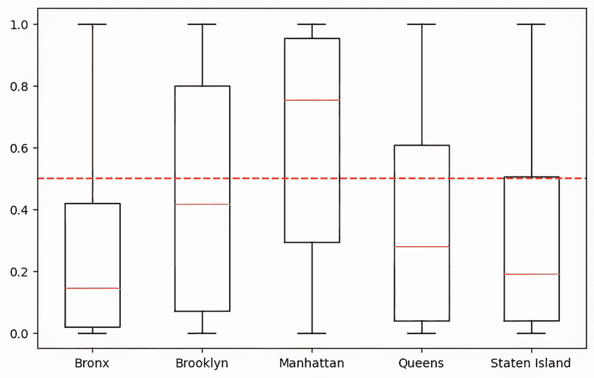
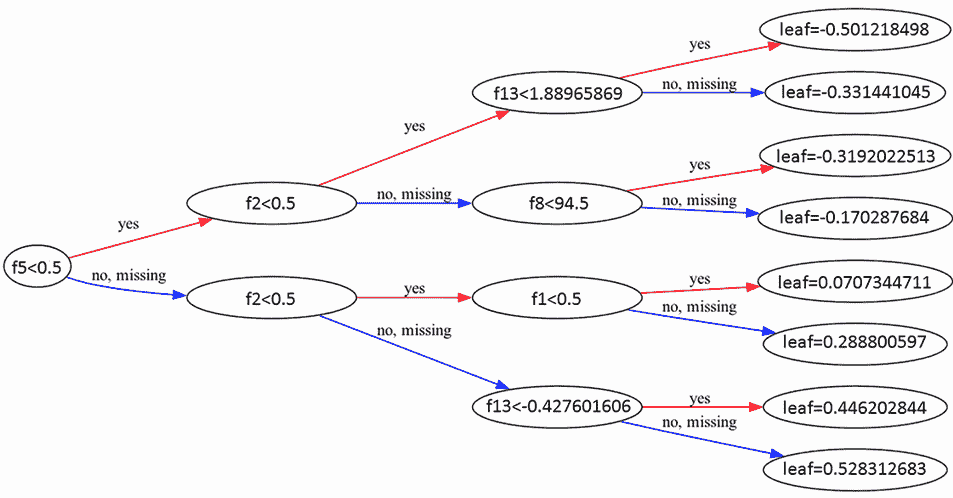
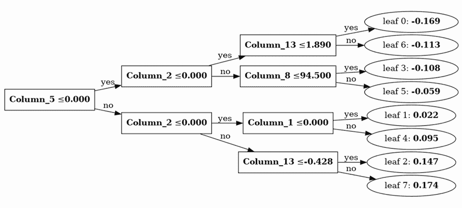

# 6 高级特征处理方法

本章涵盖

+   使用更高级的方法处理特征

+   选择有用的特征以创建更轻便、更易于理解的模型

+   优化超参数以使您的模型在性能上更加出色

+   掌握梯度提升决策树的具体特性和选项

我们现在已经讨论了决策树，它们的特性，它们的局限性，以及所有它们的集成模型，无论是基于随机重采样的，如随机森林，还是基于提升的，如梯度提升。由于提升解决方案被认为是表格数据建模的当前最佳状态，我们详细解释了它是如何工作的以及如何优化其预测。特别是，我们介绍了几种可靠的梯度提升实现，XGBoost 和 LightGBM，它们正在证明是处理表格数据的科学家所能获得的最佳解决方案。

本章将涉及有关经典机器学习的更一般主题。然而，我们将专注于梯度提升决策树（GBDTs），特别是 XGBoost。在本章中，我们将讨论更高级的特征处理方法，例如多元缺失值插补、将高基数分类特征转换为简单数值的目标编码，以及根据它们与目标的关系来确定如何转换或细化特征的一般方法。我们将提出几种方法来减少特征数量到基本要素，并根据可用的计算资源和您选择的模型来优化超参数。然后，本章将以仅与 GBDTs 相关的先进方法和选项部分结束。

## 6.1 特征处理

在处理现实世界的表格数据集时，您可能会遇到各种问题，如果我们不调整技术以应对数据的现实情况，我们之前讨论的所有方法都将产生不理想的结果。在这里，我们将考虑一些这样的问题，例如以最智能的方式处理缺失值，转换具有大量唯一值的分类特征，以及找到在训练模型后重新处理特征以挤出更多性能的方法。这当然不是详尽的列表，但它应该能帮助您练习发现问题和规划适当的方案。

如前一章所述，为了解释和举例，我们再次将依赖于 Airbnb 纽约市数据集来展示处理表格数据问题中最具挑战性的任务的实用示例。以下列表回顾了我们将再次在本章中使用的数据和一些关键函数和类。

列表 6.1 回顾 Airbnb 纽约市数据集

```py
import numpy as np
import pandas as pd
from sklearn.preprocessing import (
    StandardScaler,
    OneHotEncoder,
    OrdinalEncoder
)
from sklearn.impute import SimpleImputer
from sklearn.compose import ColumnTransformer
from sklearn.pipeline import Pipeline

data = pd.read_csv("./AB_NYC_2019.csv")
excluding_list = ['price', 'id', 'latitude', 'longitude', 'host_id', 
                  'last_review', 'name', 'host_name']            ①
low_card_categorical = [
    'neighbourhood_group',
    'room_type'
]                                                                ②
high_card_categorical = ['neighbourhood']                        ③
continuous = [
    'minimum_nights',
    'number_of_reviews',
    'reviews_per_month', 
    'calculated_host_listings_count',
    'availability_365'
]                                                                ④
target_mean = (
    (data["price"] > data["price"].mean())
    .astype(int)
)                                                                ⑤
target_median = (
    (data["price"] > data["price"].median())
    .astype(int)
)                                                                ⑥
target_multiclass = pd.qcut(
    data["price"], q=5, labels=False
)                                                                ⑦
target_regression = data["price"]                                ⑧
categorical_onehot_encoding = OneHotEncoder(handle_unknown='ignore')
categorical_ord_encoding = 
OrdinalEncoder(handle_unknown="use_encoded_value", unknown_value=np.nan)
numeric_standardization = Pipeline([('StandardScaler', StandardScaler()), 
                                    ('Imputer', 
SimpleImputer(strategy="constant", fill_value=0))])

column_transform = ColumnTransformer(
    [
        ('low_card_categories', 
         categorical_onehot_encoding, 
         low_card_categorical),
        ('high_card_categories', 
         categorical_ord_encoding, 
         high_card_categorical),
        ('numeric', 
         numeric_standardization, 
         continuous)
    ],
    remainder='drop',
    verbose_feature_names_out=True,
    sparse_threshold=0.0)                                        ⑨

lm_column_transform = ColumnTransformer(
    [
        ('low_card_categories', 
         categorical_onehot_encoding, 
         low_card_categorical),
        ('numeric', 
         numeric_standardization, 
         continuous)
    ],
    remainder='drop',
    verbose_feature_names_out=True,
    sparse_threshold=0.0)                                        ⑩
```

① 特征处理中排除的列列表

② 需要一元编码的低基数分类列列表

③ 需要顺序编码的高基数分类列列表

④ 列出连续特征列

⑤ 创建一个二元目标，指示价格是否高于平均值（不平衡的二元目标）

⑥ 创建一个二元目标，指示价格是否高于中位数（平衡的二元目标）

⑦ 通过将价格分箱为五个类别来创建多类目标

⑧ 将回归的目标设置为价格列

⑨ 创建一个列转换器，对不同的特征组应用不同的转换

⑩ 创建一个适合线性模型的列转换器

我们参考前一章中提供的代码解释的所有细节。唯一的补充是一个专门为线性模型设计的列转换器。这个转换器仅通过执行独热编码处理低基数分类特征，而将高基数分类特征排除在外。

### 6.1.1 多变量缺失数据填充

在你的表格数据集中存在缺失数据是一个阻碍问题，因为除了 GBDTs 解决方案，如 XGBoost、LightGBM 和 Scikit-learn 的 HistGradientBoosting 之外，经典的机器学习算法没有对缺失值的原生支持。此外，即使你选择的 GBDTs 算法可以处理缺失值，正如下一节所解释的，你仍然可能发现直接填充缺失值更有效，因为你可以在事先检查每个特征或特定案例是如何处理的。

在第二章中，我们讨论了简单的填充方法，例如使用平均值或中位数，以及构建缺失指示器的有用性，从而使得算法更容易发现存在的缺失模式。本节将提供更多关于这些技术和多元填充的细节。

首先，除非缺失案例依赖于未观测变量，例如你无法访问的特征，否则缺失数据可以归类为

+   *完全随机缺失*（MCAR）——在这种情况下，数据缺失与观测到的和未观测到的变量无关。缺失发生在数据集的随机位置。

+   *随机缺失*（MAR）——MAR 假设观测变量，而不是未观测变量，可以解释缺失。换句话说，缺失的概率完全取决于观测数据。

当缺失案例依赖于缺失数据的未观测值时，你陷入了“缺失非随机”（MNAR）的情况，这需要相当专业的处理，但这本书不是主题。然而，假设你理解某些缺失非随机缺失数据背后的机制，例如当你没有在人口普查中获得关于太富有人（由于隐私）或太穷的人（由于普遍缺乏访问）的信息时。在这种情况下，你可以尝试收集一些暗示他们财富的新特征，以添加到你的数据集中，并回到“随机缺失”（MAR）的情况。

通常，你经常会遇到缺失数据是 MCAR 或 MAR 的情况。在这两种情况下，除了使用与 MCAR 完美配合的期望值进行简单填充外，你还可以通过多元填充更好地重建缺失数据。*多元填充*是一种使用数据集中预测变量之间的相关性来填充缺失值的方法。它涉及构建一系列模型，根据变量之间的关系来估计缺失值。在此方法中，每个模型将具有缺失值的特征视为目标变量（通过仅对其已知值进行建模），并使用剩余的特征作为预测变量。然后，使用得到的模型来确定用哪些值替换目标中的缺失值。你可以设置算法如何循环特征进行填充。你通常使用默认设置，从缺失数据较少的特征开始，逐步过渡到缺失值较多的特征，这是首选且最有效的方法。

为了处理预测变量中的缺失值，首先使用简单均值或其他基本填充方法进行初步填充。然后，通过多次迭代，通过结合填充模型的成果来细化初始估计。这种迭代过程持续进行，直到填充值达到稳定状态，进一步的迭代不会导致显著变化。Scikit-learn 通过`IterativeImputer`实现多元填充（[`mng.bz/MDZQ`](https://mng.bz/MDZQ)）。受 R MICE 包（通过链式方程进行多元填充：[`mng.bz/avEj`](https://mng.bz/avEj)）的启发，它允许进行多元填充和多次填充，这是统计学和社会科学中常见的方法，在这种方法中，你得到的不是单个填充值，而是一系列可能的替代值的分布。通过将`sample_posterior`参数设置为 True 并使用不同的随机种子多次运行`IterativeImputer`，可以实现多次填充。

然而，在数据科学中的表格数据应用中，多元填充是首选的选择，因为它允许基于单一但精确的估计来构建模型。在我们的例子中，我们取 Airbnb NYC 数据集的连续特征，并随机删除 5%的数据，从而模拟 MCAR 情况。之后，我们运行`SimpleImputer`，用均值和`IterativeImputer`替换缺失值。最后，我们使用平均绝对误差（MAE）比较每种方法重建的特征与原始值。

列表 6.2 多元填充

```py
from sklearn.experimental import (
    enable_iterative_imputer
)                                                             ①
from sklearn.impute import SimpleImputer, IterativeImputer
from sklearn.ensemble import RandomForestRegressor

Xm = data[continuous].copy()                                  ②
missing_percentage = 0.05
np.random.seed(0)
mask = np.random.rand(*Xm.shape) < missing_percentage         ③
Xm[mask] = np.nan

simple_imputer = SimpleImputer()
Xm_si = simple_imputer.fit_transform(Xm)                      ④

rf = RandomForestRegressor(random_state=0, n_jobs=-1)         ⑤
multivariate_imputer = IterativeImputer(
    estimator=rf,
    max_iter=1,
    tol=0.01
)                                                             ⑥
Xm_mi = multivariate_imputer.fit_transform(Xm)                ⑦

mae = pd.DataFrame(
    {
        "simple": np.mean(
            np.abs(data[continuous] - Xm_si), axis=0
        ),
        "multivariate": np.mean(
            np.abs(data[continuous] - Xm_mi), axis=0
        )
     },
     index = continuous
)                                                             ⑧
print(mae)
```

① 导入 IterativeImputer，它在 Scikit-learn 中仍然是实验性的，并且正在改进中

② 创建连续特征数据的副本

③ 创建一个掩码以随机标记缺失值

④ 使用具有均值填充策略的 SimpleImputer 实例

⑤ 实例化 RandomForestRegressor 进行迭代填充

⑥ 创建一个具有最大迭代次数 `max_iter` 和容忍度 `tol` 作为停止标准的 `IterativeImputer` 实例

⑦ 使用迭代插补来插补缺失数据

⑧ 计算插补数据和原始数据的平均绝对误差（MAE）

命令 `print(mae)` 提供的结果是一个表格，它比较了简单插补和多变量插补方法：

```py
                                       Simple        Multivariate
minimum_nights                         0.347355      0.260156
number_of_reviews                      1.327776      0.858506
reviews_per_month                      0.057980      0.036876
calculated_host_listings_count         0.579423      0.368567
availability_365                       6.025748      4.62264
```

比较结果表明，多变量方法，特别是 `IterativeImputer`，在单次迭代后始终产生比简单插补方法更低的 MAE 值。这表明 `IterativeImputer` 在用更少的错误替换缺失值方面更有效。为了获得更好的估计，你可以将 `max_iter` 增加到更高的数值，并让算法根据容忍度值（用于检查结果是否稳定的容忍度阈值）来决定是否提前停止。增加 `max_iter` 将导致更长的插补时间，因为作为一个插补模型，我们正在使用随机森林算法。随机森林通常是处理多变量估计（在 R 社区中称为 *MissForest* 的方法）的最有效方式：[`rpubs.com/lmorgan95/MissForest`](https://rpubs.com/lmorgan95/MissForest)。然而，你可以通过简单地替换 `IterativeImputer` 中的 `estimator` 来选择基于线性模型或 k 近邻的更快方法：

+   BayesianRidge—简单地使用 `BayesianRidge()`

+   RandomForestRegressor—对于随机树回归的森林，你可以设置 `n_estimators`、`max_depth` 和 `max_features` 来创建更浅的树，从而加速插补过程，例如 `RandomForestRegressor(n_estimators=30, max_depth=6, max_samples=0.5)`

+   Nystroem + Ridge—一个通过组合不同的 Scikit-learn 命令（`make_pipeline(Nystroem(kernel="polynomial", degree=2, random_state=0), Ridge(alpha=1e3))`）来扩展二次多项式核和正则化线性回归的管道

+   KNeighborsRegressor—一个 k 近邻插补方法，你可以决定要考虑的邻居数量，例如 `KNeighbors-Regressor(n_neighbors=5)`

你使用的估计器将影响你获得的结果的质量和计算时间。作为起点，`BayesianRidge` 是默认选择，也是最快的。如果你有更多时间，`RandomForestRegressor` 将为你提供更好的估计。通过联合输入多个变量，`IterativeImputer` 以更多的计算和编写代码为代价，更准确地捕捉变量之间的依赖关系。对于简单直接、即插即用的解决方案，一些 GBDT 实现提供了处理缺失值的原生支持，我们将在下一节中了解到这一点。

### 6.1.2 使用 GBDT 处理缺失数据

XGBoost 和 LightGBM 算法（以及 Scikit-learn 的 HistGradientBoosting）通过在每个分割点将缺失值分配给最大化损失函数最小值的那个分支来相似地处理缺失值。XGBoost 通过其稀疏度感知分割查找算法引入了这项技术，该算法在数据缺失时提供了一个默认的方向，无论是由于缺失还是存储在只保留非零值的稀疏矩阵中。

因此，别忘了 XGBoost 会将稀疏矩阵中的零视为缺失值，并应用其特定的算法来处理缺失数据。因此，一方面，当你分析具有高基数分类变量的 one-hot 编码矩阵时，将其创建为稀疏矩阵可能会很方便，因为这将节省你大量的内存和计算。另一方面，你可能会注意到，如果你分析的数据以密集矩阵或稀疏矩阵的形式表示，XGBoost 返回的模型可能完全不同。

差异在于当 XGBoost 遇到缺失示例时会发生什么。在训练过程中，算法在每个分割点学习，具有缺失值的样本应该根据结果增益分配到左分支或右分支。在做出预测时，具有缺失值的样本将相应地分配到适当的子节点。这允许算法根据特征值的缺失模式进行分割，如果它是预测性的。如果在训练过程中给定特征没有缺失值，则具有缺失值的样本将被分配到具有最多样本的子节点。

你可以使用缺失参数来指定 XGBoost 将考虑为缺失的值。此参数默认设置为 NaN，但你可以选择任何你想要的值。

关于 XGBoost 的另一个重要事项是，使用线性模型作为基学习者的`gblinear`增强器将缺失值视为零。假设你标准化了你的数值特征，正如在线性模型中常用那样。在这种情况下，`gblinear`增强器将缺失值视为该特征的平均值，因为平均数会取标准化变量中的零值。

LightGBM 采用类似的方法（见[`github.com/microsoft/LightGBM/issues/2921`](https://github.com/microsoft/LightGBM/issues/2921)），使用特定的参数：

+   LightGBM 默认启用处理缺失值的功能。通过设置`use_missing=false`来关闭它。

+   LightGBM 默认使用 NA（NaN）来表示缺失值。通过设置`zero_as_missing=true`将其更改为使用零。

+   当`zero_as_missing=false`（默认值）时，稀疏矩阵（和 LightSVM）中的未记录值被视为零。

+   当`zero_as_missing=true`时，NA 和零（包括稀疏矩阵[和 LightSVM]中的未记录值）被视为缺失。

这种处理缺失数据的方法在平均情况下效果很好，特别是如果你的数据是 MCAR（完全随机缺失）。这意味着缺失实例的模式是完全随机的，并且与任何其他特征或隐藏的潜在过程无关。当缺失与其他特征值相关，但与特征本身的值无关时，情况就不同了，这就是 MAR（相关缺失）。在 NMAR（系统缺失）的情况下，存在与特征本身和其他特征相关的缺失值的系统模式。在 MAR 和 NMAR 的情况下，最佳解决方案是尝试通过其他方式尝试填充这些值，因为 XGBoost 和 LightGBM 的缺失数据策略可能表现出性能不足。 

然而，对于缺失数据的填充，也有一些替代方案。例如，你可以创建缺失数据指示器，这些是二进制特征，其值对应于变量中缺失实例。如果数据不是完全随机缺失，缺失数据指示器可能非常有价值，并且它们可以与任何经典机器学习算法一起工作。另一个与决策树相关的流行解决方案是将缺失值分配给数据集中任何变量都没有使用的极端值（通常是负极端值）。如果你使用的是精确分割，而不是基于直方图的分割，其中值被归入桶中，那么用极端值替换缺失数据可以证明是一个高效且简单的方法。

### 6.1.3 目标编码

分类特征，通常在数据集中以字符串的形式表示，可以通过不同的策略有效地处理。我们已经在第二章和第四章中提到了独热编码。与独热编码一样，所有其他用于分类特征的策略，无论其基数是高还是低，都需要进行*编码*，这是一种将数据数值化并转换为适合机器学习算法的合适格式的程序。尽管有一些相似之处，但编码不应与*嵌入*混淆，嵌入是一种将高维数据（如文本或图像）降低到较低维空间的过程，同时保留原始数据的一些特征或关系。嵌入通常通过基于神经网络的模型学习，并在我们的书中简要介绍。

Scikit learn 包提供了一些编码解决方案：

+   `OneHotEncoder`—用于独热编码（即将每个唯一的字符串值转换为二进制特征），这是我们迄今为止使用的解决方案

+   `OrdinalEncoder`—用于顺序编码（即，将特征中的字符串值转换为有序的数值；还有一个`LabelEncoder`，它的工作方式相同，主要用于将分类目标转换为数值）

通常，一热编码对于线性模型和基于树的模型都适用，有序编码对于更复杂的基于树的模型，如随机森林和 GBDTs，也适用，因为树可以递归地根据类别特征进行分割，并最终找到一组对预测有用的分区。然而，当使用一热编码或有序编码时，高基数类别会引发问题。高基数是线性模型和基于树的模型的弱点。当进行一热编码时，高基数类别会产生稀疏矩阵，由于内存限制，这些矩阵不能轻易转换为密集矩阵。此外，具有许多分支级别的决策树可能需要帮助将有序编码的高基数类别特征分割成对预测有意义的分区。

没有一个普遍固定的标准来声明何时一个类别具有高基数，因为这还取决于你的数据集有多少行以及你的计算机内存可以处理多少个一热编码的特征。然而，高基数类别特征通常包括 ID、邮编以及具有许多唯一值的产品或地理名称。例如，一个合理的阈值可能是超过 512，但根据数据集可能更低。根据经验法则，一个特征中的类别数量不应超过数据集总行数的 5%–10%，对于较小的数据集来说，512 可能过高。在这种情况下，标准做法，尤其是来自像 Kaggle 这样的数据科学竞赛，建议求助于*目标编码*（也称为*均值编码*）。

目标编码首次在 Micci-Barreca 的论文中提出，“用于分类和预测问题中高基数属性的预处理方案”（ACM SIGKDD Explorations Newsletter 3.1，2001），目标编码简单地将类别特征中的值转换为它们对应的预期目标值。如果你的问题是回归，目标编码将使用与数据集中该值相对应的平均目标值，对于分类问题：条件概率或优势比。这个过程，当数据集中该类别示例较少时，可能会给模型带来过拟合的风险，可以通过使用该类别预期值（目标的后验概率）与所有数据集的平均预期值（所有训练数据中目标的前验概率）之间的加权平均来减轻这种风险。

目标编码在 category-encoders 包中可用（[`mng.bz/gave`](https://mng.bz/gave)），这是一个与 Scikit-learn 兼容的项目，作为目标 TargetEncoder 类（[`mng.bz/5glq`](https://mng.bz/5glq)），您可以通过在 shell 中运行`pip install category_encoders`命令来安装它。在 TargetEncoder 类中，您必须指定一个平滑参数（应固定在零以上的值）以在目标的后验概率和整个训练数据中的先验概率之间进行平衡。您数据中最佳的平滑参数必须通过实验来找到，或者您可以依赖另一个类似的编码器，James Steiner 编码器，它根据您想要编码的类别的条件方差猜测平滑预期目标值的最优方式（[`mng.bz/5glq`](https://mng.bz/5glq)）。James Stenier 编码器对您的数据做出了更强的假设。您必须决定通过模型参数（对于回归问题，建议使用“独立”，对于分类问题，使用“二元”）来估计条件方差的不同方法。尽管如此，它还是让您免于像超参数一样尝试不同的混合阈值。

在我们的例子中，我们使用`neighborhood`特征，它有超过 200 个唯一值，以及将纬度和经度坐标映射到 100 x 100 网格空间后的坐标。映射返回一个具有超过 2,000 个不同值的特征，毫无疑问，它是一个高基数分类特征。在列表 6.3 中，我们首先对纬度和经度进行分箱，然后通过将它们相加以产生每个纬度和经度分箱组合的唯一代码来组合它们。分箱是通过将特征的最小值和最大值之间的范围分成相等的部分来获得的。此外，代码片段对两个不同的特征执行分箱，为每个特征生成整数值集合。一个特征的值乘以一个大于另一个特征最大值的 10 的幂，这确保了当将两组值相加时，总是获得一个唯一值，无论相加的具体值是什么。

列表 6.3 创建高基数分类特征

```py
def bin_2_cat(feature, bins=100):
    min_value = feature.min()
    bin_size = (feature.max() - min_value) / bins
    bin_values = (feature - min_value) / bin_size
    return bin_values.astype(int)                         ①

data['coordinates'] = (
    bin_2_cat(data['latitude']) * 1000 
    + bin_2_cat(data['longitude']
)                                                         ②
high_card_categorical += ['coordinates']

print(data[high_card_categorical].nunique())              ③
```

① 函数将数值数据转换为分类箱

② 将纬度和经度转换为分类坐标

③ 打印高基数分类特征中的唯一值数量

代码片段以检查高基数特征中每个特征的唯一值数量结束：

```py
neighbourhood     221
coordinates      2259
```

考虑到有两个分类特征被认为是高基数，我们可以在我们的预处理管道中添加 category-encoders 的`TargetEncoder`。

列表 6.4 在管道中使用目标编码

```py
from category_encoders.target_encoder import TargetEncoder
from XGBoost import XGBClassifier
from sklearn.model_selection import KFold, cross_validate
from sklearn.metrics import accuracy_score, make_scorer

target_encoder = TargetEncoder(cols=high_card_categorical,  ①
                               smoothing=0.5)               ②
accuracy = make_scorer(accuracy_score)
cv = KFold(5, shuffle=True, random_state=0)
xgb = XGBClassifier(booster='gbtree',
                    objective='reg:logistic',
                    n_estimators=300,
                    max_depth=4,
                    min_child_weight=3)                     ③

column_transform = ColumnTransformer(
    [
        ('low_card_categories', 
         categorical_onehot_encoding, 
         low_card_categorical),
       ('high_card_categories', 
        target_encoder, 
        high_card_categorical),
       ('numeric', 
        numeric_standardization, 
        continuous)
    ],
    remainder='drop',
    verbose_feature_names_out=True,
    sparse_threshold=0.0)                                   ④

model_pipeline = Pipeline(
    [('processing', column_transform),
     ('model', xgb)])                                       ⑤

cv_scores = cross_validate(estimator=model_pipeline,
                          X=data,
                          y=target_median,
                          scoring=accuracy,
                          cv=cv,
                          return_train_score=True,
                          return_estimator=True)        ⑥

mean_cv = np.mean(cv_scores['test_score'])
std_cv = np.std(cv_scores['test_score'])
fit_time = np.mean(cv_scores['fit_time'])
score_time = np.mean(cv_scores['score_time'])
print(f"{mean_cv:0.3f} ({std_cv:0.3f})",
      f"fit: {fit_time:0.2f}",
      f"secs pred: {score_time:0.2f} secs")                 ⑦
```

① 为高基数分类特征初始化 TargetEncoder

② 平滑值以融合先验和后验概率

③ 使用特定超参数初始化 XGBoost 分类器

④ 定义 ColumnTransformer 以使用 TargetEncoder 对高基数分类特征进行预处理

⑤ 创建一个结合预处理和建模的管道

⑥ 执行五折交叉验证并获取评估指标

⑦ 从交叉验证中打印出平均准确率、拟合时间和预测时间

当执行时，代码过程将运行 XGBoost 的结果，并额外帮助处理高基数分类特征的问题。结果指向准确率的一点点提升。在本章的后面部分，我们将调查在检查可解释性时目标编码贡献的权重：

```py
0.840 (0.004) fit: 4.52 secs pred: 0.06 secs
```

尽管目标编码是一个方便的程序，因为它可以快速将任何分类特征转换为数值特征，但在这样做的时候，你必须注意保留数据中的所有重要信息。目标编码使得对特征之间任何交互的进一步建模成为不可能。比如说，如果你正在处理一个广告响应数据集，其中包含许多网站和广告格式的点击结果。如果你对两个特征进行编码，将两个可能具有数千个值的高的基数分类特征转换，你可能会轻松地创建任何类型的经典模型。然而，在编码之后，你的模型，无论是线性的还是基于树的，将无法理解编码特征之间任何可能的交互。在这种情况下，解决方案是在事先创建一个新特征，结合这两个高基数分类特征，然后对它们的组合进行目标编码。

因此，对于其他工具，我们也应该考虑这种高级编码技术的利弊。根据我们的经验，在求助于目标编码之前，对于经典机器学习算法和梯度提升算法处理高基数分类特征，有几个选项：

+   直接删除有问题的分类特征

+   使用 OneHotEncoder

+   使用 OrdinalEncoder 并将类别视为有序等距的数量

+   使用 OrdinalEncoder 并依赖梯度提升直方图算法的本地类别支持

+   作为最后的手段使用目标编码

删除特征只被考虑在少数情况下。然而，我们在第二章中已经提到，你可以如何利用 Cramer 的 V 相关度度量来评估一个名义特征如何有助于预测目标。

当面对高基数分类特征时，对于线性模型来说，选择 one-hot 编码几乎是必要的。当处理其他模型，如决策树及其集成时，可能存在更合适的方案。这是因为 one-hot 编码为分类特征的每个分类值创建了一个额外的特征。这导致树模型在拟合过程中必须考虑的分割点数量增加。因此，使用 one-hot 编码的数据需要在决策树中具有更多的深度，以实现等效的分割，这可以通过使用处理分类特征的不同方式通过单个分割点实现。

对于有序编码器，分类被编码为 0，1，2 等等，将它们视为连续特征。虽然这种方法对于线性模型来说可能会误导，但它对于决策树来说非常有效。决策树可以根据目标变量的关系准确地对数据进行分割，根据分类分离。这在 XGBoost 中发生，它将所有特征视为数值，连续特征。

如果我们决定使用对分类特征的本地支持，这个选项在 LightGBM 以及由 H2O.ai 库提供的 XGBoost 版本中都是可用的（[`mng.bz/6e75`](https://mng.bz/6e75)）。本地分类支持使得这些模型能够更有效地处理分类特征，而无需将它们转换为数值。在这种情况下，由于本地处理需要排序分类，我们预计在使用本地处理分类特征相对于将分类视为有序数时，算法会稍微慢一些。在本地分类支持中，一个特征的分类排序是基于每个分类的关联目标方差。一旦排序完成，该特征就可以用作连续的数值属性。

### 6.1.4 转换数值数据

决策树可以自动处理数据中的非线性性和交互作用。这是因为它们可以在任何点上将变量分割成两部分，然后反复进一步分割。这种特性在处理数据中的微妙和深层交互时特别有用，但有一个前提，因为决策树是相当粗糙的近似器。从精确建模数据中的复杂关系的角度来看，具有足够示例的神经网络是更好的近似器。

图 6.1 展示了如何通过决策树集成来近似非线性函数。结果是通过对空间进行递归分割的一系列 if-then-else 决策规则构建的近似。然而，数据中的噪声可能导致空间某些部分的不准确。相比之下，具有与袋装决策树中使用的树相同数量的节点的神经网络可以提供更平滑、更准确的曲线估计。


图 6.1 随机数据集上神经网络与袋装树集成预测的比较，数据集包含有噪声的正弦函数

由于 GBDT（梯度提升决策树）也是基于决策树的，它可能在用二分分裂来塑造非线性函数时遇到类似的困难。因此，当使用 GBDT，并且你知道特定的非线性或交互时，通过使用向线性形式转换、分箱或离散化以及特征之间的预计算交互来明确地定义它们，对你是有益的。对于非线性性，转换有助于减少分裂的数量。此外，事先计算特定的交互也可以减少在更好的分裂点发生的分裂数量。

然而，在应用这些转换之前，你需要了解你的数据。线性性和非线性性，即使与目标没有关系，也可以在通过部分依赖图（PDP）完成训练数据的拟合后轻松发现。这种模型无关的图表技术解释了特征和目标是如何通过训练的模型相互关联的。

PDPs（部分依赖图）显示了目标输出如何根据特定的输入特征变化，同时忽略其他输入特征的影响。换句话说，它展示了如果我们为特定输入特征的每个数据点设置一个特定的值，我们将得到的平均预期预测。分析背后的假设是，我们通过 PDP 表示的输入与其他特征是独立的。在这种条件下，PDP 表示输入特征如何直接影响目标。然而，在实践中，这个假设通常被违反，这意味着我们正在检查的输入特征通常并不完全独立于其他特征。因此，图表通常显示了目标值如何随着输入特征值的改变而变化，同时也反映了模型中其他特征的总体影响。

在列表 6.5 中，我们探讨了 PDPs 的可能用途和局限性。针对我们在 Airbnb NYC 数据集上训练的 XGBoost 模型，我们展示了我们的目标如何根据我们的数值特征变化，试图发现任何非线性或其他模型数据的特征。四个生成的图表使用 matplotlib 轴绘制，并进行分析。

列表 6.5 部分依赖图

```py
from XGBoost import XGBClassifier
import matplotlib.pyplot as plt
from sklearn.inspection import PartialDependenceDisplay

xgb = XGBClassifier(booster='gbtree', 
                    objective='reg:logistic', 
                    n_estimators=300, 
                    max_depth=4,
                    min_child_weight=3)

model_pipeline = Pipeline(
    [('processing', column_transform),
     ('XGBoost', xgb)])                                 ①

model_pipeline.fit(X=data, y=target_median)

fig, axes = plt.subplots(
   nrows=2,
   ncols=2,
   figsize=(8, 4)
)                                                       ②
fig.subplots_adjust(hspace=0.4, wspace=0.2) 

PartialDependenceDisplay.from_estimator(
    model_pipeline, 
    X=data, 
    kind='average',                                     ③
    features=[
        'minimum_nights',
        'number_of_reviews', 
        'calculated_host_listings_count',
        'availability_365'
    ],                                                  ④
    ax=axes
)
for ax in axes.flatten():
    ax.axhline(y=0.5, color='red', linestyle='--')      ⑤

plt.show()
```

① 创建一个结合数据处理和 XGBoost 分类器的模型管道

② 创建一个 2×2 的子图布局

③ 创建平均效应的部分依赖图

④ 指定用于图表的特征列表

⑤ 在每个子图上添加一条 y=0.5 的红色虚线，作为解释的参考线

图 6.2 显示了四个图表。虚线标记了一个（大于或等于 0.5）和零（小于 0.5）的分类阈值。实线描述了 x 轴上的特征值与 y 轴上的目标概率之间的关系。x 轴上的刻度标记指出特征的分布十分位数，暗示着值密集（刻度彼此相邻）的区域和值稀疏（刻度彼此远离）的区域。值稀疏的区域在估计上不太可靠。例如，`minimum_nights`和`calculated_host_listings_count`显示非线性模式，而`number_of_reviews`和`availability_365`则表现出稳定的振荡。


图 6.2 数字特征的 PDP 面板

在得到这样的结果后，你可以尝试通过试错法使用变换函数来评估`minimum_nights`和`calculated_host_listings_count`，例如

+   平方或立方变换

+   平方根或立方根

+   对数或指数变换

+   切线、正弦和余弦变换

+   逆变换、平方逆变换、立方逆变换、平方根逆变换、立方根逆变换

+   对数逆变换、指数逆变换、切线逆变换、正弦逆变换、余弦逆变换

然而，在匆忙进行变换测试之前，重要的是要验证获得的 PDP 平均曲线是否代表该特征在所有情况下的行为。你可以使用个体条件期望（ICE）图来验证这一点。ICE 图是 PDP 曲线的单个组成部分。你可以通过稍微修改之前的代码来获得 ICE 图。

列表 6.6 ICE 图

```py
import matplotlib.pyplot as plt
from sklearn.inspection import PartialDependenceDisplay

fig, axes = plt.subplots(nrows=2, ncols=2, figsize=(8, 4))
fig.subplots_adjust(hspace=0.4, wspace=0.2)

PartialDependenceDisplay.from_estimator(model_pipeline, 
                                        X=data, 
                                        kind='both',               ①
                                        subsample=30,              ②
                                        features=['minimum_nights', 
                                                  'number_of_reviews', 

                                                  'calculated_host_listings_count', 
                                                  'availability_365'],
                                       ax=axes)

for ax in axes.flatten():
    ax.axhline(y=0.5, color='red', linestyle='--')
    ax.legend().set_visible(False)

plt.show()
```

① 创建一个部分依赖图，显示个体和平均效应

② 使用 30%的数据随机子集进行绘图以提高效率

运行代码后，你可以检查结果，如图 6.3 所示。你可以看到与之前相同的 PDP 平均曲线，用虚线表示，以及从样本中随机抽取的 30 条曲线。假设你可以验证这些抽样曲线是聚集在一起的，大致复制了平均曲线的形状。在这种情况下，你可以确认平均 PDP 曲线代表了特征相对于目标的行为。否则，就像我们的例子一样，如果单条曲线看起来不同且分散，其他特征由于共线性或交互作用而在某种程度上调节了特征与特征的关系，你无法从变换特征中获得太多好处。


图 6.3 数字特征的 ICE 图面板

到目前为止，我们只是使用了 PDP（部分依赖图）来处理数值特征。然而，在通过独热编码进行编码后，你也可以将它们应用于二进制和分类特征。在这种情况下，你首先必须使用独立的函数`partial_dependence`计算曲线值，然后以条形图（用于 PDP 平均曲线）或箱线图（用于 PDP 和 ICE 曲线一起）的形式表示获得的价值。在以下列表中，我们提取了必要的值，并为`neighbourhood_group`的单个级别创建了一个箱线图表示。

列表 6.7 二进制特征的 PDP 图

```py
from sklearn.inspection import partial_dependence         ①
import matplotlib.pyplot as plt

pd_ice = partial_dependence(model_pipeline, X=data, 
                            features=['neighbourhood_group'], 
                            kind='both')

fig = plt.figure(figsize=(8, 5))
ax = fig.add_subplot(1, 1, 1)
labels = np.ravel(pd_ice['values'])
plt.boxplot(
    pd_ice["individual"].squeeze(),
    labels=labels
)                                                         ②
ax.axhline(y=0.5, color='red', linestyle='--')            ③
plt.show()
```

① 导入计算曲线值的部分依赖函数

② 创建单个 ICE 曲线的箱线图

③ 在每个子图中添加一条红色虚线，y = 0.5，作为解释的参考线

图 6.4 显示了结果，提供了关于曼哈顿公寓位置通常与更高价格相关联的见解。根据模型，其他位置与较低价格相关联。然而，布鲁克林显示出最大的变异性，有时价格较高，类似于曼哈顿，这显然取决于与公寓的确切位置或特征相关的其他因素。



图 6.4 对于每个二进制特征，PDP 获得的相关目标值的箱线图

与数值特征一样，PDP 曲线也提供了关于如何增强你的模型的有用见解。例如，它们可以用来聚合表现相同的分类特征的级别——在我们的例子中，布朗克斯、斯塔滕岛，也许还有皇后区。

PDP（部分依赖图）向我们展示了基于我们感兴趣的输入特征我们可以期待的目标输出。它们还帮助我们理解目标响应与感兴趣输入特征之间的关系，无论是线性的还是非线性的。通过观察分析绘制的曲线形状，我们还可以找出可以使其线性化的转换。当将特征元组作为`PartialDependenceDisplay`函数的`features`参数提供时，该函数将输出一个等高线图，显示两个特定特征的联合效应。以这种方式发现交互是漫长而繁琐的，尤其是如果你有很多特征要探索。一个解决方案是自动发现潜在的交互，然后使用 PDP 联合图表进行测试。通过使用 XGBoost Feature Interactions Reshaped（XGBFIR；[`github.com/limexp/xgbfir`](https://github.com/limexp/xgbfir)）这样的项目，自动检测交互是直截了当的。以下列表显示了在命令行中通过`pip install xgbfir`安装包后可以运行的示例。

列表 6.8 通过 XGBFIR 发现交互

```py
import xgbfir
xgbfir.saveXgbFI(
    model_pipeline['XGBoost'],
    feature_names=(
        model_pipeline['processing']
        .get_feature_names_out()
    ),
    OutputXlsxFile='fir.xlsx')                                    ①
fir = pd.read_excel('fir.xlsx', sheet_name='Interaction Depth 1') ②
result = fir[["Interaction", "Gain"]].sort_values(by="Gain", 

ascending=False).head(10).round(2)                                ③
for index, row in result.iterrows():
    print(f"{row['Interaction']}")

PartialDependenceDisplay.from_estimator(
    model_pipeline,
    X=data,
    kind='average',
    features=[(
        'minimum_nights',
        'calculated_host_listings_count')])                       ④
```

① 使用 xgbfir 生成报告并将其保存到 Excel 文件中

② 读取之前步骤中创建的 Excel 文件

③ 从特征交互报告中提取并按分裂增益排序“交互”和“增益”列

④ 为“minimum_nights”和“calculated_host_listings_count”这两个特征生成部分依赖图

代码将打印一系列交互。如果你使用线性模型，应该测试 XGBFIR 返回的每个交互，因为它们可能会提高你的模型性能。如果你使用决策树，可以忽略涉及二进制特征的交互，只关注数值特征。一个例子是`minimum_nights`和`calculated_host_listings_count`之间的交互。图 6.5 显示了将它们与特定值结合如何与正目标响应强烈相关。


图 6.5 两个数值特征的联合部分依赖图

在这种情况下，通过乘法组合数值特征将优化你的 GDBT 模型的速度更快、更有效。

## 6.2 选择特征

特征选择并不总是必要的。尽管如此，当需要时，它在识别现有特征集中对训练最有价值的特征方面发挥着至关重要的作用，无论这些特征是否直接来自数据提取，还是你特征工程工作的产物。通过采用有效的特征选择技术，你可以精确地识别并保留对机器学习过程贡献显著的最重要的特征。

在第二章的第 2.2.3 节中，我们讨论了根据你对问题的了解和探索性数据分析来避免收集无关和冗余特征。在随后的章节中，我们讨论了处理无关和冗余特征的机器学习算法。

在经典机器学习中，我们有一大批算法，包括线性模型系列，它们特别容易受到无关和冗余特征的影响，这会降低性能和准确性。被认为无关的信息和无用的噪声特征，因为它们与学习任务的靶子缺乏有意义的关联，可能会给线性模型带来重大挑战。这是由于特征值与靶子之间可能存在随机对齐的可能性，这可能会误导算法并赋予这些特征过多的重视。线性模型利用所有提供的特征，这使得它们特别容易受到噪声特征的影响，因为噪声特征越多，结果就会越差。基于决策树的集成方法则较少受到无关和冗余特征的影响，因为它们会自动选择使用哪些特征并忽略其他特征。这种情况也适用于深度学习。然而，当处理表格数据中的噪声或不相关特征时，深度学习可能不如决策树集成方法鲁棒。在这种情况下，为了获得最佳性能，需要大量数据，以及仔细选择架构，例如使用 dropout、正则化或批量归一化层，以及调整学习率。

特征选择对经典机器学习算法，如线性模型，有益。然而，在基于决策树集成和深度学习架构的情况下，它同样有价值，不应忽视的是，由于处理列数减少，它使得机器学习过程更快。通过在训练前选择特征，这些复杂算法可以通过提炼最相关和最有信息量的特征，并使对模型所捕获的潜在模式和关系的理解更加清晰，从而实现提高清晰度和易于解释。这种简化增强了可解释性，并促进了算法决策过程的沟通。

在以下章节中，我们讨论和测试了一些解决方案，这些解决方案可以独立或顺序使用，以选择仅对解决您的表格数据问题至关重要的特征，并取得最佳结果。我们讨论了确定相关特征（所有相关集）的算法，这些特征可能导致冗余但有用的特征集，以及选择特征最小子集（非冗余集）的算法，这些子集产生的模型与相关特征集相当，但增加了由于特征数量减少而提高的可解释性优势。

### 6.2.1 线性模型的稳定性选择

*稳定性选择*基于这样的观点：如果你使用变量选择程序，由于过程本身的变异性，你不会总是得到相同的结果，因为子采样或自助法可能会改变数据。例如，如果你在线性模型中使用 L1 正则化进行特征选择，你可能会发现不同的样本可能会返回不同的非零系数，尤其是对于高度相关的特征。

正如我们所讨论的，L1 正则化惩罚导致系数估计的稀疏性。它是通过向损失函数添加一个惩罚项来实现的，即系数绝对值的总和。这样的惩罚项对系数绝对值的总和施加了约束，促使某些系数变为正好为零。因此，L1 正则化可以通过将某些系数缩小到零并排除相应的特征来有效地选择特征。在高度相关的特征存在的情况下，由于它们对目标变量的贡献相似，L1 正则化可能难以选择一组独特的特征。在这里，机会在某种程度上起着作用，即某些特征根据你在样本中的数据得到非零系数。然而，这可以成为我们的优势。

通过数据采样引入随机性，稳定性选择旨在识别在多个子集中始终出现的重要特征，这表明它们的鲁棒性，并减少随机或噪声选择特征的可能性。稳定性选择将提供一组有用的特征，而不是最小的一组。通过排除不重要的特征，稳定性选择确保识别出所有相关特征，因此它是一个完美的算法，用于减少特征数量的第一步。

如 Meinshausen 和 Büehlmann 在论文中提出（[`arxiv.org/abs/0809.2932`](https://arxiv.org/abs/0809.2932)），稳定性选择在一段时间内已被作为 Scikit-learn 的一部分提供，并在 Scikit-learn 兼容的项目中维护。我们可以使用 Scikit-learn 的`BaggingClassifier`和具有 L1 正则化的`LogisticRegression`来轻松复制其过程，以解决分类问题。您还可以为回归问题采用相同的代码，使用`BaggingRegressor`和 L1 回归类`Lasso`。

在我们的实现中，我们对 L1 逻辑回归进行了一系列 C 值的测试，以对抗 bootstrap 重采样。该过程创建了一系列逻辑回归系数，我们可以对它们求和、平均或计算它们与零不同的次数。鉴于我们使用的是二进制和连续特征的混合，我们发现计算与变量相关的系数的绝对值超过阈值的次数更有用。因此，我们可以最终认为，大多数情况下，倾向于具有相关系数的特征是相关的，这可能会影响最终的预测。

列表 6.9 稳定性选择

```py
import numpy as np
from sklearn.pipeline import Pipeline
from sklearn.preprocessing import StandardScaler
from sklearn.linear_model import LogisticRegression
from sklearn.ensemble import BaggingClassifier

lambda_grid=np.logspace(-4, -1, 10)                       ①
sparse_coef = list()

for modeling_c in lambda_grid:
    estimator = LogisticRegression(
        solver='liblinear',
        penalty='l1',
        C=modeling_c
    )                                                     ②
    model = BaggingClassifier(
        estimator, 
        n_estimators=100,
        bootstrap=True
    )                                                     ③
    model_pipeline = Pipeline(
        [('processing', lm_column_transform),
         ('standardize', StandardScaler()),               ④
         ('modeling', model)])
    model_pipeline.fit(data, target_median)
    sparse_coef += [estimator.coef_.ravel() for estimator in 
model_pipeline["modeling"].estimators_]

epsilon = 1e-2                                            ⑤
threshold = 0.5                                           ⑥

non_zero = (np.abs(sparse_coef) > epsilon).mean(axis=0)
feature_names = model_pipeline["processing"].get_feature_names_out()
print(non_zero)
print(feature_names[non_zero > threshold])
```

① 使用对数尺度生成一个 lambda 值的网格，用于 L1 正则化

② 创建一个具有 L1（Lasso）惩罚的逻辑回归估计器

③ 创建一个使用逻辑回归估计器作为其基础模型的 BaggingClassifier

④ 数据处理标准化后，所有系数均可比较，无论其规模如何

⑤ 将一个小的值作为 epsilon 设置为一个阈值

⑥ 设置一个阈值值以选择显著的系数

输出突出了相关系数的分布和选定的特征：

```py
[0.635 0\.    0.9   0.7   0.592 1\.    0\.    0.6   0.593 0.444 0.6   0.506 0.7  ]
['low_card_categories__neighbourhood_group_Bronx'
 'low_card_categories__neighbourhood_group_Manhattan'
 'low_card_categories__neighbourhood_group_Queens'
 'low_card_categories__neighbourhood_group_Staten Island'
 'low_card_categories__room_type_Entire home/apt'
 'low_card_categories__room_type_Shared room' 'numeric__minimum_nights'
 'numeric__reviews_per_month' 'numeric__calculated_host_listings_count'
 'Numeric__availability_365']
```

稳定性选择提供了一些优势。它可以处理高维数据，通过引入随机性来避免过拟合，并提供一个考虑选择过程稳定性的特征重要性度量。它通常用于具有大量特征的复杂应用中，如基因组学、文本挖掘或图像分析。另一方面，选择算法仅限于使用 L1 正则化的经典机器学习算法，并返回一组系数，这些系数是我们之前讨论过的：逻辑回归和 Lasso 回归。您可以通过使用特征重要性（许多集成模型估计特征重要性）来扩展稳定性选择的概念，例如 Scikit-learn 中的 `SelectFromModel` 命令 ([`mng.bz/oKej`](https://mng.bz/oKej))，但事情会变得复杂，因为您需要弄清楚什么使重要性估计相关，以及使用什么选择阈值。在下一节中，我们将回顾特征重要性是如何工作的，并介绍 Boruta。使用一个可靠的自动特征选择过程，该算法可以确定决策树集成（如随机森林或梯度提升）的相关特征。

### 6.2.2 影子特征与 Boruta

Boruta 是一种智能过程，通过依赖模型内部参数（如线性模型中的系数或基于增益的重要性值，例如在决策树及其集成中）来确定特征在机器学习问题中的相关性。它首次发表在 Miron B. Kursa 和 Witold R. Rudnicki 的《使用 Boruta 包进行特征选择》[*《统计软件杂志》36 (2010): 1-13*]一文中；欲获取文章副本，请参阅 [`www.jstatsoft.org/article/view/v036i11`](https://www.jstatsoft.org/article/view/v036i11)。

虽然 Boruta 具有创新性，但它与稳定性选择有许多相似之处。它只能与基于决策树的集成一起使用。为了测量特征的相关性，就像在稳定性选择中一样，我们寻找非零系数。在 Boruta 中，我们计算特征重要性超过影子特征获得的最重要性的次数。我们称之为“击中”。影子特征是特征自身的随机版本（基本上是打乱顺序的特征），鉴于它们是随机的，应该仅通过偶然获得任何重要性。如果任何特征不能超过影子特征相同的 Importance，则不能认为它比任何随机值序列更具预测性。

在 Boruta 中，通过将击中次数转换为二项分布来确定选择的阈值，通常是一个非零系数在稳定性选择中的最小出现次数。如果击中次数可以证明特征始终优于任何随机结构，则根据分布保留或删除特征测试的显著性阈值。

列表 6.10 展示了一个使用 Boruta 在 Airbnb 纽约数据集上对 XGBoost 分类选择所有相关特征的示例。在 BorutaPy 实现（[`github.com/scikit-learn-contrib/boruta_py`](https://github.com/scikit-learn-contrib/boruta_py)）中，Boruta 有一些限制，因为除了只能与基于树的模型（如随机森林或梯度提升，无论实现方式如何）一起工作之外，它还不能与管道一起工作。因此，我们首先必须转换数据，然后在训练最终模型时对转换后的特征运行 Boruta。Boruta 的关键参数包括估计器——即你想要使用的模型、集成中的决策树数量以及 `n_estimators` 超参数，该参数可以留空、设置为整数或设置为“auto”，此时树的数量将根据数据集的大小来决定。Boruta 的其他重要参数包括 `max_iter`，测试轮数，通常设置为 100，以及二项式检验的 alpha 阈值，该阈值可以从 0.05 增加以允许保留更多特征，或减少以丢弃更多特征。

列表 6.10 Boruta 选择

```py
from XGBoost import XGBClassifier
from boruta import BorutaPy

xgb = XGBClassifier(booster='gbtree', 
                    objective='reg:logistic', 
                    n_estimators=300, 
                    max_depth=4,
                    min_child_weight=3)

X = column_transform.fit_transform(data, target_median)                   ①
boruta_selector = BorutaPy(estimator=xgb, n_estimators='auto', verbose=2) ②
boruta_selector.fit(X, target_median)                                     ③
selected_features = boruta_selector.support_                              ④
selected_data = column_transform.get_feature_names_out()[selected_features]
print(selected_data)
```

① 转换输入数据，执行任何必要的预处理步骤

② 使用 XGBoost 分类器初始化一个 BorutaPy 特征选择对象

③ 调整 Boruta 特征选择器

④ 获取由 Boruta 特征选择器确定的所选特征的布尔掩码

经过几次迭代后，你应该只得到一个被丢弃为与问题不相关的特征的结论：

```py
Iteration:    50 / 100
Confirmed:    13
Tentative:    0
Rejected:    1
['low_card_categories__neighbourhood_group_Bronx'
 'low_card_categories__neighbourhood_group_Brooklyn'
 'low_card_categories__neighbourhood_group_Manhattan'
 'low_card_categories__neighbourhood_group_Queens'
 'low_card_categories__room_type_Entire home/apt'
 'low_card_categories__room_type_Private room'
 'low_card_categories__room_type_Shared room'
 'high_card_categories__neighbourhood' 'numeric__minimum_nights'
 'numeric__number_of_reviews' 'numeric__reviews_per_month'
 'numeric__calculated_host_listings_count' 'numeric__availability_365']
```

可以使用 LightGBM 作为预测器执行相同的程序，而不是 XGBoost：

```py
from lightgbm import LGBMClassifier

lgbm = LGBMClassifier(boosting_type='gbdt', 
                      n_estimators=300, 
                      max_depth=4,
                      min_child_samples=3)

boruta_selector = BorutaPy(estimator=lgbm, n_estimators='auto', verbose=2) ①
boruta_selector.fit(X, target_median)
selected_features = boruta_selector.support_
selected_data = column_transform.get_feature_names_out()[selected_features]
print(selected_data)
```

① 使用提供的 LightGBM 分类器初始化一个 BorutaPy 特征选择对象

结果在仅 9 次迭代后达到，这次我们有一个增加的被拒绝特征数量：

```py
Iteration:     9 / 100
Confirmed:     8
Tentative:     0
Rejected:      6
['low_card_categories__neighbourhood_group_Manhattan'
 'low_card_categories__room_type_Entire home/apt'
 'high_card_categories__neighbourhood' 'numeric__minimum_nights'
 'numeric__number_of_reviews' 'numeric__reviews_per_month'
 'numeric__calculated_host_listings_count' 'numeric__availability_365']
```

LightGBM 不仅收敛速度更快，而且其分割方式允许在这个问题中创建一个性能良好的模型，其特征数量比 XGBoost 少得多。

在我们的示例中，我们在所有可用数据上进行了训练。尽管如此，你仍然可以使用 Boruta，即使在交叉验证循环中，你可以在所有折叠中使用所有选定的特征或仅使用至少在折叠中至少被选中一定次数的特征来巩固数据集的结果。

### 6.2.3 前向和后向选择

Boruta 的一个局限性是它选择了你问题的所有相关特征，但不是必要的特征。这意味着你最终可能得到一个包含冗余和高度相关特征的列表，这些特征可以被缩短选择。在应用 Boruta 之后，我们建议回到序列特征选择过程，如 Scikit-learn 函数`SequentialFeatureSelector`中实现的那样。此过程通过正向选择添加或通过反向消除根据它们在预测中的性能以贪婪的方式从你的选择中添加或删除特征——也就是说，总是根据交叉验证分数选择最佳性能的选择，无论是添加还是丢弃。该技术依赖于学习算法及其目标函数。因此，其选择将始终在最佳可能的选择之中。由于它是一个贪婪过程，总是存在选择局部最优集的风险。

序列选择是一种非常有效的减少需要处理的特征数量的方法。然而，它相当耗时，因为算法必须在每一轮评估所有候选者。在正向过程中，随着你继续进行，这会变得越来越慢，因为尽管每一轮评估的候选者数量减少，但使用的特征数量增加会减慢训练速度。然而，在反向过程中，你开始较慢，并在丢弃一定数量的特征后倾向于加速。如果你从许多特征开始评估且训练非常缓慢，反向过程可能不切实际。

作为该过程的停止规则，你可以设置一定数量的特征，或者你可以让选择算法找出添加或删除特征不再对预测带来改进的点。容忍度阈值有助于给算法提供一定的自由度来决定是否继续：容忍度越大，算法在其操作中继续的可能性就越大，即使添加或删除特征在某种程度上降低了性能。

在列表 6.11 中，我们对在 Airbnb 纽约数据集上训练的 XGBoost 模型应用了正向选择。选择算法被设置为自由确定要添加的正确特征数量，并且低容忍度（在 0 到 1 的准确度度量上设置为 0.0001）应该在其预测性能开始下降的第一个迹象时停止。

列表 6.11 正向选择

```py
from sklearn.feature_selection import SequentialFeatureSelector
from sklearn.metrics import accuracy_score, make_scorer
from XGBoost import XGBClassifier

xgb = XGBClassifier(booster='gbtree', 
                    objective='reg:logistic', 
                    n_estimators=300, 
                    max_depth=4,
                    min_child_weight=3)

cv = KFold(5, shuffle=True, random_state=0)                  ①
accuracy = make_scorer(accuracy_score)                       ②
X = column_transform.fit_transform(data, target_median)
selector = SequentialFeatureSelector(
     estimator=xgb,
     n_features_to_select="auto",
     tol=0.0001,                                             ③
     direction="forward",                                    ④
     scoring=accuracy,
     cv=cv
)
selector.fit(X, target_median)
selected_features = selector.support_                        ⑤
selected_data = column_transform.get_feature_names_out()[selected_features]
print(selected_data)
```

① 使用五个折点初始化一个 KFold 交叉验证分割对象

② 为特征选择过程创建一个评分函数

③ 设置序列特征选择器用于在搜索过程中确定收敛的容忍度值

④ 指定特征选择的方向（在本例中为“正向”）

⑤ 获取所选特征的布尔掩码

获得的结果指出需要使用六个特征：三个二元特征，一个高基数分类特征，以及两个数值特征：

```py
['low_card_categories__neighbourhood_group_Bronx'
 'low_card_categories__room_type_Entire home/apt'
 'low_card_categories__room_type_Shared room'
 'high_card_categories__neighbourhood' 'numeric__minimum_nights'
 'numeric__number_of_reviews' 'numeric__reviews_per_month'
 'numeric__calculated_host_listings_count' 'numeric__availability_365']
```

我们可以通过运行以下命令以反向方式复制实验：

```py
selector = SequentialFeatureSelector(
     estimator=xgb,
     n_features_to_select="auto",
     tol=0.0001,
     direction="backward",                                  ①
     scoring=accuracy,
     cv=cv
)
selector.fit(X, target_median)
selected_features = selector.support_
selected_data = column_transform.get_feature_names_out()[selected_features]
print(selected_data)
```

① 指定特征选择的方向（在这种情况下是“向后”）

结果选择由九个特征组成，其中许多已经在正向选择的结果集中出现过：

```py
['low_card_categories__neighbourhood_group_Bronx'
 'low_card_categories__neighbourhood_group_Manhattan'
 'low_card_categories__neighbourhood_group_Queens'
 'low_card_categories__neighbourhood_group_Staten Island'
 'low_card_categories__room_type_Entire home/apt'
 'low_card_categories__room_type_Shared room'
 'high_card_categories__neighbourhood' 'numeric__minimum_nights'
 'numeric__number_of_reviews' 'numeric__reviews_per_month'
 'numeric__calculated_host_listings_count' 'numeric__availability_365']
```

根据我们自己的经验，选择正向或反向选择取决于你可能需要承担的风险，即从所选集中遗漏一些稍微重要的特征。使用正向添加，你可以确保只保留基本特征，但风险遗漏一些边际相关的特征。使用反向消除，你可以确保所有关键特征都在集合中，允许一些冗余。

除了选择正向或反向过程之外，顺序选择可以帮助你在训练和预测中更快地构建模型，并且由于涉及的特征数量有限，它将更容易解释和维护。

## 6.3 优化超参数

特征工程可以提高你从经典机器学习模型中获得的结果。创建新的特征可以揭示数据中模型由于局限性而无法把握的潜在模式和关系。通过移除对于问题无用的和冗余的特征，特征选择可以提高你的模型结果，从而减少数据中的噪声和虚假信号。最后，通过优化超参数，你可以获得另一个性能提升，并让你的经典机器学习模型在处理表格数据问题时更加出色。

如第四章所述，超参数是所有机器学习算法幕后工作的设置，决定了它们可以如何具体工作。从抽象的角度来看，每个机器学习算法可能提供有限的、但仍然很宽的范围的功能形式——即你可以用数学方式将预测变量与结果相关联的方式。直接从盒子里出来，机器学习算法可能更少或更多符合你特定机器学习问题所需的功能形式。

例如，如果你正在使用梯度提升算法来解决分类问题，可能默认的迭代次数或其树的生长方式并不符合问题的要求。你可能需要比默认值更少或更多的迭代和树生长。通过恰当地设置其超参数，你可以找到与你的问题更好地配合的最佳设置。

然而，这不仅仅是调整算法提供的所有许多旋钮直到得到你期望的结果的问题。有时旋钮太多，无法一起测试，即使你设法测试了足够多的旋钮，如果操作不当，可能会导致数据过拟合，并且相反，得到更差的结果。在定义一个或多个评估指标之后，你需要一个系统性的方法：

+   定义一个包含你想要探索的超参数及其要测试的值边界的搜索空间

+   建立一个适当的交叉验证方案，以确保你发现的是一个可以推广到你所拥有数据的解决方案

+   选择一个搜索算法，通过适当的策略，可以在更短的时间内以更低的成本（例如，从计算的角度来看）找到你需要的解决方案

在以下小节中，根据不同的搜索策略，我们讨论了如何调整我们迄今为止所看到的某些经典机器学习算法的方法。

### 6.3.1 系统性搜索

网格搜索通过所有超参数值的可能组合。对于你想要测试的每个超参数，你选择一个值序列，并彻底迭代它们的所有组合。最后，你选择返回最佳结果的组合。

在列表 6.12 中，我们将其应用于逻辑回归模型，帮助选择正则化的类型以及 L1 和 L2 正则化值的设置。代码中最重要的一部分是搜索网格，它是一个包含一个或多个字典的列表。每个字典是一个搜索空间，一个与值生成器列表关联的超参数序列（字典的键），这些值是你想要测试的可能值（字典的值）。在所有优化方法中，结构一个或多个搜索空间是一种常见的做法，无论它们是否来自 Scikit-learn。只需注意超参数的名称是如何以`model__name_of_the_hyperparameter`的形式制定的，因为我们正在优化一个管道，并解决管道内部和模型参数。我们将在下一小节中对此进行更多解释。

列表 6.12 网格搜索

```py
from sklearn.linear_model import LogisticRegression
from sklearn.metrics import accuracy_score
from sklearn.model_selection import KFold, GridSearchCV
from sklearn.metrics import make_scorer

accuracy = make_scorer(accuracy_score)
cv = KFold(5, shuffle=True, random_state=0)
model = LogisticRegression(solver="saga", max_iter=5_000)

model_pipeline = Pipeline(
    [('processing', lm_column_transform),
     ('model', model)])

search_grid = [
    {"model__penalty": [None]},
    {"model__penalty": ["l1", "l2"], "model__C": np.logspace(-4, 4, 10)},
    {"model__penalty": ["elasticnet"], "model__C": np.logspace(-4, 4, 10), 
     "model__l1_ratio": [.1, .3, .5, .7, .9, .95, .99]},
]                                                             ①

search_func = GridSearchCV(estimator=model_pipeline,          ②
                           param_grid=search_grid, 
                           scoring=accuracy, 
                           n_jobs=-1, 
                           cv=cv)

search_func.fit(X=data, y=target_median)
print (search_func.best_params_)                              ③
print (search_func.best_score_)                               ④
```

① 一个字典列表，指定逻辑回归模型的超参数搜索网格

② 使用定义的搜索网格初始化一个 GridSearchCV 对象

③ 打印网格搜索找到的最佳超参数

④ 打印模型在网格搜索过程中找到的最佳超参数所达到的最佳得分

测试所有组合后，网格搜索过程返回最佳的超参数组合就是根本不使用任何惩罚。它返回支持其报告的最佳交叉验证得分：

```py
{'model__penalty': None}
0.8210860006135597
```

当你的超参数很少时，网格搜索是有效的；它们取离散值，并且你可以并行化内存中的测试操作，因为你的数据集不是太大。

首先，组合越多，你必须进行的测试就越多，你需要花费更长的时间和更多的计算。如果你需要测试许多超参数，并且怀疑其中一些对正确调整你的算法无关紧要，这可能会成为一个严重的问题。当你将一个超参数添加到网格搜索中时，你必须让所有其他超参数通过它循环，这可能会在测试的超参数无关紧要时变成浪费能量。

此外，如果一个参数取连续值，你必须决定如何将其连续的搜索空间转换为离散的。通常，这是通过将值的连续体均匀地划分为离散值来完成的，但这样做而没有了解算法相对于该超参数及其值的行为，其值可能再次变成在测试值上浪费多次计算，而这些测试值无法提高算法性能。

需要考虑的最后一个方面是使用多个核心并并行化它们的操作。网格搜索完全不知道每个测试的结果。结果只有在最后才会排名，你只能得到最佳结果。因此，如果你的算法自然地工作在单个核心上，网格搜索是可行的。然而，如果你的算法使用多个线程和核心，例如随机森林或 XGBoost，那么你必须在算法以全速运行和优化过程并行化以加快速度之间进行权衡。通常，最佳选择是使用并行运行来推动算法更快地运行。无论你决定利用算法的并行化能力还是搜索过程的并行化能力，当与多核算法一起工作时，网格搜索都不是性能最佳的选择。

根据我们的经验和网格搜索策略的局限性，我们认为它最适合测试线性模型，因为它们易于并行化，并且参数有限，通常以布尔值或离散值的形式出现。

### 6.3.2 使用随机试验

使用网格搜索时的重要限制包括：

+   你需要将连续的超参数离散化。

+   如果一个超参数与问题无关，你将浪费很多试验，因为它们测试了无关特征的搜索空间。

由于这些原因，随机采样搜索空间的想法在机器学习社区中根深蒂固。正如 James Bergstra 和 Yoshua Bengio 在论文“随机搜索用于超参数优化”中所述（*《机器学习研究杂志》；[`mng.bz/nRg8`](https://mng.bz/nRg8)），当有多个超参数且你不知道它们如何影响结果或如何协同工作时，随机搜索优化成为标准优化方法。

在我们的例子中，我们使用 XGBoost 分类器重新审视我们的分类问题。XGBoost 与其他梯度提升实现一样，具有几个可以被认为是重要的超参数，您应该尝试测试它们以检查您的模型性能是否可以改进。在示例中，我们还使事情变得更加复杂，因为我们通过将 XGBoost 模型包装到管道中来操作，因此需要特定的方式来处理超参数。由于管道中的每个元素都有一个名称，您必须通过管道中元素的名称、两个下划线和超参数的名称来指定管道中的每个参数。例如，在我们的例子中，XGBoost 位于名为“xgb”的管道部分中。要指定 XGBoost 的`n_estimators`超参数，只需在搜索空间中使用标签`xgb__n_estimators`即可。这个想法是展示如何在不测试所有可能影响模型预测性能的选择的情况下优化模型及其管道。

列表 6.13 随机搜索

```py
from sklearn.utils.fixes import loguniform
from sklearn.model_selection import KFold, RandomizedSearchCV
from sklearn.metrics import accuracy_score
from sklearn.metrics import make_scorer
from XGBoost import XGBClassifier

accuracy = make_scorer(accuracy_score)
cv = KFold(5, shuffle=True, random_state=0)

xgb = XGBClassifier(booster='gbtree', objective='reg:logistic')
model_pipeline = Pipeline(
    [('processing', column_transform), ('xgb', xgb)]
)                                                               ①

search_dict = {                                                 ②
    'xgb__n_estimators': np.arange(100, 2000, 100), 
    'xgb__learning_rate': loguniform(0.01, 1),
    'xgb__max_depth': np.arange(1, 8),
    'xgb__subsample': np.arange(0.1, 0.9, 0.05),
    'xgb__colsample_bytree': np.arange(0.1, 0.9, 0.05),
    'xgb__reg_lambda': loguniform(1e-9, 100),
    'xgb__reg_alpha': loguniform(1e-9, 100)
}

search_func = RandomizedSearchCV(estimator=model_pipeline, 
                                 param_distributions=search_dict, 
                                 n_iter=60,                     ③
                                 scoring=accuracy, 
                                 n_jobs=1,                      ④
                                 cv=cv, 
                                 random_state=0)

search_func.fit(X=data, y=target_median)
print (search_func.best_params_)                                ⑤
print (search_func.best_score_)                                 ⑥
```

① 创建一个结合数据预处理和 XGBoost 分类器的管道

② 包含各种超参数及其搜索空间的字典，用于 RandomizedSearchCV

③ 指定随机搜索过程的迭代次数

④ 指定用于搜索的并行作业数量

⑤ 打印由 RandomizedSearchCV 找到的最佳超参数

⑥ 打印在随机搜索过程中使用最佳超参数获得的最佳分数

过了一段时间（在 Google Colab 实例中代码运行大约需要一小时），我们得到了最佳参数集和通过交叉验证得到的分数：

```py
{'xgb__colsample_bytree': 0.3500000000000001,
 'xgb__learning_rate': 0.020045491299569684,
 'xgb__max_depth': 6,
 'xgb__n_estimators': 1800,
 'xgb__reg_alpha': 3.437821898520205e-08,
 'xgb__reg_lambda': 0.021708909914764426,
 'xgb__subsample': 0.1}
0.8399836384088353
```

尽管随机搜索优化简单且依赖于随机性，但它确实有效，并且在许多情况下提供了最佳的优化。许多 AutoML 系统在需要调整许多超参数时依赖于这种优化策略（例如，参见 D. Golovinb 等人于 2017 年发表的“Google Vizier：一个黑盒优化服务”，[`mng.bz/8OrZ`](https://mng.bz/8OrZ)）。与网格搜索相比，当您有一组有限的超参数预期会产生影响，以及一组有限的值要测试时，随机搜索在您有太多值要调整且没有先验知识了解它们如何工作时效果最佳。

你所需要做的就是依靠足够的随机测试，以便出现良好的组合，这可能不会花费很长时间。根据我们的经验，30 到 60 次随机抽取通常足以进行良好的优化。随机搜索优化的一个优点是它适用于复杂问题，并且不受无关超参数的影响。相关参数的数量决定了你可以多快找到一个好的解决方案。该算法也适用于在不同计算机或实例上的并行搜索（你从所有结果中选择最佳结果）。然而，这个积极点也有局限性，因为测试是独立的，它们不会相互告知结果。

### 6.3.3 减少计算负担

网格搜索和随机搜索都不利用先前实验的结果。网格搜索严格遵循预定义的程序，而随机搜索进行一系列独立的测试。在这两种情况下，先前结果在搜索过程中都没有被考虑或使用。*连续减半*，这两种策略的包装器，可以利用知道先前结果的优势。想法就像一个锦标赛，你首先进行多轮比赛，投入少量资源来测试不同的超参数值。然后，随着你前进并淘汰表现不佳的值，你将更多资源投入到剩余值的彻底测试中。通常，你最初稀释然后后来集中的资源是训练样本的数量。更多的例子意味着来自超参数测试的某些结果，但这需要更多的计算能力。

在 Scikit-learn 中作为`HalvingGridSearchCV`和`HalvingRandomSearchCV`提供，在列表 6.14 中，我们测试了随机搜索变体，以验证我们是否可以在一小部分时间内获得类似的优化结果。如前所述，我们使用样本数量作为稀缺资源进行优化，仅使用初始的 30%。此外，我们指示算法从 20 个初始候选者开始，并在每一轮中将候选者数量减少到原来的三分之一（从 20 减少到 6，再减少到 2）。

列表 6.14 减半随机搜索

```py
from sklearn.experimental import (
    enable_halving_search_cv
)                                                           ①
from sklearn.model_selection import HalvingRandomSearchCV

search_func = HalvingRandomSearchCV(
    estimator=model_pipeline,
    param_distributions=search_dict,
    resource='n_samples',                                   ②
    n_candidates=20,                                        ③
    factor=3,                                               ④
    min_resources=int(len(data) * 0.3),                     ⑤
    max_resources=len(data),                                ⑥
    scoring=accuracy,
    n_jobs=1,
    cv=cv,
    random_state=0
)
search_func.fit(X=data, y=target_median)
print (search_func.best_params_)
print (search_func.best_score_)
```

① 启用实验性的 HalvingRandomSearchCV 模块

② 指定用于减半的资源是样本数量

③ 设置在第一次迭代中将采样和评估的候选者数量

④ 确定每次迭代中候选者数量减少的因子

⑤ 设置在减半过程中将使用的最小资源（样本）数量

⑥ 设置在减半过程中将使用的最大资源（样本）数量

以下是在所需时间的一小部分内获得的结果（在 Google Colab 中，该过程大约需要 10 分钟）：

```py
{'xgb__colsample_bytree': 0.6500000000000001,
 'xgb__learning_rate': 0.02714215181104359,
 'xgb__max_depth': 7,
 'xgb__n_estimators': 400,
 'xgb__reg_alpha': 3.281921389446602,
 'xgb__reg_lambda': 0.00039687940902191534,
 'xgb__subsample': 0.8000000000000002}
0.8398409090909091
```

在我们使用这种优化策略的经验中，策略是设置初始轮次，使其能够捕捉到一些好的超参数。因此，拥有尽可能多的候选者以最低的资源运行是非常重要的，尽管这不会太低以至于影响优化的结果。如果减少因子参数，那么至少 1,000 个起始样本应该足够好。这决定了每个后续迭代选择的候选者比例从三个变为两个，从而进行更多的轮次。

### 6.3.4 使用贝叶斯方法扩展搜索

另一种做出明智选择的优化策略是贝叶斯优化。这一策略由 Snoek、Larochelle 和 Adams 在论文“Practical Bayesian Optimization of Machine Learning Algorithms”（[`arxiv.org/abs/1206.2944`](https://arxiv.org/abs/1206.2944)）中提出，其背后的理念是通过构建模型来理解模型超参数的工作方式。该算法通过优化一个代理函数，即代理函数，来提高算法的性能。当然，代理函数会根据优化中的机器学习模型的目标函数的反馈进行更新。然而，贝叶斯优化算法的决策完全基于代理函数。

尤其是另一种交替探索与利用的策略：获取函数。获取函数根据代理函数报告了探索特定参数组合的潜力有多大以及不确定性有多大。探索意味着尝试从未尝试过的参数组合，这发生在存在很多不确定性和因此希望至少尝试改进代理函数的搜索空间区域时。相反，当获取函数确保算法在尝试特定一组超参数时可以提高性能时，就会发生利用。

正如名字中的“贝叶斯”所暗示的，以及我们对贝叶斯优化内部工作原理的简要描述，这个过程受到先验期望的影响，并在微调周期中通过后验观察进行修正。在这个过程中，代理函数不过是我们模型的一个模型。通常，高斯过程被选为代理函数的模型。尽管如此，还有其他替代方案，例如使用随机森林或树结构 Parzen 估计器等树算法，这些是多变量分布，能够描述我们模型中超参数的行为。Scikit-optimize ([`scikit-optimize.github.io/stable/`](https://scikit-optimize.github.io/stable/)) 或 KerasTuner ([`keras.io/keras_tuner/`](https://keras.io/keras_tuner/)) 等包使用高斯过程，Scikit-optimize 还能够在使用树集成的同时，KerasTuner 则使用多臂老虎机。Optuna，由日本人工智能研发公司 Preferred Networks 开发的优化框架，则使用树结构 Parzen 估计器。Optuna 最初于 2019 年 5 月作为一个开源项目发布，由于其简单性、多功能性和与 TensorFlow、PyTorch 和 Scikit-learn 等流行机器学习库的集成，在 Python 机器学习社区中特别受欢迎。

在我们的例子中，我们使用 Optuna 来改进我们的 XGBoost 分类器。当使用 Optuna 时，你只需设置一个研究并为其提供运行参数，例如试验次数`n_trials`以及如果你想要最小化或最大化目标函数的方向参数。在幕后，所有繁重的工作都是由目标函数完成的，你定义的目标函数返回一个评估结果。目标函数期望只有一个输入参数，即试验，这是 Optuna 提供的。通过试验参数，你定义要测试的超参数的值。然后，你只需按照你的喜好进行测试，因为是否应用交叉验证、对样本进行简单测试或其他任何事情，完全取决于你在目标函数内部的决定。这种灵活性还允许你运行复杂的优化，其中某些超参数被使用或依赖于其他超参数及其值。你需要编写你想要的程序代码。

列表 6.15 使用 Optuna 进行贝叶斯搜索

```py
import optuna
from XGBoost import XGBClassifier
from sklearn.model_selection import cross_validate

def objective(trial):

    params = {
        'n_estimators': trial.suggest_int('n_estimators', 100, 2000),
        'learning_rate': trial.suggest_float(
            'learning_rate', 0.01, 1.0, log=True
        ),
        'subsample': trial.suggest_float('subsample', 0.1, 1.0),
        'colsample_bytree': trial.suggest_float(
            'colsample_bytree', 0.1, 1.0
        ),
        'max_depth': trial.suggest_int('max_depth', 1, 7),
        'min_child_weight': trial.suggest_int('min_child_weight', 1, 7),
        'reg_lambda': trial.suggest_float(
            'reg_lambda', 1e-9, 100.0, log=True
         ),
        'reg_alpha': trial.suggest_float(
            'reg_alpha', 1e-9, 100.0, log=True
         ),
    }                                                          ①

    xgb = XGBClassifier(
        booster='gbtree', 
        objective='reg:logistic',
        **params
    )                                                          ②
    model_pipeline = Pipeline(
        [('processing', column_transform), ('xgb', xgb)]
    )
    accuracy = make_scorer(accuracy_score)
    cv = KFold(5, shuffle=True, random_state=0)

    cv_scores = cross_validate(estimator=model_pipeline, 
                               X=data, 
                               y=target_median,
                               scoring=accuracy,
                               cv=cv)                          ③

    cv_accuracy = np.mean(cv_scores['test_score'])
    return cv_accuracy                                         ④

study = optuna.create_study(direction="maximize")              ⑤
study.optimize(objective, n_trials=60)                         ⑥
print(study.best_value)                                        ⑦
print(study.best_params)                                       ⑧
```

① 定义 Optuna 超参数搜索空间的字典

② 创建一个由 Optuna 建议超参数的 XGBoost 分类器

③ 使用超参数执行交叉验证以评估模型的性能

④ 一个作为优化目标值的函数，通过返回交叉验证的平均准确率得分

⑤ 创建一个 Optuna 研究对象，目标是最大化目标函数

⑥ 使用定义的目标函数和最多 60 次试验启动优化过程

⑦ 打印目标函数的最佳实现值

⑧ 打印 Optuna 找到的最佳超参数

在 Google Colab 实例上，这个过程可能需要长达两小时，但就超参数优化而言，结果无疑是同类中你能获得的最佳：

```py
{'n_estimators': 1434, 
 'learning_rate': 0.013268588739778429,
 'subsample': 0.782534239551612,
 'colsample_bytree': 0.9427647573058971,
 'max_depth': 7,
 'min_child_weight': 2,
 'reg_lambda': 2.3123673571345327e-06,
 'reg_alpha': 1.8176941971395193e-05}
0.8419879333265161
```

作为 Optuna 提供的额外功能，通过在之前的代码中添加几个简单的修改，你可以将你的研究存储在项目数据库中，并在任何时间重新启动优化。如果在创建研究时声明了研究的名称和目标数据库，Optuna 可以将其优化过程与 SQLite 集成：

```py
sqlite_db = "sqlite:///sqlite.db"                                      ①
study_name = "optimize_XGBoost"                                        ②
study = optuna.create_study(storage=sqlite_db, study_name=study_name, 
                            direction="maximize", load_if_exists=True) ③
study.optimize(objective, n_trials=60)

print(study.best_params)
print(study.best_value)
```

① 定义 Optuna 将存储研究相关信息的 SQLite 数据库的路径

② 为 Optuna 研究提供一个名称

③ 创建一个 Optuna 研究对象并将其连接到 SQLite 数据库

关于 SQLite 存储数据库的指定，`sqlite://` 是一个统一资源标识符（URI）方案，用于指定连接到 SQLite 数据库的协议或机制。在 URI 方案中，`sqlite://` 表示数据库连接将通过 SQLite 数据库引擎建立。当使用此 URI 方案时，`sqlite://+` 部分后面跟着 SQLite 数据库文件的路径。在你的例子中，`sqlite:///sqlite.db` 指定 SQLite 数据库文件名为 `sqlite.db`，并且位于当前目录。`sqlite:` 后面的三个斜杠（`///`）是可选的，表示路径是相对于当前目录的。

一旦研究完成，你还可以获得有关迭代结果的实用可视化，并在后续运行相同的搜索中获得有价值的见解。例如，你可以探索优化历史记录，检查你是否已经达到了优化的平台期，或者继续进行更多迭代是否可取：

```py
fig = optuna.visualization.plot_optimization_history(study)
fig.show()
```

图 6.6 展示了我们的优化过程。经过几次迭代后，优化达到了一个良好的结果，但随后在剩余的可用迭代中进展缓慢。在这种情况下，进一步优化进展的可能性很小，因为此时的任何收益都将微乎其微。


图 6.6 展示了优化结果的历史记录

另一个有用的图表描绘了超参数如何决定最终的优化设置：

```py
fig = optuna.visualization.plot_param_importances(study)
fig.show()
```

图 6.7 展示了我们优化 XGBoost 算法估计的重要性。结果显示，`max_depth` 超参数占据主导地位，同时某种程度上也受到子样本值的影响。这样的结果表明，算法对树的深度很敏感，并且增加深度会显著影响优化结果。这可能表明数据中包含复杂的模式，需要更深的树来捕捉，而优化中找到的七这个最佳点标志着算法开始过拟合的点。


图 6.7 Optuna 优化过程中超参数估计重要性的图表

理解为什么你的 XGBoost（或 LightGBM）在特定条件下表现更好，这因问题而异。然而，能够理解原因，向他人（如利益相关者）解释原因，并采取措施调整你的数据或优化设置，确实是 Optuna 相较于其他优化方法提供的一项宝贵功能。

在完成优化技术的全景图示后，我们面临的情况是，你可能不想设置任何复杂的东西来让你的机器学习算法工作，但你又需要一些指导，了解如何通过试错快速调整。

### 6.3.5 手动设置超参数

尽管之前描述的优化策略效率很高，但你可能不会惊讶地读到我们知道许多从业者仍然通过直觉和试错来调整他们模型的设置。这种程序在实验阶段似乎特别有根据，当你试图让一切合理工作，寻找改进解决方案的各种迭代方法时。因此，彻底的优化是在处理和实验迭代完成后留下的。

本书附录提供了对迄今为止涵盖的机器学习算法关键参数的全面指南。我们首先从线性模型开始，如线性或逻辑回归，由于参数数量有限且离散化容易，它们可以通过网格搜索有效地调整。一个表格涵盖了随机森林和极端随机树，因为它们具有相似的超参数，都是基于相同的自助集成方法。

关于 GBDTs，根据具体实现，我们有不同的超参数集。为了您的方便，我们选择了最关键的几个。您可以根据建议的范围手动或自动优化它们。指南从 HistGradientBoosting 开始，然后涵盖 XGBoost 和 LightGBM。重要的是要注意，XGBoost 有一组更大的相关超参数（你可以在[`mng.bz/6e7e`](https://mng.bz/6e7e)找到完整列表）。最后，我们还包括了 LightGBM 的超参数列表，它与 XGBoost 略有不同（你可以在[`mng.bz/vK8q`](https://mng.bz/vK8q)找到完整列表）。这份全面的指南将帮助您有效地调整机器学习算法，并根据特定的超参数设置优化它们的性能。

至于手动调整 GBDT，模型通常在默认设置下表现最差，因此你应该了解一些行业技巧。让我们从 Jerome Friedman 于 1999 年发表的一篇题为“贪婪函数逼近：梯度提升机”的论文开始。在这篇论文中，Friedman 讨论了树的数量和学习率之间的权衡。观察到较低的学习率往往会导致更高的最优树的数量。此外，当增加模型中决策树的最大深度时，建议降低学习率。这种预防措施是因为更深的树引入了更多的复杂性，可能导致过拟合。过拟合发生在模型过度定制于训练数据，在未见过的数据上表现不佳时。通过同时降低学习率，可以减轻这种风险。这是因为较低的学习率意味着模型更新更小、更谨慎。这种渐进的学习过程允许进行更精细的调整，帮助模型在捕捉复杂关系和避免过拟合之间取得更好的平衡。

另一个关于在 GBDT 中手动调整参数的宝贵资源是 Owen Zhang 在 2015 年向纽约市数据科学学院发表的题为“赢得数据科学竞赛”的演讲。Owen 之前是 Kaggle 的顶尖竞争者，提供了一些有趣的建议：

+   根据数据集大小（通常在 100 到 1,000 之间）决定使用的树的数量，并在优化过程中保持固定。更倾向于使用较少的树而不是更多的树。

+   在 2 到 10 之间除以树的数量范围内测试学习率。因此，对于 1,000 棵树，测试学习率在 0.002 到 0.01 的区间内。

+   在 0.5、0.75、1.0 的值上测试行采样。

+   在 0.4、0.6、0.8、1.0 的值上测试列采样。

+   在 4、6、8、10 的值上测试最大树深度。

+   将最小叶子权重/计数调整为相对于预测的最稀疏类百分比的平方根的 3 倍的大约比例。因此，如果需要预测的类在数据中的覆盖率为 10%，则应将最小叶子权重/计数设置为约 9。这个数字是通过将 3 除以 0.1 的平方根（因为 10%的覆盖率为小数 0.1）计算得出的。

在总结部分，我们继续探讨一些想法和技巧，以在解决表格数据问题时更好地掌握 GBDT。

## 6.4 精通梯度提升

在讨论了梯度提升的工作原理及其实现之后，我们以关于如何最佳使用梯度提升、理解其内部工作原理以及加快训练和预测速度的建议来结束本章。

### 6.4.1 在 XGBoost 和 LightGBM 之间做出选择

当考虑使用梯度提升来解决您的数据问题时，XGBoost 和 LightGBM（以及 HistGradientBoosting）是直方图梯度提升机的最流行和性能最高的实现之一。尽管它们如此强大，但根据我们的经验，您永远不能事先选择 XGBoost 或 LightGBM，或者一般地偏好 GBDT 相对于其他经典或深度学习解决方案，因为机器学习中的“没有免费午餐定理”：没有一种通用的学习算法对所有可能的问题都表现最佳。因此，声称“XGBoost 是您需要的所有东西”对于表格数据问题来说确实是一个吸引人的说法，但它可能并不总是适合您特定的数据问题或情况。GBDT 通常倾向于在表格数据问题上优于其他解决方案。因此，从它们开始，但不仅限于它们，是一个不错的选择。回到具体的实现，虽然始终建议在您的数据上测试任何算法并做出自己的决定，但在决定是否首先尝试一个实现而不是另一个时，还有一些其他标准要考虑。我们已经根据我们的经验验证了它们。它们总结在表 6.1 中。

表 6.1 使用 GBDT 时考虑的标准

| 类型 | 描述 |
| --- | --- |
| 数据量 | XGBoost 对所有表格问题都表现良好；由于 LightGBM 的叶状分割方法可以创建更深的树，因此在使用较小的数据集时，它更容易过拟合。 |
| 可扩展性 | XGBoost 的可扩展性和 GPU 就绪性更强；LightGBM 面临更多挑战。 |
| 实验速度 | 在 CPU 上，LightGBM 无疑比 XGBoost 快。 |

大量数据的可用性是首先要考虑的标准。LightGBM 使用叶状（垂直）增长，这可能导致过拟合。对可用数据进行过拟合的趋势很好地解释了该算法在 Kaggle 竞赛中的成功。因此，当您有大量可用数据时，LightGBM 表现得更好。相比之下，XGBoost 在较小的数据样本上构建的模型比 LightGBM 更稳健。

另一个要考虑的标准是您是否有权访问多个 GPU 和强大的 CPU，或者只能有限地访问计算资源。如果您有大量资源，XGBoost 的可扩展性更强，使其成为在机构或商业环境中使用的更好选择。然而，如果您更倾向于专注于实验和特征工程，并且无法访问 GPU，那么由于 LightGBM 的训练时间更快，它更有意义。您可以使用节省下来的训练时间来提高最终模型的稳健性。如果您资源有限，例如只有一台独立的计算机，您应该考虑 XGBoost 的训练时间会随着样本大小的增加而线性增加，而 LightGBM 所需的训练时间则小得多。

### 6.4.2 探索树结构

如前所述，GBDTs 是复杂的算法，并非无法解释或无法复制的。你只需要以更高效的方式重现它们所组成的各种决策树，并将它们结合起来以获得快速的预测。XGboost 和 LightGBM 都允许探索和提取它们的模型结构。在列表 6.16 中，我们采取了一些步骤来展示这一点。在将 XGBoost 简单解决方案导出到 JSON 文件后，我们使用深度优先搜索策略在其结构内部导航，就像在图中一样。在深度优先搜索中，算法在回溯之前尽可能深入地探索每个分支。

仔细查看列表 6.16 中的代码，你可以在`traverse_xgb_tree`函数中注意到，代码通过首先遍历左子树（`tree['children'][0]`）然后遍历右子树（`tree['children'][1]`）来递归地探索树。这从递归调用`traverse_xgb_tree(tree['children'][0])`和`traverse_xgb_tree(tree['children'][1])`中可以明显看出。

列表 6.16 提取 XGBoost 树结构

```py
import json
import matplotlib.pyplot as plt
from XGBoost import XGBClassifier, plot_tree
from collections import namedtuple

xgb = XGBClassifier(booster='gbtree',
                    objective='reg:logistic',
                    n_estimators=10,
                    max_depth=3)                           ①

model_pipeline = Pipeline(
    [('processing', column_transform),
     ('XGBoost', xgb)])                                    ②

model_pipeline.fit(X=data, y=target_median)
model = model_pipeline["XGBoost"]
tree_info = model.get_booster().dump_model(
    "xgb_model.json",
    with_stats=True,
    dump_format="json"
)                                                          ③

fig, ax = plt.subplots(figsize=(12, 15), dpi=300)
ax = plot_tree(
    model, num_trees=0, ax=ax, rankdir='LR
)                                                          ④
plt.show()

with open("xgb_model.json", "r") as f:
    json_model = json.loads(f.read())                      ⑤

print(f"Number of trees: {len(json_model)}")
tree_structure = json_model[0]                             ⑥

Split = namedtuple("SplitNode", "feature origin gain count threshold")
Leaf = namedtuple("LeafNode", "index origin count")

def extract_xgb_node_info(tree):
    return [tree['split'], tree['origin'], tree['gain'],
            tree['cover'], tree['split_condition']]        ⑦

def extract_xgb_leaf_info(tree):
    return (
        [tree['nodeid'], 
         tree['origin'], 
         tree['cover']
        ]
)                                                          ⑧

def traverse_xgb_tree(tree):                               ⑨
    if not 'origin' in tree:
        tree['origin'] = "="
    if not 'children' in tree:
        return [[Leaf(*extract_xgb_leaf_info(tree))]]
    left_branch = tree['children'][0]
    right_branch = tree['children'][1]
    left_branch['origin'] = '<'
    right_branch['origin'] = '>='
    left_paths = traverse_xgb_tree(left_branch)
    right_paths = traverse_xgb_tree(right_branch)
    node_info = [Split(*extract_xgb_node_info(tree))]
    return [node_info + path for path in left_paths + right_paths]

paths = traverse_xgb_tree(tree_structure)

print(f"Number of paths on tree: {len(paths)}")
print("Path 0:", paths[0])
```

① 创建一个限制为 10 个估计量和三个级别的树的 XGBoost 分类器

② 从管道中提取 XGBoost 模型

③ 将 XGBoost 模型的信息（增强器）导出到一个 JSON 文件中

④ 创建集成中第一棵树的图表

⑤ 从磁盘检索包含模型信息的 JSON 结构

⑥ 打印模型中的树的数量并提取第一棵树的结构

⑦ 函数从树结构中的分割节点提取各种信息

⑧ 函数从树结构中的叶节点提取信息

⑨ 函数递归遍历树结构以提取路径

该代码训练一个 XGBoost 模型，保存其树结构，将结构处理成可读的方式，并将结果呈现给用户：

```py
Number of trees: 10
Number of paths on tree: 8
Path 0: [SplitNode(
             feature='f5', 
             origin='=', 
             gain=19998.9316, 
             count=12223.75,
             threshold=0.5),
             SplitNode(
                 feature='f2',
                 origin='<',
                 gain=965.524414,
                 count=5871.5,
                 threshold=0.5
             ), 
            SplitNode(
                 feature='f13',
                 origin='<',
                 gain=66.1962891,
                 count=3756,
                 threshold=1.88965869
            ), 
            LeafNode(
                 index=7,
                 origin='<',
                 count=3528)
]
```

图 6.8 将获得的输出与 XGBoost 包本身提供的完整树的图形表示进行了比较。



图 6.8 XGBoost 的`plot_tree`输出

在模型中构建的 10 棵树中，代码展示了第一棵树，并在从样本到预测叶节点的 8 条不同路径中，表示了第一条路径。从视觉上看，这条路径是最左侧的。路径由一系列不同的节点组成。代码报告了使用的特征名称、从上一个节点（在 XGBoost 中，小分支总是代表左分支，而大分支等于右分支）的分割分支起源、分割阈值、相对于目标函数的增益以及根据数据集的分割导致的样本减少。所有这些信息都允许你完美地复制 XGBoost 模型中每棵树的结果。

我们也可以从 LightGBM 中提取相同的树结构，尽管方法略有不同，因为 LightGBM 包遵循一些略微不同的约定。例如，XGBoost 总是先在左边的阈值上分割；而 LightGBM 则相反，对于每个节点，使用减号或大于等于和阈值定义一个规则，如果规则为真则在左边分割，如果为假则在右边分割。

列表 6.17 提取 LightGBM 树结构

```py
from lightgbm import LGBMClassifier, plot_tree

lgbm = LGBMClassifier(boosting_type='gbdt', 
                      n_estimators=10, 
                      max_depth=3)

model_pipeline = Pipeline(
    [('processing', column_transform),
     ('lightgbm', lgbm)])

model_pipeline.fit(X=data, y=target_median)
model = model_pipeline["lightgbm"]

tree_info = model._Booster.dump_model()["tree_info"]           ①
tree_structure = tree_info[0]['tree_structure']                ②
plot_tree(
    booster=model._Booster,
    tree_index=0,
    dpi=600
)                                                              ③

Split = namedtuple(
    "SplitNode",
    "feature origin decision_type threshold gain count"
)
Leaf = namedtuple("LeafNode", "index origin count value")

def extract_lgbm_node_info(tree):                              ④
    return [tree['split_feature'], tree['origin'], tree['decision_type'],
            tree['threshold'], tree['split_gain'], tree['internal_count']]

def extract_lgbm_leaf_info(tree):                              ⑤
    return [
         tree['leaf_index'],
         tree['origin'],
         tree['leaf_count'], 
         tree['leaf_value']
    ]

def traverse_lgbm_tree(tree):                                  ⑥
    if not 'origin' in tree:
        tree['origin'] = ""
    if not 'left_child' in tree and not 'right_child' in tree:
        return [[Leaf(*extract_lgbm_leaf_info(tree))]]
    left_branch = tree['left_child']
    right_branch = tree['right_child']
    left_branch['origin'] = 'yes'
    right_branch['origin'] = 'no'
    left_paths = traverse_lgbm_tree(left_branch)
    right_paths = traverse_lgbm_tree(right_branch)
    node_info = [Split(*extract_lgbm_node_info(tree))]
    return [node_info + path for path in left_paths + right_paths]

paths = traverse_lgbm_tree(tree_structure)
print(paths[0])
```

① 从 LightGBM 模型增强器中提取树信息

② 从树信息中提取第一个树的结构

③ 使用 plot_tree 函数绘制集成中的第一个树

④ 从 LightGBM 树结构中的分割节点提取各种信息的函数

⑤ 从 LightGBM 树结构中的叶节点提取信息的函数

⑥ 递归遍历 LightGBM 树结构以提取路径的函数

本探索报告的结果报告了从集成中第一个决策树的结构：

```py
[SplitNode(
    feature=5, 
    origin='',
    decision_type='<=',
    threshold=1.0000000180025095e-35,
    gain=20002.19921875,
    count=48895),
 SplitNode(
    feature=2,
    origin='yes',
    decision_type='<=',
    threshold=1.0000000180025095e-35,
    gain=967.0560302734375,
    count=23486),
 SplitNode(
    feature=13,
    origin='yes',
    decision_type='<=',
    threshold=1.8896587976897459,
    gain=67.53350067138672,
    count=15024), 
 LeafNode(
    index=0,
    origin='yes',
    count=14112,
    value=-0.16892421857257725)
]
```

图 6.9 显示了`plot_tree`函数绘制的整个树，这次是从 LightGBM 包中。



图 6.9 LightGBM 的`plot_tree`输出

树从左到右水平绘制。我们可以检查代码返回的路径是最高路径，以叶节点 0 结束。

### 6.4.3 通过 GBDT 和编译加速

当案例数量或可用特征很多时，即使是较快的 LightGBM 也可能需要很长时间来训练此类数据上的模型。在训练时，你可以通过减小参数`subsample`的值来减少处理的案例和特征，以限制每个决策树中涉及的案例数量，以及参数`colsample_bytree`来限制在树分割时考虑的特征数量，从而克服长时间的等待。然而，减少案例或特征可能不是从你的模型中获得最佳结果的最佳选择。另一种选择是使用 GPU，因为它们广泛用于深度学习模型。GPU 可以加速训练操作，特别是与 XGBoost 一起，以及在 LightGBM 模型中，虽然程度较小但仍然显著。

使用 XGBoost，从建模的角度来看，使用你的 GPU 相当简单：你只需将`tree_method`参数的值指定为`"gpu_hist"`。然而，在新 2.0.0 版本中，这种方法已被弃用，用户现在可以通过`device`参数指定使用的设备。你可以将其设置为`"cpu"`以让 XGBoost 在 CPU 上执行，或者设置为`device="cuda"`以及`device="gpu"`以使其在 CUDA 支持的 GPU 上运行，目前这是唯一的选择，但将来将支持更多 GPU 类型。如果你有多个 GPU，你可以指定它们的序号来选择特定的一个；例如，`device="cuda:1"`将在你的第二个 GPU 设备上执行。

为了使 XGBoost 运行，您至少需要安装 CUDA 11.00 以及具有 5.0 计算能力的 GPU。如果您有更多的 GPU 可用，您可以通过`gpu_id`参数指定使用哪一个，该参数代表 CUDA 运行时报告的 GPU 设备序号（如果您只有一个 GPU，通常设置为 0）。这样，XGBoost 将决策树的生长移动到 GPU 内存和处理器中，从而获得相关的操作速度，特别是特征直方图，如 Mitchell 和 Frank 在论文“Using GPU Computing to Accelerate the XGBoost Algorithm”中所述（[`peerj.com/articles/cs-127/`](https://peerj.com/articles/cs-127/)）。

一旦 GPU 训练了一个模型，它就可以在具有 GPU 的机器上进行预测。您只需设置`predictor`参数为`gpu_predictor`或如果您想使用 CPU，则设置为`cpu_predictor`。当您需要计算模型可解释性的 SHAP 值和 SHAP 交互值时，选择 GPU 作为预测器参数也可以加快速度：

```py
model.set_param({"predictor": "gpu_predictor"})
shap_values = model.predict(X, pred_contribs=True)
shap_interaction_values = model.predict(X, pred_interactions=True)
```

虽然使用 GPU 与 XGBoost 一起使用很简单，但与 LightGBM 一起使用就变得有点复杂。LightGBM 没有 GPU 运行的选项，而是需要为其编译一个特殊版本。根据您的操作系统（Windows、Linux/Ubuntu、MacOS），编译可能更具挑战性。对于 POSIX 系统，请参阅[`mng.bz/nRg5`](https://mng.bz/nRg5)的说明，对于 Windows 系统，请参阅[`mng.bz/vK8p`](https://mng.bz/vK8p)的说明。然而，如果您已按照[`mng.bz/4aJg`](https://mng.bz/4aJg)中的说明准备好所有先决条件，您可以直接在 shell 或命令提示符中使用 pip install 指令进行安装：

```py
pip install lightgbm --install-option=--gpu
```

一切安装完成后，您需要将参数`device`设置为`gpu`。不过，不要期待惊人的性能提升。正如 LightGBM 作者所述（见[`mng.bz/vK8p`](https://mng.bz/vK8p)），在大型和密集数据集上可以获得最佳结果，因为不高效的数据周转会导致在处理小型数据集时产生延迟。此外，为直方图算法设置更少的 bins 数量将使 GPU 与 LightGBM 更有效地工作。建议将`max_bin=15`和单精度，`gpu_use_dp=false`设置为最佳性能。

GPU 对于加速训练非常有用，但在预测时还有更多选项。正如我们在上一节中看到的，由于树结构如此容易获得，一些特定项目已经可以使用这种信息来重建预测树，使用性能更好的编程语言，如 C、JAVA 或 LLVM，这些语言可以将你的模型转换为纯汇编代码。这样的树编译项目旨在实现快速预测和更容易部署。例如，Treelite ([`github.com/dmlc/treelite`](https://github.com/dmlc/treelite)) 可以读取由 XGBoost、LightGBM 甚至 Scikit-learn 生成的模型，还有 lleaves ([`github.com/siboehm/lleaves`](https://github.com/siboehm/lleaves))，这是一个仅针对 LightGBM 的项目。

从 Treelite 开始，这个项目致力于成为决策树森林的通用模型交换和序列化格式。它将你的 GBDT 编译成 C 或 Java，依赖性尽可能少，因此你可以轻松地将它部署到任何系统。为了进行测试，你必须在命令行中安装几个包：`pip install tl2cgen treelite treelite_runtime`。

列表 6.18 Treelite 加速 XGBoost 预测

```py
import treelite
import treelite_runtime
import tl2cgen

xgb = XGBClassifier(booster='gbtree',
                      objective='reg:logistic',
                      n_estimators=10,
                      max_depth=3)

model_pipeline = Pipeline(
     [('processing', column_transform),
     ('XGBoost', xgb)])

model_pipeline.fit(X=data, y=target_median)
model = model_pipeline["XGBoost"]

model.save_model("./xgb_model.json")                          ①
treelite_model = treelite.Model.load("./xgb_model.json", 
model_format="XGBoost_json")                                  ②
tl2cgen.generate_c_code(treelite_model, dirpath="./", 
params={"parallel_comp": 4})
tl2cgen.export_lib(treelite_model, toolchain="gcc", 
libpath="./xgb_model.so",                                     ③
                   params={"parallel_comp": 4})

predictor = tl2cgen.Predictor("./xgb_model.so")
X = model_pipeline["processing"].transform(data)              ④
dmat = tl2cgen.DMatrix(X)                                     ⑤
predictor.predict(dmat) 
```

① 将 XGBoost 模型保存到 JSON 文件

② 从 JSON 文件加载 Treelite 格式的 XGBoost 模型

③ 从 Treelite 模型生成 C 代码并将其导出为共享库

④ 使用管道中定义的预处理步骤转换输入数据

⑤ 从转换后的数据创建与导出 Treelite 模型兼容的 Treelite DMatrix

结果是一个编译后的模型，在 Python 脚本中可以以更快的速度返回预测。预测器必须在转换之前进行转换，因为管道不是编译的一部分。只有模型是。此外，你还需要在将数据发送到编译模型之前将其转换为 DMatrix 格式，这是 XGBoost 的本地数据格式。

由 Simon Boehm 开发，lleaves 通过基于可以从 LightGBM 模型输出的文本树结构使用 LLVM 编译到汇编，承诺实现 x10 的速度提升。通过在命令行上使用`pip install leaves`指令安装包后，你可以按照以下步骤获得加速。

列表 6.19 `lleaves`加速 LightGBM 预测

```py
import lleaves

lgbm = LGBMClassifier(boosting_type='gbdt',
                      n_estimators=10,
                      max_depth=3)

model_pipeline = Pipeline(
    [('processing', column_transform),
     ('lightgbm', lgbm)])

model_pipeline.fit(X=data, y=target_median)
model = model_pipeline["lightgbm"]

model.booster_.save_model('lgb_model.txt')                     ①

llvm_model = lleaves.Model(model_file="lgb_model.txt")         ②
llvm_model.compile()                                           ③
X = model_pipeline["processing"].transform(data)               ④
llvm_model.predict(X)
```

① 将 LightGBM 模型保存到文本文件

② 使用 lleaves 库加载 LightGBM 模型

③ 将加载的 LightGBM 模型编译成 LLVM 表示

④ 使用管道中定义的预处理步骤转换输入数据

在这个例子中，模型被编译，可以在 Python 脚本中以更快的速度进行预测。从一般的角度来看，尽管`lleaves`仅限于 LightGBM，但它是一个需要用户设置和指定更少的编译解决方案，从而实现更简单、更直接的使用。

## 摘要

+   在处理问题中，缺失数据是其中最棘手的问题之一。如果你的数据是 MCR 或只是 MAR（因为缺失模式与其他特征相关），多元插补可以使用数据集中预测变量的相关性来插补缺失值。

+   XGBoost 和 LightGBM 算法自动处理缺失数据，通过将它们分配到每个分割中损失函数最小化的那一侧。

+   当一个分类特征由于许多标签而呈现高基数时，你可以使用目标编码，这在 Kaggle 竞赛中变得流行。目标编码是一种将分类特征中的值转换为它们对应的预期目标值的方法。

+   PDP 是一种模型无关的图表技术，它通过你所训练的模型解释特征和目标之间的关系。它是有益的，因为它可以帮助你更好地建模预测特征和目标之间的关系，如果你注意到它是非线性且复杂的。

+   XGBoost，得益于 XGBFIR 等包，可以告诉你预测特征之间最重要的交互。

+   通过采用有效的特征选择技术，你可以确定并保留对机器学习过程贡献显著的最重要的特征。处理特征选择的标准技术是基于 L1 正则化的稳定性选择（用于线性模型）、迭代选择和 Boruta（用于树集成）：

    +   基于 L1 正则化，稳定性选择旨在识别在多个子集中始终出现为重要的特征，这表明它们的鲁棒性，并减少随机或噪声选择特征的可能性。

    +   Boruta 是一种通过依赖于模型内部参数（如线性模型中的系数或基于增益的重要性值，如决策树及其集成）来确定特征在机器学习问题中是否相关的程序。

    +   通过前向选择或后向消除，迭代选择添加或删除特征，基于它们在预测中的性能，以贪婪的方式从你的选择中提取特征，只留下对预测至关重要的特征。

+   通过优化超参数，你可以给你的经典机器学习模型带来另一个性能提升。除了手动设置超参数外，根据你正在工作的模型，网格搜索、随机搜索、连续减半和贝叶斯优化是数据科学社区中流行的优化方法：

    +   网格搜索通过遍历所有可能的超参数值组合来简单工作。对于你想要测试的每个超参数，你选择一个值序列，并彻底迭代它们的所有组合。

    +   随机搜索优化通过从搜索空间中随机抽取值来决定要测试的值。如果你对超参数了解不多，如果有很多超参数，以及如果某些参数无关紧要但你不知道是哪些，这种技术特别有效。

    +   连续减半是之前讨论策略的包装器。它作为一个超参数集之间的锦标赛工作，首先，它们使用少量计算资源进行测试。然后，只有最好的部分进一步使用更多资源进行测试。最后，将只剩下一组幸存的超参数。

    +   贝叶斯优化通过有信息搜索来寻找最佳的超参数集。它基于对超参数在数据问题上的工作原理的先验知识，构建了超参数行为的模型。然后，它设置一系列实验来进一步探索并完善其内部模型，利用之前的试验，并验证解决方案的实际性能。

+   XGBoost 和 LightGBM 都有特定的设置和选项，这在其他机器学习算法中并不常见，例如提取和表示它们的内部结构以及通过 GPU 使用和编译来加速它们的执行。
