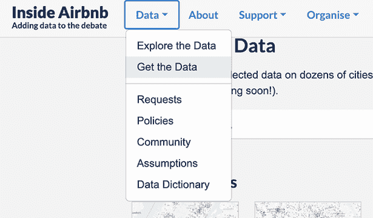
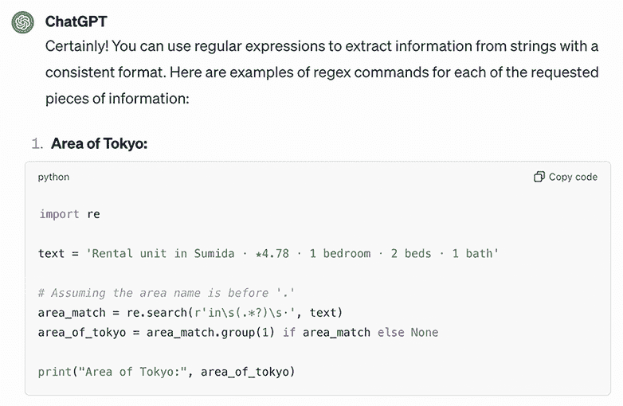
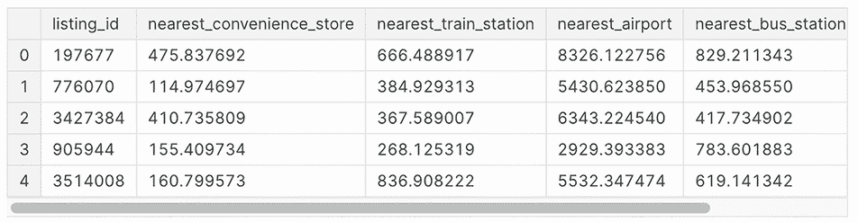
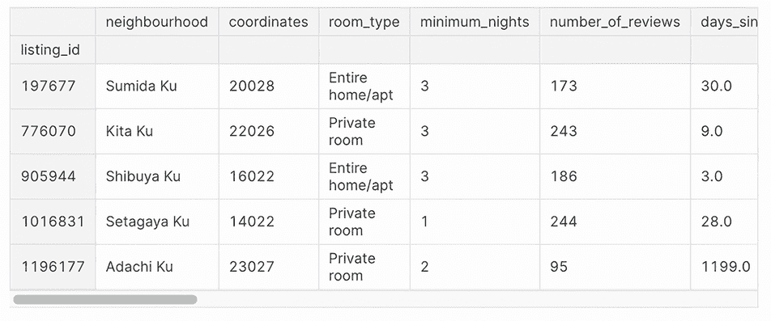
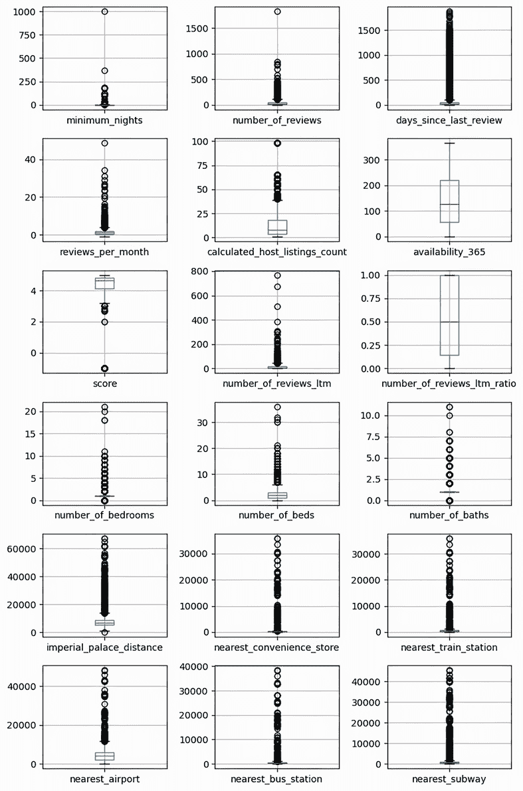
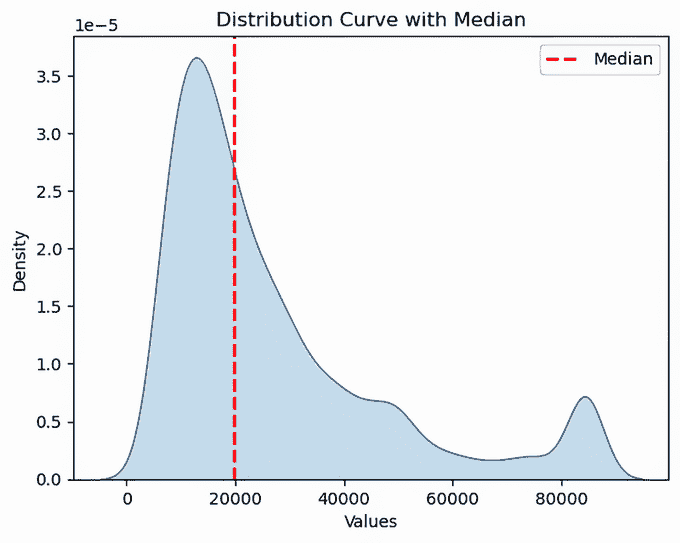
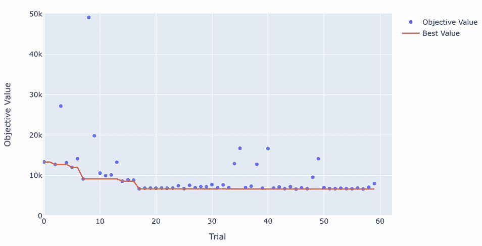
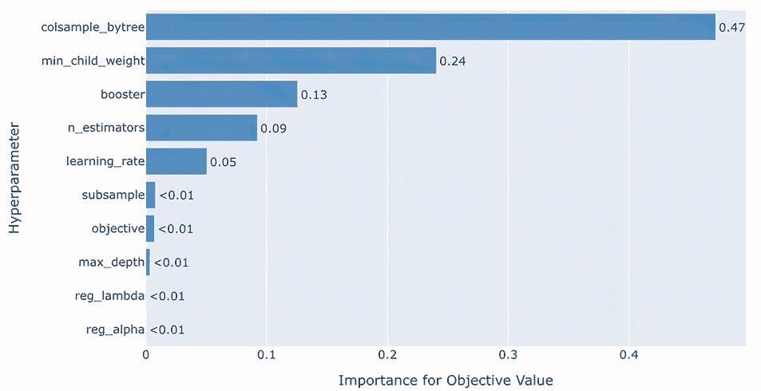

# 7 使用 XGBoost 的端到端示例

本章涵盖

+   从互联网收集和准备数据，使用生成式 AI 来帮助

+   起草一个基线模型和第一个尝试优化的模型

+   理解模型的工作原理并检查它

本章总结了我们对表格数据的经典机器学习的概述。为了总结，我们将通过数据新闻领域的完整示例进行操作。在这个过程中，我们将总结到目前为止我们使用过的所有概念和技术。我们还将使用生成式 AI 工具 ChatGPT 来帮助你完成任务，并展示一些大型语言模型（LLM）如何改善你处理表格数据的工作的用例。

我们最终将构建一个预测价格的模型，这次使用基于回归的方法。这样做将帮助我们理解模型的工作原理以及为什么它以特定的方式表现，从而进一步深入了解 Airbnb 列表的定价动态，并挑战我们对短期租赁定价发生的初始假设。

## 7.1 准备和探索你的数据

要开始，我们将专注于不同的数据集，因为我们继续分析纽约市的短期和长期 Airbnb 租赁列表。这个数据集直接来自 Inside Airbnb Network 倡议（[`insideairbnb.com/`](http://insideairbnb.com/))，“一个以使命为导向的项目，提供关于 Airbnb 对住宅社区影响的数据和倡导。”我们还将使用来自其他在线服务的公共数据，例如 Foursquare（[`foursquare.com`](https://foursquare.com)），社交网络和地理位置技术公司。

在数据收集阶段之后，我们将根据相关的业务假设进行组织和执行综合的特征工程，以从我们的建模阶段提取有价值的见解。在这个过程中，我们还将对我们的预测变量和目标变量进行基本的探索性分析，对示例和特征进行必要的调整或排除，以确保我们获得项目最优的数据。

### 7.1.1 使用生成式 AI 来帮助准备数据

ChatGPT 是由 OpenAI 开发的高级语言模型。为了创建和训练一个像 ChatGPT 这样的生成预训练转换器（GPT）模型，OpenAI 使用了大量的多样化互联网文本，帮助模型通过预测一系列词语中的下一个词语来学习理解和生成类似人类的文本，这是基于其对上下文的理解。这种预训练使得 ChatGPT 能够捕捉语法、上下文，甚至细微的信息，但这并不足以使其在所有情况下都成为一个有用的助手。实际上，这些模型有可能产生不准确或有害的输出，或者包含有毒内容。这是因为训练数据集——即互联网——包含的文本是多样化的，有时是不可靠的。为了提高 ChatGPT 模型的安全性、实用性和一致性，采用了名为基于人类反馈的强化学习的方法。在基于人类反馈的强化学习过程中，人类标注者提供反馈，说明首选的模型行为，并通过排名评估模型产生的多个输出。随后，这些数据被用来进一步微调 GPT-3.5，根据人类反馈来优化其响应。

要使用 ChatGPT 的免费版本（目前是 ChatGPT 3.5，信息更新至 2022 年 1 月），您必须首先在[`chat.openai.com`](https://chat.openai.com)创建一个账户。一旦您有了账户，您只需输入一个提示就可以开始使用 ChatGPT。在一个像 ChatGPT 这样的 LLM（大型语言模型）的上下文中，提示是一个提供给模型的书面指令或输入，以生成特定的输出。它作为一个查询或请求，引导模型产生相关的响应。提示的复杂度各不相同，从简单的命令到更详细的描述或询问，它们在塑造语言模型输出性质方面发挥着关键作用。提示的质量和清晰度在很大程度上影响着生成内容的准确性和相关性，但选择正确的提示并不总是那么简单。

不同提示语的有效性可能因它们针对的具体语言模型而异。每种语言模型都有其自身的优势、劣势和细微差别，因此根据需要调整提示语至关重要。例如，在与 ChatGPT 合作时，我们从简单的提示语开始，评估其结果，然后通过添加更多具体说明到提示语中，以细化结果，使其更符合我们的预期。ChatGPT 在被告知“写”、“创建”、“展示如何”或“总结”时往往表现更好。有时展示示例以及你期望 ChatGPT 如何展开这些示例是非常有帮助的。此外，让 ChatGPT 了解你对答案的期望，例如响应的长度、应包含的信息、是否只希望得到代码或文本结果，以及答案应该如何结构化返回；例如，你可以使用 JSON 格式或 Python 风格列表来提问。

如 ChatGPT 等大型语言模型，以及 GitHub 中的相关 Copilot 功能，已被证明是各种编程任务的实用助手。这种实用性适用于表格数据应用。你可以向这些模型提出各种问题或请求在编码任务中的帮助，他们可以通过提供代码片段、解释代码的工作原理或指导使用特定命令或算法来协助你。然而，尽管如 ChatGPT 等大型语言模型可以通过生成代码片段来协助用户进行数据处理、清洗和转换任务，并提供适用于表格数据集的各种统计和机器学习技术的解释和指导，但本章的目的是展示一些精选且不太明显的语言模型能力，这些能力可用于你的表格数据分析建模。

### 7.1.2 获取和准备你的数据

作为起点，我们将导航到 Inside Airbnb Network 网站([`insideairbnb.com/`](http://insideairbnb.com/))，并找到所需的数据。我们的目标是探索一个完全不同的城市：东京。首先，你必须手动下载数据并将其存储在你的计算机或云实例的工作目录中。为此，在 Inside Airbnb Network 倡议的首页上，如图 7.1 所示，在数据菜单中选择“获取数据”。



图 7.1 从数据菜单中选择

一旦选择了菜单项，你将被带到一个新的页面，包含数据下载部分，展示了各种城市及其要下载的数据文件。滚动页面，直到找到东京市。

图 7.2 显示了在撰写本书时包含东京数据文件的页面部分。


图 7.2 东京数据下载部分

对于我们的分析，我们需要从页面获取两个文件：`listings.csv`，其中包含东京 Airbnb 住宿的摘要列表和其他信息，以及`calendar.csv.gz`，这是一个包含`calendar.csv`的压缩文件，其中包含每个列表给定年份的占用和价格信息。将鼠标悬停在链接上，右键单击，并选择将它们保存到工作目录中。例如，在 Google Chrome 中，您需要选择“另存为”，而在 Mozilla Firefox 中，您必须选择“另存目标为”。在此阶段，您只需将文件提取到工作目录中。一旦我们需要的文件在我们的本地目录中解压缩，我们可以使用`read_csv`命令将它们导入到 pandas DataFrame 中：

```py
import pandas as pd
summary_listings = pd.read_csv("listings.csv")
```

通过列的列表和类型，我们可以了解我们将要处理的数据类型：

```py
summary_listings.dtypes
```

该列表包含 18 列，与第三章中介绍的 Airbnb 纽约市数据集大致相同。这里我们描述每个字段：

+   `id`—Airbnb 上每个列表的唯一标识符。它是一个`int64`数据类型，意味着它是一个数值 ID 表示。在其他表中，它可以被称为`listing_id`。

+   `name`—Airbnb 列表的描述。它属于`object`数据类型，通常表示字符串或文本。

+   `host_id`—Airbnb 上每个房东的唯一标识符。它是一个`int64`数据类型。

+   `host_name`—拥有列表的房东的姓名。它属于`object`数据类型。

+   `neighbourhood_group`—表示该社区所属的更广泛的区域或地区。它存储为`float64`数据类型，但需要注意的是，使用浮点数据类型来表示组或类别是不常见的。在这种情况下，浮点值的存在表明该字段的全部数据都是缺失值。

+   `neighbourhood`—列表所在的特定社区。它属于`object`数据类型。

+   `latitude`—列表位置的纬度坐标。它属于`float64`数据类型。

+   `longitude`—列表位置的经度坐标。它属于`float64`数据类型。

+   `room_type`—列表中提供的房间或住宿类型（例如，整个房子/公寓，私人房间，共享房间）。它属于`object`数据类型。

+   `price`—每晚出租该列表的价格。它属于`int64`数据类型，表示一个整数值的价格。

+   `minimum_nights`—预订列表所需的最少夜晚数。它属于`int64`数据类型。

+   `number_of_reviews`—列表收到的总评论数。它属于`int64`数据类型。

+   `last_review`—列表收到的最后一条评论的日期。它属于`object`数据类型，可能代表日期和时间信息，但可能需要进一步解析才能有效使用。

+   `reviews_per_month`—列表每月的平均评论数。它属于`float64`数据类型。

+   `calculated_host_listings_count`—房东在 Airbnb 上的列表总数。它是`int64`数据类型。

+   `availability_365`—一年中可供预订的天数（365 天中的天数）。它是`int64`数据类型。

+   `number_of_reviews_ltm`—过去 12 个月内收到的评论数量。它是`int64`数据类型。

+   `license`—列表的许可证号码或相关信息。它是`object`数据类型，通常表示字符串或文本。

我们可以安全地忽略诸如`host_id`、`host_name`、`neighbourhood_group`（因为它们完全缺失）或`license`（基于房东许可证的一种标识符）之类的特征。

至于其他特征，虽然大多数都是数值型的，但`name`特征是一个字符串，包含根据数据组织方式提取的各种信息。通过可视化其中的一个示例，我们可以了解其组织结构：

```py
summary_listings['name'].iloc[0]
```

字符串被安排成五个不同的部分，由传统的符号分隔，并包含某种部分结构化和重复的内容：

```py
'Rental unit in Sumida · ★4.78 · 1 bedroom · 2 beds · 1 bath'
```

字符串的前一部分是单元类型和位置的描述。第二部分是客人给出的平均评分。第三部分是卧室数量，第四部分是床的数量，最后一部分是浴室数量。

除了数值之外，我们还可以提取一些与提供的住宿或服务类型相关的特定信息——例如，如果公寓是工作室，如果浴室是共享的，以及如果它是半浴室（一个有厕所和洗脸盆但没有浴缸或淋浴的房间）。我们可以通过创建简单的字符串对应检查来处理此类信息，并获取一个二进制特征，指出特征的存在或不存在，或者使用正则表达式命令。正则表达式（缩写为 regex）命令是一系列字符，构成搜索模式。它们用于字符串内的模式匹配。表 7.1 显示了我们对描述字段应用的转换，并突出显示了我们试图匹配的字符串，使用的正则表达式命令以及获得的结果特征。

表 7.1 特征工程的正则表达式命令

| 匹配描述 | 正则表达式 | 结果特征 |
| --- | --- | --- |
| 以“in”开头，后跟一个空格，然后捕获任何字符直到另一个空格，并以点结束的文本 | `r'in\s(.*?)\s·'`  | 列表的东京区域 |
| 以字符“★”（星号）开头，后跟一个或多个数字，一个点，以及一个或多个额外的数字（例如，★4.5）的文本 | `r'`★`(\d+\.\d+)'`  | 星级评分 |
| 包含数值值后跟零个或多个空白字符和单词“bedroom”或“bedrooms”（带或不带末尾的“s”）的文本 | `r'(\d+)\s*(?:bedroom&#124;bedrooms)'`  | 卧室数量 |
| 包含一个数值后跟一个或多个空格字符和单词“bed”或“beds”（带或不带末尾的“s”）的文本 | `r'(\d+)\s+(?:beds?\b)'`  | 床的数量 |
| 包含表示浴次数的数值文本 | `r'(?P<baths>\d+)\s*(shared\s+)?(?:half-)?baths?\b'`  | 浴次数 |

使用正则表达式命令有点复杂。因此，这是生成式 AI 可以提供帮助的第一个应用。大多数 LLMs，如 ChatGPT，对不同的编程语言有很好的了解（特别是，它们中的大多数在 Python 方面都很强），因为它们是在从互联网上提取的文本和信息上训练的，那里有大量关于如何编码甚至非常具体问题的信息。在我们的情况下，展示提示中的字符串示例并请求提取所需的信息应该可以解决问题：

```py
I have a series of strings in this format: 'Rental unit in Sumida · ★4.78
 · 1 bedroom · 2 beds · 1 bath' Show me a series of regex commands in 
order to extract the following information: 1) the area of Tokyo of the 
listing 2) the star ratings expressed as floats 3) the number of bedrooms 
4) the number of beds 5) the number of baths.
```

输出应该是已经适合使用的，以代码片段块的形式排列，并附带一些关于提取规则的说明，如图 7.3 所示。



图 7.3 ChatGPT 3.5 上正则表达式处理的提示结果

在没有被询问的情况下，语言模型应该简单地决定提出一个基于 Python 的解决方案，然后你只需点击代码列表顶部的“复制代码”图标，将代码片段复制到剪贴板，然后将其粘贴到你的笔记本或 IDE 编辑器中。

通常，提供的解决方案可能因查询而异，与我们表格中提供的解决方案不同。这是因为 LLMs 最终是概率机器。温度是通常设置以影响模型输出随机性的参数。在文本生成过程中，它用于控制生成内容的创造力。简单来说，温度影响模型选择序列中下一个词的可能性。低温值导致更确定性和预期的输出。相反，高温值在生成的输出中引入更多的随机性和创造力，因为模型倾向于选择不太可能的词。

在使用 LLM 提出的解决方案之前，一个重要的步骤是在比提示中显示的一个或两个示例更多的示例上测试它们。这一步骤可能会揭示代码运行不正常，你也可能需要告诉模型示例不起作用，或者通过更详细的指令向模型发出你遇到的问题的信号。例如，我们发现有时如果输入字符串的某些部分有大小写字母，命令可能无法正常工作。因此，我们必须找到补充解决方案。所有这些正则表达式命令都操作小写，多亏了`re.IGNORECASE`标志，这使得匹配操作不区分大小写。在下面的列表中，我们继续使用我们在 ChatGPT 上找到的正则表达式命令从文本描述中提取信息。

列表 7.1 从文本描述中提取信息

```py
import pandas as pd
import re

classification_list = [
   'aparthotel', 'barn', 'bed and breakfast', 'boutique hotel',
   'bungalow', 'cabin', 'camper/rv', 'chalet', 'condo', 'cottage',
   'earthen home', 'farm stay', 'guest suite', 'guesthouse', 'home',
   'hostel', 'hotel', 'houseboat', 'hut', 'loft', 'place to stay',
   'rental unit', 'resort', 'ryokan', 'serviced apartment',
   'tiny home', 'townhouse', 'treehouse', 'vacation home', 'villa']

summary_listings = summary_listings.assign(
    type_of_accommodation=(
        summary_listings['name']
        .str.extract(
            f"({'|'.join(classification_list)})", 
            flags=re.IGNORECASE)),                          ①
    area_of_tokyo=(
        summary_listings['name']
        .str.extract(
            r'in\s(.*?)\s·', 
            flags=re.IGNORECASE)),                          ②
    score=(
        summary_listings['name']
        .str.extract(
            r'★(\d+\.\d+)',
            flags=re.IGNORECASE)
        .astype(float)),                                    ③
    number_of_bedrooms=(
         summary_listings['name']
         .str.extract(
            r'(\d+)\s*(?:bedroom|bedrooms)', 
            flags=re.IGNORECASE)
         .fillna(0)
         .astype(int)),                                     ④
    number_of_beds=(
         summary_listings['name']
         .str.extract(
             r'(\d+)\s+(?:beds?\b)', 
             flags=re.IGNORECASE)
         .fillna(0)
         .astype(int)),                                     ⑤
    number_of_baths=(
         summary_listings['name']
         .str.extract(
             r'(?P<baths>\d+)\s*(shared\s+)?' +
             r'(?:half-)?baths?\b', 
             flags=re.IGNORECASE)["baths"]
         .fillna(0)
         .astype(int)),                                     ⑥
)
```

① 从选项列表中提取住宿类型

② 从列表名称中提取提到的东京地区

③ 从带有数值的星号符号中提取评分

④ 从列表名称中提取卧室数量

⑤ 从列表名称中提取床的数量

⑥ 从列表名称中提取浴室数量

列表 7.2 通过在名称列中基于特定关键词创建额外的布尔列来完成特征提取工作。它根据告诉我们今天日期和 `last_review` 日期之间天数差异的差异以及表示过去一年中评论数量与总评论数量之间关系的比率来计算两个计算特征。这样的比率可以揭示大部分评论是否是最近的，或者列表是否主要在过去取得成功。

列表 7.2 提取二进制标志和时间信息

```py
import numpy as np
import pandas as pd
from datetime import datetime

summary_listings = summary_listings.assign(
    is_new=(summary_listings['name']
               .str.contains('new', case=False)
               .astype(int)),                              ①
    is_studio=(summary_listings['name']
               .str.contains('studio', case=False)
               .astype(int)),                              ②
    has_shared_bath=(summary_listings['name']
                     .str.contains('shared', case=False)
                     .astype(int)),                        ③
    has_half_bath=(summary_listings['name']
                   .str.contains('half', case=False)
                   .astype(int)),                          ④
)

summary_listings['days_since_last_review'] = (
    datetime.today() – 
    pd.to_datetime(
        summary_listings['last_review'])
).dt.days
summary_listings['days_since_last_review'] = (
    summary_listings['days_since_last_review'] -
    summary_listings['days_since_last_review'].min()
)                                                          ⑤

zero_reviews = summary_listings['number_of_reviews'] == 0
ratio = summary_listings['number_of_reviews_ltm'] / 
summary_listings['number_of_reviews']
summary_listings['number_of_reviews_ltm_ratio'] = (
    np.where(zero_reviews, 0, ratio)
)                                                          ⑥
```

① 检查名称中是否包含单词“new”（不区分大小写）

② 检查名称中是否包含单词“studio”（不区分大小写）

③ 检查名称中是否包含单词“shared”（不区分大小写）

④ 检查名称中是否包含单词“half”（不区分大小写）

⑤ 计算今天日期和 last_review 日期之间的天数

⑥ 计算每条列表的 number_of_reviews_ltm 与 number_of_reviews 之间的比率

`summary_listings` 数据也具有一个价格特征，我们可以将其用作目标。然而，我们更倾向于通过聚合 `calendar.csv` 数据来创建它，以决定是选择所有价格的平均值、最小值还是最大值。`calendar.csv` 包含有关每天住宿可用性、其价格（也考虑了折扣）以及当时允许预订的最小和最大夜数的详细信息。我们感兴趣的是将调整后的价格作为目标，代表住宿的有效市场价格。

列表 7.3 从每日列表创建目标

```py
calendar = pd.read_csv("calendar.csv")

calendar["adjusted_price"] = (
    calendar["adjusted_price"]
    .apply(lambda x: float(
        x.replace('$', '')
         .replace(',', ''))
         )
)                                                         ①

price_stats = (
    calendar.groupby('listing_id')['adjusted_price']      ②
    .agg(['mean', 'min', 'max'])
)                                                         ③
```

① 从值中删除美元符号（$）和逗号（,），然后将其转换为浮点数

② 基于 listing_id 列在日历 DataFrame 上执行分组操作

③ 计算调整后价格列的三个统计数据：平均值、最小值和最大值

完成聚合后，我们可以通过要求查看新创建数据集的前五行来检查结果：

```py
price_stats.head()
```

图 7.4 验证我们现在既有每条列表的平均价格，也有最大和最小价格。


图 7.4 Airbnb 列表的定价统计

我们将保存这个 `price_stats` DataFrame，并在下一节集中讨论提高特征的数量和有效性。

### 7.1.3 工程更复杂的功能

房地产资产有一种相当奇特的行为，与其他市场上找到的产品或服务不同。房地产业的一个谚语提到，在处理建筑和设施时，最重要的是“位置，位置，位置。”一个公寓在城市或道路上的位置可能会影响房产的价值。我们将采用这个谚语来处理 Airbnb 列表，并基于位置开发一些特征工程。

作为第一步，我们将重述前一章中的例子，其中我们创建了小的地理子区域，后来对这些区域进行了目标编码。通过这种方法，你应该能够捕捉到特定地区的特定特征，尽管解释为什么在某个特定地点租房比其他地方贵将会有困难。我们应该准备更具体的特征，为东京的列表提供一些可解释性。这里又是生成式 AI 可以帮助表格数据从业者的地方，通过提供建议和创意生成帮助。大型语言模型已经处理了比你想象的更多的数据，如果你提供足够的细节（以及一些角色扮演，即要求它们扮演一个特定领域的专家），它们可以提供可能需要你花费数小时在网络上研究和阅读的提示和反思。

我们为 ChatGPT 的提示是

|


| 你是一位数据科学专家，你已经下载了一个包含总结的 Airbnb 列表数据的集。这是数据集的结构：id（int64），名称（对象），社区（对象），纬度（float64），经度（float64），房间类型（对象），价格（int64），最低入住夜数（int64），评论数（int64），最后评论（对象），每月评论数（float64），计算出的房东列表数量（int64），365 天可用性（int64），过去 12 个月的评论数（int64）。你正在训练一个机器学习模型来预测列表的价格。你应该设计哪些特征来提高模型的性能？ |
| --- |

我们的策略是设定一个角色（“你是一位数据科学家专家”）并提供一些有关可用特征（移除我们实际上已经决定不使用的特征）和目标变量的更多信息。在这里，我们也使用了这样一个事实，即我们预计 ChatGPT 已经对我们使用的数据集有所了解（“包含总结的 Airbnb 列表的数据集”），但你也可以通过简要描述数据集（包括特征类型及其相互关系）向 LLM 提出不太为人所知的问题。此外，如果您对数据集有任何相关的领域专业知识，例如关于数据集中特征可能与目标变量相关联的任何假设，请与 LLM 分享。这些信息可以帮助它识别对任务可能重要的特征。此外，提供数据集中现有特征的列表，就像我们这样做，可能对于更具挑战性的任务还不够。提供每个变量的解释或描述，并清楚地说明您的机器学习模型的目标，例如预测客户流失、估计房地产价值或预测销售额，将帮助 LLM 识别创建新精心设计的特征的差距或机会。

以下是我们根据 ChatGPT 的说明，为了在我们的数据集和问题类型中获得最佳结果而应努力生成的建议功能或功能类型：

+   *距离关键地点*—计算每个列表与城市中关键地点或地标之间的距离。这可以通过使用经纬度信息来完成。

+   *社区统计数据*—对每个社区进行汇总统计，例如平均价格、最低和最高价格以及每个社区中的列表数量。

+   *房间类型编码*—使用独热编码或标签编码将分类变量`room_type`转换为数值。

+   *时间特征*—从`last_review`列中提取相关特征，例如最后评论的月份或季节或自最后评论以来经过的时间。

+   *房东经验*—结合`calculated_host_listings_count`和`number_of_reviews_ltm`的信息，创建一个表示房东经验或受欢迎程度的特征。

+   *预订密度*—计算`number_of_reviews`与`availability_365`的比率，以表示列表相对于其可用性的预订频率。

+   *评论情感*—如果您可以访问实际的评论文本，您可以使用自然语言处理技术来分析情感并提取基于情感的特征。

+   *交互项*—创建相关特征之间的交互项，例如`minimum_nights`和`availability_365`的乘积，以捕捉较长住宿的整体可用性。

+   *价格分箱*—将连续的`价格`变量转换为箱或类别，创建一个表示不同价格范围的新分类特征。

+   *地理聚类*——使用聚类算法根据地理位置将列表分组。这可以捕捉到价格的空间模式。

在提出的要点中，有一些与我们的经验相呼应，例如从关键位置计算距离和邻里统计数据，或创建地理聚类。此外，我们已经在之前的关于文本字段和正则表达式命令的工作中提供了房间类型编码。除了评论情感和价格分箱（价格实际上是我们的目标）之外，剩下的是一套可以指导或启发你改进工作的想法。利用 LLM 的输出，但不要忘记，你以前的知识、经验、敏感性和批判性思维在表格数据分析的任务中可以发挥更重要的作用，而 LLM 只是你工作中的辅助工具。

考虑到 ChatGPT 提出的建议，我们继续创建其中的一些。关于地理聚类，你可以在列表 7.4 中找到所有你需要的内容，从坐标创建高基数地理特征。稍后，在数据管道中，我们将使用代码对即将生成的具有高基数分类特征进行目标编码。

列表 7.4 创建高基数地理特征

```py
def bin_2_cat(feature, bins=32):
    min_value = feature.min()
    bin_size = (feature.max() - min_value) / bins
    return ((feature - min_value) / bin_size).astype(int) ①

summary_listings['coordinates'] = (
    bin_2_cat(summary_listings['latitude']) * 
    1000 +   
    bin_2_cat(summary_listings['longitude'])
)                                                         ②

print(summary_listings['coordinates'].nunique())
```

① 通过网格大小对纬度和经度进行离散化

② 通过对离散化的纬度和经度求和来组成新的坐标特征

此代码生成一个具有 317 个唯一值的特征。我们在一个 32 × 32 的网格中覆盖了所有东京自治市，这意味着可能有 1,024 个值。只有 317 个这些坐标包含一个列表，这意味着如果未来有一个新的列表落在之前定义的 317 个槽位之一，我们的模型可以仅基于这个特征有效地进行预测。如果出现新的区域，多亏了目标编码器的创新处理能力（请参阅[`mng.bz/oK1p`](https://mng.bz/oK1p)中`handle_unknown`参数的描述），我们可以简单地使用设置`handle_unknown`="value"将未知值插补到目标均值。

东京房地产市场的关键方面是，由于文化和历史原因，存在一个重要的地理中心，即皇宫。靠近这个地点的位置往往有更高的房地产估值，日本一些最昂贵的公寓就位于皇宫附近。我们试图通过创建一个将我们的 Airbnb 住宿位置与皇宫区域（可以从 latlong.net 等网站获取：[`mng.bz/nRW2`](https://mng.bz/nRW2)）进行比较的特征来反映这一现实。对于距离，我们使用涉及辐射角的余弦乘以一个转换系数的公式将值转换为米，以便人类检查时可以理解。我们还采用曼哈顿距离来更好地表示城市中的距离，这是纬度和经度的绝对值之差的和。

列表 7.5 从市中心计算距离度量

```py
imperial_palace_lat = 35.6841822633
imperial_palace_lon = 139.751471994

def degrees_to_meters(distance_degrees, latitude):
    conversion_factor = 111000                              ①
    distance_meters = (distance_degrees * conversion_factor 
                       * np.cos(np.radians(latitude)))      ②
    return distance_meters 

distance_degrees = (
    np.abs(
        summary_listings['latitude'] 
        imperial_palace_lat) + 
    np.abs(
        summary_listings['longitude'] 
        imperial_palace_lon)
)                                                           ③

summary_listings['imperial_palace_distance'] = (
    degrees_to_meters(distance_degrees,
    summary_listings['latitude']
)
```

① 表示每度纬度大约有多少米的转换系数

② 通过将基于度的距离乘以转换系数并调整纬度的余弦值来计算距离（以米为单位）

③ 通过从数据集中的值中减去故宫的纬度和经度来计算绝对距离（以度为单位）

当处理城市内部的坐标时，选择欧几里得距离和曼哈顿距离作为机器学习特征取决于具体的上下文和你要解决的问题：

+   *欧几里得距离*基于欧几里得空间中两点之间的直线距离。它假设两点之间存在直接路径，在考虑物理距离时可能更合适。你也可能听到它被称为 *L2 范数*，这是一个数学概念，指的是向量与向量空间原点之间的距离。由于 L2 范数基于欧几里得距离公式，因此它可以互换使用，因为它是一个紧密相关的数学概念。

+   *曼哈顿距离*，也称为街区距离或出租车距离，通过计算两点坐标的绝对差值之和来衡量两点之间的距离。它只考虑水平和垂直移动，忽略对角线路径。与欧几里得距离类似，当操作向量和向量空间时，你可能会听到曼哈顿距离被称为 *L1 范数*。

当考虑城市中的实际移动或导航时，曼哈顿距离可能更合适，因为旅行通常沿着街道和道路网络进行。考虑到坐标位于城市内部，道路网络结构和街道导航很重要，曼哈顿距离可能更适合捕捉地点之间的移动和可达性。它与遵循道路和进行直角转弯的概念相符。

在计算完 `imperial_palace_distance` 特征之后，我们可以使用以下代码来检查其平均值，以米为单位：

```py
summary_listings.imperial_palace_distance.mean()
```

结果显示，到故宫的平均距离大约为 7.9 公里。

接下来，我们可以识别出距离故宫最近的列表。为了实现这一点，我们可以使用 `idxmin()` 函数找到距离最小的列表的索引，然后访问其相应的详细信息：

```py
(summary_listings[
    ['id', 'name', 'neighbourhood', 'imperial_palace_distance']
].iloc[np.argmin(summary_listings['imperial_palace_distance'])])
```

结果如下，这有点令人惊讶：

```py
id                                                       874407512426725982
name                        Home in Shibuya City · ★New · 3 bedrooms · ...
neighbourhood                                                    Chiyoda Ku
imperial_palace_distance                                         137.394271
Name: 10255, dtype: object
```

事实上，该列表并未位于皇宫附近，这强调了列表地理位置可能存在的误导性错误。在精心整理的数据集中遇到类似问题并不罕见。正如第二章所讨论的，从一般的角度来看，在进行一些数据质量检查后，你将找到一些可行的选项，以下按从要求高到要求低列出：

+   *地理编码*（从地址到坐标）和*反向地理编码*（从坐标到地址）——为了确定位置信息是否与提供的经纬度坐标匹配，并决定是否信任提供的地址或坐标

+   *数据插补*——将可疑值作为缺失值处理，使用默认位置的坐标

+   *逐行删除*——删除所有包含可疑值的行

+   *交给 XGBoost 处理*——基于树的算法通常受错误和可疑值的影响较小，对数据中的异常值和噪声具有鲁棒性

在我们的例子中，我们决定将情况交给 XGBoost 处理，因为我们的模型并不那么关键，不需要彻底的数据质量检查。对于你自己的项目来说，情况可能不同，你可能需要评估一个需要更多数据清理工作的解决方案。

从地标和服务点的距离在房地产建模中作为特征效果良好。因此，我们不仅计算从东京中心——皇宫的距离，在 Dingqi Yang、Daqing Zhang、Vincent W. Zheng 和 Zhiyong Yu 的论文“通过利用 LBSN 中的用户时空特征建模用户活动偏好”（IEEE Transactions on Systems, Man, and Cybernetics: Systems，45(1)，129-142，2015）中，作者们收集了来自纽约市和东京的 Foursquare 签到数据集，包括它们的地理坐标和所引用的位置类型；我们可以从 Kaggle 数据集（[`mng.bz/4aDj`](https://mng.bz/4aDj)）中获取数据。

Foursquare 是一个基于地理位置的社交网络。得益于其移动应用，它允许用户发现附近的场所，如餐厅和商店、交通方式，并分享他们访问地点的信息。该应用的特点之一是签到，当在场所使用该平台时发生。签到指的是用户在特定地点的存在。当用户签到时，他们将与他们的 Foursquare 朋友分享他们的定位，他们还可能有在 Facebook 和 X 等社交媒体平台上发布他们访问信息的选项。为了从便利性的角度映射列表的价值，我们拥有机场、公交、火车和地铁站等常见的签到场所。与便利商店一起，这是一种主要向客户销售广泛日常物品和产品的零售店，这些场所的邻近性可以为住宿增加价值。

因此，为了丰富我们的数据集，我们首先直接从 Kaggle 提取了这些东京地点的 GPS 坐标。代码和提取的数据集可在[`mng.bz/QDPv`](https://mng.bz/QDPv)找到，您可以从[`mng.bz/XxNa`](https://mng.bz/XxNa)页面下载处理后的文件到您的工作目录，在那里您可以获取文件`relevant_spots_Tokyo.csv`。该文件包含关于 3,560 家便利店位置、1,878 个公交站和停靠点、439 个地铁站以及 264 个与机场相关的地点的信息。然后，使用列表 7.6，我们可以将我们的 Airbnb 东京列表的位置与每个这些场所进行比较，并报告每个场所的最近距离。我们的想法是，列表与便利店和交通方式的距离越近，预期的价格就越高。

在列表 7.6 中，我们没有将每个住宿与我们所收集的所有可能的场所进行比较，因为这会花费太多时间和计算。相反，我们利用 Scikit-learn 中的 k 维树（KDTree）数据结构，这是一个优化算法，旨在高效地找到给定位置附近的最接近点。Scikit-learn 用于 K 最近邻等算法，在这些情况下，您必须找到训练集中与测试样本最相似的示例。在我们的案例中，训练集是场所集合，该算法被训练基于曼哈顿距离找到给定位置最近的场所。

列表 7.6 寻找最近的设施和交通

```py
from sklearn.neighbors import KDTree

relevant_spots = pd.read_csv("relevant_spots_Tokyo.csv")

venue_categories = ['Convenience Store', 'Train Station', 
                    'Airport', 'Bus Station', 'Subway']
min_distances = {'listing_id': summary_listings['id']}      ①

for venue in venue_categories:
    venue_filter = relevant_spots['venueCategory'] == venue
    venues = relevant_spots[
        ['latitude', 'longitude']
    ][venue_filter]                                         ②
    tree = KDTree(venues, metric='manhattan')               ③
    distance, index = tree.query(
        summary_listings[['latitude', 'longitude']],
        k=1
     )                                                      ④
    min_distances[
        'nearest_' + 
        venue.lower().replace(" ", "_")
    ] = degrees_to_meters(
            np.ravel(distance), 
            summary_listings['latitude']
        )
min_distances = pd.DataFrame(min_distances)                 ⑤
```

① 在字典中存储最小距离

② 过滤相关场所位置

③ 使用曼哈顿距离创建 KDTree，以快速进行最近邻搜索

④ 查询 KDTree 以找到最近点及其与每个 Airbnb 列表的距离（k=1 返回最近的点）

⑤ 将每种类型场所的最小距离字典转换为 DataFrame。

通过遍历每种类型的场所，在选定场所的位置上进行训练，并使用 KDTree 找到每个住宿地点最近的地点，以及自动计算距离，代码将运行得相当快。最终，我们只需将距离（曼哈顿距离，以度为单位）通过之前看到的函数`degrees_to_meters`转换为米，然后将结果汇总到一个 pandas DataFrame 中。我们可以通过检查结果数据集的前五行来验证结果：

```py
min_distances.head()
```

图 7.5 显示了结果，表示从创建的`min_distances` DataFrame 中的内容。



图 7.5 `min_distances` DataFrame 的前五行

在每个数据集的列表中有了我们选择场所的最小距离后，我们现在继续将这些新特征组合成一个最终的预测变量数据集，并提取一个用于建模的目标序列或向量。

### 7.1.4 最终化你的数据

在创建了一些额外的特征之后，我们可以最终确定我们的预测特征及其目标。在列表 7.7 中，我们将`summary_listing`数据集与到我们选定地标（机场、地铁、火车、公交车站、便利店）的最小距离连接起来。然后，我们根据目标重新排列连接的数据：在`price_stats_ordered`数据集中计算的平均价格。

列表 7.7 组装数据

```py
summary_listings_features = [
    'neighbourhood',
    'coordinates',
    'room_type',
    'minimum_nights', 'number_of_reviews', 'days_since_last_review',
    'reviews_per_month', 'calculated_host_listings_count',
    'availability_365', 'number_of_reviews_ltm', 
'number_of_reviews_ltm_ratio',
    'number_of_bedrooms', 'number_of_beds', 'number_of_baths',
    'type_of_accommodation', 'score', 'is_new',
    'is_studio', 'has_shared_bath', 'has_half_bath',
    'imperial_palace_distance'
]

summarized = summary_listings[['id'] + 
summary_listings_features].rename({'id': 'listing_id'}, axis=1)

X = summarized.merge(min_distances, on='listing_id').set_index('listing_id')

X = X.reindex(price_stats.index)                              ①
price_stats_ordered = price_stats.reindex(X.index)            ②
y = price_stats_ordered['mean'].copy()                        ③
```

① 将 X 重新索引以匹配 price_stats 的索引

② 重新索引 price_stats 以匹配 X 的索引，确保重新索引的价格统计数据与 X 中的列表相匹配

③ 将“平均”价格列作为目标变量

一旦我们完成了脚本，我们可以可视化我们的数据集：

```py
X.head()
```

作为索引，我们有`listing_id`，在列中，有我们为问题准备的所有特征，如图 7.6 所示。



图 7.6 预测变量数据集的前几行

在这个阶段，我们可以开始详细检查数据，并找出是否有需要修复的额外问题或可以发现的见解，这些见解可能在如何开发我们的 XGBoost 模型中发挥关键作用。

### 7.1.5 探索和修复你的数据

在将所有预测变量组装到一个单一数据集之后，下一步是探索它以检测可能影响机器学习算法性能的问题，如缺失数据或极端值。因此，我们的第一个行动是使用以下命令检查任何缺失数据：

```py
X.isna().sum()
```

结果列表指出有三个特征存在一些缺失数据：

```py
days_since_last_review            1252
reviews_per_month                 1252
score                             2381
```

正如我们在第二章和上一章中讨论的那样，在存在缺失数据的情况下，调查为什么存在缺失值以及这些缺失值是否可以被视为完全随机缺失、随机缺失或非随机缺失的情况至关重要。在这个特定案例中，缺失值根本不是随机分布的，而是取决于没有评论或评论不足以致计算分数的事实。实际上，通过检查有多少住宿没有评论，你会注意到图形如何与两个具有缺失值的特征的缺失案例数量相匹配：

```py
(X.number_of_reviews==0).sum()
```

如预期的那样，结果是 1,252，与缺失值的数量相匹配。在这种情况下，最好避免使用 XGBoost 和其他 GBDT 实现处理缺失数据的特性，因为其行为将模拟平均情况。当住宿刚刚进入市场或很少被选择时，缺失评论是一个极端但合法的情况。在这里，你需要直接输入一个数字，这可能有助于任何机器学习算法确定没有评论，因此存在缺失值。一种常见的策略是使用现有分布边界上的值，通常如果我们表示计数，则通常是一个负数；如果我们表示正值，则通常是一个正数。快速检查可以确保我们是否有实施这种缺失值策略的先决条件：

```py
X[["days_since_last_review", "reviews_per_month", "score"]].describe()
```

因此，我们确认了所有三个考虑的特征的最小值始终大于零。这意味着我们可以简单地使用-1 值来替换缺失值（我们不能使用零，因为`days_since_last_review`的最小值是零），这将作为线性模型（它位于现有分布的较低极端）和基于树的集成（它们将仅在该负数上分割）的解决方案：

```py
X.fillna(-1, inplace=True)
```

作为下一步，我们将密切关注我们的数值特征中的极端值。正如第二章中讨论的那样，寻找异常值和极端值的一个直接方法是为每个数值特征绘制箱线图，这些特征排列在子图面板中，或者如果它们具有可比的尺度，则在一个单独的图形中。在我们的案例中，在下面的列表中，我们已经准备了一个箱线图面板，以检查极端值。

列表 7.8 为数值特征绘制箱线图

```py
import matplotlib.pyplot as plt

numeric = ['minimum_nights', 'number_of_reviews', 
           'days_since_last_review', 'reviews_per_month',
           'calculated_host_listings_count', 
           'availability_365', 'score', 
           'number_of_reviews_ltm', 
           'number_of_reviews_ltm_ratio', 
           'number_of_bedrooms', 'number_of_beds', 
           'number_of_baths', 'imperial_palace_distance', 
           'nearest_convenience_store',
           'nearest_train_station', 'nearest_airport', 
           'nearest_bus_station', 'nearest_subway']

num_plots = len(numeric)
num_rows = (num_plots + 2) // 3                          ①
num_cols = min(num_plots, 3)                             ②

fig, axes = plt.subplots(
    num_rows,
    num_cols,
    figsize=(8, 12)
)                                                        ③
axes = axes.flatten()                                    ④

for i, feat in enumerate(numeric):
    X[[feat]].boxplot(ax=axes[i])

fig.tight_layout()
plt.show()
```

① 估计排列子图所需的行数

② 计算排列子图所需的列数

③ 创建包含子图的图形

④ 将轴数组展平为 1D 数组，以便可以迭代

图 7.7 展示了图表化的结果。通过检查图表外的值，即表示为空点的值，我们立即注意到几乎所有分布都有右侧的重尾，值明显大于平均值。对于基于距离的特征，由于东京都市区的扩展，这样的极端值可能听起来是合理的，但对于如`minimum_night`和`number_of_reviews`这样的特征，这样的极端值可能代表远离分布核心的异常值。我们可以使用 winsorizing 来解决这个问题，使用我们在第二章中提出的解决方案。这种数据转换技术将数据集中的极端值替换为不太极端的值，以减少异常值对统计分析建模的影响。

在列表 7.9 中，使用 Scipy 包中的`winsorize`函数，我们对`minimum_nights`特征的分布的 0.1%的上部分进行 winsorize 处理。所有高于 0.999 百分位的值将被改变为 0.999 百分位的值，从而消除任何极端值。



图 7.7 展示了大多数数值特征的偏斜分布的箱线图面板

列表 7.9 Winsorizing 极端值

```py
from scipy.stats.mstats import winsorize

lower_cut_percentile = 0.00                           ①
upper_cut_percentile = 0.001                          ②

X['minimum_nights'] = winsorize(X['minimum_nights'].values, 
                                limits=(lower_cut_percentile, 
upper_cut_percentile))

X[['minimum_nights']].boxplot()
```

① 表示 winsorization 过程中不会改变的值的下限百分位数

② 表示 winsorization 过程中不会改变的值的上限百分位数

图 7.8 显示最高值现在是 120，而不是之前的超过 1000。


图 7.8 展示了 winsorized `minimum_nights`特征的箱线图

我们对`number_of_reviews`特征也进行了相同的处理：

```py
X['number_of_reviews'] = winsorize(X['number_of_reviews'].values, 
                                limits=(lower_cut_percentile, 
upper_cut_percentile))

X[['number_of_reviews']].boxplot()
```

图 7.9 显示，现在该特征仍然有重右尾。然而，极端值已被压缩到 500 以下。


图 7.9 展示了`number_of_reviews`特征的 winsorized 箱线图

在完成检查和修复预测数据集中的缺失值和极端值后，我们可以在下一小节中继续查看目标本身。

### 7.1.6 探索目标

在处理探索性数据分析（EDA）时，检查预测值和目标值，有时甚至同时检查预测值和目标值以及它们之间的关系至关重要。对于我们的例子，作为一个回归问题，我们首先简单地确定目标值的平均值和范围：

```py
print(f»minimum: {y.min()}»)
print(f"average: {y.mean().round(2)}")
print(f"maximum: {y.max()}")
```

这些命令将打印目标变量 y 中的最小值、平均值和最大值：

```py
minimum: 1450.0
average: 36573.1
maximum: 1306500.0
```

我们立即注意到最大值与平均值和最小值的尺度完全不同。在目标中存在极端值或偏斜分布问题时，估计百分位数可以帮助更好地理解。通过要求一系列百分位数，重点关注分布的极端部分，可以更好地理解极端值的存在：

```py
perc = [1, 5, 10, 25, 50, 75, 90, 95, 99]
for p in perc:
    print(f"percentile {p:2}: {np.percentile(y, p).round(2)}")
```

下面的输出百分位数表明，分布右侧存在极端值，因为即使是第 99 百分位数也相当远离我们之前报告的最大值：

```py
percentile  1: 3000.0
percentile  5: 5198.02
percentile 10: 7315.67
percentile 25: 11870.07
percentile 50: 19830.78
percentile 75: 37741.64
percentile 90: 83936.03
percentile 95: 84857.11
percentile 99: 304531.4
```

不仅最大值与第 99 百分位数相当遥远，而且第 95 百分位数和第 99 百分位数之间似乎也存在显著的差距。我们的决定是通过删除 10%的分布来关注分布的核心：下部分 5%，上部分 5%。我们通过布尔选择变量进行选择来管理这一点：

```py
valid_samples = (y >= 5200) & (y <=84857)
```

在确定应用选择之前，我们绘制了结果分布。

列表 7.10 绘制目标分布图

```py
import matplotlib.pyplot as plt
import seaborn as sns

valid_y = y[valid_samples]                                    ①
sns.kdeplot(valid_y, fill=True)

median = np.median(valid_y)                                   ②
plt.axvline(median, color='r', linestyle='--', linewidth=2, label='Median')

plt.xlabel('Values')
plt.ylabel('Density')
plt.title('Distribution Curve with Median')
plt.legend()
plt.show()
```

① 仅选择我们认为需要建模的目标分布的一部分

② 表示分布的中位数

之前的代码片段将输出一个密度图，揭示基于我们刚刚定义的选择变量的目标分布和中间值。图 7.10 显示了结果图。



图 7.10 目标变量的密度分布

图 7.10 中显示的结果分布明显向右偏斜，这种情况也称为正偏斜。特别是，你可以观察到数据在开始处的一个块状分布，以及随后向右延伸的较长递减尾端，尽管到结尾时，我们还可以注意到另一个小块状分布，可能是一个高端住宿的独立集群。然而，现在目标变量的范围和分布都很合适。因此，我们将使用之前定义的布尔选择变量来选择目标和数据：

```py
X = X[valid_samples]
y = y[valid_samples]
```

在下一节中，我们将继续定义验证过程的两方面以及建模所需的数据管道。之后，我们将尝试使用经典的机器学习线性模型和一个初步的 XGBoost 模型作为基线模型，并在训练我们针对东京 Airbnb 数据集问题的最终模型之前对其进行优化。

## 7.2 构建和优化你的模型

在本节中，我们将使用我们准备好的数据来构建一个模型。在得到完整的最终模型之前，我们将解决与定义交叉验证策略、准备数据管道以及首先构建基线模型然后构建初步的 XGBoost 模型相关的各种挑战。

### 7.2.1 准备交叉验证策略

通常，K 折交叉验证策略在大多数情况下都工作得相当好，但在我们特定的情境中，我们处理的是房地产单元，其价值受到其位置的影响很大。在我们的案例中，分层 K 折交叉验证更为合适，可以控制位置的影响。尽管分层 K 折交叉验证与 K 折交叉验证类似，但在分层 K 折交叉验证中有一个关键的区别：数据集中我们选择的一个特征的类别分布在每个折叠中都被保留。这种分层抽样将允许折叠具有与完整数据集相似的领土混合。然而，在事先检查某些领土是否因为数量少而难以在折叠之间分割是很重要的。如果我们计算数据中表示的不同邻里，我们会得到一个包含许多位置的冗长列表，其中一些展示了相当数量的列表，而其他则只有少数几个：

```py
X['neighbourhood'].value_counts()
```

显然，你不能接受考虑所有少于一定数量的示例的邻里，因为如果你打算将数据分割成折叠，你几乎不可能很好地代表它们。由于区域是空间分布的，仅仅将它们聚集到一个额外的类别中是不够的，因为你会混合非常不同的区域情况，这些区域相距很远。在列表 7.11 中，我们通过聚合少于 30 个示例的区域（如果我们使用五折验证分割，则意味着每个折叠大约有 6 个示例）及其最近的较大邻里来解决这个问题。为了实现这一点，我们再次使用 KDTree 数据结构。因此，我们可以将每个少于 30 间住宿的区域与其最近的超过 30 间住宿的区域相匹配。

列表 7.11 聚合附近的邻里区域

```py
neighbourhoods = (
    summary_listings[
        ['neighbourhood', 'latitude', 'longitude']
    ]
    .groupby('neighbourhood')
    .agg({'latitude': 'mean', 
          'longitude': 'mean',
          'neighbourhood': 'count'})
)                                                              ①

less_than_30 = (
    neighbourhoods[neighbourhoods['neighbourhood'] < 30]
)
more_than_30 = (
    neighbourhoods[neighbourhoods['neighbourhood'] > 30]
)                                                              ②

kdtree = KDTree(
    more_than_30[['latitude', 'longitude']]
)                                                              ③
change_list = {}                                               ④

for i in range(len(less_than_30)):
    row = less_than_30.iloc[[i]]
    _, idx = kdtree.query(
        row[['latitude', 'longitude']]
    )                                                          ⑤
    change_list[row.index[0]] = more_than_30.index[idx[0, 0]]

X["neighbourhood_more_than_30"] = (
    X["neighbourhood"].replace(change_list)
)                                                              ⑥
```

① 计算每个邻里的平均纬度、平均经度和列表数量

② 根据列表数量将邻里分为两组

③ 使用计数大于 30 的邻里的平均纬度和经度值创建一个 KDTree

④ 初始化一个空字典以存储邻里的映射

⑤ 遍历计数少于 30 的每个邻里，并查询 KDTree 以找到计数大于 30 的最近邻里

⑥ 根据 change_list 中的映射替换原始邻里值

在运行代码后，你可以通过发出以下命令来检查映射是如何执行的，以及是否产生了具有少于 30 个列表的邻里区域聚合：

```py
print(change_list)
print(X["neighbourhood_more_than_30"].value_counts())
```

在详细阐述了合适的区域细分之后，我们现在可以继续定义以下列表中的分层交叉验证策略。

列表 7.12 定义分层策略

```py
from sklearn.model_selection import StratifiedKFold

cv = StratifiedKFold(5, shuffle=True, random_state=0)          ①
cv_splits = cv.split(
    X, y=X["neighbourhood_more_than_30"]
)                                                              ②
```

① 定义五折分层随机分割

② 在保持每个折叠中超过 30 个列表的邻里分布相同的同时生成交叉验证分割

生成的`cv_splits`是一个生成器，你可以使用以下命令来检查它：

```py
print(cv_splits)
```

输出是对象的类型：

```py
<generator object _BaseKFold.split at 0x78356223c660>
```

由于`cv_splits`是一个生成器，它只能使用一次，但你可以通过简单地重新执行列表 7.12 中的命令来重新实例化一个相同的生成器。在下一小节中，我们将处理数据管道，并确定对数据应用哪些转换。

### 7.2.2 准备您的管道

第二个准备步骤是定义一个管道，以最合适的方式转换我们的预测器，以便通常与所有经典机器学习算法一起运行，而不仅仅是梯度提升。理想情况下，最好根据每个模型如何处理不同特征来拥有多个管道。例如，在我们的管道中，我们将对几个分类特征进行顺序编码，尽管这种编码适合基于树的模型，但并不总是与线性模型正确工作。然而，尽管拥有独特的管道可以带来更好的性能，但它也可能成为一个维护噩梦。创建和管理多个管道所需的人力可能超过了为特定模型定制每个管道所获得的边际性能提升。因此，如果你有证据表明这样做值得，那么决定使用多个管道会更好。

让我们先对我们将要使用的不同类型的特征进行分类，分为分类特征、数值特征和二进制特征：

```py
categorical = [
    'room_type',
    'neighbourhood_more_than_30', 
    'type_of_accommodation',
    'coordinates'
]
numeric = [
    'minimum_nights',
    'number_of_reviews', 
    'days_since_last_review',
    'reviews_per_month',
    'calculated_host_listings_count', 
    'availability_365',
    'score', 
    'number_of_reviews_ltm', 
    'number_of_reviews_ltm_ratio', 
    'number_of_bedrooms', 
    'number_of_beds',
    'number_of_baths', 
    'imperial_palace_distance', 
    'nearest_convenience_store',
    'nearest_train_station',
    'nearest_airport', 
    'nearest_bus_station',
    'nearest_subway'
]
binary = [
    'is_new',
    'is_studio',
    'has_shared_bath',
    'has_half_bath'
]
```

进一步检查分类特征是必要的，因为我们需要了解是否将它们视为高基数特征。在计算每个分类特征的唯一值数量后，我们可以更好地理解应该怎么做：

```py
for feat in categorical:
    print(f"{feat} has {X[feat].nunique()} unique values")
```

从结果中，我们可以确定可能唯一可以考虑为高基数分类的特征是`coordinates`特征，它有近 300 个唯一值。至于`neighbourhood_more_than_30`和`type_of_accomodation`，我们可以对它们应用顺序编码以进行基于树的建模，而对于线性模型，最好对这些特征应用独热编码（从而产生大约 50 个新的二进制特征）或目标编码：

```py
room_type has 4 unique values
neighbourhood_more_than_30 has 24 unique values
type_of_accommodation has 29 unique values
coordinates has 296 unique values
```

由于我们的示例围绕 XGBoost，并展示它如何处理类似问题，我们决定仅对`room_type`进行独热编码，对`neighbourhood_more_than_30`和`type_of_accomodation`进行顺序编码，对`coordinates`进行目标编码：

```py
onehot_encoding = ['room_type']
ordinal_encoding = ['neighbourhood_more_than_30', 'type_of_accommodation']
target_encoding = ['coordinates']
```

我们选择使用基于树的模型 XGBoost，这也解释了为什么我们保留所有数值特征不变。使用线性模型、统计标准化，以在使用正则化或广义线性模型时获得更好的收敛性，以及特征转换，以更好地拟合非线性，通常是标准做法。

在列表 7.13 中，我们定义了所有必要的特征转换，并将它们集成到 Scikit-learn 的列转换器中，这将作为管道的一部分，该管道还将包含我们选择的机器学习模型。还应注意，我们在定义列转换器时采取步骤来处理测试时可能意外出现的未知类别和缺失值。我们单热编码的策略是忽略新的未知类别。对于有序编码，分配给参数`unknown_value`的值，默认为`np.nan`，将用于编码未知类别。这意味着 XGBoost 模型将使用最频繁的分割来处理此类情况。其他机器学习算法可能会在类似情况下中断，这是 XGBoost 的优势。至于目标编码器，未知类别用目标均值替换。不要忘记安装`category_encoders`包。如果您的系统上不可用，请使用`pip install category_encoders`命令。

列表 7.13 定义列转换

```py
from sklearn.preprocessing import OneHotEncoder, OrdinalEncoder
from sklearn.compose import ColumnTransformer
from sklearn.pipeline import Pipeline

from category_encoders.target_encoder import TargetEncoder

onehot_encoder = OneHotEncoder(handle_unknown='ignore')          ①
ordinal_enconder = OrdinalEncoder(handle_unknown="use_encoded_value",
                                  unknown_value=np.nan)          ②
target_encoder = TargetEncoder(
    cols=target_encoding, 
    handle_unknown="value", 
    smoothing=0.5
)                                                                ③

column_transform = ColumnTransformer(
    [('onehot_encoding', onehot_encoder, onehot_encoding),
     ('ordinal_encoding', ordinal_enconder, ordinal_encoding),
     ('target_encoding', target_encoder, target_encoding),
     ('numeric', 'passthrough', numeric),
     ('binary', 'passthrough', binary)],                         ④
    remainder='drop',                                            ⑤
    verbose_feature_names_out=True,                              ⑥
    sparse_threshold=0.0)                                        ⑦
```

① 创建一个单热编码器对象，具有在编码过程中忽略未知类别的选项

② 创建一个具有处理未知类别和将未知值替换为 np.nan 的有序编码器对象

③ 创建一个目标编码器对象，通过使用平均目标值进行编码并应用平滑参数为 0.5 来处理未知值

④ 创建一个列转换器对象，将指定的编码器应用于相应的列

⑤ 删除转换器中未指定的剩余列

⑥ 保留转换列的详细特征名称

⑦ 确保转换后的数据保持为密集数组

在运行代码列表后，我们可以立即测试转换我们拥有的数据并检查转换后的列名：

```py
Xt = column_transform.fit_transform(X, y)
column_transform.get_feature_names_out()
```

输出显示，现在特征前面有一个前缀，指出它们经历了什么转换。由单热编码创建的二进制特征也跟随着它们所代表的类别：

```py
array(['onehot_encoding__room_type_Entire home/apt',
       'onehot_encoding__room_type_Hotel room',
       'onehot_encoding__room_type_Private room',
       'onehot_encoding__room_type_Shared room',
       'ordinal_encoding__neighbourhood_more_than_30',
       'ordinal_encoding__type_of_accommodation',
       'target_encoding__coordinates', 'numeric__minimum_nights',
       'numeric__number_of_reviews', 'numeric__days_since_last_review',
       'numeric__reviews_per_month',
       'numeric__calculated_host_listings_count',
       'numeric__availability_365', 'numeric__score',
       'numeric__number_of_reviews_ltm',
       'numeric__number_of_reviews_ltm_ratio',
       'numeric__number_of_bedrooms', 'numeric__number_of_beds',
       'numeric__number_of_baths', 'numeric__imperial_palace_distance',
       'numeric__nearest_convenience_store',
       'numeric__nearest_train_station', 'numeric__nearest_airport',
       'numeric__nearest_bus_station', 'numeric__nearest_subway',
       'binary__is_new', 'binary__is_studio', 'binary__has_shared_bath',
       'binary__has_half_bath'], dtype=object)
```

作为最后一步，我们将处理后的特征和目标值存储到一个单独的 CSV 文件中。我们将在第十二章再次使用这些数据，那时我们将测试一个深度学习解决方案，并将其性能与本章训练的 XGBoost 模型进行比较。

```py
data = pd.DataFrame(
    Xt, 
    columns=column_transform.get_feature_names_out(),
    index=y.index
)
data = data.assign(target=y).reset_index()
data.to_csv("airbnb_tokyo.csv", index=False)
```

现在我们有了管道的数据处理部分，我们可以继续定义基线模型，然后最终定义 XGBoost 回归器。

### 7.2.3 构建基线模型

在机器学习中拥有基线模型有几个重要原因：

+   *比较性能*——基线模型作为基准，用于比较更复杂模型的性能，帮助你理解更多的复杂性是否真的增加了价值。

+   *检测过拟合*——通过比较你的高级模型与基线在未见数据上的性能，你可以确定高级模型是否过拟合，因为基线模型的表现会好得多。

+   *理解问题*——创建一个简单的基线模型，尤其是如果它是一个线性模型，迫使你更好地理解数据和问题。

+   *调试和验证*——基线模型可以帮助你验证你的数据预处理流程是否正确，因为变量的影响不会被模型的复杂性所掩盖。

+   *提供最小可行模型*——基线模型为当前问题提供了一个最小可行解决方案。

由于所有这些原因，我们不会立即跳入使用梯度提升模型训练我们的模型，因为我们期望它在问题上表现良好，但我们退一步，测试一个简单的线性模型。此外，在此期间，我们将尝试从一种我们可以轻松评估和比较的模型类型中获得预测。我们不仅通过交叉验证评估指标，还会采用交叉验证预测。这种方法通过在交叉验证的验证折叠中进行预测，为所有训练案例提供无偏预测。

在交叉验证过程中，评估指标会为每个折叠单独计算。这些指标代表模型在每个折叠上的性能。从交叉验证中报告的最终评估指标通常是单个折叠指标的均值（平均值或中位数）。这个聚合指标提供了模型在未见数据上的泛化性能估计。然而，如果我们使用交叉验证预测，我们则专注于模型在现有数据上的表现能力。实际上，交叉验证预测的主要用途是分析模型在不同数据部分上的预测。使用这些预测有助于我们了解模型在不同数据子集上的表现如何，并确定模型是否过拟合或欠拟合，因为我们可以将预测与预期的目标值进行比较。

列表 7.14 带诊断图的线性回归基线模型

```py
import matplotlib.pyplot as plt
from sklearn.linear_model import LinearRegression
from sklearn.model_selection import cross_val_predict
from sklearn.metrics import r2_score, mean_squared_error, mean_absolute_error

lm = LinearRegression(fit_intercept=False)                  ①
lm.fit(Xt, y)                                               ②

cv_splits = cv.split(
    X,
    y = X["neighbourhood_more_than_30"]
)                                                           ③
y_pred_cv = cross_val_predict(
    lm, Xt, y, cv=cv_splits
)                                                           ④
prediction_range = y_pred_cv.min()} - {y_pred_cv.max()
print(f"prediction range: {prediction_range}")              ⑤

r2 = r2_score(y, y_pred_cv)
rmse = np.sqrt(mean_squared_error(y, y_pred_cv))
mae = mean_absolute_error(y, y_pred_cv)                     ⑥

print(f'R-squared: {r2:.3f}')
print(f'RMSE: {rmse:.3f}')
print(f'MAE: {mae:.3f}')

plt.scatter(y, y_pred_cv)                                   ⑦
plt.plot([y.min(), y.max()], [y.min(), y.max()], 'r--', label='Ideal Fit')
plt.axhline(
   0, color='orange', linestyle='--', label='Zero Line'
)                                                           ⑧
plt.xlabel('Actual')
plt.ylabel('Predicted')
plt.title('Linear Regression - Fitted Results')
plt.legend()
plt.show()
```

① 初始化一个没有截距的线性回归模型

② 将线性回归模型拟合到转换后的训练数据

③ 根据超过 30 个计数的邻域创建分层交叉验证分割

④ 执行交叉验证预测

⑤ 打印交叉验证预测的范围

⑥ 计算 R 平方、均方根误差和平均绝对误差评估指标以评估模型性能

⑦ 创建实际值与预测值之间的散点图

⑧ 在图表上绘制一条虚线橙色零线作为理想拟合的参考

运行代码后，我们获得了评估结果，我们可以立即注意到一些预测是负数。由于线性回归模型的预测没有界限，平均绝对误差（MAE）相当高（超过 12,000 日元），而 R 平方，一个典型的拟合度度量，衡量模型捕获目标方差的比例，仅为 0.32：

```py
prediction range: -34929.50241836217 - 136479.60736257263
R-squared: 0.320
RMSE: 17197.323
MAE: 12568.371
```

显然，模型的拟合并不特别令人印象深刻，我们可以在图 7.11 中得到证实，其中我们在 y 轴上表示交叉验证预测的散点图，与 x 轴上的预期目标值相对应。除了目标分布开始处的一些负预测外，我们还可以注意到预测如何偏离理想的拟合虚线，显示出平坦的趋势，这是欠拟合的明显迹象，以及如何有一些异常的预测。


图 7.11 基线线性回归拟合结果与其理想值的对比图

在检查结果的第一步中，我们要求预测值低于或等于零的百分比，这是一个不可行的预测，因为列表应该是正数：

```py
(y_pred_cv <= 0).sum() / len(y_pred_cv)
```

结果是极低的百分比，大约 0.5%：

```py
0.005178767055074196
```

理想情况下，我们的预测应该大于零，在一个线性模型中，这可以通过目标转换来实现——例如，对数转换。然而，基线模型的作用并不是成为一个完美的模型，而只是一个用来突出数据中的挑战，并为更复杂的模型提供有益比较的模型。

现在我们继续定位正异常值的行：

```py
print(np.where(y_pred_cv > 100_000))
```

我们收到了两个案例：5509 和 8307：

```py
(array([5509, 8307]),)
```

我们还调查了负异常值：

```py
print(np.where(y_pred_cv < -25_000))
```

这里我们得到一个单一案例，182：

```py
(array([182]),)
```

在列表 7.15 中，我们定义了一个函数，可以帮助我们检查异常值。对于每个预测特征，这个函数打印出系数以及该案例中系数与特征值的乘积，从而明确每个特征对预测的贡献。

列表 7.15 系数检查

```py
def report_case(model, data, feature_names, case_no):
    case_values = data[case_no]                             ①
    coef_values = case_values * model.coef_                 ②
    for feature_name, value, coef_value in zip(
            feature_names, case_values, coef_values):
        print(f"{feature_name:50s}" +
              f"({value:10.2f}) : " +
              f"{coef_value:+0.2f}")                        ③
    print("-" * 80)
    print(" "*66 + f"{np.sum(coef_values):+0.2f}")          ④
```

① 从数据数组中提取指定案例编号的特征值

② 通过将每个特征的值与其模型中的相应系数相乘来计算每个特征的系数值

③ 遍历并打印特征名称、它们的值以及相应的系数值

④ 打印出计算出的系数值的总和

在我们的检查函数准备就绪后，我们可以开始检查案例 8307，它代表了一个预测中过于正大的异常值：

```py
report_case(model=lm, 
            data=Xt, 
            feature_names=column_transform.get_feature_names_out(), 
            case_no=8307)
```

以下是对案例 8307 的结果，很明显，使预测成为异常值的额外贡献是由于卧室数量（暗示这可能是宿舍）。这个高值将最终预测列表推高：

```py
onehot_encoding__room_type_Entire home/apt         (      1.00) : -8295.89
onehot_encoding__room_type_Hotel room              (      0.00) : -0.00
onehot_encoding__room_type_Private room            (      0.00) : -0.00
onehot_encoding__room_type_Shared room             (      0.00) : -0.00
ordinal_encoding__neighbourhood_more_than_30       (     12.00) : +576.48
ordinal_encoding__type_of_accommodation            (     20.00) : +2377.99
target_encoding__coordinates                       (  29649.71) : +26556.25
numeric__minimum_nights                            (      1.00) : -268.05
numeric__number_of_reviews                         (      0.00) : -0.00
numeric__days_since_last_review                    (     -1.00) : -0.66
numeric__reviews_per_month                         (     -1.00) : -172.50
numeric__calculated_host_listings_count            (     15.00) : +1470.92
numeric__availability_365                          (    354.00) : +16503.11
numeric__score                                     (     -1.00) : +524.08
numeric__number_of_reviews_ltm                     (      0.00) : -0.00
numeric__number_of_reviews_ltm_ratio               (      0.00) : +0.00
numeric__number_of_bedrooms                        (     18.00) : +64407.67
numeric__number_of_beds                            (     18.00) : +31283.70
numeric__number_of_baths                           (      2.00) : -1787.41
numeric__imperial_palace_distance                  (   2279.80) : -859.33
numeric__nearest_convenience_store                 (    149.84) : +549.07
numeric__nearest_train_station                     (    545.08) : -1043.20
numeric__nearest_airport                           (    389.85) : -137.44
numeric__nearest_bus_station                       (    322.04) : -266.55
numeric__nearest_subway                            (    221.93) : -17.29
binary__is_new                                     (      0.00) : -0.00
binary__is_studio                                  (      0.00) : +0.00
binary__has_shared_bath                            (      0.00) : -0.00
binary__has_half_bath                              (      0.00) : -0.00
----------------------------------------------------------------------------
                                                                  +131400.95
```

类似的问题是由于每个特征都是线性建模的。因此，特征的预测贡献是无界的，没有最大值或最小值，而是根据特征值增加或减少。通常，将非线性性和交互作用引入模型中的非线性性和交互作用可以缓解这些问题。现在让我们检查唯一的负异常值：

```py
report_case(model=lm, 
            data=Xt, 
            feature_names=column_transform.get_feature_names_out(), 
            case_no=182)
```

这里问题表现为夜数的最小值，这又太高，拉低了估计值。事实上，一些列表作为季节性住宿，通常为工人或学生，而不仅仅是短期住宿。模型确实过于简单，无法捕捉到这样的细微差别，而且，引入非线性性和交互作用可能会有所帮助：

```py
onehot_encoding__room_type_Entire home/apt         (      0.00) : -0.00
onehot_encoding__room_type_Hotel room              (      0.00) : -0.00
onehot_encoding__room_type_Private room            (      1.00) : -11573.69
onehot_encoding__room_type_Shared room             (      0.00) : -0.00
ordinal_encoding__neighbourhood_more_than_30       (      6.00) : +288.24
ordinal_encoding__type_of_accommodation            (     14.00) : +1664.59
target_encoding__coordinates                       (  27178.66) : +24343.02
numeric__minimum_nights                            (    120.00) : -32166.38
numeric__number_of_reviews                         (    122.00) : -1241.88
numeric__days_since_last_review                    (    132.00) : +87.20
numeric__reviews_per_month                         (      1.33) : +229.43
numeric__calculated_host_listings_count            (      4.00) : +392.25
numeric__availability_365                          (      0.00) : +0.00
numeric__score                                     (      4.98) : -2609.92
numeric__number_of_reviews_ltm                     (      4.00) : -18.33
numeric__number_of_reviews_ltm_ratio               (      0.03) : +54.17
numeric__number_of_bedrooms                        (      1.00) : +3578.20
numeric__number_of_beds                            (      0.00) : +0.00
numeric__number_of_baths                           (      0.00) : -0.00
numeric__imperial_palace_distance                  (  32506.70) : -12252.79
numeric__nearest_convenience_store                 (   5020.81) : +18397.51
numeric__nearest_train_station                     (   5689.32) : -10888.48
numeric__nearest_airport                           (  11438.81) : -4032.76
numeric__nearest_bus_station                       (   4999.17) : -4137.76
numeric__nearest_subway                            (  16976.69) : -1322.52
binary__is_new                                     (      0.00) : -0.00
binary__is_studio                                  (      0.00) : +0.00
binary__has_shared_bath                            (      0.00) : -0.00
binary__has_half_bath                              (      0.00) : -0.00
----------------------------------------------------------------------------
                                                                  -31209.90
```

总之，我们的基线模型已经向我们表明，成功解决东京 Airbnb 数据集提出的问题需要一个更好的拟合模式，该模式可以处理正预测（它们应该是必要的正数）并且可以表示住宿的特定特征（如大量卧室表示旅舍，高最低住宿夜数表示季节性租户）之间的非线性关系和交互作用。在下一小节中，我们将通过使用 XGBoost 模型一次性解决所有这些问题，该模型应该能够以更复杂和智能的方式处理这些数据。

### 7.2.4 构建第一个尝试性模型

首先，我们选择了一个 XGBoost 回归器，试图结合我们从之前的 EDA 和基线模型检查中获得的一些见解。我们决定使用 gamma 目标函数，这在回归问题中常用，用于建模正的连续变量，这些变量是正偏斜的。当目标变量始终为正，并且包含许多小值和一些较大值时，gamma 特别有用，因为它很好地处理了这种分布特征。

此外，由于我们的基线模型已经显示出欠拟合的迹象，并且没有正确处理交互作用或线性关系，我们决定对于组成增强集的决策树的最大深度不超过六，从而允许有足够数量的分割来处理大多数常见的数据特征。

在以下列表中，与之前的列表训练线性回归基线类似，我们训练了一个 XGBoost 回归器，并测试了其折叠交叉验证的预测结果。

列表 7.16 第一个 XGBoost 模型

```py
from sklearn.model_selection import cross_validate
from sklearn.metrics import r2_score, mean_squared_error, mean_absolute_error
from XGBoost import XGBRegressor

xgb = XGBRegressor(booster='gbtree',                              ①
                   objective='reg:gamma',                         ②
                   n_estimators=300,
                   max_depth=6)

cv_splits = cv.split(
    X, y=X["neighbourhood_more_than_30"]
)                                                                 ③
y_pred_cv = cross_val_predict(
    xgb, Xt, y, cv=cv_splits
)                                                                 ④
prediction_range = y_pred_cv.min()} - {y_pred_cv.max()
print(f"prediction range: {prediction_range}")                    ⑤

r2 = r2_score(y, y_pred_cv)
rmse = np.sqrt(mean_squared_error(y, y_pred_cv))
mae = mean_absolute_error(y, y_pred_cv)                           ⑥

print(f'R-squared: {r2:.3f}')
print(f'RMSE: {rmse:.3f}')
print(f'MAE: {mae:.3f}')

plt.scatter(y, y_pred_cv)                                         ⑦
plt.plot([y.min(), y.max()], [y.min(), y.max()], 'r--', label='Ideal Fit')
plt.axhline(0, color='orange', linestyle='--', label='Zero Line') ⑧
plt.xlabel('Actual')
plt.ylabel('Predicted')
plt.title('XGBoost - Fitted Results')
plt.legend()
plt.show()
```

① 使用特定超参数设置 XGBoost 回归器

② 将“reg:gamma”定义为目标函数

③ 根据 neighbourhood_more_than_30 特征生成交叉验证分割

④ 执行交叉验证预测

⑤ 打印预测值的范围

⑥ 计算 R 平方、均方根误差和 MAE 评估指标以评估模型性能

⑦ 创建实际值与预测值之间的散点图

⑧ 在图中添加理想拟合和零线的参考线

这次，预测范围严格在正数范围内，正如我们所预期的那样。平均绝对误差（MAE）几乎是基线线性模型的一半，R-squared 得分接近 0.7，这是一个相当好的结果，显示了模型现在能够拦截目标中大部分的方差：

```py
prediction range: 3291.401123046875 - 123069.8828125
R-squared: 0.693
RMSE: 11562.836
MAE: 7227.435
```

进一步检查拟合结果，如图 7.12 所示的散点图，横轴为交叉验证预测（y 轴），纵轴为预期目标值，显示点现在与我们的理想拟合稍微更一致。此外，重要的是要注意 XGBoost 模型如何倾向于外推预测：图表最右侧的预测列表明，我们的模型有时预测的值高于目标中观察到的最大值，而在图表最左侧，没有非正估计。


图 7.12 XGBoost 模型拟合结果与其理想值的对比图

通常情况下，在数据科学项目中，你不应该只限于使用单一模型，就像我们的例子那样。由于空间限制，我们只关注 XGBoost 模型。然而，在一个实际项目中尝试更多样化的经典机器学习算法是明智的，例如其他梯度提升实现、更多的树集成、广义线性模型，甚至是现在越来越不常见的经典机器学习模型（如 k-最近邻或支持向量机）。在机器学习中没有免费的午餐，你可能会发现即使使用不同的算法，也可能找到适合你需求的合理解决方案，这些需求包括性能、推理速度、内存占用以及移植到其他系统。

在以下小节中，我们使用贝叶斯优化来优化我们的 XGBoost 解决方案，力求在我们的问题上表现最佳。

### 7.2.5 优化你的模型

由于 XGBoost 对于这个问题表现相当好，我们将花一些时间来细化其参数，并测试不同的提升方法和目标。我们将使用 Optuna，这是在前一章中介绍的一种贝叶斯优化器，因为它可以有效地探索 GBDT 超参数搜索空间，根据先前实验的结果，在短时间内自适应地选择下一组要评估的超参数。

如果你系统上没有 Optuna，你可以在 shell 或笔记本单元中运行`pip install optuna`命令来安装它。

列表 7.17 使用 Optuna 对之前测试过的 XGBoost 回归器模型进行超参数优化，以找到最佳超参数，最小化东京 Airbnb 数据集上模型的 MAE。列表的核心是目标函数，它使用 `trial.suggest_...` 方法向 Optuna 建议不同的超参数值。特别是，它测试了经典的 `gbtree` 增强器（梯度提升）和 `gblinear`。这个增强器使用线性模型作为其基学习器，结合 L1 和 L2 正则化，而不是使用决策树。关于目标函数，它测试了经典平方误差、gamma 目标和 Tweedie，结合了 gamma 和泊松分布的方面。在选择 gblinear 增强器或 Tweedie 目标时，代码覆盖了所选参数。它对它们进行修改和添加，以适应 gblinear 增强器或 Tweedie 目标的要求。最后，它在每个测试中创建具有建议超参数的 XGBoost 回归器，并执行交叉验证以评估 MAE。这个过程重复进行指定次数的试验（本例中为 60 次）。优化完成后，打印出最佳 MAE 和相应的最佳超参数。

列表 7.17 优化 XGBoost 回归器

```py
import optuna

def objective(trial):                                       ①

    params = {                                              ②
        'booster': trial.suggest_categorical(
            'booster', 
            ['gbtree', 'gblinear']
        ),
        'objective': trial.suggest_categorical(
            'objective', 
            ['reg:squarederror', 'reg:gamma', 'reg:tweedie']
        ),
        'n_estimators': trial.suggest_int(
            'n_estimators', 100, 1000
        ),
        'learning_rate': trial.suggest_float(
            'learning_rate', 0.01, 1.0, log=True
        ),
        'subsample': trial.suggest_float(
            'subsample', 0.3, 1.0
        ),
        'colsample_bytree': trial.suggest_float(
            'colsample_bytree', 0.3, 1.0
        ),
        'max_depth': trial.suggest_int('max_depth', 1, 7),
        'min_child_weight': trial.suggest_int('min_child_weight', 1, 7),
        'reg_lambda': trial.suggest_float(
             'reg_lambda', 1e-9, 100.0, log=True
        ),
        'reg_alpha': trial.suggest_float(
             'reg_alpha', 1e-9, 100.0, log=True
        ),
    }

    if params['booster'] == 'gblinear':                      ③
        keys_to_remove = [
            "colsample_bytree", "max_depth", 
            "min_child_weight", "subsample"
        ]
        params = {
            key:value for key, value in params.items()
            if key not in keys_to_remove
        }

    if params['objective'] == 'reg:tweedie':                 ④
        # Must be between in range [1, 2) : 1=poisson 2=gamma
        params['tweedie_variance_power'] = trial.suggest_float(
            'tweedie_variance_power', 1.01, 1.99
        )

    xgb = XGBRegressor(**params)                             ⑤
    model_pipeline = Pipeline(
        [('processing', column_transform), 
         ('xgb', xgb)]
    )
    cv_splits = cv.split(X, y=X["neighbourhood_more_than_30"])

    cv_scores = cross_validate(
        estimator=model_pipeline, 
        X=X, 
        y=y,
        scoring='neg_mean_absolute_error',
        cv=cv_splits
    )                                                        ⑥
    cv_evaluation = np.mean(
        np.abs(cv_scores['test_score'])
    )                                                        ⑦
    return cv_evaluation                                     ⑧

sqlite_db = "sqlite:///sqlite.db"
study_name = "optimize_XGBoost_tokyo_airbnb"
study = optuna.create_study(
    storage=sqlite_db, 
    study_name=study_name, 
    direction="minimize",
    load_if_exists=True
)                                                            ⑨

study.optimize(objective, n_trials=100)                      ⑩
print(study.best_value)                                      ⑪
print(study.best_params)                                     ⑫
```

① 使用 Optuna 库定义一个优化目标函数

② 包含优化超参数的字典，包括增强器类型、目标和其他内容

③ 根据所选增强器类型调整超参数

④ 为 tweedie 目标建议额外的参数 'tweedie_variance_power'

⑤ 使用建议的超参数初始化 XGBoost 回归器

⑥ 使用定义的管道执行交叉验证，并优化 MAE

⑦ 从负 MAE 分数计算 MAE

⑧ 返回要最小化的计算评估指标值

⑨ 创建一个 Optuna 研究，存储在 SQLite 数据库中以进行优化

⑩ 对指定次数的试验进行优化

⑪ 打印优化过程中达到的最佳评估指标值

⑫ 打印优化过程中找到的最佳超参数

经过一段时间的优化运行后，我们获得了相对于第一次尝试的降低 MAE 和一组合适的超参数，显示最大深度为七级，大约 900 个估计量，以及具有 1.5 的方差功率的 Tweedie 目标函数，表明 Poisson 和 gamma 之间的混合分布：

```py
6616.859370931483
{'booster': 'gbtree', 
 'colsample_bytree': 0.946407058507176,
 'learning_rate': 0.06867015067874482,
 'max_depth': 7,
 'min_child_weight': 5,
 'n_estimators': 901,
 'objective': 'reg:tweedie',
 'reg_alpha': 0.0006368936493084075,
 'reg_lambda': 3.8302865696045996,
 'subsample': 0.8956307610431394,
 'tweedie_variance_power': 1.560801988491813
}
```

在这一点上，我们还可以绘制一些诊断图表，以更好地了解优化过程。例如，我们可以首先绘制优化如何在我们最初设置的 60 次试验中进行的：

```py
fig = optuna.visualization.plot_optimization_history(study)
fig.show()
```

图 7.13 显示了最佳值在 20 次试验之前就已经实现，之后并没有改善。这是重要信息，因为如果最佳优化可以在之后实现，你可能会怀疑在更多轮次的超参数探索中还有进一步的改进空间。实际上，你可以通过重新运行命令`study.optimize(objective, n_trials=100)`来实现这一点，设置你想要的额外试验次数而不是最初的 100 次。由于我们设置为将试验存储在 SQLite 数据库中，你可以在停止的点重新开始优化（这是使用 Optuna 而不是其他优化选项的优势之一）。从图表中还可以得出另一个重要的事实，那就是有相当多的超参数集是最佳或几乎最佳的。这意味着对于这个问题没有单一的优化方法。这允许你探索不同的设置，并选择适合你需求的解决方案。例如，你可能会选择一个近似最佳解决方案，它采样更多特征或需要更少的估计量，因为它们在推理时间上更快。



图 7.13 Optuna 在优化过程中逐步进行的测试

观察到优化过程后，图表还提供了关于超参数重要性的另一条重要信息，因为如果它们在优化过程中证明非常重要，这可能会提示扩大这些超参数的搜索空间：

```py
fig = optuna.visualization.plot_param_importances(study)
fig.show()
```

在我们的案例中，最关键的因素证明是`colsample_bytree`和`min_child_weight`，这些超参数在结果中造成了最大的变化，如图 7.14 所示。



图 7.14 调优过程中超参数的重要性

现在我们已经有一组很好的超参数。在下一小节中，我们将通过使用交叉验证来测试模型，这是一种用于泛化目的的评估，并使用所有可用数据训练最终模型，来完成我们的训练阶段。

### 7.2.6 训练最终模型

完成优化后，我们可以通过直接进行交叉验证来测试结果，然后在所有可用数据上训练模型。列表 7.18 中展示的代码与我们之前使用的代码变化不大。请注意，现在，为了我们的估计，我们使用的是交叉验证过程，而不是交叉验证预测，因为我们更感兴趣的是了解我们模型的泛化能力，而不是它如何精确地拟合手头的数据。

列表 7.18 使用全部数据训练模型

```py
best_params = study.best_params
print(best_params)

xgb = XGBRegressor(**best_params)                               ①
model_pipeline = Pipeline([('processing', column_transform), ('xgb', xgb)])

cv_splits = cv.split(X, y=X["neighbourhood_more_than_30"])      ②

r2_scores = []
rmse_scores = []
mae_scores = []

for train_index, test_index in cv_splits:                       ③
    X_train, X_test = X.iloc[train_index], X.iloc[test_index]
    y_train, y_test = y.iloc[train_index], y.iloc[test_index]

    model_pipeline.fit(X_train, y_train)
    y_pred = model_pipeline.predict(X_test)

    r2_scores.append(r2_score(y_test, y_pred))
    rmse_scores.append(np.sqrt(mean_squared_error(y_test, y_pred)))
    mae_scores.append(mean_absolute_error(y_test, y_pred))

print(f"Mean cv R-squared: {np.mean(r2_scores):.3f}")
print(f"Mean cv RMSE: {np.mean(rmse_scores):.3f}")
print(f"Mean cv MAE: {np.mean(mae_scores):.3f}")

model_pipeline.fit(X, y)                                        ④
```

① 使用从 Optuna 研究中获得的最佳超参数初始化 XGBoost 回归器

② 使用指定的 StratifiedKFold 策略分割数据

③ 迭代交叉验证折来测试模型

④ 在整个数据集上训练最终模型

以下是在运行代码时收到的输出，包含使用的参数和评估指标，所有这些均基于我们的交叉验证策略：

```py
{'booster': 'gbtree', 
 'colsample_bytree': 0.946407058507176,
 'learning_rate': 0.06867015067874482,
 'max_depth': 7,
 'min_child_weight': 5,
 'n_estimators': 901,
 'objective': 'reg:tweedie',
 'reg_alpha': 0.0006368936493084075,
 'reg_lambda': 3.8302865696045996,
 'subsample': 0.8956307610431394,
 'tweedie_variance_power': 1.560801988491813
}

Mean cv R-squared: 0.727
Mean cv RMSE: 10886.568
Mean cv MAE: 6667.187
```

我们还可以可视化，如图 7.15 所示，完整的管道，包括列转换器，接受不同的特征进行其独特的转换操作，以及接收来自列转换器的所有组装数据的 XGBoost 模型。


图 7.15 由列转换和 XGBoost 模型组成的管道

在彻底训练我们的模型后，我们可以说我们已经完成了。实际上，这可能是多个迭代周期的第一个循环，因为模型需要经常重新训练以避免所谓的概念漂移，正如我们在第二章中解释的那样，预测变量与目标变量之间的关系会随时间变化，使得过去的模型在一段时间后变得无效。

此外，通常，机器学习工程师和数据科学家的工作并不随着一个工作模型的完成而结束，因为能够弄清楚它是如何工作的以及预测变量实际上是如何与目标变量相关联的至关重要，这有助于了解模型是如何得出其预测的。解释模型的工作原理有助于建立信任，便于调试，有助于合规性，并使人类能够理解、验证和改进人工智能系统的决策过程，这是本章最后一节的主题。

## 7.3 使用 SHAP 解释你的模型

总结来说，我们花了一些时间来尝试理解我们的 XGBoost 模型是如何工作的，因为，正如 EDA 帮助你理解模型如何使用数据一样，可解释性技术，如 SHAP（SHapley Additive exPlanations）或部分依赖图（在上一章中描述），可以帮助你了解模型是如何使用数据来做出预测的。可解释性可以提供有价值的见解，帮助你更好地准备数据，修正先前的假设，并丢弃无用或有害的特征。

此外，可解释性在数据科学项目中还扮演着其他更软性的角色，除了提供模型如何使用其特征和生成预测的见解之外：

+   *人机协作*——当处理表格数据时，数据科学家会与领域专家或业务利益相关者合作，他们可能对复杂模型不太熟悉。可解释性允许数据科学家有效地与非技术受众沟通模型见解。

+   *建立信任*——在医疗保健或金融等特定领域，模型的可解释性对于与利益相关者和监管机构建立信任至关重要。

+   *合规性和法规*——在某些地理区域和行业中，对模型透明度和可解释性有监管要求，例如在欧洲联盟，通用数据保护条例强调了自动化决策系统的“解释权”。

+   *偏差检测和缓解*——可解释性可以帮助识别数据和模型决策过程中的偏差，突出模型决策过程是否可能对任何合理的群体造成不利。

由于所有这些原因，我们决定生成 SHAP 值，这些值可以通过 SHAP 包（[`github.com/shap/shap`](https://github.com/shap/shap)；使用`pip install shap`安装）及其 TreeSHAP 算法为基于树的模型生成，也可以通过 XGBoost、LightGBM 等原生且更高效的方式通过一个简单的程序生成。

SHAP 值是一种可以解释机器学习模型预测构建方式的方法。它们基于 Shapley 值，这是一个合作博弈论概念，在模型对特定数据实例的预测中公平地分配每个特征的“信用”或“重要性”。换句话说，SHAP 值通过一个简单的加法公式将每个特征的贡献分配给模型输出。

Shapley 值考虑了特征在所有可能的特征组合中的贡献，这可以被视为模型中的“游戏”。这些“游戏”涉及在不同的特征子集上训练模型。SHAP 值通过重采样策略来近似 Shapley 值，以避免为模型和特征集计算所有可能的“游戏”。通过使用 SHAP 值，我们可以深入了解每个特征如何影响模型对特定实例的预测。这些信息对于模型调试、特征工程以及增强机器学习模型的整体可解释性和可信度非常有价值。

我们在列表 7.19 中实现了 SHAP 值，以深入了解我们之前构建的 XGBoost 模型。在代码中，我们首先从管道中检索训练好的 XGBoost 模型。特别是，我们获取其 booster，这是 XGBoost 模型的核心组件，负责实现梯度提升算法。然后我们两次转换训练数据：首先是因为我们不能直接使用管道将数据喂给 booster。因此，我们手动预处理并提取其特征名称以供参考。其次，我们将数据转换为一个 DMatrix 数据结构（参见 XGBoost 文档[`mng.bz/yWQd`](https://mng.bz/yWQd))，这是 XGBoost 的一个特定数据结构，用于高效处理，这对于直接喂给 booster 是必需的。在此阶段，我们通过设置参数`pred_contribs`为 true 的 predict 命令来计算 SHAP 值。另一个简单的 predict 命令只提供了模型用于比较的预测。

列表 7.19 SHAP 值作为 XGBoost 输出

```py
from XGBoost import DMatrix

booster = model_pipeline['xgb'].get_booster()              ①

Xt = model_pipeline['processing'].transform(X)             ②
feature_names = (
    model_pipeline['processing']
    .get_feature_names_out()
)                                                          ③
Xd = DMatrix(Xt)                                           ④

shap_values = booster.predict(Xd, pred_contribs=True)      ⑤
preds = booster.predict(Xd)                                ⑥
```

① 从管道的训练 XGBoost 模型中检索训练好的 XGBoost booster 对象

② 使用处理管道转换输入数据 X

③ 获取处理管道转换后的转换后特征名称

④ 从转换后的输入数据创建一个 DMatrix

⑤ 使用增强器的 predict 函数计算 SHAP 值，带有 pred_contribs=True 参数

⑥ 获取输入数据的原始预测值

仅为了比较，我们必须指出，LightGBM 也能够做到同样的事情，使用相同的预测方法，将`pred_contribs`参数设置为 true。唯一的区别是您不需要从训练好的 LightGBM 模型中提取任何增强器。您只需直接使用该模型即可。

注意，无论您是在进行分类还是回归，通过此方法获得的 SHAP 值都是乘法模型的对数变换。这意味着如果您想重新创建原始预测，您首先必须对值进行指数化，然后将它们相乘，如下面的代码片段所示，重建第一个示例的预测与有效预测进行比较：

```py
np.prod(np.exp(shap_values[0])), preds[0]

(10627.659, 10627.469)
```

如您所见，在重建过程中存在细微的差异，这些差异可以归因于近似和小误差。然而，总的来说，SHAP 值提供了对预测本身的良好近似。当将相同的方法应用于整个训练集，并使用皮尔逊相关系数评估其对原始预测的遵循程度时，它显示了 SHAP 值与预测之间有很强的拟合度：

```py
np.corrcoef(preds, np.prod(np.exp(shap_values), axis=1))

array([[1., 1.],
       [1., 1.]])
```

作为直接输出 SHAP 值作为 XGBoost 预测的替代方案，您可以使用 SHAP 包中的`TreeExplainer`函数([`mng.bz/pKXR`](https://mng.bz/pKXR))。该函数虽然声明是用快速的 C++实现构建的，但比 XGBoost 的直接预测要慢得多。然而，使用`TreeExplainer`，您可以指定更多的输出选项，特别是输出类型和计算方法，这可以使您重建如前所述的原始预测（使用参数`feature_perturbation="tree_path_dependent"`）或使用一种“根据因果推理规则打破特征之间依赖关系”的方法，从而在特征之间存在强共线性时提供更可靠的见解（使用参数`feature_perturbation="interventional"`）。您可以使用以下代码片段获取干预 SHAP 值：

```py
from shap import TreeExplainer

explainer = TreeExplainer(model_pipeline['xgb'], data=Xt, model_output='raw', feature_perturbation='interventional')
interventional_shap_values = explainer.shap_values(Xt)
```

结果的 SHAP 值矩阵对原始数据不太忠实，无法重建如前所述的预测。尽管如此，这种方法可能提供更可靠的“忠实于模型”的贡献估计，如以下 GitHub 问题中用技术术语解释：[`github.com/shap/shap/issues/1098`](https://github.com/shap/shap/issues/1098)。根据我们的经验，我们建议使用`TreeExplainer`和干预方法，尽管在处理具有高度多重共线性特征的数据时，这可能会需要更长的计算时间。

到目前为止，我们已将 SHAP 值用作解释单个样本的方法。通过检查特征贡献，我们研究了为何做出某种预测的原因。然而，我们可以将所有 SHAP 值综合考虑，并对其进行分析，以找出整个模型的一般解释。在这种情况下，与其他方法一样，我们可以绘制一些总结和诊断图表来更好地理解这一点。我们提出的第一个列表通过 SHAP 值的平均值来量化特征的相对重要性。在这里，我们使用来自 `shap` 包的绘图功能。您可以通过在 shell 或笔记本的单元格中运行命令 `pip install shap` 来安装此包。

列表 7.20 SHAP 重要性图

```py
import shap

shap.summary_plot(
    shap_values[:,:-1],
    Xt,
    plot_type="bar",
    feature_names=feature_names,
    max_display=10,
    show=False
)                                                          ①
plt.xticks(fontsize=8)
plt.yticks(fontsize=8)
plt.xlabel("SHAP Importance", fontsize=10)
plt.show()
```

① 生成 SHAP 特征重要性的前 10 个最重要特征的总结图

图 7.16 显示了生成的图表，您可以立即确定有四个特征倾向于主导预测，这些特征是可用性，这同时也是某种住宿市场供需动态的代理（可用性较低可能意味着共享使用或对该住宿的需求较低）；目标编码坐标（即住宿在城市中的位置）；卧室数量，这是住宿大小的代理；以及床位数，这有助于与前面的图一起区分类似旅舍的列表，这些列表通常价格较低。所有其他特征的作用较小，这可以从图表的规模中看出：前 10 个最重要特征中最后一个的重要性是顶级重要特征的五分之一。


图 7.16 SHAP 重要性

然而，重要性只是故事的一部分。我们还需要方向性。因此，小提琴图可以提供关于模型行为的更多信息。在由 `shap` 包生成的小提琴图中，您可以从以下细节中获得提示：

+   *特征重要性*——小提琴图的宽度表示 SHAP 值的密度。较宽的部分代表具有相似 SHAP 值的实例更多。因此，具有更宽小提琴图的特征在模型的预测中通常更重要。

+   *小提琴形状*——小提琴的形状表示对应特征的 SHAP 值分布。如果小提琴是对称的，则表明 SHAP 值均匀分布在均值周围，这意味着对预测的影响是平衡的。不对称表示偏斜，并表明某些特征值对预测的影响比其他特征值更大。

+   *正负贡献*——小提琴图的中心线（均值）通常是零。小提琴的左右两侧分别代表具有正 SHAP 值和负 SHAP 值的特征的贡献。正 SHAP 值将预测推向更高，而负 SHAP 值将预测推向更低。

+   *与特征值的相关性*—小提琴图的颜色可以帮助您将蓝色区域（特征值较低）和红色区域（特征值较高）与特定的 SHAP 贡献关联起来。这有助于理解特征通常如何与结果相关。

+   *异常值*—异常值或超出小提琴图范围的外部 SHAP 值表明，相应的特征对预测有异常强烈的影响。

在以下列表中，小提琴图提供了关于分布和每个特征在模型预测中作用的宝贵见解。

列表 7.21 SHAP 小提琴图

```py
shap.summary_plot(shap_values[:,:-1], Xt, 
                  plot_type="violin", 
                  feature_names=feature_names,
                  show=False)                              ①
plt.yticks(fontsize=8)
plt.show()
```

① 使用小提琴图创建 SHAP 摘要图，以可视化每个特征的 SHAP 值分布

图 7.17 显示了结果的小提琴图。至于我们最重要的特征，我们可以得出以下结论：

+   `Numeric__availability_365`—更高的可用性对应着对价格的正影响。可用性较低的列表通常会受到惩罚。

+   `Target_encoding__coordinates`—由于其值与特定方向性无关，难以解释。我们可以观察到两侧都有长尾，且对住宿定价的负贡献更为普遍。

+   `Numeric__number_of_bedrooms`—卧室数量越多，价格越高，右侧有一个长的偏斜尾。

+   `Numeric__number_of_beds`—同样，床位数越多，价格越高，右侧有一个长的偏斜尾。


图 7.17 SHAP 小提琴图

简单看一下其他特征，可以了解模型直观上的行为。例如，住宿地点离故宫或机场越近，价格就越高。

这就结束了我们使用梯度提升的端到端示例。在下一章中，我们将回到 Airbnb 纽约问题，并回顾一系列深度学习堆栈（低级框架、高级 API 和表格数据深度学习库），并使用这三个堆栈（fastai、PyTorch 与 TabNet、Lightning Flash）来解决问题，并比较不同的解决方案。

在这个阶段，一个生成式 AI 工具，如 ChatGPT，可以用来创建解释每个示例分配的 SHAP 值的叙述。能够为每个预测创建简单的解释，在展示模型潜力或试图说服客户和利益相关者时可能是一个优势。此外，在欧盟等法规下，解释模型对数据集预测的需求至关重要。透明度和可解释性是旨在数据保护和保护隐私的法规的必要组成部分，例如欧盟的通用数据保护条例。根据这些法规，个人有权理解对其生活产生重大影响的自动化决策过程背后的逻辑。为特定预测提供清晰易懂的解释确保了透明度和问责制，并促进了公平：它赋予个人寻求澄清、挑战不公平决定并最终保护其权利的能力。

实际上，您可以通过单个提示生成这些叙述，以实时创建解释，或者使用 ChatGPT API，让模型处理您稍后可以回忆的关于特定预测原因的解释批次。然而，无论是实时处理还是批量处理方法，配方都是相同的：您必须告诉 LLM 通过提供特征列表（如有必要，详细说明其描述或含义）以及数据集中的原始值和相对于特征的 SHAP 值来解释。当然，有必要提及最终的预测。将所有这些信息粘合在一起，以便 LLM 使用 JSON（字典的字典）进行处理可能是理想的。在列表 7.22 中，我们提供了一个准备 JSON 结构的解决方案，以方便向 ChatGPT 提出提示请求，解释数据集中的特定示例，该示例由其行索引标识。该代码生成一个包含构建连贯叙述解释所需所有信息的数据结构。

列表 7.22 将 SHAP 解释作为提示的一部分构建 JSON

```py
def generate_prediction_explanation(
    index,
    X,
    feature_names, 
    shapley_values,
    predictions
):
    explanation = {}                                        ①
    explanation["prediction"] = predictions[index]          ②
    for feature, original_value, shap_value in zip(
        feature_names, 
        X[index],
        shapley_values[index, :]
    ):                                                      ③
        explanation[feature] = {
            "original_value": original_value, 
            "shap_value": shap_value
        }
    return explanation

index_to_explain = 5                                        ④
explanation_json = generate_prediction_explanation(
    index_to_explain, 
    feature_names, 
    Xt,
    shap_values,
    preds
)
print(explanation_json)
```

① 将 JSON 数据结构实例化为 Python 字典

② 包含要解释的预测值到 JSON 中

③ 遍历检查行的特征、原始值和 SHAP 值

④ 要解释的预测的索引

在我们的例子中，我们需要描述为什么模型预测了数据集第 5 行的特定值。然后可以将打印的 JSON 包含在如下提示中

```py
You are an expert data scientist, and you need to interpret the predictions
 of a regression model based on the shape values provided in a JSON file.
 You build the explanations as a narration of how the most important 
variables contribute to the prediction. Here is the JSON file:
{'prediction': 55225.176, 'onehot_encoding__room_type_Entire home/apt': 
{'original_value': 1.0, 'shap_value': 0.03404991}, 
'onehot_encoding__room_type_Hotel room': {'original_value': 0.0, 
'shap_value': 0.00020163489}, … }
```

当您将此提示提交给 ChatGPT 时，您将收到一个按变量类型分类的以项目符号组织的文本。此文本描述了每个单独的变量或变量组对结果的影响。以下是针对第 5 行表示的具体实例所获得的见解摘录：

+   *房间类型*—“整个家庭/公寓”的房间类型对预测价格有积极影响，贡献了 0.034 的 SHAP 值。这表明，将整个家庭/公寓作为房间类型的房源往往价格更高。

+   *其他房间类型*（“酒店房间”、“私人房间”和“共享房间”）—它们有较小的正贡献或可忽略不计的贡献，表明它们对价格的影响并不那么显著。

+   *社区*—特征`neighbourhood_more_than_30`具有 0.083 的正 SHAP 值，表明位于拥有超过 30 个房源的社区对价格有积极影响。

+   *住宿类型*—`type_of_accommodation`特征具有-0.008 的小负面影响，这表明某些类型的住宿可能价格略低。

完整的文本实际上涉及了所有特征，如果你愿意，你可以提示 LLM 将结果缩减到只有前 5 个或 10 个最具影响力的特征。当然，使用语言模型来完成这项工作可以使一个困难的任务变得简单，并且轻松自动化。

## 摘要

+   获取和准备数据需要下载、重构并将所有内容组装在一起。这通常是端到端项目中漫长而繁重的工作部分，但它是不可或缺的，为后续工作的成功奠定基础。

+   特征工程不仅仅是魔法或随机组合特征；大多数情况下，它是在特征中嵌入关于问题及其解决方法的知识。探索与问题相关的领域知识集合是有效地建模数据的第一步。

+   在数据探索性分析（EDA）阶段探索你的预测和目标是你建模表格问题的日程安排中的一个重要部分。寻找异常值和极端值、缺失数据以及数据中的任何其他特殊性。如果你不确定它们是否能为你的模型提供真正的价值，请随意删除示例。

+   在深入建模之前，检查你的验证策略，这可能需要额外的工作，数据探索性分析（EDA）以及你的数据处理流程。这两者都可能对建模阶段产生影响。理想情况下，为你要测试的每种类型的模型准备一个管道，因为每种模型处理表格数据集中的各种类型数据的方式都不同。在我们的例子中，作为一种简化，我们尝试了一种一刀切的方法。请记住，这样的例子在书中效果很好，但在现实世界的项目中还有更好的方法。

+   在表格数据问题建模中，建立基线模型是一个经常被忽视的阶段。然而，通过检查模型如何欠拟合或过拟合数据及其内部系数，它可以提供有价值的见解。基线模型必然是简单的，这意味着线性回归和逻辑回归是回归和分类问题的最佳候选者。

+   在从基线模型中获得洞察之后，您可以继续使用更复杂的模型，例如 XGBoost。在设置关键超参数的第一个尝试值时，应考虑欠拟合、非线性、交互作用、目标以及预测者的特征等提示。

+   如果您将搜索空间设置为包含您迄今为止关于模型如何处理数据和问题的洞察和假设，那么使用 Optuna 优化您的模型可以为您节省大量时间。一旦优化完成，您可以通过观察超参数重要性和优化路径图表来获得更多洞察。

+   使用 XGBoost 和 LightGBM，通过将`pred_contribs`参数设置为 true 的 predict 方法，可以轻松解释您的训练模型。一旦获得了与预测有效相关的乘数 SHAP 值，您可以使用`shap`包中的标准图表，例如重要性图或小提琴图。
