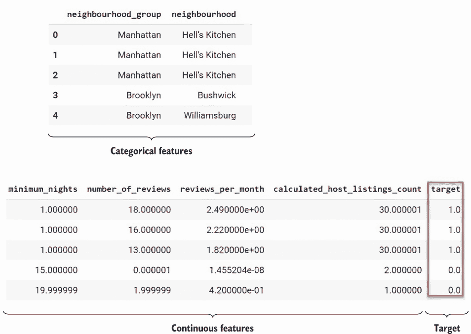
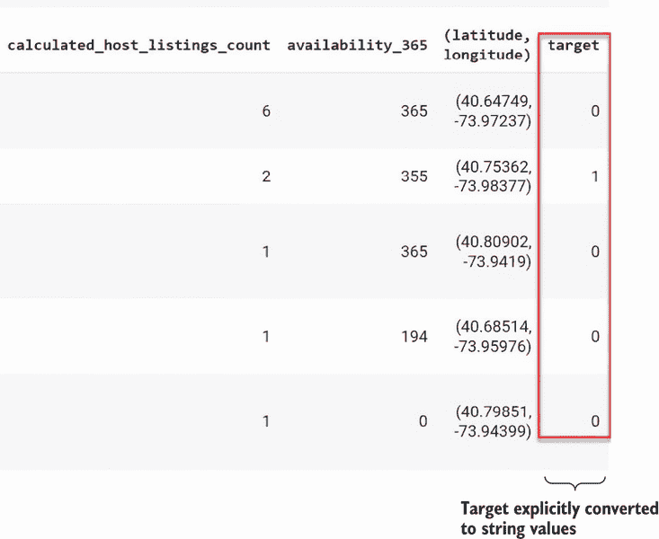
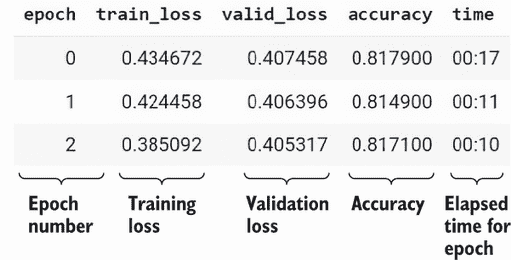
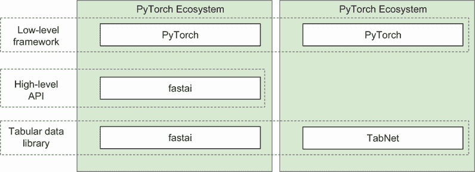
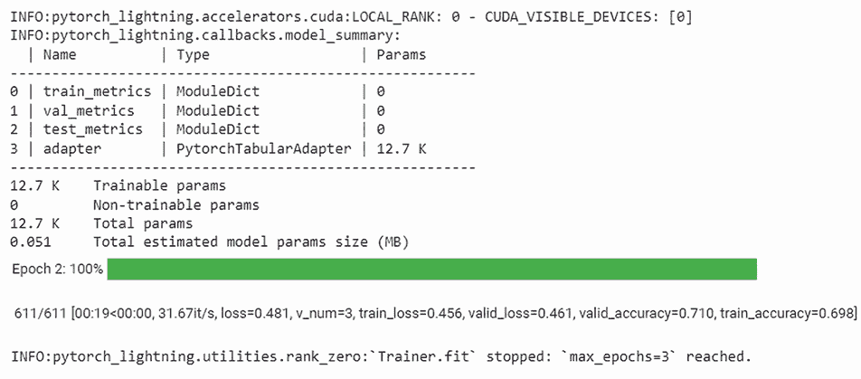
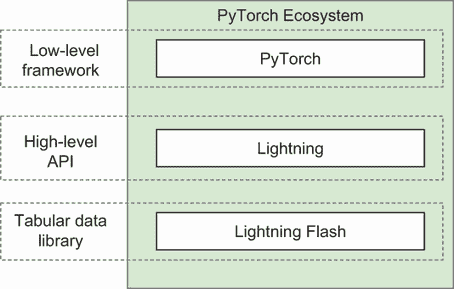
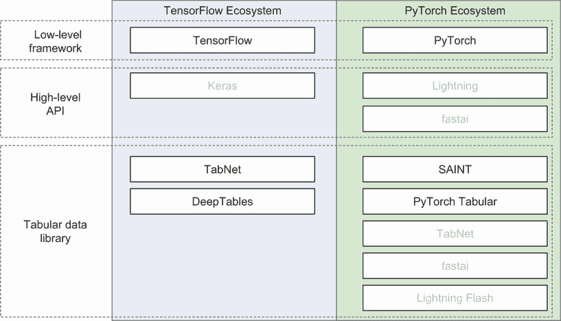
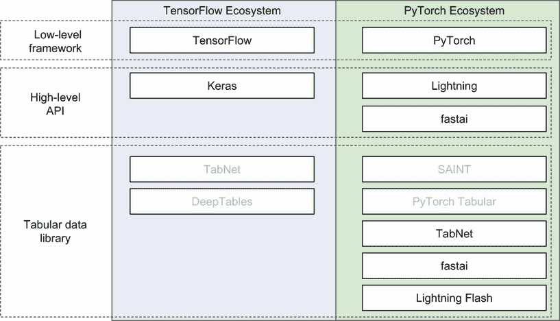

# 8 使用表格数据开始深度学习

本章涵盖

+   使用表格数据堆栈的深度学习简介—深度学习的低级框架和高级 API

+   PyTorch 与 fastai 堆栈

+   PyTorch 与 TabNet 堆栈

+   PyTorch 与 Lightning Flash 堆栈

+   我们没有练习的堆栈以及为什么没有练习它们

+   深度学习表格数据堆栈的优缺点比较

到目前为止，我们一直专注于经典机器学习工具和算法来分析表格数据。从传统的回归算法到更复杂的梯度提升技术，这些方法在简单性、透明性和有效性方面具有优势。尽管如此，深度学习工具的获取和使用变得更加容易，它们也为处理表格数据提供了一个强大的替代方案。

在本章中，我们将回顾一系列深度学习堆栈（低级框架、高级 API 和表格数据深度学习库），并使用这三个堆栈——fastai、PyTorch 与 TabNet 和 Lightning Flash 来解决 Airbnb NYC 问题。我们将用每个堆栈解决同样的问题三次。目标是展示深度学习方法的通用形式，并突出我们选择的三种工具的独特特性。

## 8.1 使用表格数据的深度学习堆栈

在我们检查用于深度学习表格数据的通用堆栈之前，让我们看看一个具体的例子：第三章中描述的基于 Keras 的深度学习解决方案，用于解决 Airbnb NYC 价格预测问题。

Keras 解决方案与 XGBoost 解决方案的比较

专属于 Keras 解决方案的代码包含在训练笔记本中。特别是，第三章中描述的 Keras 解决方案与 XGBoost 解决方案之间的关键区别包括

+   *模型定义*—Keras 模型有一个大函数来定义构成模型的层，每个列类（连续、分类和文本）都得到一组特定的层。

+   *模型训练*—Keras 模型包含额外的代码来定义使训练过程高效的回调函数，包括一个回调函数，如果训练不再使模型变得更好，则提前停止训练过程，以及一个回调函数以确保在训练过程中保存最佳模型。

第三章中我们检查的 Keras 解决方案为我们提供了一个具体的基线，我们可以用它来比较本章我们将检查的其他堆栈。在本章中，我们将练习一系列其他堆栈，以便您可以看到每个选择的优缺点。

我们还将讨论一组我们没有能够练习的堆栈，并解释这一经历告诉我们关于这些选择的信息。了解堆栈选择及其优缺点非常重要，这样您就可以选择最适合您需求的深度学习表格数据堆栈。

让我们简要回顾第三章中的 Keras 解决方案。图 8.1 显示了构成 Keras 解决方案的文件，其中训练笔记本被突出显示。


图 8.1 解决 Airbnb 问题的 Keras 解决方案文件

训练笔记本包含在 Keras 解决方案和其他本章将要探讨的解决方案之间有所不同的代码。其他文件在所有深度学习解决方案中保持一致，除了训练配置文件中的某些设置。

图 8.2 显示了构成此解决方案堆栈的组件。这些组件在训练笔记本中使用。


图 8.2 第三章中 Airbnb NYC 解决方案的堆栈

在这个堆栈中，底层低级深度学习框架是 TensorFlow。由于 Keras 作为 TensorFlow 的一部分提供，并且是 TensorFlow 推荐的高级 API，因此单独谈论 TensorFlow 和 Keras 可能听起来有点多余，但保持它们独立将使一般堆栈选择的描述更清晰。在第三章的深度学习解决方案中，我们使用了自定义编写的代码来定义模型本身。例如，列表 8.1 显示了第三章深度学习解决方案中定义分类列层的自定义代码。列表还显示了`get_model()`函数中定义分类列层的语句。

列表 8.1 `get_model()`函数中定义分类列层语句

```py
    for col in collist:
        catinputs[col] = Input(shape=[1],name=col)                   ①
        inputlayerlist.append(catinputs[col])                        ②
        embeddings[col] = \
(Embedding(max_dict[col],catemb) (catinputs[col]))                   ③
        embeddings[col]=(BatchNormalization()(embeddings[col]))      ④
        collistfix.append(embeddings[col])                           ⑤
```

① 为当前列定义一个模型输入层

② 将刚刚定义的输入层添加到输入层列表中

③ 为当前列定义一个嵌入层

④ 为当前列定义一个批量归一化层

⑤ 将定义的层集添加到整体层列表中

`get_model()`函数指定了模型中三种类型输入列的 Keras 层：分类、连续和文本。列表 8.1 中显示的`get_model()`函数还包含定义连续层和文本层模型层的语句。请注意，此模型有多个输入（每个选定的用于训练模型的列都是一个输入）和一个输出：预测给定 Airbnb 列表的价格是否高于或低于中位数。每个输入列层定义的细节超出了本章的范围，所以我们现在不会详细说明。

既然我们在第三章中已经回顾了深度学习 Airbnb NYC 解决方案的堆栈结构，那么让我们将其推广到其他表格数据的深度学习方法。图 8.3 显示了表格数据问题深度学习堆栈的选择。


图 8.3 表格数据的深度学习堆栈

让我们更详细地检查堆栈的每一层：

+   *低级框架*—有两个主要的低级深度学习框架。在工业界，TensorFlow 被使用得最为频繁。PyTorch 是研究人员最流行的选择。

+   *高级 API*—为了使初学者更容易创建深度学习应用，并抽象化一些经验丰富的开发者的复杂性，在 2010 年代中期，人们发现了对深度学习高级 API 的需求。最初，您可以使用 Keras 作为几个低级框架的前端。到 2019 年，Keras 被集成到 TensorFlow 生态系统中，并被确定为 TensorFlow 推荐的高级框架。在 PyTorch 世界中，没有 Keras 的精确对应物。PyTorch 的整体设计旨在使其比 TensorFlow 更易于使用，并减少对高级 API 的需求。尽管如此，有两个高级 API 抽象了 PyTorch 的不同方面。fastai 专门针对来自其他学科的人士，他们希望使用深度学习来解决他们学科中的问题，其核心伦理是只需几行代码就能定义、训练和练习深度学习模型。相比之下，Lightning 抽象了 PyTorch 的单个方面，即训练循环。建立在 Lightning 之上的 Lightning Flash，根据其文档，是“一个用于快速原型设计、基准测试、微调和解决深度学习问题的通用深度学习框架。”虽然 fastai 和 Lightning 都有专门的用户社区，但它们在 PyTorch 世界中的受欢迎程度并没有像 Keras 在 TensorFlow 世界中的那样。

+   *表格数据库*—低级框架和高级 API 为深度学习提供了一个通用环境。深度学习库提供了专门用于处理表格数据的功能。正如我们在第三章中用深度学习解决方案解决 Airbnb 纽约市价格预测问题所展示的，您不需要使用表格数据库来对表格数据进行深度学习。

关于表格数据库的两个需要注意的细节是

+   表格数据库可能同时支持 TensorFlow 和 PyTorch。TabNet 是支持这两个低级深度学习框架的库的例子。

+   fastai 是一个通用型、高级 API，同时也是表格数据库。fastai 符合这两个类别，因为它将 PyTorch 的一些复杂性抽象化，使其更容易在多种数据类型（包括图像和文本）上构建和训练模型，同时也提供了专门针对表格数据的设施（例如，自动处理表格数据集中分类特征所需的基本操作）。

现在我们已经检查了表格数据的深度学习堆栈，让我们看看在本章中我们将应用以解决 Airbnb 纽约市价格预测问题的堆栈：

+   *PyTorch with fastai*—这是最“传统”的方法，因为 fastai 是一个成熟的框架，有数万名开发者在使用它。根据仓库星级，fastai 是一个明确支持表格数据的最受欢迎的框架。fastai 特别受那些正在学习深度学习和爱好者们的欢迎。

+   *PyTorch with TabNet*—TabNet 是根据仓库星级在 fastai 之后最受欢迎的表格数据库。TabNet 是一个由 Google 在其文档中突出的表格数据库（[`mng.bz/av1m`](https://mng.bz/av1m)）。这个堆栈展示了如何使用专门的表格数据库来创建在表格数据上训练的模型。

+   *Lightning Flash*—PyTorch Lightning 是一个流行的框架，它抽象了一些 PyTorch 的复杂性。Lightning Flash 是建立在 PyTorch Lightning 之上的，提供了一个创建深度学习应用的便捷方式。它还包括对表格数据的显式支持，因此是本章中我们审查的其他堆栈的一个有趣的比较点。

本章接下来的三个部分描述了使用这三个堆栈中的每一个来解决 Airbnb 纽约价格预测问题的解决方案。在每个部分中，我们将审查解决方案的代码，并比较解决方案的优缺点与第三章中我们的基线，即 Keras 解决方案的优缺点。

## 8.2 使用 fastai 的 PyTorch

现在，让我们看看其中一个工具包：PyTorch/fastai。因为我们正在考虑与刚才讨论的相同的数据集和问题，所以我们在这里不会重复。大部分解决方案在不同工具包之间非常相似。在这里，我们将专注于 PyTorch 代码的独特部分。您可以在本书的代码仓库中找到完整的解决方案：[`mng.bz/gaBv`](https://mng.bz/gaBv)。

### 8.2.1 审查 fastai 解决方案的关键代码方面

现在，让我们深入探讨 fastai 解决方案来解决 Airbnb 纽约列表价格预测问题。首先，fastai 有一个独特的导入集合，如列表 8.2 所示，它获取在 Jupyter notebook 中使用 fastai 所需的库。

列表 8.2 fastai 解决方案的导入语句

```py
!pip install -Uqq fastbook                               ①
import fastbook
from fastbook import *                                   ②
from fastai.tabular.all import *                         ③
```

① 安装用于在 Jupyter notebook 中使用 fastai 的库

② 导入用于在 Jupyter notebook 中使用 fastai 的库

③ 导入用于在 fastai 中处理表格数据集的库

如列表 8.2 所示，导入这些库后，您就有了在 Jupyter notebook 中运行 fastai 表格数据应用所需的库。

接下来，fastai 需要定义表格数据集的特征，包括包含模型目标列（在 fastai 中称为*因变量*）的列以及分类和连续列的列表，如下所示。

列表 8.3 fastai 解决方案的表格定义语句

```py
dep_var = 'target'                                        ①
cat = ['neighbourhood_group','neighbourhood','room_type'] ②
cont = \
['minimum_nights','number_of_reviews',\
'reviews_per_month','calculated_host_listings_count']     ③
```

① 指定包含目标值的列，即训练模型预测的值

② 指定数据集中哪些列是分类的

③ 指定数据集中哪些列是连续的

当我们定义此模型的 `TabularDataloaders` ([`mng.bz/5gwO`](https://mng.bz/5gwO)) 对象时，我们将使用列表 8.3 中定义的值。`TabularDataloaders` 对象封装了数据集的样本，包括标签，以便于与数据集一起工作。

接下来，我们需要确保目标列包含字符串值：

```py
merged_data['target'] =merged_data.target.astype(str)
```

如果我们不这样做，我们将遇到一个微妙的问题。为了亲自尝试，请注释掉此语句并运行 fastai 训练笔记本。您将看到训练产生了一些奇怪的结果，如图 8.4 所示。


图 8.4 当目标列未显式转换为字符串值时的 fastai 训练结果

图 8.4 显示了训练过程的每个时期的训练结果，包括训练损失、验证损失和准确率。图 8.4 中显示的准确率值明显低于第三章中 XGBoost 和 Keras 深度学习解决方案的准确率（在 79% 到 81% 之间），并且准确率从一个时期到另一个时期没有提高。训练更多时期没有帮助；准确率保持不变。为什么 fastai 会产生如此令人失望的结果？在 `learn.loss_func` 语句的输出中有一个线索，如下所示。

列表 8.4 显示模型训练中使用的损失函数的语句

```py
learn.loss_func                                        ①
FlattenedLoss of MSELoss()                             ②
```

① 返回用于训练 fastai 模型的损失函数的语句

② 显示用于训练 fastai 模型的损失函数的语句输出

列表 8.4 中显示的输出显示了用于模型的损失函数。如果您没有为 fastai 模型指定损失函数，fastai 将根据目标列中的值选择一个损失函数。我们想要训练一个分类模型，因此损失函数应该是交叉熵。然而，看起来 fastai 选择了一个用于回归问题的损失函数而不是分类问题。这就是为什么列表 8.4 中显示的训练结果不佳——fastai 正在尝试解决一个分类问题（预测一个连续值）而不是我们想要的分类问题（预测一个 0 或 1 来指示列表的价格是否高于或低于中位数价格）。

`dls.valid.show_batch()` 的输出，如图 8.5 所示，提供了另一个线索，因为当 `target` 列中的值应该是“0”或“1”时，它们是浮点数。



图 8.5 当目标列未显式转换为字符串值时的样本批次值

如果我们使用 `merged_data.head()` 回到数据集查看，如图 8.6 所示，`target` 列中的值看起来都是 0 或 1。

这些 `target` 列中的值实际上是数值，这意味着如果我们没有明确地将它们转换为字符串，那么默认情况下，fastai 将假设如果我们使用此数据集来训练模型，所需的模型是回归模型。



图 8.6 当目标列明确转换为字符串值时的样本批处理值

既然我们已经探讨了为什么将 `target` 列中的值转换为字符串值是至关重要的，那么让我们回顾一下创建训练好的 fastai 模型的其余代码。列表 8.5 显示了定义 `TabularDataLoaders` 对象的代码块。该对象是围绕 PyTorch `DataLoader` ([`mng.bz/6eDe`](https://mng.bz/6eDe)) 对象的表格数据特定包装器，它是对数据集中的样本和标签的可迭代封装。

列表 8.5 定义 `TabularDataLoaders` 对象

```py
path = '.'                                                ①
procs = [FillMissing,Categorify, Normalize]               ②
dls = TabularDataLoaders.from_df(dtrain,                  ③
                                 path,
                                 procs= procs,            ④
                                 cat_names= cat,          ⑤
                                 cont_names = cont,       ⑥
                                 y_names = dep_var,       ⑦
                                 valid_idx=\
list(range((merged_data.shape[0]-10000),
merged_data.shape[0])),                                   ⑧
                                 bs=32)                   ⑨
```

① 为路径对象设置占位符值

② 定义在隐式管道中应用于数据集的转换过程

③ 指定 TabularDataLoaders 对象基于合并后的数据框 merged_data

④ 指定使用 TabularDataLoaders 对象应用的转换列表

⑤ 指定分类特征

⑥ 指定连续特征

⑦ 指定目标特征

⑧ 指定在训练过程中用于验证的数据集子集

⑨ 指定批处理大小

我们将使用列表 8.5 中定义的 `TabularDataLoaders` 对象来定义列表 8.7 中显示的 fastai 模型。

fastai 的一个特点是提供了一套便利函数，这使得通过训练阶段检查数据集变得容易。以下列表中显示的 `show_batch()` 语句是此类便利函数的一个例子。

列表 8.6 显示训练数据批次的语句

```py
dls.valid.show_batch()
```

列表 8.6 中的语句使得可以轻松地看到在 `TabularDataLoaders` 定义中 `procs` 参数指定的转换之后，训练模型的数据看起来像什么。图 8.7 显示了此语句的输出。


图 8.7 `show_batch()` 语句的输出

现在我们已经指定了将用于训练模型的数据，是时候定义和训练模型了。

列表 8.7 定义和拟合 fastai 模型

```py
learn = tabular_learner(dls, metrics=accuracy)             ①
learn.fit_one_cycle(3)                                     ②
```

① 使用 TabularDataLoaders 对象 dls 将模型定义为 tabular_learner 对象，并使用准确率作为训练的性能度量

② 使用三个周期训练模型

注意，列表 8.7 中定义和拟合模型的语句比我们在第三章中看到的 Keras 模型的定义和拟合语句要简单得多。从这个意义上说，fastai 解决方案的代码与我们在第三章中看到的 XGBoost 解决方案的代码相似。

图 8.8 展示了 fit 语句的输出。对于每个 epoch，列出了训练损失、验证损失和准确率。如果我们比较图 8.4（目标列未显式转换为字符串值时的训练结果）和图 8.8（目标列转换为字符串值时的训练结果）所示的训练结果，很明显，当 fastai 将问题视为分类问题而不是回归问题时，我们得到更好的结果。



图 8.8 fit 语句的输出

在继续讨论 fastai 解决方案的其余部分之前，让我们花点时间讨论训练损失、验证损失和测试损失之间的关系。图 8.8 展示了每个 epoch 的训练和验证损失。训练损失低于验证损失表明模型可能欠拟合，或者仅应用于训练的正则化技术（如 dropout）产生了过大的影响。图 8.8 显示，在第一个 epoch 中，验证损失低于训练损失。对于后续的 epoch，训练损失下降速度比验证损失快，直到最终 epoch 低于验证损失。

以下列表确认了 fastai 将问题视为分类问题，因为损失函数是 `CrossEntropyLoss()`，这是一个适合分类问题的损失函数。

列表 8.8 显示模型训练中使用的损失函数的语句

```py
learn.loss_func                                         ①
FlattenedLoss of CrossEntropyLoss()                     ②
```

① 返回用于训练 fastai 模型的损失函数的语句

② 显示用于训练 fastai 模型的损失函数的语句输出

列表 8.8 所示的输出表明，在将目标列设置为包含字符串值后，我们现在得到了所需的损失函数。现在让我们看看 fastai 为模型定义了哪些层。以下列表显示了 `summary()` 语句，它让我们可以看到构成 fastai 模型的层。

列表 8.9 获取 fastai 模型摘要的语句

```py
learn.summary()
```

列表 8.9 中语句的输出显示在图 8.9 中，它显示了 `summary()` 语句的输出，包括构成模型的层以及模型中的参数数量和使用的回调。


图 8.9 `summary()` 语句的输出

现在，我们已经检查了 fastai 解决方案中的关键代码区域，让我们回顾堆栈图，看看 fastai 堆栈适合的位置。图 8.10 显示了本节示例中的表格数据深度学习堆栈。请注意，该图显示 fastai 既是高级 API 也是表格数据库，因为 fastai 在堆栈中扮演这两个角色。


图 8.10 PyTorch 与 fastai 的堆栈

现在，我们已经审查了 fastai 解决方案中的代码，在下一节中，我们将比较本章 3 节中看到的 Keras 解决方案。

### 8.2.2 比较 fastai 解决方案与 Keras 解决方案

我们现在已经看到了两个解决 Airbnb 纽约市列表价格预测问题的深度学习解决方案：Keras 解决方案和 fastai 解决方案。在本节中，我们将比较这两个解决方案，并回顾每个解决方案的优缺点。

fastai 和 Keras 的解决方案是很有趣的比较点，因为它们非常不同。Keras 的解决方案包含大量的自定义代码，所有细节都一目了然。fastai 框架从数据集中推断模型的细节，并对默认值做出假设，以便我们不需要指定太多参数就能得到一个可工作的模型。这种做法的好处是 fastai 的代码比 Keras 的代码更加紧凑。特别是，Keras 的解决方案需要多行代码来指定管道和构成模型的层的细节。在 fastai 的解决方案中，我们只需简单地指定要应用于输入数据的转换（如列表 8.6 所示），就可以免费获得管道，而且我们不需要指定构成模型的层。fastai 解决方案紧凑性的缺点是，如果我们不小心，可能会引入微妙的问题。在前一节中，我们看到了如果我们没有明确地将目标列转换为字符串值，那么 fastai 将将目标列中的值解释为连续值，并假设我们想要训练一个回归模型而不是分类模型。

表 8.1 显示了 Keras 和 fastai 解决方案解决 Airbnb 纽约市问题的优缺点总结。如果我们比较两个解决方案的性能，Keras 模型的准确率在 70% 到 74% 之间，而 fastai 模型始终保持在约 81% 的准确率。

表 8.1 Keras 和 fastai 解决方案的优缺点总结

|  | Keras | fastai |
| --- | --- | --- |
| 优点 | 模型细节透明。使用该框架的大型社区意味着可以轻松找到常见问题的解决方案 | 框架包括对表格数据模型的显式支持，这意味着代码更加紧凑。框架自动定义管道。框架包括方便的函数，使检查数据集变得容易。 |
| 缺点 | 没有内置对表格数据的支持，这意味着我们需要定义自定义代码来定义模型的管道和层。 | 框架做出的假设可能导致难以调试的棘手问题。用户社区较小，在部署生产应用程序方面不如 Keras 社区活跃，这意味着可能更难找到问题的解决方案。 |

让我们再比较一下 Keras 解决方案和 fastai 解决方案的一个方面：底层低级深度学习框架。对于 Keras，底层框架是 TensorFlow，而 fastai 建立在 PyTorch 之上。这意味着我们现在已经审查了使用两个主要深度学习框架的表格数据问题的深度学习解决方案。

Keras 和 fastai 之间的一个相似之处是，它们都是通用的高级深度学习 API。我们已经看到它们都可以用于表格数据问题，但它们也被设计来处理各种数据类型，而不仅仅是表格数据。在下一节中，我们将探讨一个专门为表格数据问题设计的深度学习库：TabNet。我们将检查一个使用 TabNet 解决 Airbnb NYC 问题的解决方案，并将其与 Keras 解决方案进行对比。

## 8.3 PyTorch 与 TabNet

我们到目前为止考虑的两个工具被设计为通用深度学习库。现在，我们将尝试一个专门为表格数据设计的库：TabNet。同样，我们将跳过问题的介绍，只集中讨论与之前示例不同的解决方案部分。您可以在[`mng.bz/oK1Z`](https://mng.bz/oK1Z)找到此解决方案的代码。

### 8.3.1 TabNet 解决方案的关键代码方面

在本节中，我们将通过组成 TabNet 解决 Airbnb NYC 列表价格预测问题的关键代码部分。

TabNet 解决方案需要一系列导入，如下所示。

列表 8.10 TabNet 的导入语句

```py
! pip install pytorch-tabnet                                ①
import torch                                                ②
from pytorch_tabnet.tab_model import TabNetClassifier       ③
```

① 安装 TabNet 的 PyTorch 实现

② 导入 torch 张量库

③ 导入 TabNetClassifier 库。我们将使用这个库来定义模型。

注意，与 fastai 的导入语句不同，列表 8.10 中 TabNet 的导入语句包含一个显式语句来导入 PyTorch 库`torch`。

与没有显式代码定义管道且具有定义数据集的独特代码的 fastai 解决方案不同，TabNet 解决方案使用与 Keras 和 XGBoost 解决方案相同的代码，包括管道的定义。在管道定义之后，TabNet 解决方案使用类似于 XGBoost 的代码将管道输出的 NumPy 数组列表转换为 NumPy 数组列表，如下所示。

列表 8.11 生成 NumPy 数组列表的语句

```py
list_of_lists_train = []
list_of_lists_test = []
list_of_lists_valid = []
for i in range(0,7):                                              ①
    list_of_lists_train.append(X_train_list[i].tolist())
    list_of_lists_valid.append(X_valid_list[i].tolist())
    list_of_lists_test.append(X_test_list[i].tolist())
X_train = np.array(list_of_lists_train).T                         ②
X_valid = np.array(list_of_lists_valid).T                         ③
X_test = np.array(list_of_lists_test).T                           ③
y_train = dtrain.target                                           ④
y_valid = dvalid.target
y_test = test.target
```

① 定义训练、验证和测试数据集的列表列表（每个特征一个列表）

② 将训练列表的列表转换为 NumPy 数组列表

③ 将验证列表的列表转换为 NumPy 数组列表

④ 定义训练、验证和测试目标集的变量

列表 8.11 中显示的转换是必需的，因为 TabNet 解决方案期望模型输入的形式是 NumPy 数组列表。接下来，TabNet 解决方案包括定义模型的代码。

列表 8.12 定义 TabNet 模型的语句

```py
tb_cls = TabNetClassifier(optimizer_fn=torch.optim.Adam,           ①
                    optimizer_params=dict(lr=1e-3),                ②
                    scheduler_params={"step_size":10,"gamma":0.9}, ③
                    scheduler_fn=torch.optim.lr_scheduler.StepLR,
                    mask_type='entmax' # "sparsemax"
                    )
```

① 将 TabNetClassifier 对象定义为解决方案的模型并指定 adam 优化器

② 设置模型的学习率

③ 设置学习率调度器的参数

列表 8.12 中显示的模型定义指定了一组超参数，包括优化器和学习率。接下来，TabNet 解决方案包括训练模型的代码。

列表 8.13 训练 TabNet 模型的语句

```py
tb_cls.fit(X_train, y_train,                                       ①
               eval_set=[(X_train, y_train),(X_valid, y_valid)],   ②
               eval_name=['train', 'valid'],                       ③
               eval_metric=['accuracy'],                           ④
               max_epochs=10 , patience=3,                         ⑤
               batch_size=28, drop_last=False)                     ⑥
```

① 指定训练数据集

② 指定验证数据集

③ 指定训练和验证结果的标签

④ 指定用于跟踪训练性能的指标

⑤ 指定训练运行中的 epoch 数以及模型停止改进后运行多少个 epoch

⑥ 指定批量大小

列表 8.13 中的语句指定了 TabNet 模型的训练，包括早期停止设置，包括`patience`参数，该参数表示模型停止改进后训练将继续多少个 epoch。

训练语句的输出显示了每个 epoch 的结果，包括损失、训练准确率和验证准确率，以及早期停止的效果，如图 8.11 所示。


图 8.11 TabNet fit 语句的输出

在图 8.11 所示的训练运行输出中，运行了最大 epoch 数（10），因为验证准确率在达到最大 epoch 数之前没有超过 2 个 epoch 的改进。这意味着在`fit`语句中设置的`patience`阈值 3 从未被越过，因此训练运行进行了最大数量的 epoch。图 8.12 显示了本节示例中的表格数据深度学习堆栈。


图 8.12 PyTorch 与 TabNet 的堆栈

现在我们已经审查了 TabNet 解决方案中的代码，在下一节中，我们将比较这个解决方案与我们在第三章中看到的 Keras 解决方案。

### 8.3.2 比较 TabNet 解决方案与 Keras 解决方案

我们现在已经看到了三个解决 Airbnb 纽约市列表价格预测问题的深度学习解决方案：Keras 解决方案、fastai 解决方案和 TabNet 解决方案。在本节中，我们将比较 Keras 解决方案与 TabNet 解决方案，并回顾每个解决方案的优缺点。

Keras 解决方案和 TabNet 解决方案值得比较，因为它们展示了它们底层框架 TensorFlow 和 PyTorch 的一些优点和缺点。Keras 解决方案受益于简单的`summary()`语句，该语句提供了一个紧凑的列表，列出了构成模型的层。PyTorch 缺乏这个优雅的功能，因此 TabNet 解决方案也缺少这个好处。另一方面，Keras 不提供内置的训练过程控制，因此您必须定义回调以确保您最终从训练运行中获得最佳模型，并且当模型停止改进时，您不会浪费资源运行 epochs。另一方面，PyTorch 默认包含早期停止和保存最佳模型的功能，因此 TabNet 解决方案不需要包含代码来显式定义回调以优化训练过程。表 8.2 显示了 Keras 和 TabNet 与 PyTorch 解决方案对 Airbnb 纽约市问题的优缺点总结。

表 8.2 Keras 和 TabNet 解决方案的优缺点总结

|  | Keras | TabNet |
| --- | --- | --- |
| 优点 | 使用该框架的大众意味着可以轻松找到常见问题的解决方案简单的总结语句来显示模型中的层 | 简单的语句来定义和训练模型不需要显式定义的回调来获得早期停止的好处 |
| 缺点 | 没有内置对表格数据的支持，这意味着模型定义需要手动编写。 | 训练过程要慢得多。Keras 模型训练笔记本运行大约需要 20 秒。TabNet 训练笔记本运行超过 4 分钟。没有一站式总结语句来查看模型的架构 |

在本节中，我们回顾了 PyTorch TabNet 的 Airbnb 纽约市定价预测解决方案。在下一节中，我们将回顾我们针对 Airbnb 问题的最终方法：使用 Lightning Flash 的 PyTorch。

## 8.4 使用 Lightning Flash 的 PyTorch

到目前为止，我们已经考虑了 Keras、fastai 和 TabNet PyTorch 解决方案来解决 Airbnb 纽约市房价预测问题。现在让我们转向我们的最终堆栈：Lightning Flash。作为一个用于快速原型设计、基准测试和微调的平台，它还拥有清晰的 API 和出色的文档，Lightning Flash 可能比我们迄今为止探索的堆栈具有潜在优势。

您可以在[`mng.bz/vKnp`](https://mng.bz/vKnp)找到此解决方案的代码。图 8.13 显示了 fastai 和 Tabnet 在 PyTorch 堆栈上的情况。



图 8.13 fastai 和 Tabnet 在 PyTorch 堆栈上

### 8.4.1 Lightning Flash 解决方案的关键代码方面

Lightning Flash 解决方案的代码有许多方面与我们迄今为止看到的解决方案不同。在本节中，我们通过模型训练笔记本([`mng.bz/4aDR`](https://mng.bz/4aDR))来突出显示此解决方案最有趣的部分。

要在 Colab 中工作，Lightning Flash 解决方案需要按照特定的顺序执行一系列安装，如列表 8.14 所示。此列表的来源为[`mng.bz/QDP6`](https://mng.bz/QDP6)。

列表 8.14 在 Colab 中使 Lightning Flash 工作所需的安装

```py
!pip install torch==1.8.1+cu102 -f 
https://download.pytorch.org/whl/torch_stable.html          ①
!pip install icevision #==0.9.0a1
!pip install effdet 
!pip install lightning-flash[image]
!pip install git+https://github.com/PyTorchLightning/lightning-flash.git
!pip install torchtext==0.9.1
!pip uninstall fastai -y                                    ②
!curl https://raw.githubusercontent.com/airctic/ \
icevision/944b47c5694243ba3f3c8c11a6ef56f05fb111eb/ \
icevision/core/record_components.py –output \
    /usr/local/lib/python3.7/dist- \
packages/icevision/core/record_components.py                ③
```

① 系列 pip 安装以获取所需的 PyTorch Lightning 级别

② 为了消除 fastai 和 Lightning Flash 之间可能存在的冲突，需要卸载 fastai。

③ 手动修复当前发布版本 icevision 中的一个 bug

列表 8.14 包含了一系列安装（以及一个卸载）以使 Lightning Flash 在 Colab 中工作。根据经验，我们知道这个非常具体的安装列表是必需的，否则 Lightning Flash 所需的库级别与 Colab 的默认库级别之间将存在冲突。

接下来，需要导入 Lightning Flash 所需的库。

列表 8.15 Lightning Flash 所需的库导入

```py
import torch                                                ①
import flash                                                ②
from flash.tabular import TabularClassificationData, 
from flash.tabular import TabularClassifier                 ③
```

① 导入 torch 张量库

② 导入 flash 库

③ 导入用于表格分类模型的所需对象

注意，列表 8.15 中的 torch 导入语句与列表 8.11 中用于 TabNet 导入 torch 的语句相同。

接下来，我们定义用于训练模型的 dataset 的参数。

列表 8.16 设置数据集参数

```py
dep_var = 'target'                                          ①
cat=['neighbourhood_group','neighbourhood','room_type']     ②
cont = ['minimum_nights','number_of_reviews',
'reviews_per_month','calculated_host_listings_count']       ③
```

① 将目标字段设置为训练模型将预测的值

② 定义分类特征的列表

③ 定义连续特征的列表

列表 8.16 中的定义应该会让你想起 fastai 解决方案（列表 8.3）中类似的一块代码，在那里我们定义了目标特征以及分类和连续特征的列表。

接下来，我们使用刚刚定义的值来定义一个`TabularClassificationData`对象。此对象指定了我们用于训练模型的 dataset 的最小特征。

列表 8.17 定义`TabularClassificationData`

```py
datamodule = TabularClassificationData.from_csv(
    categorical_fields=cat,                                ①
    numerical_fields=cont,                                 ②
    target_fields="target",                                ③
    train_file='../data/train.csv',                        ④
    val_file='../data/valid.csv',                          ⑤
    predict_file='../data/test.csv',                       ⑥
    batch_size=64
)
```

① 定义分类特征

② 定义连续特征

③ 定义目标特征

④ 定义训练数据集

⑤ 定义验证数据集

⑥ 定义测试数据集

我们应该解释为什么列表 8.17 中显示的`TabularClassificationData`对象的定义使用单独的 CSV 文件来存储训练、验证和测试数据集。对于所有其他解决方案，数据集是从一个 pickle 文件中加载的，这个 pickle 文件是数据清理笔记本的输出（[`mng.bz/XxN9`](https://mng.bz/XxN9)），然后在模型训练笔记本中将数据集分割成训练、验证和测试数据集。Lightning Flash 解决方案是不同的，因为它为数据集的每个部分都有独立的 CSV 文件。这是因为列表 8.14 中显示的非常具体的安装要求与加载包含数据清理笔记本输出数据框的 pickle 文件不兼容。作为权宜之计，我们在一个单独的笔记本中将那个 pickle 文件加载到一个 pandas DataFrame 中，并保存了训练、验证和测试的单独 CSV 文件，这些文件在列表 8.17 中`TabularClassificationData`对象的定义中可以看到。作为一个练习，你可以更新 Lightning Flash 解决方案的数据清理笔记本，使其将清理后的数据集保存为三个单独的 CSV 文件，而不是一个单独的 pickle 文件。

现在我们已经指定了数据集的详细信息，我们就可以定义和训练模型了，如下面的列表所示。

列表 8.18 设置数据集参数

```py
model = TabularClassifier.from_data(datamodule, 
learning_rate=0.1)                                          ①
trainer = flash.Trainer(max_epochs=3, 
gpus=torch.cuda.device_count())                             ②
trainer.fit(model, datamodule=datamodule)                   ③
```

① 使用列表 8.18 中定义的`TabularClassifierData`对象定义模型

② 定义一个 Trainer 对象

③ 拟合模型

列表 8.18 中的训练代码生成了图 8.14 所示的输出。



图 8.14 Lightning Flash 训练过程的输出

注意输出包括模型的验证准确率和训练准确率。图 8.15 显示了本节示例中的表格数据深度学习堆栈。



图 8.15 PyTorch with Lightning Flash 堆栈

Lightning Flash 解决方案的代码包含了一些非常优雅的想法，例如能够在定义数据集整体特性的同一个对象中指定训练、验证和测试数据集。总的来说，Lightning Flash 的 API 易于理解。不幸的是，由于 Lightning Flash 在 Colab 中运行需要如此具体的条件，这些好处被削弱了。否则，Lightning Flash 可能会成为最受欢迎的解决方案，结合了 fastai 的简单性和 Keras 的直观性。

### 8.4.2 比较 Lightning Flash 解决方案与 Keras 解决方案

我们已经看到了四种解决 Airbnb 纽约市列表价格预测问题的深度学习解决方案：Keras 解决方案、fastai 解决方案、TabNet 解决方案，最后是 Lightning Flash 解决方案。在本节中，我们将比较 Keras 解决方案与 Lightning Flash 解决方案，并回顾每个解决方案的优缺点。

我们已经看到 Lightning Flash 在推出快速、简单的解决方案方面有一些真正的优势。然而，在 Colab 中使用 Lightning Flash 的缺乏明确路径令人担忧，而且人们不禁要问，展示在列表 8.15 中的复杂安装组合将如何继续使在 Colab 中运行 Lightning Flash 实验成为可能。表 8.3 显示了 Keras 和 Lightning Flash 解决方案对 Airbnb 纽约市问题的优缺点总结。

表 8.3 Keras 和 TabNet 解决方案的优缺点总结

|  | Keras | Lightning Flash |
| --- | --- | --- |
| Pro | 使用该框架的大众社区意味着可以轻松找到常见问题的解决方案。简单的总结语句以显示模型中的层 | 简单的语句来定义和训练模型不需要显式定义管道——只需识别分类和连续列。 |
| Con | 没有内置对表格数据的支持，这意味着模型定义需要手动编码。要在 Colab 中运行，需要非常具体的安装顺序和级别。似乎不太被广泛使用，至少在 Colab 中不是。开箱即用的测试准确率不如其他解决方案。 |

到目前为止，在本章中，我们已经应用了三种用于表格数据的深度学习堆栈来解决 Airbnb 纽约市价格预测问题，并比较了每种解决方案的优缺点。在下一节中，我们将回顾本章中我们练习的所有堆栈的整体比较。

## 8.5 堆栈的整体比较

我们总共研究了四种用于表格数据的深度学习堆栈。表 8.4 总结了所有这些堆栈在默认 Colab 设置上的性能，为深度学习解决方案选择了标准的 GPU Colab 运行时选项。

表 8.4 深度学习与表格数据堆栈（包括 XGBoost）的准确率和运行时间总结（用于 Airbnb 纽约市列表价格预测问题）

|  | 测试准确率 | 笔记本运行时间 |
| --- | --- | --- |
| TensorFlow with Keras | 81% | 16 seconds |
| fastai with PyTorch | 83% | 69 seconds |
| TabNet with PyTorch | 81% | 568 seconds |
| Lightning Flash with PyTorch | 待定 | 14 seconds |
| XGBoost | 79% | 14 seconds |

这里需要注意的是，为了进行这种比较，我们没有对任何方法进行任何调整。我们希望有一个真正的“苹果对苹果”的比较，比较方法在没有额外调整的情况下与 Keras 基线如何比较。在随后的章节中，我们将讨论可以对深度学习解决方案进行的一些调整，以获得最佳结果。

为了准确性，fastai 略优于其他堆栈。在执行时间方面，Lightning Flash 最佳，而 TabNet 最慢。那么，用于表格数据的最佳堆栈是什么？首先，如果我们比较 XGBoost 与任何深度学习解决方案，哪一个更好？我们将在第九章中更详细地回答这个问题，但我们可以现在说，如果是在深度学习和梯度提升之间的直接比较，为了简单性和整体“开箱即用”的性能，“梯度提升”方法如 XGBoost 目前在大多数数据集上优于任何深度学习解决方案。有些用例值得探索深度学习解决方案之一，我们将在第九章中回顾这些用例。

如果你确实决定使用深度学习解决方案来解决表格数据问题，在我们已经探索的四个选项中，你应该使用哪一个？以下是我们的一般建议：

+   如果你刚开始接触深度学习，并且主要对探索解决方案感兴趣，而不需要立即在生产环境中实施解决方案，那么 fastai 是最好的选择。它是使用最简单的堆栈，拥有足够大的用户社区，你不太可能遇到别人从未见过的难题。Fastai 包含许多便利功能，使处理表格数据变得容易，因此你可以快速原型化你的解决方案。然而，如果你需要快速将解决方案转移到生产环境中，fastai 可能不是你的最佳选择，因为它在生产环境中并不常用。

+   如果你已经熟悉深度学习，并且需要将应用程序投入生产，我们推荐使用 Keras 堆栈。首先，堆栈的低级组件 TensorFlow 是工业界最常用的深度学习框架。其次，Keras 拥有庞大的用户社区。虽然 Keras 还没有像 fastai 那样对表格数据提供原生支持，但 Keras 足够高级，可以适用于表格数据问题。

随着越来越多的人使用表格数据深度学习，这些建议可能会改变。其他堆栈之一，例如 PyTorch 上的 TabNet，可能会成熟并成为表格数据深度学习的默认选择。然而，从当前最先进的技术来看，我们建议初学者和探索者使用 fastai，而对于更有经验且需要快速进入生产环境的人来说，推荐使用 Keras。

在下一节中，我们将讨论本章中没有探索的堆栈。

## 8.6 我们没有探索的堆栈

你可能已经问过为什么我们选择了三个特定的堆栈（fastai、PyTorch TabNet 和 Lightning Flash）来解决 Airbnb NYC 问题，而没有探索其他选项，例如 TensorFlow 上的 TabNet、SAINT 或 PyTorch Tabular。在本节中，我们将探讨这个问题，并看看答案告诉我们关于我们用于表格数据深度学习的堆栈有哪些选项。图 8.16 显示了我们没有探索的表格数据深度学习堆栈。



图 8.16 我们未探索的堆栈

未探索的堆栈有一些共同的特点：

+   所有未探索的堆栈都涉及专门的表格数据库。

+   我们无法在 Colab 中使任何未探索的堆栈工作，这是我们用来练习本书中代码示例的环境。

我们无法在 Colab 中使未探索的堆栈工作可能是由多种原因造成的。理论上，Colab 可能存在一些限制。然而，Colab 是一个非常常见的探索环境，所以如果一个库无法在 Colab 中被激活，这并不是一个好兆头。所有的堆栈都提供了“hello world”示例来练习堆栈，而对于所有未探索的堆栈，这些示例都产生了错误，大多数与矛盾的 Python 库先决条件有关。可能如果我们更有耐心，或者更深入地调查，我们就能解决这些错误，让基本示例在 Colab 中运行。在我们探索的堆栈中，Keras、fastai 和 PyTorch TabNet 都能在 Colab 中“即开即用”。另一方面，Lightning Flash 在 Colab 中工作之前确实需要一些调整。

Lightning Flash 与未探索的堆栈之间的区别在于，很明显，其他人曾尝试在 Colab 中使 Lightning Flash 工作，我们可以找到非正式文档，展示了我们为了使其在 Colab 中工作需要做的一切。如果你的目标是使用深度学习解决表格数据问题，你希望专注于问题，而不是在 conda 和 pip 安装库时纠结于避免不兼容性。根据这个标准，Keras、fastai、PyTorch TabNet 以及在一定程度上 Lightning Flash 都是 Colab 中表格数据深度学习的可行选择。SAINT、DeepTables、PyTorch Tabular 和 TensorFlow 上的 TabNet 并不是 Colab 中探索的可行选择，因为它们不能立即工作，而且使它们工作的配方要么不存在，要么难以找到。

虽然我们无法使用更多的针对表格数据的专用深度学习库来练习 Airbnb 纽约价格预测问题令人失望，但我们仍然通过探索三个表格数据的深度学习堆栈实现了本章的目标。图 8.17 显示了我们能够探索的所有堆栈。



图 8.17 我们探索的堆栈

本章中我们探索的堆栈，加上 TensorFlow 与 Keras，提供了一套全面的选项：

+   TensorFlow with Keras 是一个稳固的堆栈，拥有庞大的用户社区。对于你在这个堆栈中遇到的几乎所有问题，你都可以确信其他人已经遇到过这个问题并发布了解决方案。这个堆栈在 Colab 中运行得非常完美，因此进行初步调查很容易。TensorFlow with Keras 通常在生产中用于各种应用。然而，Keras 没有内置对表格数据的支持，因此你需要准备好编写一些自定义代码来处理表格数据问题。

+   PyTorch with fastai 设计得易于上手，并且在 Colab 中运行得非常完美，因此你可以期待用这个堆栈以最小的麻烦原型化深度学习中的表格数据问题。fastai 将表格数据视为一等公民，因此你获得内置支持以处理分类和连续特征，你不需要担心手动编码一个管道来确保当你向训练好的模型提供数据以获取预测时，数据会经历与训练模型所使用的数据相同的转换。然而，fastai 代码的简单性可能会付出代价。fastai 自动执行的步骤可能导致一些难以调试的问题（例如，在本章中我们描述的问题，如果目标列没有明确转换为字符串类型，就会训练错误类型的模型），如果你想要偏离 fastai 表格数据结构提供的既定路径，你需要准备好深入研究 fastai API。

+   PyTorch with TabNet 通过在 Colab 中无需任何麻烦地工作，在表格数据特定的库中脱颖而出。像 fastai 一样，使用 TabNet，你只需几行代码就可以在表格数据上定义和训练一个深度学习模型。与 fastai 不同，TabNet 使用的是 Scikit-learn 用户容易理解的常规 API。与其他堆栈相比，TabNet 训练模型所需的时间更长。此外，作为一个专门为表格数据设计的库，TabNet 的用户社区比 fastai 和 Keras 小，这意味着如果你遇到问题，其他人已经遇到过并已在 Stack Overflow 上记录了修复的可能性较小。

+   PyTorch with Lightning Flash 可以快速训练模型，并且一旦运行起来，API 就很简单。Lightning 拥有一个庞大的社区——不如 Keras 那么大，但比 fastai 大。然而，在 Colab 上使用 Lightning Flash 处理表格数据的问题领域并不大，我们刚刚才让 Lightning Flash 在 Colab 上运行起来。

在本章中，我们探索了一系列用于表格数据的深度学习堆栈，比较了每种方法的优缺点，并讨论了为什么我们没有探索一些其他堆栈。在下一章中，我们将回顾用于表格数据的深度学习的最佳实践。

## 摘要

+   有两个低级深度学习框架：TensorFlow 和 PyTorch。

+   TensorFlow 在工业中应用得更频繁。

+   PyTorch 是研究中的主要深度学习框架。

+   Keras 是 TensorFlow 的高级 API。

+   fastai 既是 PyTorch 的一般用途、高级 API，也是一个表格数据库。

+   PyTorch Lightning 是一个高级 API，它抽象了一些 PyTorch 的细节。Lightning Flash 是基于 Lightning 的表格数据库。

+   Lightning Flash 和 fastai 都为 PyTorch 提供了一些与 Keras 为 TensorFlow 提供的相同的好处，通过抽象底层 PyTorch 框架的一些方面。

+   TabNet 是一个既适用于 TensorFlow 也适用于 PyTorch 的表格数据库。

+   SAINT 是 TensorFlow 的表格数据库。

+   PyTorch Tabular 是 PyTorch 的表格数据库。

+   在所有可用的选择中，TensorFlow 与 Keras、PyTorch 与 fastai、PyTorch 与 TabNet 以及 PyTorch 与 Lightning Flash 都是 Colab 上进行表格数据深度学习的有效选项。
