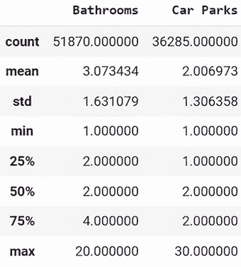
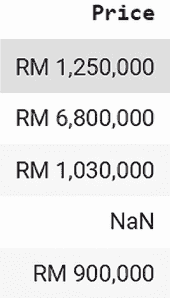
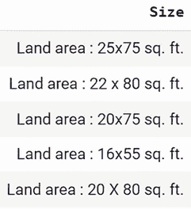
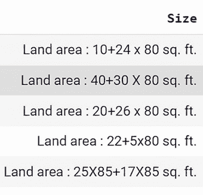
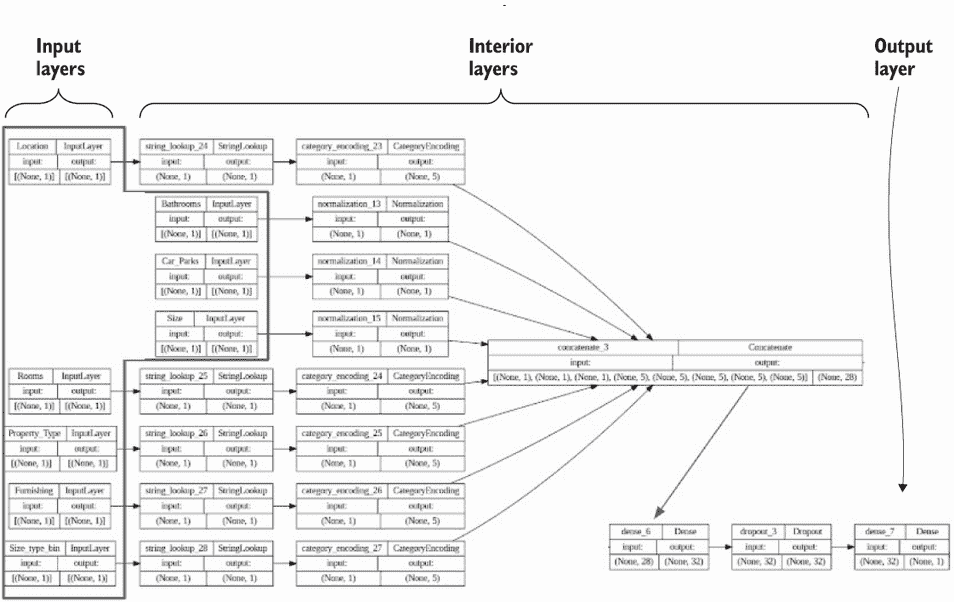
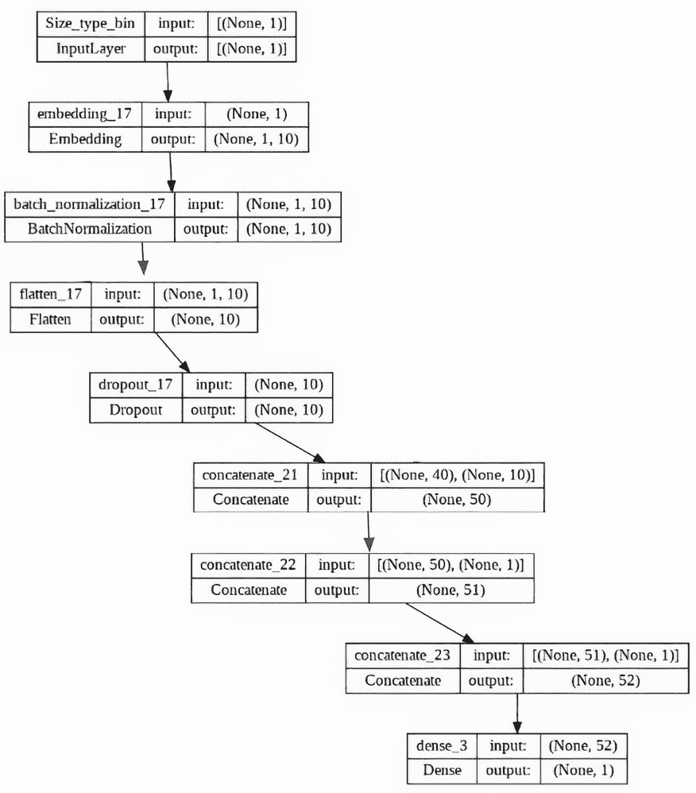
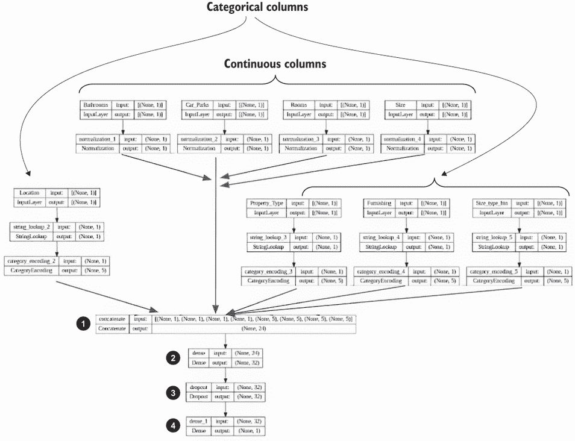
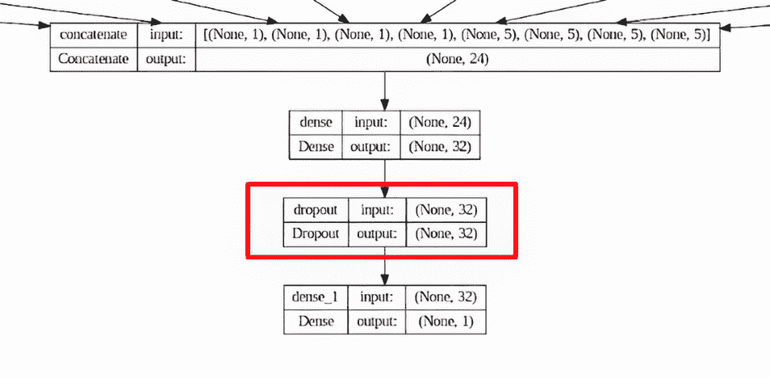
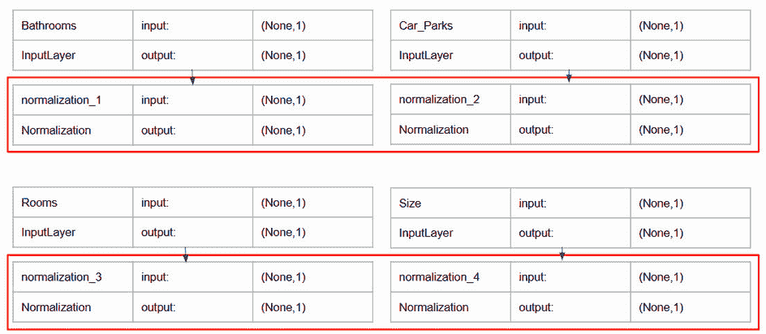

# 9 深度学习最佳实践

本章涵盖了

+   吉隆坡房地产数据集简介

+   处理数据集

+   定义深度学习模型

+   训练深度学习模型

+   练习深度学习模型

在第八章中，我们考察了一系列用于表格数据深度学习的堆栈。在本章中，我们使用这些堆栈之一，Keras，来探索表格数据深度学习的最佳实践，包括如何准备数据、如何设计模型以及如何训练模型。我们引入了一个新问题来展示所有这些最佳实践：预测吉隆坡的房地产价格是否高于或低于市场中位数价格。我们选择这个数据集是因为它比我们迄今为止使用的 Airbnb 纽约市数据集更复杂、更具挑战性。因此，我们将能够展示更广泛的将深度学习应用于表格数据集的技术。

如果你刚开始训练深度学习模型，本章中的示例将帮助你学习一些最佳实践。如果你在定义和训练深度学习架构方面已有丰富的经验，那么本章作为原则的复习对你可能有益。

## 9.1 吉隆坡房地产数据集简介

在本章中，我们将使用吉隆坡房地产数据集来解释表格数据深度学习的最佳实践。该数据集包含描述在马来西亚首都吉隆坡出售的物业的记录。图 9.1 展示了使用 `df.head()` 输出的数据集中记录的样本。本章中展示的代码可在 [`mng.bz/yWQp`](https://mng.bz/yWQp) 找到。


图 9.1 马来西亚吉隆坡房地产数据集样本

在下一节中，我们将介绍我们需要采取的步骤来清理数据集中每一列。为了准备这些描述，让我们首先回顾数据集中每一列的内容：

+   `位置`—该物业所在的街区。

+   `价格`—该物业在林吉特（RM，马来西亚货币的传统符号）中的标价。

+   `房间数`—该物业的房间数量。此列中的值如“2 + 1”表示该物业有两个卧室和一个不能归类为卧室的房间。

+   `浴室数`—该物业中的洗手间数量。

+   `停车位`—该物业上的停车位数量。

+   `物业类型`—物业的分类，例如“公寓”、“服务式住宅”等。

+   `面积`—该物业的尺寸。此列中的值可能指代物业的几个方面，包括整体土地面积或物业内的建筑面积。

+   `装修情况`—该物业是否装修。

我们需要回答关于这个数据集的基本问题之一是哪些列是连续的还是分类的。通过查看图 9.1，我们可以发现包含数值值的列的子集。让我们仔细看看这个数据集的子集，看看我们是否能确定哪些列是连续的。图 9.2 显示了数据集中看起来包含数值数据的列的子集的值。


图 9.2 看起来包含数值数据的列的子集

我们可以使用以下命令验证这些列中哪些包含数值数据：

```py
df.describe()
```

此命令返回 DataFrame 中所有数值列的描述性统计信息，提供了关于每个数值列的数据分布、集中趋势和变异性的洞察。通过检查此命令的输出，您可以确定哪些列确实包含数值值。此命令的输出显示在图 9.3 中。



图 9.3 该数据集`describe()`的输出

图 9.3 表明只有`Bathrooms`和`Car Parks`是数值列，而`Price`、`Rooms`和`Size`不是数值列，尽管它们包含一些看起来是数值的数据。在下一节中，作为处理数据集的一部分，我们将描述从`Price`、`Rooms`和`Size`特征中提取数值数据并使其可用于训练模型的步骤。

评估哪些列是分类的还是连续的另一种方法是计算每列的唯一值数量。如果一个列包含大量唯一值，这可能表明我们应该将其视为连续的，如果它包含相对较少的值，这可能表明我们应该将其视为分类的。实际上，具有少量唯一值的特征通常被认为是分类的，因为它们通常代表离散的分类或组，而不是连续的数值测量。但这并不是一个绝对规则，正如我们将看到的那样。`df.unique()`命令的输出给出了数据集中每列的唯一值数量。

列表 9.1 获取每个列中唯一值的数量

```py
counts = df.nunique()                                  ①
print("unique value counts:\n",counts)
```

① 返回数据框 df 中每列的唯一值数量

列表 9.1 中命令的输出如下所示：

```py
unique value counts:  
Location          112                                  ①
Price            4280                                  ②
Rooms              43                                  ③
Bathrooms          17                                  ④
Car Parks          21                                  ④
Property Type      99                                  ⑤
Size             6190                                  ⑥
Furnishing          4                                  ⑦
dtype: int64
```

① 这一列中有限数量的值强化了我们的直觉，即这一列是分类的。

② 这一列是连续的。

③ 这一列需要进一步调查。

④ 这一列是连续的。

⑤ 这一列是分类的。

⑥ 这一列是连续的，但需要特殊处理，正如我们将在本章后面看到的那样。

⑦ 这一列是分类的。

为了总结列表 9.1 中命令的输出关于数据集的信息：

+   *看似分类的列*——`Location,` `Property` `Type,` `Furnishing.`

+   *看起来是连续的列*——`价格`、`浴室`、`停车场`、`大小`。在这些列中，`大小`也需要进一步调查。

+   *需要进一步调查以确定是否应将其视为连续或分类的列*——`房间数`。

其中两列需要进一步调查：“房间数”和“大小”。在下面的数据集处理部分，我们将深入调查这两列，以确定如何处理它们。

现在我们对数据集中的列以及它们提供的信息有了大致的了解，让我们进一步探索数据集的一些其他方面。首先，让我们检查数据集的维度，如下面的列表所示。

列表 9.2 检查数据集维度的代码

```py
print("shape ",df.shape)                                 ①
shape  (53883, 8)                                        ②
```

① 获取输入数据框维度的语句

② 命令的输出

列表 9.2 显示了该数据集有超过 53,000 行和八个列。在第十二章中，我们将检查数据集行数、数据集列的性质以及深度学习模型对数据的适用性之间的关系。目前，可以安全地说，虽然这个数据集相对较小，但它足够大，我们可以有机会用它来训练一个深度学习模型。

下面的列表包含了列出数据集中每个列缺失值数量的语句。

列表 9.3 列出每个列缺失值的语句

```py
missing_values_count = df.isnull().sum()                  ①
print("missing values before cleanup:\n",missing_values_count)
```

① 此语句的输出是按列计算的缺失值数量。

下面的命令输出是列表 9.3 的结果：

```py
missing values before cleanup:
Location             0                                    ①
Price              248
Rooms             1706
Bathrooms         2013
Car Parks        17567                                    ②
Property Type       25
Size              1063
Furnishing        6930
dtype: int64
```

① “位置”是唯一没有缺失值的列。

② 缺失值最多的列是“停车场”列。

从 9.3 列表中的命令输出中，我们可以看到这个数据集中除了一个列之外的所有列都有缺失值。这是我们需要纠正的一些问题的早期迹象，以便使这个数据集准备好用深度学习模型进行训练。相比之下，Airbnb 纽约数据集只有四个列有缺失值：

```py
Missing values:  
id                                    0
name                                 16                  ①
host_id                               0
host_name                            21                  ②
neighbourhood_group                   0
neighbourhood                         0
latitude                              0
longitude                             0
room_type                             0
price                                 0
minimum_nights                        0
number_of_reviews                     0
last_review                       10052                  ③
reviews_per_month                 10052                  ④
calculated_host_listings_count        0
availability_365                      0
```

① “name”列中的缺失值

② “host_name”列中的缺失值

③ “last_review”列中的缺失值

④ “reviews_per_month”列中的缺失值

如此所示，吉隆坡数据集几乎每个列都有缺失值，这警告我们，正如现实世界数据经常发生的那样，在我们可以开始使用模型之前，我们将不得不进行大量工作来清理这个数据集。

在本节中，我们首次查看了吉隆坡房地产数据集。在下一节中，我们将回顾准备此数据集以训练深度学习模型的过程。

## 9.2 处理数据集

现在我们已经查看了吉隆坡房地产数据集，并看到它有大量的缺失值，我们有一些想法，在我们可以用它来训练模型之前，它将需要大量的处理。在本节中，我们将逐个查看数据集的特征，以描述所需的清理工作。

在这一点上，我们还没有决定是使用子集还是完整集的列。最初，我们的方法默认使用所有可用特征。随着我们前进并检查模型的性能和行为，我们可能会决定排除一些特征，例如，因为这些特征有未检测到的无效值，这影响了模型的性能。我们努力获得模型训练时可用的一整套干净特征，不仅仅是因为我们无法预测哪些特征会起作用，哪些不会。这也是充分利用数据的一种方式，因为我们将在完全处理数据集的过程中了解更多关于数据集的信息，并将其用于其他项目，使其可重用。这种全面的方法确保了比我们仅清理最终用于训练模型的特征所能获得的结果更好的结果。

本节中突出显示的代码可在[`mng.bz/MDBQ`](https://mng.bz/MDBQ)找到，配置文件可在[`mng.bz/av1j`](https://mng.bz/av1j)找到。

我们将首先解决只涉及处理缺失值的列：`浴室`、`车位`、`装修`、`物业类型`、`位置`。接下来，我们将描述需要比简单地处理缺失信息更多的清理过程的列：`价格`、`房间数`和`面积`。

### 9.2.1 处理浴室、车位、装修、物业类型和位置列

对于数据集中的一部分列（`浴室`、`车位`、`装修`、`物业类型`、`位置`），我们可以通过简单地处理缺失值来实现有效的清理。配置文件包含默认值，用于替换这些列的缺失值，这些默认值是基于它们的特性和领域知识确定的。

列表 9.4 定义缺失值的默认替换值

```py
misc_col_dict: # default values to replace missing values for general columns 
   Bathrooms: median                                     ①
   Car Parks: 0                                          ②
   Furnishing: unknown_furnishing                        ③
   Property Type: unknown_property
   Location: unknown_location
```

① 对于浴室列，将该列的中位数作为默认值

② 对于车位列，将默认值设为零

③ 对于分类列，设置一个占位符类别作为默认值

列表 9.4 显示，我们在该字典中将`浴室`列的缺失值设置为列的中位数。对于`车位`列，我们将缺失值设为零。这些差异的原因是由于房地产列表的具体使用案例。住宅物业很少没有洗手间，因此将中位数作为`浴室`的默认值是有意义的。另一方面，许多物业可能没有停车位。如果一个物业确实有停车位，那么卖方和卖方代理的最佳利益是将其包含在列表中，以确保他们为该物业获得最佳售价。因此，当`车位`缺失值时，假设该物业没有停车位是有意义的，所以我们在这个列中将缺失值设为零。

在这个字典中，我们还有用于分类列的特定占位符类别值。获取这种简单清理的代码放置在数据清理笔记本的`clean_up_misc_cols()`函数中。

列表 9.5 替换一般缺失值的函数

```py
def clean_up_misc_cols(df,misc_col_dict): 
 for col in misc_col_dict:                           ①
    if misc_col_dict[col] == 'median':               ②
      df[col] = df[col].fillna(df[col].median())
    else:
      df[col] = df[col].fillna(misc_col_dict[col])   ③
  return(df)
```

① 遍历具有简单数据清理的列

② 用指定列的中位数替换缺失值

③ 对于其他列，用该列的默认值替换列中的缺失值

在列表 9.5 中展示的`clean_up_misc_cols()`函数中，使用配置文件中定义的字典，如列表 9.4 所示，用于替换需要简单清理的列中的缺失值。

现在我们已经描述了如何清理仅需要处理缺失值的列，本节接下来的小节将描述剩余三个列（`价格`、`房间`和`大小`）所需的更密集的数据操作。

### 9.2.2 处理`价格`列

在我们开始讨论`价格`列中需要清理的内容之前，让我们回顾一下该列的一些值示例，如图 9.4 所示。



图 9.4 `价格`列的值示例

图 9.4 中的值显示了一些需要在`价格`列中处理的项目：

+   包含表示马来西亚货币林吉特的符号“RM”的值

+   缺失值

+   需要转换为浮点数的值

列表 9.6 展示了`clean_up_price_col()`函数，其中包含一个代码片段，用于有效地清理`价格`列。

列表 9.6 清理`价格`列的函数

```py
def clean_up_price_col(df):
  df.dropna(subset=['Price'], inplace=True)            ①
  df['Price'] = \
df['Price'].apply(lambda x:\ 
remove_currency_symbol("RM ",x))                       ②
  df['Price'] = \
pd.to_numeric(df['Price'].\
str.replace(',',''), errors='coerce')                  ③
  return(df)
```

① 删除在`价格`列中缺失值的行

② 移除货币符号

③ 移除逗号并将值转换为浮点数

如列表 9.6 所示，`clean_up_price_col()`函数删除了具有缺失`价格`值的行。删除这些行的理由（而不是用某个占位符替换缺失的`价格`值）是，`价格`是我们模型的目标；因此，保留此类值缺失的行是不可行的。`clean_up_price_col()`函数的输出是一个`价格`列中所有行都具有有效数值的数据框。

### 9.2.3 处理`房间`列

在我们开始讨论`房间`列中需要清理的内容之前，让我们回顾一下该列的一些值，如图 9.5 所示。


图 9.5 展示了`房间`列的值示例

图 9.5 中的值展示了需要在`价格`列中处理的一些问题：

+   缺失值。

+   包含多个组成部分值的双桶值。在吉隆坡房地产数据集中，此类值包括如“4 + 1.”之类的字符串表达式。这些值需要解析以提取模型训练中可用的值。

+   至于缺失值，我们可以选择用零替换 `NaN` 值。

在这一点上，我们有选择如何处理 `Rooms` 列的整体选择的冲动：我们应该将其视为分类列还是连续列？为了帮助我们做出决定，让我们回顾 `Rooms` 列中唯一值的计数：

```py
Rooms              43
```

在 `Rooms` 列大约有 40 个值的情况下，这是一个不算太大的类别数量，如果我们愿意，可以将其转换为分类列。假设我们选择将其视为数值列；让我们检查需要采取的必要步骤。首先，让我们看看前几个唯一值及其计数。

列表 9.7 `Rooms` 列中最常见值的计数

```py
3           14249      ①
3+1          8070      ②
2            5407
4            5018
4+1          4404
5+1          2340
1            2322
5            2065
2+1          1938
1+1          1191
6             937
Studio        874      ③
6+1           807
4+2           479
3+2           477
5+2           410
7             358
7+1           237
2+2           132
8             125
6+             86      ④
```

① 一个可以立即转换为数值的值的示例

② 一个可以通过将其视为等式转换为数值的值的示例

③ 一个无法转换为数值的字符串值的示例

④ 一个可以通过一些外推转换为数值的值的示例

如果我们想将 `Rooms` 视为连续列，我们可以按照列表 9.7 中显示的代表性示例进行处理：

+   可以直接转换为数值的值，如 `3`：转换为数值。

+   可以使用内置的 `eval()` Python 函数将值 `3` `+` `1` 评估为等式。

+   像这样的值 `Studio`：用合理的数值替换，例如 1。

+   像这样的值 `6+` 应该被视为 `6+1`。这不是一个完美的方法——数据集没有明确说明 `6+` 是 `6+1` 的缩写，还是表示“6 加上一些未指定的额外房间数”。

注意，数据准备配置文件中的 `treat_rooms_as_numeric` 设置控制 `Rooms` 是否作为连续列或分类列准备。如果您将此值设置为 `True`，则 `Rooms` 将作为连续列准备；如果设置为 `False`，则 `Rooms` 将作为分类列准备。除了更新数据准备配置文件外，您还需要确保 `Rooms` 在模型训练配置文件中的适当列表中，以便模型训练笔记本知道是否将 `Rooms` 视为分类或连续，如下所示：

```py
categorical: # categorical columns
      - 'Location'
#     - 'Rooms'
      - 'Property Type'
      - 'Furnishing'
      - 'Size_type_bin'
continuous: # continuous columns
      - 'Bathrooms'
      - 'Car Parks'
      - 'Rooms'
      - 'Size'
```

现在我们已经查看了对 `Rooms` 作为数值列进行处理的转换，我们可以查看 `clean_up_rooms_col()` 函数。

列表 9.8 `Rooms` 列中最常见值的计数

```py
def clean_up_rooms_col(df,treat_rooms_as_numeric):
  if treat_rooms_as_numeric:                                ①
    print("Rooms treated as numeric")
    df['Rooms'] = df['Rooms'].fillna("0")                   ②
    df['Rooms'] = \
df['Rooms'].apply(lambda x: x+"1" \
if x.endswith('+') else x)                                  ③
    df['Rooms'] = df['Rooms'].replace("Studio", "1")        ④
    df['Rooms']= \
df['Rooms'].replace("20 Above", "21")                       ⑤
    df['Rooms']=\
df['Rooms'].apply(lambda x:eval(str(x)))                    ⑥
    df['Rooms'] = pd.to_numeric(df['Rooms'], 
errors='coerce')                                            ⑦
    # replace missing values with 0
    df['Rooms'] = df['Rooms'].fillna(0)                     ⑧
  else:
    print("Rooms treated as non-numeric")
    df['Rooms'] = df['Rooms'].fillna("unknown_rooms")       ⑨
  return(df)
```

① 检查参数以确定是否将 `Rooms` 视为连续列

② 处理像“6+”这样的值

③ 如果一个值以加号结尾，则在字符串末尾加 1。

④ 如果值是工作室，则将其替换为 1。

⑤ 一个可以通过一些外推转换为数值的值的示例

⑥ 将有效的等式字符串替换为等式的数值结果

将列中的所有值转换为数值

⑧ 如果在这些转换中引入了任何 NaN 值，请用 0 替换它们。

⑨ 如果该列被处理为分类，则用占位符值替换缺失值。

列表 9.8 显示，如果我们想将“房间”列作为连续列处理，我们需要执行许多转换。特别是，我们需要用我们最好的猜测值替换一次性非数值值（“工作室”，“20 以上”），并且我们需要用字符串作为方程的评估替换包含`+`的值。对于以`+`结尾的值，我们假设字符串以`+1`结尾是有效的，这样值就可以通过`eval()`函数作为方程处理。我们对像`6+`，“工作室”和“20 以上”这样的值的意义做了一些假设。

在现实世界的场景中，我们可能能够访问到主题专家，或者我们可能需要做出类似的猜测，以查看我们是否可以从这些值中获取信号。鉴于“房间”列预期的的重要性（通常房间越多意味着面积越大，这往往可以增加物业价值），真正的考验将是当我们训练模型时，根据将此列作为分类或连续处理的不同方式，比较产生的性能。当我们在本章的后面部分训练模型时，我们将尝试使用“房间”列的两种变体来确定哪一种产生最佳结果。

### 9.2.4 处理“大小”列

在吉隆坡房地产价格预测问题的所有潜在特征中，“大小”列是最有问题的。在详细说明如何清理这个特定列之前，让我们回顾一下“大小”列中的一些值样本，如图 9.6 所示。


图 9.6 “大小”列中值的示例

除了缺失值外，该列还包含作为字符串的大小类型分类（“建成”或“土地面积”）以及物业面积和面积度量（“平方英尺”）。但这还不是全部。如图 9.7 所示，在“大小”列中，有一些条目用长度乘以宽度表示面积。



图 9.7 “大小”列中用长度乘以宽度表示面积值的示例

“大小”列还有更多的工作要做。图 9.8 显示了“大小”列中值的示例，其中物业面积用各种方程表示。



图 9.8 “大小”列中用复杂方程表示面积值的示例

因此，看起来“大小”列将每个条目中的三个或更多不同信息组合在一起：

+   大小类型（“土地面积”或“建成”）。

+   面积可以格式化为数值（例如，`6900`），长度乘以宽度（例如，`20` `×` `80`），或者在一维或两维中包含方程的长度乘以宽度（例如，`10` `+` `24` `×` `80`）。我们假设该属性是矩形的。请注意，这个假设需要由房地产专业人士进行验证，这是一个关键点。为了对数据集进行彻底的分析，必须能够访问一个可以验证假设的主题专家。例如，专家可能会建议使用缺失值替换，如浴室数量的中位数，这是替换`Bathrooms`列缺失值的良好默认值，或者 0，这是替换`Car Parks`列缺失值的良好替换。我们已经为数据准备和模型训练笔记本设置了配置文件，以便在假设与主题专家的说法不符时轻松进行更改。通过将这些参数放入配置文件中，我们可以在不接触 Python 代码的情况下更新系统的行为，并系统地运行实验。

+   面积度量（例如，`sq.` `ft.`）。

你现在可能想知道我们是如何能够识别出`Size`列包含所有这些异常并找到补救措施的。答案是通过对错误进行尝试和修正。首先，我们将尺寸类型从面积和面积度量中分离出来。然后，我们移除了面积度量（因为它总是相同的）。接着，我们迭代剩余的面积值，移除或替换字符，直到每个面积值都可以应用于`eval()`。

这种细致的迭代过程在现实世界的数据集中并不少见。我们选择吉隆坡房地产数据集作为本书这一章节的内容，因为它展示了这些现实世界的挑战，通过解决这些挑战，说明了需要采取的方法，有些是系统的，有些是战术性的，以尽可能从数据集中提取有用的信号。

我们需要将`Size`列中的三种值分开。我们将丢弃面积度量，因为它总是“平方英尺”的变体，并创建一个新分类列，该列结合了尺寸类型值和面积值所属分箱的标识符。为此，我们需要

+   通过丢弃无关字符并使用`eval()`函数将方程的字符串表示转换为方程的数值结果，将面积值转换为数值。也就是说，20 × 80 被替换为 160。

+   获取结果数值面积值的分箱，并为数据集中的每一行添加一个包含分箱值的新的列。

+   创建一个新的分类列，该列结合了尺寸类型和分箱编号。

下面的列表显示了`clean_up_size_col()`函数，该函数实现了本节中描述的更改。

列表 9.9 清理`Size`列的代码

```py
def clean_up_size_col(df,clean_up_list,size_bin_count):
    df.dropna(subset=['Size'], inplace=True)                  ①
    df['Size'] = df['Size'].str.lower()                       ②
    df[['Size_type','Size']] = \
    df['Size'].str.split(':',expand=True)                     ③
    df['Size'] = df['Size'].fillna("0")                       ④
    df = df[df.Size.str.contains(r'\d')]                      ⑤

    for string in clean_up_list:                              ⑥
        df = df[~df.Size.str.contains(string,na=False)]

    df['Size'] = (df['Size'].str.replace(',','')
                            .str.replace('`','')
                            .str.replace('@','x')
                            .str.replace('\+ sq. ft.','')
                            )                                 ⑦
    df['Size'] = (df['Size'].str.replace(' sq. ft.','')
                            .str.replace('sf sq.ft.','')
                            .str.replace('ft','')
                            .str.replace('sq','')
                            .str.replace("xx","*")
                            .str.replace("x ","*")
                            .str.replace(" x","*")
                            .str.replace("x","*")
                            .str.replace("X","*")
                            .replace('\'','')
                            )                                 ⑧
    df['Size'] = \
    df['Size'].apply(lambda x: remove_after_space(x))         ⑨
    df['Size'] = \
df['Size'].apply(lambda x: eval(str(x)))                      ⑩
    df['Size'] = df['Size'].fillna(0.0)
    print("min is: ",df['Size'].min())
    print("max is: ",df['Size'].max())
    bins = np.linspace(df['Size'].min(), 
    df['Size'].max(), size_bin_count)                         ⑪
    print("bins is: ",bins)
    bin_labels = range(1,size_bin_count+1)                    ⑫
    print("bin_labels is: ",bin_labels)
    df['Size_bin'] = pd.qcut(df['Size'],
    size_bin_count, labels=bin_labels)                        ⑬
    df['Size_type_bin'] = \
    df['Size_type']+df['Size_bin'].astype(str)                ⑭
    return(df)
```

① 移除缺失尺寸值的行

② 将`Size`列中的所有值转换为小写

③ 通过将大小类型值移动到新列来分割`Size`列”

④ 将任何剩余的缺失值替换为 0

⑤ 移除那些大小列不包含数字的行

⑥ 移除那些无法将大小列转换为数值的行

⑦ 替换那些会导致正确处理乘法时出现问题的字符

⑧ 移除剩余的会导致将剩余的`Size`值作为数值处理的字符

⑨ 移除空格后面的多余字符

⑩ 将剩余的`Size`值作为方程进行评估

⑪ 为`Size`值定义区间

⑫ 定义区间名称

⑬ 创建一个新列，包含该行`Size`值的区间值

⑭ 创建一个新分类列，结合`Size`类型值和`Size_bin`值

列表 9.9 中显示的`clean_up_size_col()`函数包含一系列转换，允许将`Size`列中的面积信息评估为数值。为此，我们需要移除那些无法解释的行。物业的面积对于确定其定价价值是如此基本，因此使用无法提取面积信息的列表中的示例来训练模型是没有意义的；因此，我们简单地删除这些行。接下来，我们需要清理剩余的面积值，以便它们可以作为数值评估，要么因为它们可以直接转换为数值，要么因为它们可以解释为可以应用于`eval()`函数的方程。

由于列表的面积对其价格有重大影响，因此我们值得投入大量精力以任何可能的方式提取面积信息。为此，我们创建包含与列表大小相对应的区间编号的新分类列。利用这个区间值使得将`Size`列的面积部分评估为数值成为可能。在这个过程中，我们需要移除那些无法解释的行。物业的面积对其价值是如此基本，因此使用那些无法提取面积信息的列表中的数据来训练模型是没有意义的，因为这些数据与大小类型（`建成区`或`土地面积`）连接在一起。

图 9.9 显示了修订后的`Size`列中的值示例，以及由列表 9.9 中的函数创建的新列（`Size_type`、`Size_bin`和`Size_type_bin`）。


图 9.9 展示了从`Size`列生成的新列中的值示例

让我们看看图 9.9 中的每一列：

+   `Size`—替换`Size`列中的原始值是单个连续值，对应于原始`Size`列中的土地面积。

+   `Size_type`—这个新列包含原始`Size`列值中的大小类型（`建成区`或`土地面积`）部分。

+   `Size_bin`—这个新列包含`Size`列值所属的分区号。请注意，对于图 9.9 中的示例，具有最小`Size`值的行具有最小的分区号，而具有最大`Size`值的行具有最大的分区号。

+   `Size_type_bin`—这个新列包含其他两个新列值的组合。

考虑原始`Size`列的一个特定值以及它是如何被处理以创建新`Size`、`Size_type`、`Size_bin`和`Size_type_bin`列中的值的，如图 9.10 所示。


图 9.10 原始`Size`列和新列中的值

我们从一个包含两种关键信息混合在一起的`Size`列开始，该列包含数值数据（财产面积），有时是数字，有时是方程。在应用清理步骤后，我们将`Size`列拆分为四个列：一个连续的（`Size`）和三个分类的（`Size_type`、`Size_bin`和`Size_type_bin`），我们可以从中选择来训练模型。

## 9.3 定义深度学习模型

在本节中，我们将通过定义吉隆坡房地产价格预测模型的深度学习模型的代码。首先，我们将比较本章中使用的定义模型的方法与第三章中使用的自定义层方法进行比较。然后，我们将详细审查构成模型定义的代码。最后，我们将通过讨论使用 Keras 预处理层作为深度学习表格数据的最佳实践的理由来结束本节。

本节中的代码可在[`mng.bz/gaBe`](https://mng.bz/gaBe)找到，配置文件在[`mng.bz/ey19`](https://mng.bz/ey19)。

### 9.3.1 对比自定义层和 Keras 预处理层方法

从第三章开始，我们研究了基于 Keras 的 Airbnb 纽约市房价预测问题的解决方案。在那个解决方案中，我们从头开始创建了一个深度学习模型和相关管道。也就是说，我们没有使用 TensorFlow 或 Keras 为表格数据专门设计的任何函数。在为吉隆坡房地产问题提出的解决方案中，我们将转换方向，利用 Keras 预处理层来简化表格数据集的处理。为了提供两种方法之间差异的背景，让我们进行比较：

+   *使用自定义层*—这是我们第三章中用于 Airbnb 纽约市房价预测问题的方法，也是第八章中与其他深度学习方法进行比较的基线。

+   *使用 Keras 预处理层*—这是我们本章以及本书后续章节将使用的方法。

见表 9.1。

表 9.1 使用自定义类和使用 Keras 预处理层比较吉隆坡的实数解

|  | 使用自定义层 | 使用 Keras 预处理层 |
| --- | --- | --- |
| 管道 | 基于 Scikit-learn Pipeline 类的自定义管道类([`mng.bz/pKP5`](https://mng.bz/pKP5))；需要在单独的文件中定义类，以便在训练和推理时使用([`mng.bz/OBxK`](https://mng.bz/OBxK))；定义、训练、调用和保存管道的复杂代码。 | 标准的、现成的 Keras 预处理层，可在[`mng.bz/YD1o`](https://mng.bz/YD1o)找到。定义、训练和调用管道的代码更加简单且更健壮。 |
| 模型定义 | 一组复杂的层，指定用于分类、连续和文本输入 | 一组简单的层，能够处理通用的分类和连续输入 |

图 9.11 展示了使用 Keras 预处理层构建的吉隆坡房地产价格预测模型。



图 9.11 带有 Keras 预处理层的吉隆坡房地产价格预测模型

图 9.12 展示了使用自定义层构建的吉隆坡房地产价格预测模型；代码可在[`mng.bz/KGeP`](https://mng.bz/KGeP)找到。


图 9.12 带有自定义层的吉隆坡房地产价格预测模型

图 9.12 中带有自定义层的 Keras 模型的整体结构看起来比图 9.11 中带有 Keras 预处理层的模型结构更复杂，但内容很多，所以不容易看到细节。让我们放大只处理`Size`列的层，以更具体地了解这两个架构如何不同。图 9.13 显示了带有 Keras 预处理层的模型中的`Size`列的层。


图 9.13 `Size`列的 Keras 预处理层

我们可以看到，在`Size`输入层和最终输出层之间有四个层。将这个与图 9.14 中显示的带有自定义层的 Keras 模型的`Size`列的层进行比较。



图 9.14 `Size`列的自定义层

对于使用自定义层的 Keras 模型，在 `Size` 输入层和最终输出层之间有七个层，而使用 Keras 预处理层的模型有四个层。由于在具有自定义层的模型中层的连接方式，存在一系列逐层进行的单个连接操作。相比之下，具有 Keras 预处理层的模型有一个单一的连接层，它将来自每个输入的所有层拉在一起。这种在 `Size` 列的输入和最终层之间中间层数量的差异反映了与具有 Keras 预处理层的模型相比，具有自定义层的 Keras 模型的整体额外复杂性。

### 9.3.2 检查使用 Keras 预处理层定义模型代码

通常，使用 Keras 预处理定义和训练模型的代码比之前章节中提到的使用自定义层和基于 Scikit-learn 的管道的深度学习代码更简单、更流畅。然而，为了换取基于 Keras 预处理层的模型简化，我们需要付出一定的代价。为了避免在用 `model.save()` 和模型保存回调时出现错误，我们需要确保所有列名都是小写且不包含空格（可以使用 `snake_case` 命名约定来实现这一点）对于使用 Keras 预处理层的模型。以下列表中的代码自动完成此操作。

列表 9.10 将列名转换为小写并替换空格

```py
merged_data.columns = \
merged_data.columns.str.replace(' ', '_')               ①
merged_data.columns  = merged_data.columns.str.lower()  ②
config['categorical'] = \
[x.replace(" ", "_") for x in \
config['categorical']]                                  ③
config['continuous'] = \
[x.replace(" ", "_") for x in \
config['continuous']]                                   ④
config['categorical'] = \
[x.lower() for x in config['categorical']]              ⑤
config['continuous'] = \
[x.lower() for x in config['continuous']]               ⑥
```

① 对于输入数据框中的列，将列名中的空格替换为下划线

② 在输入数据框中将列名转换为小写

③ 对于分类列名的列表，将空格替换为下划线

④ 对于连续列名的列表，将空格替换为下划线

⑤ 将分类列名的列表转换为小写

⑥ 将连续列名的列表转换为小写

列表 9.10 中的代码替换了输入 DataFrame 和分类和连续列名列表中的空格。例如，变量名 `Car` `Parks` 变为 `Car_Parks`。

以下列表展示了 `df_to_dataset` 函数的定义，该函数为使用 Keras 预处理层的模型创建输入管道。

列表 9.11 创建输入管道的函数

```py
# function from https:
//www.tensorflow.org/tutorials/structured_data/preprocessing_layers
def df_to_dataset(dataframe, shuffle=True, batch_size=32):
  df = dataframe.copy()
  labels = df.pop('target')                              ①
  df = {key: value[:,tf.newaxis] for key, 
    value in dataframe.items()}                          ②
  ds = tf.data.Dataset.from_tensor_slices((dict(df), 
    labels))                                             ③
  if shuffle:
    ds = ds.shuffle(buffer_size=len(dataframe))          ④
  ds = ds.batch(batch_size)                              ⑤
  ds = ds.prefetch(batch_size)                           ⑥
  return ds
```

① 从数据框的本地副本中获取目标列

② 创建一个新的字典 df，具有相同的键和值，但添加了一个新的轴

③ 使用 `from_tensor_slices` 方法创建 TensorFlow Dataset ds

④ 对数据集的元素进行洗牌，以避免数据具有某些内在排序时出现过拟合

⑤ 将数据集的元素分组为大小为 batch_size 的批次

⑥ 对数据集应用 prefetch() 操作

列表 9.11 中展示的 `df_to_dataset` 函数，该函数直接取自 [`www.tensorflow.org/tutorials/structured_data/preprocessing_layers`](https://www.tensorflow.org/tutorials/structured_data/preprocessing_layers)，将被应用于训练、验证和测试数据集，以将它们转换为 `tf.data.Dataset` 对象，然后对数据集进行洗牌和分批。请注意，数据集 `ds` 的定义接受两个参数：`dict(df)`，输入数据框的字典版本，以及 `labels`，输入数据框中的目标值。另外，请注意，将 `prefetch()` 应用于数据集允许在加载下一个批次的同时，通过叠加一个批次的预处理和模型执行来更有效地处理数据集。

以下列表定义了 `get_normalization_layer()` 函数，该函数为给定特征定义了一个归一化层。

列表 9.12 创建连续列的归一化层

```py
# function from 
https://www.tensorflow.org/tutorials/structured_data/preprocessing_layers
def get_normalization_layer(name, dataset):
  normalizer = layers.Normalization(axis=None)            ①
  feature_ds = dataset.map(lambda x, y: x[name])          ②
  normalizer.adapt(feature_ds)                            ③
  return normalizer
```

① 定义一个归一化对象

② 从输入数据集中创建仅包含输入特征的数据集

③ 使用指定的输入特征训练归一化器

列表 9.12 中定义的 `get_normalization_layer()` 函数，该函数直接取自 [`www.tensorflow.org/tutorials/structured_data/preprocessing_layers`](https://www.tensorflow.org/tutorials/structured_data/preprocessing_layers)，将被应用于我们想要用于训练模型的全部连续列。此函数使用围绕 0 中心且标准差为 1 的分布来缩放输入值。有关此函数中定义的归一化对象的详细信息，请参阅 [`mng.bz/9YDx`](https://mng.bz/9YDx)。注意，对于梯度提升解决方案，归一化不是必需的。

以下列表展示了 `get_category_encoding_layer()` 函数的定义，该函数指定了给定分类列的编码层。

列表 9.13 创建分类列的编码层

```py
# function from 
https://www.tensorflow.org/tutorials/structured_data/preprocessing_layers
def get_category_encoding_layer(name, dataset, dtype, max_tokens=None):
  if dtype == 'string':                                     ①
    index = layers.StringLookup(max_tokens=max_tokens)
  else:
    index = layers.IntegerLookup(max_tokens=max_tokens)
  feature_ds = dataset.map(lambda x, y: x[name])            ②
  index.adapt(feature_ds)                                   ③
  encoder = \
layers.CategoryEncoding(num_tokens= \
index.vocabulary_size())                                    ④
  return lambda feature: encoder(index(feature))            ⑤
```

① 根据列是否为字符串列创建层

② 从输入数据集中创建仅包含输入特征的数据集

③ 学习列的可能值集合，并为它们分配一个固定的数值索引

④ 对数值索引进行编码

⑤ 对索引应用多热编码

列表 9.13 中定义的 `get_category_encoding_layer()` 函数，该函数直接取自 [`www.tensorflow.org/tutorials/structured_data/preprocessing_layers`](https://www.tensorflow.org/tutorials/structured_data/preprocessing_layers)，将被应用于我们想要用于训练模型的全部分类列。在此函数中，如果列是字符串列，则生成一个将字符串转换为数值索引的层；否则，创建一个将整数值转换为数值索引的层。

以下列表展示了将 `df_to_dataset()` 函数应用于训练、验证和测试数据集的代码。

列表 9.14 将 `df_to_dataset()` 应用到训练、验证和测试数据集

```py
# function from 
# https://www.tensorflow.org/tutorials/structured_data/preprocessing_layers
train_ds = df_to_dataset(train, batch_size=batch_size)      ①
val_ds = df_to_dataset(val, shuffle=False, 
    batch_size=batch_size)                                  ②
test_ds = df_to_dataset(test, shuffle=False, 
    batch_size=batch_size)                                  ③
```

① 生成训练数据集

② 生成验证数据集

③ 生成测试数据集

一旦应用了列表 9.14 中的代码，我们将获得数据集并准备好开始训练过程。

以下列表显示了将 `df_to_dataset()` 函数应用于训练、验证和测试数据集的代码。

列表 9.15 定义连续和分类列的层

```py
all_inputs = []                                              ①
encoded_features = []                                        ②

for header in config['continuous']:                          ③
  numeric_col = tf.keras.Input(shape=(1,), name=header)
  normalization_layer = get_normalization_layer(header, train_ds)
  encoded_numeric_col = normalization_layer(numeric_col)
  all_inputs.append(numeric_col)
  encoded_features.append(encoded_numeric_col)

for header in config['categorical']:                         ④
  categorical_col = tf.keras.Input(shape=(1,), name=header, dtype='string')
  encoding_layer = get_category_encoding_layer(name=header,
                                               dataset=train_ds,
                                               dtype='string',
                                               max_tokens=5)
  encoded_categorical_col = encoding_layer(categorical_col)
  all_inputs.append(categorical_col)
  encoded_features.append(encoded_categorical_col)
```

① 输入特征列表

② 编码特征列表

③ 为每个连续列创建一个归一化层

④ 为每个分类列创建一个编码层

在列表 9.15 中的代码中，对于每个连续列，`get_normalization_layer()` 为该列定义了一个归一化层。新层被添加到 `encoded_features` 列表中，列名被追加到 `all_inputs` 列表中。对于每个分类列，`get_category_encoding_layer()` 为该列定义了一个编码层。新层被添加到 `encoded_features` 列表中，列名被追加到 `all_inputs` 列表中。一旦运行了列表 9.15 中的代码，`all_features` 列表包含以下值：

```py
[<KerasTensor: shape=(None, 1) dtype=float32 (created by layer 'Bathrooms')>,
 <KerasTensor: shape=(None, 1) dtype=float32 (created by layer 'Car_Parks')>,
 <KerasTensor: shape=(None, 1) dtype=float32 (created by layer 'Rooms')>,
 <KerasTensor: shape=(None, 1) dtype=float32 (created by layer 'Size')>,
 <KerasTensor: shape=(None, 1) dtype=string (created by layer 'Location')>,
 <KerasTensor: shape=\
(None, 1) dtype=string \
(created by layer 'Property_Type')>,
 <KerasTensor: shape=(None, 1) dtype=string (created by layer 'Furnishing')>,
 <KerasTensor: shape=\
(None, 1) dtype=string \
(created by layer 'Size_type_bin')>]
```

如果我们查看配置文件中的设置，这些设置指定了用于训练模型的连续和分类列，我们会看到它们与 `all_features` 列表中指定的层相匹配：

```py
categorical: # categorical columns
      - 'Location'
      - 'Property Type'
      - 'Furnishing'
      - 'Size_type_bin'
continuous: # continuous columns
      - 'Bathrooms'
      - 'Car Parks'
      - 'Rooms'
      - 'Size'
```

现在我们已经定义了与输入数据集的列相对应的层，我们可以定义模型。以下列表显示了定义模型的代码。

列表 9.16 定义模型的代码

```py
all_features = \
tf.keras.layers.concatenate(encoded_features)         ①
x = \
tf.keras.layers.Dense(32, 
    activation="relu")(all_features)                  ②
x = tf.keras.layers.Dropout(dropout_rate)(x)          ③
output = tf.keras.layers.Dense(1)(x)                  ④

model = tf.keras.Model(all_inputs, output) 
```

① 连接列表 9.15 代码中创建的编码特征列表中的特征

② 将一个密集层添加到模型中。它对应于图 9.15 中的层 2。

③ 将一个 dropout 层添加到模型中。它对应于图 9.15 中的层 3。

④ 将一个密集层添加到模型中。它对应于图 9.15 中的层 4。

列表 9.16 包含使用 `concatenate()` 函数连接 `encoded_features` 列表中的特征。它对应于图 9.15 中的层 1。

一旦应用了列表 9.16 中的代码，模型的层集就定义了。如图 9.15 所示，每个分类列都有一个输入层、一个 `StringLookup` 层和一个 `CategoryEncoding` 层，每个连续列都有一个输入层和一个归一化层。



图 9.15 模型层的图示

图 9.15 显示了以默认垂直排列渲染的层。要获得水平排列，我们可以在 `plot_model` 函数中使用 `rankdir='LR'` 参数：

```py
tf.keras.utils.plot_model(model, show_shapes=True, rankdir="LR")
```

此外，请注意，图 9.15 中所示的架构对于吉隆坡数据集中的适度特征数量来说足够简单。如果你正在处理具有大量特征的数据集，架构将会变得复杂。此外，本章中描述的用于分类列的方法依赖于独热编码。这种方法适用于吉隆坡房地产数据集，因为任何分类列中唯一值的最大数量仅略超过 100：

```py
Rooms              18
Location          108
Property Type      97
Furnishing          5
Size_type_bin      20
```

然而，如果我们有一个数据集，其中某些分类列包含数百或数千个值，使用独热编码可能会导致内存问题。在这种情况下，我们可能需要考虑使用嵌入来处理分类列，就像我们在具有自定义层的 Keras 模型中处理分类列那样。

在本节中，我们回顾了定义模型的代码。在下一节中，我们将讨论训练模型的代码。

## 9.4 训练深度学习模型

在上一节中，我们检查了定义模型的代码，并探讨了模型中的层是如何基于输入列构建起来的。在本节中，我们将描述训练上一节中定义的模型的过程。

本节中的代码可在 [`mng.bz/gaBe`](https://mng.bz/gaBe) 找到，配置文件可在 [`mng.bz/ey19`](https://mng.bz/ey19) 找到。以下列表显示了编译和训练模型所需的代码。

列表 9.17 编译和训练模型的代码

```py
model.compile(optimizer=config['hyperparameters']['optimizer'],
              loss=tf.keras.losses.BinaryCrossentropy(from_logits=True),
              metrics=config['metrics'])                      ①
if config['general']['early_stop']:
   callback_list, save_model_path = set_early_stop(es_monitor, es_mode)
   model.fit(train_ds, 
             epochs=config['hyperparameters']['epochs'],    
             validation_data=val_ds,
             callbacks=callback_list)                         ②
else:
   model.fit(train_ds, 
             epochs=config['hyperparameters']['epochs'], 
             validation_data=val_ds)                          ③
```

① 使用配置文件中的超参数编译列表 9.16 中定义的模型

② 创建回调列表并在 fit 调用中使用它来训练模型

③ 调用 fit 来训练模型，但不使用回调列表

列表 9.17 显示超参数值来自配置文件。通过在配置文件中定义超参数，我们可以调整它们，并重新运行模型训练笔记本，而无需触摸 Python 代码。将配置值保存在与 Python 代码分开的文件中，可以减少由于触摸代码而引起的回归风险，并使跟踪实验结果变得更加容易。

还请注意，我们可以调用 `fit()` 来使用回调训练模型。列表 9.17 中的代码显示，如果我们想控制训练过程，可以使用一组回调来调用 `fit()`，或者不使用回调，让训练过程无中断地运行所有指定的周期。使用回调来控制训练过程是使用 Keras 的深度学习模型的最佳实践，因为它允许我们更有效地使用资源来训练模型。我们不必运行所有指定的周期，并从最后一个周期中发生的情况获取模型的性能，而是可以使用回调在给定数量的周期后停止训练过程。我们可以确保训练过程的最终结果是整个训练过程最优的。

现在模型已经训练完成，以下列表展示了如何快速评估训练模型。

列表 9.18 获取训练模型快速评估的代码

```py
loss, accuracy = model.evaluate(test_ds)                  ①
print("Test Loss", loss)
print("Test Accuracy", accuracy)
Test Loss 0.2754836082458496                              ②
Test Accuracy 0.8765323758125305                          ③
```

① 使用 evaluate()函数获取训练模型在测试数据集上的损失和准确性

② 测试本次训练运行的损失

③ 测试本次训练运行的准确性

运行列表 9.18 的输出显示了使用训练模型在测试集上获得的可观结果。

### 9.4.1 训练过程中的交叉验证

在第四章中，我们将交叉验证（即，分割数据集并在不同的数据子集上重复训练模型，使用不同的保留集来验证模型）作为经典机器学习方法的最佳实践进行了强调。对于使用表格数据的深度学习，我们需要担心交叉验证吗？简短的答案是“不”。在 Keras 中，默认情况下，当我们使用指定用于训练、验证和测试的数据集比例进行重复训练运行时，数据集的子集被随机分配到每个类别中，因此如果我们进行重复训练运行，我们将自然地获得交叉验证的好处（[`mng.bz/jpPz`](https://mng.bz/jpPz)）。

### 9.4.2 训练过程中的正则化

在第四章中，我们还强调了一种技术，即正则化（即通过降低模型的复杂性来防止过拟合，以改善其泛化性能）。在使用深度学习时，我们是否需要像在经典机器学习中那样担心过拟合？答案是“绝对需要”，你可以在图 9.16 中看到模型图的一部分，它突出了模型中专门用于避免过拟合的部分，即 dropout 层。dropout 层随机将输入设置为 0 以减少过拟合（[`mng.bz/W2z4`](https://mng.bz/W2z4)）。



图 9.16 深度学习模型中的正则化

### 9.4.3 训练过程中的正则化

正则化是指调整特征之间的连续值，使它们的值落在一致的范围之内。在第四章中，我们介绍了在经典机器学习中使用这种技术（也称为标准化）。在列表 9.12 中，我们展示了使用正则化层的吉隆坡解决方案代码。

在吉隆坡数据集中有一些连续列的值范围差异很大。例如，在吉隆坡数据集中，`Bathrooms`特征的范围在 0 到 20 之间，而`Size`的范围从 0 到 1100 万。保留具有如此不同范围的连续列可能会使训练过程效率降低。图 9.17 显示了使连续特征的值范围落在更一致范围内的正则化层。



图 9.17 深度学习模型中的正则化

归一化层将每个连续列中的值调整到以 0 为中心、标准差为 1 的分布（[`mng.bz/0QKp`](https://mng.bz/0QKp)）。

在本节中，我们回顾了训练吉隆坡房地产价格预测模型的代码，以及模型中展示的一系列最佳实践：正则化以避免过拟合，以及归一化以将连续列的值带入一致的范围内。在下一节中，我们将通过使用全新数据点练习训练好的深度学习模型来整合我们的所有工作。

## 9.5 练习深度学习模型

到目前为止，在本章中，我们已经准备好了吉隆坡房地产数据集，使用 Keras 预处理层定义了一个深度学习模型，并训练了该模型。在本节中，我们将练习训练好的模型。

本节中的代码可在[`mng.bz/gaBe`](https://mng.bz/gaBe)找到，配置文件可在[`mng.bz/ey19`](https://mng.bz/ey19)找到。

### 9.5.1 在一些新的数据点上练习训练好的模型的理由

模型部署的过程很复杂，我们将在第十章和第十一章中更深入地探讨它。完成初始部署可能是一项重大投资，因此我们希望确保部署过程顺利，如果不需要，我们就不必回溯到流程的早期阶段。如果我们能尽快在几个现实世界的数据点上练习训练好的模型，我们就可以避免在流程后期出现更多问题。尽快在新的数据点上练习训练好的模型有两个关键的好处：

+   这是一种检测数据泄露（见[`mng.bz/zZXw`](https://mng.bz/zZXw)）的简单方法。从数据科学项目的开始到训练好的模型部署之间可能需要数月时间，尤其是如果你正在处理深度学习的需求。在这段时间里，可能会失去对一旦部署后训练模型将可用数据的准确追踪。使用少量数据点练习训练好的模型是揭示潜在数据泄露的简单方法，在项目进行得太远之前。这样做的原因是，练习模型将迫使你思考新的数据点看起来是什么样子。

+   它提供了一种验证模型在测试数据集上性能的方法。例如，如果你使用来自吉隆坡房地产市场的全新数据点来练习训练好的模型，你就能感受到模型在测试数据集上的性能是否与其在全新数据点上的性能一致。

为了说明在几个新的、真实世界示例上训练训练好的模型如何有助于防止数据泄露，让我们看看我们如何训练模型来预测一个全新的列表的售价是否会高于或低于吉隆坡的中位数。对于吉隆坡房地产数据集，假设有一个名为 `上市周数` `在` `市场上` 的列，它包含了房产在出售之前在市场上停留的周数。如果我们将这样的列包含在模型的训练中，当我们尝试使用少量新数据点来训练模型时会发生什么？图 9.18 说明了我们会遇到的问题。


图 9.18 使用新数据点验证用于训练模型的特征

在图 9.18 的左侧，我们有用于训练模型的特征列表，这些特征将按照配置文件中的指定方式指定，包括 `上市周数` `在` `市场上` 特征。右侧是吉隆坡真实房地产列表的一个摘录。如果我们想要能够使用训练好的模型来获取实际房地产列表的价格预测，那么我们应该能够在右侧的列表中找到左侧所有特征的值。

如图 9.18 中的数字所示，对于我们将用于训练模型的多数特征，在吉隆坡的真实房地产列表中都有一个值。然而，有两个特征我们无法从房地产列表中获取值：

+   `停车场` — 这个特定的列表提到了整个建筑的覆盖停车场，但没有包括关于这个特定单元的停车位信息。为了快速测试，我们可以假设这个列表的 `停车场` 值应该是 0。

+   `上市周数` `在` `市场上` — 列表中不包括在出售之前该房产在市场上停留的周数，因为我们不知道这个值直到列表出售之后。我们无法在训练过程中包含 `上市周数` `在` `市场上`。

既然我们已经解释了为什么在少量真实数据点上训练模型很重要，我们将在下一小节中回顾训练模型的相关代码。

### 9.5.2 在一些新数据点上训练训练好的模型

既然我们已经确立了在新的数据点上训练训练好的模型的好处，让我们回顾执行此操作的代码。

以下列表显示了将模型保存到文件系统、通过指定用于训练和在新数据点上训练模型的全部特征的值的代码。

列表 9.19 在新数据点上训练训练好的模型的代码

```py
model_file_name = \
os.path.join(get_model_path(),config['file_names']['saved_model'])
model.save(model_file_name)                                      ①
reloaded_model = \
tf.keras.models.load_model(model_file_name)                      ②
sample = {                                                       ③
    'location': 'Dutamas, Kuala Lumpur',
    'rooms': 7.0,
    'property_type': 'Serviced Residence (Intermediate)',
    'furnishing': 'Partly Furnished',
    'size_type_bin': 'built-up 1',
    'bathrooms': 1.0,
    'car_parks': 1.0,
    'size': 16805.0,
}
input_dict = \
{name: tf.convert_to_tensor([value]) for name, 
value in sample.items()}                                         ④
predictions = reloaded_model.predict(input_dict)                 ⑤
prob = tf.nn.sigmoid(predictions[0]) 

print(
    "This property has a %.1f percent probability of "
    "having a price over the median." % (100 * prob)
)
```

① 将训练好的模型保存到文件系统

② 重新加载已保存的模型

③ 定义一个新的数据点

④ 将新的数据点放入模型期望的格式

⑤ 获取新数据点的预测结果

如果我们运行列表 9.19 中显示的代码，我们会得到以下类似的输出：

```py
This property has a 99.4 percent probability
of having a price over the median.
```

模型似乎确信这个挂牌价将超过中位数。你能想到一个原因吗？可能是因为这个房产的面积非常大——超过 16,000 平方英尺。假设我们用 1,500 平方英尺的面积值重新运行这段代码，而将其他所有值保持不变。我们得到以下输出：

```py
This property has a 47.5 percent probability 
of having a price over the median.
```

这似乎与我们的预期大致相符。当我们把面积减少到一个更合理的值，并保持其他所有特征值不变时，我们得到的预测值大致符合我们的预期。通过列出 9.19 所示的代码，我们可以练习各种数据点。例如，图 9.18 中显示的吉隆坡真实数据点的数据点可能如下所示：

```py
sample = {
    'location': 'Sentul, Kuala Lumpur',
    'rooms': 3.0,
    'property_type': 'Condominium For Sale',
    'furnishing': 'Partly Furnished',
    'size_type_bin': 'built-up 1',
    'bathrooms': 2.0,
    'car_parks': 0.0,
    'size': 950.0,
}
```

如果我们对这个数据点进行预测，输出结果如下：

```py
This property has a 12.6 percent probability 
of having a price over the median.
```

这个预测似乎偏低。我们可以检查输入数据集中的中位价值，看看它与预测值相比如何：

```py
merged_data['price'].median()
980000.0
```

因此，从输入数据集中得出的中位价是 RM 980,000，而全新房产的挂牌价是 RM 450,000。这一个数据点并不能证明模型是好的——这个数据集是在四年前收集的，而这个新挂牌的挂牌价可能远低于实际成交价。然而，通过尝试几个数据点，包括一些在重要特征（例如，面积，以及一个全新的现实世界数据点）上的极端值，我们可以得到一些保证，即模型在测试集上的性能并非偶然。通过一个房地产挂牌的现实世界例子，我们已经证明模型中的管道能够处理现实世界数据，并且模型没有在我们在想要得到预测时不可用的特征上训练过。

在获取全新挂牌的预测时，有一个复杂的问题与我们在准备数据时创建`size_type_bin`列的方式有关。回想一下，这个列中的值是`Size_type`值（`建成面积`或`土地面积`）和面积分箱值的组合。我们合理地猜测新挂牌的`Size_type`值，但获取`bin`值需要一些工作。现在我们已经看到了一个现实世界的值，需要考虑的一点是是否需要这个组合特征。也许我们可以重构这个特征，使其只包含`Size_type`值，而不包含面积的`bin`值。毕竟，挂牌面积的信号已经在`Size`列中。在下一章中，当我们通过深度学习解决方案的端到端过程处理表格数据问题时，我们将重新审视这个问题。

## 摘要

+   要有效地训练模型，清理数据集是必要的。在本章中，我们考察了清理数据集的各种过程。

+   深度学习算法无法处理缺失值，因此我们必须填充值（例如，连续列的平均值）或删除记录。

+   表示数值的字符串（如`24` `x` `12`）可以使用内置的 Python `eval()`函数转换为数值。通过将此类字符串转换为数值，我们可以提取出有用的信息，从而提高模型的表现。

+   包含多种类型数据（如原始`Size`列）的列可以被分离成具有不同数据类别的列。通过将此类列分离成仅包含一种数据的独立列，我们可以将每个新列用作特征来训练模型。

+   通过利用 Keras 内置的后处理层，我们可以定义一个比从头开始编码表格数据特征的 Keras 模型更简单、更容易维护的深度学习模型。

+   Keras 回调允许我们控制训练过程，并确保当模型不再改进时，我们不会在训练迭代上浪费资源。回调还确保我们最终得到的模型是训练过程中达到的峰值性能。

+   许多经典机器学习的最佳实践也适用于深度学习，包括正则化以避免过拟合和归一化以调整连续列中的值，使其落在一致的范围内。

+   在一些实际示例上训练训练好的模型有助于避免数据泄露并验证模型在测试数据集上的性能。
