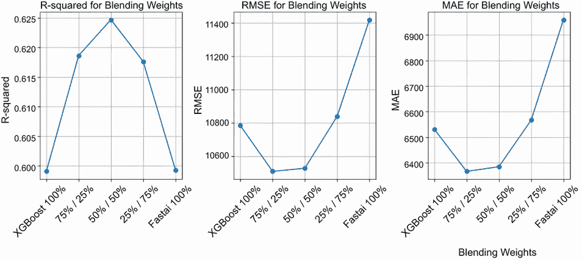

# 12 混合梯度提升和深度学习

本章涵盖

+   对第七章中端到端梯度提升示例的回顾

+   将第七章中梯度提升示例的结果与同一问题的深度学习解决方案进行比较

+   将梯度提升模型与深度学习模型集成后的结果

在第七章中，我们对使用梯度提升的端到端示例进行了深入探索。我们探索了东京 Airbnb 列表的数据集，我们为定价回归任务创建了合适的特征，然后我们创建了一个基于此数据集的基线模型来预测价格。最后，应用我们在书中学到的方法，我们优化了基于此数据集训练的 XGBoost 模型，并检查了一些解释模型行为的方法。

在本章中，我们评估使用深度学习是否会导致同一问题上的不同结果和性能，确定哪种方法最有效，并发现如何使用和整合每种方法的优点和缺点。为此，我们首先回顾第七章中关于 Airbnb 东京问题的梯度提升方法。接下来，我们回顾一些我们可以采取的方法来将深度学习应用于同一问题，并分享我们选择的针对该问题的深度学习方法。最后，我们比较这两种解决方案，并确定在决定是否使用梯度提升或深度学习来解决表格数据问题时，我们可以从这种比较中学到什么，无论是回归问题还是分类问题。除了根据核心性能（例如每个解决方案的预测能力和推理时间）比较解决方案外，我们还探讨了两种解决方案在更多面向业务的指标（如维护成本、业务利益相关者的清晰度以及部署后的稳定性）方面的比较。

本章将本书中你看到的一些主题汇总在一起，结合我们在第七章中学到的 XGBoost 知识，以及我们在第一章和第八章中学到的如何使用深度学习处理表格数据的方法。

在第一章中，我们回顾了一些比较经典机器学习在表格数据应用与深度学习应用的论文。在本章中，我们将看到我们比较 XGBoost 与深度学习的结果与我们在第一章中引用的一篇论文的观察结果一致。在第八章中，我们评估了多种处理表格数据的深度学习方法。现在，我们将使用在那里学到的知识来帮助我们选择一个与 XGBoost 性能具有最佳竞争力的深度学习方法。

通过结合本书中探讨的两个主要主题（经典机器学习方法和对解决表格数据问题的深度学习方法），本章总结了本书到目前为止所涵盖的内容，并为将机器学习应用于表格数据的应用提供了指导。本章中展示的代码可在[`mng.bz/vKPp`](https://mng.bz/vKPp)找到。

## 12.1 第七章中梯度提升解决方案的回顾

在第七章中，我们为东京的 Airbnb 列表创建了一个数据集，分析了该数据集的关键特征，并创建了一个 XGBoost 模型来预测列表的价格。从 Inside Airbnb Network 网站([`insideairbnb.com/`](http://insideairbnb.com/))开始，我们下载了以下与东京市相关的文件：

+   `listings.csv`，其中包含东京 Airbnb 住宿的摘要列表和其他信息

+   `calendar.csv.gz`，一个包含`calendar.csv`的压缩文件，该数据集包含每个列表在给定年份的占用和价格信息

请记住，`listings.csv`数据集包含以下列：

+   `id`—这是 Airbnb 上每个列表的唯一标识符。它是一个`int64`数据类型，意味着它是一个数值 ID 表示。在其他表中，它可以被称为`listing_id`。

+   `name`—Airbnb 列表的描述。它属于`object`数据类型，通常表示字符串或文本。

+   `host_id`—这是 Airbnb 上每个房东的唯一标识符。它是一个`int64`数据类型。

+   `host_name`—拥有列表的房东的姓名。它属于`object`数据类型。

+   `neighbourhood_group`—此字段表示该社区所属的更广泛的区域或地区。它存储为`float64`数据类型，但需要注意的是，使用浮点数据类型来表示组或类别是不常见的。在这种情况下，浮点值的存在表明该字段的全部数据都是缺失值。

+   `neighbourhood`—列表所在的具体社区。它属于`object`数据类型。

+   `latitude`—列表位置的纬度坐标。它属于`float64`数据类型。

+   `longitude`—列表位置的经度坐标。它属于`float64`数据类型。

+   `room_type`—列表中提供的房间或住宿类型（例如，整个房屋/公寓、私人房间、共享房间）。它属于`object`数据类型。

+   `price`—租赁列表每晚的价格。它属于`int64`数据类型，表示一个整数值。

+   `minimum_nights`—预订列表所需的最少夜晚数。它属于`int64`数据类型。

+   `number_of_reviews`—列表收到的总评论数。它属于`int64`数据类型。

+   `last_review`—列表收到的最后一条评论的日期。数据类型为`object`，可能代表日期和时间信息，但可能需要进一步解析才能有效使用。

+   `reviews_per_month`—列表每月的平均评论数量。数据类型为`float64`。

+   `calculated_host_listings_count`—房东在 Airbnb 上的列表总数。数据类型为`int64`。

+   `availability_365`—列表一年中可供预订的天数（365 天中的天数）。数据类型为`int64`。

+   `number_of_reviews_ltm`—过去 12 个月内收到的评论数量。数据类型为`int64`。

+   `license`—列表的许可证号码或相关信息。数据类型为`object`，通常表示字符串或文本。

第七章中我们创建的模型的目标是预测新列表的价格。这实际上比我们在第八章中解决的 Airbnb 纽约问题对深度学习模型更具挑战性，正如表 12.1 中的比较所示。

表 12.1 Airbnb 纽约问题与 Airbnb 东京问题比较

|  | Airbnb 纽约 | Airbnb 东京 |
| --- | --- | --- |
| 数据集行数 | 48,000 | 10,000 |
| 数据集列数 | 18 | 31 |
| 目标 | 分类：预测价格是否超过或低于中位数价格 | 回归：预测价格 |

实际上，东京 Airbnb 数据集的记录数少于纽约 Airbnb 数据集的 25%，并且列数是纽约 Airbnb 数据集的两倍以上。数据点较少时，你可能需要更多地依赖领域专业知识（因此特征工程的作用）。列数较多意味着在训练过程中过拟合的风险更高，并且无论如何，你必须处理特征与目标变量本身之间更复杂的关系。

通常来说，经典机器学习方法在小数据集上可以获得比深度学习更好的结果。数据增强等技术可以减轻深度学习的这一缺点，但深度学习方法在行数少于数万的数据集上会面临挑战。关于为什么深度学习需要更多数据的研究尚不完整，但深度学习架构中的大量参数以及模型泛化至少需要一定数量的数据被认为是深度学习在处理小数据集问题时遇到困难的原因之一[例如，参见 Thompson 等人撰写的“深度学习的计算限制”（[`arxiv.org/pdf/2007.05558.pdf`](https://arxiv.org/pdf/2007.05558.pdf)），该文还论证了计算效率对于方法进步的必要性]。

东京 Airbnb 数据集中行数较少，这无疑给深度学习解决方案的成功实施带来了挑战。此外，数据集中列数较多，需要更广泛的数据预处理和特征工程，以确保生成的特征对建模目的相关且可用。由于我们遵循了与第七章相同的数据准备步骤，我们不应该担心需要处理更多列的特定应用，但值得记住，对于其他数据集来说，更多的列意味着需要制定有效的策略来处理缺失值、处理多重共线性（如我们在第二章中讨论的）以及选择最有信息量的特征。除了需要更多的数据准备外，更多的列还可能导致冗余或噪声特征，这可能会降低深度学习解决方案在该数据集上的有效性，尽管深度学习模型由于其能够捕捉特征与目标变量之间复杂关系的能力，通常对数据中的噪声更具有鲁棒性。

此外，我们用东京 Airbnb 数据集解决的问题是回归（预测列表价格），而不是二分类（预测给定列表的价格是否高于或低于中位数价格），这是我们尝试用纽约 Airbnb 数据集解决的问题，这具有不同的商业影响。如果目标是提供能够带来商业效益的解决方案，我们的解决方案应该尽可能正确地预测。在二分类问题中，解决方案是离散的（一个类别或另一个类别），从商业角度来看，解决方案做出正确预测的可能性比回归问题中看起来要高，在回归问题中，商业期望模型预测的价格与实际价格非常接近，但输出是连续值，可能显著不同于预期值。简而言之，从满足商业需求的角度来看，二分类问题看起来比回归问题更容易——因为它有一个明确的正确性阈值。

在第七章中，在完成对 Airbnb 东京数据集的一系列转换后，我们得到了以下一组数据集特征：

```py
array(['onehot_encoding__room_type_Entire home/apt',
       'onehot_encoding__room_type_Hotel room',
       'onehot_encoding__room_type_Private room',
       'onehot_encoding__room_type_Shared room',
       'ordinal_encoding__neighbourhood_more_than_30',
       'ordinal_encoding__type_of_accommodation',
       'target_encoding__coordinates', 'numeric__minimum_nights',
       'numeric__number_of_reviews', 'numeric__days_since_last_review',
       'numeric__reviews_per_month',
       'numeric__calculated_host_listings_count',
       'numeric__availability_365', 'numeric__score',
       'numeric__number_of_reviews_ltm',
       'numeric__number_of_reviews_ltm_ratio',
       'numeric__number_of_bedrooms', 'numeric__number_of_beds',
       'numeric__number_of_baths', 'numeric__imperial_palace_distance',
       'numeric__nearest_convenience_store',
       'numeric__nearest_train_station', 'numeric__nearest_airport',
       'numeric__nearest_bus_station', 'numeric__nearest_subway',
       'binary__is_new', 'binary__is_studio', 'binary__has_shared_bath',
       'binary__has_half_bath'], dtype=object)
```

所有这些特征都是数值型的，我们也妥善处理了任何缺失值，以便能够使用线性模型基线。事实上，我们首先创建了一个线性回归模型作为基线，并为我们提供了一个衡量标准，可以用来比较 XGBoost 模型的进一步改进。

准备你的数据以进行线性回归或逻辑回归（取决于是否是回归或分类问题）会自动使你的模型准备好由神经网络处理。然而，虽然这很方便，但它可能会错过一些仅适用于神经网络的特定准备。例如，在线性模型中，分类特征通常使用 one-hot-encoding 处理，而在神经网络中，你可以在训练过程中使用编码层直接将分类值转换为数值。

在获得线性回归的基线结果后，我们对 XGBoost 模型进行了一系列优化。我们使用这个优化的 XGBoost 代码作为解决东京 Airbnb 问题的梯度提升解决方案的基础，我们将在本章中将它用于与深度学习的比较。列表 12.1 显示了我们将用于与深度学习解决方案比较的 XGBoost 代码。这个版本的 XGBoost 代码与第七章中使用的最终 XGBoost 代码非常接近。超参数与第七章中使用的笔记本的最佳超参数相匹配；[`mng.bz/4a6R`](https://mng.bz/4a6R))。在本章使用的代码版本中，预测结果保存在`xgb_oof_preds`数组中，以便进一步处理或与我们将从深度学习模型获得的预测一起使用。

列表 12.1 训练最终 XGBoost 模型的代码

```py
xgb_params =  {'booster': 'gbtree',                          ①
               'objective': 'reg:tweedie', 
               'n_estimators': 932, 
               'learning_rate': 0.08588055025922144, 
               'subsample': 0.9566295202123205, 
               'colsample_bytree': 0.6730567082779646, 
               'max_depth': 7, 
               'min_child_weight': 6, 
               'reg_lambda': 6.643211493348415e-06, 
               'reg_alpha': 7.024597970671363e-05, 
               'tweedie_variance_power': 1.6727891016980427}

from sklearn.metrics import r2_score  
from sklearn.metrics import mean_squared_error
from sklearn.metrics import mean_absolute_error              ②
from XGBoost import XGBRegressor
import numpy as np

xgb = XGBRegressor(**xgb_params)                             ③

cv_splits = cv.split(X, y=neighbourhood_more_than_30)        ④

r2_scores = []
rmse_scores = []
mae_scores = []
xgb_oof_preds = np.zeros(len(X))

for train_index, test_index in cv_splits:                    ⑤
    X_train, X_test = X.iloc[train_index], X.iloc[test_index]
    y_train, y_test = y.iloc[train_index], y.iloc[test_index]

    xgb.fit(X_train, y_train)
    y_pred = xgb.predict(X_test)                             ⑥
    xgb_oof_preds[test_index] = y_pred

    r2_scores.append(r2_score(y_test, y_pred))               ⑦
    rmse_scores.append(np.sqrt(mean_squared_error(y_test, y_pred)))
    mae_scores.append(mean_absolute_error(y_test, y_pred))

print(f"Mean cv R-squared: {np.mean(r2_scores):.3f}")        ⑧
print(f"Mean cv RMSE: {np.mean(rmse_scores):.3f}")
Print(f"Mean cv MAE: {np.mean(mae_scores):.3f}")
```

① 设置超参数

② 导入所需的库

③ 使用指定的超参数设置 XGBoost 回归器

④ 基于 neighbourhood_more_than_30 特征定义交叉验证分割

⑤ 基于 neighbourhood_more_than_30 特征生成交叉验证分割

⑥ 执行交叉验证预测

⑦ 计算 R-squared、均方根误差和平均绝对误差评估指标以评估模型性能

⑧ 打印 R-squared、均方根误差和平均绝对误差的均值

对 XGBoost 解决方案进行的优化产生了显著优于线性回归基线的结果，如表 12.2 所示。

表 12.2 第七章结果总结

| 指标 | 线性回归基线 | 优化 XGBoost |
| --- | --- | --- |
| R-squared | 0.320 | 0.729 |
| 均方根误差 | 17197.323 | 10853.661 |
| 平均绝对误差 | 12568.371 | 6611.609 |

作为进一步的检查，你可以验证在第七章中跟踪的所有三个指标——即 R-squared、均方根误差（RMSE）和平均绝对误差（MAE）——优化的 XGBoost 模型在线性回归基线上的确总是有所改进。现在，以 XGBoost 模型作为我们的参考，我们将在本章的剩余部分探索使用相同的深度学习模型可以取得什么样的结果。

## 12.2 选择深度学习解决方案

在第八章中，我们回顾了一系列用于处理表格数据的不同深度学习框架，包括 Keras、fastai 以及其他专门为表格数据设计的库，如 TabNet。如果我们现在想要比较第七章中东京 Airbnb 问题的 XGBoost 解决方案，我们应该使用哪种深度学习方法？

作为提醒，我们分享了对使用纽约 Airbnb 数据集的不同深度学习方法的比较，该比较再次在表 12.3 中展示。

表 12.3 深度学习选项比较

|  | Keras | fastai | 表格数据库（例如，TabNet） |
| --- | --- | --- | --- |
| Pro | 模型细节透明。使用该框架的大规模社区意味着可以轻松找到常见问题的解决方案。 | 框架包括对表格数据模型的显式支持，这意味着代码将更加紧凑。它还设置了智能默认值，因此我们可以快速达到合理的结果。 | 专门创建以处理表格数据集的定制库 |
| Con | 没有内置对表格数据的支持 | 如果我们遇到问题，我们可能需要自己解决问题，因为社区规模小于 Keras。 | 到目前为止，还没有出现一个明显的选择；社区碎片化和一些库的不一致维护使得可靠地运行基本代码成为一项挑战。 |

我们在第八章中使用的数据集与我们现在用于比较 XGBoost 和深度学习的数据集之间的差异——即一个之前既大得多（行数是东京 Airbnb 数据集的四倍）又简单得多的数据集（列数不到东京 Airbnb 数据集的一半）——对于我们的 XGBoost 比较来说，并没有显著地偏向任何一种提出的解决方案。事实上，Keras 和 fastai 是通用深度学习框架，并不是专门为小型或复杂数据集设计的。TabNet 的设计使其在处理高维数据时具有优势，但当应用于较小的数据集时，与 Keras 或 fastai 相比的优势就不那么显著了。

在我们的选择中，真正重要的是我们想要在 XGBoost 和深度学习方法之间进行公平的比较。正如你在第七章中看到的，XGBoost 以其易用性而闪耀，并且在不进行大量调整的情况下就能得到良好的结果。如果我们决定使用一个复杂的深度学习模型，这个模型需要花费很长时间来设置、调整和优化，那么这就不会对深度学习模型进行公平的比较。

考虑到这一点，我们应该选择哪个深度学习框架呢？由于将其可靠运行起来的复杂性，我们将跳过 TabNet。这让我们在 Keras 和 fastai 之间做出选择。如表 12.3 中提到的，Keras 在生产中确实很受欢迎，拥有更大的社区。然而，fastai 与我们的目标更为契合。回想一下，在第八章中我们提到，fastai 是为像我们这样的表格数据构建的，并且它带有智能默认设置。这意味着你可以快速获得不错的结果，而无需花费大量时间进行优化。fastai 在幕后为你处理了很多琐碎的事情和细节。正如你稍后将会看到的，选择 fastai 来解决这个问题是值得的。目前，我们相信它为东京 Airbnb 问题提供了一个强大的深度学习解决方案，无需太多麻烦，只需几步即可应对第七章中的 XGBoost 模型。

## 12.3 针对东京 Airbnb 问题的所选深度学习解决方案

到目前为止，在本章中，我们已经回顾了东京 Airbnb 问题的 XGBoost 解决方案，并审查了用于比较的深度学习解决方案选项，并选择了 fastai 作为与 XGBoost 进行比较的深度学习框架。在本节中，我们将详细介绍 fastai 针对东京 Airbnb 问题的解决方案。

列表 12.2 展示了我们用来与 XGBoost 解决方案进行比较的 fastai 模型的核心理念。此代码使用`TabularPandas`函数（[`mng.bz/QDR6`](https://mng.bz/QDR6)）在东京 Airbnb 数据集上训练了一个 fastai 回归模型，`TabularPandas`是一个封装器，在底层提供了所有必要的转换。

列表 12.2 东京 Airbnb 问题的 fastai 模型

```py
from fastai.tabular.all import *

procs = [FillMissing, Normalize, Categorify]
cat_vars = [
    col for col in airbnb_tokyo.columns 
    if "onehot_encoding__" in col
    or ordinal_encoding__" in col 
    or "binary__" in col
]
cont_vars = [
    col for col in airbnb_tokyo.columns 
    if "numeric__" in col 
    or "target_encoding__" in col
]
dep_var = 'target'

cv_splits = cv.split(X, y=neighbourhood_more_than_30)

r2_scores = []
rmse_scores = []
mae_scores = []
dnn_oof_preds = np.zeros(len(X))

for k, (train_index, test_index) in enumerate(cv_splits):
    X_train = airbnb_tokyo.set_index("listing_id").iloc[train_index].copy()
    X_test = airbnb_tokyo.set_index("listing_id").iloc[test_index].copy()
    y_test = airbnb_tokyo["target"].iloc[test_index].copy()

    tab = TabularPandas(
        X_train, procs, cat_vars, cont_vars, 
        dep_var, y_block=RegressionBlock(),                       ①
        splits=RandomSplitter(
             valid_pct=0.2, seed=0)(range_of(X_train)),
        inplace=True, 
        reduce_memory=True
    )

    dls = tab.dataloaders(bs=128)                                 ②
    y_range = torch.tensor([0, X_train['target'].max() * 1.2])
    tc = tabular_config(ps=[0.001, 0.01], embed_p=0.04, y_range=y_range)
    learn = tabular_learner(dls, layers=[1000,500],               ③
                            metrics=mae,
                            config=tc,
                            loss_func=L1LossFlat())
    with learn.no_bar(), learn.no_logging():
        lr = learn.lr_find(show_plot=False)
        learn.fit_one_cycle(80, lr.valley)                        ④

    dl = learn.dls.test_dl(X_test)
    y_pred = (
        learn.get_preds(dl=dl)[0]
        .numpy()
        .ravel()
    )                                                             ⑤
    dnn_oof_preds[test_index] = y_pred

    r2_scores.append(r2_score(y_test, y_pred))                    ⑥
    rmse_scores.append(np.sqrt(mean_squared_error(y_test, y_pred)))
    mae_scores.append(mean_absolute_error(y_test, y_pred))
    print(f"CV Fold {k} MAE: {mae_scores[-1]:.3f}")

print(f"\nMean cv R-squared: {np.mean(r2_scores):.3f}")
print(f"Mean cv RMSE: {np.mean(rmse_scores):.3f}")
print(f"Mean cv MAE: {np.mean(mae_scores):.3f}")
```

① 定义一个 fastai TabularPandas 对象

② 基于 TabularPandas 对象定义一个数据加载器对象

③ 基于数据加载器对象定义一个 tabular_learner 对象

④ 训练模型

⑤ 从测试集上获取模型的预测结果

⑥ 保存指标

如列表 12.2 中的代码所示，fastai 的解决方案非常直接。首先，我们定义了预处理步骤（`procs`），例如填充缺失值、归一化和分类。然后，我们将分类变量和连续变量从数据集中分离出来，并选择因变量（`dep_var`）。之后，我们以与 XGBoost 解决方案相同的方式在分层 k 折交叉验证中迭代。

在迭代过程中，使用`TabularPandas`对训练数据进行预处理，指定分类变量、连续变量、目标变量和数据拆分。为训练和验证批次创建了数据加载器对象（`dls`）。在定义了一个由两层组成的神经网络模型（`tabular_learner`），第一层有 1,000 个神经元，接下来是 500 个节点，并设置了它们的 dropout 率（使用`tabular_config`并设置最后一层更高的 dropout 率）之后，我们使用`lr_find`找到的学习率以及单周期（`fit_one_cycle`）过程来训练模型。

通过结合`lr_find`和`fit_one_cycle`过程，我们自动调整学习率参数，以在处理的数据类型上获得最佳结果，从而实现一个简单直接的解决方案，无需过多调整和实验。`lr_find`过程([`mng.bz/Xxq9`](https://mng.bz/Xxq9))在数据样本上探索一系列学习率，当学习率过高导致学习发散时停止。虽然这个过程需要一些时间，但它相对较快，并返回损失曲线下降部分的二分之一处的学习参数值。我们使用这个值作为另一个过程`fit_one_cycle`([`mng.bz/yWZp`](https://mng.bz/yWZp))的上限边界，这是一个学习率不是固定或不断减少，而是在最小值和最大值之间振荡的训练方法。振荡允许网络不会陷入局部最小值，总体而言，使用这种方法得到的网络性能优于其他方法，尤其是在处理表格数据时。这两种方法都是由 Leslie Smith 在一系列论文中开发的：

+   “循环学习率用于训练神经网络” ([`arxiv.org/abs/1506.01186`](https://arxiv.org/abs/1506.01186))

+   “超级收敛：使用大学习率快速训练神经网络” ([`arxiv.org/abs/1708.07120`](https://arxiv.org/abs/1708.07120))

+   “神经网络超参数的纪律化方法：第一部分——学习率、批量大小、动量和权重衰减” ([`arxiv.org/abs/1803.09820`](https://arxiv.org/abs/1803.09820))

据我们所知，fastai 对这些方法的实现是开源社区中最有效率和性能最高的。

继续编写代码，对于`for`循环的每次迭代，都会保存当前折的预测以及 R-squared、RMSE 和 MAE 评估。循环结束后，打印所有指标的均值，以便我们可以了解 fastai 解决方案的整体值。请注意，当我们通过集成过程比较预测值和实际 y 值时，我们将重新计算这些值，因为我们比较的是 100%的 fastai 结果。

## 12.4 比较 XGBoost 和 fastai 解决方案解决东京 Airbnb 问题

现在我们已经有了解决东京 Airbnb 问题的深度学习解决方案，我们可以将其结果与 XGBoost 解决方案进行比较。通过比较我们收集的两种解决方案的指标（R-squared、RMSE 和 MAE），我们可以了解每种解决方案在解决东京 Airbnb 问题上的有效性。表 12.4 包含了两种方法结果的总结。

表 12.4 XGBoost 和 fastai 模型结果比较

| Metric | XGBoost | Fastai |
| --- | --- | --- |
| R-squared | 0.599 | 0.572 |
| RMSE | 10783.027 | 11719.387 |
| MAE | 6531.102 | 7152.143 |

表 12.4 表明，XGBoost 在所有三个错误指标上均优于 fastai——事实上，XGBoost 的 R-squared 值显著更高，其 RMSE 和 MAE 值大约低 8%到 9%。

除了表 12.4 中基本比较错误指标外，我们还可以可视化两种方法处理问题的差异。例如，我们可以通过检查东京 Airbnb 测试集中的每个预测数据点来直接比较 XGBoost 和 fastai 的预测。在图 12.1 中，x 轴代表 XGBoost 的预测，而 y 轴代表每个相应数据点的 fastai 预测。该图显示了 XGBoost 和 fastai 预测之间的关系。


图 12.1 XGBoost 和 fastai 预测的散点图

在图表的对角线上，实线趋势线与虚线对角线相当吻合，表明总体上，XGBoost 和 fastai 之间的预测差异并不大。显示 XGBoost 和 fastai 预测之间平滑回归线（一种称为 LOWESS [LOcally WEighted Scatterplot Smoothing]的技术）的实线趋势线与虚线相比没有显著偏离，这证实了即使算法在预测上存在分歧，两个算法之间也没有系统性的高估或低估。

此外，我们还可以尝试探索它们的预测如何相关，以 x 轴上的 70,000 值为基准，因为我们能观察到两个不同的预测簇。我们观察到，fastai 的平均预测值约为 81,300，而 XGBoost 的平均预测值在 70,000 以上的为 81,550，在 70,000 以下的为约 23,050，而 XGBoost 的预测值分别为 22,500。

列表 12.3 XGBoost 预测的平均 fastai 预测

```py
predictions = pd.DataFrame(
    {'xgb': xgb_oof_preds, 'fastai': dnn_oof_preds}
)                                                             ①

avg_fastai_over_70000 = predictions.loc[
    predictions['xgb'] > 70000, 'fastai'
].mean()                                                      ②
avg_xgb_over_70000 = predictions.loc[
    predictions['xgb'] > 70000, 'xgb'
].mean()
print(f"Average prediction values when xgb > 70000:",
      f"fastai:{avg_fastai_over_70000:0.2f}",
      f"xgb:{avg_xgb_over_70000:0.2f}")

avg_fastai_under_70000 = predictions.loc[predictions['xgb'] <= 70000, 'fastai'].mean()
avg_xgb_under_70000 = predictions.loc[predictions['xgb'] <= 70000, 'xgb'].mean()
print(f"Average prediction values when xgb <= 70000: fastai:{avg_fastai_under_70000:0.2f}    
      xgb:{avg_xgb_under_70000:0.2f}")
```

① 获取一个包含 XGBoost 和 fastai 预测列的 pandas DataFrame

② 根据 XGBoost 预测值计算 XGBoost 和 fastai 预测的平均统计量

两个模型之间的差异很小；平均而言，fastai 和 XGBoost 的预测往往是一致的。fastai 倾向于对较低的预测定价水平高估，对较高的预测定价水平略低估。

返回到图 12.1，现在我们已经检查了比较预测的图表，让我们看看比较 XGBoost 与 fastai 错误的图表。对于东京 Airbnb 测试集中的每个数据点，图 12.2 中的图表显示了该数据点的错误（预测值与实际值之间差异的绝对值），x 值是 XGBoost 的错误，y 值是 fastai 的错误。

图 12.2 显示，存在一个数据点的大簇，其中 XGBoost 和 fastai 的误差都低于 20,000。整体 LOWESS 线（红色）显示，XGBoost 的误差总体上低于 fastai，大多数时候都是如此。

如聚合误差指标和预测及误差的图表所示，XGBoost 模型的表现优于 fastai 模型。然而，考虑到两个模型预测之间的差异，我们认为通过集成这两个模型，我们可以做得比单独使用 XGBoost 更好，因为有一个强烈的暗示，除了性能差异之外，两个模型在预测中表现不同，因为它们捕捉到不同的数据模式和特征。在下一节中，我们将找出集成是否改善了结果。


图 12.2 XGBoost 和 fastai 误差的散点图

## 12.5 集成东京 Airbnb 问题的两个解决方案

既然我们已经确定了 XGBoost 和 fastai 解决方案在东京 Airbnb 问题上的独立性能，我们将查看集成这两个解决方案，看看两种方法的组合是否提供了任何改进。

下面的列表显示了我们将两个模型的结果进行集成的循环。

列表 12.4 集成两个模型的代码

```py
blend_list = [
    [1., 0.], [0., 1.], [0.25,0.75],
    [0.75,0.25],[.5, .5]
]                                                            ①
for a, b in blend_list:
    print(f"XGBoost weight={a}, DNN weight={b}")
    blended_oof_preds = (
        xgb_oof_preds * a + dnn_oof_preds * b
    )                                                        ②
    r2 = r2_score(blended_oof_preds, y)                      ③
    rmse = np.sqrt(mean_squared_error(blended_oof_preds, y))
    mae = mean_absolute_error(blended_oof_preds, y)
    print(f"blended result for R-squared: {r2:.3f}")
    print(f"blended result for RMSE: {rmse:.3f}")
    print(f"blended result for MAE: {mae:.3f}\n")
```

① 集成比例以迭代方式遍历

② 生成根据集成比例混合的预测

③ 获取混合预测的 R-squared、RMSE 和 MAE

列表 12.4 中的代码根据`blend_list`中的混合值结合了 XGBoost 和 fastai 的结果。请注意，这些混合值并未优化以找到绝对最优——我们只是使用一组固定的混合值来获得混合结果的一般感觉。另外，请注意，我们正在使用出卷预测来评估结果。尽管如此，通过根据`blend_list`中指定的比例结合 XGBoost 和 fastai 的预测，我们可以看到在一系列值上集成两种方法的效果。

混合代码的典型运行输出如下

```py
XGBoost weight=1.0, DNN weight=0.0
blended result for R-squared: 0.599
blended result for RMSE: 10783.027
blended result for MAE: 6531.102

XGBoost weight=0.75, DNN weight=0.25
blended result for R-squared: 0.619
blended result for RMSE: 10507.904
blended result for MAE: 6366.257

XGBoost weight=0.5, DNN weight=0.5
blended result for R-squared: 0.625
blended result for RMSE: 10527.024
blended result for MAE: 6384.576

XGBoost weight=0.25, DNN weight=0.75
blended result for R-squared: 0.618
blended result for RMSE: 10838.831
blended result for MAE: 6566.663

XGBoost weight=0.0, DNN weight=1.0
blended result for R-squared: 0.599
blended result for RMSE: 11419.374
blended result for MAE: 6959.540
```

这些数字可能有点难以解读，所以让我们看看它们以图表形式的样子。图 12.3 显示了 XGBoost 和 fastai 模型之间一系列混合的结果，包括 R-squared、RMSE 和 MAE。

如图 12.3 所示，当我们使用 XGBoost 和 fastai 模型预测的 50/50 混合时，我们得到了 R-squared 评估的最佳结果。对于基于误差的度量，RMSE 和 MAE，我们通过更多地使用 XGBoost 而不是 fastai 获得了更好的结果；然而，如果我们使用 50/50 的混合，我们只会得到略微差一些的分数。最差的结果是当我们使用 100%的 fastai 预测时，正如我们从单独查看每个模型得到的结果所预期的那样，但值得注意的是，仅使用 XGBoost 总是比将其与其他解决方案（使用 75/25 或 50/50 的份额）混合要差。



图 12.3 XGBoost 和 fastai 模型融合的结果

将 XGBoost 和 fastai 模型进行集成比单独使用任一模型得到的结果更好。正如我们将在下一节中看到的，我们从集成中得到的观察结果与一篇重要研究论文中分享的结果一致，该论文比较了经典机器学习方法和深度学习在表格数据问题上的表现。

## 12.6 梯度提升和深度学习的整体比较

在第一章中，我们介绍了关于是否需要深度学习来解决涉及表格数据的问题的争议。我们引用了支持双方论点的学术论文——那些倡导深度学习方法的人和那些坚持认为经典机器学习方法，特别是梯度提升，始终优于深度学习的人。我们在第一章中提到的一篇论文值得在此重新审视：“表格数据：深度学习并非一切所需”，由 Ravid Shwartz-Ziv 和 Amitai Armon 撰写([`arxiv.org/abs/2106.03253`](https://arxiv.org/abs/2106.03253))。在这篇论文的讨论和结论部分，作者做出了以下陈述：

在我们的分析中，对于那些没有出现在它们原始论文中的数据集，深度模型的表现较弱，并且它们的表现不如基线模型 XGBoost。因此，我们提出了使用这些深度模型与 XGBoost 的集成。这个集成在这些数据集上的表现优于任何单个模型和“非深度”的经典集成。

他们的观察并不是一个铁的规则，因为，根据我们的经验，我们遇到了使用梯度提升解决方案或深度学习解决方案单独使用时表现最佳的情况。然而，在许多我们面临的情况中，我们可以确认简单地平均解决方案导致了更好的预测。我们坚信，这是因为两种算法有优化预测的不同方式。梯度提升基于决策树，这是一种类比搜索的形式，因为作为一个算法，树将你的数据集分割成特征值之间相似的部分，并将它们映射到相似的目标输出。算法的梯度部分智能地集成多个树以获得更好的预测，尽管它并没有改变决策树的基本行为方式。另一方面，深度学习纯粹基于微分和非线性变换的原则，算法寻找最佳的权重来组合变换后的输入。

这两种不同的方法导致了相当不同的估计结果，它们的误差往往部分相互抵消，因为它们高度不相关，这与在随机森林算法中平均不相关决策树的结果相似。这个结论与我们在比较东京 Airbnb 问题上的梯度提升和深度学习结果的经验相符。XGBoost 模型与 fastai 模型的集成产生了最佳结果，如图 12.3 所示。

## 摘要

+   第七章中展示的东京 Airbnb 问题的 XGBoost 解决方案提供了一个基线，我们可以用它来评估深度学习解决相同问题的有效性。

+   以第七章中的 XGBoost 解决方案为起点，我们可以为东京 Airbnb 问题创建一个深度学习解决方案。fastai 库提供了一个紧凑且相对性能良好的深度学习解决方案。

+   通过在从 100% XGBoost 到 100% fastai 的一系列比例中混合 XGBoost 和 fastai 模型的预测，我们可以看到集成模型的效果。我们通过两个模型的 50/50 集成获得了最佳结果。

+   这个结果与研究对深度学习在表格数据上的有效性的声明进行审查的建议相符。
