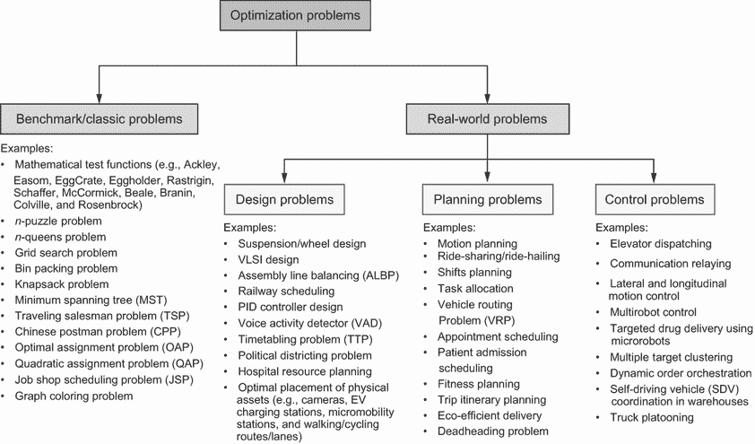
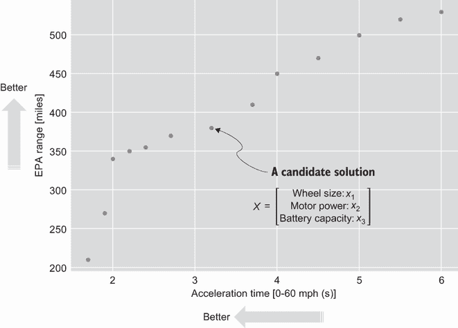
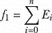
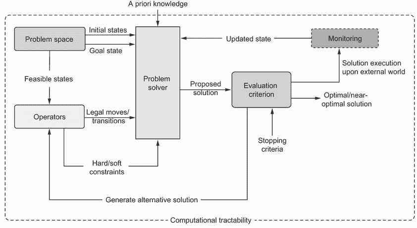
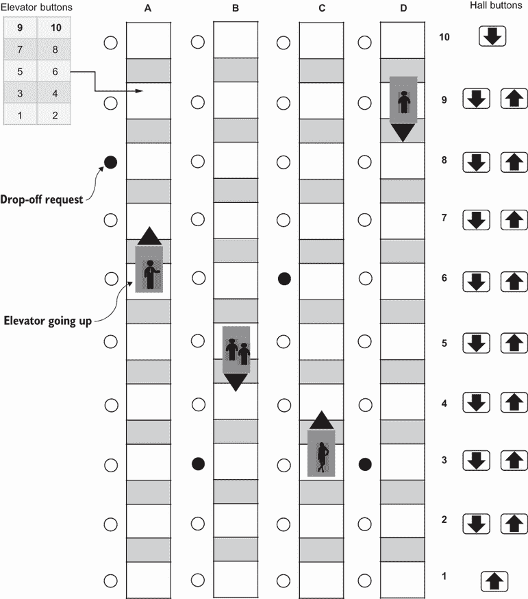

# 第一章：搜索与优化简介

本章涵盖

+   搜索与优化是什么？

+   为什么关注搜索与优化？

+   从“玩具问题”到现实世界解决方案的转变

+   定义优化问题

+   介绍结构良好的问题和结构不良的问题

+   搜索算法和搜索困境

优化深深植根于自然以及我们构建的系统和技术中。自然是对优化普遍性和普遍存在的非凡证明。以社会昆虫如蚂蚁和蜜蜂的觅食行为为例。它们已经发展出自己独特的优化方法，从找到现有食物源的最短路径到在未知的外部环境中发现新的食物源。蜜蜂群体将它们的觅食努力集中在最有利可图的区域。它们合作建造六边形的蜂巢，以实现空间的高效利用（在给定区域内可以建造的最大细胞数）、材料效率（使用更少的蜂蜡）、结构强度以及防止蜂蜜从细胞中溢出的最佳角度。同样，鸟类在它们的年度迁徙过程中也表现出优化行为。它们从繁殖地长途跋涉到越冬地，它们的迁徙路线经过多代优化以节省能量。这些路线考虑了诸如盛行风模式、食物可用性和免受捕食者威胁等因素。这些例子强调了自然界如何本能地应用优化策略以生存和成长，为我们提供了可以转化为算法解决问题的教训。

优化也是我们日常生活中的一种常规方面，通常如此无缝集成，以至于我们几乎注意不到它的持续影响。作为人类，我们努力优化我们的日常生活。考虑一下计划你的一天这个简单的行为。我们本能地按顺序或分组任务或差事，以最大限度地减少旅行时间或最大限度地增加我们的空闲时间。我们在预算内应对购物的挑战，试图从每花费的每一美元中获得最大价值。我们创建锻炼计划，旨在在有限的时间内获得最大的健身效益。即使在家庭中，我们也优化我们的能源使用，以控制我们的公用事业账单。

同样，公司通过提高效率和消除浪费来最大化利润。例如，像联邦快递（FedEx）、联合包裹服务公司（UPS）和亚马逊这样的物流巨头每年花费数百万美元研究降低包裹配送成本的新方法。电信机构寻求确定关键基础设施，如蜂窝塔的最佳位置，以服务尽可能多的客户，同时投资于最低限度的设备。同样，像优步（Uber）、Lyft 和滴滴出行这样的交通网络公司，在乘客行程中高效地安排司机路线，在空闲期间将司机引导至叫车热点，以最小化乘客等待时间。随着全球城市化进程的加剧，地方紧急服务依赖于高效的调度和路线规划平台，以选择和调度适当的车辆、设备和人员，以应对日益复杂的城市道路网络中的事件。航空公司需要解决多个优化问题，例如飞行计划、机队分配、机组人员排班、飞机航线规划和飞机维护计划。医疗保健系统也处理诸如医院资源规划、紧急程序管理、患者入院排班、手术排班和疫情控制等优化问题。作为优化技术的主要客户，工业 4.0 处理诸如智能调度和重新调度、装配线平衡、供应链优化和运营效率等复杂的优化问题。智能城市处理诸如固定资产最优分配、移动资产部署、能源优化、水控制、污染减少、废物管理和野火控制等大规模优化问题。

这些例子展示了优化作为一种提高不同领域操作效率的普遍性和重要性。在这本书中，我们将深入探索优化算法的激动人心世界。我们将揭示这些算法如何被用于解决不同领域中的复杂连续和离散问题。

## 1.1 为什么关注搜索和优化？

搜索是对状态的系统性检查，从初始状态开始，最终（希望）达到目标状态。实际上，优化技术是搜索方法，其目标是找到可行搜索空间内的一个最优或近似最优状态。这个可行搜索空间是优化问题空间的一个子集，其中所有问题的约束都得到了满足。很难找到一个不使用某种形式的搜索或优化方法、软件或算法的行业。在您的工作场所或行业中，您很可能每天都在处理优化问题，尽管您可能没有意识到这一点。虽然搜索和优化在几乎所有行业中都很普遍，但使用复杂的算法来优化流程可能并不总是实用的。例如，考虑一家为当地顾客提供食品配送的小型比萨饼店。假设该餐厅在平均一周的夜晚处理大约十次配送。虽然提高效率的策略（如避免在右行国家左转或在左行国家右转、避免主要交叉口、在接送时间避免学校区域、在提升时间避免桥梁、优先选择下坡路）从理论上可以缩短配送时间并降低成本，但问题的规模如此之小，实施这些改变可能不会产生任何明显的效果。

在更大规模的问题中，如车队分配和调度、多标准随机车辆路径、资源分配和机组人员调度，将搜索和优化技术应用于问题必须是一个合格的决定。一些公司或企业可能由于缺乏专业知识或资源来实施这些改变而不会从过度流程改变中受益。还可能存在关于利益相关者潜在缺乏后续行动的担忧。实施这些改变也可能比通过优化过程获得的节省更多。在本书的后面部分，我们将看到如何在开发搜索和优化算法时考虑这些成本。

这本书将帮助大多数人从从未解决搜索和优化问题到成为一个全面发展的搜索和优化实践者，能够为正确的问题选择、实施和调整正确的求解器。它不假设任何关于搜索和优化的先验知识，只需具备数据结构和 Python 的中级知识。对于在职场中参与高级技术决策的管理者或专业人士来说，这些技能在讨论流程改进时理解基于软件的方法、机会和局限性至关重要。相比之下，IT 专业人士在考虑为内部使用开发或选择新的软件套件和技术时，会发现这些技能直接适用。以下部分描述了我们将在这本书中遵循的方法。

## 1.2 从玩具问题到现实世界

在讨论算法时，许多书籍和参考资料将它们作为形式定义来呈现，然后应用于所谓的“玩具问题”。这些简单问题是有帮助的，因为它们通常涉及较小的数据集和搜索空间，同时可以通过手动迭代来解决。本书采用类似的方法，但更进一步，通过展示现实世界的数据实现。尽可能使用数据集和值等资源来说明所讨论算法的直接适用性和实际缺点。最初，缩小的玩具问题将帮助您欣赏各种算法中涉及的逐步操作。后来，Python 实现将教会您如何使用多个数据集和 Python 库来应对现实世界问题的增加复杂性和范围。

如图 1.1 所示，每个搜索或优化算法的灵感来源被确定，然后展示算法伪代码、算法参数以及使用的启发式/解决方案策略。接着描述算法的优缺点和适应方法。本书包含许多示例，让您能够对问题的缩小版本进行手动迭代，并完全理解每个算法的工作原理。它还包括许多以特殊问题-解决方案-讨论格式编排的编程练习，让您可以看到如何使用 Python 解决之前手动解决的问题的放大版本。通过编程，您可以优化调整算法，并研究其性能和可扩展性。

图 1.1 本书的方法——每个算法都将按照从解释到应用的模式进行介绍。

在整本书中，我们将考虑几个经典和现实世界的优化问题，以向您展示如何使用书中讨论的搜索和优化算法。图 1.2 展示了这些优化/搜索问题的示例。

图 1.2 经典和现实世界优化问题的示例

在时间不是那么重要，而解决方案的质量更重要，并且用户愿意等待（有时甚至几天）以获得最优解决方案的情况下，可以使用现实世界的设计问题或战略函数。规划问题或战术函数需要在几秒到几分钟的时间范围内解决。控制问题或操作函数需要在几毫秒到几秒的时间范围内重复快速解决。为了在如此短的时间内找到解决方案，通常以速度提升为代价来牺牲最优性。在下一章中，我们将更详细地讨论这些问题类型。

我强烈建议您首先对每个算法后面的示例进行手动迭代，然后尝试自己重现 Python 实现。您可以在代码中随意调整参数和问题规模；通过软件运行优化算法的一个优点是能够调整以实现最优性。

## 1.3 优化问题的基本要素

优化是指寻找给定问题的“最佳”解决方案的实践，其中“最佳”通常意味着令人满意或可接受的，可能受限于一组给定的约束。解决方案可以分为**可行、最优**和**近似最优**解决方案：

+   **可行解**是满足所有给定约束的解决方案。

+   **最优解**既是可行的，又提供了最佳的目标函数值。

+   **近似最优解**是可行的解决方案，它提供了更好的目标函数值，但不一定是最好的。

假设我们有一个最小化问题，目标是找到决策变量的值，以最小化某个目标函数，搜索空间可能包含多个全局最小值、强局部最小值和弱局部最小值，如图 1.3 所示：

+   **全局最优解**（或最小化问题中的**全局最小值**）是一组候选解决方案中的最佳（即整个可行搜索空间中的最低点）。从数学上讲，如果*ƒ*(*x*)是目标函数，那么 x*是全局最小值，如果对于*ƒ*的定义域中的所有 x，有*ƒ*(*x**) ≤ *ƒ*(x)。

+   一个**强局部最小值**是指函数值小于（或等于）该点周围邻域内函数值的点，但高于全局最小值。从数学上讲，如果 x*是一个点，那么它是一个强局部最小值，如果存在一个以 x 为中心的邻域 N，使得对于 N 中的所有 x（x ≠ x*），有*ƒ*(*x**) < *ƒ*(x)。

+   一个**弱局部极小值**是指函数值小于或等于相邻点的函数值，但对于收敛到该点的点的序列，函数值严格递减。从数学上讲，如果存在一个以 *x* 为中心的邻域 *N*，使得对于 *N* 中的所有 *x*，都有 *ƒ*(*x**) ≤ *ƒ*(*x*)，则点 *x** 是一个弱局部极小值。

图 1.3 可行解位于问题的约束范围内。一个可行的搜索空间可能显示全局、强局部和弱局部极小值的组合。

这些寻求最优解的方法，也称为**优化技术**，通常作为运筹学（OR）的一部分进行研究。运筹学，也称为**决策**或**管理科学**，是一个起源于第二次世界大战初期的领域，由于军事行动中分配稀缺资源的迫切需要。它是应用高级科学分析方法于决策和管理问题以找到最佳或最优解的数学分支。

优化问题通常可以表述如下。找到 *X*，使其优化 *ƒ*，同时满足可能的一组等式和不等式约束：

| *g[i]*(*X*) = 0, *i* = 1, 2, ..., *m**h[j]*(*X*) ≤ 0, *j* = 1, 2, ..., *p* | 1.1 |
| --- | --- |

其中

+   *X = (x*[1]*, x*[2]*,…, x*[n]*)*^T 是代表决策变量的向量

+   *ƒ*(*X*) = (*ƒ*1, *ƒ*2,…, *ƒ*[M]*(X))* 是要优化的目标向量

+   *g[i]**(X)* 是一组等式约束

+   *h*[j]*(X)* 是一组不等式约束

以下小节描述了优化问题的三个主要组成部分：决策变量、目标函数和约束。

### 1.3.1 决策变量

决策变量代表影响目标函数值的一组未知数或变量。这些是定义优化问题可能解的变量。如果 *X* 代表未知数，也称为自变量，那么 *f*(*X*) 量化了候选解或可行解的质量。

例如，假设一个活动组织者正在计划一个关于搜索和优化算法的会议。组织者计划支付 *a* 用于固定成本（场地租赁、安保和嘉宾演讲费）和 *b* 用于变动成本（传单、吊牌、身份证牌和午餐），这些成本取决于参与者的数量。根据过去的会议，组织者预测门票需求如下：

| *Q* = 5000 – 20*x* | 1.2 |
| --- | --- |

其中 *x* 是票价，*Q* 是预期售出的票数。因此，公司预计以下场景：

+   如果公司不收费（*x* = 0），他们将免费赠送 5,000 张门票。

+   如果票价是 *x* = $250，公司将没有参与者，预期售出的票数将为 0。

+   如果票价*x* < $250，公司将会卖出一定数量的票，0 ≤ *Q* ≤ 5,000。

活动组织者可以预期的利润*f*(*x*)可以按以下方式计算：

| *Profit* = *Revenue* – *Costs* | 1.3 |
| --- | --- |

其中*Revenue* = *Qx*和*Costs* = *a* + *Qb*。总的来说，利润（或目标）函数看起来是这样的：

| *ƒ*(*x*) = *Revenue* – *Costs* = *Qx* – (*a* + *Qb*) = –20*x*² + (5000 + 20*b*)*x* – 5000*b* – *a* | 1.4 |
| --- | --- |

在这个问题中，预定义的参数包括固定成本*a*和变动成本*b*。有一个单一的决策变量*x*，它是票价，其中*x*[LB] ≤ *x* ≤ *x*[UB]。票价的下限*x*[LB]和上限*x*[UB]被认为是边界约束。解决这个优化问题集中在找到最大化利润*ƒ*(*x*)的最佳*x*值。

### 1.3.2 目标函数

目标函数*ƒ*(*x*)，也称为标准，优点函数，效用函数，成本函数，代表要优化的数量。不失一般性，优化可以解释为值的极小化，因为原函数*ƒ*(*x*)的最大化可以仅仅是应用数学运算后生成的对偶问题的极小化。这意味着如果原函数是一个极小化问题，那么对偶问题就是一个最大化问题（反之亦然）。根据优化问题的这个对偶方面，一个解*x*，它是原极小化问题的最小值，同时，也是对偶最大化问题的最大值，如图 1.4 所示。

此外，像加法、减法、乘法和除法这样的简单数学运算不会改变最优点的值。例如，将*ƒ*(*x*)乘以一个正常数或向*ƒ*(*x*)中添加或减去一个正常数，都不会改变决策变量的最优值，如图 1.4 所示。

图 1.4 优化问题的对偶原理和数学运算

在早期的票价定价问题中，假设*a* = 50,000，*b* = 60，*x*[LB] = 0，和*x*[UB] = 250。使用这些值，我们得到一个利润函数：*ƒ*(*x*) = –20*x*² + 6,200*x* – 350,000。采用基于导数的方法，我们可以简单地推导出函数以找到其最大值：df/dx = –40*x* + 6,200 = 0 或 40*x* = 6,200。因此，最优票价是$155，这会产生$130,500 的净利润，如图 1.5 所示。

图 1.5 票价定价问题——最大化利润的最优票价是每张票$155。

在票价定价问题中，我们有一个需要优化的单一目标函数，即利润。在这种情况下，该问题被称为*单目标优化问题*。涉及多个目标函数的优化问题称为*多目标优化问题*。例如，假设我们想要设计一辆电动汽车（EV）。这个设计问题的目标函数可以是最小化加速度时间和最大化环境保护署（EPA）的驾驶范围。加速度时间是电动汽车从 0 加速到 60 英里/小时所需的时间（以秒计）。EPA 驾驶范围是车辆在需要重新充电之前，在综合城市和高速公路驾驶中可以行驶的大约英里数（使用 55%的高速公路和 45%的城市驾驶混合）。根据 EPA 的测试方法，EPA 驾驶范围是车辆在需要重新充电之前，在综合城市和高速公路驾驶中可以行驶的大约英里数。决策变量可以包括车轮的大小、电动机的功率和电池的容量。需要更大的电池来延长电动汽车的驾驶范围，这会增加额外的重量，因此加速度时间会增加。在这个例子中，两个目标存在冲突，因为我们需要最小化加速度时间并最大化 EPA 范围，如图 1.6 所示。

图 1.6 最大化 EPA 范围和最小化加速度时间的电动汽车设计问题

这个多目标优化问题可以通过基于偏好的多目标优化程序或使用帕累托优化方法来处理。在前一种方法中，首先应用对偶原理来转换所有用于最大化的冲突目标（例如，最大化 EPA 范围和加速度时间的倒数）或用于最小化的目标（例如，最小化加速度时间和 EPA 范围的倒数）。然后，我们通过使用相对偏好向量或加权方案将这些多个目标组合成一个整体目标函数，以将多个目标标量化。例如，你可能更重视 EPA 范围而不是加速度时间。然而，找到这个偏好向量或权重是主观的，有时并不直接。帕累托优化方法依赖于找到多个权衡最优解，并使用高级信息选择其中一个。该程序试图通过将备选方案的数量减少到最优的非支配解集（称为帕累托前沿）来找到最佳的权衡，这可以用于在多目标空间中做出战略决策。多目标优化在第八章中讨论。

约束满足问题（CSP）没有定义一个明确的目标函数。相反，目标是找到一个满足给定约束的解决方案。*n*-后问题是一个 CSP 的例子。在这个问题中，目标是把 *n* 个皇后放在 *n* x *n* 的棋盘上，且没有两个皇后在同一行、同一列或同一对角线上。4 x 4 皇后 CSP 问题有两个最优解。这两个最优解在本质上或客观上并不优于对方。问题的唯一要求是满足给定的约束。

### 1.3.3 约束

约束优化问题有一组等式和/或不等式约束 *g[i]*(*X*)，*l[j]*(*X*)，这些约束限制了分配给决策变量的值。此外，大多数问题还有一组边界约束，这些约束定义了每个变量的值域。此外，约束可以是硬的（必须满足）或软的（希望满足）。以下是一个学校排课问题的例子：

+   同一时间在同一教室里没有多场讲座是一个*硬约束*。

+   没有老师在同一时间进行多场讲座也是一个*硬约束*。

+   为每位老师保证至少三天教学时间可能是一个*软约束*。

+   将连续讲座安排在附近的教室可能是一个*软约束*。

+   避免安排非常早或非常晚的讲座也可能是一个*软约束*。

作为硬约束和软约束的另一个例子，导航应用如 Google Maps、Apple Maps、Waze 或 HERE WeGo 可能允许用户设置路由偏好：

+   避免渡轮、收费公路和高速公路将是*硬约束*。

+   避免高峰时段繁忙的交叉路口、高速公路或接送学生时段的学校区域可能是一个*软约束*。

软约束可以通过将奖励/惩罚函数作为目标函数的一部分来建模。该函数可以奖励满足软约束的解决方案，并惩罚那些不满足的解决方案。

例如，假设图 1.7 中有 10 个包裹需要装在载货自行车上。

图 1.7 载货自行车装载问题是一个具有软约束的问题的例子。虽然包裹的重量可以超过自行车的容量，但如果自行车超重，将会应用惩罚。

每个包裹都有自己的重量、利润和效率值（每公斤利润）。目标是选择要装载的包裹，以便最大化利润函数 *ƒ*[1] 并最小化重量函数 *ƒ*[2]。这是一个经典的组合问题：

|

| 1.5 |
| --- |

其中 *n* 是包裹总数，*E[i]* 是包裹 *i* 的效率

|

| 1.6 |
| --- |

其中 *w[i]* 是包裹 *i* 的重量，*C* 是自行车的最大容量。如果添加的包裹总重量超过最大容量，则将添加 50 的惩罚。

软约束也可以用来使搜索算法更具适应性。例如，随着算法的进展，惩罚的严重程度可以动态改变，最初施加较宽松的惩罚以鼓励探索，但在接近结束时施加更严重的惩罚，以生成一个主要受约束的结果。

## 1.4 良好结构化问题与不明确问题

我们可以根据其结构和存在（或不存在）的解决程序来对优化问题进行分类。以下小节介绍了良好结构化和不明确问题。

### 1.4.1 良好结构化问题

在《不明确问题的结构》一文中，赫伯特·西蒙概述了良好结构化问题（WSPs）的六个关键特征[1]。这些特征包括存在一个明确的测试所提解决方案的标准，存在一个能够表示初始问题状态和潜在解决方案的问题空间，以及在该问题空间内表示可达到和相当大的状态变化。此外，问题解决者所获得的知识可以在这些空间中表示，如果问题涉及与外部世界的交互，状态变化将反映现实世界的规律。西蒙强调，这些条件强烈成立，意味着这些过程需要可行的计算，并且用于问题解决的信息在没有过度搜索努力的情况下是有效可得的。

假设我们正在规划一个在检查系统中的机器人拾取和放置任务。在这种情况下，机器人会等待接收到来自存在传感器的信号，该信号指示传送带上存在一个有缺陷的工件。机器人停止传送带，拾起有缺陷的工件，并将其放入废料箱。然后机器人重新激活传送带的运动。在此操作之后，机器人返回到其初始位置，循环重复。如图 1.8 所示，这个问题具有以下良好结构化组件：

+   *可行状态*—机器人臂的位置和速度及其末端执行器（夹爪）的方向和状态（开或关和方向）

+   *操作员（后继）*—机器人臂运动控制命令，按照一定的无奇点轨迹（空间中的位置或关节角度和运动速度）从一个点到另一个点移动，以及末端执行器控制（方向和开或关）

+   *目标*—无论其方向如何，拾取和放置一个有缺陷的工件

+   *解决方案/路径*—通过状态空间的最优序列，以实现最快的拾取和放置操作

+   *停止标准*—有缺陷的工件从传送带上拾取并放置在废料箱中，机器人返回到其初始位置

+   *评估标准*——拾取和放置的持续时间以及/或拾取和放置过程的成功率

图 1.8 一个 WPS 具有定义明确的问题空间、允许的操作运算符、清晰的评估标准和计算可行性。

如您所见，工作环境高度结构化、静态且完全可观察。问题可以数学建模，并且可以生成并执行一个最优的拾取和放置计划，具有高度的确定性。这个拾取和放置问题可以被视为一个 WSP。

### 1.4.2 不良结构化问题

不良结构化问题（ISPs）是没有算法解决方案或通用问题求解器的复杂离散或连续问题。ISPs 的特点是具有以下一个或多个特征：

+   具有不同的问题视图、不明确的目标、多模态和动态性质的问题空间

+   缺乏精确的数学模型或缺乏经过充分验证的算法解决方案

+   产生矛盾解决方案、难以预测的后果和难以或无法计算的风险，导致缺乏明确的评估标准

+   在不确定性、部分可观察性、模糊性、不完整信息、歧义或不确定性方面存在相当大的数据不完善，这使得监控解决方案的执行变得困难，有时甚至不可能

+   计算不可行性

假设我们需要找到最优的调度方案，以服务于 10 层楼之间的用户，如图 1.9 所示。这是一个使用传统方法无法解决的经典问题示例。

图 1.9 电梯调度问题——有四辆电梯车和 10 层楼，这个问题有大约 10 的 21 次方可能的状态。

在这个最优调度问题中可以考虑以下目标函数：

+   最小化平均等待时间——用户在进入电梯前需要等待多长时间

+   最小化平均系统时间——用户在到达目的地楼层前需要等待多长时间

+   最小化等待时间超过 60 秒的用户百分比

+   确保为所有电梯用户提供服务时的公平性

这个最优调度问题是一个 ISP 的例子，因为问题空间具有动态性和部分可观察性；无法预测用户的呼叫和目的地。定义一个最优解几乎是不可能的，因为它可以在基于已知情况（如如果收到相反方向的移动新请求）做出决策后立即改变。此外，由于考虑了不同的电梯位置、电梯按钮和厅堂呼叫按钮，搜索空间非常大：

+   *电梯位置*—每部电梯可以位于 10 个楼层中的任何一个。因此，对于每部电梯，有 10 种不同的可能状态。由于有四部电梯，电梯位置的组合数是 10 的 4 次方。

+   *电梯按钮*—每部电梯有 10 个按钮，可以是开启（按下）或关闭（未按下）。因此，对于一部电梯，有 2 的 10 次方种不同的可能状态。由于有四部电梯，电梯按钮的组合数是 2 的 40 次方。

+   *楼层呼叫按钮*—有 18 个楼层呼叫按钮（每层楼都有上下按钮，除了第一层和最后一层）可以是开启或关闭状态。因此，楼层呼叫按钮的组合数是 2 的 18 次方。

假设每个按钮按下的组合都是有效的（即，忽略电梯系统的物理或逻辑限制，例如不允许同一楼层的上下呼叫按钮同时按下），总状态数可以计算如下：可能状态数 = 10 的 4 次方（电梯位置）* 2 的 40 次方（电梯按钮）* 2 的 18 次方（楼层呼叫按钮）= 2.88 x 10 的 21 次方种不同的状态。总状态数超过了宇宙中的星星数量！

### 1.4.3 WSP，但在实践中是 ISP

旅行商问题（TSP）是一个在原则上可能结构良好的问题，但在实践中却变得结构不良的例子。这是因为解决该问题所需的计算能力在现实中是不切实际的。

假设一位旅行商被分配去访问一个包含*n*个城市的列表。旅行商希望以最短的时间访问所有这些城市，因为销售人员通常是按佣金而不是按小时支付的。此外，城市的巡回可能是不对称的；从城市 A 到城市 B 所需的时间可能不等于反向，这可能是由于基础设施、交通模式和单行道的原因。例如，有 13 个城市要访问，这个问题最初可能看起来很简单。然而，经过仔细检查，使用朴素算法的 TSP 搜索空间会导致 13! = 6,227,020,800 种不同的可能路线需要检查！幸运的是，动态规划算法可以降低复杂性，正如我们将在下一章中看到的。

本书主要关注 ISP，以及实践中是 ISP 的 WSP，原因如下：

+   WSP 通常有已知的解决算法，这些算法通常提供简单的、逐步的程序。因此，对于这类问题，往往存在非常高效且广为人知的解决方案。此外，一些 WSP 可以使用基于导数的通用求解器来解决。

+   解决 WSP 所需的计算能力通常是可以忽略不计的，或者在最坏的情况下也是可以管理的。特别是随着消费级计算机的持续改进，更不用说通过云计算和分布式处理提供的庞大资源，我们通常不必满足于由计算瓶颈产生的近似最优 WSP 解决方案。

+   世界上大多数问题都是 ISP 问题，因为问题范围、状态和环境是动态的，有时部分可观察，并具有一定的不确定性。因此，ISP 的解决方案或算法在现实世界场景中有更广泛的应用性，并且有更大的动力去寻找这些问题的解决方案。

本书探讨的大多数算法都是无导数和随机的；它们在参数和决策过程中使用随机性。这些算法通常非常适合解决 ISP 问题，因为它们初始状态和操作者的随机性使得算法能够逃离局部最小值并找到最优或近似最优解。相比之下，确定性算法使用定义良好和程序化的路径来达到解决方案，通常不适合 ISP 问题，因为它们要么无法在未知搜索空间中工作，要么无法在合理的时间内返回解决方案。此外，本书涵盖的大多数算法都是黑盒求解器，它们将优化问题视为黑盒。这个黑盒为某些决策变量值提供相应的目标函数和约束函数的值。重要的是，这种方法消除了考虑目标函数和约束函数的各种特性的需要，例如非线性、可微性、非凸性、单调性、间断性，甚至随机噪声。

## 1.5 搜索算法和搜索困境

任何优化方法的目标是为决策变量分配值，以优化目标函数。为了实现这一点，优化算法在解空间中搜索候选解。约束条件仅仅是搜索空间中特定区域的限制。因此，所有优化技术实际上都是搜索方法，其目标是找到满足约束条件的可行解，并最大化（或最小化）目标函数。我们将“搜索”定义为从初始状态开始，系统地检查可行状态，并希望最终达到目标状态。然而，当我们探索可行搜索空间时，我们可能会找到一些相当好的邻近解，问题是我们是否应该利用这个区域，或者继续探索，在其他可行搜索空间的区域寻找更好的解决方案。

*探索*（或*多样化*）是在可行搜索空间中调查新区域的过程，希望找到其他有希望的解决方案。另一方面，*利用*（或*强化*）是将搜索代理引导到关注已知有良好或精英解决方案的搜索空间中的吸引区域的过程。

这种探索-利用困境是搜索和优化，以及生活中的最重要的问题之一。我们在生活中应用探索-利用策略。当我们搬到新城市时，我们首先探索不同的商店和餐馆，然后关注我们周围的短名单选项。在人生的中年危机中，一些中年人觉得在日常的日常生活和生活方式中感到无聊，并且没有令人满意的成就，他们倾向于采取探索性行动。美国移民系统试图避免利用特定的申请人群体（例如，家庭、技术工人、难民和寻求庇护者），并通过计算机生成的彩票实现更多样化。在社会昆虫如蜜蜂中，寻找食物来源是由两个不同的工人群组执行的，即觅食者和侦察兵（觅食者的 5-25%）。觅食蜜蜂专注于特定的食物来源，而侦察兵是新颖性寻求者，他们不断在周围寻找丰富的花蜜。在搜索和优化中，探索-利用困境代表了在搜索空间中探索新未访问状态或解决方案与利用在搜索空间某个邻域中找到的精英解决方案之间的权衡（图 1.10）。

图 1.10 搜索困境——在扩展到搜索空间的新区域或专注于已知有良好或精英解决方案的区域之间总是存在权衡。

本地搜索算法是利用算法，如果搜索空间是多模态的，则很容易陷入局部最优。在另一个极端，随机搜索算法以高概率达到全局最优为代价，不断探索搜索空间，但搜索时间不切实际。一般来说，探索算法可以在处理时间的基础上找到全局最优，而利用算法则存在陷入局部最小值的风险。

## 摘要

+   优化在生活的许多领域、工业和研究领域无处不在且普遍存在。

+   决策变量、目标函数和约束条件是优化问题的关键成分。决策变量是你能够控制并影响目标函数值的输入。目标函数是需要优化的函数，可以是最小化或最大化。约束条件是解决方案必须满足的限制或约束。

+   优化是寻找问题“最佳”解决方案的搜索过程，提供最佳的目标函数值，并可能受到一组硬（必须满足）和软（希望满足）约束的限制。

+   结构不良问题是复杂的不连续或连续问题，没有精确的数学模型和/或算法解决方案或通用问题求解器。它们通常具有动态和/或部分可观察的大搜索空间，无法通过经典优化方法处理。

+   在许多实际应用中，快速找到一个近似最优解比花费大量时间寻找最优解要好。

+   在未来的章节中，你将频繁遇到的两个关键概念是探索（或多样化）和利用（或强化）搜索困境。在探索和利用之间取得平衡将允许算法在没有陷入搜索空间的吸引力区域中的局部最优，并且不花费大量时间的情况下找到最优或近似最优解。
