# 第二章：深入了解搜索和优化

本章涵盖

+   根据不同标准对优化问题进行分类

+   根据搜索空间探索方式和算法的确定性对搜索和优化算法进行分类

+   介绍启发式算法、元启发式算法和启发式搜索策略

+   首次了解受自然启发的搜索和优化算法

在我们深入探讨第一章中提到的问题和算法之前，弄清楚我们如何讨论这些问题和算法将是有用的。对问题进行分类使我们能够将类似的问题分组，并可能利用现有的解决方案。例如，一个涉及地理值（即城市和道路）的旅行商问题可能被用作模型来找到连接引脚的最小长度，这在超大规模集成电路（VLSI）设计中是非常大的。同样，对算法本身进行分类也是有益的，因为将具有相似属性的算法分组可以让我们轻松地识别出解决特定问题的正确算法，并满足期望，例如解决方案的质量和允许的搜索时间。

在本章中，我们将讨论优化问题和算法的常见分类。启发式算法和元启发式算法也将作为指导搜索过程的通用算法框架或高级策略进行介绍。许多这些策略都受到自然的启发，因此我们将对受自然启发的算法进行一些探讨。让我们首先讨论如何根据不同的标准对优化问题进行分类。

## 2.1 优化问题的分类

优化无处不在！在日常生活中，你会遇到各种优化问题。例如，你可能喜欢将恒温器设置到一定的温度，以保持舒适并同时节省能源。你可能选择灯具并调整灯光水平以降低能源成本。当你开始驾驶电动汽车（EV）时，你可能寻找最快或最节能的路线到达目的地。在你到达目的地之前，你可能寻找一个价格合理、提供最短步行距离到达目的地、提供电动汽车充电且最好是地下停车场的停车位。这些优化问题的复杂程度不同，主要取决于问题的类型。正如前一章所述，优化过程涉及从给定的可行搜索空间中选择决策变量，以便优化（最小化或最大化）给定的目标函数，或者在某些情况下，多个目标函数。

优化问题由三个主要组成部分特征化：决策变量或设计向量、要优化的目标函数或标准，以及需要满足的一组硬约束和软约束。这三个组成部分的性质、解决问题允许的时间以及预期解决方案的质量导致不同类型的优化问题，如图 2.1 所示。

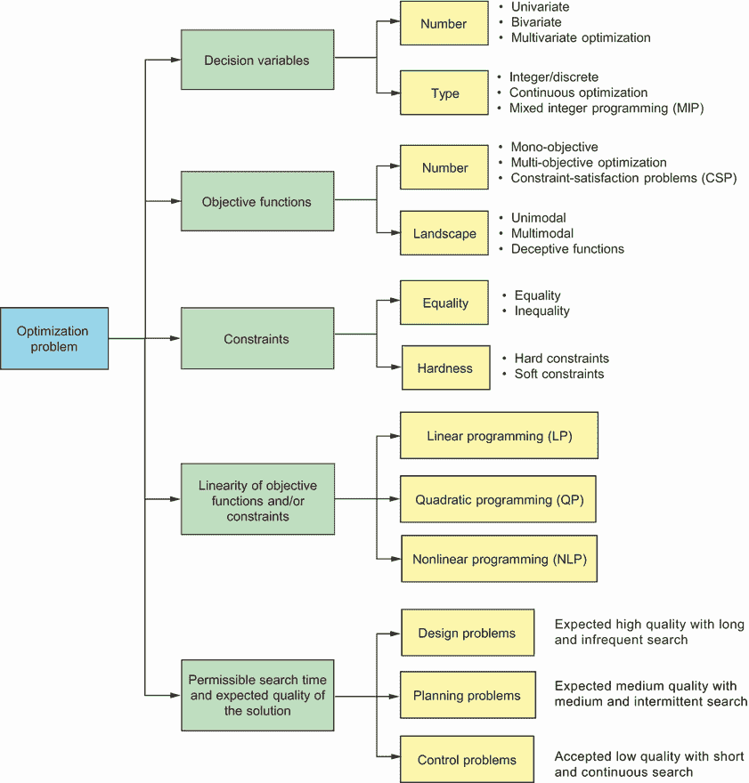

图 2.1 优化问题分类——一个优化问题可以分解为其组成部分，这些组成部分是此类问题分类的基础。

以下小节将更详细地解释这些类型，并为每种优化问题提供示例。

### 2.1.1 决策变量的数量和类型

根据决策变量的数量，优化问题可以广泛分为单变量（单变量）或多变量（多变量）问题。例如，车辆速度、加速度和轮胎压力是影响车辆燃油经济的参数之一，其中燃油经济性指的是车辆在特定燃料量下能行驶多远。根据美国能源部，控制车辆的速度和加速度可以在高速公路上提高其燃油经济性 15%至 30%，在走走停停的交通中提高 10%至 40%。美国国家公路交通安全管理局（NHTSA）的一项研究发现，轮胎压力降低 1%与燃油经济性降低 0.3%相关。如果我们只寻找最大燃油经济性的最优车辆速度，则该问题是单变量优化问题。寻找最大燃油经济性的最优速度和加速度是双变量优化问题，而寻找最优速度、加速度和轮胎压力是多变量问题。

问题分类也根据决策变量的类型而变化。连续问题涉及连续值变量，其中 *x*[j] ∈ R。相比之下，如果 *x*[j] ∈ Z，则问题是整数或离散优化问题。混合整数问题既有连续值变量也有整数值变量。例如，优化电梯速度和加速度（连续变量）以及乘客上下车的顺序（一个离散变量）是一个混合整数问题。解决方案是整数值变量的集合、组合或排列的问题被称为组合优化问题。

组合与排列

组合数学是研究一组元素组合和排列的数学分支。组合与排列的主要区别在于顺序。如果元素的顺序不重要，则它是组合；如果顺序很重要，则它是排列。因此，排列是有序组合。根据是否允许元素重复，我们可以有不同的组合和排列形式。

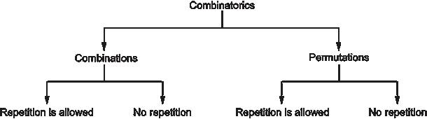

组合和排列——排列尊重顺序，因此是按顺序排列的组合。组合和排列都有带重复和不带重复的变体。

例如，假设我们正在设计一个包含多个健身活动的健身计划。健身计划中可以包含五种类型的练习：慢跑、游泳、骑自行车、瑜伽和有氧运动。在一周的计划中，如果我们只选择这五种练习中的三种，并且允许重复，可能的组合数将是(*n* + *r* – 1)! / *r*!(*n* – 1)! = (5 + 3 – 1)! / 3!(5 – 1)! = 7! / (3! × 4!) = 35。这意味着我们可以通过选择五种可用练习中的三种并允许重复来生成 35 种不同的健身计划。

然而，如果不允许重复，可能的组合数将是*C*(*n*,*r*) = *n*! / *r*!(*n* – *r*)! = 5! / (3! × 2!) = 10。这个公式通常被称为“*n*选*r*”（例如“5 选 3”），它也被称为二项式系数。这意味着如果我们不想重复任何练习，我们只能生成 10 个计划。

在带重复和不带重复的组合中，健身计划不包括包含的练习的执行顺序。如果我们尊重特定的顺序，计划将采取排列的形式。如果允许重复练习，选择三个可用练习的可能排列数将是*n*^r = 5³ = 125。然而，如果不允许重复，可能的排列数将是*P*(*n*,*r*) = *n*! / (*n* – *r*)! = 5! / (5 – 3)! = 60。

当从头开始编写代码时，组合学在 Python 中可以相当容易地实现，但也有一些优秀的库可用，例如 SymPy，这是一个开源的 Python 符号数学库。它的功能包括但不限于统计学、物理学、几何学、微积分、方程求解、组合学、离散数学、密码学和解析。例如，可以使用以下简单的代码在 SymPy 中计算二项式系数：

```py
from sympy import binomial
print(binomial(5,3))
```

想要了解更多关于在 Python 中实现组合学的信息，请参阅附录 A 和 SymPy 的文档。

旅行商问题（TSP）是组合问题的一个常见例子，其解决方案是一个排列——要访问的城市序列。在 TSP 中，给定*n*个城市，旅行商必须访问所有城市然后返回家中，形成一个循环（往返）。旅行商希望以最有效的方式旅行（例如最快的、最便宜的或最短的路程）。

TSP 可以分为*对称 TSP*（STSP）和*非对称 TSP*（ATSP）。在 STSP 中，两个城市之间的距离在两个方向上是相同的，形成一个无向图。这种对称性将可能的解决方案数量减半。ATSP 是对称版本的严格推广。在 ATSP 中，路径可能不是双向的，或者距离可能不同，形成一个有向图。交通碰撞、单行道、桥梁以及不同出发和到达费用的城市的机票价格都是这种对称性可能崩溃的例子。

TSP 中的搜索空间非常大。例如，假设销售人员需要访问大多伦多地区（GTA）的 13 个主要城市，如图 2.2 所示。朴素解的复杂度是*O*(*n*!)。这意味着在 ATSP 的情况下，有*n*! = 13! = 6,227,020,800 种可能的旅行路线。在 STSP 和 ATSP 中，这都是一个非常大的搜索空间。然而，动态规划（DP）算法能够降低复杂度。

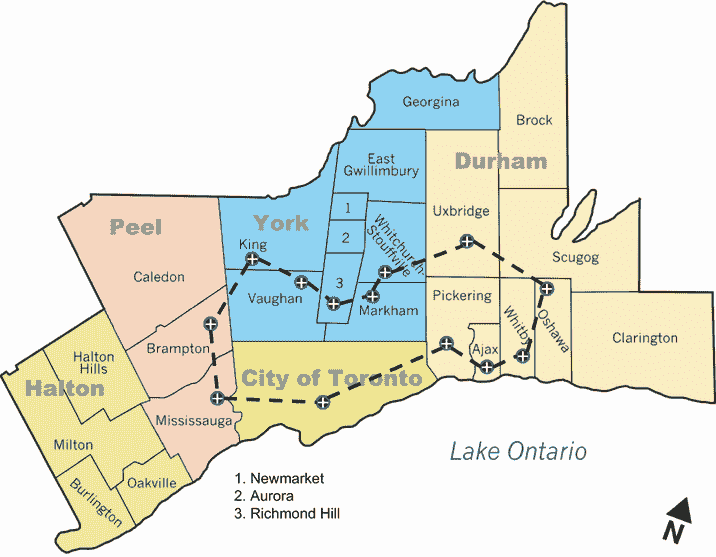

图 2.2 大多伦多地区（GTA）的 TSP。旅行销售人员必须访问所有 13 个城市，并希望选择“最佳”路径，无论这是基于距离、时间还是其他标准。

动态规划是一种通过将问题分解成更小的子问题并独立解决每个子问题来解决问题的方法。例如，Bellman-Held-Karp 算法[1]的复杂度是*O*(2*^n* × *n*²)。还有其他具有不同计算复杂度和近似比率的求解器和算法，如 Concorde TSP 求解器、2-opt 和 3-opt 算法、分支和界限算法、Christofides 算法（或 Christofides-Serdyukov 算法）、Lin-Kernighan 算法、基于元启发式的算法、图神经网络和深度强化学习方法。例如，Christofides 算法[2]是一个多项式时间近似算法，它产生的 TSP 解决方案保证不会比最优解长 50%，时间复杂度为*O*(*n*³)。有关使用 NetworkX 包实现的 Christofides 算法解决 TSP 的解决方案，请参阅附录 A。我们将在本书中讨论如何使用这些算法中的许多来解决 TSP。

广泛的离散优化问题可以建模为 TSP。这些问题包括但不限于微芯片制造、排列流程车间调度、为学校区域内的儿童安排校车路线、分配飞机路线、运输农业设备、服务调用调度、餐食配送以及包裹配送和取件的卡车路线规划。例如，容量车辆路径问题（CVRP）是 TSP 的一种推广，其中必须使用位于一个共同仓库的车辆车队为一系列客户提供服务。每个客户对位于仓库的某些商品有一定的需求。任务是设计从仓库开始和结束的车辆路线，以满足所有客户的需求。在本书的后续章节中，我们将探讨使用随机方法解决 TSP 及其变体的几个示例。

问题类型

决策问题是算法复杂性研究的基础。一般来说，决策问题是一种需要确定给定输入是否满足某种属性或条件的类型的问题。这个问题可以用简单的“是”或“否”来回答。

决策问题通常根据其复杂度水平进行分类。这些类别也可以应用于优化问题，因为优化问题可以被转换为决策问题。例如，一个优化问题的目标是找到一个在可行搜索空间内的最优或近似最优解，可以改写为一个决策问题，回答的问题是“在可行搜索空间内是否存在最优或近似最优解？”答案将是“是”或“否”，或者“真”或“假”。

一个算法效率的普遍接受的观点是它的运行时间是多项式。这意味着解决问题所需的时间或计算成本可以用算法输入大小的多项式函数来描述。例如，在 TSP 的背景下，输入的大小通常是销售人员需要访问的城市数量。可以在多项式时间内解决的问题被称为*可解的*。以下图显示了不同类型的问题，并给出了常用基准（玩具问题）和每种类型的实际应用示例。

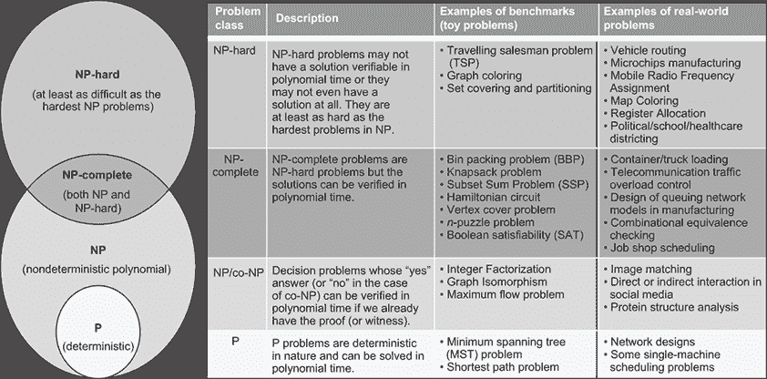

基于难度和完整性的问题类别。问题可以被分类为 NP-hard、NP-complete、NP 或 P。

例如，复杂性类 P 代表所有可以通过确定性算法（即不猜测解决方案的算法）在多项式时间内解决的问题。NP 或非确定性多项式问题是指解决方案难以找到但容易验证，并且可以通过非确定性算法在多项式时间内解决的问题。NP-complete 问题既是 NP-hard 又可以在多项式时间内验证的问题。最后，如果一个问题是 NP-hard，那么它至少与 NP-complete 中最困难的问题一样难。NP-hard 问题通常通过近似或启发式求解器来解决，因为找到解决此类问题的有效精确算法很困难。

聚类是一种组合问题，其解决方案的形式是一种组合，其中顺序不重要。在聚类中，给定 *n* 个对象，我们需要将它们分成 *k* 组（聚类），使得单个组或聚类中的所有对象彼此之间都有一个“自然”的关系，而不同组的对象在某种程度上是不同的。这意味着对象将根据某些相似性或差异性度量进行分组。

*斯特林数*可以用于计数组合问题中的划分和排列。第一类斯特林数根据它们的循环数来计数排列，而第二类斯特林数表示将一组对象划分成非空子集的方法数。以下公式是第二类斯特林数（即 *斯特林划分数*），它给出了在聚类问题的背景下，将 *n* 个对象划分成 *k* 个非空子集的方法数：

|

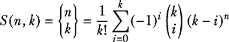

| 2.1 |
| --- |

让我们以智能购物车聚类为例。购物和行李车在购物中心和大型机场中很常见。购物者或旅客在指定地点取走这些购物车，并将它们随意放置。重新收集它们是一项相当艰巨的任务，因此如果这些购物车能够自动聚集到最近的集合点，就像图 2.3 所示的那样，这将是有益的。

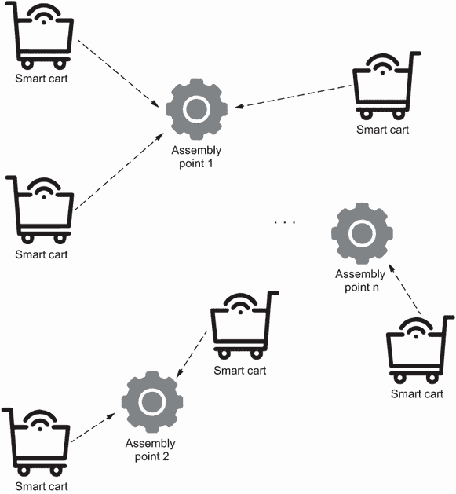

图 2.3 智能购物车聚类。未使用的购物或行李车聚集在指定的集合点，以便于收集和重新分配。

在实践中，这个问题被认为是一个 NP-hard 问题，因为基于可用购物车和集合点的数量，搜索空间可以非常大。为了有效地聚类这些购物车，必须找到聚类的中心（即 *质心*）。然后，每个聚类中的购物车将被引导到离质心最近的集合点。

例如，假设有 50 个车需要围绕四个装配点进行分组。这意味着 *n* = 50 和 *k* = 4。可以使用 SymPy 库生成斯特林数。要做到这一点，只需在两个数字 *n* 和 *k* 上调用 `stirling` 函数：

```py
from sympy.functions.combinatorial.numbers import stirling
print(stirling(50,4))
print(stirling(100,4))
```

结果是 5.3 × 10²⁸，如果 *n* 增加到 100，这个数字变为 6.7 × 10⁵⁸。对于大问题，枚举所有可能的划分是不切实际的。

### 2.1.2 景观和目标函数的数量

目标函数的 *景观* 代表函数值在可行搜索空间中的分布。在这个景观中，你会找到最优解或全局最小值在最低谷，假设你处理的是一个最小化问题，或者在高峰处，如果是最大化问题。根据目标函数的景观，如果只有一个清晰的全球最优解，则问题为 *单峰*（例如，凸和凹函数）。在 *多峰* 问题中，存在多个最优解。当全局最小值位于一个非常狭窄的谷地，并且还存在一个具有宽吸引盆地的强局部最小值时，目标函数被称为 *欺骗性*，这样这个目标函数的值就接近全局最小值处的目标函数值 [3]。图 2.4 是使用 Python 在下一列表中生成的单峰、多峰和欺骗性函数的 3D 可视化。完整的列表可在本书的 GitHub 仓库中找到。

列表 2.1 目标函数的例子

```py
import numpy as np
import math
import matplotlib.pyplot as plt

def objective_unimodal(x, y):           ①
    return x**2.0 + y**2.0

def objective_multimodal(x, y):         ②
    return np.sin(x) * np.cos(y)

def objective_deceptive(x, y):          ③
    return (1-(abs((np.sin(math.pi*(x-2))*np.sin(math.pi*(y-2)))/
➥  (math.pi*math.pi*(x-2)*(y-2))))**5)*(2+(x-7)**2+2*(y-7)**2)

fig = plt.figure(figsize = (25,25))
ax = fig.add_subplot(1,3,1, projection='3d')

x = np.arange(-3, 3, 0.01)
y = np.arange(-3, 3, 0.01)

X, Y = np.meshgrid(x, y)
Z = objective_unimodal(X, Y)
surf = ax.plot_surface(X, Y, Z, cmap=plt.cm.cividis)
ax.set_xlabel('x', fontsize=15)
ax.set_ylabel('y', fontsize=15)
ax.set_zlabel('Z', fontsize=15)
ax.set_title("Unimodal/Convex function", fontsize=18)

ax = fig.add_subplot(1,3,2, projection='3d')
Z = objective_multimodal(X, Y)
surf = ax.plot_surface(X, Y, Z, cmap=plt.cm.cividis)
ax.set_xlabel('x', fontsize=15)
ax.set_ylabel('y', fontsize=15)
ax.set_zlabel('Z', fontsize=15)
ax.set_title("Multimodal function", fontsize=18)

X, Y = np.meshgrid(x, y)
Z = objective_unimodal(X, Y)
ax = fig.add_subplot(1,3,3, projection='3d')
Z = objective_deceptive(X, Y)
surf = ax.plot_surface(X, Y, Z, cmap=plt.cm.cividis, antialiased=False)
ax.set_xlabel('x', fontsize=15)
ax.set_ylabel('y', fontsize=15)
ax.set_zlabel('Z', fontsize=15)
ax.set_title("Deceptive function", fontsize=18)

plt.show()
```

① 单峰函数

② 多峰函数

③ 欺骗性函数


图 2.4 单峰、多峰和欺骗性函数。单峰函数有一个全局最优解，而多峰函数可以有多个。欺骗性函数包含接近全局最小值处目标函数值的虚假最优解，这可能导致某些算法陷入困境。

如果要优化的量仅使用一个目标函数来表示，则该问题被称为单目标或单目标优化问题（例如凸或凹函数）。多目标优化问题指定了要同时优化的多个目标。没有显式目标函数的问题称为约束满足问题（CSPs）。在这种情况下，目标是找到一个满足给定约束集的解。

*n* 后宫问题是一个约束满足问题的例子。在这个问题中，目标是把 *n* 个皇后放在 *n* × *n* 的棋盘上，且没有两个皇后在同一行、列或对角线上，如图 2.5 所示。在这个 4 皇后问题中，初始状态下有 5 个冲突（{Q1,Q2}, {Q1,Q3}, {Q2,Q3}, {Q2,Q4}, 和 {Q3,Q4}）。移动 Q4 后，冲突数减少 2，移动 Q3 后，冲突数只有 1，这是 Q1 和 Q2 之间的冲突。


图 2.5 *n*-后问题。这个问题没有目标函数，只有必须满足的一组约束。

如果我们继续移动或放置棋子，我们可以达到一个目标状态，其中冲突的数量为 0，这意味着没有一枚棋后可以攻击任何其他棋后，无论是水平、垂直还是对角线方向。下面的列表展示了 4 后问题的 Python 实现。

列表 2.2 *n*-后 CSP

```py
from copy import deepcopy
import math
import matplotlib.pyplot as plt
import numpy as np

board_size = 4
board = np.full((board_size, board_size), False)         ①

def can_attack(board, row, col):
    if any(board[row]):                                  ②
        return True                                      ②

    offset = col - row                                   ③
    if any(np.diagonal(board, offset)):                  ③
        return True                                      ③
    offset = (len(board) - 1 - col) - row                ③
    if any(np.diagonal(np.fliplr(board), offset)):       ③
        return True                                      ③

    return False

board[0][0] = True
col = 1 
states = [deepcopy(board)]
while col < board_size:
    row = 0
    while row < board_size:
        if not can_attack(board, row, col):              ④
            board[row][col] = True
            col += 1
            states.append(deepcopy(board))
            break
        row += 1
        if row == board_size:                            ⑤
            board = np.delete(board, 0, 1)
            new_col = [[False]] * board_size
            board = np.append(board, new_col, 1)
            states.append(deepcopy(board))
            col -= 1
            continue
```

① 创建一个 n x n 棋盘。

② 检查同一行的棋后。

③ 检查对角线上的棋后。

④ 棋子可以放置在这个列中。

⑤ 棋子不能放置在这个列中。

在前面的列表中，`can_attack`函数检测新放置的棋子是否可以攻击之前放置的棋子。如果一枚棋子在同一行、同一列或同一对角线上，它可以攻击另一枚棋子。图 2.6 显示了六步后获得的解决方案。


图 2.6 *n*-后解决方案

第一枚棋子可以简单地放在第一个位置。第二枚棋子必须放在第三个或第四个位置，因为前两个位置可以被攻击。然而，将棋子放在第三个位置时，第三枚棋子就无法放置。因此，第一枚棋子被移除（棋盘“滑动”一列），然后我们再次尝试。这个过程会一直持续到找到解决方案。

该问题的完整代码，包括用于生成可视化的代码，可以在列表 2.2 的代码文件中找到，该文件位于书的 GitHub 仓库中。解决方案算法如下：

1.  在列中从上到下移动，算法尝试放置棋子同时避免冲突。对于第一列，这默认为 Q1 = 0。

1.  移动到下一列，如果棋子不能放在第 0 行，它将被放在第 1 行，依此类推。

1.  当放置一枚棋子后，算法移动到下一列。

1.  如果在给定的列中无法放置棋子，整个棋盘的第一列将被移除，然后重新尝试当前列。

Google OR-Tools 中可用的约束编程求解器也可以用来解决这个*n* × *n*后问题。下面的列表展示了使用 OR-Tools 的解决方案步骤。

列表 2.3 使用 OR-Tools 解决*n*-后问题

```py
import numpy as np
import matplotlib.pyplot as plt
import math
from ortools.sat.python import cp_model                          ①

board_size = 4 
                                                                 ②
model = cp_model.CpModel()                                       ③

queens = [model.NewIntVar(0, board_size - 1, 'x%i' % i) 
➥for i in range(board_size)]                                    ④

model.AddAllDifferent(queens)                                    ⑤

model.AddAllDifferent(queens[i] + i for i in range(board_size))
model.AddAllDifferent(queens[i] - i for i in range(board_size))

solver = cp_model.CpSolver()                                     ⑥
solver.parameters.enumerate_all_solutions = True                 ⑥
solver.Solve(model)                                              ⑥

all_queens = range(board_size)                                   ⑦
state=[] 
for i in all_queens:
    for j in all_queens:
        if solver.Value(queens[j]) == i:
            # There is a queen in column j, row i.
            state.append(True)
        else:
            state.append(None)     

states=np.array(state).reshape(-1, board_size)
fig = plt.figure(figsize=(5,5))                                 ⑧
markers = [                                                     ⑧
    x.tolist().index(True) if True in x.tolist() else None      ⑧
    for x in np.transpose(states)                               ⑧
]                                                               ⑧
res = np.add.outer(range(board_size), range(board_size)) % 2    ⑧
plt.imshow(res, cmap="binary_r")                                ⑧
plt.xticks([])                                                  ⑧
plt.yticks([])                                                  ⑧
plt.plot(markers, marker="*", linestyle="None",                 ⑧
➥markersize=100/board_size, color="y")H                        ⑧
```

① 导入使用 SAT（可满足性）方法的约束编程求解器。

② 为 n x n 后问题设置棋盘大小。

③ 定义求解器。

④ 定义变量。数组索引表示列，值表示行。

⑤ 定义约束：所有行必须不同。

⑥ 解决模型。

⑦ 定义约束：没有两枚棋后可以位于同一对角线上。

⑧ 可视化解决方案。

运行此代码会产生图 2.7 中的输出。有关 Google OR-Tools 的更多信息，请参阅附录 A。

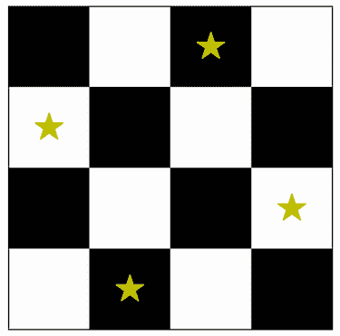

图 2.7 使用 OR-Tools 的*n*-后解决方案

### 2.1.3 约束

约束问题具有等式、不等式或两者的硬约束或软约束。硬约束必须满足，而软约束则很好满足（但不是强制性的）。如果没有需要考虑的约束，除了边界约束之外，问题就是一个无约束优化问题。

让我们回顾一下在 1.3.1 节中引入的门票定价问题。Python 中有许多基于导数的求解器可以处理这类可微数学优化问题（参见附录 A）。下面的列表显示了如何使用 SciPy 解决这个简单的门票定价问题。SciPy 是一个包含所有计算工具的宝贵库。

列表 2.4 门票定价优化

```py
import numpy as np
import scipy.optimize as opt
import matplotlib.pyplot as plt

def f(x):                                                      ①
    return -(-20*x**2+6200*x-350000)/1000 

res=opt.minimize_scalar(f, method='bounded', bounds=[0, 250])  ②

print("Optimal Ticket Price ($): %.2f" % res.x)
print("Profit f(x) in K$: %.2f" % -res.fun)
```

① 目标函数，由 minimize_scalar 所需的最小化函数

② 有界方法是寻找解的约束最小化过程。

运行此代码会产生以下输出：

```py
Optimal Ticket Price ($): 155.00
Profit f(x) in K$: 130.50
```

此代码在 0 到 250 美元的范围内找到最优门票价格，以最大化利润。如您所注意到的，利润公式通过在目标函数中添加负号转换为最小化问题，以匹配 `scipy.optimize` 中的 `minimize` 函数。在 `print` 函数中添加负号，将其转换回利润。

如果我们对这个问题施加一个等式约束会怎样呢？假设由于对我们活动的国际需求难以置信，我们现在正在考虑使用不同的活动策划公司，并为我们的会议开放虚拟参会，以便国际客人也能参加。感兴趣的参与者现在可以选择亲自参加活动或通过直播加入。所有参与者，无论是亲自参加还是虚拟参加，都将收到一个实物欢迎礼包，该礼包限量 10,000 份。因此，为了确保活动“满员”，我们必须要么卖出 10,000 张亲自参加的门票，要么卖出 10,000 张虚拟门票，或者两者的组合。新的活动公司对我们活动的收费是 100 万美元的固定费用，因此我们希望卖出尽可能多的门票（正好是 10,000 张）。与这个问题相关联的以下方程式：

设 *x* 为实物门票销售数量，设 *y* 为虚拟门票销售数量。此外，设 *f*(*x*,*y*) 为从活动产生的利润函数，其中

|

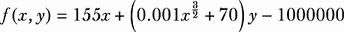

| 2.2 |
| --- |

实际上，我们通过亲自参加获得 155 美元的利润，而在线参加的利润是 70 美元，但随着我们拥有的实物参加人数的增加而增加（让我们假设，当活动看起来“更拥挤”时，我们可以对在线参与者收取更高的费用）。

假设我们添加一个约束函数，*x* + *y* ≤ 10000，这表明组合票销售不能超过 10,000。现在问题变成了一个双变量单目标约束优化问题。可以使用拉格朗日乘数 λ 将这个约束优化问题转换为无约束优化。我们可以使用 SymPy 实现拉格朗日乘数并求解虚拟和实物票销售的优化组合。思路是将由目标函数 *f*(*x*,*y*) 和等式约束 *g*(*x*,*y*) 定义的约束优化问题转换为使用拉格朗日函数 *L*(*x*,y,λ) = *f*(*x*,*y*) + *λg*(*x*,*y*) 的无约束优化问题。这个函数结合了目标函数和约束条件，使得可以通过使用拉格朗日乘数将约束优化问题表述为无约束问题。为此，我们取目标函数和约束条件关于决策变量 *x* 和 *y* 的偏导数，以形成 SymPy 求解器使用的无约束优化方程，如图 2.8 所示。


图 2.8 使用拉格朗日方法解决票价问题的步骤

下一个列表展示了使用 SymPy 的 Python 实现。

列表 2.5 使用拉格朗日乘数最大化利润

```py
import sympy as sym

x,y=sym.var('x, y', positive=True)                     ①

f=155*x+(0.001*x**sym.Rational(3,2)+70)*y-1000000      ②

g=x+y-10000                                            ③

lamda=sym.symbols('lambda')                            ④
Lagr=f-lamda*g                                         ⑤

eqs = [sym.diff(Lagr, x), sym.diff(Lagr, y), g]        ⑥

sol=sym.solve(eqs,[x,y,lamda], dict=True)              ⑦

def getValueOf(k, L):
    for d in L:
        if k in d:
            return d[k]

profit=[f.subs(p) for p in sol]

print("optimal number of physical ticket sales: x = %.0f" % getValueOf(x, sol))
print("optimal number of online ticket sales: y = %.0f" % getValueOf(y, sol))
print("Expected profil: f(x,y) = $%.4f" % profit[0])
```

① 定义决策变量。

② 定义票价目标函数。

③ 定义等式约束。

④ 拉格朗日乘数

⑤ 拉格朗日函数

⑥ 方程式求解器

⑦ 使用 SymPy 在三个变量（x,y,lambda）中求解这三个方程。

通过求解前面的三个方程，我们得到 *x* 和 *y* 的值，这些值对应于虚拟和实物票销售的优化数量。通过列表 2.5 中的代码，我们可以看到最佳结果是销售 6,424 张现场票和 3,576 张在线票。这导致最大利润为 $2,087,260。

### 2.1.4 目标函数和约束条件的线性

如果所有目标函数和相关约束条件都是线性的，则优化问题被归类为 *线性优化问题* 或 *线性规划问题*（LPP 或 LP），其目标是找到在线性约束下线性函数的最优值。混合问题是混合整数线性规划（MILP）的典型应用，其中需要将多种成分混合或混合以获得具有特定特性或属性的产品。在保罗·詹森的《运筹学模型与方法》[4]中描述的动物饲料混合问题中，需要确定动物饲料混合中三种成分的最佳数量。可能的成分、它们的营养含量（每千克成分的营养千克数）和单位成本如表 2.1 所示。

表 2.1 动物饲料混合问题

| 成分 | 成分营养含量和价格 |
| --- | --- |
| 钙（kg/kg） | 蛋白质（kg/kg） | 纤维（kg/kg） | 单位成本（美分/kg） |
| --- | --- | --- | --- |
| 玉米 | 0.001 | 0.09 | 0.02 | 30.5 |
| 石灰石 | 0.38 | 0.0 | 0.0 | 10.0 |
| 大豆粕 | 0.002 | 0.50 | 0.08 | 90.0 |

混合物必须满足以下限制条件：

+   钙含量——至少 0.8%，但不超过 1.2%

+   蛋白质——至少 22%

+   纤维——最多 5%

问题是要找到满足这些约束条件的同时最小化成本的最佳混合物。决策变量是 *x*[1]、*x*[2] 和 *x*[3]，分别代表石灰石、玉米和大豆粕的比例。

目标函数 *f* = 30.5*x*[1] + 10*x*[2] + 90*x*[3] 需要被最小化，同时满足以下约束条件：

+   钙含量限制：0.008 ≤ 0.001*x*[1] + 0.38*x*[2] + 0.002*x*[3] ≤ 0.012

+   蛋白质约束：0.09*x*[1] + 0.5*x*[3] ≥ 0.22

+   纤维约束：0.02*x*[1] + 0.08*x*[3] <= 0.05

+   非负性限制：*x*[1]、*x*[2]、*x*[2] ≥ 0

+   保守性：*x*[1] + *x*[2] + *x*[2] = 1

在这个问题中，目标函数和约束条件都是线性的，因此它是一个线性规划问题。有几个 Python 库可以用来解决数学优化问题。

我们将尝试使用 PuLP 解决动物饲料混合问题。PuLP 是一个 Python 线性规划库，允许用户定义线性规划问题并使用优化算法（如 COIN-OR 的线性整数规划求解器）来解决问题。有关 PuLP 和其他数学规划求解器的更多信息，请参阅附录 A。下一个列表显示了使用 PuLP 解决动物饲料混合问题的步骤。

列表 2.6 使用 PuLP 解决线性规划问题

```py
from pulp import *

model = LpProblem("Animal_Feed_Mix_Problem", LpMinimize)                    ①

x1 = LpVariable('Corn', lowBound = 0, upBound = 1, cat='Continous')         ②  
x2 = LpVariable('Limestone', lowBound = 0, upBound = 1, cat='Continous')    ②
x3 = LpVariable('Soybean meal', lowBound = 0, upBound = 1, cat='Continous') ②

model += 30.5*x1 + 10.0*x2 + 90*x3, 'Cost'                                  ③

model +=0.008 <= 0.001*x1 + 0.38*x2 + 0.002*x3 <= 0.012, 'Calcium limits'   ④
model += 0.09*x1 + 0.5*x3 >=0.22, 'Minimum protein'                         ④
model += 0.02*x1 + 0.08*x3 <=0.05, 'Maximum fiber'                          ④
model += x1+x2+x3 == 1, 'Conservation'                                      ④

model.solve()                                                               ⑤

for v in model.variables():                                                 ⑥
    print(v.name, '=', round(v.varValue,2)*100, '%')                        ⑥
                                                                            ⑥
print('Total cost of the mixture per kg = ',                                ⑥
    ➥round(value(model.objective)/100, 2), '$')                            ⑥
```

① 创建一个线性规划模型。

② 定义三个变量，代表混合物中玉米、石灰石和大豆粕的百分比。

③ 将总成本定义为要最小化的目标函数。

④ 添加约束条件。

⑤ 使用 PuLP 的选择求解器解决问题。

⑥ 打印结果（原料的最佳百分比和每公斤混合物的成本）

如此列表所示，我们首先导入 PuLP 并创建一个作为线性规划问题的模型。然后定义与每个变量相关的参数，例如变量的名称、范围的下限和上限以及变量的类型（例如，整数、二元或连续）。然后使用求解器来解决问题。PuLP 支持多个求解器，如 GLPK、GUROBI、CPLEX 和 MOSEK。PuLP 的默认求解器是 Cbc（COIN-OR 分支和切割）。运行此代码将给出以下输出：

```py
Corn = 65.0%
Limestone = 3.0%
Soybean_meal = 32.0%
Total cost of the mixture per kg = 0.4916$
```

如果目标函数中至少有一个或约束中至少有一个是非线性的，则问题被认为是非线性优化问题或非线性规划问题（NLP），比线性问题更难解决。当目标函数是二次函数时，NLP 的一个特殊情况称为二次规划（QP）。例如，植物布局问题（PLP）或设施定位问题（FLP）是一个二次分配问题（QAP），旨在将不同的设施（部门）*F*分配到不同的位置*L*，以最小化给定的函数成本，如图 2.9 所示。


图 2.9 植物布局问题——每个部门的最优位置是什么，以最小化整体物料处理成本？

假设ω[ij]是这些设施之间交互或产品流动的频率，或者*d[f(i)f(j)]*是设施*i*和*j*之间的距离。物料处理成本（MHC）是

| MHC[ij] = flow × distance = 𝜔[ij] × *d[f]*[(]*[i]*[)]*[f]*[(]*[j]*[)] | 2.3 |
| --- | --- |

总物料处理成本（TMHC）是物料处理成本矩阵内部所有物料处理成本的累加。在矩阵表示法中，问题可以表示为

找到*X*，使其最小化*trace*(*WXDX^T*)

其中*X*代表分配向量，*W*是流量矩阵，*D*是距离矩阵。迹是结果物料处理成本矩阵主对角线上（从左上角到右下角）元素的总和。

在更一般的情况下，NLP 包括任何形式的非线性目标函数或至少非线性约束。例如，想象你正在设计一个地雷探测和销毁无人地面车辆（UGV）[5]。在户外应用，如人道主义排雷中，UGV 应能够在崎岖地形中导航。沙质土壤、有障碍物的岩石地形、陡峭的斜坡、沟渠和涵洞可能对车辆造成困难。这类车辆的移动系统需要精心设计，以确保运动流畅。

假设你负责寻找轮参数（例如，直径、宽度和负载）的最优值，这将

+   最小化车轮下陷，这是车轮在其移动的土壤中下沉的最大量。

+   最小化运动阻力，这是 UGV 单位由于不同阻力成分（压实、重力等）所面临的总体阻力。

+   最小化驱动扭矩，这是每个车轮所需的驱动扭矩。

+   最小化驱动功率，这是每个车轮所需的驱动功率。

+   最大化爬坡可接受性，这代表 UGV 单位在考虑其重量和土壤参数的情况下能够爬上的最大坡度。

由于市场供应或制造方面的考虑和成本，轮径应在 4 至 8.2 英寸的范围内，轮宽应在 3 至 5 英寸的范围内，轮载应在每轮 22 至 24 磅的范围内。这个轮设计问题（图 2.10）可以表述如下：

找到 *X*，使其优化 *ƒ*，同时满足一组可能的边界约束，其中 *X* 是由多个决策变量组成的向量，例如

+   *x*[1] = 轮径，*x*[1] ∈ [4, 8.2]

+   *x*[2] = 轮宽，*x*[2] ∈ [3, 5]

+   *x*[3] = 轮载，*x*[2] ∈ [22, 24]

我们还可以考虑目标函数 *ƒ*={*ƒ*[1]，*ƒ*[2]，…}。例如，轮沉降的函数可能看起来像这样：

|


| 2.4 |
| --- |

其中 *n* 是沉降的指数，*k*[c] 是土壤变形的粘聚力模量，*k*[φ] 是土壤变形的摩擦模量。这个问题被认为是非线性的，因为目标函数是非线性的。

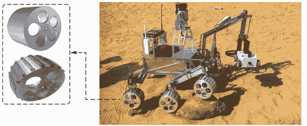

图 2.10 MineProbe 轮设计问题 [5]

Veselić 在“有限悬链线和拉格朗日方法”文章 [6] 中讨论的悬链线问题是一个非线性优化问题的另一个例子。悬链线是由多个部分组成的柔性悬挂物体，如链条或电话线（图 2.11）。在这个问题中，我们提供了 *n* 个同质梁，长度为 *d*[1]，*d*[2]，… *d*[n] > 0，质量为 *m*[1]，*m*[2]，… *m*[n] > 0，它们通过 *n* + 1 个节点 *G*[0]，*G*[2]，… *G*[n] [+ 1] 连接。每个节点的位置由笛卡尔坐标 (*x[i]*,*y[i]*,*z[i]*) 表示。悬链线的两端是 *G*[0] 和 *G*[n] [+ 1]，它们都具有相同的 *y* 和 *z* 值（它们在同一高度上，并且彼此对齐）。

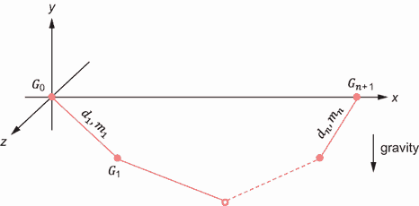

图 2.11 有限悬链线问题——悬链线（或链条）从两个点 G[0] 和 G[n] [+ 1] 悬挂。

假设梁长和质量是预定义的参数，我们的目标是寻找重力场中的稳定平衡位置——那些使势能最小化的位置。要最小化的势能定义如下：

|

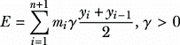

| 2.5 |
| --- |

满足以下约束条件：

|


| 2.6 |
| --- |

其中 *γ* 是重力常数。尽管目标函数是线性的，但约束的非线性使得这个问题是非线性的。

### 2.1.5 解决方案的期望质量和允许时间

优化问题也可以根据期望的解决方案质量和找到解决方案所允许的时间进行分类。图 2.12 展示了三种主要类型的问题：设计问题（战略函数）、计划问题（战术函数）和控制问题（操作函数）。

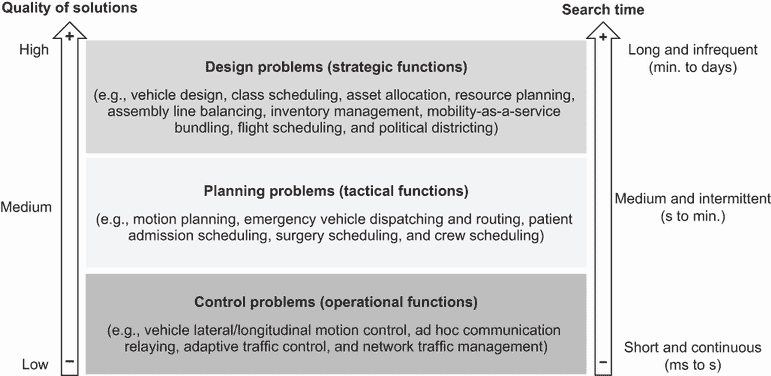

图 2.12 解决方案的质量与搜索时间的关系。某些类型的问题需要快速计算，但不需要极其精确的结果，而其他问题（如设计问题）则可以通过更长的处理时间来换取更高的精度。

在*设计问题*中，时间并不像解决方案的质量那样重要，用户愿意等待（有时甚至几天）以获得最优或近似最优的结果。这些问题可以在离线状态下解决，并且优化过程通常在很长时间内只进行一次。设计问题的例子包括车辆设计、课程安排、资产分配、资源规划、生产线平衡、库存管理、航班安排和政治区域划分。

让我们更详细地讨论政治区域划分作为设计问题。区域划分是将称为*基本单元*的小地理区域分组到称为*区域*的较大地理集群中的问题，以便后者根据相关规划标准[7]是可接受的。基本单元的典型例子是客户、街道或邮政编码区域。规划标准可能包括以下内容：

+   在人口背景、公平规模、平衡工作量、相等销售潜力或客户数量方面的平衡或公平

+   连续性，以便在无需离开区域的情况下在区域的基本单元之间旅行

+   紧凑性，以便在不产生空洞的情况下允许圆形或方形无畸变的区域

+   尊重边界，例如行政边界、铁路、河流或山脉

+   社会经济异质性，以便更好地代表不同收入、民族、关注点或观点的居民

政治区域划分、学区划分、健康服务区域划分、电动汽车充电站区域划分、微型移动站点（例如，电动自行车和电动滑板车）区域划分以及销售或配送区域划分都是区域划分问题的例子。

政治区域划分是自罗马共和国代表民主制度出现以来一直困扰着社会的问题。在代表民主制度中，官员被提名和选举出来代表选举他们的民众的利益。为了在决定涉及整个国家的事务时拥有更大的发言权，出现了政党制度，该制度定义了候选人用来与竞争对手区分自己的政治平台。操纵选举区的形状以决定选举结果的行为被称为*操纵选区*（以 19 世纪初的马萨诸塞州州长 Elbridge Gerry 命名，他在 1810 年重新绘制了参议院的区域地图，以削弱反对联邦党的力量）。图 2.13 显示了如何通过操纵区域的形状来使投票偏向于一个本不会获胜的决定。

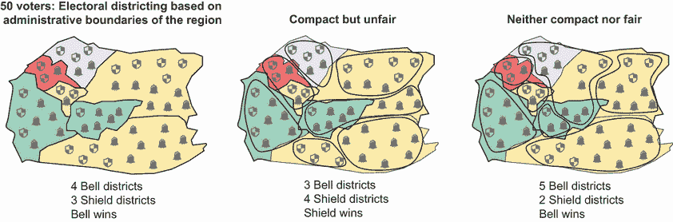

图 2.13 选举操纵的例子。两个主要政党，盾牌和钟铃，试图通过操纵选区边界来获得优势，压制不希望的利益并促进自己的利益。

需要一个有效且透明的政治选区划分策略，以避免选举操纵并生成一个在可重复的方式下保护个别子区完整性并将人口划分为几乎相等的投票人口的解决方案。在许多国家，选区会定期审查，以反映国家人口的变化和流动。例如，加拿大的宪法要求在每 10 年的人口普查后审查联邦选区。

政治选区划分是指将一个领土的 *n* 个子区域聚合为 *m* 个选区，并受到诸如

+   选区应具有近乎相等的投票人口。

+   每个选区内的社会经济同质性以及不同社区的完整性应最大化。

+   选区必须紧凑，每个选区的子区域必须连续。

+   应将子区域视为不可分割的政治单位，并尊重其边界。

该问题可以表述为一个优化问题，其中最大化一个量化上述因素的函数。以下是这个函数的一个例子：

| *F*(*x*) = *α*[pop]*ƒ*pop + *α*[comp]*ƒ*comp + *α*[soc]*ƒ*soc + *α*[sim]*ƒ*sim | 2.7 |
| --- | --- |

其中 *x* 是问题的解决方案或选区，α[i] 是用户指定的乘数 0 ≤ α[i] ≤ 1，而 *ƒ*[pop]、*ƒ*[comp]、*ƒ*[soc]、*ƒ*[int] 和 *ƒ*[sim] 是量化人口平等、选区紧凑性、社会经济同质性、不同社区完整性和与现有选区的相似性的函数。在接下来的章节中，我将向您展示我们如何使用离线优化算法来处理最优多标准分配设计问题。

*规划问题*需要比设计问题更快地解决，时间跨度从几秒到几分钟。要在如此短的时间内找到解决方案，通常需要牺牲最优性以换取速度。规划问题的例子包括车辆运动规划、紧急车辆调度和路线规划、患者入院安排、手术安排以及机组人员安排。让我们以拼车问题作为一个规划问题的例子。

拼车涉及一支按使用付费的车辆车队和一组具有预定义的接车和下车点的乘客（图 2.14）。调度服务需要按照特定顺序为每位司机分配一组乘客，以实现一系列目标。这个拼车问题是一个多目标约束优化问题。拼车优化的非详尽列表包括

+   最小化驾驶员行程的总旅行距离或时间

+   最小化乘客行程的总旅行时间

+   最大化匹配（服务）请求的数量

+   最小化司机行程的成本

+   最小化乘客行程的成本

+   最大化司机的收入

+   最小化乘客的等待时间

+   最小化所需的司机总数


图 2.14 共享出行问题——这个规划问题需要在更短的时间内解决，因为延误可能导致行程丢失和糟糕的用户体验。

对于共享出行问题，搜索时间和解决方案的质量都很重要。在许多流行的共享出行平台上，数十甚至数百名用户可能同时在同一地区的同一地点寻找乘车。过于昂贵和耗时解决方案会导致更高的运营成本（即雇佣比必要的更多司机或从其他地区调用司机）以及潜在的业务损失（糟糕的用户体验可能会阻止乘客再次使用该平台）和高司机流失率。

在实践中，司机分配给乘客的任务远远超出了乘客与司机之间的距离——它可能还包括诸如司机可靠性、乘客评分、车辆类型以及接车和目的地位置类型等因素。例如，前往机场的客户可能要求一辆更大的车辆来容纳行李。在接下来的章节中，我们将讨论如何使用不同的搜索和优化算法来解决规划问题。

*控制问题*需要非常快速的实时解决方案。在大多数情况下，这意味着从毫秒到几秒的时间跨度。车辆横向或纵向运动控制、手术机器人运动控制、中断管理以及临时通信中继都是控制问题的例子。需要在线优化算法来处理这些问题。规划和控制问题中的优化任务通常需要重复执行——例如，新订单将不断到达生产设施，需要以最小化所有工作的等待时间为方式安排到机器上。

想象一个现实世界的情况，其中一群无人机（UAV）或微型空中车辆（MAV）被部署在自然灾害（如地震、雪崩、海啸、龙卷风、野火等）后搜索被困在不可通行的地形上的受害者。任务分为两个阶段：搜索阶段和接力阶段。在搜索阶段，MAV 将根据部署算法进行搜索。当发现目标时，MAV 群将自我组织，利用它们有限的通信能力，在受害者和基站之间建立一个临时的通信中继网络，如图 2.15 所示。

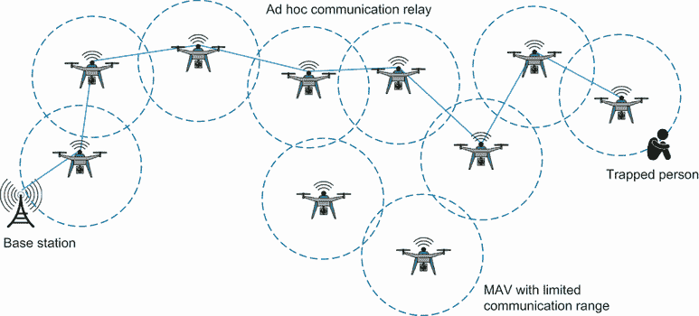

图 2.15 通信中继问题——一群微型飞行器必须在基站和被困受害者之间形成一个临时的通信中继。微型飞行器的移动是一个需要反复解决的控制问题，每秒可能需要多次。在这种情况下，速度比精度更重要，因为小错误可以在下一个周期立即纠正。

在搜索阶段，微型飞行器可以被部署以最大化覆盖面积。一旦它们检测到受害者，微型飞行器可以被重新定位以最大化受害者的可见性。随后建立临时的通信中继网络，以最大化群体中的无线电覆盖范围，并找到检测到受害者的微型飞行器和基站之间的最短路径，前提是以下假设：

+   微型飞行器可以通过结合来自三个易受噪声干扰的传感器的数据来实现态势感知：一个指南针用于方向，一个速度表用于速度，一个高度计用于高度。

+   微型飞行器可以通过 IEEE 802.11b 等标准协议进行通信，其通信范围有限，约为 100 米。

+   微型飞行器能够中继地面信号，以及控制微型飞行器之间发送的信号。

+   微型飞行器（MAVs）拥有足够的机载电力来维持 30 分钟的连续飞行，在此之后它们必须返回基地进行充电。然而，飞行时间取决于飞行过程中完成的信号量。

+   微型飞行器能够迅速加速到恒定的飞行速度 10 米/秒。

+   微型飞行器不能悬停，并且最小转弯半径约为 10 米。

对于如微型飞行器重新定位这样的控制问题，搜索时间至关重要。由于微型飞行器不能悬停，因此必须保持持续运动，延迟的决策可能导致意外情况，例如空中碰撞或信号丢失。由于指令每几毫秒就会发送（或重复），每个微型飞行器必须能够在那个时间段内决定其下一步行动。微型飞行器不仅要考虑其当前位置、目标位置和速度，还必须考虑障碍物、通信信号强度、风速和其他环境因素。小错误是可以接受的，因为它们可以在后续搜索中纠正。在接下来的章节中，我们将讨论如何解决这类控制问题。

本书将主要关注复杂、结构不良的问题，这些问题无法通过传统的数学优化或基于导数的求解器来处理。我们将探讨各个领域中的设计、规划和控制问题的例子。接下来，让我们看看搜索和优化算法是如何进行分类的。

## 2.2 对搜索和优化算法进行分类

当我们进行搜索时，我们试图检查不同的状态，以找到从起始（初始）状态到目标状态的一条路径。通常，优化算法通过迭代地将当前状态或候选解转换成一个新的、希望更好的解来寻找最优解。搜索算法可以根据探索搜索空间的方式分类：

+   *局部搜索* 仅使用关于当前解周围搜索空间的信息来产生新的解。由于只使用局部信息，局部搜索算法（也称为局部优化器）定位局部最优解（这些解可能是或可能不是全局最优解）。

+   *全局搜索* 使用更多关于搜索空间的信息来定位全局最优解。

换句话说，全局搜索算法会探索整个搜索空间，而局部搜索算法只利用邻域信息。

另一种分类区分了确定性和随机算法，如图 2.16 所示：

+   *确定性算法* 在其路径上遵循严格的程序，它们的设计变量值和函数都是可重复的。从相同的起始点出发，无论你今天还是明天运行程序，它们都会遵循相同的路径。例子包括但不限于图形方法、基于梯度和 Hessian 的方法、惩罚方法、梯度投影方法和图搜索方法。图搜索方法可以进一步细分为盲搜索方法（例如，深度优先、广度优先或 Dijkstra）和信息搜索方法（例如，爬山法、束搜索、最佳优先、A*或收缩层次）。确定性方法在本书的第一部分有所介绍。

+   *随机算法*在它们的参数或决策过程中明确使用随机性，或者两者都使用。例如，遗传算法使用一些随机数或伪随机数，导致个体路径不可精确重复。使用随机算法，获得最优解所需的时间无法准确预测。解决方案并不总是变得更好，随机算法有时会错过找到最优解的机会。然而，这种行为可能是有利的，因为它可以防止它们陷入局部最优。随机算法的例子包括禁忌搜索、模拟退火、遗传算法、差分进化算法、粒子群优化、蚁群优化、人工蜂群、萤火虫算法等。大多数统计机器学习算法都是随机的，因为它们在学习的阶段利用随机性，并在推理阶段以一定的不确定性进行预测。此外，一些机器学习模型，就像人一样，是不可预测的。使用基于人类行为数据作为独立变量的模型比使用严格遵循物理定律的独立变量训练的模型更有可能不可预测。例如，人类意图识别模型比预测材料应力-应变曲线的模型更不可预测。由于机器学习预测的不确定性，用于解决优化问题的基于机器学习的算法可以被认为是随机方法。本书的第 2 至 5 部分涵盖了随机算法。 


图 2.16 确定性算法与随机算法。确定性算法遵循一套既定的程序，其结果是可重复的，而随机搜索算法则将随机性元素构建到算法中。

寻宝任务

在给定的搜索空间中寻找最优解可以比作寻宝任务。想象一下你和一群朋友决定去一个岛屿寻找海盗宝藏。

岛上的所有区域（除了活跃火山区域）都对应着优化问题的可行搜索空间。宝藏对应于这个可行空间中的最优解。你和你的朋友们是“搜索代理”，被派去寻找解决方案，每个人遵循不同的搜索方法。如果你在搜索过程中没有任何可以引导你的信息，你就是在遵循一种盲目的（无信息的）搜索方法，这通常效率低下且耗时。如果你知道海盗们过去习惯于在高地藏宝，那么你就可以直接爬上最陡峭的悬崖，尝试到达最高的山峰。这种情况对应于经典的爬山法（信息搜索）。无信息和有信息搜索算法将在下一章中介绍。你也可以采取试错的方法，寻找线索，并反复从一个可能的地方移动到另一个可能的地方，直到找到宝藏。这对应于基于轨迹的搜索，我们将在本书的第二部分讨论。

如果你不想冒一无所获的风险，并决定与朋友们分享信息而不是独自寻宝，你将遵循一种基于群体的搜索方法。在团队合作中，你可能会注意到一些寻宝者比其他人表现更好。在这种情况下，只有表现更好的寻宝者才能保留，新的寻宝者可以被招募来替换表现较差的寻宝者。这类似于进化算法，如遗传算法，其中最适应的寻宝者生存下来。遗传算法将在本书的第三部分介绍。或者，你和你的其他朋友们可以尝试模仿在宝藏岛每个区域中表现优异的寻宝者的成功，而不需要淘汰任何团队成员，也不需要招募新的成员。这种情况使用所谓的群体智能，对应于基于群体的优化算法，如粒子群优化、蚁群优化和人工蜂群算法。这些算法将在本书的第四部分讨论。

你可以独自一人，或者在你的朋友们的帮助下，基于之前和类似的寻宝任务的历史数据建立一个心理模型，或者你可以基于与宝藏岛（搜索空间）的试错交互训练一个奖励预测器，以金属探测器信号的强度作为奖励指标。经过几次迭代后，你将学会最大化预测器的奖励，并改进你的行为，直到你达到预期的目标并找到宝藏。这对应于基于机器学习的方法，我们将在本书的第五部分讨论。

## 2.3 启发式和元启发式

*启发式方法*（也称为*思维捷径*或*经验法则*）是解决方案策略、寻求方法或规则，旨在在实用时间内帮助找到复杂问题的可接受（最优或近似最优）解决方案。尽管启发式方法可以在合理的计算成本下寻求近似最优解，但它们不能保证可行性或最优程度。

“欧拉！欧拉！”

词语*启发式*来源于希腊语单词*heuriskein*，意为“找到或发现”。这个动词的过去式*eureka*被古希腊数学家、物理学家、工程师、天文学家和发明家阿基米德使用。阿基米德受雇于检测金冠制造中的欺诈行为，并接受了挑战。在随后的公共浴场访问中，他得到了启示。当他身体浸入水中时，他观察到他下沉得越多，排开的水就越多，这为他体积提供了一个精确的测量。意识到起作用的原理，他推断出含有银的皇冠，由于密度低于纯金，需要更大的体积才能匹配纯金皇冠的重量。因此，它会排开更多的水。认识到解决方案后，阿基米德从浴缸中跳出来，急忙回家，大声喊道“欧拉！欧拉！”这翻译成“我找到了！我找到了！”

元启发式这个术语是由两个希腊词组合而成的：*meta*，意为“超越，在更高层次上”，和*heuristics*。这是由禁忌搜索（在第六章中讨论）的发明者 Fred Glover 创造的术语，用来指代用于指导并修改其他启发式方法以提高其性能的高级策略。元启发式的目标是高效地探索搜索空间，以找到最优或近似最优解。元启发式可能包含机制，以在探索（多样化）和利用（强化）搜索空间之间取得平衡，以避免陷入搜索空间的局限区域，同时也在合理的时间内找到最优或近似最优解。在启发式中找到这种探索和利用的平衡是至关重要的，如第 1.5 节所述。元启发式算法通常是全局优化器，可以应用于不同的线性和非线性优化问题，对特定问题的修改相对较少。这些算法通常很鲁棒，可以处理不同的问题规模、问题实例和随机变量。

假设我们有 6 个不同尺寸的对象（2, 4, 3, 6, 5 和 1），我们需要将它们装入尽可能少的箱子中。每个箱子的大小有限，为 7，因此箱子中对象的总体积应不超过 7。如果我们有*n*个对象，那么有*n*!种可能的装箱方式。我们需要的最小箱子数是*下界*。为了计算这个下界，我们需要找到所有对象尺寸的总和（2 + 4 + 3 + 6 + 5 + 1 = 21）。下界是 21 / 7 = 3 个箱子。这意味着我们需要至少 3 个箱子来装这些对象。图 2.17 说明了可以用来解决这个盒子装填问题的两种启发式方法。


图 2.17 使用首次适应和首次适应递减启发式方法处理盒子装填问题

首次适应启发式方法按照对象的顺序装箱，不考虑它们的大小。这导致需要四个箱子，其中三个箱子未充分利用，因为这三个箱子中还有七个空间。如果我们应用首次适应递减启发式方法，我们将根据对象的大小对它们进行排序，并按照这个顺序装箱。这个启发式方法允许我们将所有对象装入三个完全利用的箱子中，这是下界。

在前一个例子中，所有对象的高度都是相同的。然而，在更通用的版本中，让我们考虑具有不同宽度和高度的对象，如图 2.18 所示。应用如“先小后大”这样的启发式方法可以使我们更快地装载容器。一些启发式方法并不保证最优解；例如，最大的先启发式方法给出的是一个次优解，因为有一个对象被遗漏了。如果我们需要将所有对象装入容器，这可以被认为是一个不可行解；如果目标是装入尽可能多的对象，那么它将是一个次优解。


图 2.18 盒子装填问题。使用启发式方法可以比暴力方法更快地解决问题。然而，某些启发式函数可能会导致不可行或次优解，并且它们不能保证最优解。

要在 Python 中解决这个问题，我们首先定义对象、容器以及将对象放入容器中的含义。为了简化，以下列表避免了自定义类，并使用`numpy`数组。

列表 2.7 盒子装填问题

```py
import numpy
import matplotlib.pyplot as plt
from matplotlib import cm
from matplotlib.colors import rgb2hex

width = 4                                                             ①
height = 8                                                            ①
container = numpy.full((height,width), 0)                             ①

objects = [[3,1],[3,3],[5,1],[4,2],[3,2]]                             ②

def fit(container, object, obj_index, rotate=True):                   ③
    obj_w = object[0]                                                 ③
    obj_h = object[1]                                                 ③
    for i in range(height - obj_h + 1): C                             ③
        for j in range(width - obj_w + 1):                            ③
            placement = container[i : i + obj_h, j : j + obj_w]       ③
            if placement.sum() == 0:                                  ③
                container[i : i + obj_h, j : j + obj_w] = obj_index   ③
                return True                                           ③
        return fit(container, object[::-1], obj_index, rotate=False)  ③
```

① 定义容器的尺寸，并将 numpy 数组初始化为 0。

② 将要放置的对象表示为[宽度，高度]。

③ fit 函数将对象放入容器中，通过直接放置、移动或旋转。

`fit`函数尝试将一个值写入容器的 2D 切片中，前提是该切片中没有其他值（总和为 0）。如果失败，它将从容器顶部到底部、从左到右移动，并再次尝试。作为最后的手段，它尝试以 90 度旋转物体进行同样的操作。

第一个启发式算法优先考虑按物体面积降序进行适配：

```py
def largest_first(container, objects):
    excluded = []
    assigned = []
    objects.sort(key=lambda obj: obj[0] * obj[1], reverse=True)   ①
    for obj in objects:
        if not fit(container, obj, objects.index(obj) + 1):
            excluded.append(objects.index(obj) + 1)               ②
        else:
            assigned.append(objects.index(obj) + 1)
    if excluded: print(f"Items excluded: {len(excluded)}")
    visualize(numpy.flip(container, axis=0), assigned)            ③
```

① 按面积降序排序元素。

② 一些物体可能无法放入；我们可以使用列表来跟踪它们。

③ 可视化已填充的容器。

此代码的输出如图 2.19 所示。可视化此结果的代码包含在列表 2.7 的完整代码文件中，可在本书的 GitHub 仓库中找到。


图 2.19 使用最大优先启发式算法的装箱问题——一个物体被排除在外，因为它无法放入剩余的空间。

第二个启发式算法首先按宽度排序，然后按总面积排序，顺序为升序：

```py
def smallest_width_first(container, objects):
    excluded = []
    assigned = []
    objects.sort(key=lambda obj: (obj[0], obj[0] * obj[1]))      ①
    for obj in objects:
        if not fit(container, obj, objects.index(obj) + 1):
            excluded.append(objects.index(obj) + 1)
        else:
            assigned.append(objects.index(obj) + 1)
    if excluded: print(f"Items excluded: {len(excluded)}")
    visualize(numpy.flip(container, axis=0), assigned)           ②
```

① 以宽度为主要键排序，然后按面积升序排序。

② 可视化解决方案。

`smallest_width_first`启发式算法成功地将所有物体放入容器中，如图 2.20 所示。

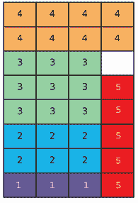

图 2.20 使用最小优先启发式算法的装箱问题——所有五个物体都成功放置在容器中。

可以使用不同的启发式搜索策略来生成候选解决方案。这些策略包括但不限于通过重复构建解决方案进行搜索（例如，图搜索和蚁群优化），通过重复修改解决方案进行搜索（例如，禁忌搜索、模拟退火、遗传算法和粒子群优化），以及通过重复解决方案重组进行搜索（例如，遗传算法和差分进化）。

让我们重新考虑 1.3.3 节中讨论的货运自行车装载问题。我们可以根据效率（每公斤利润）对要交付的物品进行排序，如表 2.2 所示。

表 2.2 按效率排序的包裹。包裹的效率定义为每公斤利润。

| 物品 | 重量（kg） | 利润（$） | 效率（$/kg） |
| --- | --- | --- | --- |
| 10 | 7.8 | 20.9 | 2.68 |
| 7 | 4.9 | 10.3 | 2.10 |
| 4 | 10 | 12.12 | 1.21 |
| 1 | 14.6 | 14.54 | 1 |
| 8 | 16.5 | 13.5 | 0.82 |
| 6 | 9.6 | 7.4 | 0.77 |
| 2 | 20 | 15.26 | 0.76 |
| 9 | 8.77 | 6.6 | 0.75 |
| 3 | 8.5 | 5.8 | 0.68 |
| 5 | 13 | 8.2 | 0.63 |

基于基于重复解决方案构建的启发式搜索策略，我们可以首先应用贪婪原则，根据效率选择物品，直到达到货运自行车的最大载重（100 公斤）作为硬约束。这一过程的步骤如表 2.3 所示。

表 2.3 重复解决方案构建——包裹被添加到自行车上，直到达到最大容量。

| 步骤 | 物品 | 添加？ | 总重量（kg） | 总利润（$） |
| --- | --- | --- | --- | --- |
| 1 | 10 | 是 | 7.8 | 20.9 |
| 2 | 7 | 是 | 12.7 | 31.2 |
| 3 | 4 | 是 | 22.7 | 43.32 |
| 4 | 1 | 是 | 37.3 | 57.86 |
| 5 | 8 | 是 | 53.8 | 71.36 |
| 6 | 6 | 是 | 63.4 | 78.76 |
| 7 | 2 | 是 | 83.4 | 94.02 |
| 8 | 9 | 是 | 92.17 | 100.62 |
| 9 | 3 | 否 | (100.67) | - |
| 10 | 5 | 否 | (113.67) | - |

我们得到了以下物品子集：10, 7, 4, 1, 8, 6, 2, 和 9。这也可以写成（1,1,0,1,0,1,1,1,1,1），从左到右读取时显示我们包括了物品 1, 2, 4, 6, 7, 8, 9 和 10（并排除了物品 3 和 5）。这产生了总利润为 $100.62 和重量为 92.17 kg 的结果。我们可以通过重复添加物体的过程来生成更多解决方案，从空容器开始。

我们不仅可以从头开始创建一个或多个解决方案，还可以考虑修改现有可行解决方案的方法——这是一种 *基于重复解决方案修改* 的启发式搜索策略。考虑为载货自行车问题生成的先前解决方案：（1,1,0,1,0,1,1,1,1,1）。我们知道这个可行解决方案不是最优的，但我们如何改进它？我们可以通过从载货自行车中移除物品 9 并添加物品 5 来做到这一点。移除和添加的过程产生了一个新的解决方案，（1,1,0,1,1,1,1,1,0,1），总利润为 $102.22，重量为 96.4 kg。

另一种方法是结合现有解决方案来生成新的解决方案以在搜索空间中取得进展——这是 *重复解决方案重组*。假设给出了以下两个解决方案：

+   *S*[1] = (1,1,1,1,1,0,0,1,0,1) 重量为 75.8 kg，利润为 $75.78

+   *S*[2] = (0,1,0,1,1,0,1,1,1,1) 重量为 80.97 kg，利润为 $86.88

如图 2.21 所示，我们可以取 *S*[1] 的前两个项目和 *S*[2] 的最后八个项目来得到一个新的解决方案。这意味着我们在新的解决方案中包括了物品 1, 2, 4, 5, 7, 8, 9 和 10，并排除了物品 3 和 6。这产生了一个新的解决方案：*S*[3] = (1,1,0,1,1,0,1,1,1,1)，重量为 95.57 kg，利润更高，为 $101.42。

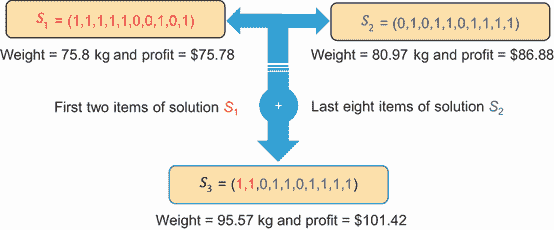

图 2.21 重复解决方案重组——取 S[1] 的前两个元素并添加 S[2] 的最后八个元素得到一个新的、更好的解决方案。

## 2.4 受自然启发的算法

自然是灵感的终极源泉。自然中的问题通常是不良结构的、动态的、部分可观察的、非线性的、多模态的、多目标的，具有硬和软约束，并且没有或有限的全局信息访问。受自然启发的算法是模仿或逆向工程自然界中观察到的智能行为的计算模型。例如包括分子动力学、合作觅食、劳动分工、自我复制、免疫、生物进化、学习、集群、鱼群和自我组织，仅举几例。

分子动力学（模拟粒子系统运动的科学）和热退火启发了科学家们创造一种名为*模拟退火*的优化算法，我们将在第五章中讨论。进化计算算法，如遗传算法（GA）、遗传编程（GP）、进化编程（EP）、进化策略（ES）、差分进化（DE）、文化算法（CA）和协同进化（CoE），都是受进化生物学（研究进化过程）和生物进化启发的。本书的第三部分将涵盖多种进化计算算法。

生态学（动物行为的研究）是群体智能算法，如粒子群优化（PSO）、蚁群优化（ACO）、人工蜂群（ABC）、萤火虫算法（FA）、蝙蝠算法（BA）、社会蜘蛛优化（SSO）、蝴蝶优化算法（BOA）、蜻蜓算法（DA）、磷虾群（KH）、洗牌青蛙跳跃算法（SFLA）、鱼群搜索（FSS）、海豚伙伴优化（DPO）、海豚群优化算法（DSOA）、猫群优化（CSO）、猴子搜索算法（MSA）、狮子优化算法（LOA）、杜鹃搜索（CS）、杜鹃优化算法（COA）、狼搜索算法（WSA）和灰狼优化器（GWO）的主要灵感来源。基于群体智能的优化算法将在本书的第四部分中介绍。

神经网络（NNs）是受生物神经网络的结构和功能启发的计算模型。本书的第五部分将描述如何使用神经网络来解决搜索和优化问题。禁忌搜索（在第六章中解释）基于进化记忆（自适应记忆和响应探索），这在行为心理学（研究行为和心灵的科学）中得到了研究。强化学习是机器学习的一个分支，它从心理学、神经科学和控制理论等多个来源汲取灵感，并且可以用来解决搜索和优化问题，如书中最后一章所述。

其他受自然界启发的搜索和优化算法包括但不限于细菌觅食优化算法 (BFO)、细菌集群算法 (BSA)、生物地理学优化 (BBO)、入侵杂草优化 (IWO)、花授粉算法 (FPA)、森林优化算法 (FOA)、水流算法 (WFA)、水循环算法 (WCA)、头脑风暴优化算法 (BSO)、随机扩散搜索 (SDS)、联盟算法 (AA)、黑洞算法 (BH)、黑洞力学优化 (BHMO)、自适应黑洞算法 (BHA)、改进黑洞算法 (IBH)、莱维飞行黑洞 (LBH)、多种群莱维飞行黑洞 (MLBH)、基于螺旋星系的搜索算法 (GbSA)、基于星系的搜索算法 (GSA)、大爆炸大坍缩 (BBBC)、射线优化 (RO)、量子退火 (QA)、量子启发的遗传算法 (QGA)、量子启发的进化算法 (QEA)、量子群体进化算法 (QSE) 和量子启发的粒子群优化 (QPSO)。有关元启发式算法的完整列表，请参阅 S.M. Almufti 的“元启发式算法的历史调查” [8]。

在本书的五大部分中，我们将探讨五种主要的搜索和优化算法类别：图搜索算法、基于轨迹的优化、进化计算、群体智能算法和机器学习方法。以下算法包含在这些类别中：

+   图搜索方法（盲目或无信息搜索和无信息搜索算法）

+   模拟退火 (SA)

+   表搜索 (TS)

+   遗传算法 (GA)

+   粒子群优化 (PSO)

+   蚂蚁群优化 (ACO)

+   人工蜂群 (ABC)

+   图卷积网络 (GCN)

+   图注意力网络 (GAT)

+   自组织映射 (SOM)

+   行为者-评论家 (A2C) 架构

+   近端策略优化 (PPO)

+   多臂老虎机 (MAB)

+   上下文多臂老虎机 (CMAB)

在本书中，我们将探讨几个现实世界的问题，并看看这些算法如何应用。

## 摘要

+   搜索和优化问题可以根据决策变量的数量（单变量和多变量问题）、决策变量的类型（连续、离散或混合整数）、目标函数的数量（单目标、多目标或约束满足问题）、目标函数的景观（单峰、多峰或欺骗性）、约束的数量（无约束和约束问题），以及目标函数和约束的线性度（线性问题和非线性问题）进行分类。

+   根据解决方案的预期质量和找到解决方案所允许的搜索时间，优化问题也可以被分类为设计问题（战略函数）、规划问题（战术函数）或控制问题（操作函数）。

+   搜索和优化算法可以根据搜索空间被探索的方式（局部搜索与全局搜索）、它们的优化速度（在线优化与离线优化）以及算法的确定性（确定性算法与随机算法）进行分类。

+   启发式（也称为*思维捷径*或*经验法则*）有助于在合理的时间内找到可接受的（最优或近似最优）解决方案，以解决复杂问题。

+   元启发式是高级策略，用于指导和修改其他启发式算法，以增强其性能。

+   受自然启发的算法是计算模型，它们模仿或逆向工程自然界中观察到的智能行为，以解决复杂的不规则问题。
