# 3 盲搜索算法

本章涵盖

+   应用不同的图类型

+   图搜索算法

+   使用图遍历算法在两个节点之间找到路径

+   使用盲搜索算法在图中的两个节点之间找到最短路径

+   使用图搜索算法解决现实世界的路由问题

在第二章中，您已经介绍了确定性和随机性算法。在本章中，我们将重点关注确定性算法，特别是盲搜索算法，以及它们在探索树或图结构以及找到节点之间最短路径中的应用。使用这些算法，您可以从一个初始状态探索迷宫到目标状态，解决*n*-拼图问题，确定社交媒体图中您与其他任何人的距离，搜索家谱以确定任何两个相关人员的确切关系，或者找到任何起点（例如，您的家）和任何目的地之间的最短路径。盲搜索算法很重要，因为当处理简单、定义明确的问题时，它们通常更高效且实用。

## 3.1 图的介绍

一个*图*是一个由称为*顶点*（或节点）和它们之间的关系组成的非线性数据结构，称为*边*（或*弧*或*链接*）。这种数据结构不遵循顺序模式，因此是非线性的，与数组、栈或队列等线性结构不同。

一个图可以用数学上的*G*表示，其中*G* = (*V, E*)。*V*表示节点或顶点的集合，*E*表示边或链接的集合。还可以将各种属性作为组件添加到边元组中，例如边长、容量或任何其他独特属性（例如，道路材料）。图可以分为无向、有向、多重图、无环和超图。

一个*无向图*是一个使用双向边连接节点集的图。这意味着两个连接节点的顺序不是必要的。

NetworkX 是一个常用的 Python 库，用于创建、操作和研究图和复杂网络的结构、动态和功能（有关图库的更多信息，请参阅附录 A）。以下列表显示了如何使用 NetworkX 创建无向图。

列表 3.1 使用 NetworkX 创建无向图

```py
import networkx as nx
import matplotlib.pyplot as plt

graph = nx.Graph()

nodes = list(range(5))                        ①
graph.add_nodes_from(nodes)

edges = [(0,1),(1,2), (1,3), (2,3),(3,4)]     ②
graph.add_edges_from(edges)

nx.draw_networkx(graph, font_color="white")
```

① 从 0 到 4 生成节点列表。

② 定义边列表。

该代码的输出显示在图 3.1 中。您实际得到的布局可能不同，但顶点之间的连接将与这里显示的相同。


图 3.1 无向图

**有向图**是一种使用方向边连接节点集的图。有向图有许多应用，例如表示流量约束（例如单向街道）、关系（例如因果关系）和依赖关系（例如依赖于其他任务完成的任务）。以下列表展示了如何使用 NetworkX 创建有向图。

列表 3.2 使用 NetworkX 创建有向图

```py
import networkx as nx
import matplotlib.pyplot as plt

graph = nx.DiGraph()       ①
nodes = list(range(5))
edges = [(0,1),(1,2), (1,3), (2,3),(3,4)]
graph.add_edges_from(edges)
graph.add_nodes_from(nodes)
nx.draw_networkx(graph, font_color="white")
```

① DiGraph 允许有向边。

代码输出显示在图 3.2 中。注意指示边方向的箭头。

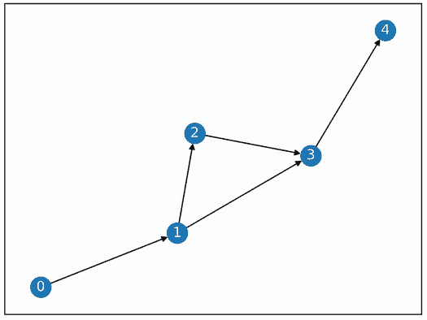

图 3.2 一个有向图

**多图**是一种可能连接相同顶点对的多条边的图。这些边称为**平行边**。多图可以用来表示节点之间的复杂关系，例如交通路由中两个位置之间的多条并行道路、资源分配问题中的多个容量和需求，以及社交网络中个人之间的多个关系，仅举几例。不幸的是，NetworkX 在可视化具有平行边的多图方面并不特别擅长。以下列表展示了如何结合使用 NetworkX 和 Matplotlib 库创建多图。

列表 3.3 使用 NetworkX 创建多图

```py
import networkx as nx
import matplotlib.pyplot as plt

graph = nx.MultiGraph()
nodes = list(range(5))
edges = [(0,1),(0,1),(4,3),(1,2), (1,3), (2,3),(3,4),(0,1)]
graph.add_nodes_from(nodes)
graph.add_edges_from(edges)

pos = nx.kamada_kawai_layout(graph)                                   ①
ax = plt.gca()     

for e in graph.edges:                                                 ②
     ax.annotate("",xy=pos[e[0]], xycoords='data', xytext=pos[e[1]],  ②
          ➥textcoords='data', arrowprops=dict(arrowstyle="-",        ②
          ➥connectionstyle=f"arc3, rad={0.3*e[2]}"),zorder=1)        ②

nx.draw_networkx_nodes(graph, pos)                                    ③
nx.draw_networkx_labels(graph,pos, font_color='w')                    ③

plt.show()
```

① 使用 Kamada-Kawai 路径长度成本函数生成节点位置。

② 逐个绘制每条边，根据其索引（即节点 0 和 1 之间的第二条边）修改边的曲率。

③ 绘制节点和节点标签。

值得注意的是，`kamada_kawai_layout`试图在空间中定位节点，使得它们之间的几何（欧几里得）距离尽可能接近它们之间的图论（路径）距离。图 3.3 展示了由该代码生成的多图示例。

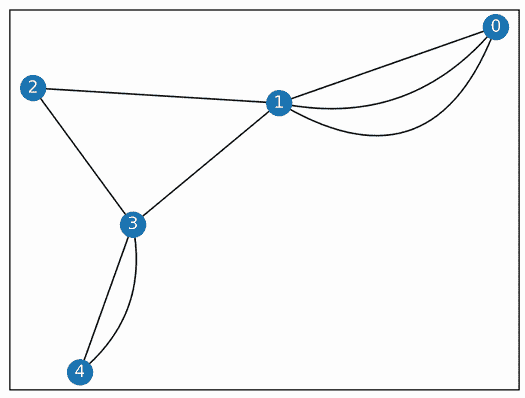

图 3.3 多图示例。注意连接节点 0 和 1 的三条平行边，以及连接节点 3 和 4 的两条边。

如其名所示，一个**无环图**是一个没有环的图。**树**作为图的特例，是一个没有环或自环的连通图。在图论中，一个连通图是一种图中每对顶点之间都存在路径的图。**环**，也称为**自环**或**回路**，是图中连接一个顶点（或节点）到自身的边。在任务调度中，无环图可以用来表示任务之间的关系，其中每个节点代表一个任务，每条有向边代表一个优先约束。这种约束意味着表示终点节点的任务不能开始，直到表示起点节点的任务完成。我们将在第六章中以装配线平衡问题作为调度问题的例子进行讨论。

以下列表展示了如何使用 NetworkX 创建和验证无环图。图 3.4 展示了无环图的一个示例。

列表 3.4 使用 NetworkX 创建无环图

```py
import networkx as nx
import matplotlib.pyplot as plt

graph = nx.DiGraph()
nodes = list(range(5))
edges = [(0,1), (0,2),(4,1),(1,2),(2,3)]
graph.add_nodes_from(nodes)
graph.add_edges_from(edges)

nx.draw_networkx(graph, nx.kamada_kawai_layout(graph), with_labels=True,
➥ font_color='w')
plt.show()

nx.is_directed_acyclic_graph(graph)    ①
```

① 检查图是否无环。


图 3.4 无环图——没有路径会回到任何起始节点。

*超图*是图的推广，其中推广的边（称为*超边*）可以连接任意数量的节点。超图用于表示复杂网络，因为它们可以捕捉更高阶的多对多关系。它们被用于社交媒体、信息系统、计算几何、计算病理学和神经科学等领域。例如，一个在项目上工作的团队可以用超图来表示。每个人由一个节点表示，项目由一个超边表示。超边连接所有参与项目的人，无论涉及多少人。超边还可以包含其他属性，如项目的名称、开始和结束日期、预算等。

下面的列表展示了如何使用 HyperNetX（HNX）来创建超图。HNX 是一个 Python 库，它使我们能够将复杂网络中发现的实体和关系建模为超图。图 3.5 展示了超图的一个示例。

列表 3.5 使用 HyperNetX 创建超图

```py
import hypernetx as hnx

data = {
     0: ("A","B","G"),
     1: ("A","C","D","E","F"),
     2: ("B","F"),
     3: ("A","B","D","E","F","G")
}                            ①
H = hnx.Hypergraph(data)     ②
hnx.draw(H)                  ③
```

① 超图的数据以超边名称/超边节点组的键值对形式提供。

② 为提供的数据创建超图。

③ 可视化超图。


图 3.5 超图的示例。超边可以连接超过两个节点，例如超边 0，它连接节点 A、B 和 G。

图也可以是有权或无权的。在*加权图*中，每个边都分配一个权重或值。例如，在道路网络的情况下，边可以有代表穿越道路成本的权重。这个权重可以代表距离、时间或任何其他度量。在电信网络中，权重可能代表使用该边的成本或通信设备之间连接的强度。

列表 3.6 展示了如何创建和可视化电信设备之间的加权图。在这个例子中，权重代表设备之间连接的速度，单位为 Mbps。运行此代码生成了图 3.6 所示的加权图。

列表 3.6 使用 NetworkX 创建加权图

```py
import networkx as nx
import matplotlib.pyplot as plt

G = nx.Graph()                                              ①

G.add_node("Device1", pos=(0,0))                            ②
G.add_node("Device2", pos=(0,2))                            ②
G.add_node("Device3", pos=(2,0))                            ②
G.add_node("Device4", pos=(2,2)) 

G.add_weighted_edges_from([("Device1", "Device2", 45.69),
                           ("Device1", "Device3", 56.34),
                           ("Device2", "Device4", 18.5)])   ③

pos = nx.get_node_attributes(G, 'pos')                      ④
nx.draw_networkx(G, pos, with_labels=True)                  ⑤
nx.draw_networkx_edge_labels(G, pos,                        ⑤
➥edge_labels={(u, v): d['weight'] for                      ⑤
➥u, v, d in G.edges(data=True)})                           ⑤
plt.show() 
```

① 创建一个空的加权图。

② 向图中添加节点（代表设备）。

③ 向图中添加加权边（代表连接）。

④ 从图中获取节点位置属性。

⑤ 绘制图。


图 3.6 加权图的示例

图无处不在。搜索引擎如谷歌将互联网视为一个巨大的图，其中每个网页都是一个节点，如果从一个页面有链接指向另一个页面，则两个页面通过边连接。社交媒体平台如 Facebook 将每个用户资料视为社交图上的一个节点，如果两个节点互为好友或存在社交联系，则称它们是连接的。在像 X（以前是 Twitter）这样的平台上“关注”用户的概念可以通过一个有向边表示，其中用户*A*可以关注用户*B*，但反之不一定成立。表 3.1 显示了不同社交媒体平台上节点和边的含义。

表 3.1 社交媒体背景下的图示例

| 社交媒体平台 | 节点 | 边 | 边的类型 |
| --- | --- | --- | --- |
| Facebook | 用户、群组、帖子以及活动 | 友谊、群组成员、消息、发帖以及帖子上的反应 | 无向：点赞、评论或反应；有向：好友请求 |
| X（以前是 Twitter） | 用户、群组、未注册人员和帖子 | 关注、群组成员、消息、发帖以及帖子上的反应 | 无向：提及或转发；有向：关注关系（当你关注一个人时，他们不会自动回关你） |
| 领英 | 用户、群组、未注册人员、帖子、技能和职位 | 联系、群组成员、发帖、帖子上的反应、消息、推荐、邀请、推荐职位 | 无向：推荐或推荐；有向：一个联系 |
| Instagram | 用户、评论、发布帖子的容器、标签、媒体（例如，照片、视频、故事或专辑）以及页面（Facebook 页面） | 用户之间的关系，如关注、点赞和评论 | 无向：点赞或评论；有向：关注关系 |
| TikTok | 用户、视频、标签、位置和关键词 | 用户之间的关系，如关注、点赞和评论 | 无向：点赞或评论；有向：关注关系 |

在道路网络图中，节点代表地标，如交叉口和兴趣点（POI），边代表道路。在这样的图中，大多数边都是有向的，这意味着它们有特定的方向，并且可能包含额外的信息，如长度、速度限制、容量等。每条边是两个节点之间的两端点连接，其中边的方向代表交通流的方向。*路线*是一系列连接起点节点和终点节点的边。

OSMnx 是一个 Python 库，旨在简化从 OpenStreetMap (OSM; openstreetmap.org) 获取和操作数据。OSM 是一个全球性的众包地理数据库（有关如何从开放地理空间数据源获取数据的更多信息，请参阅附录 B）。OSMnx 允许您从 OSM 下载过滤后的数据，并以 NetworkX 图数据结构返回网络。它还可以将地点的文本描述符转换为 NetworkX 图（有关图和映射库的更多信息，请参阅附录 A）。以下列表以多伦多大学为例。

列表 3.7 多伦多大学示例

```py
import osmnx as ox
import matplotlib.pyplot as plt

place_name = "University of Toronto"     

graph = ox.graph_from_address(place_name)   ①
ox.plot_graph(graph,figsize=(10,10))
```

① graph_from_address 也可以接受城市名称和邮寄地址作为输入。

图 3.7 显示了多伦多大学圣乔治校园周边的 OSM 地图。图中显示了多伦多市中心校园周边的道路网络节点和边。

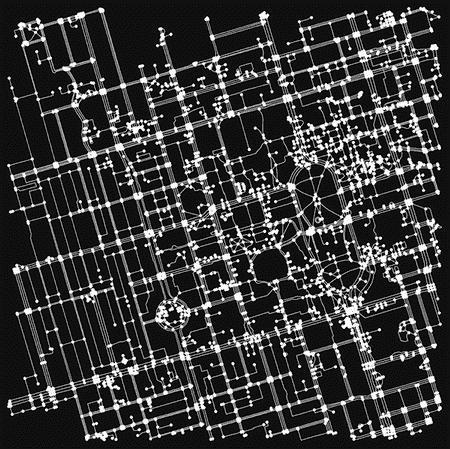

图 3.7 多伦多大学圣乔治校园

虽然地图可能看起来在视觉上很有趣，但它缺乏周围地理特征的上下文。让我们使用 folium 库（请参阅附录 A）创建一个带有街道名称、社区名称甚至建筑足迹的基础层地图。

```py
graph = ox.graph_from_address(place_name)
ox.folium.plot_graph_folium(graph)
```

图 3.8 显示了圣乔治校园周边的道路网络。

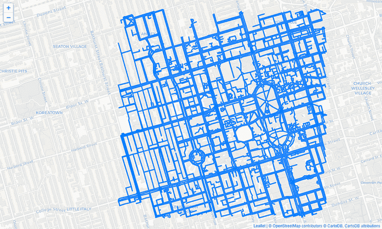

图 3.8 显示了多伦多大学圣乔治校园周边的道路网络。

假设您想在这所校园内从一个地点到另一个地点。例如，想象您从多伦多皇后公园附近的国王爱德华七世骑马雕像出发，需要穿越校园去巴嫩信息技术中心参加讲座。在本章的后面部分，您将看到如何计算这两个点之间的最短路径。

现在，让我们仅使用 folium 库将这些两个地点绘制在地图上。图 3.9 显示了 folium 地图和标记。

列表 3.8 使用 folium 绘图

```py
import folium

center=(43.662643, -79.395689)                                           ①
source_point = (43.664527, -79.392442)                                   ②
destination_point = (43.659659, -79.397669)                              ③

m = folium.Map(location=center, zoom_start=15)                           ④
folium.Marker(location=source_point,icon=folium.                         ⑤
➥Icon(color='red',icon='camera', prefix='fa')).add_to(m)                ⑤
folium.Marker(location=center,icon=folium.Icon(color='blue',             ⑤
➥icon='graduation-cap', prefix='fa')).add_to(m)                         ⑤
folium.Marker(location=destination_point,icon=folium.Icon(color='green', ⑤
➥icon='university', prefix='fa')).add_to(m)                             ⑤
```

① 多伦多大学的 GPS 坐标（纬度和经度）

② 骑马雕像的 GPS 坐标作为源点

③ 巴嫩信息技术中心的 GPS 坐标作为目的地

④ 创建以指定点为中心的地图。

⑤ 添加带有图标的标记。

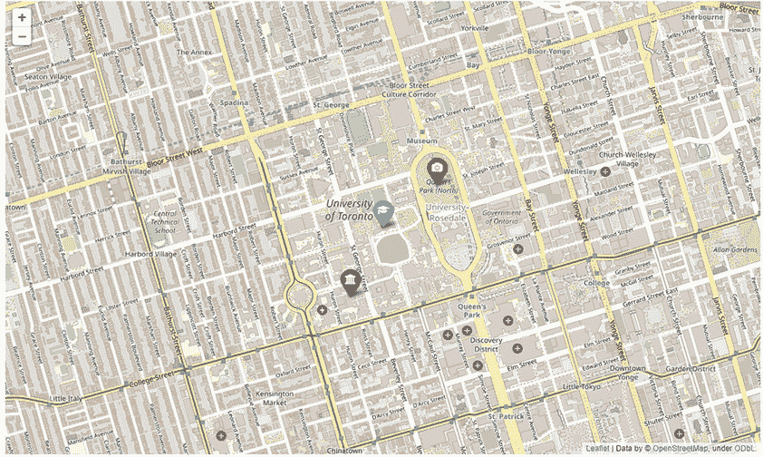

图 3.9 使用 folium 标记可视化兴趣点

代码的输出是交互式的，允许进行缩放、平移甚至图层过滤（当启用时）。附录 A 提供了有关 Python 中地图可视化库的更多详细信息。

## 3.2 图搜索

正如我在第二章中提到的，搜索算法可以广泛分为确定性和随机性算法。在*确定性搜索*中，搜索算法遵循严格的程序，其路径以及设计变量和函数的值是可重复的。无论您今天运行程序还是十年后运行，只要起始点相同，算法都会遵循相同的路径。另一方面，在*随机搜索*中，算法总是存在一些随机性，解决方案并不完全可重复。每次运行算法时，您可能会得到略微不同的结果。

根据搜索空间或领域知识（例如，从当前状态到目标的状态距离）的可用性，确定性搜索算法可以广泛分为*盲目*（或*无信息*）搜索和*信息*搜索，如图 3.10 所示。其中一些算法，如 Kruskal 的最小生成树（MST）算法，将在下一章中介绍。本章重点介绍盲目搜索算法。盲目搜索是一种不需要关于搜索空间信息的搜索方法。

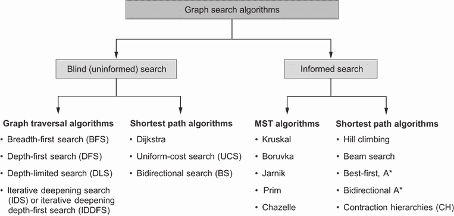

图 3.10 图搜索方法

盲目搜索可能在发现第一个解决方案时结束，这取决于算法的终止条件。然而，搜索空间可能包含许多有效但非最优的解决方案，因此盲目搜索可能会返回一个满足所有要求但以非最优方式实现的解决方案。可以通过运行一个盲搜索，在穷举搜索或暴力搜索策略之后找到所有可行的解决方案，然后进行比较以选择最佳方案。这类似于应用大英博物馆算法，该算法通过逐一检查所有可能性来找到解决方案。鉴于盲目搜索对待图或树中的每个节点都是平等的，这种搜索方法通常被称为*均匀搜索*。

盲目搜索算法的例子包括但不限于以下内容：

+   *广度优先搜索*（BFS）是一种图遍历算法，通过层次结构构建搜索树。

+   *深度优先搜索*（DFS）是一种图遍历算法，首先探索通过根节点的一个相邻节点，然后是下一个相邻节点，直到找到解决方案或达到死胡同。

+   *深度限制搜索*（DLS）是一种具有预定深度限制的 DFS。

+   *迭代加深搜索*（IDS），或*迭代加深深度优先搜索*（IDDFS），结合了 DFS 的空间效率和 BFS 的快速搜索，通过增加深度限制直到达到目标。

+   *Dijkstra 算法*用于解决具有非负边成本的加权图的单源最短路径问题。

+   *一致代价*搜索（UCS）是迪杰斯特拉算法的一种变体，它使用最低的累积代价来找到从源到目的地的路径。如果所有边的路径代价相同，则它与 BFS 算法等价。

+   *双向*搜索（BS）是正向搜索和反向搜索的结合。它同时从起点向前搜索，从目标向后搜索。

以下章节讨论图遍历算法和最短路径算法，重点关注 BFS、DFS、迪杰斯特拉算法、UCS 和 BS 作为盲目搜索方法的例子。

## 3.3 图遍历算法

图遍历是通过访问节点并遵循特定的、明确定义规则来探索树或图结构的过程。这类图搜索算法仅寻求找到两个节点之间的路径，而不优化最终路径的长度。

### 3.3.1 广度优先搜索

广度优先搜索（BFS）是一种算法，其遍历从指定的节点（源或起始节点）开始，逐层遍历图，从而探索当前节点的所有相邻节点（与当前节点直接相连的节点）。然后，如果没有找到结果，算法将搜索下一级相邻节点。如果存在解决方案，此算法可以找到解决方案，假设任何节点总是有有限数量的后继者或分支。算法 3.1 显示了 BFS 步骤。

算法 3.1 广度优先搜索（BFS）

```py
Inputs: Source node, Destination node
Output: Route from source to destination

Initialize *queue* ← a FIFO initialized with source node
Initialize *explored* ← empty
Initialize *found* ← False

While *queue* is not empty and *found* is False do
    Set *node* ← *queue.*dequeue()
    Add *node* to *explored*
    For *child* in *node.*expand() do
        If *child* is not in *explored* and *child* is not in *queue* then
            If *child* is *destination* then
                Update *route* ← *child* route()
                Update *found* ← True
            Add *child* to *queue*
Return *route*
```

BFS 使用队列作为数据结构来维护要探索的状态。队列是一种先进先出（FIFO）数据结构，其中在队列上等待时间最长的节点是下一个要扩展的节点。BFS 从队列中删除一个状态，然后将其后继者重新入队到队列中。

让我们考虑 8 数码问题（有时称为*滑动块问题*或*拼图问题*）。这个拼图由一个分成 3×3 网格的区域组成。瓷砖编号为 1 到 8，除了一个空（或空白）瓷砖。空白瓷砖可以通过与其直接相邻的任何瓷砖交换位置来移动（上、下、左、右）。拼图的目的是将瓷砖排列成顺序。拼图的变体允许空白瓷砖最终位于第一个或最后一个位置。这个问题是一个具有以下明确定义组件的良好结构问题（WSP）的例子：

+   状态—空白瓷砖的位置和八个瓷砖的位置

+   操作符（后继者）—空白瓷砖向左、右、上、下移动

+   目标—匹配给定的目标状态

+   解决方案/路径—通过状态空间的状态序列

+   停止标准—有序拼图（达到目标状态）

+   评估标准—步数或路径成本（路径长度）

图 3.11 展示了使用 BFS 解决 8 个拼图问题的步骤和搜索树遍历顺序。在这个图中，状态代表 8 个拼图问题的物理配置，搜索树中的每个节点都是一个包含其父节点、子节点、深度和从初始状态到该节点的路径成本的数据结构。第 1 层节点通过分别向左、上、右移动空白标题从左到右生成。向前移动，第 2 层节点通过扩展第 1 层中先前生成的节点生成，避免先前探索的节点。我们重复执行此程序以遍历所有可能的节点或直到达到目标（阴影网格）。达到目标所需的步数主要取决于 8 个拼图板的初始状态。突出显示的数字显示了遍历的顺序。如您所见，BFS 在垂直之前先水平前进。


图 3.11 使用 BFS 解决 8 个拼图问题

列表 3.9 使用了为本书开发的通用 BFS 算法，该算法可在 Optimization Algorithm Tools (optalgotools) Python 包中找到（安装说明见附录 A）。该算法以起始状态和目标状态作为输入，并返回一个`solution`对象。这个`solution`对象包含实际结果和一些性能指标，例如处理时间、最大空间使用量和已探索的解决方案状态数量。`State`类和`visualize`函数定义在书中 GitHub 仓库中可用的完整列表中。`State`类帮助管理一些数据结构和实用函数，并允许我们以后使用不同的算法重用此问题的结构。

列表 3.9 使用 BFS 解决 8 个拼图问题

```py
#!pip install optalgotools
from optalgotools.algorithms.graph_search import BFS    ①

init_state = [[1,4,2], [3,7,5], [6,0,8]]

goal_state = [[0,1,2], [3,4,5], [6,7,8]]

init_state = State(init_state)                          ②
goal_state = State(goal_state)   

if not init_state.is_solvable():                        ③
     print("This puzzle is not solvable.")
else:

    solution = BFS(init_state, goal_state)
    print(f"Process time: {solution.time} s")
    print(f"Space required: {solution.space} bytes")
    print(f"Explored states: {solution.explored}")
    visualize(solution.result)                          ④
```

① 从名为 optalgotools 的库中导入 BFS 算法。

② 请参阅完整列表中的 State 类。

③ 有些拼图板是无法解决的

④ 请参阅完整列表中的可视化函数。

这是一个示例解决方案，基于前面的输入：

```py
Process time: 0.015625 s
Space required: 624 bytes
Explored states: 7
```

图 3.12 显示了 BFS 算法后的状态变化。


图 3.12 使用 Python 逐步 BFS 解决方案。BFS 寻找解决方案但不考虑最优性。

要真正理解 BFS 是如何工作的，让我们看看简单路径规划问题中涉及的步骤。这个问题在障碍物中找到一个移动机器人或自主车辆从起始位置到指定目的地的无碰撞路径。

1. 将源节点添加到队列中（图 3.13）。

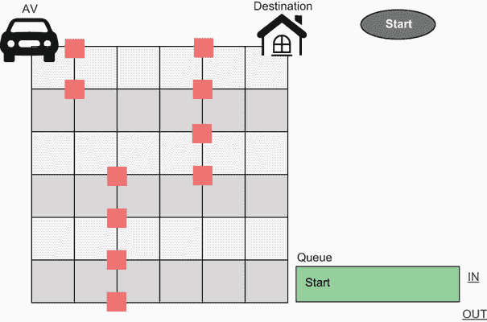

图 3.13 使用 BFS 解决路径规划问题——步骤 1

2. 机器人只能移动到南（S）节点，因为东（E）和东南（SE）节点被阻挡（图 3.14）。

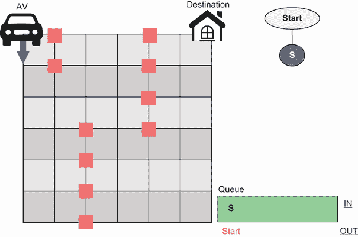

图 3.14 使用 BFS 解决路径规划问题——步骤 2

3. 取出 S（先进先出），并探索其相邻节点，S 和 SE，其中 E 是障碍节点（图 3.15）。

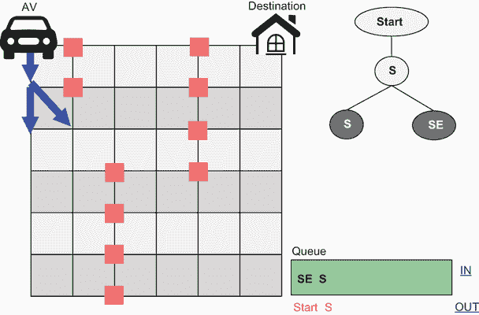

图 3.15 使用 BFS 解决路径规划问题——第 3 步

4. 取出 S（先进先出），并探索其相邻节点，S 和 SE（图 3.16）。

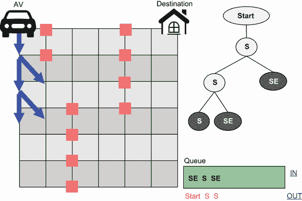

图 3.16 使用 BFS 解决路径规划问题——第 4 步

5. 取出 SE（先进先出），并探索其相邻节点，E 和 NE（图 3.17）。

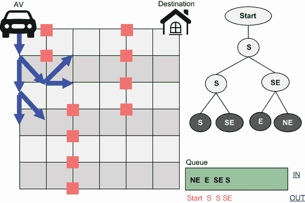

图 3.17 使用 BFS 解决路径规划问题——第 5 步

6. 先进先出队列继续，直到找到目标节点（图 3.18）。为了简单起见，假设机器人想要到达图 3.18 中所示的节点 E，我们可以沿着树向上追踪以找到从源节点到目标节点的路径，这将是从 Start-S-SE-E。


图 3.18 使用 BFS 解决路径规划问题——中间目标节点 E 和最终目的地的最终路线

在广度优先搜索（BFS）中，每个生成的节点都必须保留在内存中。生成的节点数最多为 *O*(*b^d*)，其中 *b* 代表每个节点的最大分支因子（即节点拥有的子节点数），*d* 是达到目标所需的扩展深度。在先前的例子中，以 E 作为目标节点（*b*=2，*d*=3），遍历的总节点数是 2³=8，包括起始节点。

除了算法解决当前问题的能力外，算法效率还基于运行时间（时间复杂度）、内存需求以及在最坏情况下解决问题所需的原始操作数。这些原始操作包括但不限于表达式评估、变量值赋值、数组索引和方法或函数调用。

大 *O* 表示法

大 *O* 表示法描述了算法的性能或复杂度，通常是在最坏情况下。大 *O* 表示法帮助我们回答问题：“算法能否扩展？”

要获得函数 f(*x*) 的大 *O* 表示法，如果 f(*x*) 是几个项的和，则保留增长速度最快的那个项，其余的项被省略。此外，如果 f(*x*) 是几个因子的乘积，则省略所有常数（乘积中不依赖于 *x* 的项）。

例如，让我们看看第一章中提出的票价问题：*f*(*x*) = –20*x*² + 6200*x* – 350000。假设*x*是一个大小为*n*的向量，代表*n*个不同的票价。这个函数是三个项的和，其中增长最快的项是*x*的指数最大的项，即 –20*x*²。现在我们可以应用第二个规则：–20*x*²是 –20 和 *x*² 的乘积，其中第一个因子不依赖于*x*。去掉这个因子后，得到简化的形式 *x*²。因此，我们说 *f*(*x*) 是 *n*² 的 big *O*，其中 *n* 是决策变量 *x* 的大小。从数学上我们可以写成 *f*(*x*) ∈ *O*(*n*²*)（发音为“order *n* squared”或“*O* of *n* squared”），这代表二次复杂度（即，增长速率与票价向量大小的平方成正比）。

表 3.2 展示了算法复杂度的示例，图 3.19 展示了大 *O* 符号的示例。

表 3.2 算法复杂度

| 符号 | 名称 | 有效性 | 描述 | 示例 |
| --- | --- | --- | --- | --- |
| *O*(1) | 常数 | 极佳 | 运行时间不依赖于输入大小。随着输入大小的增长，操作次数不受影响。 | 变量声明访问数组元素从哈希表查找中检索信息从队列中插入和删除在栈上推和弹 |
| *O*(log *n*) | 对数 | 高 | 随着输入大小的增长，操作次数增长非常缓慢。每当*n*加倍或三倍等，运行时间增加一个常数。 | 二分查找 |
| O(*n^c*),0 < *c* < 1 | 分数幂或亚线性 | 高 | 随着输入大小的增长，操作次数在乘法中复制。 | 测试图连通性近似图中连通组件的数量近似最小生成树（MST）的权重 |
| *O*(*n*) | 线性 | 中等 | 随着输入大小的增长，操作次数线性增加。每当*n*加倍，运行时间也加倍。 | 打印数组元素简单搜索 Kadane 算法 |
| *O*(*n* log *n*) = *O*(log *n*!) | 线性对数，对数线性或准线性 | 中等 | 随着输入大小的增长，操作次数比线性增长略快。 | 归并排序堆排序 Tim 排序 |
| *O*(*n^c*),*c* > 1 | 多项式或代数 | 低 | 随着输入大小的增长，操作次数随指数增加而增加。 | 最小生成树（MST）矩阵行列式 |
| *O*(*n*²) | 二次 | 低 | 当*n*加倍时，运行时间增加四倍。二次函数仅适用于小问题。 | 选择排序冒泡排序插入排序 |
| *O*(*n*³) | 立方 | 低 | 当*n*加倍时，运行时间增加八倍。立方函数仅适用于小问题。 | 矩阵乘法 |
| *O*(*c^n*),*c* > 1 | 指数 | 非常低 | 随着输入大小的增长，操作次数呈指数增长。它很慢，通常不适用于实际应用。 | 力集汉诺塔密码破解暴力搜索 |
| *O*(*n*!) | 阶乘 | 非常低 | 非常慢，因为需要检查所有可能的输入数据排列。阶乘算法甚至比指数函数还要差。 | 旅行商问题字符串排列 |


图 3.19 大*O*表示法的示例

假设使用每秒一百万次操作的计算机处理大小为*n* = 20,000 的问题。表 3.3 显示了根据大*O*表示法显示的算法运行时间。

表 3.3 算法复杂度和运行时间

| 大*O* | 运行时间 |
| --- | --- |
| --- | --- |
| *O*(1) | 10^(-6)秒 |
| *O*(log *n*) | 14 × 10^(-6)秒 |
| *O*(*n*) | 0.02 秒 |
| *O*(*n* log *n*) = *O*(log *n*!) | 0.028 秒 |
| *O*(*n*²) | 6.66 分钟 |
| *O*(*n*³) | 92.6 天 |
| *O*(*c^n*), *c* = 2 | 1262.137 × 10⁶⁰¹⁵年 |
| *O*(*n*!) | 5768.665 × 10⁷⁷³³¹年（这比宇宙的年龄大得多，宇宙年龄约为 137 亿年） |

对于一个目标为深度的大工作空间，节点数量可能会呈指数增长，并需要大量的内存需求。在时间复杂度方面，对于图 G = (V, E)，BFS 的运行时间为*O*(|*V*| + |*E*|)，因为每个顶点最多入队一次，每条边要么检查一次（对于有向图），要么最多检查两次（对于无向图）。BFS 的时间和空间复杂度也以分支因子*b*和最浅目标深度*d*来定义。时间复杂度为*O*(*b^d*)，空间复杂度也是*O*(*b^d*)。

考虑一个具有常数分支因子*b* = 5，节点大小为 1KB，每秒扫描 1000 个节点的图。节点总数*N*由以下方程给出：

|


| 3.1 |
| --- |

表 3.4 显示了使用 BFS 遍历此图的时间和内存需求。

表 3.4 BFS 时间和空间复杂度

| 深度*d* | 节点*N* | 时间 | 内存 |
| --- | --- | --- | --- |
| 2 | 31 | 31 毫秒 | 31KB |
| 4 | 781 | 0.781 秒 | 0.78MB |
| 6 | 19,531 | 5.43 小时 | 19.5MB |
| 8 | 488,281 | 56.5 天 | 488MB |
| 10 | 12,207,031 | 3.87 年 | 12.2GB |
| 12 | 305,175,781 | 96.77 年 | 305GB |
| 14 | 7,629,394,531 | 2,419.26 年 | 7.63TB |

接下来，我们将查看 BFS 算法的对应算法，该算法首先深度搜索图，而不是广度搜索。

### 3.3.2 深度优先搜索

深度优先搜索（DFS）是一种递归算法，它使用回溯的思想。它涉及通过首先尽可能深入图中的所有节点来全面搜索所有节点。然后，当它达到没有结果的最后一层（即达到死胡同时），它会回溯一层并继续搜索。在 DFS 中，最深的节点首先扩展，深度相同的节点任意排序。算法 3.2 显示了 DFS 步骤。

算法 3.2 深度优先搜索（DFS）

```py
Inputs: Source node, Destination node
Output: Route from source to destination

Initialize *Stack* ← a LIFO initialized with *source*node
Initialize *Explored* ← empty
Initialize *Found* ← False

While *stack* is not empty and *found* is False do
    Set *node* ← *stack*.pop()
    Add *node* to *explored*
    For *child* in *node*.expand() do
        If *child* is not in *explored* and *child* is not in *stack* then
            If *child* is *destination* then
               Update *route* ← *child*.route()
               Update *found* ← True
            Add *child* to *stack*
Return *route*
```

如您可能已经注意到的，DFS 和 BFS 之间的唯一区别在于数据结构的工作方式。DFS 不是按层向下工作（FIFO），而是钻到最底层，然后使用后进先出（LIFO）的数据结构（称为栈）返回到起始节点。栈包含已发现节点的列表。最近发现的节点被推到 LIFO 栈的顶部。随后，下一个要扩展的节点从栈顶弹出，然后将其所有后继节点添加到栈中。

图 3.20 显示了基于移动空白瓷砖的我们之前看到的 8 个拼图问题的 DFS 解决方案。如您所见，当算法达到死胡同或终端节点（如节点 7）时，它会回到最后一个决策点（节点 3）并继续另一个替代方案（节点 8 等）。在这个例子中，深度界限设置为 5，以限制节点扩展。这个深度界限使得节点 6、7、10、11、13、14、16、17、22、23、26 和 27 成为搜索树中的终端节点（即它们没有后继节点）。

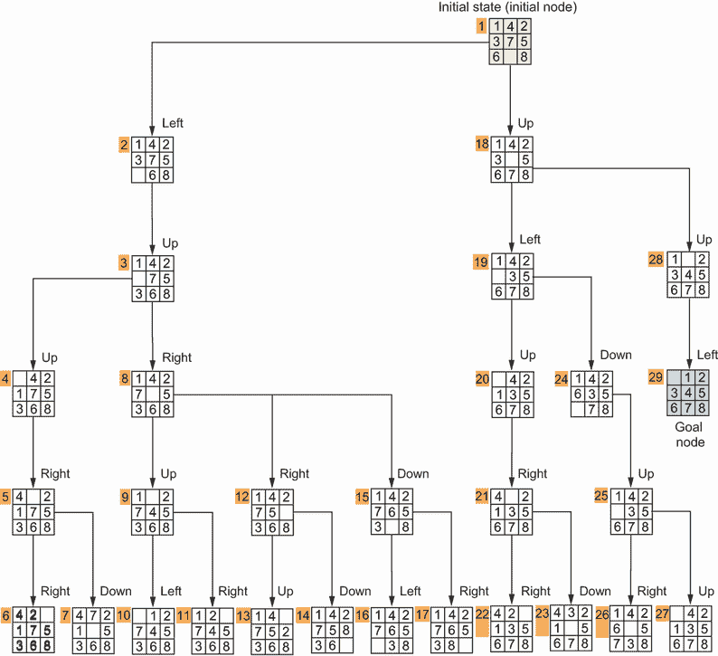

图 3.20 使用 DFS 解决 8 个拼图问题

如您在列表 3.10 中看到的，我们只需要更改代码中的算法以使用 DFS。我还省略了解决方案的可视化，原因您很快就会看到。《State》类在书中 GitHub 仓库的完整列表中定义。

列表 3.10 使用 DFS 解决 8 个拼图问题

```py
from optalgotools.algorithms.graph_search import DFS

init_state = [[1,4,2],[3,7,5],[6,0,8]]
goal_state = [[0,1,2],[3,4,5],[6,7,8]]

init_state = State(init_state)
goal_state = State(goal_state)

if not init_state.is_solvable():                           ①
     print("This puzzle is not solvable.")
else:
     solution = DFS(init_state, goal_state)                ②
     print(f"Process time: {solution.time} s")
     print(f"Space required: {solution.space} bytes")
     print(f"Explored states: {solution.explored}")
     print(f"Number of steps: {len(solution.result)}")
```

① 一些谜题并不

② DFS 的输入与 BFS 相同。

这里是使用前面输入运行此代码的输出：

```py
Process time: 0.5247 s
Space required: 624 bytes
Explored states: 29
Number of steps: 30
```

如您所见，DFS 在处理非常深的图时并不出色，解决方案可能更接近顶部。您也可以看到为什么我选择不可视化最终解决方案：与 BFS 相比，解决方案中的步骤要多得多！因为此问题的解决方案更接近根节点，所以 DFS 生成的解决方案比 BFS 要复杂得多（30 步）。

回顾路径规划问题，DFS 可以用来从起点生成到目的地的无障碍路径，如下所示：

1. 将源节点添加到栈中（图 3.21）。


图 3.21 使用 DFS 解决路径规划问题——步骤 1

2. 探索 S 节点，因为 E 和 SE 节点被阻挡（图 3.22）。


图 3.22 使用 DFS 解决路径规划问题——步骤 2

3. 取出 S（后进先出），并探索其相邻节点 S 和 SE，因为 E 是一个阻塞节点（图 3.23）。


图 3.23 使用 DFS 解决路径规划问题——步骤 3

4. 取出 SE（后进先出），并探索其相邻节点 SW、S、E 和 NE（图 3.24）。


图 3.24 使用 DFS 解决路径规划问题——步骤 4

5. 下一个要扩展的节点将是 NE，其后续节点将被添加到栈中。后进先出栈将继续，直到找到目标节点。一旦找到目标，就可以通过树回溯以获得车辆应遵循的路径（图 3.25）。


图 3.25 使用 DFS 解决路径规划问题——步骤 5

DFS 通常比 BFS 需要的内存少得多。这主要是因为 DFS 并不总是在每个深度展开每个节点。然而，在具有无限深度的搜索树中，DFS 可能会无限期地沿着一个无界分支向下继续，即使目标不在该分支上。

处理这个问题的方法之一是使用*约束深度优先搜索*，搜索在达到一定深度后停止。DFS 的时间复杂度为*O*(*b^d*)，其中*b*是分支因子，*d*是搜索树的最大深度。如果*d*远大于*b*，这将是可怕的，但如果解决方案位于树的深处，它可能比 BFS 快得多。DFS 的空间复杂度为*O*(*bd*)，这是线性空间！这种空间复杂度表示在内存中存储的最大节点数。

表 3.5 总结了 BFS 和 DFS 之间的差异。

表 3.5 BFS 与 DFS 的比较

|  | 广度优先搜索（BFS） | 深度优先搜索（DFS） |
| --- | --- | --- |
| 空间复杂度 | 更昂贵 | 更便宜。只需要*O*(*d*)空间，无论每个节点的子节点数量是多少。 |
| 时间复杂度 | 更高效。在访问较高层（远离根）的顶点之前，先访问较低层（靠近根）的顶点。 | 较低效 |
| 何时更受欢迎 |

+   如果树非常深

+   如果分支因子不过度

+   如果解决方案出现在相对较浅的水平（即解决方案接近树的起点）

+   示例：搜索英国王室家族树中很久以前去世的人，因为他们会接近树的顶部（例如，乔治六世国王）。

|

+   如果图或树非常宽，有太多的相邻节点

+   如果没有路径过于深入

+   如果解决方案出现在树的深处（即目标远离源点）

+   示例：搜索英国王室家族树中仍健在的人，因为他们会在树的底部附近（例如，威廉王子）。

|

在应用中，如果图中边的权重都相等（例如，所有长度为 1），则 BFS 和 DFS 算法在时间上优于 Dijkstra 等最短路径算法。最短路径算法将在下一节中解释。

## 3.4 最短路径算法

假设你正在寻找从家到工作的最快路线。像 BFS 和 DFS 这样的图遍历算法最终可能带你到达目的地，但它们肯定不会优化旅行距离。我们将讨论 Dijkstra 算法、一致代价搜索（UCS）和双向 Dijkstra 搜索，作为尝试在源节点和目标节点之间找到最短路径的盲目搜索算法的例子。

### 3.4.1 Dijkstra 搜索

Dijkstra 算法是一种图搜索算法，用于解决完全连接图的单源最短路径问题，具有非负边路径成本，生成最短路径树。Dijkstra 算法于 1959 年发表，并以荷兰计算机科学家 Edsger Dijkstra 的名字命名。该算法是其他几个常用图搜索算法的基础，这些算法通常用于解决流行导航应用中的路由问题，如图 3.26 所示。该算法遵循动态规划方法，将问题递归地分解为简单的子问题。Dijkstra 算法是无信息的，这意味着它不需要事先知道目标节点，也不使用启发式信息。

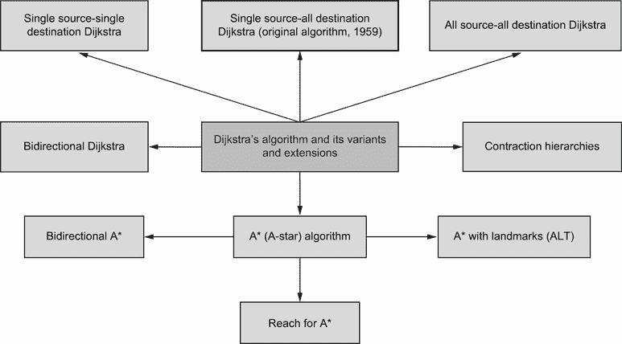

图 3.26 Dijkstra 算法及其变体和扩展示例

算法 3.3 展示了 Dijkstra 算法原始版本寻找图中已知单源节点到所有其他节点的最短路径的步骤。

算法 3.3 Dijkstra 算法

```py
Inputs: A graph with weighted edges and a source node
Output: Shortest path from the source to all other nodes in the graph

Initialize *shortest_dist* ← empty
Initialize *unrelaxed_nodes* ← empty
Initialize *seen* ← empty

For *node* in *graph*
    Set *shortest_dist[node]* = Infinity
    Add *node* to *unrelaxed_nodes*
    Set *shortest_dist[source]* ← 0

While *unrelaxed_nodes* is not empty do
    Set *node* ← *unrelaxed_nodes*.pop()
    Add *node* to *seen*
    For *child* in *node*.expand() do
        If *child* in *seen* then skip
        Update *distance* ← *shortest_dist[node]* + length of edge to *child*
        If *distance* < *shortest_dist[child]* then
           Update *shortest_dist[child]* ← *distance*
           Update *child.parent* ← node
Return *shortest_dist*
```

书中代码中提供的 Dijkstra 算法及其变体都进行了修改，要求指定目标节点。这提高了处理大型图（例如，道路网络）时的处理时间。

让我们看看 Dijkstra 算法是如何在图中找到任意两个节点之间的最短路径的。优先队列用于根据某种排序函数（在这种情况下，节点与源节点之间的最短距离）弹出队列中具有最高优先级的元素。

0. 初始列表，没有前驱节点：优先队列 = {}（图 3.27）。

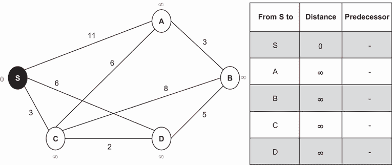

图 3.27 使用 Dijkstra 算法寻找最短路径——步骤 0

1. 源节点最近的节点是 S，因此将其添加到优先队列中。更新 A、C 和 D 的累积距离（即从源节点 S 到达节点的距离）和前驱节点。优先队列 = {S}（图 3.28）。

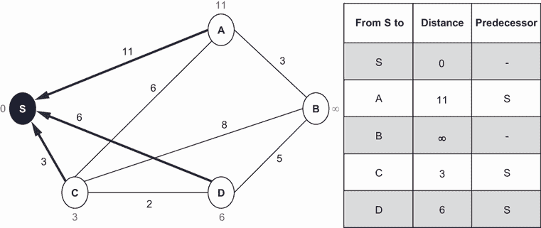

图 3.28 使用 Dijkstra 算法寻找最短路径——步骤 1

2. 下一个最近的节点是 C，因此将其添加到优先队列中。更新 A 和 D 的距离和前驱节点。优先队列 = {S, C}（图 3.29）。


图 3.29 使用迪杰斯特拉算法寻找最短路径——步骤 2

3. 下一个最近的节点是 D，因此将其添加到优先队列中。更新 B 的距离和前驱节点。优先队列 = {S, C, D}（图 3.30）。


图 3.30 使用迪杰斯特拉算法寻找最短路径——步骤 3

4. 次近的节点是 A，因此将其添加到优先队列中。优先队列 = {S, C, D, A}（图 3.31）。

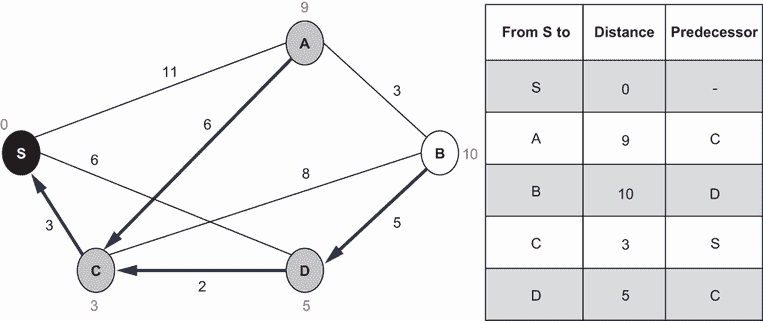

图 3.31 使用迪杰斯特拉算法寻找最短路径——步骤 4

5. 下一步是将剩余的节点 B 添加以完成搜索（图 3.32）。优先队列 = {S, C, D, A, B}。现在所有节点都已添加。


图 3.32 使用迪杰斯特拉算法寻找最短路径——步骤 5

搜索完成后，你可以选择目标节点并从表中找到最短路径。例如，如果目标节点是 A，则 S 和 A 之间的最短路径是 S-C-A，长度为 9。同样，如果目标节点是 B，则 S 和 B 之间的最短路径是 S-C-D-B，距离为 10。

注意，我们不能在我们的 8 数码问题中使用迪杰斯特拉搜索，因为迪杰斯特拉搜索需要事先了解整个问题空间。虽然该问题有有限数量的可能状态（正好是 9!/2），但该解决方案空间的规模使得迪杰斯特拉搜索不太可行。

### 3.4.2 均匀代价搜索（UCS）

均匀代价搜索（UCS）算法是一种盲目搜索算法，它使用最低的累积成本从起点找到到终点的路径。本质上，该算法通过成本（最小化问题中最低成本为最高优先级）或效用（最大化问题中最高效用为最高优先级）来组织要探索的节点。

随着节点从队列中弹出，我们将节点的子节点添加到队列中。如果一个子节点已经在优先队列中存在，则比较两个子节点的优先级，并接受最小化问题中的最低成本（最高优先级）。这确保了到达每个子节点的路径是可用的最短路径。我们还维护一个已访问列表，以便我们可以避免重新访问已经从队列中弹出的节点。当图中的所有边成本相等或相同的时候，UCS 的行为类似于 BFS。在这种情况下，UCS 将以 BFS 相同的顺序扩展节点——按层或广度优先。算法 3.4 展示了 UCS 算法的步骤。

算法 3.4 均匀代价搜索（UCS）

```py
Inputs: A graph with edges, a source node, a destination node
Output: Shortest path from source to destination in the graph

Initialize *priority_queue* ← *source*
Initialize *found* ← False
Initialize *seen* ← *source*

While *priority_queue* is not empty and *found* is False do
    Set *node* ← priority_queue.pop()
    Update *seen* ← *node*
    Update node_cost ← cumulative distance from source
    If *node* is *destination* then
        Update *route* ← *node*.route()
        Update *found* ← True
    For child in node.expand() do
        If child in priority_queue then
            If child.priority < priority_queue[child].priority then
               Set priority_queue[child].priority = child.priority
        Else
            Update priority_queue ← child
        Update priority_queue[child].priority ← node_cost
Return route
```

UCS 是 Dijkstra 算法的一个变体，对于大型图非常有用，因为它耗时较少，空间要求也较少。与 Dijkstra 算法在开始时将所有节点以无限代价添加到队列中不同，UCS 逐渐填充优先队列。例如，考虑在图中找到每对节点之间最短路径的问题。随着图的大小和复杂性的增长，很快就会明显看出 UCS 更有效率，因为它不需要事先知道整个图。表 3.6 显示了 Dijkstra 算法和 UCS 在不同大小图上的处理时间差异。这些数字是在没有多进程或多线程的情况下，在 3.60 GHz 的 Intel Core i9-9900K 上使用 Comparison.ipynb 中的代码收集的，该代码可在书籍的 GitHub 仓库中找到。

表 3.6 UCS 与 Dijkstra 算法比较

| 图大小 = | V | + | E | | Dijkstra 时间 | 统一代价搜索(UCS)时间 |
| --- | --- | --- |
| 108 | 0.25 s | 0.14 s |
| 628 | 84.61 s | 58.23 s |
| 1,514 | 2,082.97 s | 1,360.98 s |

注意，在我们的 8 数码问题上进行 UCS 搜索需要每个状态的距离属性（默认为 1），并且总体上生成相当不错的结果（大约使用 6.2 KB 的空间和探索了 789 个状态）。重要的是要注意，因为边的长度都相等，UCS 无法优先探索新节点。因此，解决方案失去了最短路径算法的优势，即优化更紧凑解决方案的能力。在下一章中，你将看到计算这些状态之间人工距离的方法，最终快速生成解决方案并最小化所需的步骤数。

### 3.4.3 双向 Dijkstra 搜索

双向搜索同时应用正向搜索和反向搜索。如图 3.33 所示，它从初始源状态 S→G 正向搜索，并从最终目标状态 G→S 反向搜索，直到它们相遇。

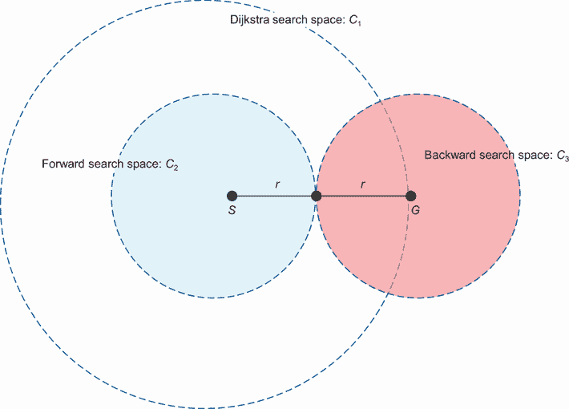

图 3.33 双向 Dijkstra 算法

如图 3.33 所示，Dijkstra 搜索空间为*C*[1] = 4πr²，双向 Dijkstra 搜索空间由*C*[2] + *C*[3] = 2πr²表示。这意味着我们减少了大约两倍的搜索空间。以下算法显示了双向 Dijkstra 算法的步骤。

算法 3.5 双向 Dijkstra 算法

```py
Inputs: A graph, a source node, a destination node
Output: Shortest path from source to destination in the graph

Initialize *frontier_f* ← initialized with source
Initialize *frontier_b* ← initialized with destination
Initialize *explored_f* ← empty
Initialize *explored_b* ← empty
Initialize *found* ← False
Initialize *collide* ← False
Initialize *altr_expand* ← False

While *frontier_f* is not empty and *frontier_b* is not empty and not *collide* and not *found* do
    If altr_expand then
        Set node ← frontier_f.pop()
        Add node to explored_f
        For child in node.expand() do
            If child in explored_f then continue
            If child is destination then
                Update route ← child.route()
                Update found ← True
            If child in explored_b then
                Update route ← child.route() + reverse(overlapped.route())
                Update collide ← True
            Add child to frontier_f
        Update altr_expand ← not altr_expand
    Else
        Update node ← frontier_b.pop()
        Add node to explored_b
        For child in node.expand() do
            If child in explored_b then continue
            If child is origin then
               Update route ← child.route()
               Update found ← True
            If child in explored_f then
               Update route ← reverse(child.route()) + overlapped.route()
               Update collide ← True
            Add child to frontier_b
        Update altr_expand ← not altr_expand
Return route
```

这种方法由于涉及的时间复杂度更高，因此更有效率。例如，具有常数分支因子*b*和深度*d*的 BFS 搜索的整体空间复杂度为*O*(b^d*)。然而，通过以只有一半深度(*d*/2)运行两个相反方向的 BFS 搜索，空间复杂度变为*O*(b^d^(1/2) + b^d^(1/2))，或者简单地 O(b^d^(1/2))，这显著降低了。

图 3.34 显示了在探索多伦多市 50,841 个节点时，Dijkstra 算法和双向 Dijkstra 算法之间的差异。


图 3.34 Dijkstra 算法与双向 Dijkstra 算法——从左向右的前向探索和从右向左的后向探索

## 3.5 将盲目搜索应用于路由问题

逻辑谜题游戏和简单的网格路由问题有助于理解算法的工作原理。然而，是时候看看一些使用这些算法的真实世界示例和结果了。例如，想象一下，当你正在多伦多的皇后公园参观爱德华七世骑马雕像时，你突然想起你有一个在多伦多大学的信息技术中心（Bahen Centre）的会议。我最初在讨论本章开头道路网络图时提出了这个问题。在考虑这个问题时，我们将做出以下假设：

+   由于你的手机电量耗尽，你无法打开导航应用或打电话求助。

+   你知道你的目的地在多伦多某个地方，但你不知道它相对于你的起始位置在哪里。（在后面的章节中，你将学习到知道目的地方向如何在极短的时间内生成近似最优解。）

+   一旦你开始使用一条规则来规划你的目的地，你就会坚持这条规则。

让我们看看我们如何可能使用 BFS、DFS、Dijkstra 算法、UCS 和双向 Dijkstra 算法来模拟我们的路径搜索技巧。这个示例的代码位于本书的 GitHub 仓库中（Comparison.ipynb）。图 3.35 至图 3.37 展示了这些盲目搜索算法生成的路径。

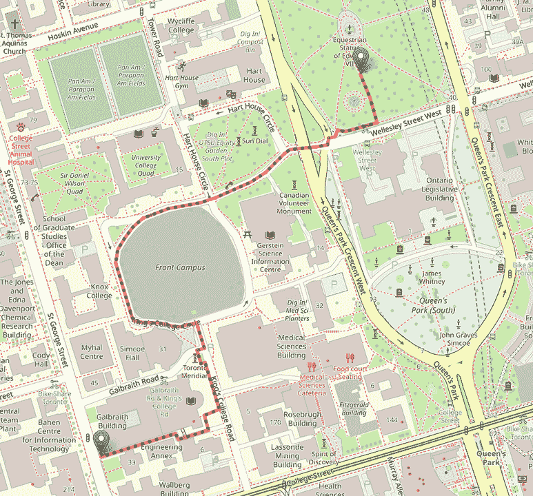

图 3.35 使用 BFS 生成的最短路径。BFS 在移动到下一层之前先搜索每一层。当图不是很宽且解决方案靠近根节点时，这种方法效果最佳。

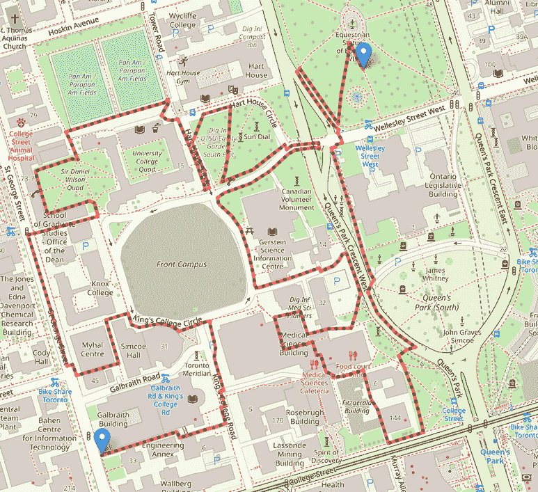

图 3.36 使用 DFS 生成的最短路径。DFS 在回溯之前尽可能深入地搜索图。当图不是很深且解决方案位于根节点较远的地方时，这种方法效果最佳。


图 3.37 使用 Dijkstra 算法、UCS 和双向 Dijkstra 算法生成的最短路径。这三种算法都会产生相同的解决方案（最优路由），但它们在内存使用和节点探索方面会有不同的处理方式。

值得注意的是，NetworkX 中的`dijkstra_path`函数使用 Dijkstra 方法来计算图中两个节点之间的最短加权路径。我们的 optalgo-tools 包还提供了不同图搜索算法的实现，例如 BFS、DFS、Dijkstra 算法、UCS 和双向 Dijkstra 算法。optalgotools 中对 Dijkstra 算法的实现已经修改，以便与我们的 OSM 数据一起工作，因为从地图生成的图自然会有自环和并行边。并行边可能导致不是最短可用路径的路线，因为路线长度在很大程度上取决于在生成特定路径时选择了哪条并行边。在图 3.38 中，从 0 到 2 的最短路径可能返回长度为 7，如果计算该路径时选择了连接 0 和 1 的顶部边，而选择底部边时长度为 3。


图 3.38 并行边可能存在问题，因为找到最短路径取决于在图探索过程中选择了哪条并行边。

自环也会给原始的 Dijkstra 算法带来麻烦。如果一个图中包含自环，到某个节点的最短路径可能来自该节点本身。在那个时刻，我们就无法生成一条路径（图 3.39）。


图 3.39 自环可能会打断父子节点链，这阻止我们在找到解决方案后重新追踪路径。

这两个问题通常容易解决但非同寻常，需要避免。对于并行边，我们选择权重最低（长度最短）的边，并丢弃任何其他并行边。对于自环，我们可以完全忽略该环，因为在大多数路由问题中不存在负权重环（道路的长度不能为负），而正权重环不能成为最短路径的一部分。此外，本书中使用的 Dijkstra 算法在找到目标节点时终止，而传统的实现方式只有在找到从根节点到所有其他节点的最短路径时才结束。

表 3.7 比较了 BFS、DFS、Dijkstra 算法和 UCS 在路径长度、处理时间、所需空间和已探索节点数方面的差异。从这些结果中可以看出，Dijkstra 算法、UCS 和双向 Dijkstra 算法产生最优结果，时间和空间成本各不相同。虽然 BFS 和 DFS 都能在最短时间内找到可行解，但提供的解不是最优的，在 DFS 的情况下甚至是不合理的。另一方面，DFS 需要事先知道整个图，这既昂贵又不太实用。为特定问题选择合适的搜索算法很大程度上涉及确定处理时间和空间需求之间的理想平衡。在后面的章节中，我们将探讨产生近似最优解的算法，这些算法通常在最优解既不可能找到又不太实用时使用。请注意，所有这些解决方案都是可行的；它们都能从点 A 到点 B 产生一个有效（如果有时复杂）的路径。

表 3.7 比较了 BFS、DFS、Dijkstra 算法和 UCS，其中*b*是分支因子，*m*是搜索树的最大深度，*d*是最浅的图深度，*E*是边的数量，*V*是顶点的数量。

| 算法 | 成本（米） | 处理时间（秒） | 空间（字节） | 已探索节点 | 最坏情况时间 | 最坏情况空间 | 最优性 |
| --- | --- | --- | --- | --- | --- | --- | --- |
| BFS | 955.962 | 0.015625 | 1,152 | 278 | *O*(*b^d*) | *O*(*b^d*) | No |
| DFS | 3347.482 | 0.015625 | 1,152 | 153 | *O*(*b^m*) | *O*(*bm*) | No |
| Dijkstra’s | 806.892 | 0.0625 | 3,752 | 393 | *O*(&#124;*E*&#124; + &#124;*V*&#124; log &#124;*V*&#124;) | *O*(&#124;*V*&#124;) | Yes |
| UCS | 0.03125 | 592 | 393 | *O*((*b* + &#124;*E*&#124;) * *d*) | *O*(*b^d*) | Yes |
| 双向 Dijkstra’s | 0.046875 | 3,752 | 282 | *O*(*b^d*^(/2)) | *O*(*b^d*^(/2)) | Yes |

在下一章中，我们将探讨如果我们利用领域特定知识而不是盲目搜索，如何优化搜索。我们将直接深入研究信息搜索方法，看看我们如何使用这些算法来解决最小生成树和最短路径问题。

## 摘要

+   传统的图搜索算法（盲目和信息搜索算法）是确定性搜索算法，它们探索图是为了一般发现或显式搜索。

+   图是一种非线性数据结构，由顶点和边组成。

+   盲（无信息）搜索是一种搜索方法，其中不使用关于搜索空间的信息。

+   广度优先搜索（BFS）是一种图遍历算法，它在考虑下一层的节点之前，先检查搜索树同一层上的所有节点。

+   深度优先搜索（DFS）是一种图遍历算法，它从根节点或初始节点或顶点开始，尽可能跟随一条分支，然后回溯以探索其他分支，直到找到解决方案或所有路径都耗尽。

+   深度限制搜索（DLS）是具有预定深度限制的 DFS 的约束版本，防止它探索超过一定深度的路径。

+   迭代加深搜索（IDS），或迭代加深深度优先搜索（IDDFS），通过增加深度限制直到达到目标，结合了 DFS 的空间效率和 BFS 的快速搜索。

+   Dijkstra 算法解决了加权图中具有非负边成本的单一源最短路径问题。

+   广度优先搜索（UCS）是 Dijkstra 算法的一个变体，它使用最低的累积成本来找到从源到目的地的路径。如果所有边的路径成本相同，则它与 BFS 算法等价。

+   双向搜索（BS）是正向搜索和反向搜索的结合。它同时从起点正向搜索和从目标反向搜索。

+   选择搜索算法涉及确定目标平衡，包括时间复杂度、空间复杂度以及搜索空间的前知等因素。
