# 第四章：启发式搜索算法

本章涵盖

+   定义启发式搜索

+   学习如何解决最小生成树问题

+   学习如何使用启发式搜索算法找到最短路径

+   使用这些算法解决实际世界的路由问题

在上一章中，我们介绍了盲搜索算法，这些算法在搜索过程中不需要关于搜索空间的信息。在本章中，我们将探讨如果在搜索过程中利用一些关于搜索空间的信息，搜索可以进一步优化。

随着问题和搜索空间变得更大、更复杂，算法本身的复杂性也会增加。我将首先介绍启发式搜索算法，然后我们将讨论最小生成树算法和最短路径搜索算法。将路由问题作为一个实际应用来展示如何使用这些算法。

## 4.1 介绍启发式搜索

如我们在上一章中讨论的，*盲搜索算法*在没有关于搜索空间信息的情况下工作，除了区分目标状态和其他状态所需的信息。就像俗语“当我看到它时，我就知道它”一样，盲搜索遵循一套规则框架（例如，广度优先、深度优先或 Dijkstra 算法）来系统地导航搜索空间。*启发式搜索算法*与盲搜索算法的不同之处在于，算法在搜索过程中使用在搜索过程中获得的知识来指导搜索本身。这种知识可以采取目标距离或产生成本的形式。

例如，在 8 个拼图问题中，我们可能会使用错位拼图的数目作为启发式来确定任何给定状态与目标状态的距离。这样，我们可以在算法的任何给定迭代中确定其性能如何，并根据当前条件修改搜索方法。对“良好性能”的定义取决于所使用的启发式算法。

启发式搜索算法可以广泛分为解决最小生成树（MST）问题的算法和计算两个特定节点或状态之间最短路径的算法，如图 4.1 所示。

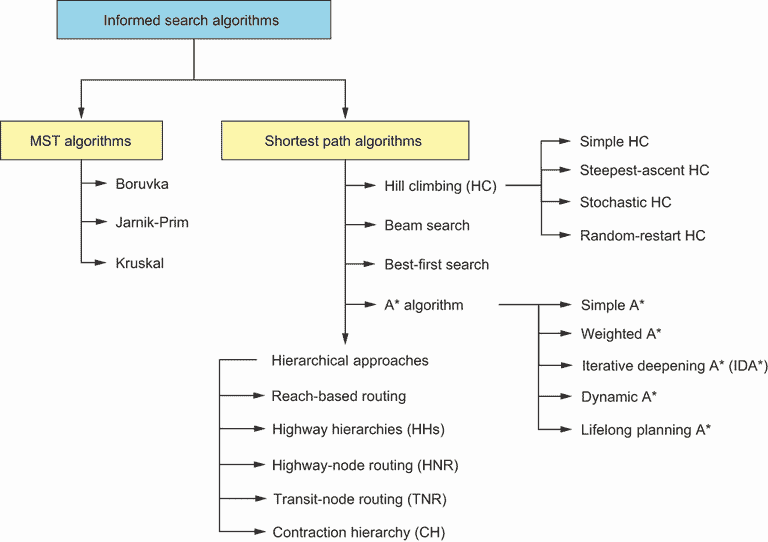

图 4.1 启发式搜索算法的示例。每种算法都有基于改进、特定用例和特定领域的多个变体。

已提出几种算法来解决最小生成树（MST）问题：

+   *Borůvka 算法*在所有边权重都不同的图中找到一个最小生成树。在图不连通的情况下，它还找到一个最小生成森林。它从每个节点作为其自己的树开始，识别离开每个树的最低成本边，然后通过这些边合并连接的树。不需要或维护优先队列中的边预排序。

+   *Jarník-Prim 算法*从根顶点开始，找到从 MST 顶点到非 MST 顶点的最低权重边，并在每一步将其添加到 MST 中。

+   *克鲁斯卡尔算法*按权重递增排序边，并从最轻的边开始形成一个小的 MST 组件，然后将其扩展成一个大的 MST。我将在下一节更详细地描述这个算法。

爬山法（HC）、束搜索、A*算法和收缩分层（CH）是有信息搜索算法的例子，可以用来找到两个节点之间的最短路径：

+   *爬山法* 是一种局部搜索算法，它持续地向优化目标函数的方向移动，在最大化问题中增加，在最小化问题中减少。

+   *束搜索* 通过在有限的预定义集合内扩展最有希望的节点来探索图或树。

+   *A*算法*结合了到达一个节点所累积的成本和启发式信息，例如该节点与目标节点之间的直线距离，以选择新的扩展节点。

+   *分层方法*，如基于可达性的路由、高速公路分层（HH）、高速公路节点路由（HNR）、交通节点路由（TNR）和收缩分层（CH），是考虑节点重要性的分层方法，试图通过可接受启发式方法剪枝搜索空间。

下一个部分介绍了最小生成树（MST）的概念，并介绍了一种可以生成任何给定图的最小生成树的算法。

## 4.2 最小生成树算法

想象一下，你是偏远农村小镇的基础设施经理。与大多数城镇不同，这里实际上没有主街道或市中心区域，所以大多数兴趣点都分散各处。此外，前几年的预算削减导致道路要么损坏，要么根本不存在。损坏的道路都被泥土掩埋，基本上无法通行。你被分配了一小笔预算来修复或建造道路以改善情况，但这笔钱不足以修复所有现有的道路或建造新的道路。图 4.2 显示了城镇的地图以及现有损坏道路的位置。

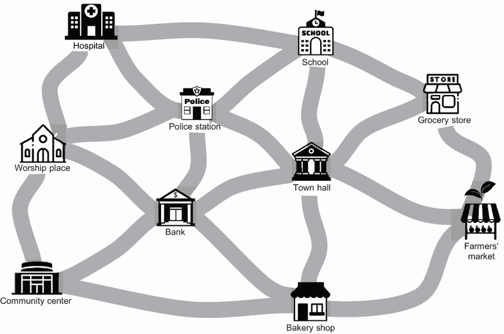

图 4.2 污染城市问题。这个城镇的道路严重损坏，但资金不足以修复所有道路。

解决这个问题的方法有很多，从不可行的（修复所有损坏的道路并忍受城镇破产的后果）到过于保守的（只修复几条道路，或者一条都不修，并忽略所有抱怨的市民）。这个问题通常被称为污染城市问题，其中图中的各种节点必须连接起来，同时最小化边的权重。这些权重可以表示修复或铺路的开销，这可能会根据道路的状况、长度和拓扑结构而变化。

解决泥泞城市问题的数学方法涉及到最小生成树（MST）的概念。一般来说，生成树是无向图的一个无环或无环子图，它用最少数量的边连接图的所有顶点。在图 4.3 中，左边的树显示了从 A 到 F 的节点组成的图*G*，而中间和右边的树显示了*G*的生成树。请注意，一般的生成树不需要边的权重（即，不需要与长度、速度、时间或成本相关联）。


图 4.3 生成树的示例。中间和右边的树没有回路或环，连接了图*G*的所有节点。

最小生成树（MST）或边权重图的最小权重生成树是一棵生成树，其权重（其边的权重之和）不大于任何其他生成树的权重。

如果*G*=(*V, E*)是一个图，那么*G*的任何子图都是一棵生成树，如果满足以下两个条件：

+   子图包含*G*的所有顶点*V*。

+   子图是连通的，没有回路和自环。

对于一个图*G*的给定生成树*T*，生成树*T*的权重*w*是*T*中所有边的权重之和。如果*T*的权重是所有可能的生成树权重中的最低值，那么我们可以称它为最小生成树。

之前描述的泥泞城市问题将被作为一个最小生成树（MST）来解决。Kruskal、Borůvka、Jarník-Prim 和 Chazelle 都是可以用来找到最小生成树的算法示例。算法 4.1 展示了 Kruskal 算法的伪代码。

算法 4.1 Kruskal 算法

```py
Input: Graph G = (V, E) with each edge e ∈ E having a weight w(e)
Output: A minimum spanning tree T

Create a new graph T:= ∅ with the same vertices as G, but with no edges.
Define a list S containing all the edges in the graph G
Sort the edges list S in ascending order of their weights.
For each edge e in the sorted list:
   If adding edge e to T does not form a cycle:
      Add this edge to T.
   Else:
      Skip this edge and move to the next edge in the list.
Continue this process until all the edges are processed.
Return T as the minimum spanning tree of graph G.
```

为了更好地理解这些步骤，让我们应用 Kruskal 算法来解决泥泞城市问题。图 4.4 显示了原始图。边附近的数字代表边权重，还没有添加任何边到最小生成树中。以下步骤将通过手动迭代生成最小生成树。

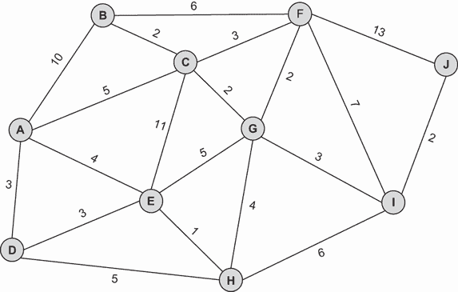

图 4.4 使用 Kruskal 算法解决泥泞城市问题——原始图

1.  最短的边是 E-H，长度为 1，因此它被突出显示并添加到最小生成树中（图 4.5）。

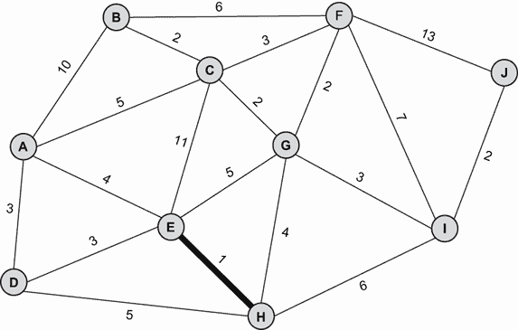

图 4.5 使用 Kruskal 算法解决泥泞城市问题——第 1 步

2.  B-C、C-G、G-F 和 I-J 现在是长度为 2 的最短边。B-C 被任意选择并突出显示，然后是 C-G、G-F 和 I-J，因为它们没有形成环（图 4.6）。


图 4.6 使用 Kruskal 算法解决泥泞城市问题——第 2 步

3.  C-F、F-J、G-I、A-D 和 D-E 现在是长度为 3 的最短边。C-F 不能被选择，因为它形成了一个环。A-D 被任意选择并突出显示，然后是 D-E 和 G-I。F-J 不能被选择，因为它形成了一个环（图 4.7）。

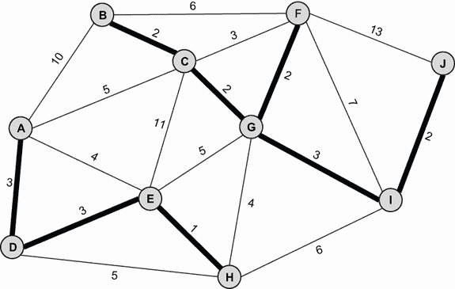

图 4.7 使用 Kruskal 算法解决泥泞城市问题——第 3 步

4. 下一个最短边是 A-E 和 G-H，长度为 4。由于 A-E 会形成一个环，所以不能选择它，因此过程以边 G-H 结束。最小生成树已经找到（图 4.8）。


图 4.8 使用 Kruskal 算法解决泥泞城市问题——步骤 4

图 4.9 显示了所有节点在图中都连接的最终解决方案。

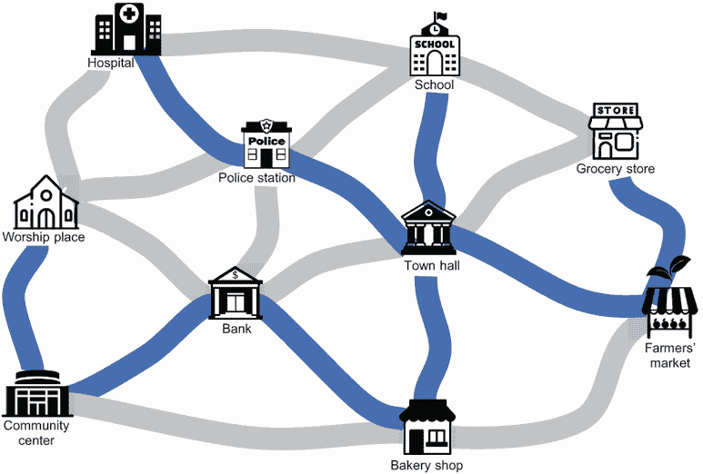

图 4.9 使用 Kruskal 算法解决泥泞城市问题。算法通过按升序权重顺序添加边到最终树中，忽略会形成环的边。

这个算法可以通过使用 NetworkX 的`find_cycle()`和`is_connected()`方法轻松地在 Python 中实现，这些方法分别确定边是否是 MST 的可行候选，以及整体算法的终止条件。为了视觉展示，我还使用了`spring_layout()`来设置图的节点和边的位置。`spring_layout()`方法内部使用随机数生成器来生成这些位置，我们可以传递一个种子（允许生成所谓的“伪随机”数）来保证每次执行都得到特定的布局。尝试修改种子参数，看看会发生什么。

列表 4.1 使用 Kruskal 算法解决泥泞城市问题

```py
import matplotlib.pyplot as plt
import networkx as nx

G = nx.Graph()                                                          ①
G.add_nodes_from(["A", "B", "C", "D", "E", "F", "G", "H", "I", "J"])    ①

edges = [                                                               ①
    ("A", "B", {"weight": 10}),                                         ①
    ("A", "C", {"weight": 5}),                                          ①
    ("A", "D", {"weight": 3}),                                          ①
    ("A", "E", {"weight": 4}),                                          ①
    ("B", "C", {"weight": 2}),                                          ①
    ("B", "F", {"weight": 6}),                                          ①
    ("C", "E", {"weight": 11}),                                         ①
    ("C", "F", {"weight": 3}),                                          ①
    ("C", "G", {"weight": 2}),                                          ①
    ("D", "E", {"weight": 3}),                                          ①
    ("D", "H", {"weight": 5}),                                          ①
    ("E", "G", {"weight": 5}),                                          ①
    ("E", "H", {"weight": 1}),                                          ①
    ("F", "G", {"weight": 2}),                                          ①
    ("F", "I", {"weight": 7}),                                          ①
    ("F", "J", {"weight": 13}),                                         ①
    ("G", "H", {"weight": 4}),                                          ①
    ("G", "I", {"weight": 3}),                                          ①
    ("H", "I", {"weight": 6}),                                          ①
    ("I", "J", {"weight": 2}),                                          ①
]                                                                       ①

G.add_edges_from(edges)
pos = nx.spring_layout(G, seed=74)                                      ②

def Kruskal(G, attr = "weight"):
    edges = sorted(G.edges(data=True), key=lambda t: t[2].get(attr, 1)) ③
    mst = nx.Graph()
    mst.add_nodes_from(G)
    for e in edges:
        mst.add_edges_from([e])
        try:                                                            ④
            nx.find_cycle(mst)                                          ④
            mst.remove_edge(e[0], e[1])                                 ④
        except:
            if nx.is_connected(mst):                                    ⑤
                break
            continue
    return mst
```

① 创建一个无向图，并用节点和边填充它。

② 使用种子与 spring_layout 方法保证每次放置节点相同。

③ 按照权重升序排序边。

④ 如果图中不存在环，`find_cycle`会引发错误。我们可以尝试/捕获这个错误，以确定添加新边是否会形成一个环。

⑤ 如果由这些边形成的图是连通的，那么 mst 中的边集就是一个生成树。

作为列表 4.1 的延续，以下代码片段用于生成使用 Kruskal 的最小生成树并可视化它：

```py
MST = Kruskal(G).edges                                                  ①
labels = nx.get_edge_attributes(G, "weight")
nx.draw_networkx_edges(G, pos, list(MST), width=4, edge_color="red")    ②
nx.draw_networkx_edge_labels(G, pos, edge_labels=labels)                ③
nx.draw_networkx(G, pos, with_labels=True, font_color="white")          ④
plt.show()
```

① 调用 Kruskal 算法生成最小生成树。

② 绘制边。

③ 添加标签。

④ 绘制最小生成树。

如您在图 4.10 中看到的，我们用 Python 实现的泥泞城市问题产生了与手动迭代相同的结果。节点 G，即市政厅，成为城镇交通基础设施的一个中心枢纽，道路建设的总成本被最小化。然而，值得注意的是，尽管最小生成树（MST）最小化了连接所有节点的总成本，但它通常不会产生最“方便”的解决方案。例如，如果有人想从宗教场所前往医院，最短可达距离将是 7（经过警察局），而我们的道路网络需要总距离为 15。


图 4.10 使用 Kruskal 算法解决的泥泞城市问题。高亮显示的边是 MST 的一部分。

让我们将此算法和此代码应用于找到多伦多大学周围搜索空间内所有节点的 MST。想象一下，我们被分配在城市中安装新的通信电缆的任务，我们希望最小化使用的电缆长度。

列表 4.2 多伦多大学 MST

```py
import networkx as nx
import osmnx
import matplotlib.pyplot as plt
from optalgotools.algorithms.graph_search import Kruskal

reference = (43.661667, -79.395)
G = osmnx.graph_from_point(
    reference, dist=1000, clean_periphery=True, simplify=True, network_
type="drive"
)                                                                     ①
fig, ax = osmnx.plot_graph(G)

undir_G = G.to_undirected()                                           ②
sorted_edges = sorted(undir_G.edges(data=True), key=lambda t:         ②
➥ t[2].get("length",1))                                              ②

mst = Kruskal(G, sorted_edges=True, edges= sorted_edges,
➥ graph_type=nx.MultiDiGraph)                                        ③

highlight_edges = ['b' if e in mst.edges else 'r' for e in G.edges]   ④
edge_alphas = [1 if e in mst.edges else 0.25 for e in G.edges]        ④
osmnx.plot_graph(
    G, 
    edge_linewidth=2, 
    edge_color=highlight_edges, 
    edge_alpha=edge_alphas
)                                                                     ④
plt.show()                                                            ④
```

① 使用驾驶网络仅关注可驾驶的道路。这可以防止代码使用道路和人行道组合构建 MST。

② 获取无向图副本，并按边长对道路网络边进行排序。

③ 使用预排序列表并指定图类型，从 optalgotools 调用 Kruskal 算法。

④ 通过突出显示包含的边来可视化最小生成树（MST）。

图 4.11 显示了 Kruskal 算法生成的结果 MST。图中的道路网络图可能看起来像一个大连通分量，但实际上并非如此。图中似乎连接相邻节点的单行道实际上并没有连接（你可以从 A 到 B，但不能反过来）。我们通过使用 NetworkX 中的 `to_undirected` 函数将有向图转换为无向图来克服这个问题。

列表中使用的 Kruskal 算法版本与泥泞城市问题中使用的相同。我们将其从 optalgotools 导入以减少所需的代码量。

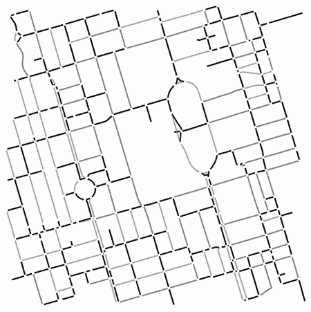

图 4.11 Kruskal 算法生成的 MST。所有包含在 MST 中的边都被突出显示。MST 中没有环，且树的总权重最小化。

MST 在现实世界中有着广泛的应用，包括网络设计、图像分割、聚类和设施定位问题。当处理涉及预算的问题时，如规划网络，MST 特别有用，因为它们允许所有节点以最低的总成本连接。如前所述，信息搜索算法可以用来找到本节所述的 MST，以及下一节讨论的最短路径算法。

## 4.3 最短路径算法

信息搜索算法可以通过使用关于问题的知识（领域特定知识）来剪枝搜索，以找到两个节点之间的最短路径。这种知识以启发式函数的形式给出对目标距离的估计。信息搜索算法的例子包括岗位攀登、束搜索、最佳优先、A* 和收缩层次。以下小节将详细讨论这些算法。

### 4.3.1 岗位攀登算法

假设你正在试图在浓雾中攀登山顶。上山和下山的路径只有一条，但你不确定确切的山顶位置。因此，你只能通过查看你上一步之后的进展来判断你是否已经上山或下山。你如何知道你已经到达山顶？一个不错的猜测是当你不再上山时！

从一个已知（非优化）的函数解或初始状态开始，岗位攀登算法检查该解决方案的邻居，并选择更优化的邻居。这个过程会重复进行，直到找不到更好的解决方案，此时算法终止。

岗位攀登算法是一种局部贪婪搜索算法，它试图通过结合领域特定知识或启发式信息来提高深度优先搜索的效率，因此它可以被认为是一种有信息的深度优先搜索算法。算法 4.2 中应用于图搜索的岗位攀登算法的伪代码假设为最小化问题。

算法 4.2 岗位攀登算法

```py
Inputs: Source node, Destination node
Output: Route from source to destination

Initialize current ← random route from source to destination
Initialize neighbours ← children of current

While min(neighbours) > current do
   Set current ← min(neighbours)
   Update neighbours ← children of current
Return current as the route from source to destination
```

该算法在将节点后继者（根据它们的启发式值）添加到待扩展列表之前，对它们进行排序。这种算法在内存和计算开销方面要求非常低，因为它只是简单地记住当前的后继者作为当前正在工作的路径。它是一种非穷举技术；它不会检查整个树，因此其性能将相对较快。然而，尽管这种算法在凸问题上相对表现良好，但具有多个局部最大值的函数通常会得到一个不是全局最大值的答案。当存在高原（一组所有解决方案都同样优化的局部解决方案）时，它的表现也较差。

如图 4.12 所示，根据初始状态，岗位攀登算法可能会陷入局部最优。一旦它达到山顶，算法将停止，因为任何新的后继者都会在山脚下。这类似于在雾中爬山，达到一个较小的顶峰，并认为你已经到达了主峰。

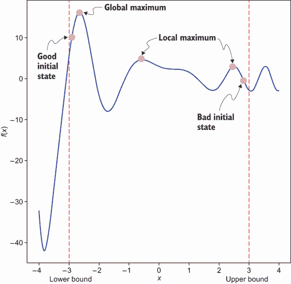

图 4.12 根据初始状态，岗位攀登算法可能会陷入局部最优。一旦它达到一个顶峰，算法将停止，因为任何新的后继者都会在山脚下。

简单的岗位攀登、最陡上升岗位攀登、随机岗位攀登和随机重启岗位攀登都是岗位攀登算法的变体，如图 4.13 所示。

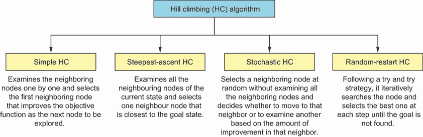

图 4.13 岗位攀登算法的变体

*简单爬山法*逐个检查邻近节点，并选择第一个优化目标函数的邻近节点作为下一个要探索的节点。*最陡上升或最陡下降爬山法*是简单爬山算法的一种变体，它首先检查当前状态的所有邻近节点，并选择一个最接近目标状态的邻近节点。*随机爬山法*是爬山算法的一个随机版本，它随机选择一个邻近节点，而不检查所有邻近节点。此算法根据该邻近节点的改进量决定是否移动到该邻近节点或检查另一个节点。随机重启爬山法或首次选择爬山法遵循尝试策略，并迭代搜索节点，在每一步中选择最佳节点，直到找到目标。如果陷入局部最大值，它将从新的随机初始状态重新开始过程。与其他爬山变体相比，如果存在高原、局部最优和脊，此算法更有可能到达目的地。

梯度下降算法

*梯度下降算法*在机器学习中被广泛用于训练模型和进行预测。梯度下降和爬山算法是两种基本不同的算法，不能相互混淆。与爬山不同，梯度下降可以看作是向山谷底部徒步。梯度下降是一种迭代算法，它观察局部邻居的斜率，并朝着斜率最陡或负梯度方向移动以优化连续可微函数。在最大化问题的情形下，*梯度上升*则朝着正梯度方向移动以优化目标函数。

如果函数是凸函数（即，如果任何局部最小值也是全局最小值）并且学习率选择得当，梯度下降算法通常收敛到全局最小值。爬山算法是一种启发式贪婪算法，容易陷入局部最优。它主要用于离散优化问题，如旅行商问题，因为它不需要目标函数是可微的。

假设我们有一个如图 4.14 所示的简单图。源节点是 S，目标节点是 G。


图 4.14 以图的形式表示的 8 个兴趣点（POIs）道路网络

此图可以通过找到一个包含原始图所有顶点且连通且无环的生成树来转换为树，如图 4.15 所示。


图 4.15 以树的形式表示的 8 个兴趣点（POIs）道路网络

如您所见，从 S 到 G 有多种路径，每种路径的成本不同。遵循爬山算法，S 和 G 之间的最短路径将是 S→A→C→E→G，如图 4.16 所示。


图 4.16 使用爬山算法在 S 和 G 之间找到的最短路径

现在我们使用 8 个拼图问题来说明爬山方法。图 4.17 展示了爬山搜索的进展，使用不包括空白瓷砖的错位瓷砖数量作为启发式信息 h(n)。例如，在第 2 步中，瓷砖 1、4、6 和 7 放置错误，所以 h = 4。在第 3 步中，瓷砖 1 和 4 放置错误，所以 h = 2。


图 4.17 使用爬山算法解决 8 个拼图问题。在每次迭代中，算法探索相邻状态，寻找最小启发式值。

列表 4.3 展示了 Python 中爬山算法的简单实现。代码通过最小化下一个节点的启发式值来选择探索的节点。更复杂的版本，涉及生成最短路径，将在本章末尾介绍。

列表 4.3 使用爬山法解决 8 个拼图问题

```py
import matplotlib.pyplot as plt

def Hill_Climbing(origin, destination, cost_fn):
    costs = [cost_fn(origin)]
    current = origin
    route = [current]
    neighbours = current.expand()                           ①
    shortest = min(neighbours, key=lambda s: cost_fn(s))    ②
    costs.append(cost_fn(shortest))
    route.append(shortest)

    while cost_fn(shortest) < cost_fn(current):
        current = shortest
        neighbours = current.expand()
        shortest = min(neighbours, key=lambda s: cost_fn(s))
        costs.append(cost_fn(shortest))
        route.append(shortest)
        if shortest == destination:                         ③
            break

    return route, costs

def misplaced_tiles(state: State):                          ④
    flat = state.flatten()                                  ④
    goal = range(len(flat))                                 ④
    return sum([0 if goal[i] == flat[i] else 1 for i in range(len(flat))])    
```

① 可以使用 expand() 函数生成当前状态的邻居节点。

② “最近”的邻居是成本函数最低的（即错位瓷砖最少）。

③ 如果达到目标状态，则终止算法。

④ 计算并返回不在目标位置上的错位瓷砖数量。

注意：State 类和 visualize 函数在完整的列表中定义，可在本书的 GitHub 仓库中找到。

以下代码片段定义了拼图的初始状态和目标状态，并使用爬山法来解决拼图问题：

```py
init_state = [[1,4,2],
              [3,7,5],
              [6,0,8]]

goal_state = [[0,1,2],
              [3,4,5],
              [6,7,8]]

init_state = State(init_state)
goal_state = State(goal_state)

if not init_state.is_solvable():                             ①
    print("This puzzle is not solvable.")
else:
    solution, costs = Hill_Climbing(init_state, goal_state,
    ➥ misplaced_tiles)                                      ②
    plt.xticks(range(len(costs)))                            ③
    plt.ylabel("Misplaced tiles")                            ③
    plt.title("Hill climbing: 8 Puzzle")                     ③
    plt.plot(costs)                                          ③
    visualize(solution)                                      ③
```

① 检查是否有解决方案。

② 使用爬山法解决拼图问题

③ 绘制搜索进度，并可视化解决方案。

输出显示在图 4.18 中。

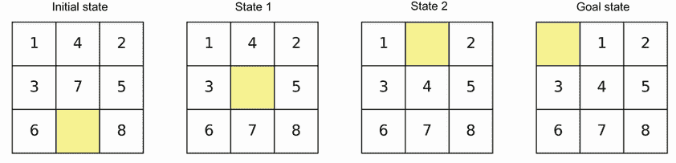

图 4.18 显示了 8 个拼图问题爬山解决方案的状态。每个后续状态都是通过将其成本与邻居相比最小化来选择的。由于 8 个拼图问题不仅有一个明确定义的目标状态，而且这个目标状态是可以实现的，算法的终止条件（达到目标）与“山峰”的“顶峰”相吻合（在这种情况下是一个山谷，因为它是一个最小化问题）。

由于 8 个拼图问题使用启发式作为成本，它本质上变成了一个最小化问题。这种实现与标准爬山算法的不同之处在于，由于总可以找到解决方案，并且图是完全连接的（您可以通过一些瓷砖移动的组合从任何状态转换到另一个状态），算法最终保证找到最优解。更复杂的问题通常会生成接近最优的解决方案。

### 4.3.2 光束搜索算法

束搜索算法试图最小化广度优先算法的内存需求，因此它可以被视为一种启发式广度优先算法。在爬山法在整个运行过程中保持一个最佳状态的同时，束搜索在内存中保持*W*个状态，其中*W*是束宽度。在每次迭代中，它为每个状态生成邻居并将它们放入与原始束中的状态相同的池中。然后，它在每个级别上从池中选择最佳的*W*个状态成为新的束，其余状态被丢弃。这个过程然后重复。该算法在每个级别上仅扩展前*W*个有希望的节点。

这是一个非穷尽搜索，但也是一个危险的过程，因为可能会错过目标状态。由于这是一个局部搜索算法，它也容易陷入局部最优。当*w*等于每个级别的节点数时，束搜索与 BFS 相同。因为存在可能丢弃导致最优解的状态的风险，所以束搜索是不完整的（它们可能不会以解结束）。

算法 4.3 展示了将束搜索算法应用于图搜索的伪代码。

算法 4.3 束搜索算法

```py
Inputs: A source node, a destination node, and beam width w
Output: A route from source to destination

Initialize Seen ← nil
Initialize beam ← random w routes from source to destination
Add beam to seen
Initialize pool ← children of routes in the beam with consideration of seen + beam
Initialize last_beam ← nil
While beam is not last_beam do
   Update last_beam ← beam
   Update beam ← the best w routes from pool
   If last_beam == beam then break
   Add beam to seen
   Update pool ← children of routes in the beam + beam

Return optimal route in beam
```

在 2.3.1 节中，您看到 BFS 具有指数复杂度*O*(*b^d*)，其中*b*代表每个节点的最大分支因子，*d*是必须扩展以达到目标深度的深度。在束搜索的情况下，我们只在任何深度探索*w*×*b*个节点，与 BFS 相比，节省了许多不必要的节点。然而，找到最佳状态或路线需要排序，如果*w*×*b*是一个很大的数字，那么排序将是耗时的。可以使用束阈值来处理这个问题，其中根据启发式函数*h*(*n*)在某个阈值内选择最佳节点，并将所有超出此阈值的节点剪枝掉。

重新审视具有 8 个兴趣点的简单路由问题（图 4.14）并遵循束搜索算法（*w* = *2*），S 和 G 之间的最短路径将是 S-A-C-E-G，如图 4.19 所示。

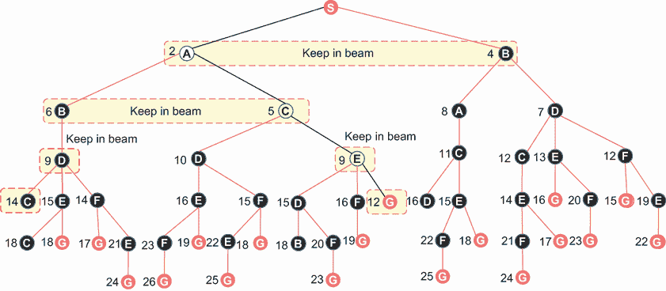

图 4.19 使用束搜索算法在 S 和 G 之间找到的最短路径。束宽度*w* = 2 时，在每个迭代中保持束中的两个状态。在生成束中每个元素的邻居后，仅保留最佳的*w*束。

以下列表展示了用于简单路由问题的基本束搜索实现。要查看如何初始化图以及如何生成可视化（它与列表 4.1 中的类似），请参阅 GitHub 仓库中的完整代码。

列表 4.4 使用束搜索的简单路由

```py
import matplotlib.pyplot as plt
import networkx as nx
import heapq
from optalgotools.structures import Node
from optalgotools.routing import cost

G = nx.Graph()                                               ①
G.add_nodes_from(["A", "B", "C", "D", "E", "F", "G", "S"])   ①
edges = [
    ("A", "B", {"weight": 4}),
    ("A", "C", {"weight": 3}),
    ("A", "S", {"weight": 2}),
    ("B", "D", {"weight": 3}),
    ("B", "S", {"weight": 4}),
    ("C", "E", {"weight": 4}),
    ("C", "D", {"weight": 5}),
    ("D", "E", {"weight": 6}),
    ("D", "F", {"weight": 5}),
    ("E", "F", {"weight": 7}),
    ("E", "G", {"weight": 3}),
    ("F", "G", {"weight": 3}),
]                                                            ①
G.add_edges_from(edges)                                      ①
G=G.to_directed()                                            ①

def Beam_Search(G, origin, destination, cost_fn, w=2, expand_kwargs=[],
➥ cost_kwargs=[]):
    seen = set()
    seen.add(origin)
    last_beam = None
    pool = set(origin.expand(**expand_kwargs))               ②
    beam = []
    while beam != last_beam:
        last_beam = beam
        beam = heapq.nsmallest(
            w, pool, key=lambda node: cost_fn(G, node.path(),
            ➥ **cost_kwargs))                               ③
        current = beam.pop(0)
        seen.add(current)
        pool.remove(current)
        children = set(current.expand(**expand_kwargs))
        for child in children:                               ④
            if child in seen: next                           ④
            else:    #D                                      ④
                if child == destination:                     ④
                    return child.path()                      ④
                beam.append(child)                           ④
        pool.update(beam)
    return None                                              ⑤
```

①创建一个有向图。

②使用原始类的 expand()方法获取节点的邻居，传递任何必要的参数。

③将池修剪到仅包含最佳 k 路径，传递任何必要的参数到成本函数。

④ 为每条路径生成子路径，通过在路径中添加一个额外的节点来实现。对于这些新路径中的每一个，它们会被拒绝（已探索）、添加到束中（然后到池中）或接受（因为它们到达了目的地）。

⑤ 如果找不到路径，则不返回任何内容。

此函数可以使用以下示例参数调用：

```py
result = Beam_Search(
    G,
    Node(G, "S"),
    Node(G, "G"),
    cost,
    expand_kwargs={"attr_name": "weight"},
    cost_kwargs={"attr_name": "weight"},
)
```

可视化此算法的输出产生图 4.20，其中高亮线表示从 S 到 G 的解决方案路径。


图 4.20 使用束宽 *w* = 2 的解决方案。高亮线表示解决方案路径。

如您将在后续章节中看到，当将束搜索应用于现实生活中的路由问题时，生成束搜索中的子节点可能会变得非常复杂和耗时。

### 4.3.3 A* 搜索算法

*A*（发音为 A-star）算法是一种在路径查找和图遍历中广泛使用的启发式搜索算法。该算法是最佳优先搜索算法的一个特例。最佳优先搜索是一种混合深度优先搜索和广度优先搜索的方法，它根据到达节点的成本或从该节点到达目标的估计或启发式成本值来扩展最期望的未扩展节点。A* 算法考虑到达节点的成本和到达目标的估计成本，以找到最优解。

A* 算法的伪代码在算法 4.4 中展示。

算法 4.4 A* 算法

```py
Inputs: Source node, Destination node
Output: Route from source to destination

Initialize A* heuristic ← sum of straight-line distance to source and destination
Initialize PQ ← min heap according to A* heuristic
Initialize frontier ← a PQ initialized with source
Initialize explored ← empty
Initialize found ← False

While frontier is not empty and found is False do
    Set node ← frontier.pop()
    Add node to explored
    For child in node.expand() do
        If child is not in explored and child is not in frontier then
            If child is destination then
                Update route ← child.route()
                Update found ← True
            Add child to frontier

Return route
```

A* 搜索试图通过结合实际成本和从给定状态到达目标的启发式成本估计来减少探索的总状态数。A* 的驱动力是基于最低值选择新的顶点（或节点）进行探索。评估函数 *f*(*n*) 的值使用以下公式计算：

| *f*(*n*) = *g*(*n*) + *h*(*n*) | 4.1 |
| --- | --- |

在方程 4.1 中，*g*(*n*) 是从源节点 S 到节点 *n* 已经走过的部分路径的实际成本。启发式信息 *h*(*n*) 可以是节点 *n* 和目标节点 G 之间的直线距离，或者某个其他函数。当所有节点的 *h*(*n*) = 0 时，A* 将表现得像均匀成本搜索（UCS），这在第 3.4.2 节中已解释，因此，无论到达目标的估计成本如何，都会扩展成本最低的节点。

在 *加权 A* 中，将一个常数权重添加到启发式函数中，如下所示：

| *f*(*n*) = *g*(*n*) + *w* × *h*(*n*) | 4.2 |
| --- | --- |

为了增加 *h*(*n*) 的重要性，*w* 应该大于 1。也可以使用动态权重 *w*(*n*)。启发式信息的选取对搜索结果至关重要。当且仅当启发式信息 *h*(*n*) 小于从节点 *n* 到目标状态的实际成本时，启发式信息 *h*(*n*) 是可接受的。这意味着可接受启发式永远不会高估到达目标状态的成本，并且只有当启发式函数接近真实剩余距离时，才能导致最优解。

A* 启发式算法通过以 *贪婪* 的方式选择下一个要探索的顶点，根据启发函数的值优先考虑节点。由于当 *n* 位于从 S 到 G 的直线上时，到起点和终点的距离之和最小，这个启发式优先考虑那些更接近起点到终点直线距离的节点。

为了更好地理解 A* 算法，让我们考虑这样一个简单问题：在一个 8 个兴趣点（POIs）路网中，寻找源节点 S 和目标节点 G 之间的最短路径。这是与图 4.14 相同的 POI 图，但每个节点都添加了启发值。启发信息的例子是图 4.21 中每个顶点上方显示的到目标点的直线距离。


图 4.21 显示了一个具有启发信息（到目标点的直线距离）的 8 个 POIs 路网图，每个顶点上方都标明了这些信息

图 4.22 展示了使用 A* 寻找从 S 到 G 的最短路径的步骤。

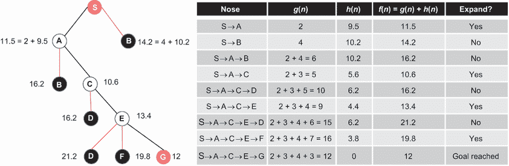

图 4.22 显示了在 8 个 POIs 路网中，从源节点 S 到目标节点 G 的 A* 步骤寻找最短路径。使用已发生的成本总和以及到目标点的距离作为启发值，以确定是否展开某个节点。

这个算法可能看起来很复杂，因为它似乎需要在多个地方存储不完整的路径及其长度。然而，使用递归最佳优先搜索实现可以优雅地解决这个问题，而无需显式存储路径。从每个节点到下界目标距离的质量极大地影响了算法的时间复杂度。给定的下界越接近真实距离，执行时间就越短。

我们可以将 A* 算法应用于简单的路由问题，如下所示（有关完整代码，包括图初始化和可视化，请参阅本书的 GitHub 仓库）。

列表 4.5 使用 A* 搜索进行简单路由

```py
import matplotlib.pyplot as plt
from optalgotools.structures import Node
from optalgotools.routing import cost
import networkx as nx
import heapq

def A_Star(
    G, origin, destination, heuristic_fn, cost_fn, cost_kwargs=[],
    ➥ expand_kwargs=[]
):
    toDestination = heuristic_fn(G, origin, destination)
    toOrigin = {}
    route = []
    frontier = list()
    frontier.append(origin)
    toOrigin[origin] = 0
    explored = set()
    found = False
    while frontier and not found:
        node = min(frontier, key=lambda node: toOrigin[node] +
        ➥ toDestination[node])                                           ①
        frontier.remove(node)
        explored.add(node)
        for child in node.expand(**expand_kwargs):                        ②
            if child not in explored and child not in frontier:           ②
                if child == destination:                                  ②
                    route = child.path()                                  ②
                    found = True                                          ②
                    continue                                              ②
                frontier.append(child)                                    ②
                toOrigin[child] = cost_fn(G, child.path(), **cost_kwargs) ③
    return route
```

① 根据启发值选择一个节点

② 展开节点的子节点，将它们添加到前沿或如果找到目的地则终止。

③ 在线为每个节点添加 toOrigin 值

列表 4.5 中的 A* 实现没有使用“真正的”A* 启发式算法，原因如下：

+   由于我们只有边权重而没有实际的空间数据（坐标）来确定每个节点，因此无法直接确定从任何节点到目的地的直线距离或 haversine 距离。为了解决这个问题，我创建了一个名为 `dummy_astar_heuristic` 的函数，该函数为此示例返回静态、任意生成的距离。

+   由于与前一点相同的原因，无法提前确定从起点到任何节点（直线或其他）的距离。因此，我们使用已行驶的距离（即从起点到已探索节点的成本），并在算法发现新节点时更新该值。在本章的后面部分，我们将看到如何处理地理数据（如道路网络）允许我们在事先捕获此信息。

`A_Star` 可以如下调用，以下是一些示例参数：

```py
result = A_Star(
    G,
    Node(G, "S"),
    Node(G, "G"),
    dummy_astar_heuristic,
    cost,
    expand_kwargs={"attr_name": "weight"},
    cost_kwargs={"attr_name": "weight"},)
```

这给出了与波束搜索和爬山搜索相同的结果：路径为 S-A-C-E-G。

Haversine 距离

Haversine 公式用于根据两点在地球上的经纬度以及平均球面地球半径来计算两点之间的地理距离。这个距离也被称为大圆距离，并使用以下公式计算：

*d* = *R* × *C* 和 *C* = 2 × atan2(√*a*, √(1-*a*))        **4.3**

在前面的公式中，*a* = sin²(∆*lat*/2) + cos(*lat1*) × cos(*lat2*) × sin²(∆*lon*/2)，*R* 是地球半径（6,371 公里或 3,691 英里），*d* 是两点之间的最终距离。以下图显示了美国洛杉矶（34.0522° N, 118.2437° W）和西班牙马德里（40.4168° N, 3.7038° W）之间的 haversine 距离。


洛杉矶和马德里之间的 Haversine 距离

以下 Python 代码可以用来计算 Haversine 距离：

```py
!pip install haversine                     ①
from haversine import haversine            ①

LA = (34.052235, -118.243683)              ②

Madrid = (40.416775, -3.703790)            ③

distance = haversine(LA, Madrid)           ④
print(distance)
```

① 安装 Haversine 包，并导入 haversine 函数。

② 以（纬度，经度）格式设置两个点的坐标。

③ 以（纬度，经度）格式设置两个点的坐标。

④ 计算千米距离。

optalgotools 中 A* 启发式实现的默认行为是计算距离，好像地球是平的一样。对于局部搜索，这会产生最佳结果。如果搜索区域的大小较大，最好通过将 `optalgotools.utilities.haversine_distance` 传递到 `measuring_dist` 参数中来计算距离，该参数考虑了地球的曲率。

### 4.3.4 层次方法

当面对更大规模的路线问题时，例如涉及整个国家或具有数百万个节点的图时，使用基本方法（如 Dijkstra 算法）是不可思议的。在上一章中，你看到双向 Dijkstra 算法比 Dijkstra 算法快两倍。然而，对于交互式应用（如导航应用）需要更快的路由算法。实现这一目标的一种方法是在服务器上预先计算某些路线并将它们缓存起来，以便对用户查询的响应时间合理。另一种方法涉及剪枝搜索空间。分层搜索算法通过生成可接受启发式算法来剪枝搜索空间，这些算法抽象了搜索空间。

注意：有关分层方法的一般方法细节，请参阅 Leighton、Wheeler 和 Holte 的“更快的最优和次优分层搜索” [1]。

高速公路分层涉及将“层级”分配给道路网络图中的每条道路。这区分了道路段类型（例如，住宅道路、国家道路、高速公路）。这还通过相关数据得到补充，例如最大指定驾驶速度以及道路中的转弯次数。在为图生成启发式算法之后，数据将通过一个修改后的搜索函数（双向 Dijkstra 算法、A*等）传递，该函数考虑目的地距离和潜在扩展节点类型。高速公路分层算法通常在距离目标更远时将高速公路视为可行的扩展节点，并将开始包括国家道路，最后是住宅街道，随着接近目的地。在旅行过程中，不太重要的道路会与更重要的道路合并（例如，住宅道路与国家道路合并，国家道路与高速公路合并）。这使我们能够避免探索数百万个节点。

以从纽约到迈阿密的远程驾驶旅行为例。在旅行的开始阶段，你需要导航到高速公路或州际公路的当地道路。在旅行的中间部分，你将仅在州际公路或高速公路上驾驶。接近目的地时，你将离开州际公路，再次走上当地道路。虽然这种方法是有道理的，但也有一些缺点。首先，算法忽略了人类更喜欢驾驶的道路类型。虽然高速公路对于给定的路线可能是有意义的，但用户可能更喜欢走当地道路（例如，开车去住在附近的朋友的房子）。其次，高速公路分层没有考虑交通等因素，交通经常波动，给“最优”路线增加了显著的成本。你可以在 Sanders 和 Schultes 的文章“高速公路分层加速精确最短路径查询” [2]中了解更多关于高速公路分层的信息。

收缩层次（CH）算法是另一种分层方法。它是一种加速技术，通过基于节点收缩的概念剪枝搜索空间来提高最短路径计算的性能。例如，对于一个 80 英里单源单目的最短路径搜索查询，双向 Dijkstra 算法探索了 220,000 个节点，单向 A*探索了 50,000 个节点，双向 A*通过探索大约 25,000 个节点来改进这些结果。收缩层次通过只探索大约 600 个节点来解决相同的问题。这使得 CH 比 Dijkstra 的、双向 Dijkstra 的以及 A*都要快得多。

注意：收缩层次在 Geisberger 等人 2008 年的“收缩层次：道路网络中更快、更简单的分层路由”文章[3]中被引入。80 英里单源单目的最短路径搜索查询在*GraphHopper*博客上进行了讨论([`mng.bz/n142`](http://mng.bz/n142))。

CH 算法包含两个主要阶段：

1.  *预处理阶段*是节点和边根据某些重要性概念进行分类的地方。重要的节点可以是主要城市、主要交叉口、连接城市两边的桥梁，或者最短路径经过的兴趣点。每个节点根据从最不重要到最重要的级别进行收缩。在收缩过程中，向图中添加了一组快捷边以保留最短路径。

1.  *查询阶段*是在预处理图上运行双向 Dijkstra 搜索（或任何其他搜索）的地方，只考虑越来越重要的边。这导致有选择地忽略不那么重要的节点，从而整体提高查询速度。

值得注意的是，CH 算法主要是一个预处理算法，这意味着它在查询最短路径之前使用。这个预处理阶段需要一些时间，但一旦完成，查询阶段就非常快。该算法可以处理大型图，并且可用于各种类型的图，而不仅仅是道路网络。让我们更详细地探讨这两个阶段。

CH 预处理阶段

预处理阶段以原始图作为输入，并返回用于查询阶段的增强图和节点顺序。

假设一个加权有向图 *G* = (*V*,*E*)。该图的节点根据节点重要性进行排序。在道路网络的情况下，节点重要性可以基于道路类型：住宅道路、国家道路、以及连接城市两边的桥梁或最短路径经过的兴趣点。基本直觉是，靠近源点或目标点时，我们通常考虑住宅道路；远离源点或目标点时，考虑国家道路；而更远离源点或目标点时，考虑高速公路是有意义的。影响节点重要性的其他启发式方法包括最大速度、通行费率、转弯次数等。

一旦确定了节点顺序，顶点集或节点就按重要性排序：*V* = {1,2,3…,*n*}。使用以下程序按此顺序收缩或删除节点：

```py
for each pair (u,v)and (v,w)of edges:
   if <u,v,w> is a unique shortest path then
      add shortcut(u,w) with weight ω(<u,v,w>)or ω(<u,w>)+ω(<v,w>)
```

如图 4.23 所示，节点 *v* 可以从图 *G* 中收缩。如果需要，应添加一个成本为 5 的捷径或边，以确保在收缩 *v* 后，*u* 和 *w* 之间的最短距离保持不变或保持相同。收缩节点 *v* 意味着用捷径替换通过 *v* 的最短路径。新的图称为 *overlay graph* 或 *augmented graph*（即具有增强边的图）。此图包含与初始图相同的顶点集和所有边，以及用于在原始图中保留最短距离的所有添加的边（捷径）。


图 4.23 节点收缩操作—括号中的数字表示添加的捷径的成本。

当收缩节点 *v* 时，如果存在一条从 *u* 到 *w* 的路径 *P*，且 *w*(*P*) <= *w*(<*u*,*v*,*w*>)，则不需要任何捷径。这条路径被称为 *witness path*，如图 4.24 所示。

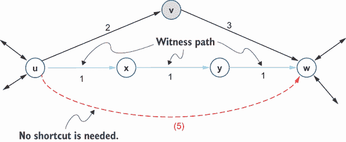

图 4.24 证人路径—从 *P* 到 *w* 存在另一条更短的路径，因此在收缩 *v* 时不需要捷径。

在 CH 预处理阶段，由于节点是根据重要性排序的，因此节点可以迭代收缩，并添加一个额外的捷径弧以保留短距离并形成增强图。我们最终得到一个收缩层次结构，每个节点都有一个覆盖图。这种预处理是在离线完成的，增强图在查询阶段稍后使用。

让我们考虑一个具有四个节点的简单图。图 4.25 显示了收缩过程的步骤。我们将按照从最不重要到最重要的节点的顺序（即从 1 到 *n* 的重要性或层次级别）收缩每个节点。这个过程将形成捷径，这将使我们能够更快地搜索图，因为我们能够忽略已经被剪枝的节点。初始图如图 4.25a 所示：

1.  通过收缩最不重要的节点，节点 1，由于相邻节点 2 和 4 之间的最短路径不经过节点 1，因此没有任何变化（如图 4.25b 所示）。

1.  继续前进并收缩下一个最重要的节点，节点 2，我们现在已经改变了 1→3、1→4 和 3→4 的最短路径。我们可以通过创建新的边（捷径）来编码这些最短路径。括号中的数字表示添加的捷径的成本（如图 4.25c 所示）。

1.  收缩节点 3 不会引起任何变化，因为节点 2 和 4 之间存在一条更短的路径，且不经过节点 3（如图 4.25d 所示）。

1.  我们不需要收缩节点 4，因为它是图中的最后一个节点（如图 4.25e 所示）。

收缩过程后的生成覆盖图如图 4.25f 所示。节点根据重要性排序。


图 4.25 CH 预处理阶段的示例

合并的顺序不会影响 CH 的成功，但它将影响预处理和查询时间。一些合并排序系统最小化增强图中添加的快捷路径数，从而降低整体运行时间。

首先，我们需要使用某种重要性概念，并按重要性递减的顺序将所有节点保持在优先队列中。边差、懒惰更新、合并邻居的数量和快捷覆盖（所有内容将简要解释）是重要性标准的一些例子。图中每个节点的 *重要性* 是其 *优先级*。这个指标指导了节点合并的顺序。这个 *优先级* 是动态的，并且随着节点的合并而持续更新。典型的重要性标准包括

+   *懒惰更新*—在从优先队列中移除之前，更新优先队列顶部的节点（即具有最小优先级的节点）。如果更新后此节点仍然位于顶部，它将被合并。否则，新的最顶部节点将以相同的方式进行处理。

+   *边差*（ED）—一个节点的边差是需要添加的边数与需要移除的边数之差。我们希望最小化添加到增强图中的边数。对于一个图中的节点 *v*，假设

    +   in(*v*) 是入度（即进入节点的边的数量）

    +   out(*v*) 是出度（即从节点发出的边的数量）

    +   deg(*v*) 是节点的总度数，它是其入度和出度的总和，因此 deg(*v*) = in(*v*) + out(*v*)

    +   add(*v*) 是添加的快捷路径数

    +   ED(*v*) 是合并节点 *v* 后的边差，它由 ED(*v*) = add(*v*) – deg(*v*) 给出

    下两个图显示了边差是如何计算并用于在合并边节点如 *A*（图 4.26）和中心节点如 *E*（图 4.27）之间进行选择的。

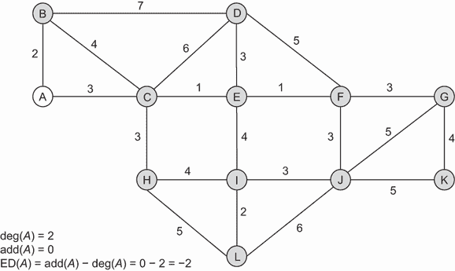

图 4.26 边节点 *A* 情况下的边差


图 4.27 中心节点情况下的边差。括号中的数字表示添加的快捷路径的成本。

+   *合并邻居的数量*—这反映了节点在地图上的分布情况。最好避免在图的小区域内合并所有节点，并确保合并过程中的均匀性。我们首先合并合并邻居数量最少的节点。

+   *快捷覆盖*—这种方法近似地表示节点不可避免的程度（例如，连接城市两部分的桥梁）。它代表节点的邻居数量，因此表示在合并节点后我们需要创建多少快捷路径到或从它们，因为它们是不可避免的节点。快捷覆盖数较少的节点将首先合并。

节点的优先级估计收缩节点的吸引力，可以是先前描述的重要性标准（如边差异、收缩邻居的数量和捷径覆盖）的加权线性组合。在每次迭代中提取最不重要的节点。收缩过程可能会影响节点的重要性，因此我们需要重新计算这个节点的重要性。然后，将新更新的重要性与优先队列顶部的节点（重要性最低）进行比较，以决定是否需要收缩这个节点。更新后重要性最小的节点总是被收缩。

CH 查询阶段

在 CH 查询阶段，我们应用双向 Dijkstra 算法以找到源节点和目标节点之间的最短路径，如下所示（图 4.28）：

+   Dijkstra 算法从源节点出发仅考虑边 *u*,*v* 其中 level(*u*) > level(*v*)，因此你只想放松比你在该迭代中放松的节点级别高的节点。这被称为 *向上图*。在 Dijkstra 算法的上下文中，*放松*一个节点是指通过考虑通过相邻节点更短的路径来更新从源节点到达该节点的估计距离或成本的过程。这有助于细化从源节点到节点的最短路径的估计。

+   Dijkstra 算法从目标节点出发仅考虑边 *u*,*v* 其中 level(*u*) < level(*v*)，因此你只想放松比你在该迭代中放松的节点级别低的节点。这被称为 *向下图*。


图 4.28 CH 查询阶段

一个 CH 示例

考虑以下具有任意节点排序的网络（图 4.29）。圆圈中的数字是节点将被收缩的顺序。边上的数字代表成本。


图 4.29 一个 CH 示例

让我们在该图上运行 CH 算法以获取该道路网络中两个节点之间的最短路径。以下步骤显示了如何应用 CH 算法：

1.  *收缩节点 1*—不需要添加捷径，因为我们没有丢失最短路径（图 4.30）。


图 4.30 使用任意节点排名进行图收缩—收缩节点 1

2.  *收缩节点 2*—不需要添加捷径，因为我们没有丢失最短路径（图 4.31）。


图 4.31 使用任意节点排名进行图收缩—收缩节点 2

3.  *收缩节点 3*—需要添加一个捷径以保持 8 和 5 之间的最短路径，因为没有见证路径。添加的弧的成本是 7（图 4.32）。

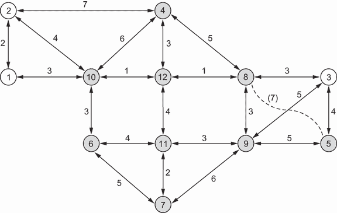

图 4.32 使用任意节点排名进行图收缩—收缩节点 3

4.  *收缩节点 4*—不需要添加捷径（图 4.33）。


图 4.33 使用任意节点排序进行图收缩——收缩节点 4

5.  *收缩节点 5*——不需要添加任何捷径（图 4.34）。


图 4.34 使用任意节点排序进行图收缩——收缩节点 5

6.  *收缩节点 6*——不需要添加任何捷径，因为 7 和 10 之间存在一个见证路径，即 7-11-12-10（图 4.35）。


图 4.35 使用任意节点排序进行图收缩——收缩节点 6

7.  *收缩节点 7*——不需要添加任何捷径（图 4.36）。


图 4.36 使用任意节点排序进行图收缩——收缩节点 7

8.  *收缩节点 8*——需要添加一个捷径以保持 9 和 12 之间的最短路径（图 4.37）。


图 4.37 使用任意节点排序进行图收缩——收缩节点 8

9.  *收缩节点 9*——不需要添加任何捷径（图 4.38）。

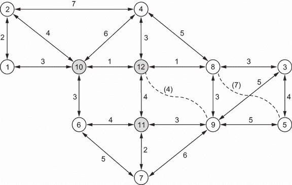

图 4.38 使用任意节点排序进行图收缩——收缩节点 9

10.  *收缩节点 10*——不需要添加任何捷径（图 4.39）。

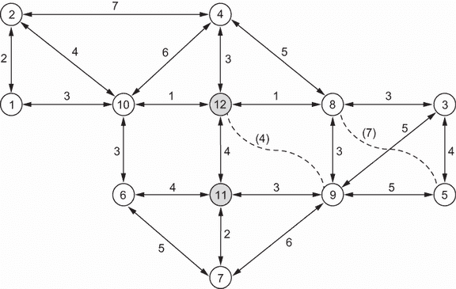

图 4.39 使用任意节点排序进行图收缩——收缩节点 10

11.  *收缩节点 11*——不需要添加任何捷径（图 4.40）。

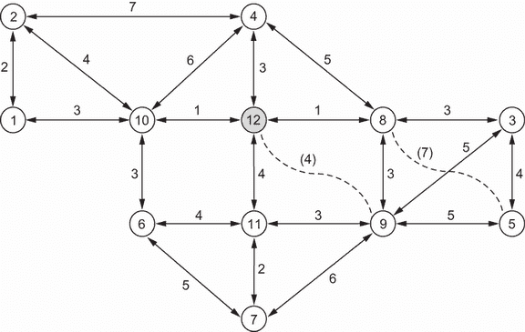

图 4.40 使用任意节点排序进行图收缩——收缩节点 11

12.  *收缩节点 12*——不需要添加任何捷径（图 4.41）。

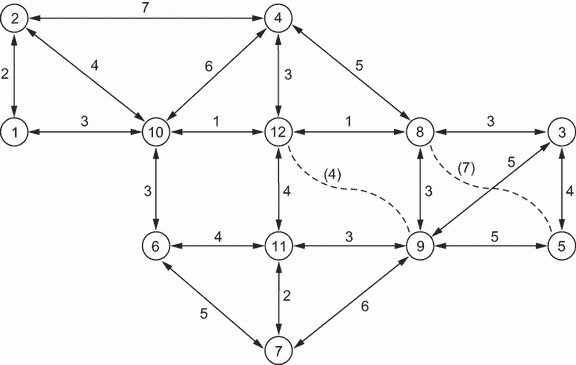

图 4.41 使用任意节点排序进行图收缩——收缩节点 12

现在可以使用双向 Dijkstra 搜索查询收缩后的图。在以下图中，括号中的数字表示添加的捷径的成本。

图 4.42 中的向上图显示了从源到目标的前向 Dijkstra 搜索。实线代表已访问的边，粗实线代表源节点和汇合节点之间的最短路径。

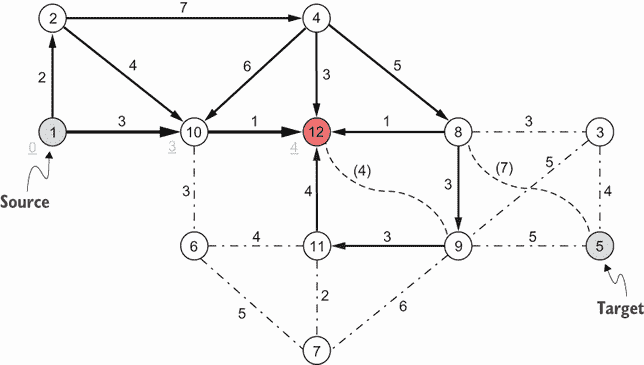

图 4.42 使用 CH 算法解决道路网络问题——向上图

图 4.43 中的向下图显示了从目标到源的反向 Dijkstra 搜索。实线代表已访问的边，粗实线代表目标节点和汇合节点之间的最短路径。


图 4.43 使用 CH 算法解决道路网络问题——向下图

最小值在节点 12（4 + 8 = 12），因此节点 12 是汇合点（图 4.44）。

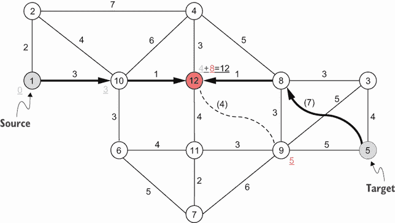

图 4.44 使用 CH 算法解决道路网络问题——汇合点

最短路径将是 1-10-12-8-5。然而，这条路径包含一个快捷（5-8）。实际弧（8-3-5）需要根据收缩过程中存储的快捷指针（节点 3）进行解包。实际最短路径是 1-10-12-8-3-4，成本为 12（图 4.45）。


图 4.45 使用 CH 算法解决道路网络问题——最短路径

列表 4.6 展示了 Python 中的实现。请注意，这里省略了图初始化的代码，因为它与之前的示例类似，但可以在书中 GitHub 仓库的完整列表中查看。同样，图可视化的代码也在完整列表中。

列表 4.6 预定节点顺序的收缩层次

```py
import networkx as nx

shortcuts = {}
shortest_paths = dict(nx.all_pairs_dijkstra_path_length(G,
➥ weight="weight"))
current_G = G.copy()                                                     ①
for node in G.nodes:
    current_G.remove_node(node)                                          ②
    current_shortest_paths = dict(
        nx.all_pairs_dijkstra_path_length(current_G, weight="weight")
    )                                                                    ③
    for u in current_shortest_paths:
        if u == node:
            continue
        SP_contracted = current_shortest_paths[u]
        SP_original = shortest_paths[u]
        for v in SP_contracted:
            if u == v or node == v:
                continue
            if (
                SP_contracted[v] != SP_original[v]
                and G.has_edge(node, u)
                and G.has_edge(node, v)
            ):
                G.add_edge(u, v, weight=SP_original[v],contracted=True)  ④
                shortcuts[(u,v)] = node                                  ④
```

① 复制主图，以便节点只从副本中移除，而不是从主图中移除。

② 通过从复制的图中移除节点来收缩节点。

③ 重新计算最短路径矩阵，现在节点已被收缩。

④ 添加一个快捷边来替换改变后的最短路径，并跟踪它，以便在以后查询时可以解包它。

你会注意到，前面的代码为每个收缩创建了两个快捷边，一个从 *P* 到 *v*，另一个从 *v* 到 *u* 的反向边。由于我们使用的是无向图，这种重复没有影响，因为边 (*u, v*) 与边 (*v, u*) 相同。

查询生成的图需要一个简单的修改后的双向 Dijkstra 搜索，其中如果邻居节点在层次结构中低于当前节点，则取消资格进行扩展。为了本书的目的，我们将使用`networkx.algorithms.shortest_paths.weighted.bidirectional_dijkstra`，略有变化（只有比当前节点层次结构高的节点可以被探索）。作为列表 4.6 的延续，以下代码片段显示了查询过程。修改算法的完整代码可以在书中 GitHub 仓库的列表 4.6 中找到：

```py
sln = bidirectional_dijkstra(G, 1, 5, hierarchy, weight="weight")      ①

uncontracted_route = [sln.result[0]]                                   ②
for u, v in zip(sln.result[:-1], sln.result[1:]): ]]                   ②
    if (u, v) in shortcuts: ]]                                         ②
        uncontracted_route.append(shortcuts[(u, v)])                   ②
    uncontracted_route.append(v)                                       ②
```

使用 NetworkX 运行双向 Dijkstra 算法。

② 解包任何标记为收缩的边，并生成解包路线。

前面的代码将生成一个可以如图 4.46 可视化的解包路线。


图 4.46 解包收缩边后的解决方案路径。双向 Dijkstra 算法返回的原始路线通过收缩边（8,5），然后解包为（8,3）和（3,5）。

收缩层次在预处理阶段消耗了大量的处理时间，但一个正确剪枝的图（即节点收缩顺序良好）可以允许进行更快的查询。虽然在一个有 21 个节点的图上，搜索空间的微小减少是可以忽略的，但某些图可以被剪枝高达 40%，在查询时可以节省显著的成本和时间。在 4.6 列表的例子中，从节点 1 到节点 5 的搜索探索了 11 个节点，而正常双向 Dijkstra 的原始节点是 16 个。这几乎减少了 33%！

## 4.4 将启发式搜索应用于路由问题

让我们再次看看第 3.5 节中介绍的多伦多大学路由问题。我们需要找到从女王公园的国王爱德华七世骑马雕像到信息科技中心的最短路径。搜索空间由一个道路网络表示，其中交叉口和兴趣点（包括起点和终点）是节点，边用于表示带有权重（例如，距离、旅行时间、燃料消耗、转弯次数等）的道路段。让我们看看我们如何可以使用本章讨论的启发式搜索算法找到最短路径。

### 4.4.1 路由的爬山搜索

列表 4.7 使用了来自`optalgotools.routing`的两个函数，这些函数生成随机和子路线。虽然实际的 HC 算法是确定的，但随机化的初始路线意味着在不同的运行中可以得到不同的结果。为了应对这种情况，我们将使用更高的*n*值，这允许更广泛的子路线多样性，因此更有可能得到最优（或近似最优）的解决方案。

列表 4.7 U of T 路由使用爬山算法

```py
def Hill_Climbing(G, origin, destination, n=20):
    time_start = process_time()                                        ①
    costs = []                                                         ①

    current = randomized_search(G, origin.osmid, destination.osmid)    ②
    costs.append(cost(G, current))

    neighbours = list(islice(get_child(G, current), n))                ③
    space_required = getsizeof(neighbours)
    shortest = min(neighbours, key=lambda route: cost(G, route))

    while cost(G, shortest) < cost(G, current):
        current = shortest
        neighbours = list(islice(get_child(G, current), n))
        shortest = min(neighbours, key=lambda route: cost(G, route))
        costs.append(cost(G, current))

    route = current
    time_end = process_time()
    return Solution(route, time_end - time_start, space_required, costs)
```

①跟踪时间和成本以进行比较。

②随机生成一个初始路线。

③获取 k 个邻居（子节点）。

虽然列表 4.7 中的实现是确定的，但初始路线仍然是随机的。这意味着在不同的运行中可能会得到不同的结果。爬山搜索将返回一些相当不错的结果，因为路线函数中局部最优点的数量很少。然而，较大的搜索空间自然会有更多的局部最大值和平台，HC 算法会很快陷入困境。

图 4.47 显示了一个最终解决方案为 806.892 米，这恰好与第三章中 Dijkstra 算法生成的结果相同（一个最优解）。


图 4.47 使用爬山算法生成的最短路径解决方案。这里显示的解决方案使用了一个* n *值为 100，这增加了总处理时间，但返回了更好、更一致的结果。

### 4.4.2 路由的束搜索

路由的束搜索将与 HC 搜索具有类似的格式，但不同之处在于在每个迭代中都会保留一个用于比较的“束”解决方案。4.8 列表的完整代码，包括图初始化和可视化，可以在本书的 GitHub 仓库中找到。

列表 4.8 使用光束搜索算法的 U of T 路由

```py
def get_beam(G, beam, n=20):
    new_beam = []
    for route in beam:
        neighbours = list(islice(get_child(G, route), n))                  ①
        new_beam.extend(neighbours)
    return new_beam

def Beam_Search(G, origin, destination, k=10, n=20):
    start_time = process_time()
    seen = set()                                                           ②
    costs = []                                                             ②
    beam = [randomized_search(G, origin.osmid, destination.osmid) for _ in ②
    ➥  range(k)]                                                          ②

    for route in beam:                                                     ③
        seen.add(tuple(route))

    pool = []
    children = get_beam(G, beam, n)
    costs.append([cost(G, r) for r in beam])
    for r in children:
        if tuple(r) in seen:
            continue
        else:
            pool.append(r)
            seen.add(tuple(r))
    pool += beam
    space_required = getsizeof(pool)
    last_beam = None
    while beam != last_beam:                                               ④
        last_beam = beam
        beam = heapq.nsmallest(k, pool, key=lambda r: cost(G, r))

        for route in beam:
            seen.add(tuple(route))

        pool = []
        children = get_beam(G, beam, n)
        costs.append([cost(G, r) for r in beam])
        for r in children:
            if tuple(r) in seen:
                continue
            else:
                pool.append(r)
                seen.add(tuple(r))
        pool += beam
        space_required = (
            getsizeof(pool) if getsizeof(pool) > space_required else
            ➥ space_required
        )
    route = min(beam, key=lambda r: cost(G, r))                            ⑤
    end_time = process_time()
    return Solution(
        route, end_time - start_time, space_required, np.rot90(costs))     ⑥
```

① 为光束中的每条路线生成子路线。

② 初始化空集合以跟踪已访问节点和路径成本。

③ 已看到的路线必须转换为元组，以便它们是可哈希的，可以存储在集合中。

④ 在生成新光束不再找到更好的解决方案之前，在每个迭代中保留 k 条最佳路线。

⑤ 最终路线是最后光束中的最佳路线。

⑥ 返回最终路线、其成本、处理时间和所需空间。

光束搜索在路由中特别昂贵，因为它们需要为每个光束生成多个子路线。像 HC 一样，生成更多子路线会导致搜索空间的更广泛渗透，因此更有可能返回一个接近或达到最优解的解决方案。图 4.48 显示了由光束搜索生成的最终解决方案。


图 4.48 使用光束搜索算法的最短路径。此解决方案使用*k* = 10 和*n* = 20，这意味着为光束中的每条路线生成 20 条路线，并为每个新光束保留前 10 条路线。较低的*k*和*n*值将提高处理时间，但会降低生成接近最优或最优解决方案的可能性。

### 4.4.3 路由的 A*

下一个列表显示了我们可以如何使用 A*搜索找到两个感兴趣点之间的最短路线。

列表 4.9 使用 A*的 U of T 路由

```py
import osmnx
from optalgotools.routing import (cost, draw_route, astar_heuristic)
from optalgotools.structures import Node
from optalgotools.algorithms.graph_search import A_Star
from optalgotools.utilities import haversine_distance

reference = (43.661667, -79.395)                                       ①

G = osmnx.graph_from_point(reference, dist=300, clean_periphery=True,
➥ simplify=True)                                                      ②

origin = (43.664527, -79.392442)                                       ③
destination = (43.659659, -79.397669)                                  ④

origin_id = osmnx.distance.nearest_nodes(G, origin[1], origin[0])      ⑤ 
destination_id = osmnx.distance.nearest_nodes(G, destination[1],       ⑤
➥ destination[0])                                                     ⑤

origin = Node(graph=G, osmid=origin_id)                                ⑥
destination = Node(graph=G, osmid=destination_id)                      ⑥

solution = A_Star(G, origin, destination, astar_heuristic,             ⑦
➥ heuristic_kwargs={"measuring_dist": haversine_distance})            ⑦
route = solution.result
print(f"Cost: {cost(G,route)} m")                                      ⑧
print(f"Process time: {solution.time} s")                              ⑧
print(f"Space required: {solution.space} bytes")                       ⑧
print(f"Explored nodes: {solution.explored}")                          ⑧
draw_route(G,route) 
```

① 将多伦多国王学院环道设为参考。

② 创建一个图。

③ 将爱德华七世骑马雕像设为起点。

④ 将多伦多大学的信息技术中心设为目标。

⑤ 获取最近节点的 osmid。

⑥ 将源节点和目标节点转换为节点。

⑦ 使用 A*找到最短路径。

⑧ 打印成本、处理时间、所需空间和已探索的节点，并绘制最终路线。

A*搜索的最优性取决于使用的启发式函数。在这种情况下，返回的解决方案不是最优的，但所达到的极高处理速度对于大多数应用来说更为重要。图 4.49 显示了由 A*搜索生成的最终解决方案。

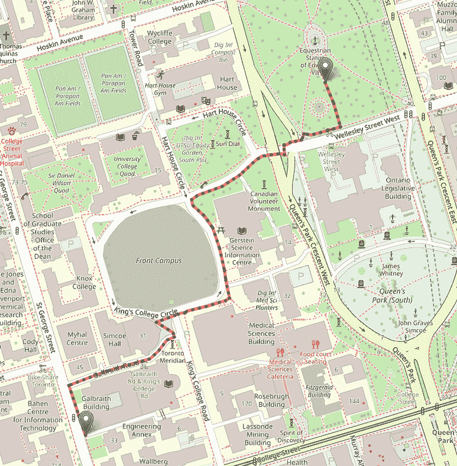

图 4.49 使用 A*算法的最短路径。更接近实际成本的启发式函数将返回更好的结果。

### 4.4.4 路由的收缩层次

为了在道路网络图中运行 CH，我们首先需要按重要性对节点进行排序，然后对图进行收缩。对于这个例子，我们选择边差异（ED）作为节点重要性的度量。

列表 4.10 使用 CH 的 U of T 路由

```py
def edge_differences(G, sp):
    ed = {}
    degrees = dict(G.degree)
    for node in G.nodes:
        req_edges = 0
        neighbours = list(G.neighbors(node))

        if len(neighbours)==0: ed[node] = - degrees[node]     ①

        for u, v in G.in_edges(node):
            for v, w in G.out_edges(node):
                if u == w: continue                           ②
                if v in sp[u][w]:
                    req_edges += 1

        ed[node] = req_edges - degrees[node]                  ③

    return dict(sorted(ed.items(), key=lambda x: x, reverse=True))
```

① 一些节点实际上是死胡同，它们没有出边。这些节点的 ED 等于它们的度数。

② 我们可以忽略双向边——一个起点和终点相同的节点的一个入边和一个出边。

③ 边的差异是需要添加到图中边的数量与节点的度数之间的差异。

将图收缩的过程就像为每条被收缩操作改变的路径添加一条边一样简单。图收缩的完整代码可以在本书的 GitHub 仓库中找到。收缩的边用名为*midpoint*的属性标记，该属性存储了被收缩的节点的 ID。遵循类似于列表 4.6 中使用的修改后的双向 Dijkstra 算法，可以使用以下代码片段轻松地解包最终路由：

```py
def unpack(G, u,v):
    u = int(u)
    v = int(v)
    if "midpoint" in G[u][v][0]:
        midpoint = G[u][v][0]["midpoint"]
        return unpack(G,u,midpoint) + unpack(G,midpoint, v)     ①
    return [u]

route = []
for u,v in zip(solution.result[:-1], solution.result[1:]):      ②
    route.extend(unpack(G,u,v))
route += [solution.result[-1]]
print(route)
```

① 对于每个解包的中点，递归地解包产生的两个边，因为一些收缩边可能包含其他收缩边。

② 解包收缩路由中的每个节点对。

GitHub 仓库还包含了 CH 路由的完整 Python 实现。生成的路由与正常双向 Dijkstra 算法（如第三章中所示）显示的路由相同。如果你还记得，在第三章中运行正常双向 Dijkstra 算法的结果是在搜索过程中探索了 282 个节点。对于我们的 CH 结果，只探索了 164 个节点，这意味着搜索空间减少了超过 40%！因此，虽然算法的优化性保持不变，但收缩层次结构允许在合理的时间内搜索更大的空间。

表 4.1 比较了本章讨论的搜索算法在应用于 U of T 路由问题时的表现。第三章中也有一个类似的表格，用于盲搜索算法。

表 4.1 比较了基于时间和空间复杂度的信息搜索算法，其中*b*是分支因子，*w*是光束宽度，*d*是最浅的图深度，*E*是边的数量，*V*是顶点的数量

| 算法 | 成本（米） | 时间（秒） | 空间（字节） | 探索 | 时间复杂度 | 空间复杂度 |
| --- | --- | --- | --- | --- | --- | --- |
| 岩石上升法 | 806.892 | 21.546 | 976 | 400 节点 | *O*(∞) | *O*(*b*) |
| 光束搜索 | 825.929 | 44.797 | 1,664 | 800 节点 | *O*(*wd*) | *O*(wb) |
| A*搜索 | 846.92 | 0.063 | 8,408 | 80 节点 | *O*(*b^d*) | *O*(*b^d*) |
| 双向 Dijkstra 算法的 CH | 806.892 | 0.0469 | 72 | 164 节点 | *O*(*E* + *V*log*V*) | *O*(*b^d*/2) |

注意：双向 Dijkstra 算法的 CH 所列出的时间仅用于查询。请记住，预处理步骤通常成本很高。在这种情况下，收缩 404 个节点的道路网络大约需要 24.03125 秒。

虽然岩石上升法和光束搜索产生了可尊敬的结果，但它们在时间上的成本太高，对于更大的图来说没有用。A*给出了最快的搜索结果，但非最优的启发式函数，并且需要大量的空间来存储启发式值，因此它也有自己的缺点。双向 Dijkstra 算法的 CH 是表 4.1 中唯一保证最优性的算法，但昂贵的预处理步骤可能不适合所有应用。

在比较搜索算法时，了解任何给定问题的约束条件非常重要，并基于这些约束条件选择算法。例如，某些爬山算法的实现可能导致快速退出条件。如果目标是最大化解决问题的数量（并且如果局部最大值是可以接受的结果），HC 算法会导致快速解决方案，具有一定的最优性。另一方面，预处理密集型算法如 CH 提供了极低的存储成本（在双向搜索实现时更是如此），以及快速搜索保证最优解（如果使用 Dijkstra 算法）。对于预处理不是问题的使用量大的实现（例如，Uber），收缩层次结构是一个可行的选择。实际上，本书中使用的 osrm 包主要基于收缩层次结构的一个实现。

Pandana 是一个用于网络分析的 Python 库，它使用 CH 来计算最短路径和快速旅行可达性指标。在 Pandana 中，CH 的后端代码是用 C++编写的，但可以使用 Python 访问。Pyrosm 是另一个用于读取和解析 OpenStreetMap 数据的 Python 库。它与 OSMnx 类似，但更快，并且与 Pandana 兼容。

下一个列表是一个代码片段，它使用 Pandana 中实现的 CH 算法计算选定城市中感兴趣设施的最短距离。完整的代码可在本书的 GitHub 仓库中找到。

列表 4.11 使用 CH 计算到设施的最近距离

```py
from pyrosm import OSM, get_data
import numpy as np
import matplotlib.pyplot as plt 

osm = OSM(get_data("Toronto"))                                      ①
nodes, edges = osm.get_network(network_type="driving", nodes=True)  ②

hospitals = osm.get_pois({"amenity": ["hospital"]})                 ③

G = osm.to_graph(nodes, edges, graph_type='pandana')                ④

hospitals['geometry'] = hospitals.centroid                          ⑤
hospitals = hospitals.dropna(subset=['lon', 'lat'])                 ⑤

G.precompute(1000)                                                  ⑥

G.set_pois(category='hospitals', maxdist=1000, maxitems=10,         ⑦
➥ x_col=hospitals.lon, y_col=hospitals.lat)                        ⑦

nearest_five = G.nearest_pois(1000, "hospitals", num_pois=5)        ⑧
```

① 获取感兴趣的城市、地区或国家的数据。

② 从具有“驾驶”类型的道路网络中获取节点和边。

③ 获取城市中特定设施的感兴趣点。

④ 创建网络图。

⑤ 确保所有医院都表示为点。

⑥ 预先计算 1,000 米内的距离。

⑦ 将医院附加到 Pandana 图上。

⑧ 对于每个节点，找到距离 1,000 米内最近的五家医院。

在这个例子中，使用 OpenStreetMap 获取多伦多的数据，并创建一个子集以包含该城市医院的数据。然后创建一个 Pandana 对象，并预先计算范围查询，给定一个视距（例如，1,000 米）来表示此距离内的可达节点。对于网络中的每个节点，我们可以使用 Pandana 中实现的快速 CH 算法找到距离 1,000 米内最近的五家医院。

在本书的下一部分，我们将从模拟退火算法和禁忌搜索算法开始，探讨基于轨迹的算法。这些算法改进了局部搜索，并且比之前讨论的贪婪算法更不容易陷入局部最优，因为贪婪算法只接受改进的移动。

## 摘要

+   有信息搜索算法使用领域特定知识或启发式信息来简化搜索过程，同时力求找到最优解或在必要时接受近似最优解。

+   有信息搜索算法可用于解决最小生成树（MST）问题，以及在图中找到两个节点之间的最短路径。

+   Borůvka 算法、Jarník-Prim 算法和 Kruskal 算法是解决最小生成树（MST）问题的启发式搜索算法。MST 是包含所有其他连通加权图生成树中最小权重的树。Kruskal 算法是一种贪婪算法，通过反复添加不会产生环的下一个最短边来计算无向连通加权图的最小生成树。

+   Hill climbing（HC）、beam search、best-first search、A*算法和收缩层次（CH）是有信息搜索算法的例子，可用于在两个节点之间找到最短路径。

+   HC 算法是一种局部贪婪搜索算法，它通过结合领域特定知识或启发式信息来提高深度优先搜索的效率。

+   Beam search 在由 beam width 定义的有限预定义集合内扩展最有希望的节点。

+   最佳优先搜索是一种贪婪算法，它仅基于启发式信息始终扩展离目标节点最近的节点。

+   A*算法是结合了实际成本和从给定状态到达目标状态的启发式成本估计的最佳优先算法的特殊情况。

+   CH 是一种加速技术，用于提高路径查找的性能。在预处理阶段，每个节点按照重要性顺序（从最不重要到最重要）进行收缩，并添加捷径以保留最短路径。然后应用双向 Dijkstra 算法到结果增强图，以计算源节点和目标节点之间的最短路径。
