# 第五章：模拟退火

本章涵盖

+   介绍轨迹型优化算法

+   理解模拟退火算法

+   以函数优化为例，解决连续优化问题

+   以数独游戏问题为例，解决约束满足问题

+   以 TSP（旅行商问题）为例，解决离散问题

+   解决现实世界的半挂车配送路线问题

在本章中，我们将探讨模拟退火作为一种轨迹型元启发式优化技术。我们将讨论该算法的不同元素及其适应性方面。将展示一些案例研究，以展示这种元启发式算法解决连续和离散优化问题的能力。

## 5.1 轨迹型优化介绍

想象一下，你自己在一次徒步旅行中寻找一个崎岖地形中众多山谷和山丘中的最低谷。你没有全局信息或显示最低谷位置的地图。你通过随机选择一个方向开始徒步旅行。你一步步地移动，直到你被困在一个被山丘包围的局部山谷中。你对这个位置并不十分满意，因为你相信在这个区域可能还有更低的山谷，可能就在山丘后面。你的好奇心驱使你爬上一座山丘，以寻找最低谷。

这正是模拟退火（SA）所做的事情。模拟退火算法的基本思想是使用一种随机搜索，遵循试错方法，接受能改进目标函数的变化，同时也保留一些不理想的变化。例如，在最小化问题中，任何能降低目标函数值的移动或变化都将被接受。然而，某些增加目标函数值的移动也会以一定的概率被接受。SA 是一种轨迹型元启发式算法，可用于寻找复杂优化问题的全局最优解。

通常来说，*元启发式算法*可以分为*轨迹型*和*种群型*算法，如图 5.1 所示。


图 5.1 优化算法的探索与开发

*轨迹型元启发式算法*或*S 元启发式算法*，如 SA 或禁忌搜索，使用单个搜索代理以分段方式在搜索空间中移动。更好的移动或解决方案总是被接受，而不太好的移动可以以一定的概率被接受。步骤或移动在搜索空间中绘制出轨迹，该轨迹有非零概率达到全局最优。

相比之下，*种群型算法*或*P 元启发式算法*，如遗传算法、粒子群优化和蚁群优化，使用多个代理来搜索最优或近似最优的全局解。

由于初始种群具有很大的多样性，基于种群的算法自然更偏向于探索，而基于单个或轨迹的算法则更偏向于利用。下一节将更详细地解释 SA 算法。

## 5.2 模拟退火算法

无论你需要解决的是复杂的非线性非微分函数优化问题，还是像数独这样的谜题游戏，学术课程排课问题，旅行商问题（TSP），网络设计问题，任务分配问题，电路划分和放置问题，生产计划和调度问题，甚至是网球锦标赛规划问题，SA 都可以作为这些不同连续和离散优化问题的通用求解器。

在我们使用它来解决不同问题之前，让我们先看看这个求解器的细节。我们将首先了解一下物理退火过程，这是 SA 的灵感来源。

### 5.2.1 物理退火

退火作为一种热处理过程，在包括冶金、玻璃制造和陶瓷在内的各个行业中已经使用了几个世纪。例如，在制造玻璃瓶的背景下，退火消除了由于成型而产生的玻璃中的应力和应变。这是一个重要的步骤，如果不这样做，玻璃可能会因为冷却不均匀而产生的张力积累而破碎。在瓶子冷却到室温后，它们会被检查并最终包装。

退火会改变材料的性质，如强度和硬度。这个过程将材料加热到高于再结晶温度，保持适当的温度，然后冷却材料。随着温度的降低，分子的流动性降低，分子倾向于以晶体结构（图 5.2）排列自己。

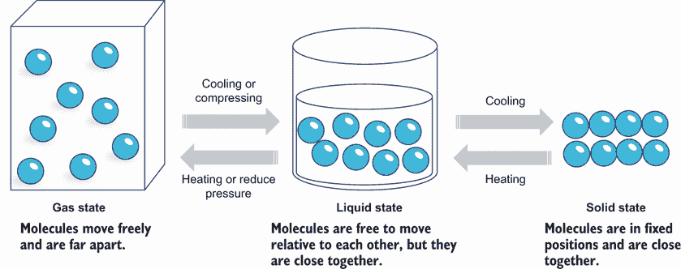

图 5.2 温度对分子流动性的影响

对齐结构是系统的最低能量状态。为了确保这种对齐能够实现，冷却必须以足够慢的速度进行。如果物质冷却得太快，可能会达到具有不规则三维图案的非晶态，如图 5.3 所示。石英、氯化钠、钻石和糖是具有规则排列的构成粒子、原子、离子或分子的晶体固体例子。玻璃、橡胶、沥青和许多塑料是非晶体非晶态固体的例子。正如你可能知道的，由于它们的对称分子结构，石英晶体比玻璃硬。


图 5.3 物理退火。左：具有晶体结构的金属。右：具有无序原子尺度结构的非晶态金属。

注意：退火过程涉及对温度和冷却速率的仔细控制，通常称为退火或冷却计划。退火时间应足够长，以便材料完成所需的转变。如果材料内外温度变化率差异太大，这可能会导致缺陷和裂纹。

对齐结构代表系统最低能量状态的事实启发了科学家们思考如何模仿这个过程来解决优化问题。*模拟*退火是一种模仿物理退火过程的计算模型。在数学优化的背景下，目标函数的最小值代表系统的最低能量。模拟退火是冷却过程的算法实现，用于寻找目标函数的最优值。表 5.1 概述了模拟退火与物理退火过程之间的类比。

表 5.1 物理退火和模拟退火类比

| 物理退火 | 模拟退火 |
| --- | --- |
| 材料状态 | 优化问题的解 |
| 状态的能量 | 解的成本 |
| 温度 | 控制参数（温度） |
| 高温使分子自由移动 | 高温有利于搜索空间探索 |
| 低温限制分子的运动 | 低温导致利用搜索空间 |
| 逐渐冷却有助于减少应力并增加均匀性和结构稳定性。 | 逐渐冷却有助于避免陷入次优局部最小值，并找到全局最优或近似最优解。 |

1953 年，第一个复制物理退火过程的计算模型被引入。该模型被提出作为一种计算物质性质的通用方法，这些物质可以被认为是相互作用的单个分子的集合。S. Kirkpatrick 等人是利用模拟退火进行优化的先驱，如他们在论文《模拟退火优化》[1]中所描述。以下小节解释了模拟退火算法中涉及到的步骤。

### 5.2.2 模拟退火伪代码

模拟退火采用基于马尔可夫链的随机搜索方法，不仅接受降低目标函数（假设为最小化问题）的新解，还可以接受增加目标函数值的概率解。

马尔可夫链

马尔可夫性质，以俄罗斯数学家安德烈·马尔可夫（1856-1922）的名字命名，是一个无记忆的随机过程。这意味着下一个状态只取决于当前状态，而不取决于之前的事件序列。马尔可夫链（MC）是一个随机或概率模型，描述了一系列可能的移动，其中每个移动的概率只取决于前一个移动达到的状态。这意味着从一个状态到另一个状态的转移只取决于当前完全可观察的状态和转移概率。

遵循这个无记忆的随机过程，当前已知状态 A 到下一个邻近状态 B 之间的转移由以下图示的转移概率控制。马尔可夫链在不同的领域中被使用，如随机优化、经济、语音识别、天气预报和控制系统。值得一提的是，Google 的 PageRank 算法使用马尔可夫链来模拟用户在网上的行为。SymPy 通过`sympy.stats.DiscreteMarkovChain`类提供了一个有限离散时间同质马尔可夫链的 Python 实现。

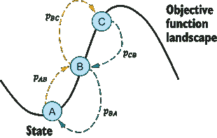

马尔可夫链—*p[AB]*、*p[BA]*、*p[BC]*和*p[CB]*是状态 A、B 和 C 之间的转移概率。

如图 5.4 所示，如果一个新的邻近解或状态 *x[k]* 是一个改进的解（即 *f*(*x[k]*) < *f*(*x[i]*)），那么它总是被接受。改进的解是指在最小化问题中给出目标函数更低值的解，或者在最大化问题中给出更高值的解。对于非改进解，例如 *x[j]*，解决方案仍然可以以概率接受，作为避免陷入局部最优的风险的一种方式。这与贪婪算法倾向于只接受改进解的趋势形成对比，使得贪婪算法更容易陷入局部最优。


图 5.4 转移概率，假设是一个最小化问题。由于解 *x[k]* 是一个改进的移动，它总是被接受，而由于解 *x[j]* 是非改进的，它可能基于转移概率以概率接受。

温度 *T* 出现在转移概率中，并控制搜索空间中的探索和利用。在高温下，非改进的移动有很好的机会被接受，但随着温度的降低，接受更差移动的概率会降低。我们将在以下小节中更详细地讨论这一点。

模拟退火算法的步骤可以总结如下伪代码。

算法 5.1 模拟退火算法

```py
Objective function f(x), x = (x_1, . . . , x_p)^T
Initialize initial temperature T_o, initial guess x_o, iteration counter n=0 and iteration per temperature counter k=0
Set final temperature T_f, kmax maximum number of iterations per temperature and max number of iterations N
Define cooling schedule
Begin
While T > T_f and n < N do
      While k<k_{max}
             Move randomly to a new location/state x_n + 1
             Calculate Δf = f_{n+1}(x_{n+1}) – f_n(x_n)
             If the new solution if better then
                 Accept the new solution
             Else 
                 Generate a random number r
                 Accept if exp(−Δf/T)>r
             k=k+1
        End
        Update T according to the cooling schedule
        n = n + 1
End
Return the final solution
```

SA 算法具有易用性和为广泛连续和离散问题提供最优或近似最优解的能力。该算法的主要缺点是需要调整许多参数，以及算法偶尔会缓慢收敛到最优或近似最优解。

除了这个原始的 SA 算法——经典模拟退火（CSA）之外，还提出了各种变体来提高算法的性能。例如，快速模拟退火（FSA）是一种半局部搜索，由偶尔的长跳跃组成。双重退火是一种用于处理复杂非线性优化问题的随机全局优化算法。它基于经典模拟退火和快速模拟退火算法的组合。广义模拟退火（GSA）算法使用扭曲的柯西-洛伦兹访问分布[2]。

量子退火（QA）

在量子力学中，量子粒子被视为一种可以以一定概率穿透势垒的电磁波。由于量子层面上物质的波动性质，如果势垒足够薄，量子粒子确实有可能穿越这样的势垒。这种现象称为量子隧穿。量子隧穿效应是一种现象，其中波函数或粒子可以穿透一个看似不可逾越的势垒，即使粒子的总能量小于势垒高度。

如以下图所示，SA 使用热跃迁将搜索粒子推出局部山谷，以避免陷入局部最小值。另一方面，QA 通过应用量子效应在能量景观中搜索，以找到最优或近似最优解。量子退火不仅可以通过函数的景观漫步，还可以通过隧道。这允许算法通过量子隧道（隧道效应）而不是 SA 中使用的热跃迁来逃离局部最小值。

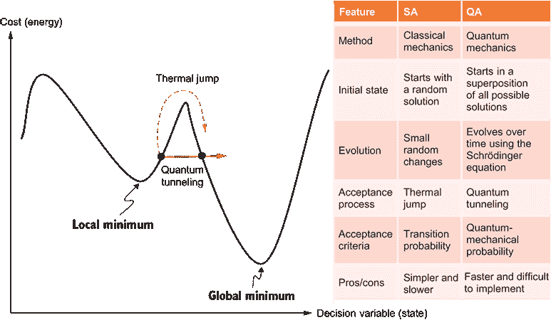

模拟退火与量子退火

在 QA 中，多个候选状态以相等的权重初始化。使用量子力学概率来平行地逐渐改变所有状态振幅。有关更多信息及量子退火器的示例，请参阅 D-Wave 实现：[`docs.dwavesys.com/docs/latest/c_gs_2.html`](https://docs.dwavesys.com/docs/latest/c_gs_2.html)。

下面的子节将解释 SA 算法的不同组件，从允许 SA 接受或拒绝非改进移动的转换概率开始。

### 5.2.3 接受概率

与爬山法（参见第 4.3.1 节）不同，SA 以概率允许向下步骤，由当前温度和移动的糟糕程度控制。在 SA 中，总是接受更好的移动。如图 5.4 所示，非改进的移动可以根据玻尔兹曼-吉布斯分布以概率接受。

在热力学中，温度为 *t* 的状态具有能量幅度增加 Δ*E* 的概率，该概率由玻尔兹曼-吉布斯分布给出，如方程 5.1 所示：

|

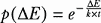

| 5.1 |
| --- |

其中 *k* 是玻尔兹曼常数，它是将气体中粒子的平均相对动能与气体的热力学温度相关联的比例系数，其值为 1.380,649 × 10^(-23) m² kg s^(-2) K^(-1)。然而，在模拟物理退火过程的计算模型中，无需使用此常数，因此它被替换为 1。

此外，能量的变化可以用目标函数的变化来代替，作为量化搜索过程向最优或近似最优状态进展的方法。因此，Δ*E* 可以通过方程 5.2 与目标函数的变化联系起来：

|

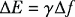

| 5.2 |
| --- |

其中 *γ* 是一个实数常数。为了简化，并且不改变核心意义，我们可以使用 *k* = 1 和 *γ* = 1。因此，转换概率 *p* 简单地变为

|


| 5.3 |
| --- |

其中 *T* 是系统的温度。为了确定是否接受变化，我们通常使用区间 [0,1] 内的随机数 *r* 作为阈值。因此，如果 *p* > *r*，或者 *p* = *e*^((–Δ)*^f* ^/*^T*^) > *r*，则移动被接受。否则，移动被拒绝。

如果 *P[ij]* 是从点 *x[i]* 移动到 *x[j]* 的概率，那么 *P[ij]* 是通过以下方式计算的

|


| 5.4 |
| --- |

*P[ij]* 概率被称为转换或接受概率。以概率接受非改进的移动使得算法能够避免陷入某些局部最小值。如果接受概率设置为 0，模拟退火 (SA) 的行为类似于爬山法，因为它只会接受比当前解更好的解。相反，如果接受概率设置为 1，SA 变得更具探索性，因为它将始终接受更差的解，这使得它更类似于随机搜索。

接受较差状态的概率是系统温度和成本函数变化的一个函数。随着温度降低，接受较差移动的概率降低。温度可以看作是平衡搜索空间中探索和利用的一个参数。在高温下，接受概率高，这意味着算法接受大多数移动来探索参数空间。另一方面，当温度低时，接受概率低，意味着算法限制探索。如图 5.5 所示，如果*T* = 0，则不接受任何非改进移动。在这种情况下，SA 转化为爬山法。可以看出，冷却过程对搜索进度有重要影响。下一节将介绍 SA 中使用的不同冷却调度组件。

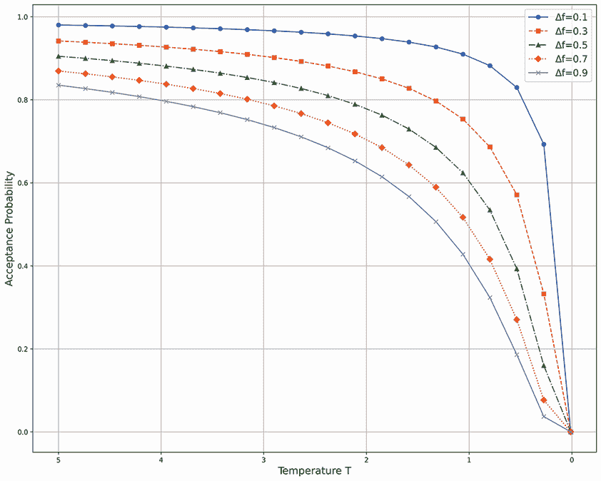

图 5.5 展示了接受概率随温度和目标函数变化的变化。目标函数的变化是指当前解与候选解之间目标函数值的差异。在最小化问题中，目标函数的正变化表示候选解比当前解更差。随着目标函数变化的增加，接受概率会降低。在高温下，SA 倾向于通过接受非改进移动来探索更多。随着温度降低，算法限制探索，偏向于利用。

由于基于玻尔兹曼的接受概率需要大量的计算时间（约占总 SA 计算的 1/3），可以使用查找表或非指数概率公式来代替。可以通过离线进行指数计算，仅针对*f*和*T*的变化范围生成查找表。其他非指数概率公式，如*p*(Δ*f*) = 1 – Δ*f*/*T*，也可以用作接受概率。此公式应归一化，以确保最大值为 1，最小值为 0。

在类似于模拟退火（SA）的计算模型中，没有必要严格模仿控制物理退火过程的动力学模型。图 5.6 展示了指数和非指数接受概率函数之间的差异。代码可在本书的 GitHub 仓库中找到。对于目标函数的小幅变化，指数和非指数接受概率函数之间的差异很小——你可以通过提供的代码进行实验。

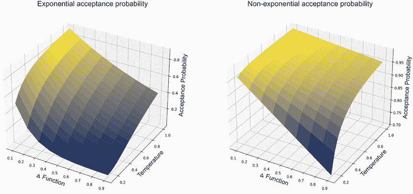

图 5.6 指数与非指数接受概率

由于温度是接受概率的一部分，它在控制 SA 的行为中起着重要作用。以下小节将探讨我们如何控制温度，以在探索和利用之间达到权衡。

### 5.2.4 退火过程

模拟退火中的退火过程涉及对温度和冷却速率的仔细控制，通常称为*退火计划*。这个过程包括定义以下参数：

+   起始温度

+   按照冷却计划后的温度递减

+   每个温度下的迭代次数

+   最终温度

这在图 5.7 中显示。

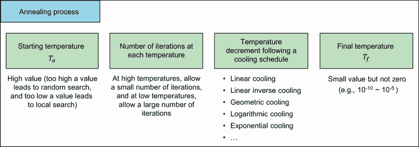

图 5.7 退火过程参数

以下小节提供了关于这些参数的深入了解。

初始温度

选择正确的初始温度至关重要。如方程 5.4 所示，对于给定的变化 Δ*f*

+   如果 *T* 过高 (*T* → ∞)，则 *p* → 1，这意味着几乎所有的变化都将被接受，算法将表现得像随机搜索算法。

+   如果 *T* 太低 (*T* → 0)，则任何 Δ*f* > 0（在最小化问题中假设为更差的解）很少被接受，因为 *p* → 0，因此解的多样性有限，但任何改进（即，在最小化问题中任何 Δ*f* < 0）几乎总是被接受。在这种情况下，模拟退火表现得像局部搜索，可能很容易陷入局部最小值。

为了找到一个合适的起始温度，我们可以使用关于目标函数的任何可用信息。如果我们知道目标函数的最大变化 max(Δ*f*)，我们可以使用这个来估计给定接受概率 *p[o]* 的初始温度 *T[o]*，使用方程 5.5：

|


| 5.5 |
| --- |

如果目标函数的最大潜在变化未知，我们可以使用以下启发式方法：

1.  以非常高的温度开始评估，以便接受几乎所有变化。

1.  快速降低温度，直到大约 50%到 60%的较差移动被接受。

1.  使用这个温度作为新的初始温度 *T[o]*，进行适当且相对缓慢的冷却处理。

温度递减

冷却计划是随着算法的进行系统性地降低温度的速率。这是模拟退火的可调参数之一。以下是一些常用的冷却计划：

+   *线性冷却计划*—使用方程 5.6 线性递减温度：

|


| 5.6 |
| --- |

其中 *T[o]* 是初始温度，*i* 是迭代的伪时间，*β* 是冷却速率，应该选择的方式是当 *i* → *i[f]*（或最大迭代次数 *N*）时 *T* → 0。这通常给出

|


| 5.7 |
| --- |

这种冷却计划简单易行，但可能不是所有类型问题的最佳选择。此外，它需要关于最大迭代次数的先验知识或假设。

+   *线性逆冷却计划*—在线性逆冷却中，温度在高温时迅速下降，在低温时逐渐下降，如方程 5.8 所示。在这个方程中，*α*是冷却因子，应该在 0 和 1 之间：

|

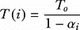

| 5.8 |
| --- |

+   *几何冷却计划*—几何冷却计划本质上是通过冷却因子 0 < *α* < 1 根据方程 5.9 降低温度：

|

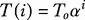

| 5.9 |
| --- |

冷却过程应该足够慢，以便系统可以轻松稳定。在实践中，*α* = 0.7 ~ 0.95 是常用的。*α*的值越高，达到最终（低）温度所需的时间就越长。几何方法的主要优点是当*i*趋向于无穷大时，*T*趋向于 0，因此不需要指定最大迭代次数。此外，几何退火计划提供了更平缓的冷却，如图 5.8 所示。

+   *对数冷却计划*—在这个冷却计划中，温度根据方程 5.10 以对数方式降低：

|


| 5.10 |
| --- |

其中 *α* > 1。从理论上讲，这个冷却过程趋向于全局最小值的渐近收敛。然而，它需要巨大的计算时间。

+   *指数冷却计划*—在这个冷却计划中，温度根据方程 5.11 以指数方式降低：

|

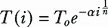

| 5.11 |
| --- |

其中 *α*是冷却因子，*n*是模型空间的维度。在这个冷却过程中，温度在最初的迭代中迅速下降，但指数衰减的速度后来会减慢，并且可以通过冷却因子来控制。


图 5.8 不同的 SA 冷却计划

如您所见，这些冷却计划都是单调递减的函数，并没有明确考虑搜索的进展情况。在第 5.2.5 节中，我们将探讨一种非单调自适应冷却计划。

每个温度下的迭代次数

在应用冷却计划（即，降低温度）之前，允许在每个温度级别进行足够数量的迭代以在该温度下稳定系统是很重要的。通常，这是通过使用一个恒定值来实现的。例如，每个温度下的迭代次数可能与问题规模呈指数关系（例如，TSP 问题中城市的数量作为离散问题或连续问题中数学函数的维度）。然而，这个值可以动态地改变。

实现这一目标的一种方法是在搜索的探索阶段限制初始高温时的迭代次数。例如，当温度高时，我们可以在每个温度下进行少量迭代，然后实施冷却过程。随着搜索的继续和温度的降低，我们可以在较低温度下进行更多迭代，从而转向利用。

最终温度

通常会让温度降低直到为零。然而，这可能会使算法运行时间更长，尤其是在使用某些冷却计划，如几何冷却时。实际上，如果当前温度下接受非改进移动的概率几乎与温度为零时相同，则没有必要让温度达到零。因此，停止标准可以是以下两种之一：

+   一个合适的低温（*T[f]* = 10^(–10) ~ 10^(–5)）

+   当系统达到“冻结”或最小能量状态（假设是优化问题），既不接受更好的移动也不接受更差的移动时。

### 5.2.5 SA 中的自适应

SA 中的一些参数可以用来使算法更适应搜索的进程。这些参数中最关键的是初始温度、冷却计划和每温度下的迭代次数。其他组件包括成本函数、生成邻域解的方法和接受概率。

如图 5.9 所示，初始温度可以用来控制 SA 的探索和利用行为。高温导致高水平的探索，而低温则导致利用行为（即限制在邻居周围的搜索）。

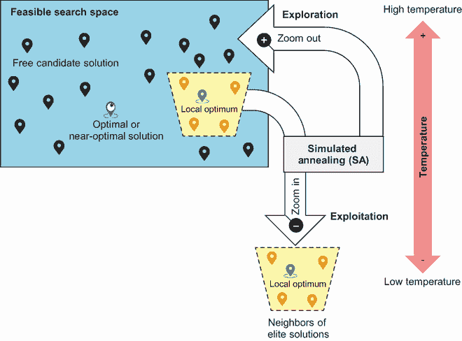

图 5.9 SA 中温度的影响。高温导致更多的探索，而低温则限制探索并导致搜索空间中更多的利用。

你可以从分子的运动来思考这个问题。假设分子是搜索代理。在高温下，分子在搜索空间中自由移动，探索不同的解决方案。在低温下，分子的运动变得有限，因此探索受到限制，搜索代理专注于搜索空间的一个特定部分。在搜索开始时的高温下，由于探索行为使算法以高概率接受非改进移动，SA 会因振荡而波动。随着搜索的进行和温度的降低，算法开始由于利用行为而稳定下来，这种利用行为使算法接受较少的非改进移动，并专注于精英改进解决方案。

始终建议您从高温开始，随着搜索的进行逐渐降低温度。然而，正确的初始温度取决于问题。您可以尝试不同的值，看看哪个能导致更好的解决方案。一些研究人员建议自适应地这样做，使用其他搜索方法或元启发式算法，如遗传算法。

冷却计划也可以用来使算法更具适应性。可以在搜索的不同阶段使用不同的冷却计划，考虑到最有用的工作通常在计划的中部完成。如果观察到没有进展，也可以尝试重新加热。冷却可以在每次接受移动（或特定数量的移动）时发生。可以尝试非单调的自适应冷却计划，其中使用一个自适应因子，基于当前解决方案的目标与算法到那时为止实现的最佳目标之间的差异，根据以下公式：

|


| 5.12 |
| --- |

其中 *T* 是每个状态转换时的系统温度，*T*(*i*) 是当前温度，*f[i]* 是迭代 *i* 时目标函数的值，*f*^* 是迄今为止获得的目标函数的最佳值。

另一个适应参数是每个温度下的迭代次数。这个数字可以通过在高温度下允许少量迭代和在低温度下允许大量迭代来自适应地改变，以充分探索局部最优解。

SA 算法的适应能力也可能受到目标函数和问题约束表示的影响。一般来说，建议避免产生多个状态相同结果的成本函数（例如，在 TSP 路中包含的边的数量）。这种类型的函数不会引导搜索，因为它可能不会在目标函数从一个状态到另一个状态时发生变化。

例如，想象两条具有相同边数的可行路线（即，Δ*f* = 0）。依赖边的数量作为成本函数并不是一个好主意。然而，许多问题都有可以使用奖励或惩罚项表示的约束。使算法更具适应性的方法之一是动态改变奖励和惩罚项的权重。在搜索的初始阶段，约束可以比搜索的高级阶段更宽松。

已有众多努力使 SA 参数的选择和控制完全自适应。这种努力的例子之一是由 Ingber 在“自适应模拟退火（ASA）：经验教训” [3] 中提出的。ASA 自动调整控制温度计划的算法参数，只需用户指定冷却速率。该方法使用先前接受的步骤和参数的线性随机组合来估计新的步骤和参数。

Geng 等人提出了一种带有贪婪搜索的 ASA 算法（ASA-GS）来解决 TSP 问题[4]。ASA-GS 基于经典的 SA 算法，并利用贪婪搜索技术来加速收敛速度。ASA 利用动态调整参数，如温度冷却系数、贪婪搜索迭代次数、强制接受实例以及接受新解决方案的概率。这些自适应参数控制旨在增强质量和时间效率之间的权衡。

SA 在各个领域都有广泛的应用。它的效用扩展到解决各种优化问题，包括非线性函数优化、TSP、学术课程安排、网络设计、任务分配、电路划分和放置、机器人运动规划、车辆路径以及资源分配和调度。以下各节将展示如何在不同领域使用 SA 来解决连续和离散优化问题。

## 5.3 函数优化

作为连续优化问题的例子，让我们考虑以下简单的函数优化问题：在约束条件 0 ≤ *x* ≤ 31 下，找到 *x* 以最小化 *f*(*x*) = (*x* – 6)²。

我们可以从 *x* 的范围内开始一个初始随机解决方案。可以通过添加一个从高斯或正态分布中选择的随机浮点值来生成不同的邻近解决方案，该分布具有给定的均值和标准差。以下是如何在 Python 中使用 `random.gauss()` 函数的示例：

```py
import random
mu, sigma = 0, 1 # mean and standard deviation
print(random.gauss(mu, sigma))
```

假设初始温度 *T*[0] = 5，每个温度的迭代次数为 2，几何冷却因子 *α* = 0.85。让我们进行几次手动迭代，以展示 SA 如何解决这个问题：

+   *初始化*—随机生成一个初始解决方案，并按以下方式评估其成本：*x* = 2 和 *f*(2) = 16。

+   *迭代 1*—通过以下代码使用高斯分布添加一个随机值来生成一个新的解决方案 *x* = 2.25：

```py
import numpy as np
x=x+np.random.normal(mu, sigma, 1)
```

*f*(2.25) = 14.06 是一个改进的解决方案，因此被接受。

+   *迭代 2*—通过向上一迭代中最后接受的解决方案添加一个随机值来生成一个新的解决方案。新的解决方案 *x* = 2.25 – 1.07 = 1.18，*f*(1.18) = 23.23 是一个非改进的解决方案，因此必须计算接受概率：*p* = *e*^(–Δf /T) = *e*^(–(23.23 – 14.06)/5) = 0.1597。我们生成一个介于 (0,1) 之间的随机数 *r*，假设它是 *r* = 0.37。由于 *p* ≯ *r*，我们拒绝这个解决方案。

+   *迭代 3*—我们更新了温度，因为我们已经使用了初始温度 *T[0]* = 5 进行了两次迭代。按照几何冷却，新的温度是 *T[1]* = *T[o] α^i* = 5*0.85¹ = 4.25。我们将从这次迭代开始使用这个值进行两次迭代。现在我们将基于最后一个接受的解生成一个新的解，通过添加高斯分布的随机值。新的解是 *x* = 2.25 + 1.57 = 3.82，且 *f*(3.82) = 4.75。这是一个改进的解，因此它被接受，搜索继续。

SciPy 为 SA 算法和其他处理数学优化问题的算法提供了 Python 实现。`scipy.optimize.anneal` 在 SciPy 中已弃用，取而代之的是 `dual_annealing()` 函数。以下列表展示了使用 SciPy 双重退火算法求解 Bohachevsky 函数（该函数的公式为 *f*(*x[1]*,*x[2]*) = *x[1]*² + 2*x[2]*² – 0.3cos(3*πx[1]*) – 0.4cos(3*πx[2]*) + 0.7）的解。完整的列表可在本书的 GitHub 仓库中找到。

列表 5.1 使用 `scipy.optimize.dual_annealing` 进行函数优化

```py
#!pip install scipy
import numpy as np
from scipy.optimize import dual_annealing

def objective_function(solution):                                                 ①
    return solution[0]**2 +2*(solution[1]**2) - 0.3*np.cos(3*np.pi*solution[0]) –
➥ 0.4*np.cos(4*np.pi*solution[1]) + 0.7

bounds = np.asarray([[-100, 100], [-100, 100]])                                   ②

res_dual = dual_annealing(objective_function, bounds=bounds, maxiter = 100)       ③

print('Dual Annealing Solution: f(%s) = %.5f' % (res_dual['x'], res_dual['fun'])) ④
```

① 定义目标函数或函数（例如，Bohachevsky 函数）。

② 定义决策变量的边界约束。

③ 执行双重退火搜索。

④ 打印双重退火解。

MEALPY 是另一个提供不同自然启发式元启发式算法实现的 Python 库（更多详细信息请见附录 A）。作为延续，以下代码展示了使用 MEALPY SA（列表 5.1 的完整版本可在本书的 GitHub 仓库中找到）求解 Bohachevsky 函数的解：

```py
#!pip install mealpy
from numpy import exp, arange
import matplotlib.pyplot as plt
from pylab import meshgrid,cm,imshow,contour,clabel,colorbar,axis,title,show
from mealpy.physics_based.SA import OriginalSA 

problem = {"fit_func": objective_function,"lb": [bounds[0][0], bounds[1][0]], "ub":
➥ [bounds[0][1], bounds[1][1]], "minmax": "min", "obj_weights": [1, 1]}    ①

epoch = 100                                                                 ②
pop_size = 10                                                               ②
max_sub_iter = 2                                                            ②
t0 = 1000                                                                   ②
t1 = 1                                                                      ②
move_count = 5                                                              ②
mutation_rate = 0.1                                                         ②
mutation_step_size = 0.1                                                    ②
mutation_step_size_damp = 0.99                                              ②

model = OriginalSA(epoch, pop_size, max_sub_iter, t0, t1, move_count, mutation_rate,
➥ mutation_step_size, mutation_step_size_damp)                             ③

mealpy_solution, mealpy_value = model.solve(problem)                        ④

print('MEALPY SA Solution: f(%s) = %.5f' % (mealpy_solution, mealpy_value)) ⑤
```

① 定义问题

② 定义 MEALPY 算法参数以使用 MEALPY 进行 SA 搜索。

③ 定义 MEALPY SA 求解器。

④ 使用定义的求解器解决问题。

⑤ 打印 MEALPY SA 解。

图 5.10 展示了 Bohachevsky 函数的解。算法的性能主要取决于其参数调整和停止标准。MEALPY 运行 SA 的并行版本，并公开了许多可调整的参数。

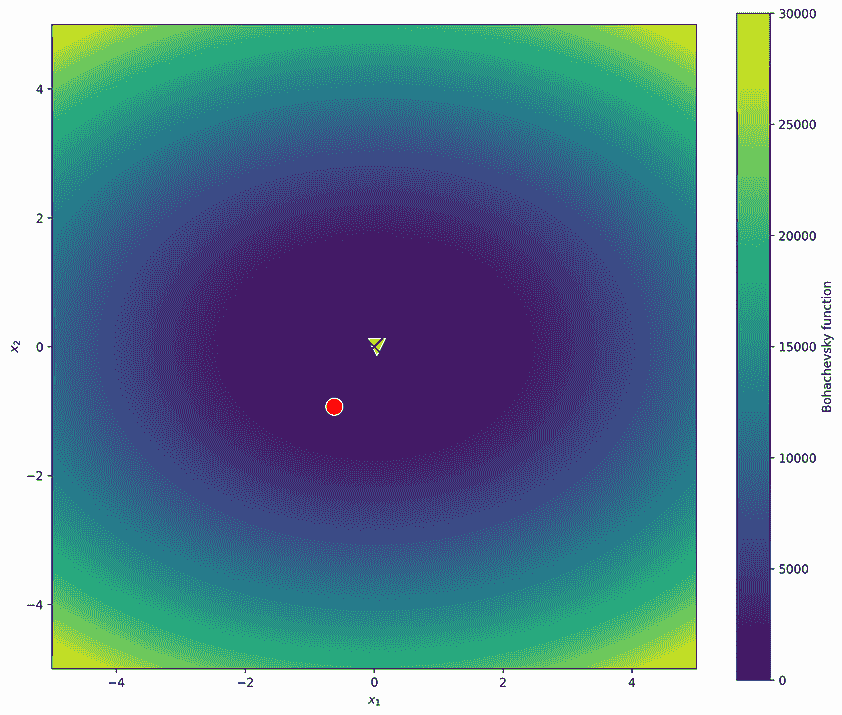

图 5.10 使用 SA 解决连续函数优化问题的解。中心处的十字是最佳解。三角形是 MEALPY SA 获得的解。点是 SciPy 双重退火解。

注意附录 A 展示了如何在其他 Python 包中使用 SA 解决数学优化问题。

让我们从头实现 SA 算法，这样我们可以获得更多的控制，并更好地处理不同类型的连续和离散优化问题。在我们的 optalgotools 包实现中，我们将问题定义与求解器解耦，这样我们就可以使用求解器来处理不同的问题。

让我们将我们的实现应用于寻找上述简单函数优化问题的全局最小值以及更复杂的函数优化问题。在多维空间中存在几个复杂的数学函数，例如 Rosenbrock 函数、Ackley 函数、Rastrigin 函数、Schaffer 函数、Schwefel 函数、Langermann 函数、Levy 函数、Bukin 函数、Eggholder 函数、交叉托盘函数、滴波函数和 Griewank 函数。函数优化测试问题和数据集的示例可以在附录 B 中找到。

列表 5.2 展示了如何使用 SA 解决以下数学函数：

+   *一个简单的二次方程*—这是我们手动迭代中使用的。

+   *Bohachevsky 函数（全局最小值 0）*—这是一个具有碗形形状的 2D 单峰函数。此函数已知是连续的、凸的、可分离的、可微的、非多模态的、非随机的和非参数的，因此基于导数的求解器可以有效地处理它。请注意，变量可以分离的函数被称为*可分离函数*。非随机函数不包含随机变量。非参数函数假设数据分布不能通过有限参数集来定义。

+   *Bukin 函数*—此函数具有许多局部极小值，所有这些极小值都位于脊上，并且在 *x[0]* = *f*(−10,1) 处有一个全局最小值 *f*(*x[0]*) = 0。此函数是连续的、凸的、不可分离的、不可微的、多模态的、非随机的和非参数的。这需要一个无导数求解器（也称为黑盒求解器）如 SA。

+   *Gramacy & Lee 函数*—这是一个具有多个局部极小值和局部及全局趋势的 1D 函数。此函数是连续的、非凸的、可分离的、可微的、非多模态的、非随机的和非参数的。

+   *Griewank 1D、2D 和 3D 函数*—这些函数具有许多广泛分布的局部极小值。这些函数是连续的、非凸的、可分离的、可微的、多模态的、非随机的和非参数的。

在我们的实现中，这些是 SA 参数：

+   最大迭代次数：`max_iter=1000`

+   每个温度的最大迭代次数：`max_iter_per_temp=100`

+   一个初始温度：`initial_temp=1000`

+   一个最终温度：`final_temp=0.0001`

+   一个冷却计划：`cooling_schedule='geometric'`（可用选项：`'linear'`、`'geometric'`、`'logarithmic'`、`'exponential'`、`'linear_inverse'`)

+   一个冷却因子：`cooling_alpha=0.9`

+   一个调试选项：`debug=1` (`debug=1` 打印初始和最终解；`debug=2` 提供手动迭代跟踪)

随意更改这些设置并观察它们对算法性能的影响。

列表 5.2 使用 SA 进行连续函数优化

```py
import random
import math
import numpy as np
from optalgotools.algorithms import SimulatedAnnealing
from optalgotools.problems import ProblemBase, ContinuousFunctionBase

def simple_example(x):                                                       ①
    return (x-6)**2                                                          ①

simple_example_bounds = np.asarray([[0, 31]])                                ①
simple_example_obj = ContinuousFunctionBase(simple_example, simple_example_  ①
➥ simple_example_bounds)                                                    ①
sa = SimulatedAnnealing(max_iter=1000, max_iter_per_temp=100,                ①
➥ initial_ temp=1000, final_temp=0.0001, cooling_schedule='geometric',      ①
➥ cooling_alpha=0.9, debug=1)                                               ①
sa.run(simple_example_obj)                                                   ①

def Bohachevsky(x_1, x_2):                                                   ②
    return x_1**2 +2*(x_2**2)-0.3*np.cos(3*np.pi*x_1)-0.4*np.cos(4*np.       ② 
pi*x_2)+0.7                                                                  ②

Bohachevsky_bounds = np.asarray([[-100, 100], [-100, 100]])                  ②
Bohachevsky_obj = ContinuousFunctionBase(Bohachevsky, Bohachevsky_bounds, 5) ②
sa.run(Bohachevsky_obj)                                                      ②

def bukin(x_1, x_2):                                                         ③
    return 100*math.sqrt(abs(x_2-0.01*x_1**2)) + 0.01 * abs(x_1 + 10)        ③

bukin_bounds = np.asarray([[-15, -5], [-3, 3]])                              ③
bukin_obj = ContinuousFunctionBase(bukin, bukin_bounds, 5)                   ③
sa.run(bukin_obj)                                                            ③

def gramacy_and_lee(x):                                                      ④
    return math.sin(10*pi*x)/(2*x) + (x-1)**4                                ④

gramacy_and_lee_bounds = np.asarray([[0.5, 2.5]])                            ④
gramacy_and_lee_obj = ContinuousFunctionBase(gramacy_and_lee, gramacy_and_   ④
➥ lee_bounds, .1)                                                           ④
sa.run(gramacy_and_lee_obj)                                                  ④

def griewank(*x):                                                            ⑤
    x = np.asarray(x)                                                        ⑤
    return np.sum(x**2/4000) - np.prod(np.cos(x/np.sqrt(np.asarray(range(1,  ⑤
    ➥ len(x)+1))))) + 1                                                     ⑤

griewank_bounds = np.asarray([[-600, 600]])                                  ⑤
griewank_1d=ContinuousFunctionBase(griewank, griewank_bounds, 10)            ⑤
sa.run(griewank_1d)                                                          ⑤

griewank_bounds_2d = np.asarray([[-600, 600]]*2)                             ⑥
griewank_2d=ContinuousFunctionBase(griewank, griewank_bounds_2d,             ⑥
➥ (griewank_bounds_2d[:, 1] - griewank_bounds_2d[:, 0])/10)                 ⑥
sa.run(griewank_2d)                                                          ⑥

griewank_bounds_3d = np.asarray([[-600, 600]]*3)                             ⑦
griewank_3d=ContinuousFunctionBase(griewank, griewank_bounds_3d,             ⑦
➥ (griewank_bounds_3d[:, 1] - griewank_bounds_3d[:, 0])/10)                 ⑦
sa.run(griewank_3d)                                                          ⑦
```

① 二次函数 SA 的解决方案

② 基于 Bohachevsky SA 的解决方案

③ 基于 Bukin SA 的解决方案

④ 基于 Gramacy & Lee SA 的解决方案

⑤ 基于 Griewank 1D SA 的解决方案

⑥ 基于 Griewank 2D SA 的解决方案

⑦ Griewank 3D SA-based solution

这是 Bukin 函数输出的一个示例：

```py
Simulated annealing is initialized:
current value = 60.73784664253138, current temp=1000
Simulated Annealing is done: 
curr iter: 154, curr best value: 0.6093437608551259, curr temp:9.97938882337113e-05, curr best: sol: [-14.63282848   2.14122839]
global minimum: x = -14.6328, 2.1412, f(x) = 0.6093
```

如所示，模拟退火（SA）能够处理不同的多维、非线性函数优化问题。这个随机全局优化算法能够适应目标函数的景观并避免陷入局部最小值。然而，在多维函数如 Griewank 2D 和 3D 的情况下，SA 需要时间才能收敛。以下章节将展示 SA 如何处理如数独和 TSP 之类的离散问题。

## 5.4 解数独

数独，也称为苏杜克，是有史以来最受欢迎的数字谜题之一。这个游戏是从一个称为*拉丁方*的数学概念改编而来的。数独谜题的第一个版本是由一位名叫霍华德·加恩斯的退休建筑师创造的，于 20 世纪 70 年代末作为《Dell 铅笔谜题和文字游戏》中的谜题出现。该游戏随后于 1984 年在日本以“数独”的名字出现，这个名字是从日语“数は独り立ちます”缩写而来，意味着数字（或数字）必须保持单一。如今，数独游戏在全球范围内都很受欢迎，并发表在游戏网站、谜题手册和报纸上。

数独游戏可以被视为一个约束满足问题（CSP），通过正确填充一个 9 × 9 的网格，使得每一列、每一行以及九个 3 × 3 的子网格（又称“盒子”、“区块”或“区域”）都包含从 1 到 9 的所有数字。任何一行、一列或 3 × 3 的子网格都不应包含超过一个相同的数字（从 1 到 9）。

除了娱乐之外，数独在现实生活中的应用还包括发展心理学和隐写术。例如，有几项研究表明，解决数独或填字游戏或其他脑力游戏可能有助于保持你的大脑年轻 10 年，并可以减缓如阿尔茨海默病等疾病的发展。数独还可以用作提高解决问题的能力、批判性思维和注意力的工具。最后，隐写术是将图像、消息、文件或其他秘密数据隐藏在非秘密事物中的技术。在秘密数据传输应用中，数字图像可以用来隐藏秘密数据。然后，使用数独谜题根据特别设计的参考矩阵修改封面图像中的选定像素对，以插入秘密数字。

拉丁方

拉丁方是由 10 世纪的阿拉伯数字学家发明的，他们处理数字的神秘力量。13 世纪的伊斯兰护身符，称为 wafq majazi，被发现，它们被绘制在 16 世纪阿拉伯医学文本的边缘。名字“拉丁”是受到著名的瑞士数学家莱昂哈德·欧拉（1707–1783）的启发，他在方阵中使用拉丁字母作为符号。

*拉丁方*是一个*n* × *n*的数组，填充了*n*个不同的数字、符号或颜色，以这样的方式排列，即任何正交（行或列）都不会包含相同的数字、符号或颜色两次。这里展示了一个 4 × 4 拉丁方的例子：

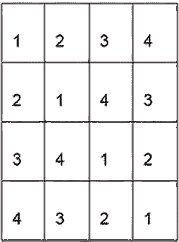

拉丁方与*幻方*不同。幻方是一个正整数 1, 2, ..., *n*²的平方数组，这些数按照这样的方式排列，即任何水平、垂直或主对角线上的*n*个数的和总是相同的数。数独基于拉丁方。事实上，任何数独谜题的解决方案都是一个拉丁方。KenKen 和 KenDoku 是基于拉丁方增强版本的其它数字谜题，需要一定程度的算术技能。

通常来说，数独的搜索空间非常庞大。存在 6.671 × 10²¹种可能的可解数独网格，它们会产生一个唯一的结果[5]。根据大英百科全书，如果地球上每个人每秒解决一个数独谜题，他们要到大约 30,992 年才能全部解决。然而，去除对称性，例如旋转、反射、列和行的排列以及数字的交换，本质上不同的数独网格数量减少到 5,472,730,538 ≈5.473 × 10⁹[6]。广义的 *n* × *n* 数独问题是一个 NP 完全问题。然而，一些实例，例如标准的 9 × 9 数独，并不是 NP 完全的。存在常数时间算法可以解决一些 9 × 9 数独的实例，在*O*(1)时间内解决，因为每个 9 × 9 数独都可以在一个有限的字典或查找表中列出、枚举和索引，以找到解决方案。然而，这些算法无法处理任意的广义 *n* × *n* 数独问题。

回溯法、舞链法和克罗克的纸笔法是解决数独的常见算法，尤其是当问题规模较小时。*回溯法*主要是一种经典的深度优先搜索，它会测试整个分支，直到该分支违反规则或返回一个解决方案。

*舞链法*（DLX），由唐纳德·克努斯于 2000 年发明，使用算法 X 来解决数独谜题，将其作为精确覆盖问题处理。在精确覆盖问题中，给定一个二元矩阵（即仅由 0 和 1 组成的矩阵），需要找到一组行，每列恰好包含一个 1。算法 X，一种递归搜索算法，通过回溯法应用于解决精确覆盖问题。

在*克罗克的铅笔和纸算法*中，每个单元格中所有可能的数字都被列出。这个数字列表被称为单元格的标记。然后我们尝试找出是否有行、列或块中只有一个可能的值贯穿整个行、列或块。一旦找到，我们就用这个数字填写这个单元格，并更新任何受影响的行、列或框的标记。下一步是找到先发制人的集合。正如克罗克的论文中描述的那样，先发制人的集合由集合[1,2,…,9]中的数字组成，是一个大小为*m*的集合，2 ≤ *m* ≤ 9，其数字是*m*个单元格的潜在占用者，其中“独家”意味着集合[1,2,…,9]中的其他数字（除了先发制人集合的成员）不可能是那些*m*个单元格的潜在占用者。最后一步是消除先发制人集合外的可能数字。

回溯

回溯算法通常通过递归用于解决搜索和优化问题。回溯算法增量地构建一个可行解或一组可行解。给定一个 9×9 数独板，算法按照深度优先遍历顺序访问所有空单元格，增量地填写数字，并在找不到有效数字时回溯。以下图展示了 9×9 数独谜题的回溯算法步骤。


9×9 数独的回溯步骤

下一个列表展示了如何使用 SA 算法解决 9×9 数独。

列表 5.3 使用 SA 解决数独

```py
from optalgotools.algorithms import SimulatedAnnealing                 ①
from optalgotools.problems import Sudoku                               ②

sa = SimulatedAnnealing(max_iter=100000, max_iter_per_temp=1000, 
➥ initial_temp=500, final_temp=0.001, cooling_schedule='geometric',
➥ cooling_alpha=0.9, debug=1)                                         ③

Sudoku_hard = [
    [9, 0, 0, 1, 0, 0, 0, 5, 4],
    [0, 0, 0, 0, 8, 0, 0, 0, 0],
    [0, 0, 5, 0, 0, 9, 0, 0, 3],
    [0, 9, 0, 0, 3, 5, 0, 4, 1],
    [0, 0, 0, 0, 1, 0, 0, 0, 0],
    [4, 1, 0, 2, 6, 0, 0, 8, 0],
    [7, 0, 0, 3, 0, 0, 1, 0, 0],
    [0, 0, 0, 0, 4, 0, 0, 0, 0],
    [3, 5, 0, 0, 0, 1, 0, 0, 6],
]
sudoku_prob = Sudoku(Sudoku_hard)    
sudoku_prob.print()                                                   ④
                                                                      ④
sudoku_prob.solve_backtrack()                                         ⑤
sa.run(sudoku_prob, 0)                                                ⑥
```

① 导入 SA 求解器。

② 导入数独问题。

③ 使用所选参数创建 SA 求解器。

④ 创建一个硬 9×9 数独（可用变体包括简单、容易、中等、困难、邪恶）。

⑤ 使用回溯算法解决数独。

⑥ 使用 SA 解决数独。

您可以通过更改谜题配置来尝试不同的数独变体。在简单的数独问题中，单元格包含比中等或困难问题更多的预填数字。邪恶数独是谜题难度的最高级别。表 5.2 比较了 SA、回溯和 Python 线性规划（PuLP）库解决不同 9×9 数独实例所需的时间。PuLP 提供线性混合编程求解器。PuLP 中使用的默认求解器是 Cbc（COIN-OR 分支和切割），它是一个用于混合整数线性规划问题的开源求解器。有关 PuLP 的更多信息，请参阅附录 A。

表 5.2 SA 与回溯与 PuLP 在解决 9×9 数独谜题中的比较

| 找到解的时间 | 简单 | 容易 | 中等 | 困难 | 邪恶 |
| --- | --- | --- | --- | --- | --- |
| 回溯 | 0.01 | 0.01 | 0.11 | 0.69 | 1.58 |
| PuLP | 0.69 | 0.12 | 0.11 | 0.13 | 0.12 |
| 经典 SA | 0.10 | 0.07 | 0.01 | 3:17 | 在 3:16 时次优 |

如您所见，经典 SA 在解决数独问题的困难实例和邪恶实例时，并不优于回溯方法，并且速度要慢得多。与回溯和 SA 相比，PuLP 能够高效地以一致的时间处理不同类型的数独。

在邪恶数独的情况下，尽管尝试了不同的参数设置，SA 仍然收敛到一个次优解。鉴于这是一个约束满足问题，次优解的概念是不成立的，因为次优解是一个无效解。这意味着 SA 无法解决数独的邪恶实例。作为一个结构良好的问题，不同难度的 9×9 数独可以很容易地使用回溯算法解决。一般来说，如果问题结构良好，有已知的算法解决方案，元启发式方法通常不会优于这些经典和更确定性的方法。

## 5.5 解决 TSP

如 2.1.1 节所述，旅行商问题（TSP）被用作研究可以应用于广泛离散优化问题的一般方法的平台。考虑使用 SA 解决图 5.11 所示的 TSP 实例。在这个 TSP 中，旅行商必须访问五个城市并返回家中，形成一个循环（往返）。


图 5.11 五城市 TSP—假设对称 TSP，有 5!/2=60 种可能的旅行路线。图中的边权重代表城市之间的旅行距离。

假设以下值：初始温度=500，最终温度=50，线性递减率为 50，每个温度下进行一次迭代。TSP 解的形式如下：解=[1, 3, 4, 2, 5]。目标函数是路线的总距离。交换是一个合适的算子，可以用来生成邻近解：

+   *迭代 0*—初始解是解=[1, 3, 4, 2, 5]，成本=2+4+5+5+12=28，如图 5.12 所示。


图 5.12 5 个城市 TSP 的 SA 迭代 0

+   *迭代 1*—为了生成一个候选解，选择两个随机城市（例如，2 和 3），并交换它们。这导致一个新的解[1, 2, 4, 3, 5]，成本为 35（见图 5.13）。

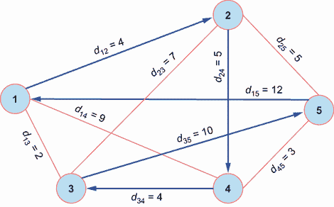

图 5.13 5 个城市 TSP 的 SA 迭代 1

由于新解的旅行路线更长，它将根据概率*p* = *e*^–^Δ*^f* ^/*^T* = *e*^(–(35–28) /)*^T* = *e*^(–7 /)*^T*（在较高温度下，接受概率更高）有条件地被接受。我们在 0 和 1 之间随机选择一个值*r*。如果*P* > *r*，我们接受这个解。否则，我们拒绝这个解。假设新解没有被接受，我们从初始解开始生成另一个解：

+   *迭代 2*—通过交换初始解中的城市 2 和 5 生成一个解。候选解的旅行长度为 18（图 5.14）。

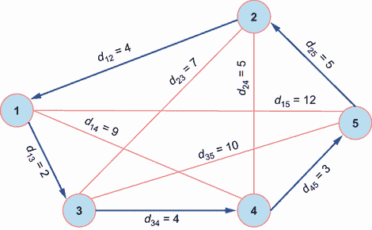

图 5.14 5 城市 TSP 的 SA 迭代 2

由于这个解的旅行长度更短，它将被接受，并且搜索将继续，直到满足终止条件。下面的列表显示了此简单 TSP 问题的 SA 解。

列表 5.4 使用 SA 解决 TSP

```py
from optalgotools.algorithms import SimulatedAnnealing
from optalgotools.problems import TSP

dists = [ [0] * 5 for _ in range(5)]
dists[0][1] = dists[1][0] = 4
dists[0][2] = dists[2][0] = 2
dists[0][3] = dists[3][0] = 9
dists[0][4] = dists[4][0] = 12
dists[1][2] = dists[2][1] = 7
dists[1][3] = dists[3][1] = 5
dists[1][4] = dists[4][1] = 5
dists[2][3] = dists[3][2] = 4
dists[2][4] = dists[4][2] = 10
dists[3][4] = dists[4][3] = 3

tsp_sample = TSP(dists, 'random_swap')                                           ①

sa = SimulatedAnnealing(max_iter=10000, max_iter_per_temp=1, initial_temp=500,
➥ final_temp=50, cooling_schedule='linear_inverse', cooling_alpha=0.9, debug=2) ②
sa.run(tsp_sample)                                                               ③
```

① 创建一个 TSP 实例的实例。

② 创建一个 SA 求解器的实例。

③ 运行 SA 求解器，并在每次迭代中显示结果。

让我们现在考虑一些 TSP 的基准实例，例如来自 TSPLIB 的柏林 52 ([`comopt.ifi.uni-heidelberg.de/software/TSPLIB95/`](http://comopt.ifi.uni-heidelberg.de/software/TSPLIB95/))）。这个数据集包含柏林市的 52 个位置。柏林 52 数据集获得的最短路线为 7,542。下面的列表显示了我们可以如何使用我们的 SA 实现解决这个 TSP 实例。

列表 5.5 使用 SA 解决柏林 52 TSP

```py
from optalgotools.problems import TSP
from optalgotools.algorithms import SimulatedAnnealing
import matplotlib.pyplot as plt

berlin52_tsp_url = 'https://raw.githubusercontent.com/coin-or/
jorlib/b3a41ce773e9b3b5b73c149d4c06097ea1511680/jorlib-core/src/test/resources/
tspLib/tsp/berlin52.tsp'                                                  ①

berlin52_tsp = TSP(load_tsp_url=berlin52_tsp_url, gen_method='mutate',
➥ rand_len=True, init_method='random')                                   ②

sa = SimulatedAnnealing(max_iter=1200, max_iter_per_temp=500, initial_temp=150,
➥ final_temp=0.01, cooling_schedule='linear', debug=1)                   ③

sa.run(berlin52_tsp, repetition=1)                                        ④
print(sa.val_allbest)                                                     ④

berlin52_tsp.plot(sa.s_best)                                              ⑤
```

① 柏林 52 数据集的永久 URL

② 为柏林 52 创建一个 TSP 对象。

③ 创建一个 SA 模型。

④ 运行 SA，并评估最佳解的距离。

⑤ 绘制路线。

下面是一个输出示例：

```py
sol: [0, 48, 34, 35, 33, 43, 45, 36, 37, 47, 23, 4, 14, 5, 3, 24, 11, 50, 10, 
51, 13, 12, 26, 27, 25, 46, 28, 15, 49, 19, 22, 29, 1, 6, 41, 20, 30, 17, 16, 
2, 44, 18, 40, 7, 8, 9, 32, 42, 39, 38, 31, 21, 0]
8106.88
```

图 5.15 显示了 SA 为 Belin52 TSP 生成的路线。

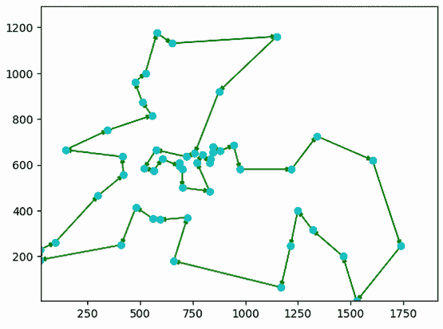

图 5.15 使用 SA 解决 Belin52

如您所见，SA 找到的近似最优解为 8,106.88。这个值略高于柏林 52 TSP 的最佳已知解，即 7,542。参数调整和算法适应可以帮助提高结果。例如，Geng 等人在“基于自适应模拟退火算法和贪婪搜索解决旅行商问题”的论文中讨论了在搜索过程中使用三种不同的突变（顶点插入突变、块插入突变和块反转突变）以及不同的概率来提高 SA 在解决 TSP 问题时的准确性。此外，可以根据 TSP 实例的大小调整诸如温度的冷却系数、用于加速收敛率的贪婪搜索次数、强制接受次数以及接受新解的概率等参数。此自适应算法的实现可以从以下 GitHub 仓库获取：[`github.com/ildoonet/simulated-annealing-for-tsp`](https://github.com/ildoonet/simulated-annealing-for-tsp)。

可以研究算法参数的影响，例如初始温度、冷却计划、每个温度的迭代次数和最终温度。例如，对柏林 52 TSP 实例应用了以下设置的 SA：

+   最大迭代次数 = 1200

+   每个温度 T 的迭代次数 = 500

+   T*[初始]* = 150

+   T*[最终]* = 0.01

+   线性冷却

我们的实现支持以下方法从旧解中突变出新解：

+   `random_swap`—在路径中交换两个城市。这可以通过使用`num_swaps`多次对同一解决方案进行操作。此外，交换可以在整个路径的较小窗口中进行，使用`swap_wind = [1 - n]`。例如，假设路线是[A, B, C, D, F]。交换两个随机城市，如 B 和 F，将导致新的路线[A, F, C, D, B]。

+   `reverse`—使用`rand_len`或`rev_len`（默认为 2）以随机长度或默认长度反转城市子集的顺序。例如，从解决方案[A, B, C, D, F]开始，如果我们应用长度为 3 的`reverse`，我们可以得到新的解决方案[A, D, C, B, F]。

+   `insert`—随机选择一个城市，将其从路径中移除，并在另一个随机城市之前重新插入。例如，从解决方案[A, B, C, D, F]开始，我们可以选择城市 B 并将其插入到城市 F 之前，从而得到新的解决方案[A, C, D, B, F]。

+   `mutate`—随机选择当前解决方案中的一系列连续城市，并对其进行洗牌。例如，从解决方案[A, B, C, D, F]开始，我们可能会选择 C, D, F 并对其进行洗牌，从而得到新的解决方案[A, B, F, C, D]。

实现还支持两种初始化路径的方法：

+   `random`—这意味着路径是完全随机生成的。

+   `greedy`—这试图通过选择城市之间的成对最短距离来选择可能次优的初始路径。这不会导致最短路径，但它可能比随机初始化更好。

值得注意的是，SA 算法的结果可能并不完全可重复。由于算法中包含的随机性，每次运行算法时，您可能会得到略微不同的结果。为了避免这种情况，`SimulatedAnnealing`类中包含的`run`函数包含一个`repetition`参数，允许您报告多次运行中生成的最佳解决方案，如下所示：

```py
run(self, problem_obj=None, stoping_val=None, init=None, repetition=1)
```

您可以将重复次数设置为 10，这样算法就会报告从 10 次运行中生成的最佳解决方案。

## 5.6 解决半挂车配送路线问题

让我们考虑一个更贴近现实生活的 TSP 例子。假设沃尔玛超市是配送半挂车要访问的兴趣点（POI）。车辆将从位于安大略省 Ajax 的 270 Kingston Rd. E 的沃尔玛超市 3001 号开始。需要找到卡车可以遵循的最短路线，以访问每个 POI 一次并返回到起始位置。在所选的大多伦多地区（GTA）部分有 18 个沃尔玛超市，如图 5.16 所示。这导致了访问位于 Durham 地区、York 地区和安大略省多伦多的这些商店的 18!条可能的路线。


图 5.16 大多伦多地区（GTA）选定的沃尔玛超市

每个 POI 的 GPS 坐标（经度和纬度）以及地址可在 POI 工厂网站([www.poi-factory.com/node/25560](http://www.poi-factory.com/node/25560))上找到，并且包含在可免费下载的 Walmart_United States&Canada.csv 文件中（仅限非商业用途），下载前需注册。Google Places API、Here Places API 以及 ArcGIS Marketplace 上的 SafeGraph 也可以用来获取关于医院、餐厅、零售店和杂货店等兴趣点的数据。附录 B 提供了更多关于公开数据源的信息。

在本例中，使用 OSMnx 库创建了一个表示超级中心位置的 NetworkX 图。也可以使用 Pyrosm 代替 OSMnx。这些位置之间的最短距离使用 NetworkX 内置函数`shortest_path`计算，该函数默认使用 Dijkstra 算法（见第 3.4.1 节）。根据 GPS 坐标在 OpenStreetMap 上使用 folium 库渲染超级中心位置。附录 A 提供了关于这些库的更多详细信息。

在我们的实现中，问题求解器与问题对象解耦。我们首先为这个离散问题创建一个 TSP 对象。然后创建一个 SA 对象来解决问题。使用`mutate`方法生成一个初始解。如图 5.17 所示，这个初始解远非最优。初始路线的总长度为 593.88 公里，这条路线在实际中不方便或难以遵循。

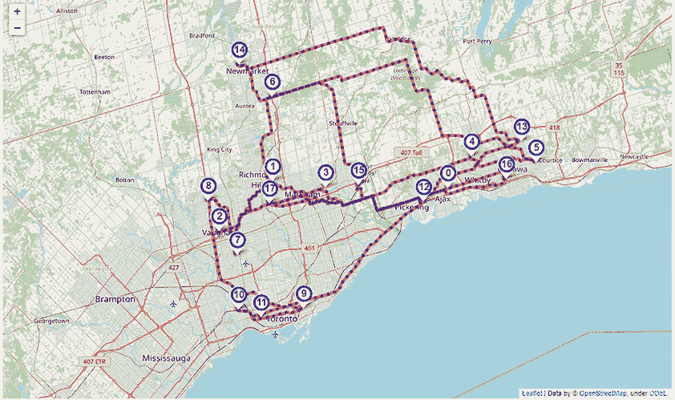

图 5.17 沃尔玛配送半挂车路线的初始解决方案，总距离为 593.88 公里

让我们使用以下参数运行模拟退火算法：

+   最大迭代次数 = 10000

+   每个温度的最大交互次数 = 100

+   初始温度 = 85

+   最终温度 = 0.0001

+   线性冷却计划

还可以使用其他冷却计划。例如，与其它方案相比，几何冷却可以生成一致、高质量且及时的解决方案。然而，这是可以调整的算法参数之一，因为它有时取决于问题的性质。图 5.18 显示了总距离为 227.17 公里的最短路线。


图 5.18 沃尔玛配送半挂车路线的模拟退火解决方案，总距离为 227.17 公里

下一个列表是使用模拟退火算法生成配送半挂车最短路线的代码片段。完整的代码可在本书的 GitHub 仓库中找到。

列表 5.6 使用模拟退火算法生成沃尔玛配送半挂车路线

```py
from optalgotools.algorithms import SimulatedAnnealing
from optalgotools.problems import TSP
import numpy as np
import pandas as pd
import osmnx as ox
import networkx as nx
import folium
import folium.plugins

wal_df = pd.read_csv("https://raw.githubusercontent.com/Optimization-Algorithms-
➥Book/Code-Listings/main/Appendix%20B/data/TSP/Walmart_ON.csv")                     ①

cities_list = [city for city, region in cityToRegion.items() if city in
➥wal_df.city.unique() and region in ['Durham Region', 'York Region', 'Toronto']]    ②

gta_part = wal_df[wal_df.store_number.str.startswith('Walmart Supercentre') &
➥ wal_df.city.isin(cities_list)].reset_index(drop=True)                             ③
wal_gta_count = gta_part.shape[0]

gta_part_loc = gta_part[['latitude', 'longitude']]                                   ④

G = ox.graph_from_point(tuple(gta_part_loc.mean().to_list()), dist=42000,            ④
➥ dist_type='network', network_type='drive', clean_periphery=True, simplify=True,   ④
➥ retain_all=True, truncate_by_edge=True)                                           ④

gta_part['osmid'], gta_part['osmid_dist_m'] = zip(*gta_part.apply(lambda row:
➥ox.nearest_nodes(G, row.longitude, row.latitude, return_dist=True), axis = 1)) 

gta_part_dists = np.zeros([wal_gta_count, wal_gta_count])                            ⑤
gta_part_pathes = [[[] for i in range(wal_gta_count)] for j in range(wal_gta_count)] ⑤
for i in range(wal_gta_count):                                                       ⑤
    for j in range(wal_gta_count):                                                   ⑤
        if i==j:                                                                     ⑤
            continue                                                                 ⑤
        gta_part_pathes[i][j] = nx.shortest_path(G=G, source=gta_part.osmid[i],      ⑤
➥ target=gta_part.osmid[j], weight='length', method='dijkstra')                     ⑤
        gta_part_dists[i][j] = nx.shortest_path_length(G=G,                          ⑤
➥source=gta_part.osmid[i], target=gta_part.osmid[j], weight='length',               ⑤
➥ method='dijkstra')/1000                                                           ⑤

gta_part_tsp = TSP(dists=gta_part_dists, gen_method='mutate')                        ⑥

sa = SimulatedAnnealing(max_iter=1000, max_iter_per_temp=100, initial_temp=85,
➥ final_temp=0.0001, cooling_schedule='linear')                                     ⑦

sa.init_annealing(gta_part_tsp)                                                      ⑧
sa.run(gta_part_tsp)                                                                 ⑨
```

① 加载安大略省所有沃尔玛门店的列表。

② 选择位于达勒姆地区、约克地区或多伦多的城市。

③ 选择前述列表中的沃尔玛门店，并且是超级中心。

④ 获取前述沃尔玛门店的经纬度位置，并创建一个连接这些门店且在 42 公里范围内的道路图。

⑤ 使用图计算沃尔玛门店之间的距离。

⑥ 为问题创建一个 TSP 对象。

⑦ 创建一个 SA 对象以帮助解决 TSP 问题。

⑧ 获取一个初始随机解，并检查其长度。

⑨ 运行 SA，并评估最佳解的距离。

正如你所见，我们在 optalgotools 中将求解器类与问题对象分离。求解器来自`algorithms`，而问题是`problems`类中 TSP 问题的一个实例。这种实现允许你更改问题实例并调整算法的参数，以达到最优或近似最优解。你可以考虑尝试第 5.2.5 节中解释的 SA 的适应性方面，以了解它们对算法性能的影响，包括获得路线的长度和运行时间（CPU 时间和墙钟时间）。

类似于 SA 的元启发式算法在合理的计算成本下寻求最优或近似最优解，但不能保证它们的可行性或优化程度。通过适当的参数调整，算法可以提供可接受的解，而无需进一步的后处理。在下一章中，我们将讨论禁忌搜索作为另一种基于轨迹的优化算法。

## 摘要

+   元启发式算法可以大致分为基于轨迹的算法和基于种群的算法。基于轨迹的元启发式算法，或称为 S 元启发式算法，使用单个搜索代理以分段方式在设计或搜索空间中移动。基于种群的算法，或称为 P 元启发式算法，使用多个代理来寻找最优或近似最优的全局解。模拟退火是一种基于轨迹的元启发式算法。

+   模拟退火模仿材料处理中的退火过程，其中金属冷却并冻结成具有最小能量和较大晶体尺寸的晶体状态，以减少金属结构中的缺陷。退火过程涉及对温度和冷却速率的仔细控制，通常称为退火计划。

+   模拟退火在不同的热力学条件下运行一系列移动，并且总是接受改进的移动，并且可以以概率接受非改进的移动。

+   接受概率与温度成正比。高温增加了在搜索初期接受非改进移动的机会，以有利于搜索空间的探索。随着搜索的进行，温度递减以限制探索并有利于利用。

+   随着温度趋近于零，SA 表现得像爬山法一样贪婪，而当温度趋近于无穷大时，SA 表现得像随机游走。温度应逐渐降低，以实现探索和利用之间的最佳权衡。

+   模拟退火是一种随机搜索算法和无导数求解器，可以在导数信息不可用、不可靠或过于昂贵的情况下使用。模拟退火在合理的计算成本下寻求最优或近似最优解，但它不能保证解的可行性或最优程度。

+   自适应模拟退火可以根据搜索进程动态改变其参数，以控制探索和开发行为。

+   模拟退火是一种易于实现的概率近似算法，可用于解决不同领域中的连续和离散问题。
