# 8 种遗传算法变体

本章涵盖

+   介绍格雷码遗传算法

+   理解实值 GA 及其遗传算子

+   理解基于排列的 GA 及其遗传算子

+   理解多目标优化

+   将遗传算法调整为在探索和利用之间取得平衡

+   使用 GA 解决连续和离散问题

本章继续第七章的主题：我们将探讨各种形式的遗传算法（GA）并深入探讨其现实世界的应用。我们还将探讨一些案例研究和练习，例如旅行商问题（TSP）、比例积分微分（PID）控制器设计、政治选区划分、载货自行车装载问题、制造计划、设施分配以及本章及其在线附录 C 中包含的露天采矿问题。

## 8.1 格雷码 GA

哈明悬崖效应指的是染色体中微小的变化可能导致解的适应度发生大的变化，这可能导致适应度景观急剧下降，并导致算法过早收敛。在二进制遗传算法中，由于哈明悬崖效应，交叉和变异操作可以显著影响解，尤其是在要更改的位是二进制字符串中最显著的位时。为了减轻哈明悬崖效应，格雷码 GA 使用格雷码编码方案对染色体进行编码。

反射二进制码，通常称为**格雷码**，是以其发明者 Frank Gray 的名字命名的，是一种独特的二进制数制系统，其特点是相邻数值仅相差一位，如表 8.1 所示。在这个数制系统中，每个值都有一种独特的表示方式，这种表示方式接近其相邻值的表示方式，有助于最小化交叉和变异操作对解的影响。这种编码确保了值之间的平稳过渡，并最小化了在转换过程中或在使用于各种应用（如旋转编码器和数字到模拟转换器）时的错误风险。表 8.1 显示了十进制数 1 到 15 及其对应的二进制和格雷码等价值。

表 8.1 十进制、二进制和格雷码编码

| 十进制数 | 二进制码 | 格雷码 |
| --- | --- | --- |
| 0 | 0000 | 0000 |
| 1 | 0001 | 0001 |
| 2 | 0010 | 0011 |
| 3 | 0011 | 0010 |
| 4 | 0100 | 0110 |
| 5 | 0101 | 0111 |
| 6 | 0110 | 0101 |
| 7 | 0111 | 0100 |
| 8 | 1000 | 1100 |
| 9 | 1001 | 1101 |
| 10 | 1010 | 1111 |
| 11 | 1011 | 1110 |
| 12 | 1100 | 1010 |
| 13 | 1101 | 1011 |
| 14 | 1110 | 1001 |
| 15 | 1111 | 1000 |

独异或（XOR）门用于将 4 位二进制数转换为格雷码，如图 8.1 所示，这是在上一章讨论的票价示例中。这些 XOR 门仅在输入不同时产生 1，在输入相同时产生 0。

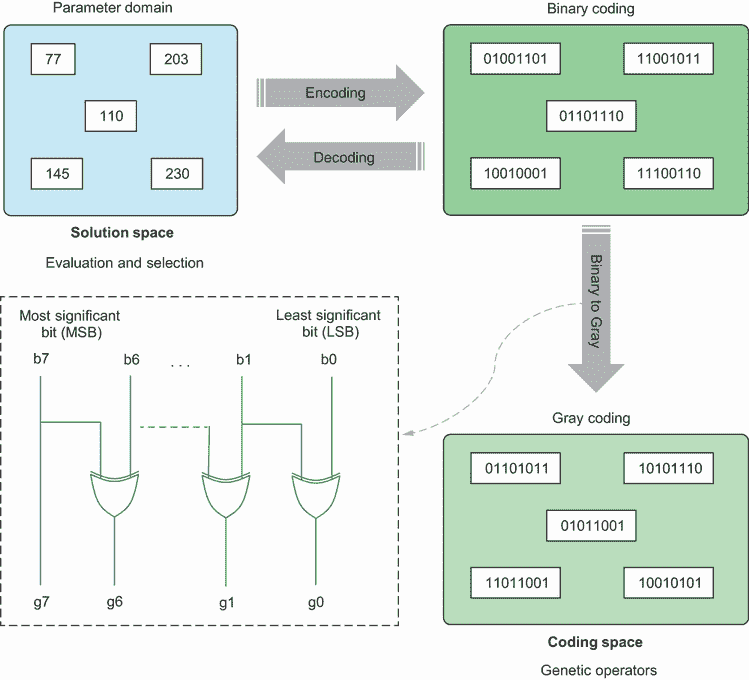

图 8.1 格雷码和二进制到格雷码转换

在格雷码中，两个连续的值只相差一位。这个性质减少了相邻数字之间的汉明距离，导致搜索空间或基因型到表型的映射更加平滑。

汉明悬崖问题

将变量编码为二进制字符串的一个缺点是存在汉明悬崖。在二进制编码的遗传算法中，编码值的小幅变化（例如，翻转单个位）可能导致解码值发生显著变化，特别是如果翻转的位位于最高位位置。搜索空间中两个相邻数字之间的这种突然变化被称为汉明悬崖。这个问题通过破坏搜索空间的平滑性，导致收敛不良，并导致探索和利用效率低下，从而对二进制编码的遗传算法产生负面影响。为了解决汉明悬崖问题，可以使用像格雷码或实值编码这样的替代表示，因为它们提供了更好的局部性和更平滑的搜索空间，最小化了小变化对解码值的影响。

例如，假设我们有一个范围在 [0, 15] 内的决策变量，如图所示。在二进制编码的遗传算法中，我们会使用 4 位二进制表示来编码候选解。假设我们在搜索空间中有两个相邻的解：7 和 8，或者二进制表示中的 0111 和 1000。汉明距离是位差的数量，所以 1000 和 0111 之间的汉明距离是 4。这两个解（7 和 8）在搜索空间中是邻居，但当你看它们的二进制表示时，你会发现它们在所有 4 位上都有差异。翻转最高位会导致解码值发生显著变化。在格雷码的情况下，格雷码表示 0100（十进制的 7）和 1100（十进制的 8）之间的汉明距离仅为 1。这意味着这两个相邻解的格雷码表示只相差 1 位，提供了更平滑的搜索空间，并可能提高遗传算法的性能。

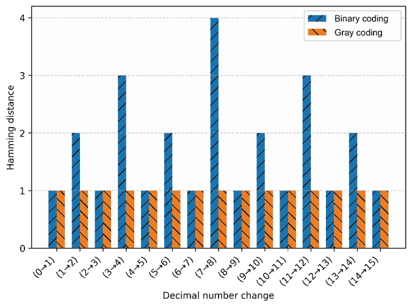

二进制和格雷码中十进制数从 0 到 15 的汉明距离

格雷码表示提供了更好的局部性，这意味着编码值的小幅变化会导致解码值的小幅变化。这个性质可以通过减少交叉和变异操作期间破坏性变化的概率来提高遗传算法的收敛性。然而，值得注意的是，格雷码提供的性能改进是问题相关的，并且与二进制编码的遗传算法相比，这种表示方法并不常用。

## 8.2 实值遗传算法

实值遗传算法是标准遗传算法的一种变体，它使用实数来编码染色体，而不是二进制或灰度码表示。许多优化问题涉及连续变量或实值参数，例如曲线拟合、具有实值输入的函数优化、比例积分微分（PID）控制器参数调整或优化神经网络的权重。为了处理这些连续问题，建议我们直接使用实值遗传算法，以下是一些原因：

+   *精度*—实值遗传算法在搜索空间中可以达到比二进制遗传算法更高的精度水平。二进制编码需要将搜索空间离散化成有限数量的可能解决方案，这可能会限制搜索的准确性。另一方面，实值编码允许进行连续的搜索空间搜索，这可以提供更精确的搜索。

+   *效率*—与二进制遗传算法相比，实值遗传算法可能需要更少的位来编码一个解决方案。例如，假设要表示的决策变量有一个下限（*LB*）为 0 和一个上限（*UB*）为 10，并且我们需要用精度（*P*）为 0.0001 来表示解决方案。正如前一章所解释的，用所需的精度*P*表示*LB*和*UB*之间范围的位数是*number_of_bits* = ceil(log2(*UB* – *LB*)/*P*)) = ceil(log2(ceil(10/0.0001))) = ceil(log2(100000)) = 17 位。实值编码可以使用更少的位来表示比二进制编码更广泛的值。这可能导致更有效地使用可用的内存和计算资源。

+   *平滑性*—实值遗传算法可以保持搜索空间的连续性和平滑性，这在某些应用中可能很重要。相比之下，二进制遗传算法可能会受到前述章节中讨论的汉明悬崖效应的影响。

+   *适应性*—实值遗传算法可以更容易地适应搜索空间或适应度景观的变化。例如，如果适应度景观突然变化，实值遗传算法可以调整步长或变异率，以更有效地探索新的景观。另一方面，二进制遗传算法可能需要更广泛的编码或操作参数的重设计，以适应搜索空间的变化。

在以下小节中，我们将探讨实值遗传算法中使用的交叉和变异方法。

### 8.2.1 交叉方法

实值遗传算法中一些流行的交叉方法包括单算术交叉、简单算术交叉和整体算术交叉。

单算术交叉

*单个算术交叉方法*涉及随机选择一个基因（*k*）并生成一个位于[0, 1]范围内的随机权重*α*。交叉点之前和之后的基因（*i* < *k*或*i* > *k*）将从相应的父染色体继承基因。对于交叉点的基因（*i* = *k*），我们通过取父染色体中相应基因的加权平均来创建后代基因：

*子代*[1]*基因[i]* = *α* × *父代*[1]*基因[i]* + (1 – *α*) × *父代*[2]*基因[i]*

*子代*[2]*基因[i]* = *α* × *父代*[2]*基因[i]* + (1 – *α*) × *父代*[1]*基因[i]*

图 8.2 展示了实值 GA 中的单个算术交叉。

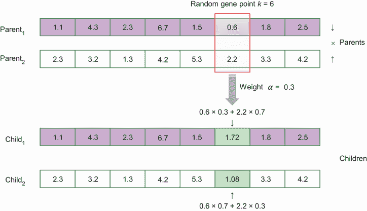

图 8.2 实值 GA 中的单个算术交叉

简单算术交叉

*简单算术交叉*与单个算术交叉相似。在随机选择的交叉点（*i* < *k*）之前，基因从相应的父染色体继承。在交叉点（*i* >= *k*）之后，我们通过取父染色体中相应基因的加权平均来创建后代基因。图 8.3 展示了实值 GA 中的简单算术交叉。


图 8.3 实值 GA 中的简单算术交叉

整体算术交叉

在*整体算术交叉*方法中，我们通过对整个父染色体进行加权平均来创建后代。图 8.4 展示了实值 GA 中的这种方法。


图 8.4 实值 GA 中的整体算术交叉

模拟二进制交叉

*模拟二进制交叉*（SBX）[1]是实值 GA 中另一种交叉方法。在 SBX 中，实值可以通过二进制表示，然后执行点交叉。SBX 通过创建概率分布函数来生成接近父染色体的后代，从而在搜索空间中保持探索和利用之间的平衡。SBX 在 pymoo 中实现。

### 8.2.2 变异方法

对连续变量进行变异的最简单方法是通过向个体的基因引入小的随机扰动来维持种群中的多样性，并帮助搜索过程逃离局部最优。实值 GA 中使用了多种常见的变异方法：

+   *高斯变异*——高斯变异向基因添加一个随机值，该随机值是从均值为 0、指定标准差*σ*的高斯分布中抽取的。标准差控制变异的大小（也称为*变异步长*）。

+   *柯西变异*—与高斯变异类似，柯西变异将一个随机值添加到基因中，但这个随机值是从*柯西分布*（也称为*洛伦兹分布*或*柯西-洛伦兹分布*）中抽取的，而不是从高斯分布中抽取。柯西分布的尾部比高斯分布重，导致较大变异的概率更高。

+   *边界变异*—在边界变异中，变异的基因是从变量的范围（由下限 (*LB*) 和上限 (*UB*) 定义）内的均匀分布中随机抽取的。这种方法类似于二进制编码 GA 中的位翻转变异，并有助于探索搜索空间的边界。当最优解位于变量极限附近时，这可能是有用的。

+   *多项式变异*—多项式变异是一种通过创建概率分布函数 [2] 生成接近父母的子代的方法。分布指数 (*η*) 控制概率分布函数的形状，较高的值会导致子代更接近其父母（利用）而较低的值会导致子代在搜索空间中分布更广（探索）。

为了说明这些遗传算子，让我们考虑一个曲线拟合的例子。假设我们有表 8.2 中显示的数据点，并且我们想使用实值 GA 将这些数据点拟合到三次多项式。 

表 8.2 曲线拟合问题数据

| x | 0 | 1.25 | 2.5 | 3.75 | 5 |
| --- | --- | --- | --- | --- | --- |
| y | 1 | 5.22 | 23.5 | 79.28 | 196 |

三次多项式具有形式 *y* = *ax*³ + *bx*² + *cx* + *d*。实值 GA 可以用来找到多项式的四个系数：*a, b, c* 和 *d*。这个问题被视为一个最小化问题，目标是最小化衡量拟合多项式与给定数据点接近程度的均方误差（MSE）。MSE 使用以下公式计算：

|


| 8.1 |
| --- |

其中 *n* 是数据点的数量，*y* 是每个数据点的 *y* 坐标值，而 *y*′ 是位于我们创建的直线上的期望值。

在实值 GA 中，候选解由参数向量 *a, b, c* 和 *d* 表示，这些参数可以用实数值表示。让我们从以下初始随机解开始：*父代*[1] = [1 2 3 4]。我们通过将这些值代入函数 (*y* = *x*³ + 2*x*² + 3*x* + 4) 来计算其适应性，计算每个对应 *x* 的 *y*′，并像表 8.3 中那样计算 MSE。

表 8.3 父代 1 的 MSE 计算

| x | 0 | 1.25 | 2.5 | 3.75 | 5 |
| --- | --- | --- | --- | --- | --- |
| y | 1 | 5.22 | 23.5 | 79.28 | 196 |
| *y*′ | 4 | 12.83 | 39.63 | 96.11 | 194 |
| *平方误差* | 9 | 57.88 | 260 | 283.23 | 4 |
| MSE | 122.83 |

让我们生成另一个随机解：*父代*[2] = [2 2 2 2]，这给出了公式 2*x*³ + 2*x*² + 2*x* + 2 和表 8.4 中的 MSE。

表 8.4 父代 2 的 MSE 计算

| x | 0 | 1.25 | 2.5 | 3.75 | 5 |
| --- | --- | --- | --- | --- | --- |
| y | 1 | 5.22 | 23.5 | 79.28 | 196 |
| *y*′ | 2 | 11.53 | 50.75 | 143.09 | 312 |
| *误差平方* | 1 | 39.83 | 742.56 | 4,072.2 | 13,456 |
| MSE | 3,662.32 |

对两个父代 *P*[1] = [1 2 3 4] 和 *P*[2] = [2 2 2 2] 应用整体算术交叉，权重 *α* = 0.2，得到以下子代：

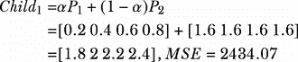

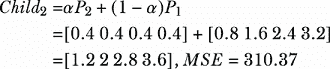

假设 *Child*[1] 受高斯变异的影响。此变异过程导致另一个子代如下：*Child*[3] = *Child*[1] + *N*(0, *σ*)，其中 *N*(0, *σ*) 是均值为 0、标准差为 *σ* 的正态分布中的随机数。假设 *σ* = 1.2，通过 `numpy.random.normal(0, 1.2)` 生成了一个随机值 0.43，因此 *Child*[3] = [1.8 2 2.2 2.4] + 0.43 = [2.23 2.43 2.63 2.83]。

列表 8.1 展示了如何使用 pymoo 中实现的实值 GA 执行此曲线拟合。我们将首先生成一个由三次多项式驱动的数据集，稍后将用作真实值。您可以自由地将这个合成的数据替换为您可能拥有的任何实验数据。

列表 8.1 使用实值 GA 进行曲线拟合

```py
import numpy as np

def third_order_polynomial(x, a, b, c, d):
    return a * x**3 + b * x**2 + c * x + d

a, b, c, d = 2, -3, 4, 1                     ①

x = np.linspace(0, 5, 5)                     ②

y = third_order_polynomial(x, a, b, c, d)    ③

data_samples = np.column_stack((x, y))       ④
```

① 定义三次多项式的系数。

② 生成五个值，如手迭代示例中所示。

③ 使用三次多项式函数计算 y 值。

④ 将 x 和 y 值组合成一个数据样本数组。

作为列表 8.1 的延续，我们可以通过继承 pymoo 的 `Problem` 类来定义一个曲线拟合问题，确保我们传递参数给超类并提供一个 `_evaluate` 函数。`CurveFittingProblem` 类有一个初始化方法，该方法将决策变量的数量设置为 4，目标数量的数量设置为 1，约束数量的数量设置为 0，决策变量的下限设置为 –10.0，决策变量的上限设置为 10.0。`vtype` 参数指定决策变量的数据类型，设置为 `float`。此初始化方法创建了一个使用遗传算法解决的问题的实例。`_evaluate` 方法接受一组候选解（`X`）和一个输出字典（`out`），并返回 `out` 字典中每个候选解的适应度 `F` 字段：

```py
import numpy as np
from pymoo.algorithms.soo.nonconvex.ga import GA                  ①
from pymoo.operators.crossover.sbx import SBX                     ②
from pymoo.operators.mutation.pm import PolynomialMutation        ③
from pymoo.operators.repair.rounding import RoundingRepair        ④
from pymoo.operators.sampling.rnd import FloatRandomSampling      ⑤
from pymoo.core.problem import Problem                            ⑥
from pymoo.optimize import minimize                               ⑦

class CurveFittingProblem(Problem):                               ⑧

    def __init__(self):                                           ⑨
        super().__init__(n_var=4,
                         n_obj=1,
                         n_constr=0,
                         xl=-10.0,
                         xu=10.0, vtype=float)    

    def _evaluate(self, X, out, *args, **kwargs):                 ⑩
        Y = np.zeros((X.shape[0], 1))
        for i, coeffs in enumerate(X):
            y_pred = np.polyval(coeffs, x)
            mse = np.mean((y - y_pred)**2)
            Y[i] = mse
        out["F"] = Y
```

① 导入用于非凸场景单目标优化的 GA 实现。

② 导入模拟二进制交叉（SBX）算子。

③ 导入多项式变异算子。

④ 导入四舍五入修复算子以确保生成的解保持在指定的范围内。

⑤ 导入浮点随机采样算子以生成随机初始解。

⑥ 导入通用的优化问题类。

⑦ 导入最小化函数。

⑧ 定义曲线拟合的优化问题。

⑨ 使用四个决策变量初始化问题，范围从 –10.0 到 10.0，以及一个无约束的单目标。

⑩ 计算输入变量中每组系数的均方误差。

现在我们可以实例化`CurveFittingProblem`类来创建要解决的问题的实例。然后我们可以定义用于优化的遗传算法。`GA`类用于定义算法，`pop_size`参数将种群大小设置为 50。`sampling`参数使用`FloatRandomSampling`算子随机生成候选解的初始种群。`crossover`参数使用具有交叉概率 0.8 的`SBX`算子。`mutation`参数使用具有突变概率 0.3 和舍入修复算子的`PolynomialMutation`算子，以确保决策变量保持在指定的界限内。`eliminate_duplicates`参数设置为`True`以从种群中删除重复的候选解。

接下来，我们可以运行遗传算法，使用`minimize`函数来解决曲线拟合问题。此函数接受三个参数：要解决的问题的实例（`problem`）、要使用的算法的实例（`algorithm`），以及指定算法停止标准的元组`('n_gen', 100)`，表示算法应运行 100 代。`seed`参数设置为 1 以确保结果的再现性。`verbose`参数设置为`True`以在优化过程中显示算法的进度：

```py
problem = CurveFittingProblem()                                           ①

algorithm = GA(
    pop_size=50,
    sampling=FloatRandomSampling(),
    crossover= SBX(prob=0.8),
    mutation = PolynomialMutation(prob=0.3, repair=RoundingRepair()),
    eliminate_duplicates=True
)                                                                         ②

res = minimize(problem, algorithm, ('n_gen', 100), seed=1, verbose=True)  ③
```

① 初始化`CurveFittingProblem`类的实例。

② 创建一个 GA 求解器。

③ 对 100 代进行优化。

您可以按以下方式打印 GA 获得的四个系数：

```py
best_coeffs = res.X
print("Coefficients of the best-fit third-order polynomial:")
print("a =", best_coeffs[0])
print("b =", best_coeffs[1])
print("c =", best_coeffs[2])
print("d =", best_coeffs[3])
```

这导致以下输出：

```py
Coefficients of the best-fit third-order polynomial:
a = 2, b = -3, c = 4, d = 1
```

如您所见，四个系数的估计值与真实多项式的系数（a, b, c, d = 2, –3, 4, 1）相同。您可以通过更改多项式系数、使用自己的数据和使用不同的交叉和突变方法来实验代码。

接下来，我们将探讨基于排列的遗传算法。

## 8.3 基于排列的遗传算法

基于排列的遗传算法旨在解决解决方案是一组元素排列的优化问题。这类问题的例子包括旅行商问题（TSP）、车辆路径问题、体育锦标赛调度和作业调度问题。在这些问题中，解决方案表示为一组元素或事件的最佳顺序或排列。

通常有两种主要类型的问题，其目标是确定事件的最佳顺序：

+   *资源或时间限制问题*——在这些问题中，事件依赖于有限的资源或时间，这使得事件的顺序对于最佳解决方案至关重要。这类问题的一个例子是拼车调度，其目标是高效地分配车辆和司机等资源，以在尽可能短的时间内服务于最多的乘客。

+   *基于邻接的问题*——在这些问题中，元素之间的邻近性或邻接性在寻找最佳解决方案中起着重要作用。这类问题的一个例子是旅行商问题（TSP），其目标是访问一组城市，同时最小化总旅行距离，并考虑巡游中相邻城市之间的距离。

这些问题通常被表述为排列问题。在排列表示中，如果有 *n* 个变量，解决方案是一个包含 *n* 个不同整数的列表，每个整数恰好出现一次。这种表示确保了解决方案中元素的顺序或邻接性被明确编码，这对于在这些类型的问题中找到最佳事件序列至关重要。例如，让我们考虑以下 8 个城市的 TSP。该 TSP 的一个候选解决方案由排列表示，例如 [1, 2, 3, 4, 5, 6, 7, 8]。在基于排列的遗传算法中，使用专门的交叉和变异算子来保留排列问题的约束，例如在 TSP 中保持城市的有效序列，其中每个城市只出现一次。

以下小节描述了基于排列的遗传算法中常用的交叉和变异方法。遗传算法中交叉和变异方法的选择取决于要解决的问题、所寻求的解决方案类型以及优化问题的目标。通过仔细选择和设计这些算子，遗传算法可以有效地探索和利用搜索空间以找到高质量的解决方案。

### 8.3.1 交叉方法

在基于排列的遗传算法中，常用的交叉方法包括部分映射交叉（PMX）、边交叉（EC）、顺序 1 交叉（OX1）和循环交叉（CX）。

部分映射交叉

*部分映射交叉*（PMX）方法通过结合两个父代染色体的遗传信息来创建后代，同时通过算法 8.1 中所示的程序保持后代的可行性。

算法 8.1 部分映射交叉（PMX）

```py
Input: two parents P1 and P2
Output: two children C1 and C2
1\. Initialize: Choose two random crossover points and copy the segment between these two points from parent P1 to child C1 and from the second parent P2 to the second child C2.
2\. For each element in the copied segment of C1:
3\.   Find the corresponding element in P2's segment. 
4\.   If the corresponding element is not already in C1:
5\.      Replace the element in C1 at the same position as in P2 with the 
        corresponding element from P2.
6\. Fill the remaining positions in the offspring with the elements from the other parent, ensuring that no duplicates are introduced.
7\. Repeat steps 2-6 for the second offspring, using P1's segment as the reference.
8\. Return C1 and C2.
```

图 8.5 展示了 8 个城市的 TSP 问题中的这些步骤。在第 1 步中，选择两个随机的交叉点，并将这两个点之间的城市从父代 P1 复制到子代 C1，从第二个父代 P2 复制到第二个子代 C2。然后我们对第 1 步中没有包含的城市执行步骤 2 到 5。对于 C1 中的第一个城市，即 3，我们需要找到 P2 段中对应的城市，即 7。城市 7 已经不在 C1 中，因此我们需要将城市 7 放在 P2 中城市 3 出现的位置，即右侧的最后位置，如图 8.5 中的实心黑色箭头所示。

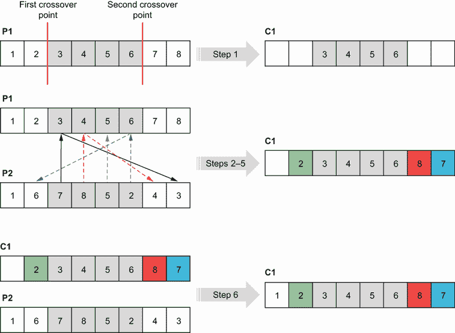

图 8.5 部分映射交叉（PMX）

以下列表展示了执行部分映射交叉以生成两个后代的代码。

列表 8.2 部分映射交叉（PMX）

```py
import random

def partially_mapped_crossover(parent1, parent2):

    n = len(parent1)

    point1, point2 = sorted(random.sample(range(n), 2))     ①

    child1 = [None] * n                                     ②
    child2 = [None] * n                                     ②
    child1[point1:point2+1] = parent1[point1:point2+1]      ②
    child2[point1:point2+1] = parent2[point1:point2+1]      ②

    for i in range(n):                                      ③
        if child1[i] is None:                               ③
            value = parent2[i]                              ③
            while value in child1:                          ③
                value = parent2[parent1.index(value)]       ③
            child1[i] = value                               ③

        if child2[i] is None:
            value = parent1[i]
            while value in child2:
                value = parent1[parent2.index(value)]
            child2[i] = value

    return child1, child2                                   ④
```

① 选择两个随机的交叉点。

② 从父节点复制交叉点之间的段到子节点。

③ 将另一个父节点中的剩余元素映射过来。

④ 返回生成的后代。

运行此代码将产生如图 8.6 所示的输出，具体取决于生成的随机样本。

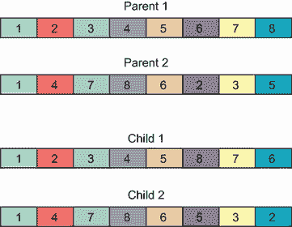

图 8.6 PMX 结果

列表 8.2 的完整版本可在本书的 GitHub 仓库中找到。

边交叉

*边交叉*（EC）方法保留了父染色体中元素之间的连接性和邻接信息。为了实现这一点，构建了一个*边表*（或*邻接表*）。例如，在 8 城市 TSP 中，通过计算两个父节点 P1 = [1, 2, 3, 4, 5, 6, 7, 8]和 P2 = [1, 6, 7, 8, 5, 2, 4, 3]中的相邻元素，创建了边表，如表 8.5 所示。表中的“+”符号表示两个父节点之间的公共边。

表 8.5 边表（或邻接表）

| 城市 | 1 | 2 | 3 | 4 | 5 | 6 | 7 | 8 |
| --- | --- | --- | --- | --- | --- | --- | --- | --- |
| 边 | 2,8,6,3 | 1,3,5,4 | 2,4+,1 | 3+,5,2 | 4,6,8,2 | 5,7+,1 | 6+,8+ | 7+,1,5 |

算法 8.2 展示了边交叉涉及的步骤。

算法 8.2 边交叉（EC）

```py
Input: two parent P1 and P2
Output: offspring C
1\. Construct an edge table.
2\. Start by selecting an arbitrary element from one of the parents as the starting point for the offspring.
3\. For the current element in the offspring, compare its edges.
4\. If an edge is common in both parents, choose that as the next element in the offspring.
5\. If there is no common edge or the common edge is already in the offspring, choose the next element from the parent with the shortest edge list.
6\. Repeat until the offspring is complete.
7\. Return C
```

图 8.7 展示了 8 城市 TSP 的这些步骤。此图说明了如何构建每个城市的边表或邻接表。图中展示了计算边的流程。例如，城市 3 和 5 是第一个父节点中与城市 4 相邻的城市或边。在第二个父节点中，城市 2 和 3 是城市 4 的边。这意味着城市 3 是一个公共边。

创建子节点首先随机选择城市 1 或作为家乡城市。在表格的第二行中，我们列出城市 1 的相邻城市，即 2、8、6 和 3。请注意，城市是循环的，这意味着在第一个父节点中，城市 1 与城市 8 相邻，在第二个父节点中，城市 1 与城市 3 相邻。丢弃已经访问过的城市 1，这些城市对城市 2 有{3,5,4}的相邻城市，对城市 8 有{7,5}的相邻城市，对城市 6 有{5,7}的相邻城市，对城市 3 有{2,4}的相邻城市。我们丢弃城市 2，因为它有三个相邻城市，并从 8、6 和 3 中任意选择城市 3，因为它们有相同数量的边。我们继续按照算法 8.2 添加城市到子节点，直到所有城市都添加完毕。

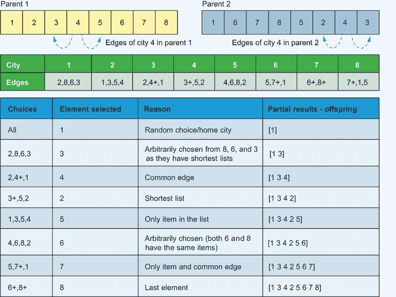

图 8.7 边交叉

列表 8.2 的完整版本可在本书的 GitHub 仓库中找到。它展示了使用 TSP 示例的 Python 实现边交叉。

顺序 1 交叉

*顺序 1 交叉*（OX1）通过结合两个父染色体中的遗传信息来创建后代，同时保持结果解中元素的相对顺序。算法 8.3 展示了顺序 1 交叉的步骤。

算法 8.3 顺序 1 交叉（OX1）

```py
Input: two parents P1 and P2
Output: offspring C1 and C2
1\. Choose two random crossover points within the chromosomes and copy the segment between the crossover points from P1 to C1 and from P2 to C2.
2\. Starting from the second crossover point, go through the remaining elements in P2.
3\. If an element is not already present in C1, append it to the end in the same order as it appears in P2.
4\. Wrap around P2 and continue appending the elements until C1 is complete.
Repeat steps 2-4 for C2, using P1 as the reference.
5\. Return C1 and C2
```

图 8.8 说明了 8 个城市 TSP 的这些步骤。从第二个交叉点开始，城市 4 和 3 不能添加，因为它们已经在 C1 中。P2 中的下一个元素是城市 1，因此它在第二个交叉点之后添加到 C1 中，然后是城市 7，因为城市 6 已经包含在内。接下来添加城市 8，然后是城市 2，因为城市 5 已经在 C1 中。


图 8.8 顺序 1 交叉（OX1）——圆圈中的数字显示了从父代 2 到子代 1 添加元素的顺序。

列表 8.2 的完整版本可在本书的 GitHub 仓库中找到，它展示了使用 TSP 示例的 OX1 的 Python 实现。

循环交叉

*循环交叉*（CX）通过将元素划分为周期来实现，其中*周期*是一组元素，当两个父代染色体对齐时，这些元素成对一致地出现。给定两个父代，通过从第一个父代中选择一个元素，找到其在第二个父代中的对应位置，然后重复这个过程，直到回到起始元素，形成一个周期。CX 算子有效地结合了两个父代的遗传信息，同时保持结果后代中元素之间的顺序和相邻关系，并保持后代解的可行性和多样性。算法 8.4 展示了这种交叉方法的步骤。

算法 8.4 循环交叉（CX）

```py
Input: two parents P1 and P2
Output: offspring C1 and C2
1\. Identify cycles between the two parents. A cycle of elements from a parent P1 is created following these steps:
    a) Begin with the starting element of P1.
    b) Look at the element at the corresponding position in P2.
    c) Move to the position with the same element in P1.
    d) Include this element in the cycle.
    e) Iterate through steps b to d until you reach the starting element of P1.
2\. Create offspring by placing the elements of the identified cycles, preserving their positions from the corresponding parents.
3\. Fill in the remaining positions in C1 with elements from P2 and the remaining positions of C2 with elements from P1 that were not included in the identified cycles. Maintain the order of the elements as they appear in the parents.
4\. Return C1 and C2.
```

图 8.9 说明了 10 个城市 TSP 的这些步骤。


图 8.9 循环交叉（CX）

在本书的 GitHub 仓库中完整版列表 8.2 中包含了一个使用 TSP 示例的 CX 的 Python 实现。需要注意的是，交叉算子的性能通常依赖于问题本身，也可能受到遗传算法特定参数设置的影响，例如种群大小、突变率和选择压力。因此，建议您尝试不同的交叉算子，并微调遗传算法的参数以适应要解决的问题。

### 8.3.2 突变方法

插入、交换、倒置和打乱是基于排列的 GA 中常用的突变方法。这些方法旨在在保持解的可行性的同时引入小的扰动：

+   *插入突变*——随机选择两个基因值，并将第二个移动到第一个之后，以适应它们而移动其余部分。这种方法主要保持基因的顺序和相邻信息。

+   *交换突变*——随机选择两个基因，并交换它们的位置。这种方法主要保留相邻信息，同时会对原始顺序造成一些破坏。

+   *倒置突变*——随机选择两个基因，并倒置它们之间的子串。这种方法在很大程度上保持相邻信息，但对顺序信息有破坏性。

+   *洗牌变异*——随机选择两个基因值，并在所选位置之间非连续地重新排列基因，应用随机顺序。

图 8.10 展示了这些方法在 8 城市旅行商问题（TSP）的第一个父代作为选定的个体中的应用。

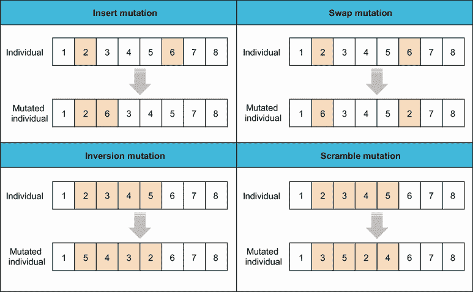

图 8.10 基于排列的遗传算法中的变异方法

作为对列表 8.2 的延续，以下代码片段展示了如何在 Python 中实现反转变异：

```py
def inversion_mutation(individual, mutation_rate):
    n = len(individual)
    mutated_individual = individual.copy()

    if random.random() < mutation_rate:
        i, j = sorted(random.sample(range(n), 2))
        mutated_individual[i:j+1] = reversed(mutated_individual[i:j+1])

    return mutated_individual
```

运行此代码将产生如图 8.11 所示的输出。

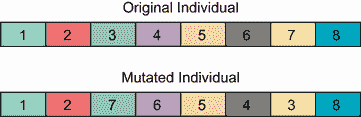

图 8.11 反转变异结果

列表 8.2 的完整版本，可在本书的 GitHub 仓库中找到，包括在基于排列的遗传算法中常用的不同交叉和变异方法的实现。

## 8.4 多目标优化

如前文 1.3.2 节所述，具有多个目标函数的优化问题被称为多目标优化问题（MOPs）。这些问题可以通过基于偏好的多目标优化程序或使用帕累托优化方法来处理。在前一种方法中，使用相对偏好向量或加权方案将多个目标组合成一个或整体目标函数，以标量化多个目标。然而，找到这个偏好向量或权重是主观的，有时并不直接。

*帕累托优化*，以意大利经济学家和社会学家维弗雷多·帕累托（1848-1923）的名字命名，依赖于寻找多个权衡最优解，并使用高级信息选择其中一个。此过程试图通过减少备选方案的数量到一个最优的非支配解集，称为帕累托前沿（或帕累托边界），在多目标空间中用于做出战略决策。在存在冲突目标函数的情况下，如果一个解没有其他解能在不降低另一个目标的情况下提高一个目标，则该解是帕累托最优的。因此，对于多目标优化问题（MOPs）的最优解不是一个单一解，如单目标或单一优化问题（SOPs）那样，而是一组定义为*帕累托最优解*的解。这些帕累托最优解也被称为可接受、有效、非支配或非劣解。在帕累托优化中，*非支配解*代表了在多个冲突目标中没有被其他任何解超越的最佳折衷方案。

在第一章中，我们研究了电动汽车的例子：加速时间和续航里程是相互冲突的目标函数，因为我们需要最小化车辆的加速时间并最大化其续航里程。没有一种车辆能够同时实现这两个目标，如图 8.12 所示，该图基于从 *Inside EVs* 网站获取的真实数据（[`insideevs.com/`](https://insideevs.com/)）。例如，Lucid Air Dream Edition 具有最长的续航里程，但不是最低的加速时间。虚线表示帕累托前沿——这些车辆在加速时间和续航里程之间实现了最佳权衡。

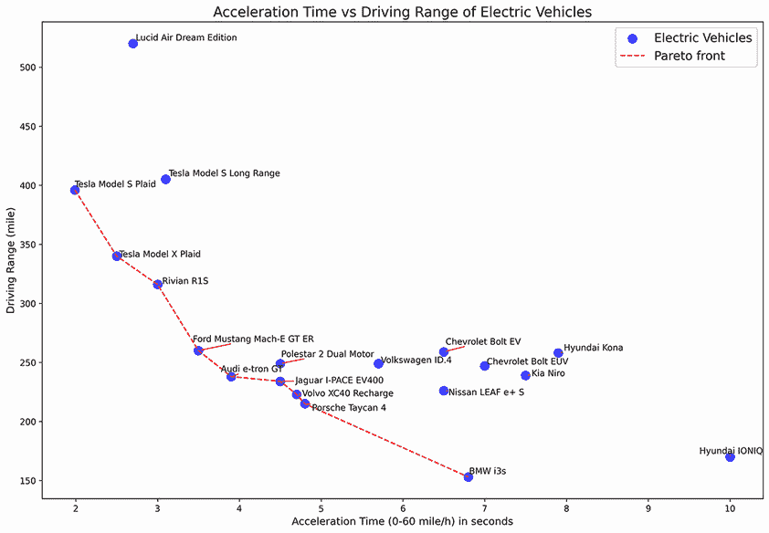

图 8.12 19 种电动汽车的加速时间与续航里程对比，截至 2021 年 9 月

多目标优化算法

解决多目标优化问题的算法有很多。非支配排序遗传算法（NSGA-II）是最常用的之一。其他算法包括但不限于强度 Pareto 进化算法 2（SPEA2）、Pareto 存档进化策略（PAES）、带生态位 Pareto 遗传算法（NPGA）、基于支配超体积的多目标选择（SMS-EMOA）和基于分解的多目标进化算法（MOEA/D）。

这些算法各有优缺点，你选择的算法将取决于要解决的问题的具体情况和你的偏好。NSGA-II 有几个优点，如多样性维护、非支配排序和快速收敛。有关多目标优化的更多详细信息，请参阅 Deb 的《使用进化算法进行多目标优化》[3] 和 Zitzler 的《多目标优化的进化算法》[4]。

让我们通过一个例子使用 NSGA-II 解决一个多目标优化问题。假设一个制造商生产两种产品，P1 和 P2，涉及两种不同的机器，M1 和 M2。每台机器一次只能生产一种产品，每种产品在每个机器上的生产时间和成本都不同：

+   P1 在 M1 上需要 2 小时，在 M2 上需要 3 小时，生产成本分别为 100 美元和 150 美元。

+   P2 在 M1 上需要 4 小时，在 M2 上需要 1 小时，生产成本分别为 200 美元和 50 美元。

在每个班次中，两台机器 M1 和 M2 的生产能力分别为生产 100 单位的 P1 和 500 单位的 P2。制造商希望生产至少 80 单位的 P1 和 300 单位的 P2，同时最小化生产成本并最小化两台机器的生产时间差异。

我们将令 *x*[1] 和 *x*[2] 分别表示在 M1 和 M2 上生产的 P1 的单位数量，*y*[1] 和 *y*[2] 分别表示在 M1 和 M2 上生产的 P2 的单位数量。问题可以表述如下：

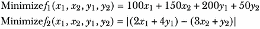

受限于：

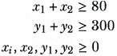

第一个目标函数（*f*[1]）表示总生产成本，第二个目标函数（*f*[2]）表示两个机器的生产时间差异。列表 8.3 显示了使用 NSGA-II 找到在一个班次中应生产的单位最优数量的代码。

我们将首先从`ElementwiseProblem`继承，这允许我们以逐元素的方式定义优化问题。`n_var`指定变量的数量（本例中为 4），`n_obj`定义目标函数的数量（2），而`n_ieq_constr`表示不等式约束的数量（2）。`xl`和`xu`参数分别定义每个变量的下界和上界。`_evaluate`方法接受一个输入`x`（一个解候选）并计算目标值`f1`和`f2`，以及不等式约束`g1`和`g2`。第三个约束是边界约束，由决策变量的下界和上界表示。

列表 8.3 使用 NSGA-II 解决制造问题

```py
import numpy as np
import matplotlib.pyplot as plt
from pymoo.core.problem import ElementwiseProblem               ①

class ManufacturingProblem(ElementwiseProblem):

    def __init__(self):
        super().__init__(n_var=4,
                         n_obj=2,
                         n_ieq_constr=2,
                         xl=np.array([0,0,0,0]),
                         xu=np.array([100,100,500,500]))        ②

    def _evaluate(self, x, out, *args, **kwargs):
        f1 = 100*x[0] + 150*x[1] + 200*x[2] + 50*x[3]           ③
        f2 = np.abs((2*x[0] + 4*x[2]) - (3*x[1] + x[3]))        ④

        g1 = -x[0] - x[1] + 80                                  ⑤
        g2 = -x[2] - x[3] + 300                                 ⑤

        out["F"] = [f1, f2]
        out["G"] = [g1, g2]

problem = ManufacturingProblem()
```

① 导入问题类的一个实例。

② 定义变量数量、目标函数、约束以及下界和上界。

③ 总生产成本作为第一个目标函数

④ 两个机器的生产时间差异作为第二个目标函数

⑤ 定义约束。

我们现在可以设置一个 NSGA-II 算法的实例作为求解器：

```py
from pymoo.algorithms.moo.nsga2 import NSGA2                       ①
from pymoo.operators.crossover.sbx import SBX                      ②
from pymoo.operators.mutation.pm import PM                         ③
from pymoo.operators.sampling.rnd import FloatRandomSampling       ④

algorithm = NSGA2(
    pop_size=40,
    n_offsprings=10,
    sampling=FloatRandomSampling(),
    crossover=SBX(prob=0.9, eta=15),
    mutation=PM(eta=20),
    eliminate_duplicates=True
)                                                                  ⑤
```

① 导入 NSGA-II 类。

② 将模拟二进制交叉（SBX）作为交叉算子导入。

③ 将多项式变异（PM）作为变异算子导入。

④ 导入 FloatRandomSampling 方法以生成指定范围内的每个变量的随机浮点值。

⑤ 设置 NSGA-II 的一个实例。

求解器具有 40 个个体的人口大小（`pop_size`），使用`FloatRandomSampling`生成 10 个后代，采用概率为 0.9 的 SBX 交叉，并使用`eta`参数为 15 的指数分布进行微调。使用`eta`参数为 20 的 PM 变异。此`eta`参数控制变异分布的扩散。`eliminate_duplicates`设置为`True`，以便在每一代中从种群中删除重复的候选解。

我们通过指定代数数来定义终止标准：

```py
from pymoo.termination import get_termination
termination = get_termination("n_gen", 40)
```

我们现在可以运行求解器以同时最小化两个目标函数：

```py
from pymoo.optimize import minimize

res = minimize(problem,
               algorithm,
               termination,
               seed=1,
               save_history=True,
               verbose=True)
X = res.X
F = res.F
```

最后，我们按照以下方式打印出最佳 10 个解决方案：

```py
print("Solutions found: ")
print("Number of units of product P1 produced on machines M1 and M2\n and 
➥ Number of units of product P2 produced on machines M1 and M2 are:\n",
➥ np.asarray(X, dtype = 'int'))
np.set_printoptions(suppress=True, precision=3)
print("The total production costs and \n difference in production times
➥ between the two machines are:\n",F)
```

此代码将生成表示 NSGA-II 获得的最佳 10 个非支配解的输出，其外观如下：

```py
Solutions found: 
Number of units of product P1 produced on machines M1 and M2
and Number of units of product P2 produced on machines M1 and M2 are:
[[ 90  18  39 300]
[ 91  19  39 297]
[ 91  16  12 300]
[ 90  12  30 310]
[ 90  14  21 300]
[ 90  14  47 328]
[ 34  48   1 305]
[ 87  13   3 299]
[ 91  11   7 297]
[ 30  51   0 300]]
The total production costs and 
difference in production times between the two machines are:
[[34757.953    16.105]
[34935.538    13.813]
[29235.912   114.763]
[32498.687    43.463]
[30481.316    79.233]
[37228.051     0.652]
[26307.998   378.004]
[26388.316   150.968]
[27199.394   118.385]
[25980.561   392.176]]
```

由于这两个目标函数没有通用的最佳解决方案，因此可以使用多标准决策来选择最佳权衡——帕累托最优。在 pymoo 中，决策过程首先通过定义称为*理想*点和*下界*点的边界点来开始：

+   *理想点*——这指的是在整个问题可行区域内可以实现的每个目标函数的最佳可能值。这一点代表了所有目标函数同时最小化的场景。

+   *谷点*——这是每个目标函数在满足所有问题约束条件的同时达到最大化的点。它是理想点的对立面，代表了整个问题可行区域内每个目标函数的最坏可能值。

这些点在多目标优化问题中用于标准化目标函数，并将它们转换为共同尺度，从而允许对不同的解决方案进行公平的比较。这两个点的计算如下：

```py
approx_ideal = F.min(axis=0)
approx_nadir = F.max(axis=0)
nF = (F - approx_ideal) / (approx_nadir - approx_ideal)
```

然后，我们根据开发者对每个目标函数重要性的看法，定义了分解函数所需的权重：

```py
weights = np.array([0.2, 0.8])      ①
```

① f1 和 f2 的权重

使用增强标量化函数（ASF），如 Wierzbicki 在“多目标优化中参考目标的使用”[5]中讨论的，定义了一种分解方法：

```py
from pymoo.decomposition.asf import ASF
decomp = ASF()
```

为了找到最佳解决方案，我们选择从所有解决方案中计算出的最小 ASF 值，并使用 ASF 所需的权重的倒数：

```py
i = decomp.do(nF, 1/weights).argmin()

print("Best regarding ASF: Point \ni = %s\nF = %s" % (i, F[i]))

plt.figure(figsize=(7, 5))
plt.scatter(F[:, 0], F[:, 1], s=30, facecolors='none', edgecolors='blue')
plt.scatter(F[i, 0], F[i, 1], marker="x", color="red", s=200)
plt.title("Objective Space")
plt.xlabel("Total production costs")
plt.ylabel("Difference in production times")
plt.show()
```

输出如图 8.13 所示。

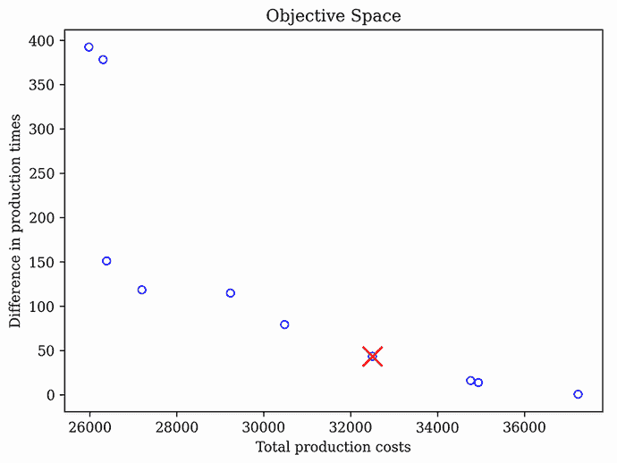

图 8.13 制造问题解决方案——标记为 X 的点代表选定的帕累托最优或最佳权衡点。

运行代码产生以下输出：

```py
The best solution found: 
Number of units of product P1 produced on machines M1 and M2 are 90 and 12 respectively
Number of units of product P2 produced on machines M1 and M2 are 30 and 310 respectively
The total production costs are 32498.69
The difference in production times between the two machines is 43
```

列表 8.3 的完整版本可在本书的 GitHub 仓库中找到。它包括另一种方法，使用伪权重在多目标优化的上下文中从解决方案集中选择一个解决方案。

## 8.5 自适应遗传算法（GA）

自适应方法帮助遗传算法在探索和利用之间取得平衡，使用不同的参数，如初始化种群大小、交叉算子和变异算子。这些参数可以根据搜索进度确定性地或动态地调整，使算法收敛到复杂优化问题的优质解决方案。

例如，种群大小可以是自适应的。较大的种群大小促进多样性和探索，而较小的种群大小允许更快地收敛。如果算法难以找到更好的解决方案，则可以增加种群大小；如果种群变得过于多样化，则可以减少种群大小。

突变算子参数可以用来适应遗传算法并平衡其探索和利用方面。例如，在高斯突变的情况下，我们可以在运行过程中自适应地设置高斯分布的标准差*σ*的值。高斯分布的标准差可以按照确定性方法、自适应方法或自适应性方法来改变。如果您使用确定性方法，*σ*的值可以在每一代使用此公式计算：*σ*(*i*) = 1 – 0.9 * *i*/ *N*，其中*i*是代数，范围从 0 到*N*（最大代数）。在这种情况下，*σ*的值在优化过程开始时为 1，并逐渐减少到 0.1，以将搜索算法的行为从探索转变为利用。

自适应方法将搜索过程中的反馈纳入其中，以调整方差并提高搜索性能。Rechenberg 的*1/5 成功规则*是一种众所周知的方法，通过监控搜索的成功率来调整搜索的步长。这个规则涉及在一定的百分比的前一次突变成功找到更好的解决方案（即，在五次尝试中有多于一次的成功突变）时增加方差，以促进探索，从而避免陷入局部最优。否则，如果成功率较低，方差应减少以促进利用。这允许搜索根据其进度微调其参数，从而实现更好的性能和更快地收敛到最优解。

图 8.14 展示了应用 Rechenberg 的 1/5 成功规则的步骤。这个更新规则在每一代都应用，并使用一个常数 0.82 <= *c* <= 1 来更新高斯分布的标准差。正如您所看到的，标准差越高，*x*的值就越高，与当前解的偏差也越大（更多的探索），反之亦然。


图 8.14 Rechenberg 的 1/5 成功规则。遵循此规则，高斯分布的标准差通过一个常数进行更新。标准差越高，*x*的值（即更大的步长）就越高，与当前解的偏差也越大（更多的探索），反之亦然。

自适应方法将突变步长纳入每个个体——这是一种最初在进化策略（ES）中使用的技巧。在这个方法中，*σ*（标准差或突变步长）的值与个体一起进化，导致种群中每个个体的突变步长各不相同。以下方程用于这种自适应方法：

|

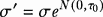

| 8.2 |
| --- |

|

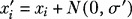

| 8.3 |
| --- |

其中 *τ[o]* 是学习率。

现在您已经对 GAs 的各个组成部分有了扎实的理解，我们可以将这种强大的优化技术应用于现实世界的问题。在接下来的几节中，我们将使用 GAs 来解决三个不同的问题：旅行商问题、PID 控制器参数调整以及政治区划问题。

## 8.6 解决旅行商问题

让我们考虑以下美国前 20 大城市的旅行商问题（TSP），从纽约市开始，如图 8.15 所示。

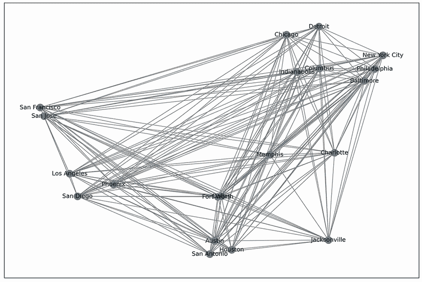

图 8.15 美国前 20 大城市 TSP

在列表 8.4 中，我们首先导入我们将使用的库并定义 TSP。首先，我们定义城市名称及其纬度和经度。然后，我们使用这些坐标创建一个哈夫曼距离矩阵，然后将数据字典转换为 dataframe。

列表 8.4 使用 GA 解决 TSP

```py
import numpy as np
import pandas as pd
import networkx as nx
from collections import defaultdict
from haversine import haversine
import matplotlib.pyplot as plt
from pymoo.core.problem import ElementwiseProblem
from pymoo.core.repair import Repair
from pymoo.algorithms.soo.nonconvex.ga import GA
from pymoo.optimize import minimize
from pymoo.operators.sampling.rnd import PermutationRandomSampling
from pymoo.operators.crossover.ox import OrderCrossover
from pymoo.operators.mutation.inversion import InversionMutation
from pymoo.termination.default import DefaultSingleObjectiveTermination
from pymoo.optimize import minimize

cities = {
    'New York City': (40.72, -74.00),
    'Philadelphia': (39.95, -75.17),       
    'Baltimore': (39.28, -76.62),
    'Charlotte': (35.23, -80.85),
    'Memphis': (35.12, -89.97),
    'Jacksonville': (30.32, -81.70),
    'Houston': (29.77, -95.38),
    'Austin': (30.27, -97.77),
    'San Antonio': (29.53, -98.47),
    'Fort Worth': (32.75, -97.33),
    'Dallas': (32.78, -96.80),
    'San Diego': (32.78, -117.15),
    'Los Angeles': (34.05, -118.25),
    'San Jose': (37.30, -121.87),
    'San Francisco': (37.78, -122.42),    
    'Indianapolis': (39.78, -86.15),
    'Phoenix': (33.45, -112.07),       
    'Columbus': (39.98, -82.98), 
    'Chicago': (41.88, -87.63),
    'Detroit': (42.33, -83.05)
}                                                                      ①

distance_matrix = defaultdict(dict)                                    ②
for ka, va in cities.items():
    for kb, vb in cities.items():
        distance_matrix[ka][kb] = 0.0 if kb == ka else haversine((va[0], va[1]),
➥ (vb[0], vb[1]))                                                     ②

distances = pd.DataFrame(distance_matrix)                              ③
city_names=list(distances.columns)                                     ③
distances=distances.values                                             ③

G=nx.Graph()                                                           ④
for ka, va in cities.items():                                          ④
    for kb, vb in cities.items():                                      ④
        G.add_weighted_edges_from({(ka,kb, distance_matrix[ka][kb])})  ④
        G.remove_edges_from(nx.selfloop_edges(G))                      ④
```

① 定义 20 个主要美国城市的城市名称、纬度和经度。

② 基于经纬度坐标创建哈夫曼距离矩阵。

③ 将距离字典转换为 dataframe。

④ 创建一个 networkx 图。

然后，我们可以创建`TravelingSalesman`作为 pymoo 中可用的`ElementwiseProblem`类的子类。这个类定义了城市数量和城市间距离作为问题参数，并将总路径长度作为要最小化的目标函数进行评估：

```py
class TravelingSalesman(ElementwiseProblem):

    def __init__(self, cities, distances, **kwargs):
        self.cities = cities
        n_cities = len(cities)
        self.distances = distances

        super().__init__(
            n_var=n_cities,
            n_obj=1,
            xl=0,
            xu=n_cities,
            vtype=int,
            **kwargs
        )

    def _evaluate(self, x, out, *args, **kwargs):
        f = 0
        for i in range(len(x) - 1):
            f += distances[x[i], x[i + 1]]
        f += distances[x[-1], x[0]]
        out["F"] = f
```

以下函数是`Repair`类的子类，它提供了一个用于修复 TSP 解决方案的方法，确保每个解决方案都以索引为 0 的城市（在本例中为纽约市）开始。pymoo 中的修复操作员用于确保算法只搜索可行空间。它是在后代繁殖之后应用的：

```py
class StartFromZeroRepair(Repair):

    def _do(self, problem, X, **kwargs):
        I = np.where(X == 0)[1]

        for k in range(len(X)):
            i = I[k]
            X[k] = np.concatenate([X[k, i:], X[k, :i]])

        return X
```

现在是定义 GA 求解器并将其应用于解决问题的时刻。

```py
problem = TravelingSalesman(cities,distance_matrix)                          ①

algorithm = GA(
    pop_size=20,
    sampling=PermutationRandomSampling(),
    mutation=InversionMutation(),
    crossover=OrderCrossover(),
    repair=StartFromZeroRepair(),
    eliminate_duplicates=True
)                                                                             ②

termination = DefaultSingleObjectiveTermination(period=300, n_max_gen=np.inf) ③

res = minimize(
    problem,
    algorithm,
    termination,
    seed=1,
    verbose=False
)                                                                              ④ 
```

① 为给定城市和城市间距离创建 TSP 实例。

② 定义 GA 求解器。

③ 如果算法在最后 300 代中没有改进，则终止（并禁用最大代数）。

④ 找到最短路径。

我们可以按如下方式打印找到的路线及其长度：

```py
Order = res.X
Route = [city_names[i] for i in Order]
arrow_route = ' → '.join(Route)
print("Route:", arrow_route)
print("Route length:", np.round(res.F[0], 3))
print("Function Evaluations:", res.algorithm.evaluator.n_eval)
```

这将产生以下输出：

```py
Route: New York City → Detroit → Columbus → Indianapolis → Chicago → San Francisco → San Jose → Los Angeles → San Diego → Phoenix → San Antonio → Austin → Houston → Fort Worth → Dallas → Memphis → Jacksonville → Charlotte → Baltimore → Philadelphia
Route length: 10934.796
Function Evaluations: 6020
```

以下代码用于使用 NetworkX 可视化获得的路线：

```py
fig, ax = plt.subplots(figsize=(15,10))

H = G.copy()                                                               ①

reversed_dict = {key: value[::-1] for key, value in cities.items()}        ②

keys_list = list(cities.keys())                                            ③

included_cities = {keys_list[index]: cities[keys_list[index]] for index in ④
➥ list(res.X)}                                                            ④
included_cities_keys=list(included_cities.keys())                          ④

edge_list =list(nx.utils.pairwise(included_cities_keys))                   ⑤

nx.draw_networkx_edges(H, pos=reversed_dict, edge_color="gray", width=0.5) ⑥

ax=nx.draw_networkx(
    H,
    pos=reversed_dict,
    with_labels=True,
    edgelist=edge_list,
    edge_color="red",
    node_size=200,
    width=3,
)                                                                          ⑦
plt.show()                                                                 ⑦
```

① 创建问题图和属性的独立浅拷贝。

② 反转纬度和经度以正确可视化。

③ 创建原始字典的键列表。

④ 创建一个具有所需顺序键的新字典。

⑤ 创建边列表。

⑥ 仅在每个节点上绘制最近的边。

⑦ 绘制并显示路线。

图 8.16 显示了该旅行商问题的获得路线。


图 8.16 美国前 20 大城市 TSP 解决方案

您可以通过更改问题数据和遗传算法参数（如种群大小、采样、交叉和变异方法）在书的 GitHub 仓库中实验完整的代码。

## 8.7 PID 调整问题

你是否曾想过你的房间是如何保持舒适温度的？你是否想过加热或冷却系统是如何知道何时自动开启和关闭以维持恒温器上设定的温度的？这就是控制系统发挥作用的地方。控制系统就像幕后的魔术师，确保事物平稳高效地运行。它们是一套规则和机制，引导设备或过程实现特定目标。

一种控制系统类型是*闭环系统*。想象一下：你将房间的恒温器设定在舒适的 22°C（72°F），加热或冷却系统启动以达到该温度。但如果变得太冷或太热怎么办？这时闭环系统开始采取行动。它持续跟踪房间当前的温度，将其与期望温度进行比较，并做出必要的加热或冷却调整。

比例积分微分（PID）控制器是控制系统工程中最常用的算法。该控制器旨在补偿测量状态（例如，当前室温）与期望状态（例如，期望的温度值）之间的任何误差。让我们以使用 PID 控制器进行房间温度控制为例。

如图 8.17 所示，控制器接收误差信号 *e*(*t*)（期望状态与反馈信号之间的差异）并产生适当的控制信号 *u*(*t*)以打开或关闭加热器，以最小化当前室温与期望值之间的差异。控制信号的计算使用方程 8.4：

|


| 8.4 |
| --- |

如此方程所示，*比例项* *K[p]e*(*t*)倾向于产生一个与误差成比例的控制信号，旨在纠正它。*积分项*（方程右侧的第二项）倾向于产生一个与误差的大小及其持续时间成比例的控制信号，或者误差曲线下的面积。*微分项*（方程右侧的第三项）倾向于产生一个与误差变化率成比例的控制信号，从而提供一个预测控制信号。

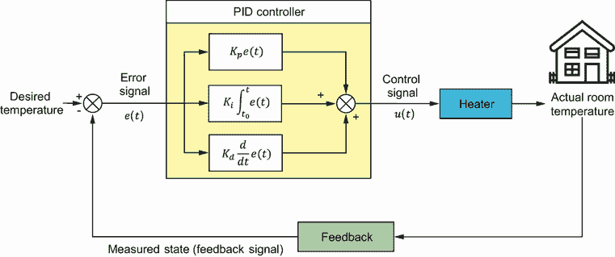

图 8.17 基于 PID 的闭环控制系统——PID 控制器接收误差信号并产生控制信号以将误差减少到零。

利用 PID 控制器可以使系统（例如，空调或加热器）遵循指定的输入并达到期望或最优的稳态误差、上升时间、调整时间和超调：

+   *上升时间*—上升时间是响应从最终值的 10%上升到 90%所需的时间。

+   *峰值超调*—峰值超调（也称为最大超调）是响应在峰值时刻与最终值之间的偏差。

+   *稳定时间*—稳定时间是响应达到稳态并保持在指定的容差带内（例如，最终值的 2-5%）所需的时间，在瞬态响应稳定后。

+   *稳态误差*—稳态误差是在系统达到稳定状态时，系统输出期望值与实际值之间的差异。

如图 8.18 所示，当当前室温低于设定点或期望值时，加热器开启（即，通电）。当温度高于设定点时，加热器关闭（即，断电）。


图 8.18 系统的阶跃响应。加热器根据实际温度与期望值之间的差异开启或关闭。

表 8.6 显示了 PID 控制器参数对系统时间响应的影响。请注意，这些相关性可能并不完全准确，因为 *K[p]，K[i]* 和 *K[d]* 之间相互依赖。事实上，改变其中一个变量可能会改变其他两个变量的影响。因此，在确定 *K[p]，K[i]* 和 *K[d]* 的值时，应仅将此表作为参考。

表 8.6 添加 PID 控制器参数对系统响应的影响

| 参数 | 上升时间 | 超调 | 稳定时间 | 稳态误差 |
| --- | --- | --- | --- | --- |
| K[p] | 减少 | 增加 | 小变化 | 减少 |
| K[i] | 减少 | 增加 | 增加 | 显著减少 |
| K[d] | 小变化 | 减少 | 减少 | 小变化 |

寻找 PID 控制器参数的最佳值以实现最佳控制器响应是一个多变量优化问题，通常被称为*PID 调整问题*。以下四个性能指标通常用于评估控制系统的质量，如 PID 控制器：

+   *ITAE (积分时间绝对误差)*—这个指标惩罚随时间持续存在的错误，使其适用于瞬态响应和稳定时间都很重要的系统。它是通过以下公式计算的：ITAE = ∫(*t*|*e*(*t*)|) *dt*，其中 *t* 是时间，*e*(*t*) 是时间 *t* 的误差，定义为 *e*(*t*) = *r*(*t*) – *y*(*t*)，*r*(*t*) 是时间 *t* 的参考信号（期望输出）（对于阶跃响应 *r*(*t*) = 1），*y*(*t*) 是时间 *t* 时系统的实际输出。

+   *ITSE (积分时间平方误差)*—与 ITAE 类似，这个指标也惩罚持续时间较长的错误，但由于平方项，它更强调较大的错误。它是通过以下公式计算的：ITSE = ∫(*te*(*t*)²) *dt*。

+   *IAE (积分绝对误差)*—这个指标衡量了误差的整体幅度，不考虑误差的持续时间。这是一个简单且广泛使用的性能指标，它使用以下公式计算：IAE = ∫|*e*(*t*)| *dt*。

+   *ISE (积分平方误差)*—这个指标强调较大的误差，由于平方项的存在，使其在需要优先最小化大误差的系统中非常有用。它使用以下公式进行计算：ISE = ∫*e*(*t*)² *dt*。如果误差发生在响应演化的后期，它会对误差进行更重的惩罚。它对时间 *dt* 内的误差 *E* 的惩罚比对 *E*/*α*（其中 *α* > 1）的惩罚更重。这种预期的响应可能具有较慢的上升时间，但具有更振荡的行为。

+   *综合标准*—这个指标结合了超调、上升时间、稳定时间和稳态误差 [6]。它使用以下公式进行计算：*W* = (1 – *e*^–*^β*)(*M[p]* + error*[ss]*) + *e*^–*^β* (*t[s]* – *t[r]*)，其中 *M*[p] 是超调，error[ss] 是稳态误差，*t[s]* 是稳定时间，*t[r]* 是上升时间，*β* 是介于 0.8 到 1.5 之间的平衡因子。你可以将 *β* 设置得大于 0.7 以减少超调和稳态误差。另一方面，你可以将 *β* 设置得小于 0.7 以减少上升时间和稳定时间。

这些指标中的每一个都以不同的方式量化了期望输出和系统实际输出之间的误差，强调了控制系统性能的不同方面。请注意，性能指标并不严格局限于上述指标。工程师有灵活性，可以设计定制的性能指标，以适应所考虑的控制系统的特定目标和特征。

图 8.19 展示了一个闭环控制系统，其中传递函数用于描述系统在拉普拉斯域中输入和输出之间的关系。这个域是频率域的推广，提供了一个更全面的表示，包括瞬态行为和初始条件。假设 *T[sp]* 是设定点或期望输出，*G* 代表框图中指示的传递函数。

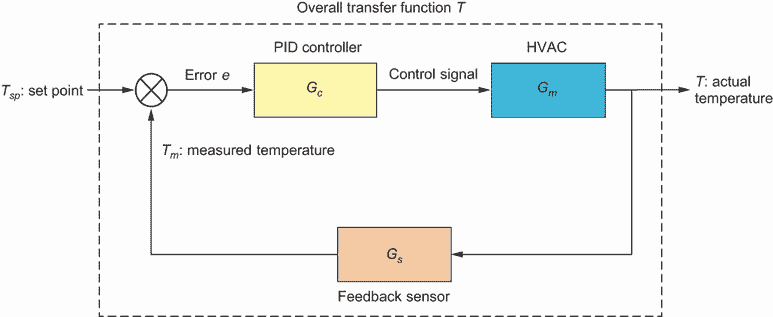

图 8.19 闭环控制系统

所有变量都是 *s* 的函数，*s* 是拉普拉斯变换的输出变量。PID 控制器的传递函数由以下方程给出：

|

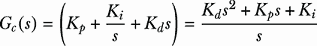

| 8.5 |
| --- |

其中 *K[p]* 是比例增益，*K[i]* 是积分增益，*K[d]* 是微分增益。假设 HVAC 系统的传递函数由以下方程给出：

|

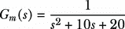

| 8.6 |
| --- |

假设 *G[s]* = 1（单位反馈）并使用框图简化，我们可以找到闭环系统的整体传递函数 *T*(*s*)：

|


| 8.7 |
| --- |

现在我们来看看如何使用 Python 找到 PID 参数的最佳值。在下一个列表中，我们首先导入我们将使用的库并定义控制系统的整体传递函数。

列表 8.5 使用 GA 解决 PID 调节问题

```py
import numpy as np
import control                                         ①
import math
import matplotlib.pyplot as plt
from pymoo.algorithms.soo.nonconvex.ga import GA 
from pymoo.operators.crossover.pntx import PointCrossover
from pymoo.operators.mutation.pm import PolynomialMutation
from pymoo.operators.repair.rounding import RoundingRepair
from pymoo.operators.sampling.rnd import FloatRandomSampling
from pymoo.core.problem import Problem
from pymoo.optimize import minimize

def transfer_function(Kp,Ki,Kd):                       ②
    num = np.array([Kd,Kp,Ki])                         ③
    den = np.array([1,(Kd+10),(Kp+20),Ki])             ④
    T = control.tf(num, den)                           ⑤
    t, y = control.step_response(T)                    ⑥
    return T, t, y
#A Import the control module.
```

① 导入控制模块。

② 将 PID 参数作为输入。

③ 定义传递函数的分子。

④ 定义传递函数的分母。

⑤ 创建传递函数。

⑥ 使用阶跃函数作为系统输入来获取时间响应输出。

接下来，我们可以定义目标函数或性能标准：

```py
def objective_function(t, error, Kp,Ki,Kd, criterion):

    if criterion == 1:
        ITAE = np.trapz(t, t*error)                                    ①
        objfnc= ITAE
    elif criterion == 2:
        ITSE = np.trapz(t, t*error**2)                                 ②
        objfnc= ITSE
    elif criterion == 3:
        IAE =  np.trapz(t, error)                                      ③
        objfnc= IAE
    elif criterion == 4:
        ISE = np.trapz(t, error**2)                                    ④
        objfnc= ISE
    elif criterion == 5:
        T, _, _ =transfer_function(Kp,Ki,Kd)
        info = control.step_info(T)
        beta = 1
        Mp = info['Overshoot']
        tr = info['RiseTime']
        ts = info['SettlingTime']
        ess = abs(1-info['SteadyStateValue'])
        W = ((1-math.exp(-beta))*(Mp+ess))+((math.exp(-beta))*(ts-tr)) ⑤
        objfnc=W;      

    return objfnc
```

① ITAE（积分时间绝对误差）

② ITSE（积分时间平方误差）

③ IAE（积分绝对误差）

④ ISE（积分平方误差）

⑤ W（综合标准）

我们现在可以定义 PID 控制器的优化问题：

```py
class PIDProblem(Problem):

    def __init__(self):
        super().__init__(n_var=3,                     ①
                         n_obj=1,                     ②
                         n_constr=0,                  ③
                         xl=0,                        ④
                         xu=100,                      ④
                         vtype=float)    

    def _evaluate(self, X, out, *args, **kwargs):     ⑤
        f = np.zeros((X.shape[0], 1))   
        for i, params in enumerate(X):
            Kp, Ki, Kd = params
            T, t, y =transfer_function(Kp,Ki,Kd)
            error = 1 - y
            f[i]=objective_function(t, np.abs(error), Kp,Ki,Kd, 5)            
        out["F"] = f 
```

① 三个决策变量，代表 PID 控制器的 Kp、Ki 和 Kd 增益

② 目标函数的数量

③ 无约束

④ 决策变量的上下限

⑤ 评估目标函数。

接下来，我们可以使用遗传算法（GA）设置和解决 PID 调整问题。之前定义的`PIDProblem`类用于建模优化问题。GA 求解器配置了 50 个种群大小。初始解通过`FloatRandomSampling`采样，交叉操作采用两点交叉，概率为 0.8。此外，应用多项式变异，概率为 0.3，算法运行 60 代：

```py
problem = PIDProblem()

algorithm = GA(
    pop_size=50,
    sampling=FloatRandomSampling(),
    crossover=PointCrossover(prob=0.8, n_points=2),
    mutation = PolynomialMutation(prob=0.3, repair=RoundingRepair()),
    eliminate_duplicates=True
)

res = minimize(problem, algorithm, ('n_gen', 60), seed=1, verbose=True)
```

现在让我们打印结果：

```py
best_params = res.X
print("Optimal PID controller parameters:")
print("Kp =", best_params[0])
print("Ki =", best_params[1])
print("Kd =", best_params[2])
```

我们将可视化时间响应：

```py
Kp = best_params[0]
Ki = best_params[1]
Kd = best_params[2]

T, t, y =transfer_function(Kp,Ki,Kd)

plt.plot(t,y)
plt.title("Step Response")
plt.xlabel("Time (s)")
plt.grid()
```

图 8.20 描述了系统的阶跃响应，展示了当输入迅速从 0 变为 1 时，其输出随时间的变化情况。

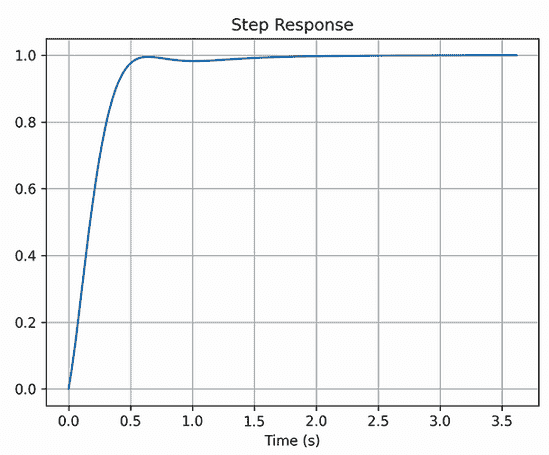

图 8.20 阶跃响应

为了展示阶跃响应特性（上升时间、稳定时间、峰值等），你可以使用以下函数：

```py
control.step_info(T)
```

这将产生以下输出：

```py
{'RiseTime': 0.353,
 'SettlingTime': 0.52,
 'SettlingMin': 0.92,
 'SettlingMax': 1.0,
 'Overshoot': 0,
 'Undershoot': 0,
 'Peak': 0.99,
 'PeakTime': 3.62,
 'SteadyStateValue': 1.0}
```

你可以尝试调整算法的参数（如种群大小、交叉方法和概率、变异方法和概率、代数数量等）以及改变性能指标，以观察对系统性能的影响。

## 8.8 政治选区划分问题

我在第 2.1.5 节介绍了政治选区划分——它可以定义为将一个领土内的*n*个子区域划分为*m*个选区的过程，同时遵守某些约束。假设我们需要将多伦多市的*n*个社区合并为*m*个选区，同时确保足够的人口平等水平。图 8.21 显示了包含东多伦多 16 个社区的人口和中等家庭收入样本数据集。


图 8.21 东多伦多的 16 个社区及其人口和中等家庭收入

在解决政治选区划分问题时，一个可行的解决方案必须确保每个选区都有令人满意的种群均衡程度（即公平和平衡的分布）。例如，我们可以通过计算一个选区的人口平衡度，即在上限（pop[UB]）和下限（pop[LB]）内与理想人口规模的偏差来评估一个选区的人口平衡度，如下所示：


其中 *pop[av]* 代表可以被认为是所有邻里平均值的预期人口规模，而 *pop[margin]* 表示从理想人口规模可接受的偏差程度。*n* 是邻里数量，而 *m* 是区域数量。

如果一个区域的总人口超过上限，则该区域将被视为过度拥挤，反之，如果一个区域的总人口低于下限，则该区域将被视为人口不足。如果一个区域的居民人数在上下限之间，则该区域将被视为具有适当的人口规模。目标函数是最小化过度拥挤和人口不足的区域总数。搜索过程将持续进行，直到目标函数的最小值获得，理想情况下为零。这表明没有区域是过度拥挤或人口不足的。

下一个列表展示了如何使用遗传算法（GA）查找政治区域。我们将从读取本地文件夹中的数据或使用 URL 开始。

列表 8.6 使用遗传算法解决政治区域划分问题

```py
import geopandas as gpd
import pandas as pd
import folium

data_url="https://raw.githubusercontent.com/Optimization-Algorithms-Book/  ①
Code-Listings/main/Appendix%20B/data/PoliticalDistricting/" 

toronto = gpd.read_file(data_url+"toronto.geojson")                        ②
neighborhoods = pd.read_csv(data_url+"Toronto_Neighborhoods.csv")          ③

range_limit = 16                                                           ④
toronto_sample = toronto.tail(range_limit)                                 ④
values = neighborhoods.tail(range_limit)                                   ④
values = values.join(toronto_sample["cartodb_id"])                         ④
```

① 数据文件夹的 URL

② 读取多伦多地区行政边界。

③ 读取邻里信息（例如，名称、人口和平均家庭收入）。

④ 选择 16 个邻里作为子集来代表东多伦多的邻里。

在读取数据集后，我们将进行以下数据预处理，以获取每个邻里的居民人数以及每个可能邻里的每对邻里之间的邻接关系，以布尔矩阵的形式。

```py
import numpy as np

def get_population(lst, table):
    return table["population"].iloc[lst].to_numpy()    ①

eval = get_population(range(range_limit), values)      ②

def get_neighboors(database):                          ③
    result = []
    for i in range(database['name'].size):
        tmp = np.zeros(database['name'].size)
        geo1 = database.iloc[i]
        for j in range(database['name'].size):
            if i != j:
                geo2 = database.iloc[j]
                if geo1["geometry"].intersects(geo2["geometry"]):
                    tmp[j] = 1
        result.append(tmp)
    return np.stack(result)

neighbor = get_neighboors(toronto_sample)
```

① 获取每个邻里的居民人数。

② 准备人口数据集。

③ 表示每个可能邻里的每对邻里之间的邻接关系。

现在我们将定义一个具有单个目标函数、三个约束条件、给定数量的区域、给定的人口边际和邻里之间的邻接矩阵的政治区域划分类。`PoliticalDistricting`是一个自定义问题类，它扩展了来自 pymoo 的`Problem`类。`Problem`类实现了一个方法，该方法评估一组解决方案而不是一次评估一个解决方案，就像在`ElementwiseProblem`类的情况下。在`PoliticalDistricting`类中，以下参数被定义：

+   `num_dist`—将区域划分为多少个区域

+   `neighbor`—表示区域中位置之间邻里关系的矩阵

+   `populations`—每个邻里的居民人数

+   `margin`—从理想人口规模可接受的偏差程度

+   `average`—平均人口

+   `n_var`—决策变量的数量，等于邻里的数量

+   `n_obj=1`—目标函数的数量，对于这个问题是 1

+   `n_eq_constr=3`—等式约束的数量，对于这个问题是 3

+   `xl=0`—决策变量的下限，对于这个问题是 0

+   `xu=num_dist-1`—决策变量的上限，对于这个问题是`num_dist-1`

+   `vtype=int`—决策变量的类型，对于这个问题是整数

以下代码展示了如何定义具有不同参数的`PoliticalDistricting`类，例如区域数量、邻域信息、人口和边际值：

```py
from pymoo.core.problem import Problem

class PoliticalDistricting(Problem):
    def __init__(self,
                 num_dist, 
                 neighbor, 
                 populations, 
                 margin 
                 ):                                         ①

        self.populations = populations                      ②
        self.average = np.mean(populations)                 ③
        super().__init__(n_var=len(self.populations), n_obj=1, n_eq_constr=3, 
➥ xl=0, xu=num_dist-1, vtype=int)                          ④

        self.n_var = len(self.populations) 
        self.n_dist = num_dist
        self.margin = margin
        self.neighbor = neighbor
        self.func = self._evaluate                          ⑤
```

① 定义一个具有特定参数的构造函数。

② 保存人口数据。

③ 存储所有区域的平均人口。

④ 使用特定参数调用父类的构造函数。

⑤ 对解决方案进行目标函数和约束的评估。

作为延续并作为`problem`类的一部分，我们将使用以下函数提取属于特定区域的邻域：

```py
def _gather(self, x, district):
    return np.where(x==district, 1, 0)
```

然后，我们将根据给定的人口值和边际值计算上下限，如下所示：

```py
def _get_bounds(self):
    ub = np.ceil(self.average + self.margin) *
➥ (len(self.populations)/self.n_dist)
    lb = np.ceil(self.average - self.margin) * 
➥ (len(self.populations)/self.n_dist)
    return ub, lb
```

以下函数用于判断选举区域是否过度拥挤或人口不足：

```py
def _get_result(self, gathered, ub, lb):
    product = gathered * self.populations
    summed_product = np.sum(product, axis=1)
    return np.where((summed_product > ub), 1, 0) + np.where((summed_product <
➥ lb), 1, 0)
```

由于所有约束都是等式约束，以下函数在约束满足时返回 true：

```py
def _get_constraint(self, constraint):
    constraint = np.stack(constraint)
    return np.any(constraint==0, axis=0)
```

为了确保区域内没有远离其他邻域的孤立邻域，除非该区域只有一个邻域，以下函数被使用：

```py
def _get_neighbor(self, gathered):
    singleton = np.sum(gathered, axis=1)
    singleton = np.where(singleton==1, True, False) 
    tmp_neighbor = np.dot(gathered, self.neighbor)
    tmp_neighbor = np.where(tmp_neighbor > 0, 1, 0)
    product = gathered * tmp_neighbor
    return np.all(np.equal(product, gathered), axis=1) + singleton 
```

以下函数确定将选举区域变成连续块的最佳近似：

```py
def cap_district(self, gathered):
    result = np.zeros(gathered.shape[0])
    for i in range(len(gathered)):
        nonzeros = np.nonzero(gathered[i])[0]
        if nonzeros.size != 0:
            mx = np.max(nonzeros)
            mn = np.min(nonzeros)
            result[i] = self.neighbor[mx][mn] or (mx == mn)  
    return result 
```

`problem`类中的最后一个函数用于评估解决方案与目标函数的对比，包括检查约束：

```py
    def _evaluate(self, x, out, *args, **kwargs):
        x=np.round(x).astype(int) # Ensure X is binary
        pop_count = []
        constraint1 = []
        constraint2 = []
        constraint3 = []
        for i in range(self.n_dist):
            gathered = self._gather(x, i)
            ub, lb = self._get_bounds()
            result = self._get_result(gathered, ub, lb)
            pop_count.append(result)
            constraint1.append(np.sum(gathered, axis=1))          ①
            constraint2.append((self._get_neighbor(gathered)))    ②
            constraint3.append(self.cap_district(gathered))       ③

        holder = np.sum(np.stack(pop_count), axis=0)
        out["F"] = np.expand_dims(holder, axis=1) 
        out["H"] = [self._get_constraint(constraint1),
                    self._get_constraint(constraint2), 
                    self._get_constraint(constraint3)] 

def create_districting_problem(number_of_districts, neighborlist, population_
➥ list, margin, seed=1):
    np.random.seed(seed)
    problem = PoliticalDistricting(number_of_districts, neighborlist,
➥ population_list, margin)
    return problem
```

① 约束 1：确保没有空区域，

② 约束 2：确保区域内没有孤立的邻域，除非该区域只有一个邻域。

③ 约束 3：通过实现最佳可能近似来确保选举区域是连续块。

我们现在可以定义 GA 求解器并将其应用于解决问题，如下所示：

```py
from pymoo.algorithms.soo.nonconvex.ga import GA
from pymoo.operators.sampling.rnd import FloatRandomSampling
from pymoo.operators.crossover.pntx import PointCrossover
from pymoo.operators.mutation.pm import PolynomialMutation
from pymoo.operators.repair.rounding import RoundingRepair
from pymoo.termination import get_termination
from pymoo.optimize import minimize

num_districts = 3
margin=6000

problem = create_districting_problem(num_districts, neighbor, eval, margin, seed=1)

algorithm = GA(
    pop_size=2000,
    sampling=FloatRandomSampling(),
    crossover=PointCrossover(prob=0.8, n_points=2),
    mutation = PolynomialMutation(prob=0.3, repair=RoundingRepair()),
    eliminate_duplicates=True
)

termination = get_termination("n_gen", 100)

res = minimize(problem,
               algorithm,
               termination,
               seed=1,
               save_history=True,
               verbose=True)
```

列出的结果政治区域在此处，并在图 8.22 中可视化：

```py
Political District- 1 :  ['Woburn', 'Highland Creek', 'Malvern']
Political District- 2 :  ['Bendale', 'Scarborough Village', 'Guildwood', 'Morningside', 'West Hill', 'Centennial Scarborough', 'Agincourt South-Malvern West']
Political District- 3 :  ['Rouge', 'Hillcrest Village', 'Steeles', "L'Amoreaux", 'Milliken', 'Agincourt North']
```

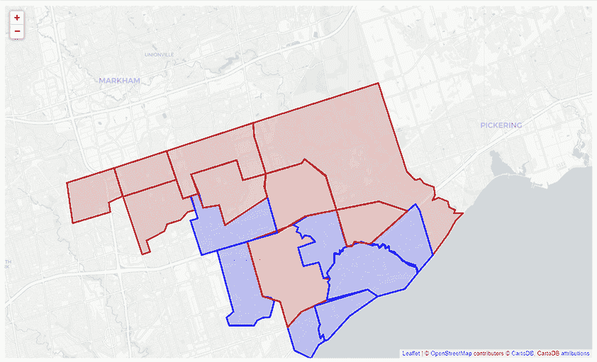

图 8.22 结合 16 个邻域的三个政治区域

该问题被视为一个单目标优化问题，目标是最小化过度拥挤和人口不足的区域总数。数据集包含每个邻域的中等家庭收入，因此您可以替换目标函数以关注中等家庭收入的不均匀性。您还可以通过考虑这两个标准将问题视为多目标优化问题。

本章标志着本书第三部分的结束，该部分主要关注遗传算法及其在解决复杂优化问题中的应用。本书的第四部分将深入探讨群智能算法的迷人领域。

## 摘要

+   汉明悬崖问题是由二进制表示的固有性质引起的，它通过破坏搜索空间的平滑性，对二进制编码的遗传算法产生负面影响，导致收敛不良，并导致探索和利用效率低下。为了解决这个问题，可以使用如格雷码或实值编码等替代表示方法，因为它们提供了更好的局部性和更平滑的搜索空间，最小化了小变化对解码值的影响。

+   实值遗传算法（GA）非常适合涉及连续变量或实值参数的优化问题。它提供了诸如更好的表示精度、更快的收敛速度、多样化的交叉和变异操作以及降低复杂度等好处，使其成为许多连续优化问题的理想选择。

+   基于排列的遗传算法是一类专门设计用来处理组合优化问题的遗传算法，其中解决方案可以表示为元素的有序序列或排列。

+   多目标优化问题可以使用基于偏好的多目标优化方法或帕累托优化方法来解决。在基于偏好的方法中，多个目标通过使用加权方案组合成一个或整体目标函数。帕累托优化方法侧重于识别多个权衡最优解，即帕累托最优解。这些解决方案可以通过更高层次的信息或决策过程进一步优化。

+   交叉操作主要是利用性的，因为它结合了两个父个体的遗传物质以产生后代，促进了解决方案之间有益特征的交换。然而，根据实现方式，交叉也可以具有一些探索性，因为它可以产生具有新基因组合的后代，从而发现新的解决方案。

+   变异操作可以根据影响因子，如变异率和变异步长，起到探索或利用的作用。

+   通常，交叉率应该相对较高，因为它促进了父染色体之间遗传信息的交换。另一方面，变异通常以低概率应用，因为其主要目的是向种群中引入随机变异。
