# 第九章：粒子群优化

本章涵盖

+   介绍群体智能

+   理解连续粒子群优化算法

+   理解二进制粒子群优化

+   理解基于排列的粒子群优化

+   适应粒子群优化以实现探索和利用之间的更好权衡

+   使用粒子群优化解决连续和离散问题

在第二章中我介绍的寻宝任务中，假设你想要与你的朋友合作并共享信息，而不是独自进行寻宝。然而，你不想采取一种竞争性的方法，在这种方法中，你只保留表现更好的猎人，并招募新的猎人替换表现较差的猎人，就像在前几章中解释的遗传算法（GA）那样。你想要采取一种更合作的方法，保留所有猎人，不进行任何替换，但你希望给予表现更好的猎人更多的权重，并尝试模仿他们的成功。这种场景使用了*群体智能*，对应于基于群体的优化算法，如*粒子群优化*（PSO）、*蚁群优化*（ACO）和*人工蜂群*（ABC）算法，这些算法将在本书的第四部分中解释。

在本章中，我们将关注 PSO 算法的不同变体，并将它们应用于解决连续和离散优化问题。这些变体包括连续 PSO、二进制 PSO、基于排列的 PSO 和自适应 PSO。本章讨论了函数优化、旅行商问题、神经网络训练、三角测量、咖啡馆规划以及医生排班问题，并在附录 C 中包含了补充练习。下一章将介绍 ACO 和 ABC 算法。

## 9.1 介绍群体智能

在这个星球上，集体行为充满了令人惊叹的例子。各种物种为了生存相互依赖，常常形成令人惊讶的联盟以实现共同的目标：物种的延续。大多数生物也表现出惊人的利他主义，为了保护和为它们的后代提供最佳护理，这与人类所表现出的任何形式的牺牲相当。它们可以合作完成复杂的任务，如觅食、分配劳动、建造巢穴、孵化排序、保护、放牧、鱼群和鸟群，仅举几例。这些复杂的集体行为是从空间分布的简单实体之间的个体互动中产生的，没有中央控制器或协调者，也没有脚本或访问全局信息。各种合作模式、通信机制和适应策略被采用，以实现这种复杂的集体行为。

群体智能

群体智能是人工智能的一个子领域，它探索了大量的相对简单且空间分布的智能体如何以去中心化和自我组织的方式相互以及与它们的环境互动，以集体实现复杂目标。

已经设计了几种高效的基于群体的算法，通过模仿自然界中观察到的集体行为来利用集体智慧的力量，以解决复杂的优化问题。表 9.1 提供了一个非详尽的群体智能算法及其灵感来源的单细胞和多细胞生物列表。

表 9.1 群体智能算法及其灵感来源的示例

| 生物体 | 类别 | 灵感来源 | 算法 |
| --- | --- | --- | --- |
| 单细胞生物 | 细菌 | 细菌集群觅食 | 细菌觅食优化算法 (BFO) 细菌集群算法 (BSA) |
| 多细胞生物 | 鸟/鱼 | 鸟群飞行和鱼群游动 | 粒子群优化 (PSO) |
| 蚂蚁 | 蚂蚁的觅食行为 | 蚂蚁群优化 (ACO) |
| 蜜蜂 | 蜜蜂的觅食行为 | 人工蜂群 (ABC) |
| 蝙蝠 | 蝙蝠的回声定位行为 | 蝙蝠算法 (BA) |
| 萤火虫 | 萤火虫的闪烁行为 | 萤火虫算法 (FA) |
| 蝴蝶 | 蝴蝶的觅食行为 | 蝴蝶优化算法 (BOA) |
| 蜻蜓 | 蜻蜓的静态和动态集群行为 | 蜻蜓算法 (DA) |
| 蜘蛛 | 社会性蜘蛛的协作行为 | 社会性蜘蛛优化 (SSO) |
| 食藻类动物 | 食藻类动物的群居行为 | 食藻类动物群 (KH) |
| 青蛙 | 青蛙的觅食合作 | 混洗青蛙跳跃算法 (SFLA) |
| 鱼 | 鱼的群居行为 | 鱼群搜索 (FSS) |
| 海豚 | 海豚在检测、追逐和捕食沙丁鱼群的行为 | 海豚伙伴优化 (DPO) 海豚群优化算法 (DSOA) |
| 猫 | 猫的休息和追踪行为 | 猫群优化 (CSO) |
| 猴子 | 寻找食物 | 猴子搜索算法 (MSA) |
| 狮子 | 狮子的独居和合作行为 | 狮子优化算法 (LOA) |
| 鹰科鸟类 | 鹰科鸟类的繁殖策略 | 鹰科搜索 (CS) 鹰科优化算法 (COA) |
| 狼 | 灰狼的领导层级和狩猎机制 | 狼搜索算法 (WSA) 灰狼优化器 (GWO) |

例如，细菌，作为单细胞生物，拥有潜在的社会智慧，这使得它们能够合作解决挑战。细菌发展出复杂的通讯能力，如趋化性信号，以合作的方式自我组织成高度结构化的群体，并提高环境适应性。细菌的趋化性是指细菌细胞通过化学吸引剂和排斥剂的浓度梯度迁移的过程。大肠杆菌在觅食过程中就利用了这种细菌趋化性。这种集体行为为优化算法如细菌觅食优化算法（BFO）和细菌集群算法（BSA）提供了基础。

生态学，动物行为的研究，是群体智能算法如粒子群优化（PSO）、蚁群优化（ACO）、人工蜂群（ABC）、蝙蝠算法（BA）、萤火虫算法（FA）和社会蜘蛛优化（SSO）的主要灵感来源。例如，蜜蜂是一种高度合作的社交昆虫，它们合作建造蜂巢，大约有 30,000 只蜜蜂可以生活在其中并共同工作。它们分工明确：有的制作蜂蜡，有的制作蜂蜜，有的制作蜂粮，有的塑造和塑造蜂巢，有的将水带到蜂房并与蜂蜜混合。年轻的蜜蜂从事户外工作，而年老的蜜蜂则从事室内工作。在觅食过程中，蜜蜂群体不是在所有方向上消耗能量搜索，而是使用单个觅食者来降低成本/收益比。此外，群体将觅食努力集中在最有利可图的区域，并忽视那些质量较差的区域。观察到，当群体的食物资源稀缺时，觅食者会招募更多的巢居者到它们找到的食物来源，它们在返回蜂巢时舞蹈模式的改变有助于这种增加的招募。

群智能算法的基本组件通常涉及大量无需中央监督的分布式处理代理。这些代理与邻近代理进行通信，并根据接收到的信息调整其行为。此外，对群智能算法进行的绝大多数研究主要基于对生物体集体行为的实验观察。这些观察结果被转化为模型，然后通过模拟进行测试，以推导出构成群智能算法基础的元启发式算法，如图 9.1 所示。这种实验方法使研究人员能够更深入地了解个体代理之间的复杂相互作用以及它们如何产生集体行为。通过模拟这些相互作用并测试各种场景，研究人员可以改进算法并提高其有效性。例如，您可以通过观看乔治亚理工学院计算机学院进行的“蜜蜂摇摆舞”实验视频来了解蜜蜂如何传达新食物源的位置（www.youtube.com/watch?v=bFDGPgXtK-U）。


图 9.1 群智能算法的推导过程

算法 9.1 展示了群智能算法中的常见步骤。算法首先初始化算法参数，例如群体中个体的数量、最大迭代次数和终止条件。然后从初始候选解群体中采样（不同的采样方法在第 7.1 节中已解释）。算法随后遍历群体中的所有个体，执行以下操作：找到迄今为止的最佳解、找到最佳邻居以及更新个体。

算法 9.1 群智能算法

```py
Initialize parameters
Initialize swarm
While (stopping criteria not met) loop over all individuals
    Find best so far
    Find best neighbor
    Update individual
```

使用定义的目标/适应度函数对个体及其邻居进行评估。邻域结构和更新机制取决于所使用的算法。这个遍历所有个体的循环会重复进行，直到满足终止条件，这可能是一个最大迭代次数或达到令人满意的适应度水平。在此阶段，算法停止并返回优化过程中找到的最佳解。在接下来的章节中，我们将深入探讨 PSO 算法。

## 9.2 连续 PSO

粒子群优化（PSO）是一种由 Russell Eberhart 和 James Kennedy 于 1995 年开发的基于群体的随机优化技术。从那时起，PSO 已经变得流行，并被应用于不同领域的各种现实世界应用。该算法受到鸟类、鱼类、蚂蚁、白蚁、黄蜂和蜜蜂等社会生物行为的启发。PSO 模仿这些生物的行为，群体中的每个成员被称为*粒子*，类似于鸟群中的鸟、鱼群中的鱼或蜂群中的蜜蜂。Eberhart 和 Kennedy 选择使用“粒子”一词来指代优化中的个体或候选解，因为他们认为这更适合描述粒子的速度和加速度。

鸟群行为

鸟群行为是由三个简单规则控制的行为，如下面的图所示：

+   *分离*—避免靠近附近的鸟，以防止过度拥挤。

+   *对齐*—调整航向以对应邻近鸟类的平均方向。

+   *一致性*—向邻近鸟类的平均位置移动。

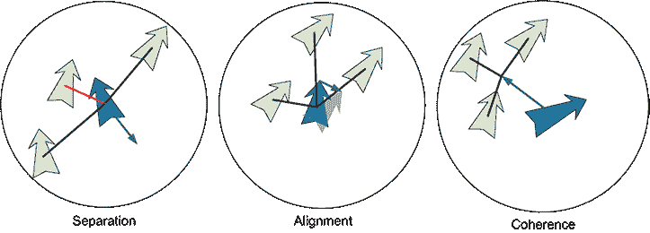

鸟群行为规则：分离、对齐和一致性

当鸟类——作为在去中心化和自我组织的方式下相互作用的分布式代理，与它们的环境相互作用，但没有访问全局信息——应用这三个简单规则时，结果是鸟群行为的涌现行为。

粒子（候选解）通过跟随当前最佳粒子在可行搜索空间中移动或飞行。因此，PSO 遵循一个简单的原则：模仿邻近个体的成功。群体中的每个粒子以去中心化的方式运作，利用自身的智能和群体的集体智能。因此，如果一个粒子发现了一条通往食物的有利路径，群体中的其他成员可以立即采用相同的路径。

PSO 算法

“这个[PSO]算法在意识形态上属于那个允许智慧自然涌现而不是试图强加智慧、模仿自然而不是试图控制自然、寻求使事物更简单而不是更复杂的哲学学派。” J. Kennedy 和 R. Eberhart，PSO 的发明者 [1]。

图 9.2 展示了 PSO 流程图。我们首先初始化算法参数并创建一个初始粒子群。这些粒子代表候选解。搜索空间中的每个粒子都持有当前位置 *x^i* 和当前速度 *v^i*。每个粒子迄今为止达到的最佳位置称为个人最佳或 *pbest*。粒子在其邻域中达到的最佳位置称为 *nbest*。如果邻域限制为少数几个粒子，则最佳称为局部最佳，*lbest*。如果邻域是整个群体，则整个群体达到的最佳称为全局最佳，*gbest*。我们将在 9.2.3 节中进一步讨论 PSO 的邻域结构。


图 9.2 PSO 算法

在评估每个粒子的适应度后，PSO（粒子群优化）会更新每个粒子的个人最佳位置，如果当前适应度更高，然后根据整个群体中最佳适应度确定全局最佳位置，并使用个人和全局信息的组合来调整粒子的速度和位置。这些步骤通过平衡个体和集体学习，促进搜索空间中的探索和利用，引导群体向最优或近似最优解发展。这个过程会迭代进行，直到满足终止条件。

### 9.2.1 运动方程

每个粒子的速度 (*v*) 和位置 (*x*) 使用以下方程进行更新：

|

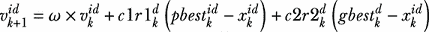

| 9.1 |
| --- |

|

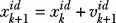

| 9.2 |
| --- |

其中

+   *k* 是迭代次数。

+   *i* 和 *d* 是粒子编号和维度。例如，在只有一个决策变量的单变量优化问题中，维度 = 1；在双变量问题中，维度 = 2 等。

+   *ω* 是惯性权重。

+   *c*1, *c*2 是加速度系数。

+   *r*1, *r*2 是介于 0 和 1 之间的随机数，并在每个迭代中为每个维度生成，而不是为每个粒子生成。

+   *pbest* 是粒子达到的最佳位置。

+   *gbest* 是整个群体达到的最佳位置。如果您将群体划分为多个邻域，则应将 *gbest* 替换为 *nbest* 或 *lbest*。

如这两个方程所示，我们首先更新速度 *v*[(]*[k]* [+ 1)]*^(id)*。然后，通过将当前位置 *x[k]^(id)* 与新的位移 *v*[(]*[k]* [+ 1)]*^(id)* × *timestamp* 相加，更新位置到 *x*[(]*[k]* [+ 1)]*^(id)*，其中 *timestamp* = 1，这代表单次迭代。

为了理解这些运动更新方程，让我们使用二维笛卡尔坐标系中的向量来可视化这些方程，如图 9.3 所示。正如您所看到的，速度更新方程由三个主要组成部分组成，每个部分都贡献于搜索空间中粒子的运动：

+   *惯性成分*—速度更新方程的第一部分代表了粒子的惯性影响，考虑到粒子（如鱼群中的鱼或鸟群中的鸟）不能突然改变方向。您将在后面看到，这个惯性成分至关重要，因为它使算法更具适应性，并有助于在探索和利用之间保持平衡。

+   *认知成分*—方程的第二部分被称为认知成分，它代表了粒子对其个人最佳位置的吸引力，或个体邻近性（*i*-邻近性）。这个成分反映了粒子对其自身过去经验的信任程度，不考虑其邻居或整个群体的经验。认知成分鼓励粒子探索其个人最佳位置周围的区域，使他们能够在有希望的区域内微调搜索。

+   *社会成分*—速度更新方程的第三部分是社会成分，它代表了粒子对群体集体知识或群体邻近性的吸引力（*g*-邻近性）。这个成分考虑了邻近粒子和整个群体的经验，引导粒子向迄今为止找到的全局最佳位置移动。社会成分促进了粒子之间的协作，帮助他们更有效地收敛到最佳解。


图 9.3 展示了群体中粒子的运动方程

为了更好地理解每个成分的含义，想象一群朋友第一次参观一个大型游乐园。他们的目标是尽可能高效地参观公园中最刺激的游乐设施。这些朋友可以被看作是 PSO 算法中的粒子，每个人对游乐设施的享受作为要优化的目标函数。每个人都有自己探索可用游乐设施的首选方式，比如穿过公园的某些部分或尝试特定的游乐设施，如过山车或水上滑梯。这类似于 PSO 中的惯性成分，其中粒子保持其当前的速度和方向，确保他们不会过于突然地改变探索模式。

每个朋友都依靠自己的个人经验来寻找最刺激的游乐设施。例如，一个朋友可能在当天早些时候在过山车上玩得很开心。他们更有可能回到他们最喜欢的游乐设施，或者想要找到更多类似的游乐设施，因为他们知道这是一个好选择。他们信任自己的判断，并专注于探索过山车周围的区域，寻找他们认为会喜欢的游乐设施，基于他们的个人经验。这就是认知成分，在 PSO 中，粒子被吸引到它们的个人最佳位置，遵循它们过去的经验和个人偏好。

然后，朋友们根据他们的共同经历合作寻找最刺激的游乐设施。想象一下，其中一位朋友刚刚乘坐了最刺激的过山车，迫不及待地想告诉其他人。当他们分享他们的兴奋时，整个群体对那个游乐设施的兴趣会集体增加，影响他们的个人选择。这是社会成分，其中 PSO 中的粒子受到全局最佳位置或群体集体知识的 影响。

下面的子节将更详细地介绍不同的 PSO 参数。

### 9.2.2 适应度更新

移动后，每个粒子使用以下方程更新其个人最佳值，假设是一个最小化问题：

|

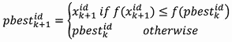

| 9.3 |
| --- |

之后，每个邻域按照以下方式更新其最佳值：

|


| 9.4 |
| --- |

如果邻域是整个群体，则邻域最佳 (*nbest*) 与全局最佳 (*gbest*) 相同。

PSO 根据粒子位置和速度的更新方式主要有两种变体——同步和异步 PSO：

+   *同步 PSO (S-PSO)*——群体中的所有粒子以全局方式同时更新其位置和速度。然后更新局部和全局最佳值。这种同步方法确保了在更新速度和位置时，所有粒子都能访问相同的全局最佳位置，从而促进全局探索。

+   *异步 PSO (A-PSO)*——粒子根据群体的当前状态进行更新。这种异步方法允许粒子根据最新的可用信息更新其位置和速度。

图 9.4 显示了 S-PSO 和 A-PSO 之间的差异。你会注意到，在 A-PSO 中，邻域最佳更新被移动到粒子的更新循环中。这允许粒子独立和异步地评估其适应度并更新其位置和速度。

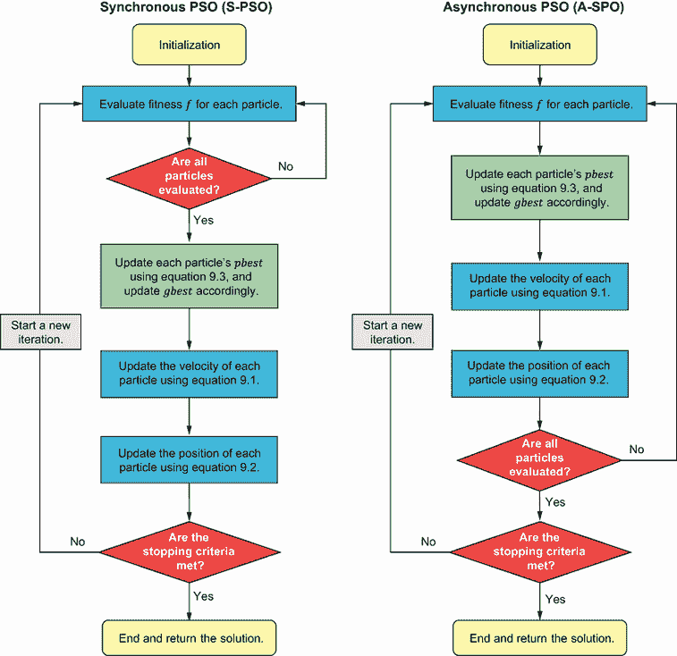

图 9.4 同步和异步 PSO

尽管同步和异步 PSO 策略都可以用于处理优化问题，但异步版本通常更有效，因为它允许粒子利用最新的邻域信息。

### 9.2.3 初始化

PSO 初始化包括初始化粒子位置、速度和个人最佳值，以及初始化算法的参数：

+   *粒子位置初始化*——粒子位置代表问题的候选解，它们可以使用不同的采样方法进行采样，如第 7.1 节所述。例如，粒子的初始位置可以在定义的可行搜索空间内随机分配。

+   *粒子速度初始化*——粒子的速度可以最初设置为零或小值。用小速度初始化它们确保粒子的更新是渐进的，防止它们远离起始位置。相比之下，大的初始速度可能导致显著的更新，这可能会引起发散并阻碍算法的收敛。

+   *个人最佳位置初始化*——每个粒子的个人最佳位置，代表粒子迄今为止找到的最佳解，应初始化为其初始位置。这允许粒子以它们的起始点作为参考开始搜索，并在发现更好的解决方案时更新它们的个人最佳位置。

如方程 9.1 所示，PSO 有三个主要参数，这些参数在控制搜索算法行为方面起着关键作用：惯性权重（*ω*）和加速度系数（*c*1，*c*2）。这些参数影响优化过程中探索与利用之间的平衡：

+   *惯性权重*——大的*ω*值鼓励探索，而小的值促进利用，允许认知和社会组件发挥更大的控制作用。*ω*的一个广泛采用值是 0.792。

+   *加速度系数*——将*c*1 设置为 0 将 PSO 算法简化为*仅社交*或*无私的 PSO*模型。在这种情况下，粒子仅被吸引到群体最佳位置，而忽略它们个人的最佳位置。这导致基于群体集体知识的全局探索得到强调。将*c*2 设置为 0 将导致*仅认知*模型，其中粒子作为独立的爬山者行动，仅依靠它们个人的最佳位置。在这种情况下，粒子不考虑其他群体成员的经验，专注于基于它们个人经验的局部利用。在许多应用中，*c*1 和*c*2 被设置为 1.49。尽管没有理论上的依据来支持这个特定值，但经验上发现它在各种优化问题中表现良好。一般来说，*c*1 和*c*2 的和应小于或等于 4，以保持算法的稳定性和收敛特性。

需要考虑的其他参数包括群体大小和邻域大小。没有一种适合所有情况的解决方案，因为最佳值取决于要解决的问题的具体情况。然而，一些最佳实践和指南可以帮助你做出选择：

+   *群体大小*—较大的群体大小可以促进全局探索并防止过早收敛，但代价是增加了计算工作量。较小的群体大小可以导致更快收敛和减少计算工作量，但可能会增加过早收敛的风险。对于许多问题，20 到 100 个粒子的群体大小已被发现能产生良好的结果。建议进行不同群体大小的实验，以确定针对特定问题的探索、利用和计算复杂度之间的最佳权衡。

+   *邻域大小*—较大的邻域大小可以鼓励全局探索和粒子之间的信息共享，但可能会降低利用局部最优的能力。较小的邻域大小可以促进局部利用和收敛速度，但可能会限制全局探索。你可以使用不同的邻域结构，如下一小节所示。

通常来说，选择最佳算法参数需要根据你试图解决的问题进行实验和微调。进行敏感性分析或使用参数调整技术以找到问题的最佳参数值通常是很有益的。我们将在 9.5 节中更详细地探讨这一点。

### 9.2.4 邻域

在 PSO 算法中，特定邻域内的粒子通过共享该局部区域内彼此的成功细节进行相互通信。随后，所有粒子都会向一个被认为基于关键性能指标有所改进的位置聚集。PSO 算法的有效性高度依赖于所采用的社会网络结构。选择合适的邻域拓扑在确保算法收敛和防止其陷入局部最优中起着至关重要的作用。

在 PSO 中使用的常见邻域拓扑包括星型社交结构、环形拓扑、冯·诺伊曼模型和轮形拓扑：

+   *星型社交结构，也称为全局最优（gbest）PSO*—这是一个所有粒子都相互连接的邻域拓扑，如图 9.5a 所示。这种结构允许群体内访问全局信息，结果是每个粒子都会被整个群体发现的最佳解所吸引。gbest PSO 已被证明比其他网络结构收敛得更快。然而，它更容易在没有完全探索搜索空间的情况下陷入局部最优。当应用于单峰问题时，这种拓扑特别出色，因为它允许在这种情况下进行高效有效的优化。

+   *环形拓扑，也称为局部最优（lbest）PSO*—遵循此拓扑，粒子仅与其直接相邻的邻居相互作用（如图 9.5b 所示）。每个粒子都试图通过向局部范围内发现的最佳解靠近来模仿其最成功的邻居。尽管收敛速度比星型结构慢，但环形拓扑探索了更广泛的搜索空间。这种拓扑建议用于多模态问题。

+   *冯·诺伊曼模型*—在这个拓扑中，粒子以网格状结构或正方形拓扑排列，每个粒子与四个其他粒子（上方、下方、右侧和左侧的邻居）相连，如图 9.5c 所示。

+   *轮形拓扑*—在这个拓扑中，粒子彼此隔离，随机选择一个粒子作为所有信息流的焦点或中心，如图 9.5d 所示。

邻域拓扑的选择取决于问题的特征以及探索和利用之间所需达到的平衡。尝试不同的拓扑结构以找到最适合您问题的最佳匹配。

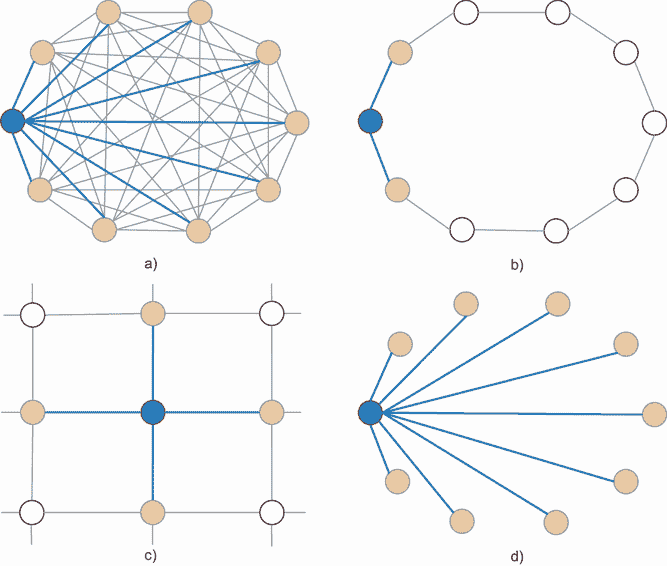

图 9.5 PSO 邻域拓扑：a) 星型社会结构，b) 环形拓扑，c) 冯·诺伊曼模型，和 d) 轮形拓扑

现在我们来看如何使用 PSO 解决连续优化问题。Michalewicz 函数是一种非凸数学函数，通常用作优化算法的测试问题。该函数由以下公式给出：

|


| 9.5 |
| --- |

其中*d*是问题的维度，*m*是一个常数（通常*m* = 10）。该函数有*d*个局部最小值。对于*d* = 2，最小值是-1.8013，在(2.20, 1.57)处。

让我们从定义 Michalewicz 函数开始，如列表 9.1 所示。该函数可以接受大小为 1 的数组，具有单行或多行。如果输入位置是大小为 1 的单行数组，我们使用`reshape()`函数将其重塑为单行的二维数组。*大小为 1 的数组*，也称为*单元素数组*，是一种只包含一个元素的数据结构。这种重塑使得可以统一处理单行大小为 1 的数组和多行数组。这在 PSO 求解器的实现中很明显，其中该函数一次解决一个解。此外，该函数无缝地管理多行数组，这在同时评估多个解时遇到。这一方面将在 pymoo 和 PySwarms 求解器的上下文中进一步阐述。

列表 9.1 使用 PSO 求解 Michalewicz 函数

```py
import numpy as np
import math
import matplotlib.pyplot as plt

def michalewicz_function(position):
    m = 10
    position = np.array(position)
    if len(position.shape) == 1:            ①
        position = position.reshape(1, -1)  ①
    n = position.shape[1]
    j = np.arange(1, n + 1)
    s = np.sin(position) * np.power(np.sin((j * np.square(position)) /
➥ np.pi), 2 * m)                           ②
    return -np.sum(s, axis=1)               ②
```

① 如果位置是大小为 1 的数组，则将其重塑为单行的二维数组。

② Michalewicz 公式

让我们现在从头开始创建一个 PSO 求解器。作为 9.1 列表的延续，我们首先定义一个具有位置、速度和个人最佳值的粒子类，如下所示：

```py
class Particle:
    def __init__(self, position, velocity, pbest_position, pbest_value):
        self.position = position
        self.velocity = velocity
        self.pbest_position = pbest_position
        self.pbest_value = pbest_value
```

要最小化的适应度函数是本例中的 Michalewicz 函数：

```py
def fitness_function(position):
    return michalewicz_function(position)
```

我们现在可以定义速度更新函数，根据方程 9.1。该函数接受三个参数——`particle`，它是一个表示当前粒子的对象；`gbest_position`，它是迄今为止群体找到的全局最佳位置；以及`options`，它是一个包含算法参数的字典（特别是惯性权重`w`和认知及社会加速度系数`c1`和`c2`）：

```py
def update_velocity(particle, gbest_position, options):    
    w = options['w']
    c1 = options['c1']
    c2 = options['c2']
    inertia = w * particle.velocity
    cognitive = c1 * np.random.rand() * (particle.pbest_position –
➥ particle.position)
    social = c2 * np.random.rand() * (gbest_position - particle.position)
    new_velocity = inertia + cognitive + social
    return new_velocity
```

函数根据方程 9.1 计算新速度的三个分量：惯性分量、认知分量和社会分量。它返回三个分量的总和作为更新后的速度。

我们现在可以定义 PSO 求解器函数。此函数接受四个参数作为输入——`swarm_size`，它是粒子群的大小；`iterations`，它是运行算法的最大迭代次数；`bounds`，它是一个元组列表，定义了输入向量每个维度的搜索空间的上下边界；以及`options`，它是一个包含算法参数的字典（例如惯性权重和认知及社会加速度系数）：

```py
def pso(swarm_size, iterations, bounds, options):                            ①
    swarm = []                                                               ①
    for _ in range(swarm_size):                                              ①
        position = np.array([np.random.uniform(low=low, high=high) for low,  ①
➥ high in bounds])                                                          ①
        velocity = np.array([np.random.uniform(low=-abs(high-low),           ①
➥  high=abs(high-low)) for low, high in bounds])                            ①
        pbest_position = position                                            ①
        pbest_value = fitness_function(position)                             ①
        particle = Particle(position, velocity, pbest_position, pbest_value) ①
        swarm.append(particle)                                               ①

    gbest_position = swarm[np.argmin([particle.pbest_value for particle in   ②
➥ swarm])].pbest_position                                                   ②
    gbest_value = np.min([particle.pbest_value for particle in swarm])       ②

    for _ in range(iterations):
        for _, particle in enumerate(swarm):
            particle.velocity = update_velocity(particle, gbest_position,    ③
options)                                                                     ③
            particle.position += particle.velocity                           ③

            particle.position = np.clip(particle.position, [low for low, high 
  ➥ in bounds], [high for low, high in bounds])                             ④

            current_value = fitness_function(particle.position)              ⑤
            if current_value < particle.pbest_value:                         ⑤
                particle.pbest_position = particle.position                  ⑤
                particle.pbest_value = current_value                         ⑤

            if current_value < gbest_value:                                  ⑥
                gbest_position = particle.position                           ⑥
                gbest_value = current_value                                  ⑥

            particle.position += particle.velocity                           ⑦

    return gbest_position, gbest_value                                       ⑧
```

① 初始化一个随机群体。

② 初始化全局最佳。

③ 更新速度和位置。

④ 应用边界。

⑤ 更新个人最佳（pbest）。

⑥ 更新全局最佳（gbest）。

⑦ 更新位置。

⑧ 返回全局最佳位置和相应的值。

函数首先通过在`bounds`定义的边界内随机生成每个粒子的初始位置和速度来初始化粒子群。然后，它评估每个粒子的适应度函数，并相应地更新其个人最佳位置和值。然后，函数进入一个循环，在该循环中使用`update_velocity`函数更新每个粒子的速度和位置，该函数接受迄今为止找到的全局最佳位置作为输入。该函数还应用边界到粒子位置，并更新其个人最佳位置和值。然后，根据星型拓扑更新全局最佳位置和值。其他拓扑，如环形、冯·诺伊曼和轮形，可以在 9.1 列表的完整代码中找到，该代码可在本书的 GitHub 存储库中找到。最后，函数返回算法找到的全局最佳位置和值。

在设置问题和算法参数后，我们现在可以使用此 PSO 求解器最小化 Michalewicz 函数，如下所示：

```py
swarm_size = 50                                                            ①
iterations = 1000                                                          ①
options = {'w': 0.9, 'c1': 0.5, 'c2': 0.3}                                 ①

dimension = 2                                                              ②
bounds = [(0, math.pi)] * dimension                                        ②

best_position, best_value = pso(swarm_size, iterations, bounds, options)   ③
```

① PSO 参数

② Michalewicz 函数的维度和域

③ 使用已实现的 PSO 求解器解决问题。

你可以在运行 PSO 后打印出最优解和函数的最小值：

```py
print(f"Optimal solution: {np.round(best_position,3)}")
print(f"Minimum value: {np.round(best_value,4)}")
print()
```

输出如下：

```py
Optimal solution: [2.183 1.57]
Minimum value: [-1.8013]
```

与遗传算法相比，Python 库中可用的 PSO 更少。Pymoo 为连续问题提供了一个 PSO 实现。作为列表 9.1 的延续，pymoo PSO 可以如下用于解决相同的问题：

```py
from pymoo.algorithms.soo.nonconvex.pso import PSO
from pymoo.core.problem import Problem
from pymoo.optimize import minimize

class MichalewiczFunction(Problem):                       ①
    def __init__(self):
        super().__init__(n_var=2,                         ②
                         n_obj=1,
                         n_constr=0,
                         xl=0,                            ③
                         xu=math.pi,                      ③
                         vtype=float)

    def _evaluate(self, x, out, *args, **kwargs):
        out["F"]= michalewicz_function(x)                 ④

problem = MichalewiczFunction()                           ⑤

algorithm = PSO(w=0.9, c1=2.0, c2=2.0)                    ⑥

res = minimize(problem,
               algorithm,
               seed=1,
               verbose=False)                             ⑦

print(f"Optimal solution: {np.round(res.X,3)}")           ⑧
print(f"Minimum value: {np.round(res.F,4)}")              ⑧
```

① 定义问题。

② 2D Michalewicz 函数

③ 设置下限和上限。

④ 评估目标函数。

⑤ 创建问题实例。

⑥ 使用参数定义求解器。

⑦ 将 PSO 应用于解决问题。

⑧ 运行 PSO 后打印最优解和函数的最小值。

此代码产生以下输出：

```py
Optimal solution: [2.203 1.571]
Minimum value: [-1.8013]
```

PySwarms 是另一个用于 Python 的开源优化库，它实现了 PSO 的不同变体。PySwarms 可以如下使用来处理问题：

```py
!pip install pyswarms
import pyswarms as ps                                                      ①

dimension = 2                                                              ②
bounds = (np.zeros(dimension), np.pi * np.ones(dimension))                 ③

options = {'w': 0.9, 'c1': 0.5, 'c2': 0.3}                                 ④

optimizer = ps.single.GlobalBestPSO(n_particles=100, dimensions=dimension,
➥ options=options, bounds=bounds)                                         ⑤

cost, pos = optimizer.optimize(michalewicz_function, iters=1000)           ⑥

print(f"Optimal solution: {np.round(pos,3)}")                              ⑦
print(f"Minimum value: {np.round(cost,4)}")                                ⑦
```

① 从 pyswarms 导入 PSO 求解器。

② Michalewicz 函数的维度

③ 为搜索空间创建边界。

④ 设置优化器。

⑤ 创建优化器的实例。

⑥ 优化 Michalewicz 函数

⑦ 运行 PSO 后打印最优解和函数的最小值。

此代码产生以下输出：

```py
Optimal solution: [2.203 1.571]
Minimum value: -1.8013
```

pyswarms.single 包实现了连续单目标优化中的各种技术。从该模块中，我们使用了之前代码中的全局最优 PSO（*gbest* PSO）算法。你可以通过将此求解器替换为局部最优来实验。

图 9.6 显示了 Michalewicz 函数的 3D 地形和 2D 等高线，最优解以及 PSO、PSO Pymoo 和 PSO PySwarms 获得的解。


图 9.6 Michalewicz 函数的 3D 和 2D 图。三个解都非常接近最优解。

三个版本的 PSO 提供了可比的结果。然而，PSO PySwarms 和 PSO pymoo 更稳定，因为它们每次运行代码时都提供更一致的结果。与 pymoo 相比，PySwarms 库在 PSO 方面更全面，因为它提供了不同变体和拓扑结构的 PSO 实现，包括离散 PSO，这将在下一两节中解释。

## 9.3 二进制 PSO

PSO 最初是为涉及连续值变量的问题开发的。然而，许多现实世界的问题在本质上是非连续的或组合的，例如 TSP、任务分配、调度、分配问题和特征选择等。这类问题涉及在有限的可能解集中搜索，而不是在连续空间中搜索。为了处理这些离散问题，已经开发了 PSO 的变体，如二进制 PSO 和基于排列的 PSO。

在 *二进制粒子群优化*（BPSO）中，每个粒子代表二进制空间中的一个位置，其中每个元素是 0 或 1。二进制序列根据其当前值、粒子中特定位的基于适应度的值以及迄今为止观察到的相邻粒子中相同位的最佳值逐位更新。这种方法使得搜索可以在二进制空间而不是连续空间中进行，这对于变量为二进制的实际问题非常适合。

在 BPSO 中，速度是根据位变化的概率定义的。为了将速度元素的值限制在 [0,1] 范围内，使用了 S 形函数：

|

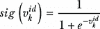

| 9.6 |
| --- |

位置更新方程因此变为

|

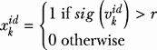

| 9.7 |
| --- |

其中 *r* 是在 [0, 1] 范围内随机生成的数字。图 9.7 展示了 S 形函数和更新位置为 1 的概率。例如，如果 *v* = 0.3，这意味着更新位置为 1 的概率是 30%，而为 0 的概率是 70%。

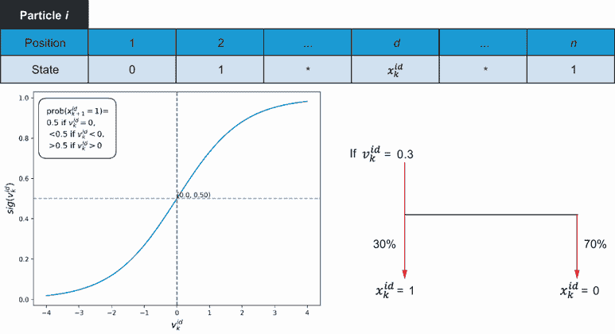

图 9.7 二进制粒子群优化（BPSO）中的位置和速度表示。每个粒子代表二进制空间中的一个位置。速度是根据位变化的概率定义的。

如您所注意到的，速度分量将保持为使用原始方程中的实数值，但在更新位置向量之前，这些值将通过 S 形函数。以下方程是 BPSO 中的速度更新方程：

|


| 9.8 |
| --- |

|


| 9.9 |
| --- |

位置更新根据以下方程进行：

|


| 9.10 |
| --- |

其中

+   *ϕ*[1] 和 *ϕ*[2] 代表从均匀分布中抽取的不同随机数。有时这些参数是从 0–2 的均匀分布中选择的，使得它们的两个极限之和为 4.0。

+   *v^i^d[k]* [+1] 是个体 *i* 在二进制字符串的第 *d^(th)* 位选择 1 的概率。

+   *x[k]^(id)* 是字符串 *i* 在位 *d* 的当前状态。

+   *v[k]^(id)* 是字符串当前选择 1 的概率的度量。

+   *pbest[k]^(id)* 是个体 *i* 中位 *d* 的迄今为止找到的最佳状态（即，1 或 0）。

+   *gbest[k]^d* 取决于迄今为止最佳邻居中位 *d* 的值是 1 还是 0。

BPSO 示例

为了说明 BPSO 的工作原理，假设我们有一个由五个二进制粒子组成的种群，其中每个粒子由 6 位组成。让我们假设粒子由以下二进制字符串表示：101101，110001，011110，100010，和 001011。我们想要更新粒子 4（由二进制字符串 100010 表示）在位 3（当前值为 0）的值。假设这个位变为 1 的当前倾向（速度）是 0.23。此外，我们假设这个粒子迄今为止找到的最佳值是 101110，而整个种群找到的最佳值是 101111。让我们还假设ϕ[1] = 1.5 和ϕ[2] = 1.9。使用方程 9.8 和 9.9，我们可以得到粒子 4 中位 3 的更新速度如下：

粒子 4：100010，*v[k]*⁴³ = 0.23，*x[k]*⁴³ = 0，*pbest[k]*⁴³ = 1，*gbest[k]*³ = 1，ϕ[1] = 1.5，ϕ[2] = 1.9

*v[k]* [+ 1]⁴³ = 0.23 + 1.5(1–0) + 1.9(1–0) = 3.63

*sig*(*v[k]* [+ 1]⁴³) = *sig*(3.63) = 1/(1 + *e*^(–3.63)) = 0.974

生成一个随机数 *r*⁴³ = 0.6，并使用方程 9.10 更新位置如下：

*x[k]* [+ 1]⁴³ = 1 因为 *sig*(*v[k]* [+ 1]⁴³) > *r*⁴³

更新粒子 4：100110

更多关于 BPSO 的信息，请参阅 Kennedy 和 Eberhart 的文章“粒子群算法的离散二进制版本” [2]。

## 9.4 基于排列的 PSO

已经进行了许多努力来将 PSO 应用于解决排列问题。将 PSO 适应这些问题的挑战源于速度和方向的概念本身不适用于排列问题。为了克服这个障碍，需要重新定义像加法和乘法这样的算术运算。

在 M. Clerc 的 2004 年文章“离散粒子群优化，以旅行商问题为例” [3]中，PSO 被应用于解决 TSP 问题。粒子的位置是问题的解（城市的排列）。粒子的速度被定义为对粒子执行的一组交换。正如你所看到的，方程 9.1 的右侧包含三个算术运算：乘法、减法和加法。这些运算在新的搜索空间中被重新定义为以下内容：

+   *乘法*—速度向量限制城市之间的交换次数。将这个向量乘以一个常数 *c*，结果得到另一个具有不同长度的速度向量，这取决于常数的值。如果 *c* = 0，则速度向量的长度（即包含的交换次数）设置为 0。这意味着不会执行任何交换。如果 *c* < 1，则速度被截断。如果 *c* > 1，则速度如图 9.8 所示增加。增加意味着将来自当前速度向量顶部的交换添加到新速度向量的末尾。

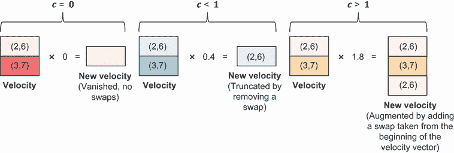

图 9.8 基于排列的 PSO 重新定义的乘法

+   *减法*—两个位置相减应产生一个速度。此操作产生将一个位置转换为另一个位置的交换序列。例如，让我们考虑一个 8 城市 TSP 问题。该 TSP 的一个候选解由排列表示，例如[2, 4, 6, 1, 5, 3, 8, 7]。图 9.9 展示了如何通过减去两个位置来生成一个新的速度向量。


图 9.9 基于排列的 PSO 重新定义的减法操作

+   *加法*—该操作通过应用由速度定义的交换序列到位置向量来执行。图 9.10 展示了如何通过将速度交换向量加到当前位置来生成一个新的位置（即一个新的候选解）。


图 9.10 基于排列的 PSO 重新定义的加法操作

这些重新定义的算术运算使我们能够更新 PSO 粒子的速度和位置。

## 9.5 自适应 PSO

惯性、认知和社会成分是 PSO 的主要参数，可以在优化过程中实现探索和开发的平衡。这三个因素显著影响算法的行为，如以下小节所述。

### 9.5.1 惯性权重

惯性参数表示粒子保持其当前轨迹的趋势。通过调整惯性值，算法可以在广泛搜索解空间（探索）和专注于迄今为止找到的最佳解（开发）之间取得平衡。较大的*ω*值促进探索，而较小的值促进开发，如图 9.11 所示。过小的值可能会阻碍群体的探索能力。随着*ω*值的减小，认知和社会成分对位置更新的影响变得更加突出。


图 9.11 PSO 参数对搜索行为的影响。较大的惯性促进探索，而较小的值促进开发。*c*1 > *c*2 会导致个体在搜索空间中过度徘徊。相比之下，*c*2 > *c*1 可能会导致粒子过早地向局部最优解冲去。

当 *ω* > 1 时，粒子速度倾向于随时间增加，加速向最大速度（假设使用了速度钳位），最终导致群体发散。在这种情况下，粒子难以改变方向返回有希望的领域。另一方面，当 *ω* < 1 时，粒子可能会逐渐减速，直到它们的速度接近 0，这取决于加速度系数的值。可以通过设置速度的最大（和最小）限制来考虑速度钳位。如果粒子的计算速度超过此限制，则将其设置为最大（或最小）值。这防止粒子在问题空间中走得太远或在搜索空间的特定区域卡住。

可以使用以下方法来更新惯性权重：

+   *随机选择 (RS)*—这涉及到在每次迭代中选择不同的惯性权重。权重可以从具有您选择的平均值和标准差的分布中选择，但重要的是要确保尽管存在随机性，群体仍然收敛。以下公式可以用来：

|

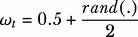

| 9.11 |
| --- |

其中 *rand*(.) 是 [0,1] 范围内均匀分布的随机数。因此，惯性权重的平均值是 0.75。

+   *线性时变 (LTV)*—这涉及到逐渐减小 *𝜔* 的值，从起始的高值 *𝜔[max]* 下降到最终的低值 *𝜔[min]*，遵循以下方程：

|

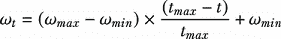

| 9.12 |
| --- |

其中 *𝑡[max]* 是迭代次数，*t* 是当前迭代，*𝜔[t]* 是第 *t* 次迭代的惯性权重值。通常，约定将 *𝜔[max]* 和 *𝜔[min]* 设置为 0.9 和 0.4。

+   *非线性时变 (NLTV)*—这种方法也涉及到从初始高值减小惯性权重，但这种减小可以是非线性的，如下方程所示：

|


| 9.13 |
| --- |

其中 *𝜔[𝑡]*[=0] = 0.9 是 *𝜔* 的初始选择。通过允许更多时间下降到动态范围的较低端，NLTV 可以增强局部搜索或开发。

图 9.12 展示了这三种更新方法。


图 9.12 不同惯性权重更新方法

如您所见，在随机选择中，每次迭代都会随机选择不同的惯性权重。惯性权重的平均值是 0.75。LTV 线性减小惯性权重。在 NLTV 中，惯性权重的减小比 LTV 更渐进。总之，惯性权重在 PSO 算法的收敛速度和解决方案质量中起着至关重要的作用。高惯性权重促进探索，而低惯性权重鼓励开发。

### 9.5.2 认知和社会成分

认知组件*c*1 是与粒子个体学习能力相关的参数，其中粒子受其自身经验的影响。社会组件*c*2 是与群体中所有粒子的集体学习能力相关的参数。它表示粒子受其邻居找到的最佳解决方案影响的程度。如果*c*1 > *c*2，算法将表现出探索行为，如果*c*2 > *c*1，算法将倾向于利用局部搜索空间，如图 9.11 所示。将*c*1 = 0 将速度模型简化为仅社会模型或无私模型（粒子都被吸引到*nbest*）。另一方面，将*c*2 = 0 将其简化为仅认知模型（粒子是独立的，如爬山算法的情况）。

通常，*c*1 和*c*2 在 PSO 中保持不变。经验上，*c*1 和*c*2 的和应小于或等于 4，任何与此有显著差异的情况可能导致发散行为。在自适应 PSO 中，建议随着时间的推移逐渐降低*c*1 的值，并使用线性公式[4]同时增加*c*2 的值，如下所示：

|


| 9.14 |
| --- |

|

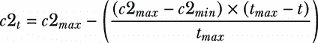

| 9.15 |
| --- |

其中*t*是迭代索引，*c*1*[max]*和*c*2*[max]*分别是最大认知和社会参数，*c*1*[min]*和*c*2*[min]*分别是最小认知和社会参数，*t[max]*是最大迭代次数。

图 9.13 显示了线性变化的*c*1 和*c*2。如图所示，我们开始时*c*1 > *c*2，以利于探索。随着搜索的进行，*c*2 开始高于*c*1，以利于利用。


图 9.13 认知和社会加速系数更新。c1>c2 导致更多的探索，而 c2>c1 可能导致更多的利用。

让我们看看如何使用 PSO 处理连续和离散优化问题。

## 9.6 解决旅行商问题

在上一章中，您看到了如何使用遗传算法从纽约市开始解决美国 20 个主要城市的 TSP 问题。现在，让我们使用 PSO 解决相同的问题，如下所示。我们首先定义二十个美国城市的纬度和经度，并计算它们之间的城市距离。

列表 9.2 使用 PSO 解决 TSP

```py
import numpy as np
import pandas as pd
from collections import defaultdict
from haversine import haversine
import networkx as nx
import matplotlib.pyplot as plt
import pyswarms as ps

cities = {
    'New York City': (40.72, -74.00),
    'Philadelphia': (39.95, -75.17),       
    'Baltimore': (39.28, -76.62),
    'Charlotte': (35.23, -80.85),
    'Memphis': (35.12, -89.97),
    'Jacksonville': (30.32, -81.70),
    'Houston': (29.77, -95.38),
    'Austin': (30.27, -97.77),
    'San Antonio': (29.53, -98.47),
    'Fort Worth': (32.75, -97.33),
    'Dallas': (32.78, -96.80),
    'San Diego': (32.78, -117.15),
    'Los Angeles': (34.05, -118.25),
    'San Jose': (37.30, -121.87),
    'San Francisco': (37.78, -122.42),    
    'Indianapolis': (39.78, -86.15),
    'Phoenix': (33.45, -112.07),       
    'Columbus': (39.98, -82.98), 
    'Chicago': (41.88, -87.63),
    'Detroit': (42.33, -83.05)
}                                                    ①

distance_matrix = defaultdict(dict)                  ②
for ka, va in cities.items():                        ②
    for kb, vb in cities.items():                    ②
        distance_matrix[ka][kb] = 0.0 if kb == ka    ②
➥ else haversine((va[0],va[1]), (vb[0], vb[1]))     ②

distances = pd.DataFrame(distance_matrix)            ③
distance=distances.values                            ③
city_names=list(distances.columns)                   ③
```

①为二十个主要美国城市定义纬度和经度。

②根据纬度和经度坐标创建哈夫曼距离矩阵。

③将距离字典转换为具有距离值和城市名称作为标题的数据框。

接下来，我们可以计算城市的数量并设置决策变量的整数边界，这些变量代表访问城市的顺序。第一个函数`tsp_distance`接受两个参数：`position`和`distance`。`position`是一个一维数组，表示访问城市的顺序。`distance`是一个二维数组，包含所有城市对之间的距离。该函数首先将`tour`定义为表示访问城市顺序的索引排列。然后，通过计算相邻城市之间的距离以及路线中最后一个城市与起始城市之间的距离来计算路线的总距离。

第二个函数`tsp_cost`接受两个参数：`x`和`distance`。`x`是一个二维数组，包含 TSP 问题的决策变量，其中每一行代表群体中的不同粒子。`distance`是一个二维数组，包含所有城市对之间的距离。该函数通过在`x`的每一行上调用`tsp_distance`函数来计算每个粒子的成本，并返回一个成本列表：

```py
n_cities = len(city_names)                                            ①
bounds = (np.zeros(n_cities), np.ones(n_cities)*(n_cities-1))         ①

def tsp_distance(position, distance):                                 ②
    tour = np.argsort(position)                                       ③
    total_distance = distance[0, tour[0]]                             ④
    for i in range(n_cities-1):                                       ④
        total_distance += distance[tour[i], tour[i+1]]                ④
    total_distance += distance[tour[-1], 0]                           ④
    return total_distance

def tsp_cost(x, distance):                                            ⑤
    n_particles = x.shape[0]                                          ⑤
    cost=0                                                            ⑤
    cost = [tsp_distance(x[i], distance) for i in range(n_particles)] ⑤
    return cost                                                       ⑤
```

① 将旅行商问题（TSP）定义为具有整数边界的排列优化问题。

② 定义 TSP 距离函数

③ 将排列转换为 TSP 路线。

④ 从纽约市作为第一个城市开始计算路线的总距离，并添加最后一个城市返回纽约市的距离。

⑤ 计算并返回每个粒子在群体中的成本。

作为 9.2 列表的延续，以下代码设置了 PSO 优化器的参数。`options`是一个字典，包含惯性权重（`w`）、认知（`c1`）和社会（`c2`）加速度系数、要考虑的邻居数量（`k`）以及 Minkowski 距离的 p 值。`n_particles`代表优化中使用的粒子数量，`dimensions`代表决策变量的数量，等于 TSP 问题中的城市数量。优化器找到的最佳解通过按升序排序解的索引，并使用它们以相同的顺序索引`city_names`列表来转换为 TSP 路线。这创建了一个按最佳路线访问顺序排列的城市名称列表。然后，我们打印最佳路线及其长度：

```py
options = {'w': 0.79, 'c1': 2.05, 'c2': 2.05, 'k': 10, 'p': 2}            ①
optimizer = ps.discrete.BinaryPSO(n_particles=100, dimensions=n_cities,
➥ options=options)                                                       ②

cost, solution = optimizer.optimize(tsp_cost, iters=150, verbose=True,
➥ distance=distance)                                                     ③

tour = np.argsort(solution)                                               ④
city_names_tour = [city_names[i] for i in tour]                           ④

Route = " → ".join(city_names_tour)                                       ⑤
print("Route:", Route)                                                    ⑤
print("Route length:", np.round(cost, 3))                                 ⑤
```

① 设置 PSO 参数。

② 实例化 PSO 优化器。

③ 解决问题。

④ 将最佳解转换为 TSP 路线。

⑤ 打印最佳路线及其长度。

列表 9.2 生成以下输出：

```py
Route: New York City → Columbus → Indianapolis → Memphis → San Francisco → San Jose → Los Angeles → San Diego → Phoenix → Dallas → Fort Worth → San Antonio → Austin → Houston → Jacksonville → Charlotte → Baltimore → Philadelphia → Chicago → Detroit
Route length: 12781.892
```

图 9.14 显示了获得的路线。9.2 列表的完整版本可在本书的 GitHub 仓库中找到，它展示了将路线可视化为 NetworkX 图的过程。


图 9.14 展示了 20 城市 TSP 的 PSO 解决方案

根据您的需要调整代码，例如修改问题数据、初始城市或算法参数。

## 9.7 使用 PSO 进行神经网络训练

机器学习（ML）是人工智能（AI）的一个子领域，它赋予人工系统或过程从经验观察中学习的能力，而不需要明确编程。许多机器学习方法已经被提出，并且仍在被提出，更多关于机器学习的细节将在第十一章中提供。现在，让我们考虑神经网络，这是最常用且最成功的统计机器学习方法之一。人工神经网络（ANN 或 NN）方法受生物大脑的启发，可以被认为是一个高度简化的计算模型，因为神经网络与大脑的复杂性相去甚远。神经网络是深度学习模型的核心，如今它是许多成功应用的基础，这些应用触及到每个人的生活，如文本、音频、图像和视频生成、语音助手和推荐引擎等，仅举几例。

人类大脑

亚里士多德（公元前 384-322 年）写道：“在所有动物中，人类的大脑相对于其体型来说最大。”人类大脑由平均 86 亿个相互连接的神经细胞或神经元组成。每个生物神经元连接到几千个其他神经元。它非常节能，因为它只需 20 瓦的功率就能完成相当于一个艾弗洛普（每秒十亿亿次数学运算）的工作。

为了简化，我们可以将机器学习视为一种美化的曲线拟合，其目的是在自变量和因变量之间找到一个映射函数。例如，假设一个基于视觉的对象识别模型以车辆前摄像头拍摄的数字图像作为输入——输出将是识别出的对象，如汽车、行人、骑自行车的人、车道、交通灯等。实际上，在模型、评分标准和搜索策略方面，机器学习与曲线拟合有相同的成分。然而，机器学习方法，如神经网络，是一种创建人类无法编写的函数的方法。它们倾向于创建非线性、非单调、非多项式，甚至非连续的函数，这些函数近似地表示数据集中自变量和因变量之间的关系。

神经网络是一个由简单非线性计算元素（称为神经元）组成的巨大并行自适应网络，这些神经元排列在输入、隐藏和输出层中。每个节点，或人工神经元，都与另一个节点相连，并具有相关的权重和阈值，允许节点模拟神经元放电。每个单独的节点都有自己的线性回归模型，由输入数据、偏差、阈值和输出组成，如图 9.15 所示。一个神经元 *k* 可以用以下方程来描述：

|


| 9.16 |
| --- |

其输出是

|

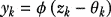

| 9.17 |
| --- |

其中 *x[i]* 是输入，*ω[ki]* 是权重，*b* 是偏差项，它定义了在没有外部输入到节点的情况下节点能够激活的能力，而 *φ* 是激活函数。这个激活函数使得当输入 *z[k]* 达到阈值 *θ[k]* 时，神经元会输出。激活函数有不同的形式（也称为压缩函数），例如符号、阶跃、tanh、反正切、S 形 sigmoid（也称为逻辑回归）、softmax、径向基函数和修正线性单元（ReLU）。

就像曲线拟合的情况一样，使用评分标准或损失函数来估计估计值和实际值之间的偏差。在这种情况下，训练神经网络本质上是一个优化问题。训练的目标是找到最优参数（权重和偏差），以最小化网络输出和预期输出之间的差异。这种差异通常使用损失或成本函数来量化，例如这些：

+   *均方误差 (MSE)*—MSE 常用于回归问题。它计算预测值和实际值之间的差的平方，然后在整个数据集上平均这些值。这个函数对大误差进行重罚。

+   *交叉熵损失*—交叉熵损失通常用于二进制和多类分类问题。它衡量预测概率分布和实际分布之间的不相似性。换句话说，它比较模型对其预测的信心与实际结果。

+   *负对数似然 (NLL)*—NLL 是多类分类中的另一个损失函数。如果 *y* 是真实标签，而 *p*(*y*) 是该标签的预测概率，则负对数似然定义为 –log(*p*(*y*)）。对数函数将介于 0 和 1 之间的概率转换为介于正无穷大到 0 的尺度。当预测概率对于正确类别较高（接近 1）时，对数值更接近 0，但随着预测概率对于正确类别的降低，对数值增加到无穷大。因此，取对数值的相反数给出一个量，当预测概率对于正确类别最大化时，该量被最小化。

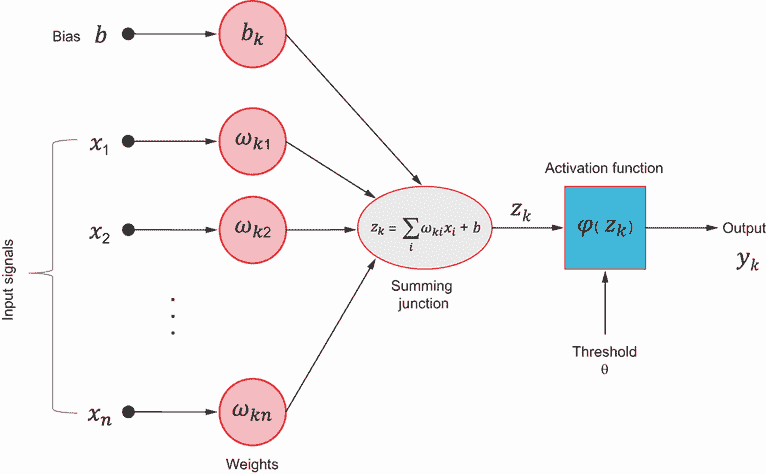

图 9.15 神经网络节点演示

训练神经网络涉及以下步骤：

+   *初始化*—在训练开始之前，网络中的权重和偏差通常使用小的随机数进行初始化。

+   *前馈*—在这个阶段，输入通过网络产生输出。这个输出是通过使用初始或当前权重、偏差和激活函数转换对输入进行计算而生成的。一个层的输出成为下一层的输入，直到产生最终输出。

+   *误差计算*—在正向传播阶段之后，输出与期望输出进行比较，使用损失函数计算误差。这个函数量化了网络的预测值与实际值之间的距离。

+   *反向传播*—计算出的误差随后通过网络反向传播，从输出层开始，移动到输入层。这个过程计算了网络中损失函数相对于权重和偏差的梯度或导数。

+   *权重调整*—在这个最终阶段，网络权重被更新以减少误差。这通常使用称为*梯度下降*的技术来完成。权重调整的方向是减少误差最多的方向，这是通过反向传播期间计算的梯度确定的。

通过多次迭代（或称为 epoch）重复这些步骤，网络逐渐学会产生更接近期望的输出，从而“学习”输入数据。

现在你已经对神经网络有了基本了解，让我们使用 PSO（粒子群优化）按照监督学习的方法训练一个简单的神经网络。在监督训练过程中，神经网络通过最初处理标记的数据集来学习。通过在标记的数据集上训练，网络可以在训练后的推理阶段预测新、未标记数据集的标签。

对于这个例子，我们将使用企鹅数据集。这是数据科学社区中一个流行的数据集，包含有关企鹅大小、性别和种类的信息。该数据集由来自南极洲帕默群岛三个岛屿的 344 个观测值组成。它包括以下七个变量：

+   `species`—企鹅的种类（阿德利企鹅、帝企鹅或金图企鹅）

+   `island`—观察到企鹅的岛屿（比斯科、梦想或托格森）

+   `bill_length_mm`—企鹅喙的长度（毫米）

+   `bill_depth_mm`—企鹅喙的深度（毫米）

+   `flipper_length_mm`—企鹅鳍的长度（毫米）

+   `body_mass_g`—企鹅身体的重量（克）

+   `sex`—企鹅的性别（雄性或雌性）

我们在 PySwarms 用例中描述的简单神经网络具有以下特征：

+   *输入层大小*—4

+   *隐藏层大小*—10（激活函数：tanh(*x*)）。双曲正切激活函数（又称 Tanh、tanh 或 TanH）将输入值映射到-1 和 1 之间，并用于在神经网络中引入非线性。记住，sigmoid 函数将输入值映射到 0 和 1 之间。tanh 函数以 0 为中心，这有助于减轻梯度消失问题，与 sigmoid 函数相比。然而，tanh 和 sigmoid 激活都存在一定程度的梯度消失问题。像 ReLU 及其变体这样的替代方案通常更受欢迎。

+   *输出层大小*—3（激活函数：softmax(*x*)）。Softmax 是 sigmoid 函数的推广。该函数接受作为输入的*logits*，这些*logits*代表网络最后一层在应用 softmax 函数将其转换为概率之前的未归一化输出。这些 logits 可以解释为衡量“证据”的指标，表明某个输入属于特定类。特定类的 logits 值越高，输入属于该类的可能性就越大。

以下列表展示了使用 PSO 训练这个简单神经网络（NN）的步骤。我们首先导入所需的库并读取 penguin 数据集。

列表 9.3 使用 PSO 进行神经网络训练

```py
import seaborn as sns                             ①
import matplotlib.pyplot as plt
import numpy as np
import pandas as pd
from sklearn.preprocessing import LabelEncoder    ②
from sklearn.decomposition import PCA             ②
import pyswarms as ps                             ③

penguins = sns.load_dataset('penguins')           ④
penguins.head()                                   ⑤
```

① 用于加载数据集

② 用于目标标签编码

③ 用于降维

④ 加载 Penguins 数据集。

⑤ 显示数据集的行和列。

这会产生如图 9.16 所示的输出。


图 9.16 鹦鹉螺数据集

作为 9.3 列表的延续，我们可以使用 seaborn 库如下可视化这个数据集：

```py
plt.figure(figsize=(8, 6))
sns.scatterplot(data=penguins, x='bill_length_mm', y='body_mass_g', 
➥ hue='species', style="species")
plt.title('Bill Length vs. Body Mass by Species')
plt.show()
```

输出如图 9.17 所示。

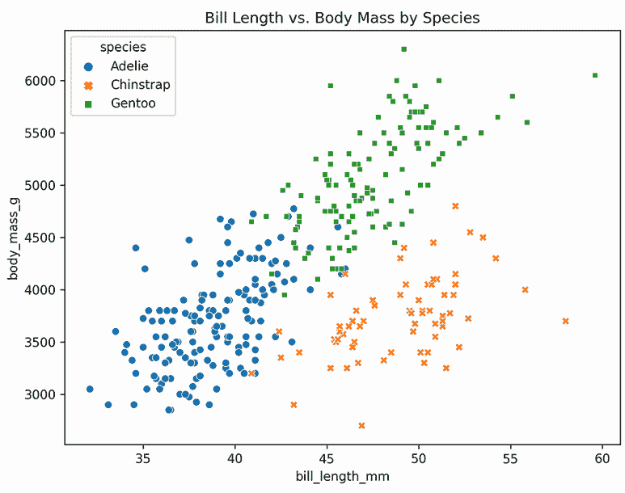

图 9.17 鹦鹉螺数据集中不同物种的喙长与体重

接下来，我们定义一个`logits_function`，它接受一个参数向量`p`，用于神经网络，并返回网络的最后一层的 logits（预激活值）。如图 9.18 所示，该函数首先使用索引和重塑操作从参数向量*p*中提取网络第一层和第二层的权重和偏差。然后，该函数通过计算第一层的预激活值*z*¹（输入数据*X*和第一组权重*W*¹的点积加上偏差项*b*¹）来执行前向传播。然后，它将 tanh 激活函数应用于*z*¹以获得第一层的激活值*a*¹。最后，该函数通过将*a*¹与第二组权重*W*²的点积加上偏差项*b*²来计算第二层的预激活值。这些结果作为网络的最后一层的 logits 返回：

```py
def logits_function(p):

    W1 = p[0: n_inputs * n_hidden].reshape((n_inputs, n_hidden)) 
    b1 = p[n_inputs * n_hidden: (n_inputs + 1) * n_hidden].reshape((n_hidden,))  ①
    W2 = p[(n_inputs +1) * n_hidden: -n_classes].reshape((n_hidden, n_classes))  ②
    b2 = p[-n_classes:].reshape((n_classes,))                                    ③

    z1 = X.dot(W1) + b1                                                          ④
    a1 = np.tanh(z1)                                                             ④
    logits = a1.dot(W2) + b2                                                     ⑤
    return logits                                                                ⑤
```

① 提取第一层的权重。

② 提取第二层的权重。

③ 提取第二层的偏差

④ 计算第一层的预激活值。

⑤ 计算并返回 logits。


图 9.18 神经网络层

接下来，我们定义`forward_prop`函数，通过具有两层 NN 进行正向传播。此函数计算给定一组参数`params`的输出 softmax 概率和负对数似然损失。函数首先调用`logits_function`来获取网络最后一层的 logits，给定参数`params`。然后，该函数使用`np.exp`函数对 logits 应用 softmax 函数，并使用带有`axis=1`参数的`np.sum`函数通过将每个样本的指数化 logits 的总和除以这些值来归一化结果。这给出了每个样本的类别概率分布。然后，该函数通过使用包含真实类别标签的`y`变量索引`probs`数组来计算每个样本正确类别的概率的负对数，该变量包含真实类别标签。使用`np.sum`函数计算这些负对数概率的总和，并将结果除以样本总数以获得每个样本的平均损失。最后，该函数返回计算出的损失：

```py
def forward_prop(params):

    logits = logits_function(params)                                  ①

    exp_scores = np.exp(logits)                                       ②
    probs = exp_scores / np.sum(exp_scores, axis=1, keepdims=True)    ②

    correct_logprobs = -np.log(probs[range(num_samples), y])          ③
    loss = np.sum(correct_logprobs) / num_samples                     ④

    return loss                                                       ④
```

① 获取 softmax 的 logits。

② 应用 softmax 计算类别的概率分布。

③ 计算负对数似然。

④ 计算并返回损失。

为了在整个粒子群上执行正向传播，我们定义以下`particle_loss()`函数。此函数计算 PSO 群中每个粒子的损失，给定其在搜索空间中的位置。值得注意的是，每个位置代表 NN 参数（w1,b1,w2,b2），其`dimension`计算如下：

```py
dimension = (n_inputs * n_hidden) + (n_hidden * n_classes) + n_hidden + n_classes = 4 * 10 + 10 * 3 + 10 * 3 + 1 * 10 + 1 * 3 = 83.
```

一个 NN 参数候选设置（即 PSO 术语中的*位置*）的例子如下所示：

```py
[ 3.65105185e-01 -9.57472869e-02  4.99475198e-01  2.33703047e-01
  5.56295931e-01  6.95323783e-01  8.76045204e-02  5.52892675e-01
  3.33363337e-01  5.60680304e-01  3.24233602e-01  3.40402243e-01
  2.28940991e-01  6.47396295e-01  2.49476898e-01 -2.15041386e-01
  6.61749764e-01  4.50805880e-01  7.31521923e-01  4.55724886e-01
  5.81614992e-01  4.21303249e-01  3.10417945e-01  2.80091464e-01
  3.63352355e-01  7.21593713e-01  4.11009136e-01  3.50489680e-01
  6.82325768e-01  3.60945155e-01  3.34258781e-01  5.53845122e-01
  5.39748679e-01  8.45310205e-01  7.38728229e-01  5.44408893e-01
  4.22464042e-01  4.45099192e-01  4.36914661e-01 -2.40298612e-02
  4.68795601e-01  4.58388074e-01  2.29566792e-01  5.18783606e-01
  1.21226363e-01  2.80730816e-01  4.13249634e-01  1.91229505e-01
  6.30829496e-01 -4.52777424e-01  1.62066215e-01  3.07603861e-01
  1.54565454e-01  5.39974173e-01  4.48241886e-01 -2.81999490e-04
  2.93907050e-01  2.58571312e-01  7.87784363e-01  5.06092352e-01
  1.85010537e-01  8.06641243e-01  8.30985197e-01  4.06314407e-01
  2.20795704e-01  3.25405213e-01  6.02993839e-01  4.21051295e-01
  5.24352428e-01  2.49710316e-01  4.99212007e-01  4.48000964e-01
  4.90888329e-01  3.94908331e-01  6.35997377e-01  5.91192453e-01
  6.16639300e-01  6.85748919e-01  5.40805197e-01 -1.51195135e+00
  3.21751027e-01  3.93555680e-01  5.23679003e-01]
```

然后，PSO 算法可以使用这些损失值来更新粒子的位置，并搜索 NN 的最佳参数集。

```py
def particle_loss(x):
    n_particles = x.shape[0]                               ①
    j = [forward_prop(x[i]) for i in range(n_particles)]   ②
    return np.array(j)                                     ②
```

① 确定粒子数量。

② 计算并返回每个粒子的损失。

我们需要的最后一个函数是`predict`，它使用 PSO 群中粒子的位置对应的 NN 参数来预测数据集中每个样本的类别标签。此函数首先调用`logits_function`来获取网络最后一层的 logits，给定搜索空间中粒子的位置`pos`。然后，该函数通过使用`np.argmax`函数计算 logits 的`argmax`值（即沿第二轴或`axis=1`），来计算预测的类别标签。这给出了每个样本具有最高概率的类别的索引。最后，该函数将预测的类别标签作为 numpy 数组`y_pred`返回：

```py
def predict(pos):
    logits = logits_function(pos)         ①
    y_pred = np.argmax(logits, axis=1)    ②
    return y_pred                         ②
```

① 获取网络最后一层的 logits。

② 计算并返回预测的类别标签。

我们现在可以使用 PySwarms 中可用的不同 PSO 来训练神经网络。代码首先设置几个训练样本、输入以及隐藏层和输出的数量。然后根据输入数量、隐藏节点和输出类别计算维度。定义了三种 PSO 变体：`globalBest`、`localBest`和`binaryPSO`。使用名为`options`的字典设置 PSO 超参数。这些超参数包括惯性权重`w`、认知参数`c1`、社会参数`c2`、要考虑的邻居数量`k`和 Minkowski 距离参数`p`（`p=1`是绝对值之和[或 L1 距离]，而`p=2`是欧几里得[或 L2]距离）：

```py
X = penguins[['bill_length_mm', 'bill_depth_mm', 'flipper_length_mm',
➥ 'body_mass_g']].to_numpy()                                            ①
num_samples = X.shape[0]                                                 ②
n_inputs = X.shape[1]                                                    ②
n_hidden = 10                                                            ②
n_classes = len(np.unique(y))                                            ②

dimensions = (n_inputs * n_hidden) + (n_hidden * n_classes) + n_hidden + n_
classes                                                                  ③

PSO_varaints = ['globalBest', 'localBest', 'binaryPSO']                  ④

options = {'w':0.79, 'c1': 0.9, 'c2': 0.5, 'k': 8, 'p': 2}               ⑤

for algorithm in PSO_varaints:                                           ⑥
    if algorithm == 'globalBest':

        optimizer = ps.single.GlobalBestPSO(n_particles=150, 
➥ dimensions=dimensions, options=options)
        cost, pos = optimizer.optimize(particle_loss, iters=2000)
        print("#"*30)
        print(f"PSO varaints: {algorithm}")
        print(f"Best average accuracy: {100*round((predict(pos) == y).mean(),3)} %")
        print()
    elif algorithm == 'localBest':
        optimizer = ps.single.LocalBestPSO(n_particles=150, 
➥ dimensions=dimensions, options=options)
        cost, pos = optimizer.optimize(particle_loss, iters=2000)
        print("#"*30)
        print(f"PSO varaints: {algorithm}")
        print(f"Best average accuracy: {100*round((predict(pos) == y).mean(),3)} %")
        print()
    elif algorithm == 'binaryPSO':
        optimizer = ps.discrete.BinaryPSO(n_particles=150, 
➥ dimensions=dimensions, options=options)
        cost, pos = optimizer.optimize(particle_loss, iters=2000)
        print("#"*30)
        print(f"PSO varaints: {algorithm}")
        print(f"Best average accuracy: {100*round((predict(pos) == y).mean(),3)} %")
        print()
```

① 获取特征向量

② 设置训练样本数量、输入、隐藏层和输出。

③ 设置问题的维度。

④ 定义 PSO 的变体。

⑤ 设置 PSO 超参数

⑥ 使用不同的 PSO 变体训练神经网络，并打印最佳准确率。

然后代码通过创建 PSO 优化器实例并调用`optimize`方法，传入损失函数和要运行的迭代次数`iters`，依次使用 PSO 的每个变体来训练一个神经网络。优化器找到的最佳损失和粒子位置分别存储在`cost`和`pos`中。然后代码打印出所使用的 PSO 变体以及使用相应的粒子位置进行预测并与之比较真实类别标签`y`所获得的最佳准确率。

运行完整的列表生成以下输出：

```py
##############################
PSO variant: globalBest
Best average accuracy: 99.1 %
##############################
PSO variant: localBest
Best average accuracy: 69.1 %
##############################
PSO variant: binaryPSO
Best average accuracy: 43.8 %
```

如你所见，`globalBest` PSO 是训练此神经网络最有效的 PSO 变体。二进制 PSO 与神经网络参数的连续性不匹配。

你可以通过改变问题和算法参数来实验代码。例如，你可以使用如`bill_length_mm`和`flipper_length_mm`这样的减少特征集，而不是本代码中使用的四个特征。你也可以更改算法参数并应用速度限制。`速度限制`是 PySwarms 中启用的一个参数，用于设置速度限制的界限。它是一个大小为 2 的元组，其中第一个条目是最小速度，第二个条目是最大速度。

在下一章中，你将了解到蚁群优化（ACO）和人工蜂群（ABC）作为其他受群体智能启发的有效优化算法。

## 摘要

+   PSO 采用一种随机方法，利用粒子群体的集体智慧和运动。它基于社会互动的理念，允许高效地解决问题。

+   PSO 的基本原理是在引导群体向搜索空间中的最佳位置移动的同时，记住每个粒子的已知最佳位置，以及群体的全局已知最佳位置。

+   PSO 遵循一个简单的原则：模仿邻近个体的成功。

+   虽然 PSO 最初是为解决具有连续变量的问题而设计的，但许多现实世界的问题涉及离散或组合变量。在这些问题中，搜索空间是有限的，算法需要搜索一系列离散解。为了解决这类问题，已经开发出 PSO 的不同变体，例如二进制 PSO（BPSO）和基于排列的 PSO。

+   通过仔细调整惯性权重、认知和社会加速系数，PSO 可以有效地平衡探索和利用。
