# 10 其他要探索的群智能算法

本章涵盖

+   熟悉蚁群优化元启发式算法

+   理解蚁群优化的不同变体

+   理解人工蜂群

+   将这些群智能算法应用于解决连续和离散优化问题

在上一章中，我们探讨了粒子群优化（PSO）算法，但蚁群优化（ACO）和人工蜂群（ABC）也是其他广泛使用的群智能算法，它们从蚂蚁和蜜蜂那里汲取灵感来解决各种优化问题。让我们重新审视寻宝任务，并假设你仍然想采用一种合作和迭代的途径来找到宝藏（在优化问题的情况下，这是最佳解决方案）。你和你的朋友们被分为两个小组：蚂蚁小组和蜜蜂小组。每个小组都有自己独特的寻找宝藏的方式，使用蚁群优化或人工蜂群算法。你可以加入这两个小组中的任何一个。

作为寻宝的蚂蚁，你和你的朋友们将从基地营出发，探索不同的路径以找到宝藏。在探索过程中，你们每个人都会在身后留下特殊的粉笔（信息素）痕迹。路径越有希望，你在这条路径上留下的粉笔就越多。当你的朋友们找到你的粉笔痕迹时，他们可以决定跟随它或者探索一条新的路径。随着时间的推移，最有希望的路径将会有最强的粉笔痕迹，最终整个群体将汇聚到通往宝藏的路径上。

作为寻宝的蜜蜂，你将采用不同的方法。你有觅食蜂和侦察蜂。觅食蜂专注于搜索附近区域，而侦察蜂飞出去随机探索岛屿，寻找通往宝藏的线索。当一只蜜蜂找到有希望的线索时，它会返回基地营并执行“摇摆舞”来向其他朋友（旁观蜂）传达线索的位置和质量。这个过程会一直持续到群体找到通往宝藏的最佳路径。

本章介绍了蚁群优化和人工蜂群优化作为群智能算法。本章讨论了开放旅行商问题、函数优化、路由问题、泵设计以及供需问题，并在附录 C 的补充练习中进行了讨论。

## 10.1 自然界的微小问题解决者

蚂蚁是微小的生物，它们解决复杂问题的能力甚至超过某些人类。蚂蚁可能体积小，但当他们作为一个群体工作时，他们可以完成一些令人难以置信的壮举。在觅食过程中，它们可以找到通往食物来源的最短路径，建造复杂的隧道，甚至捕食比它们自身大得多的猎物！在巢穴建造过程中，一些蚂蚁从植物和树木上剪下叶子，其他蚂蚁在距离巢穴数百米远的地方觅食叶子，以建造通往觅食地点的高速公路，还有其他蚂蚁用自己的身体形成链条，使它们能够跨越宽阔的缝隙，并将硬叶拉在一起形成巢穴。在后一种情况下，工蚁沿着叶子的边缘形成链条，并一次缩短一个蚂蚁的链条来拉紧叶子的边缘。一旦叶子边缘就位，织叶蚁用它们的颚各夹住一个幼虫，并轻轻挤压幼虫以产生丝线，这种丝线被用来粘合叶子的边缘。

关于强大的蚂蚁的有趣事实

+   蚂蚁在大约一亿年前出现在地球上，使它们成为地球上最古老的昆虫群体之一。

+   蚂蚁的当前总估计人口为 10 的 16 次方个体。据估计，蚂蚁的总重量与人类的总重量处于同一数量级。

+   蚂蚁对于它们的体型来说非常强壮。一些种类可以携带重量是它们自身体重 50 倍的物体！为了更直观地理解这一点，这就像一个人携带一辆汽车一样！

+   大约 2%的昆虫是社会的。大约有 12,000 种不同的蚂蚁，大多数蚂蚁都是社会性昆虫。

+   蚂蚁被认为是世界上人口密度最高的生物。它们生活在由 30 个到数百万个个体组成的群体中。一些群体，如 Formica Yesensis，大约有 1,080,000 个蚁后和 306,000,000 个工蚁，生活在 2.7 平方公里的区域内，45,000 个巢穴相互连接。

+   蚂蚁使用信息素作为它们主要的聚群通信媒介。然而，蚂蚁还使用其他形式的通信，包括视觉、听觉和触觉通信。例如，一些蚂蚁种类使用声音来相互沟通。这些声音可以从简单的点击声和爆裂声到更复杂的信号，这些信号传达有关食物来源、巢穴位置和其他重要信息。一些蚂蚁种类产生的声音在人类的可听范围内（20Hz 到 20kHz）。例如，切叶蚁在相互沟通时会产生点击声。这些点击声的频率可以从 1 到 10 千赫兹。其他蚂蚁种类产生的声音超出了人类的听觉范围。例如，一些军蚁产生超声波，可以用来定位猎物或相互沟通。如果你感兴趣，可以在 YouTube 上查看“蚂蚁发出什么声音？”的视频（[`mng.bz/aEKo`](http://mng.bz/aEKo)）。

蚂蚁是一种简单的刺激-反应生物，单独无法完成复杂任务。然而，作为一个群体，蚂蚁展现出惊人的能力，能够在没有任何计划、中央控制器、集中监督或直接沟通的情况下执行复杂任务。蚂蚁采用一种称为群居通信的间接沟通机制。*群居性*是法国生物学家皮埃尔-保罗·格雷斯在 1959 年提出的一个概念，它是一种涉及环境修改的社会性昆虫之间的间接沟通方法。这些环境修改作为昆虫之间的外部或共享记忆。

蚂蚁使用信息素作为它们主要的群居通信媒介。当它们往返于食物来源地时，会在路径上留下信息素。其他蚂蚁可以检测到这些信息素，这会影响它们在选择路径时的决策。这使得蚂蚁能够作为一个紧密的单元共同工作，完成诸如从巢穴到食物来源地以及相反方向的最短路径寻找等复杂任务。没有直接的沟通或中央控制器使得蚂蚁的行动看起来几乎像是某种形式的集体智慧所协调。本质上，群居通信的现象使得像蚂蚁这样的社会性昆虫能够利用它们的集体知识和行为来完成超出个体能力的任务。

蚂蚁群体优化（ACO）灵感来源于蚂蚁的觅食行为。当它们觅食时，蚂蚁最初会在巢穴区域周围随机探索。一旦蚂蚁发现食物来源，它会携带一些食物返回巢穴，同时在路径上留下信息素轨迹。然后其他蚂蚁会跟随信息素轨迹到达食物来源，如图 10.1 所示。随着越来越多的蚂蚁跟随信息素轨迹到达食物来源，信息素轨迹的强度增加，对其他蚂蚁更具吸引力。相反，由于信息素轨迹不是固定的，并且会随着时间的推移逐渐蒸发，较长路径上的信息素轨迹会蒸发。最终，一条单独的信息素轨迹变得主导，大部分蚂蚁都会跟随这条轨迹往返于食物来源地。通过这种方式，蚂蚁可以通过集体或群体智能的过程找到巢穴和食物来源地之间的最短路径。


图 10.1 蚂蚁觅食过程。觅食的蚂蚁在其返回巢穴的路径上留下信息素轨迹。其他蚂蚁很可能会跟随具有更强信息素轨迹的路径，以到达发现的食品来源。

正如我在上一章中解释的，对群体智能算法的研究大多数最初是基于实验观察。为了理解蚂蚁在觅食过程中的集体行为，并为 ACO 算法推导启发式方法，进行了两个著名的实验：二进制桥梁实验和长度不等桥梁实验。

二进制桥梁实验是为了观察蚂蚁在面临两条连接巢穴到食物源等长的桥梁时的行为（图 10.2a）。实验旨在研究蚂蚁如何确定最佳路径以及它们如何随时间调整行为。最初，蚂蚁随机选择两条桥梁中的一条。随着蚂蚁在巢穴和食物源之间往返，它们会在所走的路径上留下信息素。随着时间的推移，更多的蚂蚁跟随信息素浓度更高的路径，这使得路径对其他蚂蚁更具吸引力。最终，两条桥梁中的一条成为主导，大多数蚂蚁使用它来在巢穴和食物源之间旅行。蚂蚁的决策过程基于正反馈原理，蚂蚁强化了信息素浓度最高的路径，使其对其他蚂蚁更具吸引力。


图 10.2 a) 二进制桥梁实验；b) 长度不等桥梁实验

长度不等桥梁实验（图 10.2b）是二进制桥梁实验的扩展，其中桥梁的一支比另一支长。这个实验的目的是观察蚂蚁在面临两条不同长度的路径时的行为调整。实验表明，蚂蚁倾向于选择较短的路径而不是较长的路径。这是因为沿着较短路径旅行的蚂蚁比沿着较长路径旅行的蚂蚁更早返回巢穴。因此，较短路径上的信息素路径比较长路径上的信息素路径更快得到强化，使其对其他蚂蚁更具吸引力。这种强化行为被称为*自催化行为*。

信息素在蚂蚁的集体行为中的作用可以总结为以下要点：

+   信息素路径作为蚂蚁通过感知和记录它们的觅食经验来沟通的集体记忆。

+   随着时间的推移，信息素路径会蒸发，引入环境变化，这些变化可以影响蚂蚁的行为。

+   路径上的信息素浓度代表了一个反馈信号，它影响着蚂蚁的决策过程。

现在我们深入探讨 ACO 元启发式算法。

## 10.2 ACO 元启发式算法

蚂蚁群优化（ACO）通过一组“人工蚂蚁”搜索问题的最佳解决方案来模拟真实蚂蚁群体的行为。这些人工蚂蚁留下“信息素路径”来相互沟通，就像真实蚂蚁一样，最终收敛到最佳解决方案。

为了模拟蚂蚁的行为，让我们假设我们有一个巢穴和一个通过两条不同长度 *L[1]* 和 *L[2]* 连接的食物来源，就像长度不等的桥梁的情况。现在，让我们分配一个计算参数 *τ* 来表示蚂蚁留下的信息素。我们最初将相同的信息素值分配给每条路径：*τ[1]* = *τ[2]*，如图 10.3 所示。然后，我们开始在巢穴放置 *m* 只蚂蚁。让我们假设这些人工蚂蚁完全模仿真实蚂蚁，并根据信息素浓度做出决策，但没有路径长度的任何知识。对于每只蚂蚁 *k*，这只蚂蚁以概率穿越路径 1：

|


| 10.1 |
| --- |

因此，这只蚂蚁以概率 *p*[2] = 1 – *p*[1]穿越路径 2。

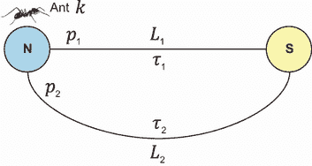

图 10.3 ACO 模拟

由于 *τ[1]* = *τ[2]*，蚂蚁 *k* 将随机选择两条路径之一，因为两条路径被穿越的概率相同。在穿越所选路径后，每条路径上的信息素浓度需要更新。这种信息素更新包括两个阶段：蒸发和沉积。在蒸发阶段，信息素浓度 τ 按以下方式递减：

|


| 10.2 |
| --- |

其中 ρ 指定了蒸发率。图 10.4 显示了基于 NetLogo 模拟的觅食过程中信息素蒸发率的影响。NetLogo 是一个多智能体可编程建模环境，用于模拟自然和社会现象。它允许用户创建、实验和分析复杂系统的模拟，如生态系统、经济和社会网络。蚂蚁的觅食行为在 NetLogo 的蚂蚁模型（[`ccl.northwestern.edu/netlogo/models/Ants`](https://ccl.northwestern.edu/netlogo/models/Ants)）中显示。

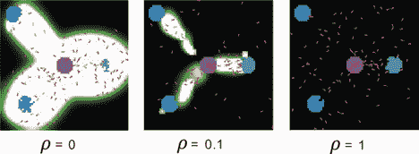

图 10.4 食物觅食过程中蒸发率的影响。在模拟中，蚂蚁从中心巢穴开始寻找食物，巢穴周围有三个以块状表示的食物来源。信息素路径用白色表示。蚂蚁发现食物后，将其运回巢穴，留下化学路径。然后，其他蚂蚁跟随这条路径，嗅到气味，将其引导到食物来源。随着更多蚂蚁继续取回食物，它们会加强化学路径。

如您所见，如果蒸发率设置为 0，信息素路径将永远不会蒸发，蚂蚁将反复跟随相同的路径。这将导致蚂蚁陷入局部最优，它们将无法探索其他路径或找到更好的解决方案。另一方面，如果蒸发率设置为 1，信息素路径将以最大速率蒸发，这意味着蚂蚁将无法跟随任何路径，它们将被迫随机探索环境。这可能导致缓慢收敛到最优解。

在沉积阶段，每只蚂蚁在其经过的路径上留下更多的信息素。图 10.5 展示了用于信息素更新的不同方法：

+   *在线逐步信息素更新*—每只蚂蚁在其经过的路径上沉积一定量的信息素。这将增加另一只蚂蚁选择相同边的概率：

|


| 10.3 |
| --- |

对于选择Δ*τ*值的方法有多种。遵循*蚂蚁密度模型*，蚂蚁将一个常数量*Q*加到每个经过的边上。这意味着最终添加到边上的信息素将与选择该边的蚂蚁数量成比例。边上交通密度越高，该边作为最终解决方案组成部分的吸引力就越大。这种方法不考虑解决方案的质量（即边长）。在*蚂蚁数量模型*中，沉积的信息素量与蚂蚁获得的解决方案质量成比例。例如，蚂蚁在节点*i*和*j*之间穿越时，将沉积量*Q*/*d[ij]*，其中*d[ij]*是*i*和*j*之间的距离。在这种情况下，只使用局部信息*d[ij]*来更新信息素浓度。成本较低的边被赋予更高的吸引力。

+   *在线延迟信息素更新（或蚂蚁循环模型）*—一旦蚂蚁构建了解决方案，它将重新走一遍路径，并根据解决方案的质量更新其经过的边上的信息素路径。沉积的信息素量由蚂蚁获得解决方案的质量决定如下：

|


| 10.4 |
| --- |

其中*Q*是一个常数，*L^k*是蚂蚁*k*构建的路径长度。对于对应路径的每个边(*i*,*j*)，在所有蚂蚁完成它们的巡回之后，沉积的总信息素量将是

|

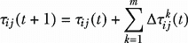

| 10.5 |
| --- |

其中*m*是蚂蚁的数量。


图 10.5 信息素更新方法

总结来说，在在线逐步信息素更新中，蚂蚁在从节点*i*移动到节点*j*时，会在边(*i*,*j*)上更新信息素轨迹*τ[ij]*。在在线延迟信息素更新中，一旦构建了一条路径，蚂蚁可以沿着相同的路径反向追踪并更新经过的边上的信息素轨迹。选择哪种方法取决于要解决的问题。在线逐步信息素更新和在线延迟信息素更新的任何组合也是可能的。

## 10.3 ACO 变体

ACO 已被用于解决各种优化问题，如车辆路径问题、调度问题和最优分配问题。多年来，已经开发了该算法的几个变体，如图 10.6 所示。

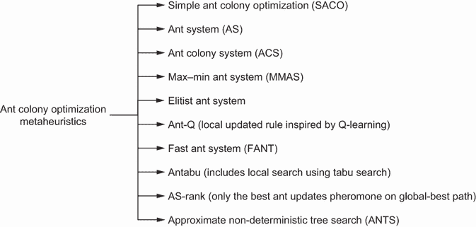

图 10.6 ACO 变体的示例

这些变体有不同的优缺点，变体的选择取决于要解决的问题的具体情况。在以下小节中，我们将讨论这些变体中的一些。

### 10.3.1 简单 ACO

简单 ACO（SACO）是双桥实验的算法实现。考虑在图上找到两个节点之间最短路径的问题，如图 10.7 所示。


图 10.7 最短路径问题

让我们使用 SACO 来解决这个问题。在每条边上，我们将分配一个小的随机值来表示初始信息素浓度，*τ[ij]*(0)。然后，我们将放置一定数量的蚂蚁，*k* = 1，…，*m*在源节点上。

对于 SACO 的每一次迭代，每只蚂蚁都会逐步构建到目标节点的路径（解）。最初，蚂蚁会随机选择下一步要跟随的边。后来，每只蚂蚁将执行决策策略以确定路径的下一个边。在每个节点*i*，蚂蚁可以选择移动到与之相连的任何*j*个节点，基于以下转换概率：

|

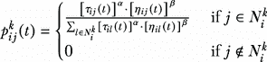

| 10.6 |
| --- |

其中

+   *N[i]^k*是相对于蚂蚁*k*与节点*i*相连的可行节点集合。

+   *τ[ij]*是从状态*i*到状态*j*沉积的信息素量。

+   *η[ij]*是一个启发式值，表示状态转换*ij*（先验知识，通常是 1/*d[ij]*，其中*d*是距离）的期望性。

+   *α* ≥ 0 是一个参数，用于控制*τ[ij]*的影响。*α*用于放大信息素的影响。*α*的较大值会给信息素赋予过多的重视，尤其是初始的随机信息素，这可能导致快速收敛到次优路径。

+   *β* ≤ 1 是一个参数，用于控制边*η[ij]*的期望性的影响。

在最短路径问题中，假设我们使用五只蚂蚁，初始信息素值为 0.5，*α* = *β* = 1。第一只蚂蚁（*k* = 1），放置在源节点，有两个相邻节点{2,3}，如图 10.8 所示。

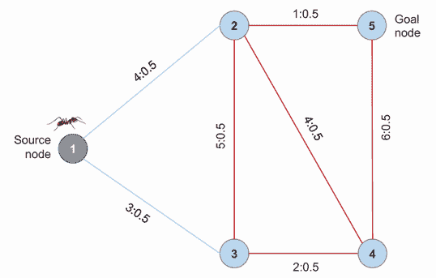

图 10.8 第一只蚂蚁位于源节点 1，其邻居为 2 和 3。每条边上都有两个用冒号分隔的数字。第一个数字代表边的长度，第二个数字代表边上的当前信息素浓度。

考虑边长倒数作为边的吸引力，这只蚂蚁需要通过以下转换概率在节点 2 和 3 之间进行选择：

|

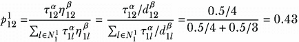

| 10.7 |
| --- |

|

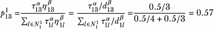

| 10.8 |
| --- |

其中 *p*[12]¹ 是蚂蚁 1 在节点 1 选择节点 2 的概率，*p*[13]¹ 是选择节点 3 的概率。然后我们在 0 到 1 之间生成一个随机数 *r*。如果 *p*[13]¹ ≥ *r*，我们选择节点 3；否则，我们选择 2。由于节点 3 被选中的概率最高，它最有可能被选中。

继续前进，第一只蚂蚁现在位于节点 3，需要根据相同的转换概率在相邻节点 2 和 4 之间进行选择，这导致 *p[32]*¹ = 0.29 和 *p[34]*¹ = 0.71。假设选择了节点 4。蚂蚁现在位于节点 4，需要根据相同的转换概率在相邻节点 2 和 5 之间进行选择，这导致 *p*[42]¹ = 0.6 和 *p*[45]¹ = 0.4。假设根据生成的随机数选择了节点 5。图 10.9 显示了第一只蚂蚁在第一次迭代中完成的路径，长度 *L*¹(*t* = 1) = 3 + 2 + 6 = 11。每只蚂蚁将按照相同的步骤生成自己的路径。

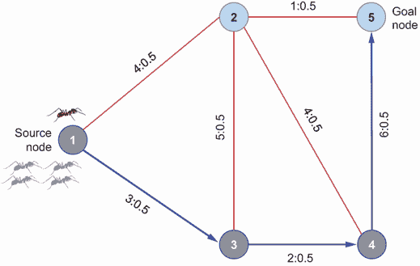

图 10.9 第一只蚂蚁构建的路径。其他四只蚂蚁将类似地构建路径。

在开始新的迭代之前，需要更新信息素。根据方程 10.2 并假设蒸发率 ρ 为 0.7，新的信息素值将是

|


| 10.9 |
| --- |

信息素也会被沉积。如果第一只蚂蚁 *k* = 1 根据每只蚂蚁找到的路径的成本来选择沉积信息素，它将根据在线延迟信息素更新模型，以 *Q*/*L*¹ = 1/11 的值强制执行边 {1,3}、{3,4} 和 {4,5}。图 10.10 显示了每条边上的更新信息素值。


图 10.10 更新的信息素浓度

在这个简单的例子中，经过三次迭代，蚂蚁找到了最短路径 1 → 3 → 4 → 5。在接下来的章节中，我们将讨论蚂蚁系统（AS）算法、蚁群系统（ACS）算法和最大-最小蚂蚁系统（MMAS）算法作为 ACO 变体，这些算法被提出以处理 SACO 的限制。

### 10.3.2 蚂蚁系统

蚂蚁系统（AS）算法通过添加一个禁忌列表来增加记忆能力，从而改进了 SACO 算法。这个列表，或者说是蚂蚁的记忆，标识了已经访问过的节点。AS 中使用的转移概率与方程 10.6 中的相同。当蚂蚁访问一个新节点时，该节点会被添加到蚂蚁的禁忌列表中，持续一定数量的迭代。和在 SACO 中一样，当蚂蚁完成一条路径后，每条边上的信息素都会被更新。蚂蚁密度、蚂蚁数量和蚂蚁循环模型可以用来更新信息素。正如之前解释的，在蚂蚁密度和蚂蚁数量模型中，蚂蚁在构建过程中会沉积信息素，而在蚂蚁循环模型中，蚂蚁在构建完整路径后会沉积信息素。

### 10.3.3 蚂蚁群体系统

蚂蚁群体系统（ACS）算法是 AS 算法的一个扩展，它使用了一个修改过的转移规则，并利用了精英策略。这种策略被称为*伪随机比例行动规则*，旨在提高算法的效率和有效性。ACS 中使用的伪随机比例行动规则基于这样的想法：蚂蚁找到的最佳解应该更多地影响决策过程。在 ACS 中，生成一个随机数 *r*，参数 *r*[o] ∈ [0,1] 是预定义的。位于节点 *i* 的蚂蚁 *k* 使用以下具有双重功能的决策规则选择下一个要移动到的节点 *j*：

+   如果 *r* ≤ *r[o]*，蚂蚁会选择节点 *j*

|


| 10.10 |
| --- |

+   否则，根据以下转移概率以概率方式选择一个节点（例如，使用在第七章中学到的轮盘赌方法）：


注意，与 SACO 的转移概率（方程 10.6）相比，ACS 中控制信息素浓度影响的参数 *α* = 1。参数 *r[0]* 用于平衡探索-利用的权衡。当 *r* ≤ *r*[0] 时，决策规则通过优先选择最佳边来利用关于问题的现有知识，而当 *r* > *r*[0] 时，算法进行探索。适当地调整 *r[0]* 可以在探索和利用之间取得平衡。

在之前的 shortest path 示例中，假设蚂蚁位于节点 4，需要根据 ACS 决策规则（图 10.11）选择节点 2 或 5。假设我们有 *r[o]* = 0.5, *β* = 1, 和 *η[ij]* = 1 / *d[ij]*。现在让我们生成一个随机数 *r*。

如果 *r* ≤ *r[o]*，蚂蚁将选择节点

|


| 10.11 |
| --- |

如果 *r* > *r[o]*，蚂蚁将选择具有最大转移概率的节点：*p*[45]¹ = 0.6 和 *p*[42]¹ = 0.4，如之前在 10.3.1 节中计算，*α* = 1。使用轮盘赌方法，节点 2 或节点 5 可能被选中。

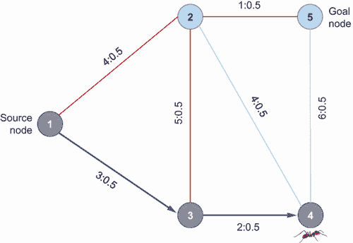

图 10.11 蚂蚁在节点 4 根据 ACS 精英策略选择下一个节点（2 或 5）。

与 AS 不同，ACS 中的信息素强化过程仅由具有全局最佳解的蚂蚁执行，这对应于迄今为止找到的最佳路径。然而，仅依靠全局最佳解来指导信息素沉积可能会导致搜索过于迅速地收敛到迄今为止的全局最佳解，阻碍了对其他潜在更好解决方案的探索。为了解决这个问题，开发了最大-最小蚁群系统（MMAS）算法。

### 10.3.4 最大-最小蚁群系统

ACS 可能会遇到过早停滞的问题，这发生在所有蚂蚁都遵循相同路径且探索很少的情况下。这个问题在复杂问题中尤为普遍，其中搜索空间很大，最优解难以找到。为了克服这个问题，提出了最大-最小蚁群系统（MMAS）。

MMAS 使用迭代最佳路径而不是全局最佳路径来更新信息素。信息素路径仅使用在线延迟信息素更新模型进行更新，其中当前迭代中最佳蚂蚁所经过的边会接收额外的信息素。由于最佳路径在迭代之间可能差异很大，这种方法与 ACS 相比，在整个搜索空间中促进了更高程度的探索。也可以实现混合策略，其中迭代最佳路径主要用于鼓励探索，而全局最佳路径则定期纳入。

在 MMAS 中，信息素浓度被限制在上下界(*τ[max]*)和(*τ[min]*)之间，确保搜索既保持专注又具有灵活性。信息素路径被初始化为最大值*τ[max]*，如果算法达到停滞点，所有信息素浓度将被重置为最大值。在此重置之后，仅使用迭代最佳路径进行有限的迭代次数。*τ[min]*和*τ[max]*的值通常通过实验确定，尽管如果已知最优解，它们也可以通过解析计算得出。

### 10.3.5 使用 ACO 解决开放 TSP 问题

现在我们来实现 ACO 算法来解决开放 TSP 问题，考虑 20 个主要美国城市。我们的目标是找到销售人员可以遵循的最短路线，以访问这 20 个城市中的每一个，从纽约市出发，且不返回到家乡城市。

我们将首先定义一个包含 20 个美国城市名称及其纬度和经度坐标的`cities`字典。然后，我们将使用嵌套循环计算每对城市之间的距离，使用`haversine`距离公式，并将结果存储在`distance_matrix`字典中。`haversine`距离被使用，因为它考虑了地球的曲率，提供了地球表面上两点之间准确的距离测量（有关更多详细信息，请参阅第 4.3.3 节中的“Haversine 距离”侧边栏）。`cost_function`被定义为计算路径的总距离。它接受城市索引列表（`path`）和距离矩阵（`distances`）作为输入参数。然后函数遍历路径，计算每对连续城市之间的距离。然后返回总路径距离。此代码在下一列表中展示。

列表 10.1 使用 ACO 解决最短路径问题

```py
import numpy as np
import pandas as pd
from collections import defaultdict
from haversine import haversine
import networkx as nx
import matplotlib.pyplot as plt
import random
from tqdm import tqdm

cities = {
    'New York City': (40.72, -74.00),
    'Philadelphia': (39.95, -75.17),       
    'Baltimore': (39.28, -76.62),
    'Charlotte': (35.23, -80.85),
    'Memphis': (35.12, -89.97),
    'Jacksonville': (30.32, -81.70),
    'Houston': (29.77, -95.38),
    'Austin': (30.27, -97.77),
    'San Antonio': (29.53, -98.47),
    'Fort Worth': (32.75, -97.33),
    'Dallas': (32.78, -96.80),
    'San Diego': (32.78, -117.15),
    'Los Angeles': (34.05, -118.25),
    'San Jose': (37.30, -121.87),
    'San Francisco': (37.78, -122.42),    
    'Indianapolis': (39.78, -86.15),
    'Phoenix': (33.45, -112.07),       
    'Columbus': (39.98, -82.98), 
    'Chicago': (41.88, -87.63),
    'Detroit': (42.33, -83.05)
}                                                                        ①

distance_matrix = defaultdict(dict)                                      ②
for ka, va in cities.items():                                            ②
    for kb, vb in cities.items():                                        ②
        distance_matrix[ka][kb] = 0.0 if kb == ka else haversine((va[0], ②
➥  va[1]), (vb[0], vb[1]))                                              ②
                                                                         ②
distances = pd.DataFrame(distance_matrix)                                ③
city_names=list(distances.columns)                                       ④
city_indices = {city: idx for idx, city in enumerate(city_names)}
city_count = len(city_names)

def cost_function(path):                                                 ⑤
    distance = 0
    for i in range(len(path) - 1):
        city1, city2 = city_names[path[i]], city_names[path[i + 1]]
        distance += haversine(cities[city1], cities[city2])
    return distance
```

① 定义 20 个主要美国城市的纬度和经度。

② 基于纬度和经度坐标创建一个哈夫曼距离矩阵。

③ 城市间值

④ 城市名称

⑤ 定义表示路径长度的成本函数。

作为列表 10.1 的延续，接下来的代码片段展示了一个名为`ant_tour`的函数，它接受两个参数：`pheromones`，表示城市间的信息素水平，以及`distances`，表示城市间的距离。它初始化一个`paths`数组以存储每个蚂蚁的路径，并遍历指定的蚂蚁范围。对于每个蚂蚁，它从纽约市开始初始化一个路径。它进入一个`while`循环，直到所有城市都被访问。在`while`循环中，它将当前城市作为路径中的最后一个城市。然后，它根据信息素水平和当前城市与未访问城市之间的距离的倒数计算选择下一个城市的概率。概率使用方程 10.6 计算。下一个城市使用基于归一化概率的`random.choices`函数选择。选定的下一个城市将从未访问城市列表中移除，并将其追加到路径中：

```py
def ant_tour(pheromones): 
    paths = np.empty((ants, city_count), dtype=int)                ①
    for ant in range(ants):
        path = [city_indices['New York City']]                     ②
        unvisited_cities = set(range(city_count))                  ③
        unvisited_cities.remove(path[0])                           ④

        while unvisited_cities:                                    ⑤
            current_city = path[-1]
            probabilities = []

            for city in unvisited_cities:                          ⑥
                tau = pheromones[current_city, city] 
                eta = (1 / distances[current_city, city])
                probabilities.append((tau** alpha)*(eta ** beta))

            probabilities /= sum(probabilities)                    ⑦
            next_city = np.random.choice(list(unvisited_cities),   ⑧
p=probabilities) 
            unvisited_cities.remove(next_city)                     ⑨
            unvisited_cities.remove(next_city)                     ⑩
            path.append(next_city)                                 ⑪

        paths[ant] = path

    return paths
```

① 初始化一个数组以存储每个蚂蚁的路径。

② 从纽约市开始每个蚂蚁的路径。

③ 初始化一组未访问城市。

④ 从未访问城市中移除纽约市。

⑤ 继续构建路径，直到所有城市都被访问。

⑥ 计算移动到每个未访问城市的概率。

⑦ 归一化概率。

⑧ 根据概率选择下一个城市。

⑨ 从未访问城市集合中移除选定的城市。

⑩ 将选定的城市添加到路径中。

⑪ 为当前蚂蚁存储完成路径。

一旦所有城市都被访问过，当前蚂蚁的路径将被存储在`paths`数组中。当所有蚂蚁完成它们的路径后，函数返回包含每个蚂蚁找到的最优路线的`paths`数组。

下面的`update_pheromones`函数用于根据蚂蚁的距离和路径更新信息素水平：

```py
def update_pheromones(paths, pheromones):
    delta_pheromones = np.zeros_like(pheromones)                    ①

    for i in range(ants):                                           ②
        for j in range(city_count - 1):
            city1_idx, city2_idx = paths[i, j], paths[i, j + 1]     ③
            delta_pheromones[city1_idx, city2_idx] += Q / cost_     ④
function(paths[i]) 

    return (1 - evaporation_rate) * pheromones + delta_pheromones   ⑤
```

① 初始化一个矩阵以存储信息素水平的变化。

② 根据蚂蚁走过的路径更新信息素。

③ 获取当前路径中城市的索引。

④ 更新当前城市和下一个城市之间的信息素水平。

⑤ 蒸发现有信息素，添加信息素的变化，并返回更新后的信息素。

此函数接受两个参数：`paths`，表示蚂蚁走过的路径，以及`pheromones`，表示城市之间边上的当前信息素水平。它初始化一个名为`delta_pheromones`的矩阵来存储信息素水平的变化。此矩阵的形状与`pheromones`矩阵相同。它遍历指定范围内的每个蚂蚁。在循环内部，它遍历蚂蚁路径中的每个城市（除了最后一个城市）。对于每对连续城市，它通过添加基于蚂蚁路径成本的倒数来更新`delta_pheromones`矩阵。在内循环之后，它通过结合现有信息素、考虑蒸发并添加存储在`delta_pheromones`中的变化来计算更新的信息素。最后，它返回更新后的信息素矩阵。

作为延续，以下代码片段显示了`run_ACO`函数，它接受以下输入：

+   `distances`—一个二维数组（矩阵），存储城市之间的距离

+   `ants`—算法中使用的蚂蚁数量

+   `iterations`—迭代次数

+   `alpha`—一个参数，用于控制信息素轨迹对蚂蚁决策的影响

+   `beta`—一个参数，用于控制下一个城市距离对蚂蚁决策的影响

+   `evaporation_rate`—信息素从路径中蒸发的速率

+   `Q`—在计算蚂蚁沉积信息素量时使用的常数

此函数返回`best_path`和`best_distance`，代表蚁群优化算法找到的最优解：

```py
def run_ACO(distances, ants, iterations, alpha, beta, evaporation_rate, Q):
    pheromones = np.ones((city_count, city_count))                          ①
    best_path = None
    best_distance = float('inf')

    for _ in tqdm(range(iterations), desc="Running ACO", unit="iteration"):
        paths =ant_tour(pheromones, distances)                              ②

        distances_paths = np.array([cost_function(path) for path in paths]) ③
        min_idx = distances_paths.argmin()
        min_distance = distances_paths[min_idx]

        if min_distance < best_distance:                                    ④
            best_distance = min_distance
            best_path = paths[min_idx]

        pheromones = update_pheromones(paths, pheromones)                   ⑤

    return best_path, best_distance                                         ⑥
```

① 初始化信息素数组。

② 为每个蚂蚁生成路径。

③ 计算每条路径的总距离。

④ 找到距离最短的路径索引。

⑤ 更新信息素。

⑥ 返回迭代过程中找到的最佳路径和距离。

现在让我们使用以下参数将蚁群优化算法（ACO）应用于解决最短路径问题：

```py
ants = 30                        ①
iterations = 100                 ①
alpha = 1                        ①
beta = 0.9                       ①
evaporation_rate = 0.5           ①
Q = 100                          ①

best_path, best_distance = run_ACO(distances.values, ants, iterations, alpha, beta,
➥ evaporation_rate, Q)          ②
```

① 设置 ACO 参数。

② 使用定义的参数运行蚁群优化算法（ACO）。

由于算法中包含随机性，您的解决方案可能会有所不同。以下路径是在我运行求解器时生成的：

```py
Route: New York City → Philadelphia → Baltimore → Detroit → Chicago → Indianapolis → Columbus → Charlotte → Jacksonville → Memphis → Fort Worth → Dallas → Houston → Austin → San Antonio → Phoenix → San Diego → Los Angeles → San Jose → San Francisco
Route length: 7937.115
```

前面的路径在图 10.12 中显示。列表 10.1 的完整版本可在本书的 GitHub 仓库中找到，其中还包含生成此可视化的代码。


图 10.12 蚁群优化算法获得的最短路径

与遗传算法和粒子群优化算法不同，ACO 元启发式算法没有成熟和全面的 Python 包。ACOpy 项目（https://acopy.readthedocs.io/en/latest/index.html）提供了一个 ACO 的实现，可以使用 pip 安装，如下所示：`pip install acopy`。作为列表 10.1 的延续，让我们使用 ACOpy 来解决最短路径问题。

我们首先导入`acopy`和`networkx`库。创建一个图`G`，其中节点代表城市，边代表它们之间的距离。`distance_matrix`包含每对城市之间的距离。循环遍历所有城市对，在图中为每对城市添加一条边，边的权重是城市之间的距离。然后从图中删除自环边（连接节点到自身的边）：

```py
import acopy
import networkx as nx

G=nx.Graph()

for ka, va in cities.items():
    for kb, vb in cities.items():
        G.add_weighted_edges_from({(ka,kb, distance_matrix[ka][kb])})
G.remove_edges_from(nx.selfloop_edges(G))
```

然后定义 ACO 算法的参数：`evaporation_rate`（蒸发率）、`iterations`（迭代次数）和`Q`，如前所述。创建一个具有指定`evaporation_rate`和`Q`的 ACO 求解器。使用`alpha`和`beta`参数初始化`acopy.Colony`对象。然后算法按照指定的迭代次数进行迭代。在每次迭代中，使用求解器的`solve`方法找到一个路径，该路径是一个边的列表。对于路径中的每条边，代码确定尚未添加到`path_indices`列表中的城市，并将其添加进去。最后，将旅行路径更新为`path_indices`列表，该列表是城市名称的列表，而不是边的列表：

```py
evaporation_rate = 0.5                                                  ①
iterations = 100                                                        ①
Q = 100                                                                 ①

solver = acopy.Solver(rho=evaporation_rate, q=Q)                        ②

colony = acopy.Colony(alpha=1, beta=0.9)                                ③

for n_iter in range(iterations):                                        ④
    tour = solver.solve(G, colony, limit=4)
    path_indices = ['New York City']                                    ⑤
    for edge in tour.path:
        next_city = edge[0] if edge[1] == path_indices[-1] else edge[1] ⑥
        if next_city not in path_indices:                               ⑥
            path_indices.append(next_city)                              ⑥

tour.path=path_indices                                                  ⑦
```

① ACO 参数

② 设置 ACO 求解器。

③ 使用 alpha 和 beta 参数设置 ACO 群体。

④ 运行 ACO 算法。

⑤ 从城市 0（纽约市）开始。

⑥ 添加路径中尚未包含的边的另一个节点。

⑦ 返回包含在路径中的城市名称的有序列表。

现在我们按照以下方式打印出获得路径及其长度：

```py
best_path = tour.path
best_distance = tour.cost
Route = " → ".join(best_path)
print("Route:", Route)
print("Route length:", np.round(best_distance, 3))
```

`best_path`变量被设置为通过`acopy`求解器获得的`tour`对象的`path`属性。这条路径代表找到的最短路线的城市列表。`best_distance`变量被设置为`tour`对象的`cost`属性，即最佳路径的总距离（或成本）。`Route`变量是一个字符串，它将`best_path`中的所有城市通过箭头（`→`）连接起来，表示在最佳旅行中的访问城市顺序。最后，`print`语句显示最佳路线及其总距离。在运行求解器后，将生成如下路径：

```py
Route: New York City → Columbus → Detroit → Philadelphia → Baltimore → Charlotte → Jacksonville → Memphis → Houston → Dallas → Fort Worth → Austin → San Antonio → Phoenix → San Diego → Los Angeles → San Jose → San Francisco → Chicago → Indianapolis
Route length: 11058.541 
```

获得的路径如图 10.13 所示。书中 GitHub 仓库中可用的列表 10.1 的完整版本包含生成此可视化的代码。

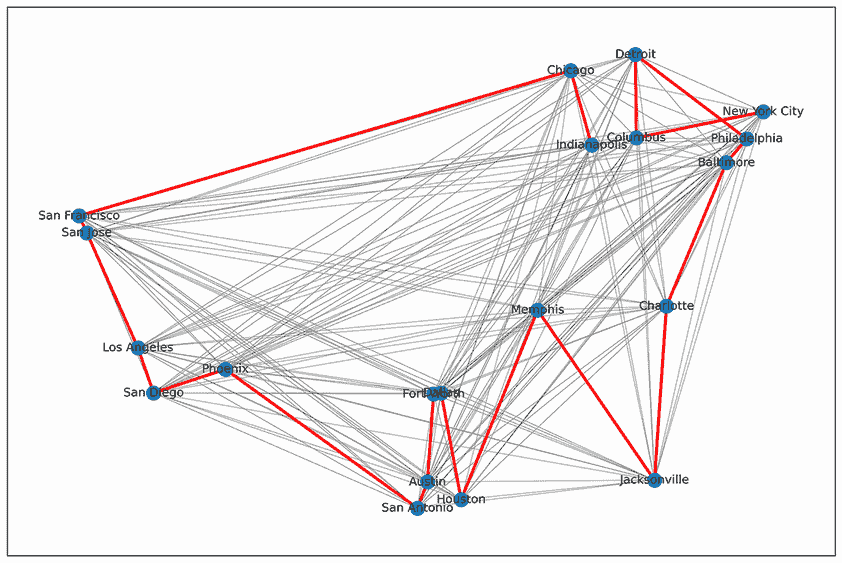

图 10.13 ACOpy 获得的最短路径

值得注意的是，ACO（蚁群优化算法）与其他许多随机优化算法一样，包含随机性元素。ACO 中的随机性主要来源于两个方面：

+   *初始条件*——在算法开始时，蚂蚁通常被放置在随机位置，除非起始位置是预定义的，例如在 TSP 的情况下，蚂蚁从预定的家乡城市开始。这意味着在随机位置被使用的情况下，每只蚂蚁都会从不同的城市开始探索，导致路径的多样性。

+   *路径选择*——随着蚂蚁从一个城市移动到另一个城市，它们会概率性地选择下一个要访问的城市。这个选择受到通往城市路径上信息素的量和城市距离的影响。即使两只蚂蚁在同一城市并且拥有相同的信息，它们也可能因为这种概率性选择而选择不同的城市进行访问。 

这种固有的随机性意味着 ACO 算法的每次运行都可以产生不同的结果。然而，在多次运行中，ACO 应该始终找到近似最优解，即使它们并不总是完全相同的解。

在下一节中，我们将深入探讨另一个由群体智能产生的迷人算法。这个算法再次从自然界中汲取灵感，特别是蜜蜂寻找食物的行为。你很快就会了解这个受蜜蜂启发的算法是如何运作的，以及它如何在计算环境中得到应用。

## 10.4 从蜂巢到优化

蜜蜂是著名的社交昆虫，以其非凡的合作而闻名。它们建造的蜂巢可以容纳大约 30,000 只蜜蜂，所有蜜蜂和谐共处。每只蜜蜂都有指定的任务，例如生产蜂蜡、制作蜂蜜、制作蜂粮、形成蜂房或把水带到蜂房并与蜂蜜混合。年轻的蜜蜂通常处理蜂巢外的任务，而年老的蜜蜂则专注于室内工作。

蜜蜂群体作为目标导向的决策系统运作，其功能由单个蜜蜂的分散控制和行动所指导。在觅食过程中，蜜蜂之间的合作产生了有利于蜂巢整体适应性的行为。通过使用单个觅食者，蜜蜂群体旨在最小化成本/收益比，而不是无差别地在所有方向上消耗能量进行搜索。他们将觅食努力集中在最有回报的区域，而忽略那些质量较差的区域。

观察表明，当蜂群食物资源稀缺时，觅食者会表现出增加招募行为的特征，这表现在它们返回蜂巢后舞蹈模式的变化。这种增强的招募有助于动员更多的巢居者去利用可用的食物来源。除了觅食外，蜜蜂还参与各种其他任务，如蜂巢建设、蜂巢温度调节和蜂群防御，展示了它们非凡的团队合作技能。

探索蜜蜂的迷人世界

+   蜜蜂是人们最熟知且最重要的生产人类食用食物的昆虫。

+   蜜蜂群体由一只蜂王、数百只雄性工蜂和 20,000 到 80,000 只雌性工蜂组成。

+   单个工蜂每天可能访问 50 到 1,000 朵花。同一蜂巢的蜜蜂一天内可以访问多达 225,000 朵花。蜜蜂可以以 21 到 28 公里/小时（13-17 英里/小时）的速度飞行，觅食区域可达 70 平方公里（27 平方英里）。

+   蜜蜂可以在蜂巢中维持大约 33°C（91°F）的恒定温度，无论外界温度如何。

+   蜜蜂选择六角形形状来建造蜂巢，以存放蜂王的卵和储存工蜂带到蜂巢的花粉和蜂蜜。

+   六角形结构有几个优点，例如空间利用效率高（在给定区域内能建造的最大数量的蜂房），结构强度大（坚固且稳定），材料效率高（使用较少的蜂蜡），以及最佳角度（略微倾斜，大约 13 度从水平线，以防止蜂蜜从蜂房中溢出，同时允许蜜蜂轻松移动）。

+   蜜蜂通过复杂的舞蹈动作“摇摆舞”相互沟通，这在乔治亚理工学院计算机学院的视频《蜜蜂的摇摆舞》（[`mng.bz/gvxx`](http://mng.bz/gvxx)）中有解释。

人工蜂群（ABC）算法是一种基于蜜蜂觅食行为的群体智能算法。具体来说，它受到蜜蜂寻找食物来源和将发现传达给其他蜜蜂以优化资源收集方式的影响。让我们首先看看蜜蜂是如何觅食食物的。图 10.14 展示了它们觅食行为的步骤。


图 10.14 蜜蜂的觅食行为

觅食行为可以总结为以下步骤：

1.  *初始化*——觅食蜂（被雇佣的蜂）和侦察蜂开始寻找食物来源。觅食蜂通常从蜂巢周围的已知来源收集资源以满足蜂群的即时需求。侦察蜂定位新的食物来源以确保蜂群的长期生存，特别是如果蜂巢周围的食物来源开始枯竭。侦察蜂只占蜂群成员的一小部分，但它们为蜂群节省了许多寻找丰富新食物来源的飞行距离。值得注意的是，觅食蜂和侦察蜂都是工蜂（雌蜂）。根据蜂群的需求和食物来源的可用性，工蜂可以从觅食蜂转变为侦察蜂。总之，觅食蜂专注于利用现有资源，而侦察蜂则专注于探索以发现新资源。

1.  *探索*——觅食蜂离开蜂巢开始寻找食物来源，如周围的花朵中的花蜜和花粉。侦察蜂探索更远的地方以发现新的食物来源。

1.  *检测*—当找到合适食物来源时，工蜂降落在花朵上，并开始在她的蜜胃中收集花蜜或在她的后腿上收集花粉。

1.  *记忆*—蜜蜂会注意食物来源的位置，包括其与蜂巢的距离和方向，以及花朵的类型和质量。

1.  *返回蜂巢*—一旦工蜂收集了足够的资源或她的蜜胃已满，她就会飞回蜂巢。到达蜂巢后，觅食蜂将花蜜转移到巢蜂，然后巢蜂对其进行处理并储存为蜂蜜。花粉也会类似地卸载到其他蜜蜂，以储存并作为食物在以后使用。

1.  *沟通*—工蜂在蜂巢的舞蹈地板上跳摇摆舞，与她的巢伴（即*旁观蜂*）分享位置信息。这种舞蹈传达了食物来源的方向、距离和质量。

1.  *招募*—旁观蜂观察摇摆舞并解码关于食物来源位置的信息。然后这些蜜蜂飞出去收集资源。

1.  *重复*—工蜂会继续访问同一个食物来源，直到其耗尽或另一只蜜蜂将她招募到更有希望的食物来源。在两种情况下，她都会重复觅食过程，以确保满足蜂群的需求。

现在让我们更详细地看看 ABC 算法。

## 10.5 探索人工蜂群算法

人工蜂群（ABC）算法是由 Dervis Karaboga 于 2005 年[1]提出的，它模拟了三种蜜蜂的角色：雇佣蜂（觅食者）、旁观蜂和侦察蜂。算法 10.1 展示了 ABC 算法的步骤。

算法 10.1 人工蜂群算法

```py
Initialization Phase: population of candidate solutions (food sources) are initialized 
REPEAT
   Forager Bee Phase: Each forager bee goes to a food source in her memory and determines a closest source, then evaluates its nectar amount and dances in the hive
   Onlooker Bee Phase: Each onlooker bee watches the dance of forager bees and chooses one of their sources depending on the dances, and then goes to that source. After choosing a neighbor around that, she evaluates its nectar amount.
   Scout Bee Phase: Abandoned food sources are determined and are replaced with the new food sources discovered by scout bees.
   Memorize the best food source (solution) achieved so far.
UNTIL (termination criteria are met)
```

如您所见，ABC 算法模拟了蜜蜂的觅食行为来探索和利用搜索空间，平衡全局探索（多样性）和局部利用（收敛），以有效地解决优化问题。在 ABC 算法中，三种类型的蜜蜂具有以下互补的角色：

+   *雇佣蜂（觅食者）—*这些蜜蜂利用当前的食物来源，这意味着它们在其当前位置周围搜索（搜索邻域）以找到更好的解决方案。这些蜜蜂执行局部搜索（强化），以细化当前的最佳解决方案。

+   *旁观蜂*—这些蜜蜂也参与了利用。它们根据雇佣蜂找到的解决方案的适应性概率选择食物来源。它们更有可能选择更好的解决方案（含有更多花蜜的食物来源）以进行进一步的利用。

+   *侦察蜂*—这些蜜蜂执行探索任务。如果一个食物源耗尽（如果在一定数量的迭代后无法改进解决方案），与该食物源相关的工蜂就会变成侦察蜂。侦察蜂通过放弃耗尽的食物源并在问题空间中随机搜索新的食物源来执行全局搜索（多样化）。这个过程通过探索搜索空间的新区域来防止算法陷入局部最优。

在 ABC 算法中，通过在工蜂和观察蜂之间共享解决方案的适应度值来模拟蜜蜂之间的通信，引导它们向更好的解决方案前进。ABC 算法采用了一种受蜜蜂根据食物质量选择食物源的方式启发的适应度比例选择过程。在算法中，工蜂和观察蜂以与它们的适应度成比例的概率选择解决方案，从而促进更好的解决方案被更频繁地探索。

为了理解我们如何使用 ABC 算法来解决优化问题，让我们考虑使用 ABC 算法最小化 Rosenbrock 函数。Rosenbrock 函数，也称为*山谷*或*香蕉函数*，是梯度优化算法的流行测试问题。该函数具有 *n* 个维度，具有以下一般形式：

|


| 10.12 |
| --- |

该函数通常在超立方体 x*[i]* ∈ [–5, 10] 上对所有 *i* = 1,...,*n* 进行评估，但域可能限制为 x*[i]* ∈ [–2.048, 2.048] 对所有 *i* = 1,...,*n*。该函数的全局最小值位于 *f*(*x*^*) = 0.0，位置在 (1,...,1)。

让我们考虑以下形式的二维 Rosenbrock 函数：

|


| 10.13 |
| --- |

图 10.15 显示了 Rosenbrock 函数的二维表面。

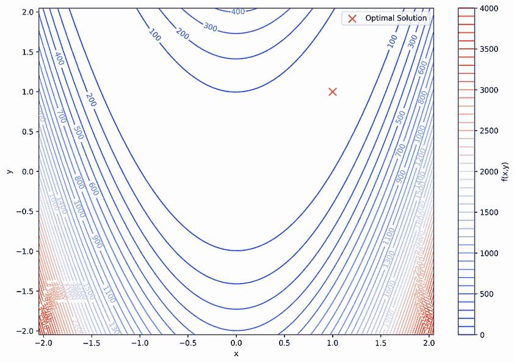

图 10.15 Rosenbrock 函数的二维表面图。点表示该函数的全局最小值。

让我们看看如何使用 ABC 算法来最小化这个函数：

+   *初始化阶段*—假设我们有一群 *N* = 6 只蜜蜂。每只蜜蜂都试图找到一个候选解，种群中的每个解决方案 *i* 由位置向量 *X[mi]* = {*x[mi], y[mi]*} 组成，其中 *X[mi]* ∈ [–2.048, 2.048] 且 *m* = 1,…,*N*。*X[mi]* 代表优化问题的潜在解。工蜂的位置在边界内随机确定。这些初始解可以使用以下公式生成：

|


| 10.14 |
| --- |

其中 *l[i]* 和 *u[i]* 是决策变量的下界和上界。让我们假设初始位置（如表 10.1 所示）为 (*x, y*)。

表 10.1 初始食物源

| 候选解 *X[m]* | 目标函数 *fm* |
| --- | --- |
| *X*[1] = (–1.04,0.11) | 98.56 |
| *X*[2] = (–1.61,–1.98) | 2097.22 |
| *X*[3] = (1.82,1.22) | 438.49 |
| *X*[4] = (–1.64,1.92) | 66.20 |
| *X*[5] = (0.77,0.04) | 30.62 |
| *X*[6] = (–0.66,1.59) | 136.02 |

+   *雇用蜂阶段*—在雇用蜂阶段，每只蜂在其当前解的邻域内使用以下公式生成一个新的解：

|

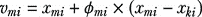

| 10.15 |
| --- |

其中 *v[mj]* 是新解，*x[mi]* 是当前解，*ϕ[mi]* 是介于 –1 和 1 之间的随机数，*x[ki]* 是与当前解不同的随机选择的解。为了简化，我们假设所有 *ϕ[mi]* 都是 –0.9，并且对于每只蜂，我们选择蜂 1 的解来计算新解。初始种群（表 10.1）中的最佳蜂，即蜂 5，也可以使用。然后我们计算表 10.2 中显示的新适应度值。

表 10.2 新食源

| 候选解 *X[m]* | 目标函数 *f[m]*(*X[m]*) |
| --- | --- |
| *X*[1] = (–1.04,0.11) | 98.56 |
| *X*[2] = (–1.10,–0.10) | 174.02 |
| *X*[3] = (–0.75,0.22) | 15.15 |
| *X*[4] = (–1.10,0.29) | 88.87 |
| *X*[5] = (–0.86,0.10) | 43.76 |
| *X*[6] = (–1.00,0.26) | 59.66 |

+   *观察蜂阶段*—观察蜂观察雇用蜂的舞蹈，并根据花蜜量（*适应度值*）选择食源。如果新解有更好的适应度值，它将被记住作为全局变量，并更新位置。否则，保留旧位置。观察蜂选择 *X[m]* 的概率值 *p[m]* 可以通过以下公式计算：

|

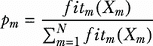

| 10.16 |
| --- |

其中 *fit[m]*(*X[m]*) 是解的适应度值，可以使用以下表达式计算：

|

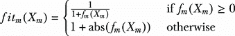

| 10.17 |
| --- |

其中 *f[m]*(*X[m]*) 是解 *X[m]* 的目标函数。表 10.3 显示了解适应度计算。

表 10.3 解适应度计算

| 候选解 *X[m]* | 目标函数 *f[m]*(*X[m]**)* | 适应度 *fit[m]*(*X[m]*) | 选择概率 *p[m]* |
| --- | --- | --- | --- |
| *X*[1] = (–1.04,0.11) | 98.56 | 0.010 | 0.08 |
| *X*[2] = (–1.10,–0.10) | 174.02 | 0.006 | 0.04 |
| *X*[3] = (–0.75,0.22) | 15.15 | 0.062 | 0.49 |
| *X*[4] = (–1.10,0.29) | 88.87 | 0.011 | 0.09 |
| *X*[5] = (–0.86,0.10) | 43.76 | 0.022 | 0.18 |
| *X*[6] = (–1.00,0.26) | 59.66 | 0.016 | 0.13 |

在本例中，蜂 3 发现的食源最有可能被选中。在为观察蜂选择一个食源 *X[m]* 后，通过使用方程 10.15 确定一个邻域源 *v[m]*，并计算其适应度值。

+   *侦察蜂阶段*—如果通过预定的循环或试验次数（称为 *限制*）无法进一步改善位置，那么该位置将被放弃，蜂变成侦察蜂，寻找新的随机位置，这可以通过方程 10.14 生成。

让我们现在看看如何用 Python 实现 ABC 来解决这个问题。在下一个列表中，我们首先导入我们将使用的库，并定义`rosenbrock_function`。此函数将 Rosenbrock 函数的候选解（x，y）作为参数，并返回其值。

列表 10.2 使用 ABC 解决 Rosenbrock 函数优化

```py
import numpy as np
import random
import matplotlib.pyplot as plt

def rosenbrock_function(cand_soln):
    return (1 - cand_soln[0]) ** 2 + 100 * (cand_soln[1] - cand_soln[0] ** 2) ** 2
```

作为对列表 10.2 的延续，我们将创建一个包含以下属性的`Bee`：

+   `position`—蜜蜂在搜索空间中的位置（解）

+   `fitness`—蜜蜂当前位置的适应度（当前位置 Rosenbrock 函数的值）

+   `counter`—一个计数器，用于跟踪失败的尝试次数（蜜蜂适应度没有改进的迭代）：

```py
class Bee:
    def __init__(self, position, fitness):
        self.position = position
        self.fitness = fitness
        self.counter = 0
```

现在我们需要一个函数来生成具有随机位置的`Bee`，并使用 Rosenbrock 函数计算其适应度：

```py
def generate_bee(dimensions):
    position = np.array([random.uniform(-5, 5) for _ in range(dimensions)])
    fitness = rosenbrock_function(position)
    return Bee(position, fitness)
```

以下函数将使用伙伴蜜蜂的位置更新给定蜜蜂的位置。如果新位置具有更好的适应度值，蜜蜂的位置、适应度和计数器将更新。否则，计数器将增加：

```py
def update_position(bee, partner, dimensions):
    index = random.randrange(dimensions)             ①
    phi = random.uniform(-1, 1)
    new_position = bee.position.copy()
    new_position[index] += phi * (bee.position[index] - partner.position[index])
    new_position = np.clip(new_position, -5, 5)      ②
    new_fitness = rosenbrock_function(new_position)
    if new_fitness < bee.fitness:
        bee.position = new_position
        bee.fitness = new_fitness
        bee.counter = 0
    else:
        bee.counter += 1
```

① 确定蜜蜂位置中哪个元素将被更新。

② 剪切以确保它保持在指定的范围内。

接下来，我们将定义一个`abc_algorithm`函数来实现 ABC 算法，以下为其输入参数：

+   `dimensions`—问题的维度数，对于 Rosenbrock 函数是 2

+   `num_bees`—蜂群中蜜蜂的总数

+   `max_iter`—算法应运行的最大迭代次数

+   `max_trials`—在蜜蜂成为侦察蜂之前允许的最大失败循环或尝试次数（没有改进的迭代）：

```py
def abc_algorithm(dimensions, num_bees, max_iter, max_trials):

    bees = [generate_bee(dimensions) for _ in range(num_bees)]               ①
    best_bee = min(bees, key=lambda bee: bee.fitness)                        ②

    for _ in range(max_iter):
        for i in range(num_bees // 2):                                       ③
            employed_bee = bees[i]
            partner_bee = random.choice(bees)
            update_position(employed_bee, partner_bee, dimensions)

        total_fitness = sum(1 / (1 + bee.fitness) if bee.fitness >= 0 else 1 ④
➥ + abs(bee.fitness) for bee in bees)                                       ④
        probabilities = [(1 / (1 + bee.fitness)) / total_fitness if bee.     ④
➥ fitness >= 0 else (1 + abs(bee.fitness)) / total_fitness for bee in bees] ④

        for i in range(num_bees // 2, num_bees):                             ⑤
            onlooker_bee = random.choices(bees, weights=probabilities)[0]
            partner_bee = min(bees[:num_bees // 2], key=lambda bee: bee.fitness)
            update_position(onlooker_bee, partner_bee, dimensions)

        for bee in bees:                                                     ⑥
            if bee.counter > max_trials:                                     ⑦
                new_bee = generate_bee(dimensions)
                bee.position = new_bee.position
                bee.fitness = new_bee.fitness
                bee.counter = 0

        best_iter_bee = min(bees, key=lambda bee: bee.fitness)               ⑧
        if best_iter_bee.fitness < best_bee.fitness:                         ⑧
            best_bee = best_iter_bee                                         ⑧

    return best_bee                                                          ⑨
```

① 生成蜜蜂的初始种群。

② 找到具有最佳适应度值的蜜蜂。

③ 执行雇佣蜜蜂阶段。

④ 执行观察者蜜蜂阶段。

⑤ 根据方程 16 和 17 计算选择概率。

⑥ 执行侦察蜜蜂阶段。

⑦ 检查每只蜜蜂的计数器是否超过 max_trials。

⑧ 使用新的最佳蜜蜂更新 best_bee。

⑨ 返回 best_bee，它代表最优解。

现在我们可以设置 ABC 算法的参数，并将其应用于解决问题：

```py
dimensions = 2                                                         ①
num_bees = 50                                                          ②
max_iter = 1000                                                        ③
max_trials = 100                                                       ④

best_bee = abc_algorithm(dimensions, num_bees, max_iter, max_trials)   ⑤
print(f"Best solution: {best_bee.position}")                           ⑥
print(f"Best fitness: {best_bee.fitness}")                             ⑥
```

① 定义问题维度。

② 设置蜜蜂的数量。

③ 设置最大迭代次数作为停止标准。

④ 设置在蜜蜂成为侦察蜂之前允许的最大失败尝试次数（没有改进的迭代）。

⑤ 使用指定的参数运行 ABC 算法，并将最佳蜜蜂（具有最小适应度值的蜜蜂）存储在 best_bee 变量中。

⑥ 打印 best_bee 的位置，它代表解及其适应度，即最佳解处的 Rosenbrock 函数值。

此代码将产生如下输出：

```py
Best solution: [0.99766117 0.99542949]
Best fitness: 6.50385257086524e-06
```

与遗传算法和粒子群优化算法相比，专门为 ABC 算法设计的、建立良好且全面的 Python 包相对较少。然而，有一个名为 MEALPY 的 Python 库提供了基于种群的元启发式算法的实现，包括 ABC。您可以使用`pip install mealpy`来安装 MEALPY。

作为 10.2 列表的延续，以下代码片段展示了如何使用 MEALPY 库中的`OriginalABC`类来最小化 Rosenbrock 函数：

```py
from mealpy.swarm_based.ABC import OriginalABC                        ①

problem_dict = {
    "fit_func": rosenbrock_function,
    "lb": [-5, -5],
    "ub": [5, 5],
    "minmax": "min",
}                                                                     ②

epoch = 200                                                           ③
pop_size = 50                                                         ④
n_limits = 15                                                         ⑤

model = OriginalABC(epoch, pop_size, n_limits)                        ⑥

best_position_mealpy, best_fitness_mealpy = model.solve(problem_dict) ⑦

print(f"Best solution: {best_position_mealpy}")                       ⑧
print(f"Best fitness: {best_fitness_mealpy}")                         ⑧
```

① 从 MEALPY 库导入求解器。

② 使用字典定义问题。

③ 设置 epoch（迭代）的数量。

④ 设置种群大小。

⑤ 设置触发侦察蜂之前的失败尝试次数限制。

⑥ 创建算法类的实例。

⑦ 运行算法。

⑧ 打印结果。

我们首先从`mealpy.swarm_based.ABC`模块导入`OriginalABC`类，这是 MEALPY 库提供的 ABC 算法的实现。然后我们定义问题字典，其中包含成本函数（`fit_func`）、下界（`lb`）、上界（`ub`）以及这是一个最小化还是最大化问题（`minmax`）。设置 epoch（迭代）的数量、种群大小以及触发侦察蜂之前的失败尝试次数限制。然后我们创建`OriginalABC`类的实例，并使用指定的参数进行初始化。在`model`对象上调用`solve()`方法，将`problem_dict`作为参数传递。它对定义的问题执行 ABC 算法优化过程，并返回最佳解和适应度值。

运行此代码将产生如下所示的解决方案：

```py
Best solution: [1.07313697 1.04914444]
Cost at best solution: 0.0009197449137428784 
```

图 10.16 显示了 ABC 求解器、ABC MEALPLY 和作为完整列表 10.2 一部分实现的 ACO 求解器获得的解决方案。


图 10.16 使用 ABC 和 ACO 算法的 Rosenbrock 函数等高线和解决方案

如您所见，ABC、ABC MEALPY 和 ACO 的解决方案都接近此函数的最优解。通过参数调整，这些算法可以达到最优解。您可以使用 10.2 列表中的代码来尝试不同的算法参数设置和不同的问题维度。

本章结束了本书的第四部分。在这一部分，我们深入探讨了群智能的迷人世界，探讨了像粒子群优化（PSO）中的鸟、蚁群优化（ACO）中的蚂蚁和人工蜂群（ABC）算法中的蜜蜂这样的简单实体如何集体执行复杂任务。这些受自然界启发的算法巧妙地平衡了探索和利用，以找到复杂优化问题的最优或近似最优解。

随着我们继续前进，我们将过渡到机器学习的领域。在这本书的最后一部分，我们将探讨专门针对搜索和优化的机器学习方法。我们将探索前沿技术，如图神经网络、注意力机制、自组织映射和强化学习，并研究它们在搜索和优化中的应用。

## 摘要

+   蚂蚁群优化（ACO）是一种受蚂蚁觅食行为启发的基于种群的算法。简单的蚁群优化（SACO）、蚂蚁系统（AS）、蚂蚁群系统（ACS）和最大-最小蚂蚁系统（MMAS）是 ACO 元启发式算法的例子。

+   在觅食过程中，蚂蚁发现好的解决方案，这会影响其他蚂蚁的决策。随着时间的推移，信息素路径沿着更好解决方案的路径增强，吸引更多蚂蚁探索这些路径。这被称为自催化行为。

+   信息素更新包括两个阶段：蒸发和沉积。在蒸发阶段，信息素浓度降低。蚂蚁可以在构建解决方案的过程中沉积信息素，使用在线逐步信息素更新方法，或者解决方案构建完成后，通过重新访问构建过程中访问的所有状态，使用在线延迟信息素更新方法。在某些情况下，两种方法可以同时使用。

+   蚂蚁系统（AS）通过添加禁忌表的形式的内存能力来改进简单的蚁群优化（ACO）。

+   蚂蚁群系统（ACS）算法是 AS 算法的扩展，它使用了一种修改后的转换规则，并利用了精英策略。

+   最大-最小蚂蚁系统（MMAS）通过使用迭代最佳路径进行信息素更新，鼓励探索并限制信息素值在最小和最大值之间，解决了蚂蚁系统（AS）和蚂蚁系统协同优化（ACS）的局限性。这种方法减少了过早停滞的风险，并通过平衡探索和利用来提高性能。

+   人工蜂群（ABC）算法是一种受蜜蜂觅食行为启发的基于种群的搜索算法。ABC 算法通过其三种蜜蜂（工蜂、观察蜂和侦察蜂）来管理探索和利用之间的平衡，每种蜜蜂都执行不同的互补角色。

+   由于初始条件和概率决策过程的不确定性，随机优化算法中的固有随机性并不一定是坏事。它可以帮助算法避免陷入局部最优——在它们 immediate vicinity 中是最好的解决方案，但不是整体上最好的解决方案。通过偶尔选择不太有希望的路径，算法可以探索更多的解决方案空间，并更有可能找到全局最优——最佳可能的解决方案。
