# 11 监督学习和无监督学习

本章涵盖

+   回顾人工智能、机器学习和深度学习的基础知识

+   理解图机器学习、图嵌入和图卷积网络

+   理解注意力机制

+   理解自组织映射

+   使用监督学习和无监督机器学习解决优化问题

人工智能（AI）是技术领域增长最快的领域之一，由计算能力的提升、大量数据的获取、算法的突破以及公共和私营部门的增加投资所驱动。AI 旨在创建能够表现出智能行为或机器，通常是通过模仿或从生物智能中汲取灵感。这些系统可以设计为自主运行或在一定程度上接受人类指导，理想情况下，它们可以适应具有不同结构、可观察性和动态的环境。AI 通过赋予我们分析大量多维、多模态数据的能力并识别人类难以识别的隐藏模式来增强我们的智能。AI 还通过提供相关见解和潜在的行动方案来支持我们的学习和决策。AI 包括各种子领域，如态势感知（包括感知、理解和预测）、知识表示、认知推理、机器学习、数据分析（包括描述性、诊断性、预测性和规范性分析）、问题解决（涉及约束满足和搜索与优化）、以及数字和物理自动化（如对话式 AI 和机器人）。

在本书的最后一部分，我们将探讨人工智能两个分支的融合：机器学习和优化。我们的重点是展示机器学习在解决优化问题中的实际应用。本章提供了机器学习基础知识的概述，作为必要的背景知识，然后深入探讨了监督学习和无监督机器学习在处理优化问题中的应用。强化学习将在下一章中介绍。

## 11.1 智能赋能日常生活的每一天

AI，尤其是机器学习，构成了许多成功颠覆性产业的基础，并成功推出了许多触及每个人日常生活的商业产品。从家庭开始，语音助手热切地等待您的命令，轻松控制智能设备并调整智能恒温器以确保舒适和便利。智能电表智能管理能源消耗，优化效率并降低成本。

在上学或上班的路上，具有位置智能的导航应用指引路线，考虑实时交通更新以提供最快和最有效的路线。共享出行服务提供按需的灵活交通选项，而先进的驾驶辅助系统在您决定驾驶时增强安全性和便利性。在不远的将来，我们将享受安全有趣的自动驾驶汽车作为第三个生活空间，在家庭和工作场所之后，拥有以消费者为中心的产品和服务。

一旦在学校或工作场所，人工智能成为个性化提升生产力的无价工具。个性化的学习平台满足个人需求，调整教学方法和内容以最大化理解和记忆。摘要和语法检查算法有助于制作无瑕疵的文档，而翻译工具则轻松跨越语言障碍。Excel 人工智能公式生成器简化了复杂的计算，节省了时间和精力。类似人类的文本生成使写作自然流畅，而从文本生成音频、图像和视频则开启了创意的可能性。优化算法确保资源分配和调度最优化，在各种场景中最大化效率，并处理不同的设计、规划和控制问题。

在购物过程中，人工智能以多种方式提升了购物体验。语音搜索实现了免提探索，而通过图像搜索则可以轻松发现所需商品。语义搜索理解上下文和意图，提供更准确的结果。推荐引擎根据个人偏好和在线购物行为提供个性化建议，而最后一英里或门到门的配送服务确保及时、透明和便利的包裹送达。

在健康领域，人工智能革命性地改变了个性化医疗保健，协助诊断、治疗规划和康复。实验室自动化加速了测试流程，提高了准确性和效率。人工智能驱动的药物发现和递送使创新治疗和靶向疗法的开发成为可能，改变人们的生活。

在休闲时间，人工智能有助于身心健康。健身计划应用根据个人目标和能力定制锻炼计划，提供个性化的指导和动力。行程规划工具推荐令人兴奋的目的地和行程，确保难忘的体验。人工智能驱动的冥想应用提供定制的放松体验，舒缓心灵并促进正念。

机器学习，作为人工智能的一个突出子领域，在将人工智能从高科技研究实验室的局限带到我们日常生活的便利中发挥了关键作用。

## 11.2 揭秘机器学习

学习的目的是创建外部世界的内部模型或抽象。更全面地说，Stanislas Dehaene 在 *《我们如何学习》* [1] 中介绍了学习的关键定义，这些定义是当今机器学习算法的核心：

+   学习是调整心理模型的参数。

+   学习是探索组合爆炸。

+   学习是最小化错误。

+   学习是探索可能性空间。

+   学习是优化奖励函数。

+   学习是限制搜索空间。

+   学习是投射先验假设。

机器学习（ML）是人工智能的一个子领域，它赋予人工系统或过程从经验和观察中学习的能力，而不需要明确编程。Thomas Mitchell 在 *《机器学习》* 中将 ML 定义如下：“如果一个计算机程序在任务 *T* 中，根据性能度量 *P*，从经验 *E* 中学习，那么它的性能随着经验 *E* 的提高而提高” [2]。在他的书 *《大师算法》* 中，Pedro Domingos 将机器学习学派总结为五个主要学派 [3]，如图 11.1 所示：

+   以概率推理作为主算法的贝叶斯主义者

+   以规则和树作为该范式主要核心算法的符号主义者

+   使用反向传播作为主算法的神经网络连接主义者

+   依赖于进化计算范式的进化论者

+   使用不同核的支持向量机等数学技术的类比主义者


图 11.1 根据 Domingos 的 *《大师算法》* 列出的不同机器学习学派

现在，连接主义学习方法因其几个具有挑战性的领域的感知和学习能力而吸引了大部分关注。这些统计机器学习算法遵循自下而上的归纳推理范式（即从一组示例中推断一般规则）来从大量数据中发现模式。

数据的不合理有效性

简单模型和大量数据胜过基于较少数据的更复杂模型 [4]。这意味着拥有大量数据来训练简单模型通常比使用只有少量数据的复杂模型更有效。例如，在自动驾驶汽车中，一个在数百万小时驾驶数据上训练过的简单模型，在识别和反应各种道路情况时，通常比在更小数据集上训练的更复杂模型更有效。这是因为大量数据帮助简单模型学习广泛的各种模式和场景，包括它可能遇到的对抗性和边缘情况，使其在现实世界的驾驶条件下更具适应性和可靠性。

这些基于连接主义学习或统计机器学习的方法基于实验发现，即使是非常复杂的人工智能问题也可能通过在大量数据集上训练的简单统计模型来解决[4]。统计机器学习是目前最著名的 AI 形式。这种形式机器学习的快速进步主要归因于大数据的广泛应用、开源工具的普及、增强的计算能力，如 AI 加速器，以及公共和私营部门的大量研发资金。

通常来说，机器学习算法可以分为监督学习、无监督学习、混合学习和强化学习算法，如图 11.2 所示。

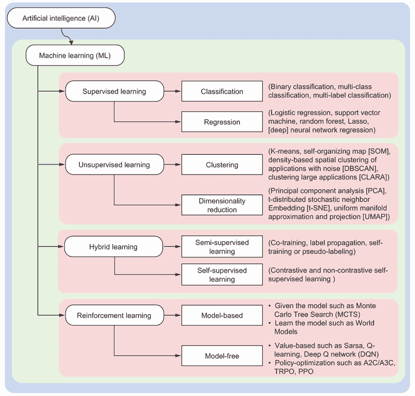

图 11.2 机器学习作为人工智能子领域的分类

+   *监督学习*——这种方法使用归纳推理来近似数据与已知标签或类别之间的映射函数。这种映射是通过使用已经标记的训练数据来学习的。在监督学习中，*分类*（预测离散或分类值）和*回归*（预测连续值）是常见的任务。例如，分类寻求一个评分函数 *f*:*Χ*×*C*⟶*R*，其中 *X* 代表训练数据空间，*C* 代表标签或类别空间。这种映射可以使用 *N* 个训练示例来学习，形式为 {(*x*[11], *x*[21], …, *x[m]*[1], *c*[1]), (*x*[12], *x*[22], …, *x[m]*[2], *c*[2]), …, (*x*[1]*[N], x*[2]*[N]*, …, *x[mN], c[N]*)}，其中 *x[i]* 是第 *i* 个示例的特征向量，*m* 是特征数量，*c[i]* 是相应的类别。预测的类别是给出最高评分的类别，即 *c*(*x*) = argmax*[c]f*(*x*,*c*)。在自动驾驶汽车的情况下，监督学习可能被用来训练一个模型来识别交通标志。输入数据将是各种交通标志的图像，正确的输出（标签）将是每个标志的类型。训练好的模型随后可以在驾驶时正确识别交通标志。前馈神经网络（FNNs）或多层感知器（MLPs）、卷积神经网络（CNNs）、循环神经网络（RNNs）、长短期记忆（LSTM）网络和序列到序列（Seq2Seq）模型是通常使用监督学习训练的常见神经网络架构的例子。使用监督机器学习解决组合问题的例子在 11.6、11.7 和 11.9 节中提供。

+   *无监督学习*—这种方法通过诸如*聚类*和*降维*等技术处理未标记数据。例如，在聚类中，给出*n*个对象（每个对象可能是一个*d*特征的向量），任务是根据某些相似性度量将它们分组到*c*个组（簇）中，使得单个组中的所有对象彼此之间有“自然”的关系，而不同组中的对象在某种程度上是不同的。例如，无监督学习可能用于自动驾驶车辆中聚类相似的驾驶场景或环境。使用无监督学习，汽车可能学会识别不同类型的交叉口或环岛，即使没有人明确地将这些类别标记为数据。自编码器、k-means、基于密度的空间聚类（DBSCAN）、主成分分析（PCA）和自组织映射（SOMs）是未监督学习方法的例子。SOM 在 11.4 节中解释。11.8 节提供了一个使用 SOM 的组合问题的例子。

+   *混合学习*—这种方法包括*半监督学习和自监督学习*技术。半监督学习是监督学习和无监督学习相结合的方法，其中只有一小部分输入数据被标记为相应的输出。在这种情况下，训练过程使用可用的少量标记数据，并对数据集的其余部分进行伪标记——例如，使用有限的标记驾驶场景集训练自动驾驶车辆的感知系统，然后使用大量的未标记驾驶数据来提高其识别和响应各种道路状况和障碍物的能力。自监督学习是一种机器学习过程，模型通过使用数据本身固有的结构或关系来学习输入数据的有效表示。这是通过从未标记数据中创建监督学习任务来实现的。例如，一个自监督模型可能被训练来根据前面的单词预测句子中的下一个单词，或者从打乱版本的图像中重建图像。这些学习到的表示可以用于各种下游任务，例如图像分类或目标检测。在自动驾驶车辆的情况下，感知系统可以被训练来识别未标记驾驶场景中的关键特征，例如车道标记、行人和其他车辆。然后，学习到的特征被用作伪标签，以监督方式对新的驾驶场景进行分类，使车辆能够根据其对道路环境的理解做出决策。

+   *强化学习（RL）*——这种方法通过反馈循环或通过试错来学习。学习代理通过在环境中采取行动以最大化某种累积奖励的概念来学习做出决策。对于自动驾驶汽车，强化学习可以在决策过程中使用。例如，汽车可能随着时间的推移学会在繁忙的高速公路上并入交通的最佳方式。它将因成功的并入而获得正面奖励，因危险的操作或失败的尝试而获得负面奖励。随着时间的推移，通过试错和最大化奖励的愿望，汽车将学会并入交通的最佳策略。关于强化学习的更多细节将在下一章提供。

深度学习（DL）是机器学习（ML）的一个子领域，它使用具有多层（因此称为“深度”）的神经网络来学习数据中的底层特征，使人工系统能够从更简单的概念中构建复杂的概念。深度学习能够学习具有判别性的特征或表示，并在不同抽象级别上进行学习。为了实现这一点，网络使用层次特征学习和采用少量卷积层。深度学习通过减少对大量数据预处理的需求，革新了机器学习领域。深度学习模型可以从原始数据中自动提取高度判别性的特征，从而消除了手动特征工程的需求。这种端到端的学习过程显著减少了对人专家的依赖，因为模型能够直接从输入数据中提取有意义的表示和模式。

与传统的机器学习算法不同，深度学习模型能够直接消费和处理各种形式的结构化和非结构化数据，如文本、音频、图像、视频，甚至图。图结构数据在组合优化领域尤为重要，因为它能够捕捉和表示优化问题中元素之间的关系和约束。几何深度学习是机器学习的一个子领域，它将图论与深度学习相结合。

以下两节更详细地介绍了图机器学习和自组织映射。它们是本章后面描述的使用案例的必要背景知识。

## 11.3 使用图的机器学习

如第 3.1 节所述，图是一种非线性数据结构，由称为*顶点*（或节点）的实体及其之间的关系组成，这些关系称为*边*（或*弧*或*链接*）。来自不同领域的数据可以使用图很好地捕捉。例如，社交媒体网络使用图来描绘用户之间的连接并分析社会互动，这反过来又推动内容传播和推荐。导航应用程序使用图来表示物理位置及其之间的路径，从而实现路线计算、实时交通更新和预计到达时间（ETA）预测。推荐系统依赖于图来模拟用户-项目交互和偏好，从而提供个性化推荐。搜索引擎使用网页图，其中网页是节点，超链接是边，以爬取和索引互联网并促进高效的信息检索。知识图谱提供了事实信息、关系和实体的结构化表示，并在从数字助手到企业数据集成等众多领域得到应用。问答引擎使用图来理解和分解复杂问题，并在结构化数据集中搜索相关答案。在化学领域，分子结构可以被视为图，其中原子是节点，键是边，支持发现化合物和预测性质等任务。

图结构化数据至关重要，因为它能够以直观、自描述、本质上可解释和自然的方式对实体之间的复杂关系和依赖进行建模。与传统表格数据不同，图允许表示感兴趣实体之间的网络关系和复杂相互关联，使它们成为建模众多现实世界系统的优秀工具。可以将表格数据转换为图结构化数据——节点和边的具体定义将取决于你想要在数据中检查哪些关系。例如，在 FIFA 数据集的背景下，我们可以根据该数据集中可用的信息定义节点和边：

+   *节点*—节点代表感兴趣的实体，可以是球员、他们所效力的俱乐部或他们的国籍。这些实体中的每一个都可以是图中的一个单独节点。例如，莱昂内尔·梅西、国际米兰和阿根廷都可以是图中的单独节点。

+   *边缘*—边缘代表节点之间的关系。例如，一条边可以连接一个球员和他们所效力的俱乐部，表示该球员是该俱乐部的一员。另一条边可以连接一个球员和他们的国籍，表明该球员属于那个国家。因此，例如，莱昂内尔·梅西可以通过一条边与国际米兰连接，表示梅西为国际米兰效力，另一条边可以将莱昂内尔·梅西与阿根廷连接，表示他的国籍。

下一个列表显示了如何使用 NetworkX 将 10 位选定足球运动员的表格数据转换为图。

列表 11.1 将表格数据转换为图

```py
import pandas as pd
import networkx as nx
import matplotlib.pyplot as plt

data={'Player':['L. Messi','R. Lewandowski','C. Ronaldo','Neymar Jr','K. 
➥ Mbappé','E.Haaland','H. Kane','Luka Modrić','L. Goretzka','M. Salah'],
➥    'Age':[36,34,38,22,24,35,29,37,28,31],
➥    'Nationality':['Argentina','Poland','Portugal','Brazil','France','Norway',
➥    'England','Croatia','Germany','Egypt'],
➥    'Club':['Inter Miami','Barcelona','Al-Nassr','Al-Hilal ','PSG','Manchester
➥    City','Tottenham Hotspur','Real Madrid','Bayern Munich','Liverpool'],
➥    'League':['Major League Soccer ','Spain Primera Division','Saudi Arabia
➥ League','Saudi Arabia League','French Ligue 1','English Premier
➥ League','English Premier League','Spain Primera Division','German 1.
➥ Bundesliga','English Premier League']}
df=pd.DataFrame.from_dict(data)
```

作为 11.1 列表的延续，我们可以创建一个 NetworkX 图，其节点代表球员姓名、俱乐部和国籍，而边则代表这些节点之间的语义关系。

```py
G = nx.Graph()                                                                      ①
for index, row in df.iterrows():
    G.add_edge(row['Player'], row['Club'], relationship='plays_for')                ②
for index, row in df.iterrows():
    G.add_edge(row['Player'], row['Nationality'], relationship='belongs_to')        ③
pos = nx.kamada_kawai_layout(G)                                                     ④
plt.figure(figsize=(20, 14))                                                        ⑤
player_nodes = df['Player'].unique().tolist()                                       ⑥
club_nodes = df['Club'].unique().tolist()                                           ⑥
nationality_nodes = df['Nationality'].unique().tolist()                             ⑥
nx.draw_networkx_nodes(G, pos, nodelist=player_nodes, node_color='blue',
➥ label='Player Name', node_shape='o')                                             ⑦
nx.draw_networkx_nodes(G, pos, nodelist=club_nodes, node_color='red', label='Club', ⑦
➥ node_shape='d')                                                                  ⑦
nx.draw_networkx_nodes(G, pos, nodelist=nationality_nodes, node_color='gray',       ⑦
➥ label='Nationality', node_shape='v')                                             ⑦
nx.draw_networkx_edges(G, pos)                                                      ⑧
edge_labels = nx.get_edge_attributes(G, 'relationship')                             ⑨
nx.draw_networkx_edge_labels(G, pos, edge_labels=edge_labels, font_size=12)         ⑨
nx.draw_networkx_labels(G, pos)                                                     ⑩
plt.legend(fontsize=13, loc='upper right')
plt.show()
```

① 创建一个新的图。

② 为俱乐部添加节点和边。

③ 为国籍添加节点和边。

④ 创建布局

⑤ 设置图形的大小。

⑥ 获取球员、俱乐部和国籍节点的列表。

⑦ 用不同颜色绘制节点。

⑧ 绘制边。

⑨ 绘制边标签。

⑩ 绘制节点标签。

图 11.3 显示了 10 位选定足球运动员的图数据。此图显示了感兴趣的实体（球员、俱乐部和国籍）及其关系。例如，L.梅西是一名为 Inter Miami 效力的球员，来自阿根廷。


图 11.3 10 位选定足球运动员的图结构数据

图形数据与欧几里得数据根本不同，因为距离的概念不仅仅是两点之间的直线（欧几里得）距离。在图的情况下，重要的是节点和边的结构——两个节点是否通过边连接，以及它们如何连接到图中的其他节点。表 11.1 总结了欧几里得数据和非欧几里得图数据之间的差异。

表 11.1 欧几里得数据与非欧几里得图数据

| 方面 | 欧几里得数据 | 非欧几里得图数据 |
| --- | --- | --- |
| 常见数据类型 | 数值、文本、音频、图像、视频 | 道路网络、社交网络、网页和分子结构 |
| 维度 | 可以为 1D（例如，数字、文本），2D（例如，图像、热图），或更高维（例如，RGB-D 图像或深度图，3D 点云数据） | 大维度（例如，Pinterest 图有 30 亿个节点和 180 亿条边） |
| 结构 | 固定结构（例如，在图像的情况下，结构通过像素邻近性嵌入） | 任意结构（每个节点都可以有不同的神经网络结构，因为其网络邻域不同，模型适应数据） |
| 空间局部性 | 是（即在输入空间中彼此靠近的数据点也可能会在输出空间中彼此靠近）。 | 否，“接近”由图结构决定，而不是空间排列（即彼此“接近”的两个节点可能不具有相似的性质或特征，例如在交通灯节点和人行横道节点的情况下）。 |
| 平移不变性 | 是（即在平移时保留数据固有的意义；例如，图片中猫的概念不会因为猫在图像的右上角或左下角而改变）。 | 否（在图中，节点的“位置”没有固有的意义，不能“平移”）。 |
| 序数或层次 | 是 | 否，图数据具有“排列不变性”——节点的特定顺序或标签通常不会影响图的基本关系和属性。 |
| 两个点之间的最短路径 | 直线 | 不一定是直线 |
| 机器学习模型示例 | 卷积神经网络（CNNs）、长短期记忆（LSTM）和循环神经网络（RNNs） | 图神经网络（GNNs）、图卷积网络（GCNs）、时序图网络（TGNs）、时空图神经网络（STGNNs） |

*几何深度学习*（GDL）是一个总称，用于描述旨在将（结构化）深度神经网络扩展到处理具有潜在几何结构的非欧几里得数据的新兴技术，例如图（连接实体的网络）、点云（3D 数据点的集合）、分子（化学结构）和流形（弯曲、高维表面）。图机器学习（GML）是机器学习的一个子领域，专注于开发能够从图结构化数据中学习的算法和模型。图嵌入或表示学习是执行机器学习任务（如节点分类（预测每个节点的类别）、链接预测（预测节点之间的连接）和社区检测（识别相互连接的节点组））的第一步。下一小节将描述不同的图嵌入技术。

### 11.3.1 图嵌入

图嵌入是一个旨在将离散的高维图域映射到低维连续域的任务。通过图嵌入的过程，图节点、边及其特征被转换为连续向量，同时保留图的结构信息。例如，如图 11.4 所示，编码器 *ENC*(*v*) 根据节点 *v* 在图中的位置、其局部邻域结构或其特征，或这三个的组合，将节点 *v* 从输入图空间 *G* 映射到嵌入或潜在空间 *H* 中的低维向量 *h[v]*。


图 11.4 图嵌入

此编码器需要优化以最小化图中一对节点相似性与它们在嵌入空间中相似性之间的差异。图中连接或靠近的节点在嵌入空间中应该靠近。相反，图中未连接或相距较远的节点在嵌入空间中应该相距较远。在更通用的编码器/解码器架构中，添加了解码器以从低维嵌入中提取用户指定的信息[5]。通过联合优化编码器和解码器，系统学习将关于图结构的信息压缩到低维嵌入空间中。

图嵌入有多种方法，可以大致分为归纳（浅层）嵌入和归纳嵌入：

+   *归纳嵌入*——在归纳学习范式下，模型仅在训练阶段学习图中存在的节点的嵌入。这些学习到的嵌入仅针对这些节点，模型不能为训练期间未出现的节点生成嵌入。这些方法难以扩展，适用于静态图。图嵌入的归纳方法示例包括随机游走（例如，node2vec 和 DeepWalk）和矩阵分解（例如，图分解和 HOPE）。

+   *归纳嵌入*——归纳学习方法可以推广到训练期间未出现的节点或整个图。它们通过学习一个函数来实现，该函数根据节点的特征和其局部邻域的结构生成节点的嵌入，这可以应用于任何节点，无论它是否在训练期间出现。这些方法适用于动态图。图嵌入的归纳方法示例包括图神经网络（GNN）和图卷积网络（GCNs）。

附录 A 包含了一些这些方法的示例。更多信息，请参阅 Broadwater 和 Stillman 的《图神经网络实战》[6]。我们将重点关注 GCN，因为它是最相关的组合优化应用方法，本章将介绍。

归纳学习与归纳学习比较

*归纳学习*旨在从特定的数据集中学习到特定的预测结果，而不对新的数据进行泛化。*归纳学习*旨在从观察到的训练案例中学习一般规则。这些一般规则可以应用于新的、未见过的数据。

*卷积操作*是许多结构化数据场景中表征学习的基础，它能够从原始数据中自动学习有意义的特征，从而避免了手动特征工程的需要。卷积是一种数学运算，它接受两个函数（输入数据和核、滤波器或特征检测器）并测量它们的重叠或合并这两组信息以生成特征图。卷积的一个关键方面是其能够尊重并利用数据点之间已知的结构关系，例如像素之间的位置关联、时间点的时序或网络中节点之间的边缘。在传统的机器学习中，卷积神经网络（CNNs）使用卷积算子作为识别图像中空间模式的关键工具。这是由图像数据的固有网格状结构所实现的，它允许模型在图像上滑动滤波器，利用空间规律性，并以类似于模式识别的方式提取特征。

然而，在图机器学习（GML）领域，情况发生了相当大的变化。在此背景下，数据是非欧几里得的，如前所述在表 11.1 中解释，这意味着它不是像图像中的像素或 3D 表面上的点那样排列在常规网格上。相反，它以网络或图的形式表示，可以捕捉复杂的关系。此外，这种数据表现出顺序不变性，这意味着输出不会随着节点的重新排列而改变。

与在常规网格上运行的卷积神经网络（CNNs）不同，图卷积网络（GCNs）被设计用来处理以图结构组织的数据，这种结构可以表示各种不规则和复杂的结构。每个节点都与其邻居通过没有任何预定义模式的连接相连，卷积操作应用于图中的节点及其直接邻居。

谷歌 DeepMind 是如何预测到达时间的？

你是否曾经想过，当你计划旅行时，谷歌地图是如何预测到达时间（ETA）的？谷歌 DeepMind 使用 GML 方法来做到这一点。传统的机器学习方法是将路线分解成多个路段，使用前馈神经网络预测穿越每个路段所需的时间，并将它们加起来得到 ETA。然而，前馈神经网络的基本假设是路段之间是相互独立的。在现实中，路段交通很容易影响相邻路段的 ETA，因此样本不是独立的。

例如，考虑这种情况：一条次要道路上的拥堵会影响主路的交通流量。当模型包含多个交叉口时，它自然会发展出预测交叉口减速、因交通汇聚导致的延误以及停车和行驶交通条件下所需总时间的预测能力。一个更好的方法是使用 GML 来考虑相邻路段的影响。

在这种情况下，道路网络首先将被转换为图，其中每个路段被表示为一个节点。如果两个路段相互连接，它们对应的节点将在图中通过边连接。然后，通过 GNN 生成图嵌入，将节点特征和图结构从高维离散图空间映射到低维连续潜在空间。通过称为“消息传递”的技术在图中传播和聚合信息，在最后，每个节点的嵌入向量包含并编码了其自身的信息以及所有相邻节点的网络信息，根据邻域的程度。相邻节点相互传递消息。在第一次传递中，每个节点了解其邻居。在第二次传递中，每个节点了解其邻居的邻居，并将这些信息编码到嵌入中，依此类推。这使得我们能够表示相邻路段中交通的影响。

使用这种方法，在柏林、雅加达、圣保罗、悉尼、东京和华盛顿特区等地，实时 ETAs 的准确性提高了高达 50% [7]。

如图 11.5 所示，给定一个输入图，该图包括节点特征*x[v]*和邻接矩阵*A*，GCN 将每个节点的特征转换为一个潜在或嵌入空间*H*，同时保留由邻接矩阵*A*表示的图结构。这些潜在向量提供了每个节点的丰富表示，使得独立进行节点分类成为可能。

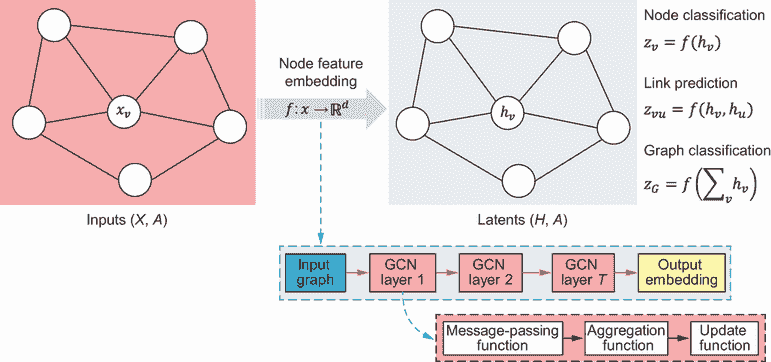

图 11.5 图嵌入和节点、链接和图分类

此外，GCN 还能够预测与边相关的特征，例如两个节点之间是否存在链接。一旦生成了节点嵌入，就可以根据节点*v*和*u*的嵌入*h[v]*，*h[u]*预测它们之间边的可能性。一种常见的方法是计算两个节点嵌入之间的相似度度量（例如，点积）。然后，可以将这种相似度通过 sigmoid 函数传递，以预测边的概率。预测上的错误（损失）将反向传播并更新神经网络中的权重。

最后，GCN 能够在整个图的层面上进行分类。这可以通过聚合所有节点的所有潜在或嵌入向量(*H*)来实现。所使用的聚合函数必须是排列不变的，这意味着输出应该与节点的顺序无关。此类函数的常见例子是求和、平均或最大化。一旦将潜在向量聚合为单一表示，就可以将此表示输入到一个模块（例如，一个神经网络层）中，以预测整个图的输出。本质上，GCN 允许进行节点级、边级和图级预测。

为了更好地理解 GCN 的工作原理，让我们考虑一个包含五个节点的图，如图 11.6 所示。对于图中的每个节点，第一步是找到其相邻节点。假设我们想检查节点 5 的嵌入是如何生成的。如图 11.6 左上角的原图所示，节点 2 和 4 是节点 5 的相邻节点。第二步是消息传递，这是节点向其相邻节点发送、接收和聚合消息的过程，以迭代更新其特征。这使得 GCN 能够学习每个节点的表示，该表示既捕获了其自身的特征，也捕获了其在图中的上下文。学习到的表示可以用于下游任务，如节点分类、链接预测或图分类。


图 11.6 GCN 中的消息传递和更新

考虑到节点 v 的 N(v)个相邻节点，经过 t 层邻域聚合后的节点 v 的嵌入基于图 11.7 所示的公式。初始的 0 层嵌入 h[v]⁰等于节点特征 x[v]。

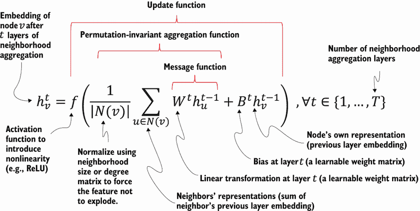

图 11.7 GCN 中的嵌入函数

该公式递归应用于每个时间步得到另一个更好的向量 h，其中 h 是节点在潜在空间中的向量表示。权重矩阵通过在给定数据上的训练学习得到。一开始，图中的每个节点只知道其自身的初始特征。在 GCN 的第一层中，每个节点与其直接相邻的节点进行通信，聚合其自身的特征并接收来自这些邻居的特征。当我们移动到第二层时，每个节点再次与其邻居进行通信。然而，因为邻居已经在第一层中从其自身的邻居那里获取了信息，所以原始节点现在间接地访问了来自两个跳远的图中的信息——其邻居的邻居。随着这个过程在 GCN 的更多层中重复，信息在图中传播和聚合。最后，每个节点的嵌入向量包含并编码了其自身的信息以及所有相邻节点的网络信息，根据邻域的程度，或其*k*-跳邻域，以创建上下文嵌入。节点的*k*-跳邻域，或半径为*k*的邻域，是一组距离小于或等于*k*的相邻节点。

列表 11.2 展示了如何使用 GCN 生成 Cora 数据集的节点嵌入。Cora 数据集包含 2,708 篇科学出版物，分为七个类别之一。引用网络由 5,429 个链接组成。数据集中的每篇出版物都由一个 0/1 值的词向量描述，表示字典中相应单词的存在/不存在。该字典包含 1,433 个独特的单词。

使用 PyG（PyTorch Geometric）并可以按照以下方式安装：

```py
$conda install pytorch torchvision -c pytorch
$conda install torch_scatter
$conda install torch_sparse
$conda install torch_cluster
$conda install torch-spline-conv
$conda install torch_geometric
```

更多关于 PyG CUDA 安装的详细信息可在 PyG 文档中找到（[`pytorch-geometric.readthedocs.io/en/latest/notes/installation.html`](https://pytorch-geometric.readthedocs.io/en/latest/notes/installation.html))。

我们将首先导入我们将使用的库。

列表 11.2 使用 GCN 进行节点嵌入

```py
import numpy as np
from sklearn.preprocessing import StandardScaler
from sklearn.decomposition import PCA
from sklearn.pipeline import Pipeline
import torch
import torch.nn.functional as F
from torch_geometric.datasets import Planetoid
from torch_geometric.nn import GCNConv
from torch_geometric.utils import to_networkx
```

PyG 提供了多个可以直接加载的数据集，例如 KarateClub、Cora、Amazon、Reddit 等。Cora 数据集是 Planetoid 数据集的一部分，可以按以下方式加载：

```py
dataset = Planetoid(root='/tmp/Cora', name='Cora')
```

如以下代码所示，GCN 模型使用两个 `GCNConv` 层（`GCNConv`）和一个 `torch.nn.Dropout` 层定义。`GCNConv` 是一个图卷积层，`torch.nn.Dropout` 是一个 dropout 层，在训练期间以概率 0.5 随机将输入张量的一些元素置零，作为一种简单的防止过拟合的方法。

`forward` 函数定义了模型的正向传递。它接受一个数据对象作为输入，表示图，并从输入数据中提取节点的特征和图的邻接列表。节点特征（`x`）通过第一个 GCN 层 `conv1`、一个 `relu` 激活函数、一个 dropout 层，最后通过第二个 GCN 层 `conv2`。邻接列表 `edge_index` 是 GCN 层中卷积操作所必需的。然后返回网络的输出：

```py
class GCN(torch.nn.Module):
    def __init__(self):
        super(GCN, self).__init__()
        self.conv1 = GCNConv(dataset.num_node_features, 16)
        self.conv2 = GCNConv(16, dataset.num_classes)
        self.dropout = torch.nn.Dropout(0.5)

    def forward(self, data):
        x, edge_index = data.x, data.edge_index

        x = self.conv1(x, edge_index)
        x = F.relu(x)
        x = F.dropout(x, training=self.training)
        x = self.conv2(x, edge_index)

        return x
```

作为 11.2 列表的延续，以下代码片段在单个图上训练 GCN 模型并从训练模型中提取节点嵌入。`model` 在 200 个时期内进行训练。其梯度首先被置零，然后计算前向传递，并在训练节点（由 `data.train_mask` 标记的节点）上计算负对数似然损失。然后计算反向传递以获取梯度，并优化器执行一步以更新模型参数。模型被设置为评估模式，并在图上再次运行以获得最终的节点嵌入：

```py
device = torch.device('cuda' if torch.cuda.is_available() else 'cpu')        ①
model = GCN().to(device)                                                     ②
data = dataset[0].to(device)                                                 ③

optimizer = torch.optim.Adam(model.parameters(), lr=0.01, weight_decay=5e-4) ④

model.train()                                                                ⑤
for epoch in range(200):                                                     ⑤
    optimizer.zero_grad()                                                    ⑤
    out = model(data)                                                        ⑤
    loss = F.nll_loss(out[data.train_mask], data.y[data.train_mask])         ⑤
    loss.backward()                                                          ⑤
    optimizer.step()                                                         ⑤

model.eval()                                                                 ⑥
embeddings_pyg = model(data).detach().cpu().numpy()                          ⑦
```

① 如果 CUDA 可用，代码将使用 GPU；否则，它将使用 CPU。

② 创建 GCN 模型的一个实例，并将其移动到选定的设备上。

③ 加载数据集中的第一个图，并将其移动到设备上。

④ 使用学习率为 0.01 且权重衰减（一种正则化形式）为 0.0005 的 Adam 优化器。

⑤ 对模型进行 200 个时期的训练。

⑥ 设置评估模式。

⑦ 获取最终的节点嵌入。

使用 `.detach()` 函数将输出从计算图中分离出来，并返回一个新的不需要梯度的张量。然后，将嵌入从 GPU（如果它们在 GPU 上）移动到 CPU。这样做是为了使数据可用于进一步处理，例如将其转换为 NumPy 数组。生成的嵌入大小为 (2708, 7)，其中节点数为 2,708，类别或主题数为 7。使用主成分分析（PCA）进行降维，以便如图 11.8 所示在 2D 中可视化嵌入。


图 11.8 使用 PyG 中的 GCN 进行节点嵌入

如您所见，节点嵌入使得属于同一类的节点聚集在一起。这意味着特征的可区分性增强，从而提高了预测的准确性。

书中 GitHub 仓库中可用的列表 11.2 的完整版本还展示了如何使用 StellarGraph 中的 GCN 生成节点嵌入。StellarGraph 是一个用于图和网络上的机器学习的 Python 库。

### 11.3.2 注意力机制

正如您在图 11.7 中看到的，GCN 中的嵌入函数包括消息传递、聚合和更新函数。消息传递函数主要根据可学习的权重矩阵 *W^t* 整合节点邻居的消息。这个权重矩阵并不反映相邻节点的重要性程度。卷积操作将相同的可学习权重作为线性变换应用于节点的所有邻居，而没有明确考虑它们的重要性或相关性。这可能不是理想的，因为某些部分可能需要比其他部分更多的注意力。

深度学习（DL）中“注意力”的概念本质上允许模型在生成输出序列时，有选择性地集中关注输入数据的特定部分。这种机制确保了上下文从初始阶段到末尾的维持和传播。它还允许模型通过在每个时间步集中关注输入的最重要部分来动态分配其资源。从广义上讲，深度学习中的注意力可以可视化为一个由重要性或相关性分数组成的向量。这些分数有助于量化图中节点与图中所有其他节点之间的关系或关联。

注意力即一切

具有里程碑意义的论文“Attention Is All You Need” [8] 提出了一种新的 Transformer 模型，用于处理如文本之类的序列数据。在语言处理和翻译的世界里，模型通常逐字逐句地读取整个句子或文档，按照顺序（就像我们读书时一样），然后基于此做出预测。这些模型在理解长句子和从文本中回忆信息方面存在一些困难。在长序列的情况下，到序列末尾时初始上下文可能会丢失。这被称为*遗忘问题*。

论文的作者们提出了一种处理这个任务的不同方法。他们的模型不是按顺序读取所有内容，而是在不同时间关注输入的不同部分，几乎就像在文本中跳跃一样。这就是他们所说的“注意力”。注意力机制允许模型动态地优先考虑对于它试图预测的每个单词来说，输入的哪些部分是最相关的，使其在理解上下文和减少长句子或复杂短语引起的混淆方面更加有效。更多细节，请参阅“Annotated Transformer” [9]。

图 11.9b 展示了图注意力网络（GAT），其中添加了一个权重因子或注意力系数*α*到嵌入方程中，以反映邻近节点的重要性。GAT 使用加权邻接矩阵而不是 GCN 中使用的非加权邻接矩阵（图 11.9a）。使用一个注意力机制*a*来计算节点对*v*和*u*之间的未归一化系数*e[vu]*，基于它们的特征：

|


| 11.1 |
| --- |

这种注意力机制的例子可以是点积注意力，它衡量两个节点特征的相似性或对齐度，提供了节点*v*应该给予节点*u*多少注意力的定量指示。其他机制可能涉及学习到的注意力权重、非线性变换或节点特征之间更复杂的交互。遵循图结构，节点*v*只能在其邻域内的节点*i* ∈ *N[v]*上关注。

注意力系数通常使用 softmax 函数进行归一化，以便它们是可比较的，无论原始分数在不同邻域或上下文中的规模或分布如何。请注意，在图 11.9b 中，为了简化，注意力系数*α[vu]*被表示为*α[u]*。

|


| 11.2 |
| --- |


图 11.9 图卷积网络（GCN）与图注意力网络（GAT）的比较

*多头注意力*是 GAT 和“注意力即一切”论文中讨论的 Transformer 模型的关键组成部分。在多头注意力机制中，模型拥有多组注意力权重。每一组（或称为“头”）可以学习关注输入的不同部分。模型不再只有一个关注点，而是可以有多个关注点，使其能够捕捉数据中的不同类型的关系和模式。在 GAT 的上下文中，多头注意力机制允许图中的每个节点以不同的方式关注不同的邻近节点，如图 11.10 所示。


图 11.10 展示了具有 3 个头的多头注意力机制，节点 5 的*α*[52]，*α*[54]，和*α*[55]是节点之间的注意力系数。每个头的聚合特征被平均以获得节点的最终嵌入。

当多个头完成它们各自的关注操作后，通常会对它们的结果进行平均。这个过程将多个注意力头捕获的多样化视角压缩成一个单一的输出。在多头注意力操作的结果结合之后，随后应用一个最终的非线性变换。这一步通常涉及使用 softmax 函数或逻辑 sigmoid 函数，尤其是在分类问题中。这些函数的作用是将模型的最终输出转换为概率，使得输出更容易解释，并更适用于预测任务。

### 11.3.3 指针网络

序列机器学习涉及处理观察顺序重要的数据，如时间序列数据、句子或排列。根据输入和输出的数量，序列机器学习任务可以分类，如表 11.2 所示。*序列到序列*（seq2seq）模型接收一系列项目并输出另一个序列的项目。循环神经网络（RNN）和长短期记忆（LSTM）已被确立为 seq2seq 建模中的最先进方法。

表 11.2 序列机器学习

| 任务 | 示例 |
| --- | --- |
| 一对一 | 图像分类。我们提供一个单独的图像作为输入，模型输出分类或类别，如“狗”或“猫”，作为单个输出。 |
| 一对多 | 图像描述。我们将单个图像输入模型，它生成描述该图像的一系列单词。 |
| 多对一 | 情感分析。我们输入一系列单词（如句子或推文），模型输出一个单一的情感评分（如“积极”、“消极”或“中性”）。 |
| 多对多（类型 1） | 序列输入和序列输出，如命名实体识别（NER）的情况。我们输入一个句子（单词序列），模型输出识别的实体，如人、组织、地点等。 |
| 多对多（类型 2），称为同步序列模型 | 同步序列输入和输出。该模型接收一系列输入，但在读取整个序列之前不输出任何内容。然后它输出一个序列。此类的一个例子是视频分类，其中模型接收一系列视频帧作为输入，然后输出这些帧的标签序列。 |

在离散组合优化问题，如旅行商问题、排序任务或凸包问题中，输入和输出数据都是序列化的。然而，传统的 seq2seq 模型在有效解决这些问题上存在困难。这主要是因为输出元素的离散类别不是预先确定的。相反，它们取决于输入的变量大小（例如，输出字典依赖于输入长度）。*指针网络*（Ptr-Net）模型[10]通过利用注意力机制来指向或选择输入序列中的一个成员作为输出，来解决此问题。该模型不仅提高了配备输入注意力的传统 seq2seq 模型的性能，而且还使我们能够推广到可变大小的输出字典。

当传统的注意力机制在输入序列上分配注意力以生成输出元素时，Ptr-Net 则将注意力用作指针。这个指针用于从输入序列中选择一个元素，并将其包含在输出序列中。让我们以凸包问题作为一个离散组合优化问题的例子。凸包是一种几何形状，具体来说是一个多边形，它完全包围了一个给定的点集。它是通过优化两个不同的参数来实现的：它最大化了形状覆盖的面积，同时最小化形状的边界或周长，如图 11.11 所示。为了理解这个概念，可以想象将橡皮筋拉伸到集合的极点或顶点周围。当你释放橡皮筋时，它会自动以可能的最小周长包围整个集合，这正是凸包所做的事情。

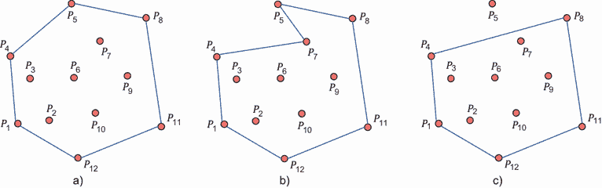

图 11.11 凸包问题。a) 一个有效的凸包，包围了所有点，同时最大化面积和最小化周长。注意，多边形的输出序列中包含的点数可能少于给定的点数。b) 一个无效的凸包，因为周长没有最小化。c) 一个无效的凸包，因为并非所有点都被包围。

凸包在各个学科中有着多种应用。例如，在图像识别领域，凸包可以帮助确定图像中物体的形状和边界。同样，在机器人领域，它们可以通过定义机器人周围的“可达”空间来协助障碍物检测和导航。

给定点集，寻找或计算凸包的问题已经通过各种算法得到解决。例如，Graham 扫描算法根据点与凸包底部点的角度对点进行排序，然后处理它们以找到凸包[11]。Jarvis 行进（或礼物包装算法）从最左边的点开始，将剩余的点像包装礼物一样包裹起来[12]。Quickhull 算法通过递归地将集合划分为子集，选择离两个极点之间的线最远的点，并消除形成三角形内的点，直到识别出凸包的顶点[13]。

如图 11.12 所示，Ptr-Net 以平面点集 *P* = {*P*[1], *P*[2], …, *P[n]*} 作为输入，其中每个元素有 *n* 个，*P[j]* = (*x[j], y[j]*) 是点的笛卡尔坐标。输出 *C[P]* = {*C*[1], *C*[2],…, *C[m]*[(]*[P]*[)]} 是代表与点集 *P* 相关的解决方案的序列。在此图中，Ptr-Net 从输入数据点 [1 2 3 4] 估计输出序列 [1 4 2]。此输出序列表示包含所有输入点、面积最大和周长最小的凸包。如图所示，凸包是通过连接 *P*[1]，*P*[2]，和 *P*[4] 形成的。第三个点 *P*[3] 在此凸包内部。

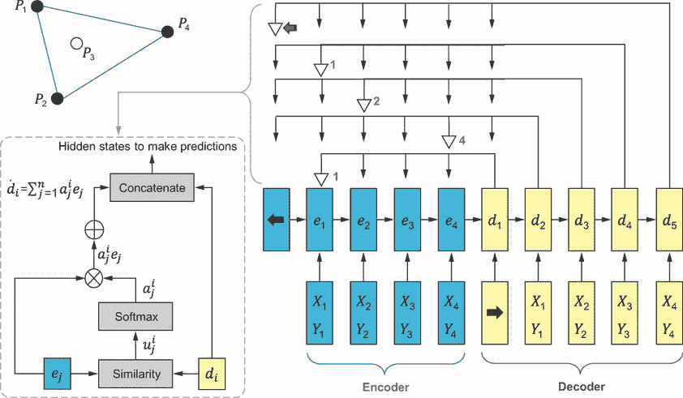

图 11.12 Pointer network (Prt-Net) 从输入数据点 [1 2 3 4] 估计输出序列 [1 4 2]

Ptr-Net 由三个主要组件组成：

+   *编码器*—编码器是一个循环神经网络（RNN），通常使用长短期记忆（LSTM）单元或门控循环单元（GRUs）实现。编码器的目的是处理输入序列，将每个输入元素转换为相应的隐藏状态。这些隐藏状态 (*e*[1],…, *e*[n]) 封装了输入序列中元素的上下文相关表示。

+   *解码器*—与编码器一样，解码器也是一个 RNN。它负责生成输出序列 (*d*[1],…, *d*[m])。对于每个输出步骤，它将前一个输出及其自身的隐藏状态作为输入。

+   *注意力机制（指针）*—Ptr-Net 中的注意力机制作为一个指针操作。它计算编码器输出的隐藏状态上的分布，指示每个输出步骤在输入序列中的“指向”位置。本质上，它决定哪些输入应该是下一个输出。注意力机制是学习到的注意力分数上的 softmax 函数，它给出了输入序列上的概率分布，表示每个元素被指向的可能性。

在每个输出时间 *i* 计算注意力向量使用以下方程：

|

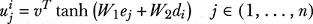

| 11.3 |
| --- |

|


| 11.4 |
| --- |

|

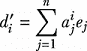

| 11.5 |
| --- |

其中

+   *u[j]* 是表示解码器和编码器隐藏状态之间相似性的注意力向量或对齐分数。*v*，*W*[1]，和 *W*[2] 是模型的可学习参数。如果编码器和解码器使用相同的隐藏维度（通常为 512），则 *v* 是一个向量，而 *W*[1] 和 *W*[2] 是方阵。

+   *a[j]* 是对输入或通过应用 softmax 操作到对齐分数计算出的权重上的注意力掩码。

+   *d[i]*'是每个时间步输入到解码器中的上下文向量。换句话说，*d[i]*和*d[i]*'被连接起来，用作预测的隐藏状态。所有编码器隐藏状态的加权总和允许解码器灵活地将注意力集中在输入序列的最相关部分。

Ptr-Net 可以处理可变长度的序列并解决复杂的组合问题，特别是那些涉及排序或排序任务的问题，其中输出是输入的排列，正如你将在第 11.9 节中看到的。

## 11.4 自组织映射

**自组织映射**（SOM），也称为**自组织特征映射**（SOFM）或**Kohonen 映射**，是一种人工神经网络（ANN），通过无监督学习进行训练，以产生训练样本输入空间的低维（通常是二维）离散表示，称为**映射**。SOMs 与传统 ANN 的区别在于其学习过程的性质，称为**竞争学习**。在这些算法中，处理元素或神经元为了响应输入数据的一个子集而竞争。输出神经元激活的程度随着神经元权重向量和输入之间的相似性增加而增强。权重向量和输入之间的相似性，导致神经元激活，通常通过计算欧几里得距离来衡量。在响应特定输入时，表现出最高激活水平或等效的最短距离的输出单元被认为是最佳匹配单元（BMU）或“获胜”神经元，如图 11.13 所示。然后，通过调整其权重，将这个获胜者逐渐调整到输入数据点更近的位置。

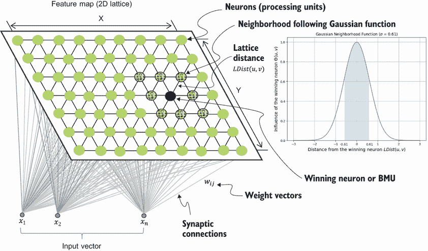

图 11.13 带高斯邻域函数的自组织映射（SOM）

SOM 的一个关键特性是**邻域函数**的概念，它确保不仅获胜神经元，而且其邻居也会从每个新的输入中学习，从而创建相似数据的簇。这使得网络能够保留输入空间的整体拓扑属性。方程 11.6 展示了邻域函数的一个例子：

|


| 11.6 |
| --- |

其中 *v* 是地图中节点的索引，*u* 是获胜神经元的索引，*LDist*(u,v*) 代表 *u* 和 *v* 之间的晶格距离，而 *σ* 是高斯核的带宽。在 SOMs 中，*σ* 代表邻域的半径或宽度，并决定了获胜神经元的权重更新阶段对其邻居的影响范围。大的 *σ* 意味着影响范围更广的邻域。另一方面，小的 *σ* 意味着受影响的邻近神经元更少。当 *σ* 设置为极小值时，邻域实际上缩小到只包括获胜神经元本身。这意味着只有获胜神经元的权重会因输入而显著更新，而其他神经元的权重几乎或根本不受影响。这种只更新获胜神经元的行为被称为“胜者全得”学习。

算法 11.1 展示了 SOM 的步骤，假设 *D[t]* 是目标输入数据向量，*W[v]* 是节点 *v* 的当前权重向量，θ(u,v,s*) 是表示获胜神经元距离引起的约束的邻域函数，而 *α* 是学习率，其中 *α* ∈ (0,1)。

算法 11.1 自组织映射（SOM）

```py
Randomly initialize the weights of each neuron
For each step s=1 to iteration limit:
    Randomly pick an input vector from the dataset
        Traverse each node in the map
            Calculate Euclidean distance as a similarity measure
            Determine the node that produces the smallest distance (winning neuron)
        Adapt the weights of each neuron v according to the following rule
        Wv(s+1)=Wv(s)+ α(s).θ(u,v,s).‖Dt-Wv(s)‖
```

SOMs 最初被用作数据可视化和聚类任务的数据降维方法。例如，Kohonen 的 SOM 算法的早期应用之一是神经语音打字机。这是一个系统，其中可以识别和将语音音素（可以区分一个词与另一个词的最小语音单位）转换为符号。当有人向系统说话时，SOM 会分类输入的音素并输入相应的符号。SOMs 可以应用于不同的问题，如特征提取、自适应控制和旅行商问题（见第 11.8 节）。

SOMs 的一个显著优势在于它们保留了输入空间内计算出的点之间的相对距离。在输入空间中靠近的点被映射到 SOM 中的邻近单元，这使得 SOM 成为分析高维数据中簇的有效工具。当使用主成分分析（PCA）等技术处理高维数据时，在将维度降低到二维时可能会发生数据丢失。如果数据包含许多维度，并且每个维度都携带有价值的信息，那么 SOMs 在降维方面可能优于 PCA。除此之外，SOMs 还具有泛化的能力。通过这个过程，网络可以识别或分类它以前未遇到的输入数据。这种新的输入与地图上的特定单元相关联，因此相应地映射。

前几节提供了机器学习的基本基础，为你提供了必要的背景知识。接下来的几节将深入探讨监督和无监督机器学习在解决优化问题中的实际应用。

## 11.5 优化问题的机器学习

利用机器学习技术解决组合优化问题代表了一个新兴且令人兴奋的研究领域。"神经组合优化"指的是将机器学习和神经网络模型，特别是 seq2seq 监督模型、无监督模型和强化学习，应用于解决组合优化问题。在此背景下，Yoshua Bengio 及其合作者[14]全面描述了机器学习在组合优化中的应用。作者描述了三种利用机器学习解决组合优化问题的独特方法（见图 11.14）：


图 11.14 机器学习（ML）在组合优化（CO）问题中的应用

+   *端到端学习*—为了使用机器学习解决优化问题，我们需要指导机器学习模型直接从输入实例中制定解决方案。Ptr-Net 是这种方法的例子，它在*m*个点上训练，在*n*个点上验证欧几里得平面对称 TSP [10]。使用端到端学习解决组合优化问题的例子在 11.6、11.7 和 11.9 节中提供。

+   *学习配置算法*—第二种方法涉及将机器学习模型应用于组合优化算法，并利用相关信息进行增强。在这方面，机器学习可以提供算法的参数化。此类参数的例子包括但不限于梯度下降方法中的学习率或步长；模拟退火中的初始温度或冷却计划；遗传算法中高斯变异的标准差或选择性交叉；粒子群优化（PSO）中的惯性权重或认知和社会加速系数；或者蚁群优化（ACO）中蒸发率、信息素沉积的影响或状态转换的期望影响。

+   *与优化算法结合的机器学习*——第三种方法要求使用组合优化算法反复咨询相同的机器学习模型进行决策。机器学习模型接受算法当前状态作为输入，这可能包括问题定义。与另外两种方法的基本区别在于，组合优化算法重复使用相同的机器学习模型来做出相同类型的决策，大约与算法的总迭代次数一样多。这种方法的例子是深度学习辅助启发式树搜索（DLTS），其中决策树搜索中关于探索哪些分支以及如何界定节点由深度神经网络（DNNs）[15]做出。

Vesselinova 等人的一篇引人入胜的研究论文深入探讨了机器学习和组合优化交叉的一些相关问题[16]。具体来说，该论文研究了以下问题：

+   能否利用机器学习技术自动化组合优化任务的学习启发式过程，从而更有效地解决这些问题？

+   解决这些现实世界问题都使用了哪些基本的机器学习方法？

+   这些方法在实用领域中的适用性如何？

本文对监督学习和强化学习策略在解决优化问题中的应用进行了全面综述。作者通过考察这些学习方法在一系列优化问题中的应用来分析这些学习途径：

+   背包问题（KP），目标是最大化所选物品的总价值，同时不超过背包的容量

+   最大团（MC）和最大独立集（MIS）问题，这两个问题都涉及识别具有特定属性的图子集

+   最大覆盖问题（MCP），需要选择一个子集以最大化覆盖范围

+   最大切割（MaxCut）和最小顶点覆盖（MVC）问题，这些问题涉及以特定方式划分图

此外，该论文还讨论了机器学习方法在可满足性问题（SAT）中的应用，这是一个涉及布尔逻辑的决策问题；经典的旅行商问题（TSP），需要找到访问给定城市集并返回起点城市的最短路径；以及车辆路径问题（VRP），这是 TSP 的推广版本，允许有多个“销售人员”（车辆）。关于基准优化问题的更多信息请参见附录 B。

Chengrun 等人在“大型语言模型作为优化器”文章中描述了通过提示（OPRO）进行优化，这是一种简单而有效的方法，用于使用大型语言模型（LLMs）作为优化器，其中优化任务以自然语言描述 [17]。更多展示机器学习在解决优化问题中应用的示例可以通过 AI for Smart Mobility 发布中心获取（[`medium.com/ai4sm`](https://medium.com/ai4sm)）。为了进一步激发探索并吸引更多研究人员进入这个新兴领域，作为神经信息处理系统（NeurIPS）会议的一部分，组织了一场名为机器学习组合优化（ML4CO）的比赛。比赛为参与者提出了一个独特的命题，要求他们设计针对解决三个不同挑战的机器学习模型或算法。这些挑战中的每一个都反映了在传统优化求解器中常见的一个特定控制任务。这场比赛提供了一个平台，研究人员可以在其中探索和测试新的机器学习策略，从而推动组合优化领域的发展。

## 11.6 使用监督机器学习解决函数优化

*摊销优化*，或 *学习优化*，是一种使用机器学习模型快速预测优化问题解的方法。摊销优化方法试图学习决策变量空间与最优或近似最优解空间之间的映射。学习到的模型可以用来预测目标函数的最优值，从而实现快速求解器。优化过程的计算成本在学习和推理之间分散。这就是“摊销优化”这个名称的由来，因为“摊销”一词通常指的是分散成本。

B. Amos 在他的教程 [18] 中展示了如何使用摊销优化来解决优化问题的几个示例。例如，一个监督机器学习方法可以学习解决球面上的优化问题。在这里，目标是找到定义在地球或其他空间上、可以用球面形式近似的函数的极值

|

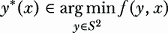

| 11.7 |
| --- |

其中 *S*² 是嵌入在实数空间 *R*³ 中的单位 2-球面，表示为 *S*²:= {*y* ∈ *R*³ | ||*y*||[2] =1}，而 *x* 是函数 *f* : *S*² × *X* → *R* 的某种参数化。||*y*||[2] 指的是向量 *y* 的欧几里得范数（也称为 *L2 范数* 或 *2-范数*）。关于摊销目标函数的更多细节可以在 Amos 的“关于在连续域上学习优化的摊销优化教程”中找到 [18]。

列表 11.3 展示了使用基于监督学习的摊销优化来解决在地球或其他空间上定义的函数的极值问题的步骤。我们将首先定义两个转换函数，`celestial_to_euclidean()` 和 `euclidean_to_celestial()`，它们将天球坐标（赤经 `ra` 和赤纬 `dec`）与欧几里得坐标（`x, y, z`）之间进行转换。

天球坐标系

天文或天球坐标系是用于指定天空中物体位置（如卫星、恒星、行星、星系和其他天体）的参考系。有几个天球坐标系，其中最常见的是赤道系统。在赤道系统中，赤经（RA）和赤纬（Dec）是用于确定天空中物体位置的两个数字。这些坐标与地球地理坐标系中使用的纬度和经度相似。

如下图中所示，赤经（RA）是以小时、分钟和秒（h:m:s）来测量的，并且与地球坐标系中的经度相似。赤经是从春分点（太阳在 3 月春分时穿过天赤道的点）沿天赤道向东测量的一个物体的角距离。天赤道是位于天球上的一个想象的大圆，位于与地球赤道相同的平面上。赤纬（Dec）是以度来测量的，表示一个物体在天赤道北或南的角距离。它与地球坐标系中的纬度相似。


具有赤经 10 小时和赤纬 30 度的示例点的天球坐标系

正赤纬用于天赤道以上的物体，负赤纬用于天赤道以下的物体。

`sphere_dist(x, y)` 函数计算欧几里得空间中球面上两点之间的黎曼距离（大圆距离）。这个距离代表两点之间最短（测地线）路径，沿着球面测量而不是穿过球体内部。该函数断言输入向量是二维的。然后它计算 *x* 和 *y* 的点积，并返回结果的反余弦值，这对应于 *x* 和 *y* 之间的角度。

列表 11.3 使用监督学习解决函数优化问题

```py
import torch
from torch import nn
import numpy as np
from tqdm import tqdm
import matplotlib.pyplot as plt

def celestial_to_euclidean(ra, dec):             ①
    x = np.cos(dec)*np.cos(ra)
    y = np.cos(dec)*np.sin(ra)
    z = np.sin(dec)
    return x, y, z

def euclidean_to_celestial(x, y, z):             ②
    sindec = z
    cosdec = (x*x + y*y).sqrt()
    sinra = y / cosdec
    cosra = x / cosdec
    ra = torch.atan2(sinra, cosra)
    dec = torch.atan2(sindec, cosdec)
    return ra, dec

def sphere_dist(x,y):                            ③
    if x.ndim == 1:
        x = x.unsqueeze(0)
    if y.ndim == 1:
        y = y.unsqueeze(0)
    assert x.ndim == y.ndim == 2
    inner = (x*y).sum(-1)
    return torch.arccos(inner)
```

① 将天球坐标转换为欧几里得坐标。

② 将欧几里得坐标转换为天球坐标。

③ 计算球面上两点之间的黎曼距离。

我们接着定义一个`c-convex`类作为`nn.Module`的子类，这使得它成为 PyTorch 中的一个可训练模型。Cohen 及其合作者在他们的“黎曼凸势映射”文章中将*c-凸*定义为在球面上定义的优化问题的合成类 [19]。`c-convex`类在球面上模拟一个具有`n_components`个分量的 c-凸函数，我们可以从中采样数据用于训练。`gamma`参数控制函数分量的聚合，`seed`用于初始化随机数生成器以实现可重复性。它还为 c-凸函数的每个分量生成随机参数`ys`（它们是 3D 空间中的单位向量）和`alphas`（它们是介于 0 和 0.7 之间的标量）。参数被连接成一个单一的`params`向量。`forward(xyz)`方法计算在点`xyz`处的 c-凸函数的值：

```py
class c_convex(nn.Module):                                                ①
    def __init__(self, n_components=4, gamma=0.5, seed=None):
        super().__init__()
        self.n_components = n_components
        self.gamma = gamma

        if seed is not None:                                              ②
            torch.manual_seed(seed)                                       ②
        self.ys = torch.randn(n_components, 3)                            ②
        self.ys = self.ys / torch.norm(self.ys, 2, dim=-1, keepdim=True)  ②
        self.alphas = .7*torch.rand(self.n_components)                    ②
        self.params = torch.cat((self.ys.view(-1), self.alphas.view(-1))) ②

    def forward(self, xyz):                                               ③
        cs = []                                                           ③
        for y, alpha in zip(self.ys, self.alphas):                        ③
            ci = 0.5*sphere_dist(y, xyz)**2 + alpha                       ③
            cs.append(ci)
        cs = torch.stack(cs)
        if self.gamma == None or self.gamma == 0.:
            z = cs.min(dim=0).values 
        else:
            z = -self.gamma*(-cs/self.gamma).logsumexp(dim=0) 
        return z
```

① 定义一个 c-凸函数。

② 样本随机参数。

③ 计算在球面上给定输入坐标 xyz 的 c-凸函数的输出。

作为前面代码的延续，我们定义了一个摊销模型，它接受一个参数向量作为输入，并输出表示球面上一点的 3D 向量。摊销模型使用神经网络来学习从参数空间到球面上点的 3D 空间的映射。代码还初始化了一个具有不同种子的`c_convex`对象列表，并设置了摊销模型的参数数量：

```py
seeds = [8,9,2,31,4,20,16,7]           ①
fs = [c_convex(seed=i) for i in seeds] ②
n_params = len(fs[0].params)           ③
```

① 创建一个表示不同种子的整数列表。

② 创建一个包含 c_convex 类不同实例的 fs 列表。

③ 设置第一个 c_convex 对象（fs[0]）的参数数量。

在以下代码中，摊销模型表示为`nn.Module`。神经网络被定义为包含三个具有 ReLU 激活函数的全连接（线性）层的前馈神经网络或多层感知器：

```py
class AmortizedModel(nn.Module):
    def __init__(self, n_params):            ①
        super().__init__()
        self.base = nn.Sequential(

            nn.Linear(n_params, n_hidden),
            nn.ReLU(inplace=True),
            nn.Linear(n_hidden, n_hidden),
            nn.ReLU(inplace=True),
            nn.Linear(n_hidden, 3)
        )                                    ②

    def forward(self, p):                    ③
        squeeze = p.ndim == 1
        if squeeze:
            p = p.unsqueeze(0)
        assert p.ndim == 2
        z = self.base(p)
        z = z / z.norm(dim=-1, keepdim=True)
        if squeeze:
            z = z.squeeze(0)
        return z
```

① 将用作神经网络输入的 c-凸函数中的参数数量

② 按顺序定义神经网络的层。

③ 定义摊销模型的前向传递，它将输入 p（参数向量）映射到球面上的一个点。

我们现在可以训练一个摊销模型来学习从参数向量到球面上点的映射。它使用具有不同随机种子的 c_convex 函数（fs）列表来生成训练数据。摊销模型使用 Adam 优化器进行训练，其进度使用 tqdm 进度条进行可视化。球面上的输出点存储在张量 xs 中：

```py
n_hidden = 128                                               ①
torch.manual_seed(0)                                         ②
model = AmortizedModel(n_params=n_params)                    ③
opt = torch.optim.Adam(model.parameters(), lr=5e-4)          ④

xs = []                                                      ⑤
num_iterations = 100

pbar = tqdm(range(num_iterations), desc="Training Progress")

for i in pbar:                                               ⑥
    losses = []                                              ⑦
    xis = []                                                 ⑦
    for f in fs:                                             ⑧
        pred_opt = model(f.params)
        xis.append(pred_opt)
        losses.append(f(pred_opt))
    with torch.no_grad():                                    ⑧
        xis = torch.stack(xis)
        xs.append(xis)
    loss = sum(losses)

    opt.zero_grad()
    loss.backward()
    opt.step()

    pbar.set_postfix({"Loss": loss.item()})

xs = torch.stack(xs, dim=1)
```

① 设置 AmortizedModel 神经网络的隐藏单元数量。

② 设置随机种子以确保训练过程的可重复性。

③ 创建 AmortizedModel 的一个实例。

④ 创建一个学习率为 0.0005 的 Adam 优化器来更新参数。

⑤ 存储每次训练迭代的球面上的输出点。

⑥ 训练循环

⑦ 存储每个 c_convex 函数及其对应的球面输出点（xis）的损失。

⑧ 遍历列表 fs 中的每个 c_convex 函数（f）。

训练完成后，所有预测的输出点沿新维度堆叠在球面上，从而得到一个形状为“迭代次数，c_convex 函数数量，3”的张量 xs。这个张量中的每个元素代表在训练的不同阶段由摊销模型预测的球面上的一个点。它生成了摊销模型和 c_convex 函数的训练进度可视化表示，如图 11.15 所示。


图 11.15 训练的摊销模型输出的示例

列表 11.3 的完整版本可在本书的 GitHub 仓库中找到。它创建了一个天体坐标网格，评估网格上的 c_convex 函数和摊销模型，然后绘制函数、预测路径和球面上的最优点的等高线图。最优点是给出最小损失的点，前提是使用监督学习来训练摊销模型。

## 11.7 使用监督图机器学习解决 TSP

Joshi、Laurent 和 Bresson 在他们的“图神经网络用于旅行商问题”文章[20]中提出了一种通用的端到端流程来解决组合优化问题，如旅行商问题（TSP）、车辆路径问题（VRP）、可满足性问题（SAT）、最大切割（MaxCut）和最大独立集（MIS）。图 11.16 显示了使用机器学习解决 TSP 的步骤。


图 11.16 组合优化问题的端到端流程

按照这种方法，我们首先以节点特征和节点之间的邻接矩阵的形式定义图问题。然后，基于消息传递方法，使用 GNN 或 GCN 生成低维图嵌入。使用多层感知器（MLPs）预测节点或边属于解决方案的概率。然后，应用图搜索，如束搜索（见第四章），通过边的概率分布搜索图，以找到可行的候选解决方案。应用模仿学习（监督学习）和探索学习（强化学习）。监督学习最小化最优解（在 TSP 的情况下，由 Concorde 等知名求解器获得）与模型预测之间的损失。强化学习方法使用策略梯度来最小化解码结束时模型预测的旅行长度。强化学习将在下一章讨论。

从头开始训练一个机器学习模型并将其应用于解决 TSP 需要大量的代码和数据预处理。列表 11.4 展示了如何使用预训练模型来解决 TSP 的不同实例。我们首先导入我们将使用的库和模块。这些库提供了处理数据、执行计算、可视化和优化的功能。Gurobi 库用于优化过程中的子回路消除以及计算一组点的降低成本（见附录 A）。我们设置`CUDA_DEVICE_ORDER`和`CUDA_VISIBLE_DEVICES`环境变量以控制 GPU 设备的可见性。

列表 11.4 使用监督机器学习解决 TSP

```py
import os
import math
import itertools
import numpy as np
import networkx as nx
from scipy.spatial.distance import pdist, squareform
import seaborn as sns
import matplotlib.pyplot as plt

import torch
from torch.utils.data import DataLoader
from torch.nn import DataParallel

from learning_tsp.problems.tsp.problem_tsp import TSP
from learning_tsp.utils import load_model, move_to

from gurobipy import *

os.environ["CUDA_DEVICE_ORDER"] = "PCI_BUS_ID" 
os.environ["CUDA_VISIBLE_DEVICES"] = "0" 
```

作为延续，以下`opts`类包含几个类级别属性，定义了以下选项和配置：

+   `dataset path`—书中 GitHub 仓库中可用的 TSP 数据集。

+   `batch size`—这决定了在训练或评估期间同时处理的 TSP 实例（问题）数量。它指定了将多少个 TSP 实例分组在一起并行处理。

+   `number of samples`—这是每个 TSP 大小下的样本数量。

+   `neighbors`—在 TSP 数据处理管道中使用，用于指定用于图稀疏化的最近邻的比例（百分比）。它通过为每个节点选择最近邻的子集来控制 TSP 图的连通性。

+   `knn strategy`—这是在执行图稀疏化时确定最近邻数量的策略。在代码中，`'percentage'`值表示最近邻的数量由`neighbors`参数确定，该参数指定了要考虑的邻居百分比。

+   `model`—这是预训练机器学习模型的路径。所使用的模型是书中 GitHub 仓库中可用的预训练 GNN 模型。

+   `use_cuda`—这检查系统上是否有 CUDA 可用。CUDA 是一个并行计算平台和编程模型，允许在 NVIDIA GPU 上高效执行计算。`torch.cuda.is_available()`返回一个布尔值（true 或 false），指示 CUDA 是否可用。如果 CUDA 可用，则表示系统上存在兼容的 NVIDIA GPU，并且可以用于加速计算。

+   `device`—这是用于计算的设备：

```py
class opts:
    dataset_path = "learning_tsp/data/tsp20-50_concorde.txt"
    batch_size = 16
    num_samples = 1280 

    neighbors = 0.20
    knn_strat = 'percentage'

    model = 
➥ "learning_tsp/pretrained/tspsl_20-50/sl-ar-var-20pnn-gnn-max_20200308T172931"

    use_cuda = torch.cuda.is_available()
    device = torch.device("cuda:0" if use_cuda else "cpu")
```

下一步是使用 TSP 类和以下参数创建一个数据集对象：

+   `filename`—要使用的数据集的路径或文件名，由`opts .dataset_path`指定

+   `batch_size`—每个批次中包含的样本数量，由`opts.batch_size`指定

+   `num_samples`—要在数据集中包含的总样本数量，由`opts.num_samples`指定

+   `neighbors`—表示用于图稀疏化的最近邻数量的值，由`opts.neighbors`指定

+   `knn_strat`—选择最近邻的策略（`'percentage'`或`None`），由`opts.knn_strat`指定

+   `supervised`—一个布尔值，指示数据集是否用于监督学习，设置为`True`

`make_dataset`方法创建 TSP 数据集类的实例，并用提供的参数初始化它，返回`dataset`对象：

```py
dataset = TSP.make_dataset(
    filename=opts.dataset_path, batch_size=opts.batch_size,
➥ num_samples=opts.num_samples, 
➥ neighbors=opts.neighbors, knn_strat=opts.knn_strat, supervised=True
)
```

以下行创建了一个数据加载器对象，它允许以批处理方式方便地迭代数据集，这在评估期间处理数据时很有用。上一行创建的`dataset`对象将用作数据源。您还可以提供其他可选参数来自定义数据加载器的行为，例如`shuffle`（用于打乱数据）和`num_workers`（用于指定数据加载的工作进程数）：

```py
dataloader = DataLoader(dataset, batch_size=opts.batch_size, shuffle=False,
➥ num_workers=0)
```

现在我们可以加载训练好的模型并将其分配给`model`变量。如果模型被`torch.nn.DataParallel`包装，它将通过访问`model.module`提取底层模块。`DataParallel`是 PyTorch 的一个包装器，它允许在多个 GPU 上并行执行模型。如果模型确实是`DataParallel`的实例，它将通过访问`module`属性提取底层模型模块。这一步是必要的，以确保在访问模型属性和方法时保持一致的行为。然后设置模型的解码类型为`"greedy"`。这意味着在推理或评估期间，模型应使用贪婪解码策略来生成输出预测：

```py
model, model_args = load_model(opts.model, extra_logging=True) ①
model.to(opts.device)

if isinstance(model, DataParallel):                            ②
    model = model.module                                       ②

model.set_decode_type("greedy")                                ③

model.eval()                                                   ④
```

① 加载预训练模型。

② 提取底层模块。

③ 将模型的解码类型设置为"greedy"。

④ 将模型的模式设置为评估模式

列表 11.4 的完整版本，包括可视化代码，可在本书的 GitHub 仓库中找到。图 11.17 显示了预训练 ML 模型为 TSP50 实例生成的输出。

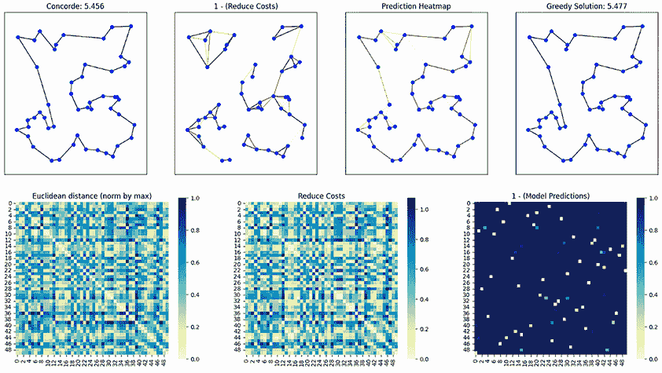

图 11.17 使用预训练 ML 模型的 TSP50 解决方案

该图显示了与 TSP 实例和模型预测相关的以下七个图表：

+   *Concorde*—左上角的图表显示了 Concorde 求解器生成的真实解决方案，Concorde 是解决 TSP 实例以最优性为目的的分支和切割算法的高效实现。它显示 TSP 问题的节点作为由边连接的圆圈，代表 Concorde 计算出的最优回路。图表的标题表明了从 Concorde 获得的路程（成本）长度。

+   *1 - (降低成本)*—第二个图表包含最短子回路，并使用 Gurobi 优化库显示了这些子回路中点的降低成本。它以红色线条显示 TSP 的边，边颜色表示降低的成本值。

+   *预测热图*—第三个图表展示了模型对 TSP 问题的预测的热图可视化。它使用颜色尺度来表示边的预测概率，较高的概率以较深的阴影显示。

+   *贪婪解*—第四幅图展示了 ML 模型使用贪婪解码策略生成的解决方案。它显示了通过边连接的 TSP 问题的节点，代表模型获得的路线。图的标题显示了模型计算出的路线长度（成本）。

+   *欧几里得距离（最大值归一化）*—左下角的图是 TSP 问题中节点之间欧几里得距离的热力图可视化。它使用颜色尺度来表示距离，较浅的色调表示较小的距离。

+   *降低成本*—中间下方的图是 TSP 问题中边降低成本的热力图表示。它以颜色尺度显示降低的成本，较低值以较浅的色调显示。

+   *1 - (模型预测)*—右下角的图展示了模型对 TSP 问题预测的热力图可视化，类似于第三幅图。然而，在这种情况下，热力图通过从 1 减去模型的预测概率来显示“1 - (模型预测)”。较深的色调代表较低的概率，表明对边选择的信心更强。

本例演示了如何使用预训练的 GNN 模型来解决 TSP。图 11.17 显示了模型解决方案与 Concorde TSP 求解器对包含 50 个兴趣点的 TSP 实例结果的并排显示。更多信息及完整代码，包括模型训练步骤，可在“Learning the Travelling Salesperson Problem Requires Rethinking Generalization” GitHub 仓库[21]中找到。

## 11.8 使用无监督机器学习解决 TSP

作为无监督 ML 方法的一个例子，列表 11.5 展示了我们如何使用自组织映射（SOMs）来解决 TSP。我们首先导入我们将使用的库。一些辅助函数是从 Vicente 的博客文章[22]中描述的 som-tsp 实现导入的，用于读取 TSP 实例、获取邻域、获取路线、选择最近的候选者以及计算路线距离和绘制路线。我们从提供的 URL 读取 TSP 实例，并获取城市并将它们的坐标归一化到[0, 1]范围内。

列表 11.5 使用无监督学习解决 TSP

```py
import numpy as np
import matplotlib.pyplot as plt
from matplotlib.animation import FuncAnimation
from IPython.display import HTML
import requests
import os
from tqdm import tqdm

from som_tsp.helper import read_tsp, normalize, get_neighborhood, get_route,
➥ select_closest, route_distance, plot_network, plot_route

url = 'https://raw.githubusercontent.com/Optimization-Algorithms-Book/Code-
➥Listings/256207c4a8badc0977286c48a6e1cfd33237a51d/Appendix%20B/data/TSP/' ①

tsp='qa194.tsp'                                                             ②

response = requests.get(url+tsp)                                            ③
response.raise_for_status()                                                 ③
problem_text = response.text                                                ③
with open(tsp, 'w') as file:                                                ③
    file.write(problem_text)                                                ③

problem = read_tsp(tsp)                                                     ④

cities = problem.copy()                                                     ⑤
cities[['x', 'y']] = normalize(cities[['x', 'y']])                          ⑤
```

① 定义 TSP 实例所在的 URL。

② TSP 实例

③ 如果不存在，则下载文件。

④ 读取 TSP 问题。

⑤ 获取归一化的城市集合（坐标在[0,1]范围内）。

我们现在可以设置各种参数并初始化 SOM 的神经元网络：

```py
number_of_neurons = cities.shape[0] * 8         ①

iterations = 12000                              ②

learning_rate=0.8                               ③
network = np.random.rand(number_of_neurons, 2)  ④
```

① 种群大小是城市数量的 8 倍。

② 设置迭代次数。

③ 设置学习率。

④ 生成足够的神经元网络。

作为延续，以下代码片段实现了 SOM 的训练循环。此循环使用`tqdm`显示进度条，遍历指定的训练迭代次数：

```py
route_lengths = []                                                        ①
paths_x = []                                                              ②
paths_y = []                                                              ②

for i in tqdm(range(iterations)):                                         ③
    if not i % 100:
        print('\t> Iteration {}/{}'.format(i, iterations), end="\r")      ④

    city = cities.sample(1)[['x', 'y']].values                            ⑤
    winner_idx = select_closest(network, city)                            ⑥

    gaussian = get_neighborhood(winner_idx, number_of_neurons // 10, 
➥  network.shape[0])                                                      ⑦

    network += gaussian[:, np.newaxis] * learning_rate * (city - network) ⑧

    paths_x.append(network[:, 0].copy())                                  ⑨
    paths_y.append(network[:, 1].copy())                                  ⑨

    learning_rate = learning_rate * 0.99997                               ⑩
    number_of_neurons = number_of_neurons * 0.9997                        ⑩

    if not i % 1000:                                                      ⑪
        plot_network(cities, network, name='diagrams/{:05d}.png'.format(i))

    if number_of_neurons < 1:                                             ⑫
        print('Radius has completely decayed, finishing execution',
              ➥ 'at {} iterations'.format(i))
        break
    if learning_rate < 0.001:
        print('Learning rate has completely decayed, finishing execution',
              ➥ 'at {} iterations'.format(i))
        break

    route = get_route(cities, network)                                    ⑬
    problem = problem.reindex(route)                                      ⑬
    distance = route_distance(problem)                                    ⑬
    route_lengths.append(distance)                                        ⑬

else:
    print('Completed {} iterations.'.format(iterations))                  ⑭
```

① 在 SOM 训练迭代过程中存储 TSP 路线的长度。

② 在训练迭代过程中存储网络中神经元的 x 和 y 坐标。

③ 训练循环

④ 只有当当前迭代索引是 100 的倍数时才打印。

⑤ 选择一个随机城市。

⑥ 在 SOM 网络中找到最接近随机选择城市的神经元的索引（获胜者）。

⑦ 生成一个应用于获胜者高斯滤波器的过滤器。

⑧ 更新网络的权重。

⑨ 将当前坐标附加到路径上。

⑩ 在每次迭代中衰减学习率和邻域半径 n，以逐渐减少高斯滤波器随时间对高斯滤波器的影响。

⑪ 检查绘图间隔。

⑫ 检查是否有任何参数已经完全衰减。

⑬ 计算距离，并将其存储在 route_lengths 列表中。

⑭ 指示已完成的指定数量的训练迭代次数。

以下代码片段绘制了每次迭代的路线长度。

```py
plt.figure(figsize=(8, 6))
plt.plot(range(len(route_lengths)), route_lengths, label='Route Length')
plt.xlabel('Iterations')
plt.ylabel('Route Length')
plt.title('Route Length per Iteration')
plt.grid(True)
plt.show()
```

图 11.18 展示了每次迭代的路线长度。最终路线长度为 9,816，卡塔尔 TSP 实例使用的最优长度为 `qa194.tsp`，为 9,352。


图 11.18 SOM 对卡塔尔 TSP 的迭代路线长度。最终路线长度为 9,816，最优解为 9,352。

列表 11.5 的完整版本可在本书的 GitHub 仓库中找到，它包含基于 MiniSom 的实现。MiniSom 是 SOM 的最小化、基于 Numpy 的实现。您可以使用 `!pip install minisom` 安装此库。然而，MiniSom 获得的路线为 11,844.47，这远远低于此 TSP 实例的最优长度 9,352。为了提高结果，您可以尝试提供的代码并尝试调整 SOM 参数，如神经元数量、sigma、学习率和迭代次数。

## 11.9 寻找凸包

Ptr-Net 可以使用监督学习方法来解决凸包问题，如 Vinyals 及其合著者在他们的“指针网络”文章 [10] 中所述。Ptr-Net 有两个关键组件：一个编码器和一个解码器，如图 11.19 所示。

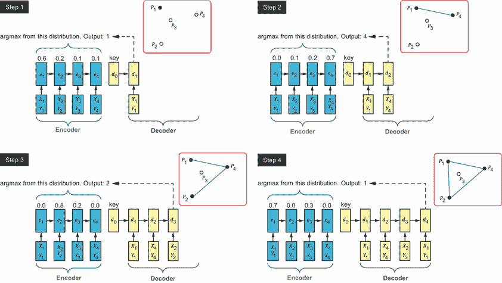

图 11.19 使用 Ptr-Net 解决凸包问题。每一步的输出是指向最大化概率分布的输入的指针。

编码器，一个循环神经网络（RNN），将原始输入序列转换为。在这种情况下，它将我们想要确定凸包的点协调到更易于管理的表示。

此编码向量随后传递给解码器。该向量作为基于内容注意力机制的内容调节器，该机制应用于输入。基于内容的注意力机制可以比作一个聚光灯，在不同时间突出显示输入数据的各个部分，专注于手头任务的最相关部分。

此注意力机制的输出是一个具有与输入长度相等的字典大小的 softmax 分布。这个 softmax 分布为输入序列中的每个点分配概率。这种设置允许 Ptr-Net 在每一步以概率方式决定下一个应该添加到凸包的点。这是基于当前输入状态和网络内部状态确定的。训练过程重复进行，直到网络为每个点做出决定，从而得到凸包问题的完整解决方案。

列表 11.6 展示了使用指针网络解决凸包问题的步骤。我们首先导入几个必要的库和模块，如 torch、numpy 和 matplotlib。根据 McGough 在“Transformer 中的指针网络”文章 [23] 中提供的实现，导入三个辅助类 `Data`、`ptr_net` 和 `Disp`。它们包含生成训练和验证数据、定义指针网络架构和可视化结果的功能。此代码为训练和验证分别生成两个数据集。这些数据集由随机的 2D 点组成，每个样本中的点数（凸包问题的输入）介于 `min_samples` 和 `max_samples` 之间。`Scatter2DDataset` 是一个自定义数据集类，用于生成这些随机的 2D 点数据集。

列表 11.6 使用指针网络解决凸包问题

```py
import numpy as np
import torch
from torch.utils.data import DataLoader
import matplotlib.pyplot as plt
from scipy.spatial import ConvexHull

from ptrnets.Data import display_points_with_hull, cyclic_permute, 
➥ Scatter2DDataset,Disp_results
from ptrnets.ptr_net import ConvexNet, AverageMeter, masked_accuracy,
➥ calculate_hull_overlap

min_samples = 5
max_samples = 50
n_rows_train = 100000
n_rows_val = 1000

torch.random.manual_seed(231)
train_dataset = Scatter2DDataset(n_rows_train, min_samples, max_samples)
val_dataset = Scatter2DDataset(n_rows_val, min_samples, max_samples)
```

运行此代码生成 100,000 个训练点和 1,000 个验证点。然后我们可以设置指针网络的参数。这些参数包括一个包含以下标记的 `TOKENS` 字典：

+   `<eos>`—索引为 0 的序列结束标记

+   `c_inputs`—模型输入特征的数量

+   `c_embed`—嵌入维度数量

+   `c_hidden`—模型中的隐藏单元数量

+   `n_heads`—多头自注意力机制中的注意力头数量

+   `n_layers`—模型中的层数

+   `dropout`—Dropout 概率，用于正则化

+   `use_cuda`—一个布尔标志，指示是否使用 CUDA（GPU）或 CPU

+   `n_workers`—DataLoader 中数据加载的工作线程数量

训练参数包括 `n_epochs`（训练轮数）、`batch_size`（训练期间使用的批量大小）、`lr`（优化器的学习率）和 `log_interval`（记录训练进度的间隔）。代码检查 CUDA（GPU）是否可用，并相应地设置 `device` 变量：

```py
TOKENS = {'<eos>': 0 } 
c_inputs = 2 + len(TOKENS)
c_embed = 16
c_hidden = 16
n_heads = 4
n_layers = 3
dropout = 0.0
use_cuda = True
n_workers = 2
n_epochs = 5
batch_size = 16
lr = 1e-3
log_interval = 500
device = torch.device("cuda" if torch.cuda.is_available() and use_cuda else "cpu")
```

作为延续，我们使用指定的 `batch_size` 和 `num_workers` 加载训练和验证数据：

```py
train_loader = DataLoader(train_dataset, batch_size=batch_size,
➥  num_workers=n_workers)

val_loader = DataLoader(val_dataset, batch_size=batch_size,
➥  num_workers=n_workers)
```

`ConvexNet` 模型是一个 Ptr-Net 模型，它被实现为一个具有编码器和解码器的转换器架构，使用 `nn.TransformerEncoderLayer` 并应用多头自注意力。完整的代码在书籍的 GitHub 仓库中的 `ptr_net.py` 类中可用。该模型使用预定义的超参数初始化。`AverageMeter` 类用于在训练和验证期间跟踪平均损失和准确率：

```py
model = ConvexNet(c_inputs=c_inputs, c_embed=c_embed, n_heads=n_heads,
➥  n_layers=n_layers, dropout=dropout, c_hidden=c_hidden).to(device) ①

optimizer = torch.optim.Adam(model.parameters(), lr=lr)               ②
criterion = torch.nn.NLLLoss(ignore_index=TOKENS['<eos>'])            ③

train_loss = AverageMeter()                                           ④
train_accuracy = AverageMeter()                                       ④
val_loss = AverageMeter()                                             ④
val_accuracy = AverageMeter()                                         ④
```

① 创建 ConvexNet 模型。

② 使用 Adam 优化器来训练模型。

③ 使用负对数似然损失作为损失函数。

④ 在训练和验证期间跟踪平均损失和准确率。

我们现在可以使用 PyTorch 对模型（`ConvexNet`）执行训练和评估循环。模型在具有已知标签的 `train_loader` 数据集上训练，并在 `val_loader` 数据集上评估：

```py
for epoch in range(n_epochs): 
  model.train()                                                         ①
  for bat, (batch_data, batch_labels, batch_lengths) in enumerate(train_loader):                                                                ②
    batch_data = batch_data.to(device)
    batch_labels = batch_labels.to(device)
    batch_lengths = batch_lengths.to(device)

    optimizer.zero_grad()                                               ③
    log_pointer_scores, pointer_argmaxs = model(batch_data, batch_lengths, 
➥    batch_labels=batch_labels) 
    loss = criterion(log_pointer_scores.view(-1, log_pointer_scores.    ④
➥ shape[-1]), batch_labels.reshape(-1))

    assert not np.isnan(loss.item()), 'Model diverged with loss = NaN'  ⑤

    loss.backward()                                                     ⑥
    optimizer.step()                                                    ⑥

    train_loss.update(loss.item(), batch_data.size(0))                  ⑦
    mask = batch_labels != TOKENS['<eos>']                              ⑦
    acc = masked_accuracy(pointer_argmaxs, batch_labels, mask).item()   ⑦
    train_accuracy.update(acc, mask.int().sum().item())                 ⑦

    if bat % log_interval == 0:                                         ⑧
      print(f'Epoch {epoch}: '
            f'Train [{bat * len(batch_data):9d}/{len(train_dataset):9d} '
            f'Loss: {train_loss.avg:.6f}\tAccuracy: {train_accuracy.avg:3.4%}')
```

① 训练模型。

② 迭代训练数据批次。

③ 将模型的参数梯度设置为零，以避免来自先前批次的累积。

④ 计算损失

⑤ 一个安全检查，以确保训练过程中的损失值不是 NaN。

⑥ 执行反向传播和优化步骤。

⑦ 更新训练损失和准确率。

⑧ 打印训练进度。

作为延续，训练好的模型（model）在验证数据集（val_dataset）上评估，以计算验证损失、准确率和输入数据凸包与预测指针序列之间的重叠。我们首先将模型设置为评估模式，其中模型的参数被冻结，批量归一化或 dropout 层的行为与训练期间不同。然后代码通过 val_loader 迭代验证数据集，val_loader 提供数据批次（batch_data）、真实标签（batch_labels）和每个序列的长度（batch_lengths）：

```py
model.eval()                                                         ①
  hull_overlaps = []                                                 ②
  for bat, (batch_data, batch_labels, batch_lengths) 
  ➥ in enumerate(val_loader):                                       ③
    batch_data = batch_data.to(device)
    batch_labels = batch_labels.to(device)
    batch_lengths = batch_lengths.to(device)
    log_pointer_scores, pointer_argmaxs = model(batch_data, batch_lengths,
➥      batch_labels=batch_labels)                                   ④
    loss = criterion(log_pointer_scores.view(-1, log_pointer_scores. ⑤
➥ shape[-1]),batch_labels.reshape(-1)) 

    assert not np.isnan(loss.item()), 'Model diverged with loss = NaN'
    val_loss.update(loss.item(), batch_data.size(0))                  ⑥
    mask = batch_labels != TOKENS['<eos>']                            ⑦
    acc = masked_accuracy(pointer_argmaxs, batch_labels, mask).item() ⑧
    val_accuracy.update(acc, mask.int().sum().item())                 ⑨

for data, length, ptr in zip(batch_data.cpu(), batch_lengths.cpu(),
➥        pointer_argmaxs.cpu()):                                     ⑩
      hull_overlaps.append(calculate_hull_overlap(data, length, ptr)) ⑪
  print(f'Epoch {epoch}: Val\tLoss: {val_loss.avg:.6f} '
        f'\tAccuracy: {val_accuracy.avg:3.4%} '
        f'\tOverlap: {np.mean(hull_overlaps):3.4%}')                  ⑫
  train_loss.reset()                                                  ⑬
  train_accuracy.reset()                                              ⑬
  val_loss.reset()                                                    ⑬
  val_accuracy.reset()                                                ⑬
```

① 将模型设置为评估模式。

② 初始化一个空列表来存储输入数据凸包与预测指针序列之间的重叠值。

③ 迭代验证数据集。

④ 生成指针得分和 argmax 预测。

⑤ 计算验证损失。

⑥ 更新验证损失。

⑦ 忽略 batch_labels 中存在 `<eos>` 标记的位置的损失贡献。

⑧ 计算掩码准确率。

⑨ 更新验证准确率。

⑩ 迭代每个批次的 数据、长度和指针 argmax 预测。

⑪ 计算输入数据凸包与预测指针序列之间的重叠。

⑫ 打印每个时期的验证损失、准确率和平均重叠。

⑬ 重置指标。

您可以使用 `Disp_results` 辅助函数显示训练和验证损失以及准确率的结果：

```py
Disp_results(train_loss, train_accuracy, val_loss, val_accuracy, n_epochs)
```

上述代码行将生成如下输出：

```py
Best Scores:
train_loss: 0.0897 (ep: 9)
train_accuracy 96.61% (ep: 9)
val_loss: 0.0937 (ep: 7)
val_accuracy: 96.54% (ep: 7)
```

在模型训练和验证之后，我们可以测试模型。以下测试函数将评估训练好的模型（`model`）在测试数据集上的表现。该函数评估模型在不同测试样本大小下的准确率和与凸包的重叠。此测试函数接受模型、测试样本数量和每个样本中的点数作为输入。代码通过从 5 到 45 以 5 为步长迭代每个样本中的点数（`i`）来执行测试。`AverageMeter`类用于在测试期间跟踪平均损失和准确率：

```py
n_rows_test = 1000                                                            ①

def test(model, n_rows_test, n_per_row):                                      ②
  test_dataset = Scatter2DDataset(n_rows_test, n_per_row, n_per_row)          ③
  test_loader = DataLoader(test_dataset, batch_size=batch_size,               ③
   ➥ num_workers=n_workers)                                                  ③

  test_accuracy = AverageMeter()
  hull_overlaps = []
  model.eval()

  for _, (batch_data, batch_labels, batch_lengths) in enumerate(test_loader): ④
    batch_data = batch_data.to(device)
    batch_labels = batch_labels.to(device)
    batch_lengths = batch_lengths.to(device)

    _, pointer_argmaxs = model(batch_data, batch_lengths)

    val_loss.update(loss.item(), batch_data.size(0))                          ⑤
    mask = batch_labels != TOKENS['<eos>']                                    ⑤
    acc = masked_accuracy(pointer_argmaxs, batch_labels, mask).item()         ⑤
    test_accuracy.update(acc, mask.int().sum().item())                        ⑤

    for data, length, ptr in zip(batch_data.cpu(), batch_lengths.cpu(),       ⑥
       ➥ pointer_argmaxs.cpu()):                                             ⑥
      hull_overlaps.append(calculate_hull_overlap(data, length, ptr))         ⑥

  print(f'# Test Samples: {n_per_row:3d}\t '                                  ⑦
        f'\tAccuracy: {test_accuracy.avg:3.1%} '                              ⑦
        f'\tOverlap: {np.mean(hull_overlaps):3.1%}')                          ⑦

for i in range(5,50,5):                                                       ⑧
  test(model, n_rows_test, i)                                                 ⑧
```

① 设置每个测试要生成的测试样本数量。

② 测试函数

③ 生成测试数据集。

④ 遍历测试数据批次。

⑤ 跟踪损失和准确率。

⑥ 更新凸包和预测指针序列之间的重叠。

⑦ 打印准确率和重叠率。

⑧ 遍历并打印不同样本大小的结果。

此代码将产生如下输出：

```py
# Test Samples:   5     Accuracy: 54.8%     Overlap: 43.7%
# Test Samples:  10     Accuracy: 72.1%     Overlap: 79.1%
# Test Samples:  15     Accuracy: 79.0%     Overlap: 90.1%
# Test Samples:  20     Accuracy: 84.8%     Overlap: 92.7%
# Test Samples:  25     Accuracy: 80.6%     Overlap: 92.3%
# Test Samples:  30     Accuracy: 80.3%     Overlap: 91.6%
# Test Samples:  35     Accuracy: 77.8%     Overlap: 91.9%
# Test Samples:  40     Accuracy: 75.8%     Overlap: 92.1%
# Test Samples:  45     Accuracy: 72.4%     Overlap: 90.4%
```

现在让我们测试训练好的模型，看看这个模型对新未见数据的泛化能力如何。我们将使用包含 50 个点的数据集来测试训练和验证好的模型，并计算预测轮廓和通过 SciPy 获得的真实轮廓之间的凸包重叠。我们将输入数据批次及其长度通过模型来获得指针网络的预测分数（`log_pointer_scores`）和 argmax 索引（`pointer_argmaxs`）。真实值是通过从`scipy.spatial`的`ConvexHull`函数获得的凸包：

```py
idx = 0
n_per_row = 50                                                             ①

test_dataset = Scatter2DDataset(n_rows_test, n_per_row, n_per_row)         ②
test_loader = DataLoader(test_dataset, batch_size=batch_size,              ③
➥  num_workers=n_workers)                                                 ③
batch_data, batch_labels, batch_lengths = next(iter(test_loader))
print(batch_data.shape,batch_lengths.shape) 
log_pointer_scores, pointer_argmaxs = model(batch_data.to(device),
➥  batch_lengths.to(device))                                              ④
pred_hull_idxs = pointer_argmaxs[idx].cpu()                                ⑤
pred_hull_idxs = pred_hull_idxs[pred_hull_idxs > 1] – 2                    ⑥
points = batch_data[idx, 2:batch_lengths[idx], :2]                         ⑦
points1 = batch_data[idx, 1:batch_lengths[idx], :2]                        ⑦
print(points.shape,)                                                       ⑦
true_hull_idxs = ConvexHull(points).vertices.tolist()                      ⑧
true_hull_idxs = cyclic_permute(true_hull_idxs, np.argmin(true_hull_idxs)) ⑧

overlap = calculate_hull_overlap(batch_data[idx].cpu(), batch_lengths[idx].cpu(),
➥  pointer_argmaxs[idx].cpu())                                             ⑨

print(f'Predicted: {pred_hull_idxs.tolist()}')                             ⑩
print(f'True:      {true_hull_idxs}')                                      ⑩
print(f'Hull overlap: {overlap:3.2%}')                                     ⑩
```

① 设置每个样本中的点数。

② 创建测试数据集。

③ 从测试数据集中加载第一批次的数据。

④ 获得指针网络的预测分数和 argmax 索引。

⑤ 从批次中提取所选样本的预测 argmax 索引。

⑥ 过滤掉特殊标记（例如，<eos>）并调整索引以正确索引点。

⑦ 从批次中提取并打印所选样本的 2D 点。

⑧ 真实凸包

⑨ 计算凸包重叠。

⑩ 打印预测凸包索引、凸包索引和重叠百分比的列表。

运行代码将产生如下输出。您可以多次运行前面的代码片段以获得高重叠率：

```py
torch.Size([16, 51, 3]) torch.Size([16])
torch.Size([49, 2])
Predicted: [0, 3, 5, 31, 45, 47, 48, 40, 10]
True:      [0, 3, 5, 31, 45, 47, 48, 40, 10]
Hull overlap: 100.00%
```

以下代码片段可用于可视化由指针网络（`ConvexNet`）生成的凸包与由`scipy.spatial`作为真实值生成的凸包之间的比较：

```py
plt.rcParams['figure.figsize'] = (10, 6)                ①
plt.subplot(1, 2, 1)                                    ①

true_hull_idxs = ConvexHull(points).vertices.tolist()   ②
display_points_with_hull(points, true_hull_idxs)        ③
_ = plt.title('SciPy Convex Hull')                      ③

plt.subplot(1, 2, 2)                                    ④
display_points_with_hull(points, pred_hull_idxs)        ⑤
_ = plt.title('ConvexNet Convex Hull')                  ⑤
```

① 设置默认的图形大小，并创建第一个子图。

② 使用`scipy.spatial`的`ConvexHull`函数计算一组点（points）的凸包。

③ 在第一个子图中显示点和它们的凸包。

④ 创建第二个子图。

⑤ 显示由 ConvexNet 生成的点和凸包。

图 11.20 显示了 SciPy 和 ConvexNet 生成的凸包。在某些情况下，这些凸包是相同的（即，凸包重叠=100.00%），但要实现这种一致性需要适当的训练和仔细调整 ConvexNet 参数。

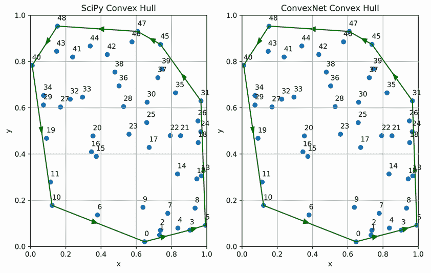

图 11.20 SciPy 和 Ptr-Net 为 50 个点生成的凸包

本章在机器学习方面提供了一个基本的基础，并讨论了监督和无监督机器学习在处理优化问题中的应用。下一章将重点介绍强化学习，并深入探讨其在解决优化问题中的实际应用。

## 摘要

+   机器学习（ML）是人工智能（AI）的一个分支，它赋予人工系统或过程从经验和观察中学习的能力，而不是通过明确的编程。

+   深度学习（DL）是机器学习的一个子集，它通过使用深度神经网络来检测数据中的固有特征。这使得人工系统能够从更简单的概念中形成复杂的概念。

+   几何深度学习（GDL）扩展（结构化）深度神经网络以处理具有潜在几何结构的非欧几里得数据，例如图、点云和流形。

+   图机器学习（GML）是机器学习的一个子领域，专注于开发能够从图结构数据中学习的算法和模型。

+   图嵌入表示将离散、高维图域转换为低维连续域的过程。

+   注意力机制允许模型在生成输出序列的过程中有选择性地关注输入数据的一定部分。

+   指针网络（Ptr-Net）是一种具有注意力机制的序列到序列模型变体，旨在处理可变大小的输入数据序列。

+   自组织图（SOM），也称为 Kohonen 图，是一种用于无监督学习的人工神经网络（ANN）。SOM 与其他类型的 ANN 不同，因为它们应用竞争学习而不是错误纠正学习（如梯度下降的反向传播）。

+   神经组合优化是指将机器学习应用于解决组合优化问题。

+   利用机器学习（ML）进行组合优化可以通过三种主要方法实现：端到端学习，其中模型直接制定解决方案；使用机器学习来配置和改进优化算法；以及将机器学习与优化算法集成，其中模型根据其当前状态持续引导优化算法。
