# 附录 C. 练习和解答

在本附录中，您将找到一套全面的练习及其相应的解答，按章节组织，以增强您对本书中所呈现材料的概念、理论和实际技能的理解和应用。这些练习旨在加强全书各章节中涵盖的概念、理论和实践技能。

## C.1 第二章：深入探讨搜索和优化

### C.1.1 练习

1.   多项选择题：为以下每个问题选择正确的答案。

1.1.   _________ 是一类可以通过非确定性多项式算法解决的问题，其解决方案难以找到但易于验证。

a.  P

b.  NP

c.  co-NP

d.  NP-complete

e.  NP-hard

1.2.   以下哪个基准（玩具）问题不是 NP-complete？

a.  二进制装箱

b.  背包问题

c.  最小生成树

d.  汉密尔顿回路

e.  顶点覆盖问题

1.3.   _________ 是一类决策问题，其“否”答案可以在多项式时间内验证。

a.  P

b.  NP

c.  co-NP

d.  NP-complete

e.  NP-hard

1.4.   以下哪个现实世界问题是 NP-hard？

a.  图像匹配

b.  单机调度

c.  组合等价性检查

d.  容量车辆路径问题（CVRP）

e.  容器/卡车装载

1.5.   _________ 是一种理论，它专注于根据资源使用情况对计算问题进行分类，并将这些类别相互关联。

a.  优化复杂度

b.  时间复杂度

c.  计算复杂度

d.  运筹学

e.  决策复杂度

2.   用决策变量（单变量，双变量，多变量）；目标函数（单目标，多目标，无目标函数，或约束满足问题）；约束；（硬约束，软约束，硬软约束，无约束）；以及线性（线性规划（LP），二次规划（QP），非线性规划（NLP））来描述以下搜索和优化问题。

a.  最小化 *y* + cos(*x*²), sin(*x*) – *x × y*，以及 1 / (*x* + *y*)²

b.  在 –3 ≤ *x* *< 10* 的约束下最大化 2 – e^((1 –) *^x*^)

c.  在 –2 ≤ *x* < 3, 0 < *y* ≤ 3, 和 *x* + *y* = 4 的约束下最大化 3 *× x* – *y* / 5

d.  学校区域划分问题包括确定在给定区域内学校委员会所属的每个学校的学生群体，以最大化学校区域连续性，同时考虑一系列硬约束，如每个年级的学校容量和班级容量。在这个问题中，步行可达性和保持学生每年在同一个学校被认为是软约束。

e. 背包问题是一个组合问题示例，其解决方案形式为组合，其中顺序不重要。如图 C.1 所示，给定一组物品，每个物品都有效用和重量，任务是选择物品的子集以最大化总效用，同时确保所选物品的总重量不超过预定义的容量。是否包含或排除每个物品的决定是二元的。

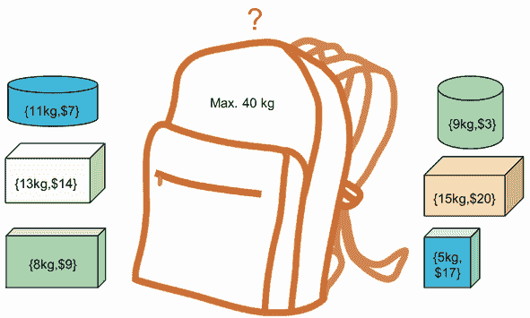

图 C.1 每个物品都有效用和重量，我们希望最大化背包内容的效用。该问题受背包容量的限制。

3. 对于以下优化问题，根据解决问题的允许时间和预期解决方案的质量，基于问题类型（设计、规划或控制问题）提出适当的算法（离线或在线）来处理优化问题。

a. 找到最佳的风电场设计，其中需要根据风条件和风电场面积选择和放置风力涡轮机的数量和类型。

b. 找到多个车辆路线，这些路线从不同的仓库开始和结束，以便满足所有客户需求。

c. 为跑步者和骑自行车者创建一个健身助手，无缝自动化规划健身活动所涉及的多项任务。规划者将评估运动员当前的健身水平和个人训练目标，以便制定健身计划。规划者还将生成并推荐既受欢迎又符合用户目标、水平和预定时间的地理路线，从而减少规划阶段所涉及到的挑战。建议的健身计划将根据每个用户向健身目标进步的情况持续调整，从而保持运动员的挑战性和动力。

d. 在给定每班航班的需求和收入、路线信息（距离、时间）、运营限制、飞机特性和运营成本以及运营和管理约束的情况下，找到一组航班，其出发和到达时间以及飞机分配最大化利润。

e. 找到交付货物的自行车、半自动和全自动最后一英里配送卡车、自动驾驶配送机器人或配送无人机最优调度方案，以最大化客户满意度并最小化配送成本，同时考虑车辆容量、配送服务类型（几天配送、次日配送或加额外费用的当日配送）、配送时间、投放地点等因素。

f. 在疫情期间，计划按需响应式公共交通，以支持必要工作人员的运输以及公众（尤其是老年人）前往药店和杂货店的必要行程，同时考虑商店营业时间、容量和在线配送选项。

g. 在一组障碍物中，为车辆从起始位置到给定的目标位置找到一条无碰撞路径，以最小化估计的到达时间和消耗的能量。

h. 开发一个行程规划器，以最小化总通勤时间，最大化景点平均评分，最大化在每个景点停留的时间，并在有人访问城市时有效地最小化闲置时间。

i. 找到校车装载模式和日程安排，使得路线数量最小化，所有校车行驶的总距离保持在最低，没有校车超载，并且穿越任何路线所需的时间不超过最大时间政策。

j. 最小化共享移动公司（最小化无乘客驾驶的里程）或配送服务提供商（最小化无货物驾驶的里程）的空驶。

k. 规划或重新规划交通走廊和城市街道，以容纳更多的行人、自行车和共享交通的骑行者，以及更少的汽车。

l. 找到公交车站、交通传感器、微移动站、电动汽车充电站、空中出租车起飞和降落位置、步行路线和自行车道的最佳位置，以促进活跃的移动性。

4.   修改列表 2.6，使用 Python 字典定义动物饲料混合问题数据，或从 CSV 文件中读取问题数据。

### C.1.2 解决方案

1.   多项选择题

1.1\. b) NP

1.2\. c) 最小生成树

1.3\. c) co-NP

1.4\. d) 容量车辆路径问题 (CVRP)

1.5\. c) 计算复杂性

2.   优化问题描述

a. 二元，多目标，无约束，非线性规划

b. 单变量，单目标，硬约束，非线性规划

c. 二元，单目标，硬约束，线性规划

d. 多变量，单目标，既有硬约束又有软约束，线性规划（参见 Jacques A. Ferland 和 Gilles Guénette，“学校划区问题的决策支持系统” [1]）

e. 二元，单目标，硬约束，线性规划

3.   优化问题和过程

a. 设计问题。离线优化。

b. 在生成路线过程中的规划问题，以及在重新路由过程中的控制问题。规划阶段的离线优化，以及重新路由阶段的在线优化。

c. 生成计划的规划问题，以及适应的控制问题。规划阶段的离线优化，以及适应阶段的在线优化。

d. 生成飞行计划的工程设计问题，以及在需要适应的情况下（例如，飞机故障或因天气条件取消）的规划问题。离线优化，以及在需要适应的情况下进行在线优化。

e. 在路径生成过程中的规划问题，以及在自适应运动规划中的重新路由过程中的控制问题。在线优化。

f. 调度问题的规划问题，以及涉及重新路由的控制问题。规划阶段的在线优化。

g.  规划问题以生成计划，控制问题以适应。在线优化。

h.  规划问题。离线优化。

i.  设计问题。离线优化。

j.  规划问题。在线优化。

k.  设计问题。离线优化。

l.  设计问题。离线优化。

4\. 下一个列表显示了使用 Python 字典定义动物饲料混合问题数据或从 CSV 文件读取问题数据的步骤。

列表 C.1 动物饲料混合问题——使用字典定义数据

```py
import pandas as pd
from pulp import *

Ingredients = ["Limestone", "Corn", "Soybean meal"]                        ①

Price = {"Limestone": 10.0, "Corn": 30.5, "Soybean meal": 90.0,}           ②
Calcium = {"Limestone": 0.38, "Corn": 0.001, "Soybean meal": 0.002,}       ③
Protein = {"Limestone": 0.0, "Corn": 0.09, "Soybean meal": 0.50,}          ④
Fiber = {"Limestone": 0.0, "Corn": 0.02, "Soybean meal": 0.08,} 

model = LpProblem("Animal_Feed_Mix_Problem", LpMinimize)                   ⑤

ingredient_vars = LpVariable.dicts("Ingr", Ingredients, 0)                 ⑥

model += (lpSum([Price[i] * ingredient_vars[i] for i in
➥ Ingredients]),"Total Cost of Ingredients per kg",)                      ⑦

model += (lpSum([Calcium[i] * ingredient_vars[i] for i in Ingredients]) >=
➥ 0.008, "Minimum calcium",)                                              ⑧
model += (lpSum([Calcium[i] * ingredient_vars[i] for i in Ingredients]) <= ⑧
➥ 0.012, "Maximum calcium",)                                              ⑧
model += (lpSum([Protein[i] * ingredient_vars[i] for i in Ingredients])    ⑧
➥ >=0.22, "Minimum protein",)                                             ⑧
model += (lpSum([Fiber[i] * ingredient_vars[i] for i in Ingredients])      ⑧
➥ <=0.05, "MMaximum fiber",)                                              ⑧
model += lpSum([ingredient_vars[i] for i in Ingredients]) == 1,            ⑧
➥ "Conservation"                                                          ⑧

model.solve()                                                              ⑨

for v in model.variables():                                                ⑩
    print(v.name, '=', round(v.varValue,2)*100, '%')                       ⑩
                                                                           ⑩
print('Total cost of the mixture per kg = ', round(value(model.objective), ⑩
➥ 2), '$')                                                                ⑩
```

① 创建一个成分列表。

② 单位成本（美分/kg）词典。

③ 钙（kg/kg）词典。

④ 蛋白质（kg/kg）词典。

⑤ 创建模型。

⑥ 创建名为'ingredient_vars'的字典以包含引用的变量。

⑦ 添加目标函数。

⑧ 添加五个约束条件。

⑨ 使用 PuLP 的求解器选择解决问题。

⑩ 打印结果。

我们还可以如下从 CSV 文件中读取问题数据。

列表 C.2 动物饲料混合问题——从 CSV 文件读取问题数据

```py
df = pd.read_csv('Blending_problem_data.csv')                              ①

data = df.to_dict()                                                        ②

model = LpProblem("Animal_Feed_Mix_Problem", LpMinimize)                   ③

ingredient_vars = LpVariable.dicts("Ingr", data.get('Ingredients'), 0)     ④

model += (lpSum([data.get('Price')[i] * ingredient_vars[i] for i in
➥ data.get('Ingredients')]),"Total Cost of Ingredients per kg",)          ⑤

model += lpSum([ingredient_vars[i] for i in data.get('Ingredients')]) == 1,
➥ "Conservation"                                                          ⑥
model += (lpSum([data.get('Calcium')[i] * ingredient_vars[i] for i in
➥ data.get('Ingredients')]) >= 0.008, "Minimum calcium",)                 ⑥
model += (lpSum([data.get('Calcium')[i] * ingredient_vars[i] for i in
➥ data.get('Ingredients')]) <= 0.012, "Maximum calcium",)                 ⑥
model += (lpSum([data.get('Protein')[i] * ingredient_vars[i] for i in
➥ data.get('Ingredients')]) >=0.22, "Minimum protein",)                   ⑥
model += (lpSum([data.get('Fiber')[i] * ingredient_vars[i] for i in
➥ data.get('Ingredients')]) <=0.05, "MMaximum fiber",)                    ⑥

model.solve()                                                              ⑦

for v in model.variables():                                                ⑧
    print(v.name, '=', round(v.varValue,2)*100, '%')                       ⑧
                                                                           ⑧
print('Total cost of the mixture per kg = ', round(value(model.objective),
➥ 2), '$')                                                                ⑧
```

① 读取 CSV 文件。

② 将数据帧转换为字典。

③ 创建模型。

④ 创建名为'ingredient_vars'的字典以包含引用的变量。

⑤ 添加目标函数。

⑥ 添加五个约束条件。

⑦ 使用 PuLP 的求解器选择解决问题。

⑧ 打印结果。

运行列表 C.2 产生以下结果：

```py
Ingr_Corn = 65.0 %
Ingr_Limestone = 3.0 %
Ingr_Soybean_meal = 32.0 %
Total cost of the mixture per kg = 49.16 $
```

## C.2 第三章：盲搜索算法

### C.2.1 练习

1.   多项选择题和真/假题：为以下每个问题选择正确的答案。

1.1.   大 O 符号特别描述了当参数趋向于特定值或无穷大时函数的极限行为（最坏情况），通常用更简单的函数来表示。这个表达式的 big O 是什么：nlog(*n*) + log(2*n*)？

a.  线性对数

b.  对数线性

c.  准线性

d.  所有上述选项

1.2.   哪个盲搜索算法实现了状态搜索的栈操作？

a.  广度优先搜索（BFS）

b.  均匀代价搜索（UCS）

c.  双向搜索（BS）

d.  深度优先搜索（DFS）

e.  以上皆非

1.3.   树是一个无环无自环的连通图。

a.  正确

b.  错误

1.4.   在一个非常大的工作空间中，目标位于工作空间的深处，节点数量可能会呈指数级增长，深度优先搜索将需要非常大的内存需求。

a.  正确

b.  错误

1.5.   最佳优先搜索是一种混合深度和广度优先搜索，它使用启发式值并扩展最期望的未扩展节点。

a.  正确

b.  错误

1.6.   在设计问题或战略函数中，通常为了速度的提升而牺牲最优性。

a.  正确

b.  错误

1.7.   在图中边的权重都相等的应用中，图遍历算法优于最短路径算法。

a.  正确

b.  错误

1.8.   在 Dijkstra 算法中，优先队列使用哪种数据结构实现？

a.  栈

b.  队列

c.  堆

d.  数组

1.9. 广度优先搜索何时是最佳选择？

a. 当节点较少时

b. 当所有步骤成本相等时

c. 当所有步骤成本不相等时

d. 以上都不是

1.10. 哪个盲搜索算法通过增加深度限制直到达到目标，结合了 DFS 的空间效率和 BFS 的快速搜索？

a. 深度限制搜索（DLS）

b. 迭代加深搜索（IDS）

c. 均匀代价搜索（UCS）

d. 双向搜索（BS）

e. 以上都不是

1.11. 哪个术语描述了一个计算复杂度为 *O*(*n* log*n*) 的算法？

a. 对数

b. 指数

c. 准线性

d. 以上都不是

1.12. 哪个搜索算法使用一个空的前进先出队列实现？

a. 深度优先搜索

b. 广度优先搜索

c. 双向搜索

d. 以上都不是

2. 考虑图 C.2 中显示的简化地图，其中边标有城市之间的实际距离。说明 BFS 和 DFS 产生的从城市 A 到城市 M 的路径。


图 C.2 一个简化的地图

3. 找出以下函数的大 O 表示法：

a. 10*n* + nlog(*n*)

b. 4 + *n*/5

c. *n*⁵ – 20*n*³ + 170*n* + 208

d. *n* + 10log(*n*)

4. 考虑图 C.3 中的搜索空间，其中 S 是起始节点，G1 和 G2 是目标节点。边标有成本函数的值；数字给出穿越弧的成本。每个节点上方是启发函数的值；数字给出到目标距离的估计。假设在存在选择时，无信息搜索算法总是首先选择左分支。对于深度优先搜索（DFS）和广度优先搜索（BFS）策略

a. 指出首先达到的目标状态（如果有）。

b. 按顺序列出从 OPEN 列表中弹出的所有状态。


图 C.3 一个图搜索练习

5. 解决图 C.4 中的填字游戏。


图 C.4 盲搜索填字游戏

横向

2. 一个具有预定深度限制的深度优先搜索

7. 一个盲搜索算法，用于解决加权图的单源最短路径问题，其中边的成本为非负

8. 一个结合正向和反向搜索的搜索算法

10. 一个图遍历算法，首先探索通过根节点相邻的节点，然后是下一个相邻的节点，直到找到解决方案或达到死胡同

11. 一个适用于大型图的 Dijkstra 算法的变体

13. 一个比线性复杂度略快的函数

14. 一个图中可能有多条边连接相同的顶点对

15. 后进先出（LIFO）数据结构

向下

1. 一个搜索算法，通过增加深度限制直到达到目标，结合了 DFS 的空间效率和 BFS 的快速搜索

2. Twitter 用来表示关注的图

3.   当树很深时，优先选择的图遍历搜索算法

4.   一种图的泛化，其中泛化边可以连接任意数量的节点

5.   LinkedIn 用于表示用户、群组、未注册人员、帖子、技能和工作的图形类型

6.   用于描述算法性能或复杂性的符号

9.   通过遵循某个定义良好的规则访问节点来探索树或图形结构的过程

12.   一种先进先出（FIFO）数据结构

**提示**：如果答案由两个或多个单词组成，则必须使用空格或破折号。

### C.2.2 解决方案

1.   多选题和判断题

1.1.   d) 所有这些

1.2.   d) 深度优先搜索 (DFS)

1.3.   a) 正确

1.4.   b) 错误

1.5.   a) 正确

1.6.   b) 错误

1.7.   a) 正确

1.8.   c) 堆

1.9.   b) 当所有步骤成本相等时

1.10. b) 迭代加深搜索（IDS）

1.11. c) 近线性

1.12. b) 广度优先搜索

2.   从 A 到 M 通过 BFS 得到的路径是

A→B→H→C→E→I→L→D→F→J→K→M→H→G→J→K→M:

追踪回溯，最终路径是 A→H→L→M。

从 A 到 M 通过 DFS 得到的路径是 A→B→H→C→E→F→G→J→K→I→M。

3.   以下是一些解决方案：

a.  *O*(nlogn)

b.  *O*(*n*)

c.  *O*(*n*⁵)

d.  *O*(logn)

4.   以下是一些解决方案：

| 搜索策略 | a | b |
| --- | --- | --- |
| **深度优先搜索** **(DFS)**假设节点根据它们的字典顺序扩展（即，在 S 的子节点中，A 首先扩展，因为在字典上，它排在 B 和 C 之前）。 | G2 | S, A, D, H, J, G2 |
| **广度优先搜索** **(BFS)**队列的状态演变如下[S]，[S,A,B,C]，[S,A,B,C,D,H]，[S,A,B,C,D,H,G1]注意：由于 H 已经被 A 访问过，当 B 访问它时，它不会被再次推入队列。然而，它被访问了两次。 | G1 | S, A, B, C, D, H, H, G1 |

5.   跨字谜的解决方案显示在图 C.5 中。


图 C.5 盲搜索字谜解决方案

## C.3 第四章：启发式搜索算法

### C.3.1 练习

1.   多选题和判断题：为以下每个问题选择正确的答案。

1.1   如果我们决定在图 C.6 中合并节点 E，我们需要在增强图中添加多少条捷径？


图 C.6 合并节点 E

a.  0

b.  1

c.  2

d.  3

1.2   A*算法是以下哪种算法的特殊版本？

a.  广度优先搜索

b.  深度优先搜索

c.  爬山法

d.  最佳优先搜索

e.  Dijkstra 算法

1.3   以下哪项不是爬山算法的变体？

a.  复杂的爬山法

b.  最陡上升爬山法

c.  随机重启爬山法

d.  最陡上升爬山法

e.  所有这些都是爬山算法的变体。

1.4   如果*f*(*n*)是通过*n*到目标路径的评估函数（成本），而*h*(*n*)是从*n*到目标的估计成本，例如从*n*到目标的目标距离，那么贪婪最佳优先搜索的启发式函数是什么？

a.  *f*(*n*) ≠ *h*(*n*)

b.  *f*(*n*) < *h*(*n*)

c.  *f*(*n*) = *h*(*n*)

d.  *f*(*n*) > *h*(*n*)

1.5   在图 C.7 中的有向加权图中，如果我们收缩白色节点，需要多少条捷径？


图 C.7 有向图

a.  0

b.  1

c.  2

d.  3

e.  4

1.6   使用特定问题知识的搜索策略被称为

a.  启发式搜索

b.  最佳优先搜索

c.  A*搜索

d.  启发式搜索

e.  以上所有

1.7   以下哪个算法用于解决最小生成树（MST）问题？

a.  克鲁斯卡尔

b.  博鲁夫卡

c.  焦点-普里姆

d.  查泽勒

e.  以上所有

1.8   梯度上升是一种信息丰富的广度优先搜索，对内存和计算开销要求不高。

a.  正确

b.  错误

1.9   CH 的节点排序方法包括

a.  边差异

b.  迭代更新

c.  收缩邻居的数量

d.  捷径覆盖

e.  以上所有

1.10 如果*h*(*n*)是可接受的启发式，即*h*(*n*)从不高估到达目标成本，那么 A*是最佳的。

a.  正确

b.  错误

1.11 边差异是在收缩节点时引入的捷径数量减去进入节点的入边数量。

a.  正确

b.  错误

1.12 最佳优先搜索是一种混合深度和广度优先搜索，它使用启发式值并扩展最理想的未扩展节点。

a.  正确

b.  错误

1.13 A*搜索中的评估函数是什么？

a.  从当前节点到目标节点的估计成本

b.  通过当前节点到目标节点的路径成本

c.  通过当前节点到目标节点的路径成本和从当前节点到目标节点的估计成本之和

d.  通过当前节点到目标节点的路径成本和从当前节点到目标节点的估计成本的平均值

e.  以上都不是

1.14 当*h*(*n*)一致时，哪种搜索是完整的且最优的？

a.  最佳优先搜索

b.  深度优先搜索

c.  最佳优先搜索和深度优先搜索

d.  A*搜索

1.15 在收缩层次（CH）算法中，我们根据以下哪个因素收缩节点？

a.  重要性递减顺序

b.  重要性递增顺序

1.16 A*搜索算法通过结合从给定状态到达目标的启发式成本估计来尝试减少探索的总状态数。

a.  正确

b.  错误

1.17 梯度上升算法是一种局部贪婪搜索算法，它试图提高广度优先搜索的效率。

a.  正确

b.  错误

1.18 在 CH 中，节点的重要性可能在收缩过程中发生变化，需要重新计算其重要性。

a.  正确

b.  错误

1.19 带有与每层节点数相等的波束宽度的波束搜索与

a.  广度优先搜索

b.  深度优先搜索

c.  爬山法

d.  最佳优先搜索

e.  Dijkstra 算法

1.20 在 CH 中，收缩的顺序不影响查询性能。

a.  正确

b.  错误

2.   考虑图 C.8 中的搜索空间，其中 S 是起始节点，G1 和 G2 是目标节点。边标有成本函数的值；数字给出穿越弧的成本。每个节点上方是启发式函数的值；数字给出到目标距离的估计。使用 A*搜索策略

a.  指出首先达到哪个目标状态（如果有）

b.  按顺序列出所有弹出的状态，直到找到目标状态之一


图 C.8 搜索空间

3.   在图 C.9 所示的单词搜索谜题中，找到本章中使用的隐藏术语。你可以水平搜索（从左到右或从右到左），垂直搜索（从上到下或从下到上），或对角线搜索。


图 C.9 信息搜索单词搜索谜题

### C.3.2 解决方案

1.   多项选择题和判断题：

1.1   a) 0（不需要捷径，因为 A 和 D 之间存在见证路径）

1.2   d) 最佳优先搜索

1.3   a) 复杂爬山法

1.4   c) *f*(*n*) = *h*(*n*)

1.5   c) 2

1.6   e) 所有上述选项

1.7   e) 所有上述选项

1.8   b) 错误（它是深度优先搜索的一个变体。）

1.9   e) 所有上述选项

1.10 a) 正确

1.11 b) 错误（边差异是在收缩节点时引入的捷径数减去节点的总度数；即，进入节点的边数之和加上从节点发出的边数。）

1.12 a) 正确

1.13 b) 从当前节点到目标节点的路径成本

1.14 d) A*搜索

1.15 b) 按重要性递增的顺序

1.16 a) 正确

1.17 b) 错误

1.18 a) 正确

1.19 a) 广度优先搜索

1.20 b) 错误（收缩的顺序不影响 CH 的成功，但会影响预处理时间和查询时间。一些收缩顺序系统最小化在增强图中添加的捷径数，从而影响总体运行时间。）

2.   扩展的顺序基于边权重之和 *g*(*n*) 和启发式估计 *h*(*n*)；即，*f*(*n*) = *g*(*n*) + *h*(*n*)。例如，从 S 开始，*f*(A) = 8，*f*(B) = 18，*f*(C) = 9，因此队列将看起来像[A,B,C]，因为*f*(A) < *f*(C) < *f*(B)。

在下一步，当 A 从队列中弹出时，节点 D 和 H 将被评估，*f*(D) = *d*(S,A) + *d*(A,D) + *h*(D) = 1 + 5 + 4 = 10，*f*(H) = *d*(S,A) + *d*(A,H) + *h*(H) = 19，按照顺序将它们推入队列将导致[A,C,D,B,H]。

因此，下一个要扩展的节点将是 C，它将 E 和 F 添加到队列中，其中*f*(E) = 11 和*f*(F) = 19: [A,C,D,E,B,H,F]

因此，下一个节点是 D，这导致 *f*(H) = *d*(S,A) + *d*(A,D) + *d*(D,H) + *h*(H) = 1 + 5 + 2 + 6 = 14 的更新，随后将其重新定位到队列中：[A,C,D,E,H,B,F]。应遵循相同的策略，直到找到其中一个目标。

a.  G1

b.  S, A, C, D, E, H, B, G1

3.   单词搜索谜题的解决方案如图 C.10 所示。


图 C.10 信息搜索单词搜索谜题解决方案

方向和起点以 (方向, *X, Y*) 的格式表示。

A-START (E, 7, 10)

BEAM SEARCH (E, 8, 6)

BEST-FIRST (E, 8, 9)

DEPTH-FIRST (E, 7, 12)

DOWNWARD GRAPH

(E, 3, 11)

EDGE DIFFERENCE (E, 2, 4)

HAVERSINE (E, 2, 8)

HILL CLIMBING (E, 5, 1)

INFORMED SEARCH (E, 3, 3)

KRUSKAL ALGORITHM (E, 2, 7)

WITNESS PATH (S,1, 1)

## C.4 第五章：模拟退火

### C.4.1 练习

1.   多项选择题和判断题：为以下每个问题选择正确的答案。

1.1   与爬山法不同，模拟退火结合了概率机制，允许它接受下降步骤，受当前温度和考虑的移动质量的影响。

a.  正确

b.  错误

1.2   模拟退火是一种优化技术，它始终保证找到全局最优解。

a.  正确

b.  错误

1.3   双重退火是广义爬山法的实现。

a.  正确

b.  错误

1.4   在完全自适应的模拟退火中，使用先前接受的一组步骤和参数的随机组合来估计新的步骤和参数。

a.  正确

b.  错误

1.5   当温度降低时，模拟退火算法探索更多的搜索空间。

a.  正确

b.  错误

1.6.   哪种冷却计划在渐近收敛到全局最小值时需要可观的计算时间？

a.  线性冷却计划

b.  几何冷却计划

c.  对数冷却计划

d.  指数冷却计划

e.  非单调自适应冷却计划

1.7.   模拟退火使用热跃迁来避免陷入局部最小值，而量子退火则依赖于量子隧穿。

a.  正确

b.  错误

2.   罗森布鲁克函数，通常被称为“山谷”或“香蕉”函数，是一个非凸函数，定义为 *f*(*x*,*y*) = (1 – *x*)² + 100(*y* – *x*²)²。这是一个标准的测试函数，对于大多数传统求解器来说相当困难。

a.  使用列表 5.1 或 5.2 或从头开始实现模拟退火算法的版本，或者使用附录 A 中 A.4 节提到的库来找到该函数的全局最小值。

b.  这个香蕉函数仍然相对简单，因为它有一个弯曲的狭窄山谷。其他函数，如蛋格函数，具有强烈的多个峰值和高度非线性。以下是一个高度非线性多峰函数的例子：*f*(*x*,*y*) = *x*² + *y*² + 25[sin²(*x*) + sin²(*y*)]。考虑域(*x*,*y*) ∈ [–5,5] × [–5,5]。要得到一个精确到小数点后三位的最佳解，大约需要 2,500 次评估。

c.  调查模拟退火对不同冷却计划的收敛速度。

d.  对于标准 SA，冷却计划是一个单调递减的函数。我们没有理由不使用其他形式的冷却。例如，我们可以使用 *T*(*i*) = *T*[o] cos²(*i*)*e*^–*^α^i*, *α* > 0。修改之前步骤中实现的代码，以研究各种函数作为冷却计划的行为。

3.   修改列表 5.5，或使用 ASA-GS [2]，或实现自己的模拟退火版本以对不同 TSP 数据集进行对比研究（参见附录 B 中的列表 B.2 以了解如何获取 TSP 实例）。用模拟退火得到的行程长度填写表 C.1。

表 C.1 不同 TSP 数据集的 SA 解

| 数据集 | 已知最佳解 | SA 解 | CPU 时间（秒） |
| --- | --- | --- | --- |
| 缅甸 14 乌利塞斯 22 奥利弗 30 阿特 48 艾尔 51 艾尔 75 克罗 A100d198 | 30.875875.665142033,52442653521,28215,780 |  |  |

4.   解决图 C.11 所示的 20 个主要美国城市的 TSP 问题。在这个 TSP 中，旅行商必须从一个特定的城市开始访问多个美国城市。假设以下城市，由它们的名称和 GPS 纬度和经度坐标定义：纽约市（40.72, –74.00）；费城（39.95, –75.17）；巴尔的摩（39.28, –76.62）；夏洛特（35.23, –80.85）；孟菲斯（35.12, –89.97）；杰克逊维尔（30.32, –81.70）；休斯顿（29.77, –95.38）；奥斯汀（30.27, –97.77）；圣安东尼奥（29.53, –98.47）；沃斯堡（32.75, –97.33）；达拉斯（32.78, –96.80）；圣地亚哥（32.78, –117.15）；洛杉矶（34.05, –118.25）；圣何塞（37.30, –121.87）；旧金山（37.78, –122.42）；印第安纳波利斯（39.78, –86.15）；凤凰城（33.45, –112.07）；哥伦布（39.98, –82.98）；芝加哥（41.88, –87.63）；底特律（42.33, –83.05）。使用每个城市的 GPS 坐标将城市和生成的解决方案可视化为一个 NetworkX 图。

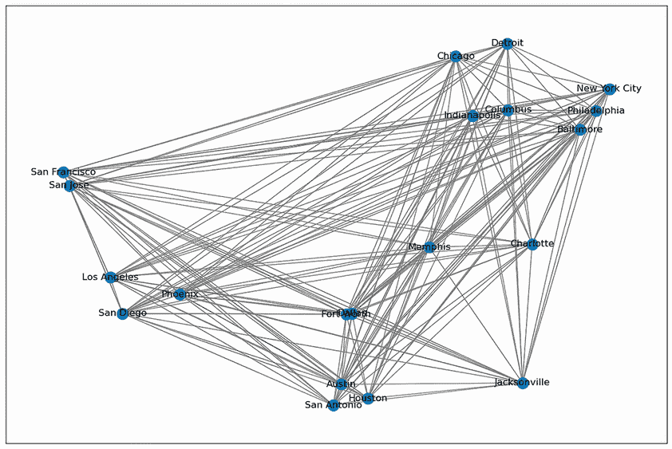

图 C.11 20 个最大美国城市的旅行商问题（TSP）

5.   解决图 C.12 中的填字游戏

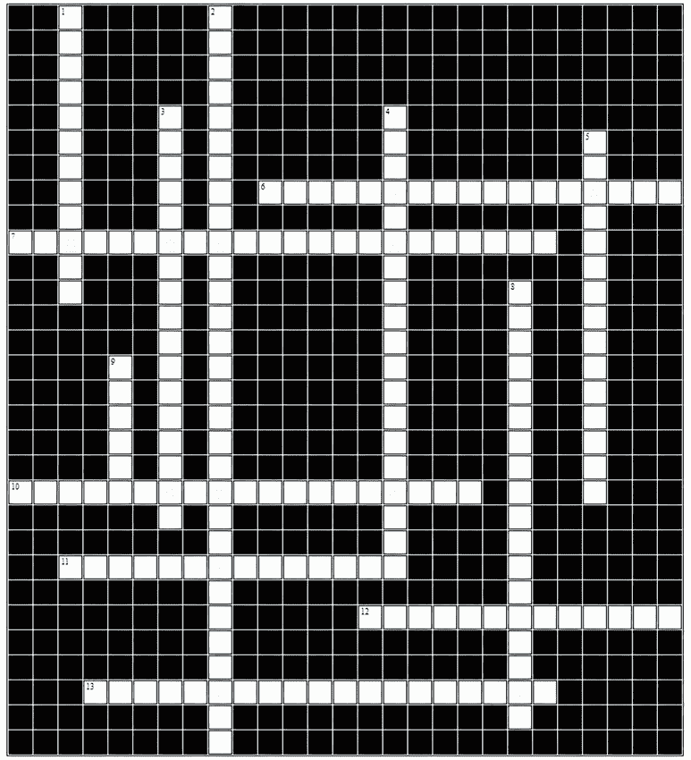

图 C.12 模拟退火填字游戏

横向

6.   通过应用量子效应在能量景观中搜索以找到最优或近似最优解的优化过程

7.   接受或拒绝邻近解的概率

10.   一种冷却过程，在最初的迭代中温度迅速降低，但随后指数衰减的速度减慢

11.   需要指定最大迭代次数的冷却计划

12.   与此搜索算法相比，主要区别在于 SA 概率性地允许由当前温度和移动的好坏控制的向下步骤。

13.   一种需要禁用计算时间的冷却计划

向下

1.   一种随机或概率模型，描述了一系列可能的移动，其中每个移动的概率仅取决于前一个移动达到的状态

2.   一种明确考虑搜索进展情况的冷却计划

3.   一种通过冷却因子降低温度的冷却计划

4.   基于物理退火过程的优化过程

5.   用于模拟退火转换概率的概率分布

8.   一种量子力学现象，其中波函数可以通过势垒传播

9.   系统状态，其中不接受更好或更差的移动

提示：如果答案由两个单词组成，则必须使用空格和破折号。

### C.4.2 解决方案

1.   多项选择题和真/假题

1.1   a) 正确

1.2   b) 错误

1.3   b) 错误（双重退火是广义模拟退火算法的一种实现。）

1.4   a) 正确

1.5   b) 错误（模拟退火算法在温度降低时利用搜索空间。）

1.6   c) 对数冷却计划

1.7   a) 正确

2.   书中 GitHub 仓库提供的 __problem_base.py 和 _sa.py 的通用形式可以用来解决这个问题。您还可以修改列表 5.1 或 5.2 来解决这个问题。

3.   您可以使用列表 5.5 或 ASA-GS 实现[1]在不同的 TSP 实例上运行具有选定参数的模拟退火，并报告您的结果。在列表 5.5 中，将永久链接替换为对应于 TSP 实例的链接。例如，点击 burma14.tsp，点击右上角的三个点按钮，并选择复制永久链接。考虑调整算法的参数，以接近每个数据集已知的最佳行程长度（到目前为止）。

4.   以下列表显示了如何使用 optalgo-tools 包中实现的一般求解器来解决这个问题。

列表 C.3 使用 SA 解决 TSP 问题

```py
from optalgotools.algorithms import SimulatedAnnealing
from optalgotools.problems import TSP
pairwise_distances = distances

tsp_US = TSP(dists=pairwise_distances, gen_method='insert',
➥ init_method='greedy')
sa=SimulatedAnnealing(max_iter=10000, max_iter_per_temp=10000,
➥ initial_temp=10000000, final_temp=0.0001,
➥ cooling_schedule='geometric', cooling_alpha=0.9, debug=1)

sa.run(tsp_US)
print(sa.s_best)
```

作为列表 C.3 的延续，以下代码展示了如何使用 simanneal Python 库来解决这个问题：

```py
#!pip install simanneal 
import math
import random
from simanneal import Annealer

class TravellingSalesmanProblem(Annealer):                              ①
    def __init__(self, state, distance_matrix):
        self.distance_matrix = distance_matrix
        super(TravellingSalesmanProblem, self).__init__(state)

    def move(self):                                                     ②
        initial_energy = self.energy() 
        a = random.randint(0, len(self.state) - 1)
        b = random.randint(0, len(self.state) - 1)
        self.state[a], self.state[b] = self.state[b], self.state[a]
        return self.energy() - initial_energy

    def energy(self):                                                   ③
        e = 0
        for i in range(len(self.state)):
            e += self.distance_matrix[self.state[i-1]][self.state[i]]
        return e

init_state = list(cities)                                               ④
random.shuffle(init_state)                                              ④

tsp = TravellingSalesmanProblem(init_state, distance_matrix)
tsp.set_schedule(tsp.auto(minutes=0.2))
tsp.copy_strategy = "slice"
state, e = tsp.anneal()

while state[0] != 'New York City':                                      ⑤
    state = state[1:] + state[:1]  

print("%i mile route:" % e)                                             ⑥
print(" ➞  ".join(state))                                              ⑥
```

① 使用 simanneal 模块中的 TSP 测试退火器。

② 在路线上交换两个城市。

③ 计算路线的长度。

④ 初始状态，一个随机排序的行程

⑤ 将纽约市设为家乡城市。

⑥ 打印路线及其成本。

作为延续，以下代码可以用来可视化问题和解决方案：

```py
fig, ax = plt.subplots(figsize=(15,10))

reversed_dict = {key: value[::-1] for key, value in cities.items()}        ①

H = G.copy()                                                               ②

edge_list = list(nx.utils.pairwise(state))

nx.draw_networkx_edges(H, pos=reversed_dict, edge_color="gray", width=0.5) ③

ax=nx.draw_networkx(H, pos=reversed_dict, with_labels=True, edgelist=edge_list, 
edge_color="red", node_size=200, width=3,)                                 ④

plt.show()                                                                 ⑤
```

① 反转经纬度以正确可视化。

② 创建一个独立的浅拷贝的图和属性。

③ 仅在每个节点上绘制最近的边。

④ 绘制路线。

⑤ 可视化。

运行此代码将产生图 C.13 所示的可视化。


图 C.13 使用 simanneal 解决 20 个主要美国城市 TSP 的解决方案

附录 A 展示了可用于解决此问题的 Python 库示例，例如 scikit-opt、DEAP、OR-Tools 和 simanneal，它们可以使用模拟退火和其他元启发式算法来解决这个问题。

5.   填字游戏的解决方案如图 C.14 所示。


图 C.14 模拟退火填字游戏解决方案

## C.5 第六章：禁忌搜索

### C.5.1 练习

1.   多项选择和判断题：为以下每个问题选择正确的答案。

1.1.   在 TS 中，为了逃离局部最优，非改进解在条件上被接受。

a.  正确

b.  错误

1.2.   基于频率的记忆维护有关搜索点最近访问的信息。

a.  正确

b.  错误

1.3.   为了提高解决某些问题的效率，TS 通过禁忌列表使用记忆来避免重新访问最近访问过的邻域。

a.  正确

b.  错误

1.4.   终止 TS 的停止标准可以是

a.  邻域为空

b.  迭代次数大于指定的阈值

c.  证据表明已获得最优解

d.  以上皆对（a, b, 和 c）

e.  以上皆非（a, b, 或 c）

1.5.   禁忌搜索的禁忌移动被存储在长期记忆中。

a.  正确

b.  错误

1.6.   对于大型和困难的问题（如调度、二次分配和车辆路径），禁忌搜索通常能获得代表全局最优或近似最优的解。

a.  正确

b.  错误

1.7.   使用近期记忆通过记住具有良好解决方案的邻居来增加搜索的强度。

a.  正确

b.  错误

1.8.   使用渴望标准来撤销禁忌搜索的禁忌移动，作为避免搜索停滞的一种方式。

a.  正确

b.  错误

1.9.   TS 可以被视为随机搜索和记忆结构的组合。

a.  正确

b.  错误

1.10. 当禁忌列表的长度太短时，算法可能会陷入循环，而当它太长时，每次迭代可能会阻止许多移动，导致停滞。

a.  正确

b.  错误

2.   如附录 B 所示，Schwefel 函数复杂，具有许多局部最小值。图 C.15 展示了该函数的二维形式。

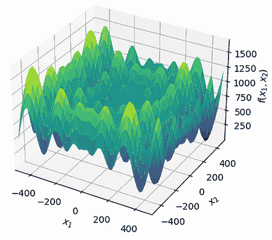

图 C.15 Schwefel 函数

将列表 6.1 修改为使用禁忌搜索解决 Schwefel 函数。

3.   苹果申请了美国专利 7790637 B2，该专利是一种复合材料层压板，包括七层叠加在一起，并有一个隔网层。将浸渍有树脂（例如，一种粘稠液体物质）的七层平面纤维放置在不同的方向上，以提高复合材料层的强度，如图 C.16 所示。隔网层是装饰层，它是一种不同的材料，并粘附在外部，以改善装饰外观和一致性。

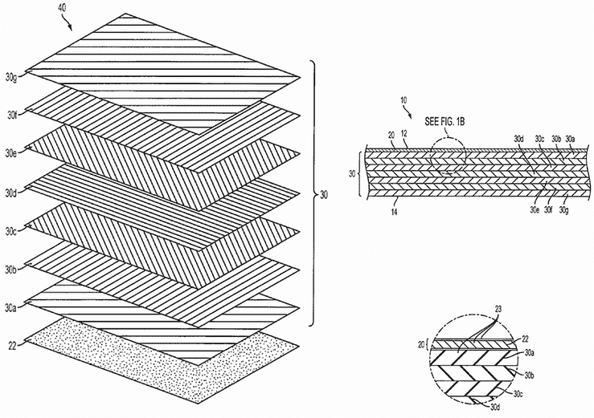

图 C.16 复合层压板设计——苹果的美国专利 7790637 B2

七层排列的方式导致复合层压板具有不同的强度水平。假设成对强度增益或损失由图 C.17 中的经验值给出。正值表示两层接触时（向上或向下）的强度增益，负值表示强度损失。


图 C.17 成对强度增益或损失

假设我们想要找到七个纤维层最优的有序组合（即排列），以最大化复合层压板的强度。进行四次禁忌搜索的手动迭代，以展示算法解决问题的步骤。编写 Python 代码来解决这个问题。

4.   编写 Python 代码使用禁忌搜索来解决简单装配线平衡问题，类型 1（SALBP-1），其中机器和工人约束由 Kamarudin 和 Rashid 的论文“Modelling of Simple Assembly Line Balancing Problem Type 1 (SALBP-1) with Machine and Worker Constraints” [3] 描述。

5.   在图 C.18 的单词搜索谜题中，找到禁忌搜索中常用的隐藏术语。你可以水平搜索（从左到右或从右到左），垂直搜索（从上到下或从下到上），或对角线搜索。


图 C.18 TS 单词搜索谜题

### C.5.2 解决方案

1.   多项选择题和判断题

1.1.   a) 正确

1.2.   b) 错误（基于最近性的记忆维护有关搜索点最近访问的信息。）

1.3.   a) 正确

1.4.   d) 所有上述选项（a、b 和 c）

1.5.   b) 错误（禁忌活跃移动存储在短期记忆中。）

1.6.   a) 正确

1.7.   a) 正确

1.8.   a) 正确

1.9.   b) 错误（禁忌搜索可以被视为局部搜索和记忆结构的组合。）

1.10. a) 正确

2.   书籍 GitHub 仓库中的列表 C.4 展示了如何使用禁忌搜索解决 Schwefel 函数。

3.   图 C.19 显示了复合层压板问题的 TS 初始化和第一次迭代。不重复的可能排列数为*n*!。排列七个纤维层的可能解数为 7! = 5,040。要生成相邻解，可以使用纤维层交换。邻域定义为通过交换解中任意两个层而获得的任何其他解。如果我们让节点数*n* = 7，成对交换*k* = 2。邻域的数量是不重复的组合数*C*(*n*,*k*)或*n*-choose-*k*：*C*(*n*,*k*) = *n*! / (*k*!(*n* – *k*)!) = 21 个邻域。假设禁忌任期设置为 3 次迭代。


图 C.19 复合层压板设计的禁忌搜索初始化

图 C.20 至 C.22 分别显示了迭代 1、2 和 3。

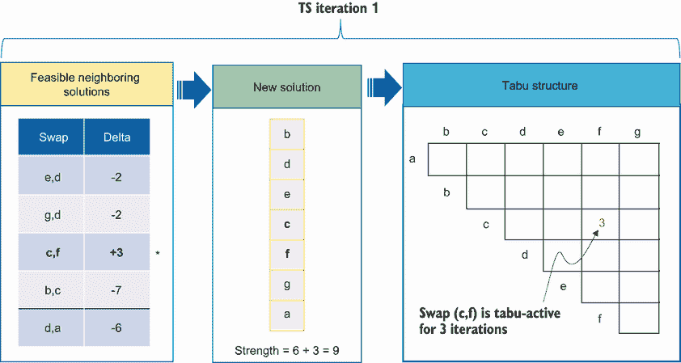

图 C.20 复合层压板设计——迭代 1


图 C.21 复合材料层压板设计——第 2 次迭代

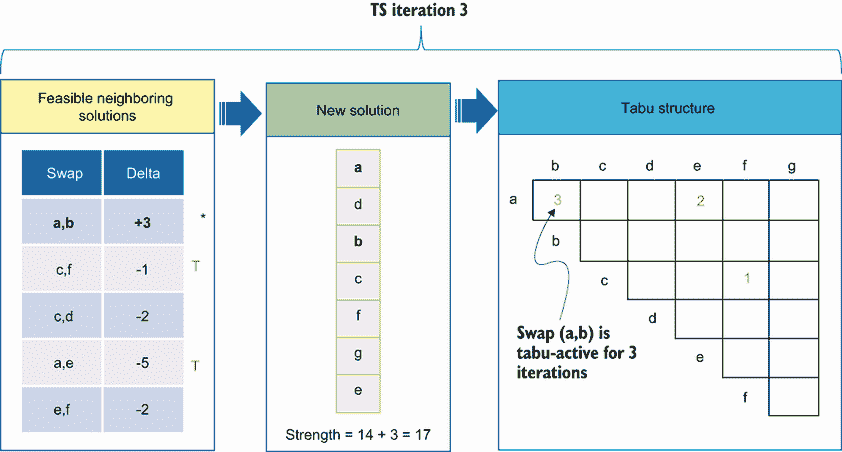

图 C.22 复合材料层压板设计——第 3 次迭代

在每次迭代中，我们通过层交换生成多个候选解，并选择导致最大 delta 值的移动，即前一个解和新的解在强度增益方面的差异。在下一个迭代中，如图 C.23 所示，没有具有正增益的移动，因此最佳（非禁忌）移动将是非改进的。选择移动（a,e），因为它与其他禁忌活跃的最佳移动（a,b）相比只有一期的禁忌期限。这意味着（a,e）的禁忌状态可以通过应用渴望标准来覆盖。

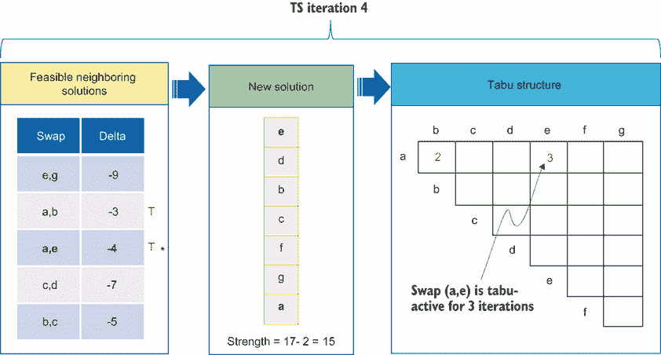

图 C.23 复合材料层压板设计——TS 迭代 4 和渴望标准

为了展示基于频率的记忆的多样化，假设在第 26 次迭代后达到的解是[a c f b g e d]，强度值为 23。假设我们将根据其在使用中的频率来惩罚解（高度重复的解会受到更多的惩罚）。禁忌结构根据基于最近性（上三角）和基于频率（下三角）的记忆进行更新，如图 C.24a 所示。交换后的前五个候选解如图 C.24b 所示。

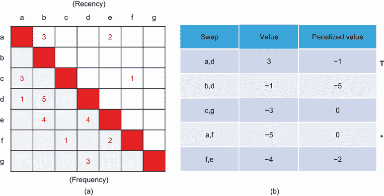

图 C.24 a) 基于最近性和频率的记忆，b) 交换后的前五个候选解及其惩罚值

当不存在可接受的改进步骤时，我们需要进行多样化。非改进步骤通过分配更大的惩罚给更频繁的交换来受到惩罚。根据惩罚值，选择交换（a,f）。列表 C.5 展示了使用禁忌搜索解决复合材料层压板问题的解决方案。

列表 C.5 使用禁忌搜索解决复合材料层压板问题

```py
from optalgotools.problems import SHEETS                                ①
from optalgotools.algorithms import TabuSearch                          ②
import matplotlib.pyplot as plt

iphone_case = SHEETS(init_method='greedy')                              ③

ts = TabuSearch(max_iter=1000, tabu_tenure=10, neighbor_size=7,
➥ use_aspiration=True, aspiration_limit=3, use_longterm=False, debug=1,
➥ maximize=True, penalize=True)                                        ④

ts.init_ts(iphone_case)                                                 ⑤
ts.val_cur

ts.run(iphone_case, repetition=1)                                       ⑥
ts.val_allbest
```

① 导入 SHEETS 问题实例，其中包含复合材料层压板设计问题的描述。

② 导入禁忌搜索求解器。

③ 创建不同的 sheets 对象。有关支持的参数的完整列表，请参阅 optalgotools.problems 模块中 sheets.py 文件中的 SHEETS 类。

④ 创建一个 TS 对象以帮助解决复合材料层压板问题。

⑤ 获取一个初始随机解，并检查其成本。

⑥ 运行 TS，评估最佳解的成本。

4. 列表 C.6 展示了使用禁忌搜索解决 SALBP-1 问题的代码片段。

列表 C.6 使用禁忌搜索解决 SALBP-1 问题

```py
tasks = pd.DataFrame(columns=['Task', 'Duration'])                           ①
tasks= pd.read_csv("https://raw.githubusercontent.com/Optimization-          ①
Algorithms-Book/Code-Listings/main/Appendix%20B/data/ALBP/ALB_TS_DATA2.txt", ①
sep =",")                                                                    ①
Prec= pd.read_csv("https://raw.githubusercontent.com/Optimization-
➥Algorithms-Book/Code-                                                      ①
➥Listings/main/Appendix%20B/data/ALBP/ALB_TS_PRECEDENCE2.txt", sep =",")    ①
Prec.columns=['TASK', 'IMMEDIATE_PRECEDESSOR']                               ①

Cycle_time = 10                                                              ②

tenure = 3
max_itr=100

solution = Initial_Solution(len(tasks))                                      ③
soln_init = Make_Solution_Feasible(solution, Prec)                           ④

sol_best, SI_best=tabu_search(max_itr, soln_init, SI_init, tenure, WS,
➥ tasks, Prec_Matrix, Cycle_time)                                           ⑤

Smoothing_index(sol_best, WS, tasks, Cycle_time, True)                       ⑥

plt = Make_Solution_to_plot(sol_best, WS, tasks, Cycle_time)                 ⑦
plt.show()                                                                   ⑦
```

① 直接使用 URL 从附录 B 读取数据。

② 定义周期时间。

③ 获取一个初始解。

④ 确保解决方案在考虑任务优先级约束下的可行性。

⑤ 运行禁忌搜索。

⑥ 计算最佳解的平滑指数。

⑦ 可视化解决方案。

运行完整代码产生以下输出：

```py
The Smoothing Index value for ['T2', 'T7', 'T6', 'T1', 'T3', 'T4', 'T8',
➥ 'T9', 'T5'] solution sequence is: 1.0801234497346432 
The number of workstations for ['T2', 'T7', 'T6', 'T1', 'T3', 'T4', 'T8',
➥ 'T9', 'T5'] solution sequence is: 6 
The workloads of workstation for ['T2', 'T7', 'T6', 'T1', 'T3', 'T4', 'T8',
➥ 'T9', 'T5'] solution sequence are: [7\. 6\. 5\. 7\. 6\. 6.]
1.0801234497346432
```

完整代码可在本书的 GitHub 仓库中找到。

5.   单词搜索谜题的解决方案如图 C.25 所示。


图 C.25 TS 单词搜索谜题解决方案

方向和起点以 (方向, *X, Y*) 格式表示

适应性记忆 (W, 17, 13)

憧憬标准 (W, 23, 15)

多样化 (W, 23, 14)

基于频率的记忆 (W, 21, 7)

强化 (E, 8, 8)

局部搜索 (W, 16, 6)

长期记忆 (E, 1, 10)

近期记忆 (E, 12, 1)

反应性探索 (W, 23, 16)

感觉记忆 (W, 16, 3)

短期记忆 (W, 16, 4)

禁忌列表 (E, 6, 12)

禁忌搜索 (E, 1, 5)

禁忌结构 (W, 23, 2)

禁忌任期 (E, 12, 5)

工作记忆 (W, 20, 9)

## C.6 第七章：遗传算法

### C.6.1 练习

1.   多项选择和真/假：为以下每个问题选择正确答案。

1.1.   给定一个二进制字符串 1101001100101101 和另一个二进制字符串 yxyyxyxxyyyxyxxy，其中值 0 和 1 由 x 和 y 表示，在随机选择的重组点应用单点交叉后，这两个字符串会产生什么样的后代？

a.  yxxyyyxyxxy11010 和 yxyyx01100101101

b.  11010yxxyyyxyxxy 和 yxyyx01100101101

c.  11010yxxyyyxyxxy 和 01100101101yxyyx

d.  以上皆非

1.2.   在二进制遗传算法中，位突变操作符是如何工作的？

a.  它交换两个随机选择的位的位置。

b.  它平均两个随机选择的位的值。

c.  它翻转二进制表示中的随机选择的位。

d.  它反转随机选择的位段顺序。

1.3.   每个基因在染色体上的位置名称称为

a.  等位基因

b.  突变位点

c.  基因型

d.  表型

e.  以上皆非

1.4.   在遗传算法的稳态模型中，如何将新的后代引入种群？

a.  通过替换整个种群

b.  通过替换种群的一小部分

c.  通过将它们添加到现有种群中

d.  通过替换种群中的最差个体

1.5.   假设你有一个表 C.2 中所示的种群。

表 C.2 给定种群

| 个人 | 个人 1 | 个人 2 | 个人 3 | 个人 4 | 个人 5 |
| --- | --- | --- | --- | --- | --- |
| 适应性 | 12 | 25 | 8 | 53 | 10 |

基于排名的选择试图通过基于相对适应性而不是绝对适应性来解决问题，以解决适应性比例选择（FPS）的问题。假设排名过程是线性排名，如下所示：


其中 *N* 是种群中个体的数量，*r* 是与种群中每个个体关联的排名（最不适应的个体有 *r* = 1，最适应的个体 *r* = *N*）。*SP* 是选择压力（假设 *SP* = 1.5）。如果我们使用基于线性排名的选择，哪两个个体将被选中？

a.  个人 1 和 2

b.  个人 1 和 3

c.  个人 2 和 3

d.  个人 2 和 4

e.  个人 3 和 4

f.  以上皆非

1.6. 在遗传算法中，哪种选择方法涉及随机选择固定数量的个体，并从中选择最佳者？

a. 轮盘赌选择

b. 排名选择

c. 征服选择

d. 随机均匀抽样（SUS）

1.7. 在 P 元启发式算法中，拉丁超立方策略的计算成本与伪随机初始化策略相同。

a. 正确

b. 错误

1.8. 在二进制遗传算法中，使用哪种类型的染色体编码？

a. 实数值

b. 排列

c. 二进制

d. 树

1.9. 以下哪种方法可以用于将优化问题中的最小化问题转换为最大化问题？

a. 将常数加到目标函数上

b. 取目标函数的倒数

c. 取反目标函数

d. 将目标函数按因子缩放

1.10. 与代际模型相比，稳态模型在遗传算法中的优势是什么？

a. 更快的收敛速度

b. 更好的多样性保持

c. 更低的计算成本

d. 更鲁棒的突变算子

1.11. 在二进制遗传算法中，突变算子对个体的基因做了什么？

a. 反转基因值（1 到 0 或 0 到 1）

b. 随机分配新的基因值（0 或 1）

c. 交换两个基因的位置

d. 结合来自不同个体的基因

1.12. 以下哪项是二进制遗传算法中常用的交叉方法？

a. 单点交叉

b. 双点交叉

c. 均匀交叉

d. 以上所有

1.13. 遗传算法中，代际模型与稳态模型之间的主要区别是什么？

a. 选择方法

b. 交叉算子

c. 突变算子

d. 替换策略

1.14. 在二进制遗传算法中，哪种交叉方法涉及根据每个基因预定义的概率在父代染色体之间交换遗传物质？

a. 单点交叉

b. 双点交叉

c. 均匀交叉

d. 算术交叉

1.15. 使用高突变率在二进制遗传算法中可能存在的潜在缺点是什么？

a. 种群多样性的丧失

b. 过早收敛

c. 优秀解决方案的破坏

d. 减少选择压力

1.16. 在遗传算法的代际模型中，每一代种群会发生什么变化？

a. 替换一小部分种群。

b. 完全替换整个种群。

c. 种群保持不变。

d. 种群大小逐渐减少。

1.17. 当使用转换将最小化问题转换为最大化问题时，必须保留最优解的哪个属性？

a. 可行性

b. 最优性

c. 领先

d. 凸性

1.18. 遗传算法中主要使用的算子有哪些？

a. 初始化、池化和反向传播

b. 选择、交叉和突变

c. 卷积、池化和激活

d.  前向传播、反向传播和优化

1.19. 与稳态模型相比，以下哪项是遗传算法中代际模型的优势？

b.  改善多样性保持

b.  收敛更快

c.  较低的计算成本

d.  更好地处理约束

1.20. 假设你需要使用二进制遗传算法来解决以下函数最大化问题：


其中

•   *O[i]* 是个体 *i* 的目标函数值，且 *O[i]* = –(*x* – 6.4)²。

•   *N* 是种群大小。

•   *V* 是一个很大的值，以确保适应度值非负。

*V* 的值是适应度函数 *f*(*x*) 第二项的最大值，使得对应目标函数最大值的适应度值为 0。为了以 0.1 的精度表示解，需要多少位？

a.   6 位

b.   7 位

c.   8 位

d.   9 位

e. 10 位

f.  以上皆非

2.   Ackley 函数是一个非线性、多模态函数，具有大量局部最小值，使其成为一个具有挑战性的优化问题。Ackley 函数的一般形式是

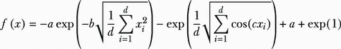

其中

•   *x* = (*x*[1], *x*[2], ..., *x[d]*) 是输入向量。

•   *a, b*, 和 *c* 是正常数（通常 *a* = 20, *b* = 0.2, 和 *c* = 2 × *π*）.

•   d 是输入向量的维度。

函数在原点有全局最小值（*x[i] =* 0），其中 *f(x) =* 0，并且它被几个局部最小值所包围，如图 C.26 所示。


图 C.26 Ackley 函数

这些局部最小值的存在使得优化算法难以找到全局最小值，尤其是那些可能陷入局部最小值的算法。请编写 Python 代码来解决一个 6D Ackley 函数。

### C.6.2 解决方案

1.   多项选择题和是非题

1.1.   b) 11010yxxyyyxyxxy and yxyyx01100101101

1.2.   c) 随机翻转二进制表示中的某个位

1.3.   b) 突变位点

1.4.   b) 通过替换种群的一小部分

1.5.   考虑以下线性排名


| 个体 | 个体 1 | 个体 2 | 个体 3 | 个体 4 | 个体 5 |
| --- | --- | --- | --- | --- | --- |
| 适应度 | 12 | 25 | 8 | 53 | 10 |
| 排名 r | 3 | 4 | 1 | 5 | 2 |
| p(r) | 0.175 | **0**.**2** | 0.125 | **0**.**225** | 0.15 |

个体 4 和个体 2 将被选中，因为它们具有最高的概率。所以正确答案是 d。

1.6.   c) 赛选

1.7.   a) 正确

1.8.   c) 二进制

1.9.   b 和 c) 取目标函数的倒数，并取目标函数的相反数

1.10. c) 较低的计算成本

1.11. a) 反转基因值（1 到 0 或 0 到 1）

1.12. d) 所有上述选项

1.13. d) 替换策略

1.14. c) 均匀交叉

1.15. c) 破坏好的解

1.16. b) 替换整个种群

1.17. b) 最优性

1.18. b) 选择、交叉和变异

1.19. a) 改进的多样性保持

1.20. d) 9 位

给定 0.0 <= *x* <= 31.5，精度为 0.1

•   计算范围大小：31.5 – 0 = 31.5

•   将范围大小除以所需的精度：31.5 / 0.1 = 315

•   向上取整到最接近的整数：315

现在您有 315 个步骤（值）来表示从 0.0 到 31.5 的数字，精度为 0.1：

number_of_bits = ceil(log2) = ceil(log2) ≈ ceil(8.29) = 9

因此，您需要 9 位来表示从 0.0 到 31.5 的数字，精度为 0.1.2\. 列表 C.8 显示了使用从头开始实现或基于 pymoo 开源库实现的遗传算法解决 Ackley 函数的代码片段。我们首先定义遗传算法和 Ackley 函数的常量如下：

列表 C.8 使用 GA 解决 Ackley 函数

```py
import random
import math

POPULATION_SIZE = 100
GENOME_LENGTH = 30
MUTATION_RATE = 0.1
CROSSOVER_RATE = 0.8
GENERATIONS = 100

a = 20
b = 0.2
c = 2 * math.pi
```

我们随后定义`decode`函数，将二进制基因组转换为实数值：

```py
def decode(genome):
    x = []
    for i in range(0, GENOME_LENGTH, 5):
        binary_string = "".join([str(bit) for bit in genome[i:i+5]])
        x.append(int(binary_string, 2) / 31 * 32 - 16)
    return x
```

以下函数定义了适应度函数（Ackley 函数）：

```py
 def fitness(genome):
    x = decode(genome)
    term1 = -a * math.exp(-b * math.sqrt(sum([(xi ** 2) for xi in x]) /
➥ len(x)))
    term2 = -math.exp(sum([math.cos(c * xi) for xi in x]) / len(x))
    return term1 + term2 + a + math.exp(1)
```

现在让我们定义交叉函数：

```py
def crossover(parent1, parent2):
    child1 = []
    child2 = []
    for i in range(GENOME_LENGTH):
        if random.random() < CROSSOVER_RATE:
            child1.append(parent2[i])
            child2.append(parent1[i])
        else:
            child1.append(parent1[i])
            child2.append(parent2[i])
    return child1, child2
```

变异函数定义如下：

```py
def mutate(genome):
    for i in range(GENOME_LENGTH):
        if random.random() < MUTATION_RATE:
            genome[i] = 1 - genome[i]
```

现在是创建初始种群的时候了：

```py
population = [[random.randint(0, 1) for _ in range(GENOME_LENGTH)] for _ in
➥ range(POPULATION_SIZE)]
```

现在让我们运行遗传算法：

```py
for generation in range(GENERATIONS):
    fitness_scores = [(genome, fitness(genome)) for genome in population] ①
    fitness_scores.sort(key=lambda x: x[1])

    print(f"Generation {generation}: Best fitness =
➥ {fitness_scores[0][1]}")                                               ②

    parents = [fitness_scores[i][0] for i in range(POPULATION_SIZE // 2)] ③

    next_generation = []                                                  ④
    for i in range(POPULATION_SIZE // 2):                                 ④
        parent1 = random.choice(parents)                                  ④
        parent2 = random.choice(parents)                                  ④
        child1, child2 = crossover(parent1, parent2)                      ④
        mutate(child1)                                                    ④
        mutate(child2)                                                    ④
        next_generation.append(child1)                                    ④
        next_generation.append(child2)                                    ④

    population = next_generation                                          ⑤
```

① 计算种群中每个基因组的适应度分数。

② 打印出每一代的最佳适应度分数。

③ 选择种群中最佳的一半作为下一代的父母。

④ 通过应用交叉和变异生成下一代。

⑤ 用新的一代后代替换当前种群。

您可以按照以下方式打印出最佳基因组及其适应度：

```py
fitness_scores = [(genome, fitness(genome)) for genome in population]
fitness_scores.sort(key=lambda x: x[1])
print(f"Generation {GENERATIONS}: Best fitness = {fitness_scores[0][1]}")
```

您可以打印出最佳基因组，解码最佳基因组，然后按照以下方式打印出决策变量的实数值：

```py
print(f"Best genome = {fitness_scores[0][0]}")
print(f"Best genome decoded = {decode(fitness_scores[0][0])}")
print(f"Decision variables in real values = {decode(fitness_scores[0][0])}")
```

您可以使用 pymoo 中实现的遗传算法更快地解决这个问题：

```py
from pymoo.algorithms.soo.nonconvex.ga import GA
from pymoo.problems import get_problem
from pymoo.optimize import minimize

problem = get_problem("ackley", n_var=6) 

algorithm = GA(
    pop_size=100,
    eliminate_duplicates=True)

res = minimize(problem,
               algorithm,
               seed=1,
               verbose=False)

print("Best solution found: \nX = %s\nF = %s" % (res.X, res.F))
```

运行此代码会产生以下输出：

```py
Best solution found: 
X = [ 0.00145857 -0.00011553 0.00033902 -0.00169267 -0.0005825  -0.00547546]
F = [0.01003609]
```

## C.7 第八章：遗传算法变体

### C.7.1 练习

1.   假设一家公司正在尝试为新设施选择最佳位置。决策变量 *x*[1] 和 *x*[2] 代表新设施在二维平面上的潜在位置坐标。公司需要最小化新设施与位于(2, 1)位置现有设施之间的距离平方，这可能代表了降低两个设施之间运输成本的需求。此外，公司旨在最大化新设施与位于(3, 4)位置的竞争对手设施之间的距离平方，这可能代表了通过将新设施与竞争对手保持距离来建立竞争优势的需求。由于分区法规或其他限制，新设施必须位于一定区域内。它还必须遵守环境限制或财产边界。这个多目标约束优化问题可以表述如下：

最小化 *f*1 = √((*x*[1] – 2)² + (*x*[2] – 1)²)（公司设施之间的距离）

最大化 *f*1 = √((*x*[1] – 3)² + (*x*[2] – 4)²)（新设施与竞争对手设施之间的距离）

such that

*g*1 = 2*x*[1] + *x*[2] – 6 ≤ 0（分区法规）

*g*2 = 2*x*[1] – *x*[2] – 2 ≤ 0（环境约束或属性边界）

0 ≤ *x*[1] ≤ 5（边界约束）

0 ≤ *x*[2] ≤ 5（边界约束）

编写 Python 代码以找到新设施的最佳位置。

2.   全 1 问题，也称为最大 1 问题，是一个简单的目标是在固定长度的二进制字符串中最大化 1 的数量的问题。对于 10 位全 1 问题，最优解具有以下形式：[1111111111]。该问题由 K. Sutner 在他的文章“线性细胞自动机和伊甸园”中描述，如下：假设一个 *n* × *n* 国际象棋棋盘的每个方格都配备了一个指示灯和一个按钮。如果按下某个方格的按钮，该方格的灯将从关闭变为开启或反之亦然；相邻边界的所有灯也会发生同样的变化。最初所有灯都是关闭的。全 1 问题的目标是找到一个按钮按下的序列，使得最终所有灯都开启。这个问题本身可能没有直接的应用，但它被用作测试问题来比较各种算法的性能。编写 Python 代码以使用遗传算法找到 10 位全 1 问题的解决方案。

3.   假设图 C.27 中有 10 个包裹需要装载到载货自行车上。


图 C.27 10 个物品的载货自行车装载问题，给定重量、利润和效率（利润/重量）

每个包裹都有自己的重量、利润和效率值（每公斤利润）。目标是选择要装载的包裹，以便使效用函数 *f*[1] 最大化，而重量函数 *f*[2] 最小化。

*f*[1] = Σ*E[i]*, *i* = 0, 1, ..., *n*.

*f*[2] = |Σ*w[i]* – *C*|，如果 Σ*w[i]* > *C*，则添加 50。

where

•   *n* 是包裹的总数。

•   *E[i]* 是包裹 *i* 的效率。

•   *w[i]* 是包裹 *i* 的重量。

•   *C* 是自行车的最大容量。

如果添加的包裹总重量超过最大容量，则将添加 50 的惩罚。编写 Python 代码以确定哪些物品应装载以实现最大效率。

4. 在 Guéret 等人在其著作《线性规划》[5]中描述的开采式采矿问题中，露天铀矿被划分为用于开采的块。如图 C.28 所示，有 18 个 10,000 吨的块分布在三个层面上，这些块是基于测试钻探的结果进行识别的。为了使卡车能够到达底部，需要将坑道梯田化，并且坑道在西部被一个村庄限制，在东部被一群山脉限制。由于坡度限制，提取一个块需要提取其上方三个层面的三个块：直接在其上方的块，以及右侧和左侧的块。根据块的水平不同，提取块的成本也不同。第 1 层面的块每吨提取成本为 100 美元，第 2 层面的块每吨提取成本为 200 美元，第 3 层面的块每吨提取成本为 300 美元。然而，由非常坚硬且富含石英的岩石构成的网状块，每吨提取成本为 1,000 美元。含有铀的块以灰色阴影显示：这些是块 0、6、9、11、16 和 17。这些块有不同的市场价值，其中块 17 富含矿石，但由与其他网状块相同的坚硬岩石制成。块 0、6、9、11、16 和 17 的市场价值分别为每吨 200 美元、300 美元、500 美元、200 美元、1,000 美元和 1,200 美元。

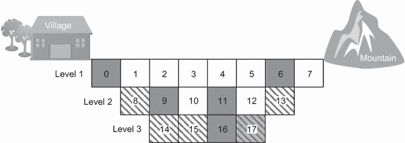

图 C.28 开采式采矿问题

a. 编写一个 Python 代码，以确定提取哪些块以最大化总利润，总利润由Σ(VALUE – COST) × *x[i]*给出，其中*x* = 0,1,…,17，*x[i]*是一个分配的二进制变量。

b. 假设处理块所需的时间长度取决于块的水平以及块的硬度，为[1, 1, 1, 1, 1, 1, 1, 1, 3, 2, 2, 2, 2, 3, 4, 4, 3, 4]。编写 Python 代码以确定提取哪些块以最大化折扣利润和增加的成本，由以下方程给出：


5. 在书籍 GitHub 仓库的第八章/项目文件夹中，提供了以下样本研究项目以供审查和实验：

•   *路由*——使用遗传算法在多伦多北部的市政区 Vaughan 中寻找两个感兴趣点之间的最短路径。

•   *公交车路线*——解决学校公交车路线问题，将问题表述为一个包含多目标优化问题的方案。应用聚类优先、路线优先方案、遗传算法和自适应遗传算法来解决这个问题。使用美国弗吉尼亚州温彻斯特市的公立学校真实数据评估这些算法的性能。

•   *位置分配*——使用生物启发式优化算法处理无人机配送站的放置问题。解决方案框架包括两个阶段：第一阶段解决站点的位置规划问题，而第二阶段处理分配给已定位站点的配送需求。

### C.7.2 解决方案

1. 下一个列表显示了如何使用 NSGA-II 解决设施分配问题。

列表 C.9 使用 NSGA-II 解决设施分配问题

```py
import numpy as np
import math
import matplotlib.pyplot as plt
from pymoo.core.problem import ElementwiseProblem
from pymoo.algorithms.moo.nsga2 import NSGA2
from pymoo.operators.crossover.sbx import SBX
from pymoo.operators.mutation.pm import PolynomialMutation
from pymoo.operators.repair.rounding import RoundingRepair
from pymoo.operators.sampling.rnd import FloatRandomSampling

class FacilityProblem(ElementwiseProblem):

    def __init__(self):
        super().__init__(n_var=2,
                         n_obj=2,
                         n_ieq_constr=2,
                         xl=np.array([0,0]),
                         xu=np.array([5,5]))

    def _evaluate(self, x, out, *args, **kwargs):
        f1 = math.sqrt((x[0]-2)**2 + (x[1]-1)**2)
        f2 = -math.sqrt((x[0]-3)**2 + (x[1]-4)**2) 

        g1 = x[0]+2*x[1]-6                        ①
        g2 = 2*x[0]-x[1]-2                        ②

        out["F"] = [f1, f2]
        out["G"] = [g1, g2]

problem = FacilityProblem()

algorithm = NSGA2(
    pop_size=50,
    sampling=FloatRandomSampling(),
    crossover=SBX(prob=0.8),
    mutation = PolynomialMutation(prob=0.6, repair=RoundingRepair()), 
    eliminate_duplicates=True
)

from pymoo.termination import get_termination

termination = get_termination("n_gen", 50)

from pymoo.optimize import minimize

res = minimize(problem,
               algorithm,
               termination,
               seed=1,
               save_history=True,
               verbose=False)

X = res.X
F = res.F
```

① 缩放约束

② 环境/属性约束

书籍 GitHub 仓库中的完整列表还显示了如何执行决策以选择最佳解决方案。

2. 下一个列表显示了所有 1 问题的解决方案。

列表 C.10 使用 GA 解决所有 1 的问题

```py
import numpy as np
from pymoo.algorithms.soo.nonconvex.ga import GA
from pymoo.operators.crossover.sbx import SBX
from pymoo.operators.mutation.pm import PolynomialMutation
from pymoo.operators.sampling.rnd import FloatRandomSampling
from pymoo.core.problem import Problem
from pymoo.optimize import minimize

class AllOnes(Problem):
    def __init__(self, n_var):
        super().__init__(n_var=n_var, n_obj=1, n_constr=0, xl=0, xu=1,
➥ vtype=int)

    def _evaluate(self, x, out, *args, **kwargs):
        out["F"] = -np.sum(x, axis=1)

problem = AllOnes(n_var=10)
algorithm = GA(
    pop_size=100,
    sampling=FloatRandomSampling(),
    crossover=SBX(prob=1.0, eta=30, n_offsprings=2),
    mutation=PolynomialMutation(prob=1.0),
    eliminate_duplicates=True
)

res = minimize(problem, algorithm, ('n_gen', 100), seed=1, verbose=True)

print("Sum of the ones in the solution:", -res.F)
print("Solution: ", res.X)
```

此代码定义了一个扩展 pymoo 中`Problem`类的`AllOnes`类。`AllOnes`类的`_evaluate`方法通过计算二进制字符串中 1 的数量并返回该计数的负值（因为 pymoo 最小化目标函数）来计算个体的适应度。

3. 下一个列表显示了货物自行车装载问题的解决方案。

列表 C.11 使用 GA 解决货物自行车装载问题

```py
import numpy as np
import pandas as pd
import matplotlib.pyplot as plt
from pymoo.algorithms.soo.nonconvex.ga import GA
from pymoo.operators.crossover.ux import UniformCrossover
from pymoo.operators.mutation.pm import PolynomialMutation
from pymoo.operators.sampling.rnd import FloatRandomSampling
from pymoo.termination.default import DefaultSingleObjectiveTermination
from pymoo.core.problem import Problem
from pymoo.optimize import minimize

class CargoBike(Problem):                                                   ①
    def __init__(self, weights, efficiency, capacity):
        super().__init__(n_var=len(weights), n_obj=1, n_constr=1, xl=0,
➥ xu=1, vtype=bool)
        self.weights = weights
        self.efficiency = efficiency
        self.capacity = capacity

    def _evaluate(self, x, out, *args, **kwargs):
        x = np.round(x)  # Ensure X is binary
        total_weight = np.sum(self.weights * x, axis=1)
        total_profit = np.sum(self.efficiency * x, axis=1)
        out["F"] = -total_profit[:, None]
        out["G"] = np.where(total_weight <= self.capacity, 0, total_weight
➥ - self.capacity)[:, None]

weights = np.array([14.6, 20, 8.5, 10, 13, 9.6, 4.9, 16.5, 8.77, 7.8])      ②
profits = np.array([14.54, 15.26, 5.8, 12.12, 8.2, 7.4, 10.3, 13.5, 6.6,
➥ 20.9])                                                                   ②
efficiency = np.array([1.00, 0.76, 0.68, 1.21, 0.63, 0.77, 2.1, 0.82, 0.75,
➥ 2.68])                                                                   ②
capacity = 100                                                              ②
df=pd.DataFrame({'Weight (kg)':weights,'Profit ($)':profits,'Efficiency ($/ ②
Kg)':efficiency})                                                           ②

problem = CargoBike(weights, efficiency, capacity)                          ③

algorithm = GA(
    pop_size=200,
    sampling=FloatRandomSampling(),
    crossover=UniformCrossover(prob=1.0),
    mutation=PolynomialMutation(prob=0.5),
    eliminate_duplicates=True
)                                                                           ④

termination = DefaultSingleObjectiveTermination()

res = minimize(problem, algorithm, termination, verbose=True)               ⑤

print(f"Best solution found: {res.X}")                                      ⑥
print(f"Best objective value: {-res.F[0]}")                                 ⑥

res_bool=np.round(res.X)
selected_items = df.loc[res_bool.astype(bool), :]

fig, ax1 = plt.subplots()
ax1.bar(1+selected_items.index, selected_items['Efficiency ($/Kg)']) 
ax1.set_ylabel('Efficiency ($/Kg)')
ax1.set_ylim(0, 5)
ax1.legend(['Efficiency ($/Kg)'], loc="upper left")

ax2 = ax1.twinx()
ax2.bar(1+selected_items.index, selected_items['Weight (kg)'], width=0.5,
➥ alpha=0.5, color='orange')
ax2.grid(False)
ax2.set_ylabel('Weight (kg)')
ax2.set_ylim(0, 30)
ax2.legend(['Weight (kg)'], loc="upper right")
plt.show()                                                                  ⑦
```

① 定义问题。

② 定义问题输入。

③ 创建问题实例。

④ 定义遗传算法。

⑤ 运行优化。

⑥ 打印结果。

⑦ 可视化解决方案。

运行此代码会产生图 C.29 所示的解决方案。

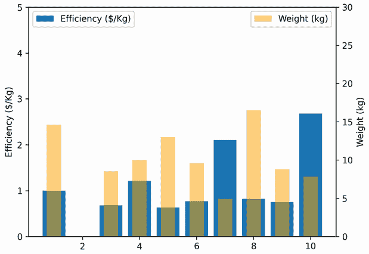

图 C.29 货物自行车装载解决方案

4. 下一个列表显示了解决露天采矿问题的步骤。

列表 C.12 解决露天采矿问题

```py
import numpy as np

BLOCKS = np.arange(0, 17)                                              ①
LEVEL23 = np.array([8, 9, 10, 11, 12, 13, 14, 15, 16, 17])             ②
COST = np.array([100, 100, 100, 100, 100, 100, 100, 100,
                 200, 200, 200, 200, 200, 200, 
                 1000, 1000, 1000, 1000])                              ③

VALUE = np.array([200, 0, 0, 0, 0, 0, 300, 0, 
                  0, 500, 0, 200, 0, 0, 
                  0, 0, 1000, 0])                                      ④

Precedence = np.array([[0,1, 2],
                [1, 2, 3],
                [2, 3, 4],
                [3, 4, 5],
                [4, 5, 6],
                [5, 6, 7],
                [8, 9, 10],
                [9, 10, 11],
                [10, 11, 12],
                [11, 12, 13]])                                         ⑤
```

① 矿中的块

② 2 级和 3 级中的块

③ 块的成本。

④ 块的价值

⑤ 定义 LEVEL23 中每个块的成本。

作为延续，你可以如下可视化 2 级和 3 级中块提取的前置关系：

```py
import networkx as nx
import matplotlib.pyplot as plt

G = nx.DiGraph()                                                        ①

G.add_nodes_from(BLOCKS)                                                ②

for b, arc in zip(LEVEL23, Precedence):                                 ③
    for predecessor in arc:                                             ③
        G.add_edge(predecessor, b)                                      ③

pos = nx.spring_layout(G)                                               ④
pos.update({0: (0, 0), 1: (0, 1), 2: (0, 2), 3: (1, 0), 4: (1, 1), 5: (1,
➥ 2), 6: (2, 0), 7: (2, 1), 
            8: (2, 2), 9: (3, 0), 10: (3, 1), 11: (3, 2), 12: (4, 0), 13:
➥ (4, 1), 
            14: (4, 2), 15: (5, 0), 16: (5, 1), 17: (5, 2)})            ⑤

plt.figure(figsize=(10, 5))                                             ⑥
nx.draw(G, pos, with_labels=True, node_size=1500, node_color='skyblue', ⑥
➥ font_size=12, font_weight='bold')                                    ⑥
plt.title("Precedence graph for extraction of blocks in Level 2 and 3") ⑥
plt.show()                                                              ⑥
```

① 创建有向图。

② 添加节点。

③ 添加前置边。

④ 创建一个具有所有节点默认位置的 pos 字典。

⑤ 更新具有特定位置的节点的位置。

⑥ 绘制图表。

图 C.30 显示了在 2 级和 3 级中提取块的前置图。


图 C.30 2 级和 3 级中提取块的前置图

作为列表 C.12 的延续，以下代码片段显示了如何将问题定义为单目标约束优化问题。

```py
from pymoo.algorithms.soo.nonconvex.ga import GA
from pymoo.operators.crossover.pntx import PointCrossover
from pymoo.operators.mutation.pm import PolynomialMutation
from pymoo.operators.repair.rounding import RoundingRepair
from pymoo.operators.sampling.rnd import FloatRandomSampling
from pymoo.core.problem import Problem
from pymoo.optimize import minimize

class OpencastMiningProblem(Problem):
    def __init__(self):
        super().__init__(n_var=18, n_obj=1, n_constr=len(LEVEL23), xl=0,
➥ xu=1)

    def _evaluate(self, X, out, *args, **kwargs):
        X = np.round(X)
        profits = np.sum((VALUE - COST) * X, axis=1)

        constraints = np.zeros((X.shape[0], len(LEVEL23)))
        for i in range(X.shape[0]):
            for j, b in enumerate(LEVEL23):
                constraints[i, j] = min(X[i, Precedence[j]-1]) - X[i, b-1]

        out["F"] = profits.reshape(-1, 1)
        out["G"] = constraints
```

我们现在可以定义 GA 求解器并将其应用于以下问题求解：

```py
problem = OpencastMiningProblem()
algorithm = GA(
    pop_size=50,
    sampling=FloatRandomSampling(),
    crossover=PointCrossover(prob=0.8, n_points=2),
    mutation = PolynomialMutation(prob=0.3, repair=RoundingRepair()),
    eliminate_duplicates=True
)

res = minimize(problem, algorithm, ('n_gen', 50), seed=1, verbose=True)

print("Best solution found:\nX =", res.X)
print("Objective value =", -res.F[0])
```

运行此代码会产生以下输出：

```py
Best solution found:
X = [0 1 1 0 1 1 0 1 1 0 1 0 1 1 1 1 0 1]
Objective value = 4300.0
```

书籍 GitHub 仓库中 C.12 列表的完整版本包括了帕累托优化实现，将问题视为一个多目标优化问题。

## C.8 第九章：粒子群优化

### C.8.1 练习

1. 多项选择题和判断题：为以下每个问题选择正确答案。

1.1. 以下哪项是 PSO 中星型结构的缺点？

a. 可能会导致过早收敛到次优解。

b. 可能会导致算法收敛速度过慢。

c. 可能会导致算法陷入局部最优。

d. 不允许算法有效地探索搜索空间。

1.2. 异步 PSO 通常会产生更好的结果，因为它使粒子使用更及时的信息。 

a. 正确

b. 错误

1.3. PSO 中认知组件和社会组件之间的区别是什么？

a. 认知组件基于粒子的自身经验，而社会组件基于整个群体的经验。

b. 认知组件基于粒子的邻居的经验，而社会组件基于粒子的自身经验。

c. 认知组件基于随机扰动，而社会组件基于梯度信息。

d. 认知组件和社会组件是同一件事。

1.4. 环形拓扑，或 lbest PSO，已被证明比其他网络结构收敛得更快，但容易陷入局部最小值。

a. 正确

b. 错误

1.5. 在二进制 PSO（BPSO）中，二进制字符串中的每个位都通过考虑其当前状态、迄今为止保持的最佳状态以及其相邻位的最优状态来更新。

a. 正确

b. 错误

1.6. 在 PSO 中，使粒子表现得像独立爬山者的速度模型是

a. 仅认知模型

b. 仅社会模型

1.7. PSO 保证找到函数的全局最优解。

a. 正确

b. 错误

1.8. 在 PSO 算法中，加速度系数的作用是什么？

a. 控制粒子的速度

b. 控制探索/利用权衡

c. 控制群体大小

d. 控制突变率

1.9. PSO 是一种局部搜索算法，只能找到局部最优解。

a. 正确

b. 错误

1.10. PSO 最初是为连续值空间开发的。

a. 正确

b. 错误

2. 在 Martin 等人在其文章“局部终止标准用于群体智能：局部随机扩散搜索与蚂蚁巢穴选择之间的比较”中描述的餐厅游戏中，一群代表在一个不熟悉的城镇参加长时间的会议。每晚他们都必须找到吃饭的地方。有大量的餐厅可供选择，每家餐厅都提供大量的餐点。该群体面临的问题是找到最好的餐厅，即大多数代表愿意就餐的餐厅。即使通过并行穷举搜索餐厅和餐点组合也会花费太长时间。如果你使用 PSO 来解决这个问题，你将如何描述在这个问题背景下速度更新的三个组件？

3. 共享出行是共享经济商业模式的一种成功实施，其中个人车辆由车主或驾驶员与具有相似行程和日程的个别旅客共享。共享出行问题是一个多目标约束优化问题。共享出行优化目标的不完整列表包括

• 最小化驾驶员行程的总旅行距离或时间

•   最小化乘客行程的总旅行时间

•   最大化匹配（服务）请求的数量

•   最小化驾驶员行程的成本

•   最小化乘客行程的成本

•   最大化驾驶员的收入

•   最小化乘客的等待时间

•   最小化所需驾驶员的总数

考虑图 C.31 所示的拼车问题，其目标是制定驾驶员的行程，以最小化车辆行程的总距离。该多目标优化的表述如下：

找到最小化 *f* 的 *s*


其中

•   *f* 是为服务所有乘客而进行的车辆行程的总距离。

•   *s[i,j]* 如果位置 *j* 被分配在驾驶员的行程中则为 1，否则为 0。

•   *d[i,j]* 是路线内两点之间的距离，其中

*d[i,j]* = √((*x[i]* – *x[j]*)² + (*y[i]* – *y[j]*)²

•   *P* 是乘客集合，具有已知的接车和送车点。

•   *V* 是车辆集合，具有预定义的起始和终止位置。


图 C.31 拼车问题

给定五位乘客的接车和送车位置（表 C.3）以及两位驾驶员的起始和终止位置（表 C.4），定义一个合适的粒子表示（即候选解决方案），以表示每位驾驶员的行程并评估其适应性。

表 C.3 乘客的接车和送车位置

| 乘客 | 接车 x 坐标 | 接车 y 坐标 | 送车 x 坐标 | 送车 y 坐标 |
| --- | --- | --- | --- | --- |
| P1 | 9 | 9 | 4 | 2 |
| P2 | 8 | 5 | 2 | 4 |
| P3 | 6 | 1 | 8 | 6 |
| P4 | 7 | 6 | 9 | 8 |
| P5 | 3 | 5 | 10 | 3 |

表 C.4 驾驶员的起始和终止位置

| 驾驶员 | 起始 x 坐标 | 起始 y 坐标 | 终止 x 坐标 | 终止 y 坐标 |
| --- | --- | --- | --- | --- |
| A | 4 | 1 | 8 | 10 |
| B | 1 | 6 | 9 | 4 |

4.   考虑旅行行程规划问题，其目标是提供为访问新城市的游客提供的最佳旅行行程，考虑到要访问地点的质量、景点之间的邻近性以及一天中可以完全占用且空闲时间最少的时间。问题表述如下：

找到优化 *f* 的 *X*

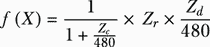

遵循以下约束条件：

•   行程的持续时间不得超过给定一天的总时间，该时间为 480 分钟。这表示为行程中每个场所的持续时间与要访问的总通勤时间的总和。这意味着 *Z[d]* + *Z[c]* <= 480 分钟。

•   解决方案中不应重复相同的场所。

其中

•   *X* = [*Z[d] Z[c] Z[r]*]*^T*

•   *Z[d]* 表示行程的持续时间（分钟）。

•   *Z[c]* 表示行程中的总通勤时间。

•   *Z[r]* 代表行程中所有场所的平均评分。评分来自 Yelp、Google 评论或其他来源。

表 C.5 列出了 10 个景点之间的通勤时间。

表 C.5 景点之间的通勤时间

| Commute time (mins) | To |
| --- | --- |
|  | 1 | 2 | 3 | 4 | 5 | 6 | 7 | 8 | 9 |
| From | 0 | 10 | 20 | 7 | 11 | 8 | 19 | 7 | 1 | 1 |
|  | 1 | 0 | 12 | 14 | 1 | 7 | 12 | 10 | 22 | 22 |
| 2 | 12 | 0 | 25 | 21 | 28 | 1 | 22 | 12 | 12 |
| 3 | 14 | 25 | 0 | 15 | 15 | 25 | 4 | 6 | 6 |
| 4 | 1 | 21 | 15 | 0 | 25 | 22 | 11 | 10 | 10 |
| 5 | 7 | 28 | 15 | 25 | 0 | 28 | 14 | 28 | 29 |
| 6 | 12 | 1 | 25 | 22 | 28 | 0 | 22 | 12 | 12 |
| 7 | 10 | 22 | 4 | 11 | 14 | 22 | 0 | 3 | 2 |
| 8 | 22 | 12 | 6 | 10 | 28 | 12 | 3 | 0 | 1 |
| 9 | 22 | 12 | 6 | 10 | 29 | 12 | 2 | 1 | 0 |

不同景点的持续时间及评分列于表 C.6 中。

表 C.6 景点评分和持续时间

| ID | Rating | Duration (mins) |
| --- | --- | --- |
| 0 | Starting hotel |
| 1 | 2 | 120 |
| 2 | 3 | 60 |
| 3 | 3 | 180 |
| 4 | 0 | 180 |
| 5 | 5 | 120 |
| 6 | 1 | 60 |
| 7 | 4 | 60 |
| 8 | 0 | 60 |
| 9 | 2 | 120 |

定义一个合适的粒子表示（即候选解），并进行两次手动迭代，以展示如何使用 PSO 算法（假设群体大小为 4）来解决这个问题。

5.   *三角测量法*用于确定移动对象（如连接车辆或手机）的位置。这个过程使用车辆与三个或更多已知基站的距离来确定车辆的位置。通过测量每个基站设备信号的信号强度，可以计算出设备与每个基站之间的距离。这些距离测量产生的三个（或更多）圆的交点给出了设备位置的估计。如图 C.32 所示，三个基站发布它们的坐标并传输参考信号。


图 C.32 基站三角测量

连接车辆使用参考信号来估计到每个单元格 *r[i]* 的距离。这些距离测量值 *r[i]* 可能会受到噪声的影响。假设相关的误差由以下方程给出：


车辆位置（*ϕ*[0]，*λ*[0]）是使以下目标函数最小化的位置：

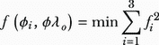

使用 PSO 算法编写 Python 代码来查找车辆的位置。

6.   咖啡店提供两种咖啡大小：小杯和大杯。制作一杯小咖啡的成本是 1 美元，制作一杯大咖啡的成本是 1.50 美元。咖啡店以每杯 2 美元的价格出售小杯咖啡，以每杯 3 美元的价格出售大杯咖啡。咖啡店希望最大化其利润，但同时也希望确保每天至少出售 50 杯小杯咖啡和 75 杯大杯咖啡，并且分别最多不超过 300 杯和 450 杯。这个问题可以表述为一个优化问题，如下所示：

最大化利润 = 2*x*[1] + 3*x*[2] - (*x*[1] + 1.5*x*[2])

约束条件：

50 ≤ *x*[1] ≤ 300

75 ≤ *x*[2] ≤ 450

其中

•   *x*[1] 是制作的小杯咖啡数量。

•   *x*[2] 是制作的大杯咖啡数量。

利润是总利润，其中方程中的第一项代表咖啡销售收入，第二项代表制作咖啡的成本。编写 Python 代码以找到每天制作小杯咖啡和大杯咖啡的最佳数量。

7.   一家医院希望优化其医生的工作安排，以最小化劳动力总成本，同时确保有足够的医生满足患者需求。每位医生的时薪不同，而且一天中不同时间段的病人需求水平也不同。目标是找到最优的排班方案，以最小化劳动力总成本，同时满足高峰时段和非高峰时段的最低医生需求。

医院必须在高峰时段安排至少四名医生，在非高峰时段至少安排两名医生。医院可以以较低的时薪聘请兼职医生，但他们只能在非高峰时段工作。医院还有选择在高峰时段支付全职医生加班费以满足需求的选项，但时薪较高。

该问题可以用以下数学公式描述：

最小化劳动力总成本：*f*(*x*) = Σ(*c[i]* × *x[i]*) + Σ(*c[i]^o* × *x[i]^o*) + Σ(*c[j]^p* × *x[j]^p*)

约束条件如下：

•   Σ*x[i]* + Σ*x[i]^o* ≥ 4：高峰时段至少安排四名医生。

•   Σ*x[i]^p* ≥ 2：非高峰时段至少安排两名医生。

•   *x[i]*, *x[i]^o*, *x[j]^p* ≥ 0：非负约束

其中

•   *i* 是全职医生的索引，*i* = 1, 2, ..., *m*.

•   *j* 是兼职医生的索引，*j* = 1, 2, ..., *n*。

预定义参数：

•   *c[i]* 是全职医生 *i* 的时薪。

•   *c[i]^o* 是全职医生 *i* 的加班时薪。

•   *c[j]^p* 是兼职医生 *j* 的时薪。

决策变量：

•   *x[i]* 是全职医生 *i* 在高峰时段工作的小时数。

•   *x[i]^o* 是全职医生 *i* 在高峰时段加班工作的小时数。

•   *x[j]^p* 是兼职医生 *j* 在非高峰时段工作的小时数。

假设全职医生的时薪为 [30, 35, 40, 45, 50]，他们的加班费是全职时薪的 1.5 倍，兼职医生的时薪为 [25, 27, 29, 31, 33]。编写 Python 代码使用 PSO 求解此问题。

8.   在城市 *X* 的邻域 *Y* 中，有八所学校共同拥有 100 台显微镜用于生物课教学。然而，这些资源在学校之间并不是均匀分布的。随着学生入学人数的最近变化，四所学校拥有的显微镜多于所需，而其他四所学校则需要额外的显微镜。为了解决这个问题，负责城市 *X* 学校委员会生物系的 Rachel Carson 博士决定使用数学模型。她选择使用运输问题模型，这是一种旨在高效分配资源并最小化运输成本的策略，正如 R. Lovelace 在其文章“地理分析中的开源工具”中所述 [7]。该模型将供应 *n* 和需求 *m* 表示为网络中各个点的决策变量的单位权重，从供应点到需求点的单位运输成本等同于节点之间的时间或距离。这些数据被捕获在一个 *n***m* 成本矩阵中。该整数线性规划问题的正式陈述在 Daskin 的书籍“网络和离散定位：模型、算法和应用” [8] 中描述如下：


满足以下约束条件

•   Σ*[j]*[∈]*[J] x[ij]* ≤ *S[i]* 对于所有 *i* ∈ *I*

•   Σ*[j]*[∈]*[J] x[ij]* ≥ *D[i]* 对于所有 *j* ∈ *J*

•   *x[ij]* ≥ 0 对于所有 *i* ∈ *I* 和所有 *j* ∈ *J*

其中

•   *i* 是每个潜在的源节点。

•   *I* 是所有潜在源节点的完整集合。

•   *j* 是每个潜在的终点节点。

•   *J* 是所有潜在节点的完整集合。

•   *x[ij]* 是从所有 *i* ∈ *I* 到所有 *j* ∈ *J* 的运输量。

•   *c[ij]* 是所有 *i*, *j* 对之间的单位运输成本。

•   *S[i]* 是节点 *i* 的供应量，对于所有 *i* ∈ *I*。

•   *D[j]* 是节点 *i* 的需求量，对于所有 *j* ∈ *J*。

编写 Python 代码使用 PSO 解决这个问题。在地理空间地图上可视化解决方案。

9.   在书籍 GitHub 存储库的第九章/项目文件夹中，提供了以下样本研究项目以供审查和实验。

•   路由——探讨使用 PSO 在多伦多两个感兴趣点之间找到最短路径。

•   公交站点的放置——探讨如何使用粒子群优化算法（PSO）在加拿大安大略省滑铁卢/基奇纳地区找到公交站点的最佳位置。

### C.8.2 解决方案

1.   多项选择题和真/假题

1.1.   c) 可能会导致算法陷入局部最优。

1.2.   a) 正确

1.3.   a) 认知组件基于粒子的自身经验，而社交组件基于整个群体的经验。

1.4.   b) 错误

1.5.   a) 正确

1.6.   a) 认知模型

1.7.   b) 错误

1.8.   b) 为了控制探索/利用权衡

1.9.   b) 错误（PSO 旨在全局探索搜索空间，并有可能找到全局最优解。）

1.10. a) 正确

2.   想象一群代表访问一个不熟悉的城市参加会议。他们试图使用 PSO 原则在该镇找到最好的餐厅。这个城镇很大，每位代表从一个不同的位置开始。每位代表都有一种偏好的探索餐厅的方式，比如沿着某些街道散步或访问特定的社区。这类似于 PSO 中的惯性成分，其中粒子保持它们当前的速度和方向，确保它们不会太突然地改变它们的探索模式。

随着每位代表访问不同的餐厅，他们会记住迄今为止他们去过最好的餐厅（他们的个人最佳）。如果他们遇到一个不那么吸引人的餐厅，他们更有可能回到他们最喜欢的餐厅，因为他们知道根据他们自己的经验，这是一个好的选择。这是认知成分，在 PSO 中，粒子被吸引到它们个人的最佳位置，遵循它们过去的经验和个人偏好。

代表们还通过群聊相互交流，分享他们找到的最好餐厅的经历和位置。如果有人发现一家杰出的餐厅，其他人可能会决定去那个地方亲自尝试，即使它不是他们的个人最爱。这是社交成分，在 PSO 中，粒子受到全局最佳位置或群体集体知识的影响。

3.   由于公式的离散性质，应使用基于排列的 PSO。在这个算法中，一个粒子代表每个司机要接车和下车的乘客的排序。在这个问题中，我们有两个车辆 A 和 B，以及五个乘客请求（P1–P5）需要匹配。例如，一个有五个乘客和两个司机的候选解决方案将具有以下格式：

| A^+ | P3^+ | P4^+ | P3^– | P5^+ | P4^– | P5^– | A^– |
| --- | --- | --- | --- | --- | --- | --- | --- |
| B^+ | P1^+ | P2^+ | P2^– | P1^– | B^– |  |  |

其中

•   + 表示乘客请求的接车点和车辆的起点。

•   – 表示乘客请求的交货点和车辆的终点。

这个解决方案可以读作如下：

•   车辆 A 的起点 → 乘客 3 接车 → 乘客 4 接车 → 乘客 3 下车 → 乘客 5 接车 → 乘客 4 下车 → 乘客 5 下车 → 车辆 A 的终点。

•   车辆 B 的起点 → 乘客 1 接车 → 乘客 1 接车 → 乘客 2 下车 → 乘客 2 下车 → 车辆 B 的终点。

这两个时间表也可以按以下方式连接：

| A^+ | P3^+ | P4^+ | P3^- | P5^+ | P4^- | P5^- | A^- | B^+ | P1^+ | P2^+ | P2^- | P1^- | B^- |
| --- | --- | --- | --- | --- | --- | --- | --- | --- | --- | --- | --- | --- | --- |

我们使用目标函数如下评估这个解决方案：

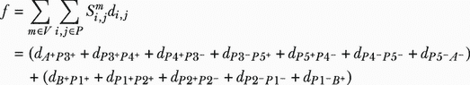

关于具有时间窗口的拼车问题（RMPTW）的更全面讨论以及该简化问题的扩展版本，请参阅 Herbawi 和 Weber 的文章“用于解决具有时间窗口的动态拼车问题的遗传和插入启发式算法” [9]。

4.   二进制粒子群优化（BPSO）用于处理此问题。使用二进制字符串来描述要访问的吸引子。例如，[0 0 1 0 1 0 0 0 0] 表示访问吸引子 3 和 5。速度的计算使用以下公式：

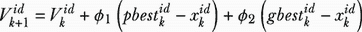

其中

•   *i* 是粒子编号。

•   *d* 是维度或吸引子。

•   *v[k]^(id)* 是第 *k* 次迭代中粒子 *i* 和维度 *d* 的速度。

•   *pbest[k]^(id)* 是第 *t* 次迭代中粒子 *i* 和维度 *d* 的个人最佳值。

•   *gbest[k]^d* 是第 *k* 次迭代中维度 *d* 的全局最优值。

•   *x[k]^(id)* 是第 *k* 次迭代中粒子 *i* 和维度 *d* 的当前位置。

•   *ϕ*[1], *ϕ*[2] 是在 0 和 2 之间均匀生成的随机数。

更新速度向量后，每个速度的 sigmoid 值更新如下：

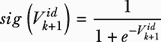

使用速度的 sigmoid 值创建一个新的位置。接下来，粒子位置更新如下：

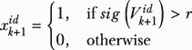

其中

•   *r* 是在 0 和 1 之间均匀生成的随机数。

•   *sig*(*v[k]*[+1]*^(id)*) 是速度 *v[k]*[+1]*^(id)* 的 sigmoid 值

表 C.7 初始化

|  | *ϕ*[1] | *ϕ*[2] | *v*[01] | *v*[02] | *v*[03] | *v*[04] | *v*[05] | *v*[06] | *v*[07] | *v*[08] | *v*[09] |
| --- | --- | --- | --- | --- | --- | --- | --- | --- | --- | --- | --- |
| *x*[1] | 0 | 0 | 0 | 0 | 0 | 0 | 0 | 0 | 0 | 0 | 0 |
| *x*[2] | 0 | 0 | 0 | 0 | 0 | 0 | 0 | 0 | 0 | 0 | 0 |
| *x*[3] | 0 | 0 | 0 | 0 | 0 | 0 | 0 | 0 | 0 | 0 | 0 |
| *x*[4] | 0 | 0 | 0 | 0 | 0 | 0 | 0 | 0 | 0 | 0 | 0 |

令 *p[i]* 为粒子在表 C.8 中所示的吸引子 *i* 的当前位置的二进制值。

表 C.8 9 个吸引子的位置二进制值

|  | *p*[1] | *p*[2] | *p*[3] | *p*[4] | *p*[5] | *p*[6] | *p*[7] | *p*[8] | *p*[9] |
| --- | --- | --- | --- | --- | --- | --- | --- | --- | --- |
| *x*[1] | 1 | 1 | 0 | 0 | 0 | 0 | 0 | 0 | 0 | 0 | 0 |
| *x*[2] | 0 | 0 | 1 | 0 | 0 | 0 | 0 | 0 | 0 |
| *x*[3] | 0 | 1 | 0 | 0 | 1 | 0 | 0 | 0 | 0 |
| *x*[4] | 1 | 0 | 0 | 0 | 0 | 0 | 1 | 0 | 0 |

表 C.9 初始化：适应度评估

|  | *p*[1] | *p*[2] | *p*[3] | *p*[4] | *p*[5] | *p*[6] | *p*[7] | *p*[8] | *p*[9] | 总通勤时间 | 总访问地点 | 平均评分 | 总持续时间 | *f*(*x[i]*) |
| --- | --- | --- | --- | --- | --- | --- | --- | --- | --- | --- | --- | --- | --- | --- |
| *x*[1] | 1 | 1 | 0 | 0 | 0 | 0 | 0 | 0 | 0 | 34 | 2 | 2.000 | 180 | 0.700 |
| *x*[2] | 0 | 0 | 1 | 0 | 0 | 0 | 0 | 1 | 0 | 19 | 2 | 5.000 | 240 | 2.405 |
| *x*[3] | 0 | 1 | 0 | 0 | 1 | 0 | 0 | 0 | 0 | 76 | 2 | 2.500 | 180 | 0.809 |
| *x*[4] | 1 | 0 | 0 | 0 | 0 | 0 | 1 | 0 | 0 | 30 | 2 | 3.000 | 180 | 1.059 |

表 C.10 粒子初始化时的当前个人最佳

|  | pbest[01] | pbest [02] | pbest [03] | pbest [04] | pbest [05] | pbest [06] | pbest [07] | pbest [08] | pbest [09] | pbestVal |
| --- | --- | --- | --- | --- | --- | --- | --- | --- | --- | --- |
| *x*[1] | 1 | 1 | 0 | 0 | 0 | 0 | 0 | 1 | 1 | 0.700 |
| *x*[2] | 0 | 0 | 1 | 0 | 0 | 0 | 0 | 0 | 0 | 2.405 |
| *x*[3] | 0 | 1 | 0 | 0 | 1 | 0 | 0 | 0 | 1 | 0.809 |
| *x*[4] | 1 | 0 | 0 | 0 | 0 | 0 | 1 | 1 | 0 | 1.059 |

表 C.11 迭代 1：速度更新

|  | *ϕ*[1] | *ϕ*[2] | *v*[11] | *v*[12] | *v*[13] | *v*[14] | *v*[15] | *v*[16] | *v*[17] | *v*[18] | *v*[19] |
| --- | --- | --- | --- | --- | --- | --- | --- | --- | --- | --- | --- |
| *x*[1] | 0.958 | 0.830 | -0.830 | -0.830 | 0.830 | 0.000 | 0.000 | 0.000 | 0.000 | 0.830 | 0.000 |
| *x*[2] | 1.347 | 1.517 | 0.000 | 0.000 | 0.000 | 0.000 | 0.000 | 0.000 | 0.000 | 0.000 | 0.000 |
| *x*[3] | 1.320 | 1.649 | 0.000 | -1.649 | 1.649 | 0.000 | -1.649 | 0.000 | 0.000 | 1.649 | 0.000 |
| *x*[4] | 0.757 | 0.678 | -0.678 | 0.000 | 0.678 | 0.000 | 0.000 | 0.000 | -0.678 | 0.678 | 0.000 |

表 C.12 迭代 1 后粒子的更新 sigmoid 速度值

|  | sig(*v*[11]) | sig(*v*[12]) | sig(*v*[13]) | sig(*v*[14]) | sig(*v*[15]) | sig(*v*[16]) | sig(*v*[17]) | sig(*v*[18]) | sig(*v*[19]) |
| --- | --- | --- | --- | --- | --- | --- | --- | --- | --- |
| *x*[1] | 0.304 | 0.304 | 0.696 | 0.500 | 0.500 | 0.500 | 0.500 | 0.696 | 0.500 |
| *x*[2] | 0.500 | 0.500 | 0.500 | 0.500 | 0.500 | 0.500 | 0.500 | 0.500 | 0.500 |
| *x*[3] | 0.500 | 0.161 | 0.839 | 0.500 | 0.161 | 0.500 | 0.500 | 0.839 | 0.500 |
| *x*[4] | 0.337 | 0.500 | 0.663 | 0.500 | 0.500 | 0.500 | 0.337 | 0.663 | 0.500 |

表 C.13 迭代 1 后决定粒子更新的均匀生成随机数

|  | *r*[11] | *r*[12] | *r*[13] | *r*[14] | *r*[15] | *r*[16] | *r*[17] | *r*[18] | *r*[19] |
| --- | --- | --- | --- | --- | --- | --- | --- | --- | --- |
| 1 | 0.477 | 0.724 | 0.875 | 0.654 | 0.088 | 0.089 | 0.853 | 0.925 | 0.528 |
| 2 | 0.673 | 0.530 | 0.438 | 0.785 | 0.218 | 0.763 | 0.838 | 0.749 | 0.590 |
| 3 | 0.534 | 0.086 | 0.301 | 0.763 | 0.653 | 0.754 | 0.809 | 0.974 | 0.763 |
| 4 | 0.218 | 0.697 | 0.875 | 0.854 | 0.116 | 0.941 | 0.678 | 0.742 | 0.965 |

迭代 1：全局最优值为 2.405，最佳粒子为*x*[2] = [0 0 1 0 0 0 0 0 0]。

迭代 2：速度更新

表 C.14 迭代 2 后的粒子状态和适应度函数更新

|  | *p*[1] | *p*[2] | *p*[3] | *p*[4] | *p*[5] | *p*[6] | *p*[7] | *p*[8] | *p*[9] | 总通勤时间 | 总访问地点 | 平均评分 | 总持续时间 | *f*(*x[i]*) |
| --- | --- | --- | --- | --- | --- | --- | --- | --- | --- | --- | --- | --- | --- |
| *x*[1] | 0 | 0 | 0 | 0 | 1 | 1 | 0 | 0 | 0 | 64 | 2 | 3.500 | 180 | 1.158 |
| *x*[2] | 0 | 0 | 1 | 0 | 1 | 0 | 0 | 0 | 0 | 37 | 2 | 5.000 | 300 | 2.901 |
| *x*[3] | 0 | 1 | 1 | 0 | 0 | 0 | 0 | 0 | 0 | 70 | 2 | 2.500 | 240 | 1.091 |
| *x*[4] | 1 | 0 | 0 | 0 | 1 | 0 | 0 | 0 | 0 | 24 | 2 | 4.500 | 240 | 2.143 |

表 C.15 迭代 2 后粒子的更新个人最佳

|  | pbest[11] | pbest [12] | pbest [13] | pbest [14] | pbest [15] | pbest [16] | pbest [17] | pbest [18] | pbest [19] | pbestVal |
| --- | --- | --- | --- | --- | --- | --- | --- | --- | --- | --- |
| *x*[1] | 0 | 0 | 0 | 0 | 1 | 1 | 0 | 0 | 0 | 1.158 |
| *x*[2] | 0 | 0 | 1 | 0 | 1 | 0 | 0 | 0 | 0 | 2.901 |
| *x*[3] | 0 | 1 | 1 | 0 | 0 | 0 | 0 | 0 | 0 | 1.091 |
| *x*[4] | 1 | 0 | 0 | 0 | 1 | 0 | 0 | 0 | 0 | 2.143 |

全局最佳值为 2.901，最佳粒子为 *x*[2] = [0 0 1 0 1 0 0 0 0]。重复执行，直到满足停止条件。

5.   下一个列表显示了使用 PSO 解决三角定位问题的步骤。

列表 C.13 使用 PSO 解决三角定位问题

```py
import numpy as np
from pyswarms.single import GlobalBestPSO
import pyswarms as ps

def objective_function(pos):                                              ①
    r = np.array([6, 6.5, 8])
    x0 = np.array([1, 3, 7])
    y0 = np.array([5, 1, 7])

    x = pos[:, 0]
    y = pos[:, 1]

    f = np.sum(r - np.sqrt((x0 - x.reshape(-1, 1)) ** 2 + (y0 - y.reshape(-
➥1, 1)) ** 2), axis=1)
    return f

options = {"c1": 0.5, "c2": 0.5, "w": 0.79}                               ②
bounds = (np.array([0, 0]), np.array([8, 8]))                             ②

optimizer = GlobalBestPSO(n_particles=100, dimensions=2, options=options,
➥ bounds=bounds)                                                         ③
best_cost, best_position = optimizer.optimize(objective_function,
➥ iters=1000)                                                            ③

print("Best position:", np.round(best_position,2))                        ④
print("Best cost:", np.round(best_cost,3))                                ④
```

① 定义目标函数。

② 设置 PSO 算法。

③ 初始化 GlobalBestPSO，并最小化目标函数。

④ 打印结果。

6.   下一个列表显示了使用 PSO 解决咖啡店问题的步骤。

列表 C.14 使用 PSO 解决咖啡店问题

```py
import numpy as np                                                        ①
import pyswarms as ps                                                     ①

def fitness_function(x):                                                  ②
    n_particles = x.shape[0]                                              ②
    profit=0                                                              ②
    for i in range(n_particles):                                          ②
        profit=-(2*x[i][0] + 3*x[i][1] - (x[i][0] + 1.5*x[i][1]))         ②
    return profit                                                         ②

num_particles = 10                                                        ③
num_iterations = 100                                                      ③

lb = np.array([50, 75])                                                   ④
ub = np.array([300, 450])                                                 ④
bounds = (lb, ub)                                                         ④

options={'w':0.79, 'c1': 1.5, 'c2': 1.3}                                  ⑤

optimizer = ps.single.GlobalBestPSO(n_particles=num_particles,
➥ dimensions=2, options=options, bounds=bounds)                          ⑥

best_cost, best_pos = optimizer.optimize(fitness_function,
➥ iters=num_iterations)                                                  ⑦

best_pos=np.asarray(best_pos, dtype = 'int') 
print('###############################################') 
print('Total profit: ', round(-best_cost, 2), '$') 
print('Optimal number of small coffees to make: ',best_pos[0]) 
print('Optimal number of large coffees to make: ', best_pos[1]) 
```

① 导入所需的库。

② 定义适应度函数。

③ 设置粒子数量和迭代次数。

④ 设置变量的上下限。

⑤ 设置优化器选项。

⑥ 初始化优化器。

⑦ 执行优化。

7.   下一个列表显示了使用 PSO 解决医生排班问题的步骤。

列表 C.15 使用 PSO 解决医生排班问题

```py
import matplotlib.pyplot as plt
import numpy as np
import pyswarms as ps

full_time_rates = np.array([30, 35, 40, 45, 50])                            ①
overtime_rates = full_time_rates * 1.5                                      ①
part_time_rates = np.array([25, 27, 29, 31, 33])                            ①

def objective_function(x): 
    x1 = x[:, :len(full_time_rates)]                                        ②
    x2 = x[:, len(full_time_rates):2 * len(full_time_rates)]                ②
    x3 = x[:, 2 * len(full_time_rates):]                                    ②

    total_cost = np.sum(x1 * full_time_rates) + np.sum(x2 * overtime_rates)
➥ + np.sum(x3 * part_time_rates)                                           ③

    penalty_x1_x2 = np.maximum(0, 4 - np.sum(x1) - np.sum(x2)) * 10000
    penalty_x3 = np.maximum(0, 2 - np.sum(x3)) * 10000                      ④
                                                                            ④
    total_cost_with_penalty = total_cost + penalty_x1_x2 + penalty_x3       ④

    return total_cost_with_penalty

min_bound = np.zeros(3 * len(full_time_rates))                              ⑤
max_bound = np.full(3 * len(full_time_rates), 10)                           ⑤
bounds = (min_bound, max_bound)                                             ⑤
options = {'w': 0.74, 'c1': 2.05, 'c2': 2.05, 'k': 5, 'p': 1}               ⑥
optimizer = ps.single.LocalBestPSO(n_particles=30, dimensions=3 *
➥ len(full_time_rates), options=options, bounds=bounds)                    ⑦
cost, pos = optimizer.optimize(objective_function, iters=100, verbose=True) ⑧
optimal_x1 = pos[:len(full_time_rates)]                                     ⑨
optimal_x2 = pos[len(full_time_rates):2 * len(full_time_rates)]             ⑨
optimal_x3 = pos[2 * len(full_time_rates):]                                 ⑨
```

① 设置全职小时费率、加班费率和兼职医生费率。

② 定义三个决策变量。

③ 将总成本定义为目标函数。

④ 定义约束并将其作为惩罚添加到成本函数中。

⑤ 初始化边界。

⑥ 设置 PSO 的选项。

⑦ 创建 PSO 的实例。

⑧ 执行优化。

⑨ 提取决策变量 x1、x2 和 x3 的最优值。

列表 C.15 的完整版本可在本书的 GitHub 仓库中找到，其中包含一个用于打印和可视化结果的函数。图 C.33 显示了每位医生的工作小时数。


图 C.33 每位医生的工作小时数

8.   下一个列表显示了使用 PSO 解决供应链优化问题的步骤。我们首先导入所需的库。

列表 C.16 使用 PSO 解决供应链优化问题

```py
import numpy as np
import random
from pymoo.algorithms.soo.nonconvex.pso import PSO
from pymoo.optimize import minimize
from pymoo.algorithms.soo.nonconvex.ga import GA
from pymoo.operators.crossover.pntx import PointCrossover
from pymoo.operators.mutation.pm import PolynomialMutation
from pymoo.operators.repair.rounding import RoundingRepair
from pymoo.operators.sampling.rnd import FloatRandomSampling
from pymoo.core.problem import Problem
from geopy.geocoders import Nominatim
from geopy.distance import geodesic
import folium
```

我们接着定义如下问题数据：

```py
supply_schools = [1, 6, 7, 8]                             ①
demand_schools = [2, 3, 4, 5]                             ②
amount_supply = [20, 30, 15, 35]                          ③
amount_demand = [5, 45, 10, 40]                           ④
n_var=len(supply_schools)*len(demand_schools)             ⑤
```

① 可提供显微镜的学校

② 请求显微镜的学校

③ 每所学校可用的显微镜数量

④ 每所学校请求的显微镜数量

⑤ 变量数量

作为 C.16 列表的延续，以下函数生成中心点周围的随机位置，以表示所选城市中的供应和需求学校（以多伦多为例）。我们使用 geopy 计算学校之间的距离：

```py
np.random.seed(0)                                                        ①

def generate_random(number, center_point):
    lat, lon = center_point                                              ②
    coords = [(random.uniform(lat - 0.01, lat + 0.01), random.uniform(lon -
➥ 0.01, lon + 0.01)) for _ in range(number)]
    return coords

supply_coords = generate_random(len(supply_schools), [location.latitude,
➥ location.longitude])                                                  ③
demand_coords = generate_random(len(demand_schools), [location.latitude,
➥ location.longitude])                                                  ④

distances = []                                                           ⑤
for supply in supply_coords:                                             ⑤
    row = []                                                             ⑤
    for demand in demand_coords:                                         ⑤
        row.append(geodesic(supply, demand).kilometers)                  ⑤
    distances.append(row)                                                ⑤
distances = np.array(distances)                                          ⑤

cost_matrix=50*distances
```

① 为了可重复性

② 设置地图的中心。

③ 为供应学校生成随机的 GPS 坐标（纬度，经度）。

④ 为需求学校生成随机的 GPS 坐标（纬度，经度）。

⑤ 计算学校之间的测地线距离（公里）。

以下类定义了与 pymoo 兼容的运输问题。它定义了决策变量、约束条件和目标函数：

```py
class Transportation_problem(Problem):
    def __init__(self,
                 cost_matrix, 
                 amount_supply,
                 amount_demand
                 ):
        super().__init__(n_var=n_var,n_constr=1, vtype=int)
        self.cost_matrix = cost_matrix
        self.amount_supply = amount_supply
        self.amount_demand = amount_demand
        self.xl = np.array(np.zeros(n_var))
        self.xu = np.repeat(amount_supply, len(amount_demand))

    def _evaluate(self, X, out, *args, **kwargs):
        loss = np.zeros((X.shape[0], 1))
        g = np.zeros((X.shape[0], 1))
        for i in range(len(X)):
            soln = X[i].reshape(self.cost_matrix.shape)
            cost_x = X[i].reshape(self.cost_matrix.shape)
            cost = cost_x * cost_matrix.T
            cost = cost.sum()
            loss[i] = cost         
            total_supply = soln.sum(axis=1)
            total_demand = soln.sum(axis=0)  
            print("total_supply: ", total_supply)
            print("total_demand: ", total_demand)
            g[i] =  np.any(total_supply<self.amount_supply) or
➥ np.any(total_demand<self.amount_demand)
        out["F"] = loss
        out["G"] = g
```

现在我们可以创建一个问题对象和一个 PSO 求解器，如下所示：

```py
problem = Transportation_problem(cost_matrix,amount_supply,amount_demand) 
algorithm = PSO(pop_size=100,repair=RoundingRepair()) 
```

以下行用于运行 150 次迭代 PSO 求解器：

```py
res = minimize(problem, algorithm, ('n_gen', 150), seed=1, verbose=False) 
```

以下代码片段用于打印 PSO 求解器获得的解决方案：

```py
soln = res.X                                                             ①

supply_num=len(amount_supply)                                            ②
demand_num=len(amount_demand)                                            ③

for i in range(supply_num):                                              ④
    print(f"Supply School({supply_schools[i]}): {' + [CA]'.join(['soln['+str(j)+']' for j in range(i*supply_num,
➥ (i+1)*supply_num)])} <= {amount_supply[i]} or {' + '.join(map(str,
➥ soln[i*supply_num:(i+1)*supply_num]))} <= {amount_supply[i]} or
➥ {sum(soln[i*supply_num:(i+1)*supply_num])} <= {amount_supply[i]}")

for j in range(demand_num):                                              ⑤
    print(f"Demand School({demand_schools[j]}): {' +
➥ '.join(['soln['+str(i*demand_num+j)+']' for i in range(demand_num)])}
➥ >= {amount_demand[j]} or {' + '.join(map(str, [soln[i*4+j] for i in
➥ range(demand_num)]))} >= {sum(soln[i*demand_num+j] for i in
➥ range(demand_num))} or {sum(soln[i*demand_num+j] for i in
➥ range(demand_num))} >= {amount_demand[j]}") 

print(f"Shipping cost =  {round(res.F[0], 2)} $")                        ⑥
```

① 提取解决方案。

② 供应点的数量

③ 需求点的数量

④ 打印每个供应点。

⑤ 打印每个需求点。

⑥ 打印运输成本。

考虑到实现中包含的随机性，代码将产生类似以下输出的结果：

```py
Supply School(1): soln[0] + soln[1] + soln[2] + soln[3] <= 20 or 1 + 0 + 14 + 5 <= 20 or 20 <= 20
Supply School(6): soln[4] + soln[5] + soln[6] + soln[7] <= 30 or 0 + 30 + 0 + 0 <= 30 or 30 <= 30
Supply School(7): soln[8] + soln[9] + soln[10] + soln[11] <= 15 or 0 + 15 + 0 + 0 <= 15 or 15 <= 15
Supply School(8): soln[12] + soln[13] + soln[14] + soln[15] <= 35 or 4 + 0 + 0 + 35 <= 35 or 39 <= 35
Demand School(2): soln[0] + soln[4] + soln[8] + soln[12] >= 5 or 1 + 0 + 0 + 4 >= 5 or 5 >= 5
Demand School(3): soln[1] + soln[5] + soln[9] + soln[13] >= 45 or 0 + 30 + 15 + 0 >= 45 or 45 >= 45
Demand School(4): soln[2] + soln[6] + soln[10] + soln[14] >= 10 or 14 + 0 + 0 + 0 >= 14 or 14 >= 10
Demand School(5): soln[3] + soln[7] + soln[11] + soln[15] >= 40 or 5 + 0 + 0 + 35 >= 40 or 40 >= 40
Shipping cost =  3053.94 $
```

以下代码片段可用于使用 folium 可视化空间地图的解决方案：

```py
def normalize(lst):                                                  ①
    s = sum(lst)
    return list(map(lambda x: (x/s)*10, lst))

soln_normalized = normalize(soln)                                    ②

colors = ['cyan', 'brown', 'orange', 'purple']                       ③

m = folium.Map(location=[location.latitude, location.longitude],
➥ zoom_start=15, scrollWheelZoom=False, dragging=False)             ④

for i, coord in zip(supply_schools, supply_coords):
    folium.Marker(location=coord, icon=folium.Icon(icon="home",
➥ color='red'), popup=f'Supply School {i+1}').add_to(m)             ⑤

for i, coord in zip(demand_schools, demand_coords):
    folium.Marker(location=coord, icon=folium.Icon(icon="flag",
➥ color='blue'), popup=f'Demand School {i+1}').add_to(m)            ⑥

for i in range(len(supply_schools)):                                 ⑦
    for j in range(len(demand_schools)):
        soln_value = soln[i*len(demand_schools) + j]
        folium.PolyLine(locations=[supply_coords[i], demand_coords[j]],
➥ color=colors[i % len(colors)],
➥  weight=5*soln_normalized[i*len(demand_schools) + j],
➥ popup=folium.Popup(f'# of microscopes: {soln_value}')).add_to(m)

m                                                                    ⑧
```

① 标准化函数

② 标准化解数组

③ 定义颜色列表。

④ 创建以多伦多市中心为中心的地图。

⑤ 为供应学校添加标记。

⑥ 为需求学校添加标记。

⑦ 在供应学校和需求学校之间添加线条（边）。

⑧ 显示地图。

图 C.34 显示了 PSO 可能产生的解决方案。

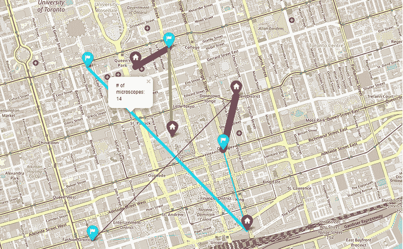

图 C.34 学校显微镜供应和需求

书中 C.16 列表的完整版本，可在 GitHub 仓库[GitHub repo](https://github.com/Optimization-Algorithms-Book/Code-Listings/blob/main/Appendix%20C/Chapter%209/Listing%20C.16_Supply_demand.ipynb)中找到，也展示了如何使用遗传算法解决这个问题。

## C.9 第十章：其他群智能算法探索

### C.9.1 练习

1.   匹配表 C.16 中显示的术语和描述。

表 C.16

| 术语 | 描述 |
| --- | --- |
| 1. 蚁群系统（ACS） | a. 在耗尽当前食物源后寻找新食物源的蜜蜂 |
| 2. 蚁群算法 | b. 食物路径的正反馈导致越来越多的蚂蚁跟随该路径 |
| 3. 巡视蜂 | c. 一种不考虑解决方案可行性的信息素更新方法 |
| 4. 最大-最小蚁群系统（MMAS） | d. 巡视蜂尝试寻找新食物源的最大失败次数 |
| 5. 自催化行为 | e. 根据工蜂找到的解决方案的适应性概率选择食物源的蜜蜂 |
| 6. 蚁群密度模型 | f. 社会昆虫通过环境修改进行间接交流，这些修改作为外部记忆 |
| 7\. 观察者蜜蜂 | g. 一种使用局部信息更新信息素浓度的信息素更新方法 |
| 8\. 蚂蚁循环 | h. 一种使用被称为伪随机比例行动规则的精英策略的蚁群优化（ACO）变体 |
| 9\. 蚂蚁系统（AS） | i. 一种通过包括禁忌列表来增加记忆能力的蚁群优化（ACO）变体 |
| 10\. 试验限制 | k. 一种克服停滞的蚁群优化（ACO）变体 |

2.   编写 Python 代码，使用蚁群优化算法找到源点与目的地点之间的最短路径。假设你现在站在多伦多市的国王爱德华七世骑马雕像处，GPS 坐标为（43.664527, –79.392442）。想象你是一名多伦多大学的学生，你正在赶往位于信息技术中心（Bahen Centre for Information Technology）的优化算法讲座，其 GPS 坐标为（43.659659, –79.397669）。在以国王学院圆环（GPS 坐标为 43.661667, –79.395）为中心的地图上可视化获得的路线，以便你能到达目的地。请随意使用 optalgotools 包中可用的帮助函数，例如`Node`、`cost`和`draw_route`。使用此代码来实验不同的搜索空间（不同的兴趣区域、不同的起点和目的地）以及不同的算法参数设置。

3.   反渗透（RO）是一种非常有效且重要的脱盐和废水回收过程。假设你需要最大化反渗透高压泵的功率。这个功率取决于以下方程式中的多个参数：

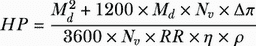

其中

•   *HP* 是反渗透高压泵的功率，单位为 kW。

•   *M[d]* 是反渗透的日产量，单位为 m³/d，其范围是 41.67 < M*[d]* <416.67 m³/d。

•   *N[v]* 是压力容器的数量，其范围是 1 < N*[v]* < 200。

•   ∆*π* 是跨膜的净渗透压，其范围是 1400 < ∆*π* < 2600 kPa。

•   *RR* 是回收率，其范围是 1 < RR < 50%。

•   *η* 是高压泵的效率，其范围是 0.70 < *η* < 0.85。

•   *ρ* 是水的密度。

编写 Python 代码，使用蚁群优化（ACO）算法找到决策变量（*Md, Nv*, ∆*π, RR, η*, 和 *ρ*）的最优值以最大化 HP。使用 SciPy 中的`optimize`求解器解决相同的问题。

4.   使用蚁群优化（ACO）算法解决第九章第 8 题中引入的供需问题。使用混合整数分布式蚁群优化（MIDACO）来解决这个问题。MIDACO ([www.midaco-solver.com](http://www.midaco-solver.com)) 是一种用于解决单目标和多目标优化问题的数值高性能软件。它基于蚁群优化，并扩展了混合整数搜索域。

要安装 MIDACO，请按照以下步骤操作：

1. 下载 MIDACO Python 网关([midaco.py](http://www.midaco-solver.com/index.php/download/python))，并移除.txt 扩展名。

2. 下载适当的库文件([midacopy.dll](http://www.midaco-solver.com/index.php/download/python)或 midacopy.so)。

3. 在您的 PC 上的同一文件夹中存储所有文件。

4. 将`midaco`导入您的 Jupyter 笔记本。

MIDACO 是许可软件，具有有限的免费许可证，允许使用最多四个变量（两个供应学校和两个需求学校）进行优化。

假设以下简化问题数据：

```py
supply_schools = [1, 3]     ①
demand_schools = [2, 4]     ②
amount_supply = [20, 30]    ③
amount_demand = [5, 45]     ④
```

① 有显微镜的学校

② 请求显微镜的学校

③ 每所学校可用的显微镜数量

④ 每所学校请求的显微镜数量

使用 MIDACO 编写 Python 代码来解决这个问题，并在地理空间地图上可视化解决方案。对于更多学校，您可以获得无限许可证或请求免费学术试用版，该版本可以支持多达 100,000 个变量。

### C.9.2 解决方案

1. 答案

1-h，2-f，3-a，4-k，5-b，6-c，7-e，8-g，9-i，10-d

2. 列表 C.17 显示了在多伦多市找到并可视化两个感兴趣点之间最短路径的步骤。代码使用了 optalgotools 中的帮助函数，如 Node、cost 和 draw_route。我们首先定义并可视化搜索空间如下。

列表 C.17 使用 ACO 解决路由问题

```py
import osmnx as ox
from optalgotools.structures import Node
from optalgotools.routing import cost, draw_route
import random
from tqdm.notebook import tqdm
import matplotlib.pyplot as plt

reference = (43.661667, -79.395)                                         ①

G = ox.graph_from_point(reference, dist=300, clean_periphery=True,
➥ simplify=True)                                                        ②

origin = (43.664527, -79.392442)                                         ③
destination = (43.659659, -79.397669)                                    ④

origin_id = ox.distance.nearest_nodes(G, origin[1], origin[0])           ⑤
destination_id = ox.distance.nearest_nodes(G, destination[1],            ⑤
➥ destination[0])                                                       ⑤

origin_node = Node(graph=G, osmid=origin_id)                             ⑥
destination_node = Node(graph=G, osmid=destination_id)                   ⑥

highlighted = [destination_id, origin_id]

nc = ['red' if node in highlighted else '#336699' for node in G.nodes()] ⑦
ns = [70 if node in highlighted else 8 for node in G.nodes()]            ⑦
fig, ax = ox.plot_graph(G, node_size=ns, node_color=nc, node_zorder=2)   ⑧
```

① 将多伦多国王学院圆环，安大略省多伦多设为地图的中心。

② 创建一个图。

③ 将爱德华七世骑马雕像设为原点。

④ 将多伦多大学的信息技术中心设为目标。

⑤ 获取起点和目标点最近节点的 osmid。

⑥ 创建起点和终点节点。

⑦ 标记源节点和目标节点。

⑧ 可视化搜索空间。

作为列表 C.17 的延续，我们可以如下初始化 ACO 算法的参数：

```py
alpha = 1                                                                ①
beta = 1                                                                 ②
n = 500                                                                  ③
Q = 1                                                                    ④

pheremone_concentrations = dict()
known_routes = dict()

pheremone_concentrations = {(u,v):random.uniform(0,0.5) for [u,v] in
➥ G.edges()}                                                            ⑤

def pheremone(level, distance, alpha, beta):                             ⑥
    return level ** alpha * ((1/distance)) ** beta
```

① 设置 alpha，一个控制信息素影响的参数。

② 设置 beta，一个控制城市转换吸引力的参数。

③ 设置迭代次数。

④ 随机化信息素。

⑤ 随机化信息素。

⑥ 一个计算信息素水平的函数

我们现在如下实现 ACO 过程：

```py
for ant in tqdm(range(n)):
    frontier = [origin_node]                                            ①
    explored = set()
    route = []
    found = False

    while frontier and not found:
        parent = frontier.pop(0)
        explored.add(parent)

        children = []
        children_pheremones = []
        for child in parent.expand():
            if child == destination_node:
                found = True
                route = child.path()
                continue
            if child not in explored:
                children.append(child)
                children_pheremones.append(
                    pheremone(
                        pheremone_concentrations[(parent.osmid,
➥ child.osmid)],
                        child.distance,
                        alpha,
                        beta,
                    )
                )

        if len(children) == 0:
            continue  

        transition_probability = [
            children_pheremones[i] / sum(children_pheremones)
            for i in range(len(children_pheremones))
        ]

        chosen = random.choices(children, weights=transition_probability,
➥ k=1)[0]                                                             ②

        children.pop(children.index(chosen))                           ③
        frontier.extend(children)                                      ③

        frontier.insert(0, chosen)                                     ④

    for u, v in zip(route[:-1], route[1:]):                            ⑤
        length_of_edge = G[u][v][0]['length']
        pheremone_concentrations[(u,v)] += Q/length_of_edge

    route = tuple(route)
    if route in known_routes:                                          ⑥
        known_routes[route] += 1
    else:
        known_routes[route] = 1
```

① 将蚂蚁放置在原点节点。

② 以概率选择一个子节点进行探索。

③ 添加所有未探索的子节点，以防我们以后需要探索它们。

④ 将选定的子节点设为下一个要探索的节点。

⑤ 更新信息素。

⑥ 如果路线是新发现的，则将其添加到列表中。

您现在可以打印最佳路线及其成本，并如下可视化获得的路线：

```py
best_route = max(known_routes, key=known_routes.get)
times_used = known_routes[best_route]
route = list(best_route)
print("Cost:", cost(G,route))
print("Times used:",times_used)
draw_route(G,route)
```

图 C.35 显示了 ACO 生成的最优路线。

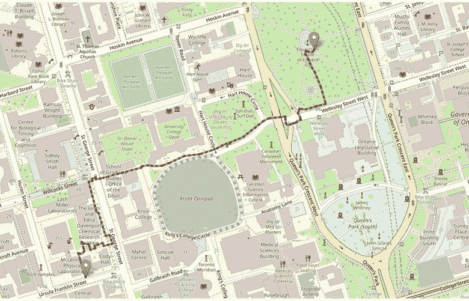

图 C.35 ACO 生成的最优路线

3. 下一个列表显示了使用 ACO 解决反渗透（RO）高压泵功率最大化问题的步骤。

列表 C.18 使用 ACO 解决 RO 高压泵功率最大化问题

```py
import random

md_range = (41.67, 416.67)                                            ①
nv_range = (1, 200)                                                   ①
delta_range = (1400, 2600)                                            ①
rr_range = (1, 50)                                                    ①
eta_range = (0.70, 0.85)                                              ①
rho = 1000                                                            ②

def ro_pump_power(X):                                                 ③
    md, nv, delta, rr, eta=X
    return (md ** 2 + 1200 * md * nv * delta) / (nv * rr * 3600 * eta *
➥ rho)

num_ants = 100                                                        ④
num_iterations = 300                                                  ④
evaporation_rate = 0.7                                                ④
pheromone_deposit = 1                                                 ④
initial_pheromone = 0.25                                              ④

pheromone_matrix = [[initial_pheromone] * 5 for _ in range(num_ants)] ⑤

best_solution = None                                                  ⑥
best_power = float('-inf')                                            ⑥

for _ in range(num_iterations):
    solutions = []
    powers = []

    for ant in range(num_ants):                                       ⑦
        md = random.uniform(md_range[0], md_range[1]) 
        nv = random.uniform(nv_range[0], nv_range[1]) 
        delta = random.uniform(delta_range[0], delta_range[1]) 
        rr = random.uniform(rr_range[0], rr_range[1]) 
        eta = random.uniform(eta_range[0], eta_range[1]) 

        soln=(md, nv, delta, rr, eta)                                 ⑧
        power = ro_pump_power(soln)                                   ⑧

        solutions.append((md, nv, delta, rr, eta))                    ⑨
        powers.append(power)                                          ⑨

        if power > best_power:                                        ⑩
            best_solution = (md, nv, delta, rr, eta)
            best_power = power

    for ant in range(num_ants):                                       ⑪
        for i in range(5):
            pheromone_matrix[ant][i] *= evaporation_rate
            if solutions[ant][i] == best_solution[i]:
                pheromone_matrix[ant][i] += pheromone_deposit / powers[ant]

print("Optimal Solution:")                                            ⑫
print("Md:", format(best_solution[0], '.2f'))                         ⑫
print("Nv:", format(best_solution[1], '.2f'))                         ⑫
print("Delta:", format(best_solution[2], '.2f'))                      ⑫
print("RR:", format(best_solution[3], '.2f'))                         ⑫
print("Eta:", format(best_solution[4], '.2f'))                        ⑫
print("Optimal HP:", format(best_power, '.2f'))                       ⑫
```

① 定义每个决策变量的范围。

② 水的密度为 kg/m³

③ 定义目标函数。

④ 定义 ACO 参数。

⑤ 初始化信息素矩阵。

⑥ 初始化最佳解决方案及其对应的功率。

为每只蚂蚁构建解决方案。

⑧ 计算当前解决方案的功率。

⑨ 存储解决方案及其功率。

⑩ 如有必要，更新最佳解决方案。

⑪ 根据每个解决方案的强度更新信息素路径。

⑫ 打印决策变量的最优值和最优 HP。

以下是一个生成的输出示例：

```py
Optimal Solution:
Md: 404.10
Nv: 7.39
Delta: 2536.93
RR: 1.05
Eta: 0.76
Optimal HP: 425.75
```

作为 C.18 列表的延续，以下代码片段展示了使用 SciPy 中的`optimize`求解器解决此问题的步骤。

```py
from scipy.optimize import minimize                                    ①

def ro_pump_power(X):                                                  ②
    md, nv, delta, rr, eta=X
    return -(md ** 2 + 1200 * md * nv * delta) / (nv * rr * 3600 * eta *
➥ rho) 

bounds = [md_range, nv_range, delta_range, rr_range, eta_range]        ③
x0=[200, 100, 2000, 25, 0.75]                                          ④

result = minimize(ro_pump_power, x0, bounds=bounds, method='SLSQP')    ⑤

print("Optimal Solution:")                                             ⑥
print("Md:", format(result.x[0], '.2f'))                               ⑥
print("Nv:", format(result.x[1], '.2f'))                               ⑥
print("Delta:", format(result.x[2], '.2f'))                            ⑥
print("RR:", format(result.x[3], '.2f'))                               ⑥
print("Eta:", format(result.x[4], '.2f'))                              ⑥
print("Optimal HP:", format(-result.fun, '.2f'))                       ⑥
```

① 导入 scipy 优化器。

② 根据 scipy 的要求，定义带有负号的优化目标函数。

③ 设置决策变量的界限。

④ 设置初始猜测值。

⑤ 使用顺序最小二乘编程（SLSQP）解决优化问题。

⑥ 打印决策变量的最优值和最优 HP。

生成的输出如下：

```py
Optimal Solution:
Md: 416.67
Nv: 99.98
Delta: 2600.00
RR: 1.00
Eta: 0.70
Optimal HP: 515.88
```

您可以微调 ACO 参数以获得与 SciPy 优化器相当的结果。

4. 下一个列表展示了使用 MIDACO 求解器解决供需问题的步骤。我们首先导入库并设置问题数据。

列表 C.19 使用 MIDACO 解决供需问题

```py
import numpy as np
import random
import midaco                                                    ①
from geopy.geocoders import Nominatim
from geopy.distance import geodesic
import folium

supply_schools = [1, 3]                                          ②
demand_schools = [2, 4]                                          ③
amount_supply = [20, 30]                                         ④
amount_demand = [5, 45]                                          ⑤
n_var=len(supply_schools)*len(demand_schools)
n_constr=len(supply_schools)
```

① 导入 MIDACO 求解器。

② 设置有可用显微镜的学校。

③ 设置需要显微镜的学校。

④ 设置每所学校可用的显微镜数量。

⑤ 设置每所学校请求的显微镜数量。

作为延续，我们将为供应和需求学校生成随机的 GPS 坐标：

```py
geolocator = Nominatim(user_agent="SupplyDemand")                 ①
location = geolocator.geocode("Toronto, Ontario")                 ②

def generate_random(number, center_point):                        ③
    lat, lon = center_point
    coords = [(random.uniform(lat - 0.01, lat + 0.01), random.uniform(lon -
➥ 0.01, lon + 0.01)) for _ in range(number)]
    return coords

np.random.seed(0)                                                 ④

supply_coords = generate_random(len(supply_schools), 
➥ [location.latitude, location.longitude])                       ⑤
demand_coords = generate_random(len(demand_schools), 
➥ [location.latitude, location.longitude])                       ⑥

distances = []                                                    ⑦
for supply in supply_coords:                                      ⑦
    row = []                                                      ⑦
    for demand in demand_coords:                                  ⑦
        row.append(geodesic(supply, demand).kilometers)           ⑦
    distances.append(row)                                         ⑦
distances = np.array(distances)                                   ⑦

cost_matrix=50*distances                                          ⑧
```

① 创建一个地理定位对象。

② 获取多伦多的坐标。

③ 生成围绕中心点的随机位置的功能。

④ 设置随机种子以确保生成的随机数的可重复性。

⑤ 为供应学校生成随机的 GPS 坐标（纬度，经度）。

⑥ 为需求学校生成随机的 GPS 坐标（纬度，经度）。

⑦ 计算学校之间的测地线距离（公里）。

⑧ 计算成本矩阵。

以下函数定义了优化问题的主要成分，包括目标函数和约束。

```py
def problem_function(x):

    f = [0.0]*1                                                                            ①
    g = [0.0]*n_constr                                                                     ②

    f[0] = np.sum(np.multiply(cost_matrix.flatten(), x))                                   ③

    soln=np.reshape(x, (len(supply_schools), len(demand_schools)))                         ④

    total_supply = soln.sum(axis=1)
    total_demand = soln.sum(axis=0)        

    g[0] = (np.all(total_supply>=amount_supply) and np.all(total_demand>=amount_demand))-1 ⑤

    return f,g                                                                             ⑥
```

① 初始化目标函数 F(X)的数组。

② 初始化约束 G(X)的数组。

③ 目标函数 F(X)

④ 候选解决方案

⑤ 在 g[me:m-1]中，不等式约束 G(X) >= 0 必须排在第二位。

⑥ 返回目标函数和约束评估。

使用 MIDACO 的第一步是将问题定义为以下形式：

```py
key = b'MIDACO_LIMITED_VERSION___[CREATIVE_COMMONS_BY-NC-ND_LICENSE]' ①
problem = {}                                                          ②
option  = {}                                                          ③
problem['@'] = problem_function                                       ④
```

① 免费有限许可证，支持多达 4 个变量。

② 初始化包含问题规范的字典。

③ 初始化包含 MIDACO 选项的字典。

④ 处理问题函数名称。

问题维度定义如下：

```py
problem['o']  = 1                     ①
problem['n']  = n_var                 ②
problem['ni'] = n_var                 ③
problem['m']  = n_constr              ④
problem['me'] = 0                     ⑤
```

① 目标数量

② 变量数量（总计）

③ 整数变量数量（0 <= ni <= n）

④ 约束数量（总计）

⑤ 等式约束数量（0 <= me <= m）

下界和上界`xl`和`xu`定义如下：

```py
problem['xl'] = [0.0]*n_var
problem['xu'] = [30.0]*n_var
```

起始点`x`设置为下界：

```py
problem['x'] = problem['xl'] 
```

停止标准定义如下：

```py
option['maxeval'] = 10000             ①
option['maxtime'] = 60*60*24          ②
```

① 最大函数评估次数

② 最大时间限制（以秒为单位，例如，1 天 = 60*60*24）

我们设置打印选项如下：

```py
option['printeval'] = 1000            ①
option['save2file'] = 1               ②
```

① 打印当前最佳解的打印频率

② 保存屏幕和解决方案[0 为否，1 为是]

MIDACO 提供并行评估多个解候选人的选项（也称为协同评估或细粒度并行化）。根据 MIDACO 用户手册，对于并行化因子*P* = 10，潜在加速约为 10 倍，而对于并行化因子*P* = 100，潜在加速约为 70 倍。我们可以设置并行化因子如下：

```py
option['parallel'] = 0                ①
```

① 序列：0 或 1，并行：2,3,4,5,6,7,8...

我们现在可以运行`midaco`来解决问题：

```py
solution = midaco.run( problem, option, key)
```

以下代码片段用于打印 PSO 求解器获得的解：

```py
soln = solution['x']
supply_num=len(amount_supply)                                         ①
demand_num=len(amount_demand)                                         ②
for i in range(supply_num):                                           ③
    print(f"Supply School({supply_schools[i]}): {' +
➥ '.join(['soln['+str(j)+']' for j in range(i*supply_num,
➥ (i+1)*supply_num)])} <= {amount_supply[i]} or {' + '.join(map(str,
➥ soln[i*supply_num:(i+1)*supply_num]))} <= {amount_supply[i]} or
➥ {sum(soln[i*supply_num:(i+1)*supply_num])} <= {amount_supply[i]}")
for j in range(demand_num):                                           ④
    print(f"Demand School({demand_schools[j]}): {' + '.join(['soln['+str(i*demand_num+j)+']' for i in range(demand_num)])} >=
➥ {amount_demand[j]} or {' + '.join(map(str, [soln[i*demand_num+j] for i
➥ in range(demand_num)]))} >= {sum(soln[i*demand_num+j] for i in
➥ range(demand_num))} or {sum(soln[i*demand_num+j] for i in
➥ range(demand_num))} >= {amount_demand[j]}") 
print(f"Shipping cost =  {solution['f']} $")                          ⑤
```

① 供应点数量

② 需求点数量

③ 打印每个供应点。

④ 打印每个需求点。

⑤ 打印运输成本。

代码将产生如下输出：

```py
Supply School(1): soln[0] + soln[1] <= 20 or 0.0 + 30.0 <= 20 or 30.0 <= 20
Supply School(3): soln[2] + soln[3] <= 30 or 15.0 + 15.0 <= 30 or 30.0 <= 30
Demand School(2): soln[0] + soln[2] >= 5 or 0.0 + 15.0 >= 15.0 or 15.0 >= 5
Demand School(4): soln[1] + soln[3] >= 45 or 30.0 + 15.0 >= 45.0 or 45.0 >= 45
Shipping cost =  [1919.3192442452619] $
```

以下代码片段可用于使用 folium 可视化空间地图的解决方案：

```py
def normalize(lst):                                                 ①
    s = sum(lst)
    return list(map(lambda x: (x/s)*10, lst))

soln_normalized = normalize(soln)                                   ②

colors = ['cyan', 'brown', 'orange', 'purple']                      ③

m = folium.Map(location=[location.latitude, location.longitude],
➥ zoom_start=15, scrollWheelZoom=False, dragging=False)            ④

for i, coord in zip(supply_schools, supply_coords):
    folium.Marker(location=coord, icon=folium.Icon(icon="home",
➥ color='red'), popup=f'Supply School {i+1}').add_to(m)            ⑤

for i, coord in zip(demand_schools, demand_coords):
    folium.Marker(location=coord, icon=folium.Icon(icon="flag",
➥ color='blue'), popup=f'Demand School {i+1}').add_to(m)           ⑥

for i in range(len(supply_schools)):                                ⑦
    for j in range(len(demand_schools)):
        soln_value = soln[i*len(demand_schools) + j]
        folium.PolyLine(locations=[supply_coords[i], demand_coords[j]],
➥ color=colors[i % len(colors)],
➥  weight=5*soln_normalized[i*len(demand_schools) + j],
➥ popup=folium.Popup(f'# of microscopes: {soln_value}')).add_to(m)

m                                                                   ⑧
```

① 标准化函数。

② 标准化解数组。

③ 定义颜色列表。

④ 创建以多伦多市中心为中心的地图。

⑤ 为供应学校添加标记。

⑥ 为需求学校添加标记。

⑦ 在供应和需求学校之间添加线条（边）。

⑧ 显示地图。

图 C.36 显示了使用 MIDACO 获得的解决方案。


图 C.36 MIDACO 获得的供需问题解决方案

对于更多学校，您可以获得无限许可证或请求免费的无限制版本学术试用，该版本可以支持多达 100,000 个变量。

## C.10 第十一章：监督学习和无监督学习

### C.10.1 练习

1. 多项选择和真/假：为以下每个问题选择正确答案。

1.1. 机器学习算法的传统类别有哪些？

b. 监督的，无监督的，非增强的

b. 监督的，混合的，增强的

c. 监督的，无监督的，混合的，增强的

d. 无监督的，半监督的，混合的

1.2. Kohonen 图使用监督学习进行训练，以产生训练样本输入空间的二维表示。

a. 正确

b. 错误

1.3. 监督学习中常见的任务有哪些？

a. 聚类和数据降维

b. 分类和回归

c. 特征提取和异常检测

d. 维度约简和标准化

1.4. 无监督学习中的聚类任务是什么？

a. 根据某些相似性度量分组对象

b.  在自动驾驶汽车中识别交通标志

c.  将输入特征映射到已知标签或类别

d.  通过反馈循环优化模型性能

1.5.   指针网络（Ptr-Net）模型旨在解决传统序列到序列（seq2seq）模型的特定局限性，尤其是在涉及可变长度输出序列的任务中。

a.  正确

b.  错误

1.6.   在强化学习中，学习代理是如何学习做出决策的？

a.  通过最小化预测类别与实际类别之间的误差

b.  通过在输入数据中识别聚类

c.  通过在环境中通过行动最大化累积奖励

d.  通过将输入特征映射到已知标签或类别

1.7.   深度学习（DL）在机器学习中能够实现什么？

a.  在不同抽象层次上的特征表示学习

b.  基于标记数据对不同对象的分类

c.  基于某些度量将相似数据点分组

d.  在交互环境中基于奖励的决策

1.8.   图嵌入学习从低维连续域到离散高维图域的映射。

a.  正确

b.  错误

1.9.   深度学习（DL）是如何减少对大量数据预处理的需求的？

a.  通过使用大量未标记数据进行训练

b.  通过在反馈循环中的交互学习

c.  通过近似数据与已知标签之间的映射函数

d.  通过从原始数据中自动学习判别性特征

1.10. 为什么图结构数据在组合优化领域很重要？

a.  它有助于最大化累积奖励

b.  它有助于在数据与标签之间映射函数

c.  它捕捉并表示元素之间的关系和约束

d.  它根据相似性度量将对象分组

2.   将表 C.17 中显示的术语与描述进行匹配。

表 C.17

| 术语 | 描述 |
| --- | --- |
| 1\. 自组织映射（SOM） | a. 一个多边形，它完全包围给定的一组点，具有最大面积和最小边界或周长。 |
| 2\. 凸包 | b. 一种机制，允许模型动态地优先考虑输入中哪些部分对于它试图预测的每个输出是最相关的，使其在理解上下文和减少长输入序列的混淆方面更加有效。 |
| 3\. 指针网络（Ptr-Net） | c. 一种使用无监督学习训练的人工神经网络，它产生输入空间训练样本的低维（通常是二维）离散表示。 |
| K-hop 邻域 | d. 距离小于或等于 K 的一组相邻节点 |
| 5\. 注意力机制 | e. 一种用于处理可变大小输入数据序列的神经网络架构 |

3.   使用自组织映射（SOM）从纽约市出发访问 20 个主要美国城市的最短路径。城市名称和 GPS 纬度和经度坐标如下：

•   纽约市（40.72, –74.00）

•   费城（39.95, –75.17）

•   巴尔的摩（39.28, –76.62）

•   夏洛特（35.23, –80.85）

•   孟菲斯（35.12, –89.97）

•   杰克逊维尔（30.32, –81.70）

•   休斯顿（29.77, –95.38）

•   奥斯汀（30.27, –97.77）

•   圣安东尼奥（29.53, –98.47）

•   福特沃斯（32.75, –97.33）

•   达拉斯（32.78, –96.80）

•   圣地亚哥（32.78, –117.15）

•   洛杉矶（34.05, –118.25）

•   圣何塞（37.30, –121.87）

•   旧金山（37.78, –122.42）

•   印第安纳波利斯（39.78, –86.15）

•   凤凰城（33.45, –112.07）

•   辛辛那提（39.98, –82.98）

•   芝加哥（41.88, –87.63）

•   底特律（42.33, –83.05）

4.   调优超参数可以显著提高机器学习模型的表现。在列表 11.6 中调整超参数，并观察不同测试数据集对 ConvexNet 模型性能的影响。需要调整的超参数包括

•   模型的输入特征数量

•   嵌入维度数量

•   模型中隐藏单元的数量

•   多头自注意力机制中的注意力头数量

•   模型中的层数

•   Dropout 概率

•   训练的迭代次数

•   训练过程中使用的批量大小

•   优化器的学习率

### C.10.2 解决方案

1.   多选题和判断题

1.1.   c) 监督的、无监督的、混合的、强化学习

1.2.   b) 错误（Kohonen 图使用无监督学习进行训练，以产生训练样本输入空间的低维表示，而不是监督学习。）

1.3.   b) 分类和回归

1.4.   a) 基于某些相似性度量分组对象

1.5.   a) 正确

1.6.   c) 通过在环境中采取行动最大化累积奖励

1.7.   a) 在不同抽象层次上的特征表示学习

1.8.   b) 错误（图嵌入学习从离散的高维图域到低维连续域的映射，而不是相反。）

1.9.   d) 通过从原始数据中自动学习判别特征

1.10. c) 它捕捉并表示元素之间的关系和约束

2.   1-c, 2-a, 3-e, 4-d, 和 5-b。

3.   本列表使用 MiniSom。MiniSom 是基于 Numpy 的最小化实现的自组织映射（SOM）。您可以使用以下命令安装此库：!pip install minisom。

下一个列表展示了如何使用自组织映射解决 20 个城市 TSP 问题。我们首先导入库和模块，定义感兴趣的城市，并计算城市对之间的哈夫曼距离。

列表 C.20 使用自组织映射（SOM）解决 TSP 问题

```py
import numpy as np
import pandas as pd
from collections import defaultdict
from haversine import haversine
import networkx as nx
import matplotlib.pyplot as plt
import random
from minisom import MiniSom

cities = {
    'New York City': (40.72, -74.00),
    'Philadelphia': (39.95, -75.17),       
    'Baltimore': (39.28, -76.62),
    'Charlotte': (35.23, -80.85),
    'Memphis': (35.12, -89.97),
    'Jacksonville': (30.32, -81.70),
    'Houston': (29.77, -95.38),
    'Austin': (30.27, -97.77),
    'San Antonio': (29.53, -98.47),
    'Fort Worth': (32.75, -97.33),
    'Dallas': (32.78, -96.80),
    'San Diego': (32.78, -117.15),
    'Los Angeles': (34.05, -118.25),
    'San Jose': (37.30, -121.87),
    'San Francisco': (37.78, -122.42),    
    'Indianapolis': (39.78, -86.15),
    'Phoenix': (33.45, -112.07),       
    'Columbus': (39.98, -82.98), 
    'Chicago': (41.88, -87.63),
    'Detroit': (42.33, -83.05)
}                                                                        ①

distance_matrix = defaultdict(dict)                                      ②
for ka, va in cities.items():                                            ②
    for kb, vb in cities.items():                                        ②
        distance_matrix[ka][kb] = 0.0 if kb == ka else haversine((va[0],
➥ va[1]), (vb[0], vb[1]))                                               ②

distances = pd.DataFrame(distance_matrix)                                ③
city_names=list(distances.columns)                                       ③

distances=distances.values                                               ④
```

① 定义 20 个主要美国城市的纬度和经度。

② 基于纬度和经度坐标创建哈夫曼距离矩阵。

③ 将距离字典转换为数据框。

④ 获取城市对之间的哈弗辛距离。

我们定义一个 SOM 来解决 TSP 实例。这个 SOM 是 1D 的，具有*N*个神经元。输入数据的维度是 2（纬度和经度坐标）。sigma 参数用于高斯邻域函数。此参数控制训练期间邻近神经元影响范围的扩散。学习率决定了训练期间权重更新的步长。训练期间使用的邻域函数设置为高斯，这意味着邻近神经元的影响随着距离的增加而减小。随机数生成器的种子设置为 50，以确保结果的再现性。

```py
N_neurons = city_count*2                                                  ①

som = MiniSom(1, N_neurons, 2, sigma=10, learning_rate=.5,
              neighborhood_function='gaussia   n', random_seed=50)        ②
som.random_weights_init(points)                                           ③
```

① 设置 1D SOM 的神经元（节点）数量。

② 创建一个具有 1xN 神经元网格的自组织图。

③ 初始化权重。

以下代码片段生成一组可视化，以显示 SOM 训练的进度：

```py
plt.figure(figsize=(10, 9))
for i, iterations in enumerate(range(5, 61, 5)):
    som.train(points, iterations, verbose=False, random_order=False)
    plt.subplot(3, 4, i+1)
    plt.scatter(x,y)
    visit_order = np.argsort([som.winner(p)[1] for p in points])
    visit_order = np.concatenate((visit_order, [visit_order[0]]))
    plt.plot(points[visit_order][:,0], points[visit_order][:,1])
    plt.title("iterations: {i};\nerror: {e:.3f}".format(i=iterations,                                                         ➥ e=som.quantization_error(points)))
    plt.xticks([])
    plt.yticks([])
plt.tight_layout()
plt.show()
```

图 C.37 显示了可视化的图表。


图 C.37 SOM 训练进度随迭代次数增加

## C.11 第十二章：强化学习

### C.11.1 练习

1.   多选题和判断题：为以下每个问题选择正确的答案。

1.1.   在强化学习中，“奖励”这个术语代表什么？

a.  执行动作的惩罚

b.  从环境中获得的即时反馈

c.  执行特定动作的概率

d.  代理采取的步数

1.2.   强化学习的目标是

a.  最小化累积奖励

b.  找到到达目标状态的最短路径

c.  学习最优策略以最大化累积奖励

d.  实现确定性环境

1.3.   以下哪个强化学习算法被认为是无模型的？

a.  专家迭代

b.  近端策略优化（PPO）

c.  想象力增强代理（I2A）

d.  以上皆非

1.4.   强化学习中“折扣因子”的概念用于

a.  减少状态空间的大小

b.  减少从环境中获得的奖励

c.  平衡即时奖励和未来奖励的重要性

d.  鼓励探索而非利用

1.5.   以下哪个强化学习算法被认为是离线策略 RL 方法？

a.  Q 学习

b.  双延迟深度确定性策略梯度（TD3）

c.  深度确定性策略梯度（DDPG）

d.  近端策略优化（PPO）

1.6   PPO-clip 和 PPO-penalty 是策略梯度方法的两种变体，旨在解决训练过程中可能出现的潜在不稳定性。

a.  正确

b.  错误

1.7.   以下哪种多臂老虎机策略在每次试验中随机选择一个老虎机，而不考虑过去的结果？

a.  仅利用的贪婪策略

b.  ε-贪婪策略

c.  上界置信（UCB）策略

d.  仅探索策略

1.8.   在ε-贪婪策略中，代理如何平衡探索和利用？

a. 它总是选择估计平均奖励最高的机器。

b. 它以一定的概率（ε）随机选择一台机器，否则选择估计平均奖励最高的机器。

c. 在每次试验中，它对所有机器进行平等探索。

d. 它只专注于利用当前最佳机器。

1.9. 在多臂老虎机问题中，“遗憾”衡量的是什么？

a. 最大可能奖励与从每个选定的机器获得的奖励之间的差异

b. 代理选择探索新机器的次数

c. 在相同单一状态下所花费的总时间

d. 代理可用的总臂或动作数量

1.10. 在强化学习的背景下，马尔可夫决策过程（MDP）代表什么？

a. 一种在决策时不考虑状态转换的过程

b. 使用标记数据集进行监督学习的方法

c. 一种在不确定性下的规划数学框架，其中动作以一定的概率影响未来的状态

d. 一种用于聚类数据的优化算法

2.   假设你是一位数字营销人员，正在运行在线广告活动。你可以向用户展示几个广告变体，每个广告变体都有自己的点击率（CTR）或转化率。点击率衡量用户点击链接的频率，而转化率衡量用户在点击链接后完成预期动作的频率，例如进行购买、注册通讯录或完成表格。你的目标是通过对最有效的广告变体进行选择，最大化用户参与度或转化率。

假设你有三种广告变体，分别用臂 A1、A2 和 A3 表示。每个广告变体都有一个与之相关的点击率或转化率的概率分布，分别表示为 Q1、Q2 和 Q3。这些概率分布代表了用户点击每个广告变体的可能性。在每一个时间步 t，你需要选择一个广告变体 A 来向用户展示。当广告变体 A 被展示时，用户会与之互动，你观察到结果，这可能是一个点击或转化。结果是从概率分布 Q(A)中抽取的，表示广告变体 A 的点击或转化可能性。假设三个概率分布 Q1、Q2 和 Q3 是具有均值{7, 10, 6}和标准差{0.45, 0.65, 0.35}的正态分布。你的目标是最大化一系列广告展示中的累积点击数（比如说 10,000 次广告展示）。请编写 Python 代码实现ε-贪婪策略，以确定在每一个时间步选择哪个广告变体进行展示，基于估计的点击率。

3.   出租车环境基于出租车或叫车问题，其中出租车必须从某个位置接乘客，并在另一个指定位置放下乘客。代理的目标是学习一种策略，通过网格导航出租车来接送乘客，同时最大化累积奖励。当场景开始时，出租车位于一个随机方块，乘客位于一个随机位置。出租车驶向乘客的位置，接上乘客，然后驶向乘客的目的地（四个指定位置之一），并放下乘客。一旦乘客被放下，场景结束。状态、动作和奖励如下：

•   状态（观察空间包括 500 个离散状态）：25 个出租车位置（5×5 网格世界中的任何位置）；5 个乘客位置（0：红；1：绿；2：黄；3：蓝；4：在出租车内）和 4 个目的地（0：红；1：绿；2：黄；3：蓝）。因此，此出租车环境共有 5×5×5×4=500 个可能的状态。

•   动作（动作空间包括 6 个离散动作）：0 = 向南移动；1 = 向北移动；2 = 向东移动；3 = 向西移动；4 = 接乘客，5 = 放下乘客。

•   奖励：+20（成功放下乘客的高正奖励）；–10（非法执行接送动作的惩罚，例如如果代理试图在错误的位置放下乘客），以及–1（每次时间步后未能到达目的地的小负奖励，以模拟延迟）。

编写 Python 代码以展示如何使用 A2C 学习此环境的最佳策略。尝试使用向量化环境，其中多个独立环境堆叠成一个单一环境。向量化环境允许你并行运行多个环境实例。与每步在一个环境中训练 RL 代理相比，它允许你每步在*n*个环境中训练。例如，如果你想运行四个并行环境，你可以在创建环境时指定此数字，如下所示：`env = make_vec_env("Taxi-v3", n_envs=4, seed=0`。

4.   在为计划中的航班做准备时，航空公司的航班运营团队负责根据共享上下文选择最佳飞行路线和服务。共享上下文代表飞行类型（国内或国际）和乘客类型（商务舱、经济舱或混合）。航班运营团队必须决定飞行路线、餐饮服务和机上娱乐的最佳策略。选项如下：

•   *飞行路线*—最直接路线、可能更长但更省油的路线，或避开湍流的路线，但可能需要更多时间

•   *餐饮服务*—包含多个选项的完整餐点、选项较少的简单餐点，或仅提供小吃和饮料

•   *机上娱乐*—电影和音乐、机上 Wi-Fi 服务，或两者的组合

奖励是针对给定航班（共享上下文）所选选项的满意度。奖励函数接收共享上下文（航班类型和乘客等级）以及每个选项所选动作（所选航班路线、餐食服务和机上娱乐）作为参数。为了模拟现实世界的场景和复杂性，我们在奖励值中注入了正常噪声。目标是选择最佳动作，从可用的组合动作中选择，以最大化总奖励。编写 Python 代码以训练和测试此问题的上下文赌博机。

5.   列表 11.4 展示了如何使用预先训练有监督方法或强化学习方法的 ML 模型解决 TSP 问题。将预训练的监督学习模型 sl-ar-var-20pnn-gnn-max_20200308T172931 替换为预训练的 RL 模型 rl-ar-var-20pnn-gnn-max_20200313T002243，并报告您的观察结果。

6.   gym-electric-motor（GEM）包是一个 Python 工具箱，用于模拟和控制电机。它是基于 OpenAI Gym 环境构建的，适用于经典控制模拟和强化学习实验。使用 GEM 定义一个永磁同步电机（PMSM）环境，如图 C.38 所示。有关 PMSM 和 GEM 的更多信息，请参阅 Traue 等人撰写的文章“向智能电机控制强化学习环境工具箱迈进”[10]。


图 C.38 Traue 等人文章[9]中描述的 gym-electric-motor（GEM）环境

列表 C.24，在本书的 GitHub 仓库中提供，是 PPO 在电机控制中的简化实现。此代码用于训练一个控制模型（PPO 强化学习代理）以控制永磁同步电机的电流。此代理主要控制将供电电流转换为流入电机的电流的转换器。在此算法的不同参数上进行实验，并考虑尝试 Stable-Baselines3（SB3）中可用的其他 RL 模型。

### C.11.2 解答

1.   多项选择题和判断题

1.1.   b) 从环境中获得的即时反馈

1.2.   c) 学习一个最优策略以最大化累积奖励。

1.3.   b) 近端策略优化（PPO）

1.4.   c) 平衡即时奖励和未来奖励的重要性。

1.5.   d) 近端策略优化（PPO）

1.6.   a) 正确

1.7.   d) 探索性策略

1.8.   b) 以一定的概率（epsilon）随机选择一台机器，否则选择估计平均奖励最高的机器。

1.9.   a) 最大可能奖励与从每个所选机器获得的奖励之间的差异

1.10. c) 在不确定性下规划的一个数学框架，其中动作以一定的概率影响未来状态

2.   列表 C.21 展示了一种ε-greedy 策略的实现，该策略基于估计的点击率在每个时间步确定显示哪个广告变体。在此代码片段中，模拟了 10,000 次广告展示。每次展示后，每个广告变体的点击率估计都会更新。

列表 C.21 使用 MAB 进行在线广告

```py
import numpy as np

num_arms = 3                                                   ①
num_trials = 10000                                             ②

mu = [7, 10, 6]                                                ③
sigma = [0.45, 0.65, 0.35]                                     ③

counts = np.zeros(num_arms)                                    ④
rewards = np.zeros(num_arms)                                   ④

a = np.random.choice(num_arms)                                 ⑤

eps = 0.1                                                      ⑥

for t in range(num_trials):
    if np.random.rand() > eps:                                 ⑦
        a = np.argmax(rewards / (counts + 1e-5))               ⑧
    else:                                                      ⑨
        a = np.random.choice(num_arms)                         ⑨

    reward = np.random.normal(mu[a], sigma[a]) 

    counts[a] += 1
    rewards[a] += reward

estimates = rewards / counts                                   ⑩
                                                               ⑩
print("Estimated click-through rates: ", estimates)            ⑩
```

① 初始化臂的数量（动作）。

② 初始化试验次数（广告）。

③ 每个臂的概率分布

④ 每个臂的计数器

⑤ 选择一个初始臂。

⑥ 设置ε-greedy 算法的ε值。

⑦ 利用

⑧ 添加一个小常数以避免除以零。

⑨ 探索

⑩ 计算并打印估计的点击率。

在此脚本中，`counts`跟踪每个广告变体显示的次数，而`rewards`跟踪每个广告变体的总点击次数。脚本结束时，计算并打印每个广告变体的估计点击率。

3.   列表 C.22 展示了使用 A2C 学习出租车问题最优策略的步骤。此代码使用 Stable-Baselines3（SB3），一个强化学习库，在 Taxi-v3 环境中使用 A2C 训练一个智能体。SB3 函数 make_vec_env 用于创建一个向量化环境，可以在同一进程中运行多个并行环境。SB3 函数 evaluate_policy 用于评估智能体的学习策略。

列表 C.22 使用 A2C RL 调度出租车

```py
from stable_baselines3.common.env_util import make_vec_env
from stable_baselines3 import A2C
from stable_baselines3.common.evaluation import evaluate_policy
import matplotlib.pyplot as plt
from IPython.display import display, clear_output

env = make_vec_env("Taxi-v3", n_envs=1, seed=0)               ①
print('Number of states:{}'.format(env.observation_space))    ②
print('Number of actions:{}'.format(env.action_space))        ②

model = A2C(policy="MlpPolicy", env=env, verbose=True)        ③

model.learn(total_timesteps=10000, progress_bar=True)         ④
```

① 创建一个包含单个并行环境（n_envs=1）的向量化环境。

② 打印环境的观察和动作空间。

③ 创建一个以 MlpPolicy 作为策略网络的 A2C 智能体。

④ 在 Taxi-v3 环境中训练 A2C 智能体 10,000 个时间步。

训练完成后，智能体将学会一个最优策略，用于在 Taxi-v3 环境中导航，以有效地在正确的位置接载和放下乘客。以下代码片段通过使用训练好的 A2C 智能体渲染 Taxi-v3 环境来可视化学习到的策略。

```py
images = []                                                  ①
vec_env = model.get_env()                                    ②
obs = vec_env.reset()                                        ③

for i in tqdm(range(300)): 
    action, _states = model.predict(obs, deterministic=True) ④
    obs, rewards, dones, info = vec_env.step(action)         ⑤
    state_img = vec_env.render("rgb_array")                  ⑥
    fig = plt.figure()
    plt.imshow(state_img)
    plt.axis('off')
    display(fig)
    images.append(fig)
    clear_output(wait=True)                                  ⑦
    plt.close()
```

① 创建一个空列表以存储渲染环境的帧（图像）。

② 获取与模型关联的环境。

③ 重置环境并在重置后获取初始观察。

④ 根据当前观察预测一个动作。

⑤ 获取新的观察和奖励。

⑥ 将环境渲染为 RGB 图像。

⑦ 清除下一张图像的输出。

4.   列表 C.23 展示了使用 Vowpal Wabbit Python 库实现航空公司航班运营上下文多臂老虎机的代码。共享上下文由两个列表定义：flight_types 和 passenger_classes。老虎机问题的可能选择或动作由 flight_routes、meal_services 和 entertainment_options 定义。reward_function 计算与特定航班路线、餐食服务和娱乐选项组合相关的奖励。奖励使用具有不同均值的正态分布生成。标准差（尺度）设置为 0.05，意味着奖励是从具有少量方差的正态分布中采样的。

列表 C.23 航空公司航班运营的上下文多臂老虎机

```py
import vowpalwabbit
import torch
import matplotlib.pyplot as plt
import pandas as pd
import random
import numpy as np

flight_types = ['domestic', 'international']                         ①
passenger_classes = ['business', 'economy', 'mix']                   ①

flight_routes = ['direct', 'fuel_efficient', 'turbulence_avoidance'] ②
meal_services = ['full_meal', 'simple_meal', 'snacks_beverages']     ②
entertainment_options = ['movies_music', 'in_flight_wifi', 'combo']  ②

def reward_function(shared_context, flight_route, meal_service,
➥ entertainment_option):                                            ③
    if flight_route == 'direct':
        route_reward = np.random.normal(loc=0.9, scale=0.05)
    elif flight_route == 'fuel_efficient':
        route_reward = np.random.normal(loc=0.8, scale=0.05)
    else: 
        route_reward = np.random.normal(loc=0.7, scale=0.05)

    if meal_service == 'full_meal':
        meal_reward = np.random.normal(loc=0.9, scale=0.05)
    elif meal_service == 'simple_meal':
        meal_reward = np.random.normal(loc=0.8, scale=0.05)
    else:  
        meal_reward = np.random.normal(loc=0.7, scale=0.05)

    if entertainment_option == 'movies_music':
        entertainment_reward = np.random.normal(loc=0.9, scale=0.05)
    elif entertainment_option == 'in_flight_wifi':
        entertainment_reward = np.random.normal(loc=0.8, scale=0.05)
    else
        entertainment_reward = np.random.normal(loc=0.7, scale=0.05)

    reward = (route_reward + meal_reward + entertainment_reward) / 3.0

    return reward
```

① 设置共享上下文。

② 设置可能的选择/动作选项。

③ 计算特定选项组合的奖励。

作为延续，定义以下两个效用函数。`generate_combinations`生成航班路线、餐食服务和娱乐选项的组合及其相关描述。`sample_truck_pmf`根据概率质量函数（PMF）进行采样：

```py
def generate_combinations(shared_context, flight_routes, meal_services,
➥ entertainment_options):
    examples = [f"shared |FlightType {shared_context[0]} PassClass
➥ {shared_context[1]}"]
    descriptions = []
    for route in flight_routes:
        for meal in meal_services:
            for entertainment in entertainment_options:
                examples.append(f"|Action route={route} meal={meal}
➥ entertainment={entertainment}")
                descriptions.append((route, meal, entertainment))
    return examples, descriptions

def sample_truck_pmf(pmf):
    pmf_tensor = torch.tensor(pmf)
    index = torch.multinomial(pmf_tensor, 1).item()
    chosen_prob = pmf[index]

    return index, chosen_prob
```

我们现在可以使用 Vowpal Wabbit（VW）库创建上下文多臂老虎机，并在指定的迭代次数上评估其性能。这个上下文多臂老虎机将在不同航班类型和乘客类别的情况下做出决策（选择动作），以最大化预期奖励：

```py
cb_vw = vowpalwabbit.Workspace(
    "--cb_explore_adf --epsilon 0.2 --interactions AA AU AAU -l 0.05 –
➥power_t 0",
    quiet=True,
)
```

创建上下文多臂老虎机的关键参数如下：

•   `--cb_explore_adf`—启用基于动作相关特征的上下文多臂老虎机探索

•   `--epsilon 0.2`—将探索率设置为 0.2，意味着老虎机将以 0.2 的概率（20%的时间）探索非贪婪动作

•   `--interactions AA AU AAU`—指定特征 AA、AU 和 AAU 之间的三重交互

•   `-l 0.05`—将学习率设置为 0.05，这控制了学习过程中的步长大小

•   `--power_t 0`—指定学习率是常数（没有学习率衰减）

•   `num_iterations = 2500`

以下代码片段允许我们运行创建的上下文多臂老虎机来做出决策：

```py
num_iterations = 2500                                                                 ①
cb_rewards = []                                                                       ②
for _ in range(num_iterations): 
    shared_context = (random.choice(flight_types),
➥ random.choice(passenger_classes))                                                  ③
    examples, indices = generate_combinations(
        shared_context, flight_routes, meal_services, entertainment_options
    )                                                                                 ④
    cb_prediction = cb_vw.predict(examples)                                           ⑤
    chosen_index, prob = sample_truck_pmf(cb_prediction)                              ⑥
    route, meal, entertainment = indices[chosen_index]                                ⑦
    reward = reward_function(shared_context, route, meal, entertainment)
    cb_rewards.append(reward)                                                         ⑧
    examples[chosen_index + 1] = f"0:{-1*reward}:{prob} {examples[chosen_index + 1]}" ⑨
    cb_vw.learn(examples)                                                             ⑩
cb_vw.finish()                                                                        ⑪
```

① 设置迭代次数。

② 初始化一个空列表以存储每个迭代的奖励。

③ 在每次迭代中随机选择一个共享上下文。

④ 根据所选共享上下文生成所有可能的航班路线、餐食服务和娱乐选项组合。

⑤ 预测每个动作（组合）的预期奖励。

⑥ 从预测的奖励中采样一个索引。

⑦ 获取航班路线、餐食服务和娱乐的个别选择。

⑧ 计算与所选动作（组合）和共享上下文相关的奖励。

⑨ 将奖励信息附加到示例中。

⑩ 从更新的示例中学习。

⑪ 关闭工作空间并最终化学习过程。

我们可以按以下方式打印训练过程中的平均奖励：

```py
plt.plot(pd.Series(cb_rewards).expanding().mean())
plt.xlabel("Iterations")
plt.ylabel("Average reward")
plt.show()
```

图 C.39 展示了学习过程中每次迭代获得的平均奖励的进展情况。

图 C.39 学习过程中每次迭代的平均奖励

书中 GitHub 仓库提供的 C.23 完整列表定义了一个`test_model`函数，然后使用给定的共享上下文测试了上下文化多臂老虎机模型。`test_model`函数被定义为通过模拟给定共享上下文的一个决策实例来测试上下文化多臂老虎机模型。它接受四个参数——`shared_context`、`flight_routes`、`meal_services`和`entertainment_options`：

```py
def test_model(shared_context, flight_routes, meal_services,
➥ entertainment_options):
    examples, _ = generate_combinations(shared_context, flight_routes,
➥ meal_services, entertainment_options)                             ①
    cb_prediction = cb_vw.predict(examples)                          ②
    chosen_index, prob = sample_truck_pmf(cb_prediction)             ③
    chosen_action = examples[chosen_index + 1]                       ④
    route, meal, entertainment = indices[chosen_index]               ⑤
    expected_reward = reward_function(shared_context, route, meal,
➥ entertainment)                                                    ⑥
    print("Chosen Action:", chosen_action)                           ⑦
    print("Expected Reward:", expected_reward)                       ⑦

test_shared_context = ('domestic', 'business')                       ⑧

test_model(test_shared_context, flight_routes, meal_services,
➥ entertainment_options)                                            ⑨
```

① 根据给定的共享上下文，生成所有可能的航班路线、餐食服务和娱乐选项的组合。

② 根据提供的示例预测每个动作（组合）的预期奖励。

⑥ 计算与所选动作和共享上下文相关的预期奖励。

打印选定的动作和预期奖励。

⑨ 测试该特定情境下上下文老虎机模型的决策过程。

此代码将为给定上下文生成如下输出：

```py
Chosen Action: |Action route=fuel_efficient meal=full_meal entertainment=movies_music
Expected Reward: 0.87
```

```py
model = "learning_tsp/pretrained/tsp_20-50/rl-ar-var-20pnn-gnn-max_20200313T002243"
# model = "learning_tsp/pretrained/tspsl_20-50/sl-ar-var-20pnn-gnn-max_20200308T172931"
```

6.   列表 C.24，可在本书的 GitHub 仓库中找到，提供了用于电机控制的 PPO 算法的简化实现。尝试调整此算法的不同参数，并考虑尝试 SB3 中可用的其他强化学习模型，例如优势演员-评论家（A2C）、软演员-评论家（SAC）、深度确定性策略梯度（DDPG）、深度 Q 网络（DQN）、事后经验重放（HER）和双延迟 DDPG（TD3）。
