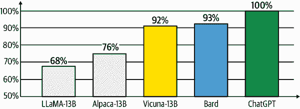
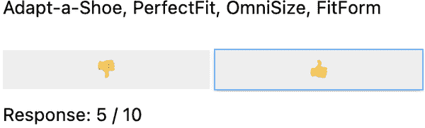
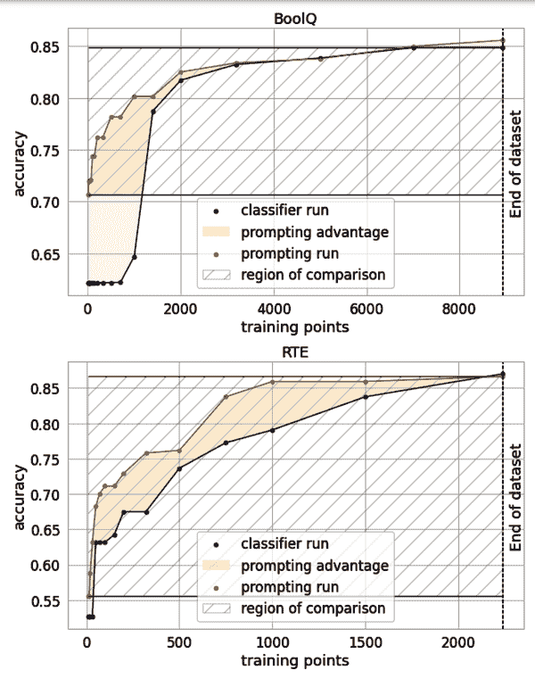

# 第一章. 提示的五项原则

*提示工程*是发现可靠产生有用或所需结果的提示的过程。

*提示*是您在与 ChatGPT 或 Midjourney 等 AI 模型交互时提供的输入，通常是文本。提示作为模型使用的一组指令，用于预测所需的响应：来自*大型语言模型*（LLMs）如[ChatGPT](https://chat.openai.com)的文本，或来自*扩散模型*如[Midjourney](https://www.midjourney.com)的图像。

这里是一个产品名称生成器提示输入的简单示例（灵感来源于[OpenAI 的示例](https://oreil.ly/Fc8cq)之一），以及 ChatGPT 生成的结果。

输入：

```py
Can I have a list of product names for a pair of shoes that
can fit any foot size?
```

输出：

```py
Certainly! Here's a list of product names for a pair of shoes
that can fit any foot size:

UniFit SoleStrides
FlexiSize All-Fit Shoes
OmniFit FootFlex
...
AnyStep AdaptiWalkers
FlexiRange UniversalSteps
PerfectGlide MultiFit Shoes
```

这已经是对一个天真提示的非凡响应，感觉像魔法，因为我们几乎不费吹灰之力就做到了。随着最先进模型的改进，您在第一次尝试就获得*足够好*的结果的可能性增加。对于任何与 AI 的临时互动，您不打算再次执行相同任务，天真方法就足够了。

然而，如果您计划将此提示投入生产，您将受益于投入更多精力以确保其正确性。错误会花费您金钱，因为 OpenAI 根据提示和响应的长度以及修复错误所花费的时间来收费。如果您正在构建一个拥有数千用户的名称生成器，有一些明显的问题您会想要尝试解决：

模糊的方向

您没有向 AI 说明您想要的名称风格或它应该具有的属性。您想要一个单词还是组合？单词可以随意创造，还是它们必须是真正的英语？您想要 AI 模仿您钦佩的、以优秀产品名称而闻名的人？

未格式化的输出

您正在逐行返回一个分隔的名称列表，长度不固定。当您多次运行此提示时，您会看到有时它会返回一个编号列表，并且经常在开头有文本，这使得它难以程序化解析。

缺少示例

您没有给出任何关于*好名字*样子的例子。它正在使用训练数据的平均值自动补全，即整个互联网（及其固有的偏见），但这真的是您想要的吗？理想情况下，您会提供成功名称的例子，行业中的常见名称，或者甚至只是您喜欢的其他名称。

评估有限

您没有一致或可扩展的方式来定义哪些名称是好是坏，因此您必须手动审查每个响应。如果您可以建立评分系统或其他形式的测量，您就可以优化提示以获得更好的结果，并确定它失败了多少次。

没有任务划分

你在这里对单个提示的要求很多：产品命名涉及到许多因素，而这个重要的任务被天真地一次性外包给了 AI，没有任何任务专业化或了解它如何为你处理这个任务的可见性。

解决这些问题是我们在这本书中使用的核心原则的基础。有许多不同的方式可以要求 AI 模型执行相同的任务，即使是微小的变化也可能产生很大的差异。LLMs 通过连续预测下一个标记（大约是四分之三的单词）来工作，从你的提示开始。每个新标记都是根据其出现的概率来选择的，其中包含一定的随机性（由*温度*参数控制）。如图 1-1 所示，单词*鞋子*在名称*AnyFit*开始后的出现概率较低（0.88%），而更可预测的响应将是*运动型*（72.35%）。


###### 图 1-1\. 响应如何分解为标记

大型语言模型（LLMs）在本质上训练了整个互联网的文本，然后进一步微调以提供有用的响应。平均提示将返回平均响应，导致一些人当他们的结果没有达到预期时感到失望。你放在提示中的内容会改变每个生成的单词的概率，因此这对你将得到的结果有很大影响。这些模型已经看到了人类产生的最好和最坏的东西，并且如果你知道正确的方式提问，它们几乎可以模仿任何东西。OpenAI 根据提示和响应中使用的[标记数量](https://openai.com/pricing)来收费，因此提示工程师需要通过优化提示以成本、质量和可靠性来确保这些标记的价值。

这里是应用了几个提示工程技术的相同示例。我们要求以史蒂夫·乔布斯的方式提供名字，并说明我们想要一个以逗号分隔的列表，并提供完成任务做得好的示例。

输入：

```py
Brainstorm a list of product names for a shoe that fits any
foot size, in the style of Steve Jobs.

Return the results as a comma-separated list, in this format:
Product description: A shoe that fits any foot size
Product names: [list of 3 product names]

## Examples
Product description: A refrigerator that dispenses beer
Product names: iBarFridge, iFridgeBeer, iDrinkBeerFridge

Product description: A watch that can tell accurate time in
space
Product names: iNaut, iSpace, iTime

Product description: A home milkshake maker
Product names: iShake, iSmoothie, iShake Mini
```

输出：

```py
Product description: A shoe that fits any foot size
Product names: iFitFoot, iPerfectFit, iShoeSize
```

虽然没有任何提示是完美的，但这个提示被优化以可靠地以正确的格式提供坚实的商品名称。你的产品名称生成器的用户可以选择除史蒂夫·乔布斯之外的人来获取他们喜欢的名字，如果需要，他们可以更改响应格式，并且这个提示的输出可以成为另一个输入。最后，你可以根据用户反馈定期更新你在提示中使用的示例，使你的系统随着时间的推移变得更智能。

# 提示五原则概述

优化此提示的过程遵循**提示的五个原则**，我们将使用本章节的其余部分来剖析这些原则，并在整本书中回顾。它们与我们在讨论天真文本提示时提出的五个问题完全对应。您将在整本书的其余部分找到对这些原则的引用，以帮助您了解它们在实际中的应用。提示的五个原则如下：

指明方向

详细描述期望的风格，或参考相关角色

指定格式

定义需要遵循的规则以及响应的所需结构

提供示例

插入一组多样化的测试案例，其中任务执行正确

评估质量

识别错误并评估响应，测试驱动性能的因素。

分工合作

将任务拆分为多个步骤，以实现复杂目标

这些原则不是短暂的**技巧**或**捷径**，而是普遍接受的、适用于任何智能水平（生物或人工）的惯例。这些原则是模型无关的，并且无论您使用哪种生成文本或图像模型，都应该有助于改进您的提示。我们首次在 2022 年 7 月发布的博客文章“提示工程：从文字到艺术和文案”中发布这些原则，并且它们经受了时间的考验，包括与 OpenAI 一年后发布的[提示工程指南](https://oreil.ly/dF8q-)非常接近。任何与生成 AI 模型紧密合作的人可能会汇聚到解决常见问题的相似策略，并在整本书中，您将看到数百个如何使用这些策略来改进提示的示范性例子。

我们为文本和图像生成提供了可下载的单页指南，您可以在应用这些原则时将其作为清单使用。这些指南是为我们流行的 Udemy 课程[AI 训练营的完整提示工程](https://oreil.ly/V40zg)（70,000+ 学生）制作的，该课程基于相同的原则，但材料与本书不同。

+   [文本生成单页指南](https://oreil.ly/VCcgy)

+   [图像生成单页指南](https://oreil.ly/q7wQF)

为了展示这些原则同样适用于提示图像模型，让我们使用以下示例，并解释如何将提示的五个原则应用于这个特定场景。将整个输入提示复制并粘贴到 Discord 的 Midjourney Bot 中，包括开头到图像链接，在键入`**/imagine**`以触发提示框出现之后（需要免费[Discord](https://discord.com)账户和付费[Midjourney](https://www.midjourney.com)账户）。

输入：

```py
https://s.mj.run/TKAsyhNiKmc stock photo of business meeting
of 4 people watching on white MacBook on top of glass-top
table, Panasonic, DC-GH5
```

图 1-2 显示了输出。


###### 图 1-2. 商务会议的股票照片

这个提示利用了 Midjourney 将基础图像作为示例的能力，通过将图像上传到 Discord，然后将 URL 复制粘贴到提示中（[*https://s.mj.run/TKAsyhNiKmc*](https://s.mj.run/TKAsyhNiKmc)），这里使用了 Unsplash 的免费图片（图 1-3）。如果你在提示中遇到错误，请尝试自己上传图像并查看 Midjourney 的文档（[Midjourney 的文档](https://oreil.ly/UTxpX)）以了解任何格式更改。


###### 图 1-3. 由 Mimi Thian 在[Unsplash](https://oreil.ly/J4Hkr)拍摄的照片

让我们比较一下这个精心设计的提示与你在以最简单的方式请求股票照片时从 Midjourney 得到的结果。图 1-4 显示了没有提示工程时得到的一个例子，这个图像比通常预期的股票照片风格更暗、更具有风格化。

输入：

```py
people in a business meeting
```

图 1-4 显示了输出。

尽管在 Midjourney v5 及以后的版本中这个问题不太突出，但社区反馈机制（当用户选择将图像调整到更高分辨率时，这个选择可能会用于训练模型）据报道已经使模型偏向于*幻想*美学，这对于股票照片用例不太合适。Midjourney 的早期用户来自数字艺术界，自然倾向于幻想和科幻风格，即使这种美学不适合，这种风格也会反映在模型的结果中。


###### 图 1-4. 商务会议中的人们

在这本书中使用的示例将与 ChatGPT Plus（GPT-4）作为文本模型和 Midjourney v6 或 Stable Diffusion XL 作为图像模型兼容，尽管如果重要我们会进行说明。这些基础模型是当前最先进的技术，擅长各种任务。原则旨在尽可能保证未来兼容性，所以如果你在 GPT-5、Midjourney v7 或 Stable Diffusion XXL 发布时阅读这本书，或者如果你使用的是其他供应商如 Google，这里学到的一切仍然应该是有用的。

# 1. 给出方向

之前讨论的简单文本提示的一个问题是，它没有向 AI 说明你想要的产品名称的类型。在某种程度上，给产品命名是一项主观的活动，如果不给 AI 一个你喜欢的名称的想法，它猜对的概率很低。

顺便说一句，没有良好的*简报*，人类也很难完成这项任务，这就是为什么创意和品牌代理机构需要从客户那里获得任何任务的详细简报。

###### 小贴士

虽然这不是完美的映射，但可以想象人类可能需要什么样的上下文来完成这项任务，并尝试将其包含在提示中。

在我们给出的示例提示中，我们通过使用*角色扮演*来给出方向，在那个例子中是模仿史蒂夫·乔布斯，他因标志性地为产品命名而闻名。如果你将提示的这个方面改为训练数据中著名的人物（以及将示例与正确的风格匹配），你会得到截然不同的结果。

输入：

```py
Brainstorm a list of product names for a shoe that fits any
foot size, in the style of Elon Musk.

Return the results as a comma-separated list, in this format:
Product description: A shoe that fits any foot size
Product names: [list of 3 product names]

## Examples
Product description: A refrigerator that dispenses beer
Product names: Teslacool, FridgeX, Neuradrink

Product description: A watch that can tell accurate time in
space
Product names: WatchX, iSpace, The Watch Company

Product description: A home milkshake maker
Product names: ShakeX, The Milkshake Company, HyperShake
```

输出：

```py
ShoeX, MarsFit, The Shoe Company
```

也有一些规则或最佳实践是你应该遵循的，这些可以包含在提示中作为上下文，以引导 AI 向一个可行的名字发展。这种技术有时被称为*预热*或*内部检索*，它简单但有效 ([刘等人，2021](https://oreil.ly/1lqzK))。开始对话时请求最佳实践建议，然后要求它遵循自己的建议，这会有很大帮助。实际上，你是在用它来生成自己的方向。

输入：

```py
Please give me 5 tips for naming products based on expert
industry advice.
```

输出：

```py
Certainly! Naming a product is crucial as it often gives the
first impression to potential customers. Here are five expert
tips to guide you in naming products:

1\. **Simplicity & Memorability**: Opt for names that are
short, easy to spell, and memorable. Long, complicated names
can be difficult for customers to recall. Remember, the
easier the name is to remember, the more likely it is that
consumers will think of your product when making a purchase
decision.

...

5\. **Positive Connotations**: Names that evoke positive
emotions or imagery can create a favorable perception of
your product. Avoid names that have negative or
controversial associations in any of the primary languages
or cultures where you intend to do business. It's often
worthwhile to conduct linguistic checks and market testing
to ensure there aren't unintended meanings.

Lastly, once you've shortlisted a few names, it's a good
idea to run them by diverse focus groups or conduct surveys
to gauge reactions. Also, ensure that the name you choose is
available for trademarking and doesn't infringe on existing
trademarks.
```

然后在同一个聊天窗口中，模型拥有它之前给出的建议的上下文，你提出你想要完成的任务的初始提示。

输入：

```py
Using this advice, can I have a list of product names for a
pair of shoes that can fit any foot size?
```

输出：

```py
Certainly! Based on the criteria given:

1\. **Simplicity & Memorability**
2\. **Relevance & Descriptiveness**
3\. **Differentiation & Uniqueness**
4\. **Adaptable & Scalable**
5\. **Positive Connotations**

Here's a list of potential product names for shoes that can
fit any foot size:

1\. **FitAll Walkers**: A simple and memorable name that
instantly suggests a universal fit.

...

10\. **TrueFit Universals**: Emphasizing genuine comfort and
fit for all.

Before finalizing any name, remember to check for trademarks
to ensure there's no conflict with existing products or
brands.
```

在我们的经验中，另一个富有成效的策略是将你想要完成的任务的最佳建议提取出来，并将其上下文插入到提示中。例如，你可以采用[Brandwatch 的 5 条黄金法则来命名产品](https://oreil.ly/3bWjz)或你找到的另一个可信的外部资源，并将其作为上下文插入到提示中。这将显著增加提示的长度，这会花费更多的钱（当作为开发者使用 API 时），但如果响应的质量有所提高，这可能值得权衡。

输入：

```py
Can I have a list of product names for a pair of shoes that
can fit any foot size? Please follow the five rules below:

1\. It should be readable and writable.
If your product name is hard to pronounce, people won’t talk about it,
and if they can’t write it down (and spell it correctly!)
when they hear it, how do you expect them to Google it?

Keep it simple and don’t go with any wacky spellings just for the sake of it.

...

5\. It should evoke an emotion, feeling, or idea.
Your product name should tie back into what your product is, what the
feeling you want people to have when experiencing your product is, and/or
what idea are you trying to get across.

It should be emotive and inspiring.
```

输出：

```py
1\. FlexFit Footwear
2\. OmniSize Sneakers
3\. AdaptStride Shoes
...
18\. OmniComfort Kicks
19\. FlexSize Footwear
20\. Boundless Soles
```

提供方向的方法有很多。在图像生成示例中，通过指定商务会议是在一个玻璃桌周围举行的来给出方向。如果你只改变这个细节，你可以得到一个完全不同的图像，如图 1-5 中详细说明的那样。

输入：

```py
https://s.mj.run/TKAsyhNiKmc stock photo of business meeting
of four people gathered around a campfire outdoors in the
woods, Panasonic, DC-GH5
```

图 1-5 显示了输出。


###### 图 1-5\. 丛林中的商务会议的股票照片

角色扮演对于图像生成也很重要，你可以通过提供要模仿的艺术家或艺术风格的名字来给 Midjourney 提供方向。在 AI 艺术界中，梵高是一个经常被提及的艺术家，他以其大胆、戏剧性的笔触和生动的色彩运用而闻名。看看当你将他的名字包含在提示中时会发生什么，如图 1-6 所示。

输入：

```py
people in a business meeting, by Van Gogh
```

图 1-6 显示了输出。


###### 图 1-6\. 梵高风格的商务会议中的人物

要使最后一个提示生效，你需要删除很多其他指导。例如，移除基础图像和单词“*库存照片*”，以及相机“*松下，DC-GH5*”有助于引入梵高的风格。你可能会遇到的问题是，通常在过多的指导下，模型会迅速达到一个它无法解决的冲突组合。如果你的提示过于具体，训练数据中可能没有足够的样本来生成符合所有你标准的图像。在这种情况下，你应该选择哪个元素更重要（在这种情况下，是梵高），并据此做出让步。

指导是使用最普遍和最广泛的原则之一。它可以采取简单地使用正确的描述性词语来阐明你的意图，或者模仿相关商业名人的形象。虽然过多的指导可能会限制模型的创造力，但指导不足是更常见的问题。

# 2. 指定格式

AI 模型是通用的翻译器。这不仅意味着从法语翻译成英语，或从乌尔都语翻译成克林贡语，还包括在数据结构之间，如从 JSON 到 YAML，或从自然语言到 Python 代码之间的转换。这些模型能够以几乎任何格式返回响应，因此提示工程的重要部分是找到指定你想要响应的格式的方法。

有时你会发现相同的提示会返回不同的格式，例如，是编号列表而不是逗号分隔列表。这通常不是什么大问题，因为大多数提示都是一次性的，并且是在 ChatGPT 或 Midjourney 中输入的。然而，当你将 AI 工具集成到生产软件中时，偶尔的格式变化可能会导致各种错误。

就像与人类合作一样，你可以通过提前指定你期望的响应格式来避免浪费精力。对于文本生成模型来说，输出 JSON 而不是简单的有序列表通常很有帮助，因为那是 API 响应的通用格式，这使得解析和查找错误更加简单，同时也可以用来渲染应用程序的前端 HTML。YAML 也是另一个流行的选择，因为它强制执行可解析的结构，同时仍然简单且易于阅读。

在你给出的原始提示中，你通过提供的示例和提示末尾的冒号来指示应该直接在行内完成列表。要将格式转换为 JSON，你需要更新这两处，并留下 JSON 未完成，这样 GPT-4 就会知道需要完成它。

输入：

```py
Return a comma-separated list of product names in JSON for
"A pair of shoes that can fit any foot size.".
Return only JSON.

Examples:
[{
		"Product description": "A home milkshake maker.",
		"Product names": ["HomeShaker", "Fit Shaker",
		"QuickShake", "Shake Maker"]
	},
	{
		"Product description": "A watch that can tell
		accurate time in space.",
		"Product names": ["AstroTime", "SpaceGuard",
		"Orbit-Accurate", "EliptoTime"]}
]
```

输出：

```py
[
	{
		"Product description": "A pair of shoes that can \
		fit any foot size.",
		"Product names": ["FlexFit Footwear", "OneSize Step",
		"Adapt-a-Shoe", "Universal Walker"]
	}
]
```

我们得到的输出是包含产品名称的完整 JSON。然后可以解析并用于程序化，在应用程序或本地脚本中。从这个点开始，使用 Python 标准 *json* 库之类的 JSON 解析器检查格式错误也很容易，因为损坏的 JSON 会导致解析错误，这可以作为重试提示或在进行下一步之前进行调查的触发器。如果你仍然没有得到正确的格式，在提示的开始或结束处，或者在使用聊天模型时在系统消息中指定可能有所帮助：`你是一个只以 JSON 格式响应的有用助手`，或者在模型参数中指定[JSON 输出](https://oreil.ly/E7wua)（这在[Llama 模型](https://oreil.ly/yU27T)中被称为*语法*）。

###### 小贴士

如果你不太熟悉 JSON，W3Schools [有一个很好的介绍](https://oreil.ly/Xakgc)。

对于图像生成模型来说，格式非常重要，因为修改图像的机会几乎是无穷无尽的。这些格式从明显的类型，如`股票照片`、`插画`和`油画`，到更不寻常的类型，如`行车记录仪视频`、`冰雕`，或者在《我的世界》中（见图 1-7）。

输入：

```py
business meeting of four people watching on MacBook on top of
table, in Minecraft
```

图 1-7 显示了输出。


###### 图 1-7. 《我的世界》中的商务会议

在设置格式时，通常需要删除可能与指定格式冲突的其他提示方面。例如，如果你提供的是股票照片的基础图像，结果将是股票照片和你想要的格式的某种组合。在一定程度上，图像生成模型可以推广到他们在训练集中之前未见过的新的场景和组合，但根据我们的经验，无关元素的层次越多，得到不合适图像的可能性就越大。

第一原则和第二原则之间往往存在一些重叠，即给出方向和指定格式。后者是关于定义你想要的输出类型，例如 JSON 格式，或股票照片的格式。前者是关于你想要的响应风格，独立于格式，例如以史蒂夫·乔布斯风格的产品名称，或梵高风格的商务会议图像。当风格和格式发生冲突时，通常最好通过删除对最终结果不那么重要的元素来解决。

# 3. 提供示例

原始提示没有给出你认为*好的*名称样例。因此，响应近似于互联网的平均水平，你可以做得更好。研究人员将没有示例的提示称为*零样本*，当 AI 甚至能够零样本完成任务时，这总是一个令人愉快的惊喜：这是强大模型的标志。如果你提供零个示例，你是在索取很多而回报很少。即使提供一个示例（*单样本*）也能大大帮助，研究人员通常测试模型在多个示例（*少样本*）下的表现是常态。这样一项著名的研究是 GPT-3 论文[“语言模型是少样本学习者”](https://oreil.ly/KW5PS)，其结果在图 1-8 中展示，显示添加一个示例与提示结合可以提高某些任务的准确性，从 10%提高到近 50%！


###### 图 1-8\. 上下文中的示例数量

当向同事简要介绍一项新任务或培训初级员工时，自然地你会包括该任务之前做得好的示例。与 AI 合作也是如此，提示的强度通常取决于所使用的示例。提供示例有时比试图解释你为什么喜欢那些示例要容易，因此当你在尝试完成的任务的主题领域不是领域专家时，这种技术最为有效。你可以在提示中放入的文本量是有限的（截至写作时，Midjourney 上大约有 6,000 个字符，ChatGPT 免费版本大约有 32,000 个字符），因此提示工程的大部分工作涉及选择和插入多样且富有教育意义的示例。

在可靠性和创造力之间有一个权衡：超过三个到五个示例，你的结果将变得更加可靠，但会牺牲创造力。你提供的示例越多，它们之间的多样性越少，响应将越受限于匹配你的示例。如果你将前一个提示中的所有示例都改为动物名称，这将强烈影响响应，可靠地只返回包含动物的名称。

输入：

```py
Brainstorm a list of product names for a shoe that fits any
foot size.

Return the results as a comma-separated list, in this format:
Product description: A shoe that fits any foot size
Product names: [list of 3 product names]

## Examples:
Product description: A home milkshake maker.
Product names: Fast Panda, Healthy Bear, Compact Koala

Product description: A watch that can tell accurate time in
space.
Product names: AstroLamb, Space Bear, Eagle Orbit

Product description: A refrigerator that dispenses beer
Product names: BearFridge, Cool Cat, PenguinBox
```

输出：

```py
Product description: A shoe that fits any foot size
Product names: FlexiFox, ChameleonStep, PandaPaws
```

当然，这也存在错过返回一个更适合有限空间内 AI 发挥的更好名称的风险。示例的多样性和变化不足也是处理边缘情况或罕见场景的问题。包括一到三个示例很容易，并且几乎总是有积极的效果，但超过这个数量，就变得必须实验包含的示例数量以及它们之间的相似性。有证据([Hsieh et al., 2023](https://oreil.ly/6Ixcw))表明，给出方向比提供示例更有效，而且通常收集好的示例并不简单，因此通常明智的做法是首先尝试给出方向的原则。

在图像生成领域，提供示例通常是通过在提示中提供一个基础图像来实现的，在开源 [Stable Diffusion](https://oreil.ly/huVRu) 社区中被称为 *img2img*。根据所使用的图像生成模型，这些图像可以作为模型生成内容的起点，这对结果有很大影响。你可以保持提示的所有内容不变，但将提供的基图像替换为截然不同的图像，从而产生不同的效果，如图 1-9 所示。

输入：

```py
stock photo of business meeting of 4 people watching on
white MacBook on top of glass-top table, Panasonic, DC-GH5
```

图 1-9 显示了输出。


###### 图 1-9. 四人商务会议的股票照片

在这种情况下，通过替换图 1-10 中显示的图像，也是来自 Unsplash 的，你可以看到模型被引导到不同的方向，并且现在包含了白板和便利贴。

###### 警告

这些示例展示了图像生成模型的能力，但我们在上传用于提示的基础图像时要谨慎。检查你计划上传并用作提示基图像的图像的许可，并避免使用明显受版权保护的照片。这样做可能会让你陷入法律纠纷，并且违反所有主要图像生成模型提供商的服务条款。


###### 图 1-10. Jason Goodman 在[Unsplash](https://oreil.ly/ZbzZy)上的照片

# 4. 评估质量

到目前为止，还没有反馈循环来判断你响应的质量，除了通过运行提示并查看结果的基本试错方法，这被称为[*盲提示*](https://oreil.ly/42rSz)。当你的提示仅用于临时执行单一任务且很少再次访问时，这是可以接受的。然而，当你多次重用相同的提示或构建依赖于提示的生产应用程序时，你需要更严格地衡量结果。

评估性能的方法有很多，这主要取决于你希望完成哪些任务。当一个新的 AI 模型发布时，重点往往在于模型在*评估*（评估）上的表现如何，这是一个标准化的问题集，具有预定义的答案或评分标准，用于测试模型间的性能。不同的模型在不同类型的任务上表现不同，不能保证之前有效的提示在新模型上也能很好地转换。OpenAI 已经将其用于基准测试 LLM 性能的 evals 框架开源，并鼓励其他人贡献额外的评估模板。

除了标准的学术评估外，还有一些更具新闻价值的测试，例如 [GPT-4 通过了律师资格考试](https://oreil.ly/txhSZ)。对于更主观的任务，评估可能很困难，对于较小的团队来说可能耗时或成本高昂。在某些情况下，研究人员已经转向使用更先进的模型，如 GPT-4，来评估来自较不复杂的模型的响应，正如在 [Vicuna-13B 的发布](https://oreil.ly/NW3WX)中所做的那样，这是一个基于 Meta 的 Llama 开源模型的微调模型（参见图 1-11）。



###### 图 1-11\. Vicuna GPT-4 评估

在撰写科学论文或评估新的基础模型发布时，需要更严格的评估技术，但通常你只需要比基本的试错多走一步。你可能发现，在 Jupyter Notebook 中实现的简单点赞/踩不点赞系统足以增加对提示优化的严谨性，而不会增加太多开销。一个常见的测试是看看提供示例是否值得额外的提示长度成本，或者你是否可以在提示中不提供示例也能应付。第一步是获取每个提示的多次运行响应并将它们存储在电子表格中，我们将在设置好环境后进行此操作。

你可以使用 `pip install openai` 安装 OpenAI Python 包。如果你遇到与此包的兼容性问题，请创建一个虚拟环境并安装我们的[*requirements.txt*](https://oreil.ly/2KDV6)（请参阅前言中的说明）。

要使用 API，你需要[创建一个 OpenAI 账户](https://oreil.ly/oGv4j)，然后[在此处导航以获取你的 API 密钥](https://oreil.ly/oHID1)。

###### 警告

由于安全原因，不建议在脚本中硬编码 API 密钥。相反，利用环境变量或配置文件来管理你的密钥。

一旦你有了 API 密钥，至关重要的是通过执行以下命令将其分配为环境变量，将 `api_key` 替换为你的实际 API 密钥值：

```py
export OPENAI_API_KEY="api_key"
```

或者，在 Windows 上：

```py
set OPENAI_API_KEY=api_key
```

或者，如果你不想预先设置 API 密钥，那么你可以在初始化模型时手动设置密钥，或者从 *.env* 文件中加载它，使用 *[python-dotenv](https://oreil.ly/IaQjS)*。首先，使用 `pip install python-dotenv` 安装库，然后在脚本或笔记本的顶部使用以下代码加载环境变量：

```py
from dotenv import load_dotenv

load_dotenv()  # take environment variables from .env.
```

第一步是为每个提示的多次运行获取响应并将它们存储在电子表格中。

输入：

```py
# Define two variants of the prompt to test zero-shot
# vs few-shot
prompt_A = """Product description: A pair of shoes that can
fit any foot size.
Seed words: adaptable, fit, omni-fit.
Product names:"""

prompt_B = """Product description: A home milkshake maker.
Seed words: fast, healthy, compact.
Product names: HomeShaker, Fit Shaker, QuickShake, Shake
Maker

Product description: A watch that can tell accurate time in
space.
Seed words: astronaut, space-hardened, eliptical orbit
Product names: AstroTime, SpaceGuard, Orbit-Accurate,
EliptoTime.

Product description: A pair of shoes that can fit any foot
size.
Seed words: adaptable, fit, omni-fit.
Product names:"""

test_prompts = [prompt_A, prompt_B]

import pandas as pd
from openai import OpenAI
import os

# Set your OpenAI key as an environment variable
# https://platform.openai.com/api-keys
client = OpenAI(
  api_key=os.environ['OPENAI_API_KEY'],  # Default
)

def get_response(prompt):
    response = client.chat.completions.create(
        model="gpt-3.5-turbo",
        messages=[
            {
                "role": "system",
                "content": "You are a helpful assistant."
            },
            {
                "role": "user",
                "content": prompt
            }
        ]
    )
    return response.choices[0].message.content

# Iterate through the prompts and get responses
responses = []
num_tests = 5

for idx, prompt in enumerate(test_prompts):
    # prompt number as a letter
    var_name = chr(ord('A') + idx)

    for i in range(num_tests):
        # Get a response from the model
        response = get_response(prompt)

        data = {
            "variant": var_name,
            "prompt": prompt,
            "response": response
            }
        responses.append(data)

# Convert responses into a dataframe
df = pd.DataFrame(responses)

# Save the dataframe as a CSV file
df.to_csv("responses.csv", index=False)

print(df)
```

输出：

```py
  variant                                             prompt
  \
0       A  Product description: A pair of shoes that can ...
1       A  Product description: A pair of shoes that can ...
2       A  Product description: A pair of shoes that can ...
3       A  Product description: A pair of shoes that can ...
4       A  Product description: A pair of shoes that can ...
5       B  Product description: A home milkshake maker.\n...
6       B  Product description: A home milkshake maker.\n...
7       B  Product description: A home milkshake maker.\n...
8       B  Product description: A home milkshake maker.\n...
9       B  Product description: A home milkshake maker.\n...

                                            response
0  1\. Adapt-a-Fit Shoes \n2\. Omni-Fit Footwear \n...
1  1\. OmniFit Shoes\n2\. Adapt-a-Sneaks \n3\. OneFi...
2  1\. Adapt-a-fit\n2\. Flexi-fit shoes\n3\. Omni-fe...
3  1\. Adapt-A-Sole\n2\. FitFlex\n3\. Omni-FitX\n4\. ...
4  1\. Omni-Fit Shoes\n2\. Adapt-a-Fit Shoes\n3\. An...
5  Adapt-a-Fit, Perfect Fit Shoes, OmniShoe, OneS...
6       FitAll, OmniFit Shoes, SizeLess, AdaptaShoes
7       AdaptaFit, OmniShoe, PerfectFit, AllSizeFit.
8  FitMaster, AdaptoShoe, OmniFit, AnySize Footwe...
9        Adapt-a-Shoe, PerfectFit, OmniSize, FitForm
```

在这里，我们使用 OpenAI API 生成对一组提示的模型响应，并将结果存储在数据框中，然后将其保存为 CSV 文件。以下是工作原理：

1.  定义了两个提示变体，每个变体都包含产品描述、种子词和潜在的产品名称，但 `prompt_B` 提供了两个示例。

1.  需要导入 Pandas 库、OpenAI 库和 os 库。

1.  `get_response` 函数接受一个提示作为输入，并从 `gpt-3.5-turbo` 模型返回一个响应。提示作为用户消息传递给模型，同时传递一个系统消息以设置模型的行为。

1.  两个提示变体存储在 `test_prompts` 列表中。

1.  创建一个空列表 `responses` 来存储生成的响应，并将变量 `num_tests` 设置为 5。

1.  使用嵌套循环来生成响应。外循环遍历每个提示，内循环为每个提示生成 `num_tests`（本例中为五个）个响应。

    1.  使用 `enumerate` 函数获取 `test_prompts` 中每个提示的索引和值。然后将此索引转换为相应的大写字母（例如，0 变为 *A*，1 变为 *B*），用作变体名称。

    1.  对于每次迭代，使用当前提示调用 `get_response` 函数来从模型生成响应。

    1.  创建一个包含变体名称、提示和模型响应的字典，并将其追加到 `responses` 列表中。

1.  一旦所有响应都生成完毕，`responses` 列表（现在是一个字典列表）被转换为 Pandas 数据框。

1.  然后使用 Pandas 内置的 `to_csv` 函数将此数据框保存为 CSV 文件，文件名为 *responses.csv*，`index=False` 以防止写入行索引。

1.  最后，数据框被打印到控制台。

将这些响应放在电子表格中已经很有用，因为你可以立即在打印的响应中看到，前五行中的 `prompt_A`（零样本）提供了一个编号列表，而最后五行中的 `prompt_B`（少样本）倾向于输出逗号分隔的行内列表的期望格式。下一步是对每个响应进行评分，最好是无视并随机化，以避免偏向某个提示而忽略另一个。

输入：

```py
import ipywidgets as widgets
from IPython.display import display
import pandas as pd

# load the responses.csv file
df = pd.read_csv("responses.csv")

# Shuffle the dataframe
df = df.sample(frac=1).reset_index(drop=True)

# df is your dataframe and 'response' is the column with the
# text you want to test
response_index = 0
# add a new column to store feedback
df['feedback'] = pd.Series(dtype='str')

def on_button_clicked(b):
    global response_index
    #  convert thumbs up / down to 1 / 0
    user_feedback = 1 if b.description == "\U0001F44D" else 0

    # update the feedback column
    df.at[response_index, 'feedback'] = user_feedback

    response_index += 1
    if response_index < len(df):
        update_response()
    else:
        # save the feedback to a CSV file
        df.to_csv("results.csv", index=False)

        print("A/B testing completed. Here's the results:")
        # Calculate score and num rows for each variant
        summary_df = df.groupby('variant').agg(
            count=('feedback', 'count'),
            score=('feedback', 'mean')).reset_index()
        print(summary_df)

def update_response():
    new_response = df.iloc[response_index]['response']
    if pd.notna(new_response):
        new_response = "<p>" + new_response + "</p>"
    else:
        new_response = "<p>No response</p>"
    response.value = new_response
    count_label.value = f"Response: {response_index + 1}"
    count_label.value += f"/{len(df)}"

response = widgets.HTML()
count_label = widgets.Label()

update_response()

thumbs_up_button = widgets.Button(description='\U0001F44D')
thumbs_up_button.on_click(on_button_clicked)

thumbs_down_button = widgets.Button(
    description='\U0001F44E')
thumbs_down_button.on_click(on_button_clicked)

button_box = widgets.HBox([thumbs_down_button,
thumbs_up_button])

display(response, button_box, count_label)
```

输出如图 图 1-12 所示：



###### 图 1-12\. 点赞/踩不点赞评价系统

如果你在一个 Jupyter Notebook 中运行此代码，一个小部件会显示每个 AI 响应，并带有点赞或踩按钮（见 图 1-12）。这提供了一个简单的界面，可以快速标记响应，且开销最小。如果你想在 Jupyter Notebook 之外做这件事，你可以将点赞和踩按钮的表情符号改为 *Y* 和 *N*，并使用内置的 `input()` 函数实现循环，作为 iPyWidgets 的纯文本替代。

一旦完成标记响应，你将得到输出，它显示了每个提示的性能。

输出：

```py
A/B testing completed. Here's the results:
  variant  count  score
0       A      5    0.2
1       B      5    0.6
```

数据框被随机洗牌，每个响应都被盲标（没有看到提示），因此你可以准确地了解每个提示执行得多频繁。以下是逐步解释：

1.  导入了三个模块：`ipywidgets`、`IPython.display` 和 `pandas`。`ipywidgets` 包含用于 Jupyter Notebook 和 IPython 内核的交互式 HTML 小部件。`IPython.display` 提供了用于显示各种类型输出的类，如图像、声音、显示 HTML 等。Pandas 是一个强大的数据处理库。

1.  使用 pandas 库读取包含你想要测试的响应的 CSV 文件 *responses.csv*，这创建了一个名为 `df` 的 Pandas 数据框。

1.  `df` 使用 `sample()` 函数并设置 `frac=1` 进行洗牌，这意味着它使用了所有行。`reset_index(drop=True)` 用于将索引重置为标准的 0, 1, 2, …, n 索引。

1.  脚本将 `response_index` 定义为 0。这用于跟踪用户当前正在查看数据框中的哪个响应。

1.  在 `df` 数据框中添加了一个新的列 `feedback`，数据类型为 `str` 或字符串。

1.  接下来，脚本定义了一个函数 `on_button_clicked(b)`，该函数将在界面中的任一按钮被点击时执行。

    1.  函数首先检查点击的按钮的 `description` 是否为点赞按钮 (`\U0001F44D`; )，并将 `user_feedback` 设置为 1，或者如果它是踩按钮 (`\U0001F44E` )，则将 `user_feedback` 设置为 0。

    1.  然后它更新当前 `response_index` 的数据框的 `feedback` 列为 `user_feedback`。

    1.  之后，它将 `response_index` 增加，以移动到下一个响应。

    1.  如果 `response_index` 仍然小于响应的总数（即数据框的长度），则调用 `update_response()` 函数。

    1.  如果没有更多的响应，它将数据框保存到新的 CSV 文件 *results.csv*，然后打印一条消息，并按变体打印结果的摘要，显示收到的反馈数量和每个变体的平均分数（平均值）。

1.  `update_response()`函数从数据框中获取下一个响应，将其包裹在段落 HTML 标签中（如果它不是 null），更新`response`小部件以显示新的响应，并更新`count_label`小部件以反映当前响应编号和总响应数。

1.  实例化了两个小部件，`response`（一个 HTML 小部件）和`count_label`（一个标签小部件）。然后调用`update_response()`函数以初始化这些小部件，显示第一个响应和适当的标签。

1.  创建了两个更多的小部件，`thumbs_up_button`和`thumbs_down_button`（都是按钮小部件），分别以赞同和反对表情符号作为它们的描述。这两个按钮都配置为在点击时调用`on_button_clicked()`函数。

1.  使用`HBox`函数将两个按钮组合成一个水平框（`button_box`）。

1.  最后，使用`IPython.display`模块的`display()`函数将`response`、`button_box`和`count_label`小部件显示给用户。

这样的简单评分系统可以用来判断提示质量并处理边缘情况。通常在 10 次以下的对提示的测试运行中，你会发现偏差，否则你可能直到开始在生产中使用它之前都不会发现。缺点是手动评分大量响应可能会很繁琐，而且你的评分可能无法代表目标受众的偏好。然而，即使是少量测试也可以揭示两种提示策略之间的巨大差异，并在达到生产之前揭示不明显的问题。

对提示进行迭代和测试可以显著缩短提示的长度，从而降低系统和延迟的成本。如果你能找到另一个性能相同（或更好）但使用更短提示的提示，你就可以大幅度扩大你的运营规模。通常，在这个过程中，你会发现复杂提示的许多元素完全是多余的，甚至可能适得其反。

赞同或其他手动标记的质量指标不一定是唯一的评判标准。人类评估通常被认为是反馈的最准确形式。然而，手动评估大量样本可能会很繁琐且成本高昂。在许多情况下，例如在数学或分类用例中，可能可以建立*基准真相*（测试用例的参考答案）以编程方式评估结果，从而大大提高你的测试和监控努力。以下列表并不全面，因为有许多动机促使你以编程方式评估提示：

成本

使用大量标记或仅与更昂贵模型工作的提示可能不适合生产使用。

延迟

同样，标记越多，或所需的模型越大，完成任务所需的时间就越长，这可能会损害用户体验。

调用

许多 AI 系统需要多次循环调用才能完成任务，这可能会严重减慢处理速度。

性能

实现某种形式的外部反馈系统，例如用于预测现实世界结果的物理引擎或其他模型。

分类

确定提示正确标记给定文本的频率，使用另一个 AI 模型或基于规则的标记。

推理

计算 AI 未能应用逻辑推理或数学错误的实例与参考案例之间的差异。

幻觉

看看你遇到幻觉的频率，这是通过发明不在提示上下文中的新术语来衡量的。

安全性

使用安全过滤器或检测系统标记任何可能返回不安全或不希望的结果的场景。

拒绝

通过标记已知的拒绝语言，找出系统错误拒绝合理用户请求的频率。

对抗性

使提示对已知的[提示注入](https://oreil.ly/KGAqe)攻击具有鲁棒性，这些攻击可以使模型运行不希望运行的提示而不是你编程的内容。

相似度

使用共享的单词和短语（[BLEU 或 ROGUE](https://oreil.ly/iEGZ9)）或向量距离（在第五章中解释）来衡量生成文本和参考文本之间的相似度。

一旦你开始评估哪些示例是好的，你就可以更容易地更新你的提示中使用的示例，作为随着时间的推移使你的系统变得更智能的一种方式。此反馈的数据还可以用于微调示例，一旦你可以[提供几千个示例](https://oreil.ly/DZ-br)，微调就开始超越提示工程，如图 1-13 所示。



###### 图 1-13。一个提示值是多少数据点？

从点赞或点踩过渡到 3 分、5 分或 10 分的评分系统，以获得对提示质量更细致的反馈。还可以通过并排比较响应，而不是逐个查看响应，来确定总体相对性能。从这些信息中，你可以构建一个公平的跨模型比较，使用*[Elo 评分](https://oreil.ly/TlldE)*，这在象棋中很受欢迎，也被*lmsys.org*在[聊天机器人竞技场](https://oreil.ly/P2IcU)中使用。

对于图像生成，评估通常采用*排列*提示的形式，即你输入多个方向或格式，并为每种组合生成一个图像。然后可以扫描图像或稍后以网格形式排列，以展示提示的不同元素对最终图像的影响。

输入：

```py
{stock photo, oil painting, illustration} of business
meeting of {four, eight} people watching on white MacBook on
top of glass-top table
```

在 Midjourney 中，这将被编译成六个不同的提示，每个提示对应于三种格式（股票照片、油画、插图）和两种人数（四、八）的组合。

输入：

```py
1\. stock photo of business meeting of four people watching
on white MacBook on top of glass-top table

2\. stock photo of business meeting of eight people watching
on white MacBook on top of glass-top table

3\. oil painting of business meeting of four people watching
on white MacBook on top of glass-top table

4\. oil painting of business meeting of eight people watching
on white MacBook on top of glass-top table

5\. illustration of business meeting of four people watching
on white MacBook on top of glass-top table

6\. illustration of business meeting of eight people watching
on white MacBook on top of glass-top table
```

每个提示通常都会生成其自己的四张图像，这使得输出结果稍微难以观察。我们从每个提示中选了一张图像进行放大，然后将它们组合成一个网格，如图图 1-14 所示。你会注意到，模型并不总是能得到正确的人数（生成式 AI 模型在数学上出奇地差），但它通过在右侧照片中添加比左侧更多的人数，正确地推断出了总体意图。

图 1-14 显示了输出。


###### 图 1-14. 提示排列网格

对于具有类似 Stable Diffusion 这样的 API 的模型，你可以更轻松地操作照片并以网格格式显示，以便于扫描。你还可以操作图像的随机种子，以固定一种风格，实现最大程度的可重复性。使用图像分类器时，也可能根据图像的安全内容或是否包含与成功或失败相关的特定元素进行编程评分。

# 5. 分工

当你构建提示时，你开始达到一个点，在这个点上，你在对 AI 的单次调用中提出了很多要求。当提示变得更长、更复杂时，你可能会发现响应的不确定性降低，幻觉或异常增加。即使你设法为你的任务找到了一个可靠的提示，这个任务也可能是你需要完成的工作中许多相互关联的任务之一。自然地，你会开始探索其他哪些任务可以通过 AI 完成，以及你如何将它们串联起来。

工程学的一个核心原则是利用任务分解将问题分解为其组成部分，这样你可以更容易地解决每个单独的问题，然后将结果重新聚合。将你的 AI 工作分解成多个串联的调用可以帮助你完成更复杂的任务，同时也能提供更多关于链中哪个部分失败的可见性。

产品命名涉及许多因素，其中一项重要的任务被天真地外包给了 AI，我们无法了解它如何权衡这些因素的重要性（如果有的话）。按照我们当前系统的工作方式，我们得到了一个名字列表，但所有名字都以同等的重要性显示，没有进一步的上下文来帮助我们做出决定。幸运的是，AI 工具能够进行自我评估；如果我们对任务添加第二步，我们可以自动检查非期望的输出。

输入：

```py
Rate this list of product names for a pair of shoes that can
fit any foot size. The rating should be out of 10, inline
next to the product name:

UniFit SoleStrides
FlexiSize All-Fit Shoes
OmniFit FootFlex
...
AnyStep AdaptiWalkers
FlexiRange UniversalSteps
PerfectGlide MultiFit Shoes
```

输出：

```py
UniFit SoleStrides: 7/10
FlexiSize All-Fit Shoes: 8/10
OmniFit FootFlex: 7/10
...
AnyStep AdaptiWalkers: 7/10
FlexiRange UniversalSteps: 7.5/10
PerfectGlide MultiFit Shoes: 9/10

This ranking is based on clarity, memorability, and how well
the name communicates the unique selling point of the
product (that they can fit any foot size). Remember, these
ratings are subjective and the ultimate success of a product
name also depends on the target market, branding, and
marketing efforts.
```

在多次运行此模型后，它始终将“OneSize Glovewalkers”这个名字评为最差，并提供上下文（如果你询问的话）说明这个概念在鞋类环境中可能会令人困惑。你可能想知道，如果模型*知道*这个名字不好，为什么它最初还会建议这个名字？LLMs 通过预测序列中的下一个标记来工作，因此很难知道完成后的整体响应会是什么。然而，当它有了之前响应的所有标记来审查时，它更容易预测这会被标记为好还是坏的反应。

我们可以继续将多个调用串联起来，以改进我们任务的成果。例如，我们可以将这分成三个单独的评分：清晰度、记忆度和名字传达产品独特卖点的好坏。这些评分可以提供给人类作为最终决策的额外上下文，或者甚至可以一起计算来程序化选择最终的名字。

与仅仅玩转提示相比，学会专业地与 AI 合作学习的真正突破在于意识到系统的每个部分都可以分解为一系列迭代步骤。即使是一个单独的提示，这个原则也适用，因为简单地将“让我们一步步思考”添加到提示中，可以带来推理和熟练度的明显提升，同时为质量保证和调试提供审计轨迹。当花费时间和标记进行推理时，评分会改变，并且与评分标准更加一致。

输入：

```py
Let's think step by step. Rate this list of product names
for a pair of shoes that can fit any foot size. The rating
should be out of 10, inline next to the product name:

UniFit SoleStrides
FlexiSize All-Fit Shoes
OmniFit FootFlex
...
AnyStep AdaptiWalkers
FlexiRange UniversalSteps
PerfectGlide MultiFit Shoes
```

输出：

```py
Here's a rating out of 10 for each product name, considering
factors like descriptiveness, catchiness, and overall
appeal:

1\. **UniFit SoleStrides**: 7/10 - Sounds unifying but may
not immediately convey the "fit any size" idea.
2\. **FlexiSize All-Fit Shoes**: 8.5/10 - Combines
flexibility and the notion that it fits all sizes.
3\. **OmniFit FootFlex**: 8/10 - Omnipresence (fitting all)
and flexibility nicely conveyed.
...
18\. **AnyStep AdaptiWalkers**: 7.5/10 - "AnyStep" suggests
versatility, but the overall name might be less direct.
19\. **FlexiRange UniversalSteps**: 8/10 - Combines
flexibility and universal fit.
20\. **PerfectGlide MultiFit Shoes**: 8.5/10 - "MultiFit" is
clear, and "PerfectGlide" suggests a comfortable experience.

Remember, the best name can also be influenced by your
target audience, branding strategy, and the overall message
you want to convey.
```

OpenAI [称之为](https://oreil.ly/0MZ3-) “给模型思考的时间”，这是提示工程的一个关键原则。实际上，*思维链*技术就像这种，鼓励模型列出其步骤，就像在同一个提示中分解任务一样。一旦我们自动完成了产品命名的任务，我们就可以再次调用 ChatGPT 来描述每个产品，然后这些描述可以输入到 Midjourney 中生成每个产品的图像。使用 AI 模型为 AI 模型生成提示词是*元提示*，它之所以有效，是因为 LLMs 是达到人类水平的提示工程师([周，2022](https://oreil.ly/Dwszu))。

输入：

```py
Describe the new product "OneFit UltraStride Shoes," a shoe
that can fit any foot size, in great detail:
```

输出：

```py
Introducing the revolutionary "OneFit UltraStride Shoes,"
the footwear innovation designed to fit any foot size with
unparalleled comfort and style. These shoes are a result of
cutting-edge technology and meticulous craftsmanship,
ensuring a truly personalized and enjoyable walking or
running experience for everyone.

Design and Materials:
The OneFit UltraStride Shoes boast an elegant and modern
design that appeals to both fashion-forward individuals and
sports enthusiasts. They feature a sleek and streamlined
silhouette, crafted using premium materials for durability
and aesthetic appeal. The shoe's upper is constructed from a
combination of breathable mesh and flexible synthetic
materials, allowing for excellent airflow and a lightweight
feel.

...

Color and Customization:
OneFit UltraStride Shoes are available in a variety of
vibrant colors and stylish patterns, catering to diverse
personal preferences. You can choose from classic
monochromatic options for a timeless look or opt for bold
and vibrant hues to make a fashion statement. The ability to
customize the shoe's appearance allows individuals to
express their unique style while enjoying the benefits of
the OneFit technology.

Conclusion:
The OneFit UltraStride Shoes represent a breakthrough in
footwear technology, eliminating the hassle of finding the
perfect fit for your feet. With their adaptive design,
superior comfort, and stylish aesthetics, these shoes offer
a truly personalized experience for individuals of all foot
sizes. Stay comfortable, confident, and on-trend with the
OneFit UltraStride Shoes, the ultimate choice for those
seeking unmatched versatility and a perfect fit.
```

DALL-E 在 GPT-4 中是众所周知的，因此你可以在 ChatGPT 中调用它的名字，并且它为图像生成工具制作提示词做得相当不错。如果你打算在生产中使用这个提示词，你可能考虑应用提供示例的提示原则，但对我们来说，没有示例它也做得足够好。

输入：

```py
Convert this description into a short prompt for an AI image
generation model such as DALL-E:
```

输出：

```py
Create an eye-catching image that visually represents the
"OneFit UltraStride Shoes," a revolutionary footwear product
that adapts to any foot size. Showcase a sleek and modern
shoe design incorporating a stretchable upper, an adjustable
lacing system, and a cushioned insole for optimal comfort.
Emphasize the shoe's versatility by displaying it in action
on various surfaces, highlighting its excellent traction.
Incorporate vibrant colors and patterns to convey the
customizable nature of the product. The image should capture
the essence of innovation, style, and personalized fit that
the OneFit UltraStride Shoes offer.
```

现在可以将这个提示的输出连接到图像生成工具，如 DALL-E 或 Midjourney，作为提示，这可以为你可视化产品可能的样子提供一个良好的起点。尽管这可能不是你最终采用的设计，但看到图像更具有启发性，有助于人们更快地形成观点。从空白页面或文本部分想象一个新图像比批评或赞扬现有的图像在认知上更容易。

图 1-15 显示了输出结果。


###### 图 1-15\. OneFit UltraStride 运动鞋

在专业处理 AI 时，将多个 AI 调用甚至多个模型串联起来以实现更复杂的目标是一种常见的做法。即使是单次提示应用也往往是动态构建的，基于从各种数据库或其他 AI 模型调用中查询的外部上下文。库[LangChain](https://www.langchain.com)开发了将多个提示模板和查询串联起来的工具，使这一过程更加可观察和结构化。一个基础示例是渐进式摘要，其中无法适应上下文窗口的大段文本可以被分成多个文本块，每个块被总结，最后再总结这些摘要。如果你与早期 AI 产品的构建者交谈，你会发现他们都在底层将多个提示串联起来，称为*AI 串联*，以在最终输出中获得更好的结果。

[原因与行动（ReAct）框架](https://oreil.ly/tPPW9)是 AI 代理中最早流行的尝试之一，包括开源项目[BabyAGI](https://oreil.ly/TEiQx)、[AgentGPT](https://oreil.ly/48lq6)和[Microsoft AutoGen](https://oreil.ly/KG5Xl)。实际上，这些代理是通过将多个 AI 调用串联起来以实现规划、观察、行动，然后评估行动结果。自主代理将在第六章中介绍，但截至写作时，它们在生产中尚未得到广泛应用。这种自我推理代理的做法还处于早期阶段，容易出错，但有一些迹象表明，这种方法在完成复杂任务时可能是有用的，并且很可能是 AI 系统下一阶段演化的一个部分。

在微软和谷歌等大型科技公司之间，以及 Hugging Face 上的众多开源项目，以及像 OpenAI 和 Anthropic 这样的风险投资初创公司之间，正在发生一场 AI 竞赛。随着新模型的不断涌现，它们正在多样化以争夺不断增长市场的不同细分市场。例如，Anthropic 的 Claude 2 拥有[10 万个令牌的上下文窗口](https://oreil.ly/NQcFW)，而 GPT-4 的标准[8,192 个令牌](https://oreil.ly/iZhMl)。OpenAI 很快推出了 GPT-4 的[128,000 个令牌窗口版本](https://oreil.ly/3TTZ9)，而谷歌吹嘘其 Gemini 1.5 拥有 1 百万个令牌的上下文长度。[`oreil.ly/cyhR4`](https://oreil.ly/cyhR4)。为了比较，一本《哈利·波特》的书大约有 185,000 个令牌，所以整个一本书可能都适合放入一个单一的提示中，尽管每次 API 调用处理数百万个令牌可能对大多数用例来说成本过高。

这本书主要关注文本生成技术中的 GPT-4，以及 Midjourney v6 和 Stable Diffusion XL 在图像生成技术中的应用，但几个月后这些模型可能就不再是业界领先的技术了。这意味着能够选择适合任务的正确模型并将多个 AI 系统串联起来将变得越来越重要。在迁移到新模型时，提示模板通常难以比较，但五个提示原则的效果将始终如一地提升你使用的任何模型的提示，从而获得更可靠的结果。

# 摘要

在本章中，你学习了在生成式 AI 的背景下提示工程的重要性。我们将提示工程定义为开发有效的提示的过程，这些提示在与 AI 模型交互时产生预期结果。你发现提供清晰的方向、格式化输出、结合示例、建立评估系统以及将复杂任务分解成更小的提示是提示工程的关键原则。通过应用这些原则和使用常见的提示技术，你可以提高 AI 生成输出的质量和可靠性。

你还探讨了提示工程在生成产品名称和图像中的作用。你了解到指定所需格式和提供指导性示例如何极大地影响 AI 的输出。此外，你学习了角色扮演的概念，你可以要求 AI 生成类似于史蒂夫·乔布斯这样的名人的输出。本章强调了在使用生成式 AI 模型时，清晰的方向和上下文对于实现预期结果的重要性。此外，你还发现了评估 AI 模型性能的重要性以及用于衡量结果的多种方法，以及质量与令牌使用、成本和延迟之间的权衡。

在下一章中，您将了解到文本生成模型。您将学习不同类型的基模及其功能，以及它们的局限性。本章还将回顾标准 OpenAI 的提供内容，以及竞争对手和开源替代方案。到本章结束时，您将对文本生成模型的历史及其相对优势和劣势有一个扎实的理解。本书将在第 7、8 和 9 章回到图像生成提示，所以如果您对此有迫切需求，可以自由地跳过前面的内容。准备好深入探索提示工程学科，并扩展您与 AI 合作的舒适度。
