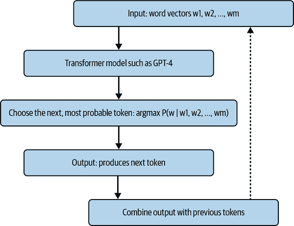

# 第二章：文本生成的大型语言模型简介

在人工智能领域，最近的研究重点是大语言模型的演变。与它们的较不灵活的前辈相比，LLMs 能够处理和从大量数据中学习，从而产生了生成接近人类语言输出的能力。这些模型已经应用于各种不同的应用，从撰写内容到自动化软件开发，以及实现实时交互式聊天机器人体验。

# 文本生成模型是什么？

文本生成模型利用高级算法来理解文本中的意义，并产生通常与人类工作难以区分的输出。如果你曾经与[ChatGPT](https://chat.openai.com)互动或对其构建连贯且与上下文相关的句子能力感到惊奇，你见证了 LLM 的力量。

在自然语言处理（NLP）和大型语言模型（LLMs）中，基本的语言单位是*token*。[Tokens](https://oreil.ly/3fOsM)可以代表句子、单词，甚至是一些字符集合，如子词。通过查看文本数据包含的 token 数量，我们可以理解文本数据的大小；例如，100 个 token 的文本大约相当于 75 个单词。这种比较对于管理 LLMs 的处理限制至关重要，因为不同的模型可能有不同的 token 容量。

*Tokenization*，即将文本分解成 token 的过程，是准备数据用于 NLP 任务的关键步骤。可以采用多种方法进行 tokenization，包括[字节对编码（BPE）](https://oreil.ly/iSOp7)、WordPiece 和 SentencePiece。每种方法都有其独特的优势，适用于特定的用例。BPE 因其处理广泛词汇量的效率而常用，同时又能保持 token 数量在可控范围内。

BPE 首先将文本视为一系列单独的字符。随着时间的推移，它将经常一起出现的字符组合成单个单元，或 token。为了更好地理解这一点，考虑一下单词*apple*。最初，BPE 可能将其视为*a*、*p*、*p*、*l*和*e*。但注意到*p*在数据集中经常出现在*a*之后和*l*之前，它可能会将它们组合起来，并在未来的实例中将*appl*视为一个单独的 token。

这种方法帮助 LLMs 识别和生成单词或短语，即使它们在训练数据中不常见，也使得模型更加适应性和多功能。

理解 LLMs 的工作原理需要掌握支撑这些系统的底层数学原理。尽管计算可能很复杂，但我们可以简化核心元素，以提供对这些模型如何运作的直观理解。特别是在商业环境中，LLMs 的准确性和可靠性至关重要。

实现这种可靠性的重要部分在于 LLM 开发的预训练和微调阶段。最初，模型在预训练阶段在庞大的数据集上进行训练，获得对语言的广泛理解。随后，在微调阶段，模型被适应于特定任务，提高它们的能力，为专业应用提供准确和可靠的结果。

## 向量表示：语言的数值本质

在自然语言处理领域，词语不仅仅是字母符号。它们可以被标记化，然后以称为*向量*的数值形式表示。这些向量是包含语义和句法关系的多维数字数组：

$w right-arrow bold v equals left-bracket v 1 comma v 2 comma ellipsis comma v Subscript n Baseline right-bracket$

创建词向量，也称为*词嵌入*，依赖于语言内部的复杂模式。在密集的训练阶段，模型被设计用来识别和学习这些模式，确保具有相似意义的词语在多维空间中彼此靠近（图 2-1）。


###### 图 2-1\. 词嵌入空间中词向量的语义邻近性

这种方法的美丽之处在于它能够捕捉词语之间细微的关系并计算它们的距离。当我们检查词嵌入时，很明显，具有相似或相关意义的词语，如*美德*和*道德*或*walked*和*walking*，彼此靠近。这种嵌入空间中的空间邻近性成为各种 NLP 任务中的强大工具，使模型能够理解上下文、语义以及构成语言的复杂关系网。

## Transformer 架构：协调上下文关系

在我们深入探讨 transformer 架构的机制之前，让我们建立一个基础的理解。简单来说，当我们有一个句子，比如*The cat sat on the mat*，这个句子中的每个词都会被转换成它的数值向量表示。所以，*cat*可能变成一系列数字，*sat*、*on*和*mat*也是如此。

正如你将在本章后面详细探索的那样，transformer 架构理解这些词向量及其关系——在结构（句法）和意义（语义）上。存在许多类型的 transformer；图 2-2 展示了 BERT 和 GPT 的架构。此外，transformer 不仅仅孤立地看待词语；它观察*cat*并知道在这个句子中它以特定方式与*sat*和*mat*相关。


###### 图 2-2\. BERT 使用编码器处理输入数据，而 GPT 有解码器处理输出

当 transformer 处理这些向量时，它使用数学运算来理解词语之间的关系，从而产生包含丰富上下文信息的新向量：

$bold v prime Subscript i Baseline equals Transformer left-parenthesis bold v 1 comma bold v 2 comma ellipsis comma bold v Subscript m Baseline right-parenthesis$

变换器的一个显著特点是它们理解词语细微语境意义的能力。变换器中的[自注意力](https://oreil.ly/xuovP)机制允许句子中的每个词查看所有其他词，以更好地理解其语境。想象一下，每个词都在为其他词对其意义的重要性投票。通过考虑整个句子，变换器可以更准确地确定每个词的角色和意义，使它们的*解释更加语境丰富*。

## 概率性文本生成：决策机制

在变换器理解了给定文本的语境之后，它继续生成新的文本，受似然或概率概念指导。从数学的角度来看，模型计算每个可能的下一个词跟随当前词序列的可能性，并选择最有可能的那个：

$w Subscript next Baseline equals argmax upper P left-parenthesis w vertical-bar w 1 comma w 2 comma ellipsis comma w Subscript m Baseline right-parenthesis$

通过重复这一过程，如图图 2-3 所示，模型生成一个连贯且与语境相关的文本字符串作为其输出。



###### 图 2-3\. 使用 GPT-4 等变换器模型生成文本的方式

驱动大型语言模型（LLM）的机制根植于向量数学、线性变换和概率模型。虽然底层的操作计算密集，但核心概念建立在这些数学原理之上，提供了一个基础理解，架起了技术复杂性与商业应用之间的桥梁。

# 历史基础：变换器架构的兴起

类似于 ChatGPT（*GPT*代表*生成预训练变换器*）的语言模型并非凭空出现。它们是 NLP 领域多年进步的结晶，特别是自 2010 年代末以来的加速发展。这一进步的核心是变换器架构的引入，这在谷歌大脑团队的开创性论文[“Attention Is All You Need”](https://oreil.ly/6NNbg)中有详细描述。

变换器架构的真正突破在于*注意力*的概念。传统模型按顺序处理文本，这限制了它们对语言结构的理解，尤其是在文本的较长距离上。注意力机制通过允许模型直接将文本中位置较远的词语联系起来，而不考虑它们在文本中的位置，从而改变了这一点。这是一个开创性的观点。这意味着词语及其上下文不需要在整个模型中移动来相互影响。这不仅显著提高了模型的文本理解能力，还使它们变得更加高效。

这种注意力机制在扩展模型检测文本中长距离依赖关系的能力方面发挥了至关重要的作用。这对于生成不仅上下文准确和流畅，而且在较长段落中也连贯的输出至关重要。

根据人工智能先驱和教育家[安德鲁·吴](https://oreil.ly/JQd53)的说法，早期的许多自然语言处理(NLP)研究，包括对变换器的基本研究，都得到了美国军事情报机构的重大资助。他们对机器翻译和语音识别等工具的浓厚兴趣，主要是出于情报目的，无意中为超越仅仅翻译的发展铺平了道路。

训练 LLMs 需要大量的计算资源。这些模型被大量数据喂养，从千兆字节到拍字节不等，包括互联网内容、学术论文、书籍以及为特定目的定制的更窄范围的数据库。然而，需要注意的是，用于训练 LLMs 的数据可能携带其来源的*固有偏见*。因此，在使用这些模型时，用户应谨慎行事，并最好采用人工监督，以确保负责任和道德的 AI 应用。

例如，OpenAI 的 GPT-4 拥有估计的[1.7 万亿参数](https://oreil.ly/pZvMo)，相当于一个覆盖三万足球场的 Excel 电子表格。在神经网络中，*参数*是指在训练过程中调整的权重和偏差，使模型能够根据其训练数据表示和生成复杂模式。GPT-4 的训练成本估计为[6300 万美元](https://oreil.ly/_NAq5)，而训练数据将填满大约[650 公里书架的书](https://oreil.ly/D7jL5)。

为了满足这些要求，像微软、Meta 和谷歌这样的大型科技公司已经投入了大量资金，使得 LLM 的开发成为一场高风险的竞争。

大型语言模型(LLMs)的兴起为硬件行业带来了更高的需求，尤其是专注于图形处理单元(GPUs)的公司。例如，NVIDIA 几乎成了高性能 GPU 的同义词，这对于 LLMs 的训练至关重要。

随着公司努力构建更大、更复杂的模型，对强大、高效的 GPU 的需求急剧上升。人们追求的不仅仅是原始的计算能力。GPU 还需要针对机器学习中的特定任务进行微调，如张量运算。在机器学习环境中，“张量”是多维数据数组，对它们的操作是神经网络计算的基础。这种对专用能力的强调催生了定制的硬件，如 NVIDIA 的 H100 张量核心 GPU，专门设计用于加速机器学习工作负载。

此外，对顶级 GPU 的巨大需求往往超过了供应量，导致价格呈上升趋势。这种供需互动将 GPU 市场转变为一个激烈竞争且有利可图的领域。在这里，从科技巨头到学术研究人员，各种客户争相采购最先进的硬件。

这种需求的激增引发了一股创新浪潮，而不仅仅是针对 GPU。现在，公司正专注于创建专门的 AI 硬件，例如谷歌的 Tensor 处理单元（TPUs），以满足 AI 模型不断增长的计算需求。

这种不断变化的环境不仅强调了 AI 领域软件与硬件之间的共生关系，而且突出了 LLM“淘金热”的连锁反应。它正引导创新并将投资引导到各个行业，尤其是那些提供构建这些模型的基本组件的行业。

# OpenAI 的生成预训练转换器

以确保通用人工智能惠及全人类为使命，[OpenAI](https://openai.com)最近一直处于 AI 革命的尖端。他们最具有突破性的贡献之一是 GPT 系列模型，这些模型在很大程度上重新定义了 LLM 能够实现的范围。

OpenAI 的原始 GPT 模型不仅仅是一个研究成果；它是对基于转换器架构潜力的有力展示。这个模型展示了机器理解并生成类似人类语言的初步步骤，为未来的进步奠定了基础。

GPT-2 的发布引起了人们的期待和谨慎。OpenAI 认识到该模型强大的能力，但由于对其潜在误用的担忧，最初犹豫不决地发布它。GPT-2 的强大之处在于，与今天模型的威力相比，伦理问题成为了焦点。然而，当 OpenAI 决定将项目作为 [开源](https://oreil.ly/evOQE) 发布时，这不仅仅意味着公开代码。它允许企业和研究人员将这些预训练模型作为构建块使用，将 AI 集成到他们的应用中而无需从头开始。这一举措使高级自然语言处理能力更加民主化，促进了各个领域的创新。

在 GPT-2 之后，OpenAI 决定专注于发布付费的闭源模型。GPT-3 的到来标志着 LLM 进程中的一个重大飞跃。它不仅因其技术实力而受到媒体的高度关注，还因其能力的社会影响。该模型能够生成如此令人信服的文本，以至于它往往与人类撰写的文本难以区分。从创作复杂的文学作品到生成操作代码片段，GPT-3 展示了 AI 似乎无边的潜力。

## GPT-3.5-turbo 和 ChatGPT

在微软对其公司的大量投资支持下，OpenAI 推出了 GPT-3.5-turbo，这是其卓越前驱的优化版本。2019 年，微软注入了 [10 亿美元](https://oreil.ly/1C8qm)，后来增加到 130 亿美元以获得 OpenAI 利润部门的 49% 股权，OpenAI 利用这些资源开发了 GPT-3.5-turbo，它提供了更高的效率和更低的成本，有效地使 LLM 对更广泛的用例更加可访问。

OpenAI 希望收集更多世界范围内的反馈以进行微调，因此 [ChatGPT](https://chat.openai.com) 诞生了。与它的通用型兄弟姐妹不同，[ChatGPT 被微调](https://oreil.ly/6ib-Q) 以在对话环境中表现出色，使得人类与机器之间的对话感觉自然且有意义。

图 2-4 展示了 ChatGPT 的训练过程，该过程涉及三个主要步骤：

收集演示数据

在这一步中，人工标注员提供了一系列提示的期望模型行为的示例。标注员在项目上进行培训，并遵循具体指令以准确标注提示。

训练监督策略

在上一步收集的演示数据被用来通过监督学习微调预训练的 GPT-3 模型。在监督学习中，模型在提供正确答案的标记数据集上进行训练。这一步帮助模型学会遵循给定的指令并产生符合预期行为的输出。

比较数据的收集和强化学习

在这一步，收集了一个模型输出的数据集，并且人类标注员根据他们的偏好对这些输出进行排名。然后训练一个奖励模型来预测标注员会偏好哪些输出。最后，使用强化学习技术，特别是近端策略优化（PPO）算法，来优化监督策略以最大化奖励模型中的奖励。

这个训练过程允许 ChatGPT 模型使其行为与人类意图保持一致。使用带有人类反馈的强化学习有助于创建一个比预训练的 GPT-3 模型更有帮助、更诚实、更安全的模型。


###### 图 2-4\. ChatGPT 的微调过程

根据[UBS 研究报告](https://oreil.ly/2Ivq2)，到 2023 年 1 月，ChatGPT 创下了新的基准，积累了 1 亿活跃用户，成为互联网历史上增长最快的消费应用。ChatGPT 现在已成为客户服务、虚拟助手和许多其他需要类似人类对话技巧的应用的首选。

# GPT-4

2024 年，OpenAI 发布了 GPT-4，它在理解复杂查询和生成上下文相关且连贯的文本方面表现出色。例如，GPT-4 在律师资格考试中得分达到 298 分（满分 400 分），位于 90 分百分位。目前，GPT-3.5-turbo 在 ChatGPT 中免费使用，但 GPT-4 需要支付[月度费用](https://oreil.ly/UOEBM)。

GPT-4 使用了 [专家混合方法](https://oreil.ly/v45LZ)；它不仅超越了依赖单个模型的推理来产生更准确和有洞察力的结果。

2024 年 5 月 13 日，OpenAI 推出了 [GPT-4o](https://oreil.ly/4ttmq)，这是一个能够实时处理和推理文本、音频和视觉输入的高级模型。该模型在视觉和音频理解方面提供了增强的性能；由于其能够在单个神经网络中处理所有三种模态，因此它比其前辈更快、更经济。

# 谷歌的 Gemini

由于 ChatGPT 的使用导致谷歌失去了搜索市场份额，它最初于 2023 年 3 月 21 日发布了 Bard。Bard 有点 [不够精细](https://oreil.ly/Sj24h)，并且最初并没有提供 ChatGPT 所提供的相同高质量的大型语言模型（LLM）响应（图 2-5）。

随着时间的推移，谷歌一直在向 Bard 添加额外功能，包括代码生成、视觉 AI、实时搜索和语音，使其在质量上越来越接近 ChatGPT。

2023 年 3 月 14 日，谷歌发布了[PaLM API](https://oreil.ly/EbI8-)，允许开发者在谷歌云平台上访问它。2023 年 4 月，亚马逊网络服务（AWS）发布了类似的服务，如[Amazon Bedrock](https://oreil.ly/4fNQX)和[亚马逊的 Titan FMs](https://oreil.ly/FJ-7D)。谷歌在 2024 年 2 月发布的 v1.5 版本中将 Bard 重命名为 Gemini，并开始获得与 GPT-4 相似的结果。


###### 图 2-5\. Bard 关于詹姆斯·韦伯太空望远镜的幻觉结果

此外，谷歌基于与 Gemini 相同架构发布了两个较小的 [开源模型](https://oreil.ly/LWIwv)。OpenAI 终于不再是软件工程师将最先进的 LLM 集成到其应用程序中的唯一明显选择。

# Meta 的 Llama 和开源

Meta 在语言模型方面的方法与行业中的其他竞争对手有显著差异。通过依次发布开源模型 [Llama](https://oreil.ly/LroPn)，[Llama 2](https://oreil.ly/NeZLw) 和 [Llama 3](https://oreil.ly/Vwlo-)，Meta 旨在培养一个更加包容和协作的 AI 开发生态系统。

Llama 2 和 Llama 3 的开源性质对更广泛的科技行业具有重大影响，尤其是对大型企业。透明度和协作精神鼓励快速创新，因为问题和漏洞可以由全球开发者社区迅速识别和解决。随着这些模型变得更加稳健和安全，大型企业可以更有信心地采用它们。

Meta 的开源策略不仅使最先进的 AI 技术的访问民主化，而且有可能在整个行业中产生重大影响。通过为协作、透明和去中心化的开发过程奠定基础，Llama 2 和 Llama 3 是开创性的模型，它们很可能定义生成式 AI 的未来。这些模型在 AWS、Google Cloud、Hugging Face 和其他平台上有 70 亿、80 亿和 700 亿参数版本。

这些模型的开源性质是一把双刃剑。一方面，它使竞争更加公平。这意味着即使是较小的开发者也有机会参与到创新中，改进和应用开源模型到实际商业应用中。这种去中心化的创新可能导致在单一组织围墙花园内可能不会发生的突破，增强模型的能力和应用。

然而，正是这种使这一切成为可能的开放性也带来了潜在的风险，因为它可能允许恶意行为者利用这项技术达到有害的目的。这确实是像 OpenAI 这样的组织所关注的问题，他们建议在一定程度上进行控制和限制实际上可以起到减轻这些强大工具危险应用的作用。

# 利用量化（Quantization）和 LoRA

这些开源模型的一个颠覆性的方面是[量化](https://oreil.ly/bkWXk)和[LoRA](https://oreil.ly/zORsB)（低秩近似）的使用潜力。这些技术允许开发者将这些模型适应到更小的硬件占用中。量化有助于降低模型参数的数值精度，从而在不显著损失性能的情况下缩小模型的整体大小。同时，LoRA 有助于优化网络架构，使其在消费级硬件上运行更加高效。

这样的优化使得在消费级硬件上微调这些 LLM 变得越来越可行。这是一个关键的发展，因为它允许进行更多的实验和适应性调整。不再局限于高性能数据中心，个人开发者、小型企业和初创公司现在可以在资源受限的环境中工作这些模型。

# Mistral

Mistral 7B，法国初创公司[Mistral AI](https://mistral.ai)的杰作，在生成式 AI 领域崭露头角，其 73 亿参数使其产生了重大影响。这个模型不仅仅在于规模；它还在于效率和功能，为开源大型语言模型及其在众多用例中的应用前景提供了光明。其效率的关键在于滑动窗口注意力的实现，这是一种在 Apache 开源许可证下发布的许可技术。许多 AI 工程师以此模型为基础进行了微调，包括令人印象深刻的[Zephr 7b beta](https://oreil.ly/Lg6_r)模型。还有[Mixtral 8x7b](https://oreil.ly/itsJG)，这是一个专家混合模型（类似于 GPT-4 的架构），其结果与 GPT-3.5-turbo 相似。

想要更详细和最新的开源模型及其性能指标的比较，请访问由 Hugging Face 主办的聊天机器人[竞技场排行榜](https://oreil.ly/ttiji)。

# Anthropic: Claude

2023 年 7 月 11 日发布的[Claude 2](https://claude.ai/login)通过其开创性的[宪法 AI](https://oreil.ly/Tim9W)方法在 AI 安全和一致性方面与其他突出的 LLM（如 ChatGPT 和 LLaMA）区分开来——使用一系列规则或价值观来训练模型。Claude 2 的一个显著增强是其扩展的上下文窗口，达到 10 万个标记，以及上传文件的能力。在生成式 AI 领域，*上下文窗口*指的是模型在生成响应时可以积极考虑或记住的文本或数据量。拥有更大的上下文窗口，模型可以基于更广泛的环境进行理解和生成。

这一进步引起了 AI 工程师的极大热情，因为它为新的更复杂的用例开辟了道路。例如，Claude 2 一次性处理更多信息的能力使其擅长总结大量文档或维持深入对话。然而，这种优势是短暂的，因为 OpenAI 仅六个月后发布了 GPT-4 的 128K 版本。[六个月后](https://oreil.ly/BWxrn)。然而，竞争对手之间的激烈竞争正在推动该领域向前发展。

下一个版本的 Claude 包括了[Opus](https://oreil.ly/NH0jh)，这是第一个在智能方面与 GPT-4 相媲美的模型，以及 Haiku，这是一个更小的模型，速度极快，价格为每百万个 token 0.25 美元（当时是 GPT-3.5-turbo 成本的一半）。

# GPT-4V(ision)

在一个重大飞跃中，2023 年 9 月 23 日，OpenAI 通过引入 Vision 扩展了 GPT-4 的功能，使用户能够指示 GPT-4 分析图像和文本。这一创新也反映在 ChatGPT 界面的更新中，现在它支持将图像和文本作为用户输入。这一发展标志着向*多模态模型*的重大趋势，这些模型可以在单一上下文中无缝处理和理解多种类型的数据，如图像和文本。

# 模型比较

在撰写本文时，LLM 市场由 OpenAI 主导，其最先进的 GPT-4 模型被广泛认为具有显著领先优势。最接近的竞争对手是 Anthropic，人们对像 Llama 和 Mistral 这样的较小开源模型的前景感到兴奋，尤其是在微调方面。尽管评论家们预计 OpenAI 未来将继续推出世界领先的模型，但随着开源模型在更多任务上变得“足够好”，AI 工作负载可能会转向本地微调模型。随着模型性能和量化（在精度、大小和计算成本之间权衡的方法）的进步，未来某一天在您的手机或其他设备上运行 LLM 可能成为可能。

目前，了解模型擅长什么最好的方法是在多个模型上运行相同的提示并比较其响应。在我们工作中经常突出的一点是，GPT-4 在遵循指令方面表现得非常好，以下例子中它就是唯一一个以正确格式、与示例匹配的名称（以字母*i*开头）响应的模型。

输入：

```py
Brainstorm a list of product names for a shoe that fits any foot size,
in the style of Steve Jobs.

Return the results as a comma-separated list, in this format:
Product description: A shoe that fits any foot size
Product names: [list of three product names]

## Examples
Product description: A refrigerator that dispenses beer
Product names: iBarFridge, iFridgeBeer, iDrinkBeerFridge

Product description: A watch that can tell accurate time in space
Product names: iNaut, iSpace, iTime

Product description: A home milkshake maker
Product names: iShake, iSmoothie, iShake Mini
```

输出（GPT-4）：

```py
Product description: A shoe that fits any foot size
Product names: iFit, iShoe, iFlexible
```

输出（Claude 3）：

```py
Product description: A shoe that fits any foot size
Product names: iFit, iComfort, iSole
```

输出（Llama 3 70b）：

```py
Here is the list of product names for a shoe that fits any foot size,
in the style of Steve Jobs:

Product description: A shoe that fits any foot size Product names:
iFit, OneSize, iWalkFree
```

# 摘要

LLM 从其诞生到目前的高级状态，是一个关于不懈创新、合作和激烈竞争的故事。随着这些模型继续发展，它们很可能会成为我们日常生活中的更基本部分，改变我们与技术以及彼此互动的方式。

通过理解这些模型的历史背景和功能，您可以更好地欣赏我们可用于各种应用的工具，从提示工程到智能虚拟代理的开发。然而，需要注意的是，尽管这些模型提供了广阔的可能性，数据隐私仍然是一个关键的关注点。如果这些模型使用您的数据进行再训练或微调，请谨慎行事，并避免输入敏感信息。

在下一章中，您将学习所有基本的提示工程技术，用于与文本 LLMs（大型语言模型）一起工作。您将学习到充分利用像 GPT-4 这样的强大语言模型所需的基本技能。随着您解锁生成式 AI 的真正潜力，您将迎来令人兴奋的见解和实用的方法。
