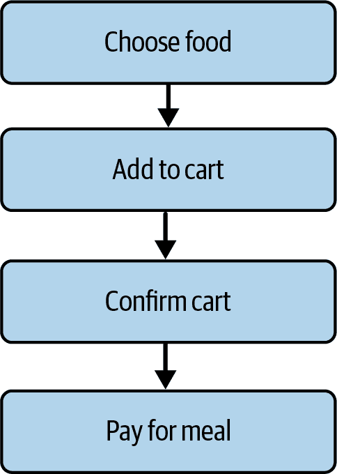
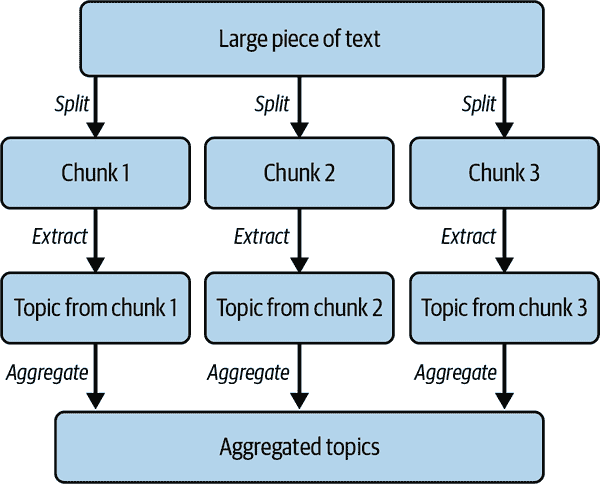
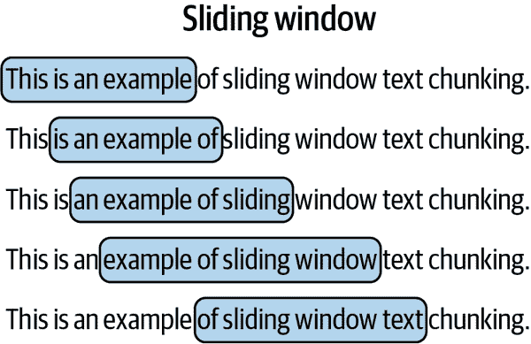
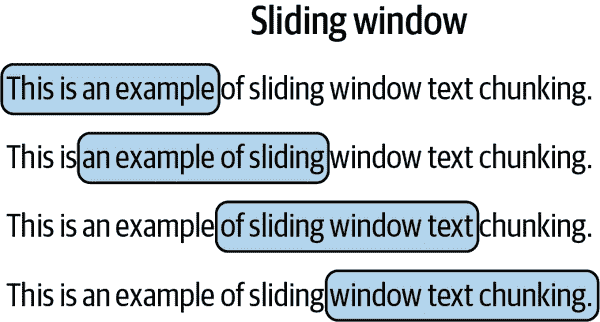

# 第三章. 使用 ChatGPT 进行文本生成的标准实践

简单的提示技术将帮助你最大化 LLM 的输出和格式。你将从定制提示开始，以探索用于文本生成的所有常见实践。

# 生成列表

自动生成列表非常强大，使你能够专注于更高层次的任务，而 GPT 可以代表你自动生成、细化、重新排序和去重列表。

输入：

```py
Generate a list of Disney characters.
```

输出：

```py
Sure, here is a list of some popular Disney characters:

1\. Mickey Mouse
2\. Minnie Mouse
...
30\. Bagheera (The Jungle Book)
```

GPT-4 完全能够提供角色列表。然而，这种方法存在一些陷阱：

+   GPT 决定提供 30 个示例，以编号列表的形式呈现，由 `\n` 字符分隔。然而，如果你的下游 Python 代码期望在项目符号处分割，那么你可能会得到不理想的结果或运行时错误。

+   GPT 提供了先前的评论；移除任何先前的/随后的评论会使解析输出更容易。

+   没有控制列表大小，并将其留给语言模型。

+   一些字符在其对应电影名称的括号内（例如，*Bagheera (The Jungle Book)*）——而另一些则没有。这使得提取名称变得更加困难，因为你需要移除电影标题。

+   在 LLM 生成过程中，没有根据我们期望的结果进行过滤或选择。

下面是一个优化的提示。

输入：

```py
Generate a bullet-point list of 5 male Disney characters.
Only include the name of the character for each line.
Never include the film for each Disney character.
Only return the Disney characters, never include any commentary.

Below is an example list:

* Aladdin
* Simba
* Beast
* Hercules
* Tarzan
```

输出：

```py
* Woody
* Buzz Lightyear
* Stitch
* Jack Sparrow
* Prince Charming
```

# 提供示例

简单地重新措辞你的提示以包含示例 *(few-shot prompting)* 可以极大地影响期望的输出。

通过优化提示，你已经实现了以下效果：

+   将列表限制为固定大小五

+   仅生成男性角色

+   正确格式化带有项目符号的列表

+   移除了任何先前的评论

简单列表适用于大多数任务；然而，它们结构较少，对于某些任务，从 GPT-4 输出中获取嵌套数据结构是有益的。

三种典型数据结构包括：

+   嵌套文本数据（层次列表）

+   JSON

+   YAML

# 层次列表生成

层次列表在需要嵌套输出时很有用。一个很好的例子就是详细的文章结构。

输入：

```py
Generate a hierarchical and incredibly detailed article outline on:

What are the benefits of data engineering.

See an example of the hierarchical structure below:

Article Title: What are the benefits of digital marketing?

* Introduction
    a. Explanation of digital marketing
    b. Importance of digital marketing in today's business world
* Increased Brand Awareness
    a. Definition of brand awareness
    b. How digital marketing helps in increasing brand awareness
```

输出：

```py
Article Title: What are the benefits of data engineering?

* Introduction
    a. Explanation of data engineering
    b. Importance of data engineering in today’s data-driven world

...(10 sections later)...

* Conclusion
    a. Importance of data engineering in the modern business world
    b. Future of data engineering and its impact on the data ecosystem
```

为了在前面的输出中生成有效的文章大纲，你包含了两个关键短语：

层次化

为了建议文章大纲需要生成嵌套结构。

极其详细

为了引导语言模型产生更大的输出。其他可以包含以产生相同效果的字词包括 *非常长* 或通过指定大量子标题，*至少包含 10 个顶级标题*。

###### 注意

询问语言模型固定数量的项目并不能保证语言模型会产生相同长度的输出。例如，如果你要求 10 个标题，你可能会只收到 8 个。因此，你的代码应该验证存在 10 个标题，或者能够灵活处理来自 LLM 的不同长度。

因此，你已经成功生成了一个分层文章大纲，但如何将字符串解析成结构化数据呢？

让我们用 Python 探索 示例 3-1，在那里你之前已经成功调用了 OpenAI 的 GPT-4。使用了两个正则表达式从 `openai_result` 中提取标题和副标题。Python 中的 `re` 模块用于处理正则表达式。

##### 示例 3-1\. [解析分层列表](https://oreil.ly/A0otS)

```py
import re

# openai_result = generate_article_outline(prompt)
# Commented out to focus on a fake LLM response, see below:

openai_result = '''
* Introduction
 a. Explanation of data engineering
 b. Importance of data engineering in today’s data-driven world
* Efficient Data Management
 a. Definition of data management
 b. How data engineering helps in efficient data management
* Conclusion
 a. Importance of data engineering in the modern business world
 b. Future of data engineering and its impact on the data ecosystem
'''

# Regular expression patterns
heading_pattern = r'\* (.+)'
subheading_pattern = r'\s+[a-z]\. (.+)'

# Extract headings and subheadings
headings = re.findall(heading_pattern, openai_result)
subheadings = re.findall(subheading_pattern, openai_result)

# Print results
print("Headings:\n")
for heading in headings:
    print(f"* {heading}")

print("\nSubheadings:\n")
for subheading in subheadings:
    print(f"* {subheading}")
```

此代码将输出：

```py
Headings:
- Introduction
- Efficient Data Management
- Conclusion

Subheadings:
- Explanation of data engineering
- Importance of data engineering in today’s data-driven world
- Definition of data management
- How data engineering helps in efficient data management
- Importance of data engineering in the modern business world
- Future of data engineering and its impact on the data ecosystem
```

正则表达式的使用允许进行高效的模式匹配，使得处理输入文本的变化（如前导空格或制表符的存在或不存在）成为可能。让我们探索这些模式是如何工作的：

+   `heading_pattern = r'\* (.+)`

此模式旨在提取主要标题，由以下内容组成：

+   `\*` 匹配标题开头处的星号 `(*)` 符号。反斜杠用于转义星号，因为星号在正则表达式中具有特殊含义（匹配前面字符的零个或多个出现）。

+   星号之后将匹配一个空格字符。

+   `(.+)`: 匹配一个或多个字符，并且括号创建了一个捕获组。`.` 是一个通配符，匹配除换行符之外的任何字符，而 `+` 是一个量词，表示前面元素（在这种情况下是点）的一个或多个出现。

通过应用此模式，你可以轻松地将所有主要标题提取到一个列表中，而不包含星号。

+   `subheading_pattern = r'\s+[a-z]\. (.+)`

`subheading pattern` 将匹配 `openai_result` 字符串中的所有副标题：

+   `\s+` 匹配一个或多个空白字符（空格、制表符等）。`+` 表示前面元素（在这种情况下是 `\s`）的一个或多个出现。

+   `[a-z]` 匹配从 *a* 到 *z* 的单个小写字母。

+   `\.` 匹配句点字符。反斜杠用于转义句点，因为在正则表达式中句点有特殊含义（匹配除换行符之外的任何字符）。

+   *一个空格字符将在句号之后匹配*。

+   `(.+)` 匹配一个或多个字符，并且括号创建了一个捕获组。`.` 是一个通配符，匹配除换行符之外的任何字符，而 `+` 是一个量词，表示前面元素（在这种情况下是点）的一个或多个出现。

此外，`re.findall()` 函数用于在输入字符串中查找所有非重叠模式的匹配项，并将它们作为列表返回。然后打印提取的标题和副标题。

因此，现在你能够从分层文章大纲中提取标题和副标题；然而，你可以进一步细化正则表达式，以便每个标题都与相应的 `subheadings` 相关联。

在 示例 3-2 中，正则表达式略有修改，以便每个副标题直接与其相应的副标题相关联。

##### 示例 3-2\. [将分层列表解析为 Python 字典](https://oreil.ly/LcMtv)

```py
import re

openai_result = """
* Introduction
 a. Explanation of data engineering
 b. Importance of data engineering in today’s data-driven world
* Efficient Data Management
 a. Definition of data management
 b. How data engineering helps in efficient data management
 c. Why data engineering is important for data management
* Conclusion
 a. Importance of data engineering in the modern business world
 b. Future of data engineering and its impact on the data ecosystem
"""

section_regex = re.compile(r"\* (.+)")
subsection_regex = re.compile(r"\s*([a-z]\..+)")

result_dict = {}
current_section = None

for line in openai_result.split("\n"):
    section_match = section_regex.match(line)
    subsection_match = subsection_regex.match(line)

    if section_match:
        current_section = section_match.group(1)
        result_dict[current_section] = []
    elif subsection_match and current_section is not None:
        result_dict[current_section].append(subsection_match.group(1))

print(result_dict)
```

这将输出：

```py
{
    "Introduction": [
        "a. Explanation of data engineering",
        "b. Importance of data engineering in today’s data-driven world"
    ],
    "Efficient Data Management": [
        "a. Definition of data management",
        "b. How data engineering helps in efficient data management"
    ],
    "Conclusion": [
        "a. Importance of data engineering in the modern business world",
        "b. Future of data engineering and its impact on the data ecosystem"
    ]
}
```

部分标题正则表达式`r'\* (.+)'`匹配一个星号后跟一个空格，然后是一个或多个字符。括号捕获星号和空格后面的文本，以便在代码中稍后使用。

子部分正则表达式`r'\s*([a-z]\..+)'`以`\s*`开始，它匹配零个或多个空白字符（空格或制表符）。这允许正则表达式匹配带有或不带有前导空格或制表符的子部分。接下来的部分`([a-z]\..+)`匹配一个小写字母后跟一个点，然后是一个或多个字符。括号捕获整个匹配的子部分文本，以便在代码中稍后使用。

`for`循环遍历输入字符串`openai_result`中的每一行。当遇到与部分标题正则表达式匹配的行时，循环将匹配的标题设置为当前部分，并在`result_dict`字典中将它的值设为空列表。当一行与子部分正则表达式匹配时，匹配的子部分文本将被追加到当前部分的列表中。

因此，循环逐行处理*输入字符串*，将行分类为部分标题或子部分，并构建所需的字典结构。

# 避免使用正则表达式的时机

当你努力从 LLM 响应中提取更多结构化数据时，仅依赖正则表达式会使控制流*变得越来越复杂*。然而，还有其他格式可以轻松地解析 LLM 响应中的结构化数据。两种常见的格式是*.json*和*.yml*文件。

# 生成 JSON

让我们从实验一些将指导 LLM 返回 JSON 响应的提示设计开始。

输入：

```py
Compose a very detailed article outline on "The benefits of learning code" with a
JSON payload structure that highlights key points.

Only return valid JSON.

Here is an example of the JSON structure:
{
    "Introduction": [
        "a. Explanation of data engineering",
        "b. Importance of data engineering in today’s data-driven world"],
    ...
    "Conclusion": [
        "a. Importance of data engineering in the modern business world",
        "b. Future of data engineering and its impact on the data ecosystem"]
}
```

输出：

```py
{
    "Introduction": [
        "a. Overview of coding and programming languages",
        "b. Importance of coding in today's technology-driven world"],
    ...
    "Conclusion": [
        "a. Recap of the benefits of learning code",
        "b. The ongoing importance of coding skills in the modern world"]
}
```

# 给出指示并提供示例

注意，在前面的提示中，你已经提供了关于任务类型、格式和示例 JSON 输出的指示。

在处理 JSON 时遇到的一些常见错误包括无效的负载或 JSON 被三重反引号包裹(```py) , such as:

Output:

```

当然，这是 JSON：

```pyjson
{"Name": "John Smith"} # valid payload
{"Name": "John Smith", "some_key":} # invalid payload
```

```py

Ideally you would like the model to respond like so:

Output:

```

{"Name": "John Smith"}

```py

This is important because with the first output, you’d have to split after `json` and then parse the exact part of the string that contained valid JSON. There are several points that are worth adding to your prompts to improve JSON parsing:

```

你必须遵循以下原则：

* 只返回有效的 JSON

* 永远不要包含反引号符号，例如：`

* 响应将通过 json.loads()解析，因此它必须是有效的 JSON。

```py

Now let’s examine how you can parse a [JSON output with Python](https://oreil.ly/MoJHn):

```

import json

# openai_json_result = generate_article_outline(prompt)

openai_json_result = """

{

"Introduction": [

"a. 编码和编程语言的概述",

"b. 当代技术驱动世界中编码的重要性"],

"结论": [

"a. 学习代码的好处总结",

"b. 现代世界中编码技能的持续重要性"]

}

"""

parsed_json_payload = json.loads(openai_json_result)

print(parsed_json_payload)

'''{'Introduction': ['a. 编码和编程语言的概述',

"b. 当代技术驱动世界中编码的重要性"],

'结论': ['a. 学习代码的好处总结',

'b. The ongoing importance of coding skills in the modern world']}'''

```py

Well done, you’ve successfully parsed some JSON.

As showcased, structuring data from an LLM response is streamlined when requesting the response in valid JSON format. Compared to the previously demonstrated regular expression parsing, this method is less cumbersome and more straightforward.

So what could go wrong?

*   The language model accidentally adds extra text to the response such as `json output:` and your application logic only handles for valid JSON.

*   The JSON produced isn’t valid and fails upon parsing (either due to the size or simply for not escaping certain characters).

Later on you will examine strategies to gracefully handle for such edge cases.

## YAML

*.yml* files are a structured data format that offer different benefits over *.json*:

No need to escape characters

YAML’s indentation pattern eliminates the need for braces, brackets, and commas to denote structure. This can lead to cleaner and less error-prone files, as there’s less risk of mismatched or misplaced punctuation.

Readability

YAML is designed to be human-readable, with a simpler syntax and structure compared to JSON. This makes it easier for you to create, read, and edit prompts, especially when dealing with complex or nested structures.

Comments

Unlike JSON, YAML supports comments, allowing you to add annotations or explanations to the prompts directly in the file. This can be extremely helpful when working in a team or when revisiting the prompts after some time, as it allows for better understanding and collaboration.

Input:

```

- 下面是当前 yaml 模式。

- 您可以根据用户查询更新数量。

- 根据以下模式过滤用户查询，如果不匹配且

如果没有剩余的项目，则返回 `"No Items"`.

- 如果有部分匹配，则只返回匹配的项目

within the schema below:

# 模式：

- 项目：苹果片

数量：5

单位：个

- 项目：牛奶

数量：1

单位：加仑

- 项目：面包

数量：2

单位：条

- 项目：鸡蛋

数量：1

单位：打

用户查询："5 个苹果片，2 打鸡蛋。"

根据以下模式，请仅返回基于用户的有效.yml

查询。如果没有匹配，则返回 `"No Items"`。不要提供任何

注释或解释。

```py

Output:

```

- 项目：苹果片

数量：5

单位：个

- 项目：鸡蛋

数量：2

单位：打

```py

Notice with the preceding example how an LLM is able to infer the correct *.yml* format from the `User Query` string.

Additionally, you’ve given the LLM an opportunity to either:

*   Return a valid *.yml* response

*   Return a filtered *.yml* response

If after filtering, there are no *.yml* items left, then return *No Items*.

# Filtering YAML Payloads

You might decide to use this same prompt for cleaning/filtering a *.yml* payload.

First, let’s focus on a payload that contains both valid and invalid `schema` in reference to our desired `schema`. `Apple slices` fit the criteria; however, `Bananas` doesn’t exist, and you should expect for the `User Query` to be appropriately filtered.

Input:

```

# 用户查询：

- 项目：苹果片

数量：5

单位：个

- 项目：香蕉

数量：3

单位：个

```py

Output:

```

# 更新后的 yaml 列表

- 项目：苹果片

数量：5

单位：个

```py

In the preceding example, you’ve successfully filtered the user’s payload against a set criteria and have used the language model as a *reasoning engine*.

By providing the LLM with a set of instructions within the prompt, the response is closely related to what a human might do if they were manually cleaning the data.

The input prompt facilitates the delegation of more control flow tasks to a language learning model (LLM), tasks that would typically require coding in a programming language like Python or JavaScript.

Figure 3-1 provides a detailed overview of the logic applied when processing user queries by an LLM.


###### Figure 3-1\. Using an LLM to determine the control flow of an application instead of code

# Handling Invalid Payloads in YAML

A completely invalid payload might look like this:

Input:

```

# 用户查询：

- 项目：香蕉

数量：3

单位：个

```py

Output:

```

没有项目

```py

As expected, the LLM returned `No Items` as none of the `User Query` items matched against the previously defined `schema`.

Let’s create a Python script that gracefully accommodates for the various types of LLM results returned. The core parts of the script will focus on:

*   Creating custom exceptions for each type of error that might occur due to the three LLM response scenarios

*   Parsing the proposed schema

*   Running a serious of custom checks against the response so you can be sure that the YML response can be safely passed to downstream software applications/microservices

You could define six specific errors that would handle for all of the edge cases:

```

class InvalidResponse(Exception):

    pass

class InvalidItemType(Exception):

    pass

class InvalidItemKeys(Exception):

    pass

class InvalidItemName(Exception):

    pass

class InvalidItemQuantity(Exception):

    pass

class InvalidItemUnit(Exception):

    pass

```py

Then provide the previously proposed `YML schema` as a string:

```

# 提供的模式

schema = """

- 项目：苹果片

数量：5

单位：个

- 项目：牛奶

数量：1

单位：加仑

- 项目：面包

数量：2

单位：条

- 项目：鸡蛋

数量：1

单位：打

"""

```py

Import the `yaml` module and create a custom parser function called `validate_``response` that allows you to easily determine whether an LLM output is valid:

```

import yaml

def validate_response(response, schema):

    # 解析模式

    schema_parsed = yaml.safe_load(schema)

    最大数量 = 10

    # 检查响应是否是列表

    if not isinstance(response, list):

        raise InvalidResponse("响应不是列表")

    # 检查列表中的每个项目是否是字典

    for item in response:

        if not isinstance(item, dict):

            raise InvalidItemType('''项目不是字典''')

        # 检查每个字典是否有“项目”、“数量”和“单位”键

        if not all(key in item for key in ("item", "quantity", "unit")):

            raise InvalidItemKeys("项目没有正确的键")

        # 检查与每个键关联的值是否是正确的类型

        if not isinstance(item["item"], str):

            raise InvalidItemName("项目名称不是字符串")

        if not isinstance(item["quantity"], int):

            raise InvalidItemQuantity("项目数量不是整数")

        if not isinstance(item["unit"], str):

            raise InvalidItemUnit("项目单位不是字符串")

        # 检查与每个键关联的值是否是正确的值

        if item["item"] not in [x["item"] for x in schema_parsed]:

            raise InvalidItemName("项目名称不在模式中")

        if item["quantity"] >  最大数量:

            raise InvalidItemQuantity(f'''项目数量大于

            {最大数量}''')

        if item["unit"] not in ["pieces", "dozen"]:

            raise InvalidItemUnit("项目单位不是个或打")

```py

To test these edge cases, following you’ll find several mocked LLM responses:

```

# 假设响应

fake_response_1 = """

- 项目：苹果片

数量：5

单位：个

- 项目：鸡蛋

数量：2

单位：打

"""

fake_response_2 = """

# Updated yaml list

- item: Apple Slices

quantity: 5

unit: pieces

"""

fake_response_3 = """Unmatched"""

```py

Finally, now you can:

*   Use `yaml.safe_load(response)` to safely parse the *.yml* schema

*   Call the `validate_response` function for each LLM response to test it against custom *.yml* validation logic

```

# Parse the fake responses

response_1_parsed = yaml.safe_load(fake_response_1)

response_2_parsed = yaml.safe_load(fake_response_2)

response_3_parsed = yaml.safe_load(fake_response_3)

# Validate the responses against the schema

try:

    validate_response(response_1_parsed, schema)

    print("Response 1 is valid")

except Exception as e:

    print("Response 1 is invalid:", str(e))

try:

    validate_response(response_2_parsed, schema)

    print("Response 2 is valid")

except Exception as e:

    print("Response 2 is invalid:", str(e))

try:

    validate_response(response_3_parsed, schema)

    print("Response 3 is valid")

except Exception as e:

    print("Response 3 is invalid:", str(e))

Response 1 is valid

Response 2 is valid

Response 3 is invalid: Response is not a list

```py

# Diverse Format Generation with ChatGPT

ChatGPT is not only capable of generating *.json* or *.yml* files but can also support many other data formats. For example, it can aid you in creating a mermaid diagram or generating a mock *.csv* document. Its versatility stretches to even generating code, conversations, and scripts.

Let’s explore in detail how ChatGPT can produce diverse formatted content. Mermaid is a markdown-like scripting language for generating charts, diagrams, and other visualizations.

Input:

```

Create a flowchart diagram in mermaid syntax showing a simple food ordering

process that starts with "Choose food" and ends with "Pay for meal."

Include steps for "Add food to cart" and "Confirm cart."

```py

Output:

```

graph TD

    ChooseFood[Choose Food] --> AddToCart[Add to Cart]

    AddToCart --> ConfirmCart[Confirm Cart]

    ConfirmCart --> PayForMeal[Pay for Meal]

```py

This output, when input to a mermaid diagram renderer, will create a precise flowchart reflecting the food ordering process (Figure 3-2).



###### Figure 3-2\. A streamlined flow diagram created using mermaid syntax via an LLM

## Mock CSV Data

ChatGPT can also generate mock CSV data that can be utilized for testing purposes or other uses.

Input:

```

Generate a sample CSV data for five students with the following fields:

name, age, grade.

```py

Output:

```

name, age, grade

John, 16, A

Alex, 17, B

Emma, 16, A

Sophia, 16, B

Liam, 17, A

```py

The example generated is a well-formatted CSV file, which can be loaded directly into many tools that read CSV data.

Remember, GPT models rely heavily on the format you specify. For instance, specifying CSV implies the AI should use commas as separators. Be clear about the desired format for optimal results.

You’ve explored different ways of extracting structured data from language models including regular expressions, JSON, YML, and other formats. You can also now use LLMs to direct parts of your application’s control flow.

# Explain It like I’m Five

The *Explain It like I’m Five* prompt focuses on explaining a given section of text *as if you were talking to a five-year-old child.*

This style of prompting is very effective and is a great way to convert technical documents into simple summaries that anyone can understand.

Let’s apply this prompt to an abstract of [“Tumor Microenvironment: Recent Advances in Various Cancer Treatments”](https://oreil.ly/MDOsz).

Input:

```

Explain the following text as if I was 5 years old. Explain it like I'm 5.

Text: This is a review regarding different types of cancer treatments.

We aimed at analyzing the tumor microenvironment and the recent trends

for the therapeutic applications and effectiveness for several kinds

of cancers. Traditionally the cancer treatment was based on the

neoplastic cells.

...(shortened for brevity)...

```py

Output:

```

Cancer is a sickness that makes your body's cells grow and divide in a way

that is not normal. Doctors have different ways to treat cancer, like

cutting it out, giving you medicine, or using special rays to kill the

cancer cells...

```py

The ChatGPT output from the preceding example is much more digestible than the abstract.

# Universal Translation Through LLMs

Additionally, language models can potentially act as *universal translators* due to their proficiency in understanding and generating human-like text across multiple languages.

Let’s investigate this with a simple example:

1.  Generate some simple text.

2.  Change the simple text and make it difficult to read.

3.  Then transform the same text back into an easy to read format in Spanish (instead of English).

4.  Revert the simplistic text back into English.

Input:

```

Create some simple text.

```py

Output:

```

The sun gently rises, painting the sky with hues of orange and pink. Birds

chirp merrily as they welcome the new day. The cool breeze whispers through

the trees, carrying the scent of fresh grass and blooming flowers. Life

awakens with a sense of tranquility and promise.

...(shortened for brevity)...

```py

Input:

```

Now make the text incredibly complex and hard to read.

```py

Output:

```

In the ethereal realm of celestial ascendancy, wherein the resplendent

orb of the sun commences its gradual ascent, an exquisite phenomenon

unfolds, engendering a symphony of chromatic brilliance upon the

expansive canopy of the firmament. Avian denizens, endowed with

mellifluous voices, bespeak their jubilant salutations, punctuating

the aural tapestry with notes of felicity. The zephyr, tenderly

wafting amidst arboreal sentinels, carries upon its gentle currents

the redolence of verdant blades and blossoming flora.

...(shortened for brevity)...

```py

Input:

```

Now transform the text into a simple, easy to read format that's in Spanish

```py

Output:

```

```py

Input:

```

```py

Output:

```

```py

As you can see, part of the meaning is lost while doing the translation, and this is to be expected. However, large parts of the original text’s intent remains, demonstrating that LLMs can act as *highly effective translators* for languages that have adequate resources on the internet. For languages that do not have a good amount of resources, it will yield bad results.

The same logic applies to coding languages. LLMs are very good at generating code for established programming languages such as Python and JavaScript but perform worse for newer coding languages and packages.

The boundaries between different forms of information are becoming *increasingly fluid*. The essence of information itself is evolving, allowing for effortless transformations of summaries into stories, poems, or other creative expressions, ultimately enriching our understanding and engagement with the content.

*Diffusion models* are a unique class of generative models utilized in machine learning, specifically designed to produce new images that mimic those found in the training set.

Moreover, when you combine language models with diffusion models, it enables seamless transitions between text, video, and other modalities. This makes it even simpler for you to convey complex ideas across various formats, facilitating a more accessible and comprehensive experience.

# Ask for Context

LLMs are not only capable of generating text but can also act as simple agents with a limited amount of *reasoning capability.* This allows you to write a prompt asking the language model to either:

*   Return a valid result to a question or statement

*   Ask for more context to appropriately answer the question

In this section, you’ll learn about the importance of *asking for context* when working with LLMs such as GPT-4\. We will start with an example of a prompt that doesn’t provide enough context, resulting in a less useful response.

Then, we will provide a better prompt that encourages the model to ask for additional context if needed. Finally, we will use the additional context provided to generate a more informed response.

Input:

```

```py

Output:

```

```py

In the preceding prompt, the model does not have enough context to make a meaningful recommendation. Instead, you can ask ChatGPT for a list of recommended points that would help it to make an effective decision.

Input:

```

```py

Output:

```

```py

After prompting ChatGPT about how to make an informed decision, now you’re aware of what to include within your prompt to help the language model with deciding.

Input:

```

```py

Output:

```

```py

In this final example, the model uses the additional context provided to give a well-informed recommendation for using PostgreSQL. By asking for context when necessary, LLMs like ChatGPT and GPT-4 can deliver more valuable and accurate responses.

Figure 3-3 demonstrates how *asking for context* changes the decision-making process of LLMs. Upon receiving user input, the model first assesses whether the context given is sufficient. If not, it prompts the user to provide more detailed information, emphasizing the model’s reliance on context-rich inputs. Once adequate context is acquired, the LLM then generates an informed and relevant response.


###### Figure 3-3\. The decision process of an LLM while asking for context

# Allow the LLM to Ask for More Context by Default

You can allow the LLM to ask for more context as a default by including this key phrase: *If you need more context, please specify what would help you to make a better decision.*

In this section, you’ve seen how LLMs can act as agents that use environmental context to make decisions. By iteratively refining the prompt based on the model’s recommendations, we eventually reach a point where the model has *enough context to make a well-informed decision.*

This process highlights the importance of providing sufficient context in your prompts and being prepared to ask for more information when necessary. By doing so, you can leverage the power of LLMs like GPT-4 to make more accurate and valuable recommendations.

In agent-based systems like GPT-4, the ability to ask for more context and provide a finalized answer is crucial for making well-informed decisions. [AutoGPT](https://oreil.ly/l3Ihy), a multiagent system, has a self-evaluation step that automatically checks whether the task can be completed given the current context within the prompt. This technique uses an actor–critic relationship, where the existing prompt context is being analyzed to see whether it could be further refined before being executed.

# Text Style Unbundling

*Text style unbundling* is a powerful technique in prompt engineering that allows you to extract and isolate specific textual features from a given document, such as tone, length, vocabulary, and structure.

This allows you to create new content that shares similar characteristics with the original document, ensuring consistency in style and tone across various forms of communication.

This consistency can be crucial for businesses and organizations that need to communicate with a unified voice across different channels and platforms. The benefits of this technique include:

Improved brand consistency

By ensuring that all content follows a similar style, organizations can strengthen their brand identity and maintain a cohesive image.

Streamlined content creation

By providing a clear set of guidelines, writers and content creators can more easily produce materials that align with a desired style.

Adaptability

Text style unbundling allows for the easy adaptation of existing content to new formats or styles while preserving the core message and tone.

The process of text style unbundling involves *identifying the desired textual features* or creating a meta prompt (a prompt to create prompts) to extract these features and then using the extracted features to guide the generation of new content.

# Identifying the Desired Textual Features

To successfully unbundle a text style, you must first identify the specific features you want to extract from the input document. Common textual features to consider include:

Tone of voice

The overall mood or attitude conveyed by the text, such as formal, casual, humorous, or authoritative

Length

The desired word count or general length of the content

Vocabulary and phrasing

The choice of words and expressions, including industry-specific jargon, colloquialisms, and complexity

Additionally, you can even create a meta prompt that will dynamically show you these.

Input:

```

```py

Output:

```

```py

# Generating New Content with the Extracted Features

After you’ve extracted the desired features from the input document, you can use this information to guide future content generation. Remember to ensure that the AI model incorporates the extracted features into its output by specifying the desired style in your prompt. For example:

*   `Write a new blog post on [topic] using the same tone of voice, length, vocabulary, and structure as the previously analyzed text.`

By combining this technique with *reference text* (documents that act as grounding truth), you can produce credible, branded content that requires minimal revisions.

# Extracting Specific Textual Features with LLMs

You can easily tailor a prompt to guide an LLM in extracting particular textual features from a document. This can be applied beyond just analyzing text for copywriting purposes. For instance, recognizing entities or discerning sentiment from the text can be achieved by crafting a precise instruction for the LLM.

Input:

```

```py

Output:

```

```py

# Summarization

In the era of information overload, the ability to condense large amounts of text into concise, digestible summaries has become an essential skill. As the volume of data we produce and consume continues to grow, the demand for effective summarization techniques has increased significantly.

AI has made significant advancements in this domain, providing powerful tools for generating summaries that retain the most critical information while discarding less relevant details.

Let’s explore how to summarize using a language model.

Input:

```

Whereas the party of the first part, hereinafter referred to as the

"Purchaser," and the party of the second part, hereinafter referred to

as the "Vendor," being fully cognizant of their respective legal

obligations and responsibilities pursuant to the applicable statutory

provisions and common law doctrines, have duly entered into a legally

binding agreement, hereinafter referred to as the "Agreement," for the

purpose of effectuating a transaction involving the transfer of goods,

hereinafter referred to as the "Goods," between the Purchaser and the

Vendor, subject to the terms and conditions set forth herein, the Parties

do hereby solemnly acknowledge and affirm the following:

...

```py

Output:

```

This is a legally binding agreement between the Purchaser and the Vendor

for the transfer of goods. The agreement incorporates the recitals as an

integral part, but in case of any conflict, the operative provisions of the

agreement prevail. The interpretation clause states that singular words

include the plural and vice versa, and words referring to a gender include

all genders. References to statutory provisions include any amendments or

replacements.

```py

Summarization is an invaluable application of AI, enabling users to quickly extract key insights from lengthy articles, reports, or research papers. This process can help individuals make informed decisions, save time, and prioritize their reading. AI-generated summaries can also facilitate information sharing among teams, allowing for more efficient collaboration and communication.

# Summarizing Given Context Window Limitations

For documents larger than an LLM can handle in a single API request, a common approach is to chunk the document, summarize each chunk, and then combine these summaries into a final summary, as shown in Figure 3-4.


###### Figure 3-4\. A summarization pipeline that uses text splitting and multiple summarization steps

Additionally, people may require different types of summaries for various reasons, and this is where AI summarization comes in handy. As illustrated in the preceding diagram, a large PDF document could easily be processed using AI summarization to generate distinct summaries tailored to individual needs:

Summary A

Provides key insights, which is perfect for users seeking a quick understanding of the document’s content, enabling them to focus on the most crucial points

Summary B

On the other hand, offers decision-making information, allowing users to make informed decisions based on the content’s implications and recommendations

Summary C

Caters to collaboration and communication, ensuring that users can efficiently share the document’s information and work together seamlessly

By customizing the summaries for different users, AI summarization contributes to increased information retrieval for all users, making the entire process more efficient and targeted.

Let’s assume you’re only interested in finding and summarizing information about the advantages of digital marketing. Simply change your summarization prompt to `Provide a concise, abstractive summary of the above text. Only summarize the advantages: ...`

AI-powered summarization has emerged as an essential tool for quickly distilling vast amounts of information into concise, digestible summaries that cater to various user needs. By leveraging advanced language models like GPT-4, AI summarization techniques can efficiently extract key insights and decision-making information, and also facilitate collaboration and communication.

As the volume of data continues to grow, the demand for effective and targeted summarization will only increase, making AI a crucial asset for individuals and organizations alike in navigating the Information Age.

# Chunking Text

LLMs continue to develop and play an increasingly crucial role in various applications, as the ability to process and manage large volumes of text becomes ever more important. An essential technique for handling large-scale text is known as *chunking.*

*Chunking* refers to the process of breaking down large pieces of text into smaller, more manageable units or chunks. These chunks can be based on various criteria, such as sentence, paragraph, topic, complexity, or length. By dividing text into smaller segments, AI models can more efficiently process, analyze, and generate responses.

Figure 3-5 illustrates the process of chunking a large piece of text and subsequently extracting topics from the individual chunks.



###### Figure 3-5\. Topic extraction with an LLM after chunking text

## Benefits of Chunking Text

There are several advantages to chunking text, which include:

Fitting within a given context length

LLMs only have a certain amount of input and output tokens, which is called a *context length*. By reducing the input tokens you can make sure the output won’t be cut off and the initial request won’t be rejected.

Reducing cost

Chunking helps you to only retrieve the most important points from documents, which reduces your token usage and API costs.

Improved performance

Chunking reduces the processing load on LLMs, allowing for faster response times and more efficient resource utilization.

Increased flexibility

Chunking allows developers to tailor AI responses based on the specific needs of a given task or application.

## Scenarios for Chunking Text

Chunking text can be particularly beneficial in certain scenarios, while in others it may not be required. Understanding when to apply this technique can help in optimizing the performance and cost efficiency of LLMs.

### When to chunk

Large documents

When dealing with extensive documents that exceed the maximum token limit of the LLM

Complex analysis

In scenarios where a detailed analysis is required and the document needs to be broken down for better comprehension and processing

Multitopic documents

When a document covers multiple topics and it’s beneficial to handle them individually

### When not to chunk

Short documents

When the document is short and well within the token limits of the LLM

Simple analysis

In cases where the analysis or processing required is straightforward and doesn’t benefit from chunking

Single-topic documents

When a document is focused on a single topic and chunking doesn’t add value to the processing

## Poor Chunking Example

When text is not chunked correctly, it can lead to reduced LLM performance. Consider the following paragraph from a news article:

```

The local council has decided to increase the budget for education by 10%

this year, a move that has been welcomed by parents and teachers alike. The

additional funds will be used to improve school infrastructure, hire more

teachers, and provide better resources for students. However, some critics

argue that the increase is not enough to address the growing demands of the

education system.

```py

When the text is fragmented into isolated words, the resulting list lacks the original context:

```

["The", "local", "council", "has", "decided", "to", "increase", "the",

"budget", ...]

```py

The main issues with this poor chunking example include:

Loss of context

By splitting the text into individual words, the original meaning and relationships between the words are lost. This makes it difficult for AI models to understand and respond effectively.

Increased processing load

Processing individual words requires more computational resources, making it less efficient than processing larger chunks of text.

As a result of the poor chunking in this example, an LLM may face several challenges:

*   Difficulty understanding the main ideas or themes of the text

*   Struggling to generate accurate summaries or translations

*   Inability to effectively perform tasks such as sentiment analysis or text `classification`

By understanding the pitfalls of poor chunking, you can apply prompt engineering principles to improve the process and achieve better results with AI language models.

Let’s explore an improved chunking example using the same news article paragraph from the previous section; you’ll now chunk the text by sentence:

```

["""The local council has decided to increase the budget for education

by 10% this year, a move that has been welcomed by parents and teachers alike.

""",

"""The additional funds will be used to improve school infrastructure,

hire more teachers, and provide better resources for students.""",

""""However, some critics argue that the increase is not enough to

address the growing demands of the education system."""]

```py

# Divide Labor and Evaluate Quality

Define the granularity at which the text should be chunked, such as by sentence, paragraph, or topic. Adjust parameters like the number of tokens or model temperature to optimize the chunking process.

By chunking the text in this manner, you could insert whole sentences into an LLM prompt with the most relevant sentences.

# Chunking Strategies

There are many different chunking strategies, including:

Splitting by sentence

Preserves the context and structure of the original content, making it easier for LLMs to understand and process the information. Sentence-based chunking is particularly useful for tasks like summarization, translation, and sentiment analysis.

Splitting by paragraph

This approach is especially effective when dealing with longer content, as it allows the LLM to focus on one cohesive unit at a time. Paragraph-based chunking is ideal for applications like document analysis, topic modeling, and information extraction.

Splitting by topic or section

This method can help AI models better identify and understand the main themes and ideas within the content. Topic-based chunking is well suited for tasks like text classification, content recommendations, and clustering.

Splitting by complexity

For certain applications, it might be helpful to split text based on its complexity, such as the reading level or technicality of the content. By grouping similar complexity levels together, LLMs can more effectively process and analyze the text. This approach is useful for tasks like readability analysis, content adaptation, and personalized learning.

Splitting by length

This technique is particularly helpful when working with very long or complex documents, as it allows LLMs to process the content more efficiently. Length-based chunking is suitable for applications like large-scale text analysis, search engine indexing, and text preprocessing.

Splitting by tokens using a tokenizer

Utilizing a tokenizer is a crucial step in many natural language processing tasks, as it enables the process of splitting text into individual tokens. Tokenizers divide text into smaller units, such as words, phrases, or symbols, which can then be analyzed and processed by AI models more effectively. You’ll shortly be using a package called `tiktoken`, which is a bytes-pair encoding tokenizer (BPE) for chunking.

Table 3-1 provides a high-level overview of the different chunking strategies; it’s worth considering what matters to you most when performing chunking.

Are you more interested in preserving semantic context, or would naively splitting by length suffice?

Table 3-1\. Six chunking strategies highlighting their advantages and disadvantages

| Splitting strategy | Advantages | Disadvantages |
| --- | --- | --- |
| Splitting by sentence | Preserves context, suitable for various tasks | May not be efficient for very long content |
| Splitting by paragraph | Handles longer content, focuses on cohesive units | Less granularity, may miss subtle connections |
| Splitting by topic | Identifies main themes, better for classification | Requires topic identification, may miss fine details |
| Splitting by complexity | Groups similar complexity levels, adaptive | Requires complexity measurement, not suitable for all tasks |
| Splitting by length | Manages very long content, efficient processing | Loss of context, may require more preprocessing steps |
| Using a tokenizer: Splitting by tokens | Accurate token counts, which helps in avoiding LLM prompt token limits | Requires tokenization, may increase computational complexity |

By choosing the appropriate chunking strategy for your specific use case, you can optimize the performance and accuracy of AI language models.

# Sentence Detection Using SpaCy

*Sentence detection*, also known as sentence boundary disambiguation, is the process used in NLP that involves identifying the start and end of sentences within a given text. It can be particularly useful for tasks that require preserving the context and structure of the original content. By splitting the text into sentences, LLMs can better understand and process the information for tasks such as summarization, translation, and sentiment analysis.

Splitting by sentence is possible using NLP libraries such as [spaCy](https://spacy.io). Ensure that you have spaCy installed in your Python environment. You can install it with `pip install spacy`. Download the `en_core_web_sm` model using the command `python -m spacy download en_core_web_sm`.

In Example 3-3, the code demonstrates sentence detection using the spaCy library in Python.

##### Example 3-3\. [Sentence detection with spaCy](https://oreil.ly/GKDnc)

```

import spacy

nlp = spacy.load("en_core_web_sm")

text = "This is a sentence. This is another sentence."

doc = nlp(text)

for sent in doc.sents:

    print(sent.text)

```py

Output:

```

This is a sentence.

This is another sentence.

```py

First, you’ll import the spaCy library and load the English model `(en_core_web_sm)` to initialize an `nlp` object. Define an input text with two sentences; the text is then processed with `doc = nlp(text)`, creating a `doc` object as a result. Finally, the code iterates through the detected sentences using the `doc.sents` attribute and prints each sentence.

# Building a Simple Chunking Algorithm in Python

After exploring many chunking strategies, it’s important to build your intuition by writing a simple chunking algorithm from scatch.

Example 3-4 shows how to chunk text based on the length of characters from the blog post “Hubspot - What Is Digital Marketing?” This file can be found in the Github repository at *[content/chapter_3/hubspot_blog_post.txt](https://oreil.ly/30rlQ)*.

To correctly read the *hubspot_blog_post.txt* file, make sure your current working directory is set to the [*content/chapter_3*](https://oreil.ly/OHurh) GitHub directory. This applies for both running the Python code or launching the Jupyter Notebook server.

##### Example 3-4\. [Character chunking](https://oreil.ly/n3sNy)

```

with open("hubspot_blog_post.txt", "r") as f:

    text = f.read()

chunks = [text[i : i + 200] for i in range(0, len(text), 200)]

for chunk in chunks:

    print("-" * 20)

    print(chunk)

```py

Output:

```

search engine optimization strategy for many local businesses is an optimized

Google My Business profile to appear in local search results when people look for

products or services related to what yo

--------------------

u offer.

For Keeps Bookstore, a local bookstore in Atlanta, GA, has optimized its

Google My Business profile for local SEO so it appears in queries for

“atlanta bookstore.”

--------------------

...(shortened for brevity)...

```py

First, you open the text file *hubspot_blog_post.txt* with the `open` function and read its contents into the variable text. Then using a list comprehension you create a list of chunks, where each `chunk` is a 200 character substring of text.

Then you use the `range` function to generate indices for each 200 character substring, and the `i:i+200` slice notation to extract the substring from text.

Finally, you loop through each chunk in the `chunks` list and `print` it to the console.

As you can see, because the chunking implementation is relatively simple and only based on length, there are gaps within the sentences and even words.

For these reasons we believe that good NLP chunking has the following properties:

*   Preserves entire words, ideally sentences and contextual points made by speakers

*   Handles for when sentences span across several pages, for example, page 1 into page 2

*   Provides an adequate token count for each `chunk` so that the total number of input tokens will appropriately fit into a given token context window for any LLM

# Sliding Window Chunking

*Sliding window chunking* is a technique used for dividing text data into overlapping chunks, or *windows*, based on a specified number of characters, tokens, or words.

But what exactly is a sliding window?

Imagine viewing a long piece of text through a small window. This window is only capable of displaying a fixed number of items at a time. As you slide this window from the beginning to the end of the text, you see *overlapping chunks of text*. This mechanism forms the essence of the sliding window approach.

Each window size is defined by a *fixed number of characters, tokens, or words*, and the *step size* determines how far the window moves with each slide.

In Figure 3-6, with a window size of 4 words and a step size of 1, the first chunk would contain the first 4 words of the text. The window then slides 1 word to the right to create the second chunk, which contains words 2 through 5.

This process repeats until the end of the text is reached, ensuring each chunk overlaps with the previous and next ones to retain some shared context.



###### Figure 3-6\. A sliding window, with a window size of 4 and a step size of 1

Due to the step size being 1, there is a lot of duplicate information between chunks, and at the same time the risk of losing information between chunks is dramatically reduced.

This is in stark contrast to Figure 3-7, which has a window size of 4 words and a step size of 2\. You’ll notice that because of the 100% increase in step size, the amount of information shared between the chunks is greatly reduced.



###### Figure 3-7\. A sliding window, with a window size of 4 and a step size of 2

You will likely need a larger overlap if accuracy and preserving semanatic context are more important than minimizing token inputs or the number of requests made to an LLM.

Example 3-5 shows how you can implement a sliding window using Python’s `len()` function. The `len()` function provides us with the total number of characters rather than words in a given text string, which subsequently aids in defining the parameters of our sliding windows.

##### Example 3-5\. [Sliding window](https://oreil.ly/aCkDo)

```

def sliding_window(text, window_size, step_size):

    if window_size > len(text) or step_size < 1:

        return []

    return [text[i:i+window_size] for i

    in range(0, len(text) - window_size + 1, step_size)]

text = "这是一个滑动窗口文本分块的示例。"

window_size = 20

step_size = 5

chunks = sliding_window(text, window_size, step_size)

for idx, chunk in enumerate(chunks):

    print(f"第 {idx + 1} 部分：{chunk}")

```py

This code outputs:

```

第一部分：这是一个示例

第二部分：这是一个滑动窗口示例

第三部分：滑动窗口示例

第四部分：滑动窗口示例

第五部分：滑动窗口文本

第六部分：定窗口文本分块

第七部分：窗口文本分块

```py

In the context of prompt engineering, the sliding window approach offers several benefits over fixed chunking methods. It allows LLMs to retain a higher degree of context, as there is an overlap between the chunks and offers an alternative approach to preserving context compared to sentence detection.

# Text Chunking Packages

When working with LLMs such as GPT-4, always remain wary of the maximum context length:

*   `maximum_context_length = input_tokens + output_tokens`

There are various tokenizers available to break your text down into manageable units, the most popular ones being NLTK, spaCy, and tiktoken.

Both [NLTK](https://oreil.ly/wTmI7) and [spaCy](https://oreil.ly/c4MvQ) provide comprehensive support for text processing, but you’ll be focusing on tiktoken.

# Text Chunking with Tiktoken

[Tiktoken](https://oreil.ly/oSpVe) is a fast *byte pair encoding (BPE)* tokenizer that breaks down text into subword units and is designed for use with OpenAI’s models. Tiktoken offers faster performance than comparable open source tokenizers.

As a developer working with GPT-4 applications, using tiktoken offers you several key advantages:

Accurate token breakdown

It’s crucial to divide text into tokens because GPT models interpret text as individual tokens. Identifying the number of tokens in your text helps you figure out whether the text is too lengthy for a model to process.

Effective resource utilization

Having the correct token count enables you to manage resources efficiently, particularly when using the OpenAI API. Being aware of the exact number of tokens helps you regulate and optimize API usage, maintaining a balance between costs and resource usage.

# Encodings

Encodings define the method of converting text into tokens, with different models utilizing different encodings. Tiktoken supports three encodings commonly used by OpenAI models:

| Encoding name | OpenAI models |
| --- | --- |
| cl100k_base | GPT-4, GPT-3.5-turbo, text-embedding-ada-002 |
| p50k_base | Codex models, text-davinci-002, text-davinci-003 |
| r50k_base (or gpt2) | GPT-3 models like davinci |

## Understanding the Tokenization of Strings

In English, tokens can vary in length, ranging from a single character like *t*, to an entire word such as *great*. This is due to the adaptable nature of tokenization, which can accommodate even tokens shorter than a character in complex script languages or tokens longer than a word in languages without spaces or where phrases function as single units.

It is not uncommon for spaces to be included within tokens, such as `"is"` rather than `"is "` or `" "+"is"`. This practice helps maintain the original text formatting and can capture specific linguistic characteristics.

###### Note

To easily examine the tokenization of a string, you can use [OpenAI Tokenizer](https://oreil.ly/K6ZQK).

You can install [tiktoken from PyPI](https://oreil.ly/HA2QD) with `pip install` `tiktoken`. In the following example, you’ll see how to easily encode text into tokens and decode tokens into text:

```

# 1\. 导入包：

import tiktoken

# 2\. 使用 tiktoken.get_encoding() 加载编码

encoding = tiktoken.get_encoding("cl100k_base")

# 3\. 将一些文本转换为标记使用 encoding.encode()

# while 将标记转换为文本使用 encoding.decode()

print(encoding.encode("学习如何使用 Tiktoken 是有趣的！"))

print(encoding.decode([1061, 15009, 374, 264, 2294, 1648,

311, 4048, 922, 15592, 0]))

# [48567, 1268, 311, 1005, 73842, 5963, 374, 2523, 0]

# "数据工程是学习人工智能的绝佳方式！"

```py

Additionally let’s write a function that will tokenize the text and then count the number of tokens given a `text_string` and `encoding_name`.

```

def count_tokens(text_string: str, encoding_name: str) -> int:

    """

使用给定的编码返回文本字符串中的标记数。

Args:

text: 要进行标记化的文本字符串。

encoding_name: 要用于标记化的编码的名称。

返回值:

文本字符串中的标记数。

Raises:

ValueError: 如果编码名称不被识别。

"""

    encoding = tiktoken.get_encoding(encoding_name)

    num_tokens = len(encoding.encode(text_string))

    return num_tokens

# 4\. 使用该函数来计算文本字符串中的标记数。

text_string = "Hello world! This is a test."

print(count_tokens(text_string, "cl100k_base"))

```py

This code outputs `8`.

# Estimating Token Usage for Chat API Calls

ChatGPT models, such as GPT-3.5-turbo and GPT-4, utilize tokens similarly to previous completion models. However, the message-based structure makes token counting for conversations more challenging:

```

def num_tokens_from_messages(messages, model="gpt-3.5-turbo-0613"):

    """返回由消息列表使用的标记数。"""

    try:

        encoding = tiktoken.encoding_for_model(model)

    except KeyError:

        print("警告：找不到模型。使用 cl100k_base 编码。")

        encoding = tiktoken.get_encoding("cl100k_base")

    if model in {

        "gpt-3.5-turbo-0613",

        "gpt-3.5-turbo-16k-0613",

        "gpt-4-0314",

        "gpt-4-32k-0314",

        "gpt-4-0613",

        "gpt-4-32k-0613",

        }:

        tokens_per_message = 3

        tokens_per_name = 1

    elif model == "gpt-3.5-turbo-0301":

        tokens_per_message = 4  # 每条消息后跟

        # <|start|>{role/name}\n{content}<|end|>\n

        tokens_per_name = -1  # 如果有名称，则省略角色

    elif "gpt-3.5-turbo" in model:

        print('''警告：gpt-3.5-turbo 可能会随时间更新。返回

num tokens assuming gpt-3.5-turbo-0613。”

        return num_tokens_from_messages(messages, model="gpt-3.5-turbo-0613")

    elif "gpt-4" in model:

        print('''警告：gpt-4 可能会随时间更新。返回

假设使用 gpt-4-0613 返回标记数。")

        return num_tokens_from_messages(messages, model="gpt-4-0613")

    else:

        raise NotImplementedError(

            f"""num_tokens_from_messages() 对于模型

            {model}。”

        )

    num_tokens = 0

    for message in messages:

        num_tokens += tokens_per_message

        for key, value in message.items():

            num_tokens += len(encoding.encode(value))

            if key == "name":

                num_tokens += tokens_per_name

    num_tokens += 3  # 每个回复都预先填充

    # <|start|>assistant<|message|>

    return num_tokens

```py

Example 3-6 highlights the specific structure required to make a request against any of the chat models, which are currently GPT-3x and GPT-4.

Normally, chat history is structured with a `system` message first, and then succeeded by alternating exchanges between the `user` and the `assistant`.

##### Example 3-6\. A payload for the Chat Completions API on OpenAI

```

example_messages = [

    {

        "role": "system",

        "content": '''您是一个有帮助的、遵循模式的助手，它

将企业术语翻译成通俗易懂的英语。''',

    },

    {

        "role": "system",

        "name": "example_user",

        "content": "新的协同作用将有助于推动收入增长。",

    },

    {

        "role": "system",

        "name": "example_assistant",

        "content": "事物协同工作将增加收入。",

    },

    {

        "role": "system",

        "name": "example_user",

        "content": '''当我们有更多带宽来接触

基于增加杠杆的机会。''',

    },

    {

        "role": "system",

        "name": "example_assistant",

        "content": '''当我们不那么忙碌时，我们可以稍后再讨论如何

做得更好。''',

    },

    {

        "role": "user",

        "content": '''这种晚期的转变意味着我们没有

time to boil the ocean for the client deliverable.''',

    },

]

for model in ["gpt-3.5-turbo-0301", "gpt-4-0314"]:

    print(model)

    # 从上面定义的函数中获取的示例 token 计数

    print(f'''{num_tokens_from_messages(example_messages, model)} `prompt tokens counted by num_tokens_from_messages().'''``)`

```py

 `` `"role": "system"` describes a system message that’s useful for *providing prompt instructions*. It offers a means to tweak the assistant’s character or provide explicit directives regarding its interactive approach. It’s crucial to understand, though, that the system command isn’t a prerequisite, and the model’s default demeanor without a system command could closely resemble the behavior of “You are a helpful assistant.”    The roles that you can have are `["system", "user", "assistant"]`.    `"content": "Some content"` is where you place the prompt or responses from a language model, depending upon the message’s role. It can be either `"assistant"`, `"system"`, or `"user"`. ``  ````# 情感分析    *情感分析* 是一种广泛使用的自然语言处理技术，它有助于识别、提取和理解文本中表达的情绪、观点或情感。通过利用 GPT-4 等大型语言模型的力量，情感分析已成为各行各业的企业、研究人员和开发人员的重要工具。    情感分析的主要目标是确定文本中传达的态度或情感基调，无论是积极的、消极的还是中性的。这些信息可以为消费者对产品或服务的观点提供有价值的见解，帮助监控品牌声誉，甚至有助于预测市场趋势。    以下是一些创建有效的情感分析提示的提示工程技术：    输入：    ```py Is this text positive or negative?  I absolutely love the design of this phone, but the battery life is quite disappointing. ```    输出：    ```py The text has a mixed tone, as it contains both positive and negative aspects. The positive part is "I absolutely love the design of this phone," while the negative part is "the battery life is quite disappointing." ```    虽然 GPT-4 识别出“混合语气”，但结果是由于提示中的几个缺陷：    缺乏清晰性      提示没有明确定义所需的输出格式。      例子不足      提示中没有包含积极、消极或中性情感的例子，这有助于引导大型语言模型理解它们之间的区别。      没有处理混合情感的指导      提示没有指定如何处理文本中包含积极和消极情感混合的情况。      输入：    ```py Using the following examples as a guide: positive: 'I absolutely love the design of this phone!' negative: 'The battery life is quite disappointing.' neutral: 'I liked the product, but it has short battery life.'  Only return either a single word of: - positive - negative - neutral  Please classify the sentiment of the following text as positive, negative, or neutral: I absolutely love the design of this phone, but the battery life is quite disappointing. ```    输出：    ```py neutral ```    这个提示要好得多，因为它：    提供了明确的指示      提示清楚地说明了任务，即将给定文本的情感分类为三个类别之一：积极、消极或中性。      提供了例子      提示为每个情感类别提供了例子，这有助于理解上下文和所需的输出。      定义了输出格式      提示指定输出应为单个单词，确保响应简洁易懂。      ## 提高情感分析的技术    要提高情感分析的准确性，预处理输入文本是关键步骤。这包括以下内容：    特殊字符删除      特殊字符，如表情符号、哈希标签和标点符号可能会扭曲基于规则的 sentiment 算法的判断。此外，这些字符可能不会被机器学习和深度学习模型识别，从而导致误分类。      转换为小写      将所有字符转换为小写有助于创建一致性。例如，像 *Happy* 和 *happy* 这样的词被模型视为不同的词，这可能导致重复和不准确。      修正拼写      拼写错误可能导致误解和误分类。创建拼写检查管道可以显着减少此类错误并提高结果。      对于行业或领域特定的文本，在提示中嵌入特定领域的内 容有助于引导大型语言模型对文本框架和情感的理解。这提高了分类的准确性，并提供了对特定术语和表达的更深入理解。    ## 情感分析中的局限性和挑战    尽管大型语言模型和提示工程技术的应用取得了进展，但情感分析仍然面临一些局限性和挑战：    处理讽刺和反语      对于大型语言模型来说，检测文本中的讽刺和反语可能很困难，因为这通常需要理解上下文和人类可以轻易识别的微妙线索。误解讽刺或反语陈述可能导致情感分类不准确。      识别特定上下文的情感      当处理特定上下文的情感时，例如与特定领域的术语或文化表达相关的情感时，情感分析可能具有挑战性。在没有适当指导或特定领域示例的情况下，大型语言模型可能难以准确分类这些情况中的情感。      # 从少到多    提示工程中的“从少到多”技术是一种强大的方法，可以按顺序生成或提取给定主题上越来越详细的知识。这种方法在处理复杂主题或需要高度详细的情况下特别有效。    从少到多使用一个 *链* 的提示，其中每个新的提示都是基于最后一个答案。这种逐步方法有助于每次收集更多详细的信息，从而更容易深入了解任何主题。    这种技术也可以应用于代码生成，例如在 Flask `Hello World` 应用程序示例中所示。    ## 规划架构    在深入研究架构之前，让我们简要了解 Flask 是什么。 [Flask](https://oreil.ly/7N-bs) 是一个轻量级 Python 网络应用程序框架，广泛用于快速创建网络应用程序，代码量最少。 (在这里，Flask 仅用于演示目的，不包括在书的 [*requirements.txt* 文件](https://oreil.ly/TRK0i) 中。)    现在，让我们要求大型语言模型概述一个简单的 Flask `Hello World` 应用程序的基本架构。    输入：    ```py Outline the basic architecture for a simple Flask "Hello World" application. ```    输出：    ```py Sure! Here's an outline for a basic Flask "Hello World" application:  Import Flask module: Import the Flask module to use its ((("Flask module code generation")))functionality.  Create an instance of the Flask application: Create an instance of the Flask class to represent your web application. Define a route and view function: ... Implement the view function: ... Run the application: Start the Flask development server to run the application. ```    ## 编写单个函数    在编写代码之前，让我们明确一下 Flask 路由是什么：它是一个与 URL 模式链接的函数，它决定了用户在特定网页上看到的内容。接下来，我们将提供 Flask 中简单`Hello World`路由的代码片段。    输入：    ```py Provide a code snippet for a simple "Hello World" route in Flask. ```    输出：    ```py Certainly! Here's a simple code snippet for a "Hello World" route using Flask:  from flask import Flask  app = Flask(__name__)  @app.route('/') def hello_world():     return 'Hello, World!'  if __name__ == '__main__':     app.run() ```    在此代码中，我们导入 Flask 模块并创建一个名为 `app` 的 Flask 应用程序实例。然后我们使用 `@app.route` 装饰器定义一个路由，指定根 URL 路径 `'/'`。`hello_world` 函数与该路由相关联，并返回字符串 `'Hello, World!'` 作为响应。    Flask 应用程序将在直接执行 Python 脚本时调用 `app.run()`。    ## 添加测试    最后，让我们要求它为 Flask 应用程序中的`Hello World`路由生成测试用例。    输入：    ```py Provide an example of a test case for the "Hello World" route in a Flask application. ```    输出：    ```py Sure! Here's an example of a test case for the "Hello World" route in a Flask application:  import unittest from flask import Flask from flask.testing import FlaskClient  # Create the Flask application app = Flask(__name__)  # Create the route @app.route('/') def hello_world():     return 'Hello, World!'  class FlaskAppTestCase(unittest.TestCase):     def setUp(self):         # Create a test client         self.app = app.test_client()      def test_hello_world_route(self):         # Send a GET request to the route         response = self.app.get('/')          # Check the response status code         self.assertEqual(response.status_code, 200)          # Check the response data         self.assertEqual(response.data, b'Hello, World!')  if __name__ == '__main__':     unittest.main() ```    通过使用“从少到多”提示技术，您可以逐步构建完成任务所需的知识和理解。    ## “从少到多”技术的优势    这种方法对于复杂任务特别有用，因为它允许大型语言模型生成相关的知识，这些知识随后将用作未来任务的上下文。    让我们深入了解使用这种方法在各种其他场景中的优势：    逐步探索      将复杂问题分解为更小的任务允许大型语言模型在每一步提供更详细和准确的信息。这种方法在处理新主题或多方面问题时特别有帮助。      灵活性      “从少到多”技术为解决问题的不同方面提供了灵活性。它使您能够根据需要调整、探索替代方案或深入了解特定区域。      改善理解      通过将任务分解为更小的步骤，大型语言模型可以以更易于消化和理解的格式提供信息，使您更容易理解和遵循。      协作学习      这种技术促进了您和大型语言模型之间的协作，因为它鼓励迭代过程，以改进输出并调整您的响应以实现所需的输出。      ## “从少到多”技术的挑战    过度依赖先前生成的知识      使用先前聊天历史记录来存储状态可能导致大型任务忘记其初始任务/输出，因为上下文长度有限。      依赖于先前提示      由于每个提示都是基于先前输出构建的，因此确保先前提示的质量和响应为下一步提供充足的信息至关重要。      # 评估质量    在设计提示的过程中，请确保评估每个先前大型语言模型响应的质量。下一个任务的性能取决于先前一个提供的信息质量。    # 角色提示    *角色提示* 是一种技术，其中 AI 被赋予一个特定的角色或角色来扮演，在生成响应时。这有助于引导 AI 的响应风格和内容，以更好地满足用户的需求或期望的输出。    ###### 注意    [Awesome ChatGPT prompts](https://oreil.ly/8pf40) 提供了一个广泛的角色提示列表，您可以使用。    让我们要求 ChatGPT 扮演 MongoDB 的技术评论员角色。    输入：    ```py I want you to act as a tech reviewer. I will give you the name of a piece of technology and you will provide me with an in-depth review - including pros, cons, features, and comparisons to other technologies on the market. My first suggestion request is: MongoDB. ```    输出：    ```py MongoDB is a popular NoSQL, document-oriented database management system designed to handle high-volume data storage and retrieval.  Features:  1\. Document-Oriented Storage: MongoDB stores data in a flexible, JSON-like format called BSON, making it easy to store complex data structures like arrays and nested objects. ...  Pros: 1\. High Performance: MongoDB's indexing and caching capabilities deliver fast read and write operations. ...  Cons: 1\. Limited Support for Transactions: While MongoDB supports multidocument ACID transactions, it may not be the best choice for applications that require complex transactional operations. ...   Comparisons to other technologies: 1\. Couchbase, another popular NoSQL database, offers similar features to MongoDB, including flexible schema and JSON-based storage. However, Couchbase is more focused on distributed caching and may be more suitable for applications requiring low-latency data access.  Conclusion:  MongoDB is a powerful and versatile NoSQL database solution suitable for various applications, particularly those requiring high performance and scalability. Its flexible data model, rich query language, and strong consistency make it a popular choice among developers. ```    这个提示是一个很好的角色提示示例，因为它清楚地定义了 AI 应扮演的角色（技术评论员）并设定了对期望的响应类型（MongoDB 的深入评论）的期望。    # 指导    在制作提示时，请考虑为 AI 分配一个特定的角色。这为响应设置了适当的上下文，创建了一个更专注和相关的输出。    # 角色提示的优势    角色提示有助于缩小 AI 的响应范围，确保更专注、上下文相关和定制的结果。它还可以通过推动 AI 从独特视角思考和响应来增强创造力。    # 角色提示的挑战    角色提示可能带来某些挑战。根据分配的角色，可能会存在基于偏见的潜在风险或刻板印象。分配刻板印象的角色可能导致生成有偏见的响应，这可能会损害可用性或冒犯个人。此外，在长时间互动中保持角色的一致性可能很困难。模型可能会偏离主题或以与分配的角色无关的信息进行响应。    # 评估质量    不断检查 LLM 的响应质量，尤其是在角色提示的情况下。监控 AI 是否坚持分配的角色或是否偏离了主题。    # 何时使用角色提示    角色提示在以下情况下特别有用：    引发特定专业知识      如果您需要需要领域知识或专业知识的响应，角色提示可以帮助引导 LLM 生成更全面、更准确的响应。      调整响应风格      分配角色可以帮助 LLM 生成与特定语气、风格或视角相匹配的响应，例如正式、随意或幽默的响应。      鼓励创造性响应      角色提示可以用于创建虚构场景或
