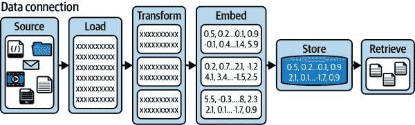
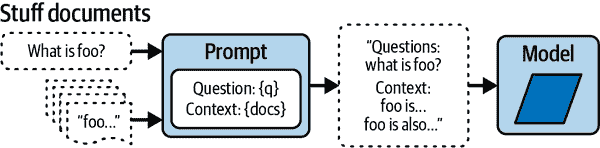
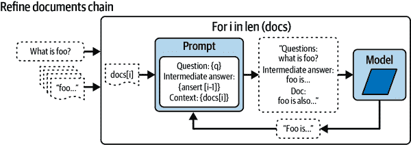
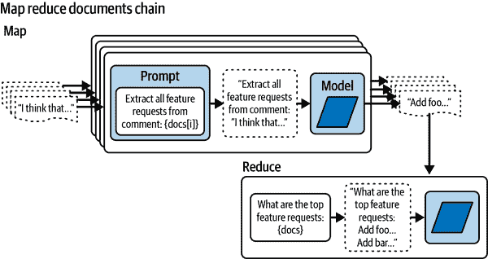

# 第四章：LangChain 文本生成高级技术

使用简单的提示工程技巧通常适用于大多数任务，但偶尔您需要使用更强大的工具包来解决复杂的生成式 AI 问题。这些问题和任务包括：

上下文长度

将整本书总结成可消化的摘要。

结合顺序 LLM 输入/输出

为一本书创造故事，包括角色、情节和世界构建。

执行复杂的推理任务

作为代理的 LLMs。例如，您可以创建一个 LLM 代理来帮助您实现个人健身目标。

为了巧妙地应对这样的复杂生成式 AI 挑战，熟悉开源框架 LangChain 非常有帮助。这个工具大大简化并增强了您 LLM 的工作流程。 

# LangChain 简介

LangChain 是一个多功能的框架，它使创建利用 LLMs 的应用程序成为可能，并且作为[Python](https://oreil.ly/YPid-)和[TypeScript](https://oreil.ly/5Vl0W)包提供。其核心原则是，最有影响力和独特的应用程序不仅通过 API 与语言模型接口，而且还将：

增强数据意识

该框架旨在在语言模型和外部数据源之间建立无缝连接。

增强代理能力

它致力于赋予语言模型与环境互动和影响的能力。

如图 4-1 所示，LangChain 框架提供了一系列模块化抽象，这对于与 LLMs 一起工作至关重要，以及这些抽象的广泛实现。


###### 图 4-1. LangChain LLM 框架的主要模块

每个模块都设计得易于使用，可以独立或一起高效地利用。目前 LangChain 中有六个常见的模块：

模型 I/O

处理与模型相关的输入/输出操作

检索

专注于检索对 LLM 相关的文本

链

也称为*LangChain 可运行程序*，链允许构建 LLM 操作或函数调用的序列

代理

允许链根据高级指令或指示决定使用哪些工具

内存

在链的不同运行之间保持应用程序的状态

回调

对于在特定事件上运行附加代码，例如每当生成新令牌时

## 环境设置

您可以使用以下任一命令在终端上安装 LangChain：

+   `pip install langchain langchain-openai`

+   `conda install -c conda-forge langchain langchain-openai`

如果您希望安装整本书的包要求，可以使用 GitHub 仓库中的[*requirements.txt*](https://oreil.ly/WKOma)文件。

建议在虚拟环境中安装这些包：

创建虚拟环境

`python -m venv venv`

激活虚拟环境

`source venv/bin/activate`

安装依赖项

`pip install -r requirements.txt`

LangChain 需要与一个或多个模型提供商进行集成。例如，要使用 OpenAI 的模型 API，你需要使用`pip install openai`安装他们的 Python 包。

如第一章中所述，最佳实践是在你的终端中设置一个名为`OPENAI_API_KEY`的环境变量，或者使用`python-dotenv`从*.env*文件中加载它（[python-dotenv](https://oreil.ly/wvuO7)）。然而，对于原型设计，你可以选择跳过此步骤，通过在 LangChain 中加载聊天模型时直接传递你的 API 密钥：

```py
from langchain_openai.chat_models import ChatOpenAI
chat = ChatOpenAI(api_key="api_key")
```

###### 警告

由于安全原因，不建议在脚本中硬编码 API 密钥。相反，利用环境变量或配置文件来管理你的密钥。

在 LLMs 不断演变的领域中，你可能会遇到不同模型 API 之间差异的挑战。接口缺乏标准化可能会在提示工程中引入额外的复杂性层，并阻碍不同模型无缝集成到你的项目中。

这就是 LangChain 发挥作用的地方。作为一个综合框架，LangChain 允许你轻松消费不同模型的各种接口。

LangChain 的功能确保了你在切换模型时不需要重新发明你的提示或代码。其平台无关的方法促进了广泛模型（如[Anthropic](https://www.anthropic.com)、[Vertex AI](https://cloud.google.com/vertex-ai)、[OpenAI](https://openai.com)、[BedrockChat](https://oreil.ly/bedrock)）的快速实验。这不仅加快了模型评估过程，而且通过简化复杂模型集成，节省了关键的时间和资源。

在接下来的章节中，你将使用 OpenAI 包及其在 LangChain 中的 API。

# Chat Models

如 GPT-4 之类的聊天模型已成为与 OpenAI API 交互的主要方式。它们不是提供简单的“输入文本，输出文本”响应，而是提出一种交互方法，其中*聊天消息*是输入和输出元素。

使用聊天模型生成 LLM 响应涉及将一个或多个消息输入到聊天模型中。在 LangChain 的上下文中，目前接受的消息类型是`AIMessage`、`HumanMessage`和`SystemMessage`。聊天模型的输出始终是`AIMessage`。

SystemMessage

代表应该是对 AI 系统的指令信息。这些用于以某种方式引导 AI 的行为或行动。

HumanMessage

代表来自与 AI 系统交互的人类信息。这可能是一个问题、一个命令，或任何其他人类用户需要 AI 处理和响应的输入。

AIMessage

代表来自 AI 系统本身的信息。这通常是 AI 对`HumanMessage`的响应或`SystemMessage`指令的结果。

###### 注意

确保利用`SystemMessage`来提供明确的指示。OpenAI 已经改进了 GPT-4 和即将推出的 LLM 模型，特别注意这类消息中给出的指南。

让我们在 LangChain 中创建一个笑话生成器。

输入：

```py
from langchain_openai.chat_models import ChatOpenAI
from langchain.schema import AIMessage, HumanMessage, SystemMessage

chat = ChatOpenAI(temperature=0.5)
messages = [SystemMessage(content='''Act as a senior software engineer
at a startup company.'''),
HumanMessage(content='''Please can you provide a funny joke
about software engineers?''')]
response = chat.invoke(input=messages)
print(response.content)
```

输出：

```py
Sure, here's a lighthearted joke for you:
Why did the software engineer go broke?
Because he lost his domain in a bet and couldn't afford to renew it.
```

首先，你需要导入`ChatOpenAI`、`AIMessage`、`HumanMessage`和`SystemMessage`。然后创建一个具有 0.5（随机性）温度参数的`ChatOpenAI`类实例。

创建模型后，一个名为`messages`的列表会被填充一个`SystemMessage`对象，定义了 LLM 的角色，以及一个`HumanMessage`对象，它要求一个与软件工程师相关的笑话。

使用`.invoke(input=messages)`调用聊天模型将消息列表喂给 LLM，然后你通过`response.content`检索 LLM 的响应。

有一个遗留方法允许你直接使用`chat`对象调用`chat(messages=messages)`：

```py
response = chat(messages=messages)
```

# 流式聊天模型

当你使用 ChatGPT 时，你可能已经注意到单词是逐个返回给你的，一个字符接一个字符。这种独特的响应生成模式被称为*流式传输*，它在增强基于聊天的应用程序性能中起着至关重要的作用：

```py
for chunk in chat.stream(messages):
    print(chunk.content, end="", flush=True)
```

当你调用`chat.stream(messages)`时，它会逐个产生消息块。这意味着聊天消息的每个部分都是单独返回的。随着每个块到达，它立即被打印到终端并刷新。这样，*流式传输*允许从 LLM 响应中减少最小延迟。

从最终用户的角度来看，流式传输有几个好处。首先，它大大减少了用户的等待时间。一旦文本开始逐个字符生成，用户就可以开始解读消息。在看到消息之前，不需要构建完整的消息。这反过来又显著增强了用户交互并最小化了延迟。

然而，这种技术也带来了一系列挑战。一个显著的挑战是在流式传输过程中解析输出。在消息形成时理解和适当地回应消息可能很复杂，尤其是当内容复杂且详细时。

# 创建多个 LLM 生成

可能存在一些场景，从 LLM 生成多个响应可能很有用。这在创建动态内容，如社交媒体帖子时尤其如此。你不需要提供消息列表，而是提供一个*消息列表的列表*。

输入：

```py
# 2x lists of messages, which is the same as [messages, messages]
synchronous_llm_result = chat.batch([messages]*2)
print(synchronous_llm_result)
```

输出：

```py
[AIMessage(content='''Sure, here's a lighthearted joke for you:\n\nWhy did
the software engineer go broke?\n\nBecause he kept forgetting to Ctrl+ Z
his expenses!'''),
AIMessage(content='''Sure, here\'s a lighthearted joke for you:\n\nWhy do
software engineers prefer dark mode?\n\nBecause it\'s easier on their
"byte" vision!''')]
```

使用`.batch()`而不是`.invoke()`的好处是你可以并行化对 OpenAI 发出的 API 请求的数量。

对于在 LangChain 中可运行的任何内容，你可以在`batch`函数中添加一个`RunnableConfig`参数，该参数包含许多可配置的参数，包括`max_concurrency`：

```py
from langchain_core.runnables.config import RunnableConfig

# Create a RunnableConfig with the desired concurrency limit:
config = RunnableConfig(max_concurrency=5)

# Call the .batch() method with the inputs and config:
results = chat.batch([messages, messages], config=config)
```

###### 注意

在计算机科学中，*异步（async）函数*是独立于其他进程运行的函数，因此可以在不等待彼此的情况下并发运行多个 API 请求。在 LangChain 中，这些异步函数允许你一次性发出多个 API 请求，而不是一个接一个。这在更复杂的流程中特别有帮助，并减少了用户整体延迟。

LangChain 中的大多数异步函数只是以字母`a`为前缀，例如`.ainvoke()`和`.abatch()`。如果你想使用异步 API 以更高效的任务性能，那么请使用这些函数。

# LangChain 提示模板

到目前为止，你一直在硬编码`ChatOpenAI`对象中的字符串。随着你的 LLM 应用程序规模的扩大，利用*提示模板*变得越来越重要。

*提示模板*非常适合为 AI 语言模型生成可重复的提示。它由一个*模板*组成，这是一个可以接受参数的文本字符串，用于构建语言模型的文本提示。

没有提示模板，你可能会使用 Python `f-string`格式化：

```py
language = "Python"
prompt = f"What is the best way to learn coding in {language}?"
print(prompt) # What is the best way to learn coding in Python?
```

但为什么不简单地使用`f-string`进行提示模板化？使用 LangChain 的提示模板而不是这样做，可以让你轻松地：

+   验证你的提示输入

+   通过组合将多个提示组合在一起

+   定义自定义选择器，将 k-shot 示例注入到你的提示中

+   从*.yml*和*.json*文件中保存和加载提示

+   创建在创建时执行附加代码或指令的自定义提示模板

# LangChain 表达式语言（LCEL）

`|`管道运算符是 LangChain 表达式语言（LCEL）的关键组件，它允许你在数据处理管道中将不同的组件或*可运行*组件连接起来。

在 LCEL 中，`|`运算符类似于 Unix 管道运算符。它接受一个组件的输出，并将其作为输入传递给链中的下一个组件。这允许你轻松连接和组合不同的组件，以创建一个复杂的操作链：

```py
chain = prompt | model
```

`|`运算符用于将提示和模型组件连接起来。提示组件的输出作为模型组件的输入。这种链式机制允许你从基本组件构建复杂的链，并使数据处理管道不同阶段之间的数据流无缝。

此外，*顺序很重要*，因此你可以技术上创建这个链：

```py
bad_order_chain = model | prompt
```

但在使用`invoke`函数之后，它会产生错误，因为`model`返回的值与提示预期的输入不兼容。

让我们创建一个使用提示模板的商业名称生成器，该生成器将返回五个到七个相关的商业名称：

```py
from langchain_openai.chat_models import ChatOpenAI
from langchain_core.prompts import (SystemMessagePromptTemplate,
ChatPromptTemplate)

template = """
You are a creative consultant brainstorming names for businesses.

You must follow the following principles:
{principles}

Please generate a numerical list of five catchy names for a start-up in the
{industry} industry that deals with {context}?

Here is an example of the format:
1\. Name1
2\. Name2
3\. Name3
4\. Name4
5\. Name5
"""

model = ChatOpenAI()
system_prompt = SystemMessagePromptTemplate.from_template(template)
chat_prompt = ChatPromptTemplate.from_messages([system_prompt])

chain = chat_prompt | model

result = chain.invoke({
    "industry": "medical",
    "context":'''creating AI solutions by automatically summarizing patient
 records''',
    "principles":'''1\. Each name should be short and easy to
 remember. 2\. Each name should be easy to pronounce.
 3\. Each name should be unique and not already taken by another company.'''
})

print(result.content)
```

输出：

```py
1\. SummarAI
2\. MediSummar
3\. AutoDocs
4\. RecordAI
5\. SmartSummarize
```

首先，你将导入 `ChatOpenAI`、`SystemMessagePromptTemplate` 和 `ChatPromptTemplate`。然后，你将在 `template` 下定义一个具有特定指南的提示模板，指示 LLM 生成商业名称。`ChatOpenAI()` 初始化聊天，而 `SystemMessagePromptTemplate.from_template(template)` 和 `ChatPromptTemplate.from_messages([system_prompt])` 创建你的提示模板。

你通过将 `chat_prompt` 和 `model` 连接在一起创建一个 LCEL `chain`，然后调用它。这将在提示中替换 `{industries}`、`{context}` 和 `{principles}` 占位符，以字典 `invoke` 函数中的值。

最后，通过访问 `result` 变量的 `.content` 属性，你可以提取 LLM 的响应作为字符串。

# 指明方向并指定格式

精心设计的指令可能包括“你是一位创意顾问，正在为公司起名”和“请生成五个到七个吸引人的初创公司名字的数字列表。”这样的提示将引导你的 LLM 执行你要求的精确任务。

# 使用 Chat 模型与 PromptTemplate

LangChain 提供了一个更传统的模板 `PromptTemplate`，它需要 `input_variables` 和 `template` 参数。

输入：

```py
from langchain_core.prompts import PromptTemplate
from langchain.prompts.chat import SystemMessagePromptTemplate
from langchain_openai.chat_models import ChatOpenAI
prompt=PromptTemplate(
 template='''You are a helpful assistant that translates {input_language} to
 {output_language}.''',
 input_variables=["input_language", "output_language"],
)
system_message_prompt = SystemMessagePromptTemplate(prompt=prompt)
chat = ChatOpenAI()
chat.invoke(system_message_prompt.format_messages(
input_language="English",output_language="French"))
```

输出：

```py
AIMessage(content="Vous êtes un assistant utile qui traduit l'anglais en
français.", additional_kwargs={}, example=False)
```

# 输出解析器

在 第三章 中，你使用了正则表达式 (regex) 从包含数字列表的文本中提取结构化数据，但在 LangChain 中使用 *输出解析器* 可以自动完成此操作。

*输出解析器* 是 LangChain 提供的用于从 LLM 字符串响应中解析结构化数据的高级抽象。目前可用的输出解析器包括：

列表解析器

返回一个以逗号分隔的项目列表。

日期时间解析器

将 LLM 输出解析为日期时间格式。

枚举解析器

将字符串解析为枚举值。

自动修复解析器

包装另一个输出解析器，如果该输出解析器失败，它将调用另一个 LLM 来修复任何错误。

Pydantic (JSON) 解析器

将 LLM 响应解析为符合 Pydantic 方案的 JSON 输出。

重试解析器

提供从之前的输出解析器中重试失败解析的功能。

结构化输出解析器

当你想返回多个字段时可以使用。

XML 解析器

将 LLM 响应解析为基于 XML 的格式。

你会发现，对于 LangChain 输出解析器有两个重要的函数：

`.get_format_instructions()`

此函数将必要的指令输入到提示中，以输出可解析的结构化格式。

`.parse(llm_output: str)`

此函数负责将你的 LLM 响应解析为预定义的格式。

通常，你会发现使用 `ChatOpenAI()` 的 Pydantic (JSON) 解析器提供了最大的灵活性。

Pydantic（JSON）解析器利用 Python 中的[Pydantic](https://oreil.ly/QIMih)库。Pydantic 是一个数据验证库，它提供了一种使用 Python 类型注解验证传入数据的方法。这意味着 Pydantic 允许您为您的数据创建模式，并自动根据这些模式验证和解析输入数据。

输入：

```py
from langchain_core.prompts.chat import (
    ChatPromptTemplate,
    SystemMessagePromptTemplate,
)
from langchain_openai.chat_models import ChatOpenAI
from langchain.output_parsers import PydanticOutputParser
from pydantic.v1 import BaseModel, Field
from typing import List

temperature = 0.0

class BusinessName(BaseModel):
    name: str = Field(description="The name of the business")
    rating_score: float = Field(description='''The rating score of the
 business. 0 is the worst, 10 is the best.''')

class BusinessNames(BaseModel):
    names: List[BusinessName] = Field(description='''A list
 of busines names''')

# Set up a parser + inject instructions into the prompt template:
parser = PydanticOutputParser(pydantic_object=BusinessNames)

principles = """
- The name must be easy to remember.
- Use the {industry} industry and Company context to create an effective name.
- The name must be easy to pronounce.
- You must only return the name without any other text or characters.
- Avoid returning full stops, \n, or any other characters.
- The maximum length of the name must be 10 characters.
"""

# Chat Model Output Parser:
model = ChatOpenAI()
template = """Generate five business names for a new start-up company in the
{industry} industry.
You must follow the following principles: {principles}
{format_instructions}
"""
system_message_prompt = SystemMessagePromptTemplate.from_template(template)
chat_prompt = ChatPromptTemplate.from_messages([system_message_prompt])

# Creating the LCEL chain:
prompt_and_model = chat_prompt | model

result = prompt_and_model.invoke(
    {
        "principles": principles,
        "industry": "Data Science",
        "format_instructions": parser.get_format_instructions(),
    }
)
# The output parser, parses the LLM response into a Pydantic object:
print(parser.parse(result.content))
```

输出：

```py
names=[BusinessName(name='DataWiz', rating_score=8.5),
BusinessName(name='InsightIQ',
rating_score=9.2), BusinessName(name='AnalytiQ', rating_score=7.8),
BusinessName(name='SciData', rating_score=8.1),
BusinessName(name='InfoMax', rating_score=9.5)]
```

在加载必要的库之后，您将设置一个 ChatOpenAI 模型。然后从您的模板创建`SystemMessagePromptTemplate`，并使用它形成一个`ChatPromptTemplate`。您将使用 Pydantic 模型`BusinessName`和`BusinessNames`来结构化您期望的输出，即独特的公司名称列表。您将为这些模型创建一个`Pydantic`解析器，并通过调用`invoke`函数使用用户输入的变量来格式化提示。将这个定制的提示输入到模型中，您就使它能够通过使用`parser`生成创造性的、独特的公司名称。

您可以在 LCEL 中使用以下语法使用输出解析器：

```py
chain = prompt | model | output_parser
```

让我们将输出解析器直接添加到链中。

输入：

```py
parser = PydanticOutputParser(pydantic_object=BusinessNames)
chain = chat_prompt | model | parser

result = chain.invoke(
    {
        "principles": principles,
        "industry": "Data Science",
        "format_instructions": parser.get_format_instructions(),
    }
)
print(result)
```

输出：

```py
names=[BusinessName(name='DataTech', rating_score=9.5),...]
```

现在链负责提示格式化、LLM 调用以及将 LLM 的响应解析为`Pydantic`对象。

# 指定格式

之前的提示使用了 Pydantic 模型和输出解析器，允许您明确告诉 LLM 您期望的响应格式。

值得注意的是，通过要求 LLM 提供结构化的 JSON 输出，您可以从 LLM 的响应中创建一个灵活且可通用的 API。尽管存在一些限制，例如创建的 JSON 大小和您提示的可靠性，但这仍然是一个 LLM 应用的有希望领域。

###### 警告

您应该注意边缘情况，并添加错误处理语句，因为 LLM 的输出可能不会总是符合您的期望格式。

输出解析器让您免于正则表达式的复杂性和复杂性，为各种用例提供易于使用的功能。现在您已经看到了它们在实际中的应用，您可以使用输出解析器轻松地构建和检索 LLM 输出的数据，充分利用 AI 为您的工作任务提供全部潜力。

此外，使用解析器来结构化从 LLM 中提取的数据，您可以轻松选择如何组织输出，以便更有效地使用。如果您处理的是大量列表并且需要按某些标准（如公司名称）进行排序，这将非常有用。

# LangChain Evals

除了用于检查格式错误的输出解析器外，大多数 AI 系统还使用*evals*，或评估指标，来衡量每个提示响应的性能。LangChain 提供了一系列现成的评估器，可以直接在它们的[LangSmith](https://oreil.ly/0Fn94)平台上进行记录，以便进行进一步的调试、监控和测试。[Weights and Biases](https://wandb.ai/site)是另一个提供类似功能和对 LLM 进行跟踪的机器学习平台。

评估指标不仅对提示测试有用，还可以用于识别用于检索的正负示例，以及构建用于微调自定义模型的训练数据集。

大多数评估指标都依赖于一组测试用例，这些测试用例是已知正确答案的输入和输出配对。通常，这些参考答案是由人工创建或整理的，但使用更智能的模型（如 GPT-4）生成真实答案的做法也很常见，以下示例就是这样做的。给定一系列金融交易的描述，我们使用 GPT-4 对每个交易进行分类，并赋予 `transaction_category` 和 `transaction_type`。该过程可以在书籍的 [GitHub 仓库](https://oreil.ly/a4Hut) 中的 `langchain-evals.ipynb` Jupyter Notebook 中找到。

以 GPT-4 的答案作为正确答案，现在可以评估 GPT-3.5-turbo 和 Mixtral 8x7b（在 API 中称为 `mistral-small`）等较小模型的准确性。如果您能够使用较小模型达到足够的准确性，您可以节省资金或减少延迟。此外，如果该模型是开源的，如 [Mistral 的模型](https://oreil.ly/Ec578)，您可以将该任务迁移到您自己的服务器上运行，从而避免将可能敏感的数据发送到组织外部。我们建议在尝试自托管 OS 模型之前，先使用外部 API 进行测试。

[请记住注册](https://mistral.ai) 并订阅以获取 API 密钥；然后通过在终端中输入以下命令将其作为环境变量公开：

+   `**export MISTRAL_API_KEY=api-key**`

以下脚本是笔记本的一部分，该笔记本之前已定义了一个名为 `df` 的数据框。为了简洁起见，让我们只调查脚本的评估部分，假设已经定义了数据框。

输入：

```py
import os
from langchain_mistralai.chat_models import ChatMistralAI
from langchain.output_parsers import PydanticOutputParser
from langchain_core.prompts import ChatPromptTemplate
from pydantic.v1 import BaseModel
from typing import Literal, Union
from langchain_core.output_parsers import StrOutputParser

# 1\. Define the model:
mistral_api_key = os.environ["MISTRAL_API_KEY"]

model = ChatMistralAI(model="mistral-small", mistral_api_key=mistral_api_key)

# 2\. Define the prompt:
system_prompt = """You are are an expert at analyzing
bank transactions, you will be categorizing a single
transaction.
Always return a transaction type and category:
do not return None.
Format Instructions:
{format_instructions}"""

user_prompt = """Transaction Text:
{transaction}"""

prompt = ChatPromptTemplate.from_messages(
    [
        (
            "system",
            system_prompt,
        ),
        (
            "user",
            user_prompt,
        ),
    ]
)

# 3\. Define the pydantic model:
class EnrichedTransactionInformation(BaseModel):
    transaction_type: Union[
        Literal["Purchase", "Withdrawal", "Deposit",
        "Bill Payment", "Refund"], None
    ]
    transaction_category: Union[
        Literal["Food", "Entertainment", "Transport",
        "Utilities", "Rent", "Other"],
        None,
    ]

# 4\. Define the output parser:
output_parser = PydanticOutputParser(
    pydantic_object=EnrichedTransactionInformation)

# 5\. Define a function to try to fix and remove the backslashes:
def remove_back_slashes(string):
    # double slash to escape the slash
    cleaned_string = string.replace("\\", "")
    return cleaned_string

# 6\. Create an LCEL chain that fixes the formatting:
chain = prompt | model | StrOutputParser() \
| remove_back_slashes | output_parser

transaction = df.iloc[0]["Transaction Description"]
result = chain.invoke(
        {
            "transaction": transaction,
            "format_instructions": \
            output_parser.get_format_instructions(),
        }
    )

# 7\. Invoke the chain for the whole dataset:
results = []

for i, row in tqdm(df.iterrows(), total=len(df)):
    transaction = row["Transaction Description"]
    try:
        result = chain.invoke(
            {
                "transaction": transaction,
                "format_instructions": \
                output_parser.get_format_instructions(),
            }
        )
    except:
        result = EnrichedTransactionInformation(
            transaction_type=None,
            transaction_category=None
        )

    results.append(result)

# 8\. Add the results to the dataframe, as columns transaction type and
# transaction category:
transaction_types = []
transaction_categories = []

for result in results:
    transaction_types.append(result.transaction_type)
    transaction_categories.append(
        result.transaction_category)

df["mistral_transaction_type"] = transaction_types
df["mistral_transaction_category"] = transaction_categories
df.head()
```

输出：

```py
Transaction Description	transaction_type
transaction_category	mistral_transaction_type
mistral_transaction_category
0	cash deposit at local branch	Deposit	Other	Deposit
Other
1	cash deposit at local branch	Deposit	Other	Deposit
Other
2	withdrew money for rent payment	Withdrawal	Rent
Withdrawal	Rent
3	withdrew cash for weekend expenses	Withdrawal	Other
Withdrawal	Other
4	purchased books from the bookstore	Purchase	Other
Purchase	Entertainment
```

代码执行以下操作：

1.  `from langchain_mistralai.chat_models import ChatMistralAI`：我们导入 LangChain 的 Mistral 实现。

1.  `from langchain.output_parsers import PydanticOutputParser`：导入 `PydanticOutputParser` 类，用于使用 Pydantic 模型解析输出。我们还导入了一个字符串输出解析器，用于处理从 Mistral 获取的响应中移除反斜杠的中间步骤（这是 Mistral 响应中常见的问题）。

1.  `mistral_api_key = os.environ["MISTRAL_API_KEY"]`: 从环境变量中检索 Mistral API 密钥。在运行笔记本之前需要设置此变量。

1.  `model = ChatMistralAI(model="mistral-small", mistral_api_key=mistral_api_key)`: 使用指定的模型和 API 密钥初始化 `ChatMistralAI` 实例。Mistral Small 是他们在 API 中对 Mixtral 8x7b 模型的称呼（也是开源的）。

1.  `system_prompt` 和 `user_prompt`：这些行定义了在聊天中用于分类交易的系统和用户提示模板。

1.  `class EnrichedTransactionInformation(BaseModel)`: 定义一个 Pydantic 模型 `EnrichedTransactionInformation`，包含两个字段：`transaction_type` 和 `transaction_category`，每个字段都有特定的允许值，并且可能为 `None`。这正是告诉我们输出是否处于正确格式的依据。

1.  `def remove_back_slashes(string)`: 定义一个函数，用于从字符串中删除反斜杠。

1.  `chain = prompt | model | StrOutputParser() | remove_back_slashes | output_parser`: 更新链，包括一个字符串输出解析器和 `remove_back_slashes` 函数，在原始输出解析器之前。

1.  `transaction = df.iloc[0]["Transaction Description"]`: 从数据框 `df` 中提取第一条交易描述。这个数据框在之前的 [Jupyter Notebook](https://oreil.ly/-koAO) 中已加载（为了简洁起见省略）。

1.  `for i, row in tqdm(df.iterrows(), total=len(df))`: 遍历数据框 `df` 中的每一行，并显示进度条。

1.  `result = chain.invoke(...)`: 在循环内部，为每个交易调用链。

1.  `except`: 如果发生异常，将创建一个默认的 `EnrichedTransactionInformation` 对象，其值为 `None`。这些将在评估中被视为错误，但不会中断处理循环。

1.  `df["mistral_transaction_type"] = transaction_types`, `df["mistral_transaction_category"] = transaction_categories`: 在数据框中添加交易类型和类别作为新列，然后我们使用 `df.head()` 显示它们。

将 Mistral 的响应保存在数据框中后，可以将其与之前定义的交易类别和类型进行比较，以检查 Mistral 的准确性。最基础的 LangChain 评估指标是对预测结果与参考答案进行精确字符串匹配，如果匹配正确则返回分数 1，如果错误则返回 0。笔记本提供了一个如何[实现此功能](https://oreil.ly/vPUfI)的示例，这表明 Mistral 的准确率为 77.5%。然而，如果你只是比较字符串，你可能不需要在 LangChain 中实现它。

LangChain 的价值在于其标准化和经过测试的方法，用于使用 LLM 实现更高级的评估器。`labeled_pairwise_string`评估器比较两个输出，并给出选择它们的原因，使用 GPT-4。此类评估器的常见用例是比较来自两个不同提示或模型的输出，尤其是如果被测试的模型不如 GPT-4 复杂。使用 GPT-4 的此评估器仍然可以用于评估 GPT-4 的响应，但您应该手动审查推理和评分以确保其表现良好：如果 GPT-4 在某个任务上表现不佳，它也可能在评估该任务上表现不佳。在[notebook](https://oreil.ly/9O7Mb)中，相同的交易分类再次运行，但模型已更改为`model = ChatOpenAI(model="gpt-3.5-turbo-1106", model_kwargs={"response_format": {"type": "json_object"}})`。现在可以进行 Mistral 和 GPT-3.5 响应的成对比较，如下例所示。您可以在输出中看到用于证明评分的推理。

输入：

```py
# Evaluate answers using LangChain evaluators:
from langchain.evaluation import load_evaluator
evaluator = load_evaluator("labeled_pairwise_string")

row = df.iloc[0]
transaction = row["Transaction Description"]
gpt3pt5_category = row["gpt3.5_transaction_category"]
gpt3pt5_type = row["gpt3.5_transaction_type"]
mistral_category = row["mistral_transaction_category"]
mistral_type = row["mistral_transaction_type"]
reference_category = row["transaction_category"]
reference_type = row["transaction_type"]

# Put the data into JSON format for the evaluator:
gpt3pt5_data = f"""{{
 "transaction_category": "{gpt3pt5_category}",
 "transaction_type": "{gpt3pt5_type}"
}}"""

mistral_data = f"""{{
 "transaction_category": "{mistral_category}",
 "transaction_type": "{mistral_type}"
}}"""

reference_data = f"""{{
 "transaction_category": "{reference_category}",
 "transaction_type": "{reference_type}"
}}"""

# Set up the prompt input for context for the evaluator:
input_prompt = """You are an expert at analyzing bank
transactions,
you will be categorizing a single transaction.
Always return a transaction type and category: do not
return None.
Format Instructions:
{format_instructions}
Transaction Text:
{transaction}
"""

transaction_types.append(transaction_type_score)
transaction_categories.append(
    transaction_category_score)

accuracy_score = 0

for transaction_type_score, transaction_category_score \
    in zip(
        transaction_types, transaction_categories
    ):
    accuracy_score += transaction_type_score['score'] + \
    transaction_category_score['score']

accuracy_score = accuracy_score / (len(transaction_types) \
    * 2)
print(f"Accuracy score: {accuracy_score}")

evaluator.evaluate_string_pairs(
    prediction=gpt3pt5_data,
    prediction_b=mistral_data,
    input=input_prompt.format(
        format_instructions=output_parser.get_format_instructions(),
        transaction=transaction),
    reference=reference_data,
)
```

输出：

```py
{'reasoning': '''Both Assistant A and Assistant B provided the exact same
response to the user\'s question. Their responses are both helpful, relevant,
correct, and demonstrate depth of thought. They both correctly identified the
transaction type as "Deposit" and the transaction category as "Other" based on
the transaction text provided by the user. Both responses are also
well-formatted according to the JSON schema provided by the user. Therefore,
it\'s a tie between the two assistants. \n\nFinal Verdict: [[C]]''',
 'value': None,
 'score': 0.5}
```

此代码演示了 LangChain 中的简单精确字符串匹配评估器：

1.  `evaluator = load_evaluator("labeled_pairwise_string")`: 这是一个辅助函数，可以用来通过名称加载任何 LangChain 评估器。在这种情况下，使用的是`labeled_pairwise_string`评估器。

1.  `row = df.iloc[0]`: 这一行以及随后的七行代码获取第一行并提取所需的不同列的值。这包括交易描述，以及 Mistral 和 GPT-3.5 的交易类别和类型。这展示了单个交易，但这段代码可以很容易地通过循环遍历每个交易运行，将此行替换为`iterrows`函数`for i, row in tqdm(df.iterrows(), total=len(df)):`，就像在[notebook](https://oreil.ly/dcCOO)中做的那样。

1.  `gpt3pt5_data = f"""{{`: 要使用成对比较评估器，我们需要以正确格式化的方式传递结果，以便用于提示。这适用于 Mistral 和 GPT-3.5，以及参考数据。

1.  `input_prompt = """You are an expert...`: 我们还需要正确格式化提示。为了获得准确的评估分数，评估器需要看到为任务提供的说明。

1.  `evaluator.evaluate_string_pairs(...`: 剩下的就是通过传递`prediction`和`prediction_b`（分别代表 GPT-3.5 和 Mistral）以及`input`提示和`reference`数据（作为真实数据）来运行评估器。

1.  在[notebook](https://oreil.ly/hW8Wr)中的此代码之后，有一个示例，展示了如何遍历 dataframe 中的每一行并运行评估器，然后将结果和推理保存回 dataframe。

这个例子演示了如何使用 LangChain 评估器，但有许多不同类型的评估器可用。字符串距离 ([Levenshtein](https://oreil.ly/Al5G3)) 或 [嵌入距离](https://oreil.ly/0p_nE) 评估器通常用于答案不是与参考答案完全匹配，但只需要在语义上足够接近的场景。Levenshtein 距离允许基于需要多少单个字符编辑来将预测文本转换为参考文本进行模糊匹配，而嵌入距离则使用向量（在第五章中介绍）来计算答案与参考之间的相似度。

我们在工作中经常使用的另一种评估器是成对比较，这对于比较两个不同的提示或模型非常有用，可以使用像 GPT-4 这样的智能模型。这种比较类型很有帮助，因为每个比较都提供了推理，这有助于调试为什么一个方法被优先考虑而不是另一个。本节[笔记本](https://oreil.ly/iahTJ)展示了使用成对比较评估器检查 GPT-3.5-turbo 的准确度与 Mixtral 8x7b 的示例。

# 评估质量

如果没有定义适当的评估指标集来定义成功，就很难判断提示或更广泛系统的更改是否在提高或损害响应的质量。如果你可以使用像 GPT-4 这样的智能模型自动化评估指标，你就可以更快地迭代以改进结果，而无需昂贵的或耗时的手动人工审查。

# OpenAI 函数调用

*函数调用* 提供了一种输出解析器的替代方法，利用微调后的 OpenAI 模型。这些模型识别何时应该执行函数，并为预定义的函数生成包含 *名称和参数* 的 JSON 响应。几个用例包括：

设计复杂的聊天机器人

能够组织和管理工作安排。例如，你可以定义一个安排会议的函数：`schedule_meeting(date: str, time: str, attendees: List[str])`。

将自然语言转换为可操作的 API 调用

像这样的命令“打开走廊的灯”可以转换为 `control_device(device: str, action: 'on' | 'off')` 以与你的家庭自动化 API 进行交互。

提取结构化数据

这可以通过定义一个函数如 `extract_contextual_data(context: str, data_points: List[str])` 或 `search_database(query: str)` 来实现。

在函数调用中使用的每个函数都将需要一个适当的 *JSON 架构*。让我们通过 `OpenAI` 包的例子来探索一下：

```py
from openai import OpenAI
import json
from os import getenv

def schedule_meeting(date, time, attendees):
    # Connect to calendar service:
    return { "event_id": "1234", "status": "Meeting scheduled successfully!",
            "date": date, "time": time, "attendees": attendees }

OPENAI_FUNCTIONS = {
    "schedule_meeting": schedule_meeting
}
```

在导入 `OpenAI` 和 `json` 之后，你会创建一个名为 `schedule_meeting` 的函数。这个函数是一个原型，模拟安排会议的过程，并返回诸如 `event_id`、`date`、`time` 和 `attendees` 等详细信息。随后，创建一个 `OPENAI_FUNCTIONS` 字典，将函数名映射到实际函数，以便于参考。

接下来，定义一个 `functions` 列表，提供函数的 JSON 架构。此架构包括其名称、简短描述以及它所需的参数，指导 LLM 如何与之交互：

```py
# Our predefined function JSON schema:
functions = [
    {
        "type": "function",
        "function": {
            "type": "object",
            "name": "schedule_meeting",
            "description": '''Set a meeting at a specified date and time for
 designated attendees''',
            "parameters": {
                "type": "object",
                "properties": {
                    "date": {"type": "string", "format": "date"},
                    "time": {"type": "string", "format": "time"},
                    "attendees": {"type": "array", "items": {"type": "string"}},
                },
                "required": ["date", "time", "attendees"],
            },
        },
    }
]
```

# 指定格式

当使用 OpenAI 模型进行函数调用时，始终确保定义一个详细的 JSON 架构（包括名称和描述）。这作为函数的蓝图，指导模型理解何时以及如何正确调用它。

定义函数后，让我们发起一个 OpenAI API 请求。设置一个包含用户查询的 `messages` 列表。然后，使用 OpenAI `client` 对象发送此消息和函数架构到模型。LLM 分析对话，识别出需要触发函数的需求，并提供函数名称和参数。`function` 和 `function_args` 从 LLM 响应中解析出来。然后执行函数，并将结果添加回对话中。然后再次调用模型以获取整个过程的用户友好总结。

输入：

```py
client = OpenAI(api_key=getenv("OPENAI_API_KEY"))

# Start the conversation:
messages = [
    {
        "role": "user",
        "content": '''Schedule a meeting on 2023-11-01 at 14:00
 with Alice and Bob.''',
    }
]

# Send the conversation and function schema to the model:
response = client.chat.completions.create(
    model="gpt-3.5-turbo-1106",
    messages=messages,
    tools=functions,
)

response = response.choices[0].message

# Check if the model wants to call our function:
if response.tool_calls:
    # Get the first function call:
    first_tool_call = response.tool_calls[0]

    # Find the function name and function args to call:
    function_name = first_tool_call.function.name
    function_args = json.loads(first_tool_call.function.arguments)
    print("This is the function name: ", function_name)
    print("These are the function arguments: ", function_args)

    function = OPENAI_FUNCTIONS.get(function_name)

    if not function:
        raise Exception(f"Function {function_name} not found.")

    # Call the function:
    function_response = function(**function_args)

    # Share the function's response with the model:
    messages.append(
        {
            "role": "function",
            "name": "schedule_meeting",
            "content": json.dumps(function_response),
        }
    )

    # Let the model generate a user-friendly response:
    second_response = client.chat.completions.create(
        model="gpt-3.5-turbo-0613", messages=messages
    )

    print(second_response.choices[0].message.content)
```

输出：

```py
These are the function arguments:  {'date': '2023-11-01', 'time': '14:00',
'attendees': ['Alice', 'Bob']}
This is the function name:  schedule_meeting
I have scheduled a meeting on 2023-11-01 at 14:00 with Alice and Bob.
The event ID is 1234.
```

函数调用时需要注意的几个重要点：

+   LLM 可以调用许多函数。

+   OpenAI 可以推测函数参数，因此在 `system` 消息中要更加明确，以克服这一点。

+   `function_call` 参数可以以多种方式设置：

    +   强制调用特定函数：`tool_choice: {"type: "function", "function": {"name": "my_function"}}}`。

    +   对于没有函数调用的用户消息：`tool_choice: "none"`。

    +   默认情况下（`tool_choice: "auto"`），模型会自主决定是否以及调用哪个函数。

# 并行函数调用

你可以将你的聊天消息设置为包含请求同时调用多个工具的意图。这种策略被称为 *并行函数调用*。

修改之前使用的代码，`messages` 列表更新为强制安排两个会议：

```py
# Start the conversation:
messages = [
    {
        "role": "user",
        "content": '''Schedule a meeting on 2023-11-01 at 14:00 with Alice
 and Bob. Then I want to schedule another meeting on 2023-11-02 at
 15:00 with Charlie and Dave.'''
    }
]
```

然后，通过添加一个 `for` 循环来调整之前的代码部分。

输入：

```py
# Send the conversation and function schema to the model:
response = client.chat.completions.create(
    model="gpt-3.5-turbo-1106",
    messages=messages,
    tools=functions,
)

response = response.choices[0].message

# Check if the model wants to call our function:
if response.tool_calls:
    for tool_call in response.tool_calls:
        # Get the function name and arguments to call:
        function_name = tool_call.function.name
        function_args = json.loads(tool_call.function.arguments)
        print("This is the function name: ", function_name)
        print("These are the function arguments: ", function_args)

        function = OPENAI_FUNCTIONS.get(function_name)

        if not function:
            raise Exception(f"Function {function_name} not found.")

        # Call the function:
        function_response = function(**function_args)

        # Share the function's response with the model:
        messages.append(
            {
                "role": "function",
                "name": function_name,
                "content": json.dumps(function_response),
            }
        )

    # Let the model generate a user-friendly response:
    second_response = client.chat.completions.create(
        model="gpt-3.5-turbo-0613", messages=messages
    )

    print(second_response.choices[0].message.content)
```

输出：

```py
This is the function name:  schedule_meeting
These are the function arguments:  {'date': '2023-11-01', 'time': '14:00',
'attendees': ['Alice', 'Bob']}
This is the function name:  schedule_meeting
These are the function arguments:  {'date': '2023-11-02', 'time': '15:00',
'attendees': ['Charlie', 'Dave']}
Two meetings have been scheduled:
1. Meeting with Alice and Bob on 2023-11-01 at 14:00.
2. Meeting with Charlie and Dave on 2023-11-02 at 15:00.
```

从这个例子中，可以看出如何有效地管理多个函数调用。你看到了 `schedule_meeting` 函数连续两次被调用以安排不同的会议。这展示了如何灵活且轻松地使用 AI 工具处理各种复杂请求。

# LangChain 中的函数调用

如果你希望避免编写 JSON 架构，而只想从 LLM 响应中提取结构化数据，那么 LangChain 允许你使用 Pydantic 进行函数调用。

输入：

```py
from langchain.output_parsers.openai_tools import PydanticToolsParser
from langchain_core.utils.function_calling import convert_to_openai_tool
from langchain_core.prompts import ChatPromptTemplate
from langchain_openai.chat_models import ChatOpenAI
from langchain_core.pydantic_v1 import BaseModel, Field
from typing import Optional

class Article(BaseModel):
    """Identifying key points and contrarian views in an article."""

    points: str = Field(..., description="Key points from the article")
    contrarian_points: Optional[str] = Field(
        None, description="Any contrarian points acknowledged in the article"
    )
    author: Optional[str] = Field(None, description="Author of the article")

_EXTRACTION_TEMPLATE = """Extract and save the relevant entities mentioned \
in the following passage together with their properties.

If a property is not present and is not required in the function parameters,
do not include it in the output."""

# Create a prompt telling the LLM to extract information:
prompt = ChatPromptTemplate.from_messages(
    {("system", _EXTRACTION_TEMPLATE), ("user", "{input}")}
)

model = ChatOpenAI()

pydantic_schemas = [Article]

# Convert Pydantic objects to the appropriate schema:
tools = [convert_to_openai_tool(p) for p in pydantic_schemas]

# Give the model access to these tools:
model = model.bind_tools(tools=tools)

# Create an end to end chain:
chain = prompt | model | PydanticToolsParser(tools=pydantic_schemas)

result = chain.invoke(
    {
        "input": """In the recent article titled 'AI adoption in industry,'
 key points addressed include the growing interest ... However, the
 author, Dr. Jane Smith, ..."""
    }
)
print(result)
```

输出：

```py
[Article(points='The growing interest in AI in various sectors, ...',
contrarian_points='Without stringent regulations, ...',
author='Dr. Jane Smith')]
```

你将首先导入各种模块，包括`PydanticToolsParser`和`ChatPromptTemplate`，这些对于解析和模板化你的提示至关重要。然后，你将定义一个 Pydantic 模型`Article`，以指定从给定文本中提取信息所需的结构。通过使用自定义提示模板和 ChatOpenAI 模型，你将指示 AI 从文章中提取关键点和相反观点。最后，提取的数据将被整洁地转换为预定义的 Pydantic 模型并打印出来，让你看到从文本中提取的结构化信息。

有几个关键点，包括：

将 Pydantic 模式转换为 OpenAI 工具

`tools = [convert_to_openai_tool(p) for p in pydantic_schemas]`

将工具直接绑定到 LLM

`model = model.bind_tools(tools=tools)`

创建包含工具解析器的 LCEL 链

`chain = prompt | model | PydanticToolsParser(tools=pydantic_schemas)`

# 使用 LangChain 提取数据

`create_extraction_chain_pydantic`函数提供了先前实现的一个更简洁版本。通过简单地插入一个 Pydantic 模型和一个支持函数调用的 LLM，你可以轻松实现并行函数调用。

输入：

```py
from langchain.chains.openai_tools import create_extraction_chain_pydantic
from langchain_openai.chat_models import ChatOpenAI
from langchain_core.pydantic_v1 import BaseModel, Field

# Make sure to use a recent model that supports tools:
model = ChatOpenAI(model="gpt-3.5-turbo-1106")

class Person(BaseModel):
    """A person's name and age."""

    name: str = Field(..., description="The person's name")
    age: int = Field(..., description="The person's age")

chain = create_extraction_chain_pydantic(Person, model)
chain.invoke({'input':'''Bob is 25 years old. He lives in New York.
He likes to play basketball. Sarah is 30 years old. She lives in San
Francisco. She likes to play tennis.'''})
```

输出：

```py
[Person(name='Bob', age=25), Person(name='Sarah', age=30)]
```

`Person` Pydantic 模型有两个属性，`name`和`age`；通过使用输入文本调用`create_extraction_chain_pydantic`函数，LLM 将调用同一函数两次并创建两个`People`对象。

# 查询规划

当用户查询具有复杂依赖关系的多个意图时，你可能会遇到问题。*查询规划*是一种有效的将用户查询解析成一系列步骤的方法，这些步骤可以作为具有相关依赖关系的查询图执行：

```py
from langchain_openai.chat_models import ChatOpenAI
from langchain.output_parsers.pydantic import PydanticOutputParser
from langchain_core.prompts.chat import (
    ChatPromptTemplate,
    SystemMessagePromptTemplate,
)
from pydantic.v1 import BaseModel, Field
from typing import List

class Query(BaseModel):
    id: int
    question: str
    dependencies: List[int] = Field(
        default_factory=list,
        description="""A list of sub-queries that must be completed before
 this task can be completed.
 Use a sub query when anything is unknown and we might need to ask
 many queries to get an answer.
 Dependencies must only be other queries."""
    )

class QueryPlan(BaseModel):
    query_graph: List[Query]
```

定义`QueryPlan`和`Query`允许你首先让 LLM 将用户的查询解析成多个步骤。让我们来研究如何创建查询计划。

输入：

```py
# Set up a chat model:
model = ChatOpenAI()

# Set up a parser:
parser = PydanticOutputParser(pydantic_object=QueryPlan)

template = """Generate a query plan. This will be used for task execution.

Answer the following query: {query}

Return the following query graph format:
{format_instructions}
"""
system_message_prompt = SystemMessagePromptTemplate.from_template(template)
chat_prompt = ChatPromptTemplate.from_messages([system_message_prompt])

# Create the LCEL chain with the prompt, model, and parser:
chain = chat_prompt | model | parser

result = chain.invoke({
"query":'''I want to get the results from my database. Then I want to find
out what the average age of my top 10 customers is. Once I have the average
age, I want to send an email to John. Also I just generally want to send a
welcome introduction email to Sarah, regardless of the other tasks.''',
"format_instructions":parser.get_format_instructions()})

print(result.query_graph)
```

输出：

```py
[Query(id=1, question='Get top 10 customers', dependencies=[]),
Query(id=2, question='Calculate average age of customers', dependencies=[1]),
Query(id=3, question='Send email to John', dependencies=[2]),
Query(id=4, question='Send welcome email to Sarah', dependencies=[])]
```

启动一个`ChatOpenAI`实例并为`QueryPlan`结构创建一个`PydanticOutputParser`。然后调用 LLM 响应并解析，为你的任务生成具有独特依赖关系的结构化`query_graph`。

# 创建少样本提示模板

在使用 LLM 的生成能力时，通常需要在*零样本学习*和*少样本学习（k 样本学习）*之间做出选择。虽然零样本学习不需要显式的示例，并且仅根据提示适应任务，但其对预训练阶段的依赖意味着它可能不会总是产生精确的结果。

另一方面，在少样本学习的情况下，即在提示中提供少量所需任务性能的示例，你有机会优化模型的行为，从而得到更令人满意的结果。

由于 LLM 的 token 上下文长度限制，你将经常发现自己需要在添加大量高质量 k 样本示例的同时，仍然旨在生成有效且确定的 LLM 输出。

###### 注意

即使在 LLM 中标记上下文窗口限制持续增加，提供特定数量的 k-shot 示例也有助于您最小化 API 成本。

让我们探讨两种将 k-shot 示例添加到您的提示中的方法，使用*固定示例*和使用*示例选择器*的*少量提示模板*。

## 固定长度少量示例

首先，让我们看看如何使用固定数量的示例创建少量提示模板。这种方法的基础是创建一组强大的少量示例：

```py
from langchain_openai.chat_models import ChatOpenAI
from langchain_core.prompts import (
    FewShotChatMessagePromptTemplate,
    ChatPromptTemplate,
)

examples = [
    {
        "question": "What is the capital of France?",
        "answer": "Paris",
    },
    {
        "question": "What is the capital of Spain?",
        "answer": "Madrid",
    } # ...more examples...
]
```

每个示例都是一个包含`question`和`answer`键的字典，这些键将用于创建`HumanMessage`和`AIMessage`消息对。

## 格式化示例

接下来，您将配置一个用于格式化单个示例的`ChatPromptTemplate`，然后将其插入到`FewShotChatMessagePromptTemplate`中。

输入：

```py
example_prompt = ChatPromptTemplate.from_messages(
    [
        ("human", "{question}"),
        ("ai", "{answer}"),
    ]
)

few_shot_prompt = FewShotChatMessagePromptTemplate(
    example_prompt=example_prompt,
    examples=examples,
)

print(few_shot_prompt.format())
```

输出：

```py
Human: What is the capital of France?
AI: Paris
Human: What is the capital of Spain?
AI: Madrid
...more examples...
```

注意`example_prompt`如何创建具有提示输入`{question}`和`{answer}`的`HumanMessage`和`AIMessage`对。

在运行`few_shot_prompt.format()`之后，少量示例作为字符串打印出来。由于您希望将其用于`ChatOpenAI()` LLM 请求中，让我们创建一个新的`ChatPromptTemplate`。

输入：

```py
from langchain_core.output_parsers import StrOutputParser

final_prompt = ChatPromptTemplate.from_messages(
    [("system",'''You are responsible for answering
 questions about countries. Only return the country
 name.'''),
    few_shot_prompt,("human", "{question}"),]
)

model = ChatOpenAI()

# Creating the LCEL chain with the prompt, model, and a StrOutputParser():
chain = final_prompt | model | StrOutputParser()

result = chain.invoke({"question": "What is the capital of America?"})

print(result)
```

输出：

```py
Washington, D.C.
```

在对`final_prompt`调用 LCEL 链后，少量示例被添加到`SystemMessage`之后。

注意，LLM 只返回`'Washington, D.C.'`。这是因为 LLM 的响应返回后，它会被`StrOutputParser()`解析，这是一个输出解析器。添加`StrOutputParser()`是确保 LLM 在链中返回*字符串值*的常见方法。您将在学习 LCEL 中的顺序链时深入了解这一点。

## 根据长度选择少量示例

在深入代码之前，让我们概述您的任务。想象一下，您正在构建一个由 GPT-4 驱动的讲故事应用。用户输入一组之前生成的角色名称列表。然而，每个用户的角色列表长度可能不同。包含过多的角色可能会生成超出 LLM 上下文窗口限制的故事。这就是您可以使用`LengthBasedExampleSelector`根据用户输入的长度调整提示的地方：

```py
from langchain_core.prompts import FewShotPromptTemplate, PromptTemplate
from langchain.prompts.example_selector import LengthBasedExampleSelector
from langchain_openai.chat_models import ChatOpenAI
from langchain_core.messages import SystemMessage
import tiktoken

examples = [
    {"input": "Gollum", "output": "<Story involving Gollum>"},
    {"input": "Gandalf", "output": "<Story involving Gandalf>"},
    {"input": "Bilbo", "output": "<Story involving Bilbo>"},
]

story_prompt = PromptTemplate(
    input_variables=["input", "output"],
    template="Character: {input}\nStory: {output}",
)

def num_tokens_from_string(string: str) -> int:
    """Returns the number of tokens in a text string."""
    encoding = tiktoken.get_encoding("cl100k_base")
    num_tokens = len(encoding.encode(string))
    return num_tokens

example_selector = LengthBasedExampleSelector(
    examples=examples,
    example_prompt=story_prompt,
    max_length=1000, # 1000 tokens are to be included from examples
    # get_text_length: Callable[[str], int] = lambda x: len(re.split("\n| ", x))
    # You have modified the get_text_length function to work with the
    # TikToken library based on token usage:
    get_text_length=num_tokens_from_string,
)
```

首先，您设置一个`PromptTemplate`，它为每个示例接受两个输入变量。然后`LengthBasedExampleSelector`根据示例输入的*长度*调整示例数量，确保您的 LLM 不会生成超出其上下文窗口的故事。

此外，您已自定义`get_text_length`函数，使用`num_tokens_from_string`函数通过`tiktoken`计算总令牌数。这意味着`max_length=1000`代表的是*令牌数*，而不是使用以下默认函数：

`get_text_length: Callable[[str], int] = lambda x: len(re.split("\n| ", x))`

现在，让我们将这些元素结合起来：

```py
dynamic_prompt = FewShotPromptTemplate(
    example_selector=example_selector,
    example_prompt=story_prompt,
    prefix='''Generate a story for {character} using the
 current Character/Story pairs from all of the characters
 as context.''',
    suffix="Character: {character}\nStory:",
    input_variables=["character"],
)

# Provide a new character from Lord of the Rings:
formatted_prompt = dynamic_prompt.format(character="Frodo")

# Creating the chat model:
chat = ChatOpenAI()

response = chat.invoke([SystemMessage(content=formatted_prompt)])
print(response.content)
```

输出：

```py
Frodo was a young hobbit living a peaceful life in the Shire. However,
his life...
```

# 提供示例并指定格式

当使用少样本示例时，内容的长度在确定 AI 模型可以考虑到多少示例时很重要。调整输入内容的长度，并提供适当的示例以获得高效的结果，以防止大型语言模型生成可能超过其上下文窗口限制的内容。

在格式化提示后，你使用 `ChatOpenAI()` 创建一个聊天模型，并将格式化后的提示加载到一个 `SystemMessage` 中，创建一个关于《指环王》中弗罗多的简短故事。

而不是创建和格式化一个 `ChatPromptTemplate`，通常简单地调用一个带有格式化提示的 `SystemMessage` 要容易得多：

```py
result = model.invoke([SystemMessage(content=formatted_prompt)])
```

# 少样本示例的局限性

少样本学习有其局限性。尽管在某些场景中可能有益，但它并不总是能产生预期的高质量结果。这主要是由于两个原因：

+   预训练模型如 GPT-4 有时会对少样本示例过度拟合，使它们优先考虑示例而不是实际的提示。

+   大型语言模型（LLMs）有一个令牌限制。因此，在示例数量和响应长度之间总会有权衡。提供更多示例可能会限制响应长度，反之亦然。

这些局限性可以通过几种方式解决。首先，如果少样本提示没有产生期望的结果，考虑使用不同框架的短语，或者尝试调整提示本身的语言。提示语法的不同变化可能会导致不同的响应，突出了提示工程中的试错性质。

其次，考虑向模型添加明确的指令，让它忽略理解任务后的示例，或者仅将示例用于格式化指导。这可能会影响模型不会过度拟合示例。

如果任务复杂且模型在少样本学习中的表现不令人满意，你可能需要考虑[微调](https://oreil.ly/S40bZ)你的模型。微调使模型对特定任务有更细微的理解，从而显著提高性能。

# 保存和加载 LLM 提示

为了有效地利用 GPT-4 等生成式 AI 模型，将提示存储为文件而不是 Python 代码是有益的。这种方法增强了提示的可分享性、存储和版本控制。

LangChain 支持从 JSON 和 YAML 中保存和加载提示。LangChain 的另一个关键特性是支持在一个文件中详细指定或在多个文件中分布。这意味着你可以灵活地将不同的组件，如模板、示例等存储在不同的文件中，并按需引用它们。

让我们学习如何保存和加载提示：

```py
from langchain_core.prompts import PromptTemplate, load_prompt

prompt = PromptTemplate(
    template='''Translate this sentence from English to Spanish.
    \nSentence: {sentence}\nTranslation:''',
    input_variables=["sentence"],
)

prompt.save("translation_prompt.json")

# Loading the prompt template:
load_prompt("translation_prompt.json")
# Returns PromptTemplate()
```

在从 `langchain.prompts` 模块导入 `PromptTemplate` 和 `load_prompt` 之后，你为英语到西班牙语的翻译任务定义一个 `PromptTemplate` 并将其保存为 *translation_prompt.json*。最后，使用 `load_prompt` 函数加载保存的提示模板，该函数返回一个 `PromptTemplate` 实例。

###### 警告

请注意，LangChain 的提示保存可能不适用于所有类型的提示模板。为了减轻这种情况，你可以利用 *pickle* 库或 *.txt* 文件来读取和写入 LangChain 不支持的任何提示。

你已经学会了如何使用 LangChain 通过两种技术创建少量提示模板：固定数量的示例和使用示例选择器。

前者创建一组少量示例，并使用 `ChatPromptTemplate` 对象将这些格式化为聊天消息。这构成了创建 `FewShotChatMessagePromptTemplate` 对象的基础。

后者方法，即使用示例选择器，当用户输入长度差异显著时很有用。在这种情况下，可以使用 `LengthBasedExampleSelector` 来根据用户输入长度调整示例数量。这确保你的 LLM 不会超过其上下文窗口限制。

此外，你已经看到存储/加载提示作为文件是多么容易，这增强了可分享性、存储和版本控制。

# 数据连接

通过结合 LLM 应用程序和你的数据，可以揭示大量提升效率并细化决策过程的机会。

你的组织数据可能以各种形式呈现：

非结构化数据

这可能包括 Google Docs、来自 Slack 或 Microsoft Teams 等通信平台的线程、网页、内部文档或 GitHub 上的代码仓库。

结构化数据

数据整齐地存储在 SQL、NoSQL 或图数据库中。

要查询你的非结构化数据，需要加载、转换、嵌入，然后将其存储在向量数据库中的过程。*向量数据库* 是一种专门类型的数据库，旨在高效地存储和查询以向量形式表示的数据，这些向量以适合机器学习和相似性搜索的格式表示复杂数据，如文本或图像。

对于结构化数据，鉴于其已索引和存储的状态，你可以利用 LangChain 代理在你的数据库上执行中间查询。这允许提取特定特征，然后可以在你的 LLM 提示中使用。

有多个 Python 包可以帮助你进行数据摄取，包括 [Unstructured](https://oreil.ly/n0hDD)、[LlamaIndex](https://www.llamaindex.ai) 和 [LangChain](https://oreil.ly/PjV9o)。

图 4-2 展示了数据摄取的标准化方法。它从数据源开始，然后将这些数据加载到文档中。这些文档随后被分块并存储在向量数据库中以供后续检索。



###### 图 4-2\. 数据连接到检索管道

尤其是 LangChain 为你提供了加载、修改、存储和检索数据的必要组件：

文档加载器

这些工具便于上传来自各种来源的信息资源或*文档*，例如 Word 文档、PDF 文件、文本文件，甚至是网页。

文档转换器

这些工具允许对文档进行分段、转换为问答布局、消除冗余文档等。

文本嵌入模型

这些工具可以将非结构化文本转换为浮点数序列，这些序列用于向量存储库进行相似度搜索。

向量数据库（向量存储库）

这些数据库可以保存并执行对嵌入数据的搜索。

检索器

这些工具提供了查询和检索数据的能力。

值得注意的是，其他 LLM 框架如[LlamaIndex](https://oreil.ly/9NcTB)与 LangChain 无缝协作。[LlamaHub](https://llamahub.ai)是另一个致力于文档加载器的开源库，可以创建 LangChain 特定的`Document`对象。

# 文档加载器

让我们假设你被分配了一个为 NutriFusion Foods 构建 LLM 数据收集管道的任务。你需要为 LLM 收集的信息包含在以下内容中：

+   一本名为《市场营销原理》的 PDF 文件

+   两个存储在公共 Google Cloud Storage 桶中的*.docx*市场营销报告

+   展示 2021 年、2022 年和 2023 年市场营销表现数据的三个*.csv*文件

在[共享仓库](https://oreil.ly/cVTyI)的*content/chapter_4*中创建一个新的 Jupyter Notebook 或 Python 文件，然后运行`pip install pdf2image docx2txt pypdf`，这将安装三个包。

除了*.docx*文件之外的所有数据都可以在[*content/chapter_4/data*](https://oreil.ly/u9gMx)中找到。你可以先导入所有各种数据加载器，并创建一个空的`all_documents`列表来存储来自你数据源的所有`Document`对象。

输入：

```py
from langchain_community.document_loaders import Docx2txtLoader
from langchain_community.document_loaders import PyPDFLoader
from langchain_community.document_loaders.csv_loader import CSVLoader
import glob
from langchain.text_splitter import CharacterTextSplitter

# To store the documents across all data sources:
all_documents = []

# Load the PDF:
loader = PyPDFLoader("data/principles_of_marketing_book.pdf")
pages = loader.load_and_split()
print(pages[0])

# Add extra metadata to each page:
for page in pages:
    page.metadata["description"] = "Principles of Marketing Book"

# Checking that the metadata has been added:
for page in pages[0:2]:
    print(page.metadata)

# Saving the marketing book pages:
all_documents.extend(pages)

csv_files = glob.glob("data/*.csv")

# Filter to only include the word Marketing in the file name:
csv_files = [f for f in csv_files if "Marketing" in f]

# For each .csv file:
for csv_file in csv_files:
    loader = CSVLoader(file_path=csv_file)
    data = loader.load()
    # Saving the data to the all_documents list:
    all_documents.extend(data)

text_splitter = CharacterTextSplitter.from_tiktoken_encoder(
    chunk_size=200, chunk_overlap=0
)

urls = [

    '''https://storage.googleapis.com/oreilly-content/NutriFusion%20Foods%2
 0Marketing%20Plan%202022.docx''',
    '''https://storage.googleapis.com/oreilly-content/NutriFusion%20Foods%2
 0Marketing%20Plan%202023.docx''',
]

docs = []
for url in urls:
    loader = Docx2txtLoader(url.replace('\n', ''))
    pages = loader.load()
    chunks = text_splitter.split_documents(pages)

    # Adding the metadata to each chunk:
    for chunk in chunks:
        chunk.metadata["source"] = "NutriFusion Foods Marketing Plan - 2022/2023"
    docs.extend(chunks)

# Saving the marketing book pages:
all_documents.extend(docs)
```

输出：

```py
page_content='Principles of Mark eting'
metadata={'source': 'data/principles_of_marketing_book.pdf', 'page': 0}
{'source': 'data/principles_of_marketing_book.pdf', 'page': 0,
'description': 'Principles of Marketing Book'}
{'source': 'data/principles_of_marketing_book.pdf', 'page': 1,
'description': 'Principles of Marketing Book'}
```

然后使用`PyPDFLoader`，你可以导入一个*.pdf*文件，并使用`.load_and_split()`函数将其分割成多个页面。

此外，还可以为每一页添加额外的元数据，因为元数据是每个`Document`对象上的 Python 字典。注意，在先前的`Document`对象输出中，元数据`source`是附加的。

使用`glob`包，你可以轻松地找到所有*.csv*文件，并使用`CSVLoader`将它们单独加载到 LangChain `Document`对象中。

最后，两个市场营销报告从公共 Google Cloud Storage 桶中加载，然后使用`text_splitter`分割成 200 个 token 块大小。

本节为你提供了创建 NutriFusion Foods LLM 全面文档加载管道所需的知识。从从 PDF 中提取数据、几个 CSV 文件和两个.*docx*文件开始，每个文档都添加了相关的元数据以获得更好的上下文。

您现在可以无缝地将来自各种文档来源的数据集成到一个统一的数据管道中。

# 文本分割器

平衡每个文档的长度也是一个关键因素。如果文档太长，可能会超过 LLM 的 *上下文长度*（LLM 在单个请求中可以处理的令牌的最大数量）。但如果文档被过度分割成更小的块，可能会丢失重要的上下文信息，这也是不可取的。

在文本分割过程中，您可能会遇到一些特定的挑战，例如：

+   特殊字符，如哈希标签、@符号或链接可能不会按预期分割，从而影响分割文档的整体结构。

+   如果您的文档包含复杂的格式，如表格、列表或多级标题，文本分割器可能难以保留原始格式。

我们将在稍后探讨克服这些挑战的方法。

本节向您介绍了 LangChain 中的文本分割器，这些工具用于将大块文本分解，以更好地适应您模型的上下文窗口。

###### 注意

没有完美的文档大小。首先使用良好的启发式方法，然后构建一个可以用于 LLM 评估的训练/测试集。

LangChain 提供了一系列文本分割器，以便您可以轻松地按以下方式分割：

+   令牌计数

+   通过多个字符递归

+   字符计数

+   代码

+   Markdown 标题

让我们探索三种流行的分割器：`CharacterTextSplitter`、`TokenTextSplitter` 和 `RecursiveCharacterTextSplitter`。

# 按长度和令牌大小进行文本分割

在 第三章 中，您学习了如何使用 [tiktoken](https://oreil.ly/uz05O) 计算一个 GPT-4 调用中的令牌数量。您还可以使用 tiktoken 将字符串分割成适当大小的块和文档。

请记住使用 `pip install tiktoken langchain-text-splitters` 安装 tiktoken 和 langchain-text-splitters。

要在 LangChain 中按令牌计数进行分割，您可以使用具有 `.from_tiktoken_encoder()` 函数的 `CharacterTextSplitter`。

您最初将创建一个具有 50 个字符块大小且无重叠的 `CharacterTextSplitter`。使用 `split_text` 方法，您将文本分割成片段，然后打印出创建的总块数。

然后，您将执行相同操作，但这次带有 48 个字符的 *块重叠*。这显示了是否允许重叠如何影响块的数量，说明了这些设置对文本分割方式的影响：

```py
from langchain_text_splitters import CharacterTextSplitter

text = """
Biology is a fascinating and diverse field of science that explores the
living world and its intricacies \n\n. It encompasses the study of life, its
origins, diversity, structure, function, and interactions at various levels
from molecules and cells to organisms and ecosystems \n\n. In this 1000-word
essay, we will delve into the core concepts of biology, its history, key
areas of study, and its significance in shaping our understanding of the
natural world. \n\n ...(truncated to save space)...
"""
# No chunk overlap:
text_splitter = CharacterTextSplitter.from_tiktoken_encoder(
chunk_size=50, chunk_overlap=0, separator="\n",
)
texts = text_splitter.split_text(text)
print(f"Number of texts with no chunk overlap: {len(texts)}")

# Including a chunk overlap:
text_splitter = CharacterTextSplitter.from_tiktoken_encoder(
chunk_size=50, chunk_overlap=48, separator="\n",
)
texts = text_splitter.split_text(text)
print(f"Number of texts with chunk overlap: {len(texts)}")
```

输出：

```py
Number of texts with no chunk overlap: 3
Number of texts with chunk overlap: 6
```

在上一节中，您使用了以下方法将 *.pdf* 加载并分割成 LangChain 文档：

+   `pages = loader.load_and_split()`

您可以通过创建一个 `TextSplitter` 并将其附加到您的 `Document` 加载管道上来对每个文档的大小进行更细粒度的控制：

+   `def load_and_split(text_splitter: TextSplitter | None = None) -> List[Document]`

简单地创建一个`TokenTextSplitter`，设置`chunk_size=500`和`chunk_overlap`为 50：

```py
from langchain.text_splitter import TokenTextSplitter
from langchain_community.document_loaders import PyPDFLoader

text_splitter = TokenTextSplitter(chunk_size=500, chunk_overlap=50)
loader = PyPDFLoader("data/principles_of_marketing_book.pdf")
pages = loader.load_and_split(text_splitter=text_splitter)

print(len(pages)) #737
```

《市场营销原理》一书共有 497 页，但使用`chunk_size`为 500 个标记的`TokenTextSplitter`后，您已创建了 776 个较小的 LangChain `Document`对象。

# 使用递归字符分割进行文本分割

处理大量文本块在文本分析中可能带来独特的挑战。在这种情况下，一种有用的策略是使用*递归字符分割*。这种方法便于将大量文本分割成可管理的段落，使得进一步分析更加容易。

当处理通用文本时，这种方法变得非常有效。它利用字符列表作为参数，并按顺序根据这些字符分割文本。生成的部分将继续分割，直到达到可接受的大小。默认情况下，字符列表包括`"\n\n"`、`"\n"`、`" "`和`""`。这种安排旨在保留段落的完整性、句子和单词，保留语义上下文。

该过程取决于提供的字符列表，并根据字符计数来调整生成的部分大小。

在深入代码之前，理解`RecursiveCharacterTextSplitter`的作用至关重要。它接受一段文本和一个分隔符列表（定义文本分割边界的字符）。从列表中的第一个分隔符开始，分割器尝试分割文本。如果生成的块仍然太大，它将继续到下一个分隔符，依此类推。这个过程以递归的方式继续进行，直到块足够小或者所有分隔符都耗尽。

使用前面的`text`变量，首先导入`RecursiveCharacterTextSplitter`。此实例将负责分割文本。在初始化分割器时，设置参数`chunk_size`、`chunk_overlap`和`length_function`。在这里，`chunk_size`设置为 100，`chunk_overlap`设置为 20。

`length_function`被定义为`len`，用于确定块的大小。还可以修改`length_function`参数，使用分词器计数而不是默认的`len`函数，这将计算字符：

```py
from langchain_text_splitters import RecursiveCharacterTextSplitter

text_splitter = RecursiveCharacterTextSplitter(
    chunk_size=100,
    chunk_overlap=20,
    length_function=len,
)
```

一旦`text_splitter`实例准备就绪，您可以使用`.split_text`将`text`变量分割成更小的块。这些块存储在`texts` Python 列表中：

```py
# Split the text into chunks:
texts = text_splitter.split_text(text)
```

除了简单地将带有重叠的文本分割成字符串列表外，您还可以使用`.create_documents`函数轻松创建 LangChain `Document`对象。创建`Document`对象很有用，因为它允许您：

+   在向量数据库中存储文档以进行语义搜索

+   将元数据添加到特定的文本片段中

+   遍历多个文档以创建高级摘要

要添加元数据，请将字典列表提供给`metadatas`参数：

```py
# Create documents from the chunks:
metadatas = {"title": "Biology", "author": "John Doe"}
docs = text_splitter.create_documents(texts, metadatas=[metadatas] * len(texts))
```

但如果您的现有`Document`对象太长怎么办？

你可以通过使用带有`TextSplitter`的`.split_documents`函数轻松处理这个问题。这将接受一个`Document`对象列表，并根据你的`TextSplitter`类参数设置返回一个新的`Document`对象列表：

```py
text_splitter = RecursiveCharacterTextSplitter(chunk_size=300)
splitted_docs = text_splitter.split_documents(docs)
```

你现在已经获得了构建高效数据加载管道的能力，利用 PDF、CSV 和 Google Cloud Storage 链接等资源。此外，你还学会了如何通过相关元数据丰富收集到的文档，为分析和提示工程提供有意义的背景。

随着文本分割器的引入，你现在可以战略性地管理文档大小，优化 LLM 的上下文窗口和保留丰富上下文信息的保存。你通过递归和字符分割处理了更大的文本。这种新获得的知识使你能够无缝地与各种文档源合作，并将它们集成到强大的数据管道中。

# 任务分解

*任务分解*是将复杂问题分解成一系列可管理的子问题的战略过程。这种方法与软件工程师的自然倾向无缝对接，他们通常将任务视为相互关联的子组件。

在软件工程中，通过利用任务分解可以减少认知负担，并利用问题隔离和遵循单一责任原则的优势。

有趣的是，大型语言模型（LLMs）在多种用例中应用任务分解将获得相当大的收益。这种方法通过使 LLMs 能够处理作为单一实体难以解决的复杂任务，从而有助于最大化 LLMs 在问题解决场景中的效用和有效性，如图 4-3 所示。

这里有一些 LLM 使用分解的例子：

复杂问题解决

在问题多方面且不能通过单一提示解决的问题中，任务分解非常有用。例如，解决复杂的法律案件可以分解为理解案件背景、识别相关法律、确定法律先例和构建论点。每个子任务都可以由 LLM 独立解决，当结合在一起时，提供全面的解决方案。

内容生成

对于生成长篇内容，如文章或博客，任务可以分解为生成提纲、撰写各个部分，然后编译和精炼最终草稿。每个步骤都可以由 GPT-4 独立管理，以获得更好的结果。

大型文档摘要

通过将任务分解为几个更小的任务，如理解各个部分、独立总结它们，然后编译最终摘要，可以更有效地总结像研究论文或报告这样篇幅较长的文档。

交互式对话代理

对于创建高级聊天机器人，任务分解可以帮助管理对话的不同方面，如理解用户输入、保持上下文、生成相关响应和管理对话流程。

学习和辅导系统

在数字辅导系统中，将教授一个概念的任务分解为理解学习者的当前知识、识别差距、建议学习材料和评估进度可以使系统更有效。每个子任务都可以利用 GPT-4 的生成能力。


###### 图 4-3\. 使用 LLMs 进行任务分解

# 分工

任务分解是你挖掘 LLMs（大型语言模型）全部潜力的关键策略。通过将复杂问题分解成更简单、可管理的任务，你可以更有效地利用这些模型的问题解决能力。

在接下来的章节中，你将学习如何创建和集成多个 LLM 链来编排更复杂的流程。

# 提示链

通常你会发现，在一个提示中尝试执行单个任务是不可能的。你可以利用*提示链*的组合，这涉及到将多个提示输入/输出与专门定制的 LLM 提示结合在一起，以构建一个想法。

让我们想象一个例子，一个电影公司希望部分自动化他们的电影制作。这可以分解成几个关键组成部分，例如：

+   角色创建

+   情节生成

+   场景/世界构建

图 4-4 显示了提示工作流程可能的样子。


###### 图 4-4\. 顺序故事创建过程

## 顺序链

让我们将任务分解成*多个链*，然后将它们重新组合成一个链：

`character_generation_chain`

一个链，根据`'genre'`创建多个角色。

`plot_generation_chain`

一个链，根据`'characters'`和`'genre'`键创建情节。

`scene_generation_chain`

这个链将生成从`plot_generation_chain`最初未生成的任何缺失场景。

让我们先创建三个独立的`ChatPromptTemplate`变量，每个链一个：

```py
from langchain_core.prompts.chat import ChatPromptTemplate

character_generation_prompt = ChatPromptTemplate.from_template(
    """I want you to brainstorm three to five characters for my short story. The
 genre is {genre}. Each character must have a Name and a Biography.
 You must provide a name and biography for each character, this is very
 important!
 ---
 Example response:
 Name: CharWiz, Biography: A wizard who is a master of magic.
 Name: CharWar, Biography: A warrior who is a master of the sword.
 ---
 Characters: """
)

plot_generation_prompt = ChatPromptTemplate.from_template(
    """Given the following characters and the genre, create an effective
 plot for a short story:
 Characters:
 {characters}
 ---
 Genre: {genre}
 ---
 Plot: """
    )

scene_generation_plot_prompt = ChatPromptTemplate.from_template(
    """Act as an effective content creator.
 Given multiple characters and a plot, you are responsible for
 generating the various scenes for each act.

 You must decompose the plot into multiple effective scenes:
 ---
 Characters:
 {characters}
 ---
 Genre: {genre}
 ---
 Plot: {plot}
 ---
 Example response:
 Scenes:
 Scene 1: Some text here.
 Scene 2: Some text here.
 Scene 3: Some text here.
 ----
 Scenes:
 """
)
```

注意，随着提示模板从角色到情节和场景生成的流动，你从上一步添加了更多的占位符变量。

问题是，你如何保证这些额外的字符串对下游的`ChatPromptTemplate`变量可用？

## `itemgetter`和字典键提取

在 LCEL 中，你可以使用`operator`包中的`itemgetter`函数从上一步提取键，只要上一步中存在字典：

```py
from operator import itemgetter
from langchain_core.runnables import RunnablePassthrough

chain = RunnablePassthrough() | {
    "genre": itemgetter("genre"),
  }
chain.invoke({"genre": "fantasy"})
# {'genre': 'fantasy'}
```

`RunnablePassThrough`函数简单地将任何输入直接传递到下一步。然后，通过在`invoke`函数中使用相同的键创建一个新的字典；这个键是通过使用`itemgetter("genre")`提取的。

在你的 LCEL 链的各个部分使用`itemgetter`函数是至关重要的，这样任何后续的`ChatPromptTemplate`占位符变量都将始终具有有效的值。

此外，你还可以在 LCEL 链中使用`lambda`或`RunnableLambda`函数来操作之前的字典值。在 Python 中，lambda 是一个匿名函数：

```py
from langchain_core.runnables import RunnableLambda

chain = RunnablePassthrough() | {
    "genre": itemgetter("genre"),
    "upper_case_genre": lambda x: x["genre"].upper(),
    "lower_case_genre": RunnableLambda(lambda x: x["genre"].lower()),
}
chain.invoke({"genre": "fantasy"})
# {'genre': 'fantasy', 'upper_case_genre': 'FANTASY',
# 'lower_case_genre': 'fantasy'}
```

现在你已经了解了如何使用`RunnablePassThrough`、`itemgetter`和`lambda`函数，让我们介绍最后一种语法：`RunnableParallel`：

```py
from langchain_core.runnables import RunnableParallel

master_chain = RunnablePassthrough() | {
    "genre": itemgetter("genre"),
    "upper_case_genre": lambda x: x["genre"].upper(),
    "lower_case_genre": RunnableLambda(lambda x: x["genre"].lower()),
}

master_chain_two = RunnablePassthrough() | RunnableParallel(
        genre=itemgetter("genre"),
        upper_case_genre=lambda x: x["genre"].upper(),
        lower_case_genre=RunnableLambda(lambda x: x["genre"].lower()),
)

story_result = master_chain.invoke({"genre": "Fantasy"})
print(story_result)

story_result = master_chain_two.invoke({"genre": "Fantasy"})
print(story_result)

# master chain: {'genre': 'Fantasy', 'upper_case_genre': 'FANTASY',
# 'lower_case_genre': 'fantasy'}
# master chain two: {'genre': 'Fantasy', 'upper_case_genre': 'FANTASY',
# 'lower_case_genre': 'fantasy'}
```

首先，你需要导入`RunnableParallel`并创建两个名为`master_chain`和`master_chain_two`的 LCEL 链。然后，它们将使用完全相同的参数被调用；`RunnablePassthrough`随后将字典传递到链的下一部分。

`master_chain`和`master_chain_two`的第二部分将返回**完全相同的结果**。

因此，而不是直接使用字典，你可以选择使用`RunnableParallel`函数。这两个链输出**可以互换**，所以选择你更舒适的语法。

让我们使用提示模板创建三个 LCEL 链：

```py
from langchain_openai.chat_models import ChatOpenAI
from langchain_core.output_parsers import StrOutputParser

# Create the chat model:
model = ChatOpenAI()

# Create the subchains:
character_generation_chain = ( character_generation_prompt
| model
| StrOutputParser() )

plot_generation_chain = ( plot_generation_prompt
| model
| StrOutputParser() )

scene_generation_plot_chain = ( scene_generation_plot_prompt
| model
| StrOutputParser()  )
```

在创建所有链之后，你可以将它们附加到一个主 LCEL 链上。

输入：

```py
from langchain_core.runnables import RunnableParallel
from operator import itemgetter
from langchain_core.runnables import RunnablePassthrough

master_chain = (
    {"characters": character_generation_chain, "genre":
    RunnablePassthrough()}
    | RunnableParallel(
        characters=itemgetter("characters"),
        genre=itemgetter("genre"),
        plot=plot_generation_chain,
    )
    | RunnableParallel(
        characters=itemgetter("characters"),
        genre=itemgetter("genre"),
        plot=itemgetter("plot"),
        scenes=scene_generation_plot_chain,
    )
)

story_result = master_chain.invoke({"genre": "Fantasy"})
```

当你看到`...`时，输出将被截断以节省空间。然而，总共生成了五个角色和九个场景。

输出：

```py
{'characters': '''Name: Lyra, Biography: Lyra is a young elf who possesses
..\n\nName: Orion, Biography: Orion is a ..''', 'genre': {'genre':
'Fantasy'} 'plot': '''In the enchanted forests of a mystical realm, a great
darkness looms, threatening to engulf the land and its inhabitants. Lyra,
the young elf with a deep connection to nature, ...''', 'scenes': '''Scene
1: Lyra senses the impending danger in the forest ...\n\nScene 2: Orion, on
his mission to investigate the disturbances in the forest...\n\nScene 9:
After the battle, Lyra, Orion, Seraphina, Finnegan...'''}
```

场景被分割成 Python 列表中的单独项目。然后创建了两个新的提示，用于生成角色剧本和总结提示：

```py
# Extracting the scenes using .split('\n') and removing empty strings:
scenes = [scene for scene in story_result["scenes"].split("\n") if scene]
generated_scenes = []
previous_scene_summary = ""

character_script_prompt = ChatPromptTemplate.from_template(
    template="""Given the following characters: {characters} and the genre:
    {genre}, create an effective character script for a scene.

 You must follow the following principles:
 - Use the Previous Scene Summary: {previous_scene_summary} to avoid
 repeating yourself.
 - Use the Plot: {plot} to create an effective scene character script.
 - Currently you are generating the character dialogue script for the
 following scene: {scene}

 ---
 Here is an example response:
 SCENE 1: ANNA'S APARTMENT

 (ANNA is sorting through old books when there is a knock at the door.
 She opens it to reveal JOHN.)
 ANNA: Can I help you, sir?
 JOHN: Perhaps, I think it's me who can help you. I heard you're
 researching time travel.
 (Anna looks intrigued but also cautious.)
 ANNA: That's right, but how do you know?
 JOHN: You could say... I'm a primary source.

 ---
 SCENE NUMBER: {index}

 """,
)

summarize_prompt = ChatPromptTemplate.from_template(
    template="""Given a character script, create a summary of the scene.
 Character script: {character_script}""",
)
```

从技术上讲，你可以异步生成所有场景。然而，了解每个角色在**前一个场景中做了什么**以避免重复点是很有益的。

因此，你可以创建两个 LCEL 链，一个用于每个场景生成角色剧本，另一个用于前一个场景的总结：

```py
# Loading a chat model:
model = ChatOpenAI(model='gpt-3.5-turbo-16k')

# Create the LCEL chains:
character_script_generation_chain = (
    {
        "characters": RunnablePassthrough(),
        "genre": RunnablePassthrough(),
        "previous_scene_summary": RunnablePassthrough(),
        "plot": RunnablePassthrough(),
        "scene": RunnablePassthrough(),
        "index": RunnablePassthrough(),
    }
    | character_script_prompt
    | model
    | StrOutputParser()
)

summarize_chain = summarize_prompt | model | StrOutputParser()

# You might want to use tqdm here to track the progress,
# or use all of the scenes:
for index, scene in enumerate(scenes[0:3]):

    # # Create a scene generation:
    scene_result = character_script_generation_chain.invoke(
        {
            "characters": story_result["characters"],
            "genre": "fantasy",
            "previous_scene_summary": previous_scene_summary,
            "index": index,
        }
    )

    # Store the generated scenes:
    generated_scenes.append(
        {"character_script": scene_result, "scene": scenes[index]}
    )

    # If this is the first scene then we don't have a
    # previous scene summary:
    if index == 0:
        previous_scene_summary = scene_result
    else:
        # If this is the second scene or greater then
        # we can use and generate a summary:
        summary_result = summarize_chain.invoke(
            {"character_script": scene_result}
        )
        previous_scene_summary = summary_result
```

首先，你将在脚本中建立一个`character_script_generation_chain`，利用各种可运行对象如`RunnablePassthrough`来实现流畅的数据流。关键的是，这个链集成了模型`ChatOpenAI(model='gpt-3.5-turbo-16k')`，这是一个具有 16k 上下文窗口的强大模型，非常适合广泛的内容生成任务。当被调用时，这个链能够熟练地生成角色剧本，利用输入如角色档案、类型和场景细节。

你可以通过添加前一个场景的总结来动态丰富每个场景，创建一个简单而有效的缓冲记忆。这种技术确保了叙事的连续性和上下文，增强了 LLM 生成连贯角色剧本的能力。

此外，你将看到`StrOutputParser`如何优雅地将模型输出转换为结构化字符串，使得生成的内容易于使用。

# 分工合作

记住，在设计顺序链中的任务时，从劳动分工原则中获益良多。将任务分解成更小、更易于管理的链可以提高输出的整体质量。顺序链中的每个链都为其个别努力做出贡献，以实现总体任务目标。

使用链可以让你使用不同的模型。例如，使用智能模型进行构思，使用廉价模型进行生成通常会产生最佳结果。这也意味着你可以在每个步骤上拥有微调的模型。

## 结构化 LCEL 链

在 LCEL 中，你必须确保你的 LCEL 链的第一部分是可运行的类型。以下代码将引发错误：

```py
from langchain_core.prompts.chat import ChatPromptTemplate
from operator import itemgetter
from langchain_core.runnables import RunnablePassthrough, RunnableLambda

bad_first_input = {
    "film_required_age": 18,
}

prompt = ChatPromptTemplate.from_template(
    "Generate a film title, the age is {film_required_age}"
)

# This will error:
bad_chain = bad_first_input | prompt
```

一个值为 18 的 Python 字典不会创建一个可运行的 LCEL 链。然而，以下所有实现都将工作：

```py
# All of these chains enforce the runnable interface:
first_good_input = {"film_required_age": itemgetter("film_required_age")}

# Creating a dictionary within a RunnableLambda:
second_good_input = RunnableLambda(lambda x: { "film_required_age":
x["film_required_age"] } )

third_good_input = RunnablePassthrough()
fourth_good_input = {"film_required_age": RunnablePassthrough()}
# You can also create a chain starting with RunnableParallel(...)

first_good_chain = first_good_input | prompt
second_good_chain = second_good_input | prompt
third_good_chain = third_good_input | prompt
fourth_good_chain = fourth_good_input | prompt

first_good_chain.invoke({
    "film_required_age": 18
}) # ...
```

顺序链非常适合逐步构建未来链将使用的生成知识，但由于其顺序性质，它们通常会产生较慢的响应时间。因此，`SequentialChain` 数据管道最适合服务器端任务，在这些任务中，即时响应不是优先事项，用户也不需要等待实时反馈。

## 文档链

让我们想象一下，在接受你生成的故事之前，本地出版商要求你根据所有角色脚本提供摘要。这是一个很好的使用文档链的场景，因为你需要向 LLM 提供大量文本，由于上下文长度限制，这些文本不会适合单个 LLM 请求。

在深入代码之前，让我们先了解更广泛的背景。你将要看到的脚本将对一系列场景执行文本摘要任务。

记得使用 `pip install pandas` 安装 Pandas。

现在，让我们从第一组代码开始：

```py
from langchain_text_splitters import CharacterTextSplitter
from langchain.chains.summarize import load_summarize_chain
import pandas as pd
```

这些行导入了你需要的所有必要工具。`CharacterTextSplitter` 和 `load_summarize_chain` 来自 LangChain 包，将帮助进行文本处理，而 Pandas（导入为 `pd`）将帮助你操作数据。

接下来，你将处理你的数据：

```py
df = pd.DataFrame(generated_scenes)
```

在这里，你从 `generated_scenes` 变量创建一个 Pandas DataFrame，有效地将你的原始场景转换为 Pandas 可以轻松操作的表格数据格式。

然后你需要整合你的文本：

```py
all_character_script_text = "\n".join(df.character_script.tolist())
```

在这一行中，你将 DataFrame 中的 `character_script` 列转换成一个单独的文本字符串。列中的每个条目都被转换成一个列表项，所有项之间用换行符连接，从而形成一个包含所有角色脚本的单一字符串。

一旦你的文本准备就绪，你将其准备用于摘要过程：

```py
text_splitter = CharacterTextSplitter.from_tiktoken_encoder(
    chunk_size=1500, chunk_overlap=200
)
docs = text_splitter.create_documents([all_character_script_text])
```

在这里，你使用其类方法 `from_tiktoken_encoder` 创建一个 `CharacterTextSplitter` 实例，并使用特定的块大小和重叠参数。然后，你使用这个文本分割器将你的综合脚本文本分割成适合你的摘要工具处理的块。

接下来，您设置您的摘要工具：

```py
chain = load_summarize_chain(llm=model, chain_type="map_reduce")
```

这一行是关于设置您的摘要过程。您正在调用一个函数，该函数以 `map-reduce` 风格加载一个包含聊天模型的摘要链。

然后您运行摘要：

```py
summary = chain.invoke(docs)
```

这实际上是在执行文本摘要。`invoke` 方法在您之前准备好的文本块上执行摘要，并将摘要存储到一个变量中。

最后，您打印结果：

```py
print(summary['output_text'])
```

这是您所有辛勤工作的结晶。生成的摘要文本将打印到控制台供您查看。

此脚本接受一系列场景，合并文本，将其分块，摘要，然后打印摘要：

```py
from langchain.text_splitter import CharacterTextSplitter
from langchain.chains.summarize import load_summarize_chain
import pandas as pd

df = pd.DataFrame(generated_scenes)

all_character_script_text = "\n".join(df.character_script.tolist())

text_splitter = CharacterTextSplitter.from_tiktoken_encoder(
    chunk_size=1500, chunk_overlap=200
)

docs = text_splitter.create_documents([all_character_script_text])

chain = load_summarize_chain(llm=model, chain_type="map_reduce")
summary = chain.invoke(docs)
print(summary['output_text'])
```

输出：

```py
Aurora and Magnus agree to retrieve a hidden artifact, and they enter an
ancient library to find a book that will guide them to the relic...'
```

值得注意的是，尽管您已经使用了 `map_reduce` 链，但在 LangChain 中处理 `Document` 对象时，仍然有四个核心链。

## Stuff

文档插入链，也称为 *stuff* 链（借鉴了 *stuffing* 或 *filling* 的概念），在各种文档链策略中是最简单的方法。图 4-5 阐述了将多个文档整合到单个 LLM 请求中的过程。



###### 图 4-5\. Stuff 文档链

## 精炼

精炼文档链（图 4-6）通过一个循环过程创建 LLM 响应，该过程会 *迭代更新其输出*。在每次循环中，它会将当前输出（来自 LLM）与当前文档结合。然后发出另一个 LLM 请求来 *更新当前输出*。这个过程会一直持续到所有文档都被处理。



###### 图 4-6\. 精炼文档链

## Map Reduce

图 4-7 中的 map reduce 文档链从对每个单独文档的 LLM 链开始（这个过程被称为 Map 步骤），将生成的输出解释为一个新的文档。

随后，所有这些新创建的文档都被引入到一个独特的组合文档链中，以形成一个单一输出（这个过程被称为 Reduce 步骤）。如果需要，为了确保新文档能够无缝地适应上下文长度，可以在映射文档上使用可选的压缩过程。如果需要，这个过程会递归地进行。



###### 图 4-7\. Map reduce 文档链

## Map Re-rank

此外，还有 map 重新排序，它通过在每个文档上执行初始提示来操作。这不仅努力完成给定的任务，还分配一个反映其答案确定性的置信度分数。然后选择置信度分数最高的响应并返回。

表 4-1 展示了选择特定文档链策略的优缺点。

表 4-1\. 文档链策略概述

| 方法 | 优点 | 缺点 |
| --- | --- | --- |
| 文档链 | 简单易实现。适用于文档数量少、输入较少的场景。 | 由于提示大小限制，可能不适合处理大量文档或多个输入。 |
| 精细化文档链 | 允许迭代优化响应。对响应生成的每一步都有更多控制。适用于渐进式提取任务。 | 由于循环过程，可能不适合实时应用。 |
| 映射/归约文档链 | 可独立处理每个文档。可以通过将数据集缩减为可管理的块来处理大型数据集。 | 需要仔细管理流程。可选的压缩步骤可能增加复杂性并丢失文档顺序。 |
| 映射/重新排序文档链 | 为每个答案提供置信度分数，允许更好地选择响应。 | 排名算法可能难以实现和管理。如果评分机制不可靠或未调优，可能不会提供最佳答案。 |

你可以阅读更多关于如何在[LangChain 的全面 API](https://oreil.ly/FQUK_)和[这里](https://oreil.ly/9xr_6)实现不同的文档链的信息。

此外，你还可以在`load_summarize_chain`函数中简单地更改链类型：

```py
chain = load_summarize_chain(llm=model, chain_type='refine')
```

使用 LCEL 创建总结链有更新、更可定制的方案，但对于大多数需求来说，`load_summarize_chain`提供的功能已经足够。

# 摘要

在本章中，你全面回顾了 LangChain 框架及其基本组件。你了解了文档加载器在收集数据中的重要性以及文本分割器在处理大型文本块中的作用。

此外，你还介绍了任务分解和提示链的概念。通过将复杂问题分解为更小的任务，你看到了问题隔离的力量。此外，你现在也明白了提示链如何结合多个输入/输出以产生更丰富的想法。

在下一章中，你将了解向量数据库，包括如何将它们与 LangChain 中的文档集成，这种能力将在增强从你的数据中提取知识准确度方面发挥关键作用。
