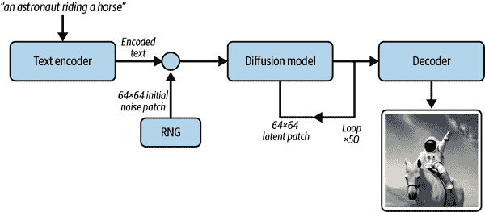
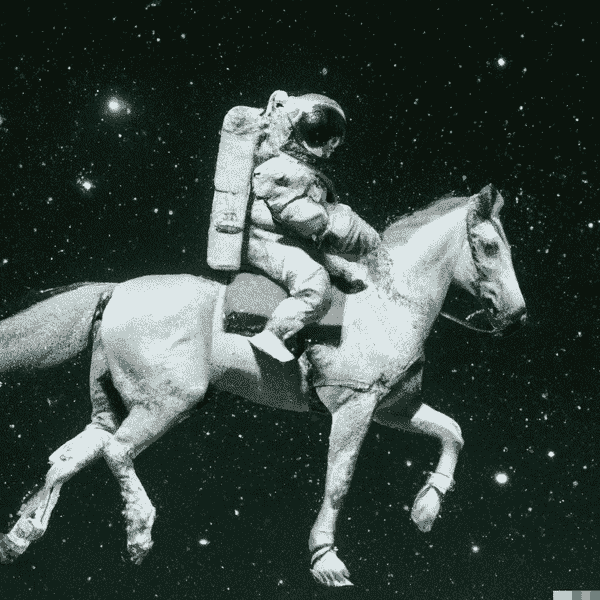
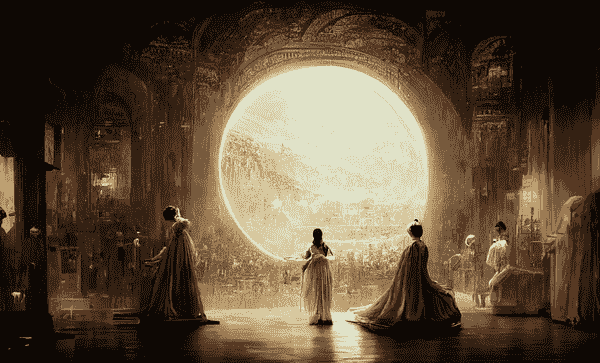
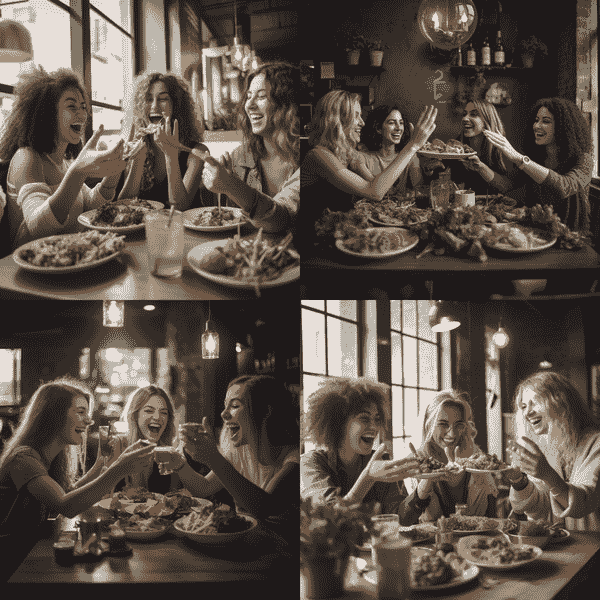
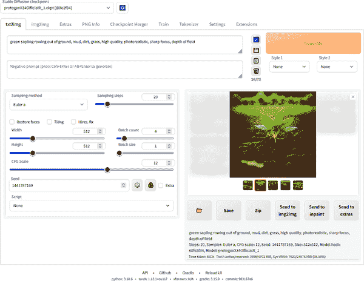
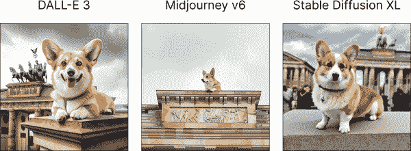

# 第七章\. 图像生成扩散模型的介绍

本章介绍了最流行的 AI 图像生成扩散模型。您将了解每个顶级模型的优缺点，以便您可以根据手头的任务自信地选择它们。

2015 年引入的 *扩散模型* 是一类生成模型，它在从文本生成图像方面取得了显著成果。2022 年 [DALL-E 2](https://oreil.ly/dalle2) 的发布标志着扩散模型生成图像质量的重大飞跃，开源 [Stable Diffusion](https://oreil.ly/gjNJ_) 和社区喜爱的 [Midjourney](https://oreil.ly/j51L0) 迅速跟进，形成了一个具有竞争力的类别。随着 [DALL-E 3](https://oreil.ly/dalle3) 集成到 ChatGPT 中，文本和图像生成之间的界限将继续模糊。然而，高级用户可能仍需要直接访问底层图像生成模型，以获得最佳结果。

扩散模型通过向图像添加随机噪声的多个步骤进行训练，然后通过 *去噪*（去除噪声）预测如何逆转扩散过程。这种方法来自物理学，在那里它已被用于模拟粒子如何通过介质 *扩散*（扩散）。预测取决于图像的描述，因此如果生成的图像不匹配，模型的神经网络权重将进行调整，以使其更好地从描述中预测图像。当模型训练完成后，它能够将随机噪声转换为与提示中提供的描述相匹配的图像。

图 7-1 展示了去噪过程，如王斌旭在[“扩散生成模型的数学基础”](https://oreil.ly/57szp)中演示的那样。


###### 图 7-1\. 扩散示意图

这些模型是在从互联网上抓取的数十亿张图片（及其相关标题）的大数据集上训练的，因此可以复制大多数流行的艺术风格或艺术家。这引发了诸多争议，因为版权所有者寻求[执行他们的法律主张](https://oreil.ly/a4Fyp)，而模型创造者则支持合理使用。

扩散模型并非仅仅是“复杂的拼贴工具”，它只是几个吉字节大小，因此不可能包含所有训练数据的副本。当研究人员试图从 Stable Diffusion 的训练数据中复制 350,000 张图片时，他们只成功复制了其中的 109 张([Carlini 等人](https://oreil.ly/SGn9B)，2023)。

模型所做的是更类似于一个人类艺术家查看互联网上的每一张图片，并学习定义每个主题和风格的模式。这些模式被编码为*向量表示*（一系列数字），指代潜在空间中的一个位置：模型可以生成所有可能图像组合的映射。用户输入的提示首先被编码成向量；然后扩散模型生成与这些向量匹配的图像，最后将生成的图像解码回像素供用户查看。

图 7-2 展示了编码和解码过程，来自伊恩·斯坦比特的[“通过稳定扩散漫步潜在空间”](https://oreil.ly/qOpis)。



###### 图 7-2\. 编码和解码过程

这些向量，也被称为*嵌入*，在模型对每个图像的映射中充当一个位置或地址，因此相似的图像在潜在空间中会彼此靠近。潜在空间是连续的，你可以在两个点之间（插值）移动，并且仍然可以得到有效的图像。例如，如果你从一只狗的图片插值到一个水果碗，中间的图像将看起来连贯，展示了两个概念之间的渐进式转变。

图 7-3 包含一个网格，也来自伊恩·斯坦比特，显示了[四张图像之间的中间步骤](https://oreil.ly/cjm8A)：一只狗（左上角），一个水果碗（右上角），埃菲尔铁塔（左下角），和一座摩天大楼（右下角）。


###### 图 7-3\. 潜在空间中的随机游走

在扩散模型的领域内，提示工程可以看作是在潜在空间中导航，在所有可能的图像中寻找与你的愿景相匹配的图像。有许多技术和最佳实践用于定位正确的单词组合来召唤你想要的图像，一个活跃的 AI 艺术家和研究人员社区已经努力构建了一套工具来帮助。每个模型和方法都有其自身的特点和行为，这取决于其架构、训练方法和训练数据。负责构建最受欢迎的文本到图像扩散模型的三家主要组织在商业模式和功能方面都采取了截然不同的方法，因此扩散模型的选择比 OpenAI 主导的 LLM 空间更加多样化。

# OpenAI DALL-E

2021 年 1 月，OpenAI 发布了文本到图像模型 DALL-E，其名称是对超现实主义艺术家萨尔瓦多·达利和皮克斯动画机器人 WALL-E 的双关语。该模型基于 OpenAI 的杰出 GPT-3 文本模型的修改版，该模型在七个月前发布。DALL-E 是生成式 AI 的一次突破，展示了人们认为计算机不可能拥有的艺术能力。图 7-4 展示了 DALL-E 功能的[第一版](https://oreil.ly/dalle1)。


###### 图 7-4\. DALL-E 功能

DALL-E 模型并未开源，也未向公众发布，但它激发了多位研究人员和爱好者的兴趣，尝试复制这项研究。其中最受欢迎的模型是 DALL-E Mini，于 2021 年 7 月发布（一年后在 OpenAI 的要求下更名为 Craiyon），尽管它在社交媒体上获得了狂热追随者，但其质量远不如官方的 DALL-E 模型。OpenAI 于 2022 年 4 月发布了一篇关于 DALL-E 2 的[论文](https://oreil.ly/EqdtP)，其质量显著提高，吸引了 100 万人的等待名单。图 7-5 展示了论文中现在标志性的宇航员骑马图像，该图像激发了公众的想象力。



###### 图 7-5\. DALL-E 2 图像质量

由于对 AI 伦理和安全性的担忧，直到 2022 年 9 月，访问权限仅限于等待名单用户。最初禁止生成包含人物的图像，以及一系列敏感词汇。研究人员发现 DALL-E 2 在一些图像提示（如一位医生的照片）中添加了“*黑人*”或“*女性*”等词汇，这是一种笨拙的尝试，旨在解决从数据集中继承的偏见（互联网上的医生照片中，白人男性的比例不正常）。

团队在 2022 年 8 月将修复和扩展功能添加到用户界面中，这又是一个重大进步，引起了媒体和社交媒体的关注。这些功能允许用户仅生成图像的选定部分，或者通过生成现有图像边缘的图像来*缩小视图*。然而，用户对模型的参数控制很少，无法在自己的数据上微调它。该模型在某些图像上会生成混乱的文本，并且在描绘人物方面存在困难，生成了扭曲或变形的双手、双脚和眼睛，如图 7-6 所示。


###### 图 7-6\. 变形的双手和眼睛

Google 的 Imagen 展示了令人印象深刻的结果，并在 2022 年 5 月的一篇论文中介绍([Ho 等人](https://oreil.ly/sFaeW)，2022)，但该模型并未向公众开放，理由是 AI 伦理和安全问题。像 Midjourney（2022 年 7 月）这样的竞争对手迅速行动，利用了那些在社交媒体上看到 DALL-E 令人印象深刻的演示但被困在等待名单上的人的巨大需求。Stable Diffusion（2022 年 8 月）的开源发布打破了 OpenAI 几个月前看似不可动摇的领先地位。尽管 ChatGPT 作为功能推出的更先进的[DALL-E 3 模型](https://oreil.ly/dalle3)帮助 OpenAI 收复失地，谷歌也加入了游戏，推出了[Gemini 1.5](https://oreil.ly/XzQrU)，但仍有很大的发展空间。

# Midjourney

2022 年 7 月，在 DALL-E 2 发布后的仅仅三个月，Midjourney 就推出了其 v3 模型的开源测试版。这是一个推出图像生成模型的独特好时机，因为早期用户对 DALL-E 2 能做什么的演示看起来像是魔法，但最初访问是有限的。热切的早期采用者纷纷涌入 Midjourney，其引人注目的幻想美学在游戏和数字艺术人群中赢得了狂热追随，如图[现在著名的图像](https://oreil.ly/dqshh)所示，该图像在数字艺术比赛中获得了一等奖，如图 7-7 所示。



###### 图 7-7. 空间歌剧院

Midjourney 是第一个具有商业模式和商业许可的可行图像模型之一，使其不仅适合实验。订阅模式受到许多习惯于为其他软件如 Adobe Photoshop 按月付费的艺术家们的青睐。它还帮助创意过程不按生成的图像收费，尤其是在早期，你必须尝试多张图像才能找到一张足够高质量的图像。如果你是 Midjourney 的付费客户，你拥有任何生成的图像的权利，与 DALL-E 不同，OpenAI 保留着版权。

Midjourney 的独特之处在于其强烈的社区关注。要使用这个工具，你必须登录到一个[Discord 服务器](https://oreil.ly/JKZzD) (图 7-8) 并在一个公开频道或直接消息中提交你的提示。鉴于所有图像生成默认都在公开频道共享，并且私人模式仅在[最昂贵的计划](https://oreil.ly/OV46r)上可用，通过 Midjourney 创建的大多数图像都可供他人学习。这导致了用户之间的快速复制和迭代，使得新手能够快速从他人那里学习。早在 2022 年 7 月，Discord 社区的人数就接近 100 万（如图 7-8 所示），一年后，会员人数超过 1300 万。


###### 图 7-8. Midjourney 的 Discord 服务器，2022 年 7 月

当你找到喜欢的图片时，你可以点击一个按钮来*提升*图片的分辨率（使其更高）以供使用。许多人推测这个过程充当了强化学习的训练数据，类似于[从人类反馈中进行强化学习](https://oreil.ly/3ISZk)（RLHF），这种方法被誉为 ChatGPT 成功的关键。此外，团队定期要求对由较新模型生成的图片进行评分，以提高性能。Midjourney 于 2022 年 11 月发布了其模型的 v4 版本，随后在 2023 年 3 月发布了 v5 版本，在 2023 年 12 月发布了 v6 版本。质量显著提高：在图 7-6 中识别出的手和眼睛问题在很大程度上已经消失，模型具有更广泛的艺术风格范围，这在图 7-9 中得到了展示。

输入：

```py
a group of best friends women eating salads and laughing
while high fiving in a coffee shop, cinematic lighting
```

图 7-9 展示了输出。



###### 图 7-9。妇女吃沙拉和笑

值得注意的是，Midjourney 团队一直保持规模较小，截至 2023 年 3 月仅有[11 名员工](https://oreil.ly/YrmA_)。Midjourney 的创始人 David Holz，此前是硬件创业公司 Leap Motion 的员工，[在一次采访中确认](https://oreil.ly/jeFYV)公司自 2022 年 8 月起就已经盈利。更令人印象深刻的是，在没有 OpenAI 所享受的数十亿美元资金的情况下，该团队已经构建了比 DALL-E 更多的功能，包括负面提示（从图片中移除概念）、加权术语（增加其他概念的普遍性）以及他们的*描述*功能（从上传的图片中逆向工程提示）。然而，没有 API 可用；访问该模型唯一的方式是通过 Discord，这可能会对主流采用产生拖累。

# Stable Diffusion

当 DALL-E 2 的等待名单继续增长时，慕尼黑 LMU 的 CompVis 组和应用研究公司 Runway ML 从 Stability AI 那里获得了计算能力的捐赠，用于训练 Stable Diffusion。当它在 2022 年 8 月开源发布时，该模型震惊了生成式人工智能界，因为其结果与 DALL-E 2 和 Midjourney 相当，但可以在你自己的电脑上免费运行（假设你有一个配备 8GB VRAM 的适度 GPU）。Stable Diffusion 在 GitHub 上任何软件的[GitHub 星标增长速度中排名最快](https://oreil.ly/pwPGX)，在最初的 90 天内达到了 33,600 个星标（图 7-10）。


###### 图 7-10。GitHub 开发者对 Stable Diffusion 的采用

将模型开源的决定引起了争议，并引发了关于 AI 伦理和安全性的担忧。确实，许多最初的用例都是用于生成 AI 色情内容，正如在[Civitai](https://civitai.com)等平台上分享的不适宜工作环境（NSFW）模型所证明的那样。然而，业余爱好者和 DIY 爱好者能够修改和扩展模型，以及在自己的数据上微调它，这导致了模型功能的快速演化和改进。将所有模型参数（如分类器自由引导（如何紧密遵循提示）、去噪（模型在推理期间添加到基础图像中的噪声量）和种子（从哪里开始去噪的随机噪声））呈现给用户的决定，导致了更多创造性和创新的艺术作品。开源的易用性和可靠性也吸引了几家小型企业在其基础上构建，例如 Pieter Level 的[PhotoAI](https://photoai.com)和[InteriorAI](http://interiorai.com)（每月收入超过 10 万美元），以及 Danny Postma 的[Headshot Pro](https://www.headshotpro.com)。除了匹配 DALL-E 的修复和扩展功能外，开源贡献也保持了与 Midjourney 的功能同步，例如负面提示、加权术语以及从图像中逆向工程提示的能力。此外，像 ControlNet（匹配图像的姿势或构图）和 Segment Anything（点击元素以生成修复用遮罩）这样的高级功能也被迅速添加为稳定扩散的扩展（均于 2023 年 4 月发布），通常通过[AUTOMATIC1111 的 Web 用户界面](https://oreil.ly/0inw3)（图 7-11）访问。



###### 图 7-11\. AUTOMATIC1111 的稳定扩散 Web 用户界面

稳定扩散的 1.5 版本于 2022 年 10 月发布，至今仍在使用。因此，它将成为本书第十章构建应用程序中高级图像生成部分的 ControlNet 示例的基础。稳定扩散的权重在 Hugging Face 上发布，向一代 AI 工程师介绍了开源 AI 模型库。稳定扩散的 2.0 版本于一个月后的 2022 年 11 月发布，在原始[LAION-5B 数据集](https://oreil.ly/K5vX2)（一个用于研究目的的大规模图像和文本对数据集）的更具美感的子集上训练，过滤掉了 NSFW（不适宜工作环境）图像。稳定扩散的高级用户对审查制度以及模型性能的下降表示了不满，[推测](https://oreil.ly/2mgh5)训练集中的 NSFW 图像对于生成逼真的人体解剖结构是必要的。

Stability AI [筹集了超过 1 亿美元](https://oreil.ly/BT-k5)并继续开发新的模型，包括[DeepFloyd](https://oreil.ly/UCQ3I)，这是一个能够更好地在图像上生成真实文本的模型（这是困扰其他模型的问题），以及当前最受欢迎的[稳定扩散 XL 1.0](https://oreil.ly/gcT4t)（简称 SDXL）。这个模型克服了社区对 2.0 版本中审查的疑虑，这很大程度上归功于这个更强大的模型，它有 66 亿个参数，而 v1.5 模型有 9.8 亿个参数。

# 谷歌 Gemini

谷歌长期以来一直威胁要成为该领域的竞争对手，他们的[Imagen](https://oreil.ly/K8oWv)模型（尚未[公开发布](https://oreil.ly/341QB)），而且确实有前谷歌员工创立了一个有前途的新图像模型[Ideogram](https://ideogram.ai)，该模型于 2023 年 8 月发布。他们终于在 2023 年 12 月推出了 Gemini，尽管很快因为笨拙地尝试[推广多样性](https://oreil.ly/u-Glg)而受到批评。谷歌的内部政治是否会阻止他们利用其显著资源，还有待观察。

# 文本到视频

在图像空间中，大部分的关注力也可能转向 *文本到视频*、*图像到视频*，甚至 *视频到视频*，因为稳定扩散社区正在扩展模型的能力，以逐帧生成一致性的图像，包括像[AnimateDiff](https://oreil.ly/CsJgT)这样的有前景的开源项目。此外，稳定扩散的一个共同创造者 RunwayML 已经成为文本到视频领域的领先先驱，并开始使用他们的[Gen-2 模型](https://oreil.ly/vS0mA)获得可用的结果。[稳定视频扩散](https://oreil.ly/UuApM)于 2023 年 11 月发布，能够将文本转换为短视频剪辑或对现有图像进行动画处理，而[稳定扩散 Turbo](https://oreil.ly/uMAkh)可以几乎实时地生成图像。2024 年 2 月发布的[Sora](https://oreil.ly/sora)表明，OpenAI 也没有在这个领域休息。尽管我们没有明确涵盖文本到视频提示技术，但你所学到的关于图像生成提示的一切也直接适用于视频。

# 模型比较

随着对 AI 图像生成需求的增加和竞争的加剧，新参与者将出现，主要玩家将多样化。在我们的工作流程中，我们已经开始使用不同的模型来满足不同的需求。DALL-E 3 在构图方面表现优秀，与 ChatGPT 的集成也很方便。Midjourney 在幻想和真实照片方面仍然具有最佳的美学效果。Stable Diffusion 作为开源模型，使其成为最灵活和可扩展的模型，也是大多数 AI 企业在其产品之上构建的基础。每个模型都朝着独特的风格和功能集发展，正如在比较多个模型上的相同提示时可以辨别出来，如图 7-12 所示。

输入：

```py
a corgi on top of the Brandenburg Gate
```

图 7-12 显示了输出。



###### 图 7-12\. 一只柯基站在勃兰登堡门上

# 摘要

在本章中，你被介绍到了用于 AI 图像生成的扩散模型。这些模型，如 DALL-E、Stable Diffusion 和 Midjourney，使用随机噪声和去噪技术根据文本描述生成图像。它们在大型数据集上进行了训练，可以复制各种艺术风格。然而，关于版权问题存在争议。你学习了当在潜在空间中导航以找到所需图像时，提示工程原则如何应用于图像生成。

在本章中，你探讨了 OpenAI、Stability AI 和 Midjourney 等组织在开发文本到图像模型时采取的不同方法。OpenAI 的 DALL-E 因其艺术能力而受到欢迎，但访问受限，复制的模型质量较差。另一方面，Midjourney 利用了对 DALL-E 替代品的需求，并通过其 v3 和 v4 模型获得了狂热追随者。它采用基于订阅的定价模式，并注重社区建设。另一方面，Stable Diffusion 因其与 DALL-E 和 Midjourney 相当的结果而受到关注，但具有开源和免费在个人电脑上运行的优势。通过阅读本章，你还获得了对 AI 图像生成历史以及 OpenAI、Midjourney 和 Stable Diffusion 等组织所取得的进步的见解。

在下一章中，你将学习处理 AI 图像生成的实用技巧。本章将为你提供创建视觉上令人惊叹且独特的图像所需的知识和技术。从格式修饰符到艺术风格复制，你将发现提示工程在创建吸引人和原创视觉内容方面的力量。准备好释放你的创造力，并将你的图像生成技能提升到新的水平。
