# 第八章. 使用 Midjourney 的图像生成标准实践

在本章中，你将使用标准化技术来最大化扩散模型的输出和格式。你将从调整提示词开始，探索用于图像生成的所有常见实践。除非另有说明，所有图像均由 Midjourney v5 生成。所讨论的技术旨在可迁移到任何未来的或替代模型。

# 格式修饰符

在图像生成中最基本的实践是指定图像的格式。AI 图像模型能够部署广泛的格式，从股票照片到油画，再到古埃及象形文字。图像的外观往往根据格式而完全不同，包括图像中生成的物体或人物的风格。训练数据中的许多图像是股票照片，这也是图像生成中最具商业重要性的图像类别之一。

输入：

```py
a stock photo of a business meeting
```

图 8-1 展示了输出。


###### 图 8-1. 商业会议股票照片

使用像 Stable Diffusion 这样的开源模型免费生成无限量的免版税股票照片，或者使用 DALL-E 或 Midjourney 以极低的成本生成，本身就是一场变革。这些图像每个都是独特的（尽管可能包含与现有图像的相似之处），因此它们看起来比其他人可用的相同免费股票照片更高端。然而，你不再需要局限于股票摄影格式。如果你的博客文章或网站图像看起来更艺术化，你可以几乎无限制地做到这一点。

输入：

```py
an oil painting of a business meeting
```

图 8-2 展示了输出。

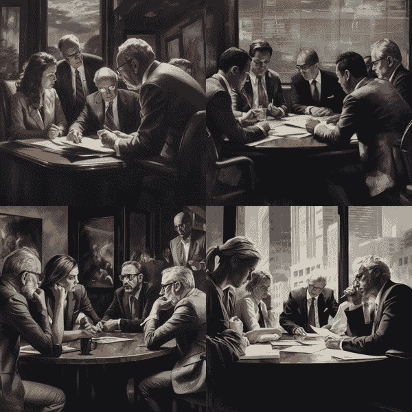

###### 图 8-2. 商业会议油画

# 指定格式

我们指定的格式会显著改变我们从 AI 模型中获得的结果。指定格式也提高了我们提示的可靠性，在提供所需视觉类型方面。

在这个技术方面，实际上没有真正的限制，这是那些如果去艺术学校学习会很有帮助的领域之一。如果你知道你想要在图像中看到的具体技术或细节的名称——例如，涂抹法，这是一种在油画中使用的技巧，其中颜料厚厚地涂在表面的一块区域，留下可见的笔触——你可以在提示词中引用它，以更接近你想要的结果。谷歌维护了一个综合性的列表，列出了许多有用的[艺术家和艺术运动](https://oreil.ly/OmZbl)。

输入：

```py
an oil painting of a business meeting, textured oil-on-canvas
using thick impasto and swirling dynamic brushstrokes
```

图 8-3 展示了输出。


###### 图 8-3. 涂抹法商业会议油画

商务会议的油画现在在视觉上更加有趣，并且可能更具吸引力，这取决于你的观众。传统上，企业迁移到使用库存摄影的原因之一是它比委托绘画便宜，但这一限制在 AI 时代不再适用。我们可以生成我们喜欢的任何格式，例如古代埃及象形文字中的商务会议。

输入：

```py
an ancient Egyptian hieroglyph of a business meeting
```

图 8-4 显示了输出。


###### 图 8-4. 古代埃及象形文字中的商务会议

在修改格式时要注意的是，图像的风格，甚至内容，往往与训练数据中与之关联的内容相匹配。例如，在我们的油画中没有任何电脑，因为它们在油画中不常出现。同样，在我们的象形文字中，会议的参与者戴着古代埃及的头饰。通常，你需要将格式修饰符与其他先前技术结合起来，才能达到你想要的效果。

# 艺术风格修饰符

AI 图像模型的一个强大功能是它们能够复制任何流行的艺术风格或艺术家。在社交媒体和 AI 演示中最常见的例子是梵高、达利或毕加索的风格图像，以及他们所属的艺术运动，分别是后印象派、超现实主义和立体主义。AI 艺术社区也在决定哪些当代艺术风格变得流行方面产生了影响，正如波兰数字艺术家[格雷格·鲁特科夫斯基](https://oreil.ly/nnam3)的情况一样，他以他的幻想风格而闻名。然而，许多艺术家都反对 AI 艺术，并且关于模仿在世艺术家的风格是否被视为版权法下的**合理使用**存在法律灰色地带。我们建议 AI 艺术家在生成任何在世艺术家的独特风格 AI 艺术时要谨慎行事，并且作为一般规则，坚持选择一年前去世的艺术家（对于任何计划用于商业用途的情况，请寻求法律咨询）。

输入：

```py
illustration of a dragon, in the style of Alice's Adventures in Wonderland
by Lewis Carroll
```

图 8-5 显示了输出。

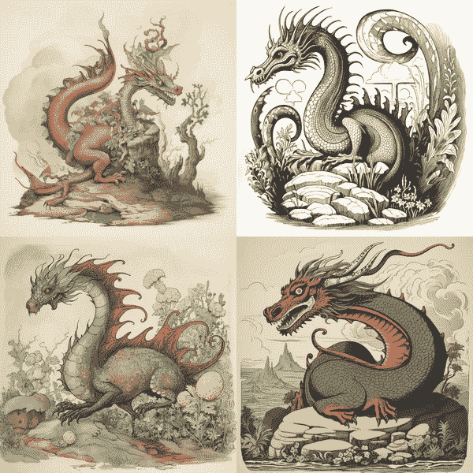

###### 图 8-5. 利·卡罗尔风格的龙插画

# 给出方向

唤起艺术家或艺术运动的名字是向提供特定视觉风格的一种捷径。只要艺术家或艺术运动在训练数据中有足够的例子，它们的本质就可以被模仿。

在唤起艺术家风格时，你实际上是在跳转到**潜在空间**的一部分，即潜在模型输出的多维宇宙，过滤到你想要的风格。从那里遍历到附近的地点可以帮助你到达一个比你通过随机尝试和错误所能达到的更令人愉悦的目的地。

# 反向工程提示

如果你没有上过艺术学校或者对电影或摄影了解不多，试图弄清楚你想要利用的艺术风格、格式和艺术家可能会感到有些令人畏惧。通常你会看到一张你喜欢的图片，但你无法详细描述它以便用提示重新创建。幸运的是，Midjourney 的`Describe`功能允许你通过输入`**/describe**`并上传图片来从图像中逆向工程一个提示。它适用于 AI 生成的图像，也适用于来自其他来源的正常图像，如图 8-6 所示，使用的是第一章中的一张库存照片。

Midjourney 为你提供了四种选项，包括各种艺术家、艺术风格、修饰语和其他词语，还包括对图像中发生的事情以及包含的主题或元素的估计。例如，Midjourney 正确地识别了图 8-6 中一群人在办公室里看着笔记本电脑的场景。你可以通过数字选择你想要的选项，Midjourney 将根据该提示生成图像，风格与原始图像相同。虽然存在类似的开源技术，名为[CLIP Interrogator](https://oreil.ly/fzgno)，但与 Midjourney 相比，提示的丰富性和复制上传图像风格的能力有所欠缺。


###### 图 8-6. Midjourney 描述，[Mimi Thian](https://oreil.ly/GdNrt)在[Unsplash](https://oreil.ly/bEEnJ)

# 质量提升词

对于图像模型来说，一个有效的技巧是在提示中添加与质量相关的词语。一些艺术风格比其他风格更具美学价值，但有一组被称为*质量提升词*的词语，似乎可以在不严重影响风格的情况下提升图像质量，例如*4k*、*非常美丽*和*在 Artstation 上流行*。生成模型并不是试图制作高质量的图像；它们试图模仿具有广泛风格和质量的训练集。如果你想要高质量的图像，你必须明确地要求它们。从你的提示主题开始，例如一个太空鲸鱼，然后在末尾添加一个修饰语，用逗号隔开（如图 8-7 所示）。

输入：

```py
a space whale, trending on artstation
```

输出：


###### 图 8-7. 太空鲸鱼，在 Artstation 上流行

# 给出方向

使用质量提升词可以通过在提示中添加一到两个词语来帮助提升图像的美学，而不会在很大程度上改变图像的整体风格。

这些标签之所以有效，是因为它们与训练数据中的质量相关联。当 AI 图像模型被训练时，据报道它们摄入了来自流行的设计作品集网站（如 ArtStation、Behance 和 DeviantArt）的图像。因此，模型可以近似认为一个“在 ArtStation 上流行的”图像比普通图像具有更高的美学价值。请注意，有时风格可能会渗透出来，这可能不符合你的创意愿景。例如，ArtStation 包含大量太空船的数字艺术，这可能解释了为什么图 8-7 中的太空鲸鱼在某种程度上看起来像太空船。要查看质量提升器、艺术风格和艺术家的列表，请访问由作者之一创建的此模板：[提示工程模板](https://oreil.ly/afGCQ)。Google 还编制了一个综合性的[艺术运动](https://oreil.ly/mhujK)列表，这有助于你了解你喜欢的风格名称。

# 负面提示

通常，两个概念在训练数据中交织得如此紧密，以至于在生成一个概念图像时，它们经常一起出现，即使这不是你指定的或意图的。例如，当你要求油画时，你通常会得到相应的画框和周围的墙壁，因为这是大量博物馆收藏的这些画作中的内容。

在 Midjourney 和 Stable Diffusion 中，你可以添加*负面提示*，这允许你指定你不想在图像中出现的元素。负面提示可以有效地分离两个相互交织的概念，并确保你的图像不包含你希望避免的任何内容。以油画和画框为例，你可以在提示的末尾添加`--no`，然后在该标志之后的逗号分隔列表中的任何内容都将被取消。为了修复你的画框问题，添加“frame”和“wall”作为负面提示，如图图 8-8 所示。

输入：

```py
oil painting in the style of Rembrandt --no frame, wall
```

图 8-8 显示了输出。

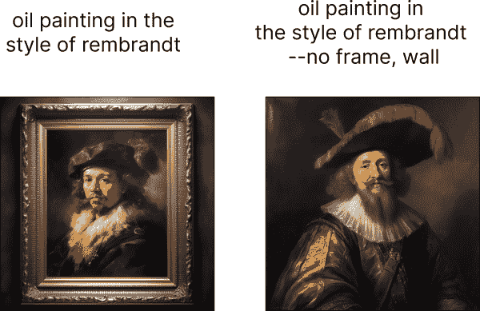

###### 图 8-8\. 没有画框或墙的伦勃朗风格油画

# 给出方向

负面提示可以取消图像中的不希望出现的概念，将模型引导远离你试图避免的区域。这并不总是按预期工作，因为概念之间往往关联性太强，但有时它确实可以引导到有趣的地方。

负面提示并不完全可靠，但在各种场景中可能很有用。这种技术的创造性用途之一是将名人的名字作为负面提示来减少与他们最相关的因素。著名女演员凯伦·吉兰有红发，有传统女性的外观，因此可以用来使主题不太可能拥有红发或看起来传统女性化。

输入：

```py
a Scottish female astronaut --no Karen Gillan
```

图 8-9 显示了输出。

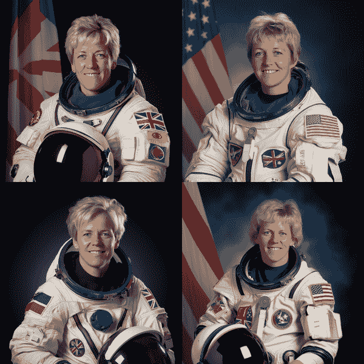

###### 图 8-9\. 一个不那么传统女性化、头发颜色较浅的苏格兰女宇航员

您也可以通过将两个不可分割的概念分开来获得非常创造性和不可预测的结果。例如，尝试将您最喜欢的卡通去掉卡通风格，就像图 8-10 中展示的荷马·辛普森一样。

输入：

```py
Homer Simpson --no cartoon
```

图 8-10 显示了（令人震惊的）输出结果。

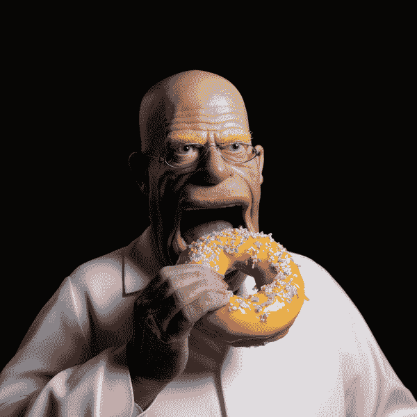

###### 图 8-10\. 荷马·辛普森去掉其标志性的卡通风格

负面提示的一个更常见的历史用例是纠正早期 AI 模型在畸形手、裸露的身体部位或看起来奇怪的眼睛等问题上的某些问题。提示工程师会添加诸如*nsfw*、* elongated body*、*too many digits*、*not enough fingers*和*teeth*等单词到负面提示中，试图（通常徒劳）引导模型远离这些空间。

虽然对于较老或较弱的模型（如 Stable Diffusion v1.5）来说仍然有必要，但从 Midjourney v5 和 Stable Diffusion XL 开始，这基本上是一个已解决的问题。最先进的模型现在能够开发出看起来正常的图像，如手、眼睛和身体，而不需要依赖负面提示。

# 权重术语

如果您想完全否定某些内容，负面提示很有用，但通常您只是想降低其程度。为了混合和匹配不同的概念，控制每个概念的多少可能会有所帮助。

默认情况下，提示中的所有单词权重均为 1，尽管提示开头的单词影响更大，这就是为什么我们通常按照惯例将图像的主题放在那里，即`金门大桥的画作`。您可以通过在 Midjourney 中添加两个冒号字符`::`和一个表示新权重的数字来更改提示部分中的权重。使用这种方法，您可以制作出主要是梵高风格但带有达利风格的图像。

输入：

```py
painting of the Golden Gate Bridge::1 in the style of Van
Gogh::0.8, in the style of Dali::0.2
```

图 8-11 显示了输出结果。


###### 图 8-11\. 梵高和达利的风格绘制的金门大桥画作

要查看权重如何影响最终图像，您可以系统地测试特定粒度下每个权重的组合，进行网格搜索。在这个例子中，两个艺术家之间的权重在 0 到 1 之间以 0.2 的增量变化。

图 8-12 显示了输出结果。

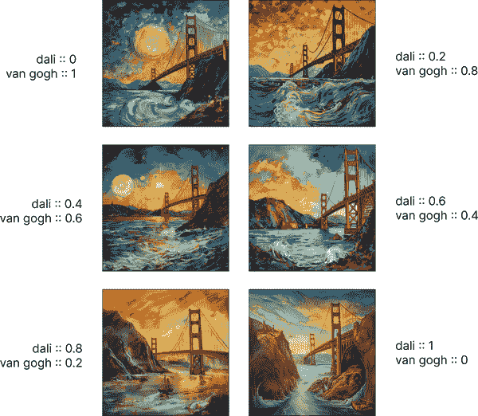

###### 图 8-12\. 权重的排列网格

# 评估质量

权重在提示中引入了许多可能的组合，逐个迭代可能会很耗时。建议采用网格搜索方法，系统地生成许多可能的组合，以确定理想的权重组合与您的偏好相匹配的位置。

权重可以根据需要高于 1 以强调某些元素，或者低于 1 以降低某些元素的强调。你还可以在提示中添加负权重来以不同程度地移除该方面。用于负提示的 `--no` 参数实际上只是将 `::-0.5` 添加到提示的该部分的一个快捷方式。如果你在图像中遇到了你不希望出现的东西，尝试使用更强的负权重而不是负提示。使用先前的例子，你可以通过给梵高添加 -1 权重并将达利的权重调高到 5，从而从达利的作品中去除任何梵高的影响。

输入：

```py
painting of the Golden Gate Bridge::1 in the style of Van
Gogh::-1, in the style of Dali::5
```

图 8-13 展示了输出结果。

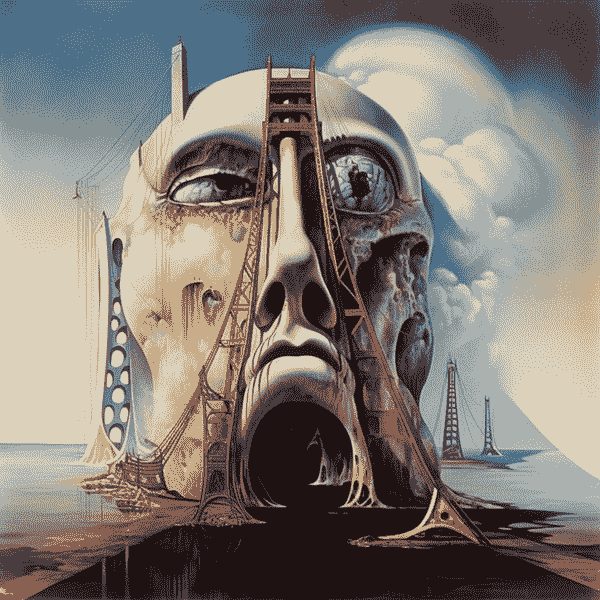

###### 图 8-13\. 金门大桥的画作

权重可以在混搭不同风格或强调特定元素时成为一个强大的工具。权重的排列组合有很多种，因此必须采取更系统的方法来寻找一个具有美学吸引力的空间进行创作。

# 使用图片进行提示

许多 AI 图像生成工具允许你不仅用文字，还可以用图片来提示模型。提供你想要达到的示例图片可以作为构建更独特、原创作品的基础，同时仍然匹配你需要的风格。在 Stable Diffusion 社区中，这被称为 Img2Img，而在 Midjourney 中，你只需在提示中链接到一张图片。这样做最好的方式是首先将图片上传到 Discord（例如，这张由 [Jessica Hearn](https://oreil.ly/B6E0Y) 在 [Unsplash](https://oreil.ly/0oO4w) 上提供的照片），然后右键点击并选择复制链接，如图 8-14（#figure-8-14）所示。你可以在稍后把链接粘贴到提示中，用作基础图片。

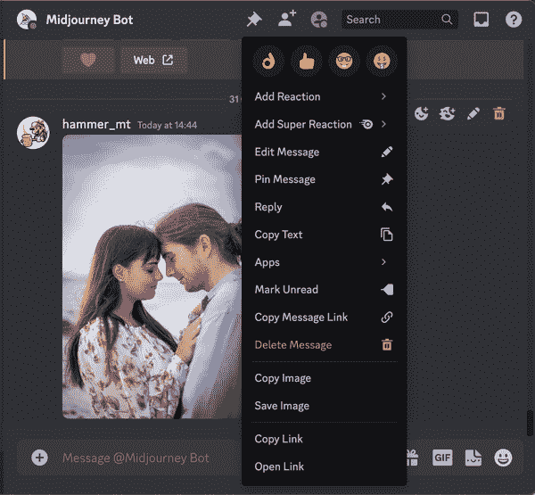

###### 图 8-14\. 从 Discord 上传的图片的链接复制

然后将复制的链接粘贴到 Midjourney 提示的开头，并附上你的文本提示。现在你有了基础图片（一张图片胜过千言万语），你不需要那么详细了。如果你知道提供的图片是什么以及它是如何被提示修改的，图片不会完全匹配，但会相似到可以被识别的程度。

输入：

```py
https://s.mj.run/XkIHsYIdUxc in the style of The Great Gatsby
```

图 8-15 展示了输出结果。


###### 图 8-15\. 以《了不起的盖茨比》风格拍摄的股票照片

###### 警告

关于 AI 的版权和公平使用规则仍在制定中，因此请小心上传任何你没有版权的图片。

这种技术在你想得到类似氛围、场景或构图与已知图像相似的地方都适用。你还可以使用`/blend`将多张图片混合在一起，以获得相当独特的效果，甚至可以将生成的图像作为另一个提示的输入。为了方便，有一个`--iw`参数，它的作用与使用`::`将图像与提示的其余部分分开并设置权重相同。使用图像进行提示也是 AI 视频生成工具（如[RunwayML](https://runwayml.com)和[Pika Labs](https://pika.art)）的常见技术，鉴于文本到视频生成的普遍不可靠性，以及它为你提供了一个在不等待整个视频生成和渲染的情况下迭代场景风格的机会。

# 提供示例

获取你想要的图片最快、最简单的方法是上传你想要模仿的图片。这在概念上类似于文本生成空间中的一次性提示，并且同样有助于引导模型生成正确的输出。

# 修复

与 AI 图像生成工具一起工作始终是一个迭代的过程。很少在第一次尝试就能得到完整的最终图像。通常会有你想要解决的问题或想要改变的风格。例如，假设你使用 Midjourney 生成了一张 20 世纪 20 年代风格的女子短裙图像，但想要改变她所穿的衣服，而不需要重新生成整个图像。

解决方案是*修复*，这在大多数[Stable Diffusion](https://oreil.ly/YgL8g)实现中都有，在[Midjourney](https://oreil.ly/7DhZE)中通过名为*Vary Region*的功能提供，以及[Adobe Photoshop 的](https://oreil.ly/FvGAi) *生成填充*。然而，DALL-E 是这项功能的先驱，就结果质量而言，它仍然是我们的个人首选。为了演示这一功能，首先你在 ChatGPT（Plus）中使用 DALL-E 生成一张图片，然后擦除你想要重新生成的图片部分。

图 8-16 显示了 DALL-E 生成的图像，下面是相应的提示。它正在 DALL-E 的修复画布（目前使用 ChatGPT）中进行编辑，并已使用修复笔擦除了图像的连衣裙部分，准备进行修复。

输入：

```py
photograph of glamorous woman in a 1920s flapper party,
wearing a sequin dress, wide angle, in color, 3 5 mm, dslr
```

图 8-16 显示了已上传的图片，其中部分已被擦除。

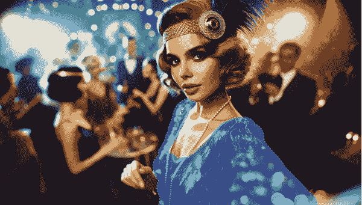

###### 图 8-16\. DALL-E 中的修复

然后你添加一个提示，说明你想要在哪个空间内生成什么。常见的建议是提示整个图像应该是什么，但根据我们的经验，将提示缩小到仅包括擦除部分的图像可以得到更好的结果，如图 8-17，它专注于连衣裙本身。

输入：

```py
Van Gogh style dress, inspired by Starry Night, blue and
yellow swirls, extremely detailed, very well lit, studio
light, 3.5 mm, dslr
```

图 8-17 显示了输出结果。


###### 图 8-17\. 凡·高风格连衣裙

# 分工合作

选择正确的模型进行工作非常重要。一些图像模型，如 Midjourney，擅长生成特定风格或具有特定美学的图像，而其他模型则竞争高级功能，如 DALL-E 的修复图像功能。使用多个模型一起可以扩大你所能完成的工作范围。

DALL-E 拥有的功能比大多数图像模型都少，但在这项特定技术方面非常出色。它自动融合边缘，使图像与周围环境很好地融合。因此，你不需要特别精确地使用擦除笔刷，仍然可以得到很好的结果。值得注意的是，这些模型在仅仅一年多的时间里取得了多大的进步。图 8-18 展示了如果你通过 ChatGPT 使用与之前用于 DALL-E 3 相同的提示词，DALL-E 会得到什么结果。

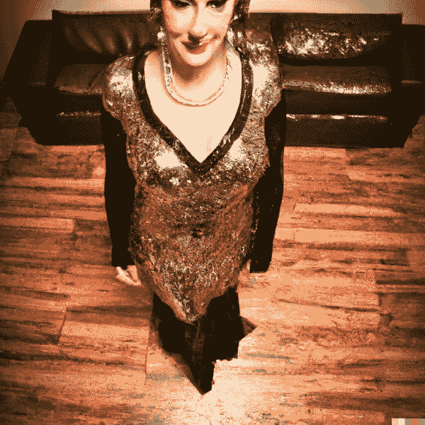

###### 图 8-18\. 20 世纪 20 年代派对上的女性照片

DALL-E 3 提供了更高级的质量，但目前仅可通过 API 和 ChatGPT 获取；它不在 OpenAI Labs 界面中可用，该界面历史上用于修复图像。随着图像模型的增多，它们在功能和用例上正在分化，完成手头任务可能需要多个模型组合使用。修复图像是一种强大的图像编辑技术，无论这些图像来自其他 AI 模型还是真实摄影师。

# 扩展图像

与 DALL-E 的修复图像相关的是扩展图像，其中你生成现有图像之外的内容。这项技术实际上可以从现有图像中*缩放出来*，为其添加上下文。这可以用来在生成的图像或上传的图像中添加更多细节。扩展图像不再在 OpenAI 的实验室界面中可用，并且尚未在 ChatGPT 中提供，但在 Midjourney 中被称为缩放，它作为图像放大后的选项出现，正如你在图 8-19 中看到的那样，其中女性短裙的周围环境被揭示出来。

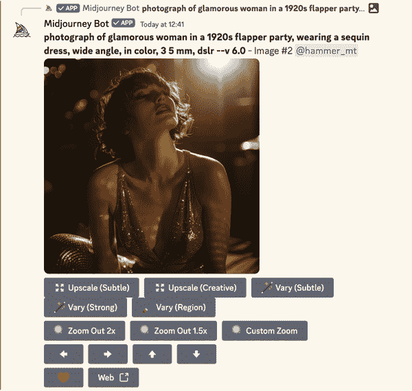

###### 图 8-19\. 中间过程缩放选项

输入：

```py
photograph of glamorous woman in a 1920s flapper party,
wearing a sequin dress, wide angle, in color, 3 5 mm, dslr
```

图 8-20 展示了输出结果。

# 提供示例

通常，仅通过文本提示来达到正确的风格可能很困难，尤其是如果风格很微妙或你不知道所有描述它的单词。提供用于修复或扩展图像的图像示例是获得更好结果的一种捷径。

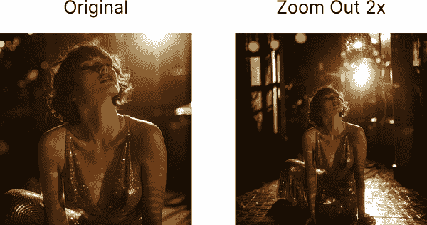

###### 图 8-20\. Midjourney 图像缩放前后的对比

除了创造性地扩展现有图像外，如果需要获取非正方形比例的图像，通过填充空白区域，外扩技术也非常有用。你可以运行自定义缩放并设置一个宽高比，以及通过试错法在每个新图像部分中提示你想要的内容，直到找到与图像其余部分一致的内容，或者直到整个图像达到所需的宽高比（例如，从肖像模式变为横幅模式）。这种技术也作为扩展功能在[Stable Diffusion](https://oreil.ly/0c_en)中提供，但根据我们的经验，它比中途变化区域不太可靠。

# 一致的人物

修复和外扩的一个被低估的用途是使用现有图像来保持跨代的一致性。一个这样的例子是通过生成并排的两张图像，每次修复其中一边来创建[一致的人物](https://oreil.ly/BaITC)。首先，生成一个图像，明确指出有两张图像并排，宽高比为 2:1。

输入：

```py
two images side by side, rockstar American rough and ready
middle-age jawline actor man, photo booth portrait --ar 2:1
```

图 8-21 显示了输出。

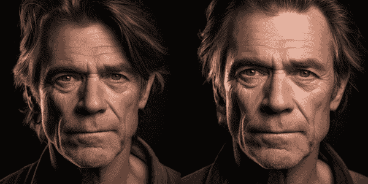

###### 图 8-21\. Midjourney 的一致人物

下一步是将其中一张图像进行上采样，然后在修复画布中用中途变化区域功能遮罩上采样图像的一半，如图 8-22 图所示。

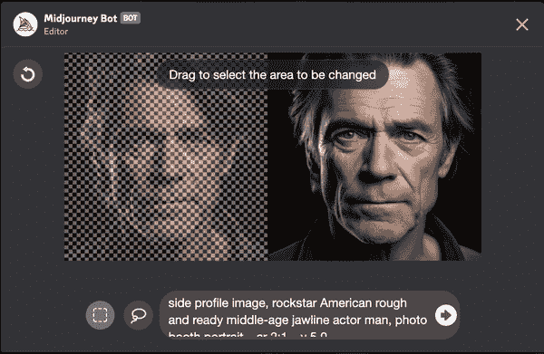

###### 图 8-22\. 中途变化区域

最后，使用修复或中途变化区域（在 Midjourney 中称为如此）重新提示遮罩部分的图像，以指定与原始肖像模式不同的角度。

输入：

```py
side profile image, rockstar American rough and ready
middle-age jawline actor man, photo booth portrait --ar 2:1
```

图 8-23 显示了输出。


###### 图 8-23\. 侧面轮廓中的一致人物

这种修复和生成过程可以针对多个角度重复进行，目的是找到与原始生成的图像看起来完全相同的新图像。因为图像的一半始终存在，模型在生成过程中保持人物特征的连续性，让你能够从不同的姿势和位置构建一个更全面的单一人物视角。你只需要用新的提示修复 2:1 图像的一半，并在 Photoshop（或等效软件）中裁剪它，就可以创建一个在新情境中的人物图像。

# 提供示例

许多人认为在提示修复时使用真实图像作为基线，但许多更高级的 AI 艺术家使用生成的图像作为输入，以保持对故事中人物或物体一致性的控制。

# 提示重写

当将 AI 系统投入生产时，你可能会遇到的一个问题是，你不能期望你的系统用户是专家提示工程师。这是一个垃圾输入，垃圾输出的案例：如果他们写了一个低标准的提示，他们将得到较差的结果，并抱怨你产品的质量。行业中的一个[常见技巧](https://oreil.ly/OirCS)是将提示重写以使其更好，并更有可能得到令人印象深刻的结果。这是一种*元提示*的形式，其中一个 AI 模型的提示由另一个 AI 模型编写。

想象一个简单的应用程序，用户输入一个主题和一个艺术家，然后生成一个以艺术家风格为主题的图像。提示模板是 `a {subject} in the style of {artist}`。

输入：

```py
a dachshund dog in the style of Banksy
```

图 8-24 展示了输出结果。

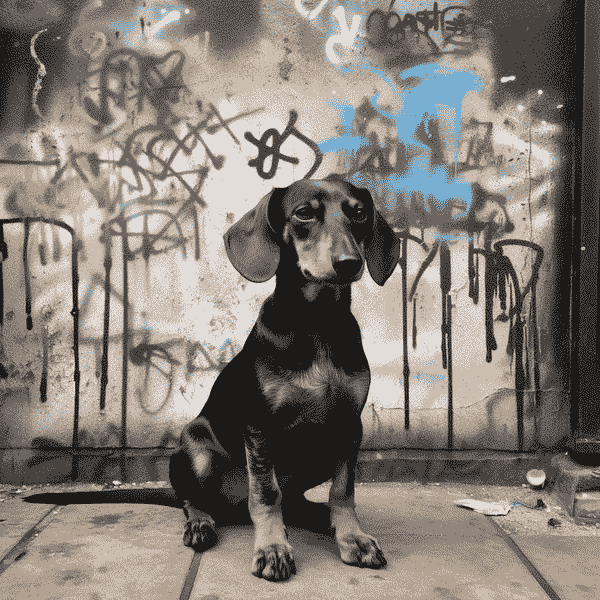

###### 图 8-24\. 以 Banksy 风格绘制的腊肠犬

这个提示的问题在于，预期狗将是街头绘画（Banksy 风格）的一部分，而实际上它在生成的图像中只是站在旁边。为了解决这个问题，你可以将用户提示注入到 ChatGPT 的提示中，以找到艺术家的媒介。

输入：

```py
What's the medium that the artist Banksy mostly used? Respond
in 1-3 words only.
```

输出：

```py
Street art
```

最后，你可以使用这个输出重写原始用户提示，格式为 `{medium} of a {subject} in the style of {artist}`。

输入：

```py
street art of a dachshund dog in the style of Banksy
```

图 8-25 展示了输出结果。


###### 图 8-25\. 以 Banksy 风格绘制的腊肠犬街头艺术

这个系统可以进一步扩展，包括其他提示工程技巧，如质量提升器或负面提示，以使结果更可靠。仅要求 ChatGPT 重写 DALL-E 的提示（ChatGPT Plus 作为工具提供）并使用它提供的内容用于其他模型是可能的。已经尝试过[训练 AI 模型](https://oreil.ly/9A1NL)，这些模型专门生成高质量的提示，但根据我们的经验，这种方法只能将质量提升到平均水平，并不能超越专家提示工程。

# 分工

而不是期望一个非技术人士提交一个高质量的提示，只需将他们的输入传递给另一个 AI 模型，以帮助改进原始提示。

# 网络迷因拆解

复制艺术家风格或模仿艺术运动的主要问题是它相对缺乏原创性。没有人知道 AI 艺术的法律影响将是什么，但肯定像 Greg Rutkowski 这样的艺术家和其他人已经对复制他们的风格表示了道德上的反对。

一种仍然可以获取引用成功艺术家或艺术运动快捷方式的好处，同时在你自己的风格上更加原创的方法是解包艺术家的梗。单词[*梗*](https://oreil.ly/BQYFP)不仅仅意味着*一个有趣的病毒图像*：它指的是任何从一个人复制到另一个人的文化信息。如果你能将一种艺术风格分解为其组成部分和特征，那么你可以使用这些子组件来混搭你自己的风格。比如说，如果你正在尝试以萨尔瓦多·达利的风格绘制时代广场的画作。

输入：

```py
a painting of Times Square in the style of "The Persistence
of Memory" by Salvador Dali
```

图 8-26 展示了输出结果。


###### 图 8-26. 以萨尔瓦多·达利的《记忆的持久性》风格绘制的时代广场画作

你已经通过提及达利的名字得到了不错的结果，但还不是完全正确。你想要一种超现实主义风格，但不是达利作品的精确复制。术语*解包*在这个背景下由[Bakz T. Future](https://oreil.ly/2qy4E)提出，意味着提取艺术家风格的特征，以获得既熟悉又独特的东西。它通过要求一个文本生成模型（在这种情况下是 ChatGPT-4）描述你模仿的艺术家风格来实现，然后你可以将其用作提示。

输入：

```py
Briefly describe the characteristics and artistic style of
"The Persistence of Memory" by Salvador Dali, without
mentioning the artwork or the artist:
```

输出：

```py
This is a notable example of Surrealist art, steeped in
dream-like, fantastical imagery that pushes the boundaries of
traditional understanding and interpretation. The painting is
composed with a distinctly precise and detailed technique,
reflecting a deceptive realism.

...

Contrasting with the melting objects, there are other items
in the scene that exhibit solidity and permanence, creating
an uncanny juxtaposition. The painting's composition and
imagery invite deep exploration and various interpretations,
concerning themes of reality, dreams, time, and the
subconscious. Overall, it is a visually striking work that
embodies the ethos of its movement: challenging the viewer's
perceptions and exploring the unconventional and the
irrational.
```

你必须确保提示中不提及艺术家或艺术品；否则，它的工作效果不会像提示那样好。你想要向从未见过它的人描述风格，以便描述清晰。为了参考，图 8-27 展示了 ChatGPT 正在描述的著名画作。


###### 图 8-27. 萨尔瓦多·达利的《记忆的持久性》

现在你已经描述了达利最标志性的画作之一，你可以理解是什么让它如此视觉上吸引人。特别是，这种解释在从未上过艺术学校并且否则不知道如何描述这些元素的情况下非常有用。从这里开始，你需要缩短描述以适应图像模型提示。

输入：

```py
Convert this description into a shortened prompt for an AI
image generation model such as DALL-E:
```

输出：

```py
Surrealist landscape with subdued colors of brown, blue, and
yellow. Depict a barren, craggy shoreline and calm sea
meeting a clear sky. Include amorphous, melting objects
resembling common items, indicating fluidity and impermanence
of time. Contrast these with other solid, permanent elements.
Evoke a sense of stillness, dreamlike atmosphere, and
quietude.
```

将这个输出与你的画作主题时代广场结合起来。修改提示以使其更流畅也有帮助，因为 ChatGPT 写的提示可能过于指导性：

输入：

```py
Painting of Times Square, surrealist landscape with subdued colors
of brown, blue, and yellow, a barren, craggy shoreline and calm
sea meeting a clear sky. Include amorphous, melting objects
resembling common items, indicating fluidity and impermanence
of time. Contrast these with other solid, permanent elements.
Evoke a sense of stillness, dreamlike atmosphere, and quietude.
```

图 8-28 展示了输出结果。


###### 图 8-28. 将解包的达利梗应用于时代广场的画作

# 给出方向

而不是引导 AI 图像模型走向特定艺术家的作品，你可以通过使用艺术家作品的描述来模仿一个接近的近似。这种方法比仅仅提及艺术家名字更具变革性和创造性，也许更加道德。

这张图像仍然与达利的作品相似，但它已经通过 ChatGPT 的描述进行了转换。因此，它已经比仅仅唤起他的名字更具有原创性：这比普通提示者有优势。但现在你处于更好的位置，因为你已经将达利的风格分解成单个*[梗](https://oreil.ly/BQYFP)]，如“超现实主义风景”、“熔化物体”和“梦幻般的氛围”，并且可以更容易地[混搭](https://oreil.ly/wPuMo)其组成部分，使图像更加独特：

输入：

```py
Painting of Times Square, surrealist landscape with subdued
colors of orange, red, and green, imposing buildings and calm
river meeting a stormy sky. The amorphous melting dripping
clock in the center of the square indicates the fluidity and
impermanence of time in contrast with other solid, permanent
elements. Evoke a sense of stillness, dreamlike atmosphere,
and quietude.
```

图 8-29 显示了输出。


###### 图 8-29. 达利时代广场混搭

你只对画中的颜色和元素进行了小幅修改，但你可以做得更多。你也可以从其他流行艺术家那里提取元素，结合你喜欢的方面，创造出新的东西。这种技术目前只适用于那些足够著名，可以从训练数据中轻松描述的艺术家和艺术品；然而，随着 AI 模型变得多模态（即能够生成图像和文本），你将能够输入一个图像并得到一个描述，用于解包。

# 梗映射

最常见的提示灵感来源之一是查看其他提示工程师使用并取得结果的提示。[Midjourney Discord 社区](https://oreil.ly/upQIh)拥有数百万活跃成员，每天自动生成并共享数千张新图像，其他 AI 社区也是如此，包括[Reddit](https://oreil.ly/EwLNh)以及各种其他网站、电子邮件通讯和社交媒体账户。一个常用的网站是[Lexica.art](https://lexica.art)，它拥有许多 Stable Diffusion 图像及其提示的搜索数据库（通过关键词和相似度）以供灵感参考。

在搜索和浏览这些灵感来源时，你可能会注意到特定类型图像所使用的词汇中存在重复的模式或梗。我们称这个过程为有意识地、系统地寻找这些模式的过程为[*梗映射*](https://oreil.ly/DLqAV)，这对于识别有用的提示非常有价值。例如，你可以在 Lexica 上搜索超级马里奥，看到许多人们尝试创建一个*逼真*的马里奥的例子，就像图 8-30 中的那样，这可能会激发你做同样的事情，[从已经证明有效的提示开始](https://oreil.ly/WNsRn)，从而节省大量时间。

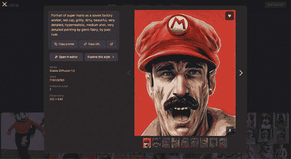

###### 图 8-30. 真实马里奥

或者，您可以将这个梗图应用到不同系列的角色上，并尝试重新利用其他人使用的部分提示以获得逼真的效果。如果不进行这项研究，您可能不会意识到图像模型可以生成卡通或游戏角色的现实世界版本，或者可能从未想过尝试。您可能从未偶然发现将“作为一个苏联工厂工人”包含在提示中可以帮助唤起一种粗糙的现实感，也可能从未遇到过两位艺术家所提及的作品。在 AI 艺术社区中有一个健康的内容混搭文化，人们从他人的提示中学习，然后通过分享自己的专业知识来传承。

输入：

```py
portrait of Homer Simpson as a Soviet factory worker, gritty,
dirty, beautiful, very detailed, hyperrealistic, medium shot,
very detailed painting by Glenn Fabry, by Joao Ruas --no
cartoon
```

图 8-31 显示了输出。

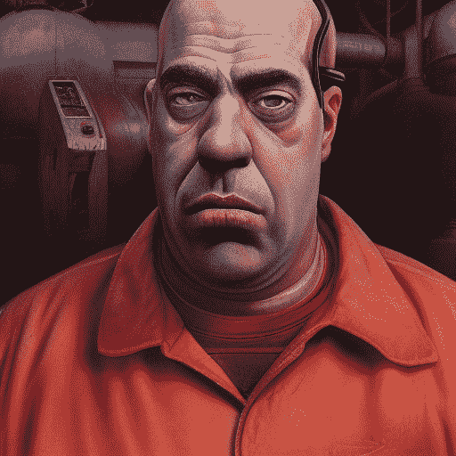

###### 图 8-31\. 真实的荷马辛普森

这个梗图映射过程可以[手动完成](https://oreil.ly/VqyG-)，例如将示例复制粘贴到电子表格或生产力工具 Notion 中，尽管这可能很耗时。只要您遵守网站的使用条款和条件以及您所在国家的任何法律义务，也可以编写自定义代码以编程方式抓取该网站的内容。一旦您将所有数据集中在一个地方，您就可以使用实体识别模型如[Google Vision](https://oreil.ly/EZmRs)、多模态模型如[GPT-4 Vision](https://oreil.ly/cOcPR)或对提示使用 NLP 如[NGrams 分析](https://oreil.ly/GXfDl)来识别比手动更大的规模上的模式。

# 提示分析

一个常见的错误是继续构建越来越长的提示，而没有考虑哪些提示部分是真正必要的。每个添加的单词都会以某种方式扰动模型，向结果输出添加噪声。通常，删除不必要的单词可以像添加新单词一样有效。为了不经过大量的试错来开展这项分析，Midjourney 提供了一个`/shorten`命令，该命令试图删除这些不必要的单词，只留下模型最关注的核心标记。点击响应底部的“显示详细信息”以获取标记级别的权重和可视化图表。

输入：

```py
portrait of Homer Simpson as a Soviet factory worker, gritty,
dirty, beautiful, very detailed, hyperrealistic, medium shot,
very detailed painting by Glenn Fabry, by Joao Ruas
--no cartoon
```

输出：

```py
**portrait** (0.08) of **homer simpson** (1.00) as a
**soviet** (0.19) **factory** (0.21) **worker** (0.08),
gritty (0.02), dirty (0.02), beautiful (0.00), very (0.00)
detailed (0.01), hyperrealistic (0.01), medium (0.00) shot
(0.00), very (0.00) detailed (0.01) painting (0.05) by Glenn
Fabry (0.08), by **Joao Ruas** (0.09)

██████████ homer simpson
██░░░░░░░░ factory
██░░░░░░░░ soviet
█░░░░░░░░░ portrait
█░░░░░░░░░ worker
█░░░░░░░░░ Joao Ruas
█░░░░░░░░░ Glenn Fabry
█░░░░░░░░░ painting
```

一旦您有了这项分析，您就可以用它来从提示中去除任何噪声，并聚焦于哪些单词或梗图对最终结果真正重要。

# 评估质量

看到模型为每个标记分配的权重，可以让你对模型的工作原理有前所未有的洞察。我们常常对提示中的哪些内容重要做出假设，而这些假设可能与现实相差甚远。

# 摘要

在本章中，你学习了使用扩散模型进行图像生成的标准实践。你探索了格式修饰符，如股票照片、油画和埃及象形文字，以及它们如何被用来创建独特且视觉上吸引人的图像。此外，你还发现了艺术风格修饰符，允许复制流行的艺术风格或艺术家，例如刘易斯·卡罗尔的《爱丽丝梦游仙境》风格。

你进一步深入到提示工程原则的应用，包括如何使用艺术风格修饰符来复制流行的艺术风格和艺术家，以及提及特定艺术家的名字如何有助于实现所需的视觉风格。介绍了负提示和加权术语的概念，允许你指定你不想在图像中出现的元素，并控制不同概念的混合。你还探索了修复和扩展的概念，其中图像的特定部分可以通过擦除和添加提示来分别生成。你发现了这些技术如何进一步扩展和组合，以增强生成式 AI 结果的可靠性和质量。

在下一章中，你将更深入地探索图像生成的世界，并探索更多高级用例。你将学习如何利用 Stable Diffusion 和 AUTOMATIC1111 的力量来提高你的图像生成技能。包括利用 ControlNet 模型等高级 Stable Diffusion 技术来更精确地控制图像的风格和构图，你将发现一系列令人兴奋的可能性。
