# 第九章：使用 Stable Diffusion 的高级图像生成技术

大多数与 AI 图像相关的工作只需要简单的提示工程技巧，但在你需要更多创意控制输出或想要为特定任务训练自定义模型时，有更多强大的工具可用。这些更复杂的能力通常需要更多的技术能力和结构化思维，作为创建最终图像的工作流程的一部分。

本章中所有图像均由 Stable Diffusion XL 生成，除非另有说明，例如在依赖于 ControlNet 等扩展的章节中，那里支持更多的旧版 v1.5 模型的方法。讨论的技术旨在可迁移到任何未来的或替代模型。我们广泛使用了 AUTOMATIC1111 的 Stable Diffusion WebUI，并提供了详细的设置说明，这些说明在撰写时是有效的，但请查阅[官方仓库](https://oreil.ly/hs_fS)以获取最新的说明，并诊断你遇到的问题。

# 运行 Stable Diffusion

Stable Diffusion 是一个开源的图像生成模型，因此如果你有 NVIDIA 或 AMD GPU，或者苹果的 M1、M2 或 M3 芯片，你可以在自己的电脑上免费运行它。最初流行的版本（1.4）通常在[Google Colab 笔记本](https://oreil.ly/OmBuR)中运行，它提供了访问云中免费 GPU 的途径（尽管如果谷歌限制了免费层，你可能需要升级到付费账户）。

如果你之前没有使用过，或者想要找到有关限制的最新信息，请访问[Google Colab 网站](https://oreil.ly/2WGxQ)。这本书的 Python 笔记本副本已保存在[GitHub 仓库](https://oreil.ly/uauNn)中，但你应该将其上传到 Google Drive，并在 Google Colab 中运行，以避免设置问题。

安装 Stable Diffusion 可以通过 Hugging Face diffusers 库以及一些依赖项来完成。在 Google Colab 中，以下代码安装了必要的依赖项（如果你在本地安装而不是在 Jupyter Notebook 或 Google Colab 中，则应删除感叹号(!)）：

```py
!pip install diffusers==0.11.1
!pip install transformers scipy ftfy accelerate
```

要下载和使用模型，你首先构建一个推理管道（当我们使用模型时运行的内容）：

```py
# create an inference pipeline
import torch
from diffusers import StableDiffusionPipeline

pipe = StableDiffusionPipeline.from_pretrained(
    "CompVis/stable-diffusion-v1-4",
    torch_dtype=torch.float16)

pipe = pipe.to("cuda")
```

让我们逐行分析脚本：

`import torch`

这行代码正在导入 torch 库，也称为[PyTorch](https://pytorch.org)。PyTorch 是一个开源的机器学习库，用于计算机视觉和自然语言处理等应用。

`from diffusers import StableDiffusionPipeline`

在这里，脚本正在从`diffusers`库中导入`StableDiffusionPipeline`类。这个特定的类可能是一个用于使用扩散模型的管道，其中 Stable Diffusion 是最受欢迎的例子。

`pipe = StableDiffusionPipeline.from_pretrained("CompVis/stable-diffusion-v1-4", torch_dtype=torch.float16)`

这是在创建一个具有预训练权重的 `StableDiffusionPipeline` 类的实例。`from_pretrained` 方法加载预训练模型的权重——在这种情况下，模型是 `CompVis/stable-diffusion-v1-4`。

`torch_dtype=torch.float16` 参数指定模型中使用的应该是 float16，这是一种半精度浮点格式。使用 float16 可以加快模型计算速度并减少内存使用（这对于保持在 Google Colab 免费层限制内是必要的）。

`pipe = pipe.to("cuda")`

这行代码将管道模型移动到 GPU 上。字符串 `"cuda"` 指的是 CUDA，这是由 Nvidia 创建的并行计算平台和应用编程接口 (API) 模型。通过这样做，管道模型执行的所有计算都将由 GPU 执行，这比在 CPU 上运行大型模型和数据要快得多。

现在我们有了我们的管道，我们可以传递一个提示和其他参数给模型，如随机种子（更改此值以每次得到不同的图像）、推理步骤的数量（更多的步骤需要时间但会产生更高质量的图像）和引导比例（图像与提示匹配的紧密程度）：

```py
# run inference on a prompt
prompt = "a photograph of an astronaut riding a horse"

generator = torch.Generator("cuda").manual_seed(1024)

image = pipe(prompt, num_inference_steps=50,
    guidance_scale=7, generator=generator
    ).images[0] # image here is in PIL format

# Now to display an image you can either save it such as:
image.save(f"astronaut_rides_horse.png")

# If you're in a google colab you can directly display:
image
```

图 9-1 展示了输出。

让我们逐步分析这个脚本，解释它做了什么：

`prompt = "a photograph of an astronaut riding a horse"`

这是将被传递到模型中以引导图像生成的提示。

`generator = torch.Generator("cuda").manual_seed(1024)`

在这一行中，创建了一个 PyTorch 生成器并将其分配给生成器变量。生成器使用 `"cuda"` 初始化，这意味着它将使用 GPU 进行计算。`manual_seed(1024)` 函数用于设置生成随机数的随机种子，以确保结果可重复。如果你用相同的模型运行此代码，你应该得到完全相同的图像。

`image = pipe(prompt, num_inference_steps=50, guidance_scale=7, generator=generator).images[0]`

这行代码在提示上运行管道模型以生成图像。`num_inference_steps` 参数设置为 50，意味着模型将执行 50 步推理。`guidance_scale` 参数设置为 7，这调整了提示引导生成的图像的强度（较高的值往往会导致图像颗粒化且多样性降低）。生成器参数传递了之前创建的随机数生成器。结果是生成图像的数组，`images[0]` 从这个数组中选择第一张图像。

`image.save(f"astronaut_rides_horse.png")`

这行代码将生成的图像保存到文件中。

`image`

这行代码将在代码运行在类似 Jupyter Notebook 或 Google Colab 的环境中时显示图像。这是因为这些环境会自动显示代码单元格中最后一行的结果，如果它没有被分配给变量。


###### 图 9-1. 骑马的宇航员照片

能够在本地或云中运行开源模型并对其进行定制以满足您的需求是非常强大的。然而，除非您是一个具有深厚机器学习知识的极高级用户，或者您的目的是构建自己的 AI 图像生成产品，否则自己编写推理管道和构建用户界面可能是过度杀鸡用牛刀。Stability AI 公司，它资助了 Stable Diffusion 的开发，有一个名为 Dream Studio 的托管 Web 界面(图 9-2)，它与 DALL-E 游乐场类似，也采用信用系统，并提供高级功能，如修复。

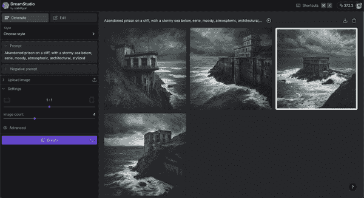

###### 图 9-2. Stability AI Dream-Studio

与 DALL-E 类似，Dream-Studio 通过 API 提供访问权限，这对于构建 AI 图像应用程序或运行生成大量图像的程序脚本来说非常方便，无需自己托管和运行 Stable Diffusion 模型。在创建账户后，请访问[*https://oreil.ly/X3Ilb*](https://oreil.ly/X3Ilb)以获取您的 API 密钥，并充值（截至撰写本文时，1,000 个积分花费 10 美元，可以生成大约 5,000 张图像）。以下代码包含在此书的[GitHub 仓库](https://oreil.ly/aGLeX)中：

```py
import os
import base64
import requests
from IPython.display import Image

engine_id = "stable-diffusion-xl-1024-v1-0"
api_host = os.getenv('API_HOST', 'https://api.stability.ai')
api_key = os.getenv("STABILITY_API_KEY")

image_description = "computers being tied together"
prompt = f"""an illustration of {image_description}. in the
style of corporate memphis, white background, professional,
clean lines, warm pastel colors"""

response = requests.post(
    f"{api_host}/v1/generation/{engine_id}/text-to-image",
    headers={
        "Content-Type": "application/json",
        "Accept": "application/json",
        "Authorization": f"Bearer {api_key}"
    },
    json={
        "text_prompts": [
            {
                "text": prompt,
            }
        ],
        "cfg_scale": 7,
        "height": 1024,
        "width": 1024,
        "samples": 1,
        "steps": 30,
    },
)

if response.status_code != 200:
    raise Exception(
        "Non-200 response: " + str(response.text))

data = response.json()

image_paths = []

# if there's no /out folder, create it
if not os.path.exists("./out"):
    os.makedirs("./out")

for i, image in enumerate(data["artifacts"]):
    filename = f"./out/image-{i}.png"
    with open(filename, "wb") as f:
        f.write(base64.b64decode(image["base64"]))

    image_paths.append(filename)

# display the first image
Image(filename=image_paths[0])
```

图 9-3 显示了输出结果。


###### 图 9-3. Dream-Studio API 的 Memphis 公司插图

让我们逐步分析这段代码：

1.  首先，设置所需的环境变量：

    +   `engine_id`：这指的是`stability.ai`上的特定模型版本。

    +   `api_host`：这从环境变量中检索 API 主机 URL。如果没有设置，则默认为`'https://api.stability.ai'`。

    +   `api_key`：这从环境变量中检索 API 密钥。

1.  `prompt`：这定义了图像的外观，包括风格和颜色。

1.  向由`api_host`和`engine_id`派生的 URL 发出`POST`请求。

    +   请求的标头设置为接受和发送 JSON 数据，并包含带有`api_key`的授权标头。

    +   请求的 JSON 主体指定了提示（图像描述）、图像的期望比例、其尺寸、样本数量和步骤数量。

1.  如果响应的状态码不是 200（表示请求成功），则会抛出一个异常，并带有响应文本以指示出了问题。否则，响应将被解析为 JSON 格式。

1.  如果没有名为*out*的目录，则会创建一个。对于响应中的每个工件（图像），代码执行以下操作：

    +   设置文件名路径。

    +   解码响应中的 base64 编码的图像数据。

    +   将解码的图像数据写入文件。

    +   将文件的路径追加到`image_paths`列表中。

    +   这通常是您将图像保存到[Google Cloud Storage](https://oreil.ly/YsuBw)或 Amazon Simple Storage Service (S3)的位置，以便稍后在您的应用程序中显示。

1.  从`image_paths`列表中的第一张图像（在这种情况下是唯一一张）使用`IPython.display`中的`Image`类显示（仅在 Jupyter Notebooks 或 Google Colab 中）。

使用 Stability AI 服务的缺点是缺乏对定制的控制。稳定扩散作为开源项目的一个巨大好处是能够修改模型的几乎任何方面，并利用社区构建的高级功能。此外，不能保证您今天依赖的函数或特性在未来仍然存在，因为 Stability AI 努力满足投资者的期望、法律团队和公司客户的需求。例如，流行的（更宽容的）1.5 版本模型已被弃用，转而使用新的稳定扩散 2.0 和 XL 模型，这给那些已经精心调整了他们的工作流程、参数和提示以与 v1.5 版本协同工作的人带来了问题。

# AUTOMATIC1111 网页用户界面

稳定扩散的重度用户通常推荐使用[AUTOMATIC1111](https://oreil.ly/r-2vm)（发音为“automatic eleven eleven”）网页用户界面，因为它功能丰富，并附带由稳定扩散高级用户构建的多个扩展。这个项目是利用稳定扩散最佳特性的门户：一个投入了无数小时来整合高级功能到工具中的充满活力的开源社区。高级用户还可能想要探索[ComfyUI](https://oreil.ly/LWVvC)，因为它支持更高级的工作流程和更高的灵活性（包括[图像到视频](https://oreil.ly/dh7jR)），但我们认为这对于大多数用例来说过于复杂，这些用例可以很容易地由 AUTOMATIC1111 处理。

您可以使用正常的文本到图像稳定扩散模型，也可以运行图像到图像（类似于 Midjourney 的基础图像功能），以及提升完成图像以获得更高的质量，以及修复（如 DALL-E 提供）。甚至可以在该界面中训练和运行自定义模型，社区如[Hugging Face](https://oreil.ly/t5T7p)和[Civitai](https://civitai.com)上共享了数千个模型。

###### 警告

一些自定义开源模型可能不适合工作环境（NSFW），所以在浏览像 Civitai 这样的网站时要小心。

使用 AUTOMATIC1111 在本地运行稳定扩散需要一些技术设置，最好在 AUTOMATIC1111 Wiki 中查找最新的指南：

+   [在 NVidia GPU 上安装和运行](https://oreil.ly/DsKyU)

+   [在 AMD GPU 上安装和运行](https://oreil.ly/Oc7ix)

+   [在 Apple Silicon 上安装和运行](https://oreil.ly/Ob2VK)

安装通常涉及确保您已安装 Git 和 Python（以及任何其他 [依赖项](https://oreil.ly/vBOVI)），并下载 Stable Diffusion，以及将 Automatic1111 [代码](https://oreil.ly/x0BMn)下载到您的本地计算机。本章中的图像使用的是 Stable Diffusion 的 [XL 1.0 版本](https://oreil.ly/DIvUz)，尽管许多人仍然使用较旧的 [版本 1.5](https://oreil.ly/FNxf9)，因为它被认为更宽容，并且拥有丰富的自定义社区训练模型。这些技术在各个模型中都是通用的，尽管结果和品质会有所不同：普遍认为，从版本 2.0 的训练数据中移除 NSFW 图像导致了生成（即使是非显性）逼真人物图像的性能下降（尽管在 XL 版本中这似乎得到了很大程度的纠正）。

由于该模型是开源的，您可以通过访问基础和精炼模型的 Hugging Face 模型页面，并从“文件和版本”标签下载 *.safetensors* 文件，在您的本地计算机上获取 SDXL v1.0。这种格式比之前的 *.ckpt* 文件格式更安全，因为它在运行时不会在您的计算机上执行代码：

+   [基础模型](https://oreil.ly/wtHRj): *sd_xl_base_1.0.safetensors*

+   [精炼模型](https://oreil.ly/0Dlbv): *sd_xl_refiner_1.0.safetensors*

这些模型需要时间下载，所以现在就开始下载它们，一旦安装了 AUTOMATIC111 接口，您就可以将它们放入 models/Stable-diffusion 文件夹中。如果您想使用较旧的 v1.5 Stable Diffusion 模型，请从 [Hugging Face](https://oreil.ly/hwblq) 下载 *v1-5-pruned-emaonly.ckpt* 文件，并将其移动到放置基础和精炼模型的文件夹中。

一旦安装完毕，可以通过运行一个本地启动应用程序的脚本来访问 Web 界面，该应用程序将显示为浏览器中的 Web 地址。以下是一个示例，适用于具有 Nvidia GPU 的 Windows 计算机（在撰写本文时）：

1.  安装 [Python 3.10.6](https://oreil.ly/kGiyi)（选择添加到 PATH）和 [Git](https://oreil.ly/Pdzb0)。

1.  从搜索栏打开命令提示符，并输入 `**git clone [*https://github.com/AUTOMATIC1111/stable-diffusion-webui*](https://github.com/AUTOMATIC1111/stable-diffusion-webui)**`。

1.  记得将 sd_xl_base_1.0.safetensors 和 sd_xl_refiner_1.0.safetensors 模型移动到 stable-diffusion-webui/models/Stable-diffusion 文件夹。

1.  双击 *webui-user.bat* 文件，访问界面正在运行的地址（通常是 *[*http://127.0.0.1:7860*](http://127.0.0.1:7860)*）。对于 Mac 或 Linux，您需要在终端中运行 `bash webui.sh`。

从这个界面，如图 图 9-4（来自官方 [GitHub 仓库](https://oreil.ly/OOpas)），您可以输入您的提示（在“txt2img”标签下，左上角）并点击生成以获取您的图像。

如果您遇到错误，或者您之前下载了 AUTOMATIC1111 网页 UI 并需要更新它，您可以在终端中进入稳定扩散网页 UI 文件夹并运行 `git pull`。如果您遇到错误，您可以通过在稳定扩散网页 UI 文件夹中运行 `git checkout -f master` 来重置您的实现（首先移动您想要保存的任何文件）。

###### 警告

以这种方式重置 AUTOMATIC1111 将会删除文件夹中的所有文件，包括任何自定义设置。我们建议您在不同的文件夹中创建本地副本以备恢复。


###### 图 9-4\. 稳定扩散网页 UI

提示输入框正下方的框中，您可以添加负面提示以从图像中移除概念并确保它们不会显示（有关负面提示的更多信息，请参阅第八章）。下面，您会发现一些设置，包括种子（设置为 -1 以每次生成新图像），采样（推理）步骤数，批次计数（依次运行的生成数量），以及批次大小（每个批次中处理的图像数量，这需要更高的 VRAM）。当图像生成时，您可以直接从界面下载它们，使用下面的按钮将它们发送到各种标签页，或者访问稳定扩散网页 UI 的输出文件夹，其中它们按方法（`text2img`，`img2img`）和日期组织：

```py
stable-diffusion-webui/
    outputs/
        txt2img-images/
            2023-10-05/
                your_image.png
```

当您运行 AUTOMATIC1111 网页 UI 时，您下载的任何模型都将出现在顶部稳定扩散检查点下拉菜单中。选择基础模型，并像平常一样输入您的提示以及调整您的设置。确保您将图像大小设置为 1024x1024。目前，将细化选项下的“切换至”参数设置为 `1` 以仅运行基础模型，如图 9-5 所示。

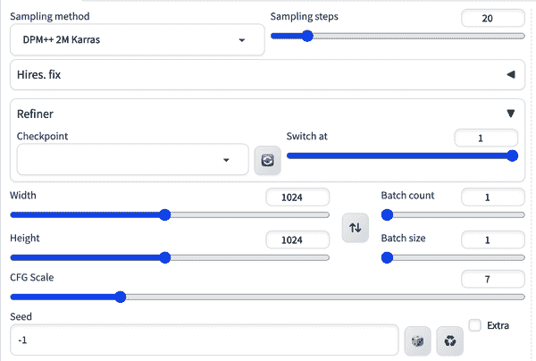

###### 图 9-5\. SDXL 的标准设置

可用的采样方法相对复杂且难以解释，但权衡通常在速度、质量和随机性之间。`Euler` 是最简单的采样器，`DDIM` 是第一个专门为扩散模型设计的。名称中带有 *a* 的采样方法，例如 `Euler a`，是祖先采样器，它们在过程中将噪声注入图像。这会导致结果的可重复性较低，因为图像不会收敛（每次运行模型时图像都有一些随机性）。运行 20-30 步的 `DPM++ 2M Karras` 和 `UniPC` 采样器是稳健、稳定和可重复图像的优秀选择。对于更高质量但速度较慢且更随机的图像，尝试使用 10-15 步的 `DPM++ SDE Karras` 或 `DDIM` 采样器。

另一个重要的参数是 CFG Scale（分类器自由指导——与在稳定扩散推理 Google Colab 示例中引入的 `guidance_scale` 相同）。作为一个经验法则，以下是 CFG Scale 的常见值及其对应的含义：

+   *1*: 主要忽略提示。

+   *3*: 随意发挥创意。

+   *7*：提示和创造力之间的良好平衡。

+   *15*：遵守提示。

+   *30*：严格遵循提示。

您可以通过高度和宽度来更改生成的图像大小，以及使用批量计数来设置图像数量。高分辨率修复复选框使用上采样器生成更大的高分辨率图像（关于这一点稍后会有更多介绍），修复面部缺陷复选框使用面部修复模型（默认为`Codeformer`）来修复 Stable Diffusion 经常出现的人脸缺陷，而平铺复选框创建一个可以重复平铺的图像。还有保存和插入您希望定期重用的提示样式的功能。在不同的标签页中有很多[强大功能](https://oreil.ly/MiSt1)，以及您可以添加的社区构建扩展，随着可用性的增加，还会添加更多。

AUTOMATIC1111 支持提示权重，或加权术语，类似于 Midjourney（在第八章中介绍）。访问它们的方式略有不同，因为在 Midjourney 中不是通过双冒号分隔，而是使用括号。例如，`(pirate)` 会通过 10%或 1.1 的权重强调海盗特征，而双括号 `((pirate))` 会再次乘以它，因此权重将是 1.1 x 1.1 = 1.21。您还可以通过输入自己的数字（形式为（keyword: factor））来精确控制权重，例如 `(pirate: 1.5)`，让模型对那些标记给予 50%更多的关注。

输入：

```py
Marilyn Monroe as a (pirate:1.5) on a desert island, detailed clothing,
by Stanley Artgerm Lau and Alphonse Mucha
```

负面：

```py
racy, nudity, cleavage
```

图 9-6 展示了输出结果。


###### 图 9-6\. 玛丽莲·梦露海盗

方括号 `[pirate]` 以相反的方式工作，通过减少 10%的权重来降低提示中一个术语的强调。例如，`[hat]` 就相当于权重为 0.9，或者`(hat:0.9)`。注意，这与负面提示不同，因为该术语仍然会出现在图像生成中，只是被降低强度。提示权重在负面提示框中也同样有效，作用是更积极地从图像中移除该概念或减少其影响。这可以用来确保当负面提示不足以排除时，不希望出现的元素或风格不会出现。

# 给出方向

在提示中给予特定词语或部分更多或更少的强调，可以使你对模型关注的细节有更精细的控制。

AUTOMATIC1111 的高级用户使用的一种更高级的技术是*提示编辑*，也称为*提示切换*。在扩散过程中，早期步骤从随机噪声移动到模糊的轮廓，这是预期图像中可能出现的形状，然后在填充最终细节之前。提示编辑允许你在扩散过程的早期或后期步骤传递不同的提示，给你更多的创意控制。语法是 `[from:to:when]`，其中`from`是你的起始提示，`to`是你的结束提示，`when`是切换的时间，用步数或表示百分比的十进制数表示。提示 `[艾玛·沃森: 安伯·赫德: 0.5]` 将开始生成艾玛·沃森的图像，然后在中间切换到在最后一帧上生成安伯·赫德的图像，最后以两位女演员的混合结束。这是一个有用的技巧，可以创建看起来吸引人且模糊熟悉的人物图像，而不被识别为任何特定的名人，因此可能比简单地复制名人的形象更道德、更合法（寻求你自己的法律咨询）：

输入：

```py
vogue fashion shoot of [Emma Watson: Amber Heard: 0.5],
highly realistic, high resolution, highly detailed,
dramatic, 8k
```

图 9-7 显示了输出。


###### 图 9-7\. 艾玛·沃森和安伯·赫德混合

# 提供方向

提示编辑是一种深入扩散模型实际工作原理的高级技术。如果你知道自己在做什么，并且愿意经历足够的试错，干扰哪些层对哪些概念做出响应可以导致非常富有创意的结果。

如果你想让模型在两个概念之间交替，语法是 `[艾玛·沃森 | 安伯·赫德]`，这将使每次切换，最终得到更混合的混合。尽管它被视为一种黑暗的艺术，但提示编辑有许多高级用途。在某些情况下，专家报告说能够绕过困难的生成，例如先生成模型容易生成的简单内容，然后再切换到最终细节阶段真正需要的内容。在实践中，我们发现这种技术用途有限，但你应该进行实验，看看你能发现什么。

# Img2Img

AUTOMATIC1111 的 Web 界面支持`Img2Img`(图 9-8)，这是 Midjourney 提交图像与提示的功能等效。通过上传图像作为模型使用的指导，它赋予你更多控制结果图像的风格和构图。为了使用`Img2Img`获得良好的结果，尝试使用`Euler`采样，50 个采样步骤，以及高于常规的 CFG 比例 20 到 30。

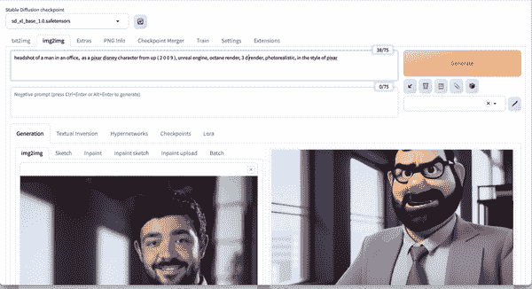

###### 图 9-8\. Img2Img

参数与正常的`Text2Image`模式相同，增加了*去噪强度*，它控制生成过程之前添加到你的基础图像中的随机噪声量。0 的值将添加零噪声，所以你的输出将看起来与你的输入完全一样，而 1 的值将完全用噪声替换你的输入（功能上与使用`Text2Image`相同）。通常，你需要与提示中的单词一起实验不同的去噪强度、CFG 比例和种子值的组合。以下图图 9-9 中的示例仅为了乐趣创建了一个皮克斯风格的字符：我们不建议在提示中使用受保护的知识产权进行商业用途。

输入：

```py
headshot of a man in an office,  as a Pixar Disney character
from Up ( 2 0 0 9 ), unreal engine, octane render, 3 d
render, photorealistic, in the style of Pixar
```

图 9-9 显示了输出。

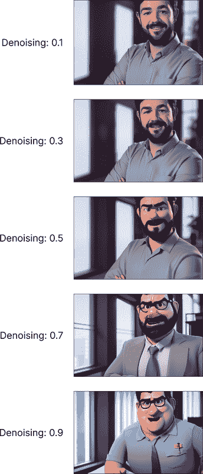

###### 图 9-9. 不同去噪强度值对图像的影响

如果你想在 AUTOMATIC1111 中测试一个参数的许多不同值并生成如图图 9-9 所示的网格，这是在底部的脚本下拉菜单中支持的，你可以选择 X/Y/Z 图并选择最多三个参数来生成多个值。例如，你也可以尝试调整 CFG 比例来查看它与去噪的交互。图图 9-10 显示了如何选择去噪强度参数的多个值。当你点击生成按钮时，将生成一个图像网格，你可以在方法（即`Text2Image`或`Img2Img`）和今天的日期下的输出文件夹中找到填充网格的每个单独的图像。


###### 图 9-10. 去噪参数的 X/Y/Z 图

# 评估质量

生成许多不同参数组合或值的网格是本地运行 Stable Diffusion 的一个强大优势。尽管生成大量图像可能需要时间，但这是视觉上准确识别参数的作用以及质量最佳点的最佳方式。

如果你忘记了生成图像时使用的设置或提示，AUTOMATIC1111 会将这些信息作为每个生成的图像上的元数据保存。你可以访问 PNG 信息标签页(图 9-11)来读取这些元数据，无论何时需要。这也适用于从网络界面的其他用户那里获取的图像，但前提是他们已经在一个不会删除此元数据的网站上发布了图像。

调整大小模式选项用于确定当你上传一个与基础图像尺寸不匹配的图像时会发生什么，例如从 1000 × 500 到 512 × 512，无论是通过仅调整大小来调整纵横比，还是通过裁剪和调整大小来裁剪图像的一部分以保持正确的纵横比，或者通过调整大小和填充来添加噪声以填充图像，或者通过仅调整大小（潜在上采样）来生成新尺寸的图像。


###### 图 9-11. PNG 信息标签页

# 图像上采样

在 AUTOMATIC1111 的 Img2Img 标签页中，也有将图像提升到更高分辨率的选项，就像你在 Midjourney 中可以做到的那样，但具有更多的控制。上传你的图像，并在提示框中添加一个通用的提示，例如`高度详细`。这是必要的，因为提升器通过将图像分割成瓦片，扩展以在瓦片之间产生间隙，然后使用提示和周围像素的上下文来*填充*这些间隙。向下滚动到底部的脚本，并选择 SD Upscale 脚本，然后选择一个提升器(图 9-12)。

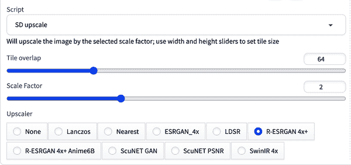

###### 图 9-12. SD Upscale 界面

通常我们发现 R-ESRGAN 4x+提升器是一个好的默认选择，但有时这可能会给图像带来卡通般的质感，如图 9-12 中的草地所示。如果你没有得到好的结果，有[更多模型](https://openmodeldb.info)可供测试。当你下载一个新的模型（一个*.pth 文件）时，你只需将其放置在 ESRGAN 文件夹中，然后重新启动 Web 界面，它们就会出现（在你的终端中）。你也可以通过修改提示来获得良好的提升效果，尤其是如果你丢失了一些细节或风格变化过多。然而，不建议使用你的原始提示，因为这会在每个瓦片中产生将相同图像修复的奇怪效果。为了展示更广泛的质量差异，我们使用了 v1.5 模型来生成原始图像（SDXL 创建的图像是 4 倍更大，质量更高，因此提升的需求较少）。

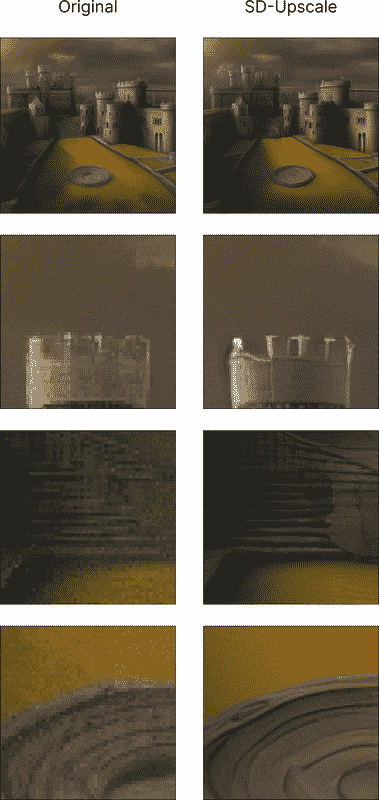

###### 图 9-13. 提升对图像部分的影响

# 指定格式

如果你打算在现实世界中使用你生成的图像，通常你无法仅使用低分辨率的 512 x 512 的正方形图像。使用提升技术，你可以生成任何尺寸和所需分辨率的图像。

与所有 Stable Diffusion 的事物一样，实验是很有帮助的，但我们推荐使用高步骤数（150-200+），CFG 比例 8-15，去噪强度 0.1-0.2 以保持基础图像完整。你可以点击生成来获取生成的提升图像（512 x 512 变为 1024 x 1024），然后你可以下载更高分辨率的图像，或者点击发送到 Img2Img 并再次点击生成来将图像大小加倍。由于多个瓦片生成和大量采样步骤，这个过程可能需要相当长的时间，大约在 M2 MacBbook Air 上需要 10-30 分钟。

# 询问 CLIP

在 Img2Img 标签页中，CLIP 嵌入模型（也被 Stable Diffusion 使用）在 Interrogate CLIP 按钮（在某些版本中显示为回形针）中实现，这允许你从图像中逆向工程提示，类似于第八章中介绍的 Midjourney 的 Describe 功能，第八章。一旦点击按钮并运行脚本，提示将出现在你的提示框中（图 9-14）。


###### 图 9-14\. Interrogate CLIP

输出：

```py
a painting of a woman in a pirate costume on the beach
with a pirate hat on her head and a pirate ship in the background,
a fine art painting, Chris Rallis, fantasy art, stanley artgerm lau
```

# SD 修复和扩展

Img2Img 也支持修复和扩展，并提供了一个简单的画布工具来创建遮罩。要使用修复或扩展，请点击 Img2Img 标签页中的 Inpaint 子标签页并上传你的图像。建议使用特定的修复模型以获得更好的结果，你可以通过[下载](https://oreil.ly/s_trl) *sd-v1-5-inpainting.ckpt* 文件并将其移动到你的 Models > Stable-Diffusion 文件夹中来安装。重新启动界面；模型应该出现在左上角的下拉菜单中。画布允许你使用画笔移除图像的部分，就像在 DALL-E 中一样（参见第八章），大小可调，以便进行精细控制。在图 9-15 中，城堡庭院中央的石头圆圈已被移除。


###### 图 9-15\. Img2Img 中的修复画布

对于 DALL-E 通常给出的建议，它也支持修复，是使用你的提示来描述整个图像，而不仅仅是修复区域。这是一个好的默认设置，应该首先尝试。确保将 Inpaint area 设置为*Whole picture*而不是*Only masked*，否则它将尝试将整个场景拟合到遮罩区域（不用担心，即使你选择*Whole picture*，它也只会在你遮罩的区域上绘画）。如果原始图像是 AI 生成的，还可以帮助将 Seed 从原始图像中携带过来。然而，根据我们经验，添加或更改提示以包括你想要修改或修复的区域的具体信息通常会得到更好的结果。至少，你应该更改提示的主题；例如，在图 9-15 中，提示从`castle`更改为`statue`，因为我们想要在庭院中出现雕像。你也可以尝试只提示填充区域，但这可能会得到一个在风格上不全局一致的图像。

输入：

```py
statue of a king, texture, intricate, details, highly
detailed, masterpiece, architecture, building, trending on
artstation, focus, sharp focus, concept art, digital
painting, fantasy, sunny, day, midday, in the style of
high fantasy art
```

图 9-16 显示了输出结果。

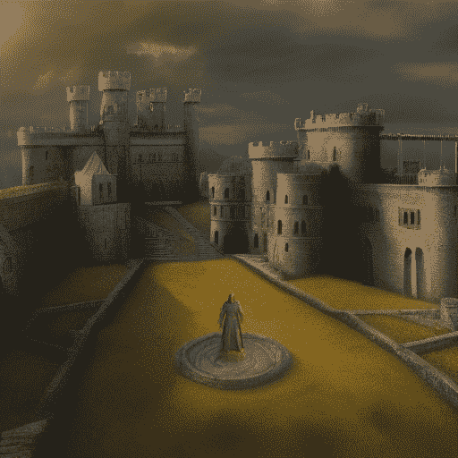

###### 图 9-16\. 向图像中添加雕像的修复

# 提供方向

修复功能之所以强大，是因为它赋予了你控制权。能够隔离图像的某个部分并给出详细的修复指示，使你拥有更高效的流程，而不会影响图像的其他部分。

如果是对修复区域的微小调整，请使用“原始”作为遮罩内容选项，并使用 0.2 到 0.4 的降噪强度。如果您需要完全替换图像中的某个元素，可能需要使用潜在噪声选项，降噪强度可高达 0.8，尽管任何超过 0.4 的情况都可能导致图像中出现全局不一致的元素和幻觉，因此可能需要花费时间迭代以达到满意的效果。填充选项也很有用，因为它匹配周围区域的颜色。如果您在修复区域的边缘看到难看的缝隙，可以增加遮罩模糊度，但通常默认的 4 已经足够好。修复是一个迭代的过程。我们建议一次修复一个问题或瑕疵，应用尽可能多次，并尝试不同的参数，直到对最终图像满意。

Outpainting 在 AUTOMATIC1111 中与 Midjourney 中的工作方式不同（见第八章），Midjourney 具有指定 1.5 倍或 2 倍缩放或自定义宽高比的能力。相反，在 AUTOMATIC1111 中，outpainting 是通过向下滚动到脚本下拉菜单并选择“穷人的扩展”来实现的。您需要将调整大小模式设置为调整大小，并在 Img2Img Inpaint 标签中填写，并设置一个相对较高的降噪强度以使其工作。此扩展允许您扩展图像不同侧面的像素，同时像通常为要修复的这些侧面的缝隙设置遮罩内容和遮罩模糊参数一样设置。

图 9-17 展示了输出结果。


###### 图 9-17\. Img2Img 中的扩展

如图 9-17 所示，添加到天空中的额外城堡增加了幻觉的可能性，并且质量可能较低。通常需要大量的实验和迭代才能正确完成这个过程。这与早期采用生成式 AI 的用户在 Photoshop 中在照片两侧添加额外空白空间，然后在 Stable Diffusion 中修复以匹配图像其余部分的技术类似。这种技术本质上只是增加了额外步骤的修复，因此所有之前列出的建议都适用。这比使用 AUTOMATIC1111 的扩展功能更快，因为扩展功能的图像质量较差，并且没有合适的画布。

# ControlNet

使用提示和 Img2Img 或基础图像，可以控制图像的风格，但通常图像中人物的姿态、场景的构图或物体的结构在最终图像中会有很大的差异。ControlNet 是一种为图像生成模型如 Stable Diffusion 进行输入图像条件化的高级方法。

它允许你通过边缘检测、姿态、深度等多种技术获得对最终图像生成的更多控制。你上传一个想要模仿的图像，并使用预训练模型选项之一处理图像，以便与你的提示一起输入，从而得到不同风格的匹配图像组成（图 9-18，来自 [ControlNet 论文](https://oreil.ly/suOJz)）。

所说的 ControlNet 实际上是一系列在论文“Adding Conditional Control to Text-to-Image Diffusion Models”([Zhang, Rao, and Agrawala, 2023](https://oreil.ly/ZH-Ow))之后发布的 [开源模型](https://oreil.ly/E-bjw)。虽然你可以用 Python 编写代码并为其构建自己的用户界面，但最快、最简单的方法是通过 AUTOMATIC1111 的 [ControlNet](https://oreil.ly/Dw2rs) 扩展程序来启动。截至写作时，并非所有 ControlNet 方法都适用于 SDXL，所以我们使用 Stable Diffusion v1.5（确保你使用与 Stable Diffusion 版本匹配的 ControlNet 模型）。


###### 图 9-18\. ControlNet Stable Diffusion 与 canny 边缘图

你可以按照以下说明安装扩展程序：

1.  导航到“扩展”标签并点击标有“可用”的子标签。

1.  点击“从 URL 加载”按钮。

1.  在搜索框中输入 `**sd-webui-controlnet**` 以查找扩展程序。

1.  在最右侧的操作列中点击“安装”。

1.  Web UI 现在将下载必要的文件并在你的本地 Stable Diffusion 版本上安装 ControlNet。

如果你遇到执行前面步骤的问题，可以尝试以下替代方法：

1.  导航到“扩展”标签并点击“从 URL 安装”子标签。

1.  在 Git 仓库的 URL 字段中，粘贴扩展程序的链接：[*https://github.com/Mikubill/sd-webui-controlnet*](https://github.com/Mikubill/sd-webui-controlnet)。

1.  点击“安装”。

1.  WebUI 将下载并安装 ControlNet 所需的文件。

现在你已经安装了 ControlNet，从终端或命令行重新启动 AUTOMATIC1111，或者访问设置并点击“应用并重启 UI”。

扩展程序将出现在你为 Stable Diffusion 获得的正常参数选项下方，在一个手风琴标签中（图 9-19）。你首先上传一个图像，然后点击“启用”，在选择了你想要使用的 ControlNet 预处理器和模型之后。如果你的系统 VRAM（视频随机访问内存）少于 6 GB，你应该勾选“低 VRAM”框。根据任务的不同，你可能想要尝试多种模型并调整这些模型的参数，以查看哪种能得到结果。

控制权重类似于提示权重或影响，类似于在括号中放置带权重的词语 `(提示词语: 1.2)`，但对于 ControlNet 输入。起始控制步骤和结束控制步骤是 ControlNet 在扩散过程中应用的时间，默认情况下从开始到结束（0 到 1），类似于 `[提示词语::0.8]`（从开始应用此部分提示，直到完成总步骤的 80%）。由于图像从较大的元素扩散到更精细的细节，通过控制 ControlNet 在该过程中的应用位置，你可以实现不同的结果；例如，移除最后 20% 的步骤（结束控制步骤 = 0.8）可能会让模型在填充更精细的细节时拥有更多的创造力。预处理分辨率也有助于在此处保持控制，确定中间图像处理步骤中有多少精细细节。一些模型有自己的独特参数，例如 Canny 低阈值和高阈值，它们决定了哪些像素构成 *边缘*。最后，控制模式决定了模型相对于你的提示跟随 ControlNet 输入的程度。

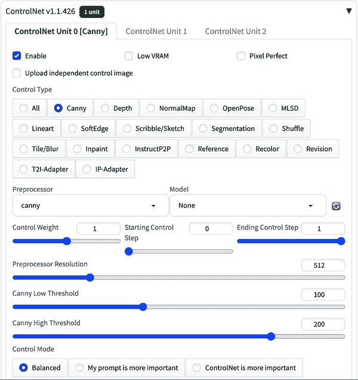

###### 图 9-19\. AUTOMATIC1111 中的 ControlNet 扩展界面

当你首次安装 ControlNet 时，你将没有任何已下载的模型。为了使它们在下拉菜单中显示，你应该通过从 [模型页面](https://oreil.ly/csYK_) 下载并然后将它们放入 Models > ControlNet 文件夹中来安装它们。如果你不确定要尝试哪个模型，可以从 [Canny 边缘检测](https://oreil.ly/z9XC6) 开始，因为它是最通用的。每个模型相对较大（大约几吉字节），因此只下载你计划使用的模型。以下是一些常见模型的示例。本节中所有图像均使用 `DPM++ SDE Karras` 样本器生成，CFG 尺度为 1.5，控制模式设置为平衡，调整模式设置为裁剪和调整大小（上传的图像被裁剪以匹配生成图像的尺寸，512 × 512），以及 30 个采样步骤，每个 ControlNet 模型的默认设置。由于并非所有这些 ControlNet 模型在撰写本文时都适用于 Stable Diffusion XL，因此使用了 Stable Diffusion 的 1.5 版本，但技术应可在模型之间迁移。

Canny 边缘检测在对比度高的区域周围创建简单的、尖锐的像素轮廓。它可以非常详细，并给出优秀的结果，但也可以捕捉到不需要的噪声，并将过多的图像控制权交给 ControlNet。在需要将高度详细的信息转移到具有不同风格的新的图像中时，Canny 表现优秀，应作为默认选项使用。例如，以特定风格重新绘制城市天际线与 Canny 模型配合得非常好，就像我们在图 9-20 中用纽约市（由[Robert Bye](https://oreil.ly/wEPLB)在[Unsplash](https://oreil.ly/_iyxU)上提供）的图片所做的那样。

输入：

```py
New York City by Studio Ghibli
```

图 9-20 展示了输出。


###### 图 9-20\. ControlNet Canny

有时在传统的 img2img 提示中，图像的一些元素可能会混淆或合并，因为 Stable Diffusion 不理解这些物体之间的相对深度。深度模型基于图像创建一个深度图估计，这提供了对图像元素构图和空间位置的掌控。如果你不熟悉深度图，白色区域更靠近观察者，而黑色区域更远。这可以在图 9-21 中看到，其中一支乐队（由[Hans Vivek](https://oreil.ly/tlCrf)在[Unsplash](https://oreil.ly/BOKJ7)上提供）的图片被转换成具有相同位置和深度的士兵图像。

输入：

```py
US military unit on patrol in Afghanistan
```

图 9-21 展示了输出。


###### 图 9-21\. ControlNet 深度

正常模型创建了一个映射估计，该估计作为一个图像中物体的 3D 模型。红色、绿色和蓝色被 3D 程序用来确定一个物体是平滑的还是凹凸不平的，每种颜色对应一个方向（左右、上下、近远）。然而，这只是一个估计，因此在某些情况下可能会产生意想不到的后果。这种方法在需要考虑更多纹理和光照时表现优秀，但在面部的情况下有时会提供过多的细节，从而限制了输出的创造性。在图 9-22 中，一位弹奏键盘的女士（由[Soundtrap](https://oreil.ly/RP1Ei)在[Unsplash](https://oreil.ly/I3QGY)上提供）被带回到*伟大的盖茨比*时代。

输入：

```py
woman playing piano at a Great Gatsby flapper party, 1920s,
symmetrical face
```

图 9-22 展示了输出。

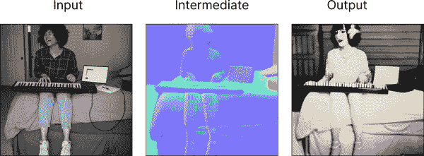

###### 图 9-22\. ControlNet 正常

OpenPose 方法通过确定姿势、手部位置和面部表情为人物创建一个骨架。为了使此模型工作，通常需要一个全身可见的人类主体，尽管也有肖像选项。如果场景中需要多人，使用多个 OpenPose 骨架并将它们组合成单个图像是非常常见的做法。图 9-23 将[蒙娜丽莎的姿势](https://oreil.ly/7n02i)转换到 Rachel Weisz 的图片上。

输入：

```py
painting of Rachel Weisz
```

图 9-23 展示了输出。


###### 图 9-23\. ControlNet OpenPose

M-LSD（移动线段检测）技术在建筑和室内设计中相当常用，因为它非常适合追踪直线。直线通常只出现在人造物体中，所以它不太适合自然场景（尽管它可能会产生有趣的效果）。像房屋这样的人造物体非常适合这种方法，如图中现代公寓的图像（由 [Collov Home Design](https://oreil.ly/OtV_O) 在 [Unsplash](https://oreil.ly/z38do) 上重新构想，以适应 *Mad Men* 时代，如图 9-24(#figure-9-24) 所示。

输入：

```py
1960s Mad Men style apartment
```

图 9-24 展示了输出。


###### 图 9-24\. ControlNet M-LSD

SoftEdge 技术也称为 HED（整体嵌套边缘检测），是 Canny 边缘检测的替代方案，为物体周围创建更平滑的轮廓。它非常常用，提供与 Canny 相当的细节，但可能更少噪声，并能提供更美观的结果。这种方法非常适合风格化和重新着色图像，并且与 Canny 相比，它通常允许更好地处理面部。多亏了 ControlNet，您不需要输入太多关于整体图像的详细提示，只需提示您想要看到的变化即可。图 9-25 展示了对 [Vermeer 的 *戴珍珠耳环的少女*](https://oreil.ly/RjUur) 的重新构想，由 Scarlett Johansson 扮演：

输入：

```py
Scarlett Johansson, best quality, extremely detailed
```

负面：

```py
monochrome, lowres, bad anatomy, worst quality, low quality
```

图 9-25 展示了输出。


###### 图 9-25\. ControlNet SoftEdge

另一种在建筑中流行的技术是分割，它将图像分割成相关区域或段，这些段之间多少有些关联。这大致相当于在 Img2Img 中使用图像蒙版，但结果更好。当您需要更精确地控制图像中的各种对象时，可以使用分割。一个强大的用例是户外场景，这些场景可能因一天中的时间、周围环境或甚至时代而异。看看 图 9-26，展示了一座城堡的现代照片（由 [Richard Clark](https://oreil.ly/SG9CT) 在 [Unsplash](https://oreil.ly/2FlyI) 上拍摄），变成了一个幻想风格的城堡插图。

输入：

```py
A beautiful magical castle viewed from the outside, texture,
intricate, details, highly detailed, masterpiece,
architecture, building, trending on artstation, focus, sharp
focus, concept art, digital painting, fantasy, sunny, day,
midday, in the style of high fantasy art
```

图 9-26 展示了输出。

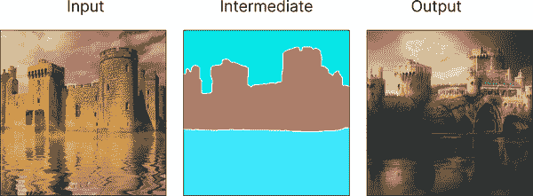

###### 图 9-26\. ControlNet 分割

一个强大的功能是能够在画布上绘制并使用它来控制 ControlNet。您也可以离线绘制并拍照上传图片，但对于简单图像，点击 Stable Diffusion 网页 UI 中的铅笔表情符号并使用提供的画笔绘制可能更快。即使是简单的涂鸦也通常足够，边缘也不必完美，如图 9-27(#figure-9-27) 所示。

输入：

```py
The Happy Goldfish, illustrated children's book
```

图 9-27 展示了输出。


###### 图 9-27\. ControlNet 笔迹

# 提供示例

ControlNet 赋予 AI 艺术家通过提供一个示例图像来模仿另一个图像的能力，从而在构图方面使图像看起来像另一个图像。这允许在视觉一致性方面有更多的控制，并在制作更复杂的图像方面有更多的灵活性。

每种 ControlNet 方法都有自己的预处理程序，并且它们必须与图像模型相匹配才能有意义。例如，如果你使用的是 Canny 预处理程序，你应该使用像 control_v11p_sd15_canny 这样的 Canny 模型。选择一个为你试图完成的任务提供足够自由度的模型也很重要；例如，使用 SoftEdge 模型的一张猫的图片可能细节过多，难以变成狮子，你可能想尝试更粗略的模型。与所有 Stable Diffusion 的事物一样，找到精确的模型和参数组合需要实验，因为新的功能和选项一直在不断涌现。

ControlNet 支持使用简单的提示或根本不使用提示来运行。它将匹配你提交的现有图像并确保高度的一致性。你可以运行一个通用的提示，如`a professional, detailed, high-quality image`，以获得现有图像的好版本。然而，大多数情况下，你将尝试改变图像的某些方面，并希望输入一个完整的提示，就像之前的例子一样。生成的图像将匹配提示和 ControlNet 输出，你可以通过调整可用的参数来实验，看看能得到什么结果。

# Segment Anything Model (SAM)

当处理由 AI 生成的图像时，能够分离出代表特定人物、物体或元素的*遮罩*通常很有益。例如，将人物图像从背景中分离出来，可以让你在人物后面修复新的背景。这可能会花费很长时间并导致使用画笔工具时的错误，因此能够根据 AI 模型对线条的解释自动分割图像可能会有所帮助。

做这件事最受欢迎且功能强大的模型是*SAM*，即 Segment Anything Model，由 Meta 在 GitHub 上[开源发布](https://oreil.ly/BuunX)。该模型在包含 1100 万张图像和 11 亿个遮罩的数据集上进行了训练，能够根据用户输入（在图像上点击添加一到三个点以确定遮罩位置）推断出图像遮罩的位置，或者它可以自动为图像中的所有元素单独生成遮罩。这些遮罩可以导出用于修复、ControlNet 或作为基础图像。

你可以使用[*sd-webui-segment-anything*](https://oreil.ly/rFMJN)扩展在 AUTOMATIC1111 界面中使用 SAM。一旦 AUTOMATIC1111 安装并运行，你可以按照以下说明安装 SAM 扩展：

1.  导航到“扩展”标签，并点击名为“可用”的子标签。

1.  点击“从...加载”按钮。

1.  在搜索框中输入：`**sd-webui-segment-anything**`以查找扩展。

1.  在最右侧的操作列中点击“安装”。

1.  WebUI 现在将下载必要的文件并在本地 Stable Diffusion 版本上安装 SAM。

如果你在执行前面的步骤时遇到困难，你可以尝试以下替代方法：

1.  导航到“扩展”标签并点击“从 URL 安装”子标签。

1.  在 Git 仓库的 URL 字段中粘贴扩展的链接：[*https://github.com/continue-revolution/sd-webui-segment-anything*](https://github.com/continue-revolution/sd-webui-segment-anything)。

1.  点击“安装”。

1.  WebUI 将下载并安装 SAM 在本地 Stable Diffusion 版本上所需的文件。

你还需要下载实际的 SAM 模型权重，链接到[仓库](https://oreil.ly/IqrbI)。本章节使用的是 1.25 GB 的*sam_vit_l_0b3195.pth*。如果你遇到低 VRAM（你的电脑冻结或延迟）的问题，你应该切换到较小的模型。将你下载的模型移动到*stable-diffusion-webui/sd-webui-segment-anything/models/sam*文件夹。

现在你已经完全安装了 SAM，从你的终端或命令行重新启动 AUTOMATIC1111，或者访问设置并点击“应用并重启 UI”。

你应该在 Img2Img 标签中看到扩展，通过滚动过画布和 Seed 参数，在 ControlNet 扩展旁边的折叠组件中。在此处上传一张图片（我们使用了图 9-28 的图片，由[Luca Baini](https://oreil.ly/Lb3xE)在[Unsplash](https://oreil.ly/jvCjz)提供）并点击图片以选择单个提示点。这些提示点将作为用户输入传递给 SAM，以帮助模型确定从图像中应该分割出什么。你可以点击“预览”来查看将创建什么蒙版，并迭代地添加或删除绘图点，直到蒙版正确为止。有一个标记为“添加/删除点时自动预览”的复选框，它会在每次点击时更新蒙版。通常 SAM 只需要一个绘图点就能正确分割，但如果你遇到困难，你也可以通过右键点击添加负绘图点到你不希望蒙版的图像部分。从提供的三个选项中选择你想要的蒙版（从 0 到 2 计数）。


###### 图 9-28\. 添加绘图点

当你的蒙版准备好后，确保勾选“复制到 Inpaint 上传 & img2img ControlNet Inpainting”的框，然后点击“切换到 Inpaint 上传”按钮。你不会在视觉上看到任何变化，但当你切换到 Inpainting 标签时，你应该能够使用 SAM 生成的蒙版生成你的提示。不需要将图片或蒙版上传到 Inpainting 标签。你还可以在“上传蒙版”标签中下载你的蒙版以供稍后上传。这种方法在我们的测试中不可靠，可能还有更好的支持 SAM 和 Stable Diffusion 的修复蒙版方法。

# 分工

生成模型如 Midjourney 和 Stable Diffusion 非常强大，但它们不能做所有事情。在训练一个单独的图像分割模型时，Meta 公司通过将图像的元素分割成不同的掩码，使得生成更复杂的图像成为可能，这些掩码可以单独处理，然后再汇总成最终产品。

# DreamBooth 微调

据报道，原始的 Stable Diffusion 模型训练成本为[600,000 美元](https://oreil.ly/s739b)，总共使用了 150,000 个 GPU 小时，因此对于大多数组织来说，训练自己的基础模型可能是不切实际的。然而，可以在 Stable Diffusion 的基础上构建，使用在论文“DreamBooth: Fine Tuning Text-to-Image Diffusion Models for Subject-Driven Generation”([Ruiz et al., 2022](https://oreil.ly/ZqdjB))中引入的 DreamBooth 技术。DreamBooth 允许您微调或训练模型，使其能够理解其训练数据中尚未遇到的新概念。不必从头开始构建新模型意味着显著减少时间和资源：在 1 个 GPU 上大约需要 45 分钟到 1 小时。实际上，DreamBooth 会更新新模型的权重，这为您提供了一个新的 2 GB 模型文件，可以在 AUTOMATIC1111 中使用，而不是使用基础 Stable Diffusion 模型。

在[Hugging Face](https://oreil.ly/2efOO)和[Civitai](https://civitai.com)等网站上有很多基于 DreamBooth 的模型可供使用。要在 AUTOMATIC1111 中使用这些模型，您只需下载它们并将它们移动到`stable-diffusion-webui/models/Stable-diffusion/`文件夹中。Dreambooth 模型通常需要一个特定的词或标记来触发风格或主题，这个标记必须包含在提示中。例如，[Inkpunk Diffusion](https://oreil.ly/spsy3)模型需要单词*nvinkpunk*。注意：这里的底层基础模型是 Stable Diffusion 的 v1.5 版本，因此请将图像大小重置为 512 × 512。

输入：

```py
skateboarding in Times Square nvinkpunk
```

图 9-29 展示了输出结果。


###### 图 9-29\. InkPunk 滑板运动员

# 分工

许多人使用 AI 时犯的一个错误是认为有一个模型可以统治一切。实际上，有许多创造性的模型存在，通常在特定任务上的训练比通用的基础模型能产生更好的结果。虽然像 Stable Diffusion XL 这样的基础模型是大多数实践者开始的地方，但通常他们开始尝试在特定任务上微调自己的模型，这些模型通常是更小、更高效的，如 v1.5 版本。

训练 DreamBooth 模型的推荐方法是[Shivam Shrirao 的仓库](https://oreil.ly/AJnnL)，它使用 HuggingFace 的`diffusers`库。以下是对[Google Colab](https://oreil.ly/790FZ)中代码的解释。在这个笔记本中使用的是版本 1.5，因为它是一个较小的模型，并且能够在谷歌 Colab 环境中免费训练几小时。这个 Python 笔记本的副本被保存在[GitHub 仓库](https://oreil.ly/NzzGm)中，以供后人参考，但应注意的是，它只能在 Nvidia GPU 上运行，不能在 MacBook 上运行。

首先，Colab 会检查是否有访问 Nvidia GPU 的权限。这是在谷歌 Colab 上运行 Dreambooth 的一个很好的理由，因为您将获得运行代码所需的正确资源，而无需任何配置：

```py
!nvidia-smi --query-gpu=name,memory.total, \
    memory.free --format=csv,noheader
```

接下来，安装必要的库，包括来自 Hugging Face 的`diffusers`库：

```py
!wget -q https://github.com/ShivamShrirao/diffusers/raw/ \
    main/examples/dreambooth/train_dreambooth.py
!wget -q https://github.com/ShivamShrirao/diffusers/raw/ \
    main/scripts/convert_diffusers_to_original_stable_ \
    diffusion.py
%pip install -qq \
git+https://github.com/ShivamShrirao/diffusers
%pip install -q -U --pre triton
%pip install -q accelerate transformers ftfy \
bitsandbytes==0.35.0 gradio natsort safetensors xformers
```

运行下一个单元格以设置模型完成运行后的输出目录。建议将模型保存到谷歌驱动（即使暂时保存），因为您可以从那里比从谷歌 Colab 文件系统更可靠地下载大文件（4-5 GB）。请确保您已从 Hugging Face hub 中选择正确的基模型`runwayml/stable-diffusion-v1-5`，并为输出目录选择一个 token 名称（通常是*ukj*或*zwx*；关于这一点稍后会有更多说明）：

```py
#@markdown If model weights should be saved directly in
#@markdown google drive (takes around 4-5 GB).
save_to_gdrive = False
if save_to_gdrive:
    from google.colab import drive
    drive.mount('/content/drive')

#@markdown Name/Path of the initial model.
MODEL_NAME = "runwayml/stable-diffusion-v1-5" \
    #@param {type:"string"}

#@markdown Enter the directory name to save model at.

OUTPUT_DIR = "stable_diffusion_weights/ukj" \
    #@param {type:"string"}
if save_to_gdrive:
    OUTPUT_DIR = "/content/drive/MyDrive/" + OUTPUT_DIR
else:
    OUTPUT_DIR = "/content/" + OUTPUT_DIR

print(f"[*] Weights will be saved at {OUTPUT_DIR}")

!mkdir -p $OUTPUT_DIR
```

在训练之前，您需要添加您想要训练的概念。根据我们的经验，在多个概念上进行训练往往会损害性能，所以我们通常会只在一个主题或风格上进行训练。您可以在 AUTOMATIC1111 的检查点合并标签页中稍后合并模型，尽管这涉及到本书未涵盖的更高级领域。实例提示包括您将在提示中使用的 token，理想情况下是一个没有其他含义的词，如*zwx*或*ukj*。类别提示是训练的起点，因此如果您正在训练一个特定人物的模型，您应从`照片中的人物`开始以使训练更有效：

```py
# You can also add multiple concepts here.
# Try tweaking `--max_train_steps` accordingly.

concepts_list = [
     {
         "instance_prompt":      "photo of ukj person",
         "class_prompt":         "photo of a person",
         "instance_data_dir":    "/content/data/ukj",
         "class_data_dir":       "/content/data/person"
     }
]

# `class_data_dir` contains regularization images
import json
import os
for c in concepts_list:
    os.makedirs(c["instance_data_dir"], exist_ok=True)

with open("concepts_list.json", "w") as f:
    json.dump(concepts_list, f, indent=4)
```

接下来，我们通过谷歌 Colab 上传图片。Dreambooth 可以使用尽可能少的 5 张图片，但通常建议您使用大约 20-30 张图片，尽管有些人使用数百张图片进行训练。一个创造性的用例是使用第八章中讨论的**一致性角色方法**来生成 20 个相同的 AI 生成角色的不同图像，并使用它们来训练 Dreambooth 模型。或者，您可以上传 20 张自己的照片来创建 AI 个人资料照片，或者上传 20 张您公司销售的产品照片来生成 AI 产品摄影。您可以将文件本地上传到谷歌 Colab 文件系统中的*instance_data_dir*（这可能更快）或运行下一个单元格以获取上传按钮：

```py
import os
from google.colab import files
import shutil

for c in concepts_list:
    print(f"""Uploading instance images for
`{c['instance_prompt']}`""")
    uploaded = files.upload()
    for filename in uploaded.keys():
        dst_path = os.path.join(c['instance_data_dir'],
            filename)
        shutil.move(filename, dst_path)
```

现在真正的训练开始了！这段代码在 GPU 上运行，并在完成后输出最终的权重。确保在运行之前更改`save_sample_prompt`，以便使用你分配的令牌，在这种情况下是`photo of ukj person`：

```py
!python3 train_dreambooth.py \
  --pretrained_model_name_or_path=$MODEL_NAME \
  --pretrained_vae_name_or_path="stabilityai/sd-vae-ft-mse" \
  --output_dir=$OUTPUT_DIR \
  --revision="fp16" \
  --with_prior_preservation --prior_loss_weight=1.0 \
  --seed=1337 \
  --resolution=512 \
  --train_batch_size=1 \
  --train_text_encoder \
  --mixed_precision="fp16" \
  --use_8bit_adam \
  --gradient_accumulation_steps=1 \
  --learning_rate=1e-6 \
  --lr_scheduler="constant" \
  --lr_warmup_steps=0 \
  --num_class_images=50 \
  --sample_batch_size=4 \
  --max_train_steps=800 \
  --save_interval=10000 \
  --save_sample_prompt="photo of ukj person" \
  --concepts_list="concepts_list.json"
```

现在训练已经完成，接下来的两个代码单元格定义了目录，然后显示一个图像网格，这样你可以直观地看到模型是否正确理解了你的概念，并且现在能够生成你风格的主题的有用图像：

```py
WEIGHTS_DIR = ""
if WEIGHTS_DIR == "":
    from natsort import natsorted
    from glob import glob
    import os
    WEIGHTS_DIR = natsorted(glob(OUTPUT_DIR + os.sep + \
        "*"))[-1]
print(f"[*] WEIGHTS_DIR={WEIGHTS_DIR}")

#@markdown Run to generate a grid of preview images from the last saved weights.
import os
import matplotlib.pyplot as plt
import matplotlib.image as mpimg

weights_folder = OUTPUT_DIR
folders = sorted([f for f in os.listdir(weights_folder) \
    if f != "0"], key=lambda x: int(x))

row = len(folders)
col = len(os.listdir(os.path.join(weights_folder,
    folders[0], "samples")))
scale = 4
fig, axes = plt.subplots(row, col, figsize=(col*scale,
    row*scale), gridspec_kw={'hspace': 0, 'wspace': 0})

for i, folder in enumerate(folders):
    folder_path = os.path.join(weights_folder, folder)
    image_folder = os.path.join(folder_path, "samples")
    images = [f for f in os.listdir(image_folder)]
    for j, image in enumerate(images):
        if row == 1:
            currAxes = axes[j]
        else:
            currAxes = axes[i, j]
        if i == 0:
            currAxes.set_title(f"Image {j}")
        if j == 0:
            currAxes.text(-0.1, 0.5, folder, rotation=0,
            va='center', ha='center',
            transform=currAxes.transAxes)
        image_path = os.path.join(image_folder, image)
        img = mpimg.imread(image_path)
        currAxes.imshow(img, cmap='gray')
        currAxes.axis('off')

plt.tight_layout()
plt.savefig('grid.png', dpi=72)
```

最后，你需要运行转换过程以获取*.ckpt*文件，这是你将在 AUTOMATIC1111 中使用的文件：

```py
#@markdown Run conversion.
ckpt_path = WEIGHTS_DIR + "/model.ckpt"

half_arg = ""
#@markdown Convert to fp16, takes half the space (2GB).
fp16 = True #@param {type: "boolean"}
if fp16:
    half_arg = "--half"
!python convert_diffusers_to_original_stable_diffusion.py \
    --model_path $WEIGHTS_DIR  --checkpoint_path \
    $ckpt_path $half_arg
print(f"[*] Converted ckpt saved at {ckpt_path}")
```

然后，你可以访问权重目录*stable_diffusion_weights/zwx*来找到模型并下载它。如果你在从 Google Colab 文件系统下载如此大的文件时遇到问题，请在运行模型之前尝试检查保存到 Google Drive 的选项，并从那里下载。我们建议在将模型放入你的*stable-diffusion-webui/models/Stable-diffusion/*文件夹之前重命名模型，这样你以后在使用时可以知道它是哪个模型。

输入：

```py
a professional headshot of ukj person, standing with his
arms crossed and smiling at the camera with his arms
crossed, a character portrait, Adam Bruce Thomson, private
press, professional photo
```

图 9-30 显示了输出。

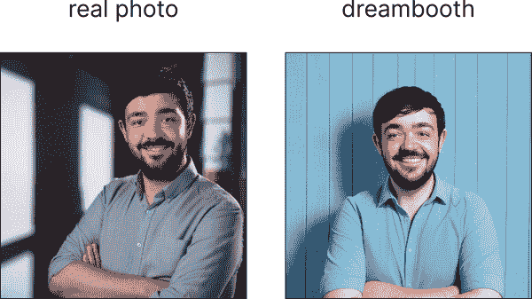

###### 图 9-30\. 作者之一的一个 Dreambooth 模型图像

此外，还有一个[扩展](https://oreil.ly/xbt2d)，用于通过 Automatic1111 训练 Dreambooth 模型，基于 Shivam Shrirao 的方法。这个扩展可以像安装 ControlNet 和 Segment Anything 一样安装。这个工具是针对高级用户的，因为它暴露了大量的功能和设置供实验，其中许多需要你是机器学习专家才能理解。要开始学习这些参数和设置的含义，以便你可以尝试不同的选项，请查看扩展 wiki 中的[训练入门指南](https://oreil.ly/gfdY3)。使用这种方法而不是 Google Colab 的好处是它在你的计算机上本地运行，所以你可以放心地让它运行，不用担心它会超时并丢失进度。

# 提供示例

Dreambooth 帮助你通过生成式 AI 个性化你的体验。你只需要提供 5-30 张作为概念示例的图像，在不到一小时的训练时间内，你就可以拥有一个完全个性化的定制模型。

除了 Dreambooth 之外，还有其他训练和微调方法可用，但这项技术目前是最常用的。一种较老的技术是 [文本反转](https://oreil.ly/GgnJV)，它不会更新模型权重，而是近似地确定一个标记表示您概念的正确位置，尽管这种方法的性能往往远低于 Dreambooth。一种有希望的新技术是 LoRA，来自论文“LoRA：大型语言模型的低秩自适应”（[Hu 等人，2021](https://oreil.ly/NtoiB)），在文本生成空间中与 LLMs 频繁出现。这项技术向模型中添加新的层，并仅训练这些新层来构建自定义模型，而不会消耗太多资源。还有超网络，它训练可以生成这些新层的参数，正如 [Kurumuz](https://oreil.ly/zFH0-) 在 Medium 文章“NovelAI 对 Stable Diffusion 的改进”中所述。这两种方法都是实验性的，并且在撰写本文时在 Civitai 上的模型中只占一小部分（不到 10%），并且在总体上用户评分较低。

# Stable Diffusion XL 精炼器

SDXL v1.0 模型有 66 亿个参数，而 v1.5 模型有 9.8 亿个参数（[Rombach 等人，2023](https://oreil.ly/vc1zS)）。增加的计算能力带来了令人印象深刻的成果，因此该模型开始赢得坚定的 1.5 粉丝。SDXL 的部分力量来自基础模型和精炼器模型之间的劳动分工（图 9-31），基础模型设置全局构图，而精炼器模型添加更精细的细节（可选）。

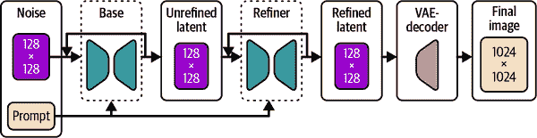

###### 图 9-31\. Stable Diffusion XL 基础和精炼器模型

从您的提示中推断意义的底层语言模型是 OpenClip (ViT-G/14) 和 OpenAI 的 CLIP ViT-L 的组合。Stable Diffusion v2 仅使用 OpenClip，因此 v1.5 上有效的提示在 v2 中并不容易迁移：这个问题在 SDXL 中得到了很大程度的解决。此外，SDXL 模型使用更多样化的图像尺寸进行训练，当您需要非标准方形比例的图像时，这会导致更好的结果。[Stability AI 的研究](https://oreil.ly/_b7xX)表明，用户普遍更喜欢 XL 模型而不是 v1.5（图 9-32）。

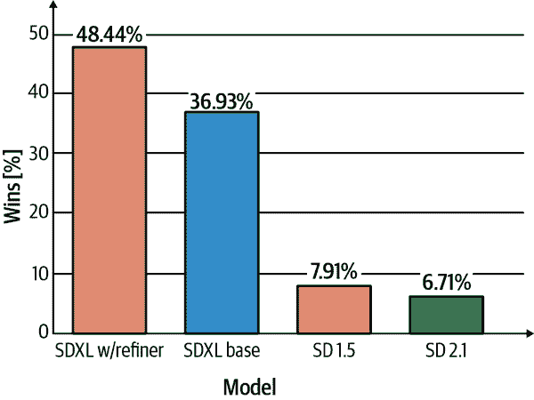

###### 图 9-32\. 相对性能偏好

要使用精炼器模型，您必须在 AUTOMATIC1111 界面中利用“切换至”功能。此值控制管道在哪个步骤切换到精炼器模型。例如，在 0.6 步骤切换，使用 30 步，意味着基础模型将用于前 18 步，然后切换到精炼器模型进行最后的 12 步（图 9-33）。


###### 图 9-33\. 精炼器—切换至参数

常见建议是在 0.4 和 1.0 之间切换（1.0 的值不会切换，仅使用基础模型），使用 20-50 个采样步骤以获得最佳结果。根据我们的经验，在 0.6 处切换并使用 30 个采样步骤可以产生最高质量的图像，但像所有 Stable Diffusion 一样，你必须进行实验以发现最适合你图像的最佳结果。将细化器设置为在 0.6 处切换会得到 图 9-35 中所示的输出。

输入：

```py
anime cat girl with pink hair and a cat ears outfit is posing for a picture
in front of a gaze, photorealistic, 1girl, a character portrait, floral print,
Alice Prin, sots art, official art, sunlight, wavy hair, looking at viewer
```

负面：

```py
disfigured, ugly, bad, immature, photo, amateur, overexposed, underexposed
```

图 9-34 展示了输出。

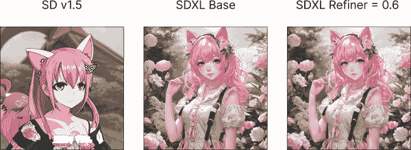

###### 图 9-34\. 使用 SDXL 基础模型与细化器在 0.6 的动漫猫娘

# 分工合作

SDXL 的架构是分割任务为多个工作并使用适合该工作的正确模型的完美示例。基础模型设置场景并引导图像的构图，而细化器则增加精细细节。

你可以做出的一个生活质量改进是安装长宽比选择器扩展，它可以加载你经常使用的图像大小或长宽比，允许一键设置模型正确的尺寸和长宽比。

要安装扩展，浏览到扩展选项卡，转到从 URL 安装，粘贴 *[*https://github.com/alemelis/sd-webui-ar*](https://github.com/alemelis/sd-webui-ar)*，然后点击安装。转到扩展文件夹 stable-diffusion-webui/extensions/sd-webui-ar 并将以下内容添加到 *resolutions.txt* 文件中（或替换现有内容以保持整洁）：

```py
SD1:1, 512, 512 # 1:1 square
XL1:1, 1024, 1024 # 1:1 square
SD3:2, 768, 512 # 3:2 landscape
XL3:2, 1216, 832 # 3:2 landscape
SD9:16, 403, 716 # 9:16 portrait
XL9:16, 768, 1344 # 9:16 portrait
```

点击这些预设按钮之一将自动相应地调整宽度和高度。你也可以用以下内容替换 *aspect ratios.txt*，允许你根据在 Web UI 中设置的身高值自动计算长宽比，它们将在 Web UI 界面中显示 (图 9-35)：

```py
Square 1:1, 1.0 # 1:1 ratio based on minimum dimension
Landscape 3:2, 3/2 # Set width based on 3:2 ratio to height
Portrait 9:16, 9/16 # Set width based on 9:16 ratio to height
```


###### 图 9-35\. 长宽比

# 摘要

在本章中，你学习了使用 Stable Diffusion 生成图像的高级技术，Stable Diffusion 是一个开源模型。如果你跟随着步骤，你成功安装了 Stable Diffusion 并使用 HuggingFace *diffusers* 库构建了一个推理管道。你希望使用 Stable Diffusion 推理模型在 Google Colab 中根据提示生成图像。此外，本章建议探索开源社区和用户界面，如 AUTOMATIC1111，以运行具有高级功能的 Stable Diffusion。

本章还介绍了 ControlNet 的概念，它允许通过提示和基础图像来控制图像的风格，以及 Segment Anything，这是一个用于遮罩图像特定部分的模型。通过应用这些技术，你现在能够根据特定需求定制生成的图像。你还了解到了个性化技术，特别是 DreamBooth 微调，它允许你训练一个模型来理解其训练数据中未遇到的新概念。

在下一章中，你将有机会将本书中学到的所有知识付诸实践。我们将探讨如何构建一个既能生成博客文本又能生成配套图片的人工智能博客文章生成器。那最后一章将令人兴奋，它将带你通过创建一个端到端系统的过程，该系统能根据用户输入生成高质量的博客文章，并附带风格一致的定制插图。你将学习如何优化提示词、生成吸引人的标题，以及创建符合你期望风格的 AI 生成图像！
