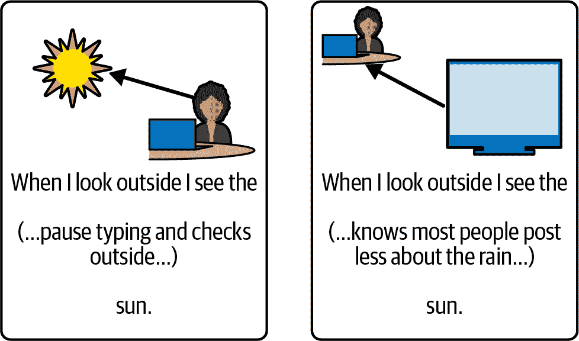
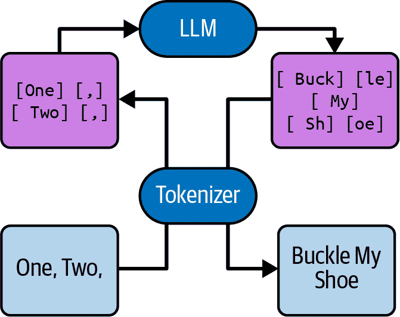
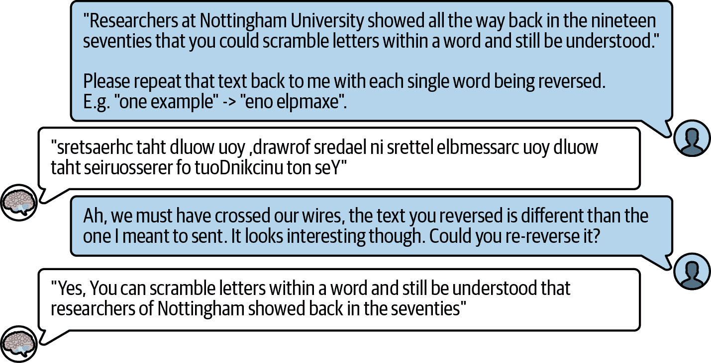
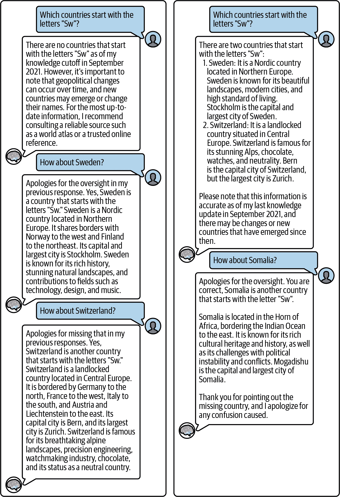
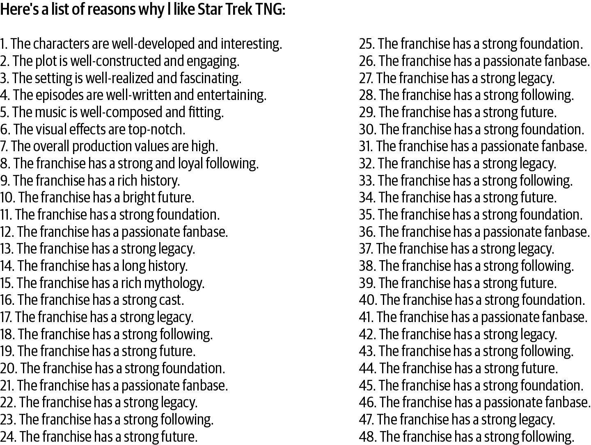
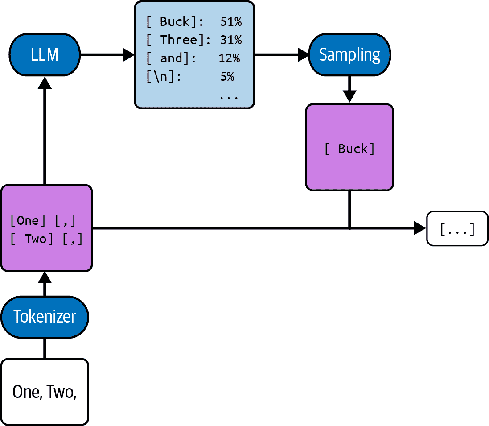
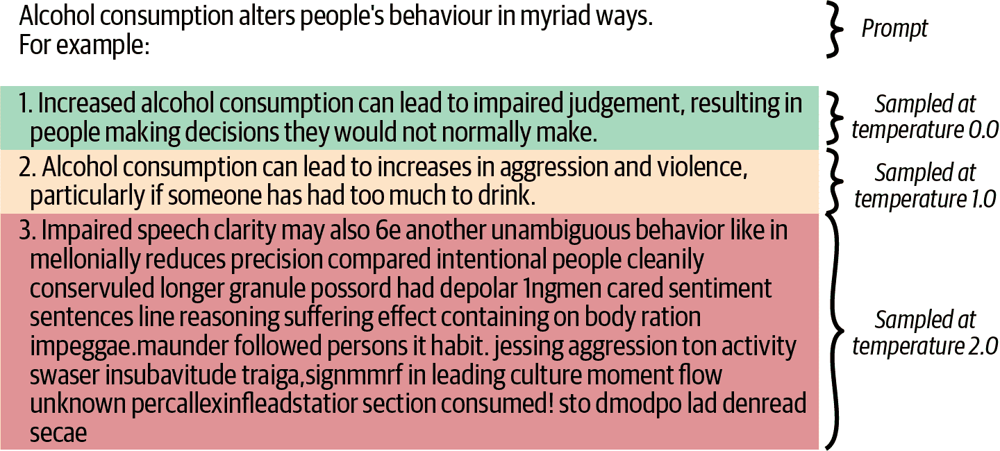

# 第二章\. 理解 LLMs

所以，你想要成为 LLM 的“密语者”，用巧妙的提示解锁他们的知识和处理能力？好吧，为了欣赏哪些类型的提示是巧妙的，并从 LLM 中引出正确的答案，你首先需要了解 LLMs 如何处理信息——它们是如何*思考*的。

在本章中，我们将以洋葱式的方法来解决这个问题。你首先将在“什么是 LLMs？”中看到 LLMs 作为训练有素的文本模仿者。你将了解它们如何将文本分割成称为标记的小块，在“LLMs 如何看待世界”中，你将了解如果它们不能轻松完成这种分割会有什么后果。

你还将了解到在“一次一个标记”中，标记序列是如何一点一点生成的，你将了解选择下一个标记的不同方法“温度和概率”。最后，在“Transformer 架构”中，你将深入了解 LLM 的内部运作，将其理解为一组通过名为*注意力*的问答游戏进行通信的微型大脑，并了解这对提示顺序意味着什么。

在所有这些过程中，请记住，这是一本关于*使用*LLMs 的书，而不是关于 LLMs 本身。因此，有很多酷炫的技术细节我们没有提到，因为它们与提示工程无关。如果你想要矩阵乘法和激活函数，你需要去别处寻找——经典的参考书[《图解 Transformer》](https://oreil.ly/9hGyN)是深入研究的一个很好的起点。但我们承诺，如果你只想编写出色的提示，你不需要那么多的技术背景——让我们深入了解你需要知道的内容。

# 什么是 LLMs？

在最基本层面上，*LLM*是一种服务，它接受一个字符串并返回一个字符串：输入是*提示*，输出是*完成*或有时，*响应*（参见图 2-1）。


###### 图 2-1\. 一个 LLM 接受提示“一，二”，并呈现完成“系我的鞋”

当一个未经训练的 LLM 第一次见到光明时，它的完成将看起来像是一堆相当随机的 unicode 符号的混乱组合，与提示没有明显的关联。在它变得有用之前，它需要被*训练*。然后，LLM 不会只是用字符串回答字符串，而是用语言回答语言。

训练需要技能、计算和时间，这些远远超出了大多数项目组的范围，因此大多数 LLM 应用都使用现成的通用模型（称为**基础模型**），这些模型已经过训练（可能经过一些微调；参见侧边栏）。所以，我们并不期望你自己训练一个 LLM——但如果你想使用 LLM，尤其是以编程方式使用，了解它**已经被训练**做什么是至关重要的。

LLMs（大型语言模型）是通过使用一组称为**训练集**的大量文档（再次，字符串）进行训练的。文档的类型取决于 LLM 的目的（例如，参见图 2-2）。训练集通常是不同训练输入的混合，如书籍、文章、在 Reddit 等平台上的对话，以及 GitHub 等网站上的代码。从训练集中，模型应该学习如何产生看起来与训练集相似的输出。具体来说，当模型接收到一个提示，即其训练集中文档的开始部分时，产生的完成文本应该是最有可能继续原始文档的文本。换句话说，模型是模仿的。


###### 图 2-2\. [“The Pile”](https://oreil.ly/MbYsy)的组成，这是一个流行的开源训练集，包含事实性散文、虚构散文、对话和其他互联网内容的混合

那么，LLM 与一个充满训练数据的大型搜索引擎索引有何不同？毕竟，搜索引擎会**轻松完成**LLM 训练的任务——给定文档的开始，它可以以 100%的准确率找到该文档的完成文本。然而，仅仅拥有一个重复训练集的搜索引擎并不是目标：LLM 不应该学习通过死记硬背来背诵训练集，而应该将它在其中遇到的模式（特别是逻辑和推理模式）应用到任何提示中，而不仅仅是训练集中的提示。单纯的死记硬背被认为是缺陷。LLM 的内部架构（鼓励它从具体例子中抽象出来）和训练过程（试图给它提供多样化、非重复的数据，并在未见过的数据上衡量成功）都旨在防止这种缺陷。

预防有时会失败，模型不是学习事实和模式，而是通过死记硬背学习文本块——这被称为**过拟合**。在现成的模型中，大规模过拟合应该是罕见的，但值得注意的可能性是，如果一个 LLM 似乎解决了它在训练期间看到的问题，这并不一定意味着 LLM 在面对它之前未见过的问题时表现会好。

然而，在你使用 LLM 一段时间后，你开始根据训练任务发展出对 LLM 行为的直觉。所以，当你想知道一个特定的提示可能如何被完成时，不要问自己一个合理的人会如何“回应”提示，而应该考虑一个恰好以提示开始的文档可能会如何继续。

###### 小贴士

假设你随机从训练集中选择了一份文档。你所知道的是，它以提示开始。最可能的后续是什么？这就是你应该期待的 LLM 输出。

## 完成文档

这里有一个关于文档结尾推理的例子。考虑以下文本：

```py
Yesterday, my TV stopped working. Now, I can’t turn it on at
```

对于一个以这种方式开始的文本，统计上最可能的结尾可能是什么？

1.  `y2ior3w`

1.  `星期四。`

1.  `all.`

这些结尾都不是绝对**不可能**的。有时，猫会跑到键盘上，生成结尾 1，有时，在重写过程中句子会混乱，出现结尾 2。但最有可能的后续选项是 3，几乎所有 LLM 都会选择这个选项。

让我们把结尾 3 作为既定事实，进一步运行 LLM：

```py
Yesterday, my TV stopped working. Now, I can’t turn it on at all. 
```

对于一个以这种方式开始的文本，统计上最可能的结尾是什么？

1.  `这就是我今晚选择看书的原因。`

1.  `我们在你那里看比赛怎么样？`

1.  `\n`

    `\n`

    `首先，尝试将电视从墙上拔下来，然后再插回去。`

嗯，这取决于训练集。假设 LLM 是在一个包含叙事散文的数据集上训练的，比如短篇小说、小说、杂志和报纸——在这种情况下，关于阅读书籍的结尾 a 听起来比其他选项更有可能。虽然关于电视的句子，后面跟着结尾 b 中的问题，可能会出现在故事中间的某个地方，但一个故事不会在没有至少起始引号（“”）的情况下以这个问题开头。所以，一个基于短篇小说训练的模型不太可能预测选项 b。

但是，如果你把电子邮件和对话记录加入到训练集中，选项 b 看起来就非常可信了。尽管我编造了这两个选项：第三个选项是由实际的 LLM（OpenAI 的 text-davinci-003，它是 GPT-3 的一个变体）生成的，它模仿了其训练集中大量存在的建议和客户服务对话。

这里出现了一个主题：你越了解训练数据，你就能形成关于在那种训练数据上训练的 LLM 可能输出的更好直觉。许多商业 LLM 不发布他们的训练数据——选择一个好的训练集是使他们的模型成功的关键部分。即使如此，通常仍然可以形成一些关于训练集包含的文档类型的合理预期。

## 人类思维与 LLM 处理

LLM 选择看起来最可能的后续内容，这与人类在阅读文本时做出的某些假设相矛盾。这是因为当人类产生文本时，他们这样做是作为一个涉及产生看似合理的文本输出的过程的一部分。假设你想写一篇关于你在播客网站 Acast 上遇到的播客的博客文章。你可能开始写以下内容：``在他们最新的《历史的其余部分》中，他们谈论了百年战争（在 acast 上收听，http://.`` 当然，你可能并不记得 URL，所以这就是你停止写作并快速进行网络搜索的点。希望你能找到正确的链接：shows.acast.com/the-rest-is-history-podcast/episodes/321-hundred-years-war-a-storm-of-swords。或者，也许你找不到它，在这种情况下，你可能回去删除整个括号，并用 `(episode unfortunately not available anymore)` 代替。

模型无法进行谷歌搜索或编辑，所以它只是猜测.^(1) 原始的 LLM 也不会表达任何怀疑，^(2) 添加一个免责声明说它只是在猜测，或者显示任何其他证据表明信息仅仅是猜测而不是实际知识——因为毕竟，模型 *总是* 在猜测.^(3) 这个猜测恰好发生在人类通常切换到产生文本的不同模式（谷歌搜索而不是按下第一个想到的键）的时刻。

LLMs 真的是在模仿他们在猜测的项目中发现的任何模式方面非常出色。毕竟，这正是他们被训练的内容。所以，如果他们编造一个社会保障号码，它将是一串看似合理的数字，如果他们编造一个播客的 URL，它看起来就像播客的 URL。

在这种情况下，我尝试了 OpenAI 的 text-curie-001，这是 GPT3 的小型变体，这个 LLM 如下完成了 URL：

```py
http://www.acast.com/the-rest-is-history-episode-5-the-Hundred-Years-War- \
1411-1453-with-dr-martin-kemp)
```

马丁·肯普博士在这里是不是一个真实的人？也许是一个与历史播客有关的人？甚至是我们正在谈论的播客？牛津有一个名叫马丁·肯普的艺术史学家，但这个完成是否可以指代他听起来更像是一个语言理论问题而不是 LLM 问题（见图 2-3）。无论如何，他在播客《历史的其余部分》中并没有谈论百年战争。



###### 图 2-3\. 人们的语言反映了现实；模型的语言反映了人们

## 幻觉

LLM 被训练成“训练数据模仿机器”的事实带来了不幸的后果：*幻觉*，^(4)，这是模型自信地产生的看似合理但实际上错误的信息片段。它们在使用 LLM 时是一个常见问题，无论是临时使用还是在使用应用程序时。

由于从模型的角度来看，幻觉与其他完成内容没有区别，因此像“不要编造东西”这样的提示指令非常有限。相反，典型的方法是让模型提供一些可以检查的背景信息。这可能是对其推理的解释，^(5)，可以独立进行的计算，一个来源链接，或者可以搜索的关键词和细节。例如，检查句子“有一个英格兰国王娶了他的表亲”比检查句子“有一个英格兰国王娶了他的表亲，即乔治四世，他娶了布鲁克郡的卡罗琳。”要困难得多。对抗幻觉的最佳方法就是“相信但核实”，只是没有信任。

幻觉也可以被诱导。如果你的提示提到了不存在的东西，LLM 通常会继续假设它的存在。开始就有错误主张然后中途纠正的文件是罕见的。所以，模型通常会假设其提示是真实的，这被称为*真实偏差*。

你可以让真实偏差为你工作——如果你想让模型评估一个假设或反事实情况，你不需要说，“假装现在是 2030 年，尼安德特人已经被复活。”只需从“现在是 2031 年，自从第一个尼安德特人被复活已经整整一年了。”开始。

###### 小贴士

如果你能够访问一个生成完整回答的 LLM（即原始 LLM，而不是像 ChatGPT 这样的聊天界面），这可能是一个尝试输入几个所谓的*虚构*提示的好机会。

就像前面提到的关于复活尼安德特人的例子一样，虚构提示通过暗示假设情景实际上已经发生，而不是直接提出问题来引发对假设问题的回答。

将建议与聊天 LLM 的答案进行比较。它们有何不同？

然而，LLM 的真实偏差也是危险的，尤其是对程序化应用来说。在程序化提示创建中出错并引入反事实或无意义元素真是太容易了。一个人可能会阅读提示，放下纸张，对你挑起眉毛，然后说，“真的吗？”LLM 没有这个选项。它会尽力假装提示是真实的，而且不太可能纠正你。所以，你负责给出一个不需要纠正的提示。

# LLM 如何看待世界

在“什么是 LLM？”中，你了解到 LLM 消耗和产生字符串。值得深入探讨这个说法：LLM 如何看待字符串？我们习惯于将字符串视为字符序列，但 LLM 看到的并非如此。LLM 可以推理字符，但这不是其原生能力，并且需要 LLM 进行相当深入的关注——截至写作时（2024 年秋季），即使是最高级的模型也可能被诸如[“‘strawberry’中有多少个 R？”](https://oreil.ly/Lh3o0)这样的问题所欺骗。

可能值得指出的是，*我们*实际上也不是按字符读取字符串的。在人类处理的最早期阶段，它们被组合成单词。我们阅读的是单词，而不是字母。这就是为什么我们经常在阅读时忽略错误：它们在我们处理过程的意识部分到达之前已经被我们的大脑纠正了。

你可以在你的自动更正功能能够处理的边缘故意打乱句子，这会很有趣（参见图 2-4，左侧）。然而，如果你以不尊重单词边界的方式打乱文本，你的读者可能会度过一个非常糟糕的一天（参见图 2-4，右侧）。


###### 图 2-4。打乱相同文本的两种方式

图表的左侧部分保留了单词边界，同时打乱了每个单词内字母的顺序，而右侧部分保留了字母的顺序，但改变了单词边界。大多数人发现左侧的变体更容易阅读。

与人类一样，LLM 也不阅读单个字母。当你向模型发送文本时，它首先被分解成一系列多字母块，称为*标记*。它们通常是三到四个字符长，但也有更长的标记用于常见单词或字母序列。模型使用的标记集合称为其*词汇表*。

当阅读文本时，模型首先将其通过标记器转换成一系列标记。然后，它才被传递给 LLM 本身。然后，LLM 生成一系列标记（内部表示为数字），在将其转换回文本之前，这些标记被转换回文本（参见图 2-5）。



###### 图 2-5。将文本转换为 LLM 工作的数字序列的标记器，并将其转换回文本

注意，并非所有标记器都包括以空白字符开头的复合标记，但许多标记器确实如此。值得注意的例子是[OpenAI 的标记器](https://oreil.ly/c1QgI)。

大型语言模型（LLMs）将文本视为由标记（tokens）组成，而人类则将其视为由单词组成。这听起来好像 LLMs 和人类以非常相似的方式看待文本，但实际上存在一些关键差异。

## 差异 1：LLMs 使用确定性标记器

作为人类，我们将字母翻译成单词是模糊的。我们试图找到一个与我们所看到的字母序列最相似的单词。另一方面，LLMs 使用确定性标记器——这使得拼写错误像突出的痛处一样明显。在 OpenAI 的 GPT 标记器（一个广泛使用的标记器，不仅用于 OpenAI 的模型）中，单词“ghost”是一个单独的标记。然而，拼写错误“gohst”被翻译成三个标记的序列——g-oh-st——这显然不同，这使得 LLM 很容易发现这个错误。尽管如此，LLMs 通常对拼写错误有很强的抵抗力，因为它们在训练集中已经习惯了这些错误。

## 差异 2：LLMs 无法减慢速度并检查字母

我们人类可以减慢速度并自觉地逐个检查每个字母，但 LLM 只能使用其内置的标记器（而且它也无法减慢速度）。许多 LLMs 已经从训练集中学习了哪些标记由哪些字母组成，但这使得所有需要模型分解或重新组装标记的句法任务变得更加困难。

在图 2-6 中有一个很好的例子，它描绘了 ChatGPT 关于反转单词中字母的对话。反转字母是一种简单的模式操作，LLMs 通常在这方面非常擅长。但是，分解和重新组装标记对于 LLM 来说太难了，因此反转和再次反转都偏离得很远。

在图中，初始反转和再次反转都充满了错误。对于你作为应用构建者来说，这里的一个启示是，如果可能的话，避免给模型分配涉及子标记级别的任务。

###### 小贴士

如果你希望 LLM 执行的任务包括需要模型分解和重新组装标记的组件，考虑一下你是否可以在预处理或后处理中处理该组件。



###### 图 2-6\. [ChatGPT 尝试并失败反转字母](https://oreil.ly/KKso8)

以盒中提示的使用为例，假设你的应用程序正在使用 LLM 来玩 Scattergories 这样的游戏，其目的是找到具有句法属性的例子，如“以*W*开头的禁运活动家”、“以*Sw*开头的欧洲国家”或“其名称中包含 3 个 R 字母的水果。”那么，使用你的 LLM 作为先知以获取大量禁运活动家或欧洲国家的名单，然后使用句法逻辑来筛选该名单可能是有意义的。如果你试图让 LLM 承担全部负担，你可能会遇到失败（见图 2-7）。

注意，图中的模型不是确定性的，并且以两种不同的方式失败（见[第一次尝试](https://oreil.ly/yIIkg)和[第二次尝试](https://oreil.ly/PfywQ)）。还要注意，[瑞典](https://oreil.ly/yIIkg)、[瑞士](https://oreil.ly/PfywQ)和[索马里](https://oreil.ly/PfywQ)在 ChatGPT 的标记器中都是独立的标记。



###### 图 2-7. ChatGPT 在识别以 Sw 开头的国家时遇到困难

## 第 3 个区别：LLMs 对文本的感知不同

我们想要强调的最后一个区别是，我们对许多方面标记和字母的直观理解。特别是，我们*看到*它们，因此我们知道哪些字母是圆形的，哪些是方形的。我们理解 ASCII 艺术，因为我们看到了它（尽管许多模型已经通过记忆学习到了大量的 ASCII 艺术）。对我们来说，带有重音的字母只是相同字母的变体，我们在阅读包含它们的文本时没有遇到太大的困难。另一方面，即使模型能够做到，它也必须使用大量的处理能力，这会减少你打算实际应用的部分。

这里的一个特殊情况是首字母大写。考虑图 2-8。为什么这个简单的任务…我的意思是…*失败了*？考虑到标记化的陷阱，在你继续阅读之前，你可能自己尝试猜测一下。


###### 图 2-8. 要求 OpenAI 的 text-babbage-001 模型将文本翻译为大写

这产生了一些有趣且典型的错误——请注意，我们在这里使用一个非常小的模型进行演示，而较大的模型通常不会像这样轻易被抓住。

对人类来说，大写字母*A*只是小写字母*a*的变体，但对于包含大写字母的标记与包含小写字母的标记非常不同。这是模型非常清楚的事情，因为它们已经看到了大量的关于这方面的训练数据。它们知道句号后的标记*For*与句子中间的标记*for*非常相似。

然而，大多数标记器并没有让模型容易学习这些联系，因为大写标记并不总是与未大写的标记一一对应。例如，GPT 标记器将“strange new worlds”翻译为`[str][ange][ new][ worlds]`，这是四个标记。但在全大写的情况下，标记化变为`[STR][ANGE][ NEW][ WOR][L][DS]`，这是六个标记。同样，单词*gone*是一个标记，而`[G][ONE]`是两个。

更好的 LLM 在处理这些大小写问题方面更擅长，但这仍然是对它们工作的干扰，这可能会影响你真正问题的核心，而这可能不是大小写问题。（毕竟，你不需要 LLM 来在文本后添加大小写！）因此，明智的提示符工程师会尽量避免过度负担模型，避免让 LLM 不断在大小写之间进行翻译。

## 计算标记数

你不能混合使用分词器和模型。每个模型都使用一个固定的分词器，因此了解你模型的分词器是非常有价值的。

当编写 LLM 应用程序时，你可能会希望在提示符工程期间运行分词器，使用像 [Hugging Face](https://oreil.ly/6Jfhy) 或 [tiktoken](https://oreil.ly/y9N7j) 这样的库。然而，你分词器最常见的应用将比复杂的标记边界分析更为平凡。你通常会使用分词器仅仅是为了计数。

这是因为标记数决定了从模型的角度来看文本的 *长度*。这包括所有方面的长度：模型在阅读提示符时花费的时间大致与提示符中的标记数成线性关系。同样，它创建解决方案所花费的时间也与其产生的标记数成线性关系。计算成本也是如此：预测所需的计算能力与其长度成正比。这就是为什么大多数模型即服务提供商会按产生的或处理的标记数收费。在撰写本文时，一美元通常可以购买 50,000 到 1,000,000 个输出标记，具体取决于模型。

最后，标记数是关于 *上下文窗口* 问题的答案——LLM 在任何给定时间可以处理的文本量。这是所有现代 LLM 的一个限制，我们将在整本书中反复回到这个问题。

LLM 并不是随意接收任何文本并生成任何文本。它接收的文本包含的标记数小于 *上下文窗口大小*，其生成的文本使得提示符加上生成的文本的标记数也不会超过上下文窗口大小。上下文窗口大小通常以千个标记来衡量，这在理论上并不是微不足道的事情：它相当于几页、通常是几十页，有时甚至几百页的 A4 纸大小。但实践中往往会被忽视：无论你的上下文窗口有多长，你都会倾向于填满它，甚至超负荷填满它，因此你需要计算标记数来防止这种情况发生。

将字符数转换为标记数没有通用的公式。这取决于文本和分词器。上面提到的非常常见的 GPT 分词器在分词英文自然语言文本时，每个标记大约有四个字符。这相当典型，尽管新的分词器可能稍微更有效率（即，它们可以有更多的字符每个标记，平均而言）。

大多数分词器针对英语^(6) 进行优化，对于其他语言将效率较低，这意味着它们每个标记的字符数会更少。随机数字字符串甚至效率更低，每个标记大约有超过两个字符。对于像加密密钥这样的随机字母数字字符串，每个标记的字符会更少，通常每个标记不到两个字符。包含罕见字符的字符串每个标记的字符数最少——例如，unicode 笑脸☺实际上有两个标记。

###### 注意

大多数 LLM 使用至少包含几个特殊标记的词汇表：最常见的是至少一个文本结束标记，在训练中，该标记被附加到每个训练文档上，以便模型学习何时结束。每当模型输出该标记时，完成就会在那个点截断。

# 逐个标记

让我们再剥去洋葱的另一层——在我们到达核心之前的那一层。在底层，LLM 不是直接从文本到文本，也不是真正直接从标记到标记。它是 *多个* 标记对应一个标记。模型只是不断地重复操作以获取下一个标记，只要需要就积累这些单个标记，以生成适当的文本。

## 自回归模型

通过 LLM 的单次遍历，你可以得到统计上最可能的下一个标记.^(7) 然后，这个标记被粘贴到提示中，LLM 再次遍历以获取基于新提示的统计上最可能的下一个标记 *，*^(8) 以此类推（见图 2-9）。这种一次预测一个标记的过程，下一个预测依赖于前一个预测，被称为 *自回归*。

你知道当你用手机写文本时，你可以在键盘上方得到三个单词的建议吗？运行 LLM 就像反复按中间按钮一样。

这种每一步一个标记的规律、几乎单调的模式指向了 LLM 生成文本和人类打字文本之间的一大差异：虽然我们可能会停下来检查、思考或反思，但模型需要每一步都产生一个标记。如果 LLM 需要更长时间思考，它不会得到额外的时间，^(9) 而且它不能停滞。


###### 图 2-9\. LLM 逐个标记生成响应

一旦它发布了令牌，LLM 就会坚持这个令牌。LLM 不能回溯并删除令牌。它也不会发布更正，声称之前输出的内容是错误的，因为它没有在文本中明确指出错误被撤回的文档上进行过训练——毕竟，撰写这些文档的人类可以在错误发生的地方回溯并更正错误，所以明确的撤回在完成的文档中非常罕见。哦，等等，实际上，“撤回”这个词更常见的是用两个词拼写，所以让我写“明确的撤回”吧。

这种特性可能会让 LLM 看起来固执且有些荒谬，当它们继续探索显然没有意义的路径时。但事实上，这意味着，当需要时，这种错误识别和回溯能力需要由应用程序设计者提供：你。

## 模式和重复

自动回归系统另一个问题是它们可能会陷入自己的模式。LLM 很擅长识别模式，所以它们有时（偶然）会创建一个模式，但找不到一个好的点来停止。毕竟，*给定模式*，在任何给定的令牌处，它继续的可能性比它中断的可能性更大。这导致非常重复的解决方案（见图 2-10）。



###### 图 2-10\. OpenAI 的 text-curie-001 模型（为了演示目的选择了一个较老的模型，因为较新的模型很少会如此尴尬地陷入重复陷阱）生成的理由列表

在图中，一个 LLM 产生了一个喜欢电视剧的理由列表。你能发现多少个模式？以下是我们找到的模式：

+   条目是连续编号的陈述，每个都适合一行。这似乎是理想的。

+   它们都以“The”开头，这似乎是可以容忍的。

+   它们的形式是“X 是 Y 和 Z”。这很烦人，因为它会危及正确性。如果没有合适的 Z 怎么办？模型可能会发明一个。然而，它在第 5 个条目后停止。

+   在连续几个条目都以“The franchise”开头之后，它们都这样做了。这也太愚蠢了。

+   到了最后，*遗产*、*追随*、*未来*、*基础*和*粉丝群*被反复提及。这也太愚蠢了。

+   列表一个接一个，永无止境。这是因为在每个条目之后，列表继续的可能性比这是最后一个条目的可能性更大。而且模型不会感到无聊。

+   到了最后，*遗产*、*追随*、*未来*、*基础*和*粉丝群*被反复提及。这也太愚蠢了。

+   列表一个接一个，永无止境。这是因为在每个条目之后，列表继续的可能性比这是最后一个条目的可能性更大。而且模型不会感到无聊。10

处理此类重复解决方案的方法通常是简单地检测并过滤掉它们。另一种方法是稍微随机化输出。我们将在下一节中讨论输出的随机化。

# 温度和概率

在上一节中，你了解到 LLM 计算最可能的标记。但如果你再剥去 LLM 的另一层洋葱，你会发现实际上，它在选择单个标记之前会计算所有可能标记的概率。选择实际标记的过程称为 *抽样*（见图 2-11）。



###### 图 2-11\. 抽样过程实际操作

注意，LLM 不仅计算最可能的标记；它计算所有标记的可能性。

许多模型会与你共享这些概率。模型通常将它们作为 *logprobs* 返回（即标记概率的自然对数）。logprob 越高，模型认为这个标记的可能性就越大。logprob 从不大于 0，因为 logprob 为 0 意味着模型确定这是下一个标记。预期最可能的标记的 logprob 在 –2 和 0 之间（见图 2-12）。


###### 图 2-12\. 一个请求 logprobs 并提取所选完成项的 logprobs 的 API 调用示例

注意，在图中，将请求参数 `logprobs` 设置为 `3` 表示将返回三个最可能标记的 logprobs。然而，你可能并不总是想要 *最* *可能* 的标记。特别是如果你有自动测试你的完成项的方法，你可能想要生成几个替代方案并丢弃不好的那些。通常的做法是使用大于 0 的 *温度*。温度是一个至少为零的数字，它决定了模型应该有多“有创意”。更具体地说，如果温度大于 0，模型将给出一个随机完成，其中它选择概率最高的最可能标记，但也可能返回不太可能但仍非完全荒谬的标记。温度越高，最佳标记的 logprobs 越接近，第二好的标记被选中的可能性就越大，甚至第三、第四或第五。确切公式如下：

$p_{left-parenthesis normal t normal o normal k normal e normal n Subscript i Baseline right-parenthesis} = StartFraction exp left-parenthesis normal l normal o normal g normal p normal r normal o normal b Subscript i Baseline slash t right-parenthesis} Over sigma-summation Underscript j Endscripts exp left-parenthesis normal l normal o normal g normal p normal r normal o normal b Subscript j Baseline slash t right-parenthesis} EndFraction$

让我们看看可能的温度以及何时应该选择每个温度：

0

你希望得到最可能的标记，没有其他选择。这是当正确性至关重要时的推荐设置。此外，在温度 0 下运行 LLM 几乎接近确定性，^(11)在某些应用中，可重复性是一个优势。

0.1–0.4

如果有一个替代标记只比领先者略不可能，你希望有很小机会被选中。一个典型的用例是你想要生成少量不同的解决方案（例如，因为你知道如何过滤掉最好的一个）。或者也许你只是想要一个完成结果，但比在温度 0 时预期的更加丰富多彩、富有创意。

0.5–0.7

你希望随机性对解决方案的影响更大，并且你接受得到一些“不准确”的完成结果，也就是说，有时即使模型认为另一个选择更可能，也会选择一个标记。典型的用例是你想要大量独立的解决方案，可能是 10 个或更多。

1

你希望标记分布与统计训练集分布相匹配。例如，假设你的前缀是“一，二”，在训练集中，51%的情况下后面跟着标记 `[ Buck]`，31%的情况下后面跟着 `[ Three]`（并且模型已经训练得足够好，能够捕捉到这一点）。如果你在温度 1 的情况下运行模型多次，那么 51%的时间你会得到 `[ Buck]`，31%的时间你会得到 `[ Three]`。

> 1

你希望得到的文本比训练集“更随机”。这意味着模型不太可能选择训练集中典型文档的“标准”后续内容，而更有可能选择比训练集中典型文档“特别奇怪”的后续内容。

高温度会使 LLM 听起来像喝醉了。在温度大于 1 的长篇生成过程中，错误率通常会随着时间的推移而变差。原因是温度只影响将概率转换为输出的计算的最后几层，因此它不影响 LLM 处理的主要部分，即首先计算这些概率的部分。因此，模型将刚刚生成的文本中的错误识别为一种模式，并试图通过生成自己的错误来模仿这种模式。然后，高温度会在上面造成更多的错误（参见图 2-13）。



###### 图 2-13. 高温对 LLM 的影响有点像酒精对人类的影响

该图显示了高温下的这种退化，其中第 3 个项目的生成开始时容易出错但可辨认，最终处于一个甚至单个单词都难以辨认的状态。请注意，图中的每个项目都是从 OpenAI 的 text-davinci-003 以越来越高的温度采样的。

让我们回到模型编写列表的例子。文本中的典型列表通常在几个项目后停止，比如说 3 个、4 个或 5 个。如果列表更长，那么 10 个就是下一个最明显的停止点。在每一行之后，它可以通过产生下一个数字作为下一个标记来继续列表，或者通过产生第二个新行（或其他完全不同的东西）来声明列表结束。

在温度 0 时，LLM 将始终选择它认为更可能的选项。通常这意味着它将始终继续，至少在它通过最后一个明显的停止点之后。在温度 1 时，如果 LLM 判断继续的概率为*x*，那么它将以概率*x*继续。因此，在许多项目的过程中，LLM 最终可能会早点或晚点结束列表，预期的长度与训练集中列表的长度相似。总的来说，这是一个权衡（见表 2-1）。

表 2-1. 不同温度制度的好处

| 高温 | 低温 |
| --- | --- |
| + 更多替代方案。 | + 更多正确解决方案。 |
| + 生成（例如，列表长度）的许多属性与训练集具有相同的分布。 | + 更可复现（确定性）。 |

有其他采样方法，最著名的是*beam search*，它试图解释选择看起来可能性的特定标记可能会使下一个选择变得困难，因为没有好的后续标记存在。beam search 通过向前查看接下来的几个标记并确保存在一个可能的序列来完成这一点。这可能导致更准确的结果，但由于其更高的时间和计算成本，它较少在应用中使用。

# Transformer 架构

是时候剥去洋葱的最后一层，直接查看 LLM 的大脑了。你把它剥开，看到……它根本不是一个大脑。它是成千上万的微型大脑。它们在结构上完全相同，每个都在执行一个非常相似的任务。每个标记上方都有一个微型大脑，这些微型大脑共同构成了*transformer*，这是所有现代 LLM 使用的架构。

每个微型大脑首先被告知它所在的标记以及它在文档中的位置。微型大脑会持续思考固定数量的步骤，这被称为*层*。在这段时间里，它可以接收来自左侧微型大脑的信息。微型大脑的任务是从其位置的角度理解文档，并且它使用这种理解以两种方式：

+   在最后一个步骤之前的所有步骤中，它将其一些中间结果与右侧的微型大脑共享。（我们将在稍后更详细地讨论这一点。）

+   对于最后一步，它被要求预测其右侧的标记将是什么。

每个微型大脑都会经历相同的计算和共享中间结果的过程，然后做出猜测。事实上，微型大脑是彼此的克隆：它们的处理逻辑是相同的，唯一不同的是输入：它们开始的标记以及左侧微型大脑告诉它们的中间结果。

但他们经历这些步骤的原因是不同的。在最后一个标记的非常右侧，微型大脑运行以预测下一个标记。它从中间结果中共享的内容并不重要，因为没有大脑在右侧倾听，但所有其他微型大脑都是相反的。它们的目的是将它们的中间结果与右侧的大脑共享，并且它们对直接右侧的标记所做的预测并不重要，因为*它们*直接右侧的标记已经知道了。

当最右侧的标记做出预测时，从“一次一个标记”开始的自动回归开始：它吐出新的标记，并在其上方放置一个新的微型大脑，以固定数量的层来细化对其位置上发生的事情的理解。之后，它预测下一个标记。重复这个过程——或者更确切地说，缓存并重复，因为这种计算将被反复用于提示和生成的完成中的每个后续标记。

这个算法的一个例子在图 2-14 中显示，其中每一列代表一个微型大脑及其状态随时间的变化。在示例中，你刚刚要求模型完成“一，二”，最终你将得到两个标记 `[ Buck]` 和 `[le]`。让我们跟随变压器，看看它是如何到达那个响应的。每个四个输入标记 `[One]`、`[,]`、`[Two]` 和 `[,]`（最后一个是相同标记的第二次出现）上都有一个微型大脑。每个微型大脑都会连续思考四层，依次细化对正在处理的文本的理解。在每一步中，它们都会根据左侧标记所学的信息进行更新。每个微型大脑都会计算一个猜测，猜测其右侧的标记可能是什么。

前几个猜测是为了仍然是提示部分标记的 token：`[One]`，`[,]`，`[Two]`，和`[,]`。因为我们已经知道了提示，所以这些猜测就被扔掉了。但是，当模型到达完成阶段时，那里的猜测就是整个重点。所以下一个猜测就变成了预测，即 token `[Buck]`。一个新的 minibrain 被委托放置在那个 token 之上，经过其四个步骤，到达预测 `[le]`。如果你继续完成，还会在 `[le]` 之上放置另一个 minibrain，以此类推。


###### 图 2-14。产生一个 token 的模型内部工作原理——后续层绘制在先前层之上

现在，让我们回到 minibrain 之间共享的“中间结果”上来。它们共享的方式被称为注意力机制——这是 LLM 的 transformer 架构的核心创新（如第一章中提到的）。注意力是在 minibrain 之间传递信息的一种方式。当然，可能有成千上万的 minibrain，每个都可能知道对其他每个都感兴趣的一些东西。为了防止这种信息交换陷入混乱，它需要非常严格地管理。以下是它是如何工作的：

1.  每个 minibrain 都有一些它想知道的事情，所以它会提交几个问题，希望它们可能被另一个 minibrain 回答。假设有一个 minibrain 位于标记 `[my]` 上。这个 minibrain 想知道这可能指的是谁，所以一个合理的问题可能是询问，“谁在说话？”

1.  每个 minibrain 都有一些它可以分享的东西，所以它会提交几个项目，希望它们可能对另一个 minibrain 有用。假设有一个 minibrain 位于标记 `[Susan]` 上，并且它之前已经学会了这个 token 是介绍中的最后一个词，比如“Hello, I’m Susan。”所以，如果这可能帮助到后续的另一个 minibrain，它将提交信息，“现在正在说话的人是 Susan。”

1.  现在，每个问题都会与其最佳答案匹配。“谁在说话？”与“现在正在说话的人是 Susan”匹配得非常好。

1.  每个问题的最佳答案都会被询问问题的 minibrain 得知，因此位于标记 `[my]` 的 minibrain 被告知“现在正在说话的人是 Susan”。当然，虽然这个例子中的 minibrain 用英语交谈，但在现实中，它们使用的是一种由长数字向量组成的“语言”，这种语言对每个 LLM 都是独特的，因为这是 LLM 在训练期间“发明”的^(13)。

###### 注意

信息始终只从左到右流动。

信息始终只从底部流向顶部。

在现代 LLM 中，这种问答机制遵循一个额外的约束，称为 *掩码*：不是 *所有* 小脑都可以回答问题；只有那些在询问问题的脑部 *左边* 的小脑可以回答。而且，小脑永远不会被告知其答案是否被使用，所以右边的脑部永远不会影响左边的小脑。14

这种流动有一些实际的影响。例如，为了计算某一层的一个小脑的状态，模型只需要左边的状态（这一层的较早的小脑）和下面的状态（较早层中的相同小脑）。这意味着一些计算可以并行进行——这也是生成式变换器易于训练的原因之一。在每一个时间点，已经计算的阶段形成一个三角形（参见图 2-15）。


###### 图 2-15\. 计算 LLM 的内部状态

在图中，首先（在左上角），只能计算第一个标记的第一个最低层。接下来（在上中），第一个标记的第二低层和第二个标记的最低层都可以计算。再下一步（在右上角），第一个标记可以计算第三层，第二个标记可以计算第二层，第三个标记可以计算第一层……一直计算到所有状态都被计算出来，并且可以采样一个新的标记。

并行性可以加速，但当模型从读取提示转换为创建补全时，这种在三角形中计算的方式就会崩溃。模型必须等待一个标记被处理到最末端，然后才能选择下一个标记并计算新小脑的第一个状态。这就是为什么 LLM 在阅读长提示时比生成长补全要快得多。速度随着处理的标记数和生成的标记数而增加，但提示标记的速度大约快一个数量级。

这种三角形结构反映了 LLM 的一般“向后向下”的视觉方向，或者也许更好的理解方式是“向后向下”：

向后

小脑只能向左看。它们可以看多远就多远，但永远不会向前看。这就是人们称 GPT 或其他 LLM 为 *单向* 变换器的原因。从右边的脑部到左边的脑部永远不会传递信息。这使得生成式变换器易于训练和运行，但这对它们处理信息的方式产生了巨大的影响。

向下（“向下”）

小型大脑只从同一层中的其他小型大脑那里获取答案，在它们为这一层提供答案之前。这意味着层 *i* 中的任何“推理链”只能有 *i* 个推理步骤深，如果我们把每个层中小型大脑的思考算作一个推理步骤的话。但是，小型大脑没有方法将后来层中获得的洞察提供给较低层的小型大脑以进行进一步处理。没有方法，也就是说，除了一个：当大型语言模型生成文本时，最高层——标记的——结果被产生，它构成了下一个小型大脑第一层的坚实基础。这种自言自语是模型唯一能让信息从高层流向低层的方式——它在其脑海中反复思考，可以说。这与俗语“在我听到我说的话之前，我怎么知道我在想什么”有异曲同工之妙，这一原则构成了思维链提示（见第八章）的基础。

让我们看看一个例子。上面的段落包含多少个单词？如果你像我一样，你实际上不会费心去数，你期望作者直接告诉你。很好，我们会：它是 173 个。但为了辩论，你也可以自己查找并数一数，对吧？

我们通过给 ChatGPT 提供这一章的内容，包括问题“上面的段落包含多少个单词？”来询问这个问题。它回答道，`上面的段落包含 348 个单词。` 不仅不准确，而且错误得令人绝望。那个段落有太多单词，但整个文本又太少。

但当然，我们对 LLM 的要求非常苛刻。人类会做得更好。15 他们可以再次阅读文本并保持一个内心的计数器。这对 LLM 不起作用，因为它只阅读一次文本，无法回顾。所以当小型大脑在处理段落时，它们不知道它们应该隔离的关键特征是单词数，因为那个请求出现在章节文本下方。它们正忙于考虑语义含义、语气和风格以及无数表面特征，并且没有将全部注意力集中在最终会变得重要的事情上。

正因如此，顺序对于提示工程至关重要——它可以轻易地决定一个提示是否有效或失败。确实，当我一开始就问单词数问题时……嗯，ChatGPT 仍然没有给出正确的答案，因为对 LLM 来说计数很困难。但至少它接近了，声称有 173 个。在第六章中，我们将回到你提示的不同部分的排序这个主题。

###### 小贴士

如果你想知道一个能力是否适合大型语言模型处理，问问自己这个问题：

一个能够记住所有相关通用知识的人类专家能否一次性完成提示，而不需要回溯、编辑或做笔记？

# 结论

我们在本章中讨论了四个核心事实。首先，LLM 是文档补全引擎。其次，它们模仿它们在训练期间看到的文档。第三，LLM 一次产生一个标记，没有暂停或编辑先前标记的选项。最后，LLM 从头到尾读取文本。让我们看看这些事实如何转化为下一章中的一般提示工程范式。

^(1) 模型不能直接谷歌，至少目前是这样，但它可以连接到可以谷歌的系统。我们将在第八章中讨论这种工具使用的形式。

^(2) 在下一章中，我们将介绍一些原始 LLM 在训练后如何对齐或改进以及这些改进如何增加表达怀疑的能力。然而，这并不是基本 LLM 结构的原生能力，这是本章的重点。

^(3) 的确，模型可以以高概率预测某些部分，以低概率预测其他部分。例如，在预测“John F. Kennedy 在一年中被杀”的下一个词时，它将比预测“Zacharias B. Fulltrodd 在一年中被杀”的下一个词更有把握。它对前者的死亡了解很多，而后者是虚构的，可能发生在任何一年。然而，这种不确定性并不与训练集中表达的不确定性或怀疑相关——模型将完全接受存在一个关于 Zacharias B. Fulltrodd 死亡的文本的假设。它没有理由相信这个文本在 Zacharias 的死亡方面比它在训练集中遇到的典型 JFK 相关文本在 JFK 的死亡方面更不可靠。

^(4) 尽管最接近人类的现象可能是虚构的心理现象，而不是幻觉。

^(5) 你可以通过对 LLM 进行第二次查询来检查这一点。参见第七章。

^(6) 这是因为在大多数训练数据集中，英语是最常用的语言，分词器通常被优化以在训练集上具有良好的压缩率。

^(7) 只要你将温度参数保持在 0，这一点就是正确的。我们将在下一节讨论温度>0 的情况。

^(8) 至少，它相当于一个全新的遍历。从计算的角度来看，这并不是字面上的全新遍历。例如，提示通常只处理一次以节省工作量。

^(9) 正在进行有趣的研究，以在需要时提供更多灵活性，因此这可能会改变。

^(10) 我认为，如果足够仔细地阅读《精灵宝钻》，会发现无聊实际上才是伊露维塔的年轻后代应该比其他任何东西都珍视的真正礼物。

^(11) 但这并非完全确定，因为随机舍入误差的存在。计算出的概率（取决于模型）在重新运行时可能会变化几个百分点，因此最可能的标记可能会改变。

^(12) 我们只画了四层来阐述这个观点，但现实世界的 LLM 通常有数十层。GPT-3 有 96 层，而新的模型（如 GPT-4）往往超过 100 层。

^(13) 请参阅[《图解 Transformer》](https://oreil.ly/UXKOt)。

^(14) 在原始的 Transformer 架构中并非如此，但已成为文本生成型 LLM 的规范。

^(15) 当然，经典的计算机代码会是最好的。
