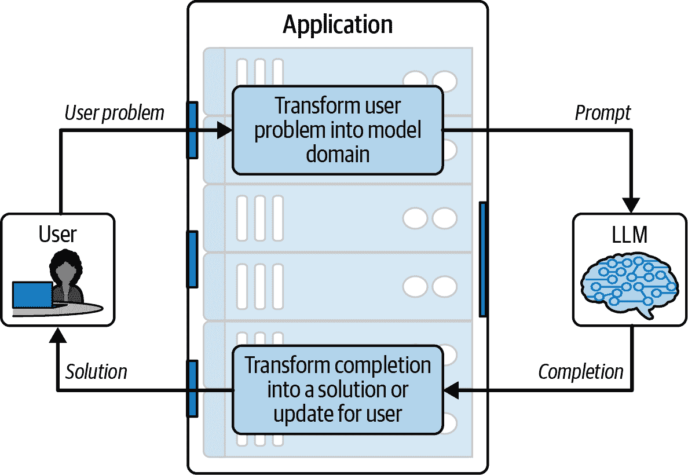
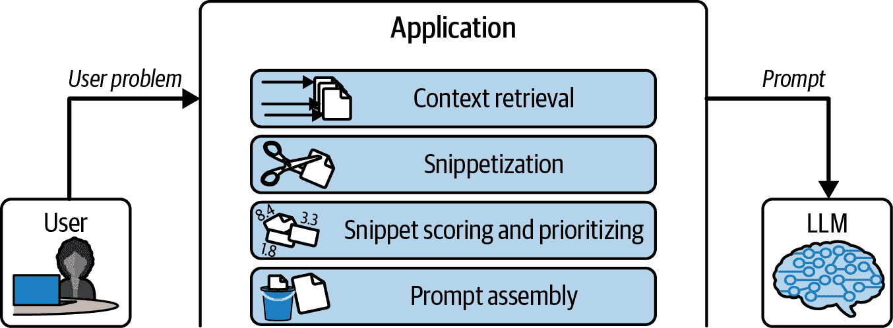
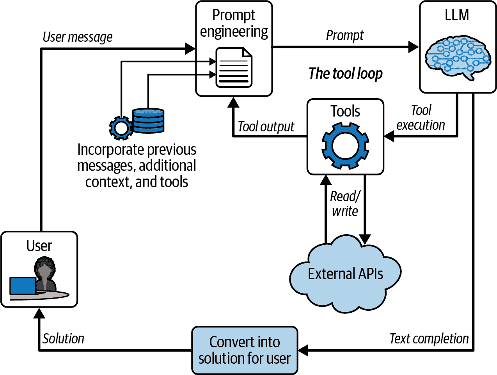

# 第四章. 设计 LLM 应用程序

前两章为本书的其余部分奠定了基础。第二章 详细介绍了 LLM 的工作原理，并证明它们最终实际上是逐个预测内容的文档完成模型。第三章 解释了聊天 API 是如何建立在第二章的 LLM 之上的。通过在 API 层面上添加一些语法糖和适量的微调，文档完成模型被用于完成用户和想象中的助手之间的对话。当你深入思考时，聊天模型实际上仍然是一个文档完成模型——只是它完成的文档都是对话记录。

从本书的这一部分开始，你将学习到构建 LLM 应用程序以解决公司及其用户问题的所有必要知识。本章是进入这一内容的门户。在本章中，我们将深入探讨 LLM 的 *应用*，你会发现这实际上是在用户问题域和模型文本域之间的一个转换层。此外，LLM 应用程序是一个具有目的的转换层——解决问题！

# 循环的解剖结构

在 图 4-1 中，LLM 应用程序被表示为一个 *循环*，意味着用户和模型之间的交互往返。模型和用户的领域通常相当不同。用户可能在进行各种事情，例如撰写电子邮件并寻找恰当的措辞来表达他们的观点。或者他们可能在进行一些复杂的事情，例如组织团队旅行、预订旅行票务和安排住宿。也许用户并没有直接与 LLM 应用程序接触；例如，他们可能设置了一个定期进行的重复分析，当有新数据可用时，LLM 应用程序会执行。重点是用户可以从事各种各样的活动。

相反，模型只做一件事——完成文档。但这一能力在构建 LLM 应用程序时为你提供了很大的灵活性。完成文档的能力使模型能够撰写电子邮件、代码、故事、文档，以及（原则上）任何人类可能撰写的内容。正如我们在上一章所展示的，聊天应用程序是一个完成 *记录* 文档的 LLM 应用程序，而工具执行只是进一步完成一个包含函数调用语法的专用记录文档。凭借其完成文本、参与聊天和执行工具的能力，LLM 可以应用于几乎无限数量的用例。



###### 图 4-1\. 基于 LLM 的应用实现了循环，它将用户领域的信息传递到 LLM 的文本领域，然后再返回

循环实现了用户领域和模型领域之间的转换。它将用户的问题转换为模型必须完成的文档或记录。一旦模型做出回应，循环将模型输出转换回用户领域，以用户问题的解决方案（或至少是正确方向的一步）的形式。

LLM 应用可能只涉及循环的一次迭代。例如，如果用户正在撰写电子邮件并希望将点列表转换为散文，那么只需通过这个循环一次——一旦模型返回散文，应用的工作就完成了。如果用户想要再次运行应用，可以这样做，但在每种情况下，循环都不会保留前一次运行的状态。

或者，LLM 应用可能连续多次运行循环，如聊天助手的情况。或者，LLM 应用可能迭代运行，参考大量状态，并根据问题形状的变化修改循环。旅行规划应用是这种情况的一个好例子。最初，应用会帮助构思旅行想法；然后，它会转向实际旅行安排；最后，它会设置提醒和旅行提示。

在以下章节中，我们将带您环游图 4-1 的循环。我们将讨论用户问题领域，将该问题转换为模型领域，收集完成内容，并将其转换回用户的解决方案。

## 用户的问题

循环从用户和他们试图解决的问题开始。表 4-1 说明了用户问题领域在多个维度上的变化，可以从简单到复杂。这些维度包括以下内容：

+   传达问题的媒介（对于 LLM 来说，文本是最自然的）

+   抽象级别（更高的抽象需要更复杂的推理）

+   需要的上下文信息（大多数领域需要检索用户提供的额外信息）

+   问题状态的多变性（更复杂的问题领域需要记住过去的交互和用户偏好）

如您在表 4-1 中看到的，用户问题领域在多个维度上具有不同的复杂程度。例如，校对应用在所有维度上都是低复杂度，而旅行规划助手则相当复杂。当您构建 LLM 应用时，您将以不同的方式处理这些复杂形式。在本章中，我们将向您展示这些方法，并在本书的其余部分提供更多细节。

表 4-1\. 复杂性四个维度（行）中的三个问题域（列）

|   | *复杂性增加➜* |
| --- | --- |
|   | 校对 | IT 技术支持协助 | 旅行计划 |
| --- | --- | --- | --- |
| ***问题媒介*** | 文本 | 电话语音 | 网站上的复杂交互、用户输入的文本和与 API 的交互。 |
| ***抽象层次*** | 问题具体、定义明确且规模小。 | 一个大的抽象问题空间和大的解决方案空间，但受限于可用的文档 | 涉及理解用户的主体偏好和客观约束，以便协调复杂的解决方案。 |
| ***所需上下文*** | 不仅仅是用户提交的文本。 | 可搜索的技术文档和示例支持转录本 | 访问日历、航空公司 API、最近的新闻文章、政府旅行建议、维基百科等。 |
| ***有状态性*** | 无状态性——每次对 API 的调用都包含一个独特的问题陈述。 | 必须跟踪对话历史和尝试过的解决方案 | 必须跟踪跨周的计划、不同的交互媒介和计划中断的分支。 |

## 将用户问题转换为模型域

从图 4-1 的循环中的下一个停靠点是应用程序内部，在这里用户的问题被转换为模型的域。提示工程的核心在于这一步。目标是创建一个提示，使其完成包含可用于解决用户问题的信息。仅仅构建一个恰到好处的提示是一项相当艰巨的任务，应用程序必须同时满足以下标准：

1.  提示必须与训练集中的内容非常相似。

1.  提示必须包含解决用户问题所需的所有相关信息。

1.  提示必须引导模型生成一个解决该问题的完成内容。

1.  完成必须有一个合理的终点，以便生成自然停止。

让我们深入探讨这些标准中的每一个。首先，提示必须与训练集中的文档非常相似。我们称之为*小红帽原则*。你还记得这个故事吗？一个穿着时尚红衣的纯真女孩沿着森林小径去探望生病的祖母。尽管母亲严厉警告，女孩还是偏离了道路，遇到了一只（大而坏）狼，然后故事真的变得糟糕——血腥……*血腥*。我们真的不可思议地给孩子们讲这个故事。

但就我们的目的而言，要点很简单：不要偏离模型训练的路径太远。你使提示文档越真实、越熟悉，它与训练集中文档的相似度越高，那么完成的结果就越有可能预测和稳定。小红帽原则是我们将在本书中多次回顾的原则。现在，只需说，你应该始终模仿训练数据中发现的常见模式。

###### 小贴士

大多数最好的 LLM 对它们的训练数据守口如瓶，这是有充分理由的。如果你确切知道它们的训练文档是如何格式化的，那么你在操纵提示和，比如说，寻找新的越狱策略上就占有了优势。然而，如果你想看看模型熟悉哪些类型的文档，那么最简单的事情就是——*直接询问*。例如，尝试以下请求：`**"哪些类型的正式文档对于指定公司的财务信息是有用的?"**`你应该会看到一大堆可以模仿你请求的文档。接下来，要求模型生成一个示例文档，看看它是否符合你的需求。

幸运的是，有无数种文档和图案可以借鉴。对于完成模型，看看你是否可以使提示类似于计算机程序、新闻文章、推文、Markdown 文档、通信记录等。对于聊天模型，整体文档由你决定——对于 OpenAI，这是一个以指导性系统消息开始，随后是用户和助手角色之间来回交流的 ChatML 文档。但你可以通过在用户消息中包含常见图案来使用小红帽原则。例如，利用 Markdown 语法来帮助模型理解内容的结构。使用井号（`#`）来分隔部分，反引号(`` ` ``) to delimit code, an asterisk (`*`) to indicate items in a list, etc.

Now, let’s look at the second criterion: the prompt must include all the information relevant to addressing the user’s problem. As you convert the user’s problem into the model’s domain, you must collect all of the information relevant to solving the user’s problem and incorporate it into the prompt. Sometimes, the user directly supplies you with all of the information that you need—in the proofreading example, the user’s raw text is sufficient. But at the other extreme, the travel planning application requires that you pull in user preferences, information from user calendars, airline ticket availability, recent news about the destination, government travel recommendations, etc.

Finding all the *possible* content is one challenge, and finding the *best* content is the next challenge. If you saturate the prompt with too much loosely relevant content, then the language model will get distracted and generate irrelevant completions. Finally, the content must be arranged in a well-formatted, logical document so that it makes sense—lest you stray off the path on the way to Grandmother’s house.

The third criterion to consider is that the prompt must condition the model to generate a completion that is actually helpful. If the LLM continues after the prompt by merely jabbering on about the user’s problem, then you’re not helping them at all. You must therefore carefully consider how to set up the prompt so that it points to a solution. When working with completion models, this can be surprisingly tricky. You will need to let the model know that it’s time to create the solution (see the homework example that follows). For chat models, this is much easier because the model has been fine-tuned to automatically produce a helpful message from the assistant that addresses the user problem. Thus, you don’t need any trickery to pull an answer out of the model.

Finally, you must ensure that the model actually stops! Here again, the situation is different for completion versus chat models. With chat, everything is easy—the model is fine-tuned to come to a stop after the helpful assistant message (though you might need to instruct the assistant to limit how chatty it is). With completion models, you have to be more careful. One option is to create an expectation in the instructional text that the solution should *not* go on forever; it should reach a solution and stop. An alternative is to create the expectation that some specific thing will follow and that it will begin with very specific and easily identifiable opening text. If such a pattern exists, then we can use the `stop` parameter to halt generation at the moment the opening text is produced. Both of these patterns are seen in the example covered next.

### Example: Converting the user’s problem into a homework problem

Let’s dig into an example to demonstrate the preceding concepts. Table 4-2 shows an example prompt for an application that makes travel recommendations based on a user’s requested location. The plain text is part of the boilerplate used to structure the prompt and condition it to provide a solution, and the italicized text is the information specific to the user’s current request. This example uses a completion API because it makes it easier to see each of the preceding criteria in action. (Note that building an actual travel app would be very complicated indeed! We chose this very simplified example because it demonstrates the ideas discussed previously. We talk about more realistic applications in Chapters 8 and 9.)

Table 4-2\. An example prompt for a travel recommendation application

| Prompt |  
```

# 休闲、旅游与旅游研究 101 - 家庭作业

为以下三个问题提供答案。每个答案都应该

要简洁，不超过一两个句子。

## 问题 1

你可以向客户推荐哪些是前三名的高尔夫目的地？

以简短的句子提供答案。

## 解决方案 1

圣安德鲁斯，苏格兰；佩布尔滩，加利福尼亚；以及奥古斯塔，乔治亚，

美国（奥古斯塔国家高尔夫俱乐部）是高尔夫旅行的绝佳目的地。

## 问题 2

假设一位客户来找你帮助他们制定*旅行计划

朝鲜平壤。*

你查看国务院的建议，他们建议

*"由于持续存在的严重风险，不要前往朝鲜"*

美国公民的逮捕和长期拘留。

由于对朝鲜的旅行存在严重的非法威胁，请谨慎行事。

拘留。"*

你查看最近的新闻，看到以下标题：

- *"朝鲜发射弹道导弹，日本表示"*

- *"平壤实施五天 COVID-19 封锁"*

- *"尹俊熙再次努力解决朝鲜严重的人权问题"*

请为顾客提供一份简短的旅行推荐。

顾客希望的目的地。你会告诉顾客什么？

## 解决方案 2

```py

 |
| Completion |  
```

也许现在朝鲜不是一个很好的目的地。

但我敢打赌我们可以在韩国找到一个不错的旅游地点。

```

|

首先，注意提示如何遵循小红帽原则——这是一个家庭作业问题，这种类型的文档你很可能在训练数据中经常看到。此外，文档以 Markdown 格式编写，这是一种常见的标记语言。这将鼓励模型以可预测的方式格式化文档，使用部分标题和语法来指示加粗或斜体字。在最基本层面上，文档使用正确的语法。这很重要，因为糟糕的语法会鼓励模型以类似的方式生成文本。显然，我们正稳步走向奶奶家。

接下来，看看提示如何结合 LLM 需要理解问题的上下文；这个上下文在 表 4-2 中以斜体形式出现。首先是实际的用户问题。可能用户刚刚从旅行网站的下拉菜单中选择了朝鲜；他们甚至可能不小心选了它。尽管如此，它被添加到提示中作为第一个加粗文本片段。随后的加粗文本片段是从其他相关资源中提取的：国务院旅行建议和最近的新闻文章标题。对于我们的例子，这些信息足以做出旅行推荐。

有几种方式可以引导模型走向明确的解决方案，而不是进一步阐述问题。在第一行，我们引导模型向希望看到的响应类型——休闲、旅行和旅游领域内的某种内容。接下来，我们包括一个示例问题。这与用户当前请求无关，但它为模型建立了一个模式：问题将以 `## 问题 N` 开头，随后将以 `## 解决方案 N` 开头提供解决方案。

问题 1 还鼓励在随后的答案中使用某种语气——简洁且礼貌。由于解决方案 1 是一个简短的句子，这进一步鼓励在完成过程中继续这种模式。有了这种模式，问题 2 就是实际的用户问题。我们设定了问题，插入上下文，并提出问题：`你会告诉顾客什么？` 使用文本 `## 解决方案 2`，我们表明问题陈述已经结束，现在是回答的时候。如果我们省略了这一点，那么模型可能会继续通过虚构更多关于朝鲜的信息来详细阐述问题。

最后的任务是坚持一个明确的停止点。由于每个新的 Markdown 部分都以##开头，我们有一个可以利用的模式。如果模型开始编造第三个问题，那么我们可以通过指定停止文本来切断模型生成，告诉模型一旦产生这个文本就停止生成。在这种情况下，一个合理的停止文本选择是`\n#`，这表示模型已经完成了当前解决方案，并开始了一个新的部分，可能是编造问题的第三部分。

### 聊天模型与生成模型

在前面的例子中，我们依靠一个生成模型来展示用户域与模型域之间转换的标准。随着聊天模型的引入，许多过程都得到了简化。聊天 API 确保输入到模型中的数据将非常接近微调数据，因为消息将被内部形成为一个转录文档（本节开头的第 1 个标准）。模型高度条件化，能够提供解决用户问题的响应（第 3 个标准），并且模型将在合理的位置停止——即在助手消息的结尾（第 4 个标准）。

但这并不意味着你，作为提示工程师，就可以免责！你必须完全负责包括解决用户问题所需的所有相关信息（第 2 个标准）。你必须编写聊天中的文本，使其类似于训练文档的特征（第 1 个标准）。最重要的是，你必须塑造转录、系统消息和功能定义，以便模型能够成功解决问题并达到停止点（第 3 和第 4 个标准）。

## 使用 LLM 完成提示

回顾图 4-1，在 LLM 应用循环的下一阶段，你将提示提交给模型并检索生成内容。如果你只玩过一种特定的模型，比如 ChatGPT，你可能会认为这里没有需要做的决定——只需将提示发送给模型并等待生成内容，就像我们在示例中展示的那样。然而，所有模型并不相同！

你将不得不决定你的模型应该有多大。通常，模型越大，其生成内容的质量越高。但有一些非常重要的权衡，比如成本。在撰写这本书的时候，运行 GPT-4 的成本可能是运行 gpt-3.5-turbo 的*20 倍*。这种质量提升是否值得价格上数量级的增加？有时候，是值得的！

另一个重要因素是延迟。更大的模型需要更多的计算，而更多的计算可能需要比用户能提供的更多时间。在 GitHub Copilot 的早期阶段，我们决定使用一个名为 Codex 的 OpenAI 模型，它体积小、*足够智能*且速度极快。如果我们使用了 GPT-4，那么无论补全结果有多好，用户很少会愿意等待。

最后，你应该考虑是否可以通过微调来获得更好的性能。在 GitHub 上，我们正在尝试微调 Codex 模型，以提供对不常见语言的高质量结果。一般来说，当您希望模型提供在模型最初训练的公共数据集中不可用的信息，或者希望模型表现出与原始模型不同的行为时，微调是有用的。微调的过程超出了本书的范围，但我们相信微调模型将变得更加简单和普遍，因此这绝对是一个你应该拥有的工具。

## 转换回用户领域

让我们深入探讨图 4-1 的循环的最后一阶段。LLM 的补全是一个文本块。如果你正在制作某种简单的聊天应用，那么你可能已经完成了——只需将文本发送回客户端并直接呈现给用户。但更常见的情况是，你需要转换文本或从中提取信息，使其对最终用户有用。

使用原始的补全模型，这通常意味着要求模型以非常特定的格式呈现特定数据，然后解析这些信息并将其呈现给用户。例如，你可能要求模型阅读一份文档，然后生成表格信息，这些信息将被提取并呈现给用户。

然而，自从函数调用模型出现以来，将模型输出转换为对用户有用的信息变得容易得多。对于这些模型，提示工程师概述用户的问题，给模型提供一个函数列表，然后要求模型生成文本。生成的文本代表一个函数调用。

例如，在一个旅行应用中，你可能为模型提供查找航班和描述用户旅行目标的功能。然后，模型可能会生成一个函数调用，请求特定日期的机票，以及用户请求的出发地和目的地。LLM 应用可以使用这个功能调用实际的航空公司 API，检索可用航班，并将它们呈现给用户——在用户的领域内。

你可以通过给模型提供实际上能改变现实世界的函数来更进一步。例如，你可以向模型提供实际上能购买票的函数。当模型生成一个购买票的函数调用时，应用程序可以与用户双重检查这是否可以，然后完成交易。因此，你将模型领域——表示函数调用的文本——转化为用户领域，形式是代表用户进行的实际购买。我们将在第八章和第九章中更详细地介绍这一点。

最后，当转换回用户领域时，你可能需要完全改变沟通的媒介。模型生成文本，但如果用户通过电话与自动技术支持系统交谈，那么模型完成结果需要转换为语音。如果用户使用具有复杂 UI 的应用程序，那么模型完成结果可能代表修改 UI 元素的事件。

即使用户的领域是文本，也可能仍然需要修改模型完成结果的呈现方式。例如，Copilot 代码补全在 IDE 中表示为灰色代码片段，用户可以通过按 Tab 键接受。但是，当你使用 Copilot 聊天请求代码更改时，结果将以红/绿文本差异的形式呈现。

# 放大前向传递

让我们花更多时间检查 图 4-1 中的 LLM-应用程序循环——特别是*前向传递*，这是循环中将用户问题转化为模型领域的那部分。本书剩余的大部分章节将详细讨论我们如何实现高质量完成。但在我们深入细节之前，让我们确定一些基础思想，这些思想将在接下来的章节中加以构建。

## 构建基本前向传递

前向传递由几个基本步骤组成，这些步骤允许你将用户问题转化为文本领域（见图 4-2）。本书的中间章节将详细介绍这些步骤。



###### 图 4-2\. 将用户问题转化为 LLM 领域的典型基本步骤

### 上下文检索

构建前向传递的第一件事是创建或检索作为提示上下文信息的原始文本。思考这个问题的方法之一是将上下文视为它是多么的*直接*或*间接*。

最直接的上下文直接来自用户，因为他们描述他们的问题时。如果你正在构建一个技术支持助手，这就是用户直接输入到帮助框中的文本；在 GitHub Copilot 中，这就是用户正在编辑的代码块。

间接上下文来自附近的有关来源。例如，如果你正在构建一个技术支持应用，你可能需要搜索文档以找到解决用户问题的摘录。对于 Copilot 来说，间接上下文主要来自开发者在 IDE 中的其他打开的标签页，因为这些文件通常包含与用户当前问题相关的片段。最间接的上下文对应于用于塑造模型响应的模板文本。对于一个技术支持应用来说，这可能就是提示符顶部的消息：“这是一个 IT 支持请求。我们尽一切努力帮助用户解决问题。”

提示符顶部的模板文本用于介绍一般问题。在提示符的后续部分，它充当粘合剂，以连接直接上下文中的各个部分，使其对模型有意义。例如，表 4-2 中的非粗体文本就是模板文本。表格顶部的模板文本介绍了旅行问题，而表格下方的模板文本则允许我们直接从用户那里获取有关旅行计划的信息，以及从新闻和政府来源获取的相关信息。

### 片段化上下文

一旦检索到相关上下文，就必须将其片段化并优先排序。*片段化*意味着将上下文分解成与提示符最相关的块。例如，如果你的 IT 支持应用执行文档搜索并返回多页结果，那么你必须只提取最相关的段落；否则，我们可能会超出提示符的令牌预算。

有时，片段化意味着通过将上下文信息从不同格式转换为文本片段。例如，如果技术支持应用是一个电话助手，那么你需要将用户的语音请求转录为文本。如果你的上下文检索调用 JSON API，那么将响应格式化为自然语言可能很重要，这样模型就不会将其响应中包含 JSON 片段。

### 评分和优先排序片段

原始 GPT-3.5 模型的令牌窗口仅为 4,096 个令牌，因此在任何 LLM 应用中，空间不足曾经是一个紧迫的问题。现在，随着令牌窗口超过 100,000 个令牌，在提示符中空间不足的可能性降低了。然而，仍然非常重要，尽可能保持提示符简洁，因为大量无关的文本会混淆模型并导致更差的完成结果。

为了挑选最佳内容，一旦你收集了一组片段，你应该为每个片段分配一个优先级或分数，以反映该片段对提示的重要性。我们对分数和优先级有非常具体的定义。*优先级*可以被视为整数，根据片段的重要性和在提示中的作用建立层级。在组装提示时，你将确保在深入下一层级的片段之前，先利用所有更高层级的片段。另一方面，*分数*可以被视为浮点值，强调片段之间差异的细微差别。在同一优先级层级的某些片段比其他片段更相关，应该首先使用。

### 提示组装

在最后一步，所有这些片段素材被组装成最终的提示。在这个过程中，你有许多目标：你必须清楚地传达用户的问题，尽可能地将提示填充最佳支持上下文——并且你必须*确保*不要超过令牌预算，因为在这种情况下，你从模型那里得到的将只是一个错误信息。

正是在这一点上，会计工作变得尤为重要。你必须确保所有你的模板指令都适合提示上下文，确保用户的要求适合，然后尽可能收集更多的支持上下文。有时，在这个过程中，你可能想要在最后一刻努力缩短上下文。例如，如果你知道整个代码文件与用户的答案相关，但又不适合，那么在这个步骤中，你可以选择省略（删除）不那么相关的代码行，直到文档适合。如果你有一个很长的文档，你也可以使用摘要。

除了确保所有部件都适合外，你还必须确保它们被组装成正确的顺序。然后，最终的提示文档应该像你可能在训练数据中找到的文档一样（引领小红帽直接走向奶奶家）。

## 探索循环的复杂性

上一节重点介绍了最简单的 LLM 应用类型——这种类型在向模型发出单个请求完成所有工作后，然后将完成的内容返回给用户。这种简单的应用很重要，因为它是一个起点。它提出了构建越来越复杂应用的基本原则。随着应用的复杂化，有几个维度在这个复杂性中发挥作用：

+   更多的应用状态

+   更多外部内容

+   更复杂的推理

+   与模型外部世界的更复杂交互

### 持久化应用状态

上一节中的前馈应用没有持久的状态。它只是接受用户的输入，添加一些*希望*相关的上下文，将其传递给模型，然后将模型的响应传递回用户。在这个简单的世界中，如果用户再次请求，应用不会记得之前的交流。Copilot 代码补全就是一个按照这种方式工作的应用。

更复杂的 LLM 应用通常需要在请求之间保持状态。例如，即使是最基本的聊天应用也必须维护对话记录。在聊天过程中，当用户向应用提交新消息时，应用会在数据库中查找这个对话线程，并使用之前的交流作为下一个提示的进一步上下文。

如果用户的交互过程较长，你可能需要缩减历史记录以适应提示。最简单的方法就是截断对话并切断早期的交流。但这并不总是可行的！有时，内容过于重要而不宜删减，因此另一种方法是总结对话的早期部分。

### 外部上下文

LLMs——即使是最好的——也不是全能的。他们怎么可能呢？他们只接受了公开可用的数据训练，对隐藏在公司、政府或个人隐私墙背后的最近事件和信息一无所知。如果你询问模型它不具备的信息，那么理想情况下，它会道歉并解释它无法访问该信息。这不会导致用户满意，但比起另一种情况——模型自信地编造一个答案并向用户传达完全错误的信息——要好得多。

因此，许多大型语言模型（LLM）应用都采用了检索增强生成（RAG）技术。在 RAG 中，你通过从模型训练期间不可用的来源中提取的上下文来增强提示。这可以是公司文档、用户的医疗记录、最近发生的事件以及最近发表的论文等任何内容。

这些信息被索引到某种搜索引擎中。许多人一直在使用嵌入模型将文档（或文档片段）转换为可以存储在向量存储（如 Pinecone）中的向量。然而，你不应该对传统的搜索索引（如 Elasticsearch）嗤之以鼻，因为它们通常相对简单易管理，并且在你似乎找不到所需文档时更容易调试。

实际检索上下文通常遵循一系列可能的方法。最简单的是直接使用用户的请求作为搜索查询。然而，如果用户的请求是一个长的连续段落，那么它可能包含一些无关的内容，这会导致索引返回虚假匹配。在这种情况下，你可以询问 LLM 它认为一个好的搜索会是什么，然后只需使用它的响应文本来搜索索引。最后，如果你的应用程序与用户进行某种形式的长时间聊天，那么可能根本不明显何时值得搜索某些内容；你不能为他们的每个评论检索文档，因为他们可能还在谈论与他们的最后评论相关的文档。在这种情况下，你可以向助手引入一个*搜索工具*，让助手选择何时进行搜索以及使用什么搜索词。（我们将在稍后介绍工具的使用。）

### 增加推理深度

正如我们在第一章中提到的，从 GPT-2 开始的更大 LLMs 真正令人惊叹的事情是，它们开始比前辈更广泛地泛化。标题为“[“语言模型是无监督的多任务学习者”](https://oreil.ly/MEw4b)”的论文正是这个观点——在数百万个网页上训练的 GPT-2 能够击败之前需要非常专业模型训练的几个类别的基准。

例如，要使 GPT-2 总结文本，你可以在文本末尾附加字符串`**TL;DR**`，然后就是！要使 GPT-2 将文本从英语翻译成法语，你只需提供一个示例翻译，然后提供要翻译的英语句子。模型会注意到这个模式并相应地进行翻译。这就像模型实际上以某种方式在*推理*提示中的文本一样。在随后的几年里，我们发现了一些从 LLMs 中引发更复杂推理模式的方法。一种简单但有效的方法是坚持要求模型在提供问题的答案之前展示其逐步的思考过程。这被称为*思维链*提示。这种直觉背后的想法是，与人类不同，LLMs 没有内部独白，因此它们在回答之前不能真正地*思考*问题。

相反，每个标记都是作为前一个标记的函数机械生成的。因此，如果你想让模型在回答问题之前“思考”一下，这种思考必须在完成过程中“大声”进行。之后，当计算后续标记时，模型将预测与先前标记尽可能一致的标记，因此与它们的“思考过程”一致。这通常会导致推理更加合理的答案。

随着 LLM 应用需要完成更复杂的工作，提示工程师必须找到巧妙的方法来分解问题，并激发每个组件的正确逐步思考，以驱动模型达到更好的解决方案。

### 工具使用

单独来看，大型语言模型在封闭世界中行动——它们对现实世界一无所知，并且无法对现实世界产生影响。这种限制严重限制了 LLM 应用的实用性。为了应对这种弱点，现在大多数前沿的 LLM 都能够通过*工具*与世界互动。

请查看图 4-3 中的*工具循环*。其想法很简单。在提示中，你让模型意识到它可以使用的一个或多个工具。这些工具将看起来像包括名称、几个参数以及名称和参数描述的函数。在对话中，模型可以选择执行这些工具——基本上是通过调用一个具有适当参数集的函数。



###### 图 4-3\. 包含内部工具循环的更复杂的应用循环

注意，LLM 应用可能会变得相当复杂。对话是有状态的，上下文必须从一次请求保留到下一次请求。来自外部 API 的信息用于增强数据，工具执行循环可能在应用和模型之间来回迭代多次，信息才能返回给用户*。

自然地，模型本身没有能力实际执行代码，因此拦截模型从 LLM 应用中执行该函数调用的责任就落在了 LLM 应用上，并执行现实世界的 API 以及从提示中附加的信息。正因为如此，在下一轮中，模型可以使用这些信息来对当前的问题进行推理。

考虑工具使用的早期论文之一是[“ReAct: 在语言模型中协同推理和行动”](https://arxiv.org/abs/2210.03629) (2022)。它介绍了三个工具：`search`、`lookup`和`finish`，分别允许模型在维基百科中搜索、查找维基百科页面中的相关文本块，并向用户返回答案。这展示了工具使用如何与 RAG 重叠——即，如果你向模型提供搜索工具，它将能够自行决定何时需要外部信息以及如何找到它。

然而，搜索是一种只读行为。同样，连接到外部 API 的工具，如检查温度、确定你是否收到了新邮件或检索最近的 LinkedIn 帖子，也都是只读的。真正有趣的地方在于，当我们允许它们将更改写入现实世界时。由于工具使模型能够访问任何可想象的现实世界 API，你将能够创建基于 LLM 的助手，这些助手可以编写代码和创建拉取请求，帮助你规划旅行并预订机票和住宿，等等。当然，*权力越大，责任越大*。模型是概率性的，*经常*会出错，所以不要让 LLM 应用仅因为用户表示他们有一天想去希腊就预订旅行！

# 评估 LLM 应用质量

再次强调，LLM 是概率性的，*经常*会出错。因此，在设计并生产化 LLM 应用时，持续评估应用质量至关重要。在你发布新的基于 LLM 的功能之前，花时间原型化功能并收集一些关于模型如何反应的定量指标。然后，一旦功能发布，你的应用应该记录遥测数据，这样你就可以密切关注模型和用户的行为，以便快速确定应用质量的任何下降。

## 线下评估

*线下评估* 是在将新想法应用于你的 LLM 应用之前，向用户展示未经测试的新体验。实际上，线下评估甚至比我们在本节后面描述的在线评估更为复杂。因为，在将一个功能发布到生产之前，你没有任何客户告诉你“好”或“坏”，你必须找出一些模拟的代理来评估这一点。

有时候，你会很幸运。例如，对于 Copilot 代码补全，用户满意度的良好代理是代码是否功能完整。在代码的情况下，这实际上很容易衡量——如果你可以删除工作代码的片段，然后生成一个仍然通过测试的补全，那么代码就是有效的，你的用户可能会对生产中的类似补全感到满意。这正是我们在发布之前评估更改的方式——我们抓取了数百个仓库，确保它们的测试运行，然后外科手术般地删除并生成代码片段，然后查看测试是否仍然运行。

通常，你不会这么幸运。你如何评估一个预期创建真实世界交互的调度助手，以及如何评估一个让用户参与开放式对话的通用聊天应用？一种新兴的方法是让 LLM 充当法官，就像人类法官一样，审查聊天记录并确定哪个变体最好。判断可以是对基本问题的回答，例如“哪个版本更好？”然而，为了得到更细致的评分，你可以给法官一份清单，列出每个变体需要审查的标准。

无论你选择如何评估你的 LLM 应用，始终尝试尽可能多地让应用参与到评估中。可能更容易伪造应用的上下文收集步骤并仅测试提示组装和提示模板；有时，模拟上下文甚至不可避免。但通常，上下文收集步骤在构建高质量 LLM 应用时变得更加重要。如果你回避上下文收集或应用的任何其他方面，那么应用质量保证将处于危险之中，当新功能投入生产时，你可能会遇到令人不快的惊喜。

## 在线评估

在在线评估中，你寻找的是用户对应用是否提供良好体验的反馈。反馈不必涉及填写长表，但在线评估的生命线是遥测数据——所以测量*一切*。

评估质量的一个明显方法就是直接询问用户。在 ChatGPT 和其他基于聊天的 LLM 体验中，你可能看到每个助手消息旁边的小点赞或点踩按钮。虽然这似乎是质量的一个明确指标，但你必须考虑到偏见。可能只有真正愤怒的用户才会投票——他们总是投反对票。而且，从比例上来说，与上下/下按钮互动的流量并不多。所以除非你的应用流量真的很大，否则你可能无法从上下/下按钮中获得足够的数据。

显然，我们必须在测量方法上更加富有创意——因此你必须考虑*隐含*的质量指标。对于 GitHub Copilot 代码补全，我们测量补全被接受的程度，并检查用户在接受补全后是否返回并修改我们的补全。对于你自己的应用，你可能会找到自己隐含测量质量的方法。在解释隐含反馈时要谨慎。如果你正在构建一个基于 LLM 的调度助手，并且用户互动后迅速离开，那么这可能是因为他们高效地完成了任务（太好了！），但也可能是用户感到沮丧，完全放弃了体验。

测量一些有意义的事情——一些能够展示为你的客户带来生产力提升的事情。Copilot 选择了接受率作为关键指标[因为它与用户的效率提升高度相关](https://oreil.ly/Do5qI)。对于一个日程安排助手，与其测量会话长度，这本身就不明确，不如寻找成功创建的日历事件，并跟踪用户在事后更改事件细节的频率。

# 结论

在前几章学习了 LLM 的工作原理之后，在本章中，你了解到 LLM 应用实际上是在用户问题域和 LLM 工作的文档域之间的一个转换层。我们聚焦于循环的前馈部分，并学习了提示是如何通过收集与用户问题相关的上下文、提取最重要的部分并将它们组装成提示文档的模板文本来形成的。然后，我们退后一步，观察了复杂提示工程可能变得多么复杂，因为它需要状态管理、与外部上下文的集成、日益复杂的推理以及与外部工具的交互。

在本章中，我们简要地涉及了 LLM 应用开发领域的每一个主题。但在下一章中，我们将深入探讨本章中介绍的所有主题。你将了解到*从哪里*获取上下文，*如何*创建片段并对其进行优先排序，以及*如何*构建一个能够有效解决用户需求的提示。然后，在后续章节中，我们将深入研究更高级的应用，并详细说明如何使用这些基本概念来创建对话代理和复杂的流程。
