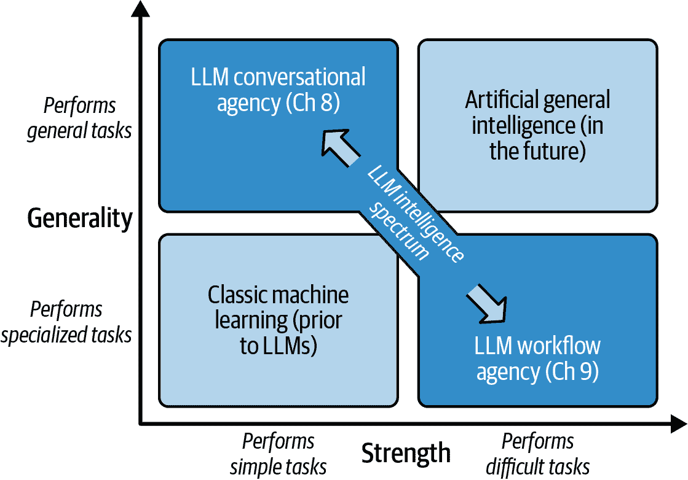
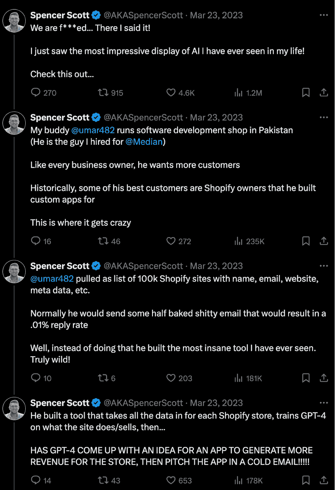
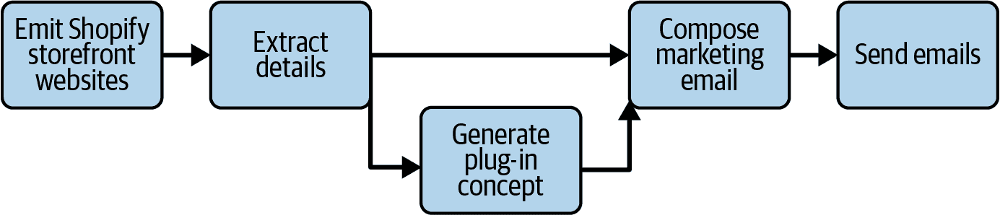
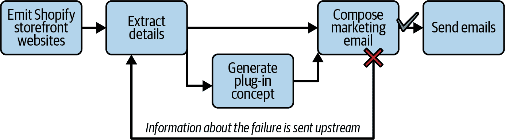

# 第九章. LLM 工作流程

经典的机器学习模型通常只擅长一个领域中的一个技能——例如，对推文的情感分析、从信用卡交易中检测欺诈、将英语翻译成法语等。随着 GPT 模型的问世，一个模型现在可以执行来自看似任何领域的无数种任务。

尽管自从 GPT-2 以来模型质量有了巨大的提升，但我们离创造通用人工智能（AGI）还相去甚远，AGI 是一种达到或超过人类认知水平的 AI。当我们最终创造 AGI 时，它将能够吸收知识，对其进行分析，解决新颖和复杂的问题，甚至生成新的知识。AGI 将使用类似人类的创造力来解决任何领域的现实世界问题。

相比之下，今天的 LLMs 在推理和问题解决方面表现出明显的不足，尤其是在数学方面，而数学是科学发现的一个关键组成部分。它们生成的文本展示了广泛的知识理解，但很少引入任何新内容。而且，在训练之外，这些模型无法学习新信息。未来的 AGI，按照定义，将具备两种*优势*（解决复杂问题的能力）和*通用性*（在任何领域解决问题的能力）。但就目前的 LLMs 而言，似乎在智能的这两个方面之间存在权衡（参见图 9-1）。

在光谱的一端是上一章中介绍过的对话代理。在极端情况下，像 ChatGPT 这样的纯聊天应用*极其*通用——它可以与你谈论你感兴趣的一切。但它不会为你解决复杂任务。如果你为特定领域定制代理的系统消息，并为其配备该领域的工具集，那么代理将变得不那么通用，但更擅长在该更窄领域内完成任务。尽管如此，对话代理仍然最适合涉及一次或两次步骤的任务，并且需要用户的实际帮助来完成工作。

在本章中，我们将沿着这个光谱进一步探索，为了完成更复杂的任务，我们将在一些通用性上进行权衡。我们将介绍 LLM 工作流程，通过聚焦领域和构建更严格的框架来引导 LLM 的决策，从而提高其能力。使用 LLM 工作流程，你可以将一个大任务分解成小而明确的任务，这些任务可以以高保真度执行。一个管理过程（可能使用也可能不使用 LLM）协调任务，分配工作，收集结果，并通过一个旨在实现预期结果的工作流程进行操作。工作流程不会处理任意用户请求。相反，它是为特定任务设计的，因此它将比对话代理更有能力完成该任务。



###### 图 9-1\. LLMs 比经典机器学习更强大、更通用，但它们还没有达到 AGI；相反，在通用性和强度之间存在权衡

注意，本章主要避免讨论现有的 LLM 框架——LangChain、Semantic Kernel、AutoGen、DSPy 等。而不是深入到具体的实现细节，本章保持讨论的宏观层面。你应该能够将这里的方法应用到任何你想要的框架中，或者，正如我们有时推荐的那样，根本不需要任何框架！

# 对话代理是否足够？

在深入探讨工作流程代理之前，让我们考虑一下，如果你尝试使用对话代理来完成更多更复杂的任务会发生什么。我们将在本节中介绍一个例子，一旦我们展示了车轮如何掉落，我们将在本章的其余部分回到这个例子。

假设你在一间精品软件开发公司工作，该公司构建 Shopify 店面插件。生意清淡，所以你有了这样一个疯狂的想法：构建一个 LLM 应用，生成插件想法并将其推广给店面所有者。以下是你可以这样做的方式：

1.  生成一份流行的 Shopify 店面列表并检索它们的网站 HTML。

1.  对于每个店面，提取详细信息——产品提供、品牌、风格、价值观等。

1.  审查每个店面并提出一个能对其业务有益的插件。

1.  为每位店面所有者生成推广插件概念的营销邮件。

1.  发送邮件。

这听起来像是一个非常疯狂的想法，对吧？你基本上是在为尚未存在的软件产品发送邮件！LLM 应用真的能完成这样的工作吗？它是否足够好，以至于人们可能会回邮件给你？

答案是肯定的。2023 年初，当整个世界开始应对 LLM 应用的新力量和可能性时，一位创业开发者就是这样做的（见图 9-2）。

这个话题继续揭示了一些真正令人印象深刻的轶事——一键发送数千封营销邮件，一些真正有创意的产品想法，以及一些来自真实网站所有者的热切回应。最好的 GPT-4 生成的想法是为一家袜子店。这是一个名为 Sock-cess Stories 的网页（见图 9-3）。你必须承认，这是一个很好的销售方案。



###### 图 9-2\. 斯宾塞介绍了他的朋友乌马尔令人瞩目的 LLM 创新


###### 图 9-3\. 一个让我目瞪口呆的 LLM 生成的促销邮件

但你能用对话代理实现这一点吗？让我们从最简单的情况开始，一个没有任何工具的对话代理，以及以下开放式的系统消息：“你是一个有用的助手。你可以做任何事情——*你只需要相信*。”在引言中概述的通用性到强度的光谱上，这个代理是*完全*通用的，但非常弱。

要启动 Shopify 任务，你可以简单地将指令列表作为用户消息传递——类似于“抓取大量 Shopify 店面，为每个店面想出新的插件，然后为每个店面发送关于这个想法的推广电子邮件。”结果，这里就不赘述了，并不十分有用。最终，助手告诉你它不能搜索网络、浏览特定网站或发送电子邮件。相反，它为你生成一个假设的计划，这几乎只是对你原始指示的详细阐述。

显然，这不可能奏效，但你可以为你的代理提供一些工具来帮助它获得更好的结果。具体来说，给它它所请求的工具：`search_web`、`browse_site` 和 `send_email`。这稍微不那么通用，因为你已经将范围从“实际上任何东西”缩小到“与网络相关的东西”，但它的功能更强大，因为代理现在可以触及现实世界。

如果你用这个设备更完善的对话代理再次运行相同的请求，你还是会感到失望。收集候选店面店面的方法很天真——它将提交一个简单的网络搜索“2024 年最佳 Shopify 店面”，生成几个简短描述的插件”，并生成一封电子邮件，这封电子邮件几乎就是一封形式化的信件，实际上包括了 `[你的名字]`——除非你真的很幸运，否则 `send_email` 所能做的只是向潜在客户发送非常糟糕的营销邮件。

但我们还没有放弃；让我们进一步推动对话代理向力量靠近，而不是通向通用性。与其要求代理为你完成这项工作，不如将指示移入系统消息中——这样就将这个代理定义得非常狭窄。确保在系统消息中提供非常具体的细节，涵盖刚才提到的所有问题方面。你也可以选择为代理提供更多针对这项具体工作的有帮助的工具，每个工具都有其自己的描述和细节。但在这个过程中，你正在做出权衡。系统消息和工具的结合将使基本提示更大、更复杂，这可能会让代理在任务变得更长时感到分心和困惑。

实际上，情况甚至更糟。对话代理没有提供一种简单的方式来处理工作单元。一次性将它们全部塞进去将是一场灾难，而逐个处理它们将需要你设置一个队列——所以你已经知道你将不得不构建比对话代理更复杂的“某种东西”。而且由于代理在完成工作时有某种自由度，那么当某件事失败时，你该如何修复它？系统消息基本上是一个强烈的建议，没有更多。

这些负面结果展示了更多结构的需求。对话代理不适合这样的复杂工作流。相反，这个代理的每个步骤都应该被隔离并定义为它自己的专用任务，并将所有任务组合成一个工作流程。在本章的剩余部分，我们将看到工作流程如何更好地服务于我们的目的。

# 基本 LLM 工作流程

在本章的后半部分，我们将讨论一个任务驱动器为 LLM 的工作流程。在本节中，我们将讨论更常见的 LLM 工作流程模式，其中每个任务可能都会使用 LLM，但总体工作流程只是一个传统的、无装饰的工作流程，它通过将工作项从每个任务传递到其连接的下游任务来驱动。

如图 9-4 所示，构建基本工作流程所需的步骤如下：

1.  *定义目标*。确定工作流程的目的。工作流程将实现什么样的预期输出或预期变化？

1.  *指定任务*。将工作流程分解成一系列任务，当按正确顺序执行时，将实现你的目标。对于基于 LLM 的任务，考虑每个任务将需要的工具。还要确定每个任务的输入和输出。

1.  *实施任务*。按照指定构建任务。确保输入和输出定义清晰。确保每个任务在独立情况下都能正确工作。

1.  *实施工作流程*。将任务连接成一个完整的工作流程。如有必要，调整任务以确保它们在完整工作流程的上下文中正确运行。

1.  *优化工作流程*。优化任务以提高质量、性能和成本。


###### 图 9-4\. 构建工作流程的工作流程……你不得不爱这种元幽默！

工作流程之所以如此吸引人，是因为它是模块化的。因为我们正在将复杂问题分解为其组成部分，所以更容易构建；当某件事出错时，更容易推理和隔离问题。

让我们回到 Shopify 插件推广插件，并逐步说明构建成功的 LLM 工作流程所需的步骤。我们已经定义了目标：构建一个 LLM 应用程序，生成插件想法并将其推广给店面所有者。在下一节中，我们将讨论步骤 2 和 3，即指定和实施任务。

## 任务

创建工作流的第二步是指定任务。让我们只使用我们在介绍 Shopify 示例时已经提出的任务：

1.  生成一份流行的 Shopify 店面列表，并检索它们的网站 HTML。

1.  对于每个店面，提取详细信息——产品提供、品牌、风格、价值观等。

1.  审查每个店面，并提出一个能对其业务有益的插件。

1.  为每个店面生成推广插件概念的营销电子邮件。

1.  发送电子邮件。

现在，让我们进入第 3 步——实现任务。*任务*这个词是一个熟悉的术语——任务是整体目标的子步骤。任务可能是纯算法性的，并使用传统的软件实践实现，或者任务可以使用 LLMs 实现。

在完成的流程中，任务将相互连接，以便一个任务的输出将成为下一个任务的输入。因此，每个任务的输入和输出必须定义良好。完成任务需要哪些信息？它将提供哪些输出信息？输入和输出是有结构的文本还是自由形式的文本？如果是结构化的，那么它们的架构是什么？

让我们看看 Shopify 示例中的电子邮件生成任务。输入应该是一个插件的想法，但你应该使其更加具体。让我们使用表 9-1 中定义的架构。

表 9-1\. 字段定义和示例，描述用作电子邮件生成任务输入的 Shopify 插件

| 字段 | 数据类型 | 内容 | 示例 |
| --- | --- | --- | --- |
| `name` | 文本 | 插件名称 | Sock-cess Stories |
| `concept` | 文本 | 基本想法 | 一面展示商店商品的故事和自拍墙 |
| `rationale` | 文本 | 这个想法为什么好 | 为了推动参与并推广温暖的品牌形象 |
| `store_id` | Uuid | 用于检索商店详情 | `550e8400-e29b-41d4-a716-446655440000` |

类似地，电子邮件任务的输出可以使用表 9-2 中定义的架构。

表 9-2\. 字段定义和示例，描述使用电子邮件生成任务输出的电子邮件

| 字段 | 数据类型 | 内容 | 示例 |
| --- | --- | --- | --- |
| `subject_line` | 文本 | 邮件主题 | 介绍您的店面 Sock-cess Stories。 |
| `body` | 文本 | 基本想法 | 您的袜子店很棒；我们可以一起让它变得更好。 |

除了指定输入和输出外，您还需要对任务应该如何完成有一个相当清晰的想法。例如，电子邮件任务不仅要生成发送给店面所有者的内容，而且应该是一种特定类型的**内容**——一种旨在吸引所有者、基于商店网站展示的价值和主题的有趣展示。

因此，邮件生成任务将需要来自网页的内容以及提示来使模型生成特定类型的响应。任务的“如何”不需要像输入/输出模式那样严格定义，因为改变任务内容比改变其界面要容易得多。然而，它应该足够明确，以确保这是一个合理的任务。否则，当你开始构建任务时，你可能会发现自己回到了起点，重新排列任务或重新设计界面。

### 基于 LLM 的任务实施

因此，你已经定义了你的工作流程，并将其拆分成小块任务，每个任务都有明确的功能和定义良好的输入输出。现在，是时候开始实施这些任务了。你的任务是否可以在没有大型语言模型（LLM）的情况下实施？如果是这样，那真是太好了——LLM 贵、慢、非确定性，并且不如传统软件可靠。但是，既然你已经深入到一本关于 LLM 应用程序开发的书籍中，那么很可能你的大多数任务都会显著使用 LLM。因此，在本节中，我们将为您概述如何实施此类任务。

#### 模板提示方法

一个选择是只为当前任务构建一个定制的提示模板。这实际上是 LangChain 鼓励的方法——链中的每个“链接”都是一个简单的提示模板，它使用输入填充缺失的值，然后解析相应的完成部分以提取输出。

当你构建一个提示模板时，你将使用本书到目前为止所教授的所有内容——收集与任务相关的信息，对其进行排序，将其修剪以适应可用的提示上下文，然后组装一个文档，其中完成部分满足预期的目的。对于 Shopify 邮件生成任务，目标是撰写一封展示针对店主网站定制的插件概念的营销邮件。上下文需要包含有关他们网站的详细信息以及插件概念的详细描述。如果你正在使用完成模型，如表 9-3 所示，提示将解释当前任务，展示上下文，然后让模型生成一封邮件。请注意，在表中的示例中，你的公司名称是 JivePlug-ins，输入被插入到模板中，完成部分被用作输出。

表 9-3\. 完成模型的提示模板

| 前缀 |
| --- |

```py
# Research and Proposal Document
JivePlug-ins creates delightful and profitable Shopify plug-ins. 
This document presents research about {storefront.name}, our 
plug-in concept "{plugin.name}", and an email sent to the store 
owner {storefront.owner_name}.

## Store Website Details
{storefront.details}

## Plug-in Concept
{plugin.description}

## Proposal to Storefront Owner
Dear {storefront.owner_name},

```

|

| 后缀 |
| --- |

```py
We hope to hear from you soon, 
JivePlug-ins
```

|

这只是一个起点，而不是最终的模板。在运行几次以了解它产生的完成结果之后，你可能会澄清模板中关于如何编写邮件的具体说明——它应该是乐观的，应该赞美店主等。你也可能提供更多描述性的模板文本，围绕店面细节和插件描述，以便模型更好地理解它所阅读的内容。

重要的是，每个任务都需要对完成结果进行后处理并提取将被下游任务消费的输出值。在表 9-3 的提示中，这通过在前面添加`Dear {storefront.owner_name}`和在后面添加`We hope to hear from you soon,`来实现。使用这种表述方式，完成内容的正文将正好是你想要发送给潜在客户的邮件内容，没有更多。

#### 基于工具的方法

通常，你的工作流程将包含从输入中提取结构化内容的任务。例如，一个抓取餐厅信息的任务可能会接收餐厅页面的 HTML，然后提取餐厅的名称、地址和电话号码。具有工具调用能力的模型使这项任务变得简单。只需定义一个工具，该工具接受你希望提取的结构作为参数，然后设置提示以调用此工具。表 9-4 中显示的模板应该可以解决问题。

表 9-4\. 使用基于工具的方法从自由格式输入数据中收集结构化内容的示例

| 系统 | `你的任务是提取关于餐厅的内容并将其保存到数据库中。` |
| --- | --- |
| 工具 |

```py
{
  "type": "function",
  "function": {
    "name": "saveRestaurantDataToDatabase",
    "description": "Saves restaurant information to the database.",
    "parameters": {
      "type": "object",
      "properties": {
        "name": {
          "type": "string",
          "description": "The name of the restaurant",
        },
        "address": {
          "type": "string",
          "description": "The address of the restaurant",
        },
        "phoneNumber": {
          "type": "string",
          "description": "The phone number of the restaurant",
        },
      },
      "required": ["name"],
    },
  },
}
```

|

| 用户 |
| --- |

```py
The following text represents the HTML of a restaurant website. Can you 
extract the name, address, and phone number of the restaurant and save it 
to the database?

{restaurant_html_content}
```

|

如果你使用 OpenAI 模型，甚至可以使用`tool_choice`参数来指定完成必须执行该工具：`{"type": "function", "function": {"name": "saveRestaurantDataToDatabase"}}`。使用这种方法，模型将使用你寻求的结构化信息调用`saveRestaurantDataToDatabase`。实际上是否存在数据库并不重要。你只是试图说服模型提交它从 HTML 中读取的信息。最近，OpenAI 在函数调用中引入了[强制结构化输出的能力](https://oreil.ly/5kTO0)。这将有助于确保解析后的输出结构正好是你需要的。在工具调用中接收到的信息然后可以传递给下游任务。

如果你遇到这种方法的问题，可能有两个可能的原因。首先，可能很难从你正在处理的文档中提取结构化内容。你尝试自己做了吗？如果人类做不到，那么模型将无能为力。为了解决这个问题，重新阅读你的提示并对其进行清理，使其更容易理解。

问题可能的另一个来源是您正在提取的结构，它可能过于复杂。结构有很多键吗？是否有嵌套的对象或列表？某些字段可能是空或空的吗？在这些情况下，考虑将结构分解成更小的部分，可以一次处理一部分。作为额外的优势，当你专注于更小的信息块时，你也有机会传达更多关于提取这些信息块的具体指令。这肯定会提高你的结果。

### 为任务增加复杂性

所以你已经完成了第一个草稿任务，但你还没有看到你期望的高质量结果。别担心，现在只是时候退一步，考虑在提示工程中采用更复杂的方法。考虑以下提示工程方法。

在第八章中，我们介绍了[思维链推理](https://arxiv.org/abs/2201.11903)和[ReAct](https://arxiv.org/abs/2210.03629)。这两种提示工程技术都引导模型在采取行动使用工具和得出最终答案之前，首先“大声思考”问题。如果你的 LLM 任务在完成任务时没有表现出足够的深思熟虑，那么你可以在提示中添加一个“让我们一步一步思考”的步骤，在要求更精确的答案之前，你可能会显著提高结果。

此外，如果模型在没有首先规划方法的情况下快速跳到函数调用，那么请请求模型关闭函数调用。这将给模型一个机会在采取下一步行动之前对问题进行推理。使用 OpenAI 的 API，你可以通过将`tool_choice`设置为`"none"`来实现这一点。然而，请确保你继续在请求中包含工具规范——你希望模型在下一个请求中推理出它将如何使用你指定的工具。如果你使用 Anthropic 的 Claude 模型，那么思维链推理默认在 Opus 模型上发生，而 Sonnet 和 Haiku 模型将在被提示时使用思维链推理。

你会发现基于 LLM 的任务的一个常见问题是，它们会自信地结束任务并给出输出——但这是错误的。它可能格式不正确，或者实际上没有回答问题。如果是一段代码，那么它可能存在错误或甚至语法错误。首先尝试的是仅仅收紧提示文本，确保你的要求清晰且定义良好。作为一个人类，当你阅读提示时，你会知道该做什么吗？

但如果任务继续失败，你可能需要应用自我纠正。实现这一目标的一种技术是[Reflexion](https://arxiv.org/abs/2303.11366)，其中你使用你认为合适的任何提示工程方法来完成你的任务。（论文以 ReAct 为例。）然后，在应用层，你将对输出进行分析，以查看它是否满足你的要求。

分析可能是一个快速检查，看看格式是否正确。如果你的任务输出代码，你可以尝试编译代码并对其运行单元测试。分析甚至可以要求一个 LLM 审查输出。（你将听到它被称为*LLM-as-judge*。）无论如何，分析将生成一个报告。如果报告表明任务输出满足你的要求，那么你就完成了。

但是，这里就是 Reflexion 发挥作用的地方：如果报告表明输出在某些方面不足，那么你将进入一个子任务来尝试修复问题。对于这个子任务，你将创建一个新的提示，其中包括任务要求、模型的先前尝试和后分析的内容。最后，提示将以一个新的请求结束，要求模型从错误中学习并再次尝试任务。应用 Reflexion 一次或多次可以提高你从任务中获得良好结果的机会，但请注意，这会付出显著更多的计算成本。

最后，对于复杂、开放性任务，一个更实验性的方法是依靠上一章中提到的对话代理。创建一个在你要解决的问题上“专家级”的对话代理，并配备它完成任务所需的工具。自然地，这个代理本身不会做任何事情——对话代理是为了与人类进行对话交互而构建的。因此，你需要创建另一个代理——一个用户代理——被提示与专家合作解决问题。如果你对尝试这种方法感兴趣，那么可以看看[AutoGen 库](https://arxiv.org/abs/2308.08155.pdf)，它可以用来构建这种模式。这只是一个你可以用 AutoGen 实现的基本模式之一。该库允许你创建由对话代理组成的团队，每个代理都有自己的角色和能力，共同实现一个既定的目标。我们将在本章末尾再次讨论 AutoGen。

### 为你的任务增加多样性

我们到目前为止所说的关于任务的内容都假设它们将使用 LLM 来实现。这并不一定非得如此。记住，有些任务更适合使用更传统的软件实现。例如，在检索 Shopify 店面内容这样的任务中，没有必要使用 LLM——只需使用网络爬虫即可。有些任务是机械的，例如将内容保存到数据库的任务。有时，你需要机器学习，但不必一定是 LLM。如果你可以用 BERT-based classifier 完成，那就用它——它将更可靠地分类输入（而不是，比如说，发表评论），并且会更快、更便宜。

你还可能想在任务中融入人工交互。如果任何任务需要执行昂贵且无法撤销的操作，那么你应该请求人类主管批准该操作。对于需要人类水平判断输出的任务，安排一些人类审阅者。对于使用 Reflexion 的任务，如果一小部分任务反复失败，那么让人类检查有问题的任务并调整提示，以使任务回到正轨。

最后，即使任务基于 LLM，它们也不必都使用**相同的**LLM。对于简单任务，你应该使用轻量级、便宜、自托管的 LLM；对于困难任务，使用那周新闻头条中提到的任何大型、昂贵的模型；对于非常定制的任务，使用内部微调的模型。

### 评估从任务级别开始

即使在构建完整的工作流程之前，你也可以开始单独评估任务。复杂性越高，出现问题的机会就越多，需要搜索的地方也就越多，以追踪这些问题。工作流程代理提供了一个有用的框架来构建模块化系统，因为如果出现问题，通常可以追溯到有缺陷的任务。所以，始终要考虑你的任务以及它们应该如何执行，它们可能会遇到什么错误，以及它们如何恢复。在下一章中，我们将为您提供评估 LLM 应用的内幕，这些内容将适用于本章讨论的任务和工作流程。

## 组装工作流程

到目前为止，你已经将你的工作分解成一系列有限的任务，每个任务都以高成功率完成其工作流程的一部分。现在，是时候进行下一步：将各个部分组装成一个工作流程。

**工作流程**是一系列相互关联的任务集合，可以从多个角度进行概念化。你可以将工作流程视为一个状态机，其中每个任务都是一个状态。当输入到达任务时，它被转换成可能的一组输出之一，然后这些输出被传播到下游状态。

或者，你可以将任务视为以发布/订阅方式连接到其他任务节点的节点，并根据它们的订阅发送和接收工作项。此外，你可以将任务视为完全由工作流程编排器管理，该编排器监督任务并控制工作项在它们之间如何进展。然而，从根本上说，这些都是同一件事——最显著的特征是任务之间的相互连接方式。

任务可以以各种拓扑结构连接。最简单的安排是*管道*——一系列按顺序连接的任务，其中每个任务的输出最多是另一个任务的输入。管道对于通过逐步过程转换信息非常有用。例如，你可以将 Shopify 示例实现为一个管道，如图图 9-5 所示。管道的优点在于其简单性，但这也牺牲了灵活性。例如，在图中，请注意从网站提取的详细信息用于生成插件概念，但这些信息对电子邮件编写者不可用，尽管实际上可能非常有用。你可以通过将提取的详细信息*通过*插件生成器传递来解决这个问题，但这会使任务之间的耦合程度超过应有的程度。也就是说，这要求电子邮件编写任务从插件生成器获取其商店详情——这并不直观。


###### 图 9-5\. Shopify 插件推广器的管道实现

随着工作流程变得更加复杂，一个任务可能将其输出发送到多个下游任务，或者可能需要从多个上游任务获取输入。如果工作流程始终沿一个方向进行（例如，连接中没有循环，因此信息不会流回早期任务），则此类工作流程称为*有向无环图*（DAG）。通过将 Shopify 示例表示为 DAG，你可以通过直接将店面详情传递给概念生成和电子邮件编写任务来解决之前提到的问题（参见图 9-6）。

DAG 在工作流程自动化中至关重要，因为它们可以有效地模拟广泛的实际工作流程，同时保持可管理性。流行的自动化工作流程平台，如[Airflow](https://airflow.apache.org)和[Luigi](https://luigi.readthedocs.io/en/stable)，将工作流程视为 DAG，其中节点代表任务，连接代表依赖关系。这使得对 DAG 进行推理变得简单——只有当所有上游依赖任务都成功完成后，才能运行任务。



###### 图 9-6\. Shopify 插件推广器的 DAG 实现

如图 9-7 所示，最一般化的任务安排是一个**循环图**——一个任务信息可以从一个任务输出并返回上游任务形成循环的网络。有时，循环是有用的。例如，在 Shopify 工作流程中，你可以包括一个质量控制环节——如果邮件的质量足够高，那么就发送到店面。否则，将失败信息发送回上游的提取细节步骤，以便你希望在下一次尝试中得到更好的结果。



###### 图 9-7. Shopify 插件推广器的循环图实现

有时，当你处理基于 LLM 的工作流程时，循环图将是必要的——如果 LLM 在特定任务上出错，那么你可能需要将其返回上游并查看工作项是否可以修复。但要注意这种模式，因为它大大增加了复杂性。考虑图 9-7 中的情况。一个问题是在失败信息返回到提取细节任务时，它必须与相应的网站内容重新组合——而在 DAG 实现中，这些信息将永远不会再次需要，因此不需要存储。

另一个问题是一切任务现在都必须考虑到失败信息可能附加到工作项上的可能性——这需要在任务的实现中处理。最后，如何防止不断失败的工作项在系统中无限循环？为了处理这个问题，你需要跟踪尝试次数，然后如果超过允许的数量就放弃。在考虑是否将循环依赖引入到你的工作流程中时，如果可能的话，将递归隐藏在任务内部是一个好主意，这样复杂性就不会提升到工作流程的级别，其他任务将需要处理循环依赖。

除了任务连接性，你还应该考虑工作流程是否以批量或流式处理方式处理工作项。一个**批量工作流程**处理已知且有限的工作项集合，而一个**流式工作流程**处理任意数量在工作流程处理过程中创建或检索的工作项。我们的 Shopify 概念可以以这两种方式之一实现——以批量方式，我们先收集店面列表，然后处理它们，或者以流式方式，其中网络爬虫不断寻找店面，然后随着它们的到来进行处理。任何一种方法都可以使用。批量处理通常更容易设置和维护，并且可以高效地处理大量数据，而流式处理更适合实时、低延迟的任务，但往往更复杂。

## 示例工作流程：Shopify 插件营销

在“基本 LLM 工作流程”中，我们概述了构建工作流程的步骤。让我们通过创建一个完整的 Shopify 插件推广者工作流程来将这些步骤付诸实践。在这种情况下，我们想象自己是为 Shopify 生态系统提供服务的中小企业。我们的目标，再次强调，是审查 Shopify 店面，提出插件想法，然后将它们推广给店面所有者，*希望*我们能建立一个未来项目的待办事项列表。

从我们的开篇示例开始，我们已经讨论了涉及的任务；现在，让我们来构建它们。当然，完整的实现不可能轻易地放入一本书中，但既然你已经读到这本书的这一部分，你可能会想象到这些任务在实现时的样子。以下是实现的一个简要概述：

发出店面 HTML

这是一个模拟实现。几个店面 HTML 被手动收集并保存到文件系统中。这个任务只是简单地发出它们。

总结店面

这从 HTML 中提取文本，然后提示一个 LLM 总结以下网站的重要方面：

1.  他们卖什么？

1.  网站的总体语气是什么？有趣？严肃？放松？

1.  他们最珍视什么价值观？可持续性？社会事业？

1.  网站上有哪些主题？旅行？生产力？锻炼？

1.  网站上有什么值得称赞的地方？（我们准备在电子邮件中抚摸他们的自尊心！）

1.  还有其他什么值得注意的吗？

生成新的插件概念

这是一个两步过程，首先头脑风暴几个好选项并确定最佳选项，其次生成关于最佳想法及其如何惠及客户的详细报告。之所以以两步处理，是为了将思维链头脑风暴与实际插件概念分开，这是我们唯一保留作为输出的部分。

生成电子邮件

这也是一个多步骤的过程。在第一步中，我们通过指导模型制定一个策略来促进与店面相匹配的想法，使用思维链提示。接下来，我们要求模型提供电子邮件的主题行，最后，我们要求提供电子邮件的正文。

发送电子邮件

这也是一个模拟实现。发送电子邮件的任务只是将电子邮件打印到屏幕上。

下一步是将任务集成到完成的工作流程中，如图图 9-8 所示。实际上，这与图图 9-6 中的图表相同——一个 DAG，但在图图 9-8 中，我们标注了具体的输入和输出。

最后，我们有一个完整的工作流程。为了对其进行测试，我们允许它从 [一个流行的四川菜店面](https://flybyjing.com)中获取 HTML。对于从未体验过四川菜美味的无实体虚拟智能来说，结果并不坏，不是吗？


###### 图 9-8\. Shopify 插件促进者的最终实现

最后一步是优化工作流程。我们本章实现的示例仅是一个玩具问题，所以首先要做的是确保这些任务是**正确的**任务。

例如，从这个工作流程中产生的想法确实在多样性方面略显不足——有大量针对服装店的虚拟试穿插件，以及大量针对关注其社会或环境影响店铺的影响跟踪器。也许你可以使头脑风暴步骤更加稳健，并避免最常见的想法。下一个问题是，一些生成的想法在实施上并不实用。你可能需要添加一个子过程来规划每个概念的实现，并确保所选的概念是可行的。

另一种优化是将纠正反馈纳入工作流程。这可以在任务级别进行，通过整合一个评估任务输出的 Reflexion 提示流程，然后提示模型进行改进。你还可以通过识别失败的工作项并将它们连同如何下次改进的详细信息一起发送回工作流程开始处，在工作流程级别引入反馈。

最后，一旦任务定义得很好，你应该开始收集每个任务的示例数据，以便你可以改进任务。在任务实施投入生产之前，你应该设计离线测试 harness，以测试提示并检查完成情况是否符合预期行为。这将使你在对提示进行更改的同时，更有信心任务质量不会下降。拥有输入输出（I/O）示例对于新兴的优化技术，如 [DSPy](https://arxiv.org/abs/2310.03714) 和 [TextGrad](https://arxiv.org/abs/2406.07496)，也非常有用。这些框架使用 I/O 示例来优化提示，以便自动提高由提供的指标衡量的质量。

一旦任务投入生产，记录真实流量中的 I/O 数据就很重要。这可以采样以确保没有质量下降。更重要的是，可以使用这些流量在实时流量 A/B 测试中评估竞争性实现。我们将在下一章详细介绍评估。

# 高级 LLM 工作流程

之前描述的基本 LLM 工作流程相对容易理解：它们由一组有限的任务组成，每个任务都是事先已知的，并且所有任务都按照固定的通信模式相互连接。因此，如果出现问题，那么问题相对简单就可以隔离和修复。评估和优化构成工作流程的任务也同样容易。正因为这种简单性和可靠性，你应该通常首先使用基本工作流程，然后再尝试本节中介绍的一些更奇特和“有趣”的事情。然而，基本工作流程有其局限性。正是使它们易于处理的东西，也使它们变得僵化，无法适应设计之外的场景。

在本节中，我们将深入研究一些更高级的工作流程方法。我们在这里讨论的每个想法都允许模型解决更多开放性问题。然而，我们提前警告你，一旦你给予 LLM 更多的自主权和代理权，所得到的系统将本质上是更不稳定的，因此更难以理解。

尽管如此，随着 LLM 的持续改进和社区发现新的方法，我们相信高级技术将变得更加普遍地被使用。以下几节中我们介绍的三种方法远非详尽无遗，但希望它们能激发你在自己的问题空间中思考新颖解决方案的灵感。

## 允许 LLM 代理驱动工作流程

在讨论基本 LLM 工作流程时，任务本身使用 LLM，但工作流程是传统的管道、DAG 或不涉及 LLM 在路由工作项中使用的图。因此，在复杂性和灵活性方面的下一个逻辑步骤是允许工作流程中任务之外的工作流程由 LLM 指导。当你这样做时，工作流程本身充当一个代理，协调和调度整体工作。这里有几个选择。

当你将 LLM 放在驾驶员的位置时，一个可能性是保持可能任务集不变，让工作流程代理选择如何将工作路由到能够正确处理它的任务。你可以在工作流程级别通过将工作流程视为一个对话代理，并给它提供与可用任务相对应的工具来实现这一点。每当工作流程代理收到新的工作内容时，它可以选择将其发送到哪个任务。

你可以继续深入这个方向。除了使工作流程成为一个具有对应任务的工具的对话代理外，你还可以使任务本身成为具有专门工具处理定义明确的作业领域的对话代理。这样，工作流程实际上变成了“代理的代理”。这里的一个棘手之处在于，任务级代理和工作流程代理仍然需要返回特定的输出——他们不能只是不停地聊天。因此，给他们一个`finish`工具，这样他们就可以在完成工作后提交他们的成果。（参见原始[ReAct 论文](https://arxiv.org/abs/2210.03629)中关于`finish`的一个很好的例子。）

然后，更进一步。与其为每个任务使用预定义的对话代理，你还可以让工作流程代理即时生成*任意*任务。当工作流程确定需要执行某个任务时，它将为该任务创建一个对话代理（包括概述工作目标的专用系统消息），并确定一组必要的工具以满足任务的目标。（工具将从大量现有工具中选择。）

最后，而不是一次只发送一系列任务中的一个任务，工作流程代理可以管理一个不断增长的待办任务列表。此外，使用类似工作列表算法的方法，工作流程代理可以持续优先排序和重新评估任务，并提交现在最相关的任务。

## 有状态的任务代理

迄今为止，我们将工作流程概念化为一个网络，负责接收、处理并将工作项转发到后续任务。在这种情况下，任务不保持持久状态；在接收到新的工作项时，任务从头开始，没有任何关于先前工作的知识。但如果是每个任务都作为一个与工作项永久关联的代理实现，并且负责根据需要修改工作项的状态呢？

例如，考虑这样一个场景：工作项是一个即将包含网页 JavaScript 实现的文本文件。这个文本文件与一个负责构建网页代码并根据外部事件更新此文件的代码编写代理相关联。还有其他文件用于网站的其它部分，每个部分都有自己的相关代理。

当“构建网站”工作流程开始时，网页代理可能会尝试第一次实现。但随着周围其他文件的变化，实现需要更新以保持与其他代码的一致性。例如，人类开发者可能要求对 UI 进行更改。与 UI 关联的任务代理将进行适当的更改，然后通知相关任务代理相应地更新他们的文件。在这种情况下，网页代理可能会收到关于 UI 的更新，意识到网页需要更改，进行更改，然后通知其他代理网页 JavaScript 已更改。

在工作流程层面，有几种方式可以与这些具有状态的代理进行交互。你可以让工作流程代理充当协调者，向特定任务代理发送请求以更新其负责的资产。另一种方法是在创建资产时设置任务代理之间的依赖关系图，并且每当工作项更新时，其任务代理就会通知依赖任务它们的更改。对于这种方法，避免或以其他方式处理循环依赖关系非常重要，否则工作流程可能永远找不到停止点。

最后，由于代理具有状态，这种方法为用户提供了一种与工作流程互动的有趣方式——允许用户直接与负责这些工作项的代理进行讨论。此外，开发者不必直接更改文件内容，他们可以与负责该文件的代理进行讨论。一旦任务代理完成了必要的更改，依赖图上相邻的任务代理就可以被通知采取适当的措施。

## 角色与委派

在基于 LLM 的工作流程中，一个新兴趋势是定义具有特定角色的代理，然后将工作委派给他们，就像他们是一个为你的目标分配的团队一样。我们之前提到了[AutoGen](https://oreil.ly/6qVL8)。在其最简单的使用中，AutoGen 引入了两个角色：助手和 UserProxy。助手遵循与上一章中展示的对话代理完全相同的设计——一个可以选择在后台运行工具的对话循环。

另一方面，UserProxy 是一个代表人类用户的代理。它有一个系统消息指示它与助手一起工作，完成实际人类用户指定的任何目标。UserProxy 随后与助手进行对话，当助手完成工作，UserProxy 作为纠正力量来保持助手在正确的轨道上，提供建议，并最终宣布目标已成功完成。

助手-用户代理对可以被视为非常小的基于 LLM 的工作流程，但 AutoGen 提供的内容更多。AutoGen 提供了一个称为*群聊管理器*的组件，它充当工作流程协调器。它可以提供几个对话代理——每个代理都有自己的角色、系统消息和工具——当向管理者提出问题时，管理者负责根据其判断将请求委派出去。

一个名为[CrewAI](https://crewai.com)的较新库填补了类似的生态位。正如其名称所示，使用 CrewAI，您可以组装“船员”团队，每个代理都有自己的角色、目标、背景故事和工具。代理被分配任务以解决以实现整体目标，代理可以被安排成几种不同类型的过程：

顺序性

就像在管道中一样。

层级化

A 以类似于 AutoGen 群聊管理器的方式指导工作。

一致性

代理协作以确定如何完成工作——请注意，这仍然是在撰写本章时的规划阶段。

# 结论

在本章的开头，我们揭示了我们在 LLM 技术中所做的权衡。LLM 当然比专为单一任务设计和训练的传统机器学习模型更通用、更强大，但它们并没有达到完全 AGI 的水平。因此，我们必须做出选择：我们是追求一种相当通用的但并不特别强大的智能，还是追求一种更强大的智能，但这种智能被限制在更窄的领域内？在本章中，我们探讨了后一种选择。我们向您展示了如何使用工作流程将复杂的目标分解成更小的任务，然后您可以将其作为传统软件和 LLM 解决方案的组合来实施。在章节的后半部分，我们还展示了您可以将工作流程本身视为一个协调这些任务的代理。

当您构建自己的工作流程代理时，请记住，简单几乎总是更好的。只要可能，就避免使用 LLM。传统的软件方法甚至传统的机器学习模型通常比基于 LLM 的解决方案更可靠，更容易调试。当您的流程需要 LLM 时，仍然将 LLM 限制在任务中，然后将任务代理集成到传统的、确定性的、基于图的流程中是个好主意。如果出现问题，将问题隔离到任务中要容易得多。同样，当您优化工作流程时，单独优化每个任务比一次性优化整个工作流程要容易得多。

然而，如果你的目标需要最高程度的灵活性，那么就踏入未知领域，尝试高级 LLM 工作流程部分的一些想法。虽然这些方法目前还不完全稳定或可靠，但它们绝对是提示工程发展的前沿。随着该领域的前进，这些方法以及其他我们尚未梦想到的想法将会为 LLM 应用开辟各种可能性，从复杂问题解决到完全自动化的软件开发。

所以，好吧，你已经创建了一个工作流程——但是你怎么知道它在做正确的事情呢？在下一章中，我们将探讨 LLM 应用评估。
