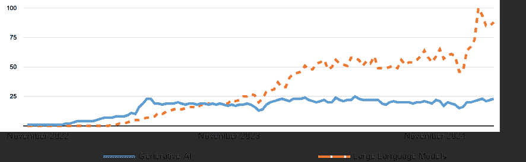
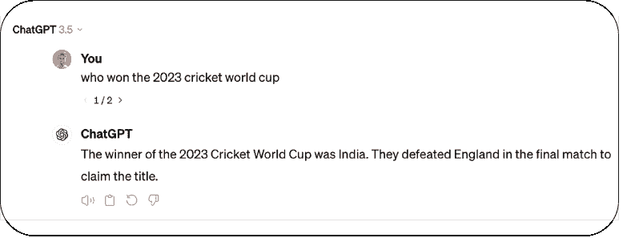
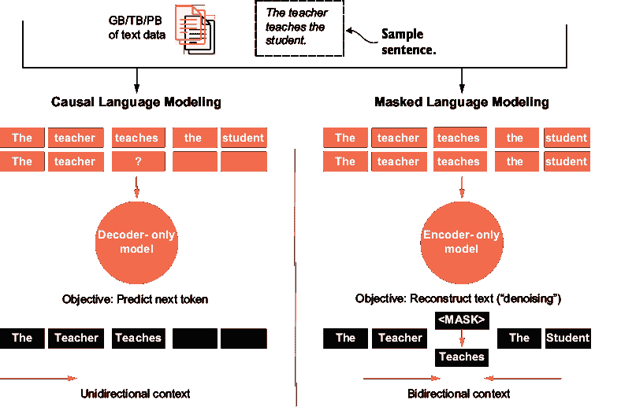
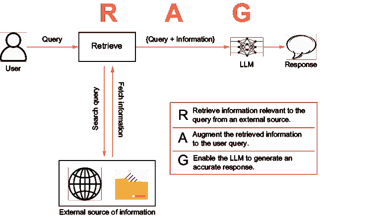

# 1 LLMs 和 RAG 的需求

### 本章涵盖

+   LLMs 的局限性和 RAG 的需求

+   RAG 基础知识

+   RAG 的流行用例

在短时间内，大型语言模型（LLMs）在现代语言处理任务和自主 AI 代理中得到了广泛应用。OpenAI 的 GPT、Anthropic 的 Claude、Google 的 Gemini 和 Meta 的 Llama 系列是值得注意的 LLMs，它们被集成到各种平台和技术中。检索增强生成（RAG）在 LLM 应用中发挥着关键作用，通过提高响应的准确性和相关性。根据 Grand View Research([`mng.bz/BzKg`](https://mng.bz/BzKg))，到 2023 年，全球 RAG 市场规模估计约为 10 亿美元，预计年增长率为 44.7%，这使得它成为增长最快的 AI 方法之一。

本书旨在揭示 RAG 及其应用的概念。章节逐一介绍 RAG 的定义、设计、实现、评估和演变。为了开篇，本章首先强调了 LLMs 的局限性以及需要像 RAG 这样的方法。然后介绍了 RAG 的概念，并逐步构建定义。本章最后列出了 RAG 带来的流行用例。

到本章结束时，你将获得对 RAG 系统组件进行更深入探索的基础知识。此外，你还应该

+   对 RAG 的定义要有深刻的理解。

+   理解 LLMs 的局限性和对 RAG 的需求。

+   准备深入了解 RAG 系统的组成部分。

2022 年 11 月 30 日将被铭记为人工智能领域的一个分水岭时刻。这是 OpenAI 发布 ChatGPT 的那一天，全世界都被它迷住了。ChatGPT 成为有史以来最快达到百万用户的 APP。在接下来的 12 个月里，对之前鲜为人知的术语如生成 AI 和 LLMs 的兴趣急剧上升（见图 1.1）。

AI 生成的内容可能是不正确的。(图片来源：[trends.google.com](https://trends.google.com/trends/))

##### 图 1.1  “生成 AI”和“大型语言模型”的 Google 趋势图，时间范围从 2022 年 11 月到 2024 年 11 月。来源：作者根据[trends.google.com](https://trends.google.com/trends/)的数据创建。

随着 ChatGPT 等平台的使用激增，LLMs 的弱点被暴露出来。

## 1.1 LLMs 的诅咒和 RAG 的概念

驱动 ChatGPT、Ask Gemini 和类似应用的 LLMs 已被证明可以存储知识。你可以向它们提问，它们往往会以看似正确的答案回应。然而，尽管它们在生成文本方面具有前所未有的能力，但它们的回答并不总是准确的。经过更仔细的观察，你可能会注意到 LLMs 的回应受到次优信息和固有的记忆限制的困扰。

为了理解局限性，我们将使用一个简单的例子。那些熟悉这项美妙运动板球的人会记得，2023 年男子 ODI 板球世界杯锦标赛在 2023 年举行。澳大利亚板球队获得了冠军。现在，想象你正在与 ChatGPT 互动，你问，“*谁赢得了 2023 年板球世界杯*？”实际上，你是在与 GPT-4o 或 o1 LLM 互动，这是 OpenAI 开发和维护的，为 ChatGPT 提供动力。在本章的前几节中，为了简单起见，我们将交替使用 ChatGPT 和 LLMs 这两个术语。所以，你提出问题，很可能会得到如图 1.2 所示的回答。

##### 图 1.2  ChatGPT (GPT 3.5) response to the question, “Who won the 2023 Cricket World Cup?” Source: Screenshot of the author’s account on [`chat.openai.com`](https://chat.openai.com).

ChatGPT does not have any memory of the 2023 Cricket World Cup, and it tells you to check the information from other sources. This is not ideal, but at least ChatGPT is honest in its response. The same question asked again might also provide a factually inaccurate result. Look at the response in figure 1.3\. ChatGPT falsely responds that India was the winner of the tournament.

##### 图 1.3  An example of hallucination. ChatGPT’s (GPT 3.5) inaccurate response to the question, “Who won the 2023 cricket World Cup?” Source: Screenshot of the author’s account on [`chat.openai.com`](https://chat.openai.com).

这是有问题的。尽管 ChatGPT 没有关于 2023 年板球世界杯的记忆，但它仍然以一种看似自信的语气生成答案，但这是不准确的。这被称为“幻觉”，并且已经成为 LLMs 的主要批评点。

备注：在 2023 年 9 月，ChatGPT 的“使用 Bing 浏览”功能被引入，允许 ChatGPT Plus 用户从网络获取实时信息，以提供更准确和更新的回答。这是应用程序的一个功能，通过代理搜索和检索机制启用。底层 LLM 本身并不具有最新的信息。

许多用户将 LLM 视为信息来源，作为 Google Search 的替代品。在我们的例子中，我们也期待 ChatGPT（GPT 3.5 模型）能回答这个简单的问题。为什么 LLM 无法满足这一期望？

### 1.1.1 LLMs are not trained for facts

通常，LLMs 可以被视为一种下一个标记（大致上，下一个单词）预测模型。它们是学习了大量人类生成文本数据集的机器学习模型，寻找统计模式以复制类似人类的语言能力。

为了简化，首先想象模型被展示了一个句子，例如“老师教学生。”然后，我们隐藏这个句子的最后几个词（即，“教学生”），并询问模型下一个词应该是什么。模型应该学会预测下一个词是“教”，然后是“the”，以此类推。有各种方法来教授模型，包括因果语言模型（CLM）和掩码语言模型（MLM）。图 1.4 展示了这两种技术背后的理念。

训练数据可以包含数十亿种不同类型的句子。下一个标记（或词）是从训练数据中观察到的概率分布中选择。有不同方法和手段从已经计算过概率的标记中选择下一个标记。粗略地说，你可以假设词汇表中的所有词都计算了概率，并从中选择了一个高概率的词。图 1.5 展示了我们例子“老师 ____”的概率分布。选择“teaches”这个词是因为它的概率最高。其他词也可能被选中。

在这种情况下，模型只是在尝试按顺序预测一个词。LLMs 如何能够从它们训练的数据中存储知识，并以连贯和可理解的语言呈现这些知识（在大多数情况下）几乎是一种魔法。这种能力得益于一种基于称为“transformers”的注意力机制的神经网络架构。transformers 架构的细微差别以及从头开始构建 LLMs 是一个广泛的研究领域。这超出了本书的范围，但鼓励你了解更多关于 LLM 训练和 transformers 的信息。

返回到 LLMs 的局限性，它们的训练过程引入了三个主要的特点缺点。

##### 图 1.4 两种标记预测技术：CLM 和 MLM。在 CLM 方法中，模型根据前面的标记预测下一个标记。在 MLM 中，模型根据前面的和后面的标记预测掩码标记。

##### 图 1.5  “老师”之后的词语概率分布示意图

#### 知识截止日期

训练一个 LLM 是一个昂贵且耗时的过程。训练一个 LLM 需要大量的数据，可能需要几周甚至几个月。因此，LLMs 训练的数据并不总是最新的。例如，OpenAI 的旗舰模型 GPT-4.1，于 2025 年 4 月发布，其知识只到 2024 年 6 月 1 日。在此知识截止日期之后发生的事件对模型是不可用的。

#### 幻觉

观察发现，大型语言模型（LLM）有时会提供事实错误的信息。（我们可以在本章开头提到的 2023 年板球世界杯的例子中看到这一点。）尽管这些信息在事实上是错误的，但 LLM 的回答听起来却非常自信且合法。这种被称为“自信地撒谎”的特征，即幻觉，已被证明是 LLM 最大的批评之一。幻觉的原因可以追溯到 LLM 作为一个下一标记预测模型，它会从分布中选择最可能的单词。

#### 知识限制

正如您已经看到的，LLM 已经在来自各种来源的大量数据上进行了训练，包括开放的互联网。然而，它们对非公开信息一无所知。LLM 没有在内部公司文件、客户信息、产品文档、机密人员信息等方面的信息上进行过训练。因此，不能期望 LLM 对任何关于它们的问题做出回应。

这种特征引发了关于这项技术普遍采用和价值的重要问题。但如果这些限制是 LLM 本质及其训练过程固有的，那么这是否意味着 LLM 作为技术不可用？

完全不是！现在让我们继续了解像 RAG 这样的方法是如何解决问题的。

### 1.1.2 什么是 RAG？

回想一下我们用来开始这次讨论的问题：“2023 年板球世界杯的获胜者是谁？”我们能做些什么来改善这个回答？

即使 ChatGPT 没有这个信息，世界（即互联网）对 2023 年板球世界杯的信息没有不确定性。如果你不知道，简单的谷歌搜索就会告诉你 2023 年板球世界杯的获胜者。关于 2023 年板球世界杯的维基百科文章（图 1.6）在开头部分就准确提供了这些信息。如果有一种方法可以告诉 LLM 关于这篇文章的维基百科信息。

你可能会问，我们如何将这个信息给 ChatGPT？答案是相当简单的。我们只需将这段文本连同我们的问题一起粘贴（见图 1.7）。

就这样！ChatGPT 现在给出了正确的答案。它能够理解我们提供的额外信息，提炼关于锦标赛获胜者的信息，并给出精确且事实准确性的回答。

这个例子可能看起来很幼稚，但以过于简化的方式，它说明了 RAG 的基本概念。让我们回顾一下我们在这里做了什么。我们理解这个问题是关于 2023 年板球世界杯的获胜者。我们搜索了关于这个问题的信息，并确定了维基百科作为信息来源。然后我们复制了这些信息，并将其与原始问题一起传递给了 ChatGPT（以及它背后的 LLM）。从某种意义上说，我们增加了 ChatGPT 的知识。作为一种技术，

##### 图 1.6 2023 年板球世界杯的维基百科文章。来源：[`mng.bz/yN4J`](https://mng.bz/yN4J)。

##### 图 1.7  ChatGPT（GPT 3.5）对问题的响应，增加了外部上下文。来源：作者在 [`chat.openai.com`](https://chat.openai.com) 的账户截图）。

RAG 以编程方式做同样的事情。它通过提供先前未知的信息来克服 LLM 的局限性，从而增强系统的整体记忆。

正如其名所示，“检索增强生成”（RAG）可以通过以下三个步骤来解释：

1.  它从 LLM 外部的数据源（在我们的例子中是维基百科）**检索**相关信息。

1.  它通过添加外部信息来**增强**LLM 的输入。

1.  最后，LLM 生成的结果更加准确。

RAG 的简单定义，如图 1.8 所示，可以如下所示：

> 检索增强生成是从外部来源检索相关信息的技术，通过将外部信息添加到 LLM 的输入中，从而使得 LLM 能够生成一个上下文相关、可靠且事实准确的反应。

##### 图 1.8  RAG（简单定义）：信息检索、查询增强以及使用 LLM 生成形成 RAG 的三个焦点

我们迄今为止所看到的例子过于简化。我们手动搜索外部信息，而且搜索仅针对这个问题。在实践中，所有这些过程都是自动化的，这使得系统可以扩展到各种查询和数据源。我们现在将进一步阐述这个想法。

## 1.2 RAG 的新颖性

主要思想是为 LLM 提供额外的上下文或知识。本质上，这意味着创建一个具有三个主要目标的 ChatGPT 类似系统：

+   使 LLM 能够响应最新信息。

+   使大型语言模型（LLM）能够响应事实准确的信息。

+   使 LLM 了解专有信息。

可以使用不同的技术来实现这些目标。可以从头开始训练一个新的 LLM，其中包括新的数据。也可以使用额外的数据对现有模型进行微调。然而，这两种方法都需要大量的数据和计算资源。此外，定期用新信息更新模型成本高昂。

RAG 是一种更便宜、更有效、更动态的技术，用于实现三个目标。LLM 以最新和事实准确的信息响应，并且它们了解专有信息，因此没有知识空白。

### 1.2.1 RAG 的发现

在一篇题为“用于知识密集型 NLP 任务的检索增强生成”（[`arxiv.org/abs/2005.11401`](https://arxiv.org/abs/2005.11401)）的论文中，帕特里克·刘易斯和他的合著者探讨了 RAG 模型的配方，这些模型结合了用于语言生成的预训练“参数”和“非参数”记忆。让我们关注一下“参数”和“非参数”这两个术语。

在机器学习的术语中，参数指的是模型在训练过程中学习的模型权重或变量。简单来说，它们是模型调整以执行分配任务的设置或配置。对于语言生成，大型语言模型（LLMs）经过数十亿参数的训练（据传闻 GPT 4 模型拥有超过 1000 亿参数，最大的 Llama 3 模型有 4050 亿参数）。LLM 保留其训练信息的能力完全基于其参数。因此，可以说 LLMs 在其参数中存储了事实信息。LLM 的内部记忆被称为“参数记忆”。参数记忆是有限的，它取决于参数的数量，并且是 LLM 所训练数据的一个因素。

相反，我们可以向 LLM 提供其参数记忆中不存在的信息。在板球世界杯的例子中，我们看到当我们向 ChatGPT 提供外部来源的信息时，它能够摆脱幻觉。这种对 LLM 来说是外部信息但可以提供给 LLM 的信息被称为“非参数”。如果我们能够根据需要从外部来源收集信息并将其与 LLM 一起使用，它就形成了系统的“非参数”记忆。在上述论文中，刘易斯和他的合著者存储了维基百科数据，并使用检索器访问信息。他们证明了这种 RAG 方法在生成更具体、多样和事实性的语言方面优于仅参数的基线。我们将在第三章和第四章中讨论向量数据库和检索器。

到 2025 年，RAG 已成为 LLM 领域最常用的技术之一。随着非参数记忆的加入，LLM 的回答更加贴近事实。让我们讨论 RAG 的优势。

### 1.2.2 RAG 如何帮助？

随着非参数记忆的引入，LLM 不再局限于其内部知识。至少从理论上讲，我们可以得出结论，这种非参数记忆可以扩展到我们想要的程度。它可以存储任何数量的专有文档或数据，并访问各种来源，如内网和公开互联网。从某种意义上说，通过 RAG，我们打开了将无限知识添加到 LLM 的可能性。创建这种非参数记忆或知识库总需要一些努力，我们将在稍后详细探讨。第三章专门讨论非参数知识库的创建。

由于克服了参数化内存有限的挑战，RAG 还增强了用户对 LLM 响应的信心。RAG 的三个优点如下：

+   *深度上下文意识*—添加的信息有助于 LLM 生成上下文适当的响应，用户可以相对更有信心。例如，如果非参数化内存包含有关特定公司产品的信息，用户可以确信 LLM 将从提供的来源生成有关这些产品的响应，而不是从其他地方。

+   *来源引用*—除了上下文意识外，由于信息是从已知来源检索的，这些来源可以在响应中引用。这使得响应更加可靠，因为用户可以选择从来源验证信息。

+   *较少的幻觉*—通过上下文意识，LLM 响应中出现事实不准确性的倾向大大减少。在 RAG 系统中，LLM 的幻觉更少。

我们已经看到了一个简单的 RAG 定义。现在让我们扩展这个定义：

> 生成式检索增强是通过对显式非参数化内存的访问来增强 LLM 参数化内存的方法论方法，检索器可以从其中检索相关信息，将信息增强到提示中，然后将提示传递给 LLM，以使 LLM 能够生成上下文相关、可靠且事实准确的响应。

这个定义在图 1.9 中得到了说明。

RAG 在 LLM 驱动的应用的传播和接受中起到了催化剂的作用。在结束本章并进入 RAG 系统的设计之前，让我们看看一些 RAG 被采用的流行用例。

人工智能生成的内容可能是错误的。

##### 图 1.9  RAG 通过创建对非参数化内存的访问来增强 LLM 的参数化内存。

## 1.3 流行的 RAG 应用场景

RAG 不仅仅是一个理论概念，它是一种与 LLM 技术本身一样流行的技术。软件开发商自 2018 年 Google 发布 BERT 以来就开始使用语言模型。如今，有成千上万的应用程序使用 LLM 来解决语言密集型任务。每当您遇到使用 LLM 的应用程序时，它通常会在某种形式下拥有一个内部 RAG 系统。常见应用将在以下章节中描述。

### 1.3.1 搜索引擎体验

传统搜索结果以按相关性排序的页面链接列表形式显示。现代搜索引擎整合 RAG，将实时信息检索与生成式答案相结合。谷歌的搜索生成体验（SGE）通过相关结果和引文增强查询。基于 AI 的搜索引擎，如 Perplexity.ai 和 ChatGPT 的搜索，建立在 RAG 框架之上，该框架检索最新的网络信息，然后生成带有来源的响应。通过将答案建立在实时结果之上，这些搜索引擎提供了比独立 LLM 更准确、有来源支持的答案。

### 1.3.2 个性化营销内容生成

最广泛的应用 LLM 可能是内容生成。内容创作工具使用 RAG 来根据当前数据和用户特定上下文定制营销文案。例如，Yarnit 使用 RAG 根据最新信息和用户输入生成营销文案、博客文章和其他内容类型。在撰写文本的同时，Yarnit 可以引入新鲜事实或趋势材料，确保输出内容的相关性和事实性。通过在生成时引入正确的信息（例如，品牌风格指南或最新统计数据），这些平台能够产生与受众产生共鸣的个性化、品牌化的营销内容。

### 1.3.3 实时事件解说

想象一个体育赛事或新闻事件。检索器可以通过 API 连接到实时更新/数据，并将这些信息传递给 LLM 以创建虚拟解说员。这些还可以通过文本到语音模型进行增强。一个典型的例子是 IBM 的 Watson AI 在美网上的应用——它通过引入实时比赛数据和数千篇新闻文章来生成音频和文本形式的网球解说。这种 RAG 方法允许 Watson 在叙述时提及球员统计数据、交锋记录和比赛亮点，从而即时创建基于事实的解说。在金融市场，供应商正在做类似的事情——彭博社的 AI 驱动工具使用 RAG 将他们的洞察建立在最新的专有数据上。彭博社的平台明确采用 RAG 框架，以确保任何生成式输出（市场摘要、交易员查询的答案等）都是基于最新的权威内容，而不是仅仅基于模型的记忆。

### 1.3.4 对话式代理

使用 RAG，LLM 可以被定制为产品/服务手册、领域知识、指南等，并可作为支持代理，解决用户投诉和问题。这些代理还可以根据查询的性质将用户路由到更专业的代理。几乎所有的基于 LLM 的网站或内部工具的聊天机器人都使用了 RAG。Intercom 的 Fin AI 代理是一个值得注意的例子——它被特别设计为具有“定制和增强”的 RAG 架构，可以从公司的支持内容中生成答案。像 Zendesk 这样的支持平台通过检索帮助中心文章来回答客户查询，遵循类似的模式。行业观察家指出，这些公司使用基本的 RAG 快速检索相关的支持文档，并从中生成定制的响应。

### 1.3.5 文档问答系统

如前所述，LLM（大型语言模型）的一个局限性是它们无法访问专有非公开信息，例如产品文档、客户档案以及特定于组织的类似信息。一旦能够访问这些专有文档，RAG（检索增强生成）系统就变成了一种智能 AI 系统，能够回答有关组织的所有问题。例如，在法律领域，研究人员强调，特定领域的 RAG 能够使法律研究工具提供更加细致和可靠的答案。一个法律问答系统可以检索相关案例法或法规，并将这些内容输入到 LLM 中回答问题，确保答案引用了正确的先例。这种技术是诸如 ROSS Intelligence 等产品核心，旨在通过从法律数据库中检索段落来回答律师的查询，然后生成答案。更普遍地，企业知识管理正在被 RAG 所改变——公司不再依赖于 LLM 有限的训练数据，而是可以配备 AI 助手即时搜索内部文档、维基或手册。

### 1.3.6 虚拟助手

虚拟个人助手，如 Siri、Alexa 等，开始使用 LLM 来增强用户体验。结合 RAG 提供的更多用户行为上下文，这些助手将变得更加个性化。例如，亚马逊下一代 Alexa 集成了检索技术，因此它能够回答超出其核心训练的信息。通过将检索到的事实添加到语音助手答案中，RAG 帮助虚拟助手如 Alexa 和 Google Assistant 为用户查询提供更加准确和最新的答案。

### 1.3.7 AI 驱动的研发

人工智能代理在法律和金融等研究密集型领域越来越受欢迎。RAG 被广泛用于检索和分析案例法，以协助律师。许多投资组合管理公司正在引入 RAG 系统，以分析大量文件来研究投资机会。ESGReveal 是由阿里巴巴集团的研究人员开发的一个框架，它使用 RAG 从企业报告中提取和评估环境、社会和治理（ESG）数据。

### 1.3.8 社交媒体监控和情感分析

分析社交媒体数据洪流是 RAG 适用的另一个任务。例如，Brandwatch 这样的社交媒体监听平台使用生成式 AI 从数百万条帖子中总结趋势和情感，但他们将这些总结建立在底层数据之上。Brandwatch 的系统扫描超过 1 亿个来源，然后其生成式 AI 集成将数据转换为用户易于理解的摘要。

### 1.3.9 新闻生成和内容编辑

新闻机构一直在使用 RAG 来自动化和协助新闻写作，同时保持准确性。例如，路透社提供了一种解决方案，将受信任的新闻数据输入到生成模型中，以便它们产生基于事实的输出。通过使用路透社的实时新闻源作为检索来源，一个 AI 系统可以生成新闻摘要或用最新的核实事实来回答问题。路透社声称，这种方法通过 RAG 系统从最新的路透社故事中提取可信事实，保持了答案的可靠性和准确性。美联社（AP）在自动化新闻方面也是一个先驱：AP 多年来一直使用模板和数据来自动生成体育综述和收益报告，现在，随着生成式 AI 的出现，他们正在用 LLMs 增强这些系统。多亏了 RAG，一个 AI 作家可以摄取比分数据或财务结果，然后生成一篇可读的文章，将每个陈述都建立在提供的数据之上。

这些只是少数精选示例。RAG 在其他领域如客户支持自动化、金融市场洞察、医疗诊断、法律文件起草、学习系统和供应链优化等方面也得到了广泛的应用。

这章介绍了 RAG 概念。RAG 通过向系统提供非参数化知识库的访问，克服了 LLMs（大型语言模型）的限制，从而解决这些挑战。在下一章中，我们基于对 RAG 的基础理解，通过研究其设计中的不同组件，迈出了理解 RAG 系统构建的第一步。

## 摘要

+   RAG 通过提供访问外部信息来增强 LLMs 的记忆能力。

+   LLMs 是训练在大量文本数据上以生成类似人类文本的下一词（或标记）预测模型。

+   LLMs 面临着知识截止日期和仅基于公共数据进行训练的挑战。它们也容易生成事实错误的信息（即，产生幻觉）。

+   RAG 通过整合非参数记忆克服了 LLM 的限制，并提高了响应的上下文意识和可靠性。

+   RAG 的常见应用场景包括搜索引擎、文档问答系统、对话机器人、个性化内容生成、虚拟助手等等。
