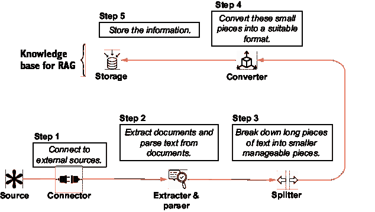
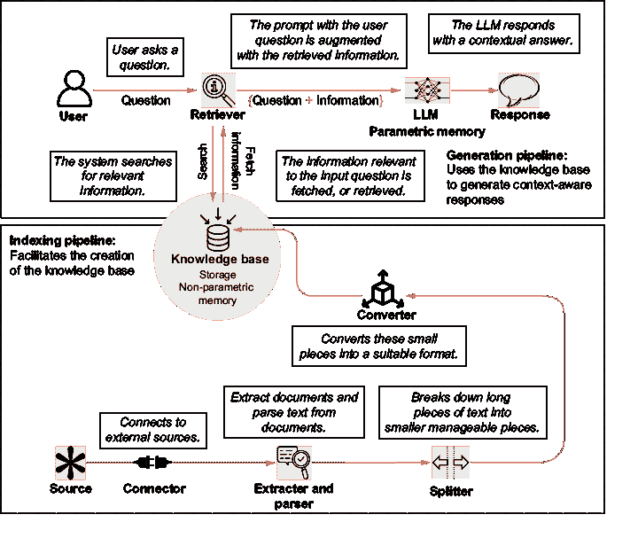
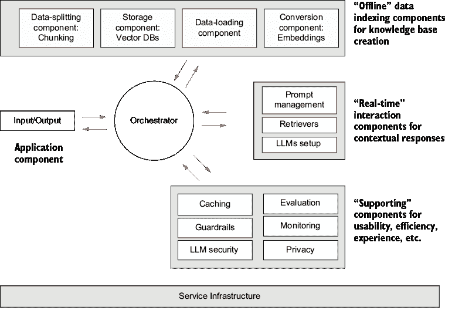
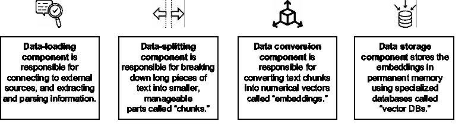
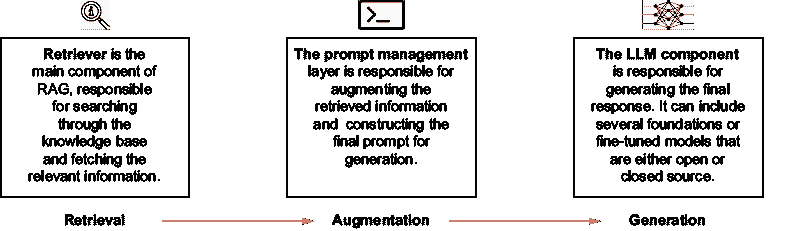
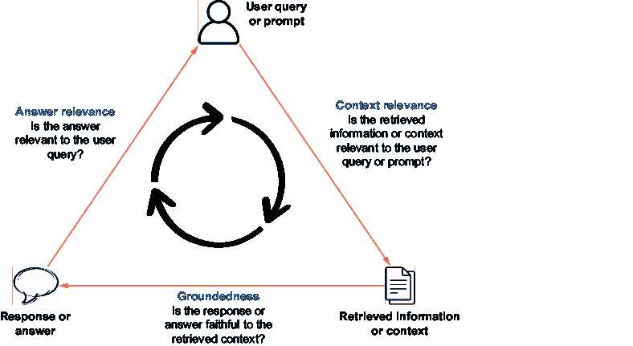

# 2 RAG 系统和它们的设计

### 本章涵盖

+   RAG 系统的概念和设计

+   索引管道概述

+   生成管道概述

+   对 RAG 评估的初步了解

+   对 RAG 操作堆栈的概述

第一章探讨了检索增强生成（RAG）背后的核心原则以及它解决的大语言模型（LLM）挑战。要构建一个 RAG 系统，需要组装几个组件。这个过程包括创建和维护系统的非参数记忆，或知识库。另一个管道通过将提示发送到 LLM 并从中接受响应来促进实时交互，其中检索和增强步骤位于中间。评估是另一个关键组件，确保系统的有效性和准确性。所有这些组件都由操作堆栈的各个层级支持。

第二章讨论了 RAG 系统的设计，检查涉及的步骤和需要两个不同的管道。我们将创建知识库的管道称为“索引管道”。允许与 LLM 进行实时交互的另一个管道将被称为“生成管道”。我们将讨论它们的各个组件，如数据加载、嵌入、向量存储、检索器等。此外，我们将了解如何进行 RAG 系统的评估，并介绍为这些系统提供动力的 RAG 操作（RAGOps）堆栈。

本章将介绍将在后续章节中详细讨论的各种组件。到第二章结束时，你将深入理解 RAG 系统的组件，并准备好深入研究不同的组件。到本章结束时，你应该

+   能够理解 RAG 系统设计的几个组成部分。

+   为更深入地探索索引管道——生成管道、RAG 评估方法和 RAGOps 堆栈做好准备。

## 2.1 RAG 系统看起来是什么样子？

到目前为止，我们已经了解到 RAG 是使用 LLM 来解决其用例的系统的一个关键组件。但是，这个系统是什么样的呢？为了说明，让我们回顾一下第一章开头使用的例子（“2023 年板球世界杯冠军是谁？”）并概述我们采取的步骤，以使 ChatGPT 能够为我们提供准确的回答。

第一步是提出问题本身：“2023 年板球世界杯冠军是谁？”随后，我们手动在互联网上搜索可能包含问题答案信息的来源。我们找到了一个（在我们的例子中是维基百科）并从中提取了一段相关的段落。随后，我们将相关的段落添加到我们的原始问题中，将问题和检索到的段落一起粘贴到 ChatGPT 的提示中，并得到了一个事实正确的回答：“澳大利亚赢得了 2023 年板球世界杯。”

这个过程可以提炼为五个步骤，我们的系统需要促进所有这些步骤：

1.  用户提出问题。

1.  系统搜索与输入问题相关的信息。

1.  从输入问题中检索或获取与信息相关的信息，并将其添加到输入问题中。

1.  这个问题和信息被传递给一个大型语言模型（LLM）。

1.  LLM 以上下文答案的形式响应。

如果你还记得，我们已经在第一章中描述了这一过程。让我们在图 2.1 的上下文中可视化这一过程。这个工作流程将被称为“生成管道”，因为它生成答案。

##### 图 2.1 生成管道覆盖了五个 RAG 步骤。从查询到响应的旅程涉及搜索和检索、增强和生成。

这个管道允许与 LLM 进行实时上下文交互。当然，创建生成管道所需的五个步骤中都有一些复杂性。需要就检索器和 LLM 的选择做出一些决定。提示语的构建也会影响响应的质量。我们将在第三章讨论提示语的构建。在建立这个生成管道之前，我们首先必须解决一个关键的前置步骤。为此，需要回答一些关于信息外部来源的关键问题。我们还需要提前知道在哪里查找，然后与所有这些不同的来源建立连接：

+   信息外部来源的位置在哪里？

    +   是开放的互联网吗？还是公司内部数据存储中有一些文档？信息是否存在于某些第三方数据库中？我们想要使用多个来源的信息吗？

    +   为什么这很重要？

+   源信息性质是什么？

    +   这些是 Word 文档还是 PDF 文件？访问信息是通过 API 进行的吗？响应格式是 JSON 吗？我们将在一个文档中找到答案，还是信息分布在多个文档中？

    +   为什么这很重要？

我们还需要了解数据存储的格式和性质，以便能够从源文件中提取信息。

当数据存储在多个来源，如互联网和内部数据湖时，系统必须连接到每个来源，以各种格式搜索相关信息，并根据原始查询对其进行组织。每次提问时，都需要重复连接、提取和解析的过程。来自不同来源的信息可能导致事实上的不一致，这些不一致需要实时解决。搜索所有信息可能非常耗时。因此，这将被证明是一个高度次优、不可扩展的过程，可能无法产生期望的结果。如果来自不同来源的信息

+   收集在一个单独的位置。

+   存储在单一格式中。

+   将其分解成小块的信息。

统一知识库的需求源于外部数据源的不同性质。为了满足这一需求，我们需要采取一系列步骤来创建和维护一个结构良好的知识库。这又是一个五步的过程：

1.  连接到之前确定的外部来源。

1.  从文档中提取文档并解析文本。

1.  将长篇文本分解成更小、更易于管理的部分。

1.  将这些小部分转换成合适的格式。

1.  存储这些信息。

这些步骤，这些步骤有助于创建这个知识库，构成了*索引管道*。索引管道如图 2.2 所示。

除了创建知识库外，索引管道在维护和更新它以保持其相关性和准确性方面也起着至关重要的作用。在索引管道创建知识库之前，生成管道没有地方可以搜索信息。是索引管道为生成管道的后续操作奠定了基础。因此，设置索引管道是在激活生成管道之前。

这些管道共同构成了 RAG 系统的骨架，使用户能够无缝交互，并交付上下文相关的响应。图 2.3 显示了索引和生成管道共同工作，形成 RAG 系统的骨架。

我们已经建立了一个包含两个管道的 RAG 系统的流程。从概念上讲，这是完整的流程。然而，为了构建用于现实世界的系统，还需要更多的组件。下一节将重新构想这个流程以及其他考虑因素，并为 RAG 系统设计一个方案。

##### 图 2.2  覆盖创建 RAG 知识库步骤的索引管道。这包括连接到源，解析，分割，转换和存储信息。

##### 图 2.3  索引和生成管道共同构成一个 RAG 系统。索引管道是一个离线过程，而生成管道则促进与知识库的实时交互。

## 2.2 RAG 系统的设计

我们看到了 RAG 系统是如何通过索引和生成管道创建的。这两个管道本身也包含几个部分。像所有软件应用一样，生产就绪的 RAG 系统需要的不仅仅是基本组件。我们需要考虑准确性、可观察性、可扩展性和其他重要因素。本书详细讨论了这些组件。图 2.4 展示了 RAG 系统的一个大致布局。除了索引和生成组件外，我们还将添加基础设施、安全、评估等层。

##### 图 2.4  生产就绪的 RAG 系统组件

让我们看看 RAG 系统的主要组件。前四个组件完成了索引管道：

+   *数据加载组件*—连接到外部源，提取和解析数据

+   *数据拆分组件*—将大块文本拆分成更小、更易于管理的部分

+   *数据转换组件*—将文本数据转换为更合适的格式

+   *存储组件*—存储数据以创建系统的知识库

下面的三个组件完成了生成管道：

+   *检索器*—负责从存储中搜索和获取信息

+   *LLM 设置*—负责生成对输入的响应

+   *提示管理*—允许增强检索到的信息以匹配原始输入

评估组件在部署前后测量系统的准确性和可靠性。监控组件跟踪 RAG 系统的性能并帮助检测故障。其他组件包括缓存，有助于存储先前生成的响应以加快类似查询的检索；护栏，以确保符合政策、法规和社会责任；以及安全，以保护 LLM 免受如提示注入、数据中毒等攻击。所有层都由服务基础设施支持。

所有这些组件都由一个中央编排层管理和控制，该层负责它们的交互和顺序。它提供了一个统一的接口来管理和监控工作流程和过程。

在我们深入探讨后续章节之前，以下章节提供了这些组件的概述。

## 2.3 索引管道

我们讨论了索引管道如何促进实时生成管道中使用的知识库的创建。从实际应用的角度来看，索引管道是一个离线或异步管道。这意味着当用户提问时，索引管道不会实时激活。相反，它预先创建知识库并在预定义的时间间隔更新它。索引管道由四个主要组件组成，如图 2.5 所示。

##### 图 2.5 索引管道的四个组件有助于知识库的创建。

让我们更深入地探讨每个部分：

+   *数据拆分（文本拆分**）*——*将文本拆分成更小的片段可以增强系统高效处理和分析信息的能力。在自然语言处理（NLP）术语中，这些较小的片段通常被称为“块”。将大型文本文档拆分成更小块的过程称为“分块”。我们将在第三章中讨论分块的需求和各种分块策略。

+   *数据转换（嵌入**）*——*在 RAG 系统中，文本数据必须转换为数值格式，以便进行搜索和检索计算。有几种实现这种转换的方法。从所有实际目的来看，一种称为“嵌入”的数据格式最适合搜索和检索。你将在第三章中了解更多关于嵌入和不同嵌入模型的内容。

+   *数据存储*——*一旦数据以所需格式（嵌入）准备好，就需要将其存储在持久（永久）内存中，以便实时生成管道在用户提问时随时访问数据。数据存储在称为“向量数据库”的专用数据库中，这些数据库最适合搜索和检索嵌入。第三章将探讨各种向量数据库及其对 RAG 系统的适用性影响因素。

##### 你是否总是需要索引管道？

离线索引管道通常用于构建大量数据的知识库，以便重复使用（例如，许多企业文档、手册等）。然而，在某些情况下，生成管道连接到第三方 API 以接收与用户问题相关的信息。

例如，想象一个为寻求基于天气预报的旅行建议的用户构建的应用程序。该应用程序的一个重要组成部分将是获取用户位置的天气详情。假设系统使用第三方 API 服务，当提供输入中的位置时，可以响应位置天气详情。然后，这些天气信息被传递给 LLM 以生成建议。

这个应用程序也可以被视为一个 RAG 系统。但有一个区别。这个系统将搜索和检索操作外包给了第三方 API。数据由第三方维护。对于此类系统，不需要构建索引管道，因为搜索和检索发生在系统之外。另一个例子是要求用户输入外部信息的应用程序，如文档摘要器。这里的搜索操作外包给了用户。

因此，那些使用增强外部信息到提示中但并不一定自行搜索和检索信息的系统，无需创建知识库，因此，没有索引管道。有些人可能会争论，这样的系统根本就不是 RAG 系统。

## 2.4 生成管道

在索引管道建立的基础上，生成管道促进了 RAG 系统的实时交互。正是生成管道促进了系统中的检索、增强和生成。当用户提问时，生成管道处理查询，检索相关信息，并生成响应——这一切都不需要用户直接与底层索引管道交互。生成管道由三个组件启用，如图 2.6 所示。

##### 图 2.6 生成管道的三个组件使得 RAG 系统的实时查询-响应过程成为可能。

让我们更详细地考虑这些内容：

+   *检索器*—这可能是整个系统中最关键的部分。使用高级搜索算法，检索器扫描知识库，根据用户的查询识别和检索最相关的信息。整个系统的总体有效性在很大程度上依赖于检索器的准确性。此外，搜索是一个计算密集型操作，可能需要时间。因此，检索器也对系统的总体延迟做出了重大贡献。我们将在第四章和第六章中讨论不同的检索器和检索策略。

+   *提示管理*—一旦检索器检索到相关信息，就需要将其与原始用户查询结合或增强。乍一看，这似乎是一个简单的任务。然而，提示的构建对生成响应的质量有重大影响。这个组件也属于提示工程的范围。我们将在第四章中探讨不同的提示和提示管理策略。

+   *LLM 设置*—最后，LLM 负责生成最终响应。RAG 系统可能依赖于多个 LLM。LLM 可以是已经预训练并通常可用的基础模型，例如 Meta 或 Mistral 的，或者通过管理服务，如 OpenAI 或 Anthropic。LLM 也可以针对特定任务进行微调。微调涉及在特定数据集或任务上训练现有的 LLM，以提高性能和适应性，用于专用应用。在罕见的情况下，开发者可能决定训练他们自己的 LLM。我们将在第四章中深入讨论 LLM。

## 2.5 评估和监控

索引和生成管道从使用角度完成了系统。有了这两个管道，至少在理论上，用户可以开始与系统交互并获得响应。然而，在这种情况下，我们没有系统质量的衡量标准。系统是否运行准确，或者它仍然容易产生幻觉？检索器检索到的信息是否与查询最相关？为了回答这些问题，我们必须建立一个评估框架。这个框架有助于在系统发布之前评估其质量，然后进行持续监控和改进。

建立在 LLMs 的进步之上，RAG 代表了 NLP 领域的一项最新创新。相关性分数、召回率和精确度等指标通常用于评估 RAG 系统的有效性。TruEra 提出的 RAG 指标三元组（[`mng.bz/Mw22`](https://mng.bz/Mw22)）提供了一个直观的框架，用于全面评估。它从三个维度来审视 RAG 评估，如图所示。

图 2.7。

工作流程涉及在每个步骤之间进行检查——提示、上下文和答案。让我们更仔细地看看：

AI 生成的内容可能是错误的。](../Images/CH02_F07_Kimothi.png)

##### 图 2.7  TruEra 提出的 RAG 评估的三元组。RAG 评估的三个关键维度是查询、上下文和响应。

+   *在检索到的信息（上下文）和用户查询（提示）之间*——检索器搜索和检索的信息是否与用户提出的问题最相关？检索到不相关信息的结果是，无论 LLM 有多好，如果增强的信息不好，响应将不会是最优的。

+   *在最终响应（答案）和检索到的信息（上下文）之间*——在生成响应时，LLM 是否考虑了所有检索到的信息？即使

+   尽管 RAG 旨在减少幻觉，但系统仍可能忽略检索到的信息。这有几个原因，将在后续章节中讨论。

+   *在最终响应（答案）和用户查询（提示）之间*——最终响应是否与用户最初提出的问题相符？为了评估系统的整体有效性，需要评估最终响应与原始问题的相关性。

有几个指标有助于评估这三个维度中的每一个。对于某些指标，需要一个基准数据集。基准数据集通过将生成的响应与人工整理的参考进行比较，为评估 RAG 系统的准确性和有效性提供了一个基准。我们将在第五章中更深入地探讨这些指标和基准数据集。

在实时操作期间对指标进行持续评估可以识别系统难以准确回答的查询类型。还可以从用户那里收集对生成的响应的定性反馈。

## 2.6 RAGOps 堆栈

RAG 以及基于 LLM 的应用正在由一个不断发展的操作堆栈提供支持。各种提供商提供基础设施组件，例如数据存储平台、模型托管服务和应用程序编排框架。该基础设施可以理解为几个层次：

1.  *数据层*—用于处理和存储以嵌入形式的数据的工具和平台

1.  *模型层*—提供专有或开源 LLM 的提供商

1.  *提示层*—提供提示维护和评估的工具

1.  *评估层*—提供 RAG 评估指标的工具和框架

1.  *应用编排*—促进系统不同组件调用的框架

1.  *部署层*—提供部署 RAG 应用的云提供商和平台

1.  *应用层*—RAG 应用的托管服务

1.  *监控层*—提供对 RAG 应用持续监控的平台

第七章探讨了支持 RAG 系统的各种基础设施层。

## 2.7 缓存、安全护栏和其他层

最后，还有一些在 RAG 系统中经常使用的其他组件。这些组件解决了系统延迟、监管和道德合规等问题。

+   *缓存*—缓存是将某些数据存储在缓存内存中以实现更快检索的过程。LLM 缓存与常规缓存略有不同。LLM 对查询的响应存储在语义缓存中。下次提出类似查询时，将检索缓存中的响应，而不是将查询通过完整的 RAG 管道发送。这种方法通过减少响应时间、LLM 推理成本和 LLM 服务负载来提高系统性能。

+   *安全护栏*—对于几个用例，在实践中，将有一组输出需要生成的边界。安全护栏是在系统中添加的预定义规则集，以符合政策、法规和道德指南。

+   *安全*—LLM 和基于 LLM 的应用已经见证了新的威胁，例如提示注入、数据中毒、敏感信息泄露等。随着威胁的发展，安全基础设施也需要发展以解决关于 RAG 系统安全和数据隐私的担忧。

RAGOps 也在快速发展。日志记录和跟踪、模型版本控制和反馈层是 RAGOps 堆栈的一些组件。

本章概述了 RAG 系统的主要组件，包括索引和生成管道、评估和监控以及服务基础设施。通过理解这些组件，你现在已经准备好在后续章节中深入探讨每个组件以及 RAG 系统的复杂性。在下一章中，我们将开始构建索引管道，以创建我们 RAG 系统的知识库。

## 摘要

+   一个 RAG 启用系统由两个主要管道组成：索引管道和生成管道。

+   索引管道负责创建和维护知识库，这包括数据加载、文本分割、数据转换（嵌入）以及在向量数据库中的数据存储。

+   生成管道通过检索信息、增强查询和使用大型语言模型（LLM）生成响应来管理实时交互。

+   评估和监控是评估系统性能的关键组件，涵盖了检索信息与查询之间的相关性、最终响应与检索信息之间的相关性，以及最终响应与原始查询之间的相关性。

+   RAG 系统的服务基础设施包括数据、模型、提示、评估、应用编排、部署、应用托管和监控等层。

+   为了提高性能、确保合规性和应对潜在威胁，通常会采用额外的组件，如缓存、安全网和安全措施。
