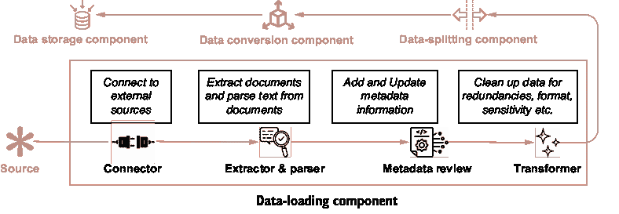
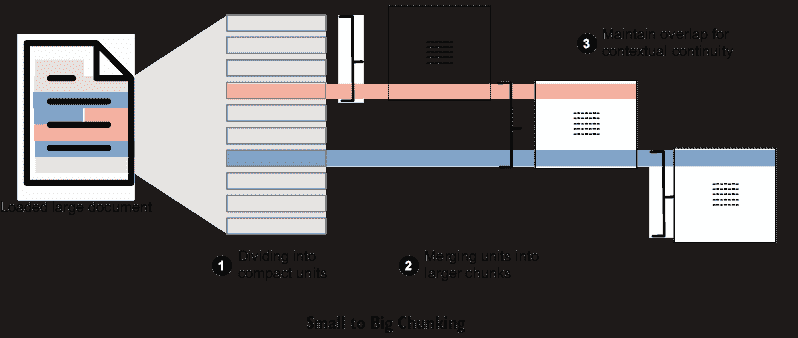
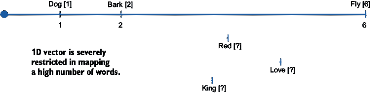
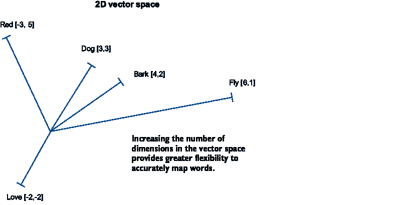
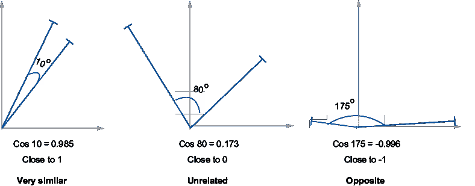
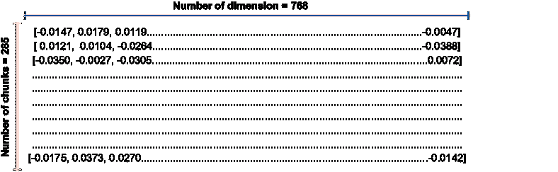

# 第三章：索引管道：为 RAG 创建知识库

### 本章涵盖

+   数据加载

+   文本拆分或分块

+   将文本转换为嵌入

+   在向量数据库中存储嵌入

+   使用 LangChain 的 Python 示例

在第二章中，我们讨论了检索增强生成（RAG）系统的主要组件。您可能还记得，索引管道创建了 RAG 应用的知识库或非参数记忆。在开始与大型语言模型（LLM）的实时用户交互之前，需要设置索引管道。

本章详细阐述了索引管道的四个组件。我们首先讨论数据加载，这涉及到连接到源、提取文件和解析文本。在这个阶段，我们介绍了一个称为 LangChain 的框架，它在 LLM 应用开发者社区中越来越受欢迎。接下来，我们详细阐述数据拆分或分块的需求，并讨论分块策略。嵌入是 AI 和 ML 世界中的一个重要设计模式。我们详细探讨了嵌入及其在 RAG 环境中的相关性。最后，我们探讨了一种新的存储技术——向量存储以及促进其发展的数据库。

到本章结束时，您应该对如何创建知识库（或 RAG 应用程序的参数外记忆）有一个稳固的理解。我们还用 Python 代码片段丰富了本章内容，以便那些有兴趣的人可以尝试亲手开发索引管道。

到本章结束时，您应该

+   了解如何从来源中提取数据。

+   深入了解文本分块策略。

+   学习嵌入是什么以及它们是如何被使用的。

+   掌握向量存储和向量数据库的知识。

+   对设置索引管道有端到端的知识。

## 3.1 数据加载

本节重点介绍索引管道的第一阶段。您将了解数据加载器、元数据信息和数据转换器。

构建 RAG 系统（或非参数记忆）的知识库的第一步是从其原始位置获取数据。这些数据可能是 Word 文档、PDF 文件、CSV、HTML 等形式。此外，数据可能存储在文件、块或对象存储中，在数据湖、数据仓库中，甚至在可以通过开放互联网访问的第三方来源中。从原始位置获取数据的过程称为*数据加载*。从一系列来源加载文档可能是一个复杂的过程。因此，建议提前记录所有来源和文件格式。

在深入之前，让我们从一个简单的例子开始。如果你还记得，在第一章中，我们使用维基百科作为关于 2023 年板球世界杯信息来源。当时，我们复制了文章的开头段落并将其粘贴到 ChatGPT 提示窗口中。现在，我们将不再手动操作，而是通过一个名为 LangChain 的非常流行的框架来*连接*到维基百科并*提取*数据。本章和本书中的代码可以在 Python 笔记本上运行，并在本书的 GitHub 仓库中提供（[`mng.bz/a9DJ`](https://mng.bz/a9DJ)）。

注意 LangChain 是一个由 Harrison Chase 开发的开源框架，于 2022 年 10 月发布。它用 Python 和 JavaScript 编写，旨在用于构建使用 LLMs 的应用程序。除了适合 RAG 之外，LangChain 也适合构建聊天机器人、文档摘要器、合成数据生成等应用场景。随着时间的推移，LangChain 已经与 LLM 提供商（如 OpenAI、Anthropic 和 Hugging Face）、各种向量存储提供商、云存储系统（如 AWS、Google、Azure）以及新闻、天气等 API 建立了集成。尽管 LangChain 受到了一些批评，但它仍然是开发者的一个良好起点。

##### 安装 LangChain

要使用`pip`安装 LangChain（在本章中我们将使用版本 0.3.19），请运行

```py
%pip install langchain==0.3.19
```

`langchain-community`包包含第三方集成。LangChain 会自动安装它，但如果它不起作用，你也可以使用`pip`单独安装它：

```py
%pip install langchain-community
```

现在你已经安装了 LangChain，我们将使用它连接到维基百科并从关于 2023 年板球世界杯的页面中提取数据。为此任务，我们将使用`langchain-community`包中的`document_loaders`库的`AsyncHtmlLoader`函数。要运行`AsyncHtmlLoader`，我们必须安装另一个名为 bs4 的 Python 包：

```py
#Installing bs4 package
%pip install bs4==0.0.2 --quiet

#Importing the AsyncHtmlLoader
from langchain_community.document_loaders import AsyncHtmlLoader

#This is the URL of the Wikipedia page on the 2023 Cricket World Cup
url="https://en.wikipedia.org/wiki/2023_Cricket_World_Cup"

#Invoking the AsyncHtmlLoader
loader = AsyncHtmlLoader (url)

#Loading the extracted information
html_data = loader.load()
```

代码中的`data`变量现在存储了来自维基百科页面的信息。

```py
print(data)
```

这里是输出（为了节省空间，大量文本被替换为句点。）

```py
>>[Document(page_content='<!DOCTYPE html>\n<html class="client-nojs vector-feature-language-in-header-enabled………………………………………………………………………………………………….of In the knockout stage, India and Australia beat New Zealand and South Africa respectively to advance to the final, played on 19 November at <a href="/wiki/Narendra_Modi_Stadium" title="Narendra Modi Stadium">Narendra Modi Stadium</a>. Australia won by 6 wickets, winning their sixth Cricket World Cup title………………………………………………… "datePublished":"2013-06-29T19:20:08Z","dateModified":"2024-05-01T05:16:34Z","image":"https:\\/\\/upload.wikimedia.org\\/wikipedia\\/en\\/e\\/eb\\/2023_CWC_Logo.svg","headline":"13th edition of the premier international cricket competition"}</script>\n</body>\n</html>', metadata={'source': 'https://en.wikipedia.org/wiki/2023_Cricket_World_Cup', 'title': '2023 Cricket World Cup - Wikipedia', 'language': 'en'})]
```

变量`data`是一个包含两个元素的文档列表：`page_content`和`metadata`。`page_content`包含从 URL 获取的文本。你会注意到文本以及相关信息还包括换行符（`\n`）和其他 HTML 标签；然而，`metadata`包含另一个重要的数据方面。

元数据是关于数据的信息（例如，类型、来源和目的）。这可以包括数据摘要；数据创建的方式；谁创建了它以及为什么；创建时间；以及数据的大小、质量和状况。在检索阶段，元数据信息非常有用。此外，它还可以用于解决由于时间顺序或来源可能出现的冲突信息。在先前的例子中，在从 URL 提取数据时，维基百科已经在元数据信息中提供了来源、标题和语言。对于许多数据来源，您可能需要添加元数据。

通常，需要对源数据进行“清理”。我们例子中的数据有很多换行符和 HTML 标签，这需要一定程度的清理。我们将尝试使用来自`langchain-community`包中的`document_transformers`库的`Html2Text­Transformer`函数清理我们提取的网页数据。对于`Html2TextTransformer`，我们还需要安装另一个名为`html2text`的包。

```py
#Install html2text
%pip install html2text==2024.2.26 –quiet

#Import Html2TextTransformer
from langchain_community.document_transformers import Html2TextTransformer

#Assign the Html2TextTransformer function
html2text = Html2TextTransformer()

#Call transform_documents
html_data_transformed = html2text.transform_documents(data)

print(html_data_transformed[0].page_content)
```

现在的`page_content`输出已经没有任何 HTML 标签，只包含网页上的文本：

```py
>>Jump to content  Main menu  Main menu  move to sidebar hide Navigation    * Main page   * Contents   * Current events   * Random article   * About Wikipedia   * Contact us   * Donate  Contribute………….In the knockout stage, India and Australia beat New Zealand and South Africa respectively to advance to the final, played on 19 November at Narendra Modi Stadium. Australia won by 6 wickets, winning their sixth Cricket World Cup title…… * This page was last edited on 1 May 2024, at 05:16 (UTC).   * Text is available under the Creative Commons Attribution-ShareAlike License 4.0; additional terms may apply. By using this site, you agree to the Terms of Use and Privacy Policy. Wikipedia® is a registered trademark of the Wikimedia Foundation, Inc., a non-profit organization.    * Privacy policy   * About Wikipedia   * Disclaimers   * Contact Wikipedia   * Code of Conduct * Developers   * Statistics   * Cookie statement   * Mobile view    *
```

由于我们已经移除了数据的 HTML 部分，文本现在更加连贯。可以进行进一步的清理，例如删除特殊字符和其他不必要的信息。数据清理还会消除重复。在数据加载阶段，还可以包括对敏感信息的掩码，如 PII（个人信息标识符）或公司机密。在某些情况下，可能还需要进行事实核查。

我们数据来源是维基百科（更确切地说，是一个指向维基百科页面的网址），格式是 HTML。来源也可以是其他存储位置，如 AWS S3、SQL/NoSQL 数据库、Google Drive、GitHub，甚至是 WhatsApp、YouTube 和其他社交媒体网站。同样，数据格式可以是.doc、.pdf、.csv、.ppt、.eml 等。大多数情况下，您将能够使用已经内置了源和格式集成的框架，如 LangChain。有时，您可能需要构建自定义连接器和加载器。

虽然数据加载可能看起来很简单（毕竟，它只是连接到源并提取数据），但添加元数据、文档转换、掩码和类似的细微差别增加了这一步骤的复杂性。为了获得最佳结果，建议进行数据源的先进规划、格式审查和元数据信息的整理。

我们现在已经迈出了构建我们的 RAG 系统第一步。数据加载过程可以进一步细分为四个子步骤，如图 3.1 所示：



AI 生成的内容可能是不正确的。](../Images/CH03_F01_Kimothi.png)

##### 图 3.1  索引管道数据加载组件的四个子步骤

1.  连接到数据源。

1.  从文件中提取文本。

1.  审查和更新元数据信息。

1.  清理或转换数据。

我们现在已经从源数据中获取了数据，并将其清理到一定程度。我们加载的这个维基百科页面本身就有超过 8,000 个单词。想象一下，如果我们有多个文档，单词的数量会有多少。为了有效地管理信息，我们采用了一种称为数据拆分的方法，这将在下一节中讨论。

## 3.2 数据拆分（分块）

将长文本分解成可管理的片段称为*数据拆分*或*分块*。本节讨论为什么需要分块以及不同的分块策略。我们还使用 LangChain 的功能来展示几个示例。

### 3.2.1 分块的优势

在上一节中，我们从 URL（一个维基百科页面）加载数据并提取了文本。这是一篇大约有 8,000 个单词的长文本。当涉及到克服在 LLM 应用中使用长文本的主要限制时，分块提供了以下三个优势：

+   *LLM 的上下文窗口*—由于技术的固有性质，LLM 一次可以处理的标记（大致相当于单词）数量是有限的。这包括提示（或输入）中的标记数量以及完成（或输出）中的标记数量。一个 LLM 一次可以处理的标记总数限制被称为“上下文窗口大小”。如果我们传递的输入超过了上下文窗口大小，LLM 会选择忽略超过大小的所有文本。因此，非常重要的是要小心处理传递给 LLM 的文本数量。在我们的例子中，一篇有 50,000 个单词的文本将无法与上下文窗口较小的 LLM 很好地工作。解决这个问题的方式是将文本分解成更小的部分。

+   *中间丢失问题*—即使在那些具有较长的上下文窗口的 LLM 中（例如，Anthropic 的 Claude 3 上下文窗口高达 200,000 个标记），观察到准确读取信息的问题。已经注意到，如果相关信息位于提示的中间部分，准确性会急剧下降。通过只传递相关信息给 LLM 而不是整个文档，可以解决这个问题。

+   *搜索的便利性*—这本身并不是 LLM 的问题，但观察到大量文本更难进行搜索。当我们使用检索器（回想一下第二章中引入的生成管道）时，搜索较小的文本片段会更有效率。

定义：标记是自然语言处理（NLP）任务中使用的根本语义单元。标记可以假设是单词，但有时，一个单词可以由多个标记组成。OpenAI 建议一个标记由四个字符或 0.75 个单词组成。标记很重要，因为大多数专有 LLM 的定价是基于标记使用的。

### 3.2.2 分块过程

分块过程可以分为三个步骤，如图 3.2 所示：

1.  将较长的文本分割成紧凑、有意义的单元（例如，句子或段落）。

1.  将较小的单元合并成较大的块，直到达到特定的尺寸。之后，这个块被视为一个独立的文本段。

1.  在创建新的块时，将前一个块的一部分包含在新块的开始处。这种重叠是必要的，以保持上下文的连续性。

这个过程也被称为“从小到大”的分块。



##### 图 3.2 数据分块过程

### 3.2.3 分块方法

虽然将文档分割成块听起来像是一个简单的概念，但在执行分块时可以采用多种方法。以下两个方面的差异存在于不同的分块方法中：

+   文本分割的方式

+   测量块的大小

#### 固定大小块分块

一种非常常见的方法是预先确定块的大小和块之间的重叠量。以下两种方法属于 *固定大小块分块* 类别：

+   *按字符分割*——在这里，我们指定一个特定的字符，例如换行符 `\n` 或特殊字符 `*`，以确定文本应该如何分割。每当遇到这个字符时，文本就会被分割成单元。块的大小以字符数来衡量。我们必须选择块的大小或每个块中需要的字符数。我们还可以选择两个块之间需要重叠的字符数。我们将通过一个示例来查看，并使用来自 `langchain.text_splitters` 的 `CharacterTextSplitter` 方法演示这种方法。为此，我们将从上一节中加载并转换的维基百科文档存储在变量 `html_data_transformed` 中。

```py
#import libraries
from langchain.text_splitters import CharacterTextSplitter
#Set the CharacterTextSplitter parameters
text_splitter = CharacterTextSplitter(
    separator="\n",    #The character that should be used to split
    chunk_size=1000,   #Number of characters in each chunk
    chunk_overlap=200, #Number of overlapping characters between chunks
)

#Create Chunks
chunks=
text_splitter.create_documents(
[html_data_transformed[0].page_content]
)

#Show the number of chunks created
print(f"The number of chunks created : {len(chunks)}")

>>The number of chunks created: 67
```

这种方法创建了 64 个块。但重叠部分如何？让我们随机检查两个块，比如说，块 4 和块 5。我们将比较两个连续块的最后 200 个字符

将块 4 与块 5 的前 200 个字符合并：

```py
chunks[4].page_content[-200:]

>> 'on was to be played from 9 February to 26 March\n2023.[3][4] In July 2020 it was announced that due to the disruption of the\nqualification schedule by the COVID-19 pandemic, the start of the tournament'

chunks[5].page_content[:200]

>> '2023.[3][4] In July 2020 it was announced that due to the disruption of the\nqualification schedule by the COVID-19 pandemic, the start of the tournament\nwould be delayed to October.[5][6] The ICC rele'
```

比较两个输出，我们可以观察到两个连续块之间存在重叠。

按字符分割是一种简单而有效的方法来创建块。这是任何人都应该尝试的第一个分块方法。然而，有时在指定的长度内创建块可能不可行。这是因为需要分割文本的字符的顺序出现相隔甚远。为了解决这个问题，采用了递归方法。

+   *递归按字符分割—*这种方法与按字符分割类似，但不是指定单个字符进行分割，而是指定一个字符列表。该方法最初尝试根据第一个字符创建块。如果无法使用第一个字符创建指定大小的块，它将使用下一个字符进一步分解块到所需的大小。这种方法确保块主要在指定的大小内创建。这种方法适用于通用文本。你可以使用 LangChain 中的`RecursiveCharacter­TextSplitter`来使用这种方法。`RecursiveCharacterTextSplitter`的唯一区别在于，我们不需要在分隔符参数`separator=``"``\n``"`中传递单个字符，而是需要传递一个列表`separators= [``"``\n\n``"``,``"``\n``"``,` `"``.``"``,` `"` `"``]`。

在固定大小分块中考虑的另一个角度是使用标记。如本节开头所示，标记是 NLP 的基本单位。它们可以粗略地理解为单词的代理。所有 LLM 都以标记的形式处理文本。因此，使用标记来确定块的大小也是有意义的。这种方法被称为*按标记分割方法*。在这里，分割仍然基于字符，但块的大小和重叠由标记的数量而不是字符的数量决定。

注意：标记化器用于从文本片段中创建标记。标记与单词略有不同。例如，“I’d like that!”有三个单词；然而，在 NLP 中，此文本可能被解析为五个标记，即“ I”，“‘d”，“like”，“that”，“!”。不同的 LLM 使用不同的方法来创建标记。OpenAI 使用 tiktoken 标记器为 GPT3.5 和 GPT4 模型创建标记；Meta 的 Llama2 使用 Hugging Face 的 transformers 库中的 LLamaTokenizer。你还可以在 Hugging Face 上探索其他标记化器。NLTK 和 spaCy 是一些其他流行的库，可以用作标记化器。

要使用按标记分割的方法，你可以在`Recursive­CharacterTextSplitter`和`CharacterTextSplitter`类中使用特定方法，例如使用 OpenAI 的 tiktoken 标记器创建具有 10 个标记重叠的 100 个标记块，可以使用`Recursive­CharacterTextSplitter.from_tiktoken_encoder`(encoding=``"``cl100k_base``"``, chunk_size=100,` `chunk_overlap=10)`，或者使用来自 Hugging Face 的另一个标记器创建相同大小的块，可以使用`CharacterTextSplitter.from_``huggingface_tokenizer(tokenizer,` `chunk_size=100,` `chunk_overlap=10)`。

固定大小分块的限制在于它没有考虑文本的语义完整性。换句话说，忽略了文本的意义。它在数据本质上均匀的场景中效果最好，例如基因序列和服务手册，或者结构统一的报告，如调查问卷。

#### 专用分块

块分割的目标是将有意义的数据放在一起。如果我们处理的是 HTML、Markdown、JSON 或甚至计算机代码形式的数据，那么根据结构而不是固定大小来分割数据更有意义。块分割的另一种方法是考虑提取和加载数据的格式。例如，Markdown 文件是根据标题组织的，用 Python 或 Java 等编程语言编写的代码是根据类和函数组织的，同样，HTML 是根据标题和部分组织的。对于这些格式，可以采用专门的块分割方法。LangChain 提供了`MarkdownHeaderTextSplitter`、`HTMLHeader-TextSplitter`和`RecursiveJsonSplitter`等类，用于这些格式。

这里是一个使用`HTML-SectionSplitter`*.* 分割 HTML 文档的简单代码示例。我们使用相同的维基百科文章作为 HTML 页面的来源。我们首先根据部分分割输入数据。HTML 中的部分被标记为`<h1>`、`<h2>`、`<table>`等。可以假设一个结构良好的 HTML 文档将包含类似的信息。这有助于我们创建包含类似信息的块。要使用`HTMLSectionSplitter`库，我们必须安装另一个名为`lxml`的 Python 包：

```py
#Installing lxml
%pip install lxml==5.3.1 --quiet

# Import the HTMLHeaderTextSplitter library
from langchain_text_splitters import HTMLSectionSplitter

# Set URL as the Wikipedia page link
url="https://en.wikipedia.org/wiki/2023_Cricket_World_Cup"

loader = AsyncHtmlLoader (url)

html_data = loader.load()

# Specify the header tags on which splits should be made
sections_to_split_on=[
    ("h1", "Header 1"),
    ("h2", "Header 2"),
    ("table ", "Table"),
    ("p", "Paragraph")
]

# Create the HTMLHeaderTextSplitter function
splitter = HTMLSectionSplitter(sections_to_split_on)

# Create splits in text obtained from the URL
Split_content = splitter.split_text(html_data[0].page_content)
```

专门块分割的优势在于块的大小不再受固定宽度的限制。这个特性有助于保留数据的固有结构。因为块的大小根据结构而变化，所以这种方法有时也被称为*自适应块分割*。在结构化场景中，如客户评论或患者记录，数据长度可能不同，但理想情况下应在同一个块中，专门块分割效果很好。

在上一个示例中，让我们看看创建了多少个块：

```py
len(split_content)

>> 231
```

这种方法从 URL 中为我们提供了 231 个块。块分割方法不必是互斥的。我们可以进一步使用固定大小的块分割方法，如`RecursiveCharacterTextSplitter`，对这些 231 个块进行分割。

```py
from langchain.text_splitter import RecursiveCharacterTextSplitter

text_splitter = RecursiveCharacterTextSplitter(
separators=["\n\n","\n","."]
chunk_size=1000, chunk_overlap=100, 
)

final_chunks = text_splitter.split_documents(split_content)
```

让我们看看这种技术组合创建了多少个块：

```py
len(chunks)

>> 285
```

通过首先从 URL 中分割 HTML 数据，然后使用专门的块分割方法，接着使用固定大小方法，总共创建了 285 个块。这比仅使用固定大小方法（我们在上一节中看到的是“按字符分割”给我们带来了 67 个块）要多。

你可能想知道拥有更多分块和最佳数量的优势。不幸的是，对此并没有直接的答案。拥有许多分块（因此分块尺寸更小）意味着分块中的信息是精确的。这在向 LLM 提供准确信息时是有利的。相比之下，通过将数据分割成小块，你可能会失去更大文档的整体主题、思想和连贯性。这里的任务是找到一个平衡点。在我们简要地审视一种考虑文本意义以进行分块并旨在创建超级上下文分块的方法之后，我们将讨论更多的分块策略。

#### 语义分块

这个想法，由 Greg Kamradt 提出，质疑了先前分块方法的两个方面。

+   为什么我们应该有一个预定义的固定大小的分块？

+   为什么分块方法没有考虑内容的实际意义？

为了解决这些问题，一种通过查看句子之间的语义相似度（或意义相似度）的方法被称为语义分块。它首先创建由三个句子组成的小组，然后合并意义相似的小组。为了找出意义的相似度，这种方法使用嵌入（我们将在下一节讨论嵌入）。这仍然是一种实验性的分块技术。在 LangChain 中，你可以使用来自`langchain_experimental.text_splitter`库的`SemanticChunker`类。见图 3.3，以了解不同分块方法的示例。


##### 图 3.3 分块方法

随着 LLM 和生成式 AI 空间的快速发展，分块方法也在变得更加复杂。简单的分块方法预先确定分块的大小和按字符分割。稍微复杂一点的技术是按标记分割数据。专门的方法更适合不同的数据格式。实验技术，如语义分块和代理分块，正在引领分块空间的进步。现在，让我们考虑一个重要的问题：如何选择分块方法。

### 3.2.4 选择分块策略

我们已经看到有许多分块方法可用。在创建索引管道的过程中，选择哪种分块方法（即是否使用单一方法或多种方法）是一个经常出现的问题。没有指导方针或规则来回答这个问题。然而，你正在开发的应用程序的一些特性可以指导你走向一个有效的策略。

#### 内容的性质

你正在处理的数据类型可以作为数据块化策略的指南。如果你的应用程序使用特定格式的数据，如代码或 HTML，建议使用专门的数据块化方法。不仅如此，无论你是在处理长文档，如白皮书和报告，还是短形式内容，如社交媒体帖子、推文等，也可以指导数据块大小和重叠限制。如果你使用的信息来源多样化，那么你可能需要针对不同的来源使用不同的方法。

#### 用户查询的预期长度和复杂性

你的 RAG 系统可能收到的查询的性质也决定了数据块化策略。如果你的系统预期一个简短且直接的查询，那么与长且复杂的查询相比，你的块大小应该不同。在某些情况下，将长查询与短块匹配可能效率低下。同样，短查询与大型块匹配可能产生部分不相关的结果。

结果。

#### 应用和用例需求

你正在解决的使用案例的性质也可能决定最佳的数据块化策略。对于直接问答系统，较短的块可能用于精确的结果，而对于摘要任务，较长的块可能更有意义。如果你的系统需要的结果作为另一个下游应用程序的输入，这也可能影响数据块化策略的选择。

#### 嵌入模型

我们将在下一节中讨论嵌入。目前，你可以记下某些嵌入模型在特定尺寸的数据块上表现更好。

在本节中，我们已经详细讨论了数据块化。从理解数据块化的需求和优势到不同的数据块化方法和数据块化策略的选择，你现在已经准备好从不同的来源加载数据并将它们分割成最佳尺寸。记住，数据块化不是一个过于复杂的任务，大多数数据块化方法都会有效。然而，你将不得不根据观察到的结果评估和改进你的数据块化策略。

现在数据已经被分割成可管理的尺寸，我们需要存储它，以便稍后可以检索出来用于生成管道。我们需要确保这些数据块可以有效地搜索以匹配用户查询。结果发现，一种数据模式对于此类任务是最有效的。这种模式被称为“嵌入”。让我们在下一节中探讨嵌入及其在 RAG 系统中的应用。

部分。

## 3.3 数据转换（嵌入）

计算机在其核心上执行数学计算。数学计算是在数字上进行的。因此，为了使计算机处理任何类型的非数值数据，如文本或图像，它必须首先将其转换为数值形式。

### 3.3.1 嵌入是什么？

*嵌入* 是数据科学、机器学习和人工智能领域非常有用的设计模式。嵌入是数据的向量表示。作为一个一般定义，嵌入是将数据转换成 *n*-维矩阵的数据。单词 *embedding* 是单词的向量表示。我通过使用三个单词作为例子来解释嵌入：*dog, bark,* 和 *fly*。

备注：在物理学和数学中，向量是一个具有大小和方向的物体，就像空间中的箭头一样。箭头的长度是数量的量级，箭头所指的方向是数量的方向。物理学中此类数量的例子有速度、力、加速度等等。在计算机科学和机器学习中，向量的概念是数据的抽象表示，这种表示是一个数字数组或列表。这些数字代表数据特征或属性。在自然语言处理（NLP）中，向量可以表示文档、句子，甚至单词。数组或列表的长度是向量中的维度数。一个二维向量将有两个数字，一个三维向量将有三个数字，一个 *n*-维向量将有 *n* 个数字。

让我们通过给三个单词分配一个数字来理解嵌入：Dog = 1，Bark = 2，Fly = 6，如图 3.4 所示。我们选择这些数字是因为单词 *dog* 更接近于单词 *bark*，而远离单词 *fly*。



##### 图 3.4  单词在一维向量中

一维向量并不是很好的表示方式，因为我们无法准确绘制无关的单词。在我们的例子中，我们可以绘制出单词 *fly* 和 *bark*（都是动词），它们相距很远，而 *bark* 更接近于狗，因为狗会吠叫。但是，我们如何绘制像 *love* 或 *red* 这样的单词呢？为了准确表示所有单词，我们需要增加维度的数量。见图 3.5。



##### 图 3.5 2D 向量空间中的单词

嵌入模型的目的是将单词（或句子/段落）转换为 *n*-维向量，使得在意义上相似的单词（或句子/段落）在向量空间中彼此靠近。见图 3.6。


##### 图 3.6 嵌入过程将数据（如文本）转换为向量并压缩输入信息，从而产生一个针对训练数据的特定嵌入空间。

一个嵌入模型可以使用 Word2Vec、GloVe、FastText 或 BERT 等嵌入算法在预处理文本数据的语料库上训练：

+   *Word2Ve**c*—Word2Vec 是由 Google 的研究人员开发的一种基于浅层神经网络的学习词嵌入的模型。它是最早的嵌入技术之一。

+   *GloV**e*—全球词表示向量是由斯坦福大学的研究人员开发的无监督学习技术。

+   *FastTex**t*—FastText 是 Facebook AI Research 开发的 Word2Vec 的扩展。它特别适用于处理拼写错误和罕见单词。

+   *ELM**o*—由 Allen Institute for AI 的研究人员开发的 Embeddings from Language Models。ELMo 嵌入已被证明可以改善问答和情感分析任务的性能。

+   *BERT*—由 Google 的研究人员开发的基于 Transformer 架构的模型。通过考虑双向上下文，它提供了上下文化的词嵌入，在各种 NLP 任务上实现了最先进的性能。

在某些用例中，训练定制的嵌入模型可能是有益的，其中范围有限。训练一个泛化良好的嵌入模型可能是一项费力的练习。收集和预处理文本数据可能很繁琐。训练过程也可能变得计算成本高昂。

### 3.3.2 常见的预训练嵌入模型

对于任何正在构建 RAG 系统的人来说，好消息是一旦创建了嵌入，它们也可以跨任务和领域泛化。有各种专有和开源的预训练嵌入模型可供使用。这也是嵌入在机器学习应用中流行度激增的原因之一。

+   *OpenAI 的嵌入模型*—ChatGPT 和 GPT 系列 LLM 背后的公司 OpenAI 也提供了三个嵌入模型：

    +   *text-embedding-ada-002*于 2022 年 12 月发布。它具有 1536 维的维度，这意味着它将文本转换为 1536 维的向量。

    +   *text-embedding-3-small*是 2024 年 1 月发布的最新 1536 维小嵌入模型。它相对于 ada-002 模型的灵活性在于用户可以根据自己的需求调整维度的尺寸。

    +   *text-embedding-3-large*是与 text-embedding-3-small 模型一起发布的 3072 维大型嵌入模型。它是 OpenAI 迄今为止性能最好的模型。

        OpenAI 模型是闭源的，可以通过 OpenAI API 访问。它们的价格基于所需的嵌入输入令牌的数量。

+   *Google 的 Gemini 嵌入模型*—*text-embedding-004*（最后更新于 2024 年 4 月）是 Google Gemini 提供的模型。它提供弹性嵌入尺寸高达 768 维，可以通过 Gemini API 访问。

+   *Voyage A**I*—这些嵌入模型由 Claude 系列 LLM 的提供者 Anthropic 推荐。Voyage 提供几种嵌入模型，例如

    +   *voyage-large-2-instruct* 是一个成为嵌入模型领导者的 1024 维嵌入模型。

    +   *voyage-law-2* 是一个针对法律文件优化的 1024 维模型。

    +   *voyage-code-2* 是一个针对代码检索优化的 1536 维模型。

    +   *voyage-large-2* 是一个针对检索优化的 1536 维通用模型。

        Voyage AI 在收费使用嵌入模型之前提供了一些免费令牌。

+   *Mistral AI embedding**s*——Mistral 是 Mistral 和 Mixtral 等 LLM 背后的公司。他们提供了一种名为 *mistral-embed* 的 1024 维嵌入模型，这是一个开源嵌入模型。

+   *Cohere embedding**s*——Cohere，Command、Command R 和 Command R + LLMs 的开发者，也提供了一系列嵌入模型，这些模型可以通过 Cohere API 访问。其中一些是

    +   *embed-english-v3.0* 是一个仅适用于英语嵌入的 1024 维模型。

    +   *embed-english-light-v3.0* 是 embed-english 模型的轻量版本，具有 384 维。

    +   *embed-multilingual-v3.0* 提供了超过 100 种语言的跨语言支持。

这五种模型绝非推荐，而仅仅是一份流行的嵌入模型的列表。除了这些提供商之外，几乎所有的 LLM 开发者，如 Meta、TII 和 LMSYS，也提供预训练的嵌入模型。一个可以查看所有流行嵌入模型的地方是 Hugging Face 上的 MTEB（大规模文本嵌入基准）排行榜（[`huggingface.co/spaces/mteb/leaderboard`](https://huggingface.co/spaces/mteb/leaderboard)）。MTEB 基准比较了在分类、检索、聚类等任务上的嵌入模型。你现在已经知道了嵌入是什么，但为什么它们有用呢？让我们通过一些用例的例子来讨论这个问题。

### 3.3.3 嵌入应用案例

嵌入之所以如此受欢迎，是因为它们有助于建立单词、短语和文档之间的语义关系。在搜索或文本匹配的最简单方法中，我们使用关键词，如果关键词匹配，我们就可以将匹配的文档作为搜索结果展示。然而，这种方法在搜索时未能考虑语义关系或词语的含义。通过使用嵌入，我们可以克服这个挑战。

#### 相似度是如何计算的

我们讨论了嵌入是单词或句子的向量表示。相似的文本片段彼此靠近。彼此的接近度是通过向量空间中点的距离来计算的。最常用的相似度度量之一是*余弦相似度*。余弦相似度是两个向量之间角度的余弦值。回想一下三角学，平行线的余弦值（即角度 = 0°）为 1，直角的余弦值（即 90°）为 0。相反方向的余弦值（即角度 = 180°）为-1。因此，余弦相似度介于-1 和 1 之间，其中不相关的术语值接近 0，相关的术语值接近 1。意义相反的术语具有-1 的值。见图 3.7。



##### 图 3.7  2D 向量空间中向量的余弦相似度

另一种相似度的度量是两个向量之间的*欧几里得距离*。接近的向量具有较小的欧几里得距离。可以使用以下公式进行计算：

距离 (A, B) = sqrt((A[i]-B[i])²),

其中 i 是 n 维向量的第 i 个维度

#### 嵌入的不同用例

这里展示了嵌入的不同用例：

+   *文本搜索*—在知识库中搜索正确的文档片段是 RAG 系统的一个关键组成部分。嵌入用于计算用户查询和存储文档之间的相似度。

+   *聚类*—将相似数据分类在一起以在数据中找到主题和组可以获得有价值的见解。嵌入用于将相似的文本片段分组在一起，例如，找出客户评论中的共同主题。

+   *机器学习*—高级机器学习技术可用于解决各种问题，如分类和回归。为了将文本数据转换为数值特征，嵌入证明是一种非常有价值的技巧。

+   *推荐引擎*—产品特征之间的较短距离意味着更大的相似度。使用嵌入进行产品和用户特征可以用于推荐相似产品。

由于我们专注于 RAG 系统，因此我们在此检查使用嵌入进行文本搜索——找到与用户查询最接近的文档片段。让我们继续我们的 2023 年板球世界杯维基百科页面的例子。在上一个部分，我们使用专业和固定宽度的组合创建了 67 个片段。现在我们将看到如何为每个片段创建嵌入。我们将看到如何使用开源以及专有嵌入模型。

这里是使用 Hugging Face 通过开源嵌入模型 all-MPnet-base-v2 创建嵌入的代码示例：

```py
# Import HuggingFaceEmbeddings from embeddings library
from langchain_huggingface import HuggingFaceEmbeddings

# Instantiate the embeddings model. The embeddings model_name can be changed as desired
embeddings = 
HuggingFaceEmbeddings(
model_name="sentence-transformers/all-mpnet-base-v2"
)

# Create embeddings for all chunks
hf_embeddings = 
embeddings.embed_documents(
[chunk.page_content for chunk in final_chunks]
)

#Check the length(dimension) of the embedding
len(hf_embeddings [0])
>> 768
```

此模型创建维度为 768 的嵌入。`hf_embeddings`列表由 285 个列表组成，每个列表包含每个片段的 768 个数字。图 3.8 显示了所有片段的嵌入空间。



##### 图 3.8 使用 all-MiniLM-l6-v2 模型为维基百科页面块创建的嵌入。

同样，我们可以使用 OpenAI 托管的私有模型，如 text-embedding-3-small 模型。唯一的前提是获取 API 密钥并在 OpenAI 上设置账单账户。

```py
# Install the langchain openai library
%pip install langchain-openai==0.3.7 --quiet

# Import OpenAIEmbeddings from the library
from langchain_openai import OpenAIEmbeddings

# Set the OPENAI_API_KEY as the environment variable
import os
os.environ["OPENAI_API_KEY"] = <YOUR_API_KEY>

# Instantiate the embeddings object
embeddings = OpenAIEmbeddings(model="text-embedding-3-small")

# Create embeddings for all chunks
openai_embeddings = 
embeddings.embed_documents(
[chunk.page_content for chunk in chunks]
)

#Check the length(dimension) of the embedding
len(openai_embedding[0])

>> 1536
```

text-embedding-3-small 模型为相同维度的块创建嵌入，维度为 1536。

可用的嵌入模型有很多，每天都有新的模型被添加。嵌入的选择可能由某些因素决定。让我们看看几个因素。

### 3.3.4 如何选择嵌入？

有几个主要因素会影响你选择嵌入的决定。

#### 用例

你的应用程序用例可能决定了你选择的嵌入。MTEB 排行榜对每个嵌入模型在七个用例中的表现进行了评分：分类、聚类、成对分类、重排序、检索、语义文本相似性和摘要。在撰写本书时，Salesforce 开发的`SFR-Embedding-Mistral`模型在检索任务中表现最佳。

#### 成本

成本是另一个需要考虑的重要因素。为了创建知识库，你可能需要为数千份文档创建嵌入，从而产生数百万个标记。

嵌入是强大的数据模式，在寻找文本之间的相似性方面最为有效。在 RAG 系统中，嵌入在搜索和检索与用户查询相关的数据中起着关键作用。一旦创建了嵌入，它们需要存储在持久内存中以便实时访问。为了存储嵌入，一种新的数据库类型，称为*向量数据库*，变得越来越流行。

## 3.4 存储（向量数据库）

现在我们已经到达索引管道的最后一步。数据已经被加载、分割并转换为嵌入。为了重复使用这些信息，我们需要将其存储在内存中，以便按需访问。

### 3.4.1 向量数据库是什么？

数据库的演变可以追溯到计算机的早期阶段。数据库是有组织的集合，旨在易于访问、管理和更新。例如，MySQL 这样的关系型数据库将结构化数据组织成行和列。MongoDB 这样的 NoSQL 数据库擅长处理非结构化和半结构化数据。Neo4j 这样的图数据库针对查询图数据进行了优化。同样，向量数据库是为了处理高维向量而构建的。这些数据库专门用于索引和存储向量嵌入，以实现快速语义搜索和检索。

除了有效地存储高维向量数据外，现代向量数据库还提供传统功能，如可伸缩性、安全性、多租户、版本控制和管理工作，等等。然而，向量数据库的独特之处在于提供基于欧几里得距离或余弦相似度的相似搜索。它们还采用专门的索引技术。

### 3.4.2 向量数据库的类型

向量数据库最初是一种专门的数据库产品，但受到存储向量数据需求增长的推动，所有主要的数据库提供商都增加了向量索引功能。我们可以将今天可用的流行向量数据库分为六大类。

+   *向量索引**—*这些库专注于索引和搜索的核心功能。它们不支持数据管理、查询处理或接口。它们可以被视为一个基本的向量数据库。向量索引的例子包括 Facebook AI Similarity Search (FAISS)、Non-Metric Space Library (NMSLIB)、Approximate Nearest Neighbors Oh Yeah (ANNOY)、Scalable Nearest Neighbors (ScaNN)等。

+   *专门的向量数据库**—*这些数据库专注于高维向量支持的核心功能，如索引、搜索和检索（例如向量索引），同时也提供数据库功能，如数据管理、可扩展性、安全性、可伸缩性、非向量数据支持等。专门的向量数据库的例子包括 Pinecone、ChromaDB、Milvus、Qdrant、Weaviate、Vald、LanceDB、Vespa 和 Marqo。

+   *搜索平台**—*Solr、Elastic Search、Open Search 和 Apache Lucene 是传统的文本搜索平台和引擎，专为全文搜索构建。它们现在已将向量相似搜索能力添加到现有的搜索能力中。

+   *SQL 数据库的向量功能**—*Azure SQL、Postgres SQL(pgvector)、SingleStore 和 CloudSQL 是传统的 SQL 数据库，现在已经增加了向量数据处理能力。

+   *NoSQL 数据库的向量功能**—*与 SQL 数据库一样，NoSQL 数据库如 MongoDB 也增加了向量搜索功能。

+   *具有向量功能的图数据库**—*例如 Neo4j，通过增加向量功能，也开辟了新的可能性。

LangChain 支持使用向量索引，例如 FAISS。要使用 FAISS，我们首先必须安装`faiss-cpu`库。我们将使用第 3.2 节中已创建的块和第 3.3 节中使用的 OpenAI 嵌入：

```py
# Install FAISS-CPU
%pip install faiss-cpu==1.10.0 --quiet

# Import FAISS class from vectorstore library
from langchain_community.vectorstores import FAISS
from langchain_community.docstore.in_memory import InMemoryDocstore

# Import OpenAIEmbeddings from the library
from langchain_openai import OpenAIEmbeddings

# Set the OPENAI_API_KEY as the environment variable
import os
os.environ["OPENAI_API_KEY"] = <YOUR_API_KEY>

# Chunks from Section 3.3
Final_chunks=final_chunks

# Instantiate the embeddings object
embeddings=OpenAIEmbeddings(model="text-embedding-3-small")

# Instantiate the FAISS object
vector_store = FAISS(
    embedding_function=embeddings,
    index=index,
    docstore=InMemoryDocstore(),
    index_to_docstore_id={},
)

# Add the chunks
vector_store.add_documents(documents=final_chunks)

# Check the number of chunks that have been indexed
vector_store.index.ntotal

>> 285
```

使用此代码，285 个数据块已转换为向量嵌入，这些嵌入存储在 FAISS 向量索引中。FAISS 向量索引也可以使用`vector_store.save_local(folder_path,index_name)`和`FAISS.load_local(folder_path,index_name)`函数保存到内存中。现在让我们简要地看看如何使用向量存储。我们将从本书开始就一直在询问的原始问题： “2023 年板球世界杯的冠军是谁？”

```py
# Original Question
query = "Who won the 2023 Cricket World Cup?"

# Ranking the chunks in descending order of similarity
docs = vector_store.similarity_search(query)

# Printing one of the top-ranked chunk
print(docs[0].page_content)
```

相似性搜索按相似度降序排列块，这意味着与查询最相似的块将排在顶部。在先前的例子中，我们可以观察到关于世界杯决赛的块已经被排在

在顶部。

FAISS 是一个简化版的高性能向量索引，适用于许多应用。ChromaDB 是另一个用户友好的向量数据库，已经获得了广泛认可。Pinecone 提供托管服务和定制化。Milvus 在相似性搜索方面声称有更高的性能，而 Qdrant 提供了先进的过滤系统。现在我们将讨论一些关于如何选择最适合您需求的向量数据库的要点。

### 3.4.3 选择向量数据库

所有向量数据库都提供相同的基本功能，但每个数据库也声称具有差异化的价值。您的选择应受您用例的细微差别与数据库的价值主张相匹配的影响。在评估和实施向量数据库时，以下是一些需要考虑的事项：

+   *准确性与速度*—某些算法更准确但速度较慢。必须根据应用需求在搜索准确性和查询速度之间取得平衡。评估向量数据库时，这些参数将变得很重要。

+   *灵活性与性能*—向量数据库为用户提供定制化。虽然这可能有助于您根据特定需求定制数据库，但更多的定制可能会增加开销并减慢系统速度。

+   *本地存储与云存储*—评估本地存储速度和访问与云存储优势（如安全性、冗余和可扩展性）之间的权衡。

+   *直接访问与 API*—确定是否需要通过直接库进行紧密集成控制，或者是否需要像 API 这样的易于使用的抽象更适合您的用例。

+   *简单性与高级功能*—比较高级算法优化、查询功能和索引与您的用例所需的复杂性和对简单性的需求之间的比较。

+   *成本*—虽然您可能在完全托管的解决方案中产生常规成本，但如果管理不善，自托管可能更昂贵。

我们现在已经完成了一个文档的端到端索引。我们继续使用相同的问题（“2023 年板球世界杯谁赢了？”）和相同的外部来源——2023 年板球世界杯的维基百科页面（[`mng.bz/yN4J`](https://mng.bz/yN4J)）。在本章中，我们从程序化加载这个维基百科页面开始，提取 HTML 文档，然后解析 HTML 文档以提取。之后，我们使用一种专业和固定宽度的分块方法将文本分成小块。我们使用 OpenAI 的 text-embedding-003-large 模型将这些块转换为嵌入。最后，我们将嵌入存储到 FAISS 向量索引中。我们还看到了如何使用这个向量索引上的相似性搜索帮助我们检索相关块。

当使用多种方法和策略对来自不同来源的不同格式的多个文档进行索引时，我们可以将所有信息以向量嵌入的形式存储，为我们的 RAG 系统创建一个非参数化知识库。

这就结束了我们对索引管道的讨论。到现在为止，您必须已经对索引管道的四个组成部分有了坚实的理解，并准备好为 RAG 系统构建知识库。

在下一章中，我们将使用这个知识库通过生成管道实时响应用户查询。

## 摘要

### 数据加载

+   从原始位置获取数据的过程称为*数据加载*，包括以下四个步骤：连接到源、提取和解析文本、审查和更新元数据以及清理和转换数据。

+   从一系列来源加载数据可能是一个复杂的过程。务必提前规划好所有来源和加载器。

+   LangChain 提供了多种数据加载器可供使用。

+   将长文本分解成可管理的尺寸称为*数据拆分*或*分块*。

+   分块解决了 LLM 的上下文窗口限制问题，减轻了长提示中丢失在中间的问题，并使搜索和检索更容易。

+   分块过程涉及将较长的文本划分为小单元，将小单元合并成块，并在块之间包含重叠以保持上下文连续性。

+   分块可以是固定大小、专用（或自适应）或语义的。不断有新的分块方法被引入。

+   您选择的分块策略应基于内容的性质、预期用户查询的长度和复杂性、应用用例以及所使用的嵌入模型。

+   分块策略可以包括多种方法。

### 数据转换

+   为了处理，文本需要转换为数值格式。

+   嵌入是数据的向量表示（单词、句子、文档等）。

+   嵌入算法的目标是在向量空间中将相似的数据点放置在彼此附近。

+   可用几种预训练的、开源和专有嵌入模型供使用。

+   嵌入模型使相似度搜索成为可能。嵌入可以用于文本搜索、聚类、机器学习模型和推荐引擎。

+   嵌入的选择在很大程度上取决于用例和成本影响。

+   向量数据库旨在高效地存储和检索高维向量数据，如嵌入。

+   向量数据库基于距离度量，如余弦相似度，提供相似度搜索。

+   除了相似度搜索之外，向量数据库还提供传统服务，如可扩展性、安全性、版本控制和类似服务。

+   独立的向量索引、专门的向量数据库或具有附加向量能力的传统产品（如搜索平台、SQL 和 NoSQL 数据库）都可以提供向量功能。

+   准确性、速度、灵活性、存储、性能、简单性、访问性和成本是影响选择向量数据库的一些因素。
