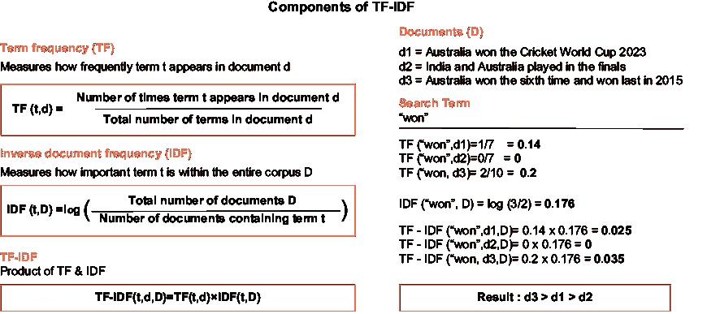
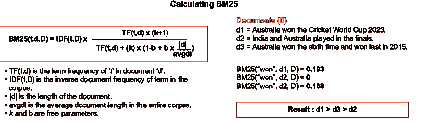
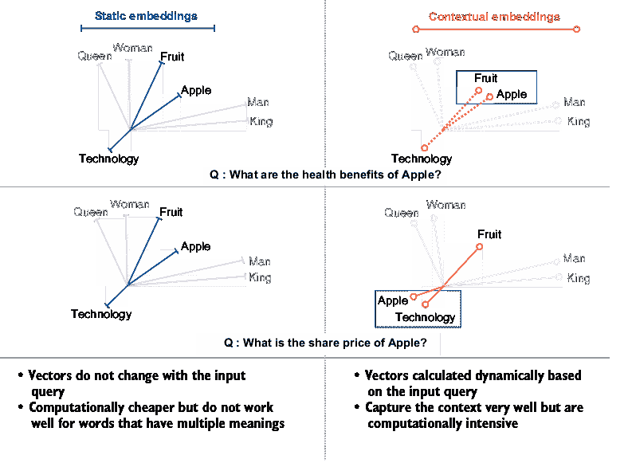

# 4 生成管道：生成上下文 LLM 响应

### 本章涵盖

+   检索器和检索方法

+   使用提示工程技术进行增强

+   使用 LLM 进行生成

+   Python 中 RAG 管道的基本实现

在第三章中，我们讨论了通过索引管道创建知识库，即检索增强生成（RAG）应用的非参数记忆。为了使用这个知识库进行准确和上下文相关的响应，我们需要创建一个包含检索、增强和生成步骤的生成管道。

本章详细阐述了生成管道的三个组成部分。我们首先讨论检索过程，这主要涉及在知识库的向量数据库中搜索存储的嵌入，并返回与用户输入查询密切匹配的文档列表。你还将了解检索器及其检索算法的概念。接下来，我们转向增强步骤。在此阶段，了解与 RAG 一起使用的不同提示工程框架也是有益的。最后，作为生成步骤的一部分，我们讨论了 LLM 生命周期的一些阶段，例如使用基础模型与监督微调、不同大小的模型，以及在 RAG 环境中开源与专有模型。在这些步骤中，我们还强调了不同方法的优缺点。

到本章结束时，你将具备对 RAG 系统两个基础管道的理解。你也应该准备好构建一个基本的 RAG 系统。

到本章结束时，你应该

+   了解 RAG 中使用的几个检索器。

+   理解使用提示工程进行增强。

+   了解 LLM 在 RAG 环境中的使用细节。

+   对设置基本 RAG 系统有端到端的知识。

在深入探讨每个组件之前，让我们先对生成管道进行一个概述。

## 4.1 生成管道概述

回想一下第二章中介绍的生成管道。当用户提供输入时，生成管道负责提供上下文响应。检索器从知识库中搜索最合适的信息。用户问题通过这些信息进行增强，并作为输入传递给 LLM 以生成最终响应。这个过程如图 4.1 所示。

生成管道涉及三个过程：检索、增强和生成。检索过程负责从知识库中检索与用户查询相关的信息。增强是将检索到的信息与用户查询相结合的过程。生成是最后一步，LLM 根据增强的提示生成响应。本章详细讨论了这三个过程。

## 4.2 检索

检索是指从大量语料库或知识库中查找和提取相关信息的过程。正如你在第三章中看到的，来自各种来源的信息被解析、分块并以嵌入的形式存储在向量数据库中。这些存储的嵌入有时也被称为文档，知识库由几卷文档组成。本质上，检索是一个搜索问题，旨在找到与输入查询最匹配的文档。

通过一个称为检索器的组件来搜索知识库并检索正确的文档。简单来说，检索器接受查询作为输入，并返回一个匹配文档的列表作为输出。这个过程如图 4.2 所示。你可以想象检索是一个关键步骤，因为检索到的信息质量直接影响最终生成的输出质量。


##### 图 4.1  包含三个组件（即检索、增强和生成）的生成管道概述


##### 图 4.2  检索器在知识库中搜索并返回最相关的文档。

我们在第三章构建索引管道时已经讨论了嵌入。使用嵌入，我们可以找到与用户查询匹配的文档。嵌入是检索可以发生的一种方法。还有其他方法，花些时间了解不同类型的检索方法和它们计算结果的方式是值得的。

本节首先讨论了检索算法及其在 RAG（检索增强生成）环境中的重要性。在 RAG 系统中，可以使用一种或多种检索方法来构建检索组件。接下来，我们将探讨一些可以直接通过框架（例如 LangChain）使用的预构建检索器的例子。这些检索器与数据库、云服务提供商或第三方信息源等服务集成。最后，我们将通过在 LangChain 中使用 Python 构建一个非常简单的检索器来结束本节。我们还将继续使用这个例子来展示增强和生成步骤，以便在本章结束时，我们有一个完整的生成管道实现。

注意第三章讨论了索引以及如何将数据转换为数值形式以便以后检索信息。你可能还记得我们在 3.3 节中详细讨论了嵌入。由于我们以嵌入的形式存储了数据，为了检索这些数据，我们也必须在嵌入的搜索上工作。因此，检索过程与索引过程紧密耦合。我们用于索引的任何东西，我们也将用于检索。

### 4.2.1 检索方法的进展

信息检索，或称 IR，是搜索的科学。无论你是在文档中搜索信息还是搜索文档本身，它都属于信息检索的范畴。信息检索在计算机科学中有着丰富的历史，始于 19 世纪初约瑟夫·玛丽·雅卡尔发明的雅卡尔织机，这是第一个能够读取穿孔卡的设备。从那时起，信息检索从简单的搜索和检索发展到高度复杂的搜索和检索。*布尔检索*是一种基于关键词的简单搜索（就像你在浏览器或文字处理器的搜索栏中按下 CTRL/CMD + F 时遇到的搜索），其中使用布尔逻辑根据单词的存在或不存在来匹配文档与查询。如果文档包含查询中的确切术语，通常结合 AND、NOT 和 OR 运算符，则会检索文档。"词袋模型" *(BoW)* 在 NLP 的早期阶段被广泛使用。它创建了一个包含文档中所有单词的词汇表，作为一个向量，表示每个单词的存在或不存在。考虑两个句子："The cat sat on the mat" 和 "The cat in the hat。" 词汇表是 `[``"``the``"``,` `"``cat``"``,` `"``in``"``,` `"``hat``"``,` `"``on``"``,` `"``mat``"``]`，而第一个句子表示为向量 `[2,` `1,` `1,` `1,` `0,` `0]`，而第二个句子是 `[2,` `1,` `0,` `0,` `1, 1]`。虽然简单，但它忽略了上下文、意义和单词的顺序。

其中一些，尽管在机器学习和信息检索领域很受欢迎，但由于各种原因，在 RAG 的上下文中并不合理。为了我们的目的，我们关注在 RAG 中使用的一些流行的检索技术。

#### 术语频率-逆文档频率

术语频率-逆文档频率 (TF-IDF) 是一种用于评估单词在文档中相对于文档集合（语料库）的重要性的一种统计度量。它将更高的权重分配给在文档中频繁出现但在语料库中不频繁出现的单词。图 4.3 阐述了如何计算单语元搜索词的 TF-IDF。



##### 图 4.3  根据搜索词计算 TF-IDF 以对文档进行排名

LangChain 还提供了一个 TF-IDF 的抽象实现，使用来自 `langchain_community` 的检索器，它反过来又使用 `scikit-learn`：

```py
# Install or Upgrade Scikit-learn
%pip install –-upgrade scikit-learn

# Import TFIDFRetriever class from retrievers library
from langchain_community.retrievers import TFIDFRetriever

# Create an instance of the TFIDFRetriever with texts
retriever = TFIDFRetriever.from_texts(
["Australia won the Cricket World Cup 2023",
 "India and Australia played in the finals",
 "Australia won the sixth time having last won in 2015"]
)

# Use the retriever using the invoke method
result=retriever.invoke("won")

# Print the results
print(result)
```

TF-IDF 不仅可用于单语元，也可用于短语（n-gram）。然而，即使 TF-IDF 通过强调独特单词来改进简单的搜索方法，它仍然缺乏对上下文和单词顺序的考虑，这使得它对于像 RAG 这样的复杂任务不太适用。

#### 最佳匹配 25

最佳匹配 25（BM25）是一种用于根据每个文档中出现的查询术语对文档进行排名的高级概率模型。它是概率信息检索模型家族的一部分，被认为是经典 TF-IDF 模型的进步。BM25 带来的改进是它调整了文档的长度，这样较长的文档不会得到不公平的高分。图 4.4 展示了 BM25 的计算过程。



AI 生成的内容可能是不正确的。](../Images/CH04_F04_Kimothi.png)

##### 图 4.4 BM25 也考虑了文档的长度。

与 TF-IDF 类似，LangChain 也使用`rank_bm25`包提供了一个 BM25（具体来说是 Okapi BM25）的抽象实现：

```py
# Install or Upgrade rank_bm25
%pip install –-upgrade rank_bm25

# Import BM25Retriever class from retrievers library
from langchain_community.retrievers import BM25Retriever

# Create an instance of the TFIDFRetriever with texts
retriever = BM25Retriever.from_texts(
["Australia won the Cricket World Cup 2023",
 "India and Australia played in the finals",
 "Australia won the sixth time having last won in 2015"]
)

# Use the retriever using the invoke method
result=retriever.invoke("Who won the 2023 Cricket World Cup?")

# Print the results
print(result)
```

对于长查询而不是单个关键词，计算查询中每个词的 BM25 值，查询的最终 BM25 值是所有词值的总和。BM25 是传统信息检索（IR）中的一个强大工具，但它仍然无法捕捉到 RAG 应用所需的查询和文档的完整语义意义。BM25 通常在 RAG 中用于快速初始检索，然后使用更强大的检索器重新排序结果。我们将在第六章学习重新排序，届时我们将讨论 RAG 的高级策略。

#### 静态词嵌入

如 Word2Vec 和 GloVe 之类的静态嵌入将词表示为连续向量空间中的密集向量，基于上下文捕捉语义关系。例如，“king” − “man” + “woman”近似于“queen”。这些嵌入可以捕捉到 BoW、TF-IDF 和 BM25 所遗漏的细微差别，如相似性和类比。然而，尽管它们提供了更丰富的表示，但它们仍然缺乏完整的上下文理解，并且在处理多义词（具有多个意义的词）方面有限。这里的“静态”一词强调了词的向量表示不会随着输入查询中词的上下文而改变。

#### 上下文嵌入

由 BERT 或 OpenAI 的文本嵌入模型生成，上下文嵌入为查询和文档生成高维、上下文感知的表示。这些基于 transformers 的模型捕捉深层的语义意义和关系。例如，关于“apple”的查询将检索讨论苹果这种水果或苹果科技公司的文档，具体取决于输入查询。图 4.5 展示了静态嵌入和上下文嵌入之间的差异。上下文嵌入在信息检索（IR）中代表了一个重大进步，为 RAG 任务提供了必要的上下文和理解。尽管计算密集，上下文嵌入在 RAG 中是最广泛使用的检索器。第 3.3.2 节中讨论的嵌入模型示例是上下文嵌入。

TF-IDF 和 BM25 等方法使用基于频率的计算来对文档进行排序。在嵌入（静态和上下文）中，排序是基于相似度分数。相似度通常使用文档向量之间角度的余弦值来计算。我们在第 3.3.3 节中讨论了余弦相似度计算。图 4.6 说明了使用嵌入进行检索的过程。

#### 其他检索方法

虽然所讨论的方法在讨论中最为流行，但还有其他方法可供选择。这些方法代表了更近期的进展和专门的方法，如果你想要深入了解信息检索的世界，这些方法是非常好的参考：

+   *学习稀疏检索*—使用神经网络生成稀疏、可解释的表示（例如：SPLADE，DeepCT，和 DocT5Quer）

+   *密集检索*—将查询和文档编码为密集向量以进行语义匹配（例如：密集段落检索器 [DPR]，ANCE，RepBERT）



##### 图 4.5  静态嵌入与上下文嵌入的比较

+   *混合检索*—结合稀疏和密集方法以实现平衡的效率和效果（例如：ColBERT，COIL）

+   *交叉编码检索*—直接使用转换器模型比较查询-文档对（例如：基于 BERT 的重排序器）

+   *基于图的检索*—使用图结构来建模文档之间的关系（例如：TextGraphs，用于信息检索的图神经网络）

+   *量子启发检索*—将量子计算原理应用于信息检索（例如：量子语言模型 [QLM]）

+   *神经信息检索模型*—包含各种基于神经网络的信息检索方法（例如：NPRF [神经 PRF]，KNRM [基于核的神经网络排序模型]）


##### 图 4.6  基于嵌入的检索技术中的相似度计算和结果排序

表 4.1 列出了不同检索器的优缺点。虽然上下文嵌入是开始使用 RAG 所需了解的唯一内容，但熟悉其他检索器对于进一步探索以及当你想要提高检索器性能的情况是有用的。正如我们讨论的，在 LangChain 中使用`scikit-learn`检索器实现 TF-IDF 和`rank_bm25`检索器实现 BM25，还有许多其他使用上述提到的方法之一的方法。我们将在下一节中查看一些流行的例子。

##### 表 4.1 RAG 不同检索技术的比较

| 技术 | 关键特性 | 优点 | 缺点 | 适用于 RAG |
| --- | --- | --- | --- | --- |
| 布尔检索 | 使用逻辑运算符的精确匹配 | 简单、快速、精确 | 有限的相关性排名；无部分匹配 | 低：过于僵化 |
| 词袋模型 | 无序的词频计数 | 简单直观 | 忽略词序和上下文 | 低：缺乏语义理解 |
| TF-IDF | 基于文档和语料库频率的词权重 | 比词袋模型改进的相关性排名 | 仍然忽略语义和词关系 | 低-中等：比词袋模型好但有限；用于混合检索 |
| BM25 | 具有长度归一化的高级排名函数 | 性能稳健；行业标准 | 语义理解有限 | 中等：简单 RAG 的良好基线；用于混合检索。 |
| 静态嵌入 | 固定的密集向量表示 | 捕获一些语义关系 | 与上下文无关；在多义性处理上有限 | 中等：引入基本语义 |
| 上下文嵌入 | 考虑上下文的密集表示 | 丰富的语义理解；处理多义性 | 计算密集 | 高：出色的语义捕获 |
| 学习到的稀疏检索器 | 神经网络生成的稀疏表示 | 高效、可解释且具有一定的语义理解 | 可能会错过一些语义关系 | 高：平衡效率和语义 |  |
| 密集检索器 | 查询和文档的密集向量匹配 | 强大的语义匹配 | 计算密集；可解释性较低 | 高：非常适合 RAG 中的语义搜索 |
| 混合检索器 | 稀疏和密集方法的组合 | 平衡效率和有效性 | 实现和调整复杂 | 高：适用于各种 RAG 需求的多面手 |
| 跨编码检索器 | 直接查询-文档比较 | 非常准确的相关性评估 | 极其计算密集 | 中-高：非常适合 RAG 中的重排序 |
| 基于图的检索器 | 文档关系的图结构 | 捕获数据中的复杂关系 | 可能复杂于构建和查询 | 中-高：适用于 RAG 中的结构化数据 |
| 受量子启发的检索器 | 信息检索中的量子计算概念 | 处理复杂查询的潜力 | 新兴领域；实际效益尚未完全证明 | 低-中等：有潜力但尚未成熟 |
| 神经信息检索模型 | 适用于信息检索的各种神经网络方法 | 灵活；可以捕获复杂模式 | 通常需要大量训练数据；可能是黑盒 | 高：适用于各种 RAG 场景的适应性 |

### 4.2.2 流行检索器

开发者可以根据一种或多种检索方法的组合来构建他们的检索器。检索器不仅用于 RAG，还用于各种与搜索相关的任务。

对于 RAG，LangChain 提供了许多集成，其中 TF-IDF、嵌入和相似性搜索、以及 BM25 等算法已被抽象为供开发者使用的检索器。我们已经看到了 TF-IDF 和 BM25 的例子。以下章节中描述了一些其他流行的检索器。

#### 向量存储和数据库作为检索器

向量存储可以作为检索器使用，从而免除开发者计算查询向量嵌入并按相似度和排名结果的责任。FAISS 通常与上下文嵌入模型一起用于检索。其他向量数据库如 PineCone、Milvus 和 Weaviate 通过结合嵌入等密集检索方法和 BM25 和 SPLADE 等稀疏方法提供混合搜索功能。

#### 云服务提供商

云服务提供商 Azure、AWS 和 Google 也提供了他们的检索器。与 Amazon Kendra、Azure AI Search、AWS Bedrock、Google Drive 和 Google Vertex AI Search 的集成为开发者提供了在规模上执行向量、关键词和混合查询信息检索的基础设施、API 和工具。

#### 网络信息资源

与信息资源如维基百科、arXiv 和 AskNews 的连接提供了从这些来源的优化搜索和检索。你可以在官方 LangChain 文档中查看这些检索器和其他更多内容（[`mng.bz/gm4R`](https://mng.bz/gm4R)）

这是对检索器世界的简要介绍。如果你觉得信息有点复杂，你总是可以随时回过头来再看。在这个阶段，对上下文嵌入的理解就足够了。上下文嵌入是基本 RAG 管道中最受欢迎的技术，我们现在将使用 OpenAI 嵌入创建一个简单的检索器。

### 4.2.3 简单检索器实现

在我们进入生成管道的下一步之前，让我们看看一个简单的检索器示例。在第三章中，我们正在为 2023 年板球世界杯的维基百科页面进行索引。如果你还记得，我们使用了 OpenAI 的嵌入来编码文本，并使用 FAISS 作为向量索引来存储嵌入。我们还把 FAISS 索引存储在本地目录中。现在让我们重用这个索引：

```py
# Install the langchain openai library
%pip install langchain-openai==0.3.7
# Import FAISS class from vectorstore library
from langchain_community.vectorstores import FAISS

# Import OpenAIEmbeddings from the library
from langchain_openai import OpenAIEmbeddings

# Set the OPENAI_API_KEY as the environment variable
import os
os.environ["OPENAI_API_KEY"] = <YOUR_API_KEY>

# Instantiate the embeddings object
embeddings=OpenAIEmbeddings(model="text-embedding-3-small")

# Load the database stored in the local directory
vector_store=FAISS.load_local(
folder_path="../../Assets/Data", 
index_name="CWC_index",
embeddings=embeddings, 
allow_dangerous_deserialization=True
)

# Original Question
query = "Who won the 2023 Cricket World Cup?"

# Ranking the chunks in descending order of similarity
retrieved_docs = vector_store.similarity_search(query, k=2)
```

这个`similarity_search()`函数返回一个按分数排序的匹配文档列表。这个分数是查询与文档之间相似度的量化，因此被称为相似度分数。在这个例子中，使用了向量索引的内置相似度搜索功能进行检索。作为我们在第 4.2.2 节讨论的检索器之一，向量存储本身充当了检索器。`K=2`告诉函数检索前两个文档。这是 RAG 系统生成管道中检索器最基本实现，检索方法是通过嵌入实现的。我们使用了 OpenAI 的 text-embedding-3-small。FAISS 根据这些嵌入计算相似度分数。

检索器是 RAG 系统的骨架。检索器的质量对生成输出的质量有很大影响。在本节中，你学习了关于 vanilla 检索方法的内容。在设计生产级系统时，会使用多种策略。我们将在第六章中了解这些高级策略。现在，我们已经了解了检索器，接下来我们将进入下一个重要步骤——增强。

## 4.3 增强技术

检索器检索与用户查询最相关的信息（或文档）。但是，接下来怎么办？我们如何使用这些信息？答案是相当直观的。如果你还记得第一章的讨论，LLM 的输入是自然语言提示。检索器检索到的信息也应该以自然语言提示的形式发送给 LLM。将用户查询和检索到的信息结合起来的这个过程被称为*增强*。

RAG 中的增强步骤主要属于提示工程领域。提示工程可以定义为向 LLM 提供指令以实现预期结果的技术。提示工程的目标是通过构建提示，在 LLM 对预期结果（s）的响应中实现准确性和相关性。乍一看，增强似乎很简单——只需将检索到的信息添加到查询中。然而，一些细微的增强技术有助于提高生成结果的品质。见图 4.7 简单增强的示例。


##### 图 4.7 简单增强是将用户查询与检索到的文档结合起来发送给 LLM。

### 4.3.1 RAG 提示工程技术

提示工程作为一个学科，有时被认为过于简单，不足以被称为工程。你可能听说过这样的话，“英语是新的编程语言。”与 LLM 的交互确实是在自然语言中进行的。然而，同样真实的是，编程的原则不是代码所写的语言，而是机器被指令的逻辑。考虑到这一点，让我们考察不同的逻辑方法，这些方法可以用来增强用户查询与检索到的信息。

#### 上下文提示

为了理解简单的增强技术，让我们回顾第一章。回忆我们的例子“谁赢得了 2023 年板球世界杯？”我们复制了维基百科文章的摘录。这个摘录是检索到的信息。然后我们将这些信息添加到提示中，并提供了额外的指令——“仅根据以下提供的上下文回答。”图 4.8 展示了这个例子。

通过添加这个指令，我们已经设置了我们的生成过程只关注提供的信息，而不是 LLM 的内部知识（或参数化知识）。这是一种简单的增强技术，也被称为*上下文提示*。请注意，指令可以以任何语言结构给出。例如，我们可以在提示的开头添加指令，例如，“在以下背景下回答问题，谁赢得了 2023 年板球世界杯。信息：<维基百科摘录>。”我们也可以在提示的末尾重申指令——“请记住，只根据提供的背景回答问题，不要从任何其他来源获取信息。”

#### 控制生成提示

有时，信息可能不在检索到的文档中。这种情况发生在知识库中的文档没有与用户查询相关的任何信息时。检索器可能仍然检索到一些与用户查询最接近的文档。在这些情况下，幻觉的可能性增加，因为 LLM 仍然会尝试遵循回答问题的指令。为了避免这种情况，添加了一个额外的指令，告诉 LLM 如果检索到的文档没有适当的信息来回答用户问题（类似于“如果问题不能根据提供的情况回答，就说我不知道。”），则不要回答。在 RAG 的上下文中，这种技术特别有价值，因为它确保了模型的响应基于检索到的信息。如果相关信息尚未检索到或不在知识库中，模型被指示承认这种信息缺失，而不是尝试生成一个可能是不正确的答案。”


AI 生成的内容可能是不正确的。](../Images/CH04_F09_Kimothi.png)

##### 图 4.8  信息通过添加指令增强到原始问题中。

#### 少样本提示

观察到，当生成响应时，LLM 相当好地遵循提示中提供的示例。如果你想生成的内容以特定的格式或风格呈现，建议提供一些示例。在 RAG 中，当在提示中提供检索到的信息时，我们也可以指定某些示例，以帮助引导生成过程，使其以我们需要的方式使用检索到的信息。这种技术被称为*少样本提示*。在这里，“shot”指的是提示中给出的示例。图 4.9 展示了包含两个示例的提示。


AI 生成的内容可能是不正确的。](../Images/CH04_F09_Kimothi.png)

##### 图 4.9  RAG 上下文中少样本提示的示例

你可能会遇到诸如 *单次提示* 或 *两次提示* 等术语，它们用给出的示例数量替换了“少量”一词。相反，当没有给出示例，并且期望 LLM 正确回答时，该技术也称为 *零次提示*。

#### 思维链提示

观察到引入中间推理步骤可以提高 LLM 在需要复杂推理的任务（如算术、常识和符号推理）中的性能。在 RAG 的上下文中也可以应用这一点。这被称为 *思维链*，或 CoT，*提示*。在图 4.10 中，我要求 ChatGPT 根据检索到的信息分析两个团队的表现。


##### 图 4.10  推理任务的思维链（CoT）提示

CoT 提示方法还可以与少量提示技术相结合，在最终问题之前提供少量推理示例。创建这些示例是一项劳动密集型任务。在 auto-CoT 中，示例也是使用 LLM 创建的。

#### 其他高级提示技术

提示工程正变得越来越复杂。持续的研究不断提出提示技术的改进。要深入了解提示工程，让我们来看看以下一些技术：

+   *自洽性*——虽然 CoT 在 CoT 提示中使用单个推理链，但自洽性旨在采样多个不同的推理路径，并使用它们各自的生成结果来得出最一致的答案。

+   *生成式知识提示*——这种技术通过动态构建相关的知识链，使用模型的潜在知识来加强推理，探索基于提示的知识生成理念。

+   *思维树提示*——这种技术维护一个可探索的思维树结构，其中包含旨在解决问题的连贯的中间思维步骤。

+   *自动推理和工具使用*（ART）——ART 框架自动将模型生成与工具使用交织在一起，用于复杂的推理任务。ART 使用演示来分解问题并集成工具，而无需特定于任务的脚本。

+   *自动提示工程师*（APE）——APE 框架自动生成和选择最佳指令以引导模型。它使用大型语言模型（LLM）根据输出演示合成任务候选提示解决方案。

+   *主动提示*——主动提示通过涉及查询、不确定性分析、人工标注和增强推理的过程，动态调整语言模型以适应特定任务的提示。

+   *ReAct 提示*—ReAct 集成了用于并发推理轨迹和特定任务操作的 LLM，通过与外部工具交互进行信息检索，从而提高性能。当与 CoT 结合时，它最优地利用内部知识和外部信息，增强 LLM 的可解释性和可靠性。

+   *递归提示*—**递归提示将复杂问题分解为子问题，通过按顺序使用提示来解决它们。这种方法有助于在数学问题或问答等任务中的组合泛化，模型基于前一步的解决方案构建。**

表 4.2 总结了不同的提示技术。增强的提示工程是一个不断发展的学科。需要注意的是，在为 RAG 应用编写提示时，有很大的创意空间。有效的提示对生成的输出有显著影响。你使用的提示类型将很大程度上取决于你的用例和知识库中信息的性质。

##### 表 4.2  增强提示技术的比较

| 技术 | 描述 | 关键优势 | 最佳用例 | 复杂度 |
| --- | --- | --- | --- | --- |
| 上下文提示 | 将检索到的信息添加到提示中，并指示关注提供的上下文 | 确保关注相关信息 | 一般 RAG 查询 | 低 |
| 控制生成提示 | 当信息不可用时，指示模型说“我不知道” | 降低幻觉风险 | 当准确性至关重要时 | 低 |
| 少样本提示 | 在提示中提供示例以指导响应格式和风格 | 提高输出一致性和格式遵循 | 当需要特定输出格式时 | 中等 |
| 思维链 (CoT) 提示 | 引入中间推理步骤 | 提高复杂推理任务的表现 | 需要逐步分析的复杂查询 | 中等 |
| 自洽性 | 样本多个不同的推理路径 | 提高答案的一致性和准确性 | 具有多种可能推理方法的任务 | 高 |
| 生成知识提示 | 动态构建相关的知识链 | 使用模型的潜在知识 | 需要广泛知识应用的任务 | 高 |
| 思维树提示 | 维护一个可探索的思维步骤树结构 | 允许更全面的解决问题 | 复杂的多步问题解决 | 高 |
| 自动推理和工具使用 (ART) | 交错模型生成与工具使用 | 提高问题分解和工具集成 | 需要外部工具使用的任务 | 非常高 |
| 自动提示工程师 (APE) | 自动生成和选择最优指令 | 优化特定任务的提示 | 复杂任务的提示优化 | 非常高 |
| 活跃提示 | 动态适应特定任务的 LMs 提示 | 提高特定任务的性能 | 需要自适应提示的任务 | 高 |
| ReAct 提示 | 将推理痕迹与特定任务的操作集成 | 提高性能和可解释性 | 需要推理和操作的任务 | 高 |
| 递归提示 | 将复杂问题分解为子问题 | 有助于组合泛化 | 复杂、多步骤问题 | 高 |

在上一节中，我们已经构建了一个简单的检索器。现在，我们将使用一个简单的上下文提示和受控生成执行增强。

### 4.3.2 简单增强提示的创建

在 4.2.3 节中，我们能够使用 OpenAI 嵌入实现一个基于 FAISS 的检索器。现在，我们将利用这个检索器并创建增强提示：

```py
# Import FAISS class from vectorstore library
from langchain_community.vectorstores import FAISS

# Import OpenAIEmbeddings from the library
from langchain_openai import OpenAIEmbeddings

# Set the OPENAI_API_KEY as the environment variable
import os
os.environ["OPENAI_API_KEY"] = <YOUR_API_KEY>

# Instantiate the embeddings object
embeddings=OpenAIEmbeddings(model="text-embedding-3-small")

# Load the database stored in the local directory
vector_store=FAISS.load_local(
folder_path="../../Assets/Data", 
index_name="CWC_index",
embeddings=embeddings, 
allow_dangerous_deserialization=True
)

# Original Question
query = "Who won the 2023 Cricket World Cup?"

# Ranking the chunks in descending order of similarity
retrieved_docs = vector_store.similarity_search(query, k=2)

# Selecting the first chunk as the retrieved information
retrieved_context= retrieved_docs[0].page_content

# Creating the prompt
augmented_prompt=f"""

Given the context below, answer the question.

Question: {query} 

Context : {retrieved_context}

Remember to answer only based on the context provided and not from any other source. 

If the question cannot be answered based on the provided context, say I don't know.

"""
```

增强步骤完成后，我们现在可以发送提示到 LLM 以生成期望的结果。你将学习 LLMs 如何生成文本以及生成的细微差别。

## 4.4 生成

生成是此流程的最终步骤。虽然 LLMs 可以在之前的任何步骤中使用，但生成步骤完全依赖于 LLM。最受欢迎的 LLMs 是由 OpenAI、Anthropic、Meta、Google、Microsoft 和 Mistral 等开发人员开发的。虽然文本生成是 LLMs 的核心能力，但我们现在看到的多模态模型可以处理图像、音频和文本。同时，研究人员正在开发更快、更小的模型。

在本节中，我们将讨论有助于为你的 RAG 系统选择语言模型的因素。然后，我们将继续使用我们迄今为止构建的检索器和增强提示的例子，并通过添加生成步骤来完成它。

### 4.4.1 LLMs 的分类及其对 RAG 的适用性

截至 2024 年 6 月，有超过一百种 LLMs 可供使用，每周都有新的 LLMs 出现。那么，我们如何决定为我们的 RAG 系统选择哪个 LLM 呢？为了展示决策过程，让我们讨论可以将 LLMs 广泛分类的三个主题：

+   它们是如何被训练的

+   如何访问它们

+   它们的大小

我们将讨论这些主题下的 LLMs，并了解可能影响 LLM 选择的因素。

#### 原始模型与微调模型

训练 LLM 需要大量的数据和计算资源。LLM 的训练是通过无监督学习过程完成的。所有现代 LLMs 都是自回归模型，并且被训练来生成序列中的下一个标记。这些庞大的预训练 LLMs 也被称为*基础模型*。

你可能会问的问题是，如果 LLMs 只是预测序列中的下一个标记，我们如何能够向这些模型提问和聊天呢？答案是所谓的*监督微调*，或称*SFT*。

监督微调是一种用于适应预训练语言模型以特定任务或行为（如问答或聊天）的过程。它涉及在标记数据集上进一步训练预训练的基础模型，其中模型学习将输入映射到特定的期望输出。您从一个预训练模型开始，为目标任务准备一个标记数据集，并在该数据集上训练模型，这将调整模型参数以在目标任务上表现更好。图 4.11 给出了 SFT 过程的概述。


##### 图 4.11  监督微调是一种分类模式训练过程。

尽管基础模型在广泛的任务中具有很好的泛化能力，但在某些用例中，需要微调模型。例如，法律和医疗保健等特定领域的领域适应性、针对分类和命名实体识别（NER）等特定任务的优化以及对话式 AI、个性化等用例，在这些情况下，您可能会观察到微调模型表现更好。

在 RAG（阅读理解生成）的背景下，选择基础模型和微调模型时，应考虑以下标准：

+   *领域特定性**—基础模型具有更广泛的知识，可以处理更广泛的主题和查询，适用于通用 RAG 系统。如果您的 RAG 应用是特定的（例如，处理患者记录或重型机械的说明书），您可能会发现针对特定领域微调模型可以提高性能。

+   *检索集成**—如果您发现您正在使用的基模型没有很好地整合检索到的信息，那么一个训练有素以更好地利用信息的微调模型可以导致生成质量更高。

+   *部署速度**—基础模型可以快速部署，因为不需要额外的训练。要微调模型，您需要花费时间来收集训练数据和模型的实际训练。

+   *响应**定制**—为了生成特定格式或自定义风格元素（如语气或词汇）的结果，经过微调的模型可能比基础模型更好地满足要求。

+   *资源效率**—微调模型需要更多的存储和计算资源。根据部署规模，微调模型的成本可能更高。

+   *道德一致性**—微调模型允许更好地控制响应，以符合道德准则，甚至某些隐私方面。

标准的总结见表 4.3。

##### 表 4.3 选择基础模型和微调模型的标准

| 标准 | 更好的适用性 | 说明 |
| --- | --- | --- |
| 领域特定性 | 微调模型 | 适用于特定应用（例如，患者记录和说明书）的性能更好 |
| 检索集成 | 微调模型 | 可以训练以更好地利用检索到的信息 |
| 部署速度 | 基础模型 | 无需额外训练即可快速部署 |
| 响应定制 | 微调模型 | 更好地遵守特定格式、风格、语气或词汇要求 |
| 资源效率 | 基础模型 | 需要更少的存储和计算资源 |
| 道德一致性 | 微调模型 | 允许更好地控制对道德指南和隐私的响应 |

微调模型可以更好地控制你的 RAG 系统，但它们成本较高。还存在过度依赖检索以及 RAG 性能与大型语言模型固有能力之间的潜在权衡。因此，是否使用基础模型或微调一个取决于你希望实现哪些改进、数据的可用性、成本以及其他权衡。一般建议从基础模型开始实验，然后逐步过渡到监督微调以提高性能。

#### 开源模型与专有模型

软件开发和分发代表了两种根本不同的方法：开源软件与专有软件。大型语言模型的世界也不例外。一些大型语言模型开发者，如 Meta 和 Mistral，已经公开了模型权重，以促进合作和社区驱动的创新。相比之下，像 OpenAI、Anthropic 和 Google 这样的先驱者则保持了模型的封闭性，提供支持、托管服务和更好的用户体验。

对于 RAG 系统，开源模型提供了定制的灵活性、部署方法和透明度，但需要必要的基础设施来维护模型。专有模型提供商可能对于大量使用来说成本更高，但提供定期更新、易用性、可扩展性和更快的发展，以及其他方面。一些专有模型提供商，如 OpenAI，已经预建了 RAG 功能。您选择哪种类型的模型可能取决于以下一些标准：

+   *定制化*—开源大型语言模型通常被认为更适合定制化，例如与自定义检索机制的深度集成。开源大型语言模型还允许更好的微调控制。专有模型的定制仅限于 API 功能。

+   *易用性*—然而，专有模型的使用要容易得多。一些模型，如 OpenAI、Cohere 和类似的产品，提供了优化的、预构建的 RAG 解决方案。

+   *部署灵活性*—开源模型可以根据您的偏好进行部署（私有云、本地），而专有模型由提供商管理。这也影响到数据安全和隐私。现在大多数专有模型提供商都提供多种部署选项。

    选项。

+   *成本*——开源 LLMs 可能伴随着前期基础设施成本，而私有模型则是基于使用量定价。长期成本和查询量是选择开源和私有模型时需要考虑的因素。大规模部署可能更倾向于使用开源模型。

开源和私有模型在 RAG（检索和生成）之间的选择取决于部署规模、特定领域需求、集成需求以及检索和生成过程中定制的重要性等因素。除此之外，知识更新的需求、透明度、可扩展性、数据结构、合规性等因素将决定模型的选择。讨论的总结见表 4.4

##### 表 4.4 开源和私有模型选择标准

| 标准 | 更好的适用性 | 说明 |
| --- | --- | --- |
| 定制化 | 开源 | 允许与自定义检索机制更深入地集成，并更好地控制微调 |
| 易用性 | 私有 | 提供优化、预构建的 RAG 解决方案，通常更容易使用 |
| 部署灵活性 | 开源 | 可以部署在私有云或本地，提供更多选项 |
| 大规模部署的成本 | 开源 | 尽管前期有基础设施成本，但对于大规模部署可能更具成本效益 |
| 数据安全和隐私 | 开源 | 提供对数据的更多控制，尽管一些私有模型现在提供各种部署选项 |
| 定期更新和支持 | 私有 | 通常提供定期更新和更好的支持 |

混合方法也不被排除。在原型验证阶段，私有模型可能适合快速实验。

这里有一些流行的私有模型示例：

+   OpenAI 的 GPT 系列 ([`platform.openai.com/docs/models`](https://platform.openai.com/docs/models))

+   Anthropic 的 Claude 系列 ([`www.anthropic.com/claude`](https://www.anthropic.com/claude))

+   Google 的 Gemini 系列 ([`mng.bz/eBnJ`](https://mng.bz/eBnJ))

+   Cohere 的 Command R 系列 ([`cohere.com/command`](https://cohere.com/command))

一些开源模型是

+   Meta 的 Llama 系列 ([`llama.meta.com/`](https://llama.meta.com/))

+   Mistral ([`docs.mistral.ai/getting-started/models/`](https://docs.mistral.ai/getting-started/models/))

#### 模型大小

大型语言模型（LLMs）有多种大小，通常按它们包含的参数数量来衡量。模型的大小极大地影响了其能力以及资源需求。

较大的模型包含数十亿甚至数万亿的参数。这些模型在推理能力、语言理解和更广泛的知识方面表现出色。它们可以生成更连贯的文本，其回答在上下文中更准确。然而，这些较大的模型在计算、存储和能源需求方面显著较高。

参数规模在数百万或数十亿的小型模型提供了诸如更快的推理时间、更低的资源使用量和更容易在边缘设备或资源受限环境中部署等好处。研究人员和开发者继续探索实现大型模型性能的同时，使用更小和更高效架构的方法。

对于一个 RAG 系统，以下方面应进行评估：

+   *资源限制*—小型模型具有远低于大型模型的资源使用量。可以使用更小的模型构建轻量级的 RAG 应用，实现更快的推理。

    models.

+   *推理能力*—在资源限制的另一端是模型的语言处理能力。大型模型更适合复杂推理任务，并能处理检索信息中的歧义。因此，小型模型将严重依赖检索信息的质量。

+   *部署选项*—大型模型的大小使得它们难以部署在边缘设备上。这是小型模型提供的灵活性，使得 RAG 应用能够部署到广泛的设备和环境中。

+   *上下文处理*—由于拥有更长的上下文窗口，大型模型可能在整合 RAG 系统中的检索信息方面表现得更好。大型模型在处理多样化查询方面也更为出色，而小型模型则难以处理域外查询。在 RAG 系统中，大型模型可能在处理多样或不可预测的查询类型时表现更佳。

实际上，大多数 RAG 应用都是基于大型模型构建的。然而，从长期采用和应用技术的角度来看，小型模型更有意义。各种因素总结在表 4.5 中。

##### 表 4.5 选择小型和大型模型的标准

| 标准 | 更好的适用性 | 说明 |
| --- | --- | --- |
| 资源限制 | 小型模型 | 资源使用量更低；适合轻量级 RAG 应用 |
| 推理能力 | 大型模型 | 更适合复杂推理任务和处理检索信息中的歧义 |
| 部署选项 | 小型模型 | 更灵活；可以部署在边缘设备和资源受限的环境中 |
| 上下文处理 | 大型模型 | 更擅长整合检索到的多个信息片段；更长的上下文窗口 |
| 查询多样性 | 大型模型 | 更好地处理多样和不可预测的查询类型 |
| 推理速度 | 小型模型 | 更快的推理时间；适合需要快速响应的应用 |

流行的小型语言模型示例包括：

+   Microsoft 的 Phi-3 ([`azure.microsoft.com/en-us/products/phi-3`](https://azure.microsoft.com/en-us/products/phi-3))

+   Google 的 Gemma ([`ai.google.dev/gemma`](https://ai.google.dev/gemma))

在你的 RAG 系统中，选择 LLM 是一个核心考虑因素，需要密切注意并反复迭代。你系统的性能可能需要通过实验和调整 LLM 的选择来适应。

LLM 的列表几乎已经无穷无尽。这对开发者和企业来说意味着这项技术已经真正实现了民主化。虽然所有 LLM 都有其独特的提案和架构，但在实际应用中，有各种各样的选择可供选择。简单的 RAG 应用可能依赖于单个 LLM 提供商，但对于更复杂的应用，多 LLM 策略可能更有益。

我们实现了一个简单的检索器并创建了一个增强提示。在本章的最后部分，我们通过创建生成步骤来总结管道。

### 4.4.2 完成 RAG 管道：使用 LLM 进行生成

我们使用 FAISS 和 OpenAI 嵌入构建了一个简单的检索器，并创建了一个简单的增强提示。现在我们将使用 OpenAI 的最新模型 GPT-4o 来生成响应：

```py
# Import FAISS class from vectorstore library
from langchain_community.vectorstores import FAISS

# Import OpenAIEmbeddings from the library
from langchain_openai import OpenAIEmbeddings

# Set the OPENAI_API_KEY as the environment variable
import os
os.environ["OPENAI_API_KEY"] = <YOUR_API_KEY>

# Instantiate the embeddings object
embeddings=OpenAIEmbeddings(model="text-embedding-3-small")

# Load the database stored in the local directory
vector_store=FAISS.load_local(
    folder_path="../../Assets/Data", 
    index_name="CWC_index",
    embeddings=embeddings, 
    allow_dangerous_deserialization=True
    )

# Original Question
query = "Who won the 2023 Cricket World Cup?"

# Ranking the chunks in descending order of similarity
retrieved_docs = vector_store.similarity_search(query, k=2)

# Selecting the first chunk as the retrieved information
retrieved_context= retrieved_docs[0].page_content

# Creating the prompt
augmented_prompt=f"""

Given the context below, answer the question.

Question: {query} 

Context : {retrieved_context}

Remember to answer only based on the context provided and not from any other source. 

If the question cannot be answered based on the provided context, say I don't know.

"""
# Importing the OpenAI library from langchain
from langchain_openai import ChatOpenAI

# Instantiate the OpenAI LLM
llm = ChatOpenAI(
            model="gpt-4o-mini",
            temperature=0,
            max_tokens=None,
            timeout=None,
            max_retries=2
)
# Make the API call passing the augmented prompt to the LLM
response = llm.invoke (
     [("human",augmented_prompt)]
    )

# Extract the answer from the response object
answer=response.content

print(answer)
```

就这样。我们已经构建了一个生成管道，尽管是一个非常简单的管道。现在它可以从知识库中检索信息并生成与所提问题相关且基于知识库的答案。尝试提出不同的问题以查看管道的泛化能力如何。

现在我们已经涵盖了生成管道的三个步骤——检索、增强和生成。在了解了索引管道（在第三章中介绍）和生成管道之后，你现在已经准备好创建一个基本的 RAG 系统。我们迄今为止讨论的内容可以被称为*天真 RAG 实现*。天真 RAG 可能会受到不准确性的影响。它可能在正确检索和排序信息方面效率低下。LLM 可能会忽略检索到的信息并仍然进行幻觉。为了讨论和解决这些挑战，在第六章中，我们检查了允许更复杂和性能更好的 RAG 系统的先进策略。

但在之前，系统评估的问题出现了。它是否在预期的线上生成响应？LLM 是否仍在进行幻觉？在尝试提高系统性能之前，我们需要能够衡量和基准测试它。这就是我们在第五章要做的。我们将探讨评估指标和流行的 RAG 基准。

## 摘要

### 检索

+   检索是从知识库中根据用户查询找到相关信息的过程。这是一个匹配文档与输入查询的搜索问题。

+   RAG 的流行检索方法包括

    +   *TF-IDF（词频-逆文档频率**）*——相对于语料库的词在文档中的重要性统计量。可以使用 LangChain 的 TFIDFRetriever 实现。

    +   *BM25（最佳匹配 25**）*——一种高级概率模型，是 TF-IDF 的改进。它调整文档长度，可以使用 LangChain 的 BM25Retriever 实现。

    +   *静态词嵌入**s*——将词表示为密集向量（例如，Word2Vec，GloVe）并捕获语义关系，但缺乏完整的上下文理解。

    +   *上下文嵌入*—由 BERT 或 OpenAI 的文本嵌入等模型产生。它们提供上下文感知表示，尽管计算密集，但在 RAG 中应用最广泛。

    +   *高级检索方法*—包括学习稀疏检索、密集检索、混合检索、交叉编码检索、基于图的检索、量子启发检索和神经信息检索模型。

+   大多数高级实现将包括混合方法。

+   向量存储和数据库（例如，FAISS、PineCone、Milvus、Weaviate）、云服务提供商解决方案（例如，Amazon Kendra、Azure AI Search、Google Vertex AI Search）和网页信息资源（例如，Wikipedia、Arxiv、AskNews）是 LangChain 提供的流行检索器集成之一。

+   检索器的选择取决于准确性、速度和与索引方法的兼容性等因素。

### 增强功能

+   增强将用户查询与检索信息相结合，为 LLM 创建提示。

+   提示工程对于有效增强至关重要，旨在提高 LLM 响应的准确性和相关性。

+   RAG 的关键提示工程技术包括

    +   *上下文提示*—在指令中添加检索信息，以关注提供的内容。

    +   *受控生成提示*—指示 LLM 在信息不足时承认缺乏知识。

    +   *少样本提示*—提供示例以指导 LLM 的响应格式或风格。

    +   *思维链（CoT）提示*—为复杂任务引入中间推理步骤。

    +   高级技术包括自洽性、生成知识提示和思维树。

+   增强技术的选择取决于任务复杂性、期望的输出格式和 LLM 能力。

### 生成

+   生成是最终步骤，其中 LLM 根据增强的提示生成响应。

+   大型语言模型（LLMs）可以根据它们的训练方式、访问方式和参数数量进行分类。

+   监督微调（SFT）改进了上下文使用和领域优化，增强了连贯性，并使源归因成为可能；然而，它也带来了成本、过度依赖检索的风险以及与 LLM 固有能力的潜在权衡。

+   开源和专有 LLMs 之间的选择取决于定制需求、长期成本和数据敏感性。

+   较大的模型在推理、语言理解和更广泛的知识方面具有优势，并能生成更连贯和上下文准确的响应，但需要高计算和资源需求。较小的模型允许更快的推理、更低的资源使用，并且更容易部署在边缘设备或资源受限的环境中，但它们不具备大型模型相同级别的语言理解能力。

+   流行的大型 LLMs 包括来自 OpenAI、Anthropic、Google 等公司的产品，开源模型可通过 Hugging Face 等平台获得。

+   LLM 的选择取决于性能要求、资源限制、部署环境和数据敏感性等因素。

+   为 RAG 系统选择 LLM 需要仔细考虑、实验，并根据性能进行可能的调整。
