# 5 RAG 评估：准确性、相关性和忠实度。

### 本章涵盖

+   评估 RAG 管道的需求和需求。

+   RAG 评估的指标、框架和基准。

+   RAG 评估的当前局限性和未来发展方向。

第三章和第四章讨论了使用索引和生成管道开发检索增强生成（RAG）系统的进展。RAG 承诺减少幻觉，并将大型语言模型（LLM）的响应基于提供的环境，这是通过为系统创建一个非参数化记忆或知识库，然后从中检索信息来实现的。

本章介绍了评估 RAG 系统功能良好程度的方法。我们需要确保两个 RAG 管道的组件按预期运行。在较高层次上，我们需要确保检索到的信息与输入查询相关，并且 LLM 生成的响应基于检索到的环境。为此，随着时间的推移已经开发出几个框架。在这里，我们讨论了一些流行的框架以及它们计算的指标。

评估还有第二个方面。虽然框架允许计算指标，但如何确保你的 RAG 管道比其他开发者开发的管道表现更好？评估不能孤立进行。为此，已经建立了一些基准。这些基准评估了 RAG 系统在预设数据上的表现，如问答集，以便对不同 RAG 管道进行准确比较。这些基准帮助开发者评估他们的系统与其他开发者开发的系统相比的性能。

最后，像 RAG 技术一样，RAG 评估的研究仍在进行中。当前评估参数集中仍存在一些局限性。我们讨论了这些局限性以及 RAG 评估未来发展的想法。

到本章结束时，你应该

+   了解 RAG 评估的基本原理。

+   了解 RAG 评估的流行框架、指标和基准。

+   理解局限性和最佳实践。

+   能够在 Python 中评估 RAG 管道。

为了让 RAG 实现将 LLM 响应基于数据的承诺，你需要超越简单的索引、检索、增强和生成实现。我们将在第六章中讨论这些高级策略。然而，要改进某物，你首先需要衡量其性能。RAG 评估有助于为你设置 RAG 系统性能的基线，然后你可以对其进行改进。首先，我们来看 RAG 系统评估的基本方面。

## 5.1 RAG 评估的关键方面

构建一个 PoC RAG 管道并不特别复杂。通过简短的培训和验证一组有限的示例即可实现。然而，为了增强其鲁棒性，在准确反映生产用例的数据集上进行彻底测试是必不可少的。RAG 管道可能会出现自己的幻觉。这可能是由于

+   检索器未能检索到完整上下文，或者检索到了无关的上下文。

+   尽管提供了上下文，但大型语言模型（LLM）并没有考虑它。

+   LLM 从上下文中选择无关信息而不是回答查询。

检索和生成是两个需要从评估角度特别关注的过程。这是因为这两个步骤会产生可评估的输出。（虽然索引和增强会影响输出，但它们不会产生可测量的结果）。以下是关于这两个过程我们需要问自己的几个问题：

+   从知识库中检索上下文的效果如何？

+   它是否与查询相关？

+   存在多少噪声（无关信息）？

+   生成的响应有多好？

+   响应是否基于提供的上下文？

+   响应是否与查询相关？

你可以问更多类似的问题来评估你的 RAG 系统的性能。当代研究已经发现某些评分来评估 RAG 系统的质量和能力。以下几节将讨论三个主要的质量评分和四种主要能力。

### 5.1.1 质量评分

在 RAG 评估的讨论中，有三个质量评分维度很常见。它们衡量检索和生成的质量：

+   *上下文相关性*—这个维度评估检索到的信息或上下文与用户查询的相关性。它计算从知识库中检索上下文的精确度和召回率等指标。

+   *答案忠实度（也称为扎根性**）*—这个维度评估系统生成的答案是否使用了检索到的信息。

+   *答案相关性*—这个维度评估系统生成的答案与原始用户查询的相关性。

我们将在第 5.2 节讨论这些评分是如何计算的。

### 5.1.2 必需的能力

质量评分对于衡量 RAG 系统的检索和生成组件表现如何非常重要。在整体层面上，RAG 系统应该具备某些关键能力：

+   *噪声鲁棒性*—假设 RAG 系统存储的知识库中的信息被完美整理以回答可能提出的问题是不切实际的。很可能一个文档与用户查询相关，但没有任何有意义的答案信息。RAG 系统从相关文档中分离出这些噪声文档的能力被称为噪声鲁棒性。

+   *负拒绝*—本质上，LLMs 总是生成文本。知识库中的文档可能没有关于用户查询的信息。RAG 系统在没有相关信息时不给出答案的能力被称为负拒绝。

+   *信息整合*—为了对用户查询给出全面的答案，很可能需要从多个文档中检索信息。系统从多个文档中吸收信息的能力被称为信息整合。

+   *反事实鲁棒性*—有时知识库中的信息本身可能是不准确的。一个高质量的 RAG 系统应该能够解决这个问题，并拒绝检索到的信息中的已知错误。这种能力被称为反事实鲁棒性。

噪声鲁棒性是检索组件应该具备的能力，而其他能力大多与生成组件相关。

除了这些，*延迟*是另一个经常提到的能力。尽管它是一个非功能性需求，但在生成 AI 应用中却非常关键。延迟是用户查询和响应之间的延迟。你可能已经注意到，LLMs 在生成最终响应之前有相当大的延迟。再加上检索和增强的任务，延迟肯定会增加。因此，重要的是要监控你的 RAG 系统从用户输入到响应所需的时间。

伦理考量也是生成 AI 应用的前沿。对于某些 RAG 应用，测量系统响应中的*偏差*和*毒性*的程度很重要。这也会受到知识库中底层数据的影响。虽然这并不是 RAG 特有的，但评估输出中的偏差和毒性是很重要的。

另一个需要检查的方面是系统的*鲁棒性*，即其处理不同类型查询的能力。一些查询可能很简单，而另一些可能涉及复杂的推理。一些查询可能需要比较两块信息，而另一些可能涉及复杂的后处理，如数学计算。当我们讨论第 5.4 节中的基准 CRAG 时，我们将探讨一些查询类型。

最后，重要的是要提到，这些是接近 RAG 核心技术层面的分数和能力。毕竟，RAG 是一种解决最终用例的手段。因此，你可能需要为你的 RAG 系统构建*特定用例*的评估标准。例如，问答系统可能使用精确匹配（EM）或 F1 分数作为指标，而摘要服务可能使用 ROUGE 分数。使用 RAG 的现代搜索引擎可能会考虑用户交互指标、源归属的准确性以及类似指标。

这就是评估 RAG 管道背后的主要思想。我们之前讨论的质量分数和能力需要被衡量和基准化。RAG 评估的两个关键推动者是框架和基准。

*框架*是设计用来促进评估的工具，提供评估过程和数据生成的自动化。它们通过提供一个结构化的环境来测试 RAG 系统的不同方面，从而简化评估过程。它们是灵活的，可以适应不同的数据集和指标。我们将在第 5.3 节讨论流行的评估框架。

*基准*是标准化的数据集及其评估指标，用于衡量 RAG 系统的性能。基准为比较不同的 RAG 方法提供了一个共同基础。它们通过考虑一组固定的任务及其评估标准来确保评估的一致性。例如，HotpotQA 侧重于多跳推理和检索能力，使用精确匹配和 F1 分数等指标。

基准用于建立性能基准并识别特定任务或领域中的优势/劣势。我们将在第 5.4 节讨论一些基准及其特性。

开发者可以使用框架将评估集成到他们的开发过程中，并使用基准来比较他们的开发与既定标准。框架和基准都计算关注检索和 RAG 质量分数的*指标*。我们将在下一节开始讨论指标，然后再讨论流行的基准和框架。

## 5.2 评估指标

指标量化了对 RAG 系统性能的评估。我们将评估指标分为两大类：

+   在信息检索任务中常用的检索指标

+   随着 RAG 应用的增加而演变的 RAG 特定指标

值得注意的是，还有一些针对自然语言生成的特定指标，如 BLEU、ROUGE 和 METEOR，它们侧重于流畅性，并衡量相关性和语义相似度。它们在分析和基准化 LLMs 性能方面发挥着重要作用。本书讨论了针对检索和 RAG 的特定指标。

### 5.2.1 检索指标

RAG 的检索组件可以独立评估，以确定检索器在满足用户查询方面的表现如何。主要的检索评估指标包括准确度、精确度、召回率、F1 分数、平均倒数排名（MRR）、平均平均精度（MAP）和归一化折现累积增益（nDCG）。

#### 准确度

准确度通常定义为在考察的总案例中，正确预测（包括真阳性和真阴性）的比例。在信息检索的背景下，它可以解释为


尽管准确度是一个简单直观的指标，但它不是检索的主要指标。在一个大型知识库中，大多数文档通常与任何给定的查询无关，这可能导致误导性高的准确度分数。它不考虑检索结果的排名。

#### Precision

回收率关注检索结果的品质。它衡量检索到的文档中与用户查询相关的比例。它回答了这样的问题：“在所有检索到的文档中，有多少是相关的？”

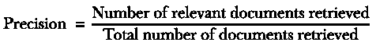

更高的精确度意味着检索器表现良好，主要检索到相关文档。

#### Precision@k

Precision@k 是精确度的一个变体，它衡量在检索到的前‘k’个结果中相关文档的比例。它特别重要，因为它关注的是顶部结果，而不是所有检索到的文档。对于 RAG 来说，它很重要，因为只有顶部结果最有可能被用于增强。例如，如果你限制你的 RAG 系统只使用前五个检索到的文档进行上下文增强，Precision@5 将是计算该指标的度量：


其中‘k’是一个选择的截止点。Precision@5 为 .8 意味着在顶部五个检索到的文档中，有四个是相关的。

Precision@k 也用于比较系统，当不同系统检索到的结果总数可能不同时。然而，局限性在于‘k’的选择可能是任意的，并且这个指标不会超出选择的‘k’。

#### 回收率

回收率关注检索器提供的覆盖率。它衡量从语料库中所有相关文档中检索到的相关文档的比例。它回答了这样的问题：“在所有相关文档中，有多少被检索到了？”


注意，与精确度不同，计算回收率需要先了解相关文档的总数。在具有大量文档的知识库中的大规模系统中，这一要求可能具有挑战性。

与精确度一样，回收率也不考虑检索文档的排名。它也可能具有误导性，因为检索知识库中的所有文档将导致完美的回收率值。图 5.1 可视化了各种精确度和回收率场景。

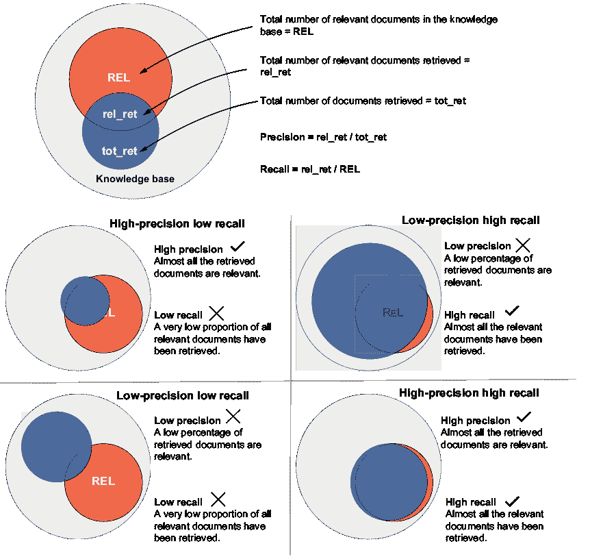

##### 图 5.1 精确度和回收率

#### F1 分数

F1 分数是精确度和回收率的调和平均数。它提供了一个平衡检索器质量和覆盖率的单一指标：

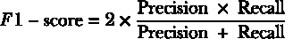

该方程式使得 F1 分数惩罚任何得分低的变量；只有当召回率和精确度值都很高时，才能得到高 F1 分数。这意味着分数不能由单个变量正偏斜。图 5.2 说明了 F1 分数如何平衡精确度和召回率。

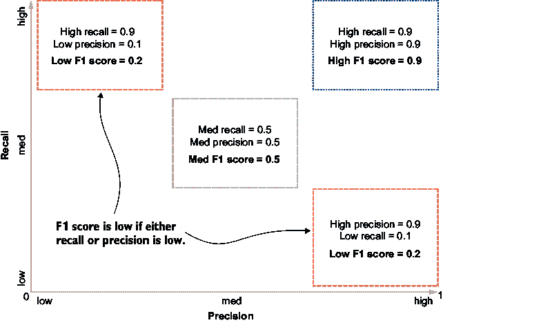

##### 图 5.2  F1 分数平衡了精确度和召回率。精确度和召回率的中间值比一个非常高而另一个非常低的值得到的 F1 分数要高。

F1 分数提供了一个单一、平衡的度量，可以用来轻松比较不同的系统。然而，它不考虑排名，并且对精确度和召回率给予相同的权重，这可能并不总是理想的。

#### 平均倒数排名

平均倒数排名，或 MRR，在评估相关文档排名时特别有用。它测量列表中第一个相关文档的排名的倒数。MRR 在查询集上计算：

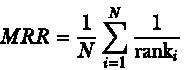

其中 N 是查询总数，ranki 是第 i 个查询的第一个相关文档的排名。

MRR 在你想了解系统如何快速找到相关文档并考虑结果排名时特别有用。然而，由于它没有考虑第一个相关结果之外的内容，当多个相关结果都很重要时，它可能没有用。图 5.3 展示了平均倒数排名的计算方法。


##### 图 5.3  MRR 考虑了排名，但没有考虑所有文档。

#### 均值平均精度

均值平均精度，或 MAP，是一个度量，它结合了不同“k”截止水平的精确度和召回率，即顶部结果的截止数。它计算一个称为平均精度的度量，然后对所有查询进行平均：


其中 Ri 是查询 i 的相关文档数，Precision@k 是截止“k”处的精确度，rel@k 是一个二进制标志，表示排名 k 的文档的相关性。

均值平均精度是所有 N 个查询的平均精度：


MAP 提供了一种在召回率水平上的单一质量度量。当结果排序很重要但计算复杂时，它非常合适。让我们看看图 5.4 中的 MAP 计算示例。


##### 图 5.4  MAP 考虑了所有检索到的文档，并为更好的排名给出更高的分数

#### 归一化折现累积增益

标准化折现累积增益（nDCG）通过考虑相关文档在结果列表中的位置并给予较早出现的相关文档更高的分数来评估排名质量。它在文档具有不同相关度级别的场景中特别有效。为了计算折现累积增益（DCG），检索列表中的每个文档都被分配一个相关性分数 rel，以及一个折扣因子减少文档的权重，随着其排名位置的上升：

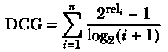

其中 reli 是文档在位置 I 的分级相关性，IDCG 是理想 DCG，即完美排名的 DCG。

nDCG 是实际 DCG 与 IDCG 的比率：

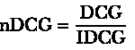

图 5.5 展示了 nDCG 计算的示例。

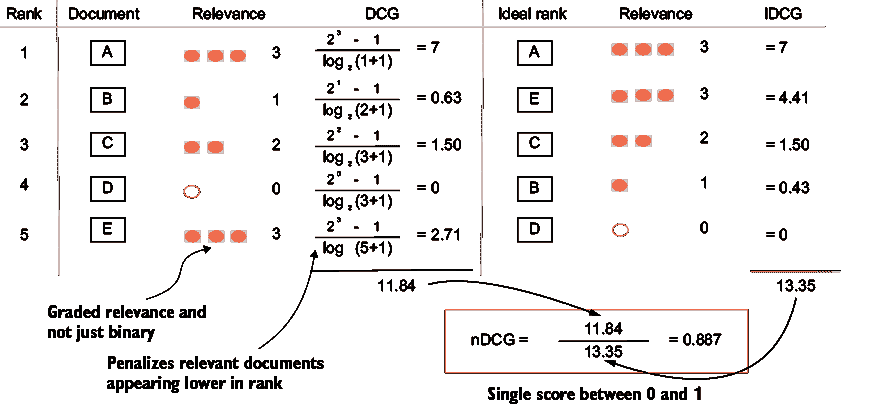

##### 图 5.5  nDCG 处理文档中的相关度级别，并惩罚错误的排名。

nDCG 是一个复杂的指标，计算起来很复杂。它需要文档具有相关性分数，这可能导致主观性，折扣因子的选择对值有显著影响，但它考虑了文档中不同级别的相关性，并给予排名较高的项目更高的权重。

检索系统不仅用于 RAG，还用于各种其他应用领域，如网络和搜索引擎、电子商务产品搜索和个性化推荐、社交媒体广告检索、归档系统、数据库、虚拟助手等。检索指标有助于评估和改进性能，以有效满足用户需求。表 5.1 总结了不同的检索指标。

##### 表 5.1 检索指标

| 指标 | 衡量内容 | 优点 | 用例 | 考虑事项 |
| --- | --- | --- | --- | --- |
| Accuracy | 检索的整体正确性 | 容易理解；包括真实负例 | 平衡数据集的一般性能 | 在不平衡数据集中可能具有误导性；不考虑排名 |
| Precision | 检索结果的品质 | 容易理解和计算 | 通用检索质量评估 | 不考虑排名或检索的完整性 |
| Precision@k | 前 k 个检索结果的品质 | 专注于 RAG 中最相关的结果 | 仅使用前 k 个结果进行增强 | 根据你的 RAG 系统使用情况选择 k |
| Recall | 相关文档的覆盖率 | 衡量检索的完整性 | 评估是否遗漏了重要信息 | 需要知道语料库中所有相关文档 |
| F1-score | 精确率和召回率的平衡 | 结合质量和覆盖率的单一指标 | 通用检索性能 | 可能会模糊精确率和召回率之间的权衡 |
| 平均倒数排名（MRR） | 快速找到相关文档的速度 | 强调快速找到至少一个相关结果 | 当找到一个好结果就足够时 | 当需要多个相关结果时不太有用 |
| 平均平均精度（MAP） | 不同召回率水平的精度 | 考虑精度和排名 | 对排名检索结果的全面评估 | 计算和解释更复杂 |
| 标准化折现累积增益（nDCG） | 带有分级相关性的排名质量 | 考虑不同程度的相关性和排名 | 当文档具有不同级别的相关性时 | 需要对文档进行相关性评分 |

并非所有检索指标都适用于评估。通常，为了可解释性，更复杂的指标会被忽视。这些指标的使用取决于你在系统性能演变过程中的改进阶段。例如，一开始你可能只是试图提高精确度，而在一个进化的阶段，你可能正在寻找更好的排名。

虽然这些指标主要关注检索，但一些指标是专门为 RAG 应用创建的。这些指标专注于第 5.1 节中讨论的三个质量评分。

### 5.2.2 RAG 特定指标

用于评估 RAG 应用的三个质量评分是语境相关性、答案相关性和答案忠实度。这些评分具体回答以下三个问题：

+   信息检索是否与用户查询相关？

+   生成的答案是否基于检索到的信息？

+   生成的答案是否与用户查询相关？

让我们来看看这些评分中的每一个。

#### 语境相关性

语境相关性评估检索到的文档与原始查询的相关程度。关键方面包括主题一致性、信息有用性和冗余。存在人类评估方法和语义相似度度量来计算语境相关性。

该指标被检索增强生成评估（RAGAs）框架采用（将在第 5.3 节中进一步讨论）。检索到的上下文应只包含与查询或提示相关的信息。对于语境相关性，估计一个指标 S，其中 S 是检索上下文中与回答查询或提示相关的句子数量：

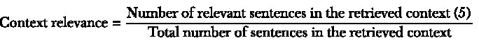

图 5.6 是高语境和低语境相关性的一个示例。

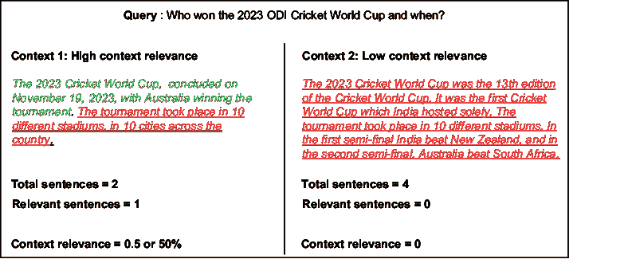

##### 图 5.6  语境相关性评估检索信息的相关程度

与查询的相关性。

相关句子的数量有时也会根据每个句子与查询的相似度得分之和进行定制。语境相关性确保生成组件可以访问适当的信息。

#### 答案忠实度

答案忠诚度是衡量响应在检索到的上下文中事实基础的程度的指标。忠诚度确保响应中的事实不与上下文矛盾，并且可以追溯到源头。它还确保 LLM 没有产生幻觉。在 RAGAs 框架中，忠诚度首先识别响应中提出的声明数量，并计算这些声明在上下文中存在的比例：


让我们看看图 5.7 中的例子

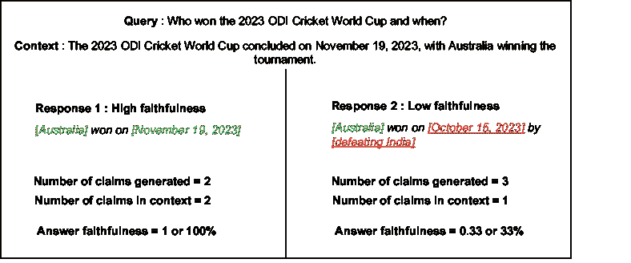

##### 图 5.7  答案忠诚度评估生成的响应与检索到的上下文之间的接近程度。

忠诚度并非衡量事实准确性的完整指标，它仅评估对上下文的扎根程度。忠诚度的逆指标是**幻觉率**，它可以计算出响应中生成的声明在检索到的上下文中不存在的比例。

与忠诚度相关的另一个相关指标是**覆盖率**。覆盖率衡量上下文中相关声明的数量，并计算生成的响应中存在的相关声明的比例。它衡量检索到的段落中的相关信息包含在生成的答案中的程度：


#### 答案相关性

与上下文相关性度量检索到的上下文与查询的相关性一样，答案相关性是衡量响应与查询相关程度的一个指标。此指标侧重于关键方面，例如系统理解查询的能力、响应与查询的相关性以及响应的完整性。

在 RAGAs 中，对于此指标，为初始查询或提示生成一个响应。为了计算分数，然后提示 LLM 多次生成针对生成的响应的问题。然后计算这些问题和原始问题之间的平均余弦相似度。其概念是，如果答案正确地回答了初始问题，LLM 应该能够从中生成与原始问题匹配的问题：


其中 N 是 LLM 生成的查询数量。

注意，答案相关性不是一个衡量真实性的指标，而只是一个衡量相关性的指标。响应可能或可能不是事实准确的，但它可能是相关的。图 5.8 是答案相关性计算的说明。你能找到相关性不高的原因吗？（提示：答案可能包含一些无关的事实。）答案相关性确保 RAG 系统能够提供有用且适当的响应，从而提高用户满意度和系统的实用价值。

#### 权衡和其他考虑因素

这三个指标及其导数构成了 RAG 质量评估的核心。此外，这些指标相互关联，有时还涉及权衡。高上下文相关性通常会导致更高的忠实度，因为系统可以访问更多相关信息。然而，高忠实度并不总是保证高答案相关性。一个系统可能忠实于检索到的段落中的信息，但未能直接回答查询。在不考虑忠实度的情况下优化答案相关性可能会导致看似合适的响应，但包含幻觉或错误信息。

我们在本节中讨论了许多指标。有效解释这些指标对于性能提升至关重要。作为 RAG 系统的创建者，您应该使用这些指标来与其他类似系统进行比较。您还可以观察一致的趋势，以识别您系统的优势和劣势。低精确度高召回率的系统可能表明您的系统检索了大量文档，您可能需要使检索器更加选择性地检索。低精确度低召回率的系统指出检索存在根本问题，您可能需要重新评估索引管道本身。低 MAP 或低上下文相关性分数可能表明存在相同的问题。同样，低 MRR 或低 nDCG 值可能表明检索器的排名算法存在问题。为了解决低答案忠实度或低答案相关性，您可能需要改进您的提示或微调 LLM。


##### 图 5.8 答案相关性是通过计算原始问题和合成问题之间的余弦相似度的平均值来计算的。

也可能存在一些需要您权衡的权衡。提高精确度通常会降低召回率，反之亦然。高度相关但简短的上下文可能导致答案不完整，而高答案忠实度有时可能以牺牲答案相关性为代价。

每个指标相对的重要性将取决于您的用例和用户需求。您可能需要包括针对您的下游用例特定的其他指标，例如用于衡量简洁性的摘要，以及用于强调对话连贯性的聊天机器人。

开发者可以从头开始编写这些指标并将其集成到他们 RAG 系统的开发和部署过程中。然而，您会发现现成的评估框架非常方便。我们将在下一节讨论三个流行的框架。

##### 人工评估和真实数据

我们在本节中讨论的大多数指标都涉及相关文档的概念。例如，精确度是检索到的相关文档数量除以检索到的总文档数量。出现的问题是，一个人如何确定一个文档是相关的？

简单的答案是采用人工评估方法。主题专家查看文档并确定相关性。人工评估引入了主观性，因此，人工评估是由专家小组而不是个人进行的。但人工评估在规模和成本方面存在限制。

任何可以可靠地建立相关性的数据都变得极其有用。地面实据是已知为真实或正确的信息。在 RAG 和生成式 AI 领域，地面实据是一组准备好的提示-上下文-响应或问题-上下文-响应示例，类似于监督机器学习中的标记数据。为您的知识库创建的地面实据数据可以用于评估您的 RAG 系统。

如何创建地面实据数据？这可以被视为一次性的练习，其中一组专家创建这些数据。然而，从文档中手动生成数百个 QCA（问题-上下文-答案）样本可能是一个耗时且劳动密集型的任务。此外，如果知识库是动态的，地面实据数据也需要更新。由人类创建的问题可能面临达到全面评估所需复杂性的挑战，这可能会影响评估的整体质量。

LLMs（大型语言模型）可以用来解决这些挑战。合成数据生成使用 LLMs 从知识库中的文档生成多样化的问题和答案。LLMs 可以被提示创建问题，如简单问题、多上下文问题、条件问题、推理问题等，使用知识库中的文档作为上下文。

## 5.3 框架

框架为 RAG 评估提供了一个结构化的方法。它们可以用来自动化评估过程。一些框架甚至超越了这一点，并帮助生成合成地面实据数据。虽然新的评估框架仍在不断推出，但这里我们讨论两个流行的框架：

+   RAGAs（检索增强生成评估）

+   ARES（自动 RAG 评估系统）

### 5.3.1 RAGAs

Retrieval-Augmented Generation Assessment（RAGAs，检索增强生成评估），是由 Exploding Gradients 开发的一个框架，它评估 RAG 系统的检索和生成组件，而不依赖于大量的人工标注。RAGAs

+   通过合成生成一个可用于评估 RAG 管道的测试数据集。

+   使用指标来衡量管道的性能。

+   监控生产中的应用质量。

我们将继续以 2023 年板球世界杯的维基百科页面为例，但首先使用 RAGAs 创建一个合成测试数据集，然后使用 RAGAs 指标来评估我们在第三章和第四章中创建的 RAG 管道的性能。

#### 合成测试数据集生成（地面实据）

第 5.2 节指出，为了计算评估 RAG 管道质量的评估指标，需要真实数据。虽然这些数据可以手动整理，但 RAGAs 提供了从知识库中的文档生成此数据集的功能。

RAGAs 使用一个 LLM 来完成这项工作。它分析知识库中的文档，并使用 LLM 从知识库的片段中生成种子问题。这些问题基于知识库中的文档片段。这些片段作为问题的上下文。另一个 LLM 用于生成这些问题的答案。这就是它如何根据知识库中的文档生成问题-上下文-答案数据的方式。RAGAs 还有一个进化模块，它创建更难的问题（例如，多上下文、推理和条件）以进行更全面的评估。图 5.9 说明了使用 RAGAs 生成合成数据的过程。


##### 图 5.9 使用 RAGAs 生成合成真实数据

为了评估我们的 RAG 管道，让我们像在第三章中做的那样重新创建 Wikipedia 页面的文档。请注意，为了继续以下代码，我们不得不安装前几章中使用的包：

```py
#Importing the AsyncHtmlLoader
from langchain_community.document_loaders import AsyncHtmlLoader

#This is the URL of the Wikipedia page on the 2023 Cricket World Cup
url="https://en.wikipedia.org/wiki/2023_Cricket_World_Cup"

#Instantiating the AsyncHtmlLoader
loader = AsyncHtmlLoader (url)

#Loading the extracted information
html_data = loader.load()

from langchain_community.document_transformers import Html2TextTransformer

#Instantiate the Html2TextTransformer function
html2text = Html2TextTransformer()

#Call transform_documents
html_data_transformed = html2text.transform_documents(html_data)
```

`html_data_transformed`包含 Wikipedia 页面的必要文档格式。我们将使用 RAGAs 库从这些文档生成数据集。为此，我们首先需要安装 RAGAs 库：

```py
%pip install ragas== 0.2.13

# Import necessary libraries
from ragas.llms import LangchainLLMWrapper
from ragas.embeddings import LangchainEmbeddingsWrapper
from ragas.testset import TestsetGenerator
from langchain_openai import ChatOpenAI, OpenAIEmbeddings

# Instantiate the models
generator_llm = 
LangchainLLMWrapper(
ChatOpenAI(model="gpt-4o-mini")
)

generator_embeddings = 
LangchainEmbeddingsWrapper(
OpenAIEmbeddings(model="text-embedding-3-small")
)

# Create the TestsetGenerator
generator = 
TestsetGenerator(
llm=generator_llm, 
embedding_model=generator_embeddings
)

# Call the generator
testset = 
generator.generate_with_langchain_docs
(
          	html_data_transformed, 
test_size=20, 
)
```

我们创建的`testset`包含基于我们文档的 20 个问题，以及问题所基于的文档片段和真实答案。数据集的截图显示在图 5.10 中。


##### 图 5.10 使用 RAGAs 生成的合成测试数据

我们将使用这个数据集来评估我们的 RAG 管道。

#### 重新创建 RAG 管道

从创建的测试数据集中，我们使用`问题`和`真实答案`信息。我们将问题传递给我们的 RAG 管道并生成答案。我们将这些答案与`真实答案`进行比较，以计算评估指标。首先，我们重新创建我们的 RAG 管道。再次强调，为了继续编写代码，我们不得不安装前几章中使用的包：

```py
# Import FAISS class from vectorstore library
from langchain_community.vectorstores import FAISS
# Import OpenAIEmbeddings & ChatOpenAI from the library
from langchain_openai import OpenAIEmbeddings, ChatOpenAI

def rag_function(query, db_path, index_name):    

# Instantiate the embeddings object

embeddings=OpenAIEmbeddings(model="text-embedding-3-small")

# Load the database stored in the local directory

db=FAISS.load_local(
folder_path=db_path, 
index_name=index_name, 
embeddings=embeddings,
allow_dangerous_deserialization=True
)

# Ranking the chunks in descending order of similarity and selecting the top 2 queries

retrieved_docs = db.similarity_search(query, k=2)

# Keeping text of top 2 retrieved chunks

retrieved_context=[ retrieved_docs[0].page_content 
+retrieved_docs[1].page_content]

# Creating the prompt

augmented_prompt=f"""

Given the context below, answer the question.

Question: {query} 

Context : {retrieved_context}

Remember to answer only based on the context 
provided and not from any other source. 

If the question cannot be answered based 
on the provided context, say I don't know.

"""

# Instantiate the LLM
llm = ChatOpenAI(
model="gpt-4o-mini",
temperature=0,
max_tokens=None,
timeout=None,
max_retries=2
)

# Create message to send to the LLM

messages=[("human",augmented_prompt)]

# Make the API call passing the message to the LLM

response = llm.invoke(messages)

# Extract the answer from the response object

answer=response.content

return retrieved_context, answer
```

我们可以尝试这个管道来生成答案。

```py
# Location of the stored vector index created by the indexing pipeline
db_path='../../Assets/Data'

# User Question
query="Who won the 2023 cricket world cup?"

# Index Name
index_name="CWC_index"

# Calling the RAG function
rag_function(query, db_path, index_name)
```

现在我们有了 RAG 管道函数，我们可以使用合成的这些问题来评估这个管道。

#### 评估

我们首先使用我们的 RAG 管道对合成测试数据集中的问题生成答案。然后，我们将这些答案与真实答案进行比较。我们首先生成答案：

```py
# Create Lists for Questions and Ground Truths from testset
sample_queries = 
dataset.to_pandas()['user_input'].to_list()

expected_responses=
dataset.to_pandas()['reference'].to_list()

# Iterate through the testset to generate responses to questions

dataset_to_eval=[]

for query, reference in zip(sample_queries,expected_responses):

# Call the RAG function
rag_context, rag_answer=rag_function(query,db_path,index_name)

# Create a dictionary of question, answer, context, and ground truth
dataset_to_eval.append(
            {
                    "user_input":query,
                    "retrieved_contexts":relevant_docs,
                    "response":response,
                    "reference":reference
            }
                ) 
```

对于 RAGAs，评估集需要以`Dataset`格式：

```py
# Import the EvaluationDataset library
from ragas import EvaluationDataset

evaluation_dataset = EvaluationDataset.from_list(dataset_to_eval)
```

现在我们有了完整的评估数据集，我们可以调用指标：

```py
#Import all the libraries
from ragas import evaluate

from ragas.metrics import (
        LLMContextRecall, 
Faithfulness, 
FactualCorrectness, 
AnswerCorrectness, 
ResponseRelevancy)

#Set the judge LLM for evaluation

evaluator_llm = 
LangchainLLMWrapper(
ChatOpenAI(model="gpt-4o-mini")
)

# Calculate the metrics for the dataset 

result = evaluate(
dataset=evaluation_dataset,
metrics=[
LLMContextRecall(), 
Faithfulness(), 
AnswerCorrectness(), 
ResponseRelevancy(),
FactualCorrectness()],
llm=evaluator_llm)
```

您还可以查看 RAGAs 的官方文档以获取更多信息（[`docs.ragas.io/en/stable/`](https://docs.ragas.io/en/stable/)）。RAGAs 计算一系列对评估 RAG 管道质量有用的指标。RAGAs 使用一个 LLM 来完成这个相对主观的任务。例如，为了计算给定问题-上下文-答案记录的忠实度，RAGAs 首先将答案分解成简单的陈述。然后，对于每个陈述，它会询问 LLM 该陈述是否可以从上下文中推断出来。LLM 会提供一个 0 或 1 的响应，并附上原因。这个过程会重复几次。最后，忠实度被计算为 LLM 判断为忠实（即 1）的陈述的比例。使用基于 LLM 的方法还计算了其他几个指标。这种在评估任务中使用 LLM 的方法也被称为*LLM 作为评委*方法。需要注意的是，这种评估的准确性也取决于作为评委使用的 LLM 的质量。

### 5.3.2 自动 RAG 评估系统

自动 RAG 评估系统，或 ARES，是由斯坦福大学和 Databricks 的研究人员开发的一个框架。与 RAGAs 类似，ARES 在评估中使用 LLM 作为评委的方法。两者都要求语言模型对给定查询的答案相关性、上下文相关性和忠实度进行分类。然而，也有一些不同之处：

+   RAGAs 依赖于发送给 LLM 进行评估的启发式提示。相比之下，ARES 使用语言模型训练一个分类器。

+   RAGAs 通过汇总 LLM 的响应来得出分数。ARES 使用一个名为预测增强推理（PPI）的框架为分数提供置信区间。

+   RAGAs 从文档中生成一个简单的合成问题-上下文-答案数据集用于评估。ARES 生成包含查询-段落-答案三元组的正负例的合成数据集。

ARES 需要比 RAGAs 更多的数据。要使用 ARES，您需要以下三个数据集：

+   *领域内段落集*——这是一组与被评估的具体领域相关的段落。这些段落应该适合生成查询和答案。在我们的案例中，它将是来自维基百科文章的文档。

+   *人类偏好验证集*——需要至少大约 150 个标注数据点。这个集合用于验证人类标注者对生成的查询-段落-答案三元组的关联性的偏好。

+   *少量示例*——至少需要五个领域内查询和答案的示例。这些示例有助于在合成数据生成过程中提示 LLMs。

对于人类偏好验证集的需求以及对语言模型进行分类的微调使得应用 ARES 更加复杂。ARES 的应用超出了本书的范围。然而，ARES 是一个鲁棒的框架。它提供了对系统性能的详细分析，包括统计置信区间，使其适合深入评估 RAG 系统。RAGAs 承诺在没有依赖人类标注的情况下实现更快的评估周期。有关 ARES 应用的更多详细信息，请参阅官方 GitHub 仓库（[`github.com/stanford-futuredata/ARES`](https://github.com/stanford-futuredata/ARES)）。

虽然 RAGAs 和 ARES 已经获得了流行，但还有其他框架，如 TruLens、DeepEval 和 RAGChecker，这些框架也得到了 RAG 开发者的认可。

框架提供了一种标准化的方法来自动化评估您的 RAG 管道。您选择的评估框架应取决于您的用例需求。对于快速且易于理解的评估，RAGAs 可能是您的选择。对于跨多个领域和问题类型的鲁棒性，ARES 可能更适合。大多数专有服务提供商（向量数据库、LLMs 等）都有您可能使用的评估功能。您也可以开发自己的指标。

接下来，我们将探讨基准测试。基准测试用于比较相互竞争的 RAG 系统。

## 5.4 基准测试

基准测试提供了一种标准参考点，用于评估系统的质量和性能。RAG 基准测试是一组标准化任务和用于比较不同 RAG 系统在检索相关信息和生成准确响应效率的数据库。自 2023 年以来，随着 RAG 开始流行，基准测试的数量急剧增加，但在那之前就已经有用于问答任务的基准测试。例如，斯坦福问答数据集（SQuAD）、WikiQA、自然问题（NQ）和 HotpotQA 都是开放域问答数据集，主要使用精确匹配（EM）和 F1 分数等指标来评估检索组件。BEIR 或基准信息检索是一个基于 9 个信息检索任务和 19 个问答数据集的全面、异构基准。本节讨论了三个流行的 RAG 特定基准及其评估。

### 5.4.1 RGB

检索增强生成基准（RGB）在 2023 年 12 月的一篇论文中提出([`arxiv.org/pdf/2309.01431`](https://arxiv.org/pdf/2309.01431))。它包含 600 个基础问题和 400 个附加问题，英语和中文各占一半。语料库是通过一个多步骤过程构建的，包括收集最近的新闻文章，使用 ChatGPT 生成问题和答案，通过 Google 的 API 检索相关网页，并使用密集检索模型选择最相关的文本片段。它是一个专注于 RAG 系统四个关键能力的基准：噪声鲁棒性、负拒绝、信息整合和反事实鲁棒性，如图 5.11 所示。

RGB 专注于以下指标进行评估：

+   *准确性*—用于噪声鲁棒性和信息整合。它基于生成的文本与正确答案的精确匹配。

+   *拒绝率*—用于负拒绝。它通过模型输出与特定拒绝短语的精确匹配来衡量。拒绝率也

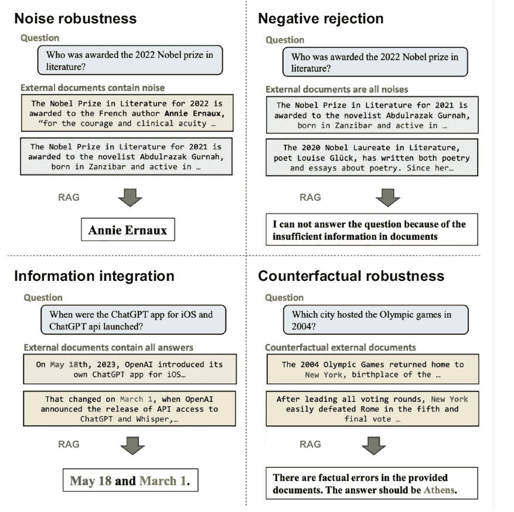

##### 图 5.11  RAG 系统所需的四种能力。来源：陈等人发表的《检索增强生成中的大型语言模型基准测试》，[`arxiv.org/pdf/2309.0143`](https://arxiv.org/pdf/2309.0143)。

+   以确定响应是否包含拒绝信息。

+   *错误检测率*—用于反事实鲁棒性。它通过模型输出与特定错误检测短语的精确匹配来衡量，并使用 ChatGPT 进行评估。

+   *错误纠正率*—用于反事实鲁棒性。它衡量模型在识别错误后是否可以提供正确答案。

您可以使用 GitHub 仓库来实施 RGB ([`github.com/chen700564/RGB`](https://github.com/chen700564/RGB))。

#### 多跳 RAG

由香港科技大学的研究人员整理的多跳 RAG 包含 2556 个查询，每个查询的证据分布在两到四份文档中。查询还涉及文档元数据，反映了在现实世界的 RAG 应用中常见的复杂场景。它包含四种类型的查询：

+   *推理*—跨多个来源综合信息（例如，哪份报告讨论了苹果的供应链风险——2019 年年度报告还是 2020 年年度报告？）

+   *比较*—比较不同来源的事实（例如，Netflix 或 Google 是否在 2023 年报告了更高的收入？）

+   *时间性*—分析事件的时序（例如，例如，苹果是在第五代 iPad Pro 发布前还是之后推出 AirTag 跟踪设备？）

+   *空值*—无法从知识库中回答的查询

完整的实现代码可在 [`github.com/yixuantt/MultiHop-RAG`](https://github.com/yixuantt/MultiHop-RAG) 找到。

#### CRAG

由 Meta 和 HKUST 精心制作的综合 RAG 基准（CRAG）是一个包含 4,409 个问答对和模拟 API 的实际问答基准，用于模拟网络和知识图谱（KG）搜索。它包含八个类型（简单、条件、比较问题、聚合问题、多跳问题、集合查询、后处理密集型问题和错误前提问题，如图 5.12 所示）的查询，涵盖五个领域（金融、体育、音乐、电影和开放领域）。

对于评估集中的每个问题，CRAG 使用四个类别之一对答案进行标记：

+   *完美*—响应正确回答了用户的问题，且不包含任何幻觉内容（评分为 +1）。

+   *可接受*—响应提供了对用户问题的有用答案，但可能包含一些不影响答案有用性的小错误（评分为 +0.5）。

+   *缺失*—响应是“我不知道”、“很抱歉我找不到...”，系统错误（如空响应）或系统请求澄清原始问题的请求（评分为 0）。

+   *错误*—响应提供了错误或不相关的信息来回答用户的问题（评分为 -1）。


##### 图 5.12  CRAG 中的八种问题类型

对于自动评估，CRAG 将答案精确匹配到基准真实值时将其分类为完美。如果不匹配，则要求一个 LLM 进行分类。它使用了两个 LLM 评估器。您可以在 [`arxiv.org/pdf/2406.04744`](https://arxiv.org/pdf/2406.04744) 上了解更多关于 CRAG 的信息。

其他值得注意的基准数据集包括专注于医疗信息的 MedRAG ([`github.com/Teddy-XiongGZ/MedRAG`](https://github.com/Teddy-XiongGZ/MedRAG))，专注于中文的 CRUD-RAG ([`arxiv.org/pdf/2401.17043`](https://arxiv.org/pdf/2401.17043))，以及专注于联邦搜索的 FeB4RAG ([`arxiv.org/abs/2402.11891`](https://arxiv.org/abs/2402.11891))。如果您正在开发一个以准确和上下文生成为核心主张的 LLM 应用程序，您将通过展示它在不同基准上的表现来展示您应用程序的质量。表 5.2 比较了不同的基准。

##### 表 5.2 RAG 基准

| 基准 | 数据集 | 任务 | 指标 | 适用性 |
| --- | --- | --- | --- | --- |
| SQuAD | 斯坦福问答数据集 | 开放域问答 | 精确匹配 (EM), F1-score | 一般问答任务，对理解准确性的模型评估 |
| 自然问题 | 真实 Google 搜索查询 | 开放域问答 | F1-score | 真实世界的问答，从大型语料库中检索信息 |
| 火锅问答 | 基于维基百科的问答 | 多跳问答 | EM, F1-score | 涉及多个文档、复杂推理任务的问答 |
| BEIR | 多个数据集 | 信息检索 | nDCG@10 | 多个领域的综合信息检索模型评估 |
| RGB | 新闻文章、ChatGPT 生成的问答 | 强健问答 | 准确率、拒绝率、错误检测率、错误纠正率 | RAG 系统的鲁棒性和可靠性 |
| 多跳 RAG | 香港科技大学整理的查询 | 复杂问答 | 各种 | 需要跨源综合的 RAG 应用 |
| CRAG | 多个来源（金融、体育、音乐等） | 事实问答 | 四类评估（完美、可接受、缺失和错误） | 使用不同问题类型评估事实问答 |

我们已经研究了帮助自动化计算评估指标和基准框架，这些基准框架能够实现不同实现和方法的比较。框架将帮助您提高系统的性能，而基准将有助于将其与其他市场上可用的系统进行比较。

然而，与任何不断发展的领域一样，有一些限制和挑战需要考虑。下一节将探讨这些限制，并讨论为解决这些问题而出现的最佳实践，以确保对 RAG 评估采取更全面和细致的方法。

## 5.5 限制和最佳实践

在用于 RAG 评估的框架和基准方面已经取得了很大的进展。评估的复杂性源于检索和生成组件之间的相互作用。在实践中，对人类判断的依赖很大，这些判断是主观的，难以扩展。以下是一些常见的挑战和一些指导方针，以帮助应对这些挑战。

#### 缺乏标准化指标

对于评估 RAG 系统，没有共识认为哪些是最好的指标。对于检索，通常测量精确率、召回率和 F1 分数，但它们并不能完全捕捉生成响应的细微差别。同样，常用的生成指标如 BLEU、ROUGE 等也不能完全捕捉 RAG 所需的上下文意识。使用针对 RAG 的特定指标，如答案相关性、上下文相关性和忠实度进行评估，可以引入 RAG 评估所需的必要细微差别。然而，即使是这些指标，也没有标准的计算方法，每个框架都带来了自己的方法。

*最佳实践*：比较不同框架在 RAG 特定指标上的结果。有时，根据用例更改计算方法可能是合理的。

#### 过度依赖 LLM 作为评判者

RAG 特定指标（在 RAGAs、ARES 等中）的评估依赖于使用一个 LLM 作为评判者。LLM 被提示或微调以将响应分类为相关或不相关。这增加了 LLM 执行此任务复杂性的程度。可能的情况是，LLM 在评判您特定的文档和知识库时可能不太准确。另一个问题是自我参照。如果评判 LLM 与您的系统中的生成 LLM 相同，您可能会得到更有利的结果。

*最佳实践*：从裁判 LLM 中抽取一些结果并评估这些结果是否与普遍理解的企业实践一致。为了避免自引用问题，请确保使用与生成 LLM 不同的裁判 LLM。如果你使用多个裁判 LLM 并汇总他们的结果，这也可能有所帮助。

#### 缺乏用例主观性

大多数框架在评估时采用通用方法。它们可能无法捕捉与你用例相关的任务的主体性质（内容生成与聊天机器人、问答等）。

*最佳实践*：关注特定用例的指标来评估质量、连贯性、有用性和类似方面。在你的工作流程中结合人类判断，使用用户反馈、众包或专家评分等技术。

#### 基准是静态的

大多数基准都是静态的，没有考虑到信息的演变性质。RAG 系统需要适应实时信息的变化，而这些变化目前还没有得到有效测试。缺乏对 RAG 模型如何随时间学习并适应新数据的评估。大多数基准都是领域无关的，这可能无法反映你特定领域的 RAG 系统的性能。

*最佳实践*：使用针对你领域定制的基准。基准的静态性质是有限的。不要过度依赖基准，并使用定期更新的数据来补充基准的使用。

#### 可扩展性和成本

评估大规模 RAG 系统比评估基本的 RAG 管道更复杂。它需要大量的计算资源。基准和框架通常也不考虑如延迟和效率等对现实应用至关重要的指标。

*最佳实践*：在评估时，仔细采样测试用例。结合工作流程来衡量延迟和效率。

除了这些，你还应仔细考虑偏差和毒性等方面，重点关注信息整合和负面拒绝，这些框架评估得并不好。同时，也要关注这些评估框架和基准的演变。

在本章中，我们全面考察了评估指标、框架和基准，这些将帮助你评估你的 RAG 管道。我们使用了 RAGAs 来评估我们一直在构建的管道。

到目前为止，我们已经探讨了构建和评估一个简单的 RAG 系统。这也标志着本书的第二部分 2。你现在已经熟悉了使用索引管道创建 RAG 知识大脑，使用生成管道实现实时交互，以及使用框架和基准来评估你的 RAG 系统。

在下一部分，我们将转向讨论 RAG 系统的生产方面。在第六章中，我们将探讨改进 RAG 管道的策略和高级技术，这些也应反映在更好的评估指标中。在第七章中，我们将探讨使 RAG 在生产中成为可能的 LLMOps 堆栈。

## 摘要

### RAG 评估基础

+   RAG 评估评估系统在提供的上下文中减少幻觉和地面响应的能力。

+   RAG 评估的三个关键质量分数是上下文相关性、答案忠实度和答案相关性。

+   RAG 系统所需的四个关键能力包括噪声鲁棒性、负拒绝、信息整合和反事实鲁棒性。

+   需要考虑的额外因素包括响应的延迟、鲁棒性、偏差和毒性。

+   应该开发定制化的特定用例指标来评估性能。

### 评估指标

+   检索指标包括精确率、召回率、F1 分数、平均倒数排名（MRR）、平均平均精度（MAP）和归一化折现累积增益（nDCG）。

+   准确率、精确率、召回率和 F1 分数不考虑结果的排名顺序。

+   RAG 特定指标关注上下文相关性、答案忠实度和答案相关性。

+   人工评估和真实数据在 RAG 评估中起着至关重要的作用。

### 评估框架

+   RAGAs 是一个易于实现的框架，可用于快速评估 RAG 管道。

+   ARES 采用更复杂的方法，包括分类器训练和置信区间计算。

### 基准

+   基准为比较特定任务上不同 RAG 实现提供了标准化的数据集和指标。

+   流行基准如 SQuAD、自然问题、HotpotQA 和 BEIR 专注于检索质量。

+   近期基准如 RGB、多跳 RAG 和 CRAG 从 RAG 的角度看更为全面。

+   基准关注 RAG 性能的不同方面，如多跳推理或特定领域。

### 局限性和最佳实践

+   RAG 评估的挑战包括缺乏标准化指标、过度依赖 LLM 作为评判者以及基准的静态性质。

+   最佳实践包括使用多个框架、结合特定用例指标和定期更新评估数据。

+   平衡自动化指标与人工判断，并考虑特定用例的要求至关重要。

+   RAG 评估领域正在发展，新的框架和基准不断涌现。

+   开发者应关注新进展并相应地调整评估策略。
