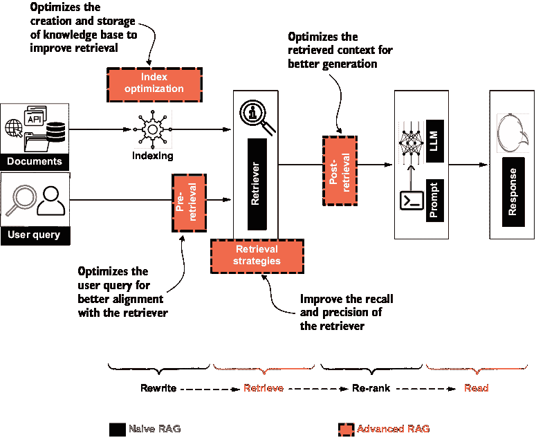
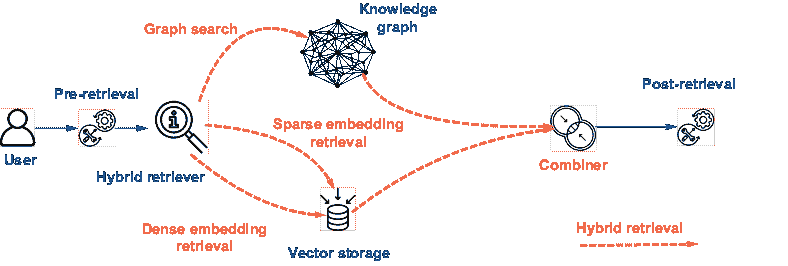
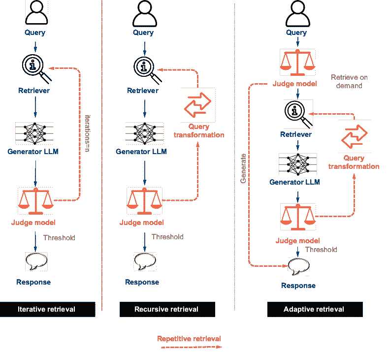
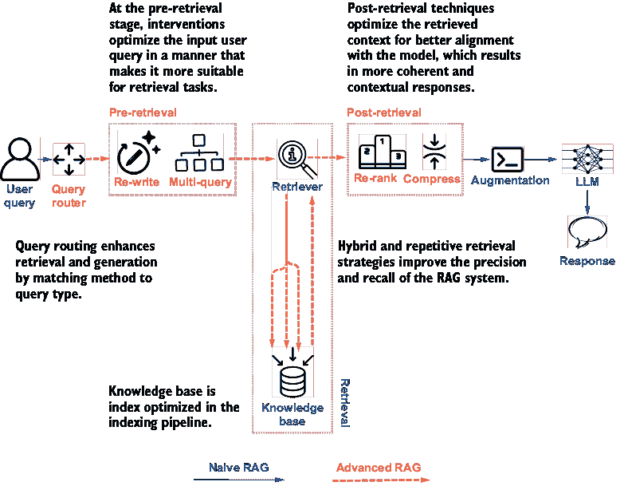
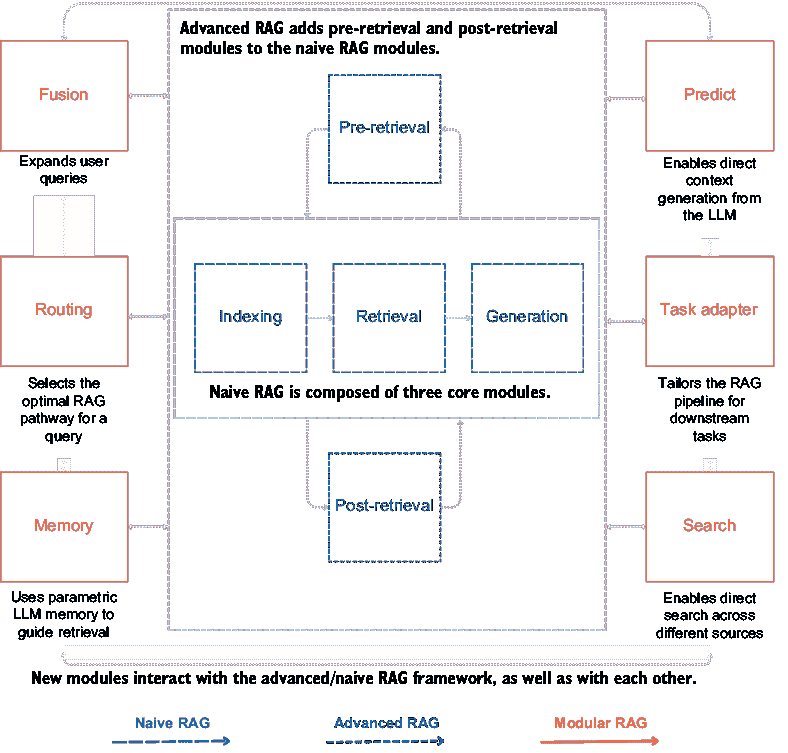

# 第六章：RAG 系统进展：简单、高级和模块化 RAG

### 本章涵盖了

+   简单 RAG 方法局限性

+   高级 RAG 策略和技术

+   RAG 中的模块化模式

在本书的前两部分中，你学习了检索增强生成（RAG）的效用，以及基本 RAG 系统的开发和评估。我们讨论的基本或简单的 RAG 方法，在面向生产级系统时通常是不够的。

本章重点介绍 RAG 的更高级概念。我们首先回顾简单 RAG 方法的局限性和失败点。接下来，我们讨论检索、增强和生成阶段的失败。在 RAG 管道的不同阶段，将详细阐述解决这些失败点的先进策略和技术。

更好的知识库索引导致更好的 RAG 结果。我们将探讨一些基于简单索引管道构建的数据索引策略，以改善知识库的可搜索性。

在生成管道中，改进被分为三个阶段：检索前、检索和检索后。检索前技术侧重于操作和改进用户查询的输入。检索策略侧重于更好地匹配用户查询与知识库中的文档。最后，在检索后阶段，重点是使检索到的上下文与期望的结果对齐，并使其适合生成。

本章的最后部分讨论了一种模块化方法，该方法正在出现并试图在 RAG 系统中找到适用性。模块化方法是对基本 RAG 系统的架构增强。

注意，RAG 改进的策略和技术是广泛的，本章突出了一些流行的策略。本章穿插了代码示例，但如需更全面的辅助代码，请查看本书的源代码仓库。

到本章结束时，你应该

+   了解为什么简单的 RAG 方法不适合生产。

+   了解使 RAG 知识库更高效的索引策略。

+   了解一些流行的检索前、检索和检索后技术。

+   熟悉 RAG 的模块化方法。

RAG（检索增强生成）为各种人工智能应用提供动力。然而，在结果方面存在一定的不确定性。在将 RAG 应用于生产之前，需要解决检索中的不准确、上下文不连贯以及 LLM（大型语言模型）输出中的不连贯问题。在很短的时间内，研究人员和从业者已经尝试了创新技术来提高 RAG 系统的相关性和忠实度。但在我们探讨这些技术之前，了解为什么简单的 RAG 方法通常无法进入生产环境是很重要的。

## 6.1 简单 RAG 局限性

天真的 RAG 可以被认为是 RAG 的最早形式，它在 ChatGPT 发布和 LLM 技术兴起后变得流行。如我们所见，它遵循索引、检索、增强和生成的线性过程。这个过程属于“检索后读取”框架，这意味着有一个检索器检索信息，还有一个 LLM 读取这些信息以生成结果，如图 6.1 所示。


##### 图 6.1  天真的 RAG 是一个顺序的“检索后读取”过程。

天真的 RAG 方法在三个阶段都存在缺陷：

+   *检索*—天真的检索通常观察到精度低，导致检索到不相关信息。它还有低召回率，这意味着相关信息被遗漏，导致结果不完整。

+   *增强*—当多个检索到的文档包含相似信息时，存在冗余和重复的真正可能性。此外，当信息来自不同的文档时，上下文变得不连贯。还有 LLM 上下文长度的问题，它会影响传递给 LLM 用于生成的检索上下文的数量。

+   *生成*—由于上游过程的不足，生成过程受到幻觉和生成内容缺乏根基的影响。LLM 在协调信息时面临挑战。毒性和偏见的问题也持续存在。有时也注意到 LLM 过度依赖检索到的上下文，并忘记从其自身的参数记忆中提取信息。

图 6.2 总结了这些缺陷。


##### 图 6.2  天真 RAG 在过程中的每个阶段的缺陷

在过去几年中，进行了大量研究和实验来解决这些缺陷。早期方法包括预训练语言模型。还尝试了涉及 LLM 微调、嵌入模型和检索器的技术。这些技术需要训练数据和模型权重的重新计算，通常使用监督学习技术。由于本书是一本基础指南，我们将不会深入这些复杂的技术。

本章涵盖了在两个 RAG 管道的不同阶段使用的干预、技术和策略：索引和生成管道。尽管这样的干预措施种类繁多，但下文将突出一些更受欢迎的。

## 6.2 高级 RAG 技术

自从最早的天真 RAG 实验以来，RAG 的高级技术一直在不断涌现。我们可以从以下三个阶段来讨论这些技术：

+   *检索前阶段*—正如其名所示，可以在检索器开始行动之前采取某些干预措施。这大致涵盖两个方面：

    +   *索引优化*——在知识库中存储文档的方式

    +   *查询优化*——优化用户查询，使其更好地与检索和生成任务对齐

+   *检索阶段*——某些策略可以提高检索过程的召回率和精确率。这超出了第四章中讨论的底层检索算法的能力。

+   *后检索阶段*——一旦信息被检索出来，上下文可以进一步优化，以更好地与生成任务和下游 LLM 对齐。

在这三个阶段采用的技术，高级 RAG 过程遵循“重写然后检索然后重新排序然后阅读”的框架。增加了重写和重新排序的两个额外组件，并且与简单的 RAG 相比，检索组件得到了增强。这种结构在图 6.3 中展示。



##### 图 6.3 高级 RAG 是一个重写-检索-重新排序-阅读的过程，与简单的检索-阅读 RAG 过程相比。

我们现在将逐一探索这些组件，从预检索阶段开始。

## 6.3 预检索技术

采用预检索技术的首要目标是促进更好的检索。我们注意到，简单 RAG 的检索阶段存在召回率和精确率低的问题——检索到了不相关信息，并且没有检索到所有相关信息。这主要可能由于以下两个原因：

+   *知识库不适合检索*。如果知识库中的信息不是以易于搜索的方式存储的，那么检索的质量将保持次优。为了解决这个问题，在索引管道中进行*索引优化*，以实现知识库的更有效存储。

+   *检索器不完全理解输入查询*。在生成式 AI 应用中，对用户查询的控制通常有限。用户提供的详细程度是主观的。检索器有时可能误解或不完全理解用户查询的上下文。*查询优化*解决了简单 RAG 的这一挑战方面。

索引和查询优化都在检索器被调用之前进行。这是唯一一个建议在索引和生成管道中采取干预的阶段。我们将探讨这些方面的几种技术。

### 6.3.1 索引优化

索引优化在索引管道中使用。索引优化的目标是建立知识库以实现更好的检索。以下是一些流行的策略。

#### 块优化

第三章讨论了在索引管道中分块的重要性。将大型文档分成更小的段落对于检索和处理 LLMs 的上下文长度限制起着至关重要的作用。某些技术旨在实现更好的分块和高效的块检索，例如

+   *块大小优化*—块的大小对 RAG 系统的质量有显著影响。虽然大块提供了更好的上下文，但它们也携带了大量的噪声。然而，小块具有精确的信息，但可能会错过重要信息。例如，考虑一份 10,000 字的法律文件。如果我们将其分成 1,000 字的段落，每个块可能包含多个法律条款，这使得检索特定信息变得困难。相反，将其分成 200 字的段落可以更精确地检索单个条款，但可能会失去周围条款提供的上下文。通过实验块大小可以帮助找到准确检索的最佳平衡。处理时间也取决于块大小。因此，块大小对检索准确性、处理速度和存储效率有显著影响。理想的块大小因用例而异，并取决于平衡因素，如文档类型和结构、用户查询的复杂性和期望的响应时间。没有一种适用于所有情况的优化块大小的方法。通过实验和评估不同块大小在忠实度、相关性和响应时间（如第五章所述）等指标上的表现，可以帮助确定 RAG 系统的最佳块大小。块大小优化可能需要定期重新评估，因为数据或需求发生变化。

+   *上下文丰富化块分割*—这种方法将较大文档的摘要添加到每个块中，以丰富小块的上下文。这为 LLM 提供了更多上下文，而不会添加太多噪声。它还提高了检索准确性，并保持了块之间的语义连贯性。这个特性在需要更全面的信息视图的情况下特别有用。虽然这种方法增强了更广泛上下文的理解，但它增加了复杂性，并带来了更高的计算需求、增加的存储需求和可能的检索延迟。以下是如何使用 GPT-4o-mini、OpenAI 嵌入和 FAISS 进行上下文丰富化的一个示例：

```py
from langchain_community.document_loaders #1
import AsyncHtmlLoader   #1
from langchain_community.document_transformers  #1
import Html2TextTransformer   #1
url=		 #1
https://en.wikipedia.org/wiki/2023_Cricket_World_Cup   #1
loader = AsyncHtmlLoader (url)   #1
data = loader.load()   #1
html2text = Html2TextTransformer()   #1
document_text=data_transformed[0].page_content   #1
 #1
 #1
summary_prompt = f"Summarize the given 		#2
document in a single paragraph\n		 #2
document: {document_text}"  	 #2
from openai import OpenAI   #2
client = OpenAI()   #2
 #2
response = client.chat.completions.create(   #2
  model="gpt-4o-mini",   #2
  messages= [   #2
    {"role": "user", "content": summary_prompt}   #2
      ]   #2
)   #2
 #2
summary=response.choices[0].message.content   #2
 #2
from langchain_text_splitters import 		#3
RecursiveCharacterTextSplitter    #3
text_splitter = RecursiveCharacterTextSplitter(    #3
chunk_size=1000,    #3
chunk_overlap=200)   #3
chunks=text_splitter.split_text(					#3
data_transformed[0].page_content	#3
)    #3

context_enriched_chunks = 					#4
[answer + "\n" + chunk for chunk in chunks]   #4

embedding = OpenAIEmbeddings(openai_api_key=api_key)  #5
vector_store = FAISS.from_texts(			 #5
context_enriched_chunks,  #5
embedding	 #5
)   #5
```

#1 从维基百科页面加载文本

#2 使用 GPT-4o-mini 模型生成文本摘要

#3 使用递归字符分割器创建块

#4 通过汇总数据丰富块

#5 创建嵌入并将其存储在 FAISS 索引中

+   *获取周围数据块**—* 在这种技术中，数据块在细粒度级别上创建，例如在句子级别，当查询响应中找到相关文本块时，系统不仅检索该文本块，还检索周围的文本块。这使得搜索更加细粒度，并通过检索相邻的文本块进行上下文扩展。这在长篇内容如书籍和报告中很有用，其中信息跨越段落和章节流动。这种技术也给系统增加了处理成本和延迟。除此之外，相邻的文本块可能包含噪声，这可能导致相关性的稀释。

数据块优化是向更好的 RAG 系统迈出的有效一步。尽管它提出了诸如管理成本、系统延迟和存储效率等挑战，但优化数据块可以从根本上改善 RAG 系统的检索和生成过程。

#### **元数据增强**

定义元数据的一种常见方式是“关于数据的数据。”元数据描述其他数据。它可以提供诸如数据描述、创建时间、作者和类似信息。虽然元数据对于管理和组织数据很有用，但在 RAG 的背景下，元数据增强了数据的可搜索性。以下是一些元数据在提高 RAG 系统中的关键作用：

+   *元数据过滤*—添加诸如时间戳、作者、类别等元数据可以增强数据块。在检索时，可以在进行相似度搜索之前，首先通过相关元数据信息过滤数据块。这提高了检索效率并减少了系统中的噪声。例如，使用时间戳过滤器可以帮助避免知识库中的过时信息。如果用户搜索“最新的 COVID-19 旅行指南”，通过时间戳进行元数据过滤确保只检索最新的指南，避免过时信息。

+   *元数据丰富*—时间戳、作者、类别、章节、页码等是从文档中提取的常见元数据元素。然而，还可以构建更有价值的元数据项。这可以是通过对数据块提取标签来总结数据块。一个特别有用的技术是反向假设文档嵌入。这涉及使用语言模型生成每个文档或数据块可能回答的潜在查询。然后，将这些合成查询添加到元数据中。在检索过程中，系统将用户的查询与这些合成查询进行比较，以找到最相关的数据块。

元数据是提高检索系统准确性的强大工具。然而，在向数据块添加元数据时必须谨慎行事。设计元数据模式对于避免冗余和管理处理及存储成本至关重要。提供改进的相关性和准确性，元数据增强在当代 RAG 系统中变得极为流行。

#### 索引结构

知识库的另一个重要方面是信息结构的良好程度。在简单的 RAG 方法中，文档/块没有结构化的顺序。然而，为了更有效的检索，一些索引结构已经变得流行且有效：

+   *父子文档结构*——在父子文档结构中，文档是按层次组织的。父文档包含总体主题或摘要，而子文档深入具体细节。在检索过程中，系统可以首先定位最相关的子文档，如果需要，然后参考父文档以获取更多上下文。这种方法提高了检索的精确度，同时保持了更广泛的上下文。同时，这种层次结构在内存需求和计算负载方面可能带来挑战。

+   *知识图谱索引*——知识图谱以实体和关系的方式结构化组织数据。使用知识图谱结构不仅增加了上下文理解，还使系统具备增强的推理能力和改进的可解释性。然而，知识图谱的创建和维护是一个昂贵的流程。由知识图谱驱动的 RAG，也称为 GraphRAG，是一种新兴的高级 RAG 模式，它已经在 RAG 性能方面展示了显著的改进。我们将在第八章中详细讨论 GraphRAG。

索引结构可能对索引优化检索有最大的影响。然而，它给系统带来了存储和内存负担，并影响了搜索时间性能。因此，在大型系统中建议优化索引结构，在这些系统中可以实现诸如 GraphRAG 和分层索引等概念的真实潜力。

注意：在前几章中，我们讨论过嵌入是 RAG 的关键组成部分。它们用于计算用户查询与知识库中存储的文档之间的语义相似度。通常可用的嵌入模型是在通用语言上训练的。当处理特定领域或专业内容时，这些模型可能不会产生良好的结果。微调嵌入模型可以让您优化特定领域或任务的向量表示，从而实现更精确的相关上下文检索。微调是一个稍微复杂的过程，因为它需要整理训练数据集和资源以重新计算嵌入模型。如果您处理的是与通用语言词汇不同的高度专业化的领域，您应该考虑为您的领域微调嵌入模型。

与索引管道一样，索引优化是一个周期性的过程，不会实时发生。索引优化的目标是设置知识库以更好地检索。同时，也要注意增加的计算、内存和存储需求所带来的额外复杂性。图 6.4 展示了索引优化知识库的说明性工作流程。


##### 图 6.4 索引优化知识库的说明

### 6.3.2 查询优化

预检索技术的第二阶段是生成管道的一部分。这一阶段的目标是以一种使输入用户查询更适合检索任务的方式对其进行优化。以下章节中列出了一些流行的查询优化策略。

#### 查询扩展

在查询扩展中，原始用户查询被丰富以检索更多相关信息。这有助于提高系统的召回率，并克服了用户查询不完整或非常简短所带来的挑战。以下是一些扩展用户查询的技术：

+   *多查询扩展*——在这种方法中，使用 LLM 生成原始查询的多个变体，并使用每个变体查询从知识库中搜索和检索片段。对于一个查询“气候变化如何影响北极熊？”多查询扩展可能会生成“全球变暖对北极熊的影响”，“气候变化对北极熊栖息地的后果是什么？”让我们看看使用 GPT 4o-mini 模型生成多查询的一个简单例子：

```py
original_query="How does climate change affect polar bears?"
num=5

expansion_prompt=f"Generate {num} variations 	#1
of the following query: {original_query}. 		 #1
Respond in JSON format."   #1

from openai import OpenAI  #2
client = OpenAI()   #2
response = client.chat.completions.create(  #2
  model="gpt-4o-mini",   #2
  messages= [   #2
    {"role": "user", "content": expansion_prompt}   #2
      ],   #2
          response_format={ "type": "json_object" }   #2
)   #2
 #2
expanded_queries=response.choices[0].message.content  #3
```

#1 为查询扩展构建提示

#2 使用 GPT 4o-mini 生成扩展查询

#3 从响应对象中提取文本

+   *子查询扩展*：子查询方法与多查询方法相当类似。在这种方法中，不是生成原始查询的变体，而是将复杂查询分解成更简单的子查询。这种方法受到最少到最多提示技术的启发，其中复杂问题被分解成更简单的子问题，并逐一解决。对同一查询——“气候变化如何影响北极熊？”的子查询扩展可能会生成“融化的海冰如何影响北极熊的狩猎和觅食行为？”以及“气候变化对北极熊的生理和健康有何影响？”子查询的方法与多查询的方法类似，除了对提示的修改：

```py
sub_query_expansion_prompt=f" \
Break down the following \
query into {num} sub-queries targeting \
different aspects of the query: {original_query}. \
Respond in JSON format. "
```

+   *回溯扩展*——这个术语来自回溯提示方法，其中原始查询被抽象为更高层次的查询。在检索过程中，原始查询和抽象查询都用于获取片段。类似于上面的例子，一个抽象的回溯查询可能是“气候变化对北极生态系统有何生态影响？”以下是一个可以使用的提示示例：

```py
step_back_expansion_prompt = f"	\
Given the query: {original_query}, \
generate a more abstract, \
higher-level conceptual query. "
```

当多查询扩展在检索过程中生成原始查询的各种改写或同义词以扩大搜索范围时，子查询扩展将复杂查询分解成更简单、更组件化的查询以针对特定信息，而回溯扩展将查询抽象为更高层次的概念以捕捉更广泛的上下文。

查询扩展在实施此策略时也带来了一系列需要考虑的挑战。虽然查询扩展可以通过匹配更多文档来提高召回率，但它可能会降低精确度。需要仔细选择扩展词，以避免从原始查询中产生上下文漂移。过度扩展可能会分散对原始查询的注意力。尽管存在挑战，查询扩展已被证明是提高检索召回率和生成更多上下文感知响应的有效技术。

#### 查询转换

与查询扩展相比，在查询转换中，检索不是在原始用户查询上进行的，而是在转换后的查询上进行的，这对于检索器来说更合适。

+   *Rewrit**e*——查询是从输入重写的。在许多现实世界的应用中，输入可能不是一个直接的查询或适合检索的查询。基于输入，可以训练一个语言模型将输入转换成一个可用于检索的查询。例如，用户的陈述“我无法从手机发送电子邮件”可以重写为“解决智能手机上电子邮件发送问题的故障排除步骤”，使其更适合检索。

+   *HyD**E*——假设文档嵌入，或 HyDE，是一种技术，其中语言模型首先在未访问知识库的情况下为用户的查询生成一个假设答案。然后使用这个生成的答案在知识库中的文档嵌入上执行相似性搜索，有效地检索与假设答案相似而不是查询本身的文档。以下是一个生成假设文档嵌入的示例：

```py
# Original Query
original_query=	#1
"How does climate change \  #1
affect polar bears?"   #1

# Prompts for generating HyDE
system_prompt="You are an expert in \	#2
climate change and arctic life."   #2
hyde_prompt=f"Generate an answer to the \	 #2
question: {original_query}"   #2

# Using OpenAI to generate a hypothetical answer

from openai import OpenAI  #3
client = OpenAI()   #3
response = client.chat.completions.create(   #3
  model="gpt-4o-mini",   #3
  messages= [   #3
    {"role": "system", "content": system_prompt},   #3
    {"role": "user", "content": hyde_prompt}   #3
  ]   #3
)   #3
 #3
hy_answer=response.choices[0].message.content   #3

# Using OpenAI Embeddings to convert hyde into embeddings
embeddings = OpenAIEmbeddings(	#4
model="text-embedding-3-large"	 #4
)   #4
hyde = embeddings.embed_query(hy_answer)   #4
```

#1 原始查询

#2 生成 HyDE 的提示

#3 使用 OpenAI 生成一个假设答案

#4 使用 OpenAI 嵌入将 HyDE 转换为嵌入

与查询扩展类似的一些挑战，如从原始查询中漂移和保持意图，也存在于查询转换策略中。有效的查询重写和转换可以增强系统的上下文感知能力。

#### **Query routing**

不同的查询可能需要不同的检索方法。根据意图、领域、语言、复杂性、信息来源等标准，需要对查询进行分类，以便它们可以遵循适当的检索方法。这是通过将用户查询路由到适当的流程来优化用户查询的想法。路由技术的类型包括：

+   *意图分类*——使用预训练的分类模型来对用户查询的意图进行分类，以选择适当的检索方法。这种技术的改进是基于提示的分类，其中不是使用预训练的分类器，而是提示一个 LLM 对查询进行分类。

+   *元数据路由*——在这种方法中，从用户查询中提取关键词和标签，然后对块元数据进行过滤，以缩小搜索范围。

+   *语义路由*——在这种方法中，用户查询与每个检索方法的预定义查询集进行匹配。无论用户查询与预定义查询之间的相似度最高，都调用该检索方法。

在客户支持聊天机器人中，查询路由确保技术查询被导向包含故障排除指南的数据库，而账单问题则被导向账户信息，从而提高用户满意度。

实施查询路由需要努力和技能。它引入了一个全新的预测组件，给过程带来了不确定性。因此，它必须精心设计。在处理源数据和查询类型变化时，查询路由是必不可少的。

尽管检索前策略和技术范围广泛且不断演变，但我们在本节中查看了一些最受欢迎和有效的技术。请注意，这些策略的适用性将取决于知识库中内容的性质和用例。然而，使用这些策略中的每一个都将导致 RAG 系统性能的渐进式提升。既然我们已经为更好的检索设置了知识库和用户查询，那么让我们在下一节讨论重要的检索策略。

## 6.4 检索策略

在检索前阶段进行干预，如果查询和知识库与检索算法很好地对齐，可以显著提高 RAG 系统的性能。我们在第四章讨论了许多检索算法。在本节中，我们关注可以采用以改善检索的策略。

### 6.4.1 混合检索

混合检索策略是生产级 RAG 系统的一个基本组成部分。它涉及结合检索方法以提高检索准确性。这可能意味着简单地使用基于关键词的搜索以及语义相似度。也可能意味着结合所有稀疏嵌入、密集嵌入向量和基于知识图谱的搜索。检索可以是所有这些方法的并集或交集，具体取决于精度和召回率的要求。它通常遵循一个加权的检索方法。图 6.5 显示了混合检索器查询图和向量存储。



##### 图 6.5 混合检索器采用多种查询技术并合并结果。

### 6.4.2 迭代检索

与使用检索-生成线性过程不同，迭代检索策略根据原始查询和生成的文本反复搜索知识库，这使得系统可以通过根据初始结果细化搜索来收集更多信息。这在解决多跳或复杂查询时很有用。虽然有效，但迭代检索可能导致更长的处理时间，并可能在管理大量检索信息时引入挑战。例如，Iter-RetGen 等迭代检索方法已经展示了显著提高的性能，它是一种交替进行检索和生成步骤的迭代方法。

### 6.4.3 递归检索

递归检索策略建立在迭代检索的基础上，通过根据获得的结果迭代地转换查询。虽然初始查询用于检索块，但新的聚焦查询是基于这些块生成的。因此，它导致在文档块中找到分散信息的能力更强，并且响应更加连贯和具有上下文。迭代检索思维链（IRCoT）是一种递归检索技术，它将迭代检索与 CoT 提示相结合。

### 6.4.4 自适应检索

自适应检索也遵循重复检索周期的方法。在自适应检索策略中，一个 LLM 被启用以确定检索的最合适时机和内容。自适应检索的目的是使检索过程更加个性化，以适应用户和上下文。它应用于根据用户行为调整查询或根据用户表现调整检索等领域。FLARE 和 Self-RAG 是自适应检索的两个流行例子。Self-RAG 引入了“反思令牌”，使模型能够自我反思并决定何时需要额外的检索。FLARE（前瞻性主动检索增强生成）根据当前生成预测未来内容需求并主动检索相关信息。自适应检索是更广泛的代理人工智能趋势的一部分。代理人工智能指的是在任务过程中能够做出自主决策的人工智能系统，根据上下文调整其行为。在 RAG 的上下文中，代理 RAG 涉及动态决定何时以及如何检索信息的 AI 代理，从而增强了检索过程的灵活性和效率。代理人工智能是 RAG 中一个重要的新兴模式。我们将在第八章详细讨论代理 RAG。

图 6.6 比较了三种关注重复检索周期的检索策略。虽然递归和迭代方法需要一个阈值来跳出迭代，但在自适应方法中，一个判断模型根据需要决定检索和生成步骤。



##### 图 6.6 迭代、递归和自适应检索结合了重复检索周期。来源：改编自 Gao 等人，2023 年 12 月 18 日。“*大型语言模型的检索增强生成：综述。”*

所有高级检索策略都会在计算复杂度方面引入开销，因此必须平衡准确性与系统的成本和延迟。

通过采用高级预检索技术和合适的检索策略，我们可以预期从知识库中检索到更丰富、更深入和更相关的上下文。即使检索到了相关上下文，LLM 也可能难以吸收所有信息。为了解决这个问题，在下一节中，我们将讨论一些检索后策略，这些策略有助于在将必要信息添加到提示之前对上下文进行整理。

## 6.5 检索后技术

即使块检索以预期的方式进行，仍然存在一个故障点。LLM 可能无法处理所有信息。这可能是由于冗余或上下文之间不连贯的性质等多种原因。在检索后阶段，重新排序和压缩的方法有助于为 LLM 提供更好的上下文以进行生成。

### 6.5.1 压缩

过长的上下文可能将噪声引入系统。这降低了 LLM 处理信息的能力。因此，查询可能持续出现幻觉和不相关的响应。在提示压缩中，语言模型被用来检测和删除不重要的和不相关的标记。除了使上下文更相关外，提示压缩还对成本和效率产生积极影响。提示压缩的另一个优点是能够减小提示的大小，使其适合 LLM 的上下文窗口。COCOM 是一种将上下文压缩成少量上下文嵌入的方法。同样，xRAG 是一种使用文档嵌入作为特征的方法。压缩可能导致信息丢失，因此需要在压缩和性能之间取得平衡。一个简单的提示来压缩长时间检索到的上下文是

```py
compress_prompt = f"	\
Compress the following document 	\
into a shorter version, 	\
retaining only the essential information:	\
\n\n{document}"
```

#### 重新排序

对所有检索到的文档进行重新排序确保了最相关的信息在生成步骤中得到优先考虑。它通过优先考虑对查询更合适的文档来细化检索结果，从而提高用于生成的信息的整体质量和准确性。重新排序还解决了在采用混合检索方法时优先级的问题，并提高了整体响应质量。常见的重新排序器包括多向量、学习排序（LTR）、基于 BERT 的，甚至混合重新排序器，都可以使用。Cohere Rerank 等专用 API 提供预训练模型，以实现高效的重新排序集成。

在本节中，我们讨论了在 RAG 管道的不同阶段使用的一些流行的先进 RAG 策略和技术。同时考虑这些技术的权衡也很重要。几乎任何高级技术都会给系统带来开销。这些开销可能以计算负载、系统延迟以及增加的存储和内存需求的形式出现。因此，这些技术需要针对特定用例进行性能与开销的评估。表 6.1 提供了迄今为止讨论的 12 种策略的总结。

##### 表 6.1 带有其优势和局限性的高级 RAG 策略

| 策略 | 描述 | 利益 | 挑战 |
| --- | --- | --- | --- |
| 文档块优化 | 调整文档块以实现最佳大小和上下文 | 提高检索准确度、处理速度和存储 | 需要进行实验；最佳块大小因用例而异 |
| 元数据增强 | 通过添加额外的元数据来丰富数据块以提高过滤和可搜索性 | 提高检索效率；减少噪声 | 需要仔细的架构设计；管理处理成本 |
| 索引结构 | 以结构化格式组织数据以实现高效检索 | 提高检索的准确性和上下文 | 增加内存和计算负载 |
| 查询扩展 | 丰富用户查询以检索更多相关信息 | 提高召回率；克服简短查询 | 可能降低精确度；风险出现上下文漂移 |
| 查询转换 | 修改用户查询以提高检索的适用性 | 提高上下文意识；保持意图 | 可能出现误解；偏离原始查询 |
| 查询路由 | 根据分类将查询引导到适当的检索方法 | 通过将方法与查询类型匹配来提高检索 | 引入不确定性；需要精心制作 |
| 混合检索 | 结合多种检索方法（例如，关键词和语义） | 提高检索准确性和鲁棒性 | 增加复杂性；需要方法加权 |
| 迭代检索 | 基于初始结果和查询细化重复搜索 | 收集更全面的信息；细化搜索 | 更长的处理时间；管理更多数据 |
| 递归检索 | 基于获取的结果迭代地转换查询 | 找到分散的信息；提供连贯的响应 | 类似于迭代检索；可能增加负载 |
| 自适应检索 | LLM 决定在生成过程中何时以及检索什么 | 个性化且上下文感知的检索；动态适应 | 增加计算复杂性；属于代理人工智能的一部分 |
| 压缩 | 通过删除无关信息来减少上下文长度 | 适应 LLM 上下文窗口；减少噪声和成本 | 可能丢失重要信息；需要平衡 |
| 重新排序 | 重新排序检索到的文档以优先考虑相关性 | 提高响应质量；确保使用最相关的信息 | 需要额外的模型；可能引入开销 |

图 6.7 是采用高级技术后一代化管道的示例。



##### 图 6.7 高级生成管道的示例

虽然这些高级策略和技术在提高性能方面非常有用，但 RAG 系统还需要提供定制和灵活性。这是因为随着数据和查询性质的变化，我们可能需要迅速采用不同的技术。下一节中讨论的模块化 RAG 方法旨在提供比传统 RAG 系统更大的架构灵活性。

## 6.6 模块化 RAG

人工智能系统正变得越来越复杂，需要更多可定制、灵活和可扩展的 RAG 架构。模块化 RAG 的出现是 RAG 系统演变中的飞跃。模块化 RAG 将传统的单体 RAG 结构分解为可互换的组件。这使得可以根据特定用例定制系统。模块化方法将模块化引入 RAG 组件，如检索器、索引和生成，同时也添加了更多模块，如搜索、内存和融合。我们可以将模块化 RAG 方法分为两部分：

+   作为灵活、可互换模块开发的 RAG 核心组件

+   用于增强检索、增强和生成核心功能的专用模块

### 6.6.1 核心模块

RAG 系统（即索引、检索、增强和生成）的核心组件，以及先进的检索前和检索后技术，在模块化 RAG 框架中组成灵活、可互换的模块。

+   *索引模块*——索引模块作为构建知识库的基础。通过模块化此组件，开发者可以选择各种嵌入模型以实现高级语义理解。根据可扩展性和性能需求，可以互换向量存储。此外，可以根据数据结构（无论是文本、代码还是多媒体内容）调整分块方法，确保检索的最佳索引。

+   *检索模块*——检索模块允许使用多种检索算法。例如，开发者可以在使用密集嵌入的语义相似度搜索和传统的基于关键词的搜索（如 BM25）之间切换。这种灵活性允许根据应用程序的具体要求定制检索方法，例如优先考虑速度、准确性或资源利用率。例如，客户支持聊天机器人可能在非高峰时段使用语义搜索以提高准确性，并在高峰时段切换到关键词搜索以处理增加的负载。模块化检索组件允许根据实时需求动态交换检索策略。

+   *生成模块*—在生成模块中，LLM 的选择是模块化的。开发者可以从 GPT-4 等用于复杂语言生成的模型或用于成本效益的小型模型中进行选择。此模块还处理提示工程，以引导 LLM 生成准确和相关的响应。

+   *检索前模块*—允许检索前技术的灵活性，以提高索引内容的质量和用户查询。

+   *检索后模块*—与检索前模块类似，此模块允许灵活实现检索后技术以精炼和优化检索到的上下文。

你可能会注意到前三个模块完成了原始 RAG 方法，而检索前和检索后模块的添加将原始 RAG 提升为高级 RAG 实现。也可以说，原始 RAG 是高级 RAG 的一个特殊（且有限）情况。

### 6.6.2 新模块

模块化的 RAG 框架引入了几个新组件，以增强原始和高级 RAG 方法检索和生成能力。其中一些组件/模块包括

+   *搜索*—搜索模块旨在对不同数据源进行搜索。它针对不同的数据源进行定制，旨在增加源数据以更好地生成响应。

+   *融合*—RAG 融合通过多查询方法克服了传统搜索系统的局限性。融合模块通过使用 LLM 将用户的查询扩展到多个、不同的视角来增强检索。然后，它对这些扩展查询进行并行搜索，通过重新排序和选择最相关的信息来融合结果，并呈现全面的答案。这种方法捕捉了显性和隐性信息，揭示了可能因单一查询而错过的更深入的见解。

+   *记忆*—记忆模块使用 LLM 的固有记忆，即其参数中编码的预训练知识。此模块使用 LLM 回忆信息，而无需显式检索，指导系统何时检索额外数据，何时依赖 LLM 的内部知识。它可以涉及使用反射令牌或提示等技术，鼓励模型进行内省并决定是否需要更多信息。例如，当回答有关历史事件的查询时，记忆模块可以决定依赖 LLM 关于第二次世界大战的知识来提供背景，仅检索所需的特定日期或数字。这种方法减少了不必要的检索并使用了模型的预训练知识。

+   *路由*—在 RAG 系统中，路由通过不同的数据源进行导航，为查询选择最佳路径，无论是涉及摘要、特定数据库搜索还是合并不同的信息流。

+   *任务适配器*—此模块使 RAG 能够适应各种下游任务，允许通过最小示例开发特定任务的端到端检索器，展示了处理不同任务的灵活性。任务适配器模块允许 RAG 系统针对特定任务（如摘要、翻译或情感分析）进行微调。通过结合少量特定任务的示例或提示，该模块调整检索和生成组件，以产生符合所需任务的输出，增强多功能性而无需大量重新训练。

您可能会观察到，高级 RAG 是模块化 RAG 框架中的一个特殊情况。您也之前看到，简单 RAG 是高级 RAG 的一个特殊情况。这意味着 RAG 方法（即简单、高级和模块化）不是竞争关系，而是渐进关系。您可以从尝试 RAG 的简单实现开始，然后过渡到更模块化的方法。图 6.8 显示了 RAG 系统的演变过程。



##### 图 6.8  RAG 的简单、高级和模块化方法都是渐进的。简单 RAG 是高级 RAG 的一个子组件，而高级 RAG 又是模块化 RAG 的一个子组件。

在构建模块化 RAG 系统时，请记住每个模块都应该设计成可以独立工作。这需要定义清晰的输入和输出。除了独立的模块外，编排层应该灵活，以便混合和匹配模块。还应记住，模块化方法在过程中引入了复杂性。管理接口、依赖关系、配置和模块版本可能很复杂。确保模块之间的兼容性和一致性可能具有挑战性。独立和集体测试每个模块需要强大的评估策略。额外的模块也可能增加系统的延迟和推理成本。

尽管增加了复杂性，但 RAG 的模块化方法在大型 RAG 系统中仍然是处于领先地位的。它使得快速实验、高效优化以及新技术的无缝集成成为可能。通过提供混合和匹配不同模块的能力，模块化 RAG 使您能够构建更稳健、准确和多功能的人工智能解决方案。它还简化了维护、更新和可扩展性，使其成为管理复杂、不断发展的知识库的理想选择。

本节讨论了使用高级技术和模块化框架提高 RAG 性能。可以在索引和生成管道的不同阶段采取干预措施。RAG 的模块化方法使快速实验、灵活性和可扩展架构成为可能。您需要实验以找出有助于特定用例的技巧。同时，也要注意权衡。高级技术引入的复杂性会影响计算、内存和存储需求。

这是将 RAG 投入生产的一个方面。为了实现可接受的准确性和效率，RAG 系统需要高级技术。RAG 系统在生产中的其他推动因素是构成 RAG 堆栈骨干的工具和技术。在下一章中，我们将探讨这一技术基础设施，它使 RAG 系统成为可能。

## 摘要

### 纳维亚 RAG 的局限性

+   纳维亚 RAG 遵循简单的“检索然后阅读”过程。

+   这种方法存在精度低和检索不完整的问题。

+   检索通常会错过相关信息，并拉入不相关的内容。

+   在增强阶段，通常存在来自类似检索文档的冗余。

+   当从多个文档中获取时，上下文可能会变得不连贯。

+   生成阶段面临幻觉和有偏的输出。

+   模型可能会过度依赖检索数据，而忽略其内部知识。

### 高级 RAG 技术

+   高级 RAG 流程遵循“重写然后检索然后重新排序然后阅读”的框架，其中查询通过重写进行优化，检索通过增强以提高精度，结果通过重新排序以优先考虑相关性，并使用最相关的信息来生成最终响应。

+   预检索技术包括

    +   *索引优化*—改善文档存储以提高可搜索性

    +   *分块优化*—平衡块大小以避免丢失上下文或引入噪声

    +   *上下文丰富分块*—为每个块添加摘要以改善检索

    +   *元数据增强*—添加标签和元数据，如时间戳或类别，以实现更好的过滤

    +   *查询优化*—通过扩展或重写用户查询来提高检索准确性

+   检索技术包括

    +   *混合检索*—结合基于关键词和语义搜索

    +   *迭代检索*—通过反复查询初始结果来细化搜索

    +   *递归检索*—根据检索到的块生成新查询以收集更多相关信息

+   后检索技术包括

    +   *压缩*—减少不必要的上下文以去除噪声并适应模型的上下文窗口

    +   *重新排序*—重新排序检索到的文档以优先考虑最相关的文档

### 模块化 RAG 框架

+   核心模块包括

    +   *索引模块*—允许灵活的嵌入模型和向量存储选项

    +   *检索模块*—支持在密集型和基于关键词的检索方法之间切换

    +   *生成模块*—根据复杂性和成本选择语言模型的灵活性

+   新模块包括

    +   *搜索模块*—针对特定数据源进行定制搜索以获得更好的结果

    +   *融合模块*—将用户查询扩展到多种形式，并组合检索结果以获得更深入的见解

    +   *内存模块*—使用模型的内部知识来减少不必要的检索，仅在需要时检索

    +   *路由模块*—动态选择处理不同类型查询的最佳路径

    +   *任务适配模块*—适配系统以适应不同的下游任务，如摘要或翻译

### 权衡和最佳实践

+   高级技术可以提高 RAG 的准确性，但会增加复杂性。

+   如混合检索或重新排序等技术可能会增加计算成本和延迟。

+   模块化 RAG 提供灵活性，但需要仔细管理接口和模块兼容性。

+   独立和整体测试每个模块对于确保系统稳定性和性能很重要。

+   性能、成本和系统复杂性之间的权衡应仔细评估。
