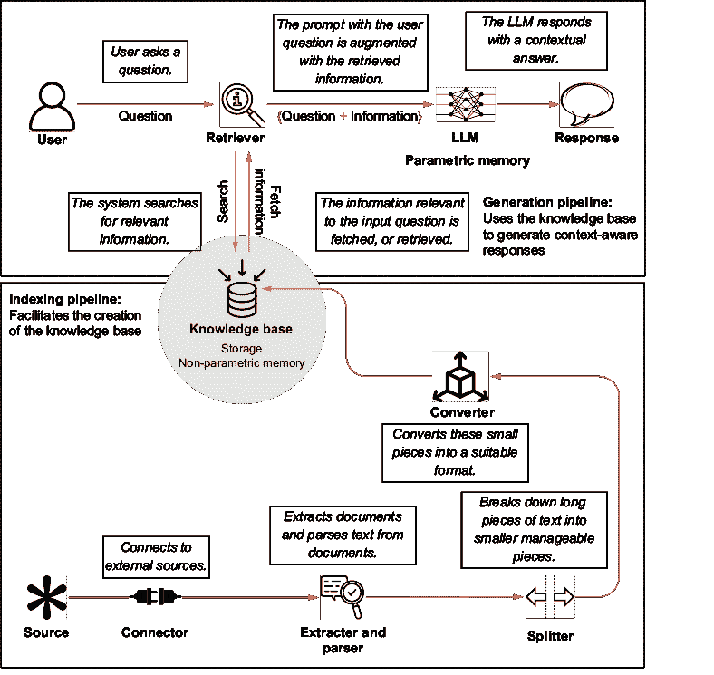
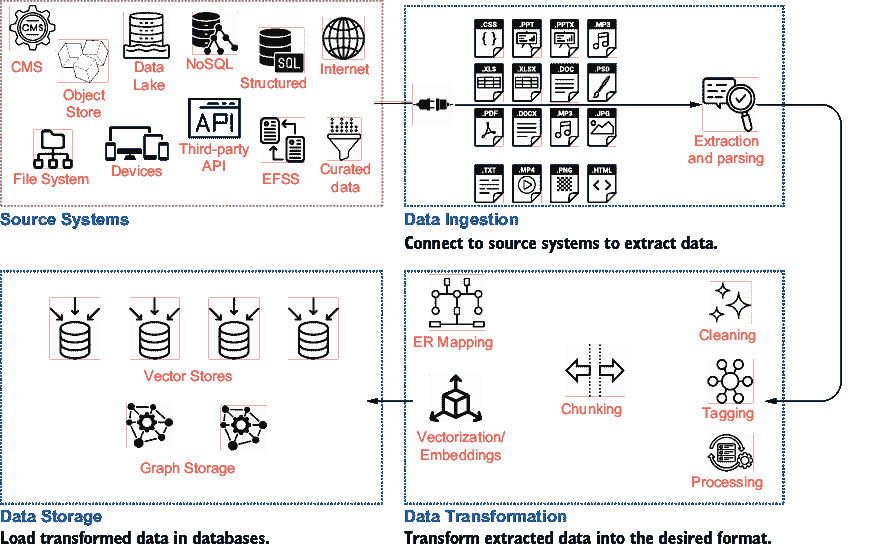
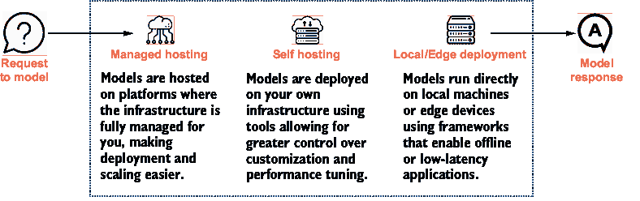
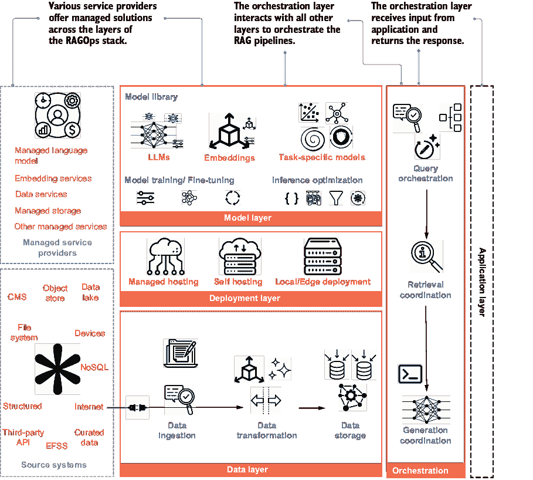

# 7 RAGOps 堆栈的演变

### 本章涵盖

+   RAG 系统的设计

+   可用于实现 RAG 系统的工具和技术

+   RAG 系统的生产最佳实践

到目前为止，我们已经讨论了检索增强生成 (RAG) 系统的索引管道、生成管道和评估。第六章还介绍了一些在构建生产级 RAG 系统时有用的高级策略和技术。这些策略有助于提高检索和生成的准确性，在某些情况下，还可以减少系统延迟。有了所有这些信息，你应该能够为你的用例构建一个 RAG 系统。第二章简要概述了 RAG 系统的设计。本章将详细阐述该设计。

RAG 系统由标准应用程序层以及特定于生成 AI 应用的层组成。这些层堆叠在一起，创建了一个健壮的 RAG 系统。

这些层由技术基础设施支持。我们深入探讨这些层以及流行的服务提供商提供的可用于构建 RAG 系统的技术和工具。一些提供商已经开始提供端到端管理的 RAG 解决方案，本章将简要介绍。

我们以一些关于将 RAG 系统投入生产的经验和最佳实践来结束本章。第七章也标志着本书第三部分的结束。

到本章结束时，你应该

+   理解 RAG (RAGOps) 堆栈中各层的细节。

+   熟悉众多服务提供商以及他们为 RAG 系统提供的工具和技术。

+   了解将 RAG 系统投入生产的一些陷阱和最佳实践。

与传统软件应用相比，RAG 系统包含许多额外的组件。向量存储和嵌入模型是索引管道的基本组件。知识图谱正变得越来越流行的索引结构。生成组件可以有不同的语言模型。此外，提示管理变得越来越复杂。RAG 和 LLM (大型语言模型) 应用程序的生产生态系统仍在演变，但早期的工具和设计模式已经出现。RAGOps 指的是在生产环境中部署、维护和优化 RAG 系统所涉及的操作实践、工具和流程。

## 7.1 RAGOps 堆栈的演变

本节描述了构建 RAG 系统所需的不同组件。这些层组合在一起形成了 RAG 的操作堆栈。我们还将利用这个机会来修订本书中讨论的 RAG 系统的工作流程。

应当注意的是，RAG，就像一般的生成式 AI 一样，是一项不断发展的技术，因此，操作堆栈也在不断演变。你可能会发现不同的定义和结构。本章提供了一个全面的视角，并从其对 RAG 系统的重要性角度讨论了组件。我们查看以下三个类别划分的层：

+   对 RAG 系统操作至关重要的关键层。如果这些层中的任何一个缺失或不完整，RAG 系统很可能会失败。

+   重要的层，对于系统的性能、可靠性和安全性至关重要。这些基本组件将系统提升到一个为用户提供价值的标准。

+   增强层，它提高了系统的效率、可扩展性和可用性。这些组件用于使 RAG 系统变得更好，并基于最终需求进行选择。

### 7.1.1 关键层

索引管道和生成管道（在第三章和第四章中详细讨论）构成了 RAG 系统的核心。图 7.1 展示了索引管道，它有助于为 RAG 系统创建知识库，以及生成管道，它使用知识库来生成上下文感知的响应。

##### 图 7.1  索引和生成管道构成 RAG 系统的核心

形成这两个管道的层的层，是 RAGOps 堆栈的关键层。

#### 数据层

数据层在为 RAG 创建和存储知识库方面发挥着关键作用。它负责从源系统中收集数据，将其转换为可用的格式，并存储以实现高效检索。以下是数据层的一些组件：

+   *数据采集组件*—它从数据库、内容管理系统、文件系统、API、设备甚至互联网等源系统中收集数据。数据可以批量或作为流式数据采集，具体取决于用例。对于数据采集，你选择的工具可能取决于数据量、数据源类型、采集频率、成本和设置简便性等因素。数据采集不仅限于 RAG，而是现代软件应用中的主流组件。AWS Glue、Azure Data Factory、Google Cloud Dataflow、Fivetran、Apache NiFi、Apache Kafka 和 Airbyte 等都是可用的工具。对于快速原型设计和概念验证（PoC），LangChain 和 LlamaIndex 等框架内置了可以帮助连接某些源并提取信息的函数。

+   *数据转换组件*—它将摄取的数据从原始形式转换为可用的形式。在索引管道中的核心过程是数据的*分块*。我们知道*嵌入*是 RAG 应用的首选格式，因为它使得应用语义搜索变得更容易。*图结构*在先进系统中越来越受欢迎。某些预处理步骤，如清理、去重、元数据丰富和敏感信息屏蔽，也是这一阶段的一部分。虽然数据量和转换的性质在任何数据转换步骤中都起着重要作用，但在 RAG 系统中它们尤其关键。在数据摄取步骤中提到的所有提取-转换-加载（ETL）工具，以及 Apache Spark 和 dbt 等工具，也允许转换。然而，如果我们只关注 RAG，Unstructured.io 专注于处理和转换非结构化数据，以便在 LLM 应用中使用。它提供开源库以及托管服务。从非结构化数据构建知识图谱已经从早期的语义网络和本体论发展到今天稳健的框架。

    微软的 GraphRAG 是一个框架，它开创了使用 LLM 从文本中提取实体和关系的方法。

+   *数据存储组件*—它以允许快速高效检索的方式存储转换后的数据。我们讨论过，为了存储嵌入，*向量数据库*被广泛使用，因为它们在相似性搜索中效率很高。对于图结构，使用*图数据库*。大多数传统数据库提供商正在将向量搜索功能纳入其系统。成本、规模和速度是选择数据存储的主要驱动因素。我们在这本书中使用了 FAISS 这样的向量索引。Pinecone 是一个完全托管的云原生服务。Milvus、Qdrant 和 Chroma 是开源向量数据库之一。Weviate 是另一个具有基于 GraphQL 接口的知识图的数据库。Neo4j 是存储和查询图数据的领先图数据库。有关流行向量数据库的比较，请参阅[`www.superlinked.com/vector-db-comparison`](https://www.superlinked.com/vector-db-comparison)。

从源系统通过摄取和转换组件流向数据存储，这些组件导致知识库的创建，如图 7.2 所示。

##### 图 7.2 数据层：通过从源系统提取、转换和加载（ETL）数据来创建知识库

强大的数据层是高效 RAG 系统的基石。当需要微调模型时，数据层也很有用。我们将在本章稍后简要讨论这一功能。接下来，我们将探讨模型层，它包括用于将文本转换为向量的嵌入模型和用于生成的 LLM。

#### 模型层

预测模型使生成式人工智能应用成为可能。一些模型由第三方提供，而另一些则需要定制训练或微调。生成快速且成本效益高的模型响应也是使用预测模型的一个重要方面。模型层包括以下三个组件：

+   *模型库*——它包含为应用选择的所有模型的列表。最受欢迎的模型是生成文本和其他能够生成图像、视频和音频的生成模型，即大型语言模型（LLMs）。我们在数据层中看到，原始文本被转换成向量嵌入，这是通过嵌入模型完成的。除此之外，还有其他在 RAG 系统中使用的模型：

    +   嵌入模型用于将数据转换成向量格式。我们在第三章中详细讨论了嵌入模型。回想一下，嵌入模型的选择取决于领域、用例和成本考虑。OpenAI、Google 的 Gemini、Voyage AI 和 Cohere 等提供商提供了各种嵌入模型选择，通过 Hugging Face transformers 也可以使用大量开源嵌入模型。多模态嵌入将不同模态的数据映射到共享嵌入空间中。

    +   基础模型或预训练的 LLMs 用于生成输出，以及用于评估和自适应任务，在这些任务中 LLMs 被用来判断。我们在第四章中讨论了 LLMs 作为生成管道的一部分。回想一下，OpenAI 的 GPT 系列、Google 的 Gemini 系列、Anthropic 的 Claude 系列和 Cohere 的 Command R 系列是流行的专有 LLMs。Meta 的 llama 系列和 Mistral 是开源模型，它们已经获得了流行。现在，大多数 LLMs 都包括多模态功能，并且正在不断进化。

    +   任务特定模型是 RAG 非核心的机器学习模型，但在各种任务中非常有用。这些模型用于高级 RAG 管道。用于高效路由和意图检测的查询分类模型、用于检测元数据的实体识别（NER）模型、查询扩展模型、幻觉检测模型以及偏见和毒性调节模型是 RAG 系统中一些有用的任务特定模型示例。虽然任务特定模型通常需要定制训练，但 OpenAI、Hugging Face 和 Google 等提供商也提供这些服务。

+   *模型训练和微调组件*—此组件负责在自定义数据上构建自定义模型和微调基础模型。在第四章中，我们讨论了 LLM 的微调有时对于领域适应是必要的。微调也可以用于嵌入模型。此外，特定任务的模型可以在自定义数据上训练。此组件支持用于训练和微调模型的算法。对于训练数据，此组件与数据层交互，在数据层中可以创建和管理训练数据。还建议使用常规 MLOps 层来开发和维护模型。这可以通过 Hugging Face、AWS SageMaker、Azure ML 和类似平台实现。

+   推理优化组件—此组件负责快速且经济高效地生成响应，可以通过量化、批处理、KV（键值）缓存等方法实现。ONNX 和 NVIDIA TensorRT-LLM 是流行的框架，用于优化推理。

图 7.3 展示了模型层的不同组件。它显示了模型层如何帮助决定在 RAG 系统中使用哪些模型，促进模型的训练和微调，并优化模型以实现高效的服务。

##### 图 7.3 模型层：模型库是存储所有为应用、模型训练和微调所选模型的仓库，模型训练和微调与数据层交互以获取训练数据和训练自定义模型，而推理优化组件负责高效地提供模型服务。

#### 模型部署

此层负责使 RAG 系统对应用层可用。它处理模型的底层基础设施。它还确保模型可以可靠地访问。模型可以通过以下四种主要方法进行部署：

+   *完全托管部署*—这可以由像 OpenAI、Google、Anthropic 和 Cohere 这样的专有模型提供商提供，其中所有模型部署、服务和扩展的基础设施都由这些提供商管理和优化。AWS SageMaker、Google Vertex AI、Azure Machine Learning 和 Hugging Face 等服务提供平台，用于部署、服务和监控开源和自定义开发的模型。Amazon Bedrock 是另一种完全托管的服务，提供对各种基础模型（专有和开源）的访问，简化了模型访问和部署。

+   *自托管部署*—此类部署由云 VM 提供商（如 AWS、GCP、Azure）和硬件提供商（如 Nvidia）启用。在这种情况下，模型在私有云或本地部署，基础设施由应用开发者管理。Kubernetes 和 Docker 等工具广泛用于模型的容器化和编排，而 Nvidia Triton Inference Server 可以优化 Nvidia 硬件上的推理。

+   *本地/边缘部署*—涉及在本地硬件或边缘设备上运行模型的优化版本，确保数据隐私、降低延迟和离线功能。本地/边缘部署通常需要模型压缩技术，如量化修剪，以及针对资源受限环境定制的较小模型。ONNX、TensorFlow Lite 和 PyTorch Mobile 等工具使移动和嵌入式平台上的高效部署成为可能，而 GGML 和 NVIDIA TensorRT 支持 CPU 和 GPU 优化。GPT4All 是一个流行的开源解决方案，可以在笔记本电脑、物联网设备和边缘服务器等设备上本地运行量化 LLM，而不依赖于云基础设施。这些框架促进了低延迟、节能的执行，使 AI 在去中心化环境中变得可访问。

模型部署是一项相对复杂的任务，当进行自托管和本地/边缘部署时需要工程技能。图 7.4 说明了模型部署的三种方式。

##### 图 7.4  模型部署层管理 RAG 系统中所有模型的托管和部署基础设施，以实现高效服务。

与数据和模型层一起，RAG 系统的最基本组件已经就绪。现在我们需要一个管理数据和模型之间协调的层。这是应用编排层的责任。

#### 应用编排层

当我们听到“编排”这个词时，会想到一个音乐指挥在交响乐团中领导一群音乐家。应用编排层在某种程度上类似。它负责管理系统中其他层之间的交互。它是一个中央协调器，使数据、检索系统、生成模型和其他服务之间的通信成为可能。编排层的主要组件包括

+   *查询编排组件*—负责接收和编排用户查询。所有预处理查询优化步骤，如查询分类、扩展和重写，都由该组件编排。查询编排层可能协调与终端应用层接收输入，以及模型层访问用于查询优化的模型。该组件通常将处理后的查询传递给检索协调和生成协调组件。

+   *检索协调组件*——托管各种检索逻辑。根据查询编排模块的输入，它选择适当的方法（密集检索或混合检索）并与数据层交互。根据检索策略，它还可能根据是否调用了任何递归或自适应检索方法与模型层交互。

+   *生成协调组件*——接收来自前一个组件的查询和上下文，并协调所有检索后的步骤。其主要功能是与模型层交互并提示 LLM 生成输出。除了生成之外，所有检索后的步骤，如重新排序和上下文压缩，都由该组件协调。生成后的任务，如反思、事实核查和审查，也可以由生成组件协调。该组件还可以负责将输出传递到应用层。

这些是编排层的三个主要组件。还有两个额外的组件需要考虑：

+   *多代理编排组件*——用于处理多个代理的 RAG，其中多个代理处理特定任务。我们将在第八章中更深入地探讨代理 RAG。编排层负责管理代理交互和协调。

+   *工作流自动化组件*——有时用于管理不同组件之间数据流和移动。这个组件并非特定于 RAG 系统，但在数据产品中应用较为普遍。Apache Airflow 和 Dagster 是用于工作流自动化的流行工具。

图 7.5 展示了编排层组件与应用层交互的情况，应用层由模型部署和数据层支持。

##### 图 7.5  应用编排层接受来自应用层用户查询，并将响应发送回应用层。

LangChain 和 LlamaIndex 是最常用的编排框架，用于开发 RAG 系统。它们为不同的组件提供了抽象。微软的 AutoGen 和 CrewAI 是多代理编排的即将推出的框架。

通过这四层（即数据、模型、模型部署和应用编排），关键的 RAG 系统就完整了。这个核心系统可以与终端软件应用层交互，该层作为 RAG 系统与用户之间的接口。虽然应用层通常是定制构建的，但 Streamlit、Vercel 和 Heroku 等平台因其托管应用而受到欢迎。图 7.6 总结了 RAGOps 堆栈的关键层。

现在你已经熟悉了堆栈的核心层，接下来让我们看看那些提高系统性能和可靠性的关键层。

##### 图 7.6 核心 RAGOps 堆栈，其中数据、模型、模型部署和应用编排层与源系统和托管服务提供商交互，并与应用层协调以与用户接口

### 7.1.2 必要层

虽然关键层构成了堆栈的核心，但它们并不评估或监控系统。它们不测试提示策略，也不提供针对 LLMs（大型语言模型）漏洞的任何保护。这些层对于系统至关重要。

#### 提示层

虽然编排层的生成协调组件可以简单地将用户查询和检索到的上下文组合起来，但糟糕的提示可能导致幻觉和低劣的结果。正确工程化和评估提示对于引导模型生成相关、有根据和准确的响应至关重要。这个过程通常涉及实验。开发者创建提示，观察结果，然后迭代提示以提高应用的有效性。这也需要跟踪和协作。Azure Prompt Flow、LangChain 表达式语言（LCEL）、Weights & Biases 提示和 PromptLayer 是可用于创建和管理提示的几个应用程序之一。

#### 评估层

第五章详细讨论了 RAG 评估。定期评估检索准确性、上下文相关性、忠实度和答案相关性对于确保响应质量是必要的。TruEra 的 TruLens、Ragas 和 Weights & Biases 是常用的评估平台和框架。

#### 监控层

持续监控确保 RAG 系统的长期健康。观察处理链的执行对于理解系统行为和识别故障点至关重要。评估提供给语言模型的信息的相关性和充分性也是至关重要的。除此之外，定期跟踪系统指标，如资源利用率、延迟和错误率，也是监控层的一部分。ARISE、RAGAS 和 ARES 是也用于监控的评估框架。TraceLoop、TruLens 和 Galileo 是提供监控服务的提供商的例子。

#### LLM 安全和隐私层

虽然安全和隐私是任何软件系统的特性，但在 RAG（检索增强生成）的背景下，还有其他方面需要考虑。RAG 系统依赖于存储在向量数据库中的大型知识库，这些数据库可能包含敏感信息。它们需要遵守所有数据隐私法规。AI 模型容易受到操纵和中毒的影响。提示注入是通过提示检索敏感信息的恶意攻击。应采用数据保护策略，如匿名化、加密和差分隐私。查询验证、清理和输出过滤有助于防止攻击。实施护栏、访问控制、监控和审计也是安全和隐私层的组成部分。

#### 缓存层

缓存已成为任何基于 LLM 的应用程序的一个重要组成部分。这是因为生成式 AI 模型的高成本和固有的延迟。在添加检索层后，RAG 系统的成本和延迟进一步增加。控制这种增加的一种方法是对常见查询的响应进行缓存。原则上，缓存 LLM 响应就像在其他任何软件应用程序中缓存一样，但对于生成式 AI 应用程序来说，它变得更加重要。

这些基本层与关键层叠加在一起，创建了一个强大、准确且高性能的 RAG 系统。图 7.7 添加了基本层及其组件到关键 RAGOps 堆栈中。

##### 图 7.7 向关键 RAGOps 堆栈添加基本层为用户应用程序构建了一个强大的 RAG 系统之路。

表 7.1 是 RAGOps 堆栈中关键和基本层的总结。

##### 表 7.1 RAGOps 堆栈的关键和基本层

| 层 | 类别 | 描述 | 示例工具 |
| --- | --- | --- | --- |
| 数据层 | 关键层 | 负责通过从各种来源摄取、转换为嵌入或图结构以及存储以供检索来创建和存储知识库 | AWS Glue, Apache Kafka, FAISS, Pinecone, Neo4j, Weaviate, Milvus |
| 模型层 | 关键层 | 包含 RAG 中生成和检索所需的模型；包括用于向量生成的嵌入模型、用于文本生成的 LLM 以及用于查询分类、幻觉检测或重新排序的模型 | OpenAI, Hugging Face Transformers, Google Gemini, Llama, Anthropic |
| 模型部署 | 关键层 | 确保模型可访问、性能良好且可扩展；负责提供模型并优化推理以实现快速响应时间 | SageMaker, Vertex AI, NVIDIA Triton, Hugging Face |
| 应用编排层 | 关键层 | 管理层与服务之间的交互，确保查询通过检索和生成阶段流动，并协调检索方法和生成任务 | LangChain, Haystack, Dagster, Apache Airflow, AutoGen, CrewAI |
| 提示层 | 基本层 | 设计和维护输入查询以确保 LLM 生成相关、高质量输出；确保持续提示优化以避免幻觉并提高准确性 | Weights & Biases Prompts, Azure Prompt Flow |
| 评估层 | 基本层 | 评估检索和生成阶段的性能，确保输出相关、事实准确。 | TruLens by TruEra, Ragas, Weights & Biases |
| 监控层 | 基本层 | 持续监控 RAG 系统的性能、健康和资源使用情况；跟踪关键指标，如延迟、资源消耗和错误率，以确保系统稳定性。 | Prometheus, Grafana, TruLens, Galileo |
| LLM 安全与隐私层 | 必要 | 确保 RAG 系统遵守数据隐私法规，并防止提示注入或其他形式的 AI 操纵；实施加密、访问控制和安全措施等安全策略 | AWS KMS, Azure Key Vault, Prompt Injection Guards |
| 模型训练/微调层 | 必要 | 处理特定领域或任务的模型训练和微调；使用特定领域的数据集对嵌入或 LLM 等模型进行微调，确保在特定用例中表现更佳 | Hugging Face, AWS SageMaker, Google Vertex AI, Azure ML |
| 缓存层 | 必要 | 缓存频繁使用的查询和响应，以减少重复检索和生成任务相关的延迟和成本；确保常见查询的响应时间更快，并最小化重复任务的资源使用。 | Redis, Varnish, ElasticCache |

现在我们将简要地看看几个增强层，这些层不是强制性的，但可以进一步改进 RAG 系统。请注意，可能有多个增强层，并且它们应该根据用例需求定制。

### 7.1.3 增强层

增强层是 RAGOps 堆栈的可选部分，但根据用例环境，它们可以带来显著收益。它们关注系统的效率、可用性和可扩展性。以下描述了一些可能的层。

#### 人工介入层

这一层在需要人类判断的情况下提供关键监督，特别是对于需要更高精度或伦理考虑的用例。它有助于减少模型幻觉和偏差。

#### 成本优化层

RAG 系统可能会变得非常昂贵，特别是当进行多次 LLM 调用以实现高级技术、评估、安全措施和监控时。这一层有助于高效地管理资源，这对于大规模系统尤为重要。优化基础设施可以节省大量成本，但不是系统功能的关键。

#### 可解释性和可理解性层

这一层有助于提供系统决策的透明度，对于需要问责制的领域（例如法律和医疗保健）尤为重要。然而，许多应用程序在没有监管的环境下仍然可以正常工作。

#### 协作和实验层

这一层对于在开发和实验中工作的团队很有用，但对于系统运行来说不是关键。这一层提高了生产力和迭代改进。Weights & Biases 是一个流行的平台，它有助于跟踪实验。

应根据应用需求选择增强层。可能还有其他适合您用例的层。

##### 管理 RAG 解决方案

如果没有先前的知识、预算或时间，构建 RAG 系统可能会很复杂。为了解决这些挑战，服务提供商提供管理 RAG 解决方案。

OpenAI 提供的文件搜索工具可以自动解析和分块您的文档，创建并存储嵌入，并使用向量和关键词搜索来检索相关内容以回答用户查询。AWS 提供的 Amazon Bedrock 知识库，为端到端 RAG 工作流程提供全面管理的支持。Azure AI，例如 OpenAI 文件搜索，提供索引和查询。Anthropic 提供的 Claude 项目允许用户上传文档并提供上下文以进行专注的对话。

几家其他提供商提供 RAG 作为服务，并能处理视频和音频转录、图像内容提取和文档解析。为了快速轻松地部署 RAG 解决方案，可以考虑使用托管服务提供商。

我们还讨论了几种服务提供商、工具和技术，您可以在开发 RAG 系统时使用。这些工具和技术的选择可能取决于诸如

+   *可扩展性和性能需求*—RAG 系统需要高效地处理大量数据，同时保持低延迟。随着数据规模的扩大或流量激增，系统必须保持高性能以确保快速响应时间。选择允许自动扩展和可变负载的云平台。对于高性能和可扩展的检索，选择能够处理数百万嵌入并具有低延迟搜索能力的向量数据库。使用推理优化工具可以帮助在生成阶段降低延迟。

+   *与现有堆栈的集成*—与您当前技术堆栈的无缝集成可以最小化中断并降低复杂性。如果您的系统已经在 AWS、GCP 或 Azure 上运行，使用与这些平台集成良好的服务可以简化开发和维护。选择与云提供商原生集成、提供强大 API 支持、并确保所选框架支持这些工具的工具可以非常有益。

+   *成本效益*—与传统的机器学习模型相比，大型语言模型（LLMs）需要更多的资源。即使使用按需付费的模型，成本也会随着规模的扩大而迅速增加。缓存和推理优化可以帮助管理成本。

+   *领域适应性*—RAG 系统通常需要适应特定行业或领域（例如医疗保健和法律）。除非使用特定领域的数据进行微调，否则预训练模型可能对特定用例并不完全有效。对于领域适应性，应选择易于微调的模型。也可以考虑现有的特定领域模型。

+   *供应商锁定约束**—由于生成式 AI 是一个不断发展的领域，使用单一供应商的专有工具或服务可能会导致供应商锁定，使得迁移到其他平台或根据需求变化调整你的技术栈变得困难。尽可能使用开源或互操作技术有助于保持灵活性。选择云无关或支持多云部署的工具，以减少对单一供应商的依赖。建议采用模块化架构，以便在不重新设计系统的情况下更换组件。

+   *社区支持**—强大的社区支持意味着可以访问资源、教程、故障排除和定期更新，这可以加速开发并减少调试时间。这对于 LLMs 和 RAG 等快速发展的领域尤其如此。拥有活跃社区的工具有助于提供频繁的更新、插件和第三方集成，如 Hugging Face、LangChain 等。

在了解关键、基本和增强层知识的基础上，你应该准备好搭建一个技术栈来构建你的 RAG 系统。现在让我们看看在构建和部署生产级 RAG 系统时需要考虑的一些常见陷阱和最佳实践。

## 7.2 生产最佳实践

尽管在设计规划 RAG 系统时付出了诚挚的努力，但在开发和部署过程中仍不可避免地会出现一些问题。尽管 RAG 仍处于起步阶段，但一些常见的失误和最佳实践的趋势已经显现。已有许多实验和经验从中得出，以使 RAG 系统有效运作。本节讨论了五种这样的实践：

+   *系统的延迟**—RAG 系统可能由于需要多个步骤：检索、重新排序和生成而引入延迟。高延迟会显著降低用户体验，尤其是在聊天机器人或交互式搜索引擎等实时应用中，这是因为每个组件都会增加处理时间。有效的查询分类和路由可以帮助优化延迟。在混合检索中，一种有用的方法是首先根据关键词或稀疏检索技术过滤嵌入，然后对过滤后的结果进行相似度搜索。这减少了计算相似度所需的时间，尤其是在大型知识库中。

+   *持续的幻觉**—尽管付出了最大努力，LLMs 仍可能继续生成事实错误或不相关于检索内容的响应。如果检索的数据模糊或不完整，这种情况可能会发生。可能需要后处理验证步骤来解决这些问题。一种常见的方法是将 RAG 系统调整为以推荐为导向，而不是以行动为导向。这意味着系统会循环一个人类进行验证和最终行动。

+   *缺乏可扩展性规划*—RAG 系统的早期原型在小数据集上通常表现良好，但随着数据量或并发用户数量的增长可能会遇到困难。具有自动扩展功能的托管向量数据库服务可以更容易地规划需求增长和计算需求。同样，自动扩展也可以用于整体应用程序，使用云原生解决方案，如 AWS Lambda。

+   *领域适应性挑战*—嵌入和语言模型可能在细分或特定领域工作不佳。此外，检索模型和语言模型可能并不总是很好地互补，导致结果不连贯或混乱。检索模型和大型语言模型通常独立开发和微调，这可能导致检索的内容与大型语言模型生成响应的方式不匹配。对于高度专业化的领域，同时微调检索和生成模型变得非常重要。

+   *数据隐私和 PII 处理不足*—由于训练数据中的偏差，预训练模型可能会生成包含敏感信息（例如，个人数据和机密细节）的内容。RAG 系统可能在响应中无意中泄露敏感信息或个人身份信息（PII），导致隐私泄露。数据泄露，也称为数据盗窃、外泄或出口，是数字世界中的主要威胁。解决方案是在预处理和后处理阶段使用 PII 掩码和数据编辑。确保遵守 GDPR 或 HIPAA 等隐私法规，并部署带有隐私过滤器的模型。

最佳实践列表持续演变。延迟和可扩展性对于管理用户体验和访问至关重要。确保无幻觉生成和数据安全对于系统的可靠性至关重要。表 7.2 总结了将 RAG 系统投入生产的挑战和潜在解决方案。

##### 表 7.2 生产挑战和潜在解决方案

| 挑战 | 描述 | 解决方案 |
| --- | --- | --- |
| 系统延迟 | RAG 系统由于检索、重新排序和生成步骤而增加延迟，影响实时性能。 | 使用查询分类、混合检索过滤和限制相似度搜索 |
| 持续的幻觉 | 由于数据模糊或不完整，大型语言模型可能会生成错误或不相关的响应。 | 添加后处理验证，并使系统基于人类验证的建议。 |
| 缺乏可扩展性规划 | 早期的 RAG 系统随着数据和用户负载的增长而难以扩展。 | 使用自动扩展的向量数据库和云解决方案，如 AWS Lambda。 |
| 领域适应性挑战 | 嵌入和大型语言模型在特定领域可能表现不佳，导致结果不连贯。 | 对特定用例微调检索和生成模型。 |
| 数据隐私和 PII 处理不当 | 模型可能暴露敏感数据或 PII，导致隐私问题。 | 应用 PII 掩码、数据编辑和隐私过滤器，确保符合法规。 |

在本章中，我们探讨了整体 RAGOps 堆栈，该堆栈使构建生产级 RAG 系统成为可能。你还了解了一些常用的工具和技术，以及一些最佳实践。这标志着我们对 RAGOps 堆栈的讨论结束。我们现在完成了本书的第三部分，这意味着你应该准备好构建 RAG 系统并将其投入生产。本书的最后一部分，我们将讨论 RAG-like 多模态能力的一些新兴模式，包括代理 RAG 和 graphRAG，以及对未来方向和持续学习的总结性评论。

## 摘要

+   RAGOps 堆栈是设计 RAG 系统的一种分层方法。

+   这些层被分为关键、基本和增强层。

+   关键层对于操作至关重要；基本层确保性能和可靠性；增强层提高效率、可扩展性和可用性。

### 关键层

+   *数据层*—负责收集、转换和存储知识库。AWS Glue、Azure Data Factory 和 Apache Kafka 等工具可进行数据收集。数据转换包括分块、元数据丰富和将数据转换为向量格式。FAISS、Pinecone 和 Neo4j 等工具用于存储嵌入和图数据。

+   *模型层*—包括用于生成的嵌入模型和 LLM。嵌入模型将文本转换为向量，选项包括 OpenAI、Google、Cohere 和 Hugging Face。基础模型（LLM）如 GPT、Claude 和 Llama 生成输出并评估任务。特定任务的模型处理专门的任务，如查询分类和偏差检测。

+   *模型部署*—管理 LLM 和嵌入模型的托管和提供。流行的平台包括 AWS SageMaker、Google Vertex 和 Hugging Face。推理优化通过量化、批处理等方法减少响应时间和成本。

+   *应用编排层*—协调不同组件之间的数据流：

    +   查询编排处理查询分类和优化。

    +   检索协调管理密集或混合搜索等检索方法。

    +   生成协调处理提示生成和检索后的任务，如重新排序。

### 基本层

+   *提示层*—确保提示被精心设计，以引导 LLM 产生相关、准确的响应。LangChain 和 Azure Prompt Flow 等工具协助提示管理。

+   *评估层*—通过评估检索准确性、忠实度和上下文相关性来监控系统性能。TruLens 和 Ragas 等工具提供评估框架。

+   *监控层*—跟踪系统健康、资源使用和延迟。TraceLoop 和 Galileo 等平台提供监控服务。

+   *LLM 安全和隐私层*—保护免受数据泄露和提示注入攻击。应使用加密、匿名化和差分隐私等工具来保护敏感数据。

+   *缓存层*—缓存频繁生成的响应，以减少 RAG 系统中的成本和延迟。

### 增强层

+   *人工介入层*—增加人工监督以确保更高的准确性和道德决策。

+   *成本优化层*—降低基础设施成本，尤其是在大规模 RAG 系统中。

+   *可解释性和可理解性层*—提供对系统决策的透明度，这对于医疗保健和法律等领域至关重要。

+   *协作和实验层*—对基于团队的开发和持续改进很有用。

### 生产最佳实践

+   *延迟*—RAG 系统由于多个步骤常常引入延迟。使用如混合检索中的过滤等技巧可以帮助减少响应时间。

+   *幻觉*—LLMs 可能仍然会生成不正确的响应。后处理验证和人工介入系统有助于减轻这一问题。

+   *可扩展性*—早期原型可能难以扩展。具有自动扩展功能的托管向量数据库服务可以帮助规划增长。

+   *领域适应性*—嵌入和语言模型可能在利基领域表现不佳。对检索和生成模型进行微调是必要的。

+   *数据隐私*—模型可能泄露敏感信息。PII 掩码、加密和遵守数据法规对于保护用户数据至关重要。
