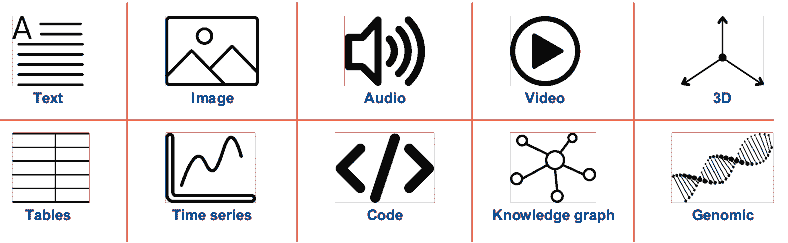
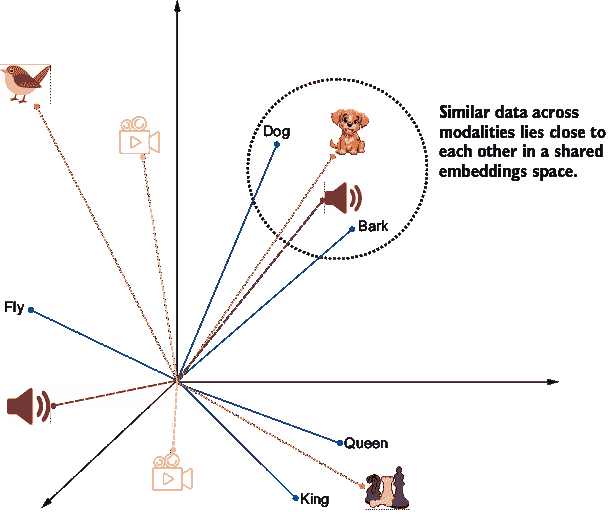
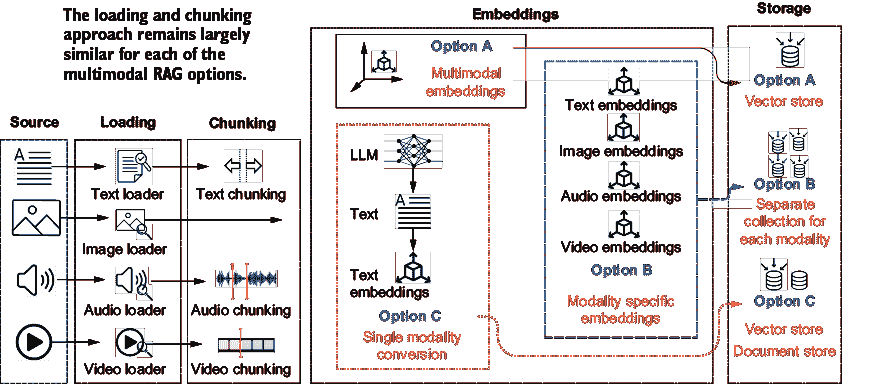
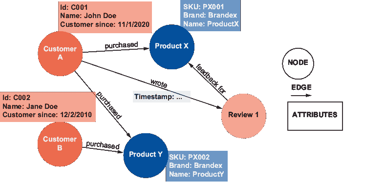
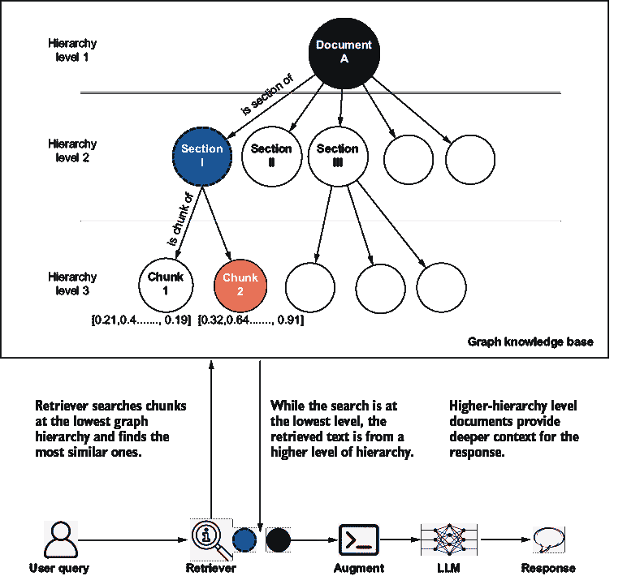
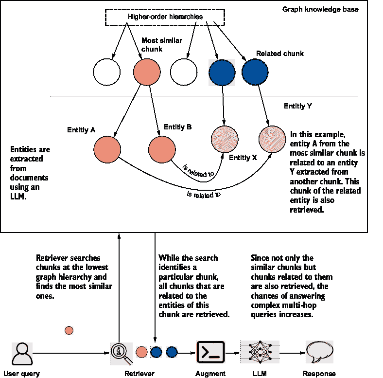
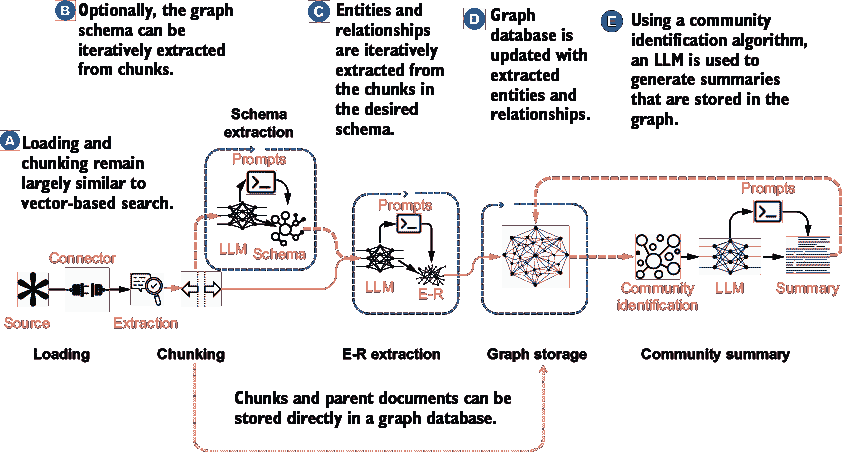
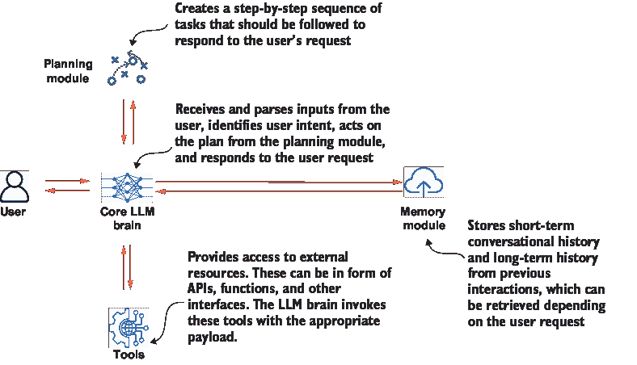
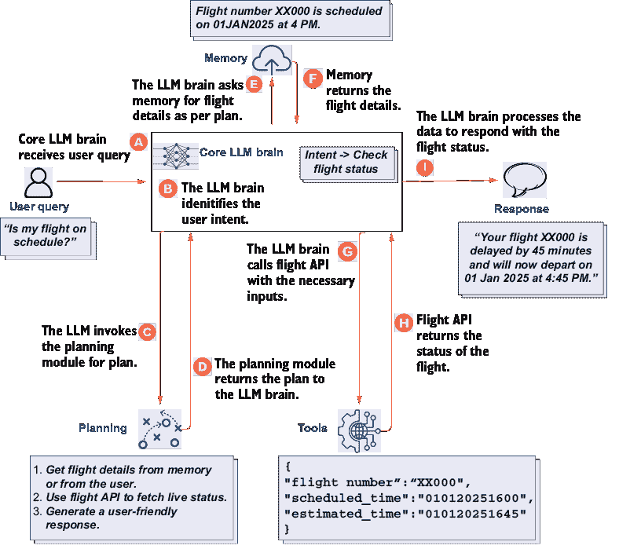

# 8 图、多模态、代理式和其他 RAG 变体

### 本章涵盖

+   介绍 RAG 变体

+   知识图谱 RAG

+   多模态 RAG

+   代理式 RAG

+   其他 RAG 变体

本书的第一部分介绍了检索增强生成（RAG）及其背后的核心思想。第二部分处理了构建和评估基本 RAG 系统。第三部分将 RAG 超越了简单方法，讨论了高级技术和支持 RAG 系统的技术栈。本书的最后部分探讨了更多的 RAG 模式，并以一些最佳实践和一些进一步探索的领域结束我们的讨论。

第八章探讨了几个流行的 RAG 变体。这些变体将 RAG 的不同阶段（即索引、检索、增强和生成）适应特定的用例需求。本章首先讨论了这些变体的出现及其目的。然后我们继续讨论在应用 RAG 中取得显著成效的三个重要变体。这些是知识图谱增强型、多模态和代理式 RAG。我们还简要考察了其他对 RAG 在实际应用中的进化有显著贡献的 RAG 变体。我们讨论了每个变体的目的和动机。本章还分析了这些变体的工作流程、特性和技术细节，以及它们的优缺点。为了简化，这些变体的代码不包括在本章中，但可以在本书的代码仓库中找到。

到本章结束时，你应该

+   了解 RAG 变体的思想和动机。

+   深入理解图、多模态和代理式 RAG。

+   了解几个流行的 RAG 变体及其解决的用例。

对 RAG 的简单方法存在几个局限性，这些局限性影响了标准 RAG 系统的整体可用性。这些局限性从理解不同文档之间关系上的困难到处理各种数据类型，以及关于系统成本和效率的担忧。第六章讨论了几种检索前、检索和检索后的技术，如索引优化、查询优化、混合和迭代检索策略、压缩和重新排序，这些技术针对不同的局限性并提高了 RAG 系统的准确性。随着时间的推移，出现了一些结合了这些技术之一或多个的 RAG 模式，以解决特定的用例挑战。我们将它们称为 RAG 变体。

## 8.1 RAG 变体是什么，为什么我们需要它们？

依赖于 RAG 的应用程序每天都在扩展。其中一些应用程序不仅处理文本，还处理不同的数据模态，如图像、视频和音频。其他应用领域如医疗保健和金融，不准确的结果可能带来灾难性的影响。使用 LLMs 作为决策代理的新兴领域也使得 RAG 系统更加适应和智能。除了事实准确性外，实际的 RAG 应用还需要低延迟和低成本，以提升用户体验和采用率。随着 RAG 应用范围的扩大，需要专门化的 RAG 变体——称为 RAG 变体——来应对不同任务和数据类型中的独特挑战。

这些 RAG 变体是对标准 RAG 框架的适应性调整，扩展了其功能以满足多样化的复杂用例需求。通过采用先进的预检索、检索和后检索技术，这些变体增强了 RAG，使其具备处理多模态数据、提供更高准确性和更好的关系理解等能力。这些 RAG 变体的演变使得系统既灵活又具有领域意识。

虽然已经出现了几种 RAG 变体，但我们在接下来的几节中将深入讨论的三个变体已经获得了显著的关注：

+   *多模态 RA**G**——扩展了标准 RAG 的功能，使其超越文本数据，并整合了其他数据类型，如图像、视频和音频。这一特性使得系统能够从非文本文档中获取信息，并提供额外的上下文。

+   *知识图谱 RA**G**——将知识图谱整合到检索过程中。这一想法在第六章中作为改进索引结构的一部分被引入。知识图谱有助于建立实体之间的关系，提供更好的上下文，特别是在多跳查询中。

+   *代理 RA**G**——将 LLM 代理整合到 RAG 框架中。这些代理能够在 RAG 价值链的索引到生成过程中实现自主决策。同时，所有组件都适应用户查询。

除了这三个之外，我们还涉及到一些额外的变体，例如校正 RAG、自 RAG 等，但首先，我们从多模态开始讨论。

## 8.2 多模态 RAG

迄今为止，我们已经看到标准 RAG 系统在管理和检索文本数据以生成上下文感知和基于事实的响应方面是有效的。然而，企业数据范围超出了文本，还包括图像、音频和视频。当尝试解释非文本数据格式时，标准 RAG 系统显得力不从心。这就是多模态 RAG 变体的核心动机，它扩展了能力以支持更多数据格式。

### 8.2.1 数据模态

对于初学者来说，“模态”这个词可能有些令人困惑，尤其是在不同领域“模态”的含义各不相同。语法模态与说话者的态度表达相关，而治疗模态可能指医学中的治疗方法。在 RAG 和人工智能领域，模态指的是数据格式。文本是一种模态，图像是一种模态，视频和音频是不同的模态，我们还可以将表格和代码视为不同的模态。图 8.1 展示了某些数据模态，包括一些不太常见的，如基因组数据和 3D 数据。

##### 图 8.1 不同数据模态的示例

因此，多模态 RAG 是标准 RAG 的扩展版本，具有处理多种数据模态的能力。在深入探讨多模态 RAG 的需求和架构细节之前，让我们思考一下需要多模态 RAG 的应用场景。

### 8.2.2 多模态 RAG 用例

有几个行业和功能需要 RAG 的多模态变体，例如

+   *医学诊断*——诊断助手可以与包括医疗历史（以文本形式）、实验室结果（以表格形式）和诊断图像（如 X 光片、MRI 等）在内的患者记录一起工作，以及包括图表、图表或显微镜图像的研究和论文。当患者前来咨询时，这个助手可以为医生提供全面的分析。

+   *投资分析*——与包含趋势、收益和预测图表的财务报告和其他文件一起工作，以及表格形式的资产负债表和损益表，除了通常的文本评论外，投资研究助手可以为分析师提供做出投资决策所需的关键信息。

+   *购买助手*——通过分析产品图像、文本描述、产品规格（以表格形式）和客户评论，购物助手可以帮助电子商务网站上的购物者提供个性化推荐。

+   *编码助手*——编码助手根据查询上下文从存储库检索相关的文档、函数使用示例和代码片段。例如，当开发者询问如何实现某个 API 函数时，RAG 系统从文档中检索精确的代码片段和解释，帮助开发者避免耗时搜索。

+   *设备维护*——通过分析历史文本报告、视觉检查图像或视频流、传感器数据和性能表，维护助手可以提供维护建议和趋势。

这些只是几个例子。虽然仅包含文本的标准 RAG 在用例的初始阶段是可接受的，但大量生产级的 RAG 系统至少包含一种其他数据模态。

### 8.2.3 多模态 RAG 管道

现在我们来探讨开发多模态 RAG 管道与您迄今为止所学的标准文本 RAG 管道有何不同。一个明显的改变将是在加载和索引非文本模态的数据。

#### 多模态索引管道

开发多模态 RAG 的知识库需要对索引管道的四个组件进行增强。除了加载和分块不同模态的文件外，为多模态数据创建嵌入也需要特别注意。让我们逐一查看每个组件。

*数据加载步骤*与仅文本的 RAG 标准流程非常相似，但现在包括了连接器和用于非文本模态的数据加载器。有几种选项可供选择。`Pillow`，也称为`PIL`，是一个流行的 Python 库，用于加载图像。`Unstructured`是一个开源库，包括用于摄入各种数据格式的组件。`Pydub`是另一个 Python 库，允许加载 WAV 和 MP3 等音频文件。LangChain 提供了与未结构化库的集成。`UnstructuredImageLoader`是 LangChain 文档加载器中可用于加载图像的一个类。对于音频和视频转录，可以使用`OpenAIWhisperParser`、`AssemblyAIAudioTranscriptLoader`和`YoutubeLoader`等库。同样，对于表格数据，`CSVLoader`和`DataFrameLoader`也很有用。为了简单起见，有时不同模态的数据会被转录成文本。

*分块*对于多模态数据在很大程度上遵循与文本分块类似的过程，在音频/视频数据被转录并存储为文本的情况下。然而，对于原始音频和视频数据，可以采用特定的分块方法。语音活动检测（VAD）根据音频中的静默或背景噪声来分块数据。基于场景检测的分块识别场景中的主要变化以分割视频。对于表格数据，有时可以结合行/列级别的分块，而对于代码，分块可以在函数、类或逻辑单元级别进行。所有用于分块文本数据的策略，如上下文丰富、语义分块等，也在这里适用。对于图像，通常不进行分块。`semantic_chunkers`是一个用于智能分块文本、视频和音频的多模态分块库。它使 AI 和数据处理更加高效和准确。

在多模态 RAG 中，*嵌入*是细微差别开始的地方。在标准的仅文本 RAG 中，有几种嵌入模型可用于将分块向量化。但如何将不同模态的数据，如图像，向量化呢？处理这种复杂性的方法有三种：共享或联合嵌入模型、特定模态的嵌入以及将所有非文本数据转换为文本。

共享或联合嵌入模型将不同的数据类型映射到一个统一的嵌入空间中。通过这样做，实现了跨模态检索，例如根据文本描述查找图像或从图像生成文本。Google Vertex AI 提供共享嵌入模型，该模型在统一的嵌入空间中为所有数据模态生成向量。共享嵌入模型也称为多模态嵌入模型。虽然多模态嵌入在理解一般图像数据方面效率很高，但在需要细粒度理解时（如图表和表格以图像和信息图表的形式表示），有时会不足。在图 8.2 中，图像、文本、音频和视频数据被绘制在同一个 3D 向量空间中。

模态特定嵌入方法类似于多模态嵌入，但不同之处在于，它不是为所有模态提供一个单一的嵌入空间，而是仅映射两种模态。在这种情况下，我们需要一个图像-文本嵌入模型来处理文本、图像和音频数据（例如，对比语言-图像预训练，或 CLIP）以及一个音频-文本嵌入模型（例如，对比语言-音频预训练，或 CLAP）。知识库在不同的嵌入空间中存储文本、图像和音频嵌入，并分别存储。图 8.3 是 CLIP 图像-文本嵌入的一个例子，其中图像和文本嵌入被投影到一个共享的嵌入空间中。

##### 图 8.2 图像、文本、视频和音频被绘制在同一个嵌入空间中。狗、吠叫和狗的图像彼此靠近。

##### 图 8.3  CLIP 通过多模态预训练将分类转换为检索任务，这使得预训练模型能够处理零样本识别。

将所有非文本数据转换为文本，首先使用多模态 LLM 将所有非文本（图像）数据转换为文本，然后遵循仅文本的 RAG 方法。 (多模态 LLM 是一种处理所有数据模态的大型语言模型。你将在本节后面了解更多关于多模态 LLM 的信息。) 在这种策略中，你可能注意到我们可能并没有完全使用多模态数据，因为将非文本转换为文本数据时必然会发生信息损失。在这种策略的一种变体中，我们不是将所有多模态数据转换为文本并使用它，而是采用双管齐下的方法。在这里，所有多模态数据都使用多模态 LLM 进行总结。在检索过程中，使用这些文本的嵌入进行搜索。然而，对于生成，不仅需要检索总结，还需要检索实际的多模态文件（例如，一个.jpeg 文件）并将其传递给多模态 LLM 进行生成。这减少了转换为文本时的信息损失。

嵌入，无论是多模态还是文本，都*存储*在向量数据库中，例如标准的仅文本 RAG。除了向量存储外，还需要文档存储来存储可以检索并传递给 LLM 进行生成的原始文件。可以使用如 Redis 这样的文档存储来存储原始文件。当使用文本摘要时，必须创建摘要嵌入到原始文档的关键映射。图 8.4 显示了包含所有三种嵌入选项的索引管道。

##### 图 8.4 多模态索引管道展示三种选项

虽然加载、分块和存储组件相似，但在多模态 RAG 中，嵌入组件提供了几个选项。表 8.1 比较了仅文本 RAG 和多模态 RAG 的索引管道。

##### 表 8.1 仅文本 RAG 与多模态 RAG 的索引管道

| 索引组件 | 仅文本 RAG | 多模态 RAG |
| --- | --- | --- |
| 加载 | 使用标准的文本数据加载器来加载文档，例如纯文本文件、PDF 和其他基于文本的格式。 | 需要连接器来处理额外的数据类型。对于图像，使用如`Pillow`（`PIL`）和 LangChain 中的`Unstructured­ImageLoader`库；对于音频，我们使用如`Pydub`或`OpenAIWhisperParser`的库，而对于表格数据，则使用`CSVLoader`和`DataFrameLoader`。还纳入了如 AssemblyAI 和 YoutubeLoader 这样的音频/视频转录工具来预处理音频/视频内容。 |
| 分块 | 根据上下文或结构（例如，句子、段落）将文本数据划分为段（分块），并可选地进行语义丰富。 | 当数据被转录为文本（音频/视频）时，遵循文本分块。对于原始音频，可以使用语音活动检测（VAD）通过停顿进行分块。对于视频，场景检测识别视觉转换，而表格数据可以按行/列进行分块。通常跳过图像分块。 |
| 嵌入 | 使用单模态文本嵌入模型（例如，OpenAI 嵌入或 BERT）创建文本嵌入，该模型将每个分块向量化以进行存储和检索。 | 嵌入可以通过多模态嵌入模型生成，这些模型将所有数据类型统一到一个共享的向量空间中，以实现跨模态检索，或者使用特定于模态的嵌入（如 CLIP 和 CLAP）或将多模态数据首先转换为文本并使用文本嵌入，尽管这可能会导致信息丢失。 |
| 存储 | 嵌入被存储在向量数据库中。 | 嵌入被存储在向量数据库中，但可能还会使用额外的文档存储来存储原始的多模态文件。 |

一旦创建了知识库，例如在仅文本 RAG 中，生成管道负责与知识库进行实时交互。根据所使用的嵌入策略，生成管道组件会适应以包含多模态数据。

#### 多模态生成管道

一旦索引管道创建了知识库，生成管道需要搜索、检索、处理和生成多模态数据。这需要检索方法的变体和多模态 LLM：

+   *检索*—根据嵌入策略，检索技术会有所不同：

    +   如果使用共享的多模态嵌入模型，检索过程遵循相似度搜索方法，其中用户查询使用相同的模态嵌入转换为向量形式，并根据它们的余弦相似度值检索文档，无论它们的模态如何。

    +   在模态特定嵌入方法中，由于存在多个嵌入，采用了多向量检索方法。对于单个查询，根据相似度从每个模态特定嵌入空间检索文档。这些文档在增强和生成之前可能会被重新排序。

    +   当非文本数据转换为文本时，检索过程与标准仅文本 RAG 相同。在同时使用文本摘要和原始文件的变化中，检索器首先从文本嵌入空间检索相关摘要，然后检索映射到这些摘要的文档存储中的文件。

+   *增强*—增强步骤与仅文本 RAG 相同，只是增强提示现在包括与文本提示一起的原始多模态文件。

+   *生成*—类似于多模态嵌入，为了处理和生成多模态数据，使用多模态 LLMs。LLMs 受限于只能处理文本数据的能力。多模态 LLMs 也是基于 transformers 的模型，但除了文本数据外，还训练了所有模态的数据。多模态 LLMs 的训练过程存在细微的差异，鼓励读者探索它们。然而，对于构建 RAG 系统，我们可以使用可用的基础多模态 LLMs。OpenAI 的 GPT 4o 和 GPT 4o mini 以及 Google 的 Gemini 是流行的专有多模态 LLMs，而 Meta 的 Llama 3.2 和 Mistral AI 的 Pixtral 是开源的多模态 LLMs。

虽然增强步骤与仅文本 RAG 相似，但检索步骤根据所使用的嵌入策略进行适应，生成步骤则将 LLMs 替换为多模态 LLMs。生成管道中的差异在

表 8.2\.

##### 表 8.2 仅文本 RAG 与多模态 RAG 的索引管道

| 生成组件 | 仅文本 RAG | 多模态 RAG |
| --- | --- | --- |
| 检索 | 使用相似度搜索检索与查询相似的文本嵌入 | 根据嵌入策略而变化——在共享嵌入模型中，无论模态如何，都采用相似度搜索，将查询转换为多模态向量。在模态特定嵌入中，使用多向量检索用于特定模态的结果，在文本转换的非文本数据中，使用标准的文本检索以及映射到文本摘要的原始文件。 |
| 增强 | 将检索到的文本添加到提示中 | 与纯文本类似，但在提示中包括文本旁边的原始多模态文件。 |
| 生成 | 使用 LLM 生成响应 | 使用多模态 LLM 而不是纯文本 LLM。 |

通过调整索引和生成管道，可以将标准的纯文本 RAG 系统升级为多模态 RAG 系统，如图 8.5 所示。

![多级系统图]

AI 生成的内容可能是错误的。](../Images/CH08_F05_Kimothi.png)

##### 图 8.5  对于这三种方法，生成管道也进行了调整。

### 8.2.4 挑战和最佳实践

多模态 RAG 系统因企业数据中的多样性而日益受到重视。然而，必须注意，随着多模态的出现，系统的复杂性也随之增加，同时延迟更高，在多模态嵌入和生成上的支出也更多。与多模态 RAG 相关的一些常见挑战包括

+   确保不同数据模态（例如文本和图像）之间的一致性对齐可能很困难。利用将不同模态投影到公共嵌入空间的多模态嵌入确实可以创造更好的整合，但这些嵌入模型仍然可能导致不准确，必须进行评估。

+   处理多种数据类型可能会增加计算需求和处理时间。构建健壮的预处理管道，以标准化和调整来自各种模态的数据，是必不可少的。有时，将多模态数据转换为文本并采用仅文本的 RAG 方法可能就足以生成所需的结果。

+   并非所有模型都能有效地处理和整合所有模态的多模态数据。仅包含那些对任务有显著价值的模型，以优化性能和资源利用。

我们已经研究了一种 RAG 变体，它扩展了 RAG 对不同数据模态的能力。然而，当信息分散在不同文档中时，标准 RAG 仍然存在不足。现在让我们看看一种使用知识图来建立更高层次关系的模式。

## 8.3 知识图 RAG

想象一下总结一份大型报告或回答需要从不同来源获取信息的复杂问题。例如，像“这份报告的主要主题是什么？”或“目录中哪些产品由相同的名人支持？”这样的问题对于标准的 RAG 系统来说很难回答。

在像报告中的“主要主题”这样的摘要任务中，没有文档片段可以完全回答问题。同样，“由相同名人支持”的数据对于检索器搜索来说也不太可能存在。

为了回答这些需要多跳推理、识别上下文关系和解决更高层次查询的复杂问题，一种结合知识图的强大 RAG 模式已经取得了广泛的成功。

这种模式被称为知识图谱 RAG 或简称为*图 RAG*（不要与微软的 GraphRAG 混淆，它是一个特定的知识图谱 RAG 框架）。在此需要指出的是，图 RAG 不一定取代基于向量的标准 RAG，而是一种混合方法，其中同时使用向量和图来检索上下文。在继续前进之前，以下几节将解释知识图谱是什么以及它们固有的好处。

### 8.3.1 知识图谱

“知识图谱”这一术语是由谷歌在 2012 年左右普及的，它通过将其搜索引擎中的实体-关系结构整合，以提供更准确和上下文感知的结果。理解知识图谱的最简单方式是通过节点和边结构。节点可以代表实体，如人、组织、产品和事件，边代表节点之间的关系，如“是部分”，“在...工作”，“相关”等。节点和边也可以具有属性，如 id、时间戳等。因此，知识图谱依赖于语义或意义来创建一个共享的、类似人类的对数据的理解。图 8.6 展示了具有节点、边和属性的客户数据的简单知识图谱。

知识图谱通过优先考虑关系和上下文，在标准结构化数据库（如 SQL）之上提供了几个优势，这导致了更深入的数据探索。标准的行-列或文档存储不允许上下文，而知识图谱则允许。

知识图谱中的存储和数据处理是独特的。专门的数据库，如 Neo4j、Amazon Neptune 和 TigerGraph，用于存储知识图谱

##### 图 8.6  客户活动知识图谱表示，其中节点（圆圈）代表实体，边（箭头）代表关系，属性（矩形）是属性。

数据和查询语言，如 Cypher、Gremlin 和 SparkQL，用于图遍历。鼓励读者了解更多关于图数据库的知识，但需要记住的一些关键概念是

+   *节点和边*—*节点代表实体，边代表关系，以形成图结构并使知识具有可视化结构。

+   *属性*—属性是实体（节点）和关系（边）的性质。

+   *三元组*—知识以三元组的形式表示，例如“客户 A 购买了产品 X”（节点-边-节点）。在这里，两个实体“客户 A”和“产品 X”以及一个关系“购买”形成一个三元组。这些三元组是知识图谱的构建块，以结构化的方式捕捉事实和关系。

+   *本体*—本体定义了知识图谱的架构或结构，指定了实体、关系及其属性的类型。

+   *图嵌入*——图嵌入是节点和边的向量表示，它捕捉了图结构。

+   *图查询语言*——SPARQL、Cypher 和类似语言允许用户从图中检索信息，形成复杂的查询以找到模式、连接和洞察。

+   *图遍历*——这是通过导航节点和边来发现路径、模式和洞察的方法，对于最短路径或推荐系统等算法至关重要。

由于它们内在关注关系和上下文，知识图谱增强了标准的 RAG（关系型数据库查询语言），以实现更高级的上下文感知检索。

### 8.3.2 知识图谱 RAG 用例

知识图谱在需要处理多跳关系、实体消歧和复杂网络的各种用例中非常有用。标准的 RAG 系统仅限于检索孤立的信息块，而知识图谱 RAG 可以动态连接和分析网络中的数据点，使其非常适合需要深入理解相互关联数据的应用。以下是一些示例：

+   *个性化治疗方案*——知识图谱 RAG 可以以网络格式链接药物、治疗和条件，这使得它可以识别潜在的相互作用，并根据多个因素定制治疗方案。标准的 RAG 可以检索有关特定药物或治疗的信息，但难以在症状、条件和治疗网络中进行交叉引用。

+   *个性化产品推荐*——标准的 RAG 可以检索个人接触点或客户评价，但无法捕捉客户在其旅程中遵循的相互关联的路径。知识图谱 RAG 允许跨交易、浏览历史和客户反馈进行多跳推理，从而实现对旅程的更全面分析，并基于客户行为和偏好之间的关系提供高度相关的推荐。

+   *合同分析*——标准的 RAG 可以从单个合同或条款中检索文本，但不能映射合同、当事人或合规要求之间的关系。知识图谱 RAG 可以在关系网络中链接合同、条款和当事人，使其能够识别冲突、依赖性和合规风险。

虽然标准的 RAG 可以解决简单的查询，但对于需要从多个来源的数据进行分析和推理的过程，知识图谱可以证明是有优势的。

### 8.3.3 图 RAG 方法

知识图谱是一种强大的数据模式。使用知识图谱的方法可以根据用例的复杂性和数据的多样性来确定。本节讨论了可以遵循的三个常见方法。

#### 通过图实现结构感知

这是将知识图纳入的最简单方法。回想一下，在标准的基于向量的 RAG 方法中，文档被分块，然后创建嵌入并存储以供检索。可能出现的问题是相邻块中的信息可能无法检索，并且可能会发生一定程度的信息丢失。在第 6.2.1 节中，我们讨论了类似于父-子结构的层次索引结构。父文档包含总体主题或摘要，而子文档深入到具体细节。在检索过程中，系统可以首先定位最相关的子文档，如果需要，再参考父文档以获取额外的上下文。这种方法提高了检索的精确度，同时保持了更广泛的上下文。

在图形结构中存储文档是一种高效的方式。父文档和子文档可以存储在节点中，并使用“是子节点”的关系进行关联。可以创建更多层级的层次结构。在图 8.7 中，存在三个层级的索引层次，尽管搜索发生在最低层，但更高层次中的父文档也会被检索以获取更深的上下文。

##### 图 8.7  在层次索引结构中搜索发生在最低层，但检索到的文档从更高层次的上下文中来看更加完整。

#### 增强型向量搜索

在实现层次索引时，图形不是强制性的。知识图的真实价值在于能够在块之间建立连接。通过遍历知识图来检索相关块，可以增强对一组块的标准向量搜索。为此，使用 LLM 从块中提取一系列实体和关系。

在检索阶段，第一步是执行基于用户查询的常规向量搜索。确定了一组与用户查询高度相似的块。在下一步中，遍历知识图以检索与第一步中确定的块中的实体相关的实体。通过这样做，检索器不仅检索到与用户查询相似的块，还检索到相关的块，这有助于更深入地理解上下文，并且在解决多跳查询时可能非常有效。这通常与层次结构和检索文档的重新排序相结合。图 8.8 显示了一个增强的知识图，其中块也包含提取的实体和关系。在检索过程中，除了相似的块之外，还检索相关实体的父块。

##### 图 8.8  从块中提取的实体和关系起着至关重要的作用。当检索到与用户查询相似的块时，也检索与相似块中的实体相关的实体。

#### 图社区和社区摘要

如前所述，知识图谱是关于实体及其关系的。根据处理过程，可能存在某些实体之间互动更频繁的模式。图社区是连接更紧密的实体子集。例如，可以识别具有相似人口统计和购买模式的客户社区，或者可以发现一起出现的功能特性集群。Leiden 和 Louvain 算法等社区检测算法被用于在知识图谱中检测社区。在检测到这些社区后，使用 LLM 生成社区中实体及其关系信息的摘要。检索过程可以类似于向量搜索，其中使用相似度分数识别初始节点，并检索与节点相关的社区摘要，或者可以直接在社区摘要上应用向量搜索，因为它们已经包含了几种实体的更深层次上下文。这种方法在查询与知识库中的更广泛主题相关时特别有用。图 8.9 展示了在社区级别进行检索足以回答更广泛主题层面的问题。

在这些方法中的任何一种，索引和检索管道都需要修改以整合图谱并创建一个混合检索系统，其中既存在向量数据库也存在图数据库。

### 8.3.4 图 RAG 管道

正如我们一直在讨论的，知识图谱是一种独特的数据模式，需要特定的处理和存储。RAG 管道需要定制以整合知识图谱。根据所采用的方法，索引和生成管道都需要调整。

#### 知识图谱 RAG 索引管道

图 RAG 中的知识库需要不同类型的解析和存储。在索引管道中引入了新的组件来创建知识图谱、提取摘要以及存储生成所需的数据。虽然加载和分块组件保持相似，但其余组件发生了显著变化：

+   *数据加载*—从标准基于向量的 RAG 加载文档时没有区别。

+   *数据分块*—为了从文档中创建知识图谱，大文档以与向量 RAG 方法相同的方式进行分块。然后，这些块被传递给一个大型语言模型（LLM）以提取实体及其关系。

+   *实体关系属性提取（用于增强图 RAG**）*—这是图增强中的关键步骤，因为响应的质量将取决于实体和关系识别得有多好。这一步可以进行定制

![社区图 AI 生成的内容可能是不正确的。图片链接##### 图 8.9  在一致的主题下将实体组织成社区，并在这一组级别上总结信息。由于这些摘要是由大量主题相关的块创建的，因此这些摘要可以回答广泛的查询。+   根据用例的需求和复杂性。最简单的方法可以直接询问 LLM 进行提取。具体的实体和关系类型也可以预先确定，例如，允许的实体是“人”、“国家”和“组织”，允许的关系是“国籍”、“位于”和“工作于”。还可以使用 LLM 来识别知识图谱的模式。也可以为实体和关系添加属性。可以通过多次遍历来确保创建了一个详尽的列表。还可以采取其他步骤来删除冗余和重复。在 LangChain 中，`langchain_experimental`库中的`LLMGraphTransformer`类可以抽象化从文档中提取实体关系。 +   *存储*—一旦提取了实体、关系和属性，这些信息可以存储在图数据库中，如 Neo4j。LangChain 与 Neo4j 图数据库集成了，可以使用来自`langchain_community`的`Neo4jGraph`库。由于实体关系提取是在块级别进行的，因此存储也是迭代的，图数据库在每次遍历后都会更新。在 LangChain 中，可以使用`Neo4jGraph`库的`add_graph_documents()`函数直接更新知识图谱。+   *创建社区摘要*—如前所述，一旦知识图谱创建完成，就会使用算法来检测社区，并使用 LLM（大型语言模型）来创建社区的摘要。由微软开发的`Graphrag`库提供了从文档中创建端到端知识图谱和社区摘要的功能。另一种方法就是仅使用社区摘要，并将摘要存储在向量数据库中，然后使用标准向量 RAG（关系图）在社区摘要上进行操作。这个图数据库可以用作完整的知识库，或者将其视为知识库中常规向量数据库的补充。图 8.10 展示了每个步骤的索引管道。

AI 生成的内容可能是不正确的。](../Images/CH08_F10_Kimothi.png)

##### 图 8.10  图 RAG 的索引管道。可以直接存储块以进行简单的结构感知索引，并且可以创建并存储与图相关的社区摘要。

#### 生成管道

由于图 RAG 中的知识库性质与标准 RAG 大不相同，因此在生成管道中需要进行重大调整。由于图遍历的额外步骤，检索过程比向量检索稍微复杂一些。图数据库如 Neo4j 通过 Neo4j 向量搜索插件引入了向量索引，这些索引将节点和属性表示为嵌入，并启用相似度搜索。为了有效检索，用户查询（自然语言）被转换为可以用于遍历知识图的图查询。Neo4j 使用一种名为 Cypher 的图查询语言。为了使用 Cypher 查询语言，有几种方法：

+   *基于模板**的*—创建了几个预定义的 Cypher 模板，并根据用户查询，LLM 选择使用哪个模板。这是一个极其僵化和限制性的方法。

+   *LLM 生成的查询**—LLM 直接根据自然语言用户查询生成 Cypher 查询。采用如少样本提示等提示工程技术。这种方法比基于模板的方法更灵活，但不是 100%可靠的。

在 LangChain 中，`GraphCypherQAChain`类来自`langchain.chains`库。为了更好地查询，知识图的架构也提供给 LLM：

+   *增强**—根据图查询，从图数据库接收到的响应被处理以提取可以增强到原始用户查询的文本。除此之外，增强步骤与向量 RAG 相同。

+   *生成**—将增强的提示发送到 LLM，就像在标准向量 RAG 方法中一样。

虽然最终生成步骤以及初始数据加载和分块不需要任何特殊调整，但其余过程变化很大。表 8.3 总结了向量和图 RAG 之间的差异。

##### 表 8.3 向量 RAG 和图 RAG 之间的差异

| 步骤 | 向量 RAG | 图 RAG |
| --- | --- | --- |
| 数据加载 | 加载文档时无需对关系进行特殊预处理 | 与向量 RAG 相似；文档加载时无需特殊图处理。 |
| 数据分块 | 将大文档分成小块进行嵌入和向量存储 | 文档以类似方式分块；然后对每个块进行处理以提取实体和关系，构建关系结构。 |
| 实体和关系提取 | 不适用；专注于从块中创建嵌入 | 使用 LLM 从每个块中提取实体、关系和属性，可能需要多次遍历来精炼和去重实体和关系。 |
| 存储 | 在向量数据库中存储嵌入 | 实体和关系存储在图数据库中（例如，Neo4j），可以选择迭代更新图。LangChain 的 Neo4jGraph 等工具可以自动化此过程。 |
| 社区摘要 | 不适用；主要依赖于对单个嵌入的相似度搜索 | 在知识图谱中检测社区，并使用 LLM 为每个社区创建摘要。这些摘要可以作为混合图-向量 RAG 方法中的向量存储。 |
| 检索 | 在嵌入上执行直接的相似度搜索 | 涉及使用 Cypher 查询进行图遍历，这些查询可以是预先定义的模板生成的，也可以由 LLM 动态生成。Neo4j 的向量索引可以增强基于相似度的节点搜索。 |
| 增强功能 | 使用检索到的嵌入来增强用户的查询 | 检索到的节点、关系或摘要增强用户的查询。可能还会使用额外的 LLM 处理来根据检索到的图内容优化响应。 |
| 生成 | 将增强的提示发送给 LLM 以生成响应 | 类似于向量 RAG，但依赖于包含来自知识图谱的图洞察、关系和上下文的增强数据来丰富响应。 |

### 8.3.5 挑战和最佳实践

尽管图 RAG 有诸多好处，但仍有一些挑战需要仔细考虑：

+   将多样化的数据源合并成一个统一的知识图谱可能既复杂又耗时。从专注于特定领域开始，逐步扩展知识图谱以管理复杂性。

+   由于在各个阶段进行迭代的 LLM 处理，从文档中生成大规模知识图谱和社区摘要计算成本高昂。因此，必须仔细选择图 RAG 的数据。

+   当前的相似度测量技术可能无法完全捕捉图中细微的关系或结构依赖，导致检索信息可能存在不匹配。为了达到可接受的准确性，需要谨慎使用针对特定案例的评估。

+   每次部署可能需要定制图数据构建、索引和检索的调整，这使得泛化变得困难。保持知识图谱的准确性和时效性信息更新需要持续的努力。因此，图 RAG 可能不是默认的 RAG 策略。

到目前为止，我们已经探讨了两种扩展标准 RAG 功能的 RAG 变体，它们通过包括多模态数据和图结构来实现。接下来，我们将讨论生成 AI 领域中最具影响力的概念之一：代理。

## 8.4 代理 RAG

到现在为止，你已经了解到标准 RAG 系统存在挑战。它们可能在推理、回答复杂问题和多步骤过程中遇到困难。全面 RAG 系统的关键方面之一是能够搜索多个数据源。这可以包括内部公司文档、公开互联网、第三方应用程序，甚至像 SQL 数据库这样的结构化数据源。到目前为止，在这本书中，我们已经构建了能够搜索单个知识库的系统，并且对于任何查询，都会搜索整个知识库。

这种方法带来了两个挑战。首先，所有信息都必须被索引并存储在单个向量存储中，这在大规模存储时会导致问题。其次，对于任何查询，整个知识库都需要被搜索，这对于大型知识库来说效率非常低。为了克服这个挑战，需要一个能够理解用户查询并将查询路由到相关来源的模块。这是使用一个或多个 LLM 代理进行决策的 agentic RAG 解决的一个局限性。让我们首先了解“代理”这个术语的含义。

### 8.4.1 LLM 代理

在 LLM 流行之前，AI 中就已经使用了代理。AI 代理的总体含义是一个可以自主感知其所处环境、做出决策并执行行动以实现目标的软件系统。传统上，AI 代理被开发来执行特定任务并依赖于预定义的规则或学习行为，如在自动驾驶汽车或机器人技术领域。由于能够处理和理解语言（现在甚至可以处理多模态数据），LLMs 现在被视为一种通用技术，可以帮助构建无需明确定义规则或环境数据的自主决策。尽管没有关于基于 LLM 的 AI 代理的通用定义，但系统中有四个关键组件可以支持自主决策和任务执行。

*核心 LLM 大脑*是一个被分配了特定角色和任务的 LLM。这个组件负责理解用户请求并与其他组件交互以响应用户。例如，为旅行助手构建的 AI 代理可能需要处理不同类型的任务，如搜索信息、创建行程、预订票务或管理之前的预订。

*记忆*组件管理代理的过去经验。它可以像当前对话的聊天历史这样的短期记忆，或者长期记忆，其中存储了之前交互中的重要信息。对于旅行助手 AI 代理，短期记忆将保存用户查询的当前上下文，而票务预订历史或之前的旅行搜索可以从长期记忆中检索。

*规划*组件创建了一系列逐步的任务，这些任务将被遵循以响应用户的请求。任务分解或把复杂任务分解成更小、更易管理的子任务。ReAct，代表推理和行动或反思，其中代理对自己行动的结果进行自我评估，可以是规划组件的一部分。

*工具*帮助代理在其外部资源上执行操作。这可以是进行网络搜索，查询外部数据库，如 SQL 数据库，调用第三方 API，如天气 API 等。核心 LLM 大脑负责以接受格式向工具发送有效载荷请求。这四个组件及其交互如图 8.11 所示。

##### 图 8.11  LLM 代理的四个组件分解用户的查询，回忆与用户的交互历史，并使用外部工具完成任务以响应用户。

由于 AI 代理的定义持续演变，这些组件并非一成不变，但通常是被认可的。为了帮助理解这些组件如何相互作用，让我们以一个为旅行辅助构建的 AI 代理为例，比如在线旅行社的客户服务代理。

假设客户提出一个问题，例如，“我的航班是否按计划进行？”核心 LLM 大脑接收这个输入并理解用户的意图是检查特定的航班状态。在这个阶段，核心 LLM 大脑可以调用规划模块来决定回答此类查询所需的行动方案。规划模块可能会响应，例如从之前的交互（记忆）中检索预订信息，从数据库中查询最新的航班信息，将其与记忆中的先前细节进行比较，并将结果传达给用户。在这里，从数据库中检索信息将需要像 API 这样的工具，这是一个核心 LLM 大脑可以访问的预构建模块。规划模块还可以引入条件步骤——例如，如果无法从记忆中检索到之前的预订信息，核心 LLM 大脑必须提示用户提供这些信息。当核心 LLM 大脑从规划模块获得计划时，它会检索之前的预订信息，调用工具检索航班信息，将新信息与记忆中的旧信息进行比较，并基于此分析制定回应。这个代理的简单工作流程如图 8.12 所示。

##### 图 8.12  使用规划、记忆和工具模块对用户查询航班安排的简单任务进行响应的 LLM 代理

这是一个简单的任务的例子。多个代理可以一起解决更复杂层次的任务，例如“为我计划和预订一次假期。”基于 LLM 的 AI 代理领域非常有前景，鼓励读者了解更多关于这个不断发展的领域。在本节的讨论中，我们关注几个方面，特别是工具使用和一点规划。代理 RAG 的应用案例横跨多个行业，因此查看代理 RAG 的能力更有意义。

### 8.4.2 代理 RAG 能力

在我们介绍代理 RAG 时，我们强调了使用单个知识库的标准 RAG 的挑战。代理 RAG 在 RAG 系统中注入了能力，使系统更加高效和准确。

#### 查询理解和路由

根据用户查询，LLM 代理可以负责决定搜索哪个知识库。例如，假设一个编程助手不仅可以搜索代码库，还可以搜索产品文档，以及搜索网络。根据开发者提出的问题，代理可以决定查询哪个数据库。对于像问候这样的通用消息，代理也可以决定不调用检索器，直接将消息发送到 LLM 以获取响应。

#### 工具使用

在上一个例子中，系统还需要搜索网络。互联网不能存储在知识库中，通常通过返回搜索结果的 API 来访问。这个搜索 API 是代理可以使用的一个工具的例子。同样，其他 API，如 Notion 或 Google Drive，也可以用来访问信息源。这些工具如 API 的一个特点是它们有固定的查询和响应格式。代理的职责是将自然语言信息处理成格式结构，并解析响应以用于生成。

#### 自适应检索

在第六章中讨论的召回自适应检索。一个 LLM 被启用以确定检索的最合适时机和内容。这是查询路由的扩展，在决定查询最合适的来源之后，代理还可以确定检索到的信息是否足够好以生成响应，或者是否需要另一轮检索。对于下一轮检索，代理还可以根据检索到的上下文形成新的查询。这使得 RAG 系统能够解决复杂查询。

这些能力使得代理 RAG 系统能够全面工作并具有可扩展性。虽然索引和生成管道的结构没有变化，但代理可以在两个管道中调用。

### 8.4.3 代理 RAG 管道

基于 LLM 的代理理解上下文和调用工具的能力可以用来提升 RAG 管道的每个阶段。

#### 索引管道

在代理 RAG 中，知识库的概念与标准 RAG 没有不同。代理可以跨组件使用，以增强索引管道：

+   *Data loading*—加载数据和提取信息是 RAG 系统开发的第一步，也是极其关键的一步。在构建准确的 RAG 系统时，准确解析信息至关重要。解析复杂的文档，如 PDF 报告可能很困难。虽然存在用于这些任务的库和工具，但 LLM 代理可用于高精度解析。在 RAG 中，元数据的重要性不容忽视。它用于过滤、更具体的映射和来源引用。在大多数情况下，很难获取丰富的元数据。LLM 代理可用于构建元数据架构和提取上下文元数据。

+   *Chunking*—在代理式分块中，文本块是基于目标或任务创建的。考虑一个希望分析客户评论的电子商务平台。将关于特定主题的评论放入同一块是分块的最佳方式。同样，批评性和积极的评论可以放入不同的块中。为了实现这种分块，我们需要进行情感分析、实体提取和某种形式的聚类。这可以通过多代理系统实现。代理式分块仍然是研究和改进的活跃领域。

+   *Embeddings*—代理在嵌入中的作用可能是根据块上下文选择正确的嵌入模型。例如，如果加载的数据中包含来自多个领域的信息，那么可能需要对不同的块使用特定领域的嵌入。除此之外，质量控制代理可以通过测量与预定义标准或用例要求的相似性或一致性来验证嵌入。你也许还记得在图 RAG 的讨论中，代理也可以决定对某些块使用图结构。

+   *Storage*—由于信息性质的原因，也有可能在不同的集合中存储来自同一文档的块嵌入。例如，与产品安装和故障排除相关的信息可以存储在一个向量数据库的集合中，而产品特性和优势可以存储在另一个集合中。这有助于提高检索的精度。你可能注意到，在分块、嵌入和存储中使用代理是紧密相关的。

图 8.13 总结了使用代理如何美化索引管道。知识库本身的性质并没有改变，但创建过程被代理美化了。

#### 生成管道

代理系统的真正优势在于它如何在整个生成管道的三个阶段中转换整个流程：

+   *Retrieval*—代理在检索阶段的应用可能是最显著的。将查询路由到最合适的数据源以及集成工具查询外部信息源是代理 RAG 的一个关键特性。

##### 图 8.13  代理增强索引管道提高了知识库的质量。

+   适应性检索策略也在检索阶段带来了显著的改进。

+   *增强*—代理可以根据查询的性质和检索到的上下文选择正确的提示技术。提示也可以由代理动态生成。

+   *生成*—代理 RAG 的用途之一是多步生成，如 IterRetGen 或迭代检索生成。在这种方法中，代理用于审查 LLM 在第一次迭代中生成的响应，并决定是否需要进一步的检索和生成迭代以完全响应用户查询。这在多跳推理和事实核查中特别有用。

另一种思考代理 RAG 的方式是，在动态决策可以改善 RAG 系统的地方，可以使用代理来自主地做出这些决策。从之前的讨论中，你可能会得出结论，代理 RAG 是标准 RAG 的更优版本。表 8.4 总结了代理相对于标准 RAG 的优势。

##### 表 8.4 代理 RAG 的优势

| 方面 | 标准 RAG | 代理 RAG |
| --- | --- | --- |
| 检索过程 | 基于初始查询的被动检索 | 根据需要由智能代理路由和重构查询的适应性检索 |
| 处理复杂查询 | 在多步推理和复杂查询方面存在困难 | 可以用来分解和解决复杂、多方面的查询 |
| 工具集成 | 与外部工具和 API 的集成有限 | 与各种外部工具和 API 无缝集成，以增强信息收集 |
| 可扩展性 | 由于静态过程而存在扩展挑战 | 通过基于模块的代理架构实现可扩展性，便于扩展 |
| 准确性和相关性 | 依赖于初始查询质量；可能检索到不太相关的信息 | 由于代理能够细化查询和验证信息，因此准确性和相关性更高 |

### 8.4.4 挑战和不良实践

基于 LLM 的代理仍在不断发展，并非万无一失。关于 LLM 的规划和推理能力也存在一些担忧。为了将代理能力集成到 RAG 管道中，应仔细评估以下方面：

+   当单个代理负责调用大量工具时，工具选择的准确性会降低。因此，需要控制代理的决策选择数量。

+   任何代理都不可能始终准确无误。多代理系统中的错误率也可能增加。在每一个阶段建立安全措施至关重要。使用案例的选择也应由预期的准确度水平来指导。

+   在决策中增加自主性，如果未能得到适当控制，可能会导致意外行为。换句话说，代理可能会误操作，因此为代理行为建立明确的边界和指南至关重要。

多模态、图和代理 RAG 模式在标准 RAG 流程中表现出显著的改进。多模态 RAG 使 RAG 系统开放给不同的模态，图 RAG 引入了关系理解，代理 RAG 将智能和自主决策注入 RAG 系统。除了这三个之外，RAG 的持续研究还导致了几个其他框架和标准 RAG 系统的变体。下一节将讨论显示出显著前景的变体。

## 8.5 其他 RAG 变体

我们在本章中讨论了三种主要的 RAG 变体。该领域的研究非常活跃，研究人员每周都会发布几篇关于他们的实验和关键发现的论文。在这些论文中，相当多的论文展示了在实用应用中找到相关性的 RAG 变体。我们通过简要讨论四种这样的 RAG 变体来结束本章。

### 8.5.1 纠正 RAG

RAG 系统的有效性取决于检索质量。检索中的不准确会抵消所有 RAG 的好处。为了解决这个问题，纠正 RAG（CRAG）方法评估检索文档的质量。如果发现检索到的信息不准确，它将使用轻量级评估器并触发纠正操作。CRAG 的关键组件包括

+   *检索评估者*—一个评估检索文档的相关性并为每个检索文档分配相关度分数的模型。在原始 CRAG 论文([`arxiv.org/abs/2401.15884`](https://arxiv.org/abs/2401.15884))中，评估者是一个经过微调的 T5 模型，它将评分分为正确、错误或模糊。

+   *网页搜索补充*—如果一个检索到的文档被分类为不正确，系统将进行网页搜索以补充知识库，确保更准确、更及时的信息。

+   *知识精炼*—被评估者标记为正确的检索文档以及从网页搜索中检索到的内容被进一步分解成更小的知识片段，每个片段都经过评估。

图 8.14 说明了 CRAG 工作流程，其中添加了评估者、知识精炼和网页搜索到标准的 RAG 流程中。

关于其优势和局限性，CRAG 确保了生成时准确、与上下文相关的知识，尤其是在初始检索可能存在缺陷的情况下。纠正措施增强了生成内容的真实性。CRAG 是一种可以与所有 RAG 流程和其他 RAG 变体集成而不会造成任何干扰的解决方案。还有一些因素需要考虑：

+   额外的纠正措施和网页搜索集成可能会增加响应时间。

+   系统的性能与评估模型准确性紧密相关。

CRAG 在标准 RAG 的基础上进行了改进，后者直接使用检索到的文档。纠正方法使其对需要数据验证的准确性敏感的应用变得有效。

##### 图 8.14  CRAG 在最细粒度级别上纠正知识，因此得名纠正 RAG。来源：[`arxiv.org/abs/2401.15884`](https://arxiv.org/abs/2401.15884)。

### 8.5.2 推测性 RAG

延迟和冗余是 RAG 系统中的普遍关注点。推测性 RAG 采用两步方法来解决这些问题。首先，小型语言模型并行生成多个基于不同文档子集的答案草稿。然后，一个较大的 LLM 验证并选择最准确的草稿。推测性 RAG 的关键组件包括

+   *文档聚类*——检索到的文档被聚类到与主题相关的组中，每个组提供独特的视角。

+   *RAG 草稿生成器*——一个较小的 LLM 基于每个簇子集生成初始答案草稿，并行生成响应和理由以提高效率。

+   *RAG 验证器*——一个较大的 LLM 评估每个草稿的准确性和连贯性，根据自我一致性和理由支持分配置信度分数。

推测性 RAG 的关键优势是通过减少生成 LLM 的工作量并执行并行草稿生成来加快响应生成。然而，以下的一些局限性需要仔细考虑：

+   涉及管理双模型设置和文档聚类，这可能会增加初始设置复杂性。

+   文档聚类直接影响草稿多样性，聚类不良可能导致通过将高度相似或重复的文档分组到多个簇中而产生冗余草稿。

+   较小的 LLM 可能需要训练以有效地生成草稿和理由。

与标准 RAG 不同，它将所有检索到的数据整合到一个单独的提示中，推测性 RAG 为了效率使用并行草稿生成，并采用专门的验证步骤以确保准确性，这导致延迟减少，同时提高了响应的事实效率。

### 8.5.3 自我反思（自我 RAG）

在 LLM 中的自我反思是指 LLM 分析其行为、识别其推理过程中的潜在错误或缺陷，然后利用这些反馈来改进其响应和决策的能力。自我 RAG 通过反思动态决定是否检索相关信息、评估检索内容以及对其输出进行批判。自我 RAG 的关键组件包括

+   *反思令牌*——自我 RAG 训练 LLM 使用“反思令牌”，这些令牌帮助其评估检索段落的关联性、支持性和有用性。这些令牌旨在引导模型判断检索内容和其生成响应的质量，增加控制层和适应性。*检索令牌*指示是否需要检索。同样，*相关性令牌*确定一个段落是否相关，*支持令牌*验证生成的响应是否完全由检索内容支持，而*效用令牌*对响应的有用性进行评分。

+   *动态检索决策**—模型使用反思标记来确定是否需要检索，基于每个响应段，并在任何步骤中如果不需要检索则跳过检索。

+   *自我批评**—模型在每个生成步骤中对其输出进行批评，应用反思标记来引导检索并在实时中细化响应。

在自我 RAG 中，自适应检索减少了不必要的检索，自我反思提高了准确性、事实一致性和相关性。然而，需要考虑以下限制：

+   并行处理多个段落和自我反思可能会增加计算需求。

+   额外的训练和使用反思标记需要调整阈值。

自我 RAG 是 RAG 研究中最常引用的技术之一。它根据任务需求动态调整检索，评估输出质量，实现了更高的准确性。

### 8.5.4 RAPTOR

树状组织检索的递归抽象处理，或称 RAPTOR，是一种 RAG 变体，旨在处理数据中的层次关系。它创建了一个多层次的、基于树的递归摘要结构，捕捉长文档中的细粒度细节和整体主题。与图 RAG 类似，RAPTOR 使用树结构来实现类似的目标。以下是 RAPTOR 的关键组件：

+   *块聚类和摘要**—基于相似性对块嵌入进行聚类，并使用 LLM 来总结这些聚类。使用高斯混合模型进行软聚类允许文本段属于多个聚类。

+   *递归树构建**—RAPTOR 通过自下而上的过程使用块、聚类和摘要构建多层树。

+   *双重查询机制**—自上而下的方法从顶层开始遍历，根据与查询的余弦相似度选择每个级别的最相关节点。另一个单层搜索检索所有树节点上的上下文，不考虑层级。

与图 RAG 类似，RAPTOR 通过结合细粒度和高级摘要，实现了更好的多跳推理和主题问答。然而，树结构难以管理，RAPTOR 也带来了一系列挑战：

+   递归聚类和摘要步骤可能计算量很大，尤其是对于非常大的文档。

+   有效检索取决于聚类的质量；初始聚类中的错误可能会向上传播到树中。

与可能难以处理多层内容的标准 RAG 不同，RAPTOR 的分层模型允许有针对性的检索，优化了特异性和上下文相关性。

本章探讨了使用高级技术改进特定用例的 RAG 变体。多模态管道使 RAG 系统能够访问以前无法使用的数据，图 RAG 提供了关系分析的能力，而代理 RAG 为复杂任务引入了自主决策。每个 RAG 变体都针对标准 RAG 系统改进的某个方面。纠正 RAG 关注事实相关性，RAPTOR 为层次数据构建关系智能，推测 RAG 旨在提高效率，而自我 RAG 使系统具有适应性。

通过本章，我们几乎结束了对 RAG 的讨论。最后一章讨论了 RAG 系统生命周期不同阶段的独立考虑和最佳实践。

## 摘要

### 介绍 RAG 变体

+   RAG 变体是对朴素 RAG 框架的适应性，扩展了其功能以适应特定用例。

+   这些变体解决了处理非文本数据、提高关系理解、提高准确性和实现自主决策等挑战。

+   深入讨论了三种主要的 RAG 变体：多模态、图和代理 RAG。

+   其他有希望的 RAG 变体包括纠正 RAG、推测 RAG、自我 RAG 和 RAPTOR。

### 多模态 RAG

+   它扩展了 RAG 的能力以处理多种数据模态，如文本、图像、音频和视频。它可以用于

    +   *医学诊断*——分析文本、图像（X 光片）和表格数据（实验室结果）

    +   *投资分析*——处理财务文件、图表和资产负债表

    +   *设备维护*——结合文本报告、视觉检查和传感器数据

+   关于管道增强，多模态 RAG 在索引管道中引入了多模态嵌入（共享或模态特定）、转录工具和专门的分块方法。在生成管道中，它使用了多模态 LLM（例如 GPT-4o、Google Gemini）。

+   多模态 RAG 具有高计算需求和增加的延迟。在非文本模态的文本转换过程中可能发生信息丢失。

### 知识图谱 RAG

+   它通过图结构中表示的关系增强了检索和推理。它可以用于

    +   *个性化治疗方案*——将药物、条件和症状联系起来以提供定制建议

    +   *合同分析*——识别相互关联的法律文件中的依赖关系和合规风险

+   关于管道增强，知识图谱 RAG 从索引管道中的块中提取实体、关系和属性以创建图。至于生成管道，它结合了使用 Cypher 等图查询语言的图遍历。

+   构建和维护知识图谱复杂且计算成本高。它还需要为每次部署进行定制化调整。

### 代理 RAG

+   它介绍了基于 LLM 的代理用于自主决策和动态查询路由。代理 RAG 可用于

    +   查询理解并将路由到相关数据源

    +   自适应检索和多步生成

    +   与诸如网络搜索 API 和外部数据库等工具的集成

+   关于管道增强，代理 RAG 在索引管道中通过代理决策增强了分块、元数据提取和嵌入选择。在生成管道中，它动态增强提示并采用迭代检索-生成工作流程。

+   代理 RAG 需要强大的控制来防止代理的不当行为。在多代理系统中，高计算开销和乘以错误率。

### 其他 RAG 变体

+   纠正 RAG（CRAG）通过评估检索内容来关注事实准确性。它还添加了纠正步骤，如网络搜索补充和知识细化。

    +   *优势*—增强准确性并能与其他 RAG 管道无缝集成

    +   *挑战*—响应时间增加且依赖于评估器模型

+   推测性 RAG 通过并行生成多个草稿并使用较小的 LLM 来减少延迟。较大的 LLM 验证并选择最准确的草稿。

    +   *优势*—更快地生成响应

    +   *挑战*—需要仔细的文档聚类和草稿多样性

+   自我 RAG 包含反思令牌以实现自适应检索和生成内容的自我评估。

    +   *优势*—卓越的准确性和事实一致性

    +   *挑战*—计算密集且需要微调的阈值

+   RAPTOR 通过树状结构摘要构建层级关系。

    +   *优势*—优化多跳推理和主题查询

    +   *挑战*—计算密集且依赖于有效的聚类
