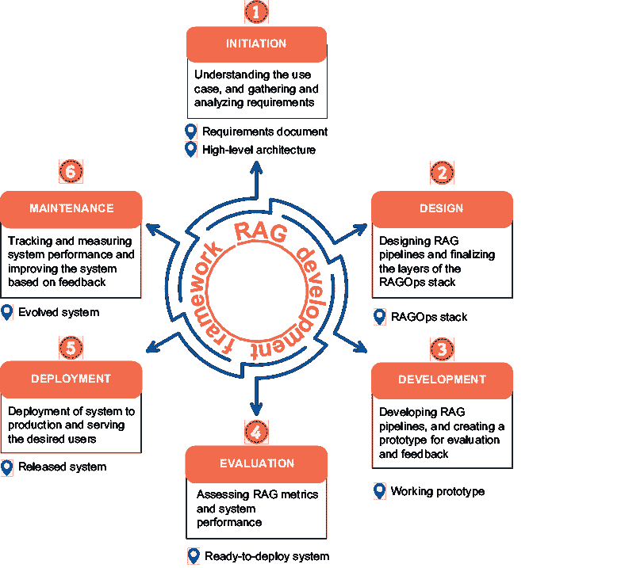
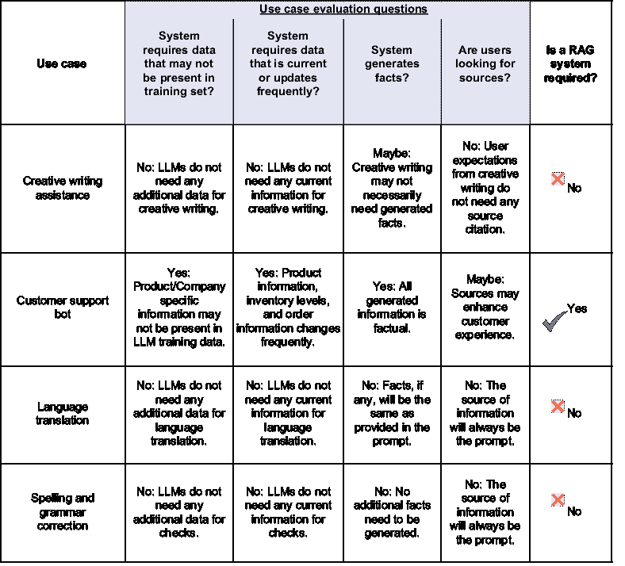
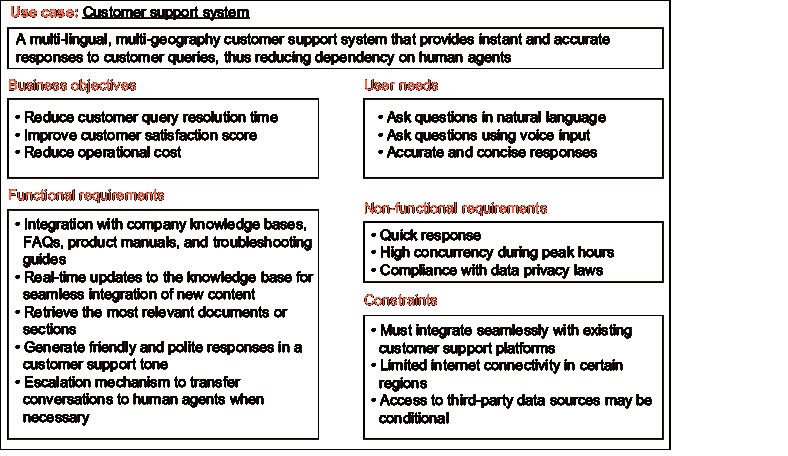
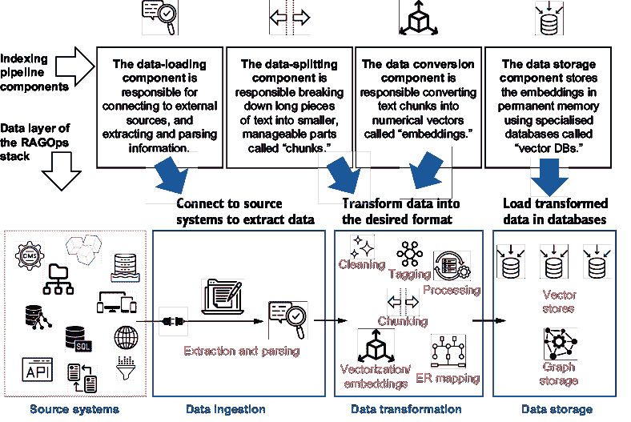
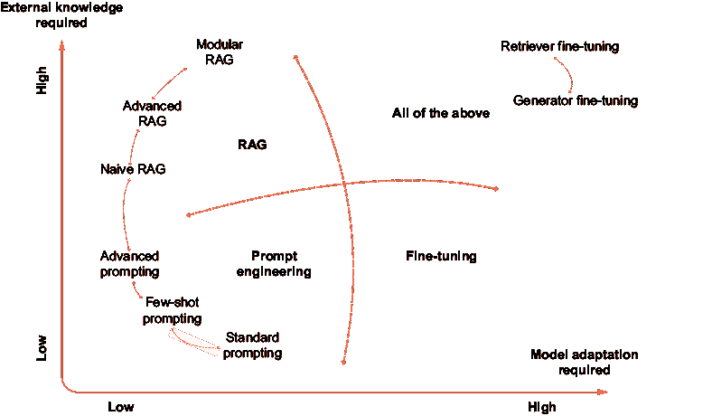
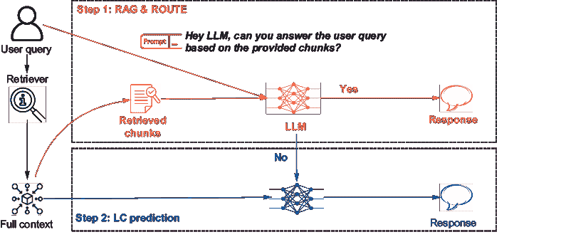

# 第九章：RAG 开发框架及进一步探索

### 本章涵盖

+   使用六阶段 RAG 开发框架回顾本书中涵盖的概念

+   进一步探索的领域

前八章涵盖了广泛的检索增强生成（RAG）内容，包括概念基础、关键组件、评估方法、高级技术、操作堆栈和 RAG 的基本变体。到现在，你应该已经具备了开发 RAG 系统所需的所有必要信息。

这最后一章总结了讨论内容，并回顾了之前讨论的所有概念。为了完成这一目标，我们将开发 RAG 系统的所有不同方面结合起来，并提出一个 RAG 开发框架。在这个 RAG 开发框架的六个阶段中，我们回顾了本书中涵盖的概念以及一些最佳实践。这个框架不仅涵盖了技术方面，而且从整体上审视了开发过程。

RAG 是一种快速发展的技术。在本章结束时，我们还将讨论一些你可以进一步探索的想法。其中一些将上下文纳入的方法可能与 RAG 技术竞争，而另一些则可能是互补的。

到本章结束时，你应该

+   已审查并巩固你对关键 RAG 概念的理解。

+   理解 RAG 开发框架的坚实基础。

+   准备构建和部署 RAG 系统。

通常，RAG 系统开发者面临的问题陈述往往是开放式的。例如，一个电商平台希望开发一个购买助手，或者营销部门需要一个研究代理来跟踪和总结竞争信息。那么，如何从开放式的问题陈述过渡到一个完全开发的 RAG 系统？这个过程由一个思维过程引导变得非常重要。为此，让我们定义并讨论一个开发 RAG 系统的框架。

## 9.1 RAG 开发框架

开发 RAG 系统的过程与开发使用机器学习模型的程序并没有很大区别。我们已经看到，RAG 系统可能很复杂，包括多个组件。它超越了模型、数据和检索器等元素。它需要一个服务基础设施来使系统可供用户使用。评估、监控和维护系统与开发和部署同样重要。这一切都始于对需求的理解和概念设计。为了解决所有这些方面，我们提出了一个将帮助我们构建 RAG 系统的 RAG 开发框架。这个框架包括以下六个阶段：

1.  *启动*—这一阶段涉及理解问题陈述，协调利益相关者，收集系统需求，并分析这些需求以制定高级系统架构。

1.  *设计*—在这个阶段，为 RAG 管道做出设计选择，并开发用于构建系统的工具集。此外，还概念化了 RAG 操作堆栈的不同层次。

1.  *开发*—这个阶段涉及开发所需 RAG 系统的可工作原型。所有必需的模型都经过训练，并开发了所需的 API。这个阶段导致知识库的创建和应用程序编排层的开发。

1.  *评估*—在这个阶段，评估检索和生成组件，以及测试端到端系统的性能。在这个阶段结束时，系统准备就绪，可以部署。

1.  *部署*—在这个阶段，系统对最终用户可用。部署策略也在此阶段决定。

1.  *维护*—这个最终阶段是一个持续的过程，涉及系统监控、整合用户反馈和跟踪技术改进。

请记住，RAG 开发框架不是一个线性过程，而是灵活的、迭代的和循环的。图 9.1 说明了 RAG 开发框架六个阶段的循环性质，展示了每个阶段的关键工件。

##### 图 9.1 RAG 开发框架的六个阶段是迭代和循环的。在每一个阶段，都可以创建特定的工件。

每个阶段都涉及某些活动。我们逐一查看这些活动，并讨论与之相关的最佳实践。我们首先从启动阶段开始。

### 9.1.1 启动阶段：定义和范围 RAG 系统

成功 RAG 系统的旅程始于与利益相关者的初始互动。这是一个深入了解问题陈述和用户需求的机会。这是一个探索阶段，并为项目设定了方向。

#### 用例识别

开发者在 RAG 系统开发过程中所做的许多选择都高度依赖于所解决的使用案例。即使对行业领域/功能有基本了解，以及对使用案例的简单定义也足以回答关于系统的关键起始问题。需要评估 RAG 系统的需求。回想一下第一章中 RAG 解决的问题：RAG 克服了训练数据限制、知识截止日期和 LLM 的幻觉，为系统带来了事实准确性、可靠性和信任。评估这些 RAG 收益是否对使用案例至关重要是很重要的。可能存在不需要 RAG 的 LLM 应用。在这个阶段，你可能需要问以下问题：

+   系统是否需要可能不在可用 LLM 训练集中的数据？

+   系统是否需要当前数据或频繁更新的数据？

+   系统需要引用或生成事实吗？生成事实的准确性有多重要？

+   如果引用了来源，用户会受益吗？

如图 9.2 所示的用例评估卡可以帮助评估是否需要 RAG 系统来解决用例。如创意写作、语言翻译、情感分析、语法纠正等用例通常不需要 RAG 系统，除非用例的某些细微之处需要它。

除了这个之外，行业领域和功能也可以给出对系统需求的早期指示。例如，来自医疗和金融领域的用例可能需要更多的安全和合规措施，而来自体育领域的用例可能需要处理快速更新的信息。

对用例的初步评估可能提供早期见解，但在进一步进行之前，对需求进行详细理解和分析是必要的。

#### 收集需求

开发正确的 RAG 系统意味着满足利益相关者的需求和期望。理解这些需求和期望是一个关键步骤。获得这种理解是一个互动和调查的过程。大多数利益相关者和最终用户可能对技术以及如何构建 RAG 系统了解有限。因此，了解成功应用对他们意味着什么非常重要。这些需求可能包括系统中需要的特性，到预期的规模和系统的期望性能。

##### 图 9.2  带有评估问题的用例评估卡可以帮助评估是否需要 RAG 系统来应对用例。

期望的性能。收集需求的一个好方法是通过不同的视角来看待它们，例如

+   *业务目标*—这些需求与构建这些系统的核心商业原因相关，例如提高点击率、节省流程成本、提高客户满意度等。技术开发者可能不直接负责业务指标，但这些业务指标可以在系统开发过程中起到指引作用。

+   *用户需求*—这些是系统开发目标用户的核心理求。表达这些需求有助于确定系统的输入和输出，以及其他功能，如多语言支持和来源引用。这些需求也是确定 RAG 系统可以预期的用户查询类型的关键。

+   *功能需求*—这些是系统的核心功能，例如支持的数据类型、要检索的文档数量以及生成内容的长度/语气/风格等。功能需求受用户需求和业务目标的影响。它们也是开发过程的主要影响因素。

+   *非功能性需求*——这些是关于系统性能、可扩展性、可靠性、安全性和隐私的要求。可能还有其他要求，如法律和合规性，尤其是在受监管的行业。

+   *限制*——还应关注系统应意识到的任何限制，例如互联网访问、数据可用性、成本和与现有系统的集成。

例如，一个客户服务系统可能被设想为减少客户查询解决时间，需要快速响应时间，并限制与现有客户支持平台的集成。上述要求的示例文档可能看起来像图 9.3 中所示，详细说明了不同类型的要求。

##### 图 9.3  需要 RAG 的客户支持系统的示例要求文档

#### 需求分析

在启动阶段，从利益相关者中提取需求是一项主要活动。然后需要分析这些原始需求。需求应该是清晰、精确和可量化的，以便它们可以导致特定的开发步骤。例如，对快速响应的非功能性需求可能过于模糊。相反，一个更好的需求是 90%的查询应在 2 秒内得到响应。同样，有限的互联网连接限制可能导致开发者认为需要一个完全离线的系统。这种需求中的模糊性需要在与利益相关者的进一步互动中解决。

在这个阶段，定义系统评估的成功标准也非常重要。需要定义和同意几个成功指标。对于开发者来说，这些成功指标应该与业务目标不同，因为业务成果可能取决于他们无法控制的因素。延迟、吞吐量、查询解决百分比等是成功指标的良好标准。图 9.4 展示了在分析成功指标后的示例要求文档。这是对图 9.3 中显示的先前要求文档的改进。

##### 图 9.4  定义了成功指标并分析了清晰性和精确性的示例要求文档

#### 高级架构

一旦对需求有深入了解，启动阶段可以被视为完成。在启动阶段结束时，使用一个高级架构图作为设计阶段的起点是一个好的做法。这个架构可用于在利益相关者之间达成一致并进一步讨论需求。这个高级架构的重点是说明系统的输入和输出。由于数据在 RAG 系统中扮演着如此关键的角色，这个高级架构还应包括数据组件。如图 9.5 所示，对于一个多渠道客户支持系统，系统必须允许从不同渠道进行输入和输出。

AI 生成的内容可能是不正确的。](../Images/CH09_F05_Kimothi.png)

##### 图 9.5  突出输入输出、数据、人工参与和缓存层的拟议客户支持机器人高级架构

在完成启动阶段后，可以做出初步的通过/不通过决策或前进的战略性决策。一旦利益相关者达成一致，系统所有 RAG 操作层可以在下一阶段进行设计。

## 9.2 设计阶段：分层 RAGOps 堆栈

在对用例和需求有清晰理解的基础上，开发者可以开始规划开发。在设计阶段，高级架构被细化以绘制 RAGOps 堆栈，并做出关于工具和技术的选择。在这一阶段，我们设计索引和生成管道，以及其他组件，如缓存、安全线等。

### 9.2.1 索引管道设计

在需求收集步骤中，我们识别数据源。在设计阶段，我们双击这些数据源以确定源系统的性质、文件类型和数据本身的性质，以确定知识库的开发步骤。回想第三章，知识库是通过索引管道为 RAG 系统创建的。数据加载、分块、嵌入和存储等组件构成了索引管道。在第七章，我们还讨论了 RAGOps 堆栈的数据层通过提取、转换和加载数据来实现这一点。图 9.6 总结了索引管道组件和数据层。

AI 生成的内容可能是不正确的。](../Images/CH09_F06_Kimothi.png)

##### 图 9.6  RAG 系统的索引管道使用 RAGOps 堆栈中的数据层执行。

现在我们来看一些重要的考虑要点，这些要点将帮助我们做出索引管道设计的决策。

#### 数据摄取

当你处理较少的数据，如几个 PDF 文件或几个网站时，*数据摄取*是一个相对简单的步骤。然而，在生产级系统中，随着数据规模的增加，复杂性也会增加。需要特别注意源系统和文件格式。以下是一些关于连接到源系统的问题，这些问题将有助于设计数据摄取组件：

+   数据层需要连接到哪些源系统？

+   连接器是否容易获取？如果是，需要哪些工具或服务来建立这些连接？

+   需要开发哪些连接器？这些连接器将基于哪种技术进行开发？

+   是否需要访问开放互联网？系统将如何连接到互联网？

以下问题组是关于文件解析的：

+   将摄取哪些文件格式？

+   如果需要，网页将如何被抓取？

+   我们是否有不同文件类型的必要解析器？

+   是否需要开发特殊的解析技术？

+   单个文件中可以有多于一种的数据模态吗？

这些问题的答案将决定你需要使用的工具来摄取数据以及需要开发的部件。

#### 数据转换

一旦数据被摄取，*转换步骤*将数据转换为知识库的合适格式。在数据转换步骤中，数据首先将被清理和预处理。提取元数据信息也是一个好的实践。有时，还需要其他预处理步骤，如 PII 数据删除或解决冲突信息。

在预处理之后，数据将使用合适的分块技术进行分块。在此阶段应决定分块大小、重叠大小和分块策略。分块可以是固定大小、结构驱动、语义分块或代理分块。

一旦创建了分块，它们需要被转换以供检索。我们已经讨论了诸如嵌入和知识图谱的方法。对于需要分块之间关系理解的用例，应探索知识图谱。在所有 RAG 系统中，创建向量嵌入几乎是强制性的。为了创建向量嵌入，可以使用预训练的嵌入模型。然而，有时，由于领域的特殊性，嵌入模型可能需要微调。

让我们现在看看在这个阶段应该考虑的一些问题。第一组问题是关于预处理的：

+   数据有多嘈杂？可以使用哪些算法和技术来清理数据？

+   是否存在结构化数据，如表格或 JSON？

+   元数据是否容易获取，或者是否需要提取？

+   应该使用哪些算法或模型进行元数据提取？（注意：所有模型都位于 RAGOps 堆栈模型层的模型库中。）

+   数据是否包含需要屏蔽或删除的敏感信息？将使用哪些技术来执行此操作？

+   是否有其他需要遵循的数据协议或指南？

当涉及到分块时，考虑以下问题：

+   分块大小是否预先确定？如果不是，应该实验哪些分块大小？

+   数据格式是否需要结构化分块？

+   如果需要，将采用哪些技术和模型进行语义分块？

+   分块代理是否 readily 可用，或者需要构建？分块代理将使用哪些模型、算法和工具？

以下问题组涵盖了 graphRAG：

+   是否需要分层索引结构？

+   我们是否需要提取关系上下文中的实体和关系？我们是否有必要的预算？

+   我们将采取哪些方法进行实体-关系提取？

+   我们是否使用任何用于图提取的框架？

+   将使用哪些模型？

关于嵌入，请考虑以下问题：

+   我们将使用哪种嵌入模型？是否有可用的特定领域嵌入模型，这将更有用？

+   是否需要多模态嵌入？

+   我们是否需要针对我们的用例微调嵌入？我们是否有用于微调的训练数据？训练数据将从哪里获取？

数据转换步骤需要大量的思考和努力。这也是可能产生重大成本的地方，尤其是在使用代理和采用 graphRAG 时。

#### 数据存储

数据层的最后一个组件是存储。根据数据转换期间所做的选择，存储将包括向量存储、图数据库和文档存储（如果需要）。在这一阶段，我们还应该记住，应用程序可能需要一个缓存存储，这可以是数据层的一部分。我们将单独讨论缓存。与数据存储相关的一些问题是

+   所有数据是否可以存储在单个集合中，或者需要多个集合？

+   我们能否管理向量数据库，或者我们需要托管服务？

+   当前数据规模如何，以及它可能如何增长？

+   我们将使用哪种向量数据库？

+   我们是否需要一个图数据库？我们将使用哪个图数据库？

+   我们是否需要存储原始文档或图像？我们将使用哪种文档存储来执行此目的？

在存储就绪后，可以执行知识库的创建。重要的是要注意，这一阶段的决策应该是灵活的。你还应该为开发期间可以实验的工具、服务和库保留选项。你还需要估计这一阶段不同步骤的相关成本，并确保利益相关者对这些成本达成一致。

在 RAGOps 栈的数据层中，索引管道的设计已经完成。你也许还会注意到索引管道也与模型层交互，其中包含嵌入模型和 LLM 以及其他特定任务的算法。

### 9.2.2 生成管道设计

我们已经讨论过，用户与知识库的实时交互是通过生成管道来实现的。在第四章中，我们开发了生成管道的三个主要组件——检索器、通过提示进行增强以及使用 LLMs 进行生成。除了这三个组件之外，检索前阶段的查询优化和检索后阶段的内容优化是生成管道的高级组件。有时，甚至在生成后，还会进行响应优化以更好地对齐响应。生成管道由 RAGOps 阶段的模型层提供动力，该层包含 LLMs、检索器、嵌入模型以及其他特定任务的模型。生成管道通过 RAGOps 堆栈的应用编排层变得生动起来。接下来，我们将分以下六个步骤讨论生成管道的设计：查询优化（检索前）、检索、内容优化（检索后）、增强、生成和响应优化（生成后）。

#### 查询优化

查询优化技术被采用以帮助检索更好地与查询对齐。采用了几种技术来转换和重写查询。对于代理 RAG，查询路由是这一步骤的一个重要方面。以下是一些有助于确定查询优化性质的问题

+   用户可以提出多少种类型的查询？每种查询类型是否需要不同的下游处理过程？

+   在搜索之前需要选择知识库中的多个集合吗？

+   用户查询预计会是简短的还是通用的？

+   用户是否在寻找精确的响应？

+   我们可以承受多少查询优化的处理时间？

+   我们将使用哪些模型和技术进行查询优化？

查询优化是可选的，但在知识库中的数据量很大时可能不可避免。还必须注意，查询优化可能会增加系统的延迟。

#### 检索

检索是 RAG 系统的一个关键组件。本书中讨论了许多检索技术和策略。RAG 系统的质量取决于检索组件的准确性。对于简单的 RAG 系统，您可以使用密集嵌入相似度匹配。在更复杂的系统中，您将需要使用混合、迭代或自适应检索策略。在这个阶段需要提出的问题是

+   我们的检索组件需要高精度、高召回率，还是两者都需要？

+   查询可以通过简单的相似度匹配来解决吗？

+   我们需要图检索吗？

+   搜索整个数据集是否会过长？我们需要过滤吗？

+   单次遍历可以检索到所有必要的文档吗？

+   从检索到的文档中获取的信息会导致更多问题吗？

+   我们将使用哪些模型和技术进行自适应、递归或迭代检索？

+   我们应该尝试哪些检索算法？

+   我们将利用哪些提供者或库？

+   我们将如何估计检索的成本？

+   应该检索多少文档才能达到可接受的覆盖率水平？

+   检索结果中的排名是否重要？

在大型知识库中，检索可能导致显著的延迟，应该针对速度和准确性进行优化。

#### 上下文优化

一旦从知识库检索到结果，它们需要与原始用户查询一起发送给 LLM 进行生成。然而，一旦检索到结果以锐化上下文，可以应用某些优化技术，如重新排名和压缩。这些技术过滤、压缩和优化检索到的信息，以减少噪声并提高上下文的精确度。为了验证上下文优化的必要性，可以提出以下问题：

+   检索到的信息量是否会压倒 LLM？

+   检索到的信息是否适合 LLM 的上下文窗口？

+   检索到的信息可能存在噪声吗？

+   是否检索了大量文档？我们需要丢弃一些吗？

+   哪些技术可以用来锐化检索上下文以匹配查询？

+   有没有我们可以使用的服务或库？

+   我们能否承担优化所需的时间？

这样的优化对于使上下文精确并提高 RAG 系统的整体质量非常有帮助，但它们确实会增加处理时间和成本。

#### 增强层

增强是将检索到的上下文添加到可以发送给 LLM 进行生成的提示中的过程。虽然这可能看起来是一个简单的步骤，但它可能有很多细微之处。所有用例上下文以及检索到的上下文也需要传递。有时，你可能需要传递期望的响应示例或思维过程。在需要使用 LLM 内部参数化知识的情况下，这也可以在提示中指定。在这个阶段需要询问的关键问题是

+   我们需要 LLM 采取的系统提示或整体角色是什么？

+   响应是否需要细微的分析？这能否作为一个思维链传递？

+   我们是否希望将响应限制在上下文中？

+   应该给出什么样的示例？

+   不同的查询类型是否需要不同的提示技术？

增强是通过提示完成的，提示可以通过 RAGOps 堆栈的提示层进行管理。提示会影响成本和延迟，因为 LLM 的处理取决于提示中传递的令牌数量。

#### 生成

生成是所有生成式 AI 应用的核心组件，它包含一个 LLM，该 LLM 以提示作为输入并生成响应。LLM 的性质在很大程度上决定了 RAG 系统的有效性和效率。你需要做出几个选择：

+   应该使用开源模型吗？我们是否有使用它们的技能和资源？

+   是否应该使用专有管理的 LLM？

+   我们是否需要针对我们的用例微调一个 LLM？

+   我们需要多大型的模型？我们需要哪些能力来应对？

+   我们如何估算生成组件的成本？

+   需要考虑任何部署限制吗？

+   模型在部署前需要优化吗？

+   需要考虑任何安全影响吗？

+   需要考虑任何伦理或法律上的影响吗？

选定的 LLM 将位于模型库中。所有训练微调活动和优化都在 RAGOps 堆栈的模型层进行。LLM 的训练和使用可能成本高昂。选择正确的 LLM 是 RAG 系统成功的关键。

#### 响应优化

有时，生成组件的响应在向用户展示结果之前可能需要进一步处理。这可以从评估响应的相关性到检查格式，以及将检索到的来源附加到响应。在这一阶段可以帮助评估的一些问题是

+   LLM 的响应是否直接以原样呈现给用户？

+   需要对响应进行任何类型的验证吗？

+   不理想结果的影响是什么？

+   是否有基于响应需要触发的任何工作流程？

响应优化非常主观，并且与用例紧密相关，但这是一个不应被忽视的考虑因素。

通过这七个步骤，生成管道设计完成。RAGOps 堆栈的模型库和训练/微调组件可以用必要的工具、平台和算法进行覆盖。生成管道的编排也可以根据这一阶段的选择最终确定。在最终确定增强技术后，也可以解决提示层。图 9.7 显示了生成管道设计，其中每个步骤都有一个总体问题。

##### 图 9.7  需要回答关键问题以对生成管道进行选择。

这完成了核心 RAG 管道的设计选择。到这一阶段，模型、提示和编排层基本上已经完成。但还有更多关于安全、限制、缓存和其他用例要求的设计考虑。

### 9.2.3 其他设计考虑

虽然设计良好的核心 RAG 管道完成了 RAG 系统的关键层，但还需要解决其他系统考虑因素和业务需求：

+   系统中需要哪些类型的限制？用户查询是否应该受到限制？是否有不应输出的信息？

+   缓存某些类型的响应是否可能且有用？

+   在系统的任何阶段是否需要人工监督或采取行动？

+   模型将如何免受恶意攻击的保护？

+   系统中需要任何审批工作流程吗？

+   用户是否在寻找可解释性？

这些问题将有助于解决 RAGOps 栈的基本和增强层。您应该能够全面了解开发 RAG 系统所需的必要组件、工具、平台和库。最后要作出的选择是部署选项。

您可以选择在云上托管部署、在私有云上自托管部署、裸金属服务器或本地/边缘机器。选择将主要受业务约束驱动，但可能会影响管道的设计选择。完全托管部署倾向于使用托管服务进行存储和计算以降低开发复杂性并确保可扩展性，自托管解决方案需要特别关注具有模块化和优化技术的设计以处理有限的基础设施，而在边缘部署中，由于资源限制，应强调轻量级组件和高效的检索策略。

在所有这些设计元素确定之后，可以开始进行 RAG 系统的开发实验。

### 9.2.4 开发阶段：构建模块化 RAG 管道

RAG 开发框架的开发阶段侧重于将设计选择实现为一个功能性的 RAG 系统。理想的方式是模块化地构建 RAG 管道，这涉及到将系统分解为不同的、可互换的组件，每个组件负责特定的功能。这种方法增强了灵活性、可扩展性和可维护性，允许根据不同的应用需求进行定制配置。开发阶段的一些活动包括训练和微调模型；为不同组件创建 API 或微服务；以及使用不同的工具、服务和库创建编排层。

#### 模型训练和微调 LLM

对于大多数系统，预训练的基础 LLM 和嵌入模型将满足需求。可能存在需要针对领域适应性微调模型的情况。在罕见的情况下，您可能选择从头开始训练语言模型。在这种情况下，RAG 系统的开发可能会退居次要位置，而模型的训练将成为开发工作的核心。在决定是否微调嵌入模型和 LLM 时，您可以遵循渐进式方法。

当使用预训练模型创建嵌入时，您需要评估相似性搜索是否产生相关结果。为此，您还可以创建真实数据。真实数据可以是一组手动整理的搜索查询及其匹配的文档。如果嵌入模型可以准确检索文档，则可以使用预训练模型。如果不可以，您可以寻找更适合用例领域域的另一个嵌入模型，或者针对用例领域微调预训练的嵌入模型。

类似地，如果预训练的 LLM 仅通过提示就能生成所需的结果，你可以直接使用该模型。在需要特定风格、词汇或语调的情况下，你可以选择微调模型。

如果系统需要其他模型，如查询分类、有害内容检测、有用性检测等，它们也需要进行训练。

#### 模块开发

应将不同的 RAG 管道组件以独立模块的形式开发，形式为包、API 或其他模块化框架。其中一些模块可以是

+   *数据加载和解析*—负责连接到源系统并解析文件格式

+   *元数据提取*—负责提取和标记元数据

+   *分块*—负责从文档中创建文档块

+   *嵌入*—负责将文档块转换为向量嵌入

+   *存储*—负责将嵌入存储到向量数据库中

+   *查询优化*—负责将用户查询与检索器对齐

+   *检索*—负责高效检索文档

+   *增强*—负责维护和调用提示库

+   *生成*—负责使用 LLM 生成响应

+   *记忆*—负责存储对话、用户偏好等

这些只是几个例子。模块化将取决于组件的复杂性。例如，如果你确信固定大小的分块对你用例足够，你可能不需要开发独立的分块模块。相反，如果你假设随着技术的进步，系统可能需要更改 LLM，你可以创建允许快速轻松替换模型的生成模块。图 9.8 回顾了第六章中讨论的模块化 RAG 设计。

#### **编排**

最后，你将开发编排层，该层将管理你开发的各个模块之间的交互。这使你的 RAG 系统的工作流程得以实现。这个工作流程应该足够灵活，能够适应不同查询类型的反馈。

##### 图 9.8 模块化结构允许单个组件的灵活性和可扩展性。

你还将能够访问各种托管服务、框架、库和工具，你可以将它们与任何模块集成。例如，LangChain 是一个提供 RAG 框架大多数组件库的框架。你可以使用这些库进行快速轻松的开发。然而，对于你希望有更多控制的组件，你可能需要从头开始构建功能。

开发是一个以实验驱动的迭代过程。为了最终确定 RAG 系统的不同组件，你需要评估它们，并将它们与你在启动阶段设定的目标进行基准测试。

### 9.2.5 评估阶段：验证和优化 RAG 系统

RAG 系统的评估是其开发过程中的关键组成部分。所有不同的策略、工具和框架都必须与一些基准进行比较。实际的业务效果只能在部署后衡量，但在开发阶段可以评估一些指标。我们可以从两个广泛的类别来查看这些指标。

#### RAG 组件

评估 RAG 系统的目的是评估不同 RAG 组件的性能。为此，可以有针对检索器的特定指标、针对生成器的特定指标和整体 RAG 评估指标。以下是第五章中讨论的这些指标的总结。我们首先从检索器特定指标开始：

+   *准确率*通常定义为在检查的总案例中正确预测的比例（包括真阳性和真阴性）。

+   *精度*关注检索结果的品质。它衡量检索到的文档中有多少与用户查询相关。它回答了这样的问题：“在所有检索到的文档中，有多少是相关的？”

+   *Precision@k*是精度的一种变体，它衡量在顶部“k”个检索结果中相关文档的比例。它特别重要，因为它关注的是顶部结果，而不是所有检索到的文档。对于 RAG 来说，它很重要，因为只有顶部结果最有可能被用于增强。

+   *召回率*关注检索器提供的覆盖范围。它衡量从语料库中检索到的相关文档占所有相关文档的比例。它回答了这样的问题：“在所有相关文档中，有多少被检索到了？”

+   *F1 分数*是精度和召回率的调和平均值。它提供了一个平衡了检索器质量和覆盖范围的单一指标。

+   *平均倒数排名，或 MRR*，在评估相关文档的排名方面特别有用。它衡量列表中第一个相关文档的排名的倒数。MRR 是在一组查询上计算的。

+   *平均平均精度，或 MAP*，是一个结合了不同“k”（即顶部结果的截止数）截止水平的精度和召回率的指标。它首先计算平均精度，然后对所有查询进行平均。

+   *nDCG*通过考虑相关文档在结果列表中的位置并给较早出现的相关文档分配更高的分数来评估排名质量。

下面是生成器特定指标的总结：

+   *连贯性*评估响应的逻辑流程和清晰度，确保信息以可理解和组织的方式呈现。

+   *简洁性*评估响应是否简洁明了，避免不必要的冗长，同时仍然传达完整的信息。

我们以对整体 RAG 指标的总结来结束：

+   *上下文相关性*评估检索到的信息中有多少与用户查询相关。

+   *忠实度*或*扎根性*评估响应中声明的比例，这些声明得到了检索到的上下文的支持。

+   *幻觉率*计算响应中生成的声明比例，这些声明在检索到的上下文中不存在。

+   *覆盖率*衡量上下文中相关声明的数量，并计算生成响应中存在的相关声明的比例。

+   *答案相关性* 通过计算最终响应与原始问题的相关性来评估系统的整体有效性。

回想第五章中 RAG 评估的三要素。图 9.9 展示了用户查询、检索到的上下文和生成的响应之间的相互作用，这些相互作用计算了 RAG 特定的指标。

AI 生成的内容可能是不正确的。](../Images/CH09_F09_Kimothi.png)

##### 图 9.9  TruEra 提出的 RAG 评估三要素

要计算这些指标中的一些，需要一个真实数据集。真实数据是已知为真实或正确的信息。在 RAG 和生成式 AI 领域，真实数据是一组准备好的提示-上下文-响应或问题-上下文-响应示例，类似于监督机器学习中的标记数据。为您的知识库创建的真实数据可用于评估您的 RAG 系统。

您可以测量这些指标的不同组件。例如，您可以通过用自适应检索策略替换混合检索策略来检查上下文相关性是否增加。您还可以检查查询和上下文优化的有效性。您还可以比较特定组件的两个服务提供商。

#### 系统性能

系统性能指标与系统的非功能性需求相关，这些需求比系统的准确性更多地影响系统的可用性。其中一些指标包括

+   *延迟*——衡量从接收查询到提供响应所需的时间。低延迟对于用户满意度至关重要，尤其是在实时应用中。

+   *吞吐量*——表示系统在特定时间框架内可以处理的查询数量。更高的吞吐量反映了系统高效管理大量请求的能力。

+   *资源利用率*——评估操作期间 CPU 和 GPU 使用的效率。最优利用确保成本效益并防止资源瓶颈。

+   *每查询成本*计算处理每个查询的平均费用，包括基础设施、能源和维护成本。

在基于 LLM 的系统中对延迟和成本给予了特别关注。这是因为 LLM 架构的固有性质。RAG 增加了延迟和成本。因此，应该从这个角度评估检索过程中的过滤、优化和检索策略等附加组件的影响。有时利益相关者也可能要求你评估一些特定用例的指标，这也应该是评估阶段的一部分。

当你的系统经过彻底评估和改进，以满足所有基准时，它就准备就绪了。你现在可以部署它，使其可供目标用户使用。

### 9.2.6 部署阶段：启动和扩展 RAG 系统

一旦系统准备就绪，就需要将其部署到可由目标用户访问的生产服务器上。对于软件系统，有一些流行的部署技术，这些技术也可以用于 RAG 系统。

#### 蓝绿部署

蓝绿部署维护两个独立的 环境，分别命名为蓝色和绿色。现有系统位于蓝色环境，而新的 RAG 系统置于绿色环境。一旦绿色环境经过测试和验证，所有流量就会导向绿色环境，蓝色环境被停用。这种蓝绿部署的优势在于可以在不影响实时流量的情况下测试生产环境。因此，几乎没有停机时间，并且在遇到任何问题时，可以轻松回滚。然而，这是一个成本较高的选项，因为整个生产环境都被复制了。可以在绿色环境中更新索引管道，而不会影响实时系统。检索策略或嵌入模型的更改可以在生产使用之前安全地验证。

#### 金丝雀部署

金丝雀部署逐渐将新的 RAG 系统发布给一小部分用户。如果它与这些用户的表现良好，就会扩展到所有用户。金丝雀部署允许实时用户反馈，从而能够早期发现问题。然而，它增加了反馈和监控的复杂性，以及需要管理的多个版本。它可以在有限的查询或特定区域上测试检索算法、嵌入或生成模型的变化。

#### 滚动部署

滚动部署用于存在多个生产服务器的情况。在移动到下一个服务器之前，新的 RAG 系统会逐个部署到一台服务器上。因此，没有完全的停机时间，一次只有系统的一部分离线。如果在部署过程中出现问题，可能会变得复杂。当一些服务器更新时，而其他服务器没有更新，回滚可能会变得繁琐。

#### 影子部署

影子部署将实时流量镜像到与旧版本系统并行运行的新版本系统，而不将新 RAG 系统的响应暴露给用户。通过这样做，可以在不影响用户的情况下测试系统。然而，它需要像蓝绿部署一样复制基础设施。

#### A/B 测试

A/B 测试涉及将 RAG 系统的两个版本（A 和 B）部署到不同的用户子集，并比较它们的性能以确定更好的选项。这也可以用于新系统。它允许直接比较，并为性能提供清晰的见解。然而，它需要强大的机制来分割流量并收集性能指标。它允许尝试不同的 LLM 或检索策略，以及提示和增强技术的变化。

#### 交错实验

*交错实验*通过将两个 RAG 系统的输出混合成单个结果集展示给用户来比较两个 RAG 系统。两个系统的结果交错，用户交互归因于原始系统以确定哪个表现更好。这种方法提供了快速的反馈，并通过在相同条件下比较系统来减少偏差。然而，将用户参与度归因于正确的系统可能很复杂。

部署策略的选择可能取决于诸如容错性等因素，并且使用如影子、金丝雀和蓝绿等策略可以减轻关键任务系统中的风险。这还取决于规模，对于大规模系统，滚动部署是有意义的。小型新的 RAG 系统也可以一次性部署。

现在系统对用户可用后，你将开始获得实时反馈，系统的成功与失败也将取决于你对反馈的反应。为了衡量和改进系统，需要持续监控。

### 9.2.7 维护阶段：确保可靠性和适应性

将 RAG 系统部署到生产中只是向进化语境 AI 系统迈进的第一里程碑。显式的用户反馈、技术演变和用户行为的变化带来了系统可能遇到的前所未有的挑战。因此，持续保持警惕并监控系统性能至关重要。RAG 系统在生产中可能失败的原因有几个。有操作性的原因，如计算资源限制、负载的突然激增和恶意攻击。原因也可能是知识库中数据类型的转变或用户查询的变化。因此，测量一些指标是至关重要的：

+   在部署前评估的 RAG 组件指标需要持续监控以检测退化。

+   通过分析用户查询的性质可以跟踪用户行为的变化。

+   系统性能指标，如延迟、吞吐量和类似指标也应持续监控。

+   应跟踪的附加指标还包括错误率、系统停机时间、恶意攻击等。

+   用户参与度指标，如客户满意度评分或重复参与度可以表明系统的可用性。

+   应跟踪如收入影响和成本节省等业务指标。

此开发框架通过维护完成了其周期。然而，它不是一个线性过程。新的需求和业务目标将出现。这将重新启动改进 RAG 系统的开发周期。在构建 RAG 系统时，此开发框架将证明是一个良好的参考资源。

我们在本节结束本书的讨论，并在下一节中讨论 RAG 时，提出一些额外的考虑事项，以保持对生成 AI 领域演变的关注。

## 9.3 进一步探索的想法

就像任何技术一样，即使是 RAG，也有一些互补和竞争的想法共存。您可能会听到这些技术，有时会面临挑战，需要捍卫 RAG 的使用。RAG 系统也有常见的故障点需要关注。

### 9.3.1 RAG 中的微调

监督微调（SFT）LLM 已成为定制和适应基础模型以实现特定目标的流行方法。在应用 AI 社区中，关于微调或 RAG 的应用以完成任务的讨论日益增多。虽然 RAG 在不改变参数的情况下增强了基础模型的无参数记忆，但 SFT 改变了基础模型的参数，因此影响了参数化记忆。RAG 和 SFT 应被视为互补技术，而不是竞争技术，因为它们都针对生成 AI 系统的不同部分。如果您需要改变 LLM 响应的写作风格、语气和词汇，您可能会更喜欢微调而不是 RAG。在他们的论文“大型语言模型的检索增强生成：综述”([`arxiv.org/abs/2312.10997`](https://arxiv.org/abs/2312.10997))中，高及其同事绘制了提示工程到 RAG 和微调的演变图。这如图 9.10 所示，展示了随着模型适应需求增加，微调的必要性。

##### 图 9.10  提示工程需要对模型和外部知识进行低修改，专注于利用 LLM 自身的功能。然而，微调却涉及进一步训练模型。来源：[`arxiv.org/abs/2312.10997`](https://arxiv.org/abs/2312.10997)。

对于检索器和生成器，微调方法具有显著提高 RAG 性能的巨大潜力。检索器微调通过使用对比学习、监督嵌入微调等方法，增强了检索模型准确捕捉特定领域相关语义细微差别的能力。

监督检索或基于奖励的微调。生成器微调通过通过融合解码器（FiD）、提示调整、潜在融合技术以及参数高效微调（PEFT）等方法调整语言模型来补充这一点。将这些方法结合在一个混合微调框架中可以更有效地对齐检索和生成组件，从而提高准确性、减少幻觉并提高对特定领域任务的适应性。

### 9.3.2 LLMs 中的长上下文窗口

在 LLMs 中，上下文窗口随着迭代显著增长。截至本文撰写时，Claude 3.5 sonnet 支持高达 200,000 个 token 的窗口，而 GPT-4o、O1 及其变体可以处理 128,000 个 token。Google Gemini 1.5 以 1 百万 token 的上下文窗口领先。在你阅读这本书的时候，可能会有具有更长上下文窗口的模型。因此，在许多情况下，我们只需将整个上下文，例如长文档，作为提示的一部分传递给模型。这将消除在知识库不是特别大的情况下进行分块、索引和检索的需要。在他们的论文“检索增强生成或长上下文 LLMs？全面研究和混合方法”([`arxiv.org/abs/2407.16833`](https://arxiv.org/abs/2407.16833))中，Li 及其同事系统地比较了 RAG 和具有长上下文窗口的 LLMs。他们证明，在少数例外的情况下，长上下文 LLMs 优于 RAG。然而，直接使用 LLMs 处理长上下文可能会非常耗费计算资源。RAG 由于处理较短的输入而显著更节省成本。同一篇论文中提出的混合方法 SELF-ROUTE 使用模型自我反思来决定一个查询是否可以用检索到的块来回答，或者是否需要完整的上下文。图 9.11 说明了 SELF-ROUTE 方法，其中模型接收带有检索块的查询，并基于此信息确定是否可以回答查询。如果可以，它生成答案。如果不可以，则向模型提供完整上下文，模型生成最终答案。

##### 图 9.11  利用 RAG 和 LLMs 中的长上下文的混合方法可以在不增加成本的情况下提高性能。

### 9.3.3 管理解决方案

随着 RAG 的日益流行及其在生成 AI 应用中的重要性，许多服务提供商提供托管 RAG 管道，其中可以配置多个 RAG 组件，而无需定制开发。例如，知识库是 Amazon Bedrock 的一项功能，有助于实现整个 RAG 工作流程。Azure AI Search 提供索引和查询功能，基于 Azure 云的基础设施，而 Vertex AI RAG Engine 是 Google Vertex AI 平台的一个组件，有助于 RAG。还有像 CustomGPT、Needle AI、Ragie 等独立服务提供商，提供托管 RAG 管道。与跨技术托管解决方案一样，需要考虑的因素包括成本、适用性、灵活性和对组件的控制。

### 9.3.4 难以处理的查询

RAG 系统中失败的一些关键原因与查询类型有关。作为 RAG 开发者，持续关注这些查询类型对于改进技术至关重要。其中一些包括

+   *多步推理*——RAG 在需要多跳检索的查询上遇到困难（例如，“XXX 歌手的国籍是什么？”）。

+   *通用查询*——模糊或宽泛的问题难以检索相关片段（例如，“这个团体对 XXX 的看法是什么？”）

+   *复杂或长查询*——复杂查询挑战检索器的理解。

+   *隐含查询*——需要全面上下文理解的查询不能仅由 RAG 解决。

我们在 RAG 的讨论中已经走得很远了。本章全面总结了本书的内容，从 RAG 的好处到构建 RAG 系统的最佳实践。尽管有重复的风险，但 RAG 是生成 AI 领域的一个重要且不断发展的技术。希望您阅读这本书时有所收获。以下是我的一些结束语：

+   记住要熟悉由 RAG 驱动的上下文 AI 的原则。

+   信任您构建复杂 RAG 系统的能力。

+   总是牢记开发挑战和克服它们的策略。

+   了解围绕生成 AI 的伦理和法律问题。

+   保持对快速变化的趋势的关注。

## 摘要

### RAG 开发框架

+   RAG 开发框架提供了一个构建、部署和维护检索增强生成系统的结构化方法。

+   通过包含六个迭代和循环阶段：启动、设计、开发、评估、部署和维护，该框架解决了 RAG 系统的复杂性。

+   该框架强调 RAG 系统开发的技术和操作方面。

### RAG 开发框架阶段

+   **启动阶段**

    +   专注于理解问题陈述、协调利益相关者并收集需求。

    +   强调使用用例识别和评估 RAG 需求，使用如用例评估卡片等工具。

    +   涉及业务、功能和非功能性需求的需求收集。

    +   以绘制高级架构图来结束，以进行对齐和战略决策。

+   **设计阶段**

    +   将高级架构转换为详细的管道设计，用于索引和生成。

    +   包含关于分块、嵌入和检索策略的选择。

    +   解决额外的考虑因素，如安全网、缓存、安全和部署策略。

+   **开发阶段**

    +   实施模块化 RAG 管道，实现灵活性、可扩展性和可维护性。

    +   活动包括训练/微调模型、创建独立模块（例如，分块、检索、生成）和构建编排层。

+   **评估阶段**

    +   使用上下文相关性、忠实度、精确度、召回率、延迟和每查询成本等指标验证 RAG 系统组件和整体性能。

    +   使用真实数据集进行基准测试和优化。

+   **部署阶段**

    +   包括部署策略，如蓝绿部署、金丝雀部署、滚动部署和 A/B 测试，以确保平稳过渡和最小化干扰。

    +   强调实时用户反馈和系统可扩展性。

+   **维护阶段**

    +   通过持续监控组件指标、用户行为和性能指标来确保系统可靠性。

    +   适应不断发展的用例、技术进步和用户反馈。

### RAG 开发的最佳实践

+   模块化设计提高了适应性和更新便利性。

+   真实数据集对于准确评估和微调至关重要。

+   部署策略应与系统关键性、规模和风险承受能力相一致。

+   定期监控用户行为、数据和性能的变化，以保持可靠性。

### 进一步探索的想法

+   **RAG 与微调的比较**

    +   RAG 通过增强非参数记忆来补充微调，而微调则适应参数记忆以调整风格、语气和词汇。

    +   根据具体需求，用例可能从混合方法中受益。

+   **LLM 中的长上下文窗口**

    +   LLMs（例如，200k+令牌上下文）的进步可以减少对较小知识库的分块和检索的依赖。

    +   混合模型，如 SELF-ROUTE，将 RAG 与长上下文处理相结合，以优化成本和准确性。

+   **管理解决方案**

    +   如 Amazon Bedrock、Azure AI Search 和 Google Vertex AI RAG Engine 等服务提供预构建的 RAG 管道，简化部署并减少开发工作量。

+   **处理困难查询**

    +   多步骤推理、通用查询和隐含问题仍然是 RAG 系统的挑战。
