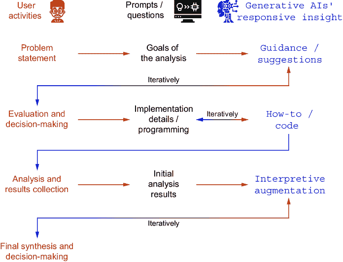

# 第一章：生成式 AI 在数据分析中的应用介绍

### 本章涵盖

+   介绍生成式 AI 模型的几个关键局限性

+   生成式 AI 在数据分析中的作用

+   开始使用 LLMs 支持数据分析

当生成式 AI 的炒作尘埃开始落定，失望的音符与赞扬的合唱交织在一起时，可能是一个问自己问题的好时机：“如果 LLMs 不是解决所有世界问题的银弹，它们究竟有什么真正的用途？”我们使用这些令人惊叹的工具来改进各种流程的经验给了我们答案。它们真的很棒，我们说的“真的很棒”是指它们在支持不同流程的改进方面真的很出色。在这本书中，我们将引导你了解我们利用生成式 AI 矩阵中隐藏的巨大潜力来提高你的分析技能的方法，同时避免这项技术固有的风险。

内部结构  为了在这些目标上取得卓越成绩，你最好在心中牢记是什么驱使你从提示中获得的响应。然而，由于本书的架构无关性质和快速变化的技术环境，我们有意避免了技术细节，而是专注于过程实施。尽管如此，我们鼓励你获得一个全面的了解。你可以从几本 Manning 出版的书籍中学习，例如 David Clinton 的《生成式 AI 的完整过时指南》或 Numa Dhamani 和 Maggie Engler 的《生成式 AI 入门》。关于 GPT 模型的技术细节，请参阅 Drew Farris、Edward Raff 和 Stella Biderman 的《GPT 是如何工作的》。

在本章中，你将了解与生成式 AI 合作的重要三个方面。因为我们坚信，首要之事确实应该是首要的，所以我们将首先介绍生成式 AI 的固有局限性。我们已经提到了生成式 AI 应用中期望与结果之间的不匹配。对不可避免的局限性的良好理解对于避免工作中的失望至关重要。第二个方面与将生成式 AI 嵌入数据分析过程相关。本章的这一部分将帮助你形成关于何时以及如何使用生成式 AI 来解决分析问题的第一直觉。我们还将管理涉及生成式 AI 的自动化过程的期望。本章的最后一部分将为你提供关于访问生成式 AI 的方法的知识。在大多数情况下，基于浏览器的聊天访问就足够了，但历史告诉我们，当处理敏感数据时，这可能不是一个明智的方法。

本章的总体目标不是给你提供关于这项技术的百科全书式知识，而是确保你对它有足够的理解，以便揭开生成式 AI 的神秘面纱，并允许对其能力进行更批判性的解读。

## 1.1 生成式 AI 模型的固有局限性

在中世纪，地图的边缘刻有“Hic sunt dracones”（拉丁语意为“这里有龙”）。你也许还会在未知的海洋区域找到描绘的怪物。后来，龙、女妖和海怪被描绘为暗礁、浅滩和冰原。我们希望您将我们的警告视为后者，而不是前者。对于任何一项事业，了解需要警惕的危险至少与了解希望得到的利益一样重要。

以下列表概述了任何生成式 AI 系统的固有局限性。其中一些可能在将来减少甚至消除，但了解一个可能过时的局限性所花费的成本要低于对仍然有效的任何一个局限性的无知。因此，以下是我们应该警惕的险恶水域：

+   *生成式 AI 总是会提供一个答案（即使它是错误的)*—就像完成了“为什么？”阶段的孩子，或者是一个过度提升的管理者，有着严重的冒充者综合症，生成式 AI 在被问及问题时，知道一切，并且作为他们的第一反应，无法承认他们知识的局限性。你真正想读这本书的主要原因之一就是生成式 AI 可以被说服否则。在第八章，我们还将讨论模型对输入语法的敏感性。稍微改写一个问题可能会导致不同质量、相关性的答案。值得注意的是，由于提示通常以自然语言提供，这种敏感性略不同于搜索引擎。后者只对关键词簇做出反应，而生成式 AI 可能会根据提示的关键词、语法结构、写作感知的情感基调以及最近交流产生的上下文提供不同的回答。

+   *一些答案可能是完全虚构的*—存在这样的情况，生成式 AI 提供的答案看似合理，但实际上并非基于事实或与训练材料直接相关。这是因为模型有时会通过生成与训练数据中观察到的模式一致的内容来填补其知识中的空白，即使信息不准确或不完整。我们将在第七章讨论 AI 幻觉现象时，涵盖这个问题。

+   *固有的谄媚性*—生成式 AI 的基础模型越大，就越有可能在可靠性、准确性与顺从性之间选择顺从性。如果面对或质疑提供的答案，它很可能会道歉并呈现与其先前陈述相矛盾的观点，即使第一次是正确的—真理见鬼去吧！生成模型甚至可以编造数字和伪造参考资料来支持用户的观点！

+   *不准确或过时的信息*—每个生成式 AI 的知识来源于其训练所用的内容语料库。模型可能会根据知识截止点提供过时或不正确的信息。这在本书的例子中会很明显，模型会使用 API 调用或编程语言结构从过时的版本中给出答案。这并不像最初看起来那样严重。首先，大多数概念的变化并不快，大多数人需要在达到需要利用最新发展之前，在基础知识方面有很多要覆盖。其次，许多生成式 AI 可以访问互联网。然而，将用于训练模型的受时间限制的知识体系与持续更新混合可能会导致不准确的结果。还值得记住的是，一些生成式 AI 只有在直接被提示时才会检查互联网上的最新信息。

+   *输入和输出限制*—在使用生成式 AI 时，你应该意识到它们可以处理文本的数量（它们可以整体读取的输入量，以及在此基础上生成输出）是有限的，尽管不同模型和实现之间的差异可能很大。生成式 AI 处理文本的单位称为*标记*，它可以是一个单词、单词的一部分或一个标点符号，这取决于所采用的标记化方法。标记化算法将文本转换为标记，平均每 3 个单词有 4 个标记，或者每个标记 0.75 个单词（这个值应该是相对稳定的）。在撰写本书时，模型有从几千到数百万个标记的上下文窗口，真正无限上下文的竞赛正在进行中。然而，目前可用的工具提供的输入（提示）和输出（响应）标记数量有限，你应该记住上下文窗口覆盖了这两者。如果某些数据超出窗口范围（无意中用了双关语）并被遗忘，你将不会收到任何警告。这种截断通常表现为模型给出与前一次交流不一致的响应，表明它已经忘记了之前的提示或响应。在第 1.3 节中，我们介绍了估算使用标记数量的方法。作为一种处理这种限制的方法，你可能需要经常总结对话及其关键发现，以确保它们不会从上下文窗口中遗漏。

+   *冗长*—当你尝试一些提示时，很快就会很明显，生成式 AI 会生成过于冗长的响应或过度使用某些短语（例如，它们倾向于“坚定不移地深入到丰富复杂的错综复杂性的广阔领域中的...”任何它们遇到的东西）。这种冗长可以归因于训练数据中的偏差或模式，其中较长的响应或特定结构的响应可能更常见。

+   *有偏见或不适当的内容*——尽管努力减少有害和有偏见的内容，生成式 AI，尤其是那些在未知数据上微调的 AI，仍然可能生成表现出偏见或产生被认为不适当的内容的响应。这可能是由于训练数据中仍然存在一些偏见，这些偏见隐藏或故意包含在提示中，或者是由众多其他重叠因素造成的。然而，大多数生成式 AI 的开发者已经竭尽全力来平衡模型的响应。一个例子可以在 GPT-4 系统卡文档（https://cdn.openai.com/papers/gpt-4-system-card.pdf）中找到。

他说，她说——你可以通过为底层 LLM 提供搜索额外数据源的能力，并要求将答案与来源链接，来帮助生成式 AI 提供正确或至少有用的答案。你可以从 Amit Bahree 的《生成式 AI 实战》或 Trey Grainger、Doug Turnbull 和 Max Irwin 的《AI 驱动搜索》中了解更多信息，这两本书都由 Manning Publications 出版。

对智者而言——提示/响应大小限制和冗长性往往会导致不完整或截断的响应。在设计与生成式 AI 的对话时，一个选择是确保提示和预期响应的总长度不超过令牌限制。

当你与生成式 AI 互动或将它们纳入各种应用时，对这些限制的认识至关重要。持续的研究和开发旨在解决这些限制，并提高生成式 AI 的性能和安全。

## 1.2 生成式 AI 在数据分析中的作用

在专注于生成式 AI 的群组和论坛上，有大量类似“我在哪里可以找到一个基于生成式 AI 的工具来完成[此处非常具体的任务描述]？”的问题。即使请求的工具目前还不存在，它可能很快就会出现。而且这都没问题。数据仓库、湖泊、湖屋、网格、织物等等正在取代 Excel 文件、电子邮件中的数据以及便条（如果不是所有目的的话）。仪表板和自助式商业智能（BI）平台正在取代手动创建的报告和 PowerPoint 演示文稿（好吧，关于使用生成式 AI 创建、修改或改进 PowerPoint 幻灯片的问题是最常见的）。然而，要小心那些万能的解决方案。在数据仓库、湖泊等地方收集的数据中，只有 0.5%被分析过，而剩下的 99.5%则给那些没有数据利用计划而过于急切地开始收集数据的公司带来了成本和大数据后遗症。反过来，BI 平台则充满了无用的分析（例如，那些除了为糟糕的商业决策提供正当理由之外没有其他目的的数据切片和切块）。

生成式 AI 在数据分析中的有效性将取决于你，作为数据分析师，利用这种新工具的可能性并克服其局限性的能力。生成式 AI，就像任何工具或技术一样，不能期望它做所有的工作。让我们仔细看看我们正在处理的内容，以及生成式 AI 与数据分析流程中其他元素（即分析过程和软件）的不同和相似之处。

迄今为止，我们倾向于悲观的一面，给你提供了很多关于生成式 AI 局限性的警告，并劝阻你不要盲目跳上任何标有“GenAI-powered”标签的工具（我们内部有一个关于第一个标有此类标签的牙刷何时进入市场的赌局）。我们故意这样做，因为我们注意到过高的期望是阻碍高效使用这个神奇工具的主要因素。现在让我们摆脱这个怀疑的阴影，步入数据分析光明的生成式 AI 支持的未来的光明之中。

### 1.2.1 数据分析流程中的生成式 AI

年复一年与数据打交道让我们坚信，其价值并非来源于所使用技术的复杂性。我们见证了通过按流程而非按组织单位进行简单的成本分解，节省了数百万美元。我们也看到了因为涉及数十种工具和团队的过度复杂的市场分析，导致数百万美元的损失，因为这些分析并没有很好地反映实际客户情绪。*数据分析并非是将原始数据转化为图表。它是利用相关业务数据的结论来支持业务决策。* 在这项事业中，你的成功将取决于几个方面，其中可用的工具只是其中之一。

不同类型的数据和不同的商业问题需要不同的分析流程。如果你在一家零售公司工作，你很可能寻求对客户行为的洞察。你的流程可能从收集和清理来自多个来源的数据开始：交易记录、客户反馈和网站互动。一旦数据被清洗和标准化，你将通过执行客户细分、产品亲和力分析和销售预测的算法来处理这些数据。与医疗保健提供者合作时，你的输入数据将包括患者的电子健康记录、医学影像和可穿戴设备的传感器数据。你的处理将采用用于疾病诊断、治疗优化和患者结果预测的算法。如果你发现自己身处一家制造企业，你将整合来自工厂地面物联网传感器的数据、质量控制检查和供应链物流数据，分析将集中在异常检测、预测性维护和供需预测上。

无论你分析的是什么以及为谁分析，过程的本质保持不变：收集和清理输入数据，使用更多或更少的先进算法进行处理，最后，将结果呈现给目标受众。

具体细节因业务领域、数据来源、应用的分析方法以及预期的输出格式而大相径庭。每个这些主题都值得有一本书（或六本）来讲述如何最有效地执行每个步骤，考虑到成本和时间，使用这个或那个技术栈。

本书并不旨在回答你作为数据分析师在工作中可能遇到的所有可能场景的所有可能问题。我们提供给你更好的东西。我们提出了一种结构化方法，有效地利用生成式人工智能难以置信的知识库（从维基百科到科学论文，到书籍和文献，到对话数据，到 Pile（[`pile.eleuther.ai/`](https://pile.eleuther.ai/）），等等），以准备一个定制的分析流程，专门解决你的问题。

缺失的环节  生成式人工智能的能力规模才刚刚开始被探索。然而，已经很明显，它们可以被训练在广泛的主题上做出一致且相关的回应。它们有能力深入细节，总结，解释，并将相关概念以非凡的程度联系起来。这些能力可以有效地解开你的思维，帮助你走出困境。你不再需要翻阅数十篇随机文章来寻找灵感或线索。只需提出一个问题。即使答案不完美，也可能指向你之前未曾考虑过的概念。利用这一点来拓宽你的视野。

在序言中，我们确定了一个你应该在遇到每个新的分析问题时问自己的问题：*我从哪里开始*？寻找正确的输入数据可能不是最糟糕的选择，尤其是如果它伴随着对哪些输入数据实际上相关的分析。让我们假设你在一个医疗单位工作，收到一个像“周二平均患者等待时间是多长？”这样的问题，或者你在一个零售业工作，被要求分析“我们的客户如何使用忠诚度卡？”不要被前者问题的简单性所迷惑。实际上，它们都可能很棘手。

图 1.1 中展示的流程将帮助你指导从问题到决策支持结论的关键步骤，专注于在过程中从人类和生成式人工智能中获得最大附加值，同时避免常见的陷阱。它可以应用于任何分析任务和技术栈。本书中你将遇到的全部示例都将遵循这一通用结构。



##### 图 1.1 推荐的生成式人工智能支持的数据分析流程

你始终需要从一个问题陈述开始。让我们看看我们的医疗例子。我们被问及周二等待时间的问题；然而，特定日期的等待时间问题更有可能是更深层次问题的症状。你被问到的的问题通常不会直接转化为一个有效的问题陈述。我们应该问自己，“我们在这里真正面对的是什么问题？”虽然最终决策者的工作是定义请求分析的范围，但引导性问题可以帮助你进入分析的一个更好的起点，并最终从分析数据中获得更多价值。

现在，有趣的部分来了。即使请求来自你缺乏经验的运营领域，生成式 AI 也能帮助你将收到的请求放入业务背景中，而无需打扰你的利益相关者进行不必要的查询！让我们尝试用几个生成式 AI 来回答我们关于周二的具体问题。

****我在一个医疗单位工作。我被要求回答一个问题：“周二患者的平均等待时间是多长？”你认为这个问题背后可能有哪些实际原因？

答案太长，无法在此处列出，但 OpenAI 的 ChatGPT（3.5 和 4）、Google Gemini 和 Gemini Pro，以及 Meta 的 Llama 2（13B）都提供了可能的项目类型列表，在这些项目中这样的分析可能很重要。这些答案通常涉及规划和预算（包括资源分配和人员优化）、患者体验和护理质量、运营效率和员工培训。

根据你对环境中当前项目的了解，你可能会有更具体或更不具体的问题，这不应该被视为浪费时间。例如，如果你向请求分析的利益相关者提出一个后续问题，比如，“这与我们最近关注提高患者满意度有关吗？”，你可能会得到这样的回答，“哦，是的，我们经常听到关于周二的投诉，我们想尝试做些什么。”一旦你了解到患者投诉和等待时间是周二等待时间原始问题背后的根本问题，你的最终问题陈述可能看起来像这样：“等待时间的分布及其与患者满意度的相关性是什么？”这个问题在具体性和范围之间取得平衡，旨在揭示可以直接影响患者护理协议和满意度的可操作见解。

在与你的生成式 AI 顾问的对话中，你关于项目的详细程度应该根据你分析的秘密性要求和你的生成式 AI 设置的具体情况来调整。在本地管理的软件环境中比在公共平台上更自由地分享是明智的。这个主题，包括使用生成式 AI 的相关风险，将在第八章中进一步探讨。

您可以尝试向生成式 AI 查询回答最终问题的最佳方法。

****我该如何进行分析，以回答以下问题：“等待时间的分布及其与患者满意度的相关性？”

再次强调，这些答案相当长且详细。它们提供了七到九步的方法，通过额外的迭代查询，应该可以帮助您构建一个稳健的流程。第三章提供了一个使用生成式 AI 从极其模糊的要求（不幸的是，在现实世界中可能会遇到）开发详细分析设计的实际例子。在这里，我们的目标是向您展示生成式 AI 的价值不仅限于回答高度具体的问题。它们的实用性并不真正依赖于“提示工程”的技巧。相反，它取决于您准备好展示您问题的全部范围，并认识到（就像与任何知识渊博的同事进行有意义的对话一样）您不太可能在第一次尝试就收到完美的答案。相反，您应该期待参与一个迭代过程，将广泛的概念细化以满足您的特定需求。

在分析或代码的细节上进行询问，并讨论收到的结果，是您分析过程所有步骤和所有粒度级别上的常见做法。您应该将它们作为整个项目流程的元素，并在进行详细子步骤时使用，例如在清理数据或格式化最终图表时。生成式 AI 可以帮助您在任何给定时刻明确您想要实现的目标，确定如何有效地达到那里，并测试您得到的是否正是您想要的。

正如我们提到的，生成式 AI 不会取代分析工具，而是帮助您优化它们的使用。让我们看看它们最闪耀的领域。

### 1.2.2 语言模型和其他数据分析工具的互补性

单独来看，生成式 AI 特别适合涉及文本数据的工作，如情感分析、文本分类、摘要和问答。然而，它们的潜力并不仅限于基于文本的任务。像谷歌的 Gemini 或 OpenAI 的 GPT-4 这样的多模态 AI 允许您上传不同类型的文件，后者接受如 CSV 格式的原始数据。但正如我们之前提到的，您作为数据分析师的成功将取决于您在更广泛的分析环境中利用生成式 AI 的能力。幸运的是，这正是您可以获得出色支持的地方。这就像拥有一个专家随时可以联系！

首先，所有值得其价值的生成式 AI 对市场上大多数分析框架都有深入的了解。它们可以帮助您在众多技术中导航，以提取、处理、分析和可视化数据。假设您有一堆 Excel 文件中的数据，并被分配创建 Power BI 仪表板。尝试将以下问题放入您选择的生成式 AI 中：

****我有一堆 Excel 文件中的数据，并被分配创建 Power BI 仪表板。我该怎么做？

您将获得详细的说明，包括点击上传数据的位置，建模的基本选项，以及再次点击准备仪表板的位置。这只是迭代的第一个步骤。

您的公司是否刚刚从 WordPress 插件迁移到谷歌分析，但需要基于谷歌标签管理器的基于事件的跟踪呢？

****我被分配了提升我们网站性能的任务，需要利用谷歌标签管理器（GTM）来跟踪各种用户交互。此外，我必须提供详细的报告到谷歌分析 4（GA4）。我对谷歌环境一无所知。您能帮帮我吗？

您将获得一个很好的选项列表，您将能够选择适合您特定情况的选项。再次强调，不需要“提示工程”。只需一个老式的求助即可。

其次，如果您更注重严肃的数据分析，语言模型可以在各种编程语言中生成代码，例如 Python、R、Scala，甚至对于更有冒险精神的，PHP、Perl，甚至是 Cobol 或 Intercal。这个概念的最佳实现例子是 GitHub Copilot，Bito、Tabnine、Codeium、FauxPilot（以及更多）紧随其后。这种能力允许您获得用于数据处理、分析和可视化的现成代码，节省时间和精力。生成的代码大小和复杂度各异，从作为定制和优化分析起点的短代码片段和单个函数，到整个算法实现和模块，仅限于您的想象力和耐心来诱导模型输出。与从互联网下载的原始代码片段不同，生成式 AI 将提供完全符合您需求的代码，并且它具有在本书中我们将看到的几个例子中解释代码和优化到您指定规格的无价能力。

这种生成和解释代码的能力将是我们全书中最有帮助的功能，但它也伴随着最大的警告，我们将在许多地方重复并深入探讨第七章。具体来说，永远不要*信任*模型第一次就能吐出完全正确或完美工作的答案或代码。你的项目的重要性或风险越高，你就越应该仔细通过审查和测试来验证任何输出。在随后的章节中，你会找到一些模型生成的代码，这些代码不符合预期或附有错误的解释。买者自慎！

最后，一旦分析完成，语言模型可以通过生成自然语言摘要和解释来帮助解释结果。这个功能可以帮助你理解复杂分析结果的细节，并将你的发现传达给更广泛的受众。

有一个关于数学教授抱怨学生的老故事：*我给他们解释了三次，我自己最后才明白，他们仍然有疑问*。使用生成式 AI，你可以让自己成为一个这样的学生，厚颜无耻地向你的导师提问，直到你对答案感到满意。

如果你想要练习并感到大胆，请先将以下提示粘贴到你选择的多个生成式 AI 中。

****我使用威尔逊评分区间（95%置信水平）得到了 0.55-0.9 的置信区间。我应该如何精确地传达这个结果对所进行的测试的意义？

统计学应该是你工具箱中非常重要的一个部分。生成式 AI 可以帮助你避免利益相关者在这个尺度上评估你的分析的情况：小谎言、大谎言和统计数据。

在阅读了前面的两个章节之后，你现在应该对将生成式 AI 添加到你的数据分析实践中感到兴奋。每次我们用三分之一或四分之一的时间完成任务，我们都会有这种感觉。但是，就像使用生成式 AI 时总是那样，你需要意识到一些局限性。

### 1.2.3 生成式 AI 在自动化和简化数据分析流程方面的局限性

尽管你可以在本书前面列出的所有应用以及后续章节中成功使用生成式 AI（以及更多），但它们在自动化和简化数据分析流程方面的有效性存在某些局限性。你可以将它们纳入数据分析领域，但它们的局限性使它们成为数据分析师的一个惊人的补充，而不是替代品。

#### 缺乏定量分析技能

生成式 AI 在理解和生成自然语言方面表现出色，但它们缺乏进行复杂定量分析（即数学）的内在能力。ChatGPT 已经包含了一个运行 Python 代码的附加组件（利用外部环境，而不是作为原生 LLM 功能），其他生成式 AI 可能会效仿，但如以下章节所示，生成的分析运行的成功率并不是我们愿意赌上我们业务成功的东西。数据分析过程通常需要数学和统计方法，如回归分析、时间序列预测和聚类技术。虽然生成式 AI 可以建议这样的方法，并且经常提供相关的代码，但在将其投入生产环境之前，这些代码必须经过彻底的测试。

#### 对特定领域概念的理解有限

虽然生成式 AI 可以根据提供的内容生成类似人类的文本，但它们的训练数据可能不包括高度专业化的领域知识。因此，它们在特定行业或细分主题的背景下准确生成见解或建议的能力可能有限。这个问题通过前面提到的生成式 AI 固有的无法承认自己无知的能力而加剧。知识限制在不同生成式 AI 提供商之间有所不同，通过为 GenAI 提供互联网接入可以一定程度上缓解，但你真的不希望基于热情的幻觉来做出关键的商业决策！

在这种特定需求的情况下，你最好的选择是向模型提供更一般的提示，并根据你的专业知识对答案进行细化。

#### 无法与数据库和 API 交互

你的数据分析工作往往需要与数据库、API 或其他数据源交互，以提取、清洗和处理数据。生成式 AI 缺乏直接与这些来源交互的内置能力。虽然有可能将生成式 AI 与定制解决方案集成以弥合这一差距，但这可能需要大量资源，并且难以有效实施。正如前述案例，模型仍然可以有效地指导你的分析并提供解决方案，甚至是一整块代码，你可以独立于模型执行这些代码。

#### 不可靠的互联网接入

一些生成式 AI，如谷歌的 Gemini，是“互联网原生”的。互联网连接是它们操作的自然部分。对于其他一些 AI，则不然。自托管模型，如 Llama 2，你可以下载并在你的机器上运行，需要访问搜索引擎 API 和所谓的多阶段推理的实现，其中在第一个答案中，LLM 决定它需要做什么才能得到正确的答案，在随后的步骤中，架构运行互联网搜索并向 LLM 提供答案，基于这个答案，LLM 可以形成最终的响应。ChatGPT 4 在其基于网络的界面中实现了这一点。

这似乎很复杂，确实如此。自托管 LLM 的连通性依赖于外部 API 和大量代码或快速变化的库。反过来，ChatGPT 有时会忘记它可以连接到互联网。在它被训练的时候，它不能，这种记忆仍然留在其网络的深层中。如果您的分析依赖于访问最新的数据或新闻，您需要非常仔细地选择您的工具。

在本书的后续章节中，我们将向您展示如何应用这种从一般到具体的解决问题的路径以获得最佳结果。

## 1.3 数据分析中生成式 AI 的入门

有一个古老的中国谚语，“在算法的森林中，通往智慧的道路有许多分支。”实际上，并没有——ChatGPT 为我们生成了它。我们试图传达的是，根据情况，您有不止一种方式可以访问您的 AI 顾问。为了利用生成式 AI 的潜力，您需要习惯与它进行对话，因为建立在它之上的大多数工具都去除了其答案的相关细微差别，但您应该知道您在这里的选择。

### 1.3.1 网络界面

在这本书中，我们将主要使用 ChatGPT ([`chat.openai.com`](https://chat.openai.com)) 和 Gemini([`gemini.google.com`](https://gemini.google.com)) 作为生成式 AI 的例子。这些资源很容易获取（这比您想象的要真实，因为这种访问是双向的——不要在那里粘贴您的机密数据！），并且其底层语言模型正在不断、快速地发展。也有可能您的公司将基于这些或某些其他模型（如 Llama 或 Mixtral 的第 n 个版本）拥有自托管的生成式 AI，但希望它将伴随着适当的网络界面。

而赢家是……  *在撰写本书时*，GPT 4 在所有测试的生成式 AI 中对于任何与数据分析相关的任务来说是最有用的。然而，这*将会*改变（只是不是 GPT 4o）。保持警觉，当涉及到参与新的生成式 AI 并测试其有用性时，不要害羞。每个模型都有其自己的训练数据集和影响其对提示的解释以及产生的答案的架构。只需记住，从您的角度来看，它们背后的技术细节是无关紧要的（除非它们与成本效益相关，当然）。作为数据分析师，您感兴趣的是模型支持您过程的能力。

如果您需要特定的模型，您可以在 AI 开发网站 www.huggingface.co 上搜索其中的一半，即五十万个模型。其中一些需要下载，但也有一些可以直接在那里运行。您可以免费注册，但广泛使用模型将需要创建自己的“空间”并购买处理能力。

通过网络界面使用生成式 AI 就像撰写查询并阅读答案一样简单。有时，也会有按钮允许您上传要分析的文件。

### 1.3.2 警惕令牌

如果你计划直接连接到模型，你必须理解你和 GenAIs 对文本感知之间的关键差异。如前所述，生成式 AI 将输入文本分解成称为*标记*的可管理单元。这一基础步骤至关重要，因为它将原始文本转换成 AI 模型可以高效处理和学习的结构化形式。

分词涉及将输入文本分解成一系列标记。这个过程不仅仅是按空白字符分割；它更加复杂，需要理解语言的语法和语义。例如，单词“don’t”可能被分词为“do”和“n’t”，以更好地捕捉其意义和结构。高级模型利用子词分词方案来平衡将常见单词表示为单个标记和将不常见单词分解成更小、更有意义的组件之间的权衡。这种方法使模型能够处理包括新词在内的广泛词汇，同时使用固定数量的标记。

巴别塔的标记法——分词的方法——在处理之前如何分割单词——对每个模型都是特定的。这是一个关键点，因为将一个模型用于另一个模型的分词作为输入可能会导致后者模型将输入解释为无意义，或者更糟，误导性的半词的混合体，这与模型训练材料准备的方式不符。

正如我们在 1.1 节中警告你的那样，当输入超过上下文窗口时，最早的标记将被截断，模型将只剩下其理解范围内的最新标记。这种截断可能导致丢失生成连贯和相关信息所必需的关键上下文或信息。你是否曾经处于这样的情况：有人只听到了一段长对话的最后几句话，并提供了不请自来的建议？这样的回应很少能增加对话的价值。超出上下文窗口会使生成式 AI 处于类似的位置。它对超出其上下文窗口的对话部分“充耳不闻”。如果你处理的是大量代码，这尤其危险！

可以采用几种策略来应对有限上下文窗口的约束。一种常见的方法是将输入文本分成更小的段落，这些段落适合模型上下文窗口的大小，确保每个段落都包含足够的信息，可以独立用于生成任务。另一种方法涉及使用滑动窗口或迭代细化等技术，模型逐步处理文本，尽可能在段落之间保持尽可能多的相关上下文。对于涉及更长时间文本或对话的复杂交互，创建先前交互的摘要或利用外部记忆机制等策略可以帮助保持连贯性。

### 1.3.3 访问和使用 API

对于更高级的使用案例和与现有数据分析工具的无缝集成，您可以通过它们的 API 访问大多数流行的模型。这些 API 适用于各种编程语言，包括 Python、JavaScript 等。通过 API 访问，您可以创建自定义应用程序，将生成式 AI 集成到现有的数据分析工作流程中，甚至构建由 GenAI 驱动的分析仪表板。

为了进一步简化将生成式 AI 集成到您的数据分析项目中的过程，您可以使用由模型或第三方开发者创建的 SDK（软件开发工具包）和库，其中最突出的是 LangChain ([www.langchain.com](http://www.langchain.com))). 这些资源在处理 API 时可以节省您的时间和精力，因为它们提供了预构建的函数和类来处理常见任务。您可以在 GitHub 等平台上找到各种编程语言的流行 SDK 和库。在使用它们的项目之前，请确保检查其兼容性和支持状态。

#### 程序化访问 ChatGPT 的示例

您可以通过 OpenAI API 访问不同的 ChatGPT 版本。此方法允许您以编程方式发送请求并接收响应，从而让您对 AI 的能力有更大的控制权。在 OpenAI 网站上注册 API 密钥以开始使用（[`platform.openai.com/signup`](https://platform.openai.com/signup)）。然后，按照 API 文档学习如何使用您首选的编程语言与 ChatGPT 交互。

为了说明程序化访问，让我们看看从 Python 访问 ChatGPT 模型的示例。在第五章关于直接使用 ChatGPT 进行数据分析的讨论中，将使用类似的代码。如果您尚未设置 OpenAI API，请按照说明在 OpenAI 注册页面安装库并设置 API 密钥。

爱上一朵花，无关乎它的名字……在这本书中，我们将使用 Python（在 Jupyter 环境中或任何 Unix 环境中）。在第七章中，我们将展示生成式 AI 也支持许多其他编程环境。

一旦您拥有 OpenAI API，建议您将其分配给环境中的`OPENAI_API_KEY`变量，无论是通过您的 shell 设置（取决于您的系统）还是，更理想的是，通过项目中的`.env`文件。然后，您可以使用以下简单的 Python 代码与 ChatGPT 交互。

##### 列表 1.1 通过 API 与 ChatGPT 交互

```py
from openai import OpenAI
prompt_text = """Generate a list of 20 keywords indicating positive 
↪sentiment to be used for searching customer reviews in 
↪Portuguese."""
client = OpenAI(
    api_key=<<your-API-key-here>>,
)
chat_completion = client.chat.completions.create(
    messages=[
    {"role": "system", "content": "You are a scientific assistant, skilled
    ↪at explaining science to schoolchildren."},
    {"role": "user", "content": "Explain resonance to first-graders?"},
    {"role": "assistant", "content": "Alright, kids, today we're going to
    ↪talk about something really cool called resonance! (...)."},
    *# Shortened from the full model response*
    {"role": "user", "content": "Where can we use it?"}
  ],

    model="gpt-4-0125-preview",
    temperature=0.7,   
)
print(chat_completion.choices[0].message.content)
```

上述代码设置了一个示例交换，由模型进一步完成。它展示了模型如何处理带有上下文的多次交互（例如，多个问答迭代）。主要输入是`messages`数组中的消息对象，其中每个对象由两个组件组成：

+   一个`角色`，可以是`system`、`user`或`assistant`

+   内容

系统角色消息通常首先包含，然后是交替的用户和助手消息。系统角色消息为助手的行性行为设定背景。列表 1.1 中的示例修改了助手的个性，以反映我们希望其采取的响应风格。这可以省略，如果没有特定的语气或受众要求，模型将以通常的有帮助但平淡的语言回复。

其余的消息应包含交替的用户和助手内容，为模型提供交流上下文。最初，您可以提供一个用户消息，模型应该对此做出回应。在随后的交流中，您可以通过提示和响应的历史记录构建消息数组，为模型提供迄今为止的交流上下文，使模型能够更好地关联后续提示。默认情况下，模型没有对过去请求的记忆，所有相关信息都必须作为消息数组的一部分在每个请求中提供。

`model`参数指定我们想要访问的 LLM 实例。最好参考 OpenAI 模型网站([`platform.openai.com/docs/models/`](https://platform.openai.com/docs/models/))获取最新可用的模型列表，因为它变化相当频繁。要开始，一个好的选择是尝试以下内容：

+   gpt-4—GPT 4 模型的最新生产版本

+   gpt-4o—GPT 4 的一个年轻、快速但不太深思熟虑的兄弟

+   gpt-3.5-turbo—仍然是一个非常好的选择，在某些情况下可能更具成本效益

+   dall-e-3—优化用于图像生成

+   tts-1—旨在从文本生成自然语音

+   whisper-1—能够识别语音并将其转录为文本

新模型正在持续开发中；上述列表展示了目前已有的能力范围。显然，对于使用图像或声音作为输入或输出的模型，需要更高级的编程技术才能与之交互。

列表 1.1 仅使用了众多其他可选参数中的一个：`temperature`。正如您所猜想的，这控制着模型响应中的随机性。增加`temperature`可以生成有趣的结果，但有很大的风险导致模型产生幻觉。在生产环境中谨慎使用这一点非常有趣，但请谨慎使用。我们将在第八章中更多地讨论幻觉和相关风险。

参考最新的 OpenAI 文档以获取其他最新信息和附加参数。

#### 可通过编程访问其他与 OpenAI API 兼容的模型

市面上有许多模型（仅 HuggingFace 就有超过一百万个模型），每个都有自己的界面。然而，许多模型实际上与 OpenAI API 的事实标准兼容，例如 Meta 的 Llama 模型。

要访问这些模型，您只需替换前一个示例中的 OpenAI API 调用代码。

##### 列表 1.2：将客户端指向特定模型（例如，Llama）的代码

```py
client = OpenAI(
api_key = "<your_llamaapi_token>",
base_url = "https://api.llama-api.com"
)
```

基础 URL 参数指定了托管模型的服务器。显然，您需要提供一个特定的 API 密钥，例如这里引用的 Llama API 令牌，因为每个提供者都会要求自己的用户身份验证。

此外，如您可能已经注意到的，我们在列表 1.1 中使用了“gpt-4-0125-preview”模型。如果您切换到 Llama，您需要提供一个有效的模型，例如“llama-13b-chat”或其他可用的 Llama 变体。其余的代码在大多数情况下可以保持不变。

#### Google Vertex AI 的程序化访问示例

值得一提的是，Google 定义了一个不同的 API 来访问其强大的 Gemini AI 模型，以及 Codey，它针对代码生成和补全进行了优化，还有 Imagen，它设计用于图像生成、编辑、标题和视觉问答。鉴于 Google 在市场中的实力，这个 API 也可能成为未来标准的有力竞争者。

最快访问这些模型的方式是通过 Cloud Shell ([`cloud.google.com/shell/docs/launching-cloud-shell`](https://cloud.google.com/shell/docs/launching-cloud-shell))，这是一个终端或命令行，用于访问云服务。一旦激活了 shell，您需要安装 API。

##### 列表 1.3 在 Google Cloud 上安装 Google AI 包的命令

```py
pip install "google-cloud-aiplatform>=1.38"
```

然后，您可以使用以下脚本从所选模型生成补全内容。

##### 列表 1.4 调用 Google Cloud 上的 Vertex AI 的示例代码

```py
import vertexai
from vertexai.generative_models import GenerativeModel, ChatSession, 
↪HarmCategory, HarmBlockThreshold
*# Replace PROJECT_ID with the ID of your Google Cloud project.*
my_id = "PROJECT_ID"
*# Replace with your Google Cloud location*
my_location = "us-central1"
def generate_text(project_id: str, location: str, prompt: str) -> str:
 *# Initialize Vertex AI*
    vertexai.init(project=project_id, location=location)
 *# Load the model*
    model = GenerativeModel("gemini-1.0-pro")
 *# Generation config*
    config = {"max_output_tokens": 2048, "temperature": 0.4, "top_p": 1,
    ↪"top_k": 32}
 *# Safety config*
    safety_config = {
        HarmCategory.HARM_CATEGORY_DANGEROUS_CONTENT:
        ↪HarmBlockThreshold.BLOCK_LOW_AND_ABOVE,
        HarmCategory.HARM_CATEGORY_HARASSMENT:
        ↪HarmBlockThreshold.BLOCK_LOW_AND_ABOVE
    }
 *# Generate content*
    responses = model.generate_content(
        [prompt],
        generation_config=config,
        stream=True,
        safety_settings=safety_config,
    )
    text_responses = []
    for response in responses:
        text_responses.append(response.text)
    return "".join(text_responses)
prompt = "What are all the colors in a rainbow?"
print(generate_text(my_id, my_location, prompt))
```

之前的代码遵循与 OpenAI 示例相似的流程。除了项目 ID 和位置，Google 使用它们来验证对 API 的访问权限外，我们还需要指定我们想要使用的模型。在这种情况下，我们选择了“gemini-1.0-pro”，这是一个基本的纯文本模型。Google 的 API 还支持多模态请求，包括输入和响应中的声音和图像。API 网页上提供了一系列示例。对于多模态请求，我们需要指定“gemini-1.0-pro-vision”模型。

列表 1.4 还展示了如何提供 `temperature` 参数，类似于 OpenAI 示例中讨论的参数，它用于控制响应中的随机性。

值得注意的是，Google 提供了一个接口，可以明确设置模型的安全参数以阻止不安全内容，基于定义的阻止阈值列表（表 1.1）。安全参数可以限制模型在生成包含骚扰、仇恨言论、露骨的性内容或可能危险的内容时的行为。最新 Google 模型的完整列表可在 Google 的 AI 网站上提供（[`ai.google.dev/gemini-api/docs/safety-settings`](https://ai.google.dev/gemini-api/docs/safety-settings)）。

##### 表 1.1 配置 Google 模型安全参数的阻止阈值

| 阈值名称 | 描述 |
| --- | --- |
| `BLOCK_NONE`  | 不论不安全内容的概率如何，总是显示。  |
| `BLOCK_ONLY_HIGH`  | 当存在高安全风险内容概率时阻止。  |
| `BLOCK_MEDIUM_AND_ABOVE` (默认)  | 当存在中或高安全风险内容概率时阻止。  |
| `BLOCK_LOW_AND_ABOVE`  | 当存在低、中或高安全风险内容概率时阻止。  |
| `HARM_BLOCK_THRESHOLD_UNSPECIFIED`  | 阈值未指定，因此使用默认阈值阻止。  |

在列表 1.4 中，我们设置了非常保守的参数，`safety_config` `=` `{...}`，因此模型会对输出应用相当严格的过滤器。这可能会在模型使用时降低风险，但代价是对于某些提示返回的响应将不那么有用。第八章将更广泛地讨论模型风险考虑因素。

### 1.3.4 生成式 AI 模型的第三方集成

除了前面章节中提到的方法外，你还可以发现许多生成式 AI 模型集成到各种第三方应用程序和插件中。这些集成通常专注于特定的用例，例如代码生成和补全、数据可视化、自然语言处理或预测分析。

这些是此类集成模型的示例：

+   GitHub Copilot，旨在协助代码生成、补全和解释，支持与最常用的集成开发环境（IDE）集成，例如 VSCode、Visual Studio 和 JetBrains IDE 套件。

+   RStudio IDE 中的包，如*air*，提供将 LLM 模型集成到流行的 R 和 Python 环境中的功能。

这种集成的优势在于，它们通常可以直接访问宿主环境中的数据或代码，并能够直接插入和修改代码，从而节省用户从 IDE 到模型聊天窗口再返回的复制代码片段的努力。

### 1.3.5 在本地运行 LLM

在个人电脑上运行任何可下载的模型并不是什么高难度的科学。你也不需要 NASA 级别的设备；一台配置合理且内存足够的 PC 就足够了（“配置合理”的定义是相对动态的）。一个强大的 GPU 可以加快速度，但这不是绝对的要求。你需要对命令行和几个库有所了解，以弥合抱负与现实之间的差距。

让我们看看如何使用 Python 连接到 Llama 2 模型。按照 Meta 页面上的宣传实现它有点令人望而却步，所以我们会稍微作弊一下。首先，我们将使用量化模型以节省内存需求。从本质上讲，模型的量化意味着“削减”或四舍五入模型权重，以牺牲一点精度来换取计算效率。我们还将利用过渡到易于使用的 GGUF 文件格式的模型。如果你从 Meta 那里请求并获得了适当的许可证，你可以从 HuggingFace 门户下载你选择的 Llama。

我们提出的两个库可以帮助你简化任务，它们是 LangChain 和 llama-cpp-python。总体来说，环境设置与列表 1.1 和 1.2 中展示的一样简单。值得一提的是，LangChain 也可以用来简化连接到 ChatGPT 或 Gemini 的过程。

##### 列表 1.5 安装 LangChain 和 Llama 库的命令

```py
pip install langchain llama-cpp-python
```

提醒一句。llama-cpp-python 库在 Windows 环境下有一些不可协商的要求。然而，作为一个快速发展的工具，请检查库网站以获取最新详情。

现在我们已经下载了模型并安装了适当的库，我们所需做的就是向模型发送一个提示并捕获结果。

##### 列表 1.6 向 Llama 发送提示的示例

```py
from langchain_community.llms import LlamaCpp

llm = LlamaCpp(model_path='path_to_your_gguf_model_file')
response = llm.invoke('Your prompt!')
print(response)
```

就这样！根据你的硬件和所选模型大小，你应该能在几秒到几分钟内得到你的答案。

上下文不仅仅是关于标记  我们在这里展示的最简实现没有任何对话记忆。它是一种针对特定问题的特定答案的射击和忘记的方法。然而，使用 LangChain 实现聊天记忆相对简单，你不必害怕查看网站上的当前说明。有趣的是，它甚至有一个由 LLM 驱动的聊天机器人来回答你关于库的问题。

在模型实例化和提示开发方面有许多选项，你可能觉得它们很有用。你可以在 LangChain 库网站上找到详细的说明（www.langchain.com）。我们不会深入探讨，因为这种简单的设置已经足够满足我们的需求：向 Llama 提问并获取答案。

### 1.3.6 成功实施生成式 AI 的最佳实践和技巧

尽管这本书不会涵盖与使用 API 将生成式 AI 直接集成到应用程序相关的先进主题，但我们鼓励你遵循一些最佳实践，并考虑以下提示，以成功地将生成式 AI 与你的数据分析解决方案集成：

+   *定义明确的目标*——首先明确地将集成生成式 AI 到你的数据分析解决方案的目标和期望识别出来。确定你希望生成式 AI 执行的任务，例如数据预处理、生成洞察或创建可视化，并相应地调整你的集成。

+   *熟悉你计划使用的 API 或 SDK*——仔细阅读并理解 OpenAI API 文档，包括 API 或 SDK 的功能、限制和最佳实践。这些知识将帮助你设计高效且可靠的生成式 AI 与你的数据分析工具之间的交互。

+   *使用适当的数据格式*——确保你在向生成式 AI 发送请求和接收响应时使用兼容的数据格式。如有必要，转换你的数据，以确保无缝集成并防止数据丢失或误解释。

+   *监控使用情况和成本*—跟踪您的 API 使用情况，以防止意外成本，尤其是在处理大型数据集或复杂的分析任务时。实施速率限制、缓存或其他优化措施来管理您的 API 调用，并保持在您的计划限制内。

+   *处理错误和超时*—实施适当的错误处理和重试机制来处理潜在问题，如超时或速率限制错误。这将有助于确保集成的稳定性和可靠性。

+   *简化并优化您的提示*—精心设计您的提示以从生成式 AI 中获得最准确和相关的结果。使用清晰、简洁的语言，并提供足够的信息以帮助 AI 理解您的需求。您可能需要尝试不同的提示结构，以找到最适合您特定用例的最佳方法。

+   *优化（并验证输出）后维护提示清单*—随着您继续与生成式 AI 合作，定期更新和精炼您的提示笔记。随着您的应用发展和对 AI 能力的理解加深，您的提示清单应演变以包括新的发现、要避免的常见错误和更新的最佳实践。

+   *提供源材料和背景信息*—在问题或问题旁边，提供模型上下文数据示例或明确要求它遵循特定的推理路径。您还可以在提示中建议模型在推理中遵循的步骤，或要求它解释某些解决方案步骤。所有这些都将确保更高的正确响应概率，并增加关于其生成过程的透明度。

+   *评估 AI 的输出*—生成式 AI 的输出可能并不总是准确或相关的。始终仔细检查 AI 提供的成果，并考虑实施人工审查或验证流程，尤其是在涉及关键或高风险决策时。

+   *测试和迭代*—在将生成式 AI 完全集成到您的数据分析解决方案之前，使用各种任务和数据集彻底测试其性能。这将帮助您识别任何问题、限制或不准确性。持续迭代您的提示、数据格式和集成方法，以提高 AI 在您的分析工作流程中的整体有效性。

+   *确保数据安全和隐私*—在处理敏感数据时，确保您遵守数据保护法规并遵循安全最佳实践。如果您正在使用基于云的生成式 AI，在将数据传输到和从提供商那里时加密数据，并考虑使用数据匿名化技术来保护用户的隐私。

+   *关注生成式 AI 的发展动态*—跟踪该领域的新更新和功能开发，因为这些可能会影响您的集成或提供额外的功能。定期审查 API 文档，并订阅相关的通讯或论坛，以了解任何关于生成式 AI 的变化或改进。

+   *利用社区资源*—利用人工智能社区提供的资源，例如示例代码、教程和论坛。这些资源可以帮助你从他人的经验中学习，并发现将生成式人工智能与各种数据分析解决方案集成的最佳实践。

通过遵循这些最佳实践和技巧，你可以成功地将生成式人工智能集成到你的数据分析工作流程中，并充分利用其全部潜力来增强你的决策能力、自动化任务并揭示有价值的见解。

希望在这次介绍之后，生成式人工智能不再显得神秘，甚至可能无用。后续章节将展示人类与生成式人工智能之间的具体交流，并展示我们在数据分析工作的各个方面使用这些回应。我们还将评论需要警惕的缺点和陷阱，以使人类与人工智能之间的合作尽可能无痛且高效。

##### 询问生成式人工智能的事项

+   你的局限性是什么？

+   你基于什么知识库构建？

+   你知道关于<插入你最喜欢的分析工具>的最新版本是什么？

## 摘要

+   近年来，生成式人工智能及其衍生工具取得了巨大进步，可以在许多领域作为无价的支持，包括数据分析。

+   尽管取得了进步，但这些工具（目前！）还不能取代合格的数据分析师，用户应该意识到许多局限性。

+   同时，我们鼓励你充分利用这些语言模型支持你的数据分析工作的巨大可能性，这可以通过遵循一些常识性指南来安全地实现。

+   访问生成式人工智能最简单的方式是通过它们的网页界面，尽管在更高级的应用中可以使用 API 和 SDK。
