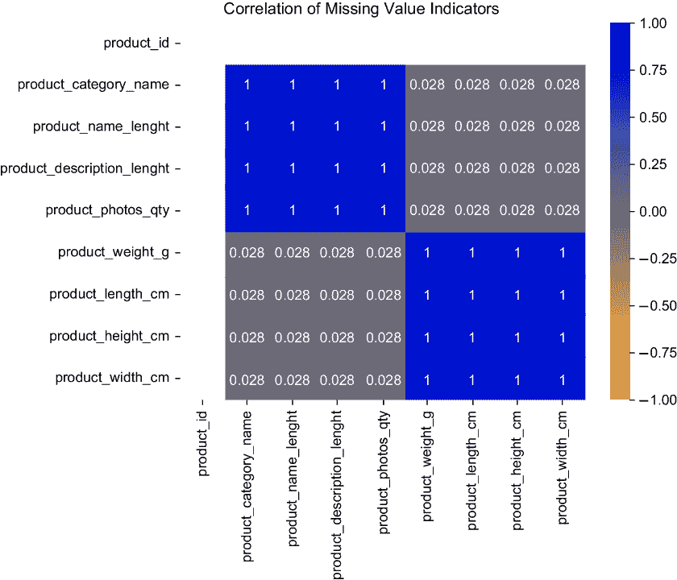
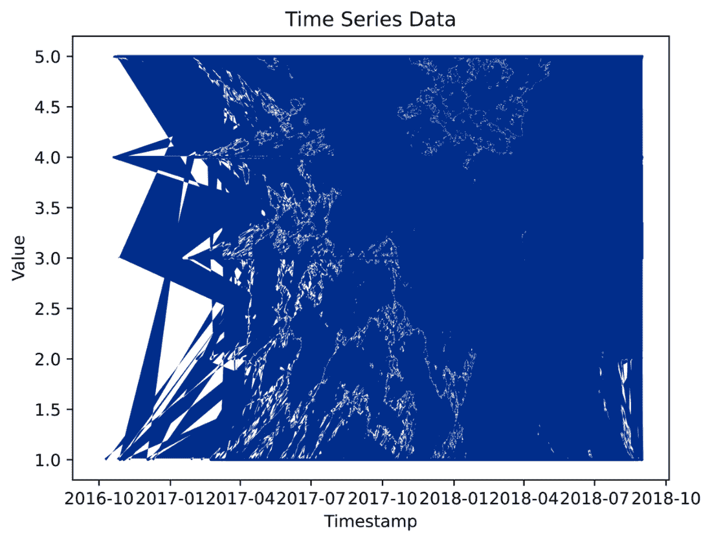
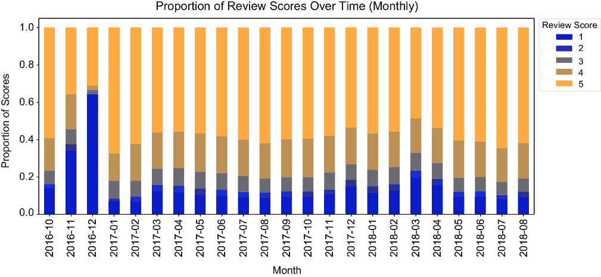

# 2 使用生成式 AI 确保足够的数据质量

### 本章涵盖

+   确保数据高质量的最佳实践

+   使用生成式 AI 准备数据清洗协议

+   评估数据内容质量

+   处理数据错误

+   调查不明确的数据

在 MS Excel 中，你可以在仅基于两个数据点的基础上计算样本的趋势线和标准差。显然，这样的“数据分析”是没有意义的。本章将帮助你将精力集中在你应该用数据做的事情上，而不仅仅是扩展你可以用它做的事情。它解释了进行任何分析所需的必要背景。你将了解最佳实践和不可协商的规则，确保你的结论与你要分析的商业活动相关，而不是与底层数据的缺陷相关。

你将发展一种结构化的质量评估和保证方法，清除你的数据中的杂质，识别盲点，并学会思考猜测缺失部分的好处和风险。最后，你将学会从新的角度看待收集到的数据——即其对于分析过程的有用性。

## 2.1 幸运的奇思妙想

想象一下，你把你的商业未来赌在掷硬币上。比如说，你赌的是反面。你掷了硬币，幸运的是，你得到了反面。你认为再次这样做是个好主意吗？我们绝对不希望如此。你一次得到了你赌的反面并不意味着你下次还会得到反面。

在经典逻辑中，从错误假设中得出的结论可以是真也可以是假。理解这一点至关重要，即你确实可以从一个错误的假设中得出一个*正确的结论*。我们将这样的结论称为*不可靠的结论*。这并不意味着你下次跟随那个错误的假设时就会正确。

回到我们的例子，假设你手里称了一个硬币，对自己说，“我要掷这个硬币。如果我得到反面，我下个月的客户数量将比这个月多。”你掷了硬币，得到了反面，下个月客户数量确实增加了。你认为这个假设，即硬币具有与你的商业成功相关的预测能力，是真的吗？可能不是。我们可以探讨心理学，自我信念对成功的影响，等等，但即使如此，也不是硬币带来了你的客户。是你的自我信念和辛勤工作。或者可能是运气。或者天气。或者聪明的营销策略。或者你的主要竞争对手的失误。或者……你明白这个意思。尽管如此，如果你相信硬币的预测能力，你将从错误的假设中得出正确的结论。

同样，基于错误假设（错误输入数据）进行的商业分析可能得出真或假的结论。无论分析多么复杂，低质量输入数据都会导致*不可靠*的结果，这里的关键词是*不可靠*。

假设你冒险对一个数据质量较差的分析进行了分析，并且它返回了“良好”的结果。你押注反面并且下个月获得了更多客户。这并不能证明这种方法是正确的。是的，这种情况确实会发生，但这并不意味着你的下一次结果会很好。就像抛硬币一样，你将得到正面或反面，你的下一次分析仍然会产生**不可靠**的结果。

在数据分析中，这个概念通常被称为“垃圾输入，垃圾输出”。你现在知道，“垃圾输出”并不意味着**不准确**的结果。它要危险得多。这意味着**不可靠**的结果。你押了 10 美元的硬币？那么 100 美元呢？你再次成功了？那是一辆车或一栋房子呢？

另一方面，如果你多次抛硬币并且每次都得到预期的反面，那么这枚硬币可能根本不是随机的。也许你的数据质量以及因此进行的分析对于你的目的来说已经足够**充分**了。

结果的**可靠性**在很大程度上取决于输入数据的质量。在许多情况下，我们试图避免对我们的建议过于绝对，因为通常有不止一种解决任何给定问题的方法。然而，如果你的分析要用于任何决策过程，你绝对不能接受低于最佳**可能**质量的数据。我们强调“可能”这个词是有原因的。在大多数现实世界的场景中，你不会有使用你希望的数据质量的奢侈。但你在这里做出的所有妥协都必须是自觉的，并且在评估最终结果的**可靠性**时必须考虑在内。

不幸的是，尽管有些营销声明，但没有一种万能的解决方案可以确保数据质量。为分析做好准备的最有效方法是仔细检查数据，并仔细考虑在特定业务背景下每个变量的含义。可能没有完全自动化这项任务的方法，但有一些技术和协议可以帮助你以结构化和系统化的方式接近数据评估和清理。

## 2.2 关于最佳实践的说明

让我们清理我们的数据吧！拿起你桌面上或项目仓库中的第一个数据文件，然后打开它。它是“干净”的吗？（如果你确实在桌面上保留数据文件，不妨和你的选择之一的人工智能进行一番关于数据管理和治理的热烈讨论。）

信任，但核实  如果你的数据是从告诉你它是“干净”的人那里获得的，问问自己一个问题——你是否足够信任这个人的数据技能和（不是“或”；具体是“和”）勤奋，以至于将你业务的成败建立在他们对数据“干净”含义的看法上？即使你信任他们，控制是数据世界中最高的信任形式：宁可信其有，不可信其无，三思而后行，等等。

如果你不确定你的数据是否干净，我们正在走上一条正确的道路。在你认为数据足够干净以进行分析之前，必须检查以下几个方面的内容：

+   *相关性*—数据应与特定业务问题或待解决的问题相关。不相关的数据可能导致混淆，并分散分析的焦点。

+   *准确性*—数据应该是正确的，无错误的，并且与其所代表的现实世界中的对象或事件一致。

+   *完整性*—所有*必需的*数据点都应存在。任何缺失或不完整的信息都应被识别并解决。同时，应避免虚假数据，以保持清晰。

+   *时效性*—数据应是最新的，并且与所分析的时期相关。过时的数据可能导致误导或不相关的见解。

+   *唯一性*—应识别并消除重复数据，以防止分析中的冗余和不准确性。

+   *一致性*—数据应在不同的来源、格式和系统中保持一致。不一致可能导致错误的结论或见解。

+   *完整性*—数据元素之间的关系应得到维护，确保在分析时数据是连贯且有意义的。

这看起来像很多工作，因为确实如此。你想要确保你的数据能够充分描述你正在分析的现实片段（前四点），并且其结构允许进行可靠的分析（最后三点）。

慢慢来，稳稳当当  数据质量不是可以轻易忽视的地方。你需要习惯系统地做事。许多数据专家声称，至少 80%的数据工作与数据清理和准备有关，这些过程相当缓慢。不幸的是，你可能会因为一个非常不愉快的反馈循环而被迫省略它。企业看不到分析的价值，因此要求更多。要求越多，时间压力就越大。时间压力越大，就越会走捷径（通常是在不会出现在最终报告中的领域，因此对业务赞助者来说要么是看不见的，要么是无用的）。走捷径越多，分析就越不可靠。分析越不可靠，后续的价值就越低。分析的价值越低……从一开始就做好事情将减少你在分析旅程中遇到的颠簸和故障，因为你的利益相关者会回来要求进行更符合他们观察到的现实的重复分析。

确保数据质量可能会让人感到害怕——没有一劳永逸的解决方案，走捷径可能导致不可靠的数据（因此结果也不可靠）。但仍有希望：良好的结构可以在有限的时间内引导你完成这个过程。知道要寻找什么，以及何时寻找，可以帮助你发现质量问题和评估它们对最终分析的影响。

## 2.3 开始

你还打开着你的数据文件吗？是的，就是你的桌面上的那个。没有？打开它。看看它。上下滚动，如果需要，左右滚动。试着了解你的数据。

你觉得自己看起来很傻吗？不如你试图解释为什么你把销售额加到实物产品数量上（是的，我们见过这种情况）。在一个理想的世界里，你会有一份丰富描述的元数据，解释所有列，包括预期的小数位数和编写解析从网络抓取文本的脚本的个人的名字（如果适用）。但很可能是，你不会。你将得到一个包含“地址”、“时间”和“销售额”列的文件，而确定这些地址是客户还是实体店铺的位置；销售额是以美元、欧元还是公吨计算；以及时间是订单或购买时间，或者可能是开发者留下的测试列，这些都得由你来解码。

我们将再次重复这一点。如果你在商业领域工作，并且对你从 IT 部门收到的变量的确切含义绝对、肯定不确定，不要假设。问！我们偶然分析了向一家跨国公司客户发送数千万条消息的服务效率。我们发现了一个非常罕见的现象，即已打开消息与接收消息的比例高于一。试图理解什么被**实际上**定义为接收消息，什么被**实际上**定义为打开消息，我们发现日志系统中的错误如此深刻，以至于之前关于消息效率的所有分析都毫无价值！我们无法过分强调业务与数据或 IT 团队之间紧密合作的重要性。

从粘土板到 AI，工具在变化，但数据中的混乱并没有变化。随着生成式 AI 的引入，发生变化的是你获取专家知识的方式，这可能会为你节省很多时间。它不会取代你的经验和理解数据的责任，但它可能会帮助你更快地了解它。

如果你已经阅读了可用的元数据，你仍需采取几个步骤，使这次初步检查成为结构化分析方法的组成部分。是什么步骤？我们可以告诉你，但这样这本书就不会是关于生成式 AI 的了，对吧？

我们希望你接受你的 AI 顾问是无尽耐心且完全无评判的。没有问题太简单而不值得问。“这个曲线叫什么名字……你知道，这个像山一样的？我如何从 DataFrame 中绘制两列？”坦白说，搜索自己的记忆有时比快速提问并运行提供的代码更耗时。

我们还希望你忘记“提示工程”。它有其位置，一些模型，如较小的 Llama 版本，对提示结构非常敏感。有时，将一个单词改为同义词可能会极大地改变模型对提示的理解。然而，我们假设你将使用一个足够理解语言上下文的生成式 AI，这样就不需要比在其他地方查找有关实际分析的相关信息更多的提示工程工作。

注意：如“关于本书”部分（在第一章之前）所述，我们主要使用 Python 环境来处理示例数据集。第七章将指导你如何使用生成式 AI 根据需要调整代码以适应你的环境。

让我们看看生成式 AI（在这种情况下，ChatGPT 4）如何处理一个类似“我迷路了，需要指导”的普通语言问题。

****我想进行数据分析。我已经将我的数据导入到 pandas DataFrame 中。我应该首先对它做什么？

****在将你的数据导入到 pandas DataFrame 之后，你应该首先探索并理解你的数据。你可以从以下步骤开始：

1.  检查 DataFrame 的前几行：

使用`head()`方法显示 DataFrame 的前几行。这将给你一个关于数据结构、列名以及每列包含的数据类型的快速概述。

```py
df.head()
```

1.  2. 检查 DataFrame 的形状：

使用`shape`属性获取 DataFrame 的维度（行和列）。

```py
df.shape
```

1.  3. 获取摘要统计信息和数据类型：

使用`info()`方法获取数据类型的摘要、非空值的数量和 DataFrame 的内存使用情况。

```py
df.info()
```

1.  4. 为数值列生成摘要统计信息：

使用`describe()`方法获取 DataFrame 中数值列的摘要统计信息。这将给你一个关于数值数据集中趋势和分散程度的直观感受。

```py
df.describe()
```

1.  5. 检查缺失值：

使用`isna()`方法与`sum()`方法结合，计算每列中缺失值的数量。

```py
df.isna().sum()
```

1.  6. 调查分类列：

对于分类列，你可以使用`value_counts()`方法获取唯一值的计数及其频率。

```py
df['column_name'].value_counts()
```

一旦你对你的数据有了更好的理解，你就可以进行数据清洗、预处理和分析。这可能包括处理缺失值、编码分类变量、特征工程以及其他基于你分析特定要求的任务。

在其第一句话中，我们的 AI 顾问同意了理解你的数据的重要性。仔细阅读模型答案的其余部分可能会揭示一些不太令人印象深刻的部分。有些步骤似乎重复了。例如，`df.isna().sum()`方法并没有提供`df.info()`（实际上还包括`df.shape`返回的信息）之前未提供的信息。

你需要决定你的优先级  在选择你将使用以达到目标的方法时，效率与可读性只是你必须做出的选择之一。当被询问时，生成式 AI 可以经常向你展示不同方法的优缺点。尽管如此，你需要意识到这些选择，有时需要明确请求特定的方法或解决方案，优先考虑一个特性而不是另一个。

尽管如此，整体答案非常好。就像古老的木匠谚语所说，量两次比一次好。我们赞赏 ChatGPT 在冗余方面的倾向。如果你有一个足够广泛的工具集，你很快就能选择最适合你分析风格的工具。如果你工具不足，你可能就会陷入黑暗。

总结来说，你需要检查以下内容：

1.  整体数据的“外观”。

1.  表的大小。

1.  每一列中的变量类型。快速检查应该会揭示是否存在不匹配的数据类型，例如用文本字符串代替数值或反之。

1.  对于数值列，基本统计信息，计数、平均值、极值等。

1.  每一列中缺失值的数量。这里有一个警告：一些数据天生稀疏。简单地计算列中的缺失值并不能提供关于数据完整性的明确答案；然而，如果你结合对数据含义的了解，它应该可以。

1.  每一列中唯一值的数量。

这应该会给你关于你正在处理的数据的良好直觉。

让我们加载我们的示例数据，这样我们就有东西可以分析了：由 Olist 提供的巴西电子商务公共数据集（[www.kaggle.com/datasets/olistbr/brazilian-ecommerce](http://www.kaggle.com/datasets/olistbr/brazilian-ecommerce)）。正如我们在前言中提到的，你需要使用一个免费的 Kaggle 账户。以下列表显示了用于加载数据的代码。（我们展示的执行分析所需的所有代码都可在我们的 GitHub 仓库[`github.com/mariansiwiak/Generative_AI_for_Data_Analytics`](https://github.com/mariansiwiak/Generative_AI_for_Data_Analytics)中找到。）

##### 列表 2.1 准备本章后续分析中的变量

```py
import pandas as pd

df_customers = pd.read_csv('olist_customers_dataset.csv')
df_order_items = pd.read_csv('olist_order_items_dataset.csv')
df_order_payments = pd.read_
csv('olist_order_payments_dataset.csv')
df_order_reviews = pd.read_csv('olist_order_reviews_dataset.csv')
df_orders = pd.read_csv('olist_orders_dataset.csv')
df_products = pd.read_csv('olist_products_dataset.csv')Jupyter
df_sellers = pd.read_csv('olist_sellers_dataset.csv')
df_product_category_translation = 
↪pd.read_csv('product_category_name_translation.csv')
```

作为下一步，我们将查看列表 2.1 中 DataFrame 的性质。不幸的是，这意味着要运行我们的生成式 AI 顾问提出的所有下载数据集的命令。这是一个你应该为导入的每一份数据培养的习惯。

你刚刚停止阅读并运行了所有 DataFrame 上的所有测试吗？让我们尝试在你心中培养一种健康的偏执。我们将分享一些令人震惊的发现，以向您展示查看数据摘要如何指向潜在问题。我们还将致力于识别解决方案。

在我们浏览示例数据中的数据结构时，我们发现两个有趣的观点：

+   `df_customers` DataFrame 中的客户数量和`df_orders` DataFrame 中的订单数量是相同的。有两种可能性。一种可能是每个客户，如系统所识别的，只购买了一次，另一种可能是我们得到了一个不完整的数据集。这两种可能性都与进一步分析有深远的影响。（99,441 行的数量是由为我们生成这个数据集的人任意设定的。在这种情况下，读取数据集的元数据会告诉我们这一点，但让我们假设它不可用。）

+   `df_customers` DataFrame 包含两个可疑地相似的列：`customer_id`和`customer_unique_id`。由于我们可能需要在其他 DataFrame 中分析客户属性，允许我们连接它们的列是`customer_id`。因此，这个列非常重要，我们应该停下来询问`customer_id`是否确实是客户的唯一标识。

正如我们提到的，并且会继续提到，不要忽视任何看起来不对的东西！你可以给提供数据的人发邮件询问问题，根据他们的工作量，你可以在几分钟或几个月内得到答案。

如果你不够熟练地掌握现有的分析环境，不要担心！只要你知道你想做什么，你就有生成式 AI 顾问帮助你确定如何操作。

****我有一个包含`customer_id`和`order_id`列的 pandas DataFrame。我如何快速检查每位客户是否只下了一单，或者是否有客户下了多单？

****你可以通过在`'customer_id'`列上使用`value_counts()`方法，然后检查最大计数，快速检查每位客户是否只下了一单，或者是否有客户下了多单。以下是一个例子：

```py
import pandas as pd

*# Sample DataFrame*
data = {'customer_id': [1, 2, 3, 4, 2],
        'order_id': [101, 102, 103, 104, 105]}

df = pd.DataFrame(data)

*# Count orders per customer*
order_counts = df['customer_id'].value_counts()

*# Check if any customer made more than one order*
if order_counts.max() > 1:
    print("There are customers with more than one order.")
else:
    print("Every customer made just one order.")
```

在这个例子中，`df['customer_id'].value_counts()`返回一个包含每个唯一`'customer_id'`的订单数量的 pandas `Series`。如果这个`Series`中的最大值大于 1，这意味着至少有一位客户下了多单。

生成式 AI 理解了我们想要达到的目标，并提出了我们可以根据我们的需求进行修改的代码，只需将测试的 DataFrame 名称替换为`df_orders`，就像我们在加载数据集时定义的那样。

你可以在我们放在仓库中的文件中检查结果。它显示，要么我们是从存在客户保留率最低的在线平台获取的数据（每个用户一次访问），要么 `df_orders` DataFrame 中的 `customer_id` 列存在问题。

我们之前提到，`df_customers` DataFrame 中的 `customer_id` 列旁边有一个 `customer_unique_id` 列，如果 `customer_id` 列构建正确，这似乎是多余的。接下来的对话将向你展示，与生成式 AI 一起工作确实不同于使用你以前遇到的任何其他软件。你所需要做的只是提供对需要解决的问题的简单语言解释。

**** 在我的包含客户数据的 DataFrame 中，我有两个列：`customer_id` 和 `customer_unique_id`。我该如何检查它们之间的关系以及哪个包含实际标识符？

**** 要检查 `customer_id` 和 `customer_unique_id` 列之间的关系以及哪个包含实际标识符，你可以分析每个列中值的唯一性和它们之间的关系。以下是一个使用 pandas 进行此操作的示例：

```py
import pandas as pd

*# Sample DataFrame*
data = {'customer_id': [1, 2, 3, 4, 5],
        'customer_unique_id': [1001, 1002, 1002, 1004, 1004]}

df = pd.DataFrame(data)

*# Check the number of unique values in each column*
unique_customer_ids = df['customer_id'].nunique()
unique_customer_unique_ids = df['customer_unique_id'].nunique()

print(f"Unique customer_id values: {unique_customer_ids}")
print(f"Unique customer_unique_id values: {unique_customer_unique_ids}")

*# Check the relationship between the two columns*
relationship = df.groupby('customer_unique_id')['customer_id'].nunique()

print("\nRelationship between customer_unique_id and customer_id:")
print(relationship)
```

在这个例子中，`df['customer_id'].nunique()` 和 `df['customer_unique_id'].nunique()` 返回每个列中独特值的数量。比较这些数字可以给你一个关于哪个列更有可能包含实际标识符的线索。

接下来，`df.groupby('customer_unique_id')['customer_id'].nunique()` 通过 `customer_unique_id` 列对 DataFrame 进行分组，并计算每个组中独特的 `customer_id` 值的数量。这将帮助你理解这两列之间的关系。

根据结果，你可以确定哪个列包含实际标识符以及它们是如何相关的。例如，如果 `customer_unique_id` 有较少的独特值，并且每个 `customer_unique_id` 映射到多个 `customer_id` 值，这可能表明 `customer_unique_id` 是实际标识符，而 `customer_id` 代表每个独特客户的多条记录或交易。

这是一个有趣的回答，主要是因为它没有暗示答案将是确定的！甚至有可能这些列中没有任何一个是有效的标识符（看，这就是在这个行业中产生偏执的方式）。这一点至关重要。不要对你从不确定来源收到的数据做出任何假设，即使你坚信逻辑表明某些值意味着一件事或另一件事。在九成的情况下，它将是你所期望的，但在那十分之一的情况下，你会在联系数据源并了解这个或那个变量*实际上*代表什么之后感谢我们。

回到我们的分析，生成的 `relationship` `Series` 太大，无法手动分析。这是关于与生成式 AI 合作的重要教训之一。如果结果不满意，不要满足于答案。抱怨！

**** 使用我的数据，你之前代码生成的 `relationship` `Series` 太长，无法手动检查。你能提出一种分析其内容的方法吗？

**** 当然！你可以通过生成 `relationship Series` 内容的总结来分析它，例如每个 `customer_unique_id` 的唯一 `customer_id` 值的最小值、最大值、平均值和计数。以下是如何做到这一点的示例：

```py
import pandas as pd

*# Sample DataFrame*
data = {'customer_id': [1, 2, 3, 4, 5, 6, 7],
        'customer_unique_id': [1001, 1002, 1002, 1004, 1004, 1001, 1004]}

df = pd.DataFrame(data)

*# Check the number of unique values in each column*
unique_customer_ids = df['customer_id'].nunique()
unique_customer_unique_ids = df['customer_unique_id'].nunique()

print(f"Unique customer_id values: {unique_customer_ids}")
print(f"Unique customer_unique_id values: {unique_customer_unique_ids}")

*# Check the relationship between the two columns*
relationship = df.groupby('customer_unique_id')['customer_id'].nunique()

print("\nSummary of the relationship between customer_unique_id and
↪customer_id:")
print(f"Min: {relationship.min()}")
print(f"Max: {relationship.max()}")
print(f"Mean: {relationship.mean()}")
print(f"Count of unique customer_id values per
↪customer_unique_id:\n{relationship.value_counts().sort_index()}")
```

在这个例子中，`customer_unique_id` 和 `customer_id` 列之间的关系总结包括每个 `customer_unique_id` 的唯一 `customer_id` 值的最小值、最大值和平均值。此外，`relationship.value_counts().sort_index()` 方法返回每个 `customer_unique_id` 的唯一 `customer_id` 值的计数，并按索引（即唯一 `customer_id` 值的数量）排序。

这个总结将帮助你更好地理解两个列之间的关系，而无需手动检查整个 `relationship Series`。

在我们运行生成式 AI 顾问建议的代码后，结果确实更容易消化：

```py
Unique customer_id values: 99441
Unique customer_unique_id values: 96096

Summary of the relationship between customer_unique_id and customer_id:
Min: 1
Max: 17
Mean: 1.0348089410589412
Count of unique customer_id values per customer_unique_id:
1     93099
2      2745
3       203
4        30
5         8
6         6
7         3
9         1
17        1
Name: customer_id, dtype: int64
```

看起来 `customer_id` 值在数据集中唯一地标识了 *记录*，而不是唯一地标识 *客户*。因此，`customer_unique_id` 更有可能作为客户标识符。在实际的商业环境中，我们的下一步将是与 IT 或其他相关部门核实，是否超过 93% 的客户在其一生中只下过一次订单，或者这确实是一个数据质量问题。目前，我们将按照数据本身的价值继续我们的分析。

这里的关键要点是，生成式 AI 可以帮助我们选择合适的分析方法。然而，我们还需要提出正确的问题，并在我们业务领域的背景下 *理解数据的含义*。

## 2.4 质量评估结构

我们现在应该知道手头的数据中编码了哪些信息，并且应该对其完整性有一个概述。

我们之前提到，你需要一种结构化的方法来确保足够的数据质量。在本章的介绍中，我们也强调了即使是分析中的“成功”结果也不能保证这种成功的可重复性。以下关于数据清洗和探索性数据分析的部分展示了这种质量评估的主要元素。这应该为你提供一个坚实的基础，你可以在此基础上构建适合你用例的结构。

### 2.4.1 数据清洗步骤

你可以将数据清洗比作在烹饪一顿饭之前准备原料。我们强烈建议不要直接将冰箱里的东西倒进烹饪锅。一位好厨师会检查原料，去除任何腐烂的部分，清洗以确保清洁，并切成均匀的大小以便均匀烹饪。同样，数据清洗涉及检查数据集的不准确或不一致之处，移除或纠正这些元素，并确保数据格式统一。这一准备步骤对于确保最终菜肴（或分析结果）高质量且无任何可能损害其风味（或完整性）的元素至关重要。我们多次强调，分析不干净的数据可能导致不可靠的结论。与烹饪的比较就是为了说明这一点。用未准备好的原料烹饪，你可以得到可以食用的东西；我们只是不建议你在想给约会对象留下深刻印象时采用这种方法。

为了确保你的数据在技术上干净，你应该做以下事情：

1.  删除重复项。

1.  处理缺失值。

1.  纠正数据输入错误。

1.  验证数据。

这些步骤应确保你的表格包含描述业务流程的数据点，而不是数据收集和准备过程中的遗迹。下一阶段应使你对数据的含义有更好的理解。

### 2.4.2 探索性数据分析元素

到目前为止，你的数据或菜肴原料已经过筛选和清洗。继续使用烹饪类比，探索性数据分析（EDA）可以比作品尝和调味原料。你的番茄是新鲜且成熟的，还是经过半个世界的冷冻运输，仍然硬得可以用来打棒球？你的变量是否具有许多算法所需的正态分布，或者它是偏斜的？就像你在不同阶段品尝菜肴，调整香料和原料以平衡风味和质地一样，EDA 通过各种分析和可视化技术来检查数据集，以了解其特征、趋势和异常值。这个过程允许你像调味一样调整你的分析方法，以确保结果平衡且美味。EDA 是感受数据的“风味轮廓”，识别哪些原料（变量）搭配得很好，预测最终菜肴（分析）可能的结果，并在必要时进行调整以获得最佳结果。

你应该为所有你接触到的数据采用的 EDA 基本结构可能看起来像这样：

1.  *变量分布测试*—数据样本的特征是什么，例如均值、标准差、范围等？

1.  *变量可视化*—你能从数据的视觉表示中读出什么？

1.  *数据含义澄清*—数据是否代表你所认为的含义？

1.  *数据映射和协调*—所有数据点是否使用相同的单位进行采样，以及标题是否使用标准化的描述词汇？

有些人会在 EDA 中添加额外的步骤，比如相关性测试或文本分析。其他人也会添加特征工程。根据你的数据，他们的方法可能更适合你的需求。

##### 星期天的另一种方式

我们认为并不存在一种通用的、万能的、万能的数据准备协议。我们相信将导致高质量数据的通用框架如下：

+   理解你的数据与现实之间的关系（每个变量的含义以及它是如何生成的）。

+   确保数据符合一些基本的技术标准（即你正在处理所有可用的*相关*数据点，并在需要时可以在数据源之间进行交叉关联）。

+   在你使用数据分析现实之前，先分析数据本身（确保它符合基于专业知识或常识的预期）。

在以下章节中，我们将通过一个示例来演示，并确保数据描述的是基于现实的现象。

## 2.5 数据清理

数据清理必须尽早进行，因为由于数据表示、一致性或完整性的错误导致的错误是持续的，并且会迅速累积。不干净的数据可能会误导其他数据准备和评估步骤，以及你的分析结果。

让我们重复一遍：我们不认为有唯一最佳的数据清理或执行 EDA 的方法。在你的工作中，你可能会遇到数据清理协议，包括我们描述为 EDA 部分的内容，反之亦然。你可能会得到一个包含我们认为是分析的步骤的协议。如果这些协议是由该领域的专家准备的，那么它们可能更适合它们设计的数据类型。要灵活。只需确保你了解正在发生的事情。

顺序很重要  某些清理步骤可能会掩盖错误，尤其是在准备工作阶段。了解每一步之后事物如何变化非常重要。例如，如果你用某一列的平均值填充缺失数据，那么在删除重复项之前你不能这样做。

我们将假设这个练习的最坏情况。那就是你不确定从你的数据中可以期待什么的情况。

### 2.5.1 删除重复项

重复记录可以以多种方式悄悄进入你的数据。从数据录入错误（人为错误）和系统故障（软件错误）到设计不良的标识符（人为错误），再到分布式系统中的同步问题（软件错误），到合并数据集时的错误，到导入问题……等等。由于可能出现这么多问题，其中一些很可能真的会发生。坦白说，我们还在等待看到没有经过先前整理以供分享的、没有重复项的数据集。

你如何有效地消除重复记录，以避免过度表示某些数据点，这可能会歪曲分析结果？这取决于你的分析环境。你需要记住细节吗？当然不需要！

****如何从 DataFrame 中删除重复项？

****要从 DataFrame 中删除重复项，可以使用 `drop_duplicates()` 方法。默认情况下，它在识别重复项时考虑所有列，并保留重复行的第一个出现。以下是一个示例：

```py
import pandas as pd

*# Sample DataFrame with duplicate rows*
data = {'A': [1, 2, 2, 4, 5, 1],
        'B': [6, 7, 7, 9, 10, 6]}

df = pd.DataFrame(data)

*# Remove duplicate rows*
df_no_duplicates = df.drop_duplicates()

print("Original DataFrame:")
print(df)

print("\nDataFrame without duplicates:")
print(df_no_duplicates)
```

如果你想要根据一组特定的列删除重复项，可以使用 `subset` 参数：

```py
*# Remove duplicates based on column 'A'*
df_no_duplicates = df.drop_duplicates(subset=['A'])

print("\nDataFrame without duplicates based on column 'A':")
print(df_no_duplicates)
```

在这个例子中，`df.drop_duplicates(subset=['A'])` 根据列 `A` 中的值删除重复行，同时保留每个重复行的第一个出现。

这个答案在技术上正确，并且在正常情况下是足够的。

效率可能不是首要任务，或者它可能……根据你的生成式 AI 的具体细节，它可能会考虑答案的简单性，而不是解决方案的资源效率。引用 Grace Hopper 的话，*这是一个特性，而不是错误*。第五章描述了使用即使是通用知识生成式 AI 优化代码的方法。

在我们这个例子中，答案足够了（因为我们一开始就没有任何重复项），所以我们可以自豪地勾选这个框，继续下一步。

### 2.5.2 处理缺失值

我们将重复我们之前发出的警告：一些数据*确实是稀疏的*。然而，缺失数据条目可能的原因列表至少与重复项一样长。数据输入错误、传感器故障、复制错误、集成错误，等等。最后，还有信息不可用。

根据上下文和缺失数据的数量，你可以选择删除不完整的数据条目或变量（表格格式中的行或列），忽略它，或者以某种方式填充缺失值。你可以用默认值、估计值（如平均值、中位数或众数）填充空字段，或者使用插值方法。然而，重要的是，要根据数据的意义和重要性有意识地做出这些决定。最近有一个著名宏观经济学家通过从相邻单元格复制来填充一些国家的缺失数据的情况。在这种情况下，数据集是按国家名称字母顺序排序的，这导致这种方法做出了完全不合逻辑的调整。

决定如何处理缺失值的关键是基于理解为什么值缺失。例如，这是否是由于传感器系统错误导致测量失败？或者是因为记录结果时系统出错？是在将多个数据源连接在一起时出错吗？为了决定如何处理缺失值，你应该首先查看数据。

在我们的示例数据中，我们应该注意到三个数据框，其中某些列的非空值数量与行数不同（这意味着不仅仅是空列）。这些是`df_orders`、`df_order_reviews`和`df_products`。

在`df_orders`数据框中，我们注意到一些审批和交付日期缺失。我们将在第 2.6 节中使用这个数据框来分析数据所描述的底层过程以及订单状态与缺失日期之间的关系。

在`df_products`的情况下，我们缺少一些类别名称、相同数量的产品名称、描述长度和图片，以及一些产品尺寸数据。让我们看看我们能否通过查看某些值缺失的产品来说明一些问题。

有 611 行数据缺失，手动分析和处理将是一项繁琐的工作，如果我们处理的是 6,111 行或 61,111 行，那就变得不可行。我们该如何自动化这个过程呢？让我们先调查一下不同列中缺失值的数量是否是偶然的，或者是否存在某种结构。

这里有一个关于与生成式 AI 合作的教训。如果你对自己的数据有疑问，但又不确定如何精确表达，那就不要说了。我们的意思是，不要精确地表达出来。简单地尽可能清楚地表达出来。

****在我的数据框中，我有缺失值。看起来某些列中缺失值的数量似乎相关。我该如何检查缺失值是否形成某种模式？

****你可以通过分析不同列中缺失值的共现情况来检查缺失值是否形成某种模式。为此，你可以使用 pandas 创建一个数据框，指示哪些值缺失，然后计算这些二元指标之间的相关性。以下是一个示例：

```py
import pandas as pd
import seaborn as sns
import matplotlib.pyplot as plt

*# Sample DataFrame with missing values*
data = {'A': [1, None, 3, 4, None],
        'B': [1, 2, None, 4, None],
        'C': [None, 2, 3, None, 5],
        'D': [1, 2, 3, 4, 5]}

vdf = pd.DataFrame(data)

*# Create a DataFrame indicating which values are missing*
missing_indicator = df.isna()

*# Compute the correlation between the missing value indicators*
missing_corr = missing_indicator.corr()

*# Visualize the correlation matrix using a heatmap*
sns.heatmap(missing_corr, annot=True, cmap='coolwarm', vmin=-1, vmax=1)
plt.title("Correlation of Missing Value Indicators")
plt.show()
```

在这个例子中，`df.isna()`返回一个与`df`形状相同的数据框，其中每个元素都是一个布尔值，表示`df`中相应的元素是否缺失（`True`）或未缺失（`False`）。

`missing_indicator.corr()`计算缺失值指标列之间的成对相关性。结果的相关矩阵表示不同列中缺失值之间的相关性。高正相关值表明，相应列中的缺失值倾向于同时出现。

最后，使用 Seaborn 库的热图可视化相关矩阵。这个热图可以帮助你快速识别缺失值中的模式，例如，某些列中的缺失值是否倾向于与其他列中的缺失值同时出现。

这次，我们得到了一些真正的重型武器，包括可视化库。熟练的视觉化是数据分析中最重要技能之一，你不应该害羞地依赖你的生成式 AI 顾问为你提供所需的工具。

一图胜千言  如果你想了解更多关于适当可视化对统计分析重要性的信息，我们强烈推荐爱德华·图夫特教授的不朽书籍。他的《视觉解释：图像与数量，证据与叙事》（Graphics Press，1997）和《定量信息的视觉表示》（Graphics Press，1997）是优秀的视觉交流的圣经，不受技术限制。

图 2.1 显示了由生成式 AI 提出的一种分析结果。虽然可以进行许多类型的分析，但大多数步骤将是相似的，所以我们只使用这个作为例子。



##### 图 2.1 不同列中缺失值的相关性

我们可以看到，一些产品在`product_category _name`、`product_name_lenght`和`product_photos_qty`列中，或者`product_weight_g`、`product_length_cm`、`product_height_cm`和`product_width_cm`列中都有缺失值。这意味着一些产品可能是无重量和尺寸的（可能是服务？）或者它们没有任何类别、产品名称或照片（想到一个神秘盒子）。

注释  注释变量名`product_name_lenght`中的错误是为了与原始数据集中的命名保持一致。

当我们在数据集中寻找除了`product_id`之外所有列都为空的行时，我们只找到了一行：`product_id 5eb564652db742ff8f28759cd8 d2652a`。正如我们之前讨论的，在决定是否删除或保留这样的项目之前，我们应该检查背后这种异常的业务或数据收集过程。

欺诈检测和法医分析超出了本书的范围，但鉴于我们试图在你心中灌输一点专业性的偏执，我们不能完全忽视这个案例迫切需要调查的事实。如果我们调查这样的案例，我们首先会检查最简单的解释：有人玩弄数据库而没有清理。在这种情况下，这个`product_id`应该只出现在这个单一表中。然而，这个有问题的`product_id`似乎与一个订单有关。如果可能的话，我们会尝试找到该产品的网站，看看它是否是一个服务（不太可能，因为只有一个这样的案例）。如果我们特别好奇，我们会检查这个卖家的其他交易，特别是与同一买家的交易。简而言之，我们会试图理解实际事件和描述它的数据的预期形状。从那里，我们会尝试确定错误如何在数据中发生（如果它确实是一个错误而不是一个非典型但合法的情况）。

不幸的是，我们现在需要摘下我们的福尔摩斯帽子，回到处理一个更为普遍、尽管不那么令人兴奋的问题类别。

### 2.5.3 纠正数据录入错误

“华盛顿”和“华盛顿特区”是同一件事吗？或者，一个通过只输入“SD”来节省宝贵时间的员工，心里想的是“发货延迟”还是“标准交付”？在你的工作中，你会遇到多种数据输入错误类型，如拼写错误、标签错误或不一致的格式，所有这些都对数据集的质量产生负面影响。你需要识别和纠正这些错误，以确保数据的准确性和一致性。

这是数据准备中最艰难且最难以自动化的部分之一。不幸的是，你可以用来搜索此类错误的最佳工具是生物的而不是数字的。在我们撰写这本书的时候，没有什么能比得上老式的肉眼检查。第 2.1 节中描述的一些方法可以帮助识别异常。例如，`df['column_name'].value_counts()`可以帮助你发现只发生一次的值，如果你期望均匀分布，这可能是有疑虑的。然而，检测和纠正数据输入错误需要这些技术的组合，以及领域知识和人工检查。

我们想要指出的具体数据输入错误分析类型是异常值检测和处理。*异常值*是显著偏离其余数据集的数据点（例如，当一组中的几乎所有交易都来自纽约时，突然有一个来自洛杉矶）。识别和处理异常值非常重要，因为它们可能会不成比例地影响分析结果。或者，它们可以表明数据点具有极端的重要性。根据上下文，异常值可以被接受、移除、限制或转换。

### 2.5.4 数据验证

你真的不希望在你的表格的日期列中找到像“上周二中午左右”或“那是一个美丽的春天早晨”这样的条目。验证数据确保数据符合特定的规则或约束，如数据类型、值范围或列之间的关系。这对于维护数据完整性和避免可能导致错误结论的不一致性至关重要。

如果这看起来像是一项大量工作，那是因为确实如此。好消息是，这又是一个让你深入了解分析数据的机会，而且这是你无法伪造的。

验证数据有四个步骤：

1.  为你的数据定义期望值。

1.  检查是否有任何数据点不符合你的预期。

1.  如果有，就采取行动。

1.  检查来自多个表的数据的一致性。

预期值的详细信息将因数据集而异。没有普遍的规则来确定预期值与意外值；这就是你的领域知识发挥作用的地方。然而，你必须记住，偏离预期的数据点可能表明数据收集中的错误（值得调查）或对你业务具有重大重要性的事件（绝对值得调查）。为了给你一个起点，我们将概述在验证数据时应考虑的三个基本领域。

#### 事先验证规则和约束定义

我们提到，在运行分析之前应该定义整个分析协议，以避免不得不“调整”分析以更好地符合预期。

验证规则和约束条件确实必须在事先定义。如果你像我们在 2.3 节开头建议的那样翻阅了文件，你应该对数据中变量的结构和分布有一个或多或少清晰的认识。你也应该足够了解你的领域和相关数据，以便知道哪些值是典型和预期的。假设你不知道变量确切的可接受边界值。在这种情况下，你应该能够用平均值的偏差、百分位数、蝉鸣声、马的长短或其他适用于你数据的任何东西来表述你的期望。

现在，让我们暂时放下我们的高姿态。数据质量保证确实是一个迭代的过程。我们将执行探索性数据分析（EDA），我们可能会发现我们在初步分析后做出的某些假设并没有充分依据，我们的直觉把我们引入歧途。在这种情况下，我们将回去纠正我们的验证规则，以更好地区分有价值的数据和潜在的人工制品。

#### 数据类型

为你的变量分配正确的数据类型将使你在以后的生活中更加轻松，因为许多库使得对具有良好定义类型（尤其是数值类型）的列进行操作变得容易和高效。一般来说，如果你想执行像`111-11`这样的操作，你希望得到`100`，而不是`1`或系统错误（正如我们将在整本书中重复的那样，后者会更可取）。

当查看由`df_name.dtype`或通过调用`df_name.info()`方法揭示的示例 DataFrame 属性时，你应该注意到 pandas 成功推导出了数值列的类型。然而，它将通用*对象*类型分配给了包含日期的列。

在编程中，时间表示远非简单直接。有无数种方法和格式来记录看似简单的时间戳，反映了时区、日历系统和编码标准的复杂性。在 Python 中，由于这些复杂性，没有单一的“日期”类型。相反，对于我们的数据集，我们发现最合适的格式是`datetime64ns`，它提供了精确到纳秒的时间戳：

```py
df_name['column_name'] = df_name.column_name.astype('datetime64[ns]')
```

分析从文本中读取不同时间格式的分析方法可能超出了本书的范围，但肯定不会超出你的 GenAI 顾问的知识范围！如有疑问，请提供你的数据示例，并询问生成式 AI 如何将其转换为你在管道中使用的格式。

#### 列之间的关系

我们提到我们看到了销售量被添加到实物量中。你认为这是怎么发生的？如果你与来自不同数据源的多 DataFrame 一起工作，这一点至关重要。盲目地相信相同的列名意味着两个列描述的是同一件事，可能会很容易地使你的分析失去任何功能性价值。

在开始编写（或复制）交叉引用函数之前，你应该清楚了解哪些 DataFrame 将作为参考——所谓的主键来源——以及哪些 DataFrame 将包含外键——意味着这些值引用现有的主键。这样，你将创建一个 DataFrame 的谱系。

如果你有一个包含所有客户数据的 DataFrame，他们的标识符就成为了主键。假设你还有一个描述某个时间范围内订单的 DataFrame，并且它包含有关哪个客户下了订单的信息；所有这些客户的标识符都将存在于客户 DataFrame 中。然而，有可能参考数据集中的某些客户在所考虑的时间段内没有下任何订单，因此他们不需要全部出现在订单 DataFrame 中。

你可以使用以下代码来识别`df_orders`和`df_order_payments`中键的问题。

##### 列表 2.2 识别外键违规

```py
foreign_key_violations = 
↪df_orders[~df_orders['order_id'].isin(df_order_payments['order_id'])]
if not foreign_key_violations.empty:
    print("Foreign key violations found:")
    print(foreign_key_violations)
 *# Handle violations (e.g., drop rows or correct the foreign key values)*
```

在我们使用这个示例数据集的工作过程中，我们已经发现`customer_id`存在问题，因此`df_orders`和`df_customers`之间的关系出乎意料地是 1:1，但在检查`df_orders`与`df_order_payments`时，我们可以看到预期的行为，即`order_id`在`df_orders`中是主键，在`df_order_payments`中是外键。存在一个违规行为，但我们将其留给你作为练习。

再次强调，有一个因果关系的问题，你应该作为一个分析师来识别。这意味着确定意外数据结构的实际原因。你提出的任何解释都应该与数据创建者进行确认。当然，有时你确认事物的能力可能有限，你可能需要依靠交叉引用所有 DataFrame 并检查标识符列中是否存在逻辑模式。尽管如此，在你没有 100%确定数据含义的情况下工作的情况下，你应该清楚地与你的利益相关者沟通分析在未经确认的数据集上执行的风险。

我们现在应该已经对我们的数据进行充分清洗。通过进行彻底的数据清洗，您提高从数据分析中获得可靠和准确见解的可能性。一个干净的数据集是数据预处理、EDA 和建模后续阶段的强大基础。

我们在这本书中使用的数据集是以建模就绪的状态提供的，因此不需要额外的清洗或预处理，所以我们将直接进入 EDA。在您的工作中，您不应该如此匆忙！

## 2.6 探索性数据分析

现在数据已经被切割和分解，是时候加入一些调味料了，主要是作为数据分析师的您。在大多数情况下，您的利益相关者将需要简单的分析，并且他们对想要的视觉化有强烈的意见。您可能会惊讶地发现他们经常拒绝前沿的交互式、闪亮的、闪烁的和发光的工具，并要求传统的静态图表。这并没有什么不妥。您的角色是确保他们的决策是有信息的。如果他们获取所需信息的方式是通过一种类型的图表或另一种，您在大多数情况下应该尊重这一点。然而，当您意识到某些其他数据展示方式引入了新的和必需的信息时，您需要坚定立场。选择您的战斗。

为什么我们在这里讨论可视化类型？因为您将在 EDA 的过程中获得许多有用的图表。在这个阶段正确地进行这些操作（这意味着它们对您的利益相关者有用）可以节省您以后的时间和精力。在本节中，您将找到一些此类有用图表的示例。

在我们看来，EDA 是区分优秀分析师的过程。它是一种艺术形式，将数据的含义与其结构联系起来。在 EDA 中，您将结合统计学、领域知识和可视化。（您可以使用您的新可视化玩具，但如果您希望您的利益相关者采用它们，请确保您有时向他们展示您所使用的工具——诱使他们通常比强迫他们吞下东西更有效。）

这种所需知识的混合可能看起来令人畏惧，但您现在可以访问一个多学科知识的绝佳来源。让我们询问关于包含订单评论的 DataFrame 的生成式 AI，它恰当地命名为 `df_order_reviews`，因为它具有有趣的数字、文本和日期的组合。

****请为以下 DataFrame 提出 EDA 技巧：

```py
DataFrame name: df_order_reviews

Columns:
- review_id (object): 
↪Unique identifier of each review.
- order_id (object): 
↪Identifier of the order being reviewed.
- review_score (int64): 
↪Note ranging from 1 to 5 given by the customer on a satisfaction survey.
- review_comment_title (object): 
↪Comment title from the review left by the customer in Portuguese.
- review_comment_message (object): 
↪Comment message from the review left by the customer in Portuguese.
- review_creation_date (datetime64[ns]): 
↪The timestamp of the review creation.
- review_answer_timestamp  (datetime64[ns]): 
↪I am not sure what this one actually is.
```

****基于提供的 DataFrame 结构和内容，以下是一些 EDA 技巧，以更好地理解和分析您的 `df_order_reviews` DataFrame：

1.  基本数据概述：使用 `.head()`、`.tail()`、`.info()` 和 `.describe()` 获取 DataFrame 内容和结构的初步了解。

1.  缺失值分析：使用 `.isna().sum()` 检查每一列中的缺失值，并决定如何处理它们（删除、填充或插补）。

1.  审查分数分布：使用`.value_counts()`或直方图来可视化审查分数的分布。

```py
df_order_reviews['review_score'].value_counts().sort_index()
↪.plot(kind='bar')
```

1.  4. 随时间推移的审查：使用`review_creation_date`列绘制随时间创建的审查数量。这可以帮助你识别审查数据中的趋势和模式。

```py
df_order_reviews['review_creation_date'].dt.to_period('M').
value_counts().sort_index().plot(kind='bar')
```

1.  5. 审查响应时间：通过从`review_creation_date`中减去`review_answer_timestamp`来计算每个审查的响应时间。分析响应时间的分布，并调查响应时间与审查分数之间是否存在关系。

```py
df_order_reviews['response_time'] = 
↪df_order_reviews['review_answer_timestamp'] -
↪df_order_reviews['review_creation_date']
```

1.  6. 文本分析：探索`review_comment_title`和`review_comment_message`列中的文本数据。你可以执行情感分析、主题建模或词频分析，以识别审查中提到的常见主题、模式或问题。

1.  7. 调查不明确的列：为了理解`review_answer_timestamp`列，你可以分析它与其他列的关系，例如`review_creation_date`或`review_score`。绘制散点图、计算相关性或执行其他统计测试可以帮助你确定此列的目的。

1.  8. 具有多个审查的订单：检查是否存在具有多个审查的订单。这可能会表明数据输入错误或提供对审查过程的见解。

```py
order_review_counts = df_order_reviews['order_id'].value_counts()
multiple_review_orders = order_review_counts[order_review_counts > 1]
```

这些 EDA 技术可以帮助你更好地理解`df_order_reviews`数据框，并识别数据中的模式、趋势和潜在问题。根据你的具体目标和领域知识，你可能需要调整或扩展这些技术以满足你的需求。

上述答案来自 ChatGPT-v4，因为它是最全面的。它制定了一个坚实的 EDA 计划，一次涉及多个主题。它展示了不同分析层次之间的重叠。你看到我们在数据清理阶段执行的一些步骤并不奇怪。在我们看来，其他步骤是数据分析本身的元素。正如我们提到的，没有 EDA 的黄金标准，生成式 AI 通常提供最广泛的答案。

### 2.6.1 审查分数分布

让我们暂时回到我们的抛硬币赌博问题。如果你还记得，在本章开头，我们说，“……如果你多次抛硬币并且每次都得到预期的反面，那么这枚硬币可能根本不是随机的。”在投注硬币之前，你绝对应该检查结果分布。如果它是真的随机，你很可能根本不应该投注它，但如果它不是随机的，你可以利用它来获得优势。你可以像测试多维硬币一样思考审查分数分布。

分数分布的重要性不容忽视，因为分布分析可以揭示可能影响研究有效性的潜在问题，例如数据输入错误或偏差。通过直方图、箱线图或密度图可视化分布还可以帮助确定数据是否遵循特定模式或符合已知的统计分布。这种知识可以帮助你选择合适的统计测试、预测模型或数据转换技术，以确保准确可靠的结果。

检查分布通常涉及将观察到的数据分布与理论分布（例如，正态、指数或二项）进行比较，以评估数据与预期模式的一致性。你有多种分布测试方法可供选择，包括使用直方图或 Q-Q 图进行视觉检查，或更量化的指标，如 Kolmogorov-Smirnov 测试、用于正态性的 Shapiro-Wilk 测试或 Anderson-Darling 测试。每种方法都有其优势和特点，根据数据集的大小和愿意做出的假设，其适用性有所不同。

如果这个任务看起来很复杂，那是因为它曾经是这样的。现在它就像输入以下内容一样简单：

****我该如何测试我的数据集最适合哪种分布？

如果你需要一个更具体的答案，你可以添加有关你的分析环境、数据源或你想要检验的直觉的详细信息（注意，我们没有使用“证实”这个词）。根据我们的经验，ChatGPT-4 在统计能力上优于其他所有工具。

让我们看看一些流行的分布以及你可能在哪些地方期望它们。常见分布的形状在图 2.2 中展示。


##### 图 2.2 常见的数据分布

#### 正态分布

正态分布也称为高斯分布或“钟形曲线”。由于中心极限定理，它通常是连续数据的第一个假设，该定理认为，足够大数量的独立随机变量的平均值，每个随机变量都有有限的平均值和方差，将大致呈正态分布，无论其基本分布如何。但要注意，一些统计测试高度依赖于数据分布的正态性假设。如果你的数据是偏斜的，你的测试结果可能会受到影响。

正态分布对于销售数字、个人身高和测量误差等指标特别相关。

#### 二项分布

二项分布用于数据中的二元结果，如抛硬币。当处理成功/失败、是/否或 1/0 类型的结果时，例如 A/B 测试中的转化率、质量控制中的通过/失败率或在线广告中的点击率，这种分布是相关的。

在二项分布图中看到超过两个条形图常常会导致混淆，所以让我们立即消除这种困惑。二项分布描述了在固定数量的独立伯努利试验中成功的次数，每个试验的成功概率相同。当你看到超过两个箱子的二项分布时，它并不只代表一个试验（这将只产生两种结果：成功或失败，1 或 0）。相反，它代表多个试验的结果，因此可以有超过两个箱子。

例如，假设你分析了*n*=10 个不同试验的二项分布。在这种情况下，分布不仅显示两种结果，还显示了在 10 次试验中实现 0、1、2、...，直到 10 次成功的概率。在这个背景下，“条形”代表成功的次数：一个条形代表 0 次成功，另一个条形代表 1 次成功，以此类推，直到 10 次成功。所以虽然每个单独的试验都有二元结果，但

多个试验的汇总结果可以从 0 次成功（全部失败）到*n*次成功（全部成功）不等，导致*n*+1 种可能的结果。因此，分布表示中的条形数量。

#### 均匀分布

均匀分布假设所有结果的可能性相同。它通常是模拟或建模无偏随机变量（如随机数字、等概率场景的模拟或没有先验信息时）的起始假设。

虽然这种分布在实际业务数据中不太常见，但值得记住。

#### 泊松分布

泊松分布适用于计数数据，其中事件在空间或时间上以恒定的速率独立发生。它通常用于模拟在固定时间或空间间隔内事件发生的次数。

你可能会在分析每小时客户到达次数、产品的日需求量或系统的故障次数时遇到这种分布。

#### 指数分布

指数分布通常用于模拟泊松过程中的事件之间的时间，表示事件发生的时间。

在处理机器在故障前的工作寿命、客户下一次购买的时间或排队系统中的到达时间间隔时寻找这种分布。

#### 对数正态分布

对数正态分布在处理许多独立随机变量的乘积变量时发挥作用。当数据不能为负且分布右偏时使用。

你会在涉及股票或房地产价格或收入分布的数据集中遇到这种分布。

#### 贝塔分布

贝塔分布用于建模两侧有界的变量，如比例和百分比。它灵活且可以假设多种形状，使其适合于建模限制在区间内的随机变量的行为。

这种分布出现在数据表示转换率，其值介于 0 和 1 之间时。

#### 伽马分布

伽马分布与指数分布相关，并且对于建模泊松过程中的第*n*个事件的等待时间很有用。

当你建模诸如水库中积累的降雨量、系统中的服务时间或系统在连续尺度上的可靠性等事物时，你需要使用伽马分布。

注意：能否使用多模态生成式 AI 从图表中识别分布类型？在撰写本书时，还不能。我们尝试将图 2.2 的部分内容输入到不同的生成式 AI 中，它们的答案往往像误导一样多样化。然而，生成式 AI 仍然可以指导你通过适当的测试程序。

### 2.6.2 时间序列探索

现在我们进入了一个灰色地带。你可能会遇到关于将分析随时间的变化作为 EDA 的一部分或作为深入分析本身的讨论。一方面，可视化所有时间序列是 EDA 的一部分。有时这会让你能够识别出需要清理的异常值或错误。另一方面，这些异常值可能编码了业务流程中的重大问题或事件。

我们得出结论，区分 EDA 和深入业务分析是一种错误的对立。EDA 确实是深入分析的一个组成部分。这不是你希望别人为你做的事情。EDA 也不是一次性的活动——你将不时地回到它。

从流程管理角度来看，当与评估数据的技术和结构属性相关的步骤与发现与业务相关的见解相关的步骤分开时，情况更清晰。然而，这两个方面过于紧密相关，不能完全分开。

我们建议在第一次 EDA 迭代时运行两个测试。首先，我们将可视化并查看数据以寻找异常值；其次，我们将执行周期性检测。

#### 响应数量的变化：快速数据可视化

我们看到过这样的情况，一个项目被归功于成功，实际上是由整体市场变化或另一个业务功能的性能所引起的。仔细观察不同变量随时间的变化确实可以提供非常有价值的信息！

这是一个非常基础但重要的任务，应该在大多数与数据相关的变量上执行。大多数商业活动具有连续性，分析它们随时间的变化对于理解这些活动至关重要。

图 2.3 展示了我们数据集中每月记录的评论数量。我们可以清楚地看到三个不同的阶段。第一个阶段从 2016 年 10 月持续到 2017 年 1 月。几乎不存在的评论数量表明，业务运营或评论收集系统可能刚刚开始起步。然后，从 2017 年 2 月到 2017 年 11 月（或 2018 年 5 月），我们可以看到每月收集的评论数量快速增长阶段。然后，从 2017 年 12 月开始，系统稳定并开始波动，或者从 2018 年 6 月开始，它在 2018 年 8 月经历了一次崩溃和反弹。


##### 图 2.3 评论数量随时间变化——按月汇总

如果我们要定量比较不同时间点涉及评论数量的指标，这些信息可能是至关重要的。现在我们已经检查了评论数量，让我们继续检查与评论相关的分数。

#### 随时间变化的评论分数变化

一些数据预计将是周期性的，而其他数据则不是那么明显。发现和描述数据中的周期可以帮助你确定你提供的数据集是否与解释相关业务流程相关。

我们与 AI 顾问的以下对话记录证明了第一章中关于将生成式 AI 直接嵌入到分析管道中并以射击和忘记的方式进行限制的观点。

****我该如何检测数据中的内部周期性？

****检测数据中的内部周期性涉及识别随时间重复出现的模式或周期性波动。时间序列数据是可能存在周期性的常见例子。以下是一些检测数据中周期性的技术：

1.  视觉检查：将数据随时间绘制出来，以视觉检查是否存在任何明显的周期性模式。这可能是一种快速简单的方法来识别明显的模式。

```py
import matplotlib.pyplot as plt

plt.plot(df['timestamp'], df['value'])
plt.xlabel('Timestamp')
plt.ylabel('Value')
plt.title('Time Series Data')
plt.show()
```

1.  2. 季节性分解：使用经典分解或季节性和趋势分解使用局部加权回归（STL）等方法将时间序列数据分解为其趋势、季节性和残差成分。这可以帮助你直接观察到季节性成分。

```py
<Dysfunctional code was here>
```

1.  3. 自相关和偏自相关：绘制自相关函数（ACF）和偏自相关函数（PACF），以识别任何表明周期性模式的显著滞后。

```py
<Dysfunctional code was here>
```

1.  4. 频谱分析：使用快速傅里叶变换（FFT）或 Lomb-Scargle 周期图进行频谱分析，以识别数据中的主导频率，这些频率可能对应周期性模式。

```py
<Dysfunctional code was here>
```

这些技术可以帮助你检测数据中的内部周期性。根据你数据的特性和周期性的性质，某些方法可能比其他方法更合适。理解每种技术的潜在假设和限制，并选择最适合你具体数据和目标的方法是至关重要的。

生成式 AI 提供的代码有时与预期不符。我们收到的四段代码中有三段是无效的（因此被屏蔽），另一段……好吧，看看图 2.4，看看得分与评论时间之间关系的结果可视化。

我们认为，一些对后现代艺术有天赋的人可能会在生成的图表中找到应用。然而，在商业分析中，你希望得到一些更易读的内容。

让我们回到无效的代码，因为这里有一个教训可以吸取。FFT 和 Lomb-Scargle 方法由于数据类型问题而无法工作。到目前为止，我们一直建议你向生成式 AI 顾问提出一般性查询，以确认你的专业知识或拓宽你的视野。然而，有时你会遇到由于生成式 AI 可能对可用于分析的数据类型做出的错误假设而引起的问题。这并不意味着答案无用。这意味着你需要改变策略。



##### 图 2.4 评论得分与时间的关系

变量不会，常数不是  生成式 AI 是语言模型。它们在令人难以置信的广泛知识体系上运行。期望它们能够正确地假设某些高级方法的数据类型要求与我们的具体数据相匹配，可能是过于乐观了。

由于一般性查询失败，让我们尝试更加具体。

****我的数据中的值是分类的，可能的值为 1、2、3、4、5。它们是客户对订单给出的评论得分。你能提出一种方法来检测得分在时间上是否存在任何周期性依赖关系吗？

****由于你的数据由分类值（评论得分）组成，你可以通过检查不同时间段的得分分布来分析周期性依赖关系。一种方法是使用汇总条形图来可视化得分随时间的变化分布。

下面是分析周期性依赖关系的分步指南：

1.  根据你数据的长度和分辨率，将时间戳转换为更合适的频率（例如，每日、每周或每月）。

```py
*# Create a new column with the timestamp at the desired frequency* 
↪*(e.g., daily)*
df_order_reviews['date_daily'] = 
↪df_order_reviews['review_creation_date'].dt.date
```

1.  2. 对每个时间段的每个得分进行汇总，并计算每个得分在各个时间段的占比。

```py
*# Group by date_daily and calculate the proportion of each score*
score_counts = df_order_reviews.groupby(['date_daily', 
↪'review_score']).size().unstack(fill_value=0)
score_proportions = score_counts.div(score_counts.sum(axis=1), axis=0)
```

1.  3. 创建堆叠条形图来可视化得分随时间的占比。

```py
score_proportions.plot(kind='bar', stacked=True, figsize=(15, 6))
plt.xlabel('Date')
plt.ylabel('Proportion of Scores')
plt.title('Proportion of Review Scores Over Time')
plt.legend(title='Review Score', bbox_to_anchor=(1, 1))
plt.show()
```

检查堆叠条形图中的任何明显的周期性模式。如果你观察到不同得分的占比有规律波动，那么数据中可能存在周期性依赖关系。

请注意，聚合频率（每日、每周或每月）的选择将影响分析的粒度。您可能需要尝试不同的频率，以找到最适合您数据的最合适的频率。

由于我们使用了基于网络的生成式 AI，它甚至记得在对话上下文中我们的 DataFrame 的名称，因此在这方面不需要进行代码调整。这既令人惊叹，也可能存在危险。所有这些假设都应该带着一点怀疑态度并记录下来，因为它们往往可能是某些步骤无法按预期工作的原因。

图 2.5 展示了所提出代码的结果。正如您所看到的，最初提出的频率与我们的数据配合得并不好。然而，没有明显的方法可以改变它。这意味着我们需要改变工具——回归 Excel 和交叉表，或者找到带有漂亮的大“更改频率”按钮的东西？或者我们应该再花一周时间搜索 matplotlib 文档？


##### 图 2.5 按时间顺序展示订单分数分布——每日聚合

也许不是。这是生成式 AI 的精彩之处。你遇到一个问题，你向你的 AI 顾问提到它，然后……

****我该如何将频率改为每月一次？

****要将频率改为每月一次，您需要相应地重新采样您的数据。以下是您如何修改代码以按月聚合数据的示例：

1.  将时间戳转换为更合适的频率（例如，每月）。

```py
*# Create a new column with the timestamp at the desired frequency* 
↪*(e.g., monthly)*
df_order_reviews['month'] = 
↪df_order_reviews['review_creation_date'].dt.to_period('M')
```

1.  2. 对分数进行聚合，并计算每个时间段的每个分数的比例。

```py
*# Group by month and calculate the proportion of each score*
score_counts = df_order_reviews.groupby(['month', 
↪'review_score']).size().unstack(fill_value=0)
score_proportions = score_counts.div(score_counts.sum(axis=1), axis=0)
```

1.  3. 创建一个堆叠条形图来可视化分数随时间的变化比例。

```py
score_proportions.plot(kind='bar', stacked=True, figsize=(15, 6))
plt.xlabel('Month')
plt.ylabel('Proportion of Scores')
plt.title('Proportion of Review Scores Over Time (Monthly)')
plt.legend(title='Review Score', bbox_to_anchor=(1, 1))
plt.show()
```

现在，分析将在月度级别进行，这有助于揭示数据中的长期周期性模式。请根据您的需求和数据的粒度自由调整频率。

……有很大可能性生成式 AI 能够解决这个问题。图 2.6 展示了按月聚合的评分随时间分布。

我们可以看到，2016 年 11 月和 12 月低分有显著上升，也许，只是也许，春季低分有周期性上升，但信号如此微弱，除非我们想要运行一些精确的预测分析，否则我们不会深入挖掘。

我们可以安全地得出结论，从这一部分来看，生成式 AI 可能会犯错误，但它们仍然可以帮助你编写和修改代码，例如进行时间序列分析，并且它们并不羞于使用真正先进的库和算法（Lomb-Scargle 是一种由生物学家开发的用于分析生物周期的算法，后来被天文学家采用来寻找星光观测中的模式）。我们相信，通过一点耐心和迭代的方法来明确方法要求和你的数据属性，生成式 AI 将成为你分析过程的最大促进者。



##### 图 2.6 *随时间变化的订单分数分布—月度汇总*

*### 2.6.3 神秘变量调查

如果神秘变量还没有成为你作为数据分析师日常生活中的困扰，那么你可能会期待它们的出现。我们提到过，并且还会再次强调，没有任何东西能比坚实的元数据更有效，但像详尽的文档和数据管道这样的东西，在日益增加的时间压力下被视为一种奢侈。因此，你的一些数据可能来自文档记录不佳的系统。尽管我们强烈反对出于任何原因（除了为你的服务器室供暖）使用未经证实的数据，但有时可以推断出一些变量的含义，达到令人满意的确定性水平。

为了展示如何处理一个神秘变量的例子，让我们假装对我们示例数据中的一列的含义一无所知。让我们尝试深入了解`review_answer_timestamp`列。戴上我们的福尔摩斯帽子，让我们看看是否有其他列可能与它相关。仅凭直觉，我们将检查它与`review_creation_date`的关系。这两个列都与评论相关，并且在某种形式上与时间相关。

但是，两个列相关意味着什么呢？一种本能的反应可能是检查相关性，但在时间序列的情况下，这可能会是一个风险很大的提议。相关性衡量两个变量之间的线性关系，假设这种关系在整个数据集中是一致的。然而，这种假设在时间序列数据中往往不成立，因为自相关、趋势、季节性和外部冲击等因素。*自相关*指的是信号与其延迟版本的关联，这是时间序列数据的一个常见特征，可能会夸大两个时间序列之间的相关性测量。同样，*趋势*和*季节性*可以产生虚假的相关性，这并不反映真正的因果关系，而是反映了两个序列都共享的潜在模式的存在。此外，影响两个序列的*外部冲击*可能会暂时增加相关性，但并不表示有意义的或持久的关系。

在我们的案例中，关键因素是两列中的值都与订单相关，而这些订单本身是以时间序列的形式放置的，因此它们*将会*相关。无论这些列代表什么，它们的值都会随着订单的增长而增长。那么，我们该如何定义这种关系呢？

也许我们不会呢？我们已经测试了生成式 AI 在提出想法方面的能力，并发现其理解问题和提出解决方案的能力是值得称道的。

****你能提出我如何调查`review_answer_timestamp`和`review_creation_date`列之间的关系吗？

****为了调查`review_answer_timestamp`和`review_creation_date`之间的关系，你可以计算这两个时间戳之间的时间差异，并分析时间差异的分布。这将让你了解通常需要多长时间来回答一条评论。

这里是分析这两列之间关系的逐步指南：

1.  计算从`review_answer_timestamp`到`review_creation_date`的时间差异。

```py
df_order_reviews['time_diff'] = 
↪(df_order_reviews['review_answer_timestamp'] – 
↪df_order_reviews['review_creation_date']).dt.total_seconds()
```

`time_diff`列现在包含秒为单位的时间差异。

1.  2. 计算时间差异的基本统计量，以获得分布的概述。

```py
time_diff_summary = df_order_reviews['time_diff'].describe()
print(time_diff_summary)
```

1.  3. 使用直方图或箱线图可视化时间差异的分布。

```py
import matplotlib.pyplot as plt
*# Histogram*
df_order_reviews['time_diff'].plot(kind='hist', bins=50)
plt.xlabel('Time Difference (Seconds)')
plt.ylabel('Frequency')
plt.title('Distribution of Time Difference Between Review Creation and 
↪Answer')
plt.show()

*# Box plot*
df_order_reviews['time_diff'].plot(kind='box', vert=False)
plt.xlabel('Time Difference (Seconds)')
plt.title('Box Plot of Time Difference Between Review Creation and
↪Answer')
plt.show()
```

通过分析`review_answer_timestamp`和`review_creation_date`之间时间差异的分布，你可以了解典型的响应时间，并识别数据中的任何异常值或趋势。

如果需要，请随意将时间差异转换为更合适的单位（例如，小时或天）。你还可以通过观察时间差异如何与其他因素（如评分或特定时间段，例如一周中的某一天或一年中的某月）变化来进一步研究这种关系。

检查两个调查列中日期之间时间差异的分布是完全合理的。让我们应用提出的代码。

时间差异的总结分析证明，默认的秒数时间范围可能不是分析中最有用的。

```py
count    9.922400e+04
mean     2.720730e+05
std      8.545003e+05
min      7.709000e+03
25%      8.682075e+04
50%      1.447155e+05
75%      2.681480e+05
max      4.481561e+07
Name: time_diff, dtype: float64
```

然而，我们的 AI 顾问提到，秒可能不是这种数据分析的最佳单位。幸运的是，将其转换为其他时间单位就像除以一个常数一样简单。由于懒惰，我们要求生成式 AI 修改代码。它甚至处理了适当的轴标题。结果图像展示在图 2.7 中。

根据时间分布来看，有些答案在几小时内提供，而有些则在数月后提供，这似乎表明某些人类交互推动了这种差异。


##### 图 2.7 `review_answer_timestamp`和`review_creation_date`列之间时间差异的分布，以直方图（a）和箱线图（b）表示

让我们尝试应用逻辑。我们有一个评论创建和评论回答。由于数据来自在线平台，第一个直觉是用户在购买后创建评论，卖家在一段时间后回复评论者。

这个例子表明，生成式 AI 和人类专业知识的结合很容易被模糊的列命名约定和缺乏元数据所击败。实际上，`review_creation_date` 列包含发送调查给客户的日期，而 `review_answer_timestamp` 指示客户何时回答。这是始终确认数据创建者使用的命名约定的另一个原因。

### 2.6.4 数据协调

让我们把注意力转向每份订单的评论数量这一结构性问题。这里有一个技巧：你真的确定那些收集到的评论是关于什么的吗？获取同一产品的多个评论是一回事。很多人购买同一件商品并表达他们通常多样化的意见并不罕见。然而，获取同一订单的多个评论则需要你的注意，因为你需要决定在多个评分的情况下如何评估订单满意度。你会使用最后的评论还是平均值？

在我们的数据集中，有 547 个订单有多条评论。现在我们应该检查这些评论是否来自下单的客户，或者来自多个客户，这会令人担忧。为了回答这个问题，我们需要协调我们的数据并连接不同的来源以形成一个连贯的整体。

假设我们感到懒惰（这是一个合理的假设），并且我们想让我们的生成式 AI 承担繁重的工作。

**** 我还有一个名为 `df_customers` 的 DataFrame。有两个列 `customer_id` 和 `customer_unique_id`。我该如何在之前讨论的 `df_order_reviews` 中创建一个额外的 `customer_unique_id` 列，并将其正确地分配给已经存在的 `customer_id`？

**** 要根据 `customer_id` 列将 `customer_unique_id` 列添加到 `df_order_reviews` DataFrame 中，你可以使用 pandas 中的 `merge()` 函数。以下是操作的步骤：

在 `customer_id` 列上合并 `df_order_reviews` 和 `df_customers` DataFrame。

```py
merged_df = df_order_reviews.merge(df_customers, on='customer_id', 
↪how='left')
```

这将执行左连接，意味着 `df_order_reviews` 中的所有行都将包含在 `merged_df` DataFrame 中，并且根据 `customer_id` 列匹配 `df_customers` 中的相应 `customer_unique_id` 值。

现在，`merged_df` DataFrame 包含了一个额外的 `customer_unique_id` 列，每个 `customer_id` 都被分配了正确的值。如果你想更新原始的 `df_order_reviews` DataFrame 而不是创建一个新的，你可以简单地将 `merged_df` 赋值给 `df_order_reviews`：

```py
df_orders_reviews = merged_df
```

现在有一段不错的代码，但没有权利工作！它试图将客户分配给 `df_order_reviews` DataFrame 中的订单。然而，`df_order_reviews` 中的任何列都无法直接完成这项操作。我们知道我们唯一实际的标识符是 `order_id` 列，因为我们做了作业并了解到 `customer_id` 实际上并不能识别客户。

客户永远是对的  生成式 AI 既不会质疑也不会纠正你。如果你让他们相信某件事，他们会假设你有你的理由。尽管，他们对怀疑的容忍度有限。我们试图说服生成式 AI 地球是平的，尽管他们为了讨论的目的同意保持这个假设，但他们时不时地提醒我们地球实际上是圆的。然而，他们的容忍度边界设置得相当远。

我们可以通过两步过程得到期望的结果，首先在 `customer_id` 字段上连接 `df_orders` 和 `df_customers`。这将给我们一个包含每个订单的 `customer_unique_id` 的 DataFrame。然后，我们可以在这个 DataFrame 上连接 `df_order_reviews` 的 `order_id` 字段。或者，我们也可以从在 `order_id` 字段上连接 `df_orders` 和 `df_order_reviews` 开始。然后，我们可以将得到的 DataFrame 连接到 `df_customers` 的 `customer_id` 字段。希望你现在能明白为什么初始的数据分析是至关重要的。你需要查看所有 DataFrame，才能有效地协调来自多个来源的数据。

连接、合并和连接表可能对你来说很直观，但对其他人来说，数据工程 101 中的这部分内容可能仍然值得关注。在过去，只知道“需要发生什么”是编写代码以执行所需操作所必需的，但并不充分。我们在许多数据分析师的职位描述中看到了计算机科学学位的要求。让我们利用这个机会来检查今天在编码经验上的差距是否可以通过生成式 AI 来弥补。

****我有一个名为 `df_order_reviews` 的 DataFrame，其中包含 `order_id` 列。我还有一个名为 `df_orders` 的 DataFrame，其中包含 `order_id` 和 `customer_id` 列。此外，我还有一个名为 `df_customers` 的 DataFrame，其中包含 `customer_id` 和 `customer_unique_id` 列。我该如何将 `df_customers` 中的有效 `customer_unique_id` 分配给 `df_order_reviews` 中的每个 `order_id`？

****要将 `df_customers` 中的有效 `customer_unique_id` 分配给 `df_order_reviews` 中的每个 `order_id`，你首先需要将 `df_orders` 与 `df_customers` 合并，以创建包含 `order_id` 和 `customer_unique_id` 列的 DataFrame。然后，将这个新的 DataFrame 与 `df_order_reviews` 合并。以下是逐步操作的方法：

1.  在 `customer_id` 列上合并 `df_orders` 和 `df_customers` DataFrame。

```py
orders_customers = df_orders.merge(df_customers, on='customer_id', 
↪how='left')
```

现在，`orders_customers` DataFrame 包含 `order_id` 和 `customer_unique_id` 列。

1.  2. 在 `order_id` 列上合并 `df_order_reviews` 和 `orders_customers` DataFrame。

```py
merged_df = df_order_reviews.merge(orders_customers[['order_id', 
↪'customer_unique_id']], on='order_id', how='left')
```

这将执行左连接，意味着 `df_order_reviews` 中的所有行都将包含在 `merged_df` DataFrame 中，并且根据 `order_id` 列匹配 `orders_customers` 中的相应 `customer_unique_id` 值。

现在，`merged_df` DataFrame 包含了一个额外的 `customer_unique_id` 列，为每个 `order_id` 分配了正确的值。如果你想更新原始的 `df_order_reviews` DataFrame 而不是创建一个新的，你只需将 `merged_df` 赋值给 `df_order_reviews` 即可：

```py
df_order_reviews = merged_df
```

现在，你的 `df_order_reviews` DataFrame 已经为每个 `order_id` 正确分配了 `customer_unique_id` 列。

这次，代码按预期工作。生成式 AI 确实可以为你提供代码；它们知道 *如何* 做这件事（即使有时需要严厉的推动才能让某件事工作）。关于 *什么* 需要发生，决定权仍然在你（即使最初的对话为你提供了建议）。

现在，为了完成这个练习的部分，让我们检查是否有多条评论来自不同的顾客；如果是这样，你可能需要通知你的 IT 部门，因为可能会出现错误地将评论分配给订单的情况。以下代码应该会给你所需的答案（而且，不，我们并没有自己编写这段代码）。

```py
unique_customers_per_order =
↪df_order_reviews.groupby('order_id')['customer_unique_id'].nunique()
multiple_customers_orders =
unique_customers_per_order[unique_customers_per_order > 1]
if len(multiple_customers_orders) > 0:
    print(f"There are {len(multiple_customers_orders)} orders with reviews 
    ↪from multiple customers.")
    print("\nOrder IDs and the number of unique customers:")
    print(multiple_customers_orders)
else:
    print("There are no orders with reviews from multiple customers.")
```

这段代码通过统计唯一的 `customer_unique_id` 值将 `df_order_reviews` DataFrame 进行分组，检查分配给 `order_id` 的唯一 `customer_unique_id` 值的计数是否大于 `1`，最后打印结果。所有这些多次评论都来自同一顾客。这可以节省你前往 IT 部门的行程，甚至允许分析关于订单的意见随时间变化的普遍性。

我们可以假设你现在要么足够了解你的数据，要么知道如何使用足够优雅和知识渊博的生成式 AI 模型来帮助你深入了解你的数据结构和属性。在下一章中，我们将专注于业务分析本身。

##### 询问生成式 AI 的事项

+   来自 <some_business_area> 的数据通常的数据结构是什么？

+   我应该在提供的 DataFrame 中测试哪些数据质量问题？

+   描述 <some_activity> 的列我应该期望什么分布？

+   我如何处理 <a_clear_description_of_the_encountered_problem>？

## 摘要

+   注意你与你的生成式 AI 咨询师对话的上下文。请它总结其对上下文的理解（如果你想在同一主题上开始新的会话，这尤其有用，例如研究不同的方法）。

+   不要害怕提醒你的 AI 咨询师当前工作的目的或使用的变量名。记住，它的目的是取悦，而不是精确。

+   没有比查看数据更好的方式来理解数据了。

+   在评估数据质量时，检查其结构、一致性和内容是至关重要的。

+   仔细检查你的数据，三重检查，并在你仍有疑问时联系数据提供者以获得澄清。

+   将数据质量调查与实际深入分析分开是一个良好的实践 . . .

+   . . . 然而，数据清洗和探索性数据分析（EDA）是数据分析的不可或缺部分，你可能会比你希望的更早重复它们。*
