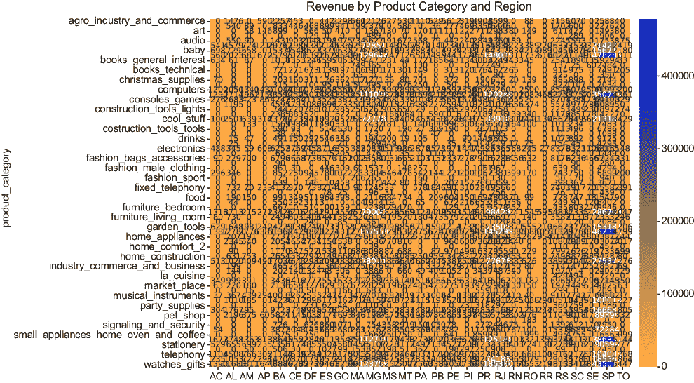
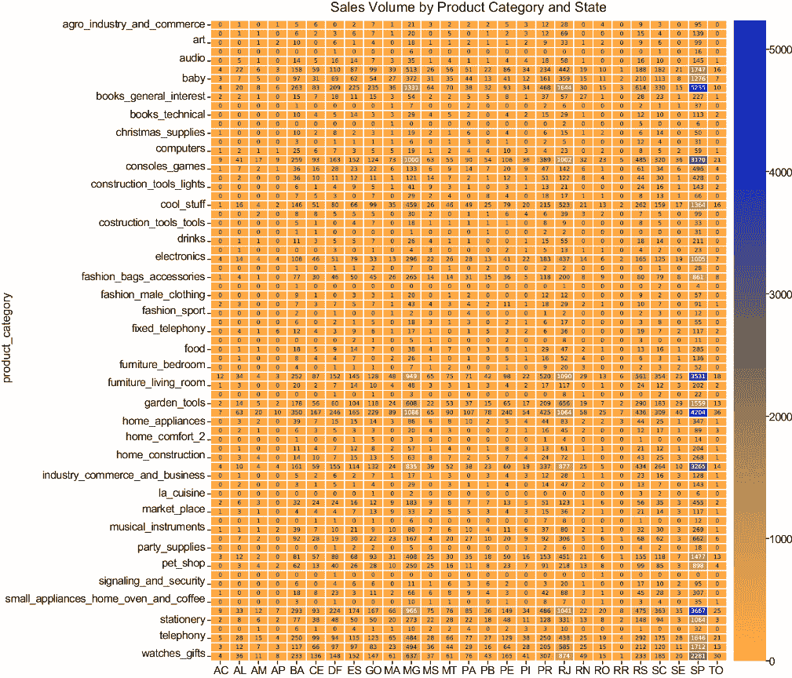
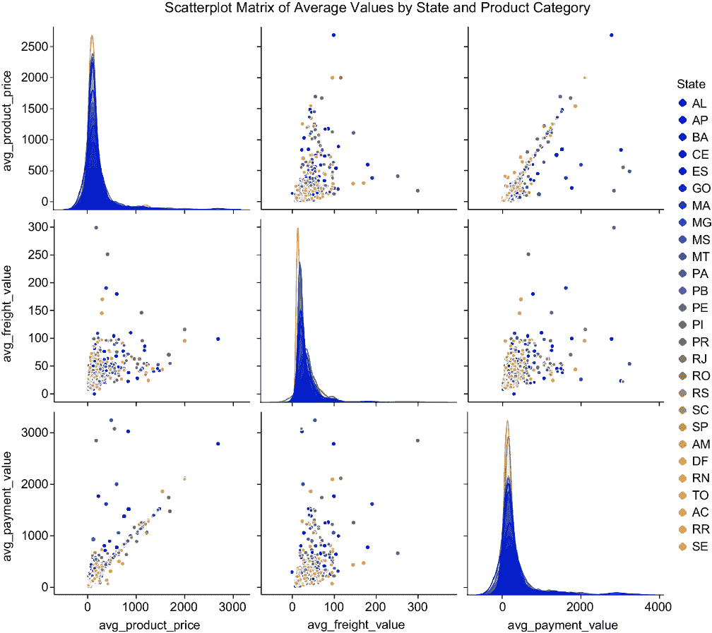
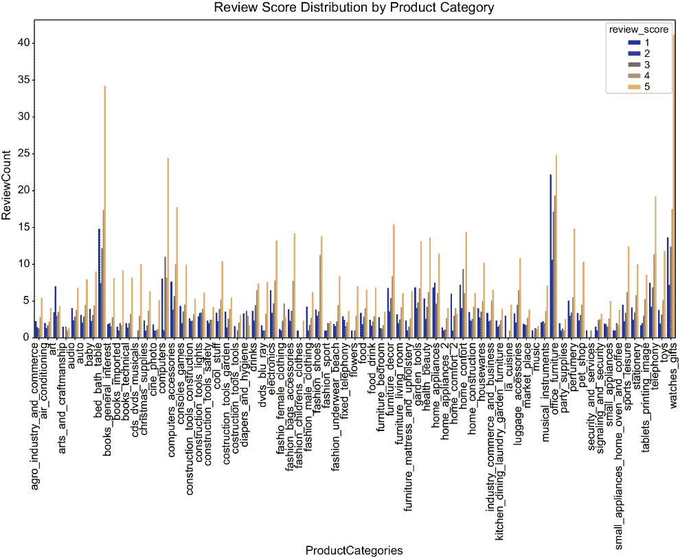
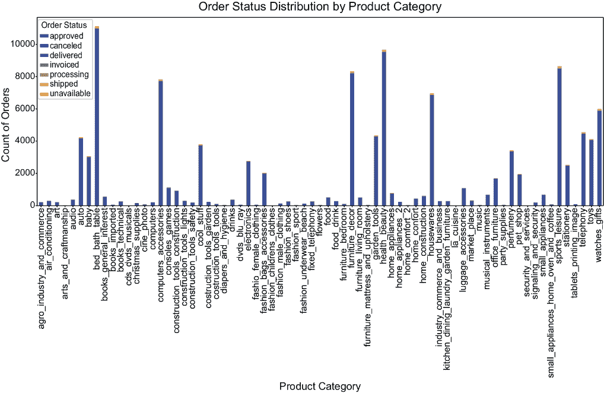
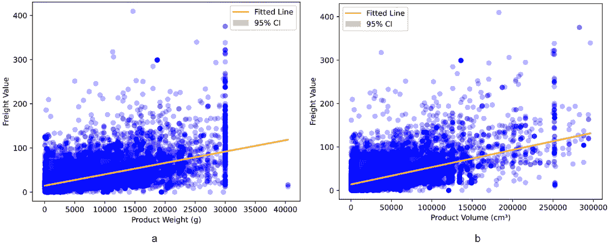

# 3 使用生成式 AI 支持的描述性分析和统计推断

### 本章涵盖

+   使用生成式 AI 进行数据分析设计

+   使用生成式 AI 对收集到的数据进行描述性分析

+   利用生成式 AI 选择合适的推理分析方法

+   使用生成式 AI 获取数据转换、可视化和建模的完整代码解决方案

上一章描述的工作具有挑战性和艰巨性，但绝对是必要的。您确保了数据质量可接受，并且您理解其含义。随着分析揭示出潜在过程的细微差别和复杂性，您对数据的理解可能会发生变化，但您现在应该有一个坚实的基础。

在本章中，我们将深入了解业务分析的第一部分，即端到端的描述性分析，了解生成式 AI 如何帮助我们每一步。它可以帮助很多，从回答与可用数据相关的问题到提供真正的业务洞察。我们将从高级分析规划开始，涉及更多的数据准备（惊喜！），然后描述和可视化数据，寻找与业务相关的信息。我们还将应用更高级的统计建模工具到我们的数据中，希望从中获得更多洞察。

## 3.1 研究问题

在第一章中，我们解释了您如何使用生成式 AI 来帮助确定您分析的业务目标。正如我们当时所说，您的目标通常应由业务利益相关者确定。在第二章中，您对数据进行了一轮初步清理，并调查了可用数据源的内容。

现在让我们为您的公司赚取数百万！这就是您的角色，不是吗？实际上，不是的。至少，它**不应该**是这样的。您的角色是向业务利益相关者传达决策。但要做到这一点，您需要将业务问题转化为研究问题。这里的复数形式并非偶然。通常，您会发现回答一个单一的业务问题需要回答多个研究问题。以一个简单的问题为例：“我们如何赚取更多利润？”为了回答这个问题，您可能会沿着以下路径进行：“谁在我们这里花费最多？”，然后是“他们能购买更多我们的产品吗？”，或者“我们在哪里能找到类似的人？”或者，正如节省的美元相当于赚取的十美元： “我们生产过程中的哪个步骤产生了最多的废料？”，然后是“我们能够优化哪些生产参数来减少这一点？”

可能性是无限的，你受限于你的想象力和数据可用性。这就是为什么了解你的数据如此重要的原因！商业利益相关者通常从业务流程的角度思考。一个管理供应链的人会希望得到不同地区产品需求的预测，以最小化过剩库存和缺货问题。一个负责合金铸造的人会希望有一个工具来计算不同基材材料的最佳比例，以获得最终产品。他们理解供应链或金属混合过程；他们可能不欣赏整合区域销售趋势和全球经济指标复杂性，或者确认质量分析和微量元素分析的需要，这对于创建稳健的模型至关重要。他们不一定了解数据源固有的局限性和可能性。

这里关键点是，你很少能回答你面前提出的商业问题。更常见的情况是，你需要将其分解并转化为一系列研究问题，只有在对这些问题的分析之后，你才能综合得出最终答案。在第一章中，我们向您展示了一种迭代定义分析范围的方法。即使你认为你刚刚定义了范围，当你完成数据清单的清理和评估时，也是以新视角审视问题的好时机。也许一些你认为可以回答的问题实际上不可回答，也许新的机会已经出现。

当我们编写这本书时，我们询问了生成式 AI 它希望从我们这里得到哪些信息，以帮助我们制定关于我们手头数据集的研究问题（想想这种情况：一个商业利益相关者把数据放在你面前，提出简短的要求“对此做点什么”；这种情况确实会发生）。我们得到的是一个实用的清单，这应该有助于你构建关于在数据环境背景下哪些问题是可回答的，哪些问题不可回答的思考：

+   *数据字典*—对数据集中每个变量的简要描述，包括其类型（例如，连续型、有序型或名义型）、测量尺度（例如，区间尺度、比例尺度）以及任何潜在的编码或转换。

+   *数据来源和背景*—数据的来源、收集的背景以及任何相关的背景信息。

+   *数据收集和抽样方法*—数据的收集方式、应用的任何抽样方法以及数据中可能存在的偏差或局限性。

+   *领域知识*—关于数据集主题的任何特定领域知识或专长。

+   *目标和兴趣*—本分析的目标和兴趣，例如识别模式、做出预测、评估政策、理解变量之间的关系等。

+   *利益相关者*—将从你的分析中受益的利益相关者。

+   *时间和空间方面*——可能影响研究问题的时空成分。

+   *前期研究*——对先前研究或使用类似数据或在同一领域进行的研究的任何了解。

+   *局限性和约束*——数据或分析过程中可能影响你可以探索的研究问题的任何局限或约束。

在这个阶段收集所有这些信息将允许你设计一个分析过程，当你意识到你缺少关键数据时，它不会突然中断。

拥有所有这些信息，你可能会有很多研究问题，对这些问题的答案，你将能够综合成你对商业问题的答案。但它们真的是所有相关的问题吗？幸运的是，你有一个拥有数百年的分析经验的工具。借助这个工具，你可以确保你没有遗漏任何相关的问题，并检查你想要提出的所有研究问题确实与所分析的商业问题相关。如果你的老板给你发了一封电子邮件，附上了一大堆文件，要求你从中提取所有可能的见解，这种帮助将具有非凡的价值。

让我们看看生成式 AI 顾问如何在可用数据的情况下解决过于一般化的商业问题。我们将使用我们的巴西电子商务示例数据集，特别是数据描述，并询问生成式 AI 关于可能的相关研究问题。请注意，由于请求的大小，它作为附录 A 完整呈现。

**** 提出以下数据集分析的研究问题：

1. 数据描述和字典：数据由以下详细描述的 8 个 DataFrames 组成：

# 与第 1 至 5 点相关的一些枯燥细节（见附录 A）

6. 目标和兴趣：我想提高产生这些数据的电子商务商店的商业效率。

7. 时间和空间方面：数据来自巴西，描述了 2016 年至 2018 年的订单。

8. 前期研究：未知。

9. 局限性和约束：我们希望专注于描述性分析，避免使用超出线性或逻辑回归的机器学习方法。

**** 根据提供的信息，以下是一些潜在的研究问题，供你的分析参考：

1.  从收入的角度来看，哪些产品类别最受欢迎，以及它们在巴西不同地区的销售表现有何不同？

1.  平均产品价格、运费和支付价值在不同产品类别和地区之间有何不同？

1.  不同产品类别的评论分数分布如何？

1.  订单状态（例如，已交付、已发货等）在不同地区、产品类别和卖家之间是如何变化的？

1.  产品属性（例如，重量、尺寸）与间接成本（例如，运费）之间有什么关系？

1.  哪些因素（例如，交货时间、价格、产品属性）导致平均评论评分的差异？

1.  不同的支付方式和分期付款的数量如何影响订单完成率和客户满意度？

1.  交货时间（实际与估计）对客户满意度和评论评分有何影响？

1.  不同城市或州的卖家在销售业绩和客户满意度方面是否存在显著差异？

这些研究问题关注描述性分析，并应有助于您深入了解影响销售业绩、客户满意度和电子商务店铺整体业务效率的因素。

如您所见，您可以在几秒钟内识别出多个感兴趣的区域！虽然我们的初步调查没有明确说明目标，只是增强业务价值，但执行建议的分析应该为业务利益相关者提供信息，使他们能够朝着提高业务效率的总体目标迈出重要步伐。

我找到了 1000 种不做事的方法……在这个阶段最好与业务方交谈。他们应该考虑这种洞察力是否会帮助他们，以及他们是否想优先考虑它。最重要的是，这个清单有望激发一些关于他们可以立即使用来创造价值的新想法。

这个清单对我们来说足够好，可以作为我们分析的基础。当然，我们可能期望更典型的分析，比如净推荐者得分（衡量客户满意度最常见的方法），但结果并不差，一点也不差！

## 3.2 分析设计

一旦您有一个明确的目标，您可能会感到充满活力，可能会想立即开始创建交叉表和图表……请坐下，喝杯咖啡，等待这种感觉过去。在第一章中，我们建议您**首先**准备一个分析框架，包括您的分析将如何进行，可能的结果是什么，以及这些可能结果的**意义**是什么。这个实验设计元素经常被忽视，即使在学术研究领域也是如此，但您不想从最糟糕的情况中学习。得到一些结果并试图将理论与之拟合可能会导致毫无价值的科幻研究论文（不要与我们在其中自己撰写了一些标题的受人尊敬的文学体裁混淆）；在商业现实中，这可能会导致重大的经济损失。始终提前规划。没有任何结果应该是意外的。准备一份可能结果及其在您的业务案例中的意义的完整清单。例如，如果当前价格高于购买价格，则出售；如果它们相等，则持有；否则购买。

当然，没有一项协议是固定不变的。你可能会在预处理数据后修改它（你可能会发现并非所有计划的分析都是可能的，或者在你浏览数据时可能会产生新的想法）。你的利益相关者可能会在分析进行到一半时改变他们的优先级或关注领域。即使在本书中，我们也忽视了我们的建议——GenAI 的发展速度超过了我们的打字能力，所以我们不得不多次回顾本书的部分内容。假装我们遵循了假设的路径将是一个直接的谎言。

不幸的是，有正当理由进行耳听分析的情况比这种方法的流行度要少。一个令人悲哀的事实是，在学术环境中，适当的实验设计是罕见的，而在学术环境之外，它更是罕见。你不会找到很多好的材料来指导你通过这个过程。即使在大多数生成式 AI 训练的数据（或文本）语料库中，那些包含先前结果分析的案例也很可能很少，因为测试过的 AI 顾问没有认为这值得提及。

****你能提出一个基于提供的数据来回答所有这些问题的分析设计吗？

****为了回答提出的研究问题，你可以遵循以下一般设计进行你的分析：

1.  数据准备：

    1.  合并相关的 DataFrame 以创建一个综合数据集：

        1.  将`df_product_category_translation`与`df_products`合并以获取英文产品类别名称。

        1.  使用`customer_id`和`order_id`合并`df_orders`、`df_customers`和`df_order_items`。

        1.  使用`product_id`将生成的 DataFrame 与`df_products`合并。

        1.  使用`order_id`将 DataFrame 与`df_order_payments`合并。

        1.  使用`order_id`将 DataFrame 与`df_order_reviews`合并。

        1.  使用`seller_id`将 DataFrame 与`df_sellers`合并。

    1.  清洗数据集：

        1.  处理缺失值（例如，根据上下文进行插补、删除或保持原样）。

        1.  如有必要，转换数据类型（例如，时间戳、浮点数和整数）。

        1.  如有必要，创建新变量，例如实际与估计的交货时间差异。

1.  描述性分析：

    1.  计算关键变量的汇总统计（例如，销售量、收入、产品属性和评论分数）。

    1.  创建可视化以探索数据中的模式和趋势（例如，柱状图、折线图、散点图和热图）。

    1.  进行交叉表和不同类别之间的比较（例如，地区、产品类别和卖家）。

1.  推断性分析：

    1.  测试组间是否存在统计学上显著的差异（例如，使用 t 检验、方差分析或卡方检验）。

    1.  进行相关性分析以识别变量之间的关系（例如，产品属性和销售绩效）。

    1.  进行线性或逻辑回归分析以识别关键结果的预测因素（例如，销售量、收入和客户满意度）。

1.  解释和讨论：

    1.  总结描述性和推断性分析的关键发现。

    1.  讨论对观察到的模式和关系的潜在解释。

    1.  确定分析的潜在局限性和未来研究的领域。

1.  结论和建议：

    1.  根据分析结果得出结论。

    1.  提供可操作的推荐，以提高电子商务商店的商业效率。

按照这个一般的设计进行你的分析，将帮助你系统地使用提供的数据回答提出的研究问题。

让我们分享一个小故事，或者实际上是我们遇到的一打多类似的故事：分析师进行回归分析，以探索社交媒体广告支出与销售额之间的关系。结果表明，社交媒体广告支出与销售额增加之间存在统计显著的关联。公司决定增加社交媒体支出，却发现他们的投资回报率（RoI）是负的。更糟糕的是，转移到社交媒体活动的预算削弱了其他业务功能。这是一个典型的例子，即一个分析设计不良，但完全可以避免的结果。

我们的目标不是追随堂吉诃德，追求那些我们永远无法实现的崇高理想，但你应该花些时间去探究不同类型分析的可能结果及其含义。在某些情况下，预测所有可能的结果是不切实际的。例如，你不想列出你预期生成的图表的所有可能变体。但你应该有一个预期的形状或轨迹的总体概念。我们之前在讨论数据清洗时提到了这一点。你需要理解预期，以便注意到那些意外的相关内容。在某些分析中，你应该花更多的时间思考结果的意义。这里的一个好例子就是相关性分析。

从商业角度来看，相关性意味着什么？实际上多大的相关性是有**意义**的？（不要将此与早期故事中的主角所犯的错误混淆，误将此视为统计显著性。）在计算回归时，你需要什么样的预测能力？没有现成的模板可供填写。你的领域知识和对商业的理解将使你能够区分有价值和误导性的见解。生成式 AI 可以帮助你，但不要期望它为你做所有繁重的工作。你需要与你的商业人士交谈，以便能够将领域知识深度整合到你的分析流程中。

在生成式 AI 提出的方案中，有一个由流行度偏差驱动的元素——第 3.a 点的统计测试方法。我们将在第 3.5 节的引言中解释我们对这个特定点的抱怨。

除了这些，执行此计划确实可能从我们精心清洗的数据中提取一些见解。

## 3.3 描述性数据分析

许多人对数据分析（无论是利益相关者还是对工作一无所知的新手）抱有很高的期望。如果能够把你们公司的所有数据放入一个神奇的盒子，然后得到一些简单的指令，比如“解雇三楼的苏，因为她的微观管理风格扼杀了团队的灵魂和效率。在你解雇人的时候，别忘了包装部的乔，他是你 20%退货率背后的原因”？或者，“在你的着陆页的左上角添加一个粉色的*现在就买!*按钮，你将在第一周增加 61.73%的销售额”？

从数据到信息再到洞察力是一个过程。这个过程可以通过工具在一定程度上自动化或加速，但大量的数据分析仅仅是——*分析*：对数据元素或结构的详细检查。尽管 AI 导向的公司做出了最大的努力，但需要有人描述数据元素和结构的部分不会消失，主要是因为它提供了业务绩效的概述。各种统计指标和可视化技术使你能够识别数据集中的模式、关系和异常。你可以使用描述性分析来更好地理解你的业务运营、客户行为和市场动态，为明智的决策和未来的分析奠定坚实的基础。

无论你是在大公司还是小公司工作，分析餐厅的数据时，你可以使用这种方法来识别最受欢迎的菜品与那些很少被点单的菜品。而在餐厅连锁企业的办公地点工作时，你可以用它来确定不同地点和一天中的不同时间最受欢迎的菜品。这种洞察力可以指导关于库存管理、员工排班和针对性促销的决策，从而提高运营效率和客户满意度。尽管描述性分析很简单，但它对于通往更高级的分析方法，如预测分析和规范性分析，至关重要。

你应该使用*nomen omen*描述性统计来描述你的数据，包括平均值、中位数、众数、标准差和百分位数。你还应该准备条形图、直方图和散点图等可视化，以进一步增强你识别和检查数据中模式和趋势的能力。

九个最初由生成式人工智能提出的研究问题中有四个可以使用这些方法来解决。我们将在接下来的小节中这样做。其他五个问题需要不同的工具箱，将在第 3.4 节中介绍。

### 3.3.1 产品类别的流行度

回想 ChatGPT 提出的问题：“从收入角度来看，哪些产品类别最受欢迎，以及它们在巴西不同地区的销售表现有何差异？”如果你觉得处理电子商务数据让你感到无聊，不用担心。同样的方法在许多商业领域都很有用。让我们探索一些这种方法可以为你提供宝贵见解的例子：

+   *零售、电子商务和制造业*—除了产品类别之外，这种方法可以应用于理解不同地区或时间段内客户群体购买行为，例如分析购买季节性趋势或营销活动对各种人口统计的影响。

+   *医疗保健*—在医疗保健领域，类似的技巧可以用来分析不同地理区域和人口群体中疾病发生或治疗结果分布。这有助于资源配置、理解疾病传播模式并定制公共卫生干预措施。

+   *金融服务*—对于银行和金融机构来说，分析按产品类型和地理区域划分的贷款或信用卡违约分布，有助于风险管理并设计有针对性的金融产品。

+   *供应链和物流*—在这里，该方法可以用来分析不同物流路线或运输方式的表现，根据成本、效率或环境影响将它们分类于不同地区。这有助于优化路线、降低成本并提高可持续性。

+   *电信*—分析不同地区不同服务计划或产品（例如，数据计划、语音计划）的使用模式，有助于定制产品、改善网络基础设施并识别新的市场机会。

+   *公用事业和能源*—在这个领域，分析不同地区不同能源来源（例如，电力、天然气）的消费模式，可以指导基础设施发展、节能努力和定价策略。

+   *旅游和酒店业*—了解不同旅游群体对不同住宿类型或旅游体验的偏好，可以帮助企业定制服务、优化定价策略并提高客户满意度。

+   *房地产*—分析不同类型物业（例如，住宅与商业）在不同地区的表现，可以指导投资策略、房地产开发和营销活动。

+   *教育*—评估不同教育项目或课程在不同人口群体中的表现，可以帮助教育机构定制服务、改善学生成绩并优化资源配置。

+   *政府和公共政策*—政府可以利用这种方法分析不同地区各种政策的影响，例如经济激励措施、公共卫生倡议或基础设施项目的有效性，从而实现更明智的决策。

对于这些示例中的每一个，我们接下来要查看的方法可以帮助你发现可能不是立即显而易见的模式和见解。通过在有意义的不同维度（如产品类别、服务类型或人口统计细分）上对数据进行分类，并分析它们在不同地区或群体中的表现，你真的可以支持你的业务。

让我们回到工作中。我们将从测试哪些产品类别带来最多收入这个简单任务开始。这是产品组合优化所需的基本分析。我们可以应用相同的方法快速评估不同群体的表现。

****请提供一份完整的 Python 代码解决方案，以回答关于数据集中最常见产品类别的问题。

****为了回答关于数据集中最常见产品类别的问题，你可以在 Python 中遵循以下步骤：

1.  导入必要的库

1.  读取并合并所需的 DataFrame

1.  进行分析以找到最常见的产品类别

1.  显示结果

这里是完整的 Python 代码解决方案：

```py
import pandas as pd

*# Read DataFrames*
df_products = pd.read_csv('df_products.csv')
df_product_category_translation = 
↪pd.read_csv('df_product_category_translation.csv')

*# Merge DataFrames*
df_products_merged = df_products.merge(
↪df_product_category_translation, on='product_category_name', 
↪how='left')

*# Analyze the most common product categories*
category_counts = 
↪df_products_merged['product_category_name_english'].value_counts()

*# Display the results*
print("The most common product categories are:")
print(category_counts.head(10))
```

此代码将读取数据，合并 DataFrame，计算每个产品类别的出现次数，并显示最常见的 10 个类别。

生成式 AI 未能理解我们指的是哪个问题。我们希望它能回忆起它自己在前两个提示中提出的问题：“就销售量和收入而言，哪些是最受欢迎的产品类别，以及它们在不同地区的销售表现如何？”相反，它提供了与识别最常见产品类别相关的无用输出，而不是它们的销售表现。这应该是一个警告，说明你不应该总是依赖生成式 AI 正确回忆你的模糊提示。

汤姆，番茄。有时候，你提出的问题和生成式 AI 回答的问题之间的差异可能非常微小，难以察觉，但从与你的问题不同的答案中推断出任何见解可能具有深远的影响。

让我们尽量更具体一些。

****请提供一份完整的 Python 代码解决方案，以回答以下问题：“就销售量和收入而言，哪些是最受欢迎的产品类别，以及它们在不同地区的销售表现如何？”

****为了回答这个问题，您需要在 Python 中遵循以下步骤：

1.  导入必要的库

1.  读取并合并所需的 DataFrame

1.  进行分析以找到就销售量和收入而言最受欢迎的产品类别，以及它们在不同地区的销售表现如何

1.  显示结果

这里是完整的 Python 代码解决方案：

```py
import pandas as pd

*# Read DataFrames*
df_products = pd.read_csv('df_products.csv')
df_product_category_translation = 
↪pd.read_csv('df_product_category_translation.csv')
df_order_items = pd.read_csv('df_order_items.csv')
df_orders = pd.read_csv('df_orders.csv')
df_customers = pd.read_csv('df_customers.csv')

*# Merge DataFrames*
df_products_merged = df_products.merge(
↪df_product_category_translation, on='product_category_name', 
↪ how='left')
df_order_items_merged = df_order_items.merge(
↪df_products_merged, on='product_id', how='left')
df_orders_merged = df_orders.merge(
↪df_customers, on='customer_id', how='left')
df_merged = df_order_items_merged.merge(
↪df_orders_merged, on='order_id', how='left')

*# Calculate sales volume and revenue per category*
category_sales = df_merged.groupby(
↪['product_category_name_english', 'customer_state']).agg(
↪{'order_id': 'count', 'price': 'sum'}).reset_index()
category_sales.columns = 
↪['product_category', 'customer_state', 'sales_volume', 'revenue']

*# Sort by sales_volume and revenue*
category_sales_sorted = category_sales.sort_values(
↪by=['sales_volume', 'revenue'], ascending=False)

*# Display the results*
print("The most popular product categories 
↪in terms of sales volume and revenue are:")
print(category_sales_sorted.head(10))

print("\nSales performance across different regions in Brazil:")
sales_by_region = 
↪category_sales_sorted.pivot_table(
↪index='product_category', 
↪columns='customer_state', 
↪values=['sales_volume', 'revenue'], fill_value=0)
print(sales_by_region)
```

将文件名`df_products.csv`、`df_product_category_translation.csv`、`df_order_items.csv`、`df_orders.csv`和`df_customers.csv`替换为您数据集的适当文件名。此代码将读取数据，合并数据框，分析巴西不同地区每个产品类别的销售量和收入，并显示结果。

有趣的事实是，遵循对话的语言，ChatGPT 假设我们会对类别的英文名称感兴趣，而不是葡萄牙语，尽管它本身在这两种语言中都很流利。

生成的数据框有 54 列。如果只有生成式 AI 能提出一种使解释结果更容易的方法，那该多好？好吧，是的，但也不是。重要的是要记住，当我们让生成式 AI 帮助我们时，我们并没有把我们的分析技能留在门口。任何经验丰富的数据分析师都会告诉你，像这样的大型数据框将受益于结果的可视化。因此，在我们继续使用生成式 AI 提出的步骤之前，我们将花点时间来获取一些视觉信息。

****你能提出针对`sales_by_region`数据框的视觉化方法，以便回答提出的研究问题吗？

****当然可以！为了有效地可视化`sales_by_region`数据框并回答研究问题，您可以使用以下可视化方法：

1.  条形图：您可以为巴西不同地区的每个产品类别创建分组条形图，以比较销售量和收入。x 轴将代表地区，y 轴将代表销售量和收入。您可以为每个产品类别使用不同的颜色来区分它们。

```py
import seaborn as sns
import matplotlib.pyplot as plt

plt.figure(figsize=(12, 8))
sns.barplot(data=sales_by_region, x='customer_state', y='revenue', 
↪hue='product_category_name_english', ci=None)
plt.title('Revenue by Product Category and Region')
plt.show()

plt.figure(figsize=(12, 8))
sns.barplot(data=sales_by_region, x='customer_state', y='sales_volume',
↪hue='product_category_name_english', ci=None)
plt.title('Sales Volume by Product Category and Region')
plt.show()
```

1.  2. 热力图：另一种在巴西不同地区可视化销售业绩的方法是使用热力图。您可以使用区域作为行，产品类别作为列，销售量和收入作为值的交叉表。然后，您可以使用热力图使用颜色渐变来表示销售业绩。

```py
import seaborn as sns
import matplotlib.pyplot as plt

*# Create pivot tables for sales_volume and revenue*
sales_volume_pivot = sales_by_region.pivot_table(
↪values='sales_volume', index='customer_state', 
↪columns='product_category_name_english')
revenue_pivot = sales_by_region.pivot_table(
↪values='revenue', index='customer_state', 
↪columns='product_category_name_english')

*# Plot heatmaps*
plt.figure(figsize=(12, 8))
sns.heatmap(sales_volume_pivot, annot=True, cmap='viridis', fmt='.0f')
plt.title('Sales Volume by Product Category and Region')
plt.show()

plt.figure(figsize=(12, 8))
sns.heatmap(revenue_pivot, annot=True, cmap='viridis', fmt='.0f')
plt.title('Revenue by Product Category and Region')
plt.show()
```

这些可视化方法将帮助您更好地理解巴西不同地区不同产品类别的销售业绩。

这段代码没有生成图形，而是产生了一个警告和以下错误信息：

```py
FutureWarning: The `ci` parameter is deprecated. 
↪Use `errorbar=None` for the same effect.
ValueError: Could not interpret input 'customer_state'
```

我们将此记录作为警告提出。错误和问题*是*可以预见的。让生成式 AI 调试代码可能需要一些努力，如附录 B 所示。然而，这项练习产生了两个值得在此提出的结论：

+   生成式 AI 可能会提供错误的代码，而且不止一次。我们仍然可以使用它们来调试代码（成功与否取决于语言），因为这样可能比从头开始学习所有语法细节要快。

+   你不应该完全将调试过程留给生成式 AI，因为它无法访问结果。寻找输出中的异常并向你的 AI 顾问报告它们可以显著加快这个过程。

多亏了提供的代码，我们能够生成四个图表：两个柱状图和两个热图。

柱状图可能不适合添加到为 SD 投影仪准备的演示文稿中。在图 3.1 中你可以找到其中一个；第二个几乎相同。为了使其适合页面，我们删除了包含 71 个类别的图例（它们仍然存在于随附的 Jupyter 笔记本生成的图表中）。它仍然难以阅读，但这几乎不是生成式 AI 的错。毕竟，我们试图可视化近六千个数据点！

为了使这个图表更易于消费，我们可以请我们的 AI 顾问按州或产品组将其分解，但最终我们会得到几十个图表。让我们检查一下使用热图是否能帮我们省去这个麻烦。相同数据的可视化展示在图 3.2 中。两个热图都可在书中 GitHub 仓库的 Jupyter Notebook 中找到。

不幸的是，生成的热图并没有变得更易读，是吗？我们将这个难以辨认的图像作为有价值的学习材料印在这本书中。


##### 图 3.1 按产品类别和地区销售量的柱状图



##### 图 3.2 按产品类别和地区销售收入的 heatmap

你在工作中时不时地会遇到难以阅读的图形。如果你被要求准备“适合 PowerPoint 幻灯片的内容”，这可能会真的毁了你的一天。在这种情况下，你需要考虑你是否面临一个固有的问题，比如图 3.1 中的条形数量，或者视觉杂乱是否可以通过简单的重新格式化来修复。如果你不确定如何调整可视化软件的设置，生成式 AI 就在那里为你提供帮助！你应该得到解决方案和解释，以帮助你在未来的工作中。

****你能修改热图代码，使矩阵中的数字以较小的字体打印出来吗？

****当然！你可以在`sns.heatmap`函数中使用`annot_kws`参数调整热图中数字的字体大小。你可以将字体大小设置为特定值，如下所示：

```py
plt.figure(figsize=(12, 12))
sns.heatmap(revenue_df.set_index('product_category'), 
↪cmap="YlGnBu", annot=True, fmt=".0f", linewidths=0.5, 
↪annot_kws={"size": 6})
plt.title("Revenue by Product Category and State")
plt.show()

plt.figure(figsize=(12, 12))
sns.heatmap(sales_volume_df.set_index('product_category'), 
↪cmap="YlGnBu", annot=True, fmt=".0f", linewidths=0.5, 
↪annot_kws={"size": 6})
plt.title("Sales Volume by Product Category and State")
plt.show()
```

在这个例子中，我将字体大小设置为 6。你可以根据需要更改此值以实现所需的外观。

在我们继续展示结果之前，我们需要注意的是，代码中提到的`revenue_df` DataFrame 是在之前提到的附录 B 中定义的，在那里我们展示了一条漫长而曲折的道路到正确的代码。然而，这次事情进展得如预期。结果展示在图 3.3 中。



##### 图 3.3 按产品类别和州销售收入的 heatmap，重新格式化

总体结果现在可以进行分析了。也许在阅读个别数字方面并不是那么重要，但这正是热图的目的。它旨在定位维度分布中的异常值。

另一个提出的可视化是堆叠条形图，这些图表包含在本书的 GitHub 存储库中。

在这个阶段，我们已经具备了绘制关于最受欢迎产品类别业务结论的视觉化工具。遵循我们的 AI 顾问的指导，我们现在将转向研究它们的绩效。

### 3.3.2 类别和地区中产品的绩效

作为提醒，根据我们的数据可用性，我们的生成式 AI 顾问提出了以下衡量绩效的方法：“平均产品价格、货运价值和支付价值在不同产品类别和地区之间有何不同？”关于不同类别和不同位置的产品绩效和行为的信息是商业信息宝库。使用这种方法，您可以支持推动销售和营销努力的决策。例如，可以从表现最佳的地区吸取最佳实践来提高表现较弱的地区的效率，或者可以淘汰某些产品，用更有利可图的产品来替代。

然而，除非你对营销真正感兴趣，否则这个应用就不值得阅读。幸运的是，通过应用这个分析框架，你可以探索许多不同的变量，以在各种行业中提取见解。以下是一些例子：

+   *客户终身价值*（CLV）和*获取成本*——在电子商务、电信或金融服务等行业，分析 CLV 与不同产品或服务以及地区的客户获取成本之间的关系，可以帮助优化营销支出并更有效地定位客户群体。

+   *服务响应时间和客户满意度*——对于以服务为导向的行业，如医疗保健、物流或客户支持，检查响应时间与不同服务类别和地区的客户满意度之间的关系，可以确定改进领域并指导资源分配。

+   *库存周转率和销售业绩*——在零售和制造业，分析库存周转率与不同产品类别和地区的销售业绩之间的关系，可以帮助更有效地管理库存，降低持有成本，并识别需求模式。

+   *可再生能源生产和消费*——在公用事业和能源行业，检查不同地区的可再生能源生产（例如，太阳能、风能）与消费之间的关系，可以提供基础设施投资和可持续性倡议的信息。

+   *入住率和租金回报率*——在房地产领域，尤其是在酒店和住宅部门，分析入住率与不同物业类型和地点的租金回报率之间的关系，可以帮助投资决策和定价策略。

+   *利用率率和运营成本*——对于运输和物流行业，查看车辆或资产利用率率与不同地区或路线的运营成本之间的关系，可以优化运营并提高盈利能力。

+   *研发支出和创新成果*——在技术和制药行业，分析研发支出与专利申请或产品发布等成果在不同类别之间的关系，可以指导投资策略和创新重点。

+   *数字营销支出和参与度指标*——对于投资数字营销的企业来说，检查支出与参与度指标（例如，点击率、转化率）在不同活动或地区之间的关系，可以优化营销策略和预算分配。

+   *劳动力培训投资和生产率提升*——在具有显著人力资本的行业，如教育、医疗保健或制造业，分析劳动力培训投资与不同部门或地点的生产率提升之间的关系，可以提供人才发展策略的指导。

+   *可持续性倡议和公司绩效*——在各个行业，检查对可持续性倡议（例如，碳足迹减少、废物管理）的投资与公司绩效指标（例如，盈利能力、品牌认知）之间的关系，可以指导企业社会责任努力和投资。

这些示例都应用了分析不同类别和地区之间关系和变化的分析方法，针对不同的变量。

让我们看看如何捕捉不同类别之间的绩效差异，因为它们可能对商业决策有价值。

****请提供一段完整的 Python 代码解决方案，以回答以下问题：“从销售量和收入的角度来看，哪些产品类别最受欢迎？它们在不同地区的销售表现有何不同？”

****要回答这个问题，你可以使用你之前创建的合并后的 DataFrame，并对产品类别和地区执行`groupby`操作。然后，你将为每个组计算平均产品价格、货运价值和支付价值。

下面是实现这一目标的 Python 代码：

```py
import pandas as pd
*# Assuming you have already merged the DataFrames and named it* 
*↪'merged_data'*

*# Group the data by product category and region (state)*
grouped_data = merged_data.groupby(
↪['product_category_name_english', 'customer_state'])

*# Calculate the average product price, freight value,* 
*↪and payment value for each group*
average_values = grouped_data[
↪['price', 'freight_value', 'payment_value']].mean()

*# Reset the index to have a flat DataFrame*
average_values = average_values.reset_index()

*# Rename the columns for clarity*
average_values.columns = ['product_category', 'state', 'avg_product_price', 
↪'avg_freight_value', 'avg_payment_value']

*# You can now explore the 'average_values' DataFrame* 
*↪to analyze the differences across product categories and regions*
```

`average_values` DataFrame 将包含每个产品类别和地区（州）的平均产品价格、货运价值和支付价值。你可以使用各种可视化技术，如条形图或热图，进一步分析此 DataFrame，以更好地理解产品类别和地区之间的差异。

我们完整地展示了收到的答案，因为它有三个值得注意的元素：

+   第一点是生成式 AI 预测我们的下一步并建议可视化技术的功能。

+   第二点是它考虑了列名的可读性。

+   最后一个不幸的是，它使用了 DataFrame 的错误名称。我们从未定义一个`merged_data` DataFrame。

我们现在希望你注意。你可以假设`merged_data` DataFrame 只是之前例子中的`df_merge`。但是，正如我们一遍又一遍地重复的那样，培养你的偏执！如果有任何疑问，你应该双重和三重检查以确保你正在分析的确是你打算分析的内容！

****你能写出你使用的`merged_data` DataFrame 中应该包含的列吗？

****当然！根据我们之前讨论的数据，`merged_data` DataFrame 应该包含以下列：

1.  `product_category_name_english` (`str`) - 英文名称类别

1.  `customer_state` (`str`) - 客户状态

1.  `price` (`float64`) - 物品价格

1.  `freight_value` (`float64`) - 物品运费价值（如果一个订单包含多个物品，运费价值将在物品之间分配）

1.  `payment_value` (`float64`) - 交易价值

要创建`merged_data` DataFrame，你需要合并必要的 DataFrames，就像我们在对话中之前讨论的那样。以下是如何创建`merged_data` DataFrame 的快速回顾：

1.  将`df_order_items`与`df_orders`在`order_id`上合并

1.  将结果与`df_product_category_translation`在`product_category_name`上合并

1.  将结果与`df_customers`在`customer_id`上合并

1.  将结果与`df_order_payments`在`order_id`上合并

生成的`merged_data` DataFrame 应包含上述列，这些列可以用来回答有关不同产品类别和地区平均产品价格、运费价值和支付价值的问题。

有趣的是，ChatGPT 产生的`merged_data`、我们实际拥有的`df_merged`，以及显著不同！如果你尝试简单地用`df_merged`替换`merged_data`来运行原始代码，你会得到一个错误。

保持铃铛响亮  对话越长，生成式 AI 就越有可能失去对对话细微之处的把握。为了确保你的 AI 顾问有适当的上下文意识，当你注意到它对提供的数据结构进行幻觉时，粘贴一个包含有关数据的详细描述的提醒，或者继续到新的对话会话。

记住，那还不是最坏的情况。代码中断的错误很容易被发现。那些事情进展顺利，但结果基于错误数据的错误则是另一回事。请把这当作一个公正的警告。

生成的 DataFrame 有 1,356 行。再次，我们可能需要考虑可视化结果。

****你能提出一种适合于生成`average_values`数据框中数据的可视化方法吗？

****鉴于`average_values`数据框的结构，你可以创建：

1.  一个散点图矩阵（配对图），以可视化不同产品类别和州之间`average_product_price`、`average_freight_value`和`average_payment_value`之间的关系。你可以使用 seaborn 的`pairplot`函数来完成这个任务。

这里是创建散点图矩阵的代码：

```py
import seaborn as sns

*# Create a pair plot with different colors for each state*
g = sns.pairplot(data=average_values, hue='state', markers='.')

*# Set the title and labels for each plot*
g.fig.suptitle(
↪"Scatterplot Matrix of Average Values by State and Product Category",
↪y=1.02)
g.set_axis_labels(
↪"Average Product Price", "Average Freight Value", 
↪"Average Payment Value")

*# Adjust legend*
g.add_legend(title="State")

*# Show the plot*
plt.show()
```

这将为你提供一个散点图矩阵，显示每个州中每个产品类别的平均产品价格、平均运费价值和平均付款价值之间的关系。散点图中的点将根据州的颜色进行着色。

1.  2. 三个独立的条形图 - 一个用于每个感兴趣的值（平均产品价格、平均运费价值和平均付款价值）。这些条形图将在 x 轴上显示产品类别，在 y 轴上显示相应的值，每个条形代表一个州。

这里是使用 seaborn 库创建这些条形图的 Python 代码：

```py
import seaborn as sns
import matplotlib.pyplot as plt

*# Function to create bar plots for the given value*
def create_bar_plot(data, value_col, title, ylabel):
    plt.figure(figsize=(15, 6))
    sns.barplot(x='product_category', y=value_col, hue='state',
                ↪data=data)
    plt.title(title)
    plt.xlabel('Product Category')
    plt.ylabel(ylabel)
    plt.xticks(rotation=90)
    plt.legend(title='State', bbox_to_anchor=(1, 1))
    plt.show()

*# Create bar plots for average product price, average freight value,* 
*↪and average payment value*
create_bar_plot(average_values, 'avg_product_price', 
↪'Average Product Price by State and Product Category', 
↪'Average Product Price')
create_bar_plot(average_values, 'avg_freight_value', 
↪'Average Freight Value by State and Product Category', 
↪'Average Freight Value')
create_bar_plot(average_values, 'avg_payment_value', 
↪'Average Payment Value by State and Product Category', 
↪'Average Payment Value')
```

生成的散点图作为图 3.4 呈现，其中一个条形图作为图 3.5 呈现。



##### 图 3.4：平均付款价值、平均运费价值和平均产品价格之间关系的散点图


##### 图 3.5：按地区分组显示平均产品价格每类关系的条形图

负责明确命名图表轴的代码没有正确工作。幸运的是，matplotlib 作为默认使用的 DataFrame 列名足够有信息性。我们保留原样，以强调一个更普遍的观点：有时，在你的工作中，尤其是在时间压力下，你可能会倾向于在命名约定上“节省时间”。很快，所有变量都会变成`x`、`tmp`或`var1`——这是一个糟糕的习惯。在你打开两个月前写的文件后，你会同意我们的观点。你现在节省了几秒钟，但后来会失去几个小时。使用有信息性的变量名可以节省时间。当然，过于冗长也不会对你的代码可读性有很大帮助。一个名为`second_attempt_to_average_the_sales_in_Joe_Smiths_analysis_of_his_shop`的变量可能过于冗长。

生成的图 3.5 可能需要一些时间（以及一个或两个放大镜）来分析，但它应该足以提供一些关于产品性能的商业洞察。如果你没有足够放大能力的放大镜，我们将在下一节讨论利用生成式 AI 对产品类别进行聚类，在那里我们将分析产品感知。

### 3.3.3 评分分布

了解评分分布的价值相对明显。这是关于人们如何看待产品的关键反馈。正如我们之前提到的，有一些方法和措施可以用来将整体客户满意度表示为一个单一的数字。然而，我们现在暂时不考虑它们（假装我们在处理未知数据），并尝试回答我们的 AI 顾问提出的问题：“不同产品类别中评分的分布是怎样的？”

如果你觉得可以跳过这个练习，因为你知道如何在 Excel 中制作单变量的条形图，你可以跳过。我们在这里不是在重新发明轮子。然而，如果你愿意花一分钟学习生成式 AI 如何帮助你处理结果的粒度，请继续阅读！

重复是学习的母亲  我们之前讨论了生成式 AI 在其对话上下文分析中能追溯到多远的问题。时不时地，你应该澄清它是否正确地记住了所有细节。如果有问题，你可以提醒它整个数据描述，而不是逐个变量地纠正。

让我们看看生成式 AI 是否能为这个简单的练习提供任何有用的转折。在唤醒生成式 AI 对涉及 DataFrame 结构的记忆（如附录 A 所示）后，我们收到了以下问题的答案。

****我应该如何提取关于评分分布的信息，以及它在不同产品类别和卖家之间是如何变化的？

****要分析不同产品类别和卖家之间评分的分布，你可以遵循以下步骤：

1.  合并所需的 DataFrame：你可能需要合并 `reviews`、`orders`、`order_items` 和 `products` DataFrame，以获得包含评分、产品类别和卖家信息的合并 DataFrame。

1.  按产品类别和卖家分组合并 DataFrame：使用 `groupby()` 函数按 `product_category_name_english` 和 `seller_id` 对数据进行分组。

1.  计算评分分布：使用 `value_counts()` 函数计算每个组内每个评分的数量。

下面是执行上述步骤的代码：

```py
*`*# Merge the DataFrames*`*
merged_data = (
    df_orders.merge(df_order_items, on='order_id')
    .merge(df_products, on='product_id')
    .merge(df_order_reviews, on='order_id')
    .merge(df_product_category_translation, on='product_category_name')
)

*`*# Group by product_category_name_english, seller_id, and review_score*`*
review_score_distribution = 
↪merged_data.groupby(['product_category_name_english', 'seller_id', 
↪'review_score']).size().reset_index(name='count')
```

现在，`review_score_distribution` DataFrame 包含了每个产品类别和卖家组合的评分分布。为了可视化这些数据，你可以使用堆叠条形图、热图或其他适合的视觉方法，具体取决于你的偏好。

代码按预期工作，但问题是我们又打破了我们的记录，现在我们有一个包含 14,503 行的 DataFrame。如果我们想对它有所了解，我们可能需要再次使用可视化。

****我应该如何可视化 `review_score_distribution` DataFrame 以得出有意义的结论？

****为了可视化 `review_score_distribution` 数据框，你可以使用分组条形图，其中 x 轴代表产品类别，y 轴代表评论数量，不同的颜色或图案代表不同的评论分数。这将使你能够看到评论分数如何在产品类别之间分布，并比较它们在客户满意度方面的表现。

这里是一个使用 Seaborn 创建分组条形图的代码片段：

```py
import seaborn as sns
import matplotlib.pyplot as plt

*# Set a larger figure size*
plt.figure(figsize=(20, 10))

*# Create the grouped bar chart*
sns.barplot(data=review_score_distribution,
    x='product_category_name_english',
    y='count',
    hue='review_score',
    ci=None)

*# Rotate the x-axis labels for better readability*
plt.xticks(rotation=90)

*# Set labels for the axes and the title*
plt.xlabel('Product Categories')
plt.ylabel('Review Count')
plt.title('Review Score Distribution by Product Category')

*# Show the plot*
plt.show()
```

此图将给你一个不同产品类别在客户评论方面的表现的想法。请注意，这个图可能相当大，难以阅读，具体取决于你的数据集中产品类别的数量。你可能想要过滤或进一步聚合数据，以专注于特定的类别或评论分数范围。

似乎生成式 AI 能够估计出结果的大小将比之前的大。图 3.6 显示这并非错误。此时，建议的行动方案是去见一个利益相关者，他们将收到这份分析和一次真诚的心与心的交流。他们可以决定接受超大的图表并承诺永不打印，或者他们可以提出对他们有意义的聚合。



##### 图 3.6 按产品类别显示评论分数计数的分组条形图

为了辩论的目的，我们将假设这项分析是为电梯演讲准备的，因此不能提前批准。让我们将评论分为正面（4 或 5 分）和负面（1、2、3 分），我们任意决定哪些分数被认为是正面的（以及负面的）。从生成式 AI 获取代码很简单。

##### 列表 3.1 生成分组条形图

```py
import seaborn as sns
import matplotlib.pyplot as plt

def categorize_review_score(score):
    if score >= 4:
        return 'Positive'
    else:
        return 'Negative'

review_score_distribution['review_category'] = 
↪review_score_distribution['review_score'].apply(categorize_review_score)

*# Set a larger figure size*
plt.figure(figsize=(20, 10))

*# Create the grouped bar chart*
sns.barplot(data=review_score_distribution,
    x='product_category_name_english',
    y='count',
    hue='review_category',
    ci=None)

*# Rotate the x-axis labels for better readability*
plt.xticks(rotation=90)

*# Set labels for the axes and the title*
plt.xlabel('Product Categories')
plt.ylabel('Review Count')
plt.title('Simplified Review Score Distribution by Product Category')

*# Show the plot*
plt.show()
```

如图 3.7 所示，结果比图 3.6 略易阅读。其中“略”是关键词。


##### 图 3.7 按产品类别显示聚合评论分数计数的分组条形图

如果它真的要作为电梯演讲，我们需要做得更好。这意味着我们需要对产品类别进行聚合。然而，我们的数据集没有将产品分类到更广泛类别的本体。幸运的是，生成式 AI 在此类任务中提供首次近似非常出色。

****我想添加按产品类别进行的聚合。为以下类别列表提出分组建议和分组决策的解释：

[<在此我们提供了完整的类别列表>]

****将产品类别分组的一种方法是通过考虑它们的主要行业或兴趣领域。这可以使可视化更易于管理，并在更高层次上揭示趋势。以下是给定类别列表的分组建议：

1.  家居与家具：`['bed_bath_table',` `'furniture_bedroom',` `'furniture_decor',` `'furniture_living_room',` `'furniture_mattress_and_upholstery',` `'kitchen_dining_laundry_garden_furniture',` `'home_comfort', 'home_comfort_2', 'home_construction', 'housewares']`

1.  电子产品与电脑：`['audio', 'computers', 'computers_accessories', 'electronics', 'telephony', 'tablets_printing_image']`

1.  时尚：`['fashio_female_clothing',` `'fashion_bags_accessories', 'fashion_childrens_clothes',` `'fashion_male_clothing',` `'fashion_shoes',` `'fashion_sport',` `'fashion_underwear_beach']`

1.  娱乐：`['art',` `'arts_and_craftsmanship',` `'books_general_interest', 'books_imported',` `'books_technical',` `'cds_dvds_musicals',` `'christmas_supplies',` `'consoles_games',` `'cool_stuff', 'cine_photo',` `'dvds_blu_ray',` `'music',` `'musical_instruments', 'toys',` `'watches_gifts']`

1.  体育与休闲：`['sports_leisure',` `'garden_tools']`

1.  健康与美容：`['health_beauty',` `'perfumery']`

1.  婴儿与儿童：`['baby',` `'diapers_and_hygiene',` `'fashion_childrens_clothes']`

1.  办公与工业：`['agro_industry_and_commerce',` `'industry_commerce_and_business',` `'office_furniture',` `'stationery']`

1.  家用电器：`['air_conditioning',` `'home_appliances',` `'home_appliances_2',` `'small_appliances',` `'small_appliances_home_oven_and_coffee']`

1.  工具与建筑：`['construction_tools_construction',` `'construction_tools_lights',` `'construction_tools_safety',` `'costruction_tools_garden', 'costruction_tools_tools']`

1.  汽车与配件：`['auto',` `'fixed_telephony']`

1.  食品与饮料：`['food',` `'food_drink',` `'drinks']`

1.  杂项：`['flowers',` `'la_cuisine',` `'luggage_accessories',` `'market_place', 'party_supplies', 'pet_shop', 'security_and_services', 'signaling_and_security']`

你可以在`review_score_distribution` DataFrame 中创建一个新列来表示这些分组：

```py
def categorize_product_category(category):
    category_mapping = {
        'Home & Furniture': ['bed_bath_table', 'furniture_bedroom', 
        ↪'furniture_decor', 'furniture_living_room', 
        ↪'furniture_mattress_and_upholstery', 
        ↪'kitchen_dining_laundry_garden_furniture', 'home_confort', 
        ↪'home_comfort_2', 'home_construction', 'housewares'],
 *# ... Include other mappings here ...*
    }
    for key, values in category_mapping.items():
        if category in values:
            return key
    return 'Unknown'

review_score_distribution['product_category_group'] = 
↪review_score_distribution['product_category_name_english'].apply(
↪categorize_product_category)
```

现在你可以使用分组条形图或堆叠条形图可视化这些分组的聚合评论分数分布，正如之前讨论的那样。

我们的生成式 AI 顾问展示了令人印象深刻的工作理解水平。如果你对我们与 ChatGPT 关于将`fixed_telephony`放入“汽车与配件”并使其成为完整的`category_mapping`字典的讨论感兴趣，我们建议阅读附录 C。

如图 3.8 所示，结果比之前的版本更容易理解。


##### 图 3.8 分组条形图，显示按产品类别聚合的评论分数计数

在确保了评论分数分布的可分析结果后，我们现在可以继续进行最后一种描述性分析——订单状态及其分布的描述。

### 3.3.4 订单状态

研究订单状态有多个原因，从识别日志系统的问题到提升用户体验。为了回答“订单状态（例如，已交付、已发货等）在不同地区、产品类别和卖家之间是如何变化的？”这个问题，我们将提取关于不同类别和地区的订单状态类型信息。在 3.4 节中，我们将对交付时间进行更高级的回归分析。

这将成为你工作中的常见主题。你会在数据清洗时初步查看数据，在描述性分析期间再次查看，有时还会决定哪些数据足够丰富，可以驱动数据建模。这可能与我们的先前关于严格协议的评论似乎不一致，但事实并非如此。你的协议应该足够灵活，以便进行评估和决策。

生成式 AI 将乐意提供合并必要 DataFrame 所需的代码，以便在一个地方获取所需信息，然后对数据进行分组和分析。

##### 列表 3.2 准备带有订单状态的 DataFrame

```py
import pandas as pd

orders_items = pd.merge(df_orders, df_order_items, on='order_id')

*# Merge orders_items with df_products on 'product_id'*
orders_items_products = pd.merge(
↪orders_items, df_products, on='product_id')

*# Merge orders_items_products with df_product_category_translation* 
*↪on 'product_category_name'*
merged_data = pd.merge(orders_items_products, 
↪df_product_category_translation, on='product_category_name')

*# Group by 'order_status', 'product_category_name_english',* 
*↪and 'seller_id', then count the occurrences*
status_distribution = merged_data.groupby(['order_status', 
↪'product_category_name_english', 'seller_id']).size().reset_index(
↪name='count')

*# Sort the result by 'order_status', 'product_category_name_english',* 
*↪and 'count' in descending order*
status_distribution_sorted = 
↪status_distribution.sort_values(['order_status', 
↪'product_category_name_english', 'count'], ascending=[True, True, 
↪False])

print(status_distribution_sorted)
```

代码足够简单，可以顺利运行。查看生成的 DataFrame，可以看到一些订单状态为*已批准*，但显然从未发货。这可以进一步调查。

然而，由于结果包含 7,524 行，我们需要一些值得千言万语的工具来分析这些结果。幸运的是，在数据分析中，我们一次又一次地证明，生成式 AI 的力量远远超出了代码生成的范畴。

****对于之前生成的`status_distribution_sorted` DataFrame，你建议使用哪种类型的可视化？

****对于`status_distribution_sorted` DataFrame，堆叠柱状图是一种合适的可视化方式。这将允许你显示每个产品类别的订单状态分布，同时也可以轻松比较产品类别之间的订单总数。

要创建堆叠柱状图，我们需要使用 pandas 的`plot`函数，并设置`kind='bar'`和`vstacked=True`参数。首先，我们需要将`status_distribution_sorted` DataFrame 重塑成适合创建堆叠柱状图的格式。

下面是创建`status_distribution_sorted` DataFrame 堆叠柱状图的代码：

```py
import pandas as pd
import matplotlib.pyplot as plt

*# Pivot the DataFrame for the stacked bar chart*
status_pivot = 
↪status_distribution_sorted.pivot_table(
↪index='product_category_name_english',
    columns='order_status',
    values='count',
    aggfunc='sum',
    fill_value=0)

*# Plot the stacked bar chart*
plt.figure(figsize=(20, 10))
status_pivot.plot(kind='bar', stacked=True, figsize=(20, 10))

plt.xticks(rotation=90, fontsize=10)
plt.yticks(fontsize=12)
plt.xlabel('Product Category', fontsize=12)
plt.ylabel('Count of Orders', fontsize=12)
plt.title('Order Status Distribution by Product Category', fontsize=14)
plt.legend(title='Order Status', title_fontsize=12, fontsize=10, 
↪loc='upper right')

plt.tight_layout()
plt.show()
```

这段代码将`status_distribution_sorted` DataFrame 进行旋转，创建一个新的 DataFrame，以产品类别作为索引，订单状态作为列。然后使用`kind='bar'`和`stacked=True`参数的 plot 函数创建一个堆叠柱状图。剩余的行调整了图形大小、字体大小和 x 轴标签的旋转，以增强可读性。

这段代码的结果展示在图 3.9 中。



##### 图 3.9 堆叠柱状图，显示按产品类别划分的订单状态交付次数

尽管由于刻度可能难以从图表中辨别，但大部分状态都被标记为“已送达”，无论产品类别如何。与其他状态相比，其他状态的发生率极低。

如果我们只是生成另一个柱状图，我们不会麻烦你阅读这一部分。让我们超越显而易见的内容，并为我们的 AI 顾问提出的问题添加自己的见解。

****基于客户和卖家的位置，订单送达时间中是否存在任何模式？

****为了分析基于客户和卖家位置的订单送达时间模式，我们首先可以计算每个订单的送达时间，然后可视化送达时间、客户位置和卖家位置之间的关系。

1.  计算送达时间：

我们将使用`df_orders` DataFrame，并计算送达时间作为`order_delivered_customer_date`和`order_purchase_timestamp`之间的差值。

```py
import pandas as pd

df_orders['order_purchase_timestamp'] = 
↪pd.to_datetime(df_orders['order_purchase_timestamp'])
df_orders['order_delivered_customer_date'] = 
↪pd.to_datetime(df_orders['order_delivered_customer_date'])
df_orders['delivery_time'] = (df_orders['order_delivered_customer_date'] –
↪df_orders['order_purchase_timestamp']).dt.days
```

1.  2. 将`df_customers`和`df_sellers` DataFrame 中的必要列与`df_orders`合并：

```py
df_orders_customers = df_orders.merge(df_customers[
↪['customer_id', 'customer_city', 'customer_state']], on='customer_id')
df_orders_customers_sellers = 
↪df_orders_customers.merge(df_order_items[
↪['order_id', 'seller_id']], on='order_id')
df_orders_customers_sellers = 
↪df_orders_customers_sellers.merge(
↪df_sellers[['seller_id', 'seller_city', 'seller_state']], 
↪on='seller_id')
```

1.  3. 可视化送达时间、客户位置和卖家位置之间的关系：

对于这个目的，一个合适的可视化方法是散点图，我们可以将客户的州和卖家的州分别放在 x 轴和 y 轴上，并根据送达时间着色点。

```py
import matplotlib.pyplot as plt
import seaborn as sns

plt.figure(figsize=(16, 12))
sns.scatterplot(data=df_orders_customers_sellers, x='customer_state', 
↪y='seller_state', hue='delivery_time', palette='coolwarm', alpha=0.6)
plt.xlabel("Customer State")
plt.ylabel("Seller State")
plt.title("Delivery Time by Customer and Seller State")
plt.show()
```

这个可视化将帮助我们识别基于客户和卖家位置的送达时间中的任何模式或趋势。请记住，这是一个高级概述，可能需要进一步分析才能得出更具体的结论。

有趣的是，这次我们收到了端到端的解决方案。从合并所需的 DataFrames，到特征工程（创建一个全新的列），再到可视化！这真是令人印象深刻。

在我们的 GitHub 仓库中的笔记本里，你会发现初始的可视化并不那么令人印象深刻。数据分布明显偏向低值，而高值异常值“劫持”了颜色范围的上部，使得大部分结果几乎无法区分。此外，两个轴上区域的顺序是随机的。然而，解决这些问题并不需要太多工作，代码就能处理这些问题。

##### 列表 3.3 创建对数刻度的热图

```py
import matplotlib.colors as mcolors
import matplotlib.pyplot as plt

*# Sort the data by customer_state and seller_state*
df_sorted = df_orders_customers_sellers.sort_values(
↪by=['customer_state', 'seller_state'])

*# Create the scatter plot*
plt.figure(figsize=(16, 12))

*# Use LogNorm for color normalization*
norm = mcolors.LogNorm(
↪vmin=df_orders_customers_sellers['delivery_time'].min() + 1, 
↪vmax=df_orders_customers_sellers['delivery_time'].max())

plt.scatter(x=df_sorted['customer_state'], y=df_sorted['seller_state'], 
↪c=df_sorted['delivery_time'], cmap='coolwarm', alpha=0.6, norm=norm)

plt.xlabel("Customer State")
plt.ylabel("Seller State")
plt.title("Log-scaled Delivery Time by Customer and Seller State")
plt.colorbar(label="Delivery Time (log-scaled)")

*# Get the unique state values and sort them*
sorted_states = sorted(df_sorted['customer_state'].unique())

# Set the same order for both x and y axes
ax = plt.gca()
ax.set_xticks(range(len(sorted_states)))
ax.set_xticklabels(sorted_states)
ax.set_yticks(range(len(sorted_states)))
ax.set_yticklabels(sorted_states)

plt.show()
```

应用生成式 AI 的建议使用对数刻度解决了我们遇到的“蓝色度”问题，区域的字母顺序使得找到相关对变得容易得多。正如你在图 3.10 中看到的，结果是完全可以分析的照片；我们将在第四章中进行实际分析。现在，只需知道确实存在根据区域的不同而不同的送达时间差异即可。


##### 图 3.10 根据一个州到另一个州的送达时间散点图，按对数-正态比例着色，两个轴上元素的顺序相同

“当我们谈论品味和颜色时，没有什么可争辩的” 人类感知的一些元素可能难以被计算机程序察觉。如果做得恰当，像颜色分布或元素顺序这样的东西将增强人类吸收呈现信息的能力。你可以尝试从生成式 AI 中获得一些理论背景和有益的建议，但最终结果清晰度和可读性的责任在你。

在本节中，你了解到生成式 AI 可以为你提供执行描述性分析所需的所有必要元素的代码。它并非没有错误，但你必须记住，尽管是计算机程序，LLMs 并不执行实际的计算或转换。它们根据对数学推理中涉及的语言模式的理解来生成答案，而不是通过进行数值计算。提供的答案的准确性取决于相关数学模式在训练数据中的表示程度。然而，描述性分析相对简单。让我们看看我们的 AI 顾问在面对更具挑战性的任务时表现如何。

## 3.4 推断分析

在上一节中，你主要可视化了数据，在过程中以这种方式或那种方式对其进行分组。幸运的是（从商业决策的角度来看），或者不幸的是（从你的工作量角度来看），描述性分析不仅仅是条形图和折线图。甚至比散点图还要多。

假设你的组织最近实施了一种旨在增加产品销售的全新营销策略。该计划在具有不同市场动态和消费者行为的几个地区推出。为了评估策略的有效性，你需要确定的不只是实施后销售是否增加，还要确定观察到的变化是否可以直接归因于营销努力，而不是外部因素或仅仅是运气。此外，你还被要求确定在不同地区和不同人口群体中最有效的特定策略元素。

你需要打开的工具箱，用于解决更高级的问题，被称为推断统计或推理统计。*推断分析*是统计学的一个分支，它侧重于根据从样本中获得的数据对总体进行推断（根据你在样本中找到的内容对总体进行推断——它确实做到了它所说的，真的）。它建立在概率论的基础上，并采用各种统计测试和方法来估计总体参数、检验假设以及评估变量之间关系强度和方向。

以下章节将测试生成式 AI 引导我们穿越这个充满统计学陷阱的迷宫的能力。

### 3.4.1 开始之前

不幸的是，我们需要暂时戴上堂吉诃德帽（或头盔）。我们将向您展示的方法并不流行，你可能会合理地问自己，为什么我们不使用我们在大多数教科书或网站上都能找到的方法？这有几个原因。

首先，我们认为我们的角色是指导你们找到正确做事的方法，这里的正确意味着以允许你得出正确结论的方式分析你的数据。

第二个原因源于生成式 AI 的可用性。以前，你需要花费相当多的时间学习统计学的复杂性才能开始正确做事，而现在，你手头上有所有所需的知识和工具，可以以你感到舒适的方式解析和解释它。此外，这个工具还将提供执行分析的完整代码作为额外奖励。

#### 在推断分析中使用置信区间的必要性

在 3.1 节中，我们提到我们不同意生成式 AI 基于流行度选择评估统计分析结果的方法。我们意识到，对于大多数读者来说，我们以下分析所基于的概念可能很新，因此我们将在此进行概述。

我们已经提到，推断分析的作用是从样本中得出关于总体的结论。想象一下，我们想知道我们公司客户在某个产品类别上的平均每月支出（他们也可能在我们公司之外购买）。由于调查所有客户不可行，我们可能会决定随机选择 100 名客户并计算他们的平均支出。假设结果是 200 美元。

样本可能无法完美地代表我们的整个客户群。然后，我们会计算*置信区间*（CI）来考虑潜在的变异性。平均每月支出的 95%置信区间可能在 180 美元到 220 美元之间。这意味着我们可以有 95%的把握，所有客户在这个产品类别上的*真实*平均支出位于这个范围内。换句话说，如果我们重复抽样和置信区间计算 100 次，95 次计算出的置信区间将包含真实均值。

相比于更广泛使用的零假设显著性检验（NHST）或 p 值，置信区间提供了一定优势，因为它们为总体参数提供了一系列可能的值，从而允许更全面地理解效应大小及其不确定性。

因此，置信区间有助于更好地解释结果和更明智的决策。这就是为什么，尽管 ChatGPT 最初提出的基于普遍流行度的共识方法，我们还是修改了以下小节中将要讨论的问题的分析设计，并明确要求我们的 AI 顾问专注于使用置信区间的方法。

#### 关于数据完整性的重要说明

我们在这里使用推断统计，因为我们知道我们所拥有的数据是更大集合的一个样本。如果你处理的是完整的数据集，例如所有客户和所有交易，那么在历史数据分析的目的上，就没有必要计算置信区间，因为你的样本就是你的总体。然而，如果你想要将数据用于任何类型的预测分析，推断统计将非常有用。

我们现在可以重新投入到分析我们的电子商务数据中。

### 3.4.2 产品属性与运输成本之间的关系

我们 AI 顾问提出的“产品属性（例如，重量、尺寸）与间接成本（例如，运输成本）之间的关系是什么？”这个问题可能看起来有点天真，但它将帮助我们建立关于基于置信区间的线性回归能力的直觉。这个工具的重要性无法过高估计。你将在各种领域的工作中遇到它：

+   *经济学*—经济学家使用线性回归来理解经济指标之间的关系，例如 GDP 增长和失业率，或通货膨胀和利率。在这些回归中的置信区间有助于政策制定者在制定财政或货币政策决策时评估这些关系的可靠性。

+   *金融*—在金融领域，线性回归用于根据资本资产定价模型（CAPM）描述的资产风险和回报之间的关系进行建模。分析师使用置信区间来衡量β系数的精确度，β系数衡量资产回报对市场运动的敏感性，从而为投资策略提供信息。

+   *医疗保健*—研究人员使用线性回归来研究各种风险因素（例如，吸烟、饮食、身体活动）与健康状况（例如，心脏病、糖尿病）之间的关系。回归系数周围的置信区间提供了关于这些因素的重要性和可靠性的见解，指导公共卫生建议和患者治疗方案。

+   *市场营销**—*市场营销分析师使用线性回归来理解市场营销策略的不同方面（例如，广告支出、促销活动）如何影响销售或客户行为。置信区间有助于评估这些关系的强度，优化营销预算，并定制策略以最大化投资回报率。

+   *房地产*—线性回归模型用于根据特征（如大小、位置、便利设施）预测房地产价格。预测周围的置信区间为潜在买家和卖家提供预期价格的范围，有助于谈判和决策过程。

+   *环境科学*—科学家应用线性回归来模拟人类活动对环境指标（如 CO[2]排放和全球温度上升）的影响，或环境变量对生物多样性的影响。置信区间有助于量化这些模型中的不确定性，这对于环境政策和保护策略至关重要。

+   *制造业*—在制造业中，线性回归用于模拟生产过程（例如温度、压力、材料特性）与产品质量或产量的关系。置信区间允许工程师了解这些过程中的变化性，并优化它们以获得更好的结果。

+   *教育*—研究人员使用线性回归来探索教育干预措施（例如班级规模、教学方法、技术使用）对学生表现的影响。置信区间提供了这些干预措施的有效性和可靠性的衡量标准，为教育政策和实践提供信息。

+   *体育分析*—线性回归在体育分析中应用于根据各种指标（例如得分、防守动作）评估球员的表现及其对比赛结果的影响。这些估计值周围的置信区间帮助球队做出关于球员训练和比赛策略的战略决策。

+   *技术与创新*—在科技公司中，线性回归可以分析产品或服务特征与用户参与度或满意度之间的关系。这些关系的置信区间指导产品开发、功能优先级和客户体验策略。

在我们看来，在决策过程中定量检查一件事对另一件事的依赖程度是不可或缺的。幸运的是，生成式 AI 可以帮助你快速高效地完成整个过程。

****如何检查产品属性（例如重量、尺寸）与运输成本之间是否存在关系？

****为了调查产品属性（例如重量、尺寸）与运输成本之间的关系，你可以使用带有置信区间的线性回归模型。首先，让我们从`df_products`和`df_order_items`数据框中合并必要的数据：

```py
import pandas as pd
import seaborn as sns
import matplotlib.pyplot as plt
import statsmodels.api as sm
from statsmodels.stats.outliers_influence import summary_table

*# Merge the DataFrames*
merged_df = df_order_items.merge(df_products, on="product_id", ↪how="left")

*# Calculate product volume*
merged_df["product_volume"] = merged_df["product_length_cm"] * 
↪merged_df["product_height_cm"] * merged_df["product_width_cm"]

*# Filter out the relevant columns*
analysis_df = merged_df[
↪["freight_value", "product_weight_g", "product_volume"]]

*# Remove rows with NaN values*
analysis_df = analysis_df.dropna()
```

接下来，让我们为每个产品属性（重量和体积）与运输成本（运费价值）建立线性回归模型：

```py
*# Linear regression for weight*
X_weight = sm.add_constant(analysis_df["product_weight_g"])
y = analysis_df["freight_value"]
model_weight = sm.OLS(y, X_weight).fit()

*# Linear regression for volume*
X_volume = sm.add_constant(analysis_df["product_volume"])
y = analysis_df["freight_value"]
model_volume = sm.OLS(y, X_volume).fit()
```

现在，你可以可视化这些关系及其置信区间：

```py
*# Function to plot regression line with confidence interval*
def plot_regression_with_ci(X, y, model, xlabel, ylabel):
    fig, ax = plt.subplots()
    sns.regplot(x=X.iloc[:, 1], y=y, ax=ax, scatter_kws={'alpha': 0.3})
    st, data, ss2 = summary_table(model, alpha=0.05)
    predicted = data[:, 2]
    upper = data[:, 4]
    lower = data[:, 5]
    ax.plot(X.iloc[:, 1], predicted, '-', lw=2, color='red', 
    ↪label='Fitted Line')
    ax.fill_between(X.iloc[:, 1], lower, upper, color='red', alpha=0.15, 
    ↪label='95% CI')
    ax.set_xlabel(xlabel)
    ax.set_ylabel(ylabel)
    ax.legend()
    plt.show()

*# Plot the relationship between weight and freight value*
plot_regression_with_ci(X_weight, y, model_weight, 
↪xlabel="Product Weight (g)", ylabel="Freight Value")

*# Plot the relationship between volume and freight value*
plot_regression_with_ci(X_volume, y, model_volume, 
↪xlabel="Product Volume (cm³)", ylabel="Freight Value")
```

通过检查图表及其 95%置信区间，你可以确定产品属性与运输成本之间是否存在关系。拟合线周围的狭窄置信区间表明变量之间存在更强的关系，而较宽的区间则表明关系中的不确定性更大。

我们的 AI 顾问提出了一个完整的解决方案。它构建了所需的 DataFrame，建立了回归模型，并提出了结果的可视化。后者结果比我们预期的要杂乱得多，但仍然在图 3.11 中展示。



##### 图 3.11 展示了（a）货运价值与产品重量以及（b）货运价值与体积之间的关系散点图

在图 3.11 中，在 30,000 克和 25,000 立方厘米处有一些有趣的数据点的垂直线。我们猜测这是由于巴西的快递公司使用的某些标准包装尺寸造成的。

值得讨论的另一件事是，置信区间如此之窄，以至于在图片中甚至都看不见。这意味着从统计学的角度来看，这条线最有可能就是我们画出的那条线——我们拥有如此多的数据，我们可以确信我们的估计精度。但这并不意味着这个回归分析立即就有用。

结果在回归线周围分布得很广。至少可以说，它的预测能力似乎很低。例如，如果我们有一个 20 公斤的包裹，我们可以估计其货运价值在 0 到 200 BRL 之间（这是我们的假设，即数据提供者使用的货币单位）。

仓鼠能叼多少木头？回归分析的主要价值在于它们能够根据一组独立变量预测因变量。为了评估回归模型的表现，我们可以使用各种指标，例如平均绝对误差（MAE）、平均平方误差（MSE）、均方根误差（RMSE）和 R²（确定系数）。这些指标提供了关于模型准确度、误差幅度以及独立变量解释的因变量变差比例的见解。此外，残差分析和诊断图可以用来检验模型的假设，例如线性、同方差性和残差的正态性。

我们承诺您将进行依赖性的定量分析，这次我们不会仅仅止步于绘制图表。以下是在分析回归数据（尤其是在其预测能力方面）时您可能想要查看的一些常用指标：

+   *平均绝对误差* *(MAE)* —预测值和实际值之间绝对差的平均值。它给出了预测错误程度的一个概念。较小的 MAE 表示更好的预测性能。

+   *均方误差* *(MSE)* —预测值和实际值之间平方差的平均值。它倾向于对大误差进行更多惩罚。较小的 MSE 表示更好的预测性能。

+   *均方根误差* *(RMSE)* —MSE 的平方根。它与因变量的单位相同，比 MSE 更易于解释。较小的 RMSE 表示更好的预测性能。

+   *R*²——R²衡量的是因变量方差中可以被自变量（或多个自变量）解释的比例。R²值越高，表明预测性能越好。

如往常一样，接受生成式 AI 的帮助是获取计算所有这些值的代码的最快方式。

##### 列表 3.4 预测产品重量或体积对货运价值的影响

```py
from sklearn.metrics import mean_absolute_error, mean_squared_error, 
↪r2_score

*# Split the data into features (X) and target (y)*
X_weight = analysis_df["product_weight_g"].values.reshape(-1, 1)
X_weight = sm.add_constant(X_weight)  *# Add a constant for the intercept*
X_volume = analysis_df["product_volume"].values.reshape(-1, 1)
X_volume = sm.add_constant(X_volume)  *# Add a constant for the intercept*

y = analysis_df["freight_value"].values

*# Predict the target variable using the models*
y_pred_weight = model_weight.predict(X_weight)
y_pred_volume = model_volume.predict(X_volume)

*# Calculate the evaluation metrics for both models*
mae_weight = mean_absolute_error(y, y_pred_weight)
mse_weight = mean_squared_error(y, y_pred_weight)
rmse_weight = np.sqrt(mse_weight)
r2_weight = r2_score(y, y_pred_weight)

mae_volume = mean_absolute_error(y, y_pred_volume)
mse_volume = mean_squared_error(y, y_pred_volume)
rmse_volume = np.sqrt(mse_volume)
r2_volume = r2_score(y, y_pred_volume)

*# Print the evaluation metrics*
print(f"Product Weight Model: MAE={mae_weight:.2f}, MSE={mse_weight:.2f}, 
↪RMSE={rmse_weight:.2f}, R2={r2_weight:.2f}")
print(f"Product Volume Model: MAE={mae_volume:.2f}, MSE={mse_volume:.2f}, 
↪RMSE={rmse_volume:.2f}, R2={r2_volume:.2f}")
```

建议的代码应该提供以下结果：

```py
Product Weight Model: MAE=6.89, MSE=156.77, RMSE=12.52, R2=0.37
Product Volume Model: MAE=7.41, MSE=163.70, RMSE=12.79, R2=0.34
```

结果显示，大约 35%的货运价值变异性可以通过产品重量或体积来解释。看看将两者结合起来是否会增加可用的预测能力可能很有趣。

##### 列表 3.5 预测产品重量和体积对货运价值的影响

```py
import pandas as pd
import numpy as np
import statsmodels.api as sm

*# Merge the DataFrames*
merged_df = df_order_items.merge(df_products, on="product_id", how="left")

*# Calculate product volume*
merged_df["product_volume"] = merged_df["product_length_cm"] * 
↪merged_df["product_height_cm"] * merged_df["product_width_cm"]

*# Filter out the relevant columns*
analysis_df = merged_df[
↪["freight_value", "product_weight_g", "product_volume"]]

*# Remove rows with NaN values*
analysis_df = analysis_df.dropna()

*# Define the independent variables (weight and volume)* 
*↪and the dependent variable (freight value)*
X = analysis_df[['product_weight_g', 'product_volume']]
y = analysis_df['freight_value']

*# Add a constant for the intercept*
X = sm.add_constant(X)

*# Fit the model*
model = sm.OLS(y, X).fit()

*# Print the summary*
print(model.summary())
```

结果可能看起来有些令人畏惧，但如果你敢于尝试，生成式 AI 应该能帮助你理解以下所有参数。

```py
 OLS Regression Results
===========================================================================
Dep. Variable:       freight_value   R-squared:                       0.399
Model:                         OLS   Adj. R-squared:                  0.399
Method:              Least Squares   F-statistic:                 3.744e+04
Date:             Sun, 09 Apr 2023   Prob (F-statistic):               0.00
Time:                     15:38:56   Log-Likelihood:            -4.4203e+05
No. Observations:           112632   AIC:                         8.841e+05
Df Residuals:               112629   BIC:                         8.841e+05
Df Model:                           2                                         
Covariance Type:            nonrobust                                         
===========================================================================
                     coef     std err         t    P>|t|    [0.025   0.975]
---------------------------------------------------------------------------
const             13.7268    0.044      314.740    0.000    13.641  13.812
product_weight_g   0.0016    1.63e-05   101.023    0.000     0.002   0.002
product_volume     0.0002    2.61e-06    70.759    0.000     0.000   0.000
===========================================================================
Omnibus:                105287.730   Durbin-Watson:                   1.815
Prob(Omnibus):               0.000   Jarque-Bera (JB):         12678300.032
Skew:                        4.145   Prob(JB):                         0.00
Kurtosis:                   54.311   Cond. No.                     3.37e+04
===========================================================================

Notes:
[1] Standard Errors assume that the covariance matrix of the errors 
    ↪is correctly specified.
[2] The condition number is large, 3.37e+04\. This might indicate 
    ↪that there are strong multicollinearity or other numerical problems.
```

注释：你可以从处理金钱的人的角度，而不是从基础科学的角度，从 Joshua Angrist 和 Jörn-Steffen Pischke 的《Mostly Harmless Econometrics》（普林斯顿大学出版社，2009 年）一书中了解很多关于统计学中使用的测量和参数。

这里关键的信息应该是 R²，它告诉你几乎 40%的货运价值变异性可以通过产品重量和体积的变异性来解释。这意味着通过控制和优化这两个变量，你可以影响货运价值。如果货运价值是产品总成本的一个关键因素，这个结果可能导致这样的结论：尝试在不降低产品功能或质量的情况下减少产品的重量或尺寸是值得的。这可能导致货运成本的节约。

“乞丐没有选择权”——正如我们在第二章中解释的，结果的质量在很大程度上取决于数据的质量和可访问性。如果可以选择，你应该避免基于图 3.11 中看到的分布的数据提出业务解决方案。观察到的效果也不太显著。然而，关键短语是“如果可以选择”。有时你将没有更好的数据，而你的业务可能需要任何它能得到的支持。依赖于甚至不完美的结果，可能意味着让业务沉没和给予它战斗机会之间的区别。

我们将在第四章中花更多的时间从这个结果中得出结论。现在，我们将把注意力转回到审查分数上。

### 3.4.3 产品、交易、运输属性与审查分数之间的关系

如果你的老板看到我们在本节中将要做的——将我们 AI 顾问提出的三个研究问题合并为一个，他们将会为你感到骄傲：

+   “哪些因素（例如，交货时间、价格、产品属性）导致了平均审查分数的差异？”

+   “不同的支付方式和分期付款的数量如何影响订单完成率和客户满意度？”

+   “配送时间（实际与估计）对客户满意度和评论分数有什么影响？”

回答它们的方法是相同的，所以为什么浪费时间（也就是钱）做同样的工作三次呢？好吧，那只有在你不太关心结果的可靠性和准确性时才会有效。这是一个重要的教训：即使技术上可以做到某事，并不意味着你应该这么做。

少即是多  在回归分析中，你可能希望将更多的独立变量添加到模型中，以获得更好的结果，但这并不一定是正确的。过多的变量可能会使问题复杂化，换句话说，它们可能会导致模型过拟合或引起多重共线性问题。过拟合意味着你的模型开始拟合噪声，而不是潜在的模式，这通常发生在你拥有的参数数量相对于观测数过多的情况下。多重共线性发生在两个或更多预测变量高度相关时——估计系数可能会变得不稳定，并对数据的微小变化敏感。这种不稳定性使得可靠地解释哪些变量真正有影响以及它们对解释因变量的贡献程度变得困难。

我们对产品和交易过程只有有限的信息。我们还知道，大多数交易都是在交付时完成的。这应该使我们不要期望在找到这些因素与客户在评论中表达的幸福程度之间的相关性方面取得巨大成功。然而，我们认为研究这种关系的技术值得学习。

****我应该使用哪种推断统计方法来研究平均评论分数在不同产品类别中的变化，以及哪些因素（例如，配送时间及其与估计的差异、价格、产品和支付属性）导致这些差异？

****要使用推断统计方法研究平均评论分数在不同产品类别中的变化以及配送时间、价格和产品属性等因素如何导致这些差异，你可以遵循以下步骤：

1.  准备数据：

    1.  创建包含必要列的 DataFrame：产品类别、评论分数、配送时间、价格和产品属性（例如，重量、尺寸）。

    1.  合并必要的 DataFrames 以获取这些信息。

    1.  确保没有缺失值，并在必要时将分类变量转换为数值格式。

1.  执行有序逻辑回归：

    1.  由于评论分数是一个有序变量（1-5），你可以使用有序逻辑回归来建模评论分数与感兴趣因素（产品类别、配送时间、价格和产品属性）之间的关系。

    1.  要做到这一点，你可以使用来自 mord 包的`mord.LogisticAT`模型。

1.  调整模型：

    1.  将数据分为训练集和测试集。

    1.  在训练数据上拟合有序逻辑回归模型。

1.  评估模型：

    1.  使用模型来预测测试数据上的评论分数。

    1.  使用混淆矩阵和其他指标（如精确度、召回率和 F1 分数）来计算预测的准确度。

    1.  分析模型的系数以确定每个因素在预测评论分数中的重要性。

这里有一个示例代码，帮助您开始：

```py
import pandas as pd
import mord
from sklearn.model_selection import train_test_split
from sklearn.metrics import confusion_matrix, accuracy_score

*# Prepare the data (assuming you have already merged necessary* 
*↪DataFrames into analysis_df)*

*# Convert categorical variables to numerical format if required*
*# (e.g., using pd.get_dummies() for product categories)*

*# Split the data into training and testing sets*
X = analysis_df.drop("review_score", axis=1)
y = analysis_df["review_score"]
X_train, X_test, y_train, y_test = train_test_split(X, y, test_size=0.3, 
↪random_state=42)

*# Fit the ordinal logistic regression model*
model = mord.LogisticAT(alpha=0)
model.fit(X_train, y_train)

*# Predict the review scores on the test data*
y_pred = model.predict(X_test)

*# Calculate the accuracy of the predictions*
print("Accuracy:", accuracy_score(y_test, y_pred))

*# Display the confusion matrix*
print("Confusion Matrix:\n", confusion_matrix(y_test, y_pred))

*# Analyze the model's coefficients*
print("Coefficients:\n", model.coef_)
```

使用这种方法，您可以使用有序逻辑回归探索平均评论分数与各种因素之间的关系。

如果代码中的注释“`假设您已经将必要的 DataFrames 合并到 analysis_df 中`”没有引起您的警觉，那么我们到目前为止做得还不够好。每当您看到生成式 AI 方面的任何假设时，您都需要感到震惊，暗自咒骂，并仔细检查它们。我们不会包括我们试图具体说明生成式 AI 如何将`analysis_df`假想为的整个对话。您可以在列表 3.6 中看到最终的代码。

##### 列表 3.6 准备`analysis_df` DataFrame

```py
*# Merge df_products with df_product_category_translation*
products_merged = pd.merge(
↪df_products, df_product_category_translation, on='product_category_name')

*# Merge df_orders with df_order_items*
order_items_merged = pd.merge(df_orders, df_order_items, on='order_id')

*# Merge the resulting DataFrame with df_customers*
order_customer_merged = pd.merge(
↪order_items_merged, df_customers, on='customer_id')

*# Merge the resulting DataFrame with products_merged*
order_product_merged = pd.merge(
↪order_customer_merged, products_merged, on='product_id')

*# Merge the resulting DataFrame with df_sellers*
order_seller_merged = pd.merge(
↪order_product_merged, df_sellers, on='seller_id')

*# Merge the resulting DataFrame with df_order_reviews*
order_review_merged = pd.merge(
↪order_seller_merged, df_order_reviews, on='order_id')

*# Merge the resulting DataFrame with df_order_payments*
analysis_df = pd.merge(
↪order_review_merged, df_order_payments, on='order_id')

*# Calculate delivery time in days*
analysis_df['delivery_time'] = 
↪(analysis_df['order_delivered_customer_date'] – 
↪analysis_df['order_purchase_timestamp']).dt.days

*# Calculate the difference between actual vs. estimated delivery time*
analysis_df['delivery_time_misestimation'] = 
↪(pd.to_datetime(analysis_df['order_estimated_delivery_date']) – 
↪pd.to_datetime(analysis_df['order_delivered_customer_date'])).dt.days

*# Calculate product volume*
analysis_df['product_volume'] = analysis_df['product_length_cm'] * 
↪analysis_df['product_height_cm'] * analysis_df['product_width_cm']

*# Apply one-hot encoding to the payment_type column*
payment_type_dummies = pd.get_dummies(
↪analysis_df['payment_type'], prefix='payment_type')

*# Concatenate the one-hot encoded columns with analysis_df*
analysis_df = pd.concat([analysis_df, payment_type_dummies], axis=1)

*# Drop unnecessary columns*
analysis_df.drop(columns=['product_category_name', 'order_approved_at', 
↪'order_delivered_carrier_date', 'order_estimated_delivery_date', 
↪'shipping_limit_date', 'review_creation_date', 
↪'review_answer_timestamp', 'order_id', 'customer_id', 'order_status', 
↪'order_purchase_timestamp', 'order_delivered_customer_date', 
↪'order_item_id','product_id', 'seller_id', 
↪'product_category_name_english', 'seller_zip_code_prefix', 
↪'seller_city', 'seller_state', 'review_comment_message', 
↪'review_comment_title', 'review_id', 'product_length_cm', 
↪'product_height_cm', 'product_width_cm', 'customer_unique_id', 
↪'customer_zip_code_prefix', 'customer_city', 'customer_state', 
↪'payment_type'], inplace=True)

analysis_df = analysis_df.dropna()
```

前面代码生成的 DataFrame 将不含所有关于标识符、地理位置和时间戳的不必要信息，因为它们将不会用于这次特定的分析，并且会成为不必要的噪音。我们希望关注感兴趣的变量及其对评论分数的影响。

逻辑回归分析的结果相对容易阅读。

```py
Accuracy: 0.43035067573535907
Confusion Matrix:
 [[  385    70   401  1637  1302]
 [   38    13    71   563   513]
 [   55    16   109  1342  1365]
 [   49    18   100  2909  3501]
 [   54    23   208  8021 11200]]
Coefficients:
 [-4.92618413e-02  1.63964377e-03  3.08760598e-03  1.38901936e-02
  1.93889038e-05  4.21370114e-01 -8.75650964e-06  3.59787432e-01
  2.93638614e-02 -1.72296023e-03  2.82130024e-02  9.50451240e-07
  1.32936583e-01  2.23209948e-01  1.31639907e-02 -5.95202359e-03]
```

这个准确度意味着您可以解释 43%的评论分数的变异性。

精准无误吗？ 误读或高估模型的准确度可能代价高昂。混淆矩阵是一种表格布局，用于可视化分类算法的性能，通常用于监督学习。在二元预测中，它显示了模型做出的正确和错误预测的数量，并将它们与实际结果进行比较。矩阵分为四个象限，代表真实阳性（TP）、真实阴性（TN）、假阳性（FP；也称为 I 型错误）和假阴性（FN；也称为 II 型错误）。通过评估矩阵，我们可以估计 I 型错误的比率，即模型错误地将阳性实例分类为阴性时发生的情况，以及 II 型错误的比率，即模型错误地将阴性实例分类为阳性时发生的情况。您可以在第五章中找到有关错误类型的更多信息。

在一个多元混淆矩阵中，例如前面提到的矩阵，每一行代表实际类别，而每一列代表预测类别。矩阵主对角线上的元素对应于每个类别的正确分类实例，而矩阵的非对角线元素表示错误分类。为了更好地理解，让我们看看我们对评论的分类，并关注矩阵中的第三列，它代表对得分为三的预测。在 109 个案例中，分类器正确地分配了得分。它还将 71 个实际的三分误分类为二分，401 个误分类为一分，100 个误分类为四分，208 个误分类为五分。

为了使分析更容易，让我们请求生成式 AI 提供将接收到的结果与剩余变量连接的代码。

##### 列表 3.7 将预测结果与变量名连接

```py
*# Assuming you have already fitted the model and have the `model` variable*
*↪as the instance of the fitted model, e.g.,* 
model = mord.LogisticAT().fit(X_train, y_train)

*# Get the feature names from the analysis_df DataFrame*
*# Replace 'X' with the actual variable name containing your* 
↪*independent variables*
feature_names = X.columns

*# Get the coefficients from the model*
coefficients = model.coef_

*# Create a dictionary to link the coefficients to the column names*
coefficient_dict = dict(zip(feature_names, coefficients))

*# Print the coefficients along with the corresponding column names*
for feature, coef in coefficient_dict.items():
    print(f"{feature}: {coef}")
```

前面的代码片段应该按预期工作并返回这个简单的答案：

```py
delivery_time: -0.04926184129232652
price: 0.0016396437688542174
freight_value: 0.003087605979194856
product_name_lenght: 0.013890193611842357
product_description_lenght: 1.938890383573905e-05
product_photos_qty: 0.4213701136980763
product_weight_g: -8.756509636657266e-06
payment_sequential: 0.35978743241417466
payment_installments: 0.02936386138061978
payment_value: -0.001722960231783981
delivery_time_misestimation: 0.02821300240733595
product_volume: 9.504512398147115e-07
payment_type_boleto: 0.1329365830670677
payment_type_credit_card: 0.22320994812520034
payment_type_debit_card: 0.013163990732791755
payment_type_voucher: -0.005952023594428278
```

从有序回归得到的系数的解释与从线性回归得到的结果的解释相似，如果不是那么直接。这些数字代表在保持其他变量不变的情况下，对应预测变量每增加一个单位，结果变量处于更高类别中的对数优势的变化。用更简单的话来说，当我们预测具有特定顺序的事物时，比如“低”、“中”和“高”，系数会告诉我们我们的预测如何随着输入的变化而变化。

例如，假设我们想要根据你睡了多少小时来预测幸福水平。系数将告诉我们，对于每多睡一个小时，成为“更快乐”的可能性（从“低”到“中”或从“中”到“高”）如何变化。所有这些都假设你的环境中没有其他变化。因此，如果这个数字（系数）是正的，这意味着多睡觉会增加成为“更快乐”的可能性。如果是负的，多睡觉会减少可能性。数字越大，影响越强。

从研究的角度来看，如果增加的睡眠是由于从压力大的工作中休假而导致的，那么评估睡眠对幸福的影响并不理想。尽管如此，我们并不总是拥有完美的测试条件。这里描述的方法可能允许你通过提供多个条件和你的情绪记录作为输入来识别睡眠的影响。

我们将在第四章讨论我们的系数如何转化为商业洞察。

### 3.4.4 卖家之间的销售业绩和客户满意度差异

在本节中，我们的重点将放在不同销售群体之间的差异上。我们将尝试回答这样的问题：“来自不同城市或州的卖家在销售业绩和客户满意度方面是否存在显著差异？”

由于我们已进入章节的后期，你可能急于进入下一章，让我们看看这种方法可以成功应用的地方。谁知道呢，也许这里有些内容会对你感兴趣：

+   *医疗绩效分析*—比较不同医院或医疗提供者之间的患者结果（例如，恢复率、满意度评分），以识别质量差异和改进领域。

+   *教育成就差距*—分析学校或地区之间学生表现（例如，考试成绩、毕业率）的差异，以揭示教育不平等并针对干预措施。

+   *营销活动有效性*—评估不同地区或人口统计的营销活动的影响，以确定哪些策略在增强品牌知名度或销售方面最有效。

+   *人力资源管理*—比较不同公司地点或部门的员工满意度和绩效指标，以识别最佳实践和需要关注的领域。

+   *金融服务比较*—分析不同分支机构的贷款批准率或违约率，以评估风险管理有效性和客户服务质量。

+   *供应链效率*—比较不同配送中心的交货时间或库存周转率，以优化物流和供应链管理。

+   *产品质量控制*—分析不同设施制造的产品退货率或客户投诉，以识别质量控制问题。

+   *环境政策影响*—比较实施环境政策前后不同地区的污染水平或保护成果，以评估其有效性。

+   *零售连锁店绩效*—评估不同门店位置的销售额或客户忠诚度评分，以识别表现良好的门店并了解其成功因素。

+   *公共政策和社会项目*—通过比较就业率或健康指标等结果指标，评估不同社区中社会项目（例如，失业援助、公共卫生倡议）的有效性。

在我们深入分析之前，我们需要向您介绍一种称为自助法的方法。

自举方法是你可以使用的一种强大的重采样技术，用于估计置信区间，尤其是在基础数据分布未知或难以分析确定时。自举方法涉及从原始数据集中生成多个带有替换的随机样本，每个样本的大小与原始样本相同。这意味着在构建每个样本时，原始数据集中的每个数据点都可以被选择多次，并且每个新样本中的数据点数量与原始数据集中的数量相匹配。对每个生成的样本计算一个感兴趣的统计量（例如，均值、中位数或回归系数）。这些计算出的统计量形成了一个自举分布，用于估计总体参数的置信区间。自举分布本质上是一个统计量（如均值或回归系数）的频率分布，它是通过对多个重采样数据集进行计算得到的。

这在实践中意味着什么？想象一下，你为一家制造极其昂贵设备的公司工作，比如量子电子设备。他们需要进行破坏性测试来估计安全参数，例如产品可以承受的温度。破坏太多样品会直接导致他们破产，但让我们假设他们可以承受过热 50 件设备。工程师们进行了 50 次测试，并带着 50 个断点温度来找你。简单的平均计算可靠性不足以满足客户的需求，他们想知道冷却要求究竟有多关键。记住，我们谈论的是产品的巨大成本，同时也是确保安全操作要求的巨大成本。安全余量是好的，也是令人满意的，但过度扩大它们可能会使你的产品对客户来说变得不可行。

进入自举法。你通过随机从原始测试结果中选择 50 个分数来创建“新”的测试批次，并进行替换。换句话说，一些分数可能会被多次选中，而另一些则可能一次也没有被选中，从而在相同条件下模拟出一个新的测试批次。你重复这个过程很多次——比如说 10,000 次——每次计算重采样批次的平均分数。这种广泛的重复产生了广泛的可能的断点温度范围，反映了设备耐用性的自然变异性。这 10,000 个断点温度的集合形成了你的自举分布。这个分布为你提供了一个基于实际测试数据的统计模型，描述了你的量子电子设备平均耐用性分数可能的样子。有了这个自举分布，你可以确定平均断点温度中间的 95%（或 99%，或 99.9%）作为你的置信区间。这个区间提供了一个统计上合理的估计，表明你的设备真正的平均断点温度所在的位置，为你提供了关于其性能和在实际使用中可能的表现的见解。

自举法在传统假设（如数据的正态分布）可能不成立或样本量太小，无法依赖估计量的渐近性质（例如，简单计算平均值）的情况下特别出色。以下是一些例子：

+   *初创公司性能指标*——处于早期阶段的初创公司通常在客户行为、收入或参与度指标方面数据有限。自举法可以帮助估计关键性能指标（KPIs）如每用户平均收入（ARPU）或客户终身价值（CLV）的变异性及置信区间，尽管样本量小，也能为决策提供有价值的见解。

+   *临床试验中的药物有效性*——在临床试验中，尤其是样本量小的早期阶段试验，由于参与者之间的异质性反应，治疗效应的分布可能会偏斜或呈多模态。自举法允许估计中位数治疗效应或其他非正态分布结果的置信区间，提供了对药物有效性的更稳健理解。

+   *环境影响研究*——环境数据，如污染水平或物种计数，通常由于极端值的存在（例如，某些日子非常高的污染水平）而表现出偏斜分布。自举法可以提供可靠的中位数污染水平或平均物种计数的置信区间，这些区间比简单的平均值更有信息性和稳健性，对政策制定更有帮助。

+   *经济政策评估*——评估经济政策对就业率或 GDP 增长等结果的影响，通常涉及处理不同地区或行业效应的复杂、非正态分布。自助置信区间可以提供对政策影响的更细致理解，帮助政策制定者确定潜在结果的范围和估计效应的可靠性。

在这些场景中，自助法提供可靠置信区间的能力，而不依赖于对数据分布的严格假设，是无价的。它允许研究人员和实践者从他们的数据中得出更有信心的结论，即使在具有挑战性的分析环境中也是如此。

让我们从量子电子学和经济政策转向更常见的客户满意度问题。在客户满意度的案例中，你通常会处理来自总客户样本中的一部分意见。只有一些客户会留下评论或回答调查。企业应该能够可靠地了解其客户在不同类别中的意见。

第五章和第六章将讨论分析评论文本。在这里，我们将要求生成式 AI 为两个从商业角度来看重要的数值准备基于自助法的置信区间：平均价格和平均客户评论。

我们将关注单一类别的产品。从计算的角度来看，无论是丢弃整个 DataFrame 还是筛选后的选择，都没有关系。然而，我们希望引起你注意分析的商业意义的重要性。在现实场景中，即使是选择一个单一类别——在我们的案例中是“健康与美丽”——也可能不够细致。奢侈品和商品在价格和期望上差异很大。将它们混合在一起，不会提供对市场状况的充分洞察。如果再与汽车销售混合在一起，情况会更加混乱，你不这么认为吗？

让我们来看看代码。

##### 列表 3.8 通过州计算销售和评论分数的置信区间

```py
*# Prepare datasets*
*# Merge df_products with df_product_category_translation*
products_merged = pd.merge(
↪df_products, df_product_category_translation, on='product_category_name')

*# Merge df_orders with df_order_items*
order_items_merged = pd.merge(df_orders, df_order_items, on='order_id')

*# Merge the resulting DataFrame with df_customers*
order_customer_merged = pd.merge(
↪order_items_merged, df_customers, on='customer_id')

*# Merge the resulting DataFrame with products_merged*
order_product_merged = pd.merge(
↪order_customer_merged, products_merged, on='product_id')

*# Merge the resulting DataFrame with df_sellers*
order_seller_merged = pd.merge(
↪order_product_merged, df_sellers, on='seller_id')

*# Merge the resulting DataFrame with df_order_reviews*
order_review_merged = pd.merge(
↪order_seller_merged, df_order_reviews, on='order_id')

*# Merge the resulting DataFrame with df_order_payments*
analysis_df = pd.merge(
↪order_review_merged, df_order_payments, on='order_id')

*# Choose a specific product category to analyze*
product_category = "health_beauty"
filtered_df = analysis_df[
↪analysis_df['product_category_name_english'] == product_category]

*# Group the data by seller state or city, and calculate* 
↪*the metrics of interest*
grouped_data = filtered_df.groupby('seller_state')
group_metrics = grouped_data.agg(
↪{'price': ['sum', 'mean', 'count'], 'review_score': 'mean'})

*# Calculate the standard deviations*
group_metrics['price', 'std'] = grouped_data['price'].std()
group_metrics['review_score', 'std'] = grouped_data['review_score'].std()

*# Use bootstrapping to estimate the 95% confidence intervals for* 
↪*the average sales revenue and average review score for each city or state.*

import numpy as np
*# Bootstrap the confidence intervals*
def bootstrap_CI(data, func, n_bootstraps=1000, ci=95, axis=0):
    """
    Generate a confidence interval for a given statistic using 
    ↪bootstrapping.

    Parameters:
    data (numpy.ndarray or pandas.DataFrame): 
    ↪The data to calculate the statistic from.
    func (callable): The function used to calculate the statistic.
    n_bootstraps (int): The number of bootstrap samples to generate.
    ci (float): The confidence interval percentage (e.g., 95 for a 95% CI).
    axis (int): 
    ↪The axis along which to apply the statistic function 
    ↪(0 for columns, 1 for rows).

    Returns:
    tuple: The lower and upper bounds of the confidence interval.
    """
    bootstrapped_statistics = []
    for _ in range(n_bootstraps):
        bootstrap_sample = np.random.choice(
        ↪data, size=len(data), replace=True)
        bootstrapped_statistic = func(bootstrap_sample, axis=axis)
        bootstrapped_statistics.append(bootstrapped_statistic)

    lower_bound = np.percentile(bootstrapped_statistics, (100 - ci) / 2)
    upper_bound = np.percentile(
    ↪bootstrapped_statistics, 100 - (100 - ci) / 2)

    return lower_bound, upper_bound

*# Create a new DataFrame to store the confidence intervals*
def calculate_ci(group):
    return pd.Series({
        'price_ci_lower': bootstrap_CI(group['price'], np.mean, 
        ↪n_bootstraps=1000, ci=95)[0],
        'price_ci_upper': bootstrap_CI(group['price'], np.mean, 
        ↪n_bootstraps=1000, ci=95)[1],
        'review_score_ci_lower': bootstrap_CI(group['review_score'], 
        ↪np.mean, n_bootstraps=1000, ci=95)[0],
        'review_score_ci_upper': bootstrap_CI(group['review_score'], 
        ↪np.mean, n_bootstraps=1000, ci=95)[1]
    })

ci_df = grouped_data.apply(calculate_ci)

*# Create visualizations with error bars for the average sales revenue and* 
↪*average review score by seller state.*

def plot_error_bars_only(df, metric_name, ylabel='', title='', 
↪figsize=(10, 6)):
    fig, ax = plt.subplots(figsize=figsize)

    x = np.arange(len(df.index))
    y = df[metric_name + '_ci_lower'] + (df[metric_name + '_ci_upper'] – 
    ↪df[metric_name + '_ci_lower']) / 2
    yerr = (df[metric_name + '_ci_upper'] – 
    ↪df[metric_name + '_ci_lower']) / 2

    plt.errorbar(x, y, yerr=yerr, fmt='o', capsize=5, capthick=2, 
    ↪ecolor='black', elinewidth=2)

    plt.xticks(x, df.index, rotation=90)
    plt.xlabel('Seller State')
    plt.ylabel(ylabel)
    plt.title(title)
    plt.grid(axis='y')

    plt.show()

*# Plot the confidence intervals*
plot_error_bars_only(ci_df, 'price', ylabel='Average Sales')
plot_error_bars_only(ci_df, 'review_score', ylabel='Average Review Score')
```

正如你所见，经过数据协调、统计建模和可视化，会产生相当大量的代码。幸运的是，生成式 AI 不仅能够提供代码，还能以信息丰富的方式对其进行注释。

我们示例中计算出的置信区间在图 3.12 中展示。


##### 图 3.12（a）平均销售价格和（b）评论分数的置信区间，按州划分

我们想再次强调，在进行全面分析时，你应该为每个产品类别准备单独的图表，或者更深入地挖掘，以避免比较苹果和橘子，或者视觉上的杂乱。

软件效率一词  提高程序效率有两个主要要素。一个是优化代码执行，我们详细讨论这一点在第七章。另一个，往往同样重要，是算法的参数化。自举方法平衡两个主要参数：重采样次数和置信区间的准确性。如果你分析的是真正的大数据，在你跳入优化的技术细节之前，你应该尝试理解你使用的算法参数是否没有提供更快达到目标的方法。或者至少更接近目标。了解参数的另一个好处是——如果你知道每个参数背后的假设是什么，你通常能更好地理解结果。

我们可以在结果中看到一些有趣的不同之处，但我们将把结果的解释留给第四章。现在，我们想给你留下一个谜题：为什么在我们使用示例时，使用自举法并计算价格置信区间是有意义的，而如果你使用你的业务数据，这最可能不会有什么意义？

阅读本节后，你现在应该能够在你分析工作中使用推断统计及其不同方法。在本章中，你分解了数据，并确定了不同参数之间的多个关系。你使用了不同的可视化工具，如热图和散点图，以及回归分析，来查看某些参数如何与其他参数相关。

相关性不等于因果关系  穿着鞋子睡觉与早晨头痛相关，冰淇淋销量与暴力犯罪相关，发色与滑冰技能相关。这些例子表明，看到相关性只是解释观察到的现象的第一步。通常，相关性是由影响你观察到的参数的第三个因素引起的。穿着鞋子睡觉和头痛与酒精过度使用有关，冰淇淋销量和暴力犯罪是由热浪引起的，而金发通常在你可以偶尔找到冰的国家更常见。*永远*不要在没有确定观察之间的逻辑联系的情况下，仅基于观察到的相关性就假设因果关系。

描述性分析中有许多更多方法，但阅读完本章后，你应该能够使用生成式 AI 快速识别和实施最适合你的数据集的分析工具。你所需要做的就是诚实地、精确地描述你拥有的数据，以及尽可能诚实地、精确地描述你的分析目标（这可能意味着完全不描述！）。

您还应该意识到生成式 AI 的弱点。最显著的一个是，当被问及在提示之前太长时间定义的主题和数据时，它们倾向于产生幻觉。此外，提供的代码始终需要测试。采用这种“信任，但核实”的方法，生成式 AI 可以显著提高并加速您的分析过程。

##### 询问生成式 AI 的事项

+   可以提出哪些与提供的数据相关的科研问题？

+   以下分析设计将导致回答以下问题？

+   分析<可用数据>的最佳统计方法是什么？

+   提供用于<数据转换>的代码。

+   我应该如何可视化<数据结构>。

+   提供一个解决以下问题的解决方案：...

+   修改代码以更改可视化格式。

## 摘要

+   生成式 AI 可能在建议适当的分析工具和提供端到端分析策略方面表现出色。

+   生成式 AI 首先会建议最流行的方法，但它们也能在实现更小众的方法上提供有能力的支持。

+   生成式 AI 可以用市场特定的信息补充分析。

+   向生成式 AI 提供结果以获取见解需要谨慎，有时还需要重新设计输出。

+   生成式 AI 可以提供合理的商业见解。

+   您需要控制生成式 AI 的上下文意识，并警惕它们的幻觉。不时地唤醒它们的记忆。

+   生成式 AI 提供的代码需要仔细测试。
