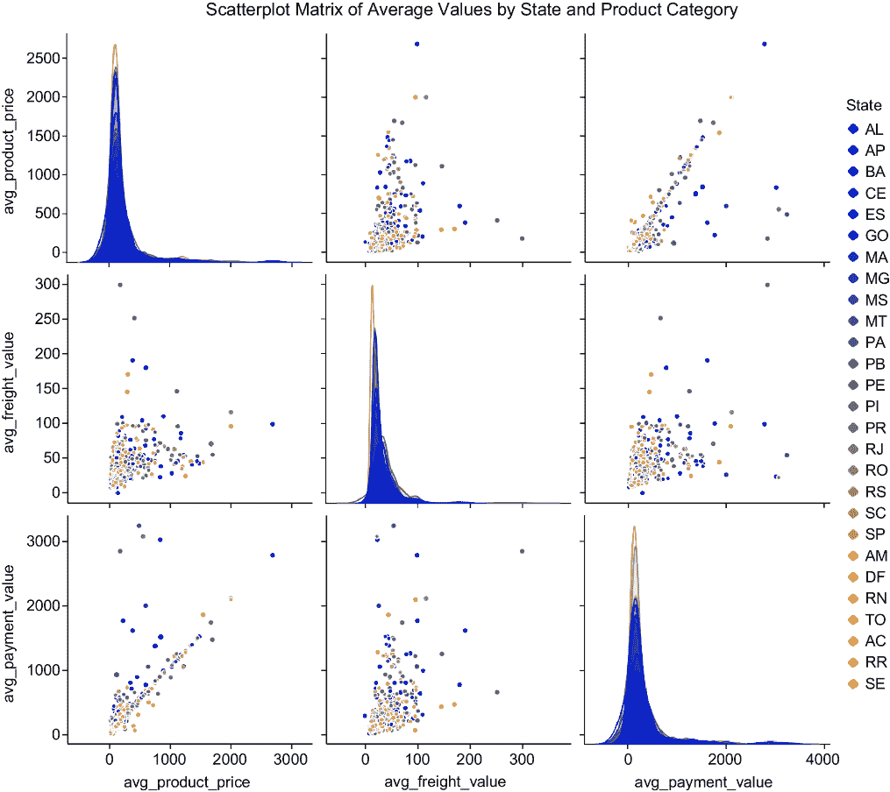

# 第四章：使用生成式 AI 进行结果解释

### 本章涵盖

+   通过构建分析摘要为生成式 AI 构建分析背景

+   向语言模型描述视觉结果的方法

+   使用生成式 AI 的建议来连接分析

+   询问生成式 AI 以得出分析结果的商业结论

在上一章中，你进行了一系列描述性分析，最终得到了相当多的图表和一些统计建模参数。太棒了！你现在可以打包所有这些内容，然后发送给你的老板，对吧？也许吧……这真的取决于你的老板。

在你的工作中，你可能会遇到不同类型的经理。其中一些人对分析非常精通，你将与他们合作，学到很多有用的东西。他们会接受你的结果，并与你讨论假设和方法；他们可能会要求你做一些在这个背景下你或你的生成式 AI 顾问都没有预料到的分析。一切都会很好。你需要小心的是那些对自己分析技能过度自信的老板。我们不会过多地讨论这种类型，因为与这些人打交道是心理学问题，而不是数据分析问题。

本章相关类型是那些不仅期望你提供结果，还期望你提出解释的老板。其中一些与我们所提到的第一类重叠，他们希望帮助你更好地理解业务并作为分析师成长。其他人太忙，无暇顾及绘制业务关键结论的琐碎任务。还有可能你将为自己所在的公司分析数据（在这个无疑很短的时期内，你的公司无法雇佣专职分析师）。

无论原因如何，你可能会发现自己处于一个需要对你准备的图表挠头的境地。为了获得最大的商业价值，你需要确保你对结果的解释是

+   *全面*—在解释结果时，重要的是要看到大局。确保你的结论与另一组数据不冲突。将所有发现综合考虑，以全面理解数据在告诉你什么。

+   *精确*—务必注意不要将你的解释扩展到数据实际显示的范围之外。坚持事实，避免做出数据不支持假设。记住，准确性比让数据看起来更有趣或更重要更重要。

+   *易于沟通*—确保你以每个人都能够理解的方式解释你的发现，无论他们是否是数据专家。使用清晰简洁的语言和视觉元素来分享你的见解。关键在于确保你的受众能够轻松地掌握并采取你提供的信息。

关于最后一点，你可能需要参与某种形式的故事讲述。（你可以从另一本优秀的 Manning 书籍中了解更多关于 AI 驱动的叙事，这本书恰如其分地命名为《使用生成式 AI 的数据叙事》，作者为 Angelica Lo Duca。）叙事构建技能超出了本书的范围，但在你解释的其他两个方面，生成式 AI 可以帮助你。本章将介绍如何获取有用的建议，从解释图表到用有意义的业务背景增强结果。

## 4.1 问题定义

在前面的章节中，我们向我们的生成式 AI 顾问询问了分析过程的结构及其实现细节，包括编写代码。然后我们通过我们创建的管道将真实业务数据传递进去，得到了一些结果。然而，目前利用生成式 AI 解释结果的一个重大限制是：我们的大部分结果都是图形格式，而这里讨论的大型语言模型（LLMs）正如其名，是语言模型，因此擅长文本导向的任务。

多模态生成式 AI 允许你上传你的图像进行分析。然而，我们发现，例如，在条形高度之间注册视觉上微小的差异所需的精度尚不存在。我们将局限于描述生成的图表并请求帮助解释。如果我们想充分利用生成式 AI 的力量，我们需要为我们的 AI 顾问提供适当的环境。

****我对巴西电子商务门户数据进行了系列分析。这些包括：

1.  描述性分析：

    +   每个州的产品类别流行度，导致 y 轴上的产品类别热图、x 轴上的州以及单元格中的销售价值；

    +   产品在类别和地区中的表现，导致以下结果：

        1.  矩阵散点图，显示平均支付价值、平均运费和平均产品价格之间的相互关系

        1.  分组条形图显示每个地区每个类别的平均产品价格之间的关系。

    +   按产品类别划分的评论分数分布，导致按产品类别划分的评论分数分组条形图

    +   订单状态，导致以下结果：

        1.  层叠条形图显示按产品类别划分的订单状态交付次数，

        1.  从一个州到另一个州的交货时间散点图

1.  推断性分析（基于置信区间）

    +   产品属性与运费之间的关系导致两个散点图和拟合回归线：

        1.  运费价值与产品重量的散点图

        1.  运费价值与产品体积的散点图

        1.  模型摘要

    +   产品属性和运输属性以及评论分数之间的关系，导致了一系列参数的模型准确性、混淆矩阵和逻辑序回归系数，这些参数包括`delivery_time`（配送时间）、`price`（价格）、`freight_value`（运费价值）、`product_name_lenght`（产品名称长度）、`product_description_lenght`（产品描述长度）、`product_photos_qty`（产品照片数量）、`product_weight_g`（产品重量克）、`payment_sequential`（支付顺序）、`payment_installments`（分期付款）、`payment_value`（支付价值）、`delivery_time_misestimation`（配送时间误估）、`product_volume`（产品体积）、`payment_type_boleto`（支付类型支票）、`payment_type_credit_card`（支付类型信用卡）、`payment_type_debit_card`（支付类型借记卡）、`payment_type_voucher`（支付类型代金券）；

    +   卖家之间在销售业绩和客户满意度方面的差异，导致了一系列可视化置信区间：

        1.  在不同州选定产品类别的平均销售价格，

        1.  在不同州选定产品类别的平均评论分数。

在接下来的提示中，我将问你一些关于解释结果和可能的商业相关结论的问题。

我们测试的所有模型都表现出了坚定不移的热情，并试图管理预期，解释我们可以从不同的分析中得出什么，并警告由于传递精确结果的有限能力，我们应该带着一点怀疑的态度接受他们的意见。如果我们曾经听到过什么好建议的话，那就是了！

## 4.2 产品类别的流行度

在上一章的 3.3 节中，你生成了按州和产品类别划分的销售量分解的可视化。现在让我们再次看看图 3.3 中的收入热图，这里以图 4.1 的形式呈现。


##### 图 4.1：按产品类别和州划分的销售量热图

我们可以看到，各州和产品类别之间存在差异。在我们向我们的 AI 顾问描述我们所看到的情况并检查它是否可以提供任何建议之前，让我们谈谈热图在商业决策中的实用性。

人们普遍拥有相当薄弱的视觉记忆。这就是我们为什么重复这张图片而不是仅仅提醒你在上一章中的编号，甚至只是描述它。因此，比较多个不相关的图表是非常困难的。在你将注意力转向新的可视化之前，旧的图表已经开始从你的记忆中淡出。将所有相关数据放在决策者的视野中非常重要。这就是所有类型的仪表板（应得的）受欢迎背后的原因。

热图将数百个与类别间关系相关的数据点呈现在你的视野中。然而，理念并非逐个分析。当然，如果你愿意，你也可以这样做。但在深入细节之前，你可能想要先从更宏观的角度观察，寻找某些模式：

+   *高性能点（价值极高的单个细胞）*—通过热图识别高性能点，能够发现特定产品类别表现优异的区域，突显了消费者需求和产品供应之间的强一致性。例如，富裕地区礼品和手表的强劲销售可能反映了高收入消费者群体对奢侈品的偏好，而年轻人群对移动互联网的广泛使用可能表明电子设备市场是一个主要市场。这些见解对于希望优化其战略的企业来说是无价的。建议可能包括在富裕地区扩大奢侈品产品组合以挖掘高收入市场，或针对年轻消费者推出旨在提高科技小玩意可见性和吸引力的定向营销活动。通过利用数据来定位产品与消费者细分市场之间卓越匹配的区域，企业可以制定针对性的战略，利用这些机会，推动销售和促进增长。

+   *低性能点（价值极低的单个细胞）*—在热图上识别低性能点可以揭示某些产品类别在特定地区表现不佳，表明了供应与当地市场需求或偏好之间的不匹配。例如，高端电子产品在农村地区的困境可能表明了产品定价与当地购买力之间的差距，而老年人群对在线教育平台的低参与度可能表明了诸如数字素养或可及性等障碍。基于这些见解，企业应考虑多样化其产品组合或开发针对性的举措，如外展项目，以更好地吸引这些代表性不足的消费者群体并提高整体市场表现。

+   *独特类别表现（多个交叉类别中的类别表现较低或较高）*—在多个交叉类别中出现的过度或不足表现趋势（例如，多个产品类别中的高表现区域）可以提供对市场动态的广泛视角，包括影响消费者行为的经济学因素或文化影响。例如，沿海地区对户外和健身产品的持续需求反映了生活方式偏好，而在拥有众多教育机构的地区，教育材料的流行可能突显了一个社区的教育价值观。认识到这些模式使企业能够微调其库存和营销策略，例如在沿海地区引入更多样化的生活方式产品，或在学术中心与教育机构进行合作营销，从而利用区域优势来提升销售和客户参与度。

+   *新兴热点（随着时间的推移而成为高价值区域的细胞）*——新兴热点的概念，即特定区域随着时间的推移开始显示某些产品类别的销售额增加，突出了不断增长的市场机会。这一趋势，通过比较不同时间段的 heatmap（热图）观察得最为明显，表明了消费者需求或兴趣的变化。郊区家庭办公设备销售的显著增加可能反映了远程工作趋势的适应，而城市中健康和保健产品的激增可能表明城市居民对健康的意识日益增强。那些通过备货热门产品并创建针对性营销活动迅速适应这些趋势的企业可以抓住增长机会，在新兴市场中建立强大的地位。

+   *季节性变化（一年中不同时间模式的变化）*——通过分析一年中不同时间段的 heatmap（热图）可以看出产品流行度的季节性变化，强调了诸如天气、节假日或学术日历等因素对消费者购买行为的影响。在较暖和地区夏季空调和沙滩装销售的激增，或者在开学季节对文具和教育书籍需求的增加，都是季节性如何影响购物模式的例证。与这些季节性趋势相一致的库存规划和促销活动对于企业至关重要。预测并应对季节性需求确保企业能够抓住销售高峰潜力，优化全年收入生成。

通过识别这些洞察并将其作为战略决策的基础，你可以帮助你的业务更好地将产品供应、营销努力和库存管理与其区域消费者行为和市场动态相一致，或者通过个性化体验来增强客户参与度，优化供应链效率以降低运营成本，通过识别未满足的需求来促进产品开发创新，并自信地进入新市场以推动可持续增长。

然而，成功的关键不仅在于注意到发生了什么，还在于理解为什么会发生。让我们尝试探究生成式 AI 顾问是否能够帮助我们解释从巴西电子商务中得出的 heatmap。这是我们提出的问题：

**** 我查看了一个展示按销售发生州和销售产品类别划分的销售收入的 heatmap。我可以看到一些州（例如，SP）的平均销售额远高于其他州——我们谈论的是数量级上的差异。一些州的销售额几乎为零（例如，RR，AP）。我还可以看到产品类别之间的差异。“汽车”、“健康与美容”和“手表礼物”比“音乐”或“时尚童装”更受欢迎。我应该如何解读我的结果，以及可以采取哪些行动来改善我们的业务？

关于这一点，我们从 ChatGPT 4 那里得到了以下回答：

****您从热图中观察到的结果突出了巴西电子商务领域销售绩效在区域和类别方面的显著差异。以下是解读这些结果和潜在的商业改进措施：

解释：

1.  区域销售差异：

    1.  SP（圣保罗）销售量高：圣保罗的高销售量可能归因于其作为主要经济中心，拥有较高的人口密度、更强的购买力，以及可能更好的物流基础设施。这表明了高需求和高效的履行能力。

    1.  RR（罗赖马州）、AP（亚马孙州）销售量低：这些州几乎为零的销售量可能反映了几个因素，包括较低的人口密度、可能较低的经济活动，或物流和配送基础设施的挑战，这使得有效服务这些市场变得困难。

1.  类别流行度：

    1.  “汽车”、“健康与美容”和“手表礼品”的流行度：这些类别成功可能是由更广泛的市场趋势、消费者偏好或可能是您平台在这些细分市场中的竞争定价、产品组合和营销有效性所驱动。

    1.  “音乐”和“时尚童装”类别流行度较低：这些类别可能正面临来自专业平台、音乐数字流媒体或简单地未能与其他类别一样很好地满足消费者需求或偏好的激烈竞争。

商业改进措施：

1.  区域定制和扩张策略：

    1.  加强对高性能状态的专注：对于 SP（圣保罗）这样的州，考虑加大营销力度，扩大产品范围，并提升物流以利用高需求。

    1.  在表现不佳的州进行市场开发：对于销售量低的州，进行市场研究以了解进入障碍和消费者需求。考虑针对性的营销活动、与当地企业的合作或物流调整以改善市场渗透。

1.  类别特定策略：

    1.  利用热门类别：通过扩大产品线、提供促销活动和采用针对性营销，进一步投资“汽车”、“健康与美容”和“手表礼品”类别，以利用它们的流行度。

    1.  激活表现不佳的类别：对于“音乐”和“时尚童装”等类别，考虑重新审视您的产品范围、定价策略和营销努力。与知名品牌、影响者或独家交易合作也可能重新激发对这些类别的兴趣。

1.  定制营销和促销：利用数据定制针对特定州和产品类别的营销活动和促销。这可能包括个性化的电子邮件营销、区域广告活动或为落后地区或类别提供的特别促销。

1.  物流和配送优化：调查在表现不佳的州改善物流和配送服务的可行性。这可能涉及探索新的运输合作伙伴、优化配送路线或提供快速配送选项的激励措施，以增强客户满意度和提高销售额。

1.  持续监控和调整：定期审查销售数据和客户反馈，以便快速识别消费者行为或市场动态的变化，从而允许快速调整策略。

通过调整你的方法以利用分析中突出的优势和弱点，你可以推动销售增长，改善市场渗透，并提高各地区和产品类别的客户满意度。

Gemini 高级生成式 AI 提供了以下关于各州销售情况的信息：

+   **** 高销售与低销售州：例如 SP 和 RR、AP 等州之间的销售收入的显著差异表明地理分布不均。这可能归因于各种因素，包括：

    1.  人口密度：人口较多的州可能拥有更多的潜在客户。

    1.  经济因素：可支配收入较高的州可能会在电子商务上的支出增加。

    1.  营销覆盖范围：你的营销努力可能没有在所有州都达到同等效果。

    1.  产品与市场匹配度：你提供的产品类别可能并不完全符合某些州的需求和偏好。

+   产品类别流行度：

    1.  高流行度与低流行度类别：例如“汽车”和“音乐”类别之间的流行度差异表明不同类别之间存在不同的客户需求。

可能采取的行动：

1.  解决不均匀的地理分布问题：

    1.  分析客户人口统计：了解不同州的年龄、收入和互联网普及率等人口统计因素。这有助于识别具有未开发客户基础的潜在市场。

    1.  目标营销：根据各州的 demographics 和产品偏好定制你的营销活动。

    1.  物流优化：分析不同州之间的运输成本和配送时间。考虑如区域仓库或与当地配送提供商合作等选项，以提高效率并在人口较少的地区可能降低成本。

1.  提升产品与市场匹配度：

    1.  分析特定类别的销售趋势：调查每个类别中单个产品的表现。这有助于识别在流行类别中的表现不佳的产品，或在不太流行的类别中引入新产品以迎合特定州偏好的潜力。

    1.  本地化产品提供：考虑提供针对不同地区特定需求和偏好的产品。

    1.  A/B 测试：在不同州测试不同的营销策略和产品提供，以了解哪些最能引起当地客户的共鸣。

此外：

+   跟踪实施行动的有效性：监控你的变化对销售、客户满意度和地理分布随时间的影响。

+   投资客户关系管理（CRM）：通过收集和分析客户数据来建立一个强大的客户基础，了解他们的偏好并个性化他们的购物体验。

通过实施这些建议并持续分析你的数据，你可以深入了解你的客户基础，并针对不同地区和产品类别采取有针对性的行动来改善你的业务表现。

两位生成式 AI 提供的解释似乎都很有道理，这些建议对于一个市场营销学一年级学生来说是很有价值的。这里有一个重要的教训可以学习。你还记得我们提到过你的解释需要全面、精确且易于传达吗？这些答案模糊的原因在于我们提示中的细节不足。

不可能的事情不存在  这个标题是一个明显的谎言！数据分析的世界充满了局限性。在第二章中，我们解释了你的分析只能与你可用的数据一样好。生成式 AI 似乎被训练去尊重这些限制，并且不愿意在模糊数据的基础上提供具体的建议。

作为测试，我们将我们构建的图 4.1 的整个表格上传到 ChatGPT，但没有得到任何商业洞察。相反，我们得到了一组与第二章和第三章中我们所做的非常相似的数据处理和可视化指令。虽然 ChatGPT 能够在有限的数据集上进行简单的分析，但部署一个全面的多步骤分析流程仍然需要数据分析师。

如果你仍然想要获得更具体的商业答案，你能做什么？提供更多数据。专注于地区或产品，使分析更加具体。由于从图表中重新输入数据似乎不可行，让我们请求一个生成式 AI 提供代码，以提供每个州的收入。

##### 列表 4.1 创建按州收入表

```py
*# Set your desired product category*
selected_product_category = 'your_product_category_here'

*# Filter the revenue_df to get the row with the selected product category*
category_data = revenue_df.loc[revenue_df['product_category'] == selected_product_category]

*# Drop the product_category column to have only state-revenue pairs*
state_revenue_pairs = category_data.drop(columns=['product_category'])

*# Transpose the DataFrame and reset the index to have state and revenue as columns*
state_revenue_pairs = state_revenue_pairs.T.reset_index()

*# Rename the columns*
state_revenue_pairs.columns = ['state', 'revenue']

*# Display the state-revenue pairs for the selected product category*
state_revenue_pairs
```

让我们使用列表 4.1 中的代码，并为我们的人工智能顾问提供按州收入的详细信息。在我们的案例中，我们将专注于健康与美容类别。

****对于健康与美容类别，我在对巴西各州收入的分析中得到了以下结果：

AC 1386.58, AL 12780.26, AM 2776.03, AP 1380.58, BA 51367.91, CE 32419.18, DF 29862.82, ES 20214.49, GO 28312.30, MA 12747.18, MG 157558.30, MS 11289.57, MT 15301.79, PA 23755.83, PB 16286.98, PE 41604.78, PI 10290.19, PR 54949.36, RJ 145298.62, RN 13886.47, RO 7085.76, RR 1050.61, RS 51327.72, SC 39760.16, SE 8883.66, SP 462305.22, TO 4798.99

使用你拥有的关于巴西、其地理、健康与美容市场、各州人口以及各州购买力差异的数据和信息，帮助我从中得出商业结论和建议。

ChatGPT 4 提供了以下分析：

****基于巴西各州健康和美容类别的收入数据，以及考虑该国的地理、人口和购买力差异，以下是一些商业结论和建议：

1.  专注于高收入州：圣保罗州（SP）和里约热内卢州（RJ）占收入的最大份额。由于这些州人口密度高、购买力强，因此在这些地区集中营销和促销活动以最大化销售是有意义的。

1.  适应区域差异：各州之间收入差异可能是由于区域偏好、气候差异以及特定的健康和美容关注点。调整产品供应以适应这些差异，并创建针对区域受众的营销活动，以引起共鸣。

1.  扩展至新兴市场：如收入较低的地区，如罗赖马州（RR）、亚马孙州（AP）和阿克里州（AC），可能存在未被开发的机遇。在扩展到这些地区之前，研究当地市场，考虑人口、人口统计和购买力等因素。为了进入这些市场，考虑与当地零售商合作或利用电子商务平台。

1.  优化分销和物流：巴西的大规模和不同的基础设施可能在产品分销上带来挑战。专注于优化您的供应链和分销网络，特别是在高收入州。与当地供应商和分销商建立强大的关系可以帮助确保产品及时高效地交付。

1.  利用数字营销和电子商务：利用在线营销和电子商务平台来增加覆盖范围，特别是在收入目前较低的地区。强大的数字存在可以帮助您与更多客户建立联系，深入了解他们的偏好，并推动销售。

1.  分析客户洞察：收集和分析客户数据和反馈，以更好地了解他们的偏好、需求和区域趋势。使用这些信息来改进产品供应、营销策略和客户体验。

1.  监控竞争和趋势：关注巴西健康和美容市场的行业趋势和竞争对手的活动。通过相应地调整策略和产品供应，保持领先地位。

1.  投资于企业社会责任：巴西多元化的民众关注环境和社交问题。投资于可持续实践并支持当地社区可以帮助改善您的品牌形象并推动客户忠诚度。

虽然这些建议基于提供的数据和巴西的一般知识，但在做出战略决策之前，进行进一步的研究并考虑其他因素，如市场规模、竞争和经济状况，是很重要的。

Gemini Advanced 随后生成了以下内容：

+   **** 东南部和东北部集中：数据显示，销售在东南部（SP, RJ, MG, ES）和东北部（BA, CE, PE）地区有显著集中。这与这些地区在巴西拥有最高人口数量以及可能比其他地区有更高的可支配收入相一致。

+   北部、中部-西部和某些南部州未开发的潜力：虽然像 SP 和 RJ 这样的州主导着销售，但在北部（AC, AM, RO, RR）、中部-西部（DF, GO, MS, MT, TO）和某些南部州（SC, RS）似乎存在未开发的潜力，尽管这些地区的销售相当低，但人口数量尚可。

销售下降的可能原因：

+   下降的购买力：销售额较低的地区可能平均收入较低，这会限制消费者在非必需品如健康和美容产品上的支出。

+   营销覆盖范围有限：您的营销努力可能无法有效触及这些地区，导致品牌知名度和客户获取率较低。

+   产品-市场匹配问题：当前的产品供应可能无法满足这些地区客户的具体需求和偏好。

可行动的建议：

+   目标营销：在销售较低的地区增加营销力度，关注与当地人口产生共鸣的数字渠道和策略。考虑使用当地意见领袖或定制信息以解决特定区域偏好。

+   本地化产品供应：分析当地趋势和偏好，了解这些地区最需要哪些健康和美容产品。考虑引入新产品或调整现有产品以适应当地市场。

+   合作伙伴和分销渠道：探索与当地零售商或分销商建立合作关系，以改善这些地区的产品可用性和可及性。

+   定价策略：考虑调整特定地区的定价策略，考虑到购买力和当地竞争。然而，在提供重大折扣时要谨慎，因为这可能会影响品牌形象。

其他考虑因素：

+   物流和配送成本：通过考虑潜在的物流和配送成本增加，分析扩大到销售较低地区的可行性。

+   文化因素：注意可能影响不同地区消费者行为的文化和偏好。

通过实施这些建议并持续监控结果，您可以扩大您的覆盖范围，提高市场渗透率，并在巴西各州的健康和美容类别中可能增加销售额。记住，针对每个地区的特定特征和需求定制策略对于获得最佳结果至关重要。

其中一些提出的建议似乎很显然，但也有一些显示了巴西市场的知识水平。根据你老板期望的详细程度，你可以在这里停止，或者与你的生成式 AI 顾问讨论每个建议的细节。

通用知识 vs. 专用工具  我们系统中使用的 ChatGPT 4 在广泛的数据库上进行训练，使其在各个主题上拥有广泛的知识。然而，必须意识到这些模型的本质使得它们即使在导致幻觉的情况下也会生成下一个答案的标记。因此，验证收到的答案是否基于事实和证据至关重要。

我们得出结论，你应该向你的生成式 AI 顾问询问其对分析主题的看法。它可能通过了解商业现实来补充你的分析工作。记住，一些 AI 也可以使用互联网来提供新鲜数据。

## 4.3 产品在其类别和区域内的性能

在第三章检查产品在其类别和区域内的性能时生成的散点图可能会让人眼花缭乱（图 3.4）。让我们再次在图 4.2 中查看它。



##### 图 4.2 平均支付值、平均运费值和平均产品价格之间关系的散点图

初看之下，我们可以看到产品价格与订单价值之间的关系，描述为`avg_payment_value`，几乎是线性的，而运费值与其他变量之间的关系则不那么明显。这就是从这个图中可以说的全部吗？让我们看看生成式 AI 的建议。

****从显示产品价格、运费值和订单值之间成对关系的散点图矩阵中，我可以得出哪些信息或结论？

****显示产品价格、运费值和订单值之间成对关系的散点图矩阵可以提供这些变量之间关系的见解，帮助你得出结论或识别趋势。以下是一些可能的观察和结论：

1.  变量之间的相关性：检查变量之间关系的方向和强度。正相关表示当一个变量增加时，另一个变量也倾向于增加，而负相关表示当一个变量增加时，另一个变量倾向于减少。强相关性可能表明变量相互影响或共享一个共同的潜在因素。

1.  异常值：识别可能影响变量之间关系的任何异常值。异常值可能是数据错误、独特情况或真正的极端案例的结果。调查这些异常值以了解它们对分析和结论的影响。

1.  价格敏感性：分析产品价格和订单价值之间的关系可以帮助你了解价格敏感性。如果高价产品往往具有较低的订单价值，这可能表明客户对价格更敏感，更倾向于选择价格更实惠的产品。

1.  货运价值影响：货运价值和订单价值之间的关系可以揭示运输成本如何影响客户购买行为。如果订单价值随着货运价值的增加而降低，这可能表明客户对运输成本敏感，更倾向于从提供较低货运价值的卖家处购买。

1.  地理因素：比较不同地区货运价值与产品价格或订单价值的散点图，可以突出区域间运输成本和客户偏好的差异。可能可以识别出高货运价值会阻碍客户购买的区域，或者客户更愿意为特定产品支付更高运输成本的区域。

1.  产品类别：分析不同产品类别的散点图矩阵可以揭示特定类别的趋势和偏好。有些类别可能产品价格和订单价值之间有更强的相关性，而其他类别可能显示出货运价值和订单价值之间更明显的关系。

1.  市场细分：基于观察到的产品价格、货运价值和订单价值之间的关系，你可以识别出具有不同偏好和行为的不同市场细分。这些信息可以帮助你针对营销活动，并调整你的产品供应以适应这些细分市场。

记住，相关性不等于因果关系。虽然散点图矩阵可以帮助你识别模式和关系，但在得出最终结论或做出战略决策之前，进行进一步分析和考虑其他因素是至关重要的。

这就是 GPT 支持可以带我们走多远。现在，我们需要耐心地分析每个展示的元素，如地理因素或产品类别。为了简洁起见，我们不会深入这个兔子洞。

## 4.4 审查分数分布分析

在第三章中，我们为每个产品类别的正面和负面评论数量制作了一个条形图。如果你在问自己为什么应该阅读关于条形图的讨论，你并不孤单。在我们数据之旅的开始，我们也想知道为什么应该制作一个。它们似乎如此微不足道。然而，本节可能是本书中最重要的一部分。

衣服不能造就人  任何分析的商业价值不在于其复杂性。把这句话用大字写在你的办公室墙上，并让它始终在你的视线范围内，而不是在你的背后。即使一种方法看起来很基础，从中获得的见解可能远非微不足道。这些见解可能成为数据驱动策略的基础，指导改进、营销和运营决策，这些决策可以显著影响企业的成功和客户满意度。通过从这种易于理解的分析方法开始，企业可以立即深入数据，发现更细微的见解，并根据直接客户反馈推动有意义的变革。

在尝试使第三章中对评论分数的分析更具可读性时，我们将可视化的数据点数量减少到可管理的数量（最初在图 3.8 中显示）。结果再次在图 4.3 中呈现。


##### 图 4.3 按产品类别分组显示的分组柱状图，展示了按产品组汇总的评论分数计数

初看之下，一个按不同产品类别显示正面和负面评论计数的分组柱状图可能显得很基础，但这种简单性掩盖了其分析能力。通过将评论分数汇总为正面和负面类别，并按产品类别进行分组，这张图表将复杂的消费者情绪提炼成一种易于理解、一目了然的形式。这种清晰度并不仅仅是让数据“更容易”消化；它提供了一种直观的方式来快速识别企业在产品线中的优势和劣势。

这种分析提供的一个关键见解是直接识别在客户满意度方面表现优异的产品类别与可能表现不佳的产品类别。这可以作为一个初步的诊断工具：一个类别中正面评论与负面评论的高比率表明市场契合度和客户认可度强，而低比率可能表明需要改进产品或服务的领域。

此外，这种汇总视图允许企业跨类别基准测试性能，培养内部竞争理解，并帮助优先考虑战略投资或产品开发的领域。例如，负面反馈高的类别可能需要进一步调查具体问题——无论是产品质量、客户期望还是服务交付——为有针对性的改进提供可操作的见解。

除了直接的产品改进策略之外，以这种方式分析评论分数还可以影响更广泛的企业决策。积极的评论趋势可以指导营销策略，突出在推广材料中强调的强项，或确定在活动中推广的热门产品。相反，理解负面反馈的细微差别不仅可以告知产品改进，还可以告知客户服务协议、退货政策，甚至供应链调整。

在扩展这个概念的基础上，这种分析方法并不仅限于订单审查。类似的策略可以应用于服务评估、购物体验的客户反馈，甚至不同部门的员工满意度。每种应用都能提供独特的见解，从识别最佳实践和优秀领域到确定挑战和增长机会。

然而，有一个陷阱。你注意到我们没有在先前的描述中直接提及一个对得出结论很重要的元素——在图表中不可直接看到的一个元素吗？为了评估市场契合度，你需要看的是柱状图的*比率*，而不是*高度*。当然，你可以使用尺子、一张纸、一支笔和一个计算器（可选），但这不是一个最优的方法。幸运的是，你的生成式 AI 顾问可以为你提供数字文具。

在我们的经验中，这里有一个有用的教训可以学习。有时，你会遵循你的协议，并在生成的图表中注意到一些有趣的东西。如果你的截止日期允许，你不应该严格遵循你的协议，而应该从这个新的角度查看数据。以下示例展示了您如何快速获取提取您感兴趣的数据所需的代码。

****我有以下 DataFrame `review_score_distribution`：

```py
    product_category_name_english    seller_id    review_score    count    review_category    product_category_group
0    agro_industry_and_commerce    06579cb253ecd5a3a12a9e6eb6bf8f47    4    1    Positive    Office & Industry
1    agro_industry_and_commerce    06579cb253ecd5a3a12a9e6eb6bf8f47    5    1    Positive    Office & Industry
2    agro_industry_and_commerce    0ed6ce5d87fd9c69eaacaeb778d67235    4    1    Positive    Office & Industry
```

我怎样才能得到一个值列表：`product_category_group`; `review_category`; `sum_of_counts`

****您可以使用 pandas 的`groupby()`函数按`product_category_group`和`review_category`对 DataFrame 进行分组，然后使用`agg()`函数计算计数总和。以下是完成此操作的代码：

```py
import pandas as pd

result = review_score_distribution.groupby(['product_category_name_english', 'review_category']).agg({'count': 'sum'}).reset_index()

*# Display the result*
print(result)
```

这段代码将为您提供一个包含列`product_category_name_english`、`review_category`和每个组的计数总和的新 DataFrame。

如您所见，生成式 AI 使得数据切片和切块变得容易。生成的 DataFrame 允许您轻松地处理分组数据。下一步是计算正面评论与负面评论（反之亦然）的比率。这可以通过一行代码完成。

##### 列表 4.2 计算正面与负面评论比率

```py
result['review_ratio'] = result.groupby('product_category_group')
↪['count'].transform(lambda x: x / x.sum())
     product_category_group    review_category    count    review_ratio
0    Auto & Accessories       Negative             965        0.229053
1    Auto & Accessories       Positive            3248        0.770947
2    Baby & Kids              Negative             790        0.255912
3    Baby & Kids              Positive            2297        0.744088
4    Electronics & Computers  Negative            4231        0.264124
5    Electronics & Computers  Positive           11788        0.735876
6    Entertainment            Negative            3844        0.225388
7    Entertainment            Positive           13211        0.774612
8    Fashion                   Negative             579        0.218491
9    Fashion                   Positive            2071        0.781509
10   Food & Drink             Negative             227        0.197220
11   Food & Drink             Positive             924        0.802780
12   Health & Beauty          Negative            2801        0.214373
13   Health & Beauty          Positive           10265        0.785627
14   Home & Furniture         Negative            7842        0.276098
15   Home & Furniture         Positive           20561        0.723902
16   Home Appliances          Negative             433        0.207276
17   Home Appliances          Positive            1656        0.792724
18   Miscellaneous            Negative             721        0.199061
19   Miscellaneous            Positive            2901        0.800939
20   Office & Industry        Negative            1270        0.271832
21   Office & Industry        Positive            3402        0.728168
22   Sports & Leisure         Negative            2942        0.226849
23   Sports & Leisure         Positive           10027        0.773151
24   Tools & Construction     Negative             422        0.240593
25   Tools & Construction     Positive            1332        0.759407
```

一些商业利益相关者可能更喜欢以表格的形式查看这样的结果，因此了解如何使用生成式 AI 从图表中提取所需数据是有用的，尤其是如果图表是由其他人生成的，而你抽到了补充他们工作的短签。这种情况是会发生的。

对于其他利益相关者来说，一张图片胜过千言万语。再次强调，使用生成式 AI 的帮助修改现有图表非常简单。

##### 列表 4.3 向现有的评论计数条形图添加带有比例的线条

```py
import matplotlib.pyplot as plt
import seaborn as sns

*# Set seaborn style*
sns.set(style="whitegrid")

*# Create a bar plot for counts*
ax1 = sns.barplot(x="product_category_group", y="count", hue="review_category", data=result)

*# Set x-axis label rotation*
ax1.set_xticklabels(ax1.get_xticklabels(), rotation=90)

*# Remove gridlines for the primary axis*
ax1.grid(False)

*# Create a second y-axis*
ax2 = ax1.twinx()

*# Remove gridlines for the secondary axis*
ax2.grid(False)

*# Filter results for negative review_category*
negative_results = result[result["review_category"] == "Negative"]

*# Create a line plot for negative review ratios*
ax2 = sns.lineplot(x="product_category_group", y="review_ratio", data=negative_results, ax=ax2, marker="o", color="red")

*# Set y-axis labels*
ax1.set_ylabel("Count")
ax2.set_ylabel("Negative Review Ratio")

*# Set the legend*
ax1.legend(title="Review Category", loc="upper left")
ax2.get_legend().remove()

*# Show the plot*
plt.show()
```

我们将忽略与库语法相关的错误，并专注于图 4.4 中呈现的结果。


##### 图 4.4 展示了按产品类别聚合到产品组中的聚合评论分数计数分组条形图，其中一条线表示负面评论与正面评论的比例

对于某些类别，你可以看到非常高的正面评论数量。其他类别则明显显示出高比例的负面评论。需要注意的是右侧的刻度。在这种情况下，绝对值的差异并不像从图表上的幅度所假设的那样显著。原始评论数（正面和负面）是该类别购买数量高的结果，所以比例是衡量客户对这些购买相对满意度的更好近似。不过，有一个警告：如果原始评论数真的很低，比例可能不具有代表性。

我们确实意识到在 Excel 中可以轻松实现类似的结果。我们进行这个练习是因为避免在不同环境之间移动数据非常重要。复制粘贴固有的风险——列可能会合并或拆分，公式可能会被原始数据覆盖，格式可能会混合（尤其是日期）。我们的猜测是，许多读者可以将这份潜在问题的列表变成一本小书。

## 4.5 订单状态

我们对这个分析部分充满了真正的好奇心。从上一章的图 3.9 和 3.10 的解释相对直接。大多数订单已经交付，这是我们应该预期的，因为我们正在处理五年前的数据。那些既未交付也未取消的订单应该逐个分析。是否有些系统错误导致了它们的状态，或者有其他原因？

交付时间的热力图显示了平均交付时间的大幅差异。让我们再次可视化第 3.10 图，作为第 4.5 图。


##### 图 4.5 展示了从一个州到另一个州的交付时间散点图，按对数正态尺度着色

平均交付时间差异是一个很好的话题，可以询问我们的生成式 AI 顾问。我们需要确保我们尽可能详细地描述感兴趣的模式。

****我有一个热力图，展示了按销售发生州和销售的产品类别划分的交付时间。我发现一些州的平均交付时间比其他州高得多——我们谈论的是数量级差异。我们还可以看到产品类别之间的差异，但并不那么显著。这样的结果可能由什么原因造成，我们可以采取哪些措施来改善我们的业务？

ChatGPT 4 返回以下答案：

****虽然我对巴西物流和分销的当前状况（截至 2021 年 9 月我的知识）没有最新的了解，但我可以提供一些可能有助于您解读结果的总体见解。

1.  基础设施：巴西拥有由道路、铁路、水路和航空运输组成的多样化交通系统。然而，基础设施的质量在不同地区之间可能存在显著差异，影响配送时间。例如，包括圣保罗和里约热内卢在内的东南部地区通常比北部和东北部地区拥有更好的基础设施。

1.  地理：巴西是一个广阔的国家，拥有多样的景观，包括大城市、偏远农村地区和亚马逊雨林。该国的地理特征可能会对物流和分销造成挑战，尤其是在向偏远地区或亚马逊雨林运输商品时。

1.  公路运输：公路运输是巴西商品运输最常见的方式。然而，某些地区的道路质量可能较差，导致延误和运输成本增加。此外，公路运输可能会受到天气条件的影响，例如某些地区的暴雨可能引发洪水。

1.  官僚主义和海关：在某些情况下，官僚主义和海关程序可能会减缓物流流程，尤其是在跨境运输或处理特定监管要求时。

1.  区域差异：巴西各地区之间存在显著的经济和社会差异，这可能会影响物流和分销系统的效率。像圣保罗、里约热内卢和其他东南部州这样的经济较发达地区通常拥有更好的物流基础设施和服务。

当分析不同巴西州之间订单的平均配送时间时，请考虑上述因素。您可能会发现配送时间和特定地区、基础设施质量或地理挑战之间的模式和相关性。这些信息可以帮助您确定可以改进的领域或可能需要替代分销策略的领域。

Gemini 高级返回以下结果：

******理解差异**

州间平均配送时间的显著差异是潜在运营或物流问题的关键指标。可能的原因包括：

州特定因素：

地理挑战：拥有广阔距离、山地地形或基础设施薄弱的州可能会经历更长的配送时间。

人口密度：城市地区通常拥有更好的配送基础设施，而农村地区可能会面临挑战。

运输商表现：不同州的运输商表现可能存在显著差异。

仓库或配送中心位置：仓库与客户之间的距离可能影响配送时间。

地方法规：不同州可能有不同的法规，这些法规会影响运输和配送。

产品类别因素：

产品尺寸和重量：较大或较重的产品通常有更长的配送时间。

产品易碎性：需要特殊处理或包装的产品可能导致配送速度减慢。

库存可用性：不同仓库的库存水平可能影响订单履行速度。

订单处理时间：订单的复杂性（例如，多个项目、定制）可能影响处理时间。

**提升业务绩效**

为了解决这个问题，请考虑以下措施：

数据分析和优化：

深入分析：在更细粒度级别（城市、邮编）分析配送时间，以确定具体问题区域。

相关性分析：探索配送时间与其他因素（例如，订单价值、订单量）之间的相关性。

客户细分：根据客户细分（例如，住宅、商业）分析配送时间，以识别模式。

运营改进：

承运人绩效评估：评估不同州不同承运人的表现并优化承运人选择。

仓库网络优化：评估仓库的位置和容量，以确保高效分销。

库存管理：提高库存水平和分销，以减少缺货并加快装运。

订单履行流程改进：简化订单处理以最小化延误。

运输路线优化：使用路线规划软件优化配送路线并减少旅行时间。

技术解决方案：

实时跟踪：实施实时跟踪系统以监控装运并识别潜在的延误。

配送时间估算：向客户提供准确的配送时间估算。

高级分析：利用数据分析来预测配送时间并优化运营。

客户体验：

沟通：向客户告知订单状态和任何潜在的延误。

配送选项：提供灵活的配送选项（例如，时间段、取货地点）以满足客户需求。

通过结合数据驱动的见解和运营改进，您可以有效地解决配送时间差异并提高整体客户满意度。

您是否想深入了解这些领域的任何一项？

你可以看到不同生成式 AI 之间的差异。ChatGPT 将答案与巴西多样化的地理和基础设施质量的差异联系起来，展示了地区间的经济发展如何显著影响销售收入。我们还了解到，诸如运输方式、道路质量、天气条件、官僚主义、海关程序和地区经济差异等因素可能导致州与州之间以及产品类别之间的销售差异很大。然而，请记住，ChatGPT 有一个知识截止点，因此最好确认其发现。

天秤座坚持模糊的“好的建议”。

让我们看看我们是否现在能获得一些具体的见解。让我们选择两个州的对，并询问我们的 GPT 顾问关于预期的差异。

****鉴于这种情况，我应该如何预期里约热内卢（RJ）到埃斯皮里图桑托（ES）的交货时间与塞阿拉（CE）到米纳斯吉拉斯（MG）的交货时间相比？

****里约热内卢（RJ）和埃斯皮里图桑托（ES）是巴西东南部地区的相邻州。这个地区与国家其他地区相比，通常拥有更好的基础设施，包括道路和高速公路。因此，由于它们地理位置相近以及该地区交通基础设施的质量，你可以预期 RJ 和 ES 之间的运输时间相对较短。

另一方面，东北部的塞阿拉州（CE）和东南部的米纳斯吉拉斯州（MG）相距较远。这些州之间的距离显著大于里约热内卢（RJ）和埃斯皮里图桑托（ES）之间的距离，这可能导致更长的交货时间。此外，尽管 MG 位于基础设施通常较好的东南部地区，但 CE 位于东北部地区，在某些地区可能交通基础设施发展较慢。这个因素也可能导致 CE 和 MG 之间运输的交货时间更长。

总结来说，你应该一般预期里约热内卢（RJ）和埃斯皮里图桑托（ES）之间的运输时间比塞阿拉（CE）和米纳斯吉拉斯（MG）之间要短，因为它们地理位置相近，东南部的交通基础设施较好。然而，需要注意的是，由于每个州内具体位置、使用的运输类型以及其他因素，如天气条件或官僚程序，交货时间可能会有所不同。

如果一名员工能像 ChatGPT 那样迅速而全面地提供答案，我们不仅会给他们加薪，还会加倍，并且额外赠送一份薯条作为奖励。ChatGPT 指出，巴西各州之间的交货时间很大程度上取决于它们的地理位置和当地交通基础设施的质量。例如，位于基础设施较好的东南部地区的相邻州里约热内卢（RJ）和埃斯皮里图桑托（ES）之间的交货时间预计会较短。

然而，由于地理位置距离和基础设施发展可能存在的差异，从东北部的塞阿拉（CE）到东南部的米纳斯吉拉斯（MG）的运输可能需要更长的时间。此外，每个州内的具体位置、使用的运输类型以及其他因素，如天气条件或官僚程序，也可能影响运输时间。很明显，即使图表中的数据太多，无法挤进文本提示中，图表本身也难以描述，但经过良好训练的生成式 AI 在解读结果时仍然可以证明其价值巨大。

## 4.6 产品属性与运输成本之间的关系

我们从未真正期望对产品属性与运输成本之间关系的研究能揭示任何震撼性的发现。相反，花时间学习回归分析，这是最强大的分析工具之一，将是值得的时间。在第 3.4.2 节中，我们向您展示了一系列（并非全部）可能的应用领域。但得到结果是一回事。理解它……这正是分析的价值所在。

你可能会预期只有大的 R²值才值得报告（回想一下，R²值是衡量因变量变异性中有多少百分比是由自变量或测试变量的变化所解释的指标）。这些当然是最受商业利益相关者欢迎的值。谁不想展示一张显示“85%的销售额是由我们卓越的营销驱动的”幻灯片呢？我想产品开发和客户支持可能会变得绿色，但吹嘘的权利并不是唯一值得追求的商业驱动因素。

另一个例子来自我们的经验。一家公司投资了一场大规模的保留活动。事实上，这场活动如此激进，以至于接触到它的客户不太可能再次购买该产品！这个事实被活动隐藏了很长时间，该活动使用了受益于真正激怒客户的反馈调查，他们不愿意浪费时间在该公司上。回归测试中，负的 R²参数值表明了完全不同的故事。但这并不是教训的结束。公司的资深管理层不愿意承认错误，继续发送激进的信息，直到公司破产。

这是否意味着你应该关注大的正或负 R²值？是的，但也不完全是。这样的值很重要，但这并不意味着接近零的 R²值不重要。假设你有一天走进办公室，发现自己被恐龙的实物模型包围。人力资源部门提出了“恐龙办公伙伴”的想法。他们决定通过触发员工对响亮、意外的咆哮声的“战斗或逃跑”反应来提高他们的生产力。几周后，你被要求分析这个想法的有效性。如果利益相关者很幸运，每小时咆哮次数与生产力指标之间的关系 R²将在零附近波动；否则，你可能处于负 R²范围内。

让我们回到产品尺寸和重量与运输成本之间的关系。在供应链管理领域，你可能会遇到回归分析可以帮助你了解产品尺寸或重量如何影响运输成本，并引导你的公司重新设计产品以提高效率，从而在物流费用上可能节省数百万的情况。

让我们看看查询生成式 AI 关于回归分析结果是否值得。

**** 我一直在测试产品属性（在这种情况下，其尺寸和重量）与运输成本之间的关系。

我运行了线性回归模型，以下是一些结果：

```py
Product Weight Model: MAE=6.89, MSE=156.77, RMSE=12.52, R2=0.37
Product Volume Model: MAE=7.41, MSE=163.70, RMSE=12.79, R2=0.34
Then I tried to combine the two and got the following model summary:
 OLS Regression Results                            
===========================================================================
Dep. Variable:       freight_value   R-squared:                       0.399
Model:                         OLS   Adj. R-squared:                  0.399
Method:              Least Squares   F-statistic:                 3.744e+04
Date:             Sun, 09 Apr 2023   Prob (F-statistic):               0.00
Time:                     15:38:56   Log-Likelihood:            -4.4203e+05
No. Observations:           112632   AIC:                         8.841e+05
Df Residuals:               112629   BIC:                         8.841e+05
Df Model:                        2                                         
Covariance Type:         nonrobust                                         
===========================================================================
                    coef    std err        t   P>|t|     [0.025      0.975]
---------------------------------------------------------------------------
const            13.7268      0.044  314.740   0.000     13.641      13.812
product_weight_g  0.0016   1.63e-05  101.023   0.000      0.002       0.002
product_volume    0.0002   2.61e-06   70.759   0.000      0.000       0.000
===========================================================================
Omnibus:                105287.730   Durbin-Watson:                   1.815
Prob(Omnibus):               0.000   Jarque-Bera (JB):         12678300.032
Skew:                        4.145   Prob(JB):                         0.00
Kurtosis:                   54.311   Cond. No.                     3.37e+04
===========================================================================
```

从这些结果中，我的业务能得出哪些实用的结论？

ChatGPT 4 的响应如下：

**** 基于线性回归模型的结果，以下是一些针对你业务的实用结论和潜在行动：

1.  产品重量和体积都是确定运输成本的重要因素。`product_weight_g`和`product_volume`的正系数表明，随着产品重量和体积的增加，运输成本也会增加。

1.  单个模型（重量为 0.37，体积为 0.34）和组合模型（0.399）的 R²值表明，这些模型解释了运输成本中大约 34-40%的变异性。尽管这不是一个非常强的关系，但它表明还有其他因素也影响着运输成本。探索可能影响运输成本的其他因素可能是有用的，例如起点和目的地之间的距离、运输提供商或运输速度。

1.  由于重量和体积都会影响运输成本，你可以考虑优化你的包装以最小化运输成本。这可能包括使用更轻的包装材料或设计更紧凑的包装以减少总体体积。

1.  你还可以考虑根据产品的重量和体积向客户提供不同的运输选项，让他们在更实惠、较慢的配送选项和更快、更贵的选项之间进行选择。

1.  在采购或开发新产品时，考虑运输成本。考虑产品的重量和体积以及它们可能对客户整体成本的影响。由于运输成本较低，较轻且紧凑的产品可能对客户更具吸引力。

请记住，这些结论是基于提供的模型及其假设，现实生活中的情况可能需要考虑其他因素。此外，使用更多数据和进一步分析验证模型以确保其准确性和可靠性至关重要。

Gemini 高级返回以下结果：

****是的，绝对可以！让我们分析这些回归结果告诉我们什么，并关注这些结果对您业务的实际应用：

理解模型

+   MAE、MSE、RMSE：这些都是误差指标：

    1.  MAE（平均绝对误差）：预测运输成本与实际成本之间的平均绝对差异。在两种模型中，平均误差约为 6-7 美元。

    1.  MSE（均方误差）：与 MAE 类似，但它平方了误差，强调了更大的错误。

    1.  RMSE（均方根误差）：MSE 的平方根，使其更容易以与您的成本（美元）相同的单位解释。

+   R2（决定系数）：表示您的模型解释了运输成本变化的多少。在两种情况下，大约 34-39%的成本变化被模型捕捉。虽然不是特别高，但这仍然很有用。

主要结论

1.  重量和体积都很重要：组合模型证实，产品重量和体积都与运输成本呈正相关。这意味着较重和体积较大的物品运输成本更高。

1.  重量可能稍微更重要：在组合模型中，`product_weight_g`的系数略大于`product_volume`的系数。这表明额外的克重量可能比额外的立方单位体积增加的运输成本更多。

实际应用

+   定价和成本估算：

    1.  使用这些模型为您网站上的客户提供更准确的运输估算。即使是运输成本的粗略估计也能改善客户体验。

    1.  调整产品价格以考虑基于尺寸和重量的不同运输成本，特别是对于较重或较大的产品。

+   优化产品设计：

    1.  如果可能，考虑设计变更以减少产品重量和体积，同时不牺牲价值。这可能会带来长期运输成本的节约。

+   与承运人谈判：

    1.  在与承运人谈判费率时，展示产品属性与运输成本之间的关系。这可能为您争取更好的交易提供优势。

+   客户沟通：

    1.  在运输成本中明确尺寸和重量因素的作用。帮助客户理解为什么某些物品的运输成本更高，并鼓励他们考虑合并订单。

+   重要注意事项：

    1.  其他因素：记住，还有其他变量会影响运费（目的地、承运人、燃油附加费等）。此模型提供了一个专注的视角，但并未涵盖所有内容。

    1.  数据质量：您结果的准确性在很大程度上取决于您的运输成本和产品尺寸数据的质量。

    1.  改进空间：这些模型还有改进的空间。你未来可能会探索更多的变量或不同的建模技术。

如果您想让我考虑您业务（定价、物流等）的特定方面，我可以进一步定制应用！

ChatGPT 分析了给定的回归模型结果，并得出结论，产品重量和体积对运费有显著影响，解释了这些成本中 34-40%的变异性。我们也可以从 R²值中看出这一点。然而，一般建议可以传达给管理层供其考虑。

Gemini Advanced 更为具体，并朝着正确的方向迈出了重要的一步。它将回归误差转换成美元（数据可能是巴西雷亚尔，但在这里并不重要）。

金钱说话  如果您想让管理层看到您工作的价值，将其转化为货币价值。这在所有类型的分析中都是普遍适用的。在做出决定之前，他们无论如何都需要这样做。

在下一节中，我们将进一步探讨生成式 AI 在检测与销售产品相关的不同参数之间的关联和可能因果关系方面的能力。

## 4.7 产品、交易、运输属性和评论评分之间的关系

当您刚开始接触数据分析时，序数逻辑回归可能看起来是一个不必要的复杂工具。事实是，它是一个必要的复杂工具。

想象一下，您正在分析对处方药物方案的依从性。这个变量可以分为“从不遵守”、“有时遵守”、“经常遵守”和“始终遵守”等水平。您的老板要求您计划如何测试新的患者教育项目对慢性病患者药物依从性的影响。

使用序数逻辑回归，您可以通过检查项目实施前后依从性水平的变化来调查项目的效果。可以考虑的因素包括教育的彻底性、患者对副作用的反馈以及随访咨询的频率。

结果可能显示，例如，那些高度评价教育项目的患者与未参与项目的患者相比，更有可能属于“始终遵守”类别，概率高出 40%。或者，它可能揭示，经历中度到重度副作用的患者，更有可能落入“从不遵守”或“有时遵守”的类别，这突显了针对这些副作用采取针对性策略的必要性。

使用有序逻辑回归分析数据并不仅限于找出什么有效或无效。它可以帮助你预测未来趋势并做出明智的决策。如果你能证明你服务的某个方面，如个性化客户支持，显著提高了满意度，这将有助于你的公司提升这些领域并产生积极的结果。

在 3.4.3 节中，我们提到有序逻辑回归的系数与线性回归的系数有些相似。我们还提醒你，在有序逻辑回归的情况下，应特别谨慎地解释系数，尤其是如果，像我们分析的数据那样，模型的拟合优度统计量（例如，R²、AIC）表明模型可能不足以捕捉预测变量和响应变量之间的关系。

存在于“某事在一定程度上依赖于另一件事”的灰色区域的结果，总是很好的候选对象，可以用来检验你的生成式 AI 顾问。

****我分析了产品、交易、运输属性与评分之间的关系。我使用了有序逻辑回归。

我得到了以下结果：

```py
1\.   Coefficients:
delivery_time: -0.04926184129232652
price: 0.0016396437688542174
freight_value: 0.003087605979194856
product_name_lenght: 0.013890193611842357
product_description_lenght: 1.938890383573905e-05
product_photos_qty: 0.4213701136980763
product_weight_g: -8.756509636657266e-06
payment_sequential: 0.35978743241417466
payment_installments: 0.02936386138061978
payment_value: -0.001722960231783981
delivery_time_misestimation: 0.02821300240733595
product_volume: 9.504512398147115e-07
payment_type_boleto: 0.1329365830670677
payment_type_credit_card: 0.22320994812520034
payment_type_debit_card: 0.013163990732791755
payment_type_voucher: -0.005952023594428278
2\.  Accuracy: 0.43035067573535907
3\.  Confusion Matrix:
 [[  385    70   401  1637  1302]
 [   38    13    71   563   513]
 [   55    16   109  1342  1365]
 [   49    18   100  2909  3501]
 [   54    23   208  8021 11200]]
```

如果我运营一个电子商务平台，其中多个卖家向买家提供产品，我能得出关于我的业务的哪些结论？

ChatGPT 4 返回了以下响应：

****从有序逻辑回归分析中得到的结果揭示了影响你电子商务平台评分的几个重要因素。让我们分析这些发现，既要考虑统计显著性（由系数暗示），也要考虑它们对业务的实际影响。模型的准确率为 43.03%，虽然不是特别高，但确实表明所考虑的变量解释了评分差异的一部分。

1.  系数解释：

    1.  交货时间（-0.04926）：正如预期的那样，较长的交货时间会对评分产生负面影响。这表明提高交货速度可以直接提升客户满意度。

    1.  价格（0.00164）和运费价值（0.00309）：这些系数为正值，但鉴于其数值较小，对评分的影响可能不太显著。价格敏感度在不同产品类别之间可能差异很大。

    1.  产品名称长度（0.01389）：较长的产品名称，可能意味着更详细的描述，略微提高了评分。这可能表明客户喜欢更清晰的信息。

    1.  产品描述长度（非常小的正向影响）：虽然统计上显著，但由于系数较小，其实际影响可能微不足道。

    1.  产品图片数量（0.42137）：有显著的正向影响，表明拥有更多图片的列表会导致更高的满意度。视觉信息对客户决策至关重要。

    1.  产品重量（轻微的负面影响）：轻微的负系数可能与运费或处理期望有关，但鉴于其幅度，可能不是主要问题。

    1.  支付属性：

        1.  顺序（0.35979）和分期付款（0.02936）：正系数表明支付选项的灵活性对客户满意度有积极影响。

        1.  支付价值（负面）：更高的整体支付金额略微降低满意度，可能反映了更高的期望或高价位的购买者后悔。

        1.  支付类型：信用卡支付显示出最大的正面影响，表明用户偏好或更高的满意度，而代金券略微降低满意度。

    1.  交货时间估计错误（0.02821）：当交货估计不准确（无论是提前还是延迟未指定）时，略微增加评论评分，表明客户可能欣赏保守的交货估计或对提前交货感到惊喜。

    1.  产品数量（轻微的正面影响）：其影响微乎其微，表明产品的大小不是评论评分的重要决定因素。

1.  模型的预测性能（准确度 & 混淆矩阵）：

    1.  准确度虽然不可忽视，但仍有很大的改进空间。这表明评论评分存在内在的不确定性或需要额外的或不同的解释变量。

    1.  混淆矩阵显示在准确预测极端评论评分（1 和 5）方面存在重大挑战，倾向于预测中间范围。这可能表明模型问题（例如假设序数结果的线性）或客户满意度受模型未捕捉到的因素影响。

商业影响：

+   优先考虑速度和准确性在交货中：投资于物流以提高交货时间和估计的准确性可以直接提高客户满意度。

+   提升产品列表：关注提高产品照片和详细描述的质量和数量，以帮助购买决策过程。

+   优化支付选项：提供并可能推广灵活的支付选项，包括信用卡使用，可以提高满意度。

+   定价和运费评论策略：虽然影响很小，但了解定价和运费对不同产品类别的微妙影响可能提供竞争优势。

+   其他因素：考虑到模型的适度准确度，探索当前分析中未包含的其他变量是值得的。这些可能包括卖家绩效指标、客户服务互动以及更细致的运输/交货体验。

您的分析提供了宝贵的见解，但也突出了客户满意度的复杂性质以及可能需要更细致的模型或更多数据来完全理解和预测平台上评论评分的潜在需求。

Gemini Advanced 也回答了这个问题：

****让我们分析这些有序逻辑回归结果告诉我们关于影响产品评价分数的因素以及如何应用它们来改善你的业务。

理解有序逻辑回归

有序逻辑回归适用于你的结果变量是有序的情况，如评价分数（例如，1 星，2 星等）。以下是解释关键元素的方法：

+   系数：

    1.  正系数：表示该变量的增加与更好评价分数更高的可能性相关。

    1.  负系数：表示该变量的增加与更差评价分数更高的可能性相关。

    1.  系数的大小：系数的绝对值越大，与评价分数的相关性越强。

+   准确性：这告诉你模型正确分类到评分类别的评价百分比。43%的准确率表明你的模型比简单猜测做得更好，但仍有很大的改进空间。

+   混淆矩阵：这显示了你的模型预测与实际评价分数的比较。对角线读取为正确预测，其他单元格显示错误分类。

关键要点

1.  交货与价格最重要：`delivery_time` 和价格分别具有最大的负系数和正系数。这强烈表明：

    1.  迟到交货对评价分数有害。

    1.  价格更高的商品可能导致更高的期望，增加得分更高和更低的可能性。

1.  其他显著因素：

    1.  `product_photos_qty`：更多的产品照片似乎有助于提高评价分数。

    1.  `payment_type`：有趣的是，支付类型影响评分，信用卡是最受欢迎的。

    1.  `payment_sequential` 可能表明客户是首次购买者还是回头客，后者可能更宽容。

1.  微不足道或令人困惑的因素：

    1.  几个变量的系数非常小，表明影响最小（`product_weight_g`，`product_volume`，`freight_value`）。

    1.  `delivery_time_misestimation` 有一个微小但正的系数。这是反直觉的，可能需要进一步调查你如何计算这个变量。

实际应用

+   优先考虑准时交付：高度重视及时交付，因为这会对客户满意度产生最显著的影响。

+   竞争性定价策略：平衡提高价格的需求与满足客户期望和避免负面评价的需要。

+   投资产品摄影：添加更多高质量的产品照片，让客户清楚地了解他们所购买的商品。

+   理解支付偏好：探索支付方式如何影响评价。或许信用卡购买与更高价值的订单相关？

+   针对回头客：由于他们似乎更有可能给出更好的评价，实施建立客户忠诚度的策略。

重要注意事项

+   准确性限制：模型的准确性为未包含的其他重要因素留下了空间。考虑收集关于额外变量（产品质量、客户服务等）的数据。

+   因果关系与相关性：这项分析指向关联，但它并不证明改变任何特定因素将直接导致评论分数的变化。

如果您需要在这些领域中的任何一项帮助构思改进策略，请告诉我！

两个生成式 AI 基于几个参数、它们的系数以及一个单句业务描述为我们提供了许多值得思考的内容。在变成稳固的业务建议之前，大多数这些结果都需要深入分析，但我们得到了一些可靠的线索，这超出了我们的预期！

## 4.8 卖家之间销售表现和顾客满意度的差异

在第三章中，我们使用了自举法来计算健康和美容产品平均价格以及巴西各州顾客满意度的置信区间。结果图 3.12 被重复作为图 4.6。


##### 图 4.6（a）平均销售价格和（b）平均评论分数的置信区间，针对“健康与美容”类别的产品交易

分析这个结果的第一重要部分是理解实际平均值实际上位于置信区间内某个地方。某个地方——我们不知道具体在哪里。置信区间的宽度取决于三个主要因素：

+   样本的大小

+   选定的置信水平

+   内在数据变异性

许多管理者习惯于看到点估计，他们希望能够说，我们顾客的平均满意度是，例如，5 分中的 3.7495735 分。

这是我们解决在第 3.4.4 小节中提出的谜题的地方。我们当时问您，“为什么在我们给出的例子中，使用自举法并计算价格置信区间是有意义的，而如果您使用自己的业务数据，这又为什么可能没有意义？”我们计算了平均价格置信区间，因为我们从探索性数据分析中知道我们处理的是数据的一个子集。在我们的表中，我们没有分析期间的所有交易。如果您使用完整数据，您的平均销售价格*可以是* 3.7495735 美元（报告这一精度水平的目的是另一个完全不同的问题）。您不是*估计*完整群体的平均值——您*计算*它。

使用调查需要*估计*，而估计伴随着内在的*准确性*限制和不确定性。在决策过程中考虑这种不确定性是至关重要的。

看一下图 4.6.b，它显示了 SP 和 PE 状态之间的置信区间。哪个状态的客户更满意？我们不知道，主要是因为我们并不真正了解 PE 客户的满意度。

在图中，我们有准备好的结论性置信区间。ES 客户满意度需要立即关注，即使只是计算平均分数，这一点也会很明显。CE 产品的平均价格远高于全国其他地区。

分析置信区间还有更多内容。最明显的解释是，如果为两个类别（例如，状态）计算出的置信区间没有重叠，那么实际计算出的值确实不同。有分析方法可以估计重叠置信区间的差异，但在这里我们不会跟随这个兔子洞。在许多商业环境中，置信区间的宽度，它表示估计的精度，可以与估计值本身的差异一样重要。较窄的置信区间意味着估计的精度和可靠性更高，这在信息决策方面非常重要。

在本章中，我们的生成式 AI 顾问在制定分析、提出可以使用可用数据解决的问题、提供将数据转换为可视化和模型的代码、以及提供关于结果意义和进一步分析及商业影响的见解方面证明非常有价值。

该过程还揭示了生成式 AI 的弱点。最显著的是，当被问及在提示符之前太长时间定义的主题和数据时，它们倾向于产生幻觉。此外，提供的代码需要经过测试，因为有时它有错误，有时是为过时的库版本准备的。

总的来说，我们仅通过与生成式 AI 讨论你的分析目标和可能的样子，运行它为你开发的代码，然后进行几轮关于结果的讨论，就确定了哪些主题是研究的重要课题。当你熟练并选择最适合帮助你解决问题的生成式 AI 时，你将能在几小时内完成，而不是几天！

##### 询问生成式 AI 的问题

+   可以针对提供的数据提出哪些相关的研究问题？

+   应该如何设计分析以回答以下问题？<提供问题>

+   分析<可用数据>的最佳统计方法是什么？

+   提供将<数据转换>的代码。

+   我应该如何可视化<数据结构>？

+   提供一个回答以下问题的解决方案：……

+   修改代码以更改可视化格式。

+   我应该如何解释这个建模结果：……？

+   你能告诉我关于<市场定义>中的<市场问题>的什么信息？

+   从这个结果中可以得出哪些商业洞察：……？

## 摘要

+   生成式 AI 在建议合适的分析工具和提供端到端分析策略方面可能非常出色。

+   生成式 AI 将首先建议最流行的方法，但它们也能在实施更小众的方法时提供有能力的支持。

+   生成式 AI 可能会用市场特定的信息补充分析。

+   将生成式 AI 的结果用于获取洞察力需要谨慎，有时还需要重新构建提供的数据。

+   生成式 AI 可以提供合理的商业洞察。

+   您需要控制生成式 AI 的上下文意识，并警惕它们的幻觉。不时地唤醒它们的记忆。

+   生成式 AI 提供的代码需要仔细测试。
