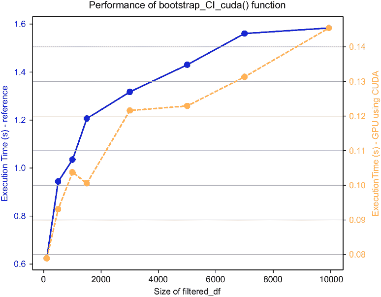

# 第七章：规模和性能优化

### 本章涵盖了

+   优化数据分析代码

+   在多个 CPU 和 GPU 上扩展代码

+   编程语言之间的代码转换

+   基于云的部署

+   使用 Dask 框架来完成所有这些

在今天以数据驱动为主的世界里，你的业务所需洞察很可能来自大量数据。随着数据量的持续增长和分析复杂性的增加，以及算法和数据处理管道达到数据量本身或操作复杂度限制了它们提供及时和准确结果的能力，你将遇到代码性能优化的需求。这很可能成为确保你的分析保持有效和高效的关键，即使底层数据和计算需求增长。

在本章中，我们将假设我们在前几章中进行的巴西电子商务数据分析非常成功，以至于现在它不再需要涵盖一百万个订单的集合，而是需要定期在数百万个订单的数据集上执行。为了使事情更有趣，让我们假设业务增长并成为跨国公司。这种增长可能会轻易地将数据量增加几个数量级。乍一看，你可能认为将更多的 CPU 投入问题或迁移到最新的 GPU 以其强大的处理能力来解决问题，但这不可避免地会涉及资本支出或扩展云解决方案的预算。正如一句古老的 IT 格言所说，任何数据都会迅速填满分配给它的所有空间，你很快就会发现自己尝试任何非平凡的数据分析时，计算总是消耗所有可用的计算能力。

幸运的是，你有许多策略可用于扩展和性能优化，包括并行和分布式计算、GPU 加速以及专门的硬件或软件解决方案。通过探索各种方法和工具，你应该能够找到最适合你特定数据分析需求的技术。

虽然如此，有一个问题。没有一种适合所有情况的解决方案。你的选择几乎总是受限于你可用的技术栈，以及预算或你的企业或机构授权使用的范围。这就是为什么我们将在这里提供一个不同方法的概述，而不是深入研究单一选项。

正如你所看到的，生成式 AI，尤其是 GPT 模型，可以极大地支持你的优化和扩展工作。这些高级自然语言处理模型可以帮助你识别相关策略，提出改进建议，审查代码，甚至生成优化的代码片段。

在本章中，我们将深入探讨扩展和优化在数据分析背景下的重要性。我们将涵盖各种技术和方法来实现最佳性能，并讨论 GPT 模型在支持这一过程中的作用。此外，我们将提供实际案例研究和案例研究，以展示有效扩展和优化在数据分析中的实际影响。

虽然有许多声称可以自动执行优化和扩展的工具，但我们认为了解这些主题对于理解适当的代码性能至关重要。遗憾的是，许多新手数据科学家、分析师和工程师将代码性能视为理所当然，或者将其委托给这些自动化工具，这可能导致他们的努力严重不足。

在本章结束时，你将深刻理解扩展和性能优化在数据分析中的关键作用，并且你将拥有识别、评估和实施有效策略的知识，以确保你的分析管道在面对不断增长的数据量和计算需求时保持高效和有效。

## 7.1 性能测量

当开始优化你的分析时，第一步是定义对你目标来说良好的性能意味着什么。你需要一个清晰的标尺来衡量你努力的成败。这意味着定义两个基本概念：

+   系统性能的哪些特征最重要？它应该优先考虑快速响应还是准确性？它应该允许多个用户访问，还是用户需要排队？它在处理时可以阻止访问，还是它仍然需要在用户等待时允许用户查看数据？

+   前述特性的基线是什么？我们应该针对当前的预期负载，还是已经计划未来的扩展？我们能否可靠地定义正常负载将是什么样子？

这里，我们可以考虑以下指标：

+   *延迟**—*数据输入完成后，数据分析系统开始显示初始结果所需的时间。

+   *吞吐量**—*系统在给定时间框架内可以处理的数据量。通常以每秒记录数或每小时千兆字节来衡量，反映了系统处理大数据集的效率。

+   *并行或并发**—*系统可以同时处理而不降低性能的数据分析查询或进程的数量。它展示了系统同时管理多个用户请求或任务的能力。

+   *带宽*—在数据分析的背景下，这指的是单位时间内可以导入或导出系统的数据量。对于需要高效处理大量数据传输的系统至关重要。

+   *响应时间*—系统从启动数据分析查询或任务的那一刻起，完成该查询或任务所需的总时间。这个指标包括计算时间和检索并显示结果所需的时间。

+   *可用性*—数据分析系统在需要时能够正常运行并可供使用的可能性。这对于需要高可用性以进行连续数据分析和决策过程的系统尤为重要。

+   *可扩展性*—数据分析系统在数据量增长时保持或提高性能的能力。这包括添加更多数据源、处理更复杂的查询或为更多用户提供服务而不会降低性能。

+   *可靠性*—数据分析系统在不同条件下提供准确和及时结果的一致性。这个指标通常通过系统故障的频率和严重性或输出数据中的不准确度来评估。

让我们看看一个现实世界的场景：一家公司正在将其基础设施迁移到云端，突然，由于需要分析的数据量巨大，在虚拟机上运行良好的解决方案变得无法使用。处理时间急剧上升，有时甚至超过 5400%的增长。管理层不得不迅速重新评估他们的方法、目标和优先级，由于容量有限，对“好”的具体含义有良好的理解变得至关重要。

比较截然不同的领域可以说明不同的优先级。如果您考虑一个用于天文观测的数据分析系统，那么延迟或响应时间可能不会像在例如医院中的患者监控系统那样关键。此外，鉴于每个患者可能需要单独的护理，可能更有意义的是为单个患者构建一个监控系统，并为每个患者创建单独的实例，而不是投资于一个单一的多患者系统。相比之下，一个化工厂的自动化系统可能需要许多并发和链接的过程来运行并连接起来，以便为操作员提供完整的画面。

一旦您了解了您的需求，您就能确定您当前的系统，无论是自动化的还是手动的，是否足够，以及它需要改进的地方。然后，一旦进行了更改，您应该能够理解与之前版本相比，您的新系统表现如何，以及这些更改是否产生了预期的效果。

在本节中，我们将探讨可以用来分析您数据分析系统效率的简单方法和指标。

##### 如何衡量？

测量数据分析系统性能的方法有很多，包括以下几种：

+   *性能分析*—收集有关程序或算法执行详细信息的活动，例如每个函数花费的时间或分配的内存量。这些数据可以帮助识别热点或消耗最多资源的代码区域。

+   *压力测试*—与性能分析相关，但处于接近或超过预期最大量的负载下。这允许您检查在极限压力下系统是否仍能良好地执行。

+   *基准测试*—将系统的性能与参考实现或行业标准指标进行比较。

+   *监控*—随着时间的推移收集和分析性能指标，使企业能够跟踪优化工作的影响，并识别对数据量和计算需求变化的响应中出现的任何新兴问题或趋势。

让我们以第四章中进行的分析为例，其中我们使用了自举方法来计算每个州的平均销售价格和平均评论分数的置信区间。自举是一种计算密集型技术，因为它涉及到从原始数据中反复抽取带有替换的随机样本，并重新计算感兴趣的统计量。

可以使用几个性能指标来评估数据分析系统的效率。在本节的剩余部分，我们将探讨三个最重要的领域：执行时间、吞吐量和资源利用率。然而，我们将主要关注执行时间。根据您计算环境的特性和限制，这些领域中的某些可能比其他领域更重要。

### 7.1.1 执行时间

执行时间是您系统整体速度和响应性的直接指标。它定义为完成特定任务或处理给定数据量所需的时间。

##### 在 CPU 时间上，我年轻；在真实时间上，我的咖啡又凉了

在当今的多任务和多线程系统中，仅用秒表来测量执行时间是不可靠的。如果您的 CPU 正忙于处理数字，而您决定在同一台机器上玩最新的 AAA 游戏来消磨时间，您可能会对程序的性能感到失望，尽管它正在尽力而为。

在这个背景下，*CPU 时间*指的是处理器在计算上实际花费的时间，而不是处理所有其他任务的时间，比如更新屏幕、在后台运行杀毒软件，以及您阅读新闻时刷新浏览器。不可避免的是，这将会显著少于*实际时间*，或经过的时间。

本章中使用的某些方法将依赖于测量经过的时间作为代理，因为它更容易实现，并且通常足够，除非您正在对非常短的代码片段进行执行时间的先进分析。然而，请记住这些要点：

+   在测量计算性能时，最好不要运行其他密集型进程。

+   在测量性能时，使用相对较大的数据集大小，因为这将通过减少开销处理的影响，使不同代码片段之间的比较更加可靠。

如果多次运行相同的代码产生不同的执行时间，请不要感到惊讶。最好是将多次运行的运行时间取平均值，以获得更好的近似值。或者，从多次尝试中取最小运行时间，因为这将反映处理器上开销的最小影响。

让我们看看我们能否让我们的 GPT 顾问提供我们测量 bootstrap 函数执行时间的所需代码。

****我有一个名为`bootstrap_CI()`的函数。`bootstrap_CI()`函数在另一个函数`calculate_ci(group)`内部运行，而`calculate_ci(group)`函数又通过命令`ci_df = grouped_data.apply(calculate_ci)`运行。`grouped_data`对象是通过`grouped_data = filtered_df.groupby('seller_state')`创建的。

请提供代码以测量`bootstrap_CI()`函数的性能，该函数根据`filtered_df` DataFrame 的大小（随机选择合适的子集）进行测量，从 100 到 9944 个元素，并将其绘制成图表。

****要测量`bootstrap_CI()`函数的性能，该函数根据从`filtered_df` DataFrame 中随机选择的条目数量进行测量，你可以创建一个函数，该函数使用 pandas 的`sample`函数，应用`groupby`操作，并测量对分组数据运行`apply`函数`calculate_ci`所需的时间。以下是示例代码：

```py
import numpy as np
import pandas as pd
import timeit
import matplotlib.pyplot as plt

*# Your bootstrap_CI function here*
*# Your calculate_ci function here*

*# Use your actual filtered_df DataFrame*

def measure_performance(data_sizes):
 *"""*
 *Measure the performance of the calculate_ci function for different* 
 *↪input data sizes.*

*Parameters:*
 *data_sizes (list): A list of data sizes to test.*

*Returns:*
 *list: A list of execution times for each data size.*
 *"""*
    times = []
    for data_size in data_sizes:
        subset_df = filtered_df.sample(n=data_size, replace=False, 
        ↪random_state=42)
        grouped_data = subset_df.groupby('seller_state')

        start_time = timeit.default_timer()
        ci_df = grouped_data.apply(calculate_ci)
        end_time = timeit.default_timer()
        times.append(end_time - start_time)

    return times

data_sizes = [100, 500, 1000, 5000, 9944]
times = measure_performance(data_sizes)

plt.plot(data_sizes, times, marker='o')
plt.xlabel('Size of filtered_df')
plt.ylabel('Execution Time (s)')
plt.title('Performance of calculate_ci Function')
plt.grid(True)
plt.show()
```

此代码测量`calculate_ci()`函数对不同大小的随机选择的`filtered_df`子集的性能。执行时间与子集的大小成比例绘制。

结果展示在图 7.1 中。


##### 图 7.1 执行 bootstrapping 函数的时间与处理后的 DataFrame 大小的图表

这个指标非常直接；然而，你需要记住，这是最窄的指标，因为它的测量只对特定的输入、系统负载、配置等有效。

此外，这个简单的例子只考虑了单次测量。在实践中，这不会非常准确，因为现代计算机被设计成可以同时执行许多任务，这将对你要测量的一个关键业务流程产生影响。因此，为了隔离这些变量效应，但仍然获得可靠的读数，你应该做以下事情：

+   在预期的负载下进行性能分析。在孤立的测试服务器上分析系统是没有意义的，然后期望它在有 50 个其他进程运行的生产服务器上以相同的方式表现，这些进程正在争夺资源。

+   对多次运行进行配置文件分析并执行适当的统计分析，至少计算最小值、最大值和平均值。这将比单次运行给出一个更好的预期性能图景。

### 7.1.2 吞吐量

吞吐量是衡量系统处理数据速率的指标，通常以每秒事务数或每秒处理的记录数来衡量。高吞吐量对于处理大量数据并满足实时处理需求至关重要。

由于吞吐量是数据大小与经过时间的简单除法，我们对用于执行时间测量的代码进行了轻微修改。您可以在书中 GitHub 仓库的 Jupyter 笔记本中找到完整的代码。如图 7.2 所示的结果可能有些令人惊讶。


##### 图 7.2 启动函数的执行时间（实线）和吞吐量（虚线）与处理 DataFrame 大小的关系

直观地讲，如果吞吐量是处理记录数除以处理所有记录的时间，每个记录都应以相同的方式进行处理。确实，如果每个记录都是独立且以恒定时间处理的，吞吐量将保持不变。然而，在实践中，情况并不总是如此。各种因素可以影响每个记录的处理时间和整体吞吐量，其中记录大小和复杂性（不是我们的情况）、数据依赖性（不是我们的情况）、资源竞争（可能是我们的情况）、算法行为（很可能是我们的情况），或外部因素如网络延迟、磁盘速度或其他系统进程。

通过吞吐量可以作为一个有用的工具，在估计与处理数据量增加相关的资源需求预期增长时。

### 7.1.3 资源利用率

要更全面地了解代码的性能，您不仅应考虑代码的执行时间，还应观察代码执行期间使用的系统资源，如内存和存储。高资源利用率可以告诉您系统是否有效地使用可用资源，并且它还可能表明潜在的瓶颈或资源竞争。

监控系统资源是另一本书（可能不止一本）的内容，但一些简单的测量和观察可以告诉您是否达到了极限，并且无论您使用 Windows 笔记本电脑（资源监视器应用）、Linux（top 实用程序）还是云解决方案（供应商相关），都应该有可用的测量数据。

资源利用率的测量对于区分程序或任务的两个主要限制因素，或瓶颈，至关重要：

+   *CPU-bound tasks***—**这些任务主要受限于您程序运行的 CPU 的处理能力。通过使用更快的 CPU 或将任务并行化到多个 CPU 核心，可以提高 CPU-bound tasks 的性能。CPU-bound tasks 的例子包括数值模拟、复杂的数学计算以及排序或搜索等数据处理任务。

+   *I/O-bound tasks*—这些任务主要受限于输入/输出（I/O）操作，例如从文件读取或写入（如果你内存不足，则将数据交换到硬盘），网络通信或用户输入。I/O-bound tasks 的大部分时间都花在等待 I/O 操作完成上，而不是在 CPU 上执行指令。通过使用更快的存储设备、优化 I/O 操作或使用异步 I/O 以允许程序在等待 I/O 操作完成时执行其他任务，可以提高 I/O-bound tasks 的性能。I/O-bound tasks 的例子包括读取大文件、从互联网下载数据或等待用户输入。

让我们看看我们能否从我们的 GPT 顾问那里获得一些关于资源测量的快速解决方案。

****如何快速检查我的函数是 CPU-bound 还是 I/O-bound，以及它的内存使用情况？

****为了快速确定您的函数是 CPU-bound 还是 I/O-bound，以及它的内存使用情况，您可以在函数运行时监控 CPU 使用率、I/O 活动和已用内存。以下是一个实现此目的的高级方法：

监控 CPU 使用：在您的函数执行期间跟踪 CPU 使用情况。如果 CPU 使用率保持持续较高，这是一个强烈的迹象表明您的函数是 CPU-bound。

监控 I/O 活动：在您的函数执行期间跟踪 I/O 操作，例如磁盘读写和网络活动。如果您观察到高 I/O 活动但相对较低的 CPU 使用率，这是一个强烈的迹象表明您的函数是 I/O-bound。

监控内存使用：在您的函数执行期间跟踪内存使用情况。为了仅计算与您的函数执行相关的内存使用情况，您可以在运行函数前后捕获内存使用情况，并相应地减去背景内存使用情况。

您可以使用内置的操作系统工具或 Python 库来监控 CPU、I/O 活动和内存使用。以下是一个使用 psutil 库来监控它们的示例：

```py
def monitor_cpu_io_memory(duration, interval):
    cpu_percentages = []
    io_counters = []
    memory_usages = []

    end_time = time.time() + duration
    while time.time() < end_time:
        cpu_percentages.append(psutil.cpu_percent(interval=interval))
        io_counters.append(psutil.disk_io_counters())
        memory_usages.append(psutil.virtual_memory().used)
        time.sleep(interval)

    return cpu_percentages, io_counters, memory_usages

*# Monitor CPU, I/O activity, and memory usage for 10 seconds with* 
*↪1-second intervals*
cpu_percentages, io_counters, memory_usages = 
↪monitor_cpu_io_memory(duration=10, interval=1)

*# Capture memory usage before running your_function()*
memory_before = psutil.virtual_memory().used

def your_function():
 *# Your code here*
    pass

*# Run your function*
your_function()

*# Capture memory usage after running your_function()*
memory_after = psutil.virtual_memory().used

*# Calculate function's memory usage*
function_memory_usage = memory_after - memory_before

*# Analyze CPU usage*
avg_cpu_usage = sum(cpu_percentages) / len(cpu_percentages)
print(f"Average CPU usage: {avg_cpu_usage}%")

*# Analyze I/O activity*
read_bytes = [c.read_bytes for c in io_counters]
write_bytes = [c.write_bytes for c in io_counters]
print(f"Total read bytes: {sum(read_bytes)}")
print(f"Total write bytes: {sum(write_bytes)}")

*# Analyze memory usage*
avg_memory_usage = sum(memory_usages) / len(memory_usages) - memory_before
print(f"Average memory usage during function execution: 
↪{avg_memory_usage / (1024 * 1024):.2f} MB")
print(f"Function memory usage: 
↪{function_memory_usage / (1024 * 1024):.2f} MB")
```

将`your_function()`替换为您想要分析的功能。此脚本将以 1 秒间隔监控 10 秒内的 CPU 使用率、I/O 活动和内存使用情况。如果平均 CPU 使用率较高，则您的功能可能是 CPU-bound。如果 I/O 活动（读取和写入的字节）较高，但 CPU 使用率相对较低，则您的功能可能是 I/O-bound。

请记住，这是一个简单的例子，你可能需要调整监控时长和间隔以匹配你函数的运行时间，以获得更准确的结果。此外，这种方法没有考虑到可能影响你函数性能的其他因素，例如内存消耗或网络延迟。

在本书 GitHub 仓库中的这一章节的 Jupyter 笔记本中，我们提供了为我们的示例修改过的代码。以下是我们的结果：

```py
Average CPU usage: 1.54%
Total read bytes: 2028772421120
Total write bytes: 2388311421440
Average memory usage during function execution: 2.59 MB
Function memory usage: 1.32 MB
```

在这样的数据规模和操作简单性的情况下，限制因素与磁盘操作相关。在这种情况下，如果我们跨多个处理器并行化计算，我们不应该期望有太大的改进，尽管我们将在下一节中为了说明的目的这样做。如果所有并行任务都必须争夺从单个文件中读取数据，那么提高 CPU 性能可能对整体性能的提升影响最小。

测量你的数据分析在哪些地方花费了大部分的时间和精力对于理解如何让它更快至关重要。如果限制因素是数据传输带宽，那么优化计算是没有意义的——用更快的硬盘替换可能只会给你带来更大的提升，而且只需花费几美元。

## 7.2 提高代码性能

在数据分析的情况下，你可能会遇到两个可以互换使用的术语：“代码优化”和“代码扩展”。这两个术语指的是两个不同的概念。它们对于提高数据处理管道的性能和效率都至关重要，但区分它们很重要，因为它们在整体性能提升中扮演着不同的角色：

+   *代码优化*是指调整算法、代码或数据处理管道的过程，以提高其性能、速度或资源利用率。

+   *代码扩展*指的是将代码调整以更有效地使用更大或性能更好的硬件，或者将其调整到不同的架构，例如 GPU 或多线程。

让我们考虑一些例子。在 7.1 节中提到的患者监控系统的情况下，很可能每个需要监控的患者都会得到自己的单元。（许多单元可能连接到护士站的单个监控仪表板，但数据分析将独立为每个患者进行，这才是这里的关键。）每个单元应快速准确地执行分析，具有非常高的可用性，甚至冗余，因为人的生命可能处于危险之中。代码优化可能是这里最好的方法，因为每个单元将是自包含的，需要是移动的，以便在患者进行测试时可以与患者一起移动，并且可能已经非常昂贵。

相比之下，金融市场监控系统可能不需要如此关注每行代码的优化。为了保持这样一个复杂系统的可维护性和可用性，确保代码清晰编写和文档化会更好；通过在足够强大的服务器上运行系统以处理负载，可以实现足够的性能。然后可以通过扩展来获得额外的容量——添加更多的 CPU 或网络带宽，或者引入处理分段和并行化。

在本节中，我们将首先尝试优化，然后扩展我们的 `bootstrap_CI` 函数。

### 7.2.1 优化代码

你可以使用各种技术来优化代码，例如代码重构、算法改进，或者使用更高效的数据结构和库。如果这看起来很令人畏惧，那是有原因的。尽管代码和算法优化是一项有价值的活动，但如果手动执行，它通常既困难又耗时。手动审查每一行代码并尝试优化它，同时避免引入错误，对于简短且简单的代码片段可能是可行的。对于更长的代码，需要更自动化的方法。让我们看看 GPT 模型在这里是否能提供帮助。

**** 最好在不并行化的情况下优化这段代码。

```py
def bootstrap_CI(data, func, n_bootstraps=1000, ci=95, axis=0):
    bootstrapped_statistics = []
    for _ in range(n_bootstraps):
        bootstrap_sample = np.random.choice(data, size=len(data), 
        ↪replace=True)
        bootstrapped_statistic = func(bootstrap_sample, axis=axis)
        bootstrapped_statistics.append(bootstrapped_statistic)

    lower_bound = np.percentile(bootstrapped_statistics, (100 - ci) / 2)
    upper_bound = 
    ↪np.percentile(bootstrapped_statistics, 100 - (100 - ci) / 2)

    return lower_bound, upper_bound
```

将生成的函数命名为 `bootstrap_CI_optimized`。

**** 你可以通过使用 NumPy 的向量化操作一次性生成所有 bootstrap 样本来优化代码，而不需要并行化。下面是一个优化的版本：

```py
import numpy as np

def bootstrap_CI_optimized(data, func, n_bootstraps=1000, ci=95, axis=0):
    data = np.asarray(data)
    idx = np.random.randint(0, len(data), size=(n_bootstraps, len(data)))
    bootstrap_samples = data[idx]

    bootstrapped_statistics = func(bootstrap_samples, axis=axis)

    lower_bound = np.percentile(bootstrapped_statistics, (100 - ci) / 2)
    upper_bound = 
    ↪np.percentile(bootstrapped_statistics, 100 - (100 - ci) / 2)

    return lower_bound, upper_bound
```

在这个版本中，我们使用 `np.random.randint` 创建了一个形状为 `(n_bootstraps, len(data))` 的索引数组 `idx`。然后，我们使用高级索引创建 `bootstrap_samples` 数组，该数组包含所有一次性的 bootstrap 样本。最后，我们直接在指定的轴上对 `bootstrap_samples` 数组应用 `func`。这个版本利用了 NumPy 的向量化操作，在不并行化的情况下高效地计算 bootstrap 统计量。

看起来，尽管提供的代码（以及它最初是由 ChatGPT 4 生成的）很简单，但似乎仍有改进的空间。或者，是吗？

在我们能在找到的最大集群上运行此代码之前，我们需要检查所提出的更改是否确实带来了改进。基本函数和优化函数的执行时间比较在图 7.3 中展示。


##### 图 7.3 基础（实线）和优化（虚线）bootstrapping 函数的执行时间与处理 DataFrame 大小的依赖关系

代码优化似乎做得很好。如果你比较两个图表的规模，函数执行所需的时间几乎减少了七倍。看起来现在在计算运行之间喝咖啡的时间要少得多。

##### 不要信任它超过你能扔到的距离

尽管优化后的代码看起来很棒，并且模型保证它执行相同的函数，但将代码提交与人类开发的代码相同的彻底测试是至关重要的。请参阅第八章，以更全面地讨论使用 GPT 模型的风险以及 AI 幻觉现象。

注意，尽管已经开发出具有非常大型或甚至理论上无限上下文大小的 LLM（大型语言模型），但您可能仍然需要将长代码分成几个提示，以适应您特定模型的上下文大小限制。虽然人类专家肯定会要求背景信息和更广泛的上下文，尤其是在被反复询问相关概念时，但 ChatGPT 不会这样做。因此，正确测试代码以验证您对与 ChatGPT 对话的输出或最终代码功能的任何假设非常重要。此外，使用第 7.3.2 节中描述的迭代提示技术可能有助于 ChatGPT 执行正确的优化，并防止它过度幻想。

### 7.2.2 代码缩放

假设我们对函数在单个处理器或线程上的运行情况感到满意。现在，研究如何在性能更好的架构上实现它可能是有价值的，这样您仍然可以取得更好的性能。一个明显的例子就是投资更快的处理器或更多的 RAM。然而，可能令人惊讶的是，大多数实现并没有充分利用常见硬件的架构。目前市场上几乎所有的处理器都有多个核心，几乎每台 PC 都安装了 GPU。这两者都允许并行运行多个计算，尽管有一些技术差异。我们稍后会讨论这些，但首先让我们关注 ChatGPT 如何帮助我们利用这两者。

#### 在多个 CPU 核心上缩放

您可以使用可用的库和 ChatGPT 的力量轻松地将代码缩放以利用几乎所有现代处理器中可用的多核架构。让我们尝试并行化我们的优化引导函数。

****您能并行化以下代码吗？

```py
def bootstrap_CI_optimized(data, func, n_bootstraps=1000, ci=95, axis=0):
    data = np.asarray(data)
    idx = np.random.randint(0, len(data), size=(n_bootstraps, len(data)))
    bootstrap_samples = data[idx]

    bootstrapped_statistics = func(bootstrap_samples, axis=axis)

    lower_bound = np.percentile(bootstrapped_statistics, (100 - ci) / 2)
    upper_bound = 
    ↪np.percentile(bootstrapped_statistics, 100 - (100 - ci) / 2)

    return lower_bound, upper_bound

def calculate_ci_optimized(group):
    return pd.Series({
        'price_ci_lower': bootstrap_CI_optimized(group['price'], np.mean, 
↪n_bootstraps=1000, ci=95)[0],
        'price_ci_upper': bootstrap_CI_optimized(group['price'], np.mean, 
↪n_bootstraps=1000, ci=95)[1],
        'review_score_ci_lower': 
         ↪bootstrap_CI_optimized(group['review_score'], np.mean, 
         ↪n_bootstraps=1000, ci=95)[0],
        'review_score_ci_upper': 
         ↪bootstrap_CI_optimized(group['review_score'], 
         ↪np.mean, n_bootstraps=1000, ci=95)[1]
    })
```

将生成的函数命名为`bootstrap_CI_parallelized`。

****您可以使用`concurrent.futures`模块并行化`bootstrap_CI_optimized`函数。我将使用`ThreadPoolExecutor`进行演示。以下是`bootstrap_CI_optimized`函数的修改版本：

```py
import numpy as np
import pandas as pd
from concurrent.futures import ThreadPoolExecutor

def bootstrap_CI_parallelized(data, func, n_bootstraps=1000, ci=95, 
↪axis=0):
    def single_bootstrap(idx):
        bootstrap_sample = data[idx]
        return func(bootstrap_sample, axis=axis)

    data = np.asarray(data)
    idx = np.random.randint(0, len(data), size=(n_bootstraps, len(data)))

 *# Set the number of threads you want to use for parallelization*
    num_threads = 4

    with ThreadPoolExecutor(max_workers=num_threads) as executor:
        bootstrapped_statistics = list(executor.map(single_bootstrap,
        ↪idx))

    lower_bound = np.percentile(bootstrapped_statistics, (100 - ci) / 2)
    upper_bound = 
    ↪np.percentile(bootstrapped_statistics, 100 - (100 - ci) / 2)

    return lower_bound, upper_bound

*# ... (calculate_ci_optimized function definition remains the same) ...*
```

这将在多个线程上并行化`bootstrap_CI_optimized`函数。但是，请注意，如果您的数据存储在 Pandas DataFrame 中，并且您为`func`使用自定义函数，您可能需要处理 Python 中的 GIL（全局解释器锁），这可能在某些情况下限制并行化的好处。

现在我们已经并行化了我们的函数，它将像离弦之箭一样运行！是的！

在 16 个并行线程上运行的运行结果如图 7.4 所示。现在代码的运行速度明显慢了下来！看来 ChatGPT 的最后评论是真的。


##### 图 7.4 优化（实线）和并行化（虚线）的 bootstrapping 函数的执行时间与处理 DataFrame 大小的依赖关系

幸运的是，这里有一个教训可以吸取。在第 7.1 节中，我们区分了 CPU 密集型和 I/O 密集型任务。我们的`bootstrap_CI`函数使用了 1.5%的可用处理能力，我们提到这个函数似乎不是并行化的最佳候选。我们还是做了，现在我们正在承受后果。

##### 没有免费的午餐

并行化并非没有代价。与将数据分成更小的块、启动和排队进程以及随后将结果粘合在一起相关的开销成本。在我们的情况下，主要问题是数据相对较小，但这个问题对于大规模任务也可能很重要，具体取决于你的数据结构。

我们的 ChatGPT 顾问警告我们，一个叫做全局解释器锁（GIL）的东西可能会限制我们的并行化收益。GIL 是一种简化 Python 内存管理的机制，但代价是严重限制了多线程应用程序的性能以及它们有效利用多个 CPU 核心的能力。

让我们看看从 CPU 迁移到 GPU 是否会显著提高性能。

#### 使用 GPU 进行扩展

在某些例外情况下，跨 CPU 的扩展可能带来显著的好处，但 GPU（图形处理单元）是现在大多数 PC 上可用的另一块硬件。这块硅片专门优化了在数百个核心上并行执行大量相同操作的能力，这对于大多数计算机生成的图形计算是必需的。

没有任何东西阻止 GPU 用于具有类似要求但与图形无关的计算。然而，重要的是要理解 GPU 和 CPU 非常不同，我们将在下一节中讨论这一点。

现在，让我们看看 GPU 在简单示例中的应用。以下代码和下面的技术使用带有 CUDA 界面的 Nvidia 显卡，使我们能够将代码直接指向 Nvidia GPU 进行扩展。

****你能调整`bootstrap_CI_optimized`函数以使用 CUDA 运行吗？将生成的函数命名为`bootstrap_CI_cuda`。

****要在 CUDA 上运行`bootstrap_CI_optimized`函数，你可以使用提供许多 NumPy 函数 GPU 加速版本的 cupy 库。首先，如果你还没有安装，请安装 cupy 库：

```py
pip install cupy
```

然后，修改`bootstrap_CI_optimized`函数以使用`cupy`：

```py
import cupy as cp

def bootstrap_CI_cuda(data, func, n_bootstraps=1000, ci=95, axis=0):
    data = cp.asarray(data)
    idx = cp.random.randint(0, len(data), size=(n_bootstraps, len(data)))
    bootstrap_samples = data[idx]

    bootstrapped_statistics = func(bootstrap_samples, axis=axis)

    lower_bound = cp.percentile(bootstrapped_statistics, (100 - ci) / 2)
    upper_bound = 
    ↪cp.percentile(bootstrapped_statistics, 100 - (100 - ci) / 2)

    return cp.asnumpy(lower_bound), cp.asnumpy(upper_bound)
```

请注意，`func`参数也必须与 cupy 数组兼容。如果`func`依赖于 NumPy 函数，您可能需要用它们的等效 cupy 函数替换它们。

请记住，根据您的问题规模和 GPU，您可能看不到显著的性能提升。GPU 加速通常对大数据和计算密集型操作更有益。

ChatGPT 的最后一句话确实没有带来很多乐观，尤其是在我们的并行化努力之后。尽管如此，我们需要停止推迟不可避免的事情，转向图 7.5 中展示的结果。幸运的是，我们这次的努力并非徒劳。我们可以看到代码执行时间有显著改善。



##### 图 7.5 优化（实线）和 GPU 利用（虚线）引导函数的执行时间与处理 DataFrame 大小的依赖关系

##### 无限与超越

GPU 并非所有应用的终点，至少对于某些应用来说不是。谷歌设计了一种专门用于高性能机器学习任务，尤其是深度学习的硬件，称为张量处理单元（TPUs）。

TPUs 特别适合大规模训练和推理神经网络，与 CPU 和 GPU 相比，提供更快的处理时间和更好的能源效率。它们对于自然语言处理、计算机视觉和强化学习应用尤其有益。将 TPUs 纳入您的数据分析流程可以进一步优化性能并减少训练和部署复杂机器学习模型所需的时间。

根据我们与 ChatGPT 的最后一次对话中的建议，您应该意识到许多流行的 Python 库已经针对 GPU 和 TPUs（张量处理单元）优化，或者提供内置支持以加速计算。如果您计划在工作中使用 GPU/TPUs，请记住这一点。

没有必要记住所有这些优化库，因为您可以让 ChatGPT 提供列表，如下面的记录所示。同样，您可以要求 ChatGPT 引用具有特定用途或优化的其他实现。这可以节省您数小时在网上搜索的时间。

****哪些 Python 库有 GPU 优化的对应库？

****许多流行的 Python 库都有针对 GPU 优化的对应库或提供内置的 GPU 支持以加速计算。这些库包括：

+   CuPy：NumPy 的 GPU 加速版本，在 NVIDIA CUDA 上运行。它具有与 NumPy 非常相似的接口，使得将现有代码移植到 CuPy 变得容易。

+   Numba：Python 函数的即时（JIT）编译器，可以为 NVIDIA CUDA 启用 GPU 生成 GPU 加速代码。

SciPy：

+   CuPy: CuPy 也提供了某些 SciPy 函数的 GPU 加速版本，例如稀疏矩阵运算和线性代数例程。

+   ArrayFire: 一个高性能库，为 NVIDIA、AMD 和 Intel GPU 提供了某些 SciPy 函数的 GPU 优化版本。

Pandas:

+   cuDF: 作为 RAPIDS 的一部分，cuDF 是一个用于数据操作和分析的 GPU 加速库，为处理 NVIDIA CUDA 兼容 GPU 上的数据提供了类似 pandas 的 API。

+   Dask: 虽然不是严格意义上的 GPU 优化对应版本，但 Dask 可以与 cuDF 一起工作，在 GPU 上并行化和分配数据处理任务。

Scikit-learn:

+   cuML: 也是 RAPIDS 的一部分，cuML 是一个用于机器学习的 GPU 加速库，它提供了一个与 scikit-learn 兼容的 API。它支持各种算法，如线性回归、k-means 聚类和主成分分析，针对 NVIDIA CUDA 兼容 GPU 进行优化。

+   Dask-ML: Dask-ML 将 Dask 扩展到并行化机器学习算法，包括对 CuPy 和 cuDF 等 GPU 加速库的支持。

TensorFlow 和 PyTorch:

+   TensorFlow 和 PyTorch 都是流行的深度学习库，它们内置了对 NVIDIA CUDA 和 cuDNN 库的 GPU 加速支持。

JAX:

+   JAX 是一个用于 Python+NumPy 程序可组合转换的库，包括自动微分、向量化和平行化。它内置了对 NVIDIA CUDA 的 GPU 加速支持，也支持 TPUs。

这些只是 Python 库中具有优化对应版本或内置 GPU/TPU 支持的几个例子。根据您的具体用例和硬件，您可能会发现其他可以利用专用芯片进行加速计算的库。

##### ChatGPT 学习截止点

如前所述多次，ChatGPT 在某个点之后的知识有限，具体取决于版本，因此其对最新发展和库的最新版本的认知可能有限。尽管如此，它应该为进一步的探索提供一个良好的起点。

请记住，GPU/TPU 优化可能具有不同级别的性能提升，因此对目标硬件进行性能分析和测试至关重要，以确保您获得期望的性能提升。

#### 在 CPU 和 GPU 之间的扩展

决定在 CPU 或 GPU 之间扩展操作取决于任务的性质和可用的硬件资源。以下是一般指南，说明何时使用 CPU 和 GPU 进行不同类型的操作。

使用 CPU 进行

+   顺序任务或涉及分支或复杂控制结构或需要有限并行性的任务

+   需要高 I/O 要求或涉及进程或线程之间大量通信的任务

+   对于小或中等数据集大小的任务，尽管 CPU 上的可用内存通常大于 GPU，但在 CPU 上处理大型数据集可能不如在 GPU 上有效。

+   通用任务，因为 CPU 设计用于处理各种工作负载

使用 GPU 进行

+   可以分成成千上万个较小的任务同时执行的高度并行任务

+   涉及许多算术运算的任务，例如矩阵乘法、卷积或在大数据集上的逐元素操作

+   大数据集大小的任务，因为 GPU 设计用于快速处理大量数据，这得益于其高内存带宽

+   深度学习、计算机视觉或科学模拟，这些都可以从 GPU 的专用架构中受益

通常，如果任务可以分解成许多更简单、最好是相似的子任务，并且需要大量的计算，那么它可能更适合使用 GPU。然而，如果任务涉及复杂的控制结构、广泛的通信或 I/O 受限，那么它可能更适合使用 CPU。此外，在决定是否使用 CPU 或 GPU 进行操作之前，你需要考虑可用的硬件资源、所使用库的效率以及你任务的具体要求。

在决定使用哪种方法时，有一个非常有用的启发式方法。除非你准备重写大量代码以包括并行性，否则考虑你在原始代码中使用的库，以及它们是否已经有了并行化版本。如果你是使用 GPU 优化库的重度用户，并且有相关的 GPU 硬件可用，通常最好选择这些库。否则，考虑坚持使用 CPU 并行化。

你还可以结合两种方法，在代码中与这些调用最相关的部分切换到使用 GPU 优化的库，然后使用多个 CPU 并行化其余的代码。但要注意。正如我们在 7.2.2 节中所示，任何并行化都伴随着开销，尤其是在涉及不同 CPU 核心之间的通信或同步时。你可能会遇到远超过任何好处的高开销。

当你的 PC 核心用尽时，你可能需要转向云解决方案。这些好处需要你在部署解决方案到你的友好云提供商时做一些额外的工作。

## 7.3 基于云的部署

随着数据量、种类和复杂性的持续增长，它可能超过你的 PC 机器的计算能力。与其不合理地等待看到输出（或内存溢出错误），或者当 scalpers 售罄后，在最新的高价芯片上市时大举投资，你还可以利用云计算的巨大力量。

### 7.3.1 什么是云计算？

云计算是一种技术模型，它允许用户通过互联网访问和使用计算资源，例如存储、处理能力和软件应用。用户无需在本地投资和维护物理硬件和软件，而是可以利用云服务提供商。提供商在大型、远程数据中心管理和维护基础设施，提供对广泛计算资源、存储和管理服务的按需访问。您可以根据需要扩展或缩减工作量，并分析大量数据，而无需投资昂贵的硬件。

云计算的主要优势包括可扩展性、灵活性、成本效益和可靠性。您还可以选择在笔记本电脑的安全环境中使用异构架构，如 TPUs（或 GPU）。

##### 1+1 ≠ 2

多个相互连接的计算机，称为节点，作为一个单一统一的系统协同工作以执行复杂的计算任务，这些系统被称为*集群*。

在集群计算中，任务通常被划分为更小的子任务，并在集群的节点之间分配。然后节点并行工作，同时处理分配给它们的子任务，特定的进程为整个系统提供同步和容错。由于这是一个复杂的话题，我们不会深入探讨这些问题，而是假设用户更有可能利用提供解决方案的既定框架，而不是自己编写。

常见的集群计算软件框架包括 Apache Hadoop、Apache Spark 和消息传递接口（MPI），它们提供工具和库以简化跨集群节点的分布式应用程序的开发、部署和管理。

我们用作性能比较示例的代码并没有成为并行化的最佳候选者。在本节中，我们将使用一个计算点集之间直线（或欧几里得）距离的函数。这可能对大多数商业案例不太有用，但它并行化得很好——每一对的距离可以独立计算，因此除了收集最终结果之外，不需要处理器或节点之间的通信。

### 7.3.2 将代码迁移到云端

最简单的云计算用例是将您的代码部署到云中的虚拟机（VM）上。虚拟机就像一台计算机中的计算机，拥有自己的操作系统等一切。它作为一个隔离的空间，使您能够在不影响主系统的情况下测试软件、运行不同的应用程序或在不同环境中工作。您在虚拟机上运行分析的方式与在本地 PC 上运行的方式相同。ChatGPT 可以为您提供完整的说明：

****如何将我的计算部署到云端？请为我提供操作指南。

由于具体步骤频繁变化，我们决定在此省略冗长的记录。只需说明，ChatGPT 可以提供详细的操作指南，但仅限于服务提供商更改界面和步骤不同的点。读者注意（读者小心）。

****根据您的具体用例和需求，您可能需要自定义环境、配置额外资源或使用其他云服务，例如托管数据处理服务或无服务器计算选项，如 Google Cloud Functions 或 AWS Lambda。

您可以询问 ChatGPT 关于这些步骤的详细信息。

##### ChatGPT 的狭窄上下文

您会注意到，在与 ChatGPT 讨论将代码部署到云端的过程中，回答只提供了一个在单个虚拟机上运行代码的方法，因为提示没有指定其他内容。这种部署通常是将您的应用程序迁移到云端的第一个步骤，所以它仍然值得一看，尽管这通常只会提供有限的计算能力提升，受限于单个虚拟机的性能，但具有不需要修改代码的显著优势。

最后，让我们看看 ChatGPT 如何帮助我们把我们代码迁移到云端，这次是正确地跨多个云资源进行分配，以便我们能够利用集群计算强大的能力。让我们看看 ChatGPT 提出的解决方案：

##### ChatGPT 对任何平台都不忠诚

在本节中的回复中，您将看到 ChatGPT 开始使用 Amazon AWS 来回答问题。提示并未指定选择云服务提供商，尽管我们之前讨论过使用 Google Cloud。如果您不喜欢 ChatGPT 的走向，不要害怕停止它，并通过细化提示将其引导到您更喜欢的路径上。

****我现在想将计算分布到云端。我该如何操作？（忘记保存到磁盘。）

****要跨云端分布计算，您可以使用 Dask 以及像 Amazon Web Services (AWS)、Google Cloud Platform (GCP)或 Microsoft Azure 这样的云服务提供商。在这个例子中，我们将使用 Dask 与 AWS，但对于其他云服务提供商，过程是相似的。

首先，您需要在 AWS 上设置一个 Dask 集群。您可以根据官方 Dask 指南使用 dask-cloudprovider 包在 AWS 上设置 Dask 集群。

一旦您设置了您的 Dask 集群

我们在此处停止了回答的生成。

****请将最后一个答案改为使用 GCP

****要使用 Google Cloud Platform (GCP)在云端分布计算，您可以使用 Dask 以及 dask-cloudprovider 包来创建和管理 GCP 上的 Dask 集群。

<在这里，我们再次收到了适用于 ChatGPT 知识截止日期的回答。>

其余的代码与之前的示例类似，但现在使用 GCP 集群作为底层基础设施。这里的关键点是，正如前几节中提到的，有现成的解决方案，这些解决方案可以抽象出云或集群计算的技术细节，并允许你专注于编码核心问题，而不是担心网络通信是否能够正确工作。像 Dask 这样的框架可以提供这些解决方案，甚至允许你几乎无缝地在不同的底层提供者（如 AWS 或 GCP）之间切换。

重要的是要记住，通过提交代码和请求不同迭代版本的提示，我们可能会得到一个包含不同解决方案混合的实现，或者我们可能会得到完全不同的功能。无论我们请求 ChatGPT 对代码进行何种修改，都必须确保它以与从头开始编写时相同的，甚至更高的标准进行重新测试。此外，由于并行化或分布式代码通常比本地化单线程版本更难完全测试，因此应采取最佳实践，这些实践超出了本书的范围。

## 7.4 代码转换

最后，让我们看看如何使用 ChatGPT 在编程语言之间转换代码。这可以服务于多个目的，例如生成优化代码或使代码适应在特定框架（如 Hadoop）中工作。当将代码从一种语言翻译到另一种语言时，开发者有机会在目标语言中对代码进行重构、精简和改进。这可以通过几种方式实现优化。让我们看看其中的一些：

+   *提高性能**—*将代码转换为更高效的语言或提供更好特定硬件或平台支持的代码可以带来性能提升。例如，将代码从高级解释语言（如 Python）翻译到低级编译语言（如 C++）可能会导致更快的执行时间。

+   *减少内存使用**—*代码转换可能导致更高效的实现。例如，目标语言中的某些数据结构和算法可能比源语言中的对应项消耗更少的内存。

+   *更好的可维护性**—*将代码转换为更现代或更广泛使用的语言可以通过利用更新的语言特性、库和社区支持来提高可维护性。这可以使代码在长期内更容易阅读、理解和修改。

+   *框架兼容性**—*确保代码与不同框架的兼容性通常需要将其转换为支持的语言。例如，在下一节中，我们将讨论将处理分配到云中，其中一个选项将是使用 Hadoop。然而，当与 Hadoop 一起工作时，您可能需要将 Python 脚本转换为 Java 或 Scala，以便有效地利用框架的生态系统。这确保了与基于 Java 的 Hadoop 库和工具的无缝集成。

由于框架和兼容性限制经常发生变化，最好是在线查看当前文档，以便就哪个框架最适合您的特定实现做出明智的决定。

仔细考虑代码转换的成本和复杂性是至关重要的，因为这可能会耗费大量时间，并可能引入新的错误或问题，而且手动代码转换很少值得付出这样的努力。尽管在 ChatGPT 出现之前就已经存在代码转换的自动化工具，但使用 ChatGPT 这样的模型使得代码转换变得更加容易，甚至对于大量代码也可能带来显著的益处。

##### 仍然需要有限的信任

请记住，尽管代码转换看起来可能很简单，但彻底的测试和性能监控仍然是必要的，以确保转换后的代码按预期工作并满足所需的优化目标。本书范围之外的单元测试、系统测试和集成测试等技术应在更改代码前后应用，以降低错误渗入的风险。

让我们看看使用 ChatGPT 进行代码转换的一些示例。假设您为您的分析之一编写了 Python 代码，但现在您希望在不同的组织部分重用相同的概念，而该组织其他所有内容都是用 Java 编写的。尽管存在两种语言之间互操作性的解决方案，但直接将代码转换为 Java 可能是最简单的解决方案。

****将此代码转换为 Java：

```py
def bootstrap_CI_optimized(data, func, n_bootstraps=1000, ci=95, axis=0):
    data = np.asarray(data)
    idx = np.random.randint(0, len(data), size=(n_bootstraps, len(data)))
    bootstrap_samples = data[idx]

    bootstrapped_statistics = func(bootstrap_samples, axis=axis)

    lower_bound = np.percentile(bootstrapped_statistics, (100 - ci) / 2)
    upper_bound = 
    ↪np.percentile(bootstrapped_statistics, 100 - (100 - ci) / 2)

    return lower_bound, upper_bound
```

****以下是提供的 Python 函数的等效 Java 代码：

```py
import org.apache.commons.math3.random.RandomDataGenerator;
import org.apache.commons.math3.stat.descriptive.rank.Percentile;
import org.apache.commons.math3.stat.descriptive.rank.Percentile
↪.EstimationType;

public class BootstrapUtils {
    public static double[] bootstrapCI(double[] data, int nBootstraps, 
    ↪int ci) {
        RandomDataGenerator randomDataGenerator = new 
        ↪RandomDataGenerator();
        Percentile percentile = new 
        ↪Percentile().withEstimationType(EstimationType.R_7);

        double[] bootstrapStatistics = new double[nBootstraps];
        int dataSize = data.length;

        for (int i = 0; i < nBootstraps; i++) {
            double[] bootstrapSample = new double[dataSize];
            for (int j = 0; j < dataSize; j++) {
                int randomIndex = 
                ↪randomDataGenerator.nextInt(0, dataSize - 1);
                bootstrapSample[j] = data[randomIndex];
            }
            bootstrapStatistics[i] = calculateStatistics(bootstrapSample);
        }

        double lowerBound = 
        ↪percentile.evaluate(bootstrapStatistics, (100 - ci) / 2);
        double upperBound = 
        ↪percentile.evaluate(bootstrapStatistics, 100 - (100 - ci) / 2);

        return new double[]{lowerBound, upperBound};
    }

    private static double calculateStatistics(double[] data) {
        // Replace this with your custom statistics calculation logic
        // For example, you can use Apache Commons Math library for mean 
        ↪calculation
        return org.apache.commons.math3.stat.StatUtils.mean(data);
    }

    public static void main(String[] args) {
        // Example usage
        double[] data = { /* Your data here */ };
        double[] ci = bootstrapCI(data, 1000, 95);

        // Use ci as needed
    }
}
```

这段代码使用 Apache Commons Math 库进行均值计算，取代了之前示例中的自定义均值计算。如果您有不同的自定义统计计算逻辑，请调整`calculateStatistics`方法。

在这个阶段，研究 ChatGPT“理解”它正在转换的代码的程度可能很有趣。看看 ChatGPT 如何概念化代码的功能，这可能会导致在适当的提示下进行更有效的转换。

****这段代码做了什么？

****这段代码定义了一个 Java 实用类`BootstrapUtils`，它提供了一个名为`bootstrapCI`的方法，用于计算给定数据集的引导置信区间（CI）。让我们来分析一下这段代码：

1.  导入：

    1.  代码从 Apache Commons Math 库导入类，用于统计计算，包括随机数据生成和百分位数计算。

1.  `BootstrapUtils` 类：

    1.  包含两个方法：`bootstrapCI` 和 `calculateStatistics`。

1.  `bootstrapCI` 方法：

    1.  接受三个参数：数据数组、重采样样本数（`nBootstraps`）和置信区间百分比（`ci`）。

    1.  创建一个随机数据生成器和具有特定估计类型的 `Percentile` 对象。

    1.  初始化一个数组来存储重采样统计信息，并获取输入数据的大小。

1.  重采样：

    1.  迭代 `nBootstraps` 次。

    1.  对于每次迭代，它通过从原始数据集中随机选择数据点来创建一个重采样样本。

1.  统计计算：

    1.  调用 `calculateStatistics` 方法来计算每个重采样样本的统计信息。默认实现使用 Apache Commons Math 库中的均值计算。

1.  置信区间计算：

    1.  使用 `Percentile` 对象根据重采样统计的百分位数来计算置信区间的下限和上限。

1.  返回：

    1.  返回一个包含重采样置信区间下限和上限的数组。

1.  `calculateStatistics` 方法：

    1.  一个用于在给定数组上计算统计信息的私有方法。默认实现使用 Apache Commons Math 库中的均值计算。

1.  `main` 方法（示例用法）：

    1.  通过示例数据集（`data`）演示如何使用 `bootstrapCI` 方法。它使用 1000 次重采样和 95%的置信区间来计算重采样置信区间。

总结来说，这段 Java 代码提供了一个灵活且可重用的实用工具，用于计算重采样置信区间。如果需要，你可以用你自定义的统计计算逻辑替换 `calculateStatistics` 方法。代码组织良好且模块化，便于理解和扩展以进行不同的统计计算。

现在我们已经从 ChatGPT 中提取了代码的功能，我们可以请求它为我们目标语言提供一个更优化的解决方案。请注意，向 ChatGPT 请求代码功能描述的提示在对话流程中很重要，因为它引导 ChatGPT 正确理解我们的意图，即转换代码的功能而不是逐条指令翻译。此外，它还允许我们检查 ChatGPT 对功能的理解是否正确。如果不正确，我们可能需要调整后续提示，以引导它指向正确的输出。在我们的案例中，它正确地推断出了功能，因此我们可以在下一个提示中请求它提供一个优化的解决方案。

****可以使用某种优化实现来完成吗？

****

```py
import org.apache.commons.math3.random.RandomDataGenerator;
import org.apache.commons.math3.stat.descriptive.rank.Percentile;
import org.apache.commons.math3.stat.descriptive.rank.Percentile
↪.EstimationType;

public class BootstrapUtils {
    public static double[] bootstrapCI(double[] data, int nBootstraps, 
    ↪int ci) {
        RandomDataGenerator randomDataGenerator = 
        ↪new RandomDataGenerator();
        Percentile percentile = 
        ↪new Percentile().withEstimationType(EstimationType.R_7);

        double[] bootstrapStatistics = new double[nBootstraps];
        int dataSize = data.length;

        for (int i = 0; i < nBootstraps; i++) {
            double[] bootstrapSample = new double[dataSize];
            for (int j = 0; j < dataSize; j++) {
                int randomIndex = 
                ↪randomDataGenerator.nextInt(0, dataSize - 1);
                bootstrapSample[j] = data[randomIndex];
            }
            bootstrapStatistics[i] = 
          ↪org.apache.commons.math3.stat.StatUtils.mean(bootstrapSample);
        }

        double lowerBound = 
        ↪percentile.evaluate(bootstrapStatistics, (100 - ci) / 2);
        double upperBound = 
        ↪percentile.evaluate(bootstrapStatistics, 100 - (100 - ci) / 2);

        return new double[]{lowerBound, upperBound};
    }

    public static void main(String[] args) {
        // Example usage
        double[] data = { /* Your data here */ };
        double[] ci = bootstrapCI(data, 1000, 95);

        // Use ci as needed
    }
}
```

这个版本使用`org.apache.commons.math3.stat.StatUtils.mean`进行平均值计算，这是 Apache Commons Math 的一个优化实现。确保将 Apache Commons Math 库包含在你的项目依赖中。

在先前的交流中，ChatGPT 直接翻译了代码。进一步的询问提供了更好的替代方案，例如，通过要求 ChatGPT 用 Java 可用的其他库中的优化实现替换代码的一部分，尽管这取决于你自己去探索。不要让机器做所有的工作。

到目前为止，我们相信你已经了解了如何使用生成式 AI 来选择、实施和评估各种方法来提高你在分析中使用的代码的效率。然而，在选择优化策略时，谨慎行事至关重要。如果你的分析是一次性的、临时的，那么达到最佳性能所需的时间可能会超过潜在的时间节省。

##### 询问 ChatGPT 的事项

+   修改我的代码使其能在多个 GPU/CPUs 上运行。

+   将我从 StackOverflow 下载的代码片段转换为我最喜欢的编程语言。

+   解释这个代码片段的功能。

+   修改我的代码使其能在亚马逊/谷歌/微软 Azure 云上运行。

## 摘要

+   不要尝试重新实现常见的算法，因为通常有可用的优化实现。

+   如果你想要使用不同的编程语言，ChatGPT 可以显著简化迁移。只需记住要彻底重新测试代码。

+   代码应该优化以在给定平台上尽可能快地实现结果。如果这还不够快，你可以通过使用多个 CPU 或 GPU 或将代码部署到云上来进行扩展。

+   类似于 Dask 这样的框架可以帮助你在最小修改代码的情况下实现扩展。
