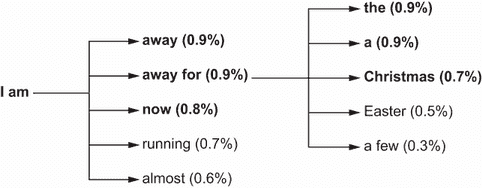

# 第二章：大型语言模型与提示工程

本章涵盖

+   大型语言模型工作原理的基础

+   使用大型语言模型的风险

+   提示工程的一个定义

+   通过提示工程进行实验以返回各种输出

+   如何使用提示工程解决问题

在上一章中，我们了解到花时间熟悉新工具是很重要的，而这就是我们在本章中将要采取的心态。在整个书中，我们将探讨如何使用基于大型语言模型（LLM）的生成式 AI 工具，如 OpenAI 的 ChatGPT 和 GitHub Copilot。AI 在测试中有很多应用方式，但 LLM 之所以有趣，在于它们对不同情况的适应性——因此，它们越来越受欢迎。所以，在我们探讨如何将 LLM 工具融入日常测试之前，让我们先了解一下 LLM 是什么，它们是如何工作的，以及如何通过学习提示工程的概念来最大限度地发挥它们的作用。

什么使得像 ChatGPT 这样的 LLM 在 2023 年一直占据科技头条？考虑以下我与 ChatGPT 的样本交互：

|


| 你好，ChatGPT，你能简单介绍一下你自己吗？ |
| --- |

|


| 当然！我是 ChatGPT，由 OpenAI 开发的 AI 语言模型。我基于 GPT-3.5 架构，这意味着我被设计成根据我收到的提示来理解和生成类似人类的文本。我在包括书籍、文章、网站和其他文本文档在内的多种数据源上接受了训练，直到 2021 年 9 月。我可以帮助您解决各种话题，包括回答问题、提供解释、创意写作等等。请告诉我您需要我如何帮助您！ |
| --- |

|


| 很高兴见到你。 |
| --- |

|


| 很高兴见到你！我在这里帮助你解答任何问题或完成任何任务。今天我能帮您做什么？ |
| --- |

|


| 我刚开始了解你。 |
| --- |

|


| 没问题！请随意问我任何您想了解的问题，无论是关于我的能力、我的工作方式，还是您好奇的其他任何事情。我在这里提供信息，尽我所能帮助您。请随意提问！ |
| --- |

根据这次简短的对话，我们可以看到

+   使用自然语言与 ChatGPT 进行交互是可能的。在这个例子中，不需要传统的编程经验就可以从 ChatGPT 获得结果。

+   ChatGPT 的输出也是自然语言。它易于理解和反应。

LLMs 的支持者正在庆祝这些类型的 AI 工具使 AI 的使用民主化，允许任何人使用它来获得结果。然而，这种民主化是一把双刃剑。我们与 LLMs 互动的方式可能会让我们产生一种错觉，认为我们正在与一个以与我们人类相同的方式进行推理的机器交谈。但做出这种假设可能会影响我们充分利用 LLM 的能力。因此，为了从 ChatGPT 等工具中获得最佳结果，我们应该了解它们的工作原理（至少是一般术语），以便更好地理解它们如何融入我们的测试活动以及如何从中提取最大价值。

## 2.1 LLMs explained

一个在构建 AI 系统方面经验相对较少的人如何解释一个复杂的 LLM 系统的工作原理？幸运的是，在 Computerphile 视频“AI 语言模型与 Transformer”([www.youtube.com/watch?v=rURRYI66E54](https://www.youtube.com/watch?v=rURRYI66E54))中，Rob Miles 提供了一个可以帮助我们获得 LLMs 基本理解的例子。（我强烈推荐观看他关于 AI 的所有视频。）

拿出你的手机并打开一个消息应用，或者任何使键盘出现的其他应用。在键盘上方，你可能会看到一系列建议的单词，可以插入到你的消息中。例如，我的键盘提供了以下建议：*我*，*我是*和*那*。选择这些选项之一，例如*我是*，会导致建议更新。对我来说，它提供了以下选项：*离开*，*离开去*和*现在*。选择*离开去*选项再次更新了可用的选项。那么，键盘是如何知道显示哪些选项的呢？

在你的键盘上，有一个类似于 LLMs 的行为的 AI 模型。这种描述是一种过度简化，但核心在于，你手机上的键盘通过使用概率应用了与 LLM 相同的机器学习方法。语言是一套复杂且流动的规则，这意味着任何试图明确编码关系的尝试几乎都是不可能的。因此，模型在大量数据集上训练，以隐式学习语言中的关系，并创建一个概率分布，用于预测下一个单词可能是什么。这可以通过可视化键盘示例中可用的选项来最好地描述，如图 2.1 所示。



图 2.1 概率分布的实际应用

如我们所见，当我们选择“我”这个词时，我们键盘中的模型已经被训练去为大量词汇分配概率。其中一些词汇有很高的概率会跟在“我”之后，比如“不在”，而有些词汇的概率则较低，比如“沉香木”。正如之前提到的，这些概率来自一个已经完成训练过程的模型，这个过程被称为无监督学习，其中大量数据被发送到算法进行处理。正是从这个训练过程中，一个具有复杂权重和平衡的模型被创建出来，为模型提供了预测能力。

监督学习和无监督学习

在训练 AI 时，使用较为普遍的技术是监督学习和无监督学习。所使用的哪种学习方法将决定数据是如何被结构化和发送到算法中的。“监督”学习使用已经组织、标记并配对输出的数据。例如，一个医疗数据集可能包含标记的数据，包括 BMI、年龄和性别等，这些数据与标记的结果配对，比如一个人是否患有特定的疾病——比如说心脏病发作或中风。“无监督”学习则相反，使用未标记的数据，并且没有输出数据。其理念是，当算法在这种类型的数据上被训练时，它会学习数据中的隐含模式。

很可能，如果你在你的键盘上玩弄预测功能，输出结果将与我不同——即使我们使用的是同一部手机和操作系统。这是因为一旦模型在我们的手机上被训练并投入使用，它仍然会根据我们输入手机的内容进行微调。我因工作需要出差，所以我必须让人们知道我何时不在，何时可用。（这或许是对我的工作与生活平衡的一种严厉批评！）因此，像“我”和“不在”这样的词出现的概率会增加，因为它们是我更经常使用的词。这被称为带有人类反馈的强化学习，或简称 RLHF。

再次，将手机上的预测消息与 LLM（大型语言模型）进行比较是一种过度简化，但这个比较是成立的。LLM 也使用无监督学习和 RLHF。然而，区别在于，尽管手机上的 AI 模型可以查看可能最后输入的五個字来预测下一个字，但 LLM 使用最前沿的技术，例如

+   生成式预训练转换器（这是 ChatGPT 中 GPT 缩写的原因）

+   使用数千台服务器的强大硬件基础设施

+   训练数据量将远远超过我们谦逊的键盘模型所训练的数据量

我们是否需要了解这些点的每一个细节？实际上并不需要，但这有助于我们理解 LLMs 的关键方面。LLMs 的输出，无论多么强大，都是概率性的。LLMs 不是一个信息库——它们内部存储的结构化知识就像我们在更广泛的互联网上看到的那样。这意味着它得出结论的方式与我们人类不同（基于概率而非经验），这也是它们如此强大但如果我们不警惕地使用它们，使用起来也具有风险的原因。

## 2.2 避免使用 LLMs 的风险

让 AI 预测一个词之后应该跟什么词并不容易，尽管当前的 LLMs 在能力上有了爆炸性的增长，但我们仍需意识到存在的风险。让我们来看看其中的一些。

### 2.2.1 幻觉

文本预测的挑战在于确保 LLMs 的输出是有意义并且基于现实的。例如，在第一章中，当我要求 ChatGPT 为这本书写一个引言时，它分享了以下内容：

|


| 关于这本书，“如何使用 AI 来帮助支持各种软件测试活动”，我推荐“AI-Driven Testing: Adding Intelligence to Your Software Testing Practice”由 Julian Harty 和 Mahesh Sharma 所著。 |
| --- |

在 LLMs 最初开发时，它们的输出并没有太多意义。文本是可读的，但缺乏结构或语法上的合理性。如果我们阅读这个例子，它解析得非常完美，并且有道理。然而，正如我提到的，ChatGPT 所描述的那本书并不存在。在 LLMs 的语境中，这被称为*幻觉*。LLMs 能够以一种赋予其一定权威的方式输出清晰的陈述，但所写的内容是错误的。

LLM 的幻觉可能由多种因素引起，例如训练数据的质量、模型在数据上的训练程度（过拟合），或者模型倾向于给出无论正确与否的答案。与 LLMs 一起工作的一个挑战是它们就像一个黑盒。很难监控 LLMs 如何得出一个特定的结论，这由于其不确定性而加剧。仅仅因为我得到了包含幻觉的输出，并不意味着其他人将来会做同样的事情。（这就是 RLHF 帮助对抗幻觉的地方：我们可以告知模型其输出是否错误，它会从中学到东西。）

幻觉的风险意味着我们在解释 LLMs 的输出时必须始终保持一定的怀疑态度。我们需要意识到从 LLMs 返回的内容是预测性的，并不总是正确的。我们不能因为一个工具看起来在以模仿人类行为的方式行事就关闭我们的批判性思维。

### 2.2.2 数据来源

对于大多数 LLM 用户来说，对我们来说是一个黑盒的不仅仅是模型的工作原理，还有它所训练的数据。自从 ChatGPT 的流行爆发以来，关于数据所有权和版权的讨论已经加剧。例如，X（以前称为 Twitter）和 Reddit 等公司指责 OpenAI 大规模窃取他们的数据，在撰写本文时，一群作者已经对 OpenAI 提起集体诉讼，指控该公司通过在他们的作品上训练模型违反版权法([`mng.bz/1aBZ`](https://mng.bz/1aBZ))。

这些辩论的结果尚未可知，但如果我们把这个话题带回软件开发的世界，我们必须注意 LLM 训练所使用的材料。例如，ChatGPT 在某个时刻，当发送特定短语给它时，会返回无意义的响应，这仅仅是因为它被训练在来自 r/counting subreddits 的数据上，这个 subreddit 充满了看似无意义的数据。你可以从 Computerphile 了解更多关于这种奇怪行为的信息，请参阅[www.youtube.com/watch?v=WO2X3oZEJOA](https://www.youtube.com/watch?v=WO2X3oZEJOA))。如果一个 LLM 被垃圾数据训练，它将输出垃圾。

当我们考虑像 GitHub Copilot 这样的工具时，这一点变得尤为重要。Copilot 使用的是与 ChatGPT 相同的 GPT 模型。Copilot 经过不同的微调，利用 GitHub 存储的数十亿行代码，以便在我们开发代码库时充当助手并建议代码片段。我们将在后面的章节中探讨如何充分利用 Copilot，但再次强调，我们应该对它提出的建议持批判态度，不要盲目接受它提供的所有建议。为什么？问问自己，你对过去创建的代码满意吗？你信任其他人创建的所有代码吗？如果大量工程师倾向于实施不良模式，那么这就是像 Copilot 这样的工具所训练的内容。这个观点有点夸张，因为许多优秀的开发人员和测试人员确实在做好工作——这是 Copilot 所训练的。但这是一个值得不时考虑的思维练习，以确保我们在使用 LLM 构建应用程序时记住谁是驾驶员。

### 2.2.3 数据隐私

正如我们需要注意 LLM 输出的内容一样，我们也要考虑我们输入的内容。与 LLM 分享材料以寻找我们面临的问题的答案的诱惑将会很强。但我们必须问自己，我们发送的数据将被存储在哪里？如前所述，LLM 正在通过 RLFH 反馈不断调整。例如，OpenAI 和 GitHub 这样的公司将会获取我们分享的信息，存储它，并将其用于未来的模型训练（尽管 GitHub 提供了一些关于它可以存储的隐私控制）。

当为希望保持其知识产权私有的公司（或为我们自己）工作时，这可能会成为一个问题。以三星为例，其员工意外地通过使用 ChatGPT 泄露了机密材料，正如 TechRadar 所描述的（你可以在[`mng.bz/PN52`](https://mng.bz/PN52)上了解更多信息）：

公司允许其半导体部门的工程师使用 AI 写作工具来帮助他们修复源代码中的问题。但在这样做的时候，工人们输入了机密数据，例如新程序的源代码本身以及与他们的硬件相关的内部会议笔记数据。

随着 LLMs 在组织中的采用开始增加，我们可能会看到越来越多的政策出台，限制我们可以和不可以使用 LLMs 的情况。一些可能会禁止使用第三方 LLMs，而一些组织可能会选择训练和部署他们自己的内部 LLMs 以供内部使用（我们将在第三部分探讨这个话题）。这些决策的结果将非常具体，但它们将影响我们使用的 LLM 类型以及我们可以和不可以发送的数据，这使我们有必要注意我们发送给 LLMs 的内容。

在我们不仅对我们工作的公司（特别是那些签署保密协议的公司）有义务（特别是对于那些签署保密协议的公司），而且对我们用户也有义务的情况下，保持客户隐私同样重要。我们有法律和道德责任保护用户数据不被传播到我们无法监管的野外。

总结来说，尽管 LLMs 提供了丰富的机会，我们必须避免将它们拟人化的陷阱。将 LLMs 视为以与我们人类相同的方式得出结论是错误的。这可能会在输出中建立一种危险的信任水平，并且很可能意味着我们没有从它们中获得最大的好处。然而，如果我们学会在指导它们时利用 LLMs 的概率性质，我们可以增加创建有助于我们提高效率的输出的机会——这就是提示工程能帮助我们的地方。

## 2.3 使用提示工程改进结果

我们使用自然语言来提示一个 LLM 返回期望的结果，但由于它们是概率性的，我们可以以一种与正常人类互动不同的方式与他们沟通。随着 LLMs 的发展，一个新的工程领域出现了，被称为*提示工程*，它包含了一系列我们可以用来增加从 LLM 获得期望输出的可能性的模式和技巧。

什么是提示？

在这本书中，我们将经常使用*提示*这个术语，因为这将是我们的主要沟通手段。当我们使用这个术语时，我们只是在指发送给 LLM 的自然语言输入。例如，在本章的第一个例子中，我发送了以下提示：

   嗨，ChatGPT，你能简单介绍一下你自己吗？

这个提示促使 LLM 给了我以下回应：

   你好！我是 ChatGPT，由 OpenAI 开发的 AI 语言模型。我可以帮助你回答问题、提供信息、头脑风暴想法等等。请随时向我提问！

在接下来的章节中，我们将大量使用提示工程来触发 LLM，以提供各种测试活动的有用内容。但在我们开始之前，学习提示工程的基本原理是很有价值的，这样我们就可以看到提示是如何构建以最大化 LLM 输出的。

为了帮助我们更好地理解提示工程是什么，考虑这两个发送给一个 LLM 的提示。第一个是一个一般性的问题：

|


| 在测试“联系我们”表单时，我应该测试哪些风险？ |
| --- |

第二个是一个更详细的提示：

|


| 假设你是专业软件测试员，根据以下约束条件为“联系我们”表单提出一份风险列表：# 专注于可访问性、合规性和易用性的质量特性# 对每个风险进行编号# 提供与哪个质量特性相关的风险# 每个风险的描述不超过 30 个字例如：   1. 语义结构 - 可访问性 - 表单的 HTML 结构应遵循 WCAG A 标准 |
| --- |

比较这两个示例，我们可以看到第二个示例更加详细，有明确的请求和示例来概述我们可能期望 LLM 返回的内容。尽管意图相似，但每个示例的输出却截然不同。

比较第一个示例的输出：

|


| 验证和错误处理：验证表单是否正确验证用户输入，例如电子邮件地址、电话号码和必填字段。测试用户提交不正确或不完整信息时的适当错误消息。安全性：确保联系表单安全并受到常见漏洞的保护，如跨站脚本（XSS）和 SQL 注入攻击。验证表单对用户输入进行清理或转义以防止恶意代码执行。易用性：通过评估表单字段、用户说明和整体用户体验等因素来测试表单的易用性。确保表单直观、易于导航且视觉上吸引人。 |
| --- |

与第二个示例相反：

|


| 1. 键盘可访问性 - 可访问性 - 确保表单可以通过仅使用键盘轻松导航和填写。   6. 一致的设计 - 易用性 - 验证表单是否遵循一致的设计模式并与整体网站设计相匹配。... 13. 同意复选框 - 合规性 - 确保任何同意复选框或隐私政策链接都清晰呈现且功能正常。 |
| --- |

想象一下，我们想要利用每个示例中提出的风险来指导我们的测试。第一个示例的输出建议模糊且抽象。我们仍然需要做大量工作来分解大型主题，例如安全风险，而第二个示例则提供了具体、可操作的风险，我们可以轻松地使用。使用像 LLM 这样的工具的目标是*减少*工作量，而不是增加。

我们的第二个提示产生了更好的结果，因为它给出的指令经过考虑，详细且清晰，这正是提示工程的核心所在。尽管两个提示都使用了自然语言，但在提示工程中，我们了解 LLM 的工作方式以及我们希望它返回的内容，以便了解如何编写提示以最大化期望结果的机会。在使用提示工程时，我们可以看到，尽管 LLM 使用普通语言进行交流，但它处理我们的请求的方式与人类可能的方式不同，因此我们可以采用特定的技术来引导 LLM 走向我们想要的方向。

## 2.4 探讨提示工程的原则

随着 LLM 的发展，提示工程的模式和技术也相应发展。围绕提示工程已经编写了许多课程和博客文章，但由 Isa Fulford 和 Andrew Ng 及其各自团队创建的一套引人注目的原则，我们将在稍后探讨，已经形成。OpenAI 的 LLM 知识和 Deeplearning.ai 的教学平台之间的合作创造了一门名为“开发者 ChatGPT 提示工程”的课程，该课程介绍了一系列可用于提示以充分利用 LLM 的原则和策略。如果您有时间，我鼓励您参加可在[`mng.bz/JNGp`](https://mng.bz/JNGp) ([`www.promptingguide.ai/`](https://www.promptingguide.ai/)也是一个有用的参考资料。)提供的短期课程。尽管该课程专门提到了 ChatGPT，但其中教授的原则可以应用于许多 LLM。因此，让我们探讨这些原则和策略，以便我们能够熟练地提示 LLM。

### 2.4.1 原则 1：编写清晰和具体的指令

这个第一个原则乍一看可能显得很显然——向他人提供清晰和具体的指令总是明智的。然而，这个原则所建议的是，我们为 LLM 编写清晰和具体的提示。这意味着与对人类来说清晰和具体的东西是不同的。为了实现这一概念，Fulford 和 Ng 教授了四种实现清晰和具体提示的策略：使用分隔符、请求结构化输出、检查假设和使用少样本提示。在接下来的几节中，我们将更详细地考察每一个策略。

### 2.4.2 策略 1：使用分隔符

在编写提示时，我们可能需要提供不同内容和数据，以服务于不同的目的。例如，我们提示的开始部分可能包括我们希望 LLM 生成的内容的说明，而提示的末尾可能包括我们希望处理的原数据。LLMs 可以猜测我们提示不同部分的目的，但鉴于我们的目标是尽可能清晰，我们可以通过使用 *分隔符*（用于分隔字符串的字符）来明确我们提示不同部分的目的。以下是一个提示示例。我们以一个设置期望的消息开始提示：

|


| 你是一个 SQL 数据生成器。为 MySQL 数据库生成五行 SQL。 |
| --- |

我们使用 * 字符来分隔规则：

|


| |   *   表名用 # 符号标识。   *   每个表列用 % 符号标识   *   每个列按名称、数据类型和数据选项的顺序描述，使用 | 符号   *   如果列数据选项为随机，则根据建议的格式和列名随机化数据 |
| --- | --- | --- |

我们随后使用在规则中设置的 #、% 和 | 分隔符来提供指令：

|


| 这里是指令：

```py
# rooms
% room_name &#124; string &#124; random
% type &#124; string &#124;  'single' or 'double'
% beds &#124; integer &#124; 1 to 6
% accessible &#124; boolean &#124; true or false
% image &#124; string &#124; random url
% description &#124; string &#124; random max 20 characters
% features &#124; array[string] &#124; 'Wifi', 'TV' or 'Safe'
% roomPrice &#124;  integer &#124; 100 to 200
```

|

在 ChatGPT 中运行此提示时，我收到了以下输出：

|


|

```py
INSERT INTO rooms (room_name, type, beds, accessible, image,
 description, features, roomPrice) VALUES
    ('Room 1', 'single', 3, true, 'https://example.com/image1.jpg',
 'Lorem ipsum dolor', '["Wifi", "TV"]', 150),
    ('Room 2', 'double', 2, false, 'https://example.com/image2.jpg',
 'Lorem ipsum dolor', '["TV", "Safe"]', 180),
    ('Room 3', 'double', 4, true, 'https://example.com/image3.jpg',
 'Lorem ipsum dolor', '["Wifi", "Safe"]', 160),
    ('Room 4', 'single', 1, true, 'https://example.com/image4.jpg',
 'Lorem ipsum dolor', '["Wifi", "TV"]', 120),
    ('Room 5', 'double', 3, false, 'https://example.com/image5.jpg',
 'Lorem ipsum dolor', '["TV"]', 170);
```

|

如我们所见，通过使用分隔符，正确的表名 `rooms` 已被添加，列名、格式和范围已被正确随机化。这是通过我们在提示中通过各种分隔符区分的清晰期望和规则实现的。

分隔符有助于使提示更清晰，但它们也使得修改变得容易。例如，如果我们想重新配置生成数据，我们可以输入另一行，例如

|


|

```py
% room_size &#124; string &#124; 20m2 to 50m2
```

|

因此，当我们编写包含大量数据且上下文变化的提示时，我们可以使用分隔符来明确在特定点提示中提供的内容。

活动二点一

使用分隔符提示示例，我们创建新的指令——这次是为一个预订，该预订将包含预订人信息、联系详情以及入住和退房日期。

### 2.4.3 策略 2：请求结构化输出

LLMs（大型语言模型）的一个使其有用的方面是它们能够以结构化格式提供输出。随着我们阅读本书，我们将探讨这一能力有多么有用，但作为一个规则，我们必须始终记住，在提示中我们必须清楚地说明我们希望使用哪种结构化格式。以下是一个提示示例：

|


| 创建一个包含以下字段的随机数据 JSON 对象：firstname，lastname，totalprice，deposit paid。还包括一个名为 booking dates 的对象，包含 checkin 和 checkout 日期。 |
| --- |

我们在开始概述对象结构之前，明确指出我们希望看到对象以何种格式呈现，在这种情况下是 JSON。当我将此提示发送到 ChatGPT 时，返回以下结果：

|


|

```py
{
  "firstname": "John",
  "lastname": "Doe",
  "totalprice": 150.50,
  "deposit_paid": true,
  "booking_dates": {
    "checkin": "2023-08-01",
    "checkout": "2023-08-10"
  }
}
```

|

如提示中明确指出的，期望的格式和结构是两个不同的指令，这意味着我们可以通过发送额外的提示来快速更改指令，例如

|


| 请以 YAML 格式创建此内容 |
| --- |

将此提示发送到 ChatGPT 返回以下输出：

|


|

```py
firstname: John
lastname: Doe
totalprice: 150.50
deposit_paid: true
booking_dates:
  checkin: 2023-08-01
  checkout: 2023-08-10
```

|

注意结构是相同的（以及随机化数据）。通过明确说明我们期望的格式，我们可以指导 LLM 在特定时间确切知道我们想要的格式，然后轻松地交替格式。

活动第 2.2 部分

尝试创建一个包含不同数据类型和不同格式的多个参数的对象。尝试提示一个大型语言模型（LLM）将您的对象从一种格式转换为另一种格式——例如，从 JSON 转换为 XML。

### 2.4.4 策略 3：检查假设

如我们之前所学的，LLM 可以通过生成包含错误或不与现实脱节的信息的输出来进行幻觉。不言而喻，我们希望减少产生幻觉的风险，这就是我们的第三种策略——检查假设——可以发挥作用的地方。如果 LLM 被提供了关注我们想要解决的问题边缘情况的提示，它们更有可能产生幻觉。如果 LLM 没有得到适当的指导，它更有可能猜测答案，而不是直接告诉我们它无法提供有用的答案。因此，如果我们想要避免猜测，我们需要在提示中提供指令，以便 LLM 在无法执行我们的请求时退出。考虑以下示例。它提供了提示的初始指令，其中包括一个分隔符：

|


| 你将获得一个由三个井号分隔的 JSON 对象。提取所有以 .com 结尾的电子邮件，并将它们列出来。 |
| --- |

我们随后检查假设，并允许 LLM 退出：

|


| 如果不存在以 .com 结尾的电子邮件地址，只需简单地写出 “未找到 .com 电子邮件” |
| --- |

最后，我们使用###作为分隔符提供要处理的数据：

|


|

```py
###
[{
  "firstname": "Bret",
  "lastname": "Averay",
  "email": "baveray0@apple.com"
}, {
  "firstname": "Annabel",
  "lastname": "Biswell",
  "email": "abiswell2@nsw.gov.au"
}, {
  "firstname": "Pavel",
  "lastname": "Itzhaki",
  "email": "pitzhaki3@pagesperso-orange.fr"
}, {
  "firstname": "Pail",
  "lastname": "Yandell",
  "email": "pyandell4@ning.com"
}, {
  "firstname": "Glennis",
  "lastname": "Pentecost",
  "email": "gpentecost6@yelp.com"
}]
###
```

|

使用可以提取的电子邮件地址集合运行此提示后返回以下输出：

|


| 这里是以 “.com” 结尾的电子邮件地址：   *   baveray0@apple.com   *   pyandell4@ning.com   *   gpentecost6@yelp.com |
| --- |

但当我再次运行提示而不包含电子邮件地址时，发生了以下情况：

|


| 你将获得一个由三个井号分隔的 JSON 对象。提取所有以.com 结尾的电子邮件，并将它们列出来。如果不存在以.com 结尾的电子邮件地址，只需写下“未找到以.com 结尾的电子邮件地址”

```py
###
[{
  "firstname": "Bret",
  "lastname": "Averay"
}, {
  "firstname": "Annabel",
  "lastname": "Biswell"
}, {
  "firstname": "Pavel",
  "lastname": "Itzhaki"
}, {
  "firstname": "Pail",
  "lastname": "Yandell"
}, {
  "firstname": "Glennis",
  "lastname": "Pentecost"
}]
###
```

|

我收到了以下信息：

|


| 从提供的 JSON 对象中提取的以.com 结尾的电子邮件地址列表如下：未找到以.com 结尾的电子邮件地址 |
| --- |

LLM 的此响应直接引用了提示的这一部分：

|


| 如果不存在以.com 结尾的电子邮件地址，只需写下“未找到以.com 结尾的电子邮件地址。” |
| --- |

这阻止了 LLM 提供错误输出。例如，当我运行没有假设检查的提示时，返回了以下内容：

|


| 当然！我可以帮你。以下是提供的 JSON 对象中以“ .com”结尾的电子邮件地址：

```py
`
["bret@example.com", "annabel@example.com", "pavel@example.com", "pail@example.com", "glennis@example.com"]
`
```

请注意，我已经使用 example.com 作为所有电子邮件地址的占位符域名。如果您有实际的电子邮件地址，请将其替换为适当的域名。 |

这是一个 LLM 幻觉的绝佳例子。我们提供的对象中不包含电子邮件地址，因此 LLM 使用了猜测并错误地根据现有数据开始生成新的电子邮件地址。然而，由于假设检查的存在，我们防止了幻觉的发生。

活动二点三

创建一个提示，从原始数据列表中过滤出特定数据，然后输出结果（例如，从不同食品列表中过滤水果）。接下来，修改数据以包括边缘情况（例如，错误或缺失的数据）。观察 LLM 的输出，然后尝试通过在提示中添加一些遵循检查假设提示的指令来纠正输出。

### 2.4.5 策略 4：少样本提示

随着我们进入本章并学习关于 LLM 和提示的新概念，关键点通过示例得到了阐明。它们不仅是教学工具，也是相互沟通的重要工具。对于 LLM 来说，也是如此。*少样本提示*基本上意味着提供明确的示例以阐明指令（在这个上下文中，“少”这个词表示你分享了几个示例。没有示例的提示将是*零样本提示*）。以下是一个使用示例的提示。首先，我们在提示中提供指令，概述输出格式：

|


| 你是一位专家探索性测试员。为预订系统创建三个测试章程，重点关注预订日期的风险。格式应遵循：探索<目标>使用<资源>以发现<信息> |
| --- |

我们提供示例以阐明 LLM 的输出格式：

|


| 例如：   *   使用不同的用户探索用户权限以发现权限风险   *   使用不同的设备探索浏览器动画以发现动画的渲染方式 |
| --- |

将此提示发送到 ChatGPT 返回以下输出：

|


| 使用各种日期格式探索日期验证以发现潜在的输入错误。使用不同的地理位置探索时区处理以发现预订时间的差异。使用重叠的预订请求探索预订冲突以发现潜在的重复预订风险。 |
| --- |

考虑“使用<资源>探索<目标>以发现<信息>”的格式。它是基于规则的，但它在传达规则方面高度依赖自然语言（与依赖于显式分隔符规则的 JSON 或 XML 结构不同）。通过在我们的提示中提供示例，我们可以帮助说明我们所说的“<目标>”、“<资源>”和“<信息>”，并降低 LLM 猜测其含义的风险。

活动二.4

创建一个使用少量样本策略的提示。在你的提示中，提供你期望 LLM 遵循的指令，然后添加至少两个示例以帮助指导它提供期望的结果。

### 2.4.6 原则 2：给模型思考时间

考虑到我们一直将 LLM 视为概率机器，而不是能够思考的实体，看到鼓励我们给模型思考时间的原则可能显得有些不寻常。然而，理解这一原则的最好方式是，我们实际上并没有给 LLM 时间来思考，而是在提示中模拟我们如何给某人时间来思考任务。在 ChatGPT 提示工程开发课程中，Fulford 在介绍这一原则时提供了一个有用的类比：“如果你给模型一个在短时间内无法完成的任务，它可能会做出一个可能是错误的猜测。”

她解释说，如果人类被赋予一个复杂任务，且只有有限的时间来响应，同样的情况也会发生。我们会依赖有根据的猜测，并可能得出一个不尽如人意的答案。因此，原则 2 提供了策略，帮助我们编写将任务分解并鼓励 LLM 评估输出以再次最大化期望响应机会的提示。

### 2.4.7 策略 1：指定完成任务步骤

一旦我们对使用原则 1 的策略（编写清晰和具体的指令）有信心，第一个策略相对简单。通过使用分隔符，我们可以将复杂任务分解成 LLM 可以采取的单独步骤来解决更大的任务。看看这个提示，我们首先通知 LLM 即将到来一系列指令，然后是分隔的数据：

|


| 你将被给出一系列要遵循的指令。 |
| --- |

我们随后明确列出每个子任务，以指导 LLM 执行以下操作：

|


| |   1.  识别可能影响由三个井号分隔的文本的功能性风险   2.  将风险转换为测试章程   3.  将每个章程格式化为“使用 <资源> 发现 <信息> 以发现 <功能>”格式 |
| --- | --- |

最后，我们提供我们希望看到处理的数据：

|


| ### 作为用户，我希望能够计算我的税额，以便我知道我需要支付多少税额### |
| --- |

当发送到 ChatGPT 时，它返回了以下结果：

|


| 功能性风险：   •   计算准确性：存在税务计算可能不准确的风险，导致计算出的税额不正确。基于已识别风险的测试章程：   •   测试章程 1：通过输入已知税额的不同测试场景并验证计算出的税额是否与预期值相符，来验证税务计算的准确性。将章程格式化为“使用 <资源> 发现 <信息> 以发现 <功能>”格式：   •   使用已知税额的测试场景来发现税务计算准确性，以验证计算出的税额的准确性。 |
| --- |

这是接收到的输出片段。它创建了更多风险和章程，但每个部分的第一个例子都展示了 LLM 逐个响应每个子任务以创建输出。

活动第 2.5 部分

创建一个需要执行复杂任务的提示。尝试将复杂任务分解成多个子任务，LLM 可以执行这些子任务。

### 2.4.8 策略 2：指示模型首先自行解决问题

我们最后的策略不是关注创建输出的过程，而是关注评估输出本身。类似于检查假设，要求 LLM 评估输出以确认其是否符合其被指示产生的结果。让我们通过一个例子来更好地了解这将如何运作。首先，看看一个不要求 LLM 首先计算出解决方案，而是列出 LLM 应遵循的指示的提示：

|


| 你是一位有经验的 Java 软件开发测试人员，请为以下方法创建单元测试： |
| --- |

然后我们提供它需要的代码来提供单元测试：

|


|

```py
public class AuthService {

   public HttpStatus deleteToken(Token token) throws SQLException {
        Boolean successfulDeletion = authDB.deleteToken(token);

        if(successfulDeletion){
            return HttpStatus.OK;
        } else {
            return HttpStatus.NOT_FOUND;
        }
    }
}
```

|

将此发送到 ChatGPT，返回以下结果：

|


|

```py
import org.junit.jupiter.api.Test;
import static org.junit.jupiter.api.Assertions.*;

class TokenManagerTest {

    @Test
    void deleteToken_SuccessfulDeletion_ReturnsOK() throws SQLException {
        // Arrange
        TokenManager tokenManager = new TokenManager();
        Token token = new Token();

        // Act
        HttpStatus result = tokenManager.deleteToken(token);

        // Assert
        assertEquals(HttpStatus.OK, result);
    }
}
```

|

这看起来像是合理的单元测试 Java 代码，但如果将其添加到单元检查套件中，它将失败，因为生产代码中提供的 `authDB.deleteToken` 方法没有被正确处理。具体来说，如果我们想让这个单元检查工作，我们需要模拟 `authDB.deleteToken`。

现在，如果我们再次运行提示，但这次在输出最终答案之前先评估其解决方案，我们会得到不同的结果。所以首先我们将提示更改为一个新的提示，要求 LLM 确认检查的结果是否有效：

|


| 你是一位有经验的 Java 开发者，在测试中编写单元测试。为以下方法创建一个单元测试，该测试将被共享。在输出单元测试之前，检查每个单元检查的断言是否返回一个确定的结果。 |
| --- |

我们随后提供了将要编写单元测试的代码：

|


|

```py
public class AuthService {

   public HttpStatus deleteToken(Token token) throws SQLException {
        Boolean successfulDeletion = authDB.deleteToken(token);

        if(successfulDeletion){
            return HttpStatus.OK;
        } else {
            return HttpStatus.NOT_FOUND;
        }
    }

}
```

|

将此发送到 ChatGPT 返回了以下结果：

|


|

```py
import org.junit.jupiter.api.Assertions;
import org.junit.jupiter.api.Test;
import org.mockito.Mockito;

import java.sql.SQLException;

public class TokenDeletionTest {

    @Mock
    private AuthDB authDB;

    @Test
    public void testDeleteToken_SuccessfulDeletion() throws SQLException {

        // Mocking the behavior of authDB.deleteToken() to return true
        Token token = new Token();
        Mockito.when(authDB.deleteToken(token)).thenReturn(true);
        AuthService authService = new AuthService(authDB);
        HttpStatus result = authService.deleteToken(token);

        // Assertion: The method should return HttpStatus.OK
        Assertions.assertEquals(HttpStatus.OK, result);
    }
}
```

|

这次，我们可以看到，因为我们要求 LLM 在返回结果之前评估其解决方案，所以输出单元检查使用 `Mockito` 模拟 `authDB.deleteToken`。因此，如果我们观察到 LLMs 输出错误解决方案或它们开始产生幻觉，我们可以添加一个指令先评估解决方案，以最大限度地减少幻觉的发生。

活动 2.6

创建一个提示，要求 LLM 解决一个问题。观察其输出，看看它产生的解决方案是否正确。然后添加指令让 LLM 评估该解决方案。发生了什么？解决方案是否改变？这是否是一个改进？

## 2.5 与各种大型语言模型（LLMs）合作

到目前为止，我们一直在广义上讨论 LLMs，而在之前的例子中使用 OpenAI 的 ChatGPT 来演示它们的一般工作方式。然而，ChatGPT 只是我们可以使用的许多不同 LLMs 之一。因此，在我们结束本章之前，让我们熟悉一下 LLMs 之间的不同之处，并了解一些目前流行的模型和社区，以便我们增加找到适合工作的正确 LLM 的机会。

### 2.5.1 比较 LLMs

什么使一个 LLM 变得优秀？我们如何确定一个模型是否值得使用？这些问题并不容易回答。LLMs 的复杂性质、它们的训练方式以及所使用的数据使得这些系统对深入分析关闭，这损害了一些研究人员试图改进或阐明的一个领域。然而，这并不意味着我们不应该在 LLMs 的关键方面以及它们如何影响它们方面进行自我教育。我们可能不是试图探索 LLMs 深层内部运作的 AI 研究人员，但我们现在是或将成为它们的用户，并希望知道我们投入的资源是否在给我们带来价值。因此，为了帮助我们分解一些术语，并给我们一些关于 LLMs 如何不同的基础，让我们回顾一下在 LLMs 领域中讨论的一些关键属性。

参数数量

如果你查看不同的 LLM，你可能会听到关于 LLM 拥有 1750 亿或 1 万亿参数数量的讨论。这有时可能感觉像是营销术语，但参数数量并不影响 LLM 的性能。参数数量本质上指的是模型中存在的统计权重数量。每个单独的权重都提供了构成 LLM 的统计谜题的一部分。所以，粗略地说，一个 LLM 拥有的参数越多，其性能越好。参数数量也可以让我们对成本有所感知。参数数量越高，运行成本就越高，并且可能会有部分成本转嫁给用户。

训练数据

LLM 需要大量的数据进行训练，因此数据的大小和质量将对 LLM 的质量产生影响。如果我们希望 LLM 在响应请求时准确无误，仅仅投入尽可能多的数据是不够的。它需要的是能够以合理方式影响模型概率的数据。例如，我们在本章前面探讨的 Reddit 示例，其中 r/counting 子版块被用来训练 ChatGPT，导致它以奇怪的方式产生幻觉，这表明更多的数据并不一定是更好的。然而，与参数数量类似，一个 LLM 训练时所使用的高质量数据越多，其性能可能越好。挑战在于了解 LLM 训练所使用的数据——这是企业 AI 创造者热衷于保密的事情。

可扩展性和集成

就像任何其他工具一样，如果 LLM 能够提供其核心能力之外的其他功能，其价值可以进一步提高，例如集成到现有系统或进一步训练以满足我们的特定需求。可集成和扩展 LLM 的功能很大程度上取决于谁负责了训练。

例如，OpenAI 提供了付费 API 访问其模型的服务。但除了允许你通过简单的提示调整输出的指令功能外，没有进一步微调和部署其 GPT 模型用于私人使用的功能。与此相比，Meta 的 LlaMa 模型已被开源，允许 AI 社区下载并根据自身需求进一步训练，尽管他们必须建立自己的基础设施来部署该模型。

随着大型语言模型（LLM）平台的增长，我们将看到它们不仅对提示的响应能力有所提升，而且其周边功能和访问性也将得到改进。因此，在评估要与之合作的内容时，有必要牢记这些功能。

响应质量

不可否认，最重要的考虑因素是 LLM 提供的响应是否易于阅读、有用，并且尽可能没有幻觉（或尽可能接近免费）。尽管参数数量和训练数据等标准是衡量 LLM 性能的有用指标，但了解我们想要使用 LLM 做什么，然后确定每个 LLM 如何响应我们的提示并帮助我们解决具体问题，这取决于我们。我们面临的挑战并不都需要市场上最大、最昂贵的 LLM。因此，花时间尝试不同的模型、比较它们的输出，然后自己做出判断是很重要的。例如，OpenAI 的 GPT 模型在代码示例方面的表现优于 Google Gemini。这些细节是通过实验和观察发现的。

我们所探讨的标准绝对不是详尽的列表，但它们表明，一旦我们超越了 LLMs 最初的光环，还有更多关于 LLMs 需要考虑的地方。不同的 LLMs 表现不同，帮助我们应对各种挑战。因此，让我们来看看一些目前更受欢迎的模型和平台。

### 2.5.2 检查流行的 LLMs

自从 OpenAI 发布 ChatGPT 以来，各种组织发布的 LLMs 数量激增。这并不是说这些模型和相关工作在 ChatGPT 发布之前不存在，但公众的关注确实加剧了，越来越多的营销和发布公告都集中在发布 LLM 产品的公司。以下是一些自 2022 年底以来发布的更常见/流行的 LLMs。

跟踪大型语言模型（LLMs）

值得注意的是，LLMs 及其相关功能的发布情况极其灵活，发展速度相当快。因此，我们可能会发现，从 2024 年中期写作时到您阅读这本书的时间，我们将探索的内容可能会有所不同。幸运的是，像 LLM Models ([`llmmodels.org/`](https://llmmodels.org/))这样的网站分享了最新的列表以供审查。然而，这个列表表明，LLM 领域的一些知名公司值得探索。

OpenAI

在写作时，OpenAI 是提供 LLMs 使用的最普遍的组织。尽管 OpenAI 已经研究 LLM 模型有一段时间了，2020 年发布了 GPT-3 模型，但直到 2022 年 11 月发布 ChatGPT，才引发了人们对 LLMs 的兴趣和使用的热潮。

OpenAI 提供了一系列不同的 LLM 模型，但最突出的是 GPT-3.5-Turbo 和 GPT-4o，您可以在[`platform.openai.com/docs/models/overview`](https://platform.openai.com/docs/models/overview)了解更多信息。这两个模型被用作*基础*模型或可以进一步训练以用于特定目的的模型，用于 ChatGPT、GitHub Copilot 和 Microsoft Bing AI 等一系列产品。

除了他们的模型，OpenAI 还提供了一系列功能，例如直接访问他们的 GPT-3.5-Turbo 和 GPT-4 模型的 API，以及与 ChatGPT 集成的应用程序集合（如果您订阅了他们的 plus 会员）。到目前为止，它是最受欢迎的 LLM（至少目前是这样），并引发了一波组织发布他们自己的 LLM 的竞赛。尽管我们已经探索了一些与 ChatGPT 相关的提示，但您始终可以访问并实验 ChatGPT，网址为[`ChatGPT.com/`](https://ChatGPT.com/)。

坚持使用 OpenAI

尽管有许多不同的 LLM（大型语言模型）我鼓励您使用，但为了保持一致性，我们将坚持使用 ChatGPT-3.5-Turbo。它不一定是最强大的 LLM，但它是分布最广泛的——而且是免费的。话虽如此，如果您想尝试使用其他 LLM 模型来测试这些提示，请随意。然而，请记住，它们的响应可能会与本书中分享的内容不同。

Gemini

无怪乎，Google 也在生成式 AI 市场中占有一席之地，他们有一系列名为 Gemini 的 LLM 模型。截至撰写本文时，他们最强大的模型是 Gemini 1.5 Pro，但他们还提供其他版本的模型，如 Gemini 1.5 Flash 和 Gemini 1.0 Pro。鉴于是 Google，每个模型的参数数量不是公开信息，但它们与其他 LLM 模型在性能上相对可比较。

与 OpenAI 类似，Google 通过他们的 Google Cloud 平台提供对 Gemini 模型的访问（[`ai.google.dev/`](https://ai.google.dev/）），并且最近开始提供类似于 OpenAI ChatGPT 应用程序的应用程序，增加了与其他 Google Suite 工具（如 Google Drive 和 Gmail）的集成。您可以在[https://gemini.google.com/app](https://gemini.google.com/app)访问并实验 Gemini。

LLaMa

LLaMa 这个名字代表一系列模型，首次由 Meta 在 2023 年 7 月发布。LLaMa 与 OpenAI 的 GPT 模型和 Google 的 Gemini 模型的不同之处在于 LLaMa 是开源的。除了开源许可外，LLaMa 还提供多种大小：分别是 80 亿和 700 亿参数。这些大小及其可访问性意味着 LLaMa 已被 AI 社区采纳为流行的基础模型。然而，这种可访问性的另一面是，Meta 不提供公共平台来训练和运行 LLaMa 的版本。因此，必须个人获取数据集和基础设施才能使用。

关于 LLaMa 的更多详细信息可以在以下链接中找到：

+   [`ai.meta.com/blog/meta-llama-3/`](https://ai.meta.com/blog/meta-llama-3/)

+   [`www.llama.com/llama-downloads/`](https://www.llama.com/llama-downloads/)

Hugging Face

与我们列表中的其他条目不同，Hugging Face 不提供专有模型，而是促进了一个包含各种不同模型的 AI 社区，其中大多数是开源的。查看他们提供的模型索引页[`huggingface.co/models`](https://huggingface.co/models)，我们可以看到来自不同公司和研究实验室的数十万个不同训练的模型。Hugging Face 还提供了用于训练的数据集、应用程序和文档，允许读者深入了解模型是如何构建的。所有这些资源都是为了使 AI 社区能够访问预训练模型，对其进行调整，并针对特定用途进行进一步训练，这是我们将在本书的第三部分进一步探讨的内容。

LLM 的市场在短时间内显著增长，无论是商业上还是开源领域，这与其他软件开发领域类似，积极关注新出现的 LLM 可能是有益的。然而，这可能会让人感到不知所措，并且不一定能够跟上所有同时发生的事情。因此，我们不妨选择在我们想要使用 LLM 解决特定问题时去探索 LLM。拥有问题可以帮助我们确定哪些工具最适合我们。

活动二.7

要么选择本章中的一个早期提示词，要么创建自己的提示词并提交给不同的 LLM。注意每个 LLM 的响应，并进行比较。其中一些是否感觉更像是对话？它们如何处理接收或发送代码示例？在你看来，哪一些提供了最好的响应？

## 2.6 创建提示词库

提示词的一个好处是，一旦创建，就可以重复使用。因此，针对不同角色和任务的提示词集合在网上大量出现。例如，以下是一些我最近看到的分享的集合：

+   Awesome ChatGPT Prompts，GitHub ([`github.com/f/awesome-ChatGPT-prompts`](https://github.com/f/awesome-ChatGPT-prompts))

+   50 个面向开发者的 ChatGPT 提示词，Dev.to ([`mng.bz/w5D7`](https://mng.bz/w5D7))

+   ChatGPT 速查表，Hackr.io ([`mng.bz/q0PK`](https://mng.bz/q0PK))

这个列表远非详尽无遗，样本集合也不一定与测试相关，但它们值得浏览，以了解他人是如何创建提示词的，同时也为我们提供了确定哪些提示词有效、哪些无效的机会。

虽然公开共享的提示集合可能很有用，但我们很可能会创建出适用于特定情境的提示。因此，养成将有益的提示存储在某种类型的存储库中，以便我们和其他人可以快速使用的习惯是值得的。你将存储这些提示的位置将取决于它们的使用目的和对象。如果是供公众使用，那么共享提示存储库或添加到现有集合中可能是有价值的。如果我们是在开发公司产品的同时创建和使用它们，那么我们需要像对待我们的生产代码一样对待它们，并将它们存储在私密的地方，以免违反任何关于知识产权的政策。最后，我们还可以考虑版本控制，这样我们就可以随着我们对与 LLMs 合作的学习以及 LLMs 本身的演变来调整和跟踪提示。

无论它们存储在哪里，目的是创建一个提示存储库，这些提示快速且易于访问，以便一旦为特定活动创建了一个提示，就可以快速多次重用，从而我们可以从它们中获得尽可能多的价值来提高我们的生产力。

活动二.8

创建一个可以存储未来提示的空间供你和你的团队使用。

使用本书中的提示

为了存储提示以备将来使用，并帮助读者尝试本书中的提示示例，你可以在[`mng.bz/75mx`](https://mng.bz/75mx)找到每个提示示例。

这将使你能够在我们浏览每一章时快速复制和粘贴提示，从而节省你手动输入整个提示的任务。在某些提示的部分，你可能需要添加你自己的自定义内容或上下文才能使用它们。为了使它们清晰，提示中提供了需要添加到提示中的说明，并将以大写字母和方括号格式呈现。

## 2.7 通过使用提示解决问题

我们在本章中学到的策略和工具可以帮助我们构建一个框架，用于使用大型语言模型（LLMs）并为特定的测试活动设计特定的提示。然而，我们应该意识到，尽管这些策略提高了我们获得期望结果的机会，但它们并不是万无一失的。例如，当我们要求一个 LLM 评估其输出时，LLM 并不是像传统应用程序那样评估其输出。它只是简单地将预测指针进一步移动到符合我们要求的结果。

单一提示与多提示

在本章中，我们探讨了如何运用原则和策略来创建尽可能有效的个人提示，以最大化从 LLM（大型语言模型）中获得期望的输出。然而，像 ChatGPT、Gemini 和 Claude 这样的工具使我们能够与 LLM 进行对话，而对话的历史会影响该对话中未来响应的输出。这引发了一个问题：在对话中尝试多个提示以调整输出是否会更简单。尽管这可能有效，但我们确实面临着一个风险，那就是随着对话的进行，LLM 试图过度拟合我们的请求，从而发生幻觉的风险会越来越高。这就是为什么像 BingAI 这样的工具在对话中可以给出的响应数量有限。然而，更重要的是，更多并不一定意味着更好。垃圾输入，垃圾输出的规则既适用于单个提示也适用于多个提示。在单个对话中依赖多个提示意味着我们在请求时变得不那么清晰和精确，这增加了延迟并增加了幻觉，从而抵消了最初使用 LLM 的价值。总之，无论我们是想发送单个提示以获得我们想要的，还是发送多个提示，采用 Isa Fulford 和 Andrew Ng 创建的原则和策略都将提高我们在 LLM 上的生产力。

因此，有必要培养编写提示的技能，帮助我们有效地解决问题，并且不会减少使用 LLM 节省的时间（例如，我们不希望花费数小时调整提示）。这意味着能够识别 LLM 可以帮助解决的具体问题，然后利用提示工程来最大化从 LLM 中提取有价值信息的机会。这就是本书余下部分将要探讨的——何时以及如何使用 LLM。

随着我们不断前进，我们还将了解到提示有多种形状和大小。在本章中，我们查看了我们人类手动编写的提示。但，正如我们将学到的，GitHub Copilot 等工具在我们编写代码时会自动生成提示。这并不意味着我们不能再将原则和策略融入我们的工作方式中，但这确实需要时间、意识和实践来发展。

活动 2.9

在继续阅读本书并了解不同测试活动的不同类型提示之前，利用第一章和第二章的知识，考虑一个你做的特定测试任务，并尝试构建一个可以帮助你工作的提示。

## 摘要

+   LLM 使用复杂的算法在大量数据上进行训练，以分析我们的请求并预测输出。

+   LLM 的预测性使它们相当适应，但也意味着它们带来了一些风险。

+   LLM 有时会输出*幻觉*，或者听起来权威且正确，但实际上是错误的文本。

+   LLM 训练所使用的数据可能包含错误、缺失和假设，我们在使用它们时必须牢记这一点。

+   我们还必须注意与我们分享给 LLM 的数据，以免造成业务或用户信息的未经授权泄露。

+   提示工程是一系列用于最大化语言模型（LLM）返回所需输出的概率的原则和策略。

+   我们可以利用 LLM 本质上是预测性的这一知识，通过实施提示工程从中受益。

+   使用分隔符可以帮助我们澄清提示中的指令和参数。

+   LLM 可以以各种格式输出数据，但它需要我们明确指出在提示中我们想要哪种结构格式。

+   通过使用检查假设的策略，我们可以减少 LLM 的幻觉。

+   在提示中提供示例可以帮助确保 LLM 以所需格式或上下文提供输出。

+   在提示中指定具体的子任务可以帮助 LLM 成功处理复杂任务。

+   要求 LLM 评估问题的解决方案也可以减少错误并最大化结果。

+   知道何时使用 LLM 以及通过提示工程发展技能是成功的关键，无论我们使用什么工具。
