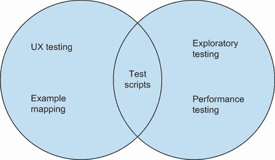
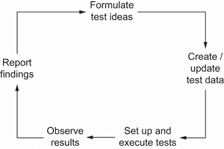
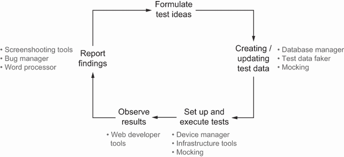

# 3 人工智能、自动化和测试

本章涵盖

+   良好测试的价值

+   工具如何协助测试

+   如何识别何时 AI 工具可以在测试中使用

在我们深入探讨大型语言模型（LLMs）在测试中的应用之前，让我们先问自己以下问题：

+   测试的目的是什么？它的价值是什么？

+   工具如何帮助我们？

+   在什么情况下适合使用 AI 工具？

看起来提出这些基本问题似乎是多余的。但如果你是那种仅仅将测试视为一种确认性练习的人，就像执行测试用例来确认需求是否正确一样，那么你在后续章节中的收获将有限。理解测试的价值和性能对于确定如何有效地使用工具至关重要。因此，在本章中，我们将探讨为什么对测试的深入理解可以帮助我们利用工具。话虽如此，如果你已经具备了这种深入理解，那么请随意浏览本章并继续前进。对于其他人，让我们从为什么进行测试这个基本问题开始。

## 3.1 测试的价值

为了帮助我们理解为什么在软件开发中需要进行测试，让我们回到一个常见的观点，即测试是一种确认性练习。通过这种方式，我们是指测试被视为为了确认以下条件而进行的活动：

+   已满足书面需求。

+   系统中已覆盖所有关键路径。

+   系统按预期工作。

持有这种观点的团队往往过度依赖包含明确指令的测试用例/脚本，以便人类或机器遵循并确认是否达到了预期的结果。这种思维方式和方法的缺点不在于它使用了测试脚本，而在于它只使用了测试脚本而没有其他，这导致边缘情况被忽略，更复杂的错误或行为未经过测试，并且通常对产品行为有有限的理解。许多偏见都源于对测试脚本的过度依赖，但如果我们将其回归到在测试中使用 LLMs，那么它限制了我们对这些工具如何帮助我们的认识。随着像 ChatGPT 这样的工具越来越受欢迎，围绕在测试中使用 LLMs 的大多数演示和辩论都集中在一点上：测试脚本。人们会展示 LLMs 如何生成可以由人类或测试自动化工具手动执行的测试脚本。

虽然最初这些可能有些用途，但使用 LLMs 帮助测试的其他可能性开始枯竭。表面上，这似乎是相关工具的限制，但真正的问题是对于测试是什么以及它如何帮助的有限观念。因此，如果我们想要扩大在测试中使用 LLMs 的范围，我们首先必须扩大我们对测试是什么以及它是如何工作的理解。

### 3.1.1 关于测试的另一种思考方式

为了帮助我们建立更深入的理解，让我们探索一个测试模型，我用它来定义我相信测试的目的以及它如何帮助，如图 3.1 所示。

该模型基于詹姆斯·林赛在其论文“探索与策略”中创建的模型（[`mng.bz/mRdn`](https://mng.bz/mRdn)），由两个圆组成。左圆代表想象力，即我们在产品中想要的东西，右圆代表实施，即我们在产品中拥有的东西。测试的目的是通过执行测试活动尽可能多地了解这两个圆中发生的事情。我们在这两个圆中测试得越多，我们就学得越多。然后我们可以

+   发现可能影响质量的潜在问题

+   将这两个信息圆重叠起来，确保我们相信我们正在构建预期的产品

图 3.1 一个有助于描述测试价值和目的的模型

为了进一步描述这个原则，让我们看看一个例子，其中一支团队正在交付一个假设的搜索功能，我们希望确保其以高质量交付。

想象力

想象力圆代表我们从产品中想要的东西，这包括显性和隐性的期望。因此，在这个圆中，我们的测试重点是尽可能多地了解这些显性和隐性的期望。通过这样做，我们不仅学习了书面或口头分享的明确内容，还深入细节，消除了术语和概念上的歧义。比如说，业务或用户代表，如产品负责人，已经与他们的团队分享了以下要求：“搜索结果应按相关性排序。”

这里共享的明确信息告诉我们，产品负责人希望搜索结果按相关性排序。然而，通过测试所提要求背后的想法和概念，可以揭示大量的隐含信息。这可能以一系列问题的形式出现，例如

+   “相关结果”是什么意思？

+   谁能从这些结果中受益？

+   分享了哪些信息？

+   我们如何按相关性排序结果？

+   我们应该使用什么数据？

通过提出这些问题，我们获得了更广泛的视角，消除了我们团队思考中的任何误解和假设，并确定了可能影响这些预期的潜在风险。如果我们对我们被要求构建的内容了解得更多，那么我们更有可能第一次就构建正确的东西。

实施

通过测试想象力，我们能够更强烈地感受到我们被要求构建的内容。但是，仅仅因为我们可能知道要构建什么，并不意味着我们最终得到的产品符合我们的预期。这就是为什么我们还要测试实施过程来学习

+   产品是否符合我们的预期

+   产品可能不符合我们的预期

这两个目标同等重要。我们希望确保我们构建了正确的东西，但总会有副作用，比如意外行为、漏洞、未满足的期望，以及可能出现在我们产品中的直接奇怪之处。以我们的搜索结果示例，我们不仅能够测试该功能是否以相关顺序提供结果，还可以询问

+   如果我使用不同的搜索词会怎样？

+   如果相关结果不匹配其他搜索工具的行为怎么办？

+   如果我在搜索时部分服务中断怎么办？

+   如果我在不到 5 秒内请求 1000 次结果会怎样？

+   如果没有结果会发生什么？

通过超越我们的预期进行探索，我们对我们产品中正在发生的事情有了更清醒的认识——包括所有缺点。这确保了我们不会最终对产品行为做出错误的假设，并发布一个质量低劣的产品。这也意味着，如果我们发现意外行为，我们有选择尝试去除或重新调整我们的预期的机会。

### 3.1.2 全面的测试方法

描述的想象和实施测试模型表明，测试不仅超越了简单确认预期的范畴，而且提出了一种更全面的测试方法。通过实施专注于想象和实施空间的各项活动，通过我们执行的测试，我们能够更多地了解我们想要构建的内容和我们已经构建的内容。在这两个领域学到的越多，它们就越一致。而且，它们越一致，我们对质量的感知就越准确。

一个对其工作有充分了解的团队对其产品的质量有更好的理解。然后我们也更有能力决定采取哪些步骤来提高质量。这使得我们能够将注意力集中在特定的风险上，对我们的产品进行更改以符合用户的期望，或确定我们想要投入时间修复的问题，以及哪些问题可以置之不理。这是良好测试的价值——帮助团队进入一个可以做出这些明智决策并对其采取的步骤有信心开发高质量产品的位置。

为了帮助我们更好地理解这个模型，让我们考虑一个需要测试的示例情境。在我们的例子中，我们负责交付一个快餐订购系统。用户登录，找到他们想要订购的餐厅，下订单（订单被发送到餐厅），然后从产品内部跟踪订单的配送。这样的产品需要高度可用、易于使用和安全的。因此，为了交付高质量的产品，我们可能需要利用不同的测试活动来关注不同类型的风险，如图 3.2 所示。

图 3.2 想象/实施模型，展示了示例活动

在这个模型中，我们可以看到一系列各种活动被放置在特定的区域，因为它们专注于特定类型的风险。例如，在想象力方面，我们可能会关注影响网站可用性的风险。因此，我们采用专注于用户体验测试和协作设计的测试活动。在实施方面，我们希望确保产品稳定，并最小化可能影响产品可用性和应用程序的风险。因此，我们采用探索性和性能测试等活动。最后，请注意，在重叠的区域，我们添加了测试脚本。这些脚本是有用的，因为它们基于我们对预期（想象力）的明确期望，以减轻产品在增长和随时间演变过程中出现意外变化的风险（实施），这表明测试脚本和自动化检查是有用的，但它们只是整体的一部分。

这些活动中的每一个都有不同的实施方式、不同的挑战，以及工具如何帮助的不同方式。但如果我们不了解测试是一项信息收集和知识分享的练习，我们就无法轻易地识别这些用途。有了这个模型，我们可以更好地理解我们工作中面临的各种风险，以及有助于减轻这些风险的测试活动，然后我们可以开始深入探讨工具在测试中扮演的角色。

## 3.2 工具如何帮助进行测试

你可能会听到测试员说（或者你可能自己也说过）永远没有足够的时间来测试所有内容。这本书中可能会多次提到这一点。团队总是受限于时间、预算、会议、人员配备和其他因素，因此为了实施和执行有效的现代测试，我们必须依赖工具来帮助我们。工具对于测试至关重要，但它们也让我们对测试产生了下一个误解——即工具或机器可以像人类一样进行测试。

### 3.2.1 自动化偏差

为了理解机器和人类在测试方面的差异，让我们考虑一个例子，其中两者都被用来测试一个网站功能。这个功能是一个电子商务网站的全宽横幅，其中包含一张图片和一些文字来突出当天的交易。最初，我们手动测试或以人为主导的方式进行测试，并观察到该功能运行正常——图片显示，并且所有与之相关的文字都是正确的。然后我们决定使用工具来自动化测试。我们编写了代码，该代码将打开浏览器并断言元素 A 存在，这是当天交易加载的地方。我们运行了自动化测试，并且它通过了。然后，有一天，在所有自动化测试都通过的成功发布之后，一个最终用户提出了一个错误，并告诉我们他们看不到当天的交易。他们看到的是页面上方的空白白色框。

发生了什么？在创建自动化测试的过程中，我们将基于基于心理启发式和占卜的隐含信息构建的知识转移，并将其明确化。我们将对功能复杂理解简化为一条指令：元素 A 应该存在于网页上。因此，当我们的产品最新版本发布时，如果有一个功能错误地检索当天的交易，或者 CSS 不正确或损坏，自动化测试仍然通过，因为元素 A 仍然存在。然而，人类只需要几秒钟就能看出有问题。

这个故事的意义并不是工具本身不好或不必要，而是它们常常被误用或误解。这种行为是一种渗透到我们对工具价值看法中的*自动化偏差*，我们赋予工具输出的价值超过了它传达给我们的价值。也就是说，当我们设计自动化的测试来寻找元素 A 时，我们假设我们作为人类所做的只是寻找元素 A。但我们还考虑了许多其他因素，即使我们没有有意识地这样做。

如果我们陷入自动化偏差的陷阱，我们就有可能选择并实施那些我们认为可以像人类一样揭示和报告信息的工具，而实际上它们并不能做到这一点，这可能导致我们对交付的产品产生误导性的过度自信，或者产生一种对于现代项目来说不可持续的工具模拟人类行为的工作量。工具不能取代测试活动，坚持这种观念最终会导致质量问题，并增加项目的风险。因此，我们不得不更多地转变我们的思维方式，思考工具如何支持我们的测试。

### 3.2.2 对工具的选择性使用

工具的成功来自于我们对想要解决的问题以及可能帮助的工具进行了思考的情况。为了更好地理解这一点，让我们回到我们的当天的交易功能，并更仔细地看看当人类测试这样的功能时他们在做什么。

首先，我们考虑不同的测试方法。我们使用对所述功能的当前理解来制定测试想法，并选择首先测试什么。接下来，我们需要设置我们的测试。这可能包括设置环境或创建/更新必要的测试数据。（我们可能需要创建一个当天的交易来观察以及测试用户来管理和查看交易。）一切准备就绪后，我们接下来需要执行我们的测试，加载浏览器或多个浏览器以验证交易是否正确渲染。然后，一旦我们观察到了结果，我们就做笔记或向团队报告我们的发现，所有这些都会更新我们对功能的理解，以便我们再次开始这个过程。这个流程可以总结如图 3.3 所示。

图 3.3 测试“今日特卖”功能的过程可视化

这个周期可能发生得很快——例如，在探索性测试会话中。或者它可能以更长的形式发生，如性能测试，其中每个步骤都有许多细节需要考虑。无论活动类型如何，为了成功执行循环，我们需要工具来完成这个过程。我们可能需要使用数据库客户端、测试数据管理器或基础设施工具来设置状态管理。我们会使用笔记工具、截图应用和项目管理工具来报告所学内容。图 3.4 通过更新我们的初始可视化来总结这些在测试中使用的工具。

可视化展示了现代测试如何利用各种工具来完成各种任务，而不是试图将整个测试性能都集中在一种工具的使用上。这是因为当进行测试时，有很多不同的活动在进行。与人类的观察技能相比，工具观察模式、变化和问题的能力总是有限的。因此，我们通过使用只做一项工作很好的工具来获得价值，而不是使用做很多事情都做得不好的工具。

这种思维方式有趣的地方在于，当我们花时间去考虑它时，这似乎对我们来说很显然。我们都使用工具来帮助我们完成构成更大活动的特定任务。然而，我们中的大多数人并没有经过深思熟虑地这样做。虽然我们知道在特定任务中使用工具是合理的，但我们需要培养选择和使用工具的技能。这意味着我们需要熟悉工具，并更多地了解我们在测试中每天所做的事情，以便我们能够选择正确的工具，或者在 LLMs 的情况下，选择正确的提示或增强。这正是本书的其余部分将关注的重点，为我们提供了解决何时 LLMs 可以帮助特定任务所需的技能。

图 3.4 测试过程的可视化，这次增加了工具

## 3.3 知道何时在测试中使用 LLMs

现在我们已经了解到，在测试中有效使用工具是关于增强测试中的任务，而不是复制广泛的测试活动。那么 LLMs 在这个框架中又处于什么位置呢？鉴于它们的广泛应用，让我们来看看 LLMs 目前被使用的常见方式，并看看每种方式如何支持测试。

### 3.3.1 生成能力

在人工智能的广阔领域中，LLMs 属于生成式 AI 的范畴；也就是说，LLMs 的构建目的是生成内容（这与可能用于预测或分类的其他 AI 不同）。例如，这意味着如果要求 LLM 为我们生成测试用例，它会这样做。然而，仅仅因为它可以生成像测试用例这样的材料，并不意味着这些测试用例对我们有价值。我们必须提醒自己，LLM 生成输出的方式是基于概率的复杂模型。这意味着其生成能力与我们作为人类产生想法的方式不同。

如果你还记得，在第一章中，我们探讨了向 LLM 发送提示时这个概念：

|

| 为文件上传功能创建测试 |
| --- |

这可能会导致如下这样的响应（为了简洁而缩短）：

|

| |   1. 测试文件上传功能：   •   测试用例 1.1：上传有效文件   −   输入：选择一个有效格式的文件（例如，.jpg, .pdf）。   −   预期结果：文件成功上传，并显示确认消息。   •   测试用例 1.2：尝试上传无效文件   −   输入：选择一个无效格式的文件（例如，.exe, .xhtml）。   −   预期结果：显示错误消息，指出文件格式不受支持。   2. 测试文件大小限制：   •   测试用例 2.1：上传小于最大允许大小的文件   −   输入：选择一个小于最大允许大小的文件。   −   预期结果：文件成功上传，并显示确认消息。   •   测试用例 2.2：尝试上传超过大小限制的文件   −   输入：选择一个大于最大允许大小的文件。   −   预期结果：显示错误消息，指出文件超过最大大小限制。 |
| --- | --- |

LLM 生成这些测试用例的方式令人印象深刻，但它们缺乏我们正在测试的功能或产品的上下文和具体性。因此，当与 LLMs 一起工作时，我们需要确保我们如何提示或扩展它们，能够为它们提供足够的上下文以生成有价值的输出。

确保我们提供足够上下文的结果是，更容易使用 LLMs 为非常具体和针对性的任务生成输出。另一种方法是，我们需要提供大量输入数据，这将导致一个昂贵构建和维护的提示。例如，想象一下你需要将多少上下文输入到 LLM 中，才能获得与我们工作环境相关的测试策略。

相反，如果我们专注于使用 LLMs 帮助完成诸如

+   *测试数据生成*—当提供有关数据集的明确规则时，LLMs（大型语言模型）可以用来快速生成一系列数据，用于各种测试活动，从探索性测试到性能测试。

+   *风险和建议测试想法*—我们应始终避免让 LLM 的输出成为测试的唯一仲裁者。我们可以使用它们来提出测试想法和风险，这些想法可以作为新想法的起点或纳入我们的现有工作中。

+   *代码片段*—与早期的测试案例示例类似，如果我们要求 LLMs 生成完整的自动化测试或框架，那么从 LLMs 那里获得的价值很小。然而，使用它们来生成自动化或脚本的较小部分，这些自动化或脚本用于支持测试活动，如探索性测试，可能是有利的。

### 3.3.2 转换功能

LLMs 提供的另一个好处是将自然语言从一种结构转换为另一种结构的能力。LLMs 转换的一个常见例子是语言翻译。假设我们向 LLM 发送了如下内容：

|

| 将以下由三个井号分隔的文本翻译成法语：###Hello, my name is Mark### |
| --- |

然后，它将返回如下响应

|

| Bonjour, je m'appelle Mark |
| --- |

这是一种有用的方式来展示 LLMs 如何转换数据，但我们不应仅限于口头语言。LLMs 能够将所有类型的数据从一种抽象转换为另一种抽象。以下是一些有助于测试的例子：

+   *转换测试数据*—使用 LLMs 快速将数据从一种结构转换为另一种结构可以帮助加快测试速度。例如，我们可能要求 LLM 将纯文本测试数据转换为 SQL 语句，或将 SQL 语句转换为在测试自动化中调用的辅助函数。

+   *将代码转换*—大型语言模型（LLMs）可以将函数、类和其他数据转换为代码的新迭代。这使得 LLMs 非常有价值，因为它们可以将代码转换为不同的语言，同时仍然保持原始代码在新翻译输出中的逻辑和流程（尽管我们始终应该测试以确保无误）。

+   *总结笔记*—虽然数据的转换不像将代码片段从一种语言转换为另一种语言那样直接，但我们可以使用 LLMs 同时进行转换和总结。此外，我们可以使用 LLMs 将测试活动（如探索性或设计测试会议）中的原始测试笔记转换为总结笔记，与他人共享。

### 3.3.3 增强功能

最后，我们可以使用 LLMs 来增强和扩展现有材料。这通常意味着向 LLM 提供一段数据片段，并提示 LLM 对其进行扩展。这与生成能力有一些重叠，因为我们要求 LLMs 生成一定程度的新的输出，但在这个情况下，我们提供了更多的前置上下文，并指导它关注现有材料，而不是提示 LLM 生成全新的内容。这意味着我们可以利用这种能力来帮助我们完成测试任务，例如

+   *审查代码*——并非所有进行测试的人都是自信的程序员，即使是那些对阅读代码感到舒适的人有时也会难以理解分析或测试所需的代码。LLMs 通过提供代码片段并提供关于该代码如何工作的自然语言分解来增强我们的理解，这有助于风险分析、测试设计等。

+   *描述性代码*——与审查代码类似，我们可以使用 LLMs 来帮助提高代码的描述性——例如，快速创建易于创建和维护的代码注释。这对于自动化测试特别有用，因为传达我们的自动化代码正在做什么对于维护至关重要。

+   *扩展分析*——我们还可以使用 LLMs 来扩展我们的分析活动，例如风险分析和设计测试（在构建功能之前询问需求）。通过提供我们的当前分析数据，我们可以要求 LLMs 审查并扩展它，提出我们可以将其纳入分析或忽略的新想法。

### 3.3.4 测试中使用的 LLMs

为了将这些 LLM 的不同能力置于上下文中，让我们回到我们在工具支持下的测试可视化（图 3.5）。

图 3.5 测试过程的可视化，这次增加了 LLMs

在这里，我们可以看到 LLMs 如何被插入到更广泛的测试生命周期中的不同和具体任务中。这使我们回到了我们在第一章中讨论的影响区域模型。我们不是试图使用 LLMs 来复制生命周期中存在的所有测试活动，而是优先考虑我们作为人类的能力以及我们为测试带来的价值。然后，我们选择在选定的领域添加 LLMs 来扩展我们的工作，以便我们可以更快地学习，了解更多，并帮助确保我们的团队能够获得更好的信息，以便他们可以构建更高品质的产品。

## 摘要

+   如果我们对测试的理解有限，那么工具的使用也将受到限制。

+   测试不是一个确认性练习，而是一系列不同的活动，帮助那些寻求了解产品的想象力和实施的人。

+   想象力意味着我们对想要构建内容的理解。

+   实施意味着我们对所构建内容的理解。

+   随着我们对方方面面的理解增加，我们将它们对齐，这有助于我们交付更高品质的产品。

+   我们运行许多不同类型的测试活动，以关注不同类型的风险以及它们如何影响想象力和实施。

+   工具是成功测试的一个基本组成部分。

+   LLMs 可以用于生成、转换和增强输出。

+   LLMs 应该用于较小的、具体的任务，以生成具有价值的输出。

+   LLMs 可以生成有助于特定任务或创建建议内容的内容。

+   LLMs 可以将数据转换为帮助将原始数据转换为有用的格式或总结它。

+   LLMs 还可以增强现有材料，添加新的建议或扩展细节。

+   我们可以将 LLMs 插入到许多不同和具体的测试任务中，这反映了我们在第一章中学到的效应模型领域。
