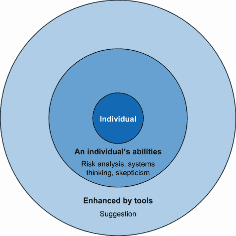
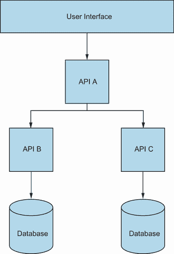
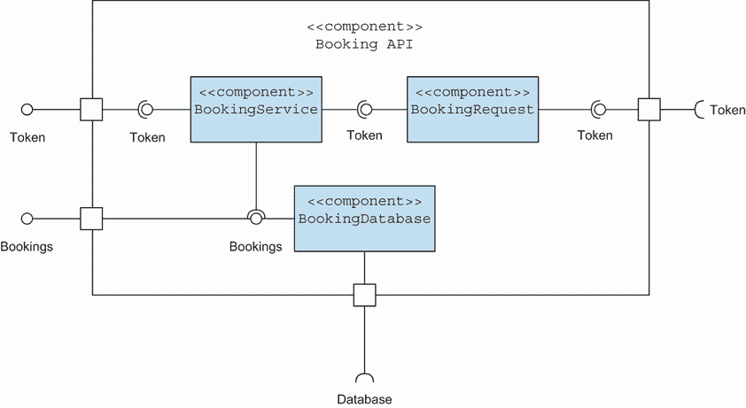
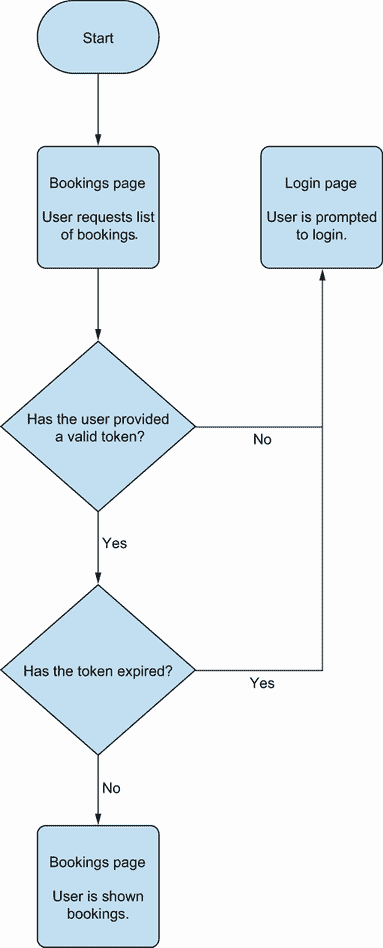

# 第五章：使用 AI 支持的测试规划

本章涵盖

+   模型的价值如何与 LLMs 的使用相关联

+   在测试规划中使用 LLMs 和模型

+   评估 LLMs 生成的建议的适用性

现在我们已经看到大型语言模型（LLMs）如何帮助支持开发中的质量，是时候解决 LLMs 能否生成测试用例的问题了。表面上，答案很简单：是的，它们可以。但更深层次、更重要的问题是，你为什么想要它们生成测试用例？通过无思考或无方向地生成大量的测试用例，我们希望实现什么？仅仅因为我们能够创建测试用例，并不意味着在特定情况下这样做是正确的。

提出这个问题的动机来自于使用 LLMs 来指导对一个功能、史诗或项目的所需测试的愿望。尽管 LLMs 在建议我们应该进行哪些测试方面可能很有价值，但我们仍然担心我们应该有多大的信任度以及我们应该依赖 LLMs 的程度。就像我们探索和将要探索的其他活动一样，我们需要找到一个平衡点。一方面，当我们使用 LLMs 来辅助测试时，我们必须保持健康的怀疑态度，但我们也不应该完全否定它们的潜在价值（只要我们保持对它们可能误导我们的批判性眼光）。因此，本章将探讨两个核心问题，即 LLMs 如何指导测试的方向，重点关注测试规划是如何进行的：

+   LLMs 能否支持我们的测试规划？

+   如何有效地使用 LLMs 来支持此类规划？

具体来说，我们将探讨在确定一个功能、史诗或项目所需的测试类型时我们需要执行的活动。为此，我们将考察现代软件开发团队中的测试规划是什么样的。但在那之前，我们将确定 LLMs 如何在规划阶段为我们提供最佳支持。

## 5.1 定义现代测试中的测试规划

对于我们大多数人来说，测试计划意味着详细文档，试图细致地定义我们将如何执行我们的测试。但如果你是现代敏捷软件开发团队的一员，问问自己：你上次为即将到来的工作记录测试计划是什么时候？如果是的话，它看起来像什么？

现在的测试规划形式多种多样。有些人可能说他们很久没有写测试计划了，有些人可能在一页测试计划中捕捉关键细节，或者依赖验收标准来确定进行哪些测试。其他人可能仍然按照严格的测试计划模板创建正式的测试计划。无论我们的规划是正式的还是非正式的，推动测试计划的是我们的产品和项目风险，这种关系在图 5.1 中得到了说明。


图 5.1 显示风险和测试规划之间关系的图表

因此，当我们规划要进行的测试时，我们的核心目标是定义和减轻具体、可衡量的风险。我们定义的风险告诉我们将进行哪些测试，并且根据预期的测试类型，我们可以考虑不同的测试想法。

### 5.1.1 测试计划、LLM 和影响范围

考虑到风险是我们测试的核心，我们需要与 LLM 建立一种关系，这有助于提升基于风险规划的方法，同时确保我们不会过度依赖 LLM 的输出。关于如何使用 LLM 来指导我们的测试，有很多讨论，即通过让他们为我们生成测试用例。 (为了讨论的需要，我们将包括自动和非自动测试用例。) 但仅仅因为 LLM 可以生成测试用例，并不意味着它们对于减轻我们关心的风险是必要的或相关的。结果可能是，一些建议的测试用例是有价值的，但使用 LLM 大大增加了进行浪费性或误导性测试的风险。

我们希望测试过程既具有指导性又高效，因此，专注于使用 LLM 来支持我们识别风险是关键。首先，它开辟了我们的测试方式。要求 LLM 生成测试用例将我们绑定到一种测试活动类型，尽管使用测试用例作为不同测试技术整体策略的一部分是有道理的，但我们不应仅依赖于测试用例的单一文化。相反，我们应该关注风险，探索我们可能有的不同关注点，而不受选择测试技术的偏见。一旦我们了解了我们关心的风险，我们就可以选择合适的测试活动来减轻这些风险。

其次，最重要的是，关注风险改变了我们使用 LLM 的方式。在图 5.2 中，影响范围模型展示了我们如何告诉 LLM 我们关注的特性和我们已经识别出的风险。



图 5.2 影响范围模型展示了人类和 LLM 作为助手的核心角色

如图中所示，LLM（大型语言模型）充当助手，扩展我们关于风险的想法，并可能帮助我们揭示尚未考虑的新风险，帮助我们扩大风险覆盖范围，同时确保我们控制测试的方向。

## 5.2 使用模型进行专注提示

如果我们想使用 LLM 帮助我们识别风险，我们需要意识到在确定关注点时过度依赖它们的危害。为了更好地理解这一点，让我们看看一个常见的例子，即 LLM 据说如何帮助进行测试，为什么它们可能存在问题，以及我们如何更好地指导 LLM 的使用，以增加其价值并降低误导测试的风险。

### 5.2.1 弱提示意味着弱建议

在本书的第一部分，我们看到了如何处理不当的提示，例如

|


| 为文件上传功能创建测试 |
| --- |

返回一个非基于上下文的通用操作结果列表，这意味着它们需要大量的修改，或者可能会影响我们测试的质量（为了可读性，已缩减大小）：

|


| 实现文件上传功能可能会引入一些风险，包括：   1.  安全风险：   −   恶意文件：用户可能会上传包含恶意软件或病毒的文件，这可能会感染系统并危害安全。   −   注入攻击：如果系统未能正确验证文件类型和内容，它可能会容易受到跨站脚本（XSS）或 SQL 注入等注入攻击的攻击。   −   拒绝服务（DoS）攻击：攻击者可能会上传大量或多个文件来耗尽系统的存储或处理能力，导致服务拒绝。   2.  隐私风险：   −   敏感数据泄露：用户可能会无意中上传包含敏感信息的文件，如个人身份信息、财务数据或机密文件。   −   数据泄露：不当处理上传的文件可能会导致数据意外泄露，尤其是如果文件对未经授权的用户可访问。   3.  合规风险：   −   法规合规：未能遵守 GDPR 或 HIPAA 等法规，关于处理个人或敏感数据，可能会导致法律后果。   −   侵权：用户可能未经许可上传受版权保护的材料，使平台面临潜在的版权侵权法律诉讼。   4.  性能风险：   −   带宽和存储：大文件上传可能会消耗大量的带宽和存储资源，可能会影响系统性能和可扩展性。   −   并发：多个用户同时上传大文件可能会对服务器资源造成压力，并降低系统响应速度。 |
| --- |

如果我们输入垃圾，我们就会得到垃圾输出，如果我们不对我们与 LLM 的交互方式持批判态度，那么麻烦就会随之而来。我们已经知道，要从 LLM 中成功获得价值，我们需要创建针对我们想要解决的问题的具体提示。在生成合适的风险时，挑战在于能够为复杂系统创建这些特定的提示。达到这一点的技能不在于我们编写提示的能力，而在于将系统分解成更易于管理的块。通过这样做，我们就可以创建更具有针对性和专注性的提示。因此，问题转变为如何将系统分解以创建更好的提示。

### 5.2.2 模型是什么以及为什么它们能有所帮助

在我们进入使用模型帮助我们进行提示的过程之前，让我们明确一下“模型”的含义。当我们使用“模型”这个词来指测试和软件开发时，我们是指某些信息的抽象表示。它可以是可视化的（例如，应用程序的数据流图），或者它可以是存储在我们心中的东西。我们说它是抽象的，因为尽管它基于现实中的信息，但模型通常简化、强调或忽略其基于的信息的某些方面。它提供了一个部分的真实图景。这就是为什么在讨论模型时使用乔治·博克斯的引言“所有模型都是错误的，但有些是有用的”这个格言的原因。模型倾向于用于关注更广泛背景下的特定属性或概念。这可能会被视为批评，但当它被良好地利用时，它可以帮助我们解决问题。例如，考虑图 5.3 中所示的应用程序模型。



图 5.3 系统模型的基本可视化

这个应用程序的视觉模型被设计用来帮助读者确定 API 之间的依赖关系。注意它并没有包含平台的所有细节。API 被抽象为盒子，总结了每个 API 内部代码的细节，而系统的前端则简单地总结为名为“用户界面”的盒子。这个模型是有缺陷的，因为它没有给我们提供一个关于平台每个方面的准确图景，但它仍然是有用的，因为它强调了读者关心的细节——平台上的 API 之间的关系。如果读者想了解 API 的依赖关系，那么这个模型是有价值的。然而，如果读者想了解前端的具体实现或每个 API 内函数的具体行为，这个模型就毫无价值了。

因此，在创建模型时，我们倾向于只通过突出我们想要的信息并丢弃其他细节来获得一个部分图景。这种系统建模的方法可以帮助我们使提示生成更具情境性和价值的建议风险。

## 5.3 结合模型和 LLM 以协助测试规划

既然你更好地理解了创建不专注于系统特定部分的提示的危险，让我们看看我们如何通过使用模型来减轻这种风险。为了展示我们的基于模型的策略，让我们假设我们正在使用一个 LLM 来帮助我们进行测试规划过程。

### 5.3.1 创建一个用于识别提示的模型

毫不奇怪，我们的第一步是创建一个应用程序的模型。我们将在稍后探讨我们可以使用的不同格式来创建模型，但在此期间，让我们假设我们已经创建了一个类似于图 5.4 所示的模型。


图 5.4 应用程序的可视模型

模型使用数据流图来概述在从 API 请求一系列预订的过程中数据是如何处理的。模型本身不是一个完整的系统，而是存在于更广泛的 B&B/酒店预订管理系统中的一个特定功能部分。为了分解模型所指定的内容，当管理员想要查看存储在数据库中的预订列表时，以下步骤会发生：

1.  发送一个请求以查看预订列表，并将令牌附加到请求上。

1.  然后，令牌从初始请求中提取出来，并送去做验证，以对比有效会话列表。

1.  如果令牌被确认为一个有效的会话，那么一个积极的响应将被返回到管理视图预订请求的部分系统。

1.  预订列表随后被汇总并发送回管理员。

考虑到这个流程，让我们首先看看如果我们构建一个尝试一次性包含模型中所有内容的提示，我们可能会从 LLM（大型语言模型）得到什么样的响应。首先，我们会创建一个提示：

|


| 你是一位软件测试专家。为使用基于会话的令牌来授权访问查看预订列表的应用程序生成一份风险列表。 |
| --- |

当提示被发送到一个 LLM，例如 ChatGPT 时，我们会收到如下类似的响应：

|


返回的列表乍一看很长，但阅读后，似乎存在一些问题。首先，查看建议的风险列表，它们主要集中在安全风险上。虽然安全风险是需要考虑的重要因素，但关于认证和预订组件之间的交互或预订列表的编制的风险却很少。LLM 过于关注提示中的标记部分。因此，让我们考虑一个通过关注我们创建的模型的一个特定部分来创建的提示：

|


| 你是一位软件测试专家。尽可能多地生成由三个井号定界的行为的风险。###一旦授权，将存储在数据库中的预订列表发送给用户进行审查的预订 API### |
| --- |

使用这个提示，我们试图描述系统中被我们模型捕获的特定部分。我们不是要求一次性涵盖所有功能部分的建议，而是选择系统的一个部分来查看我们是否能得到更好的建议。这意味着如果我们把这个发送给像 ChatGPT 这样的 LLM，我们可能会看到以下建议列表（为了可读性再次进行了缩减）：

|


| 1. 数据安全风险：由于认证或授权机制不足，可能导致对敏感预订数据的未授权访问。如果 API 没有加密服务器与用户之间的数据传输，数据可能容易受到拦截，存在数据泄露风险。如果 API 没有正确清理输入，存在 SQL 注入攻击风险，可能导致对数据库的未授权访问或篡改。 |
| --- |

让我们比较一下我们从 ChatGPT 那里得到的这个响应和之前的响应，看看是否有改进。首先，有一个问题就是初始提示过于关注功能的具体方面，而忽略了其他部分。鉴于我们已经根据我们的模型明确选择了一个不同的系统部分，那么新提示响应中大量关注测试预订列表的方式是有道理的。我们就是要求它这样做。但引人注目的是建议的多样性。在初始提示中，大部分建议都是基于标记可能处于的不同状态；这个提示不仅提供了更多的建议，还混合了关于预订正确性、边界、无效数据和缓存的多种想法。接下来，有一些建议过于模糊，无法采取行动。审查每个标题下的建议，我们可以看到它们更加明确——例如，负测试建议提到了需要考虑的具体状态码类型。

结果得到了改善，因为当在提示中添加更多上下文时，大型语言模型（LLMs）的响应更好，通过使用模型，我们可以分割行为，专注于特定的组件，并在我们的提示中捕捉和传达上下文。这确实意味着我们正在忽略模型中的其他组件，以便专注于如何传达系统的一部分工作。但如果我们迭代这个过程，我们可以改变我们想要为哪个模型部分创建提示。例如，我们可以运行一个专注于系统标记验证部分的第二个提示，创建如下提示：

|


| 你是一位专家软件测试员。尽可能多地生成由三个哈希符号分隔的行为的风险。###一个授权 API，它将从不同的 API 获取令牌，并在响应积极或消极之前检查令牌是否有效且在有效期内。### |
| --- |

当发送到像 ChatGPT 这样的 LLM 时，它可能会返回如下内容：

|


| 1. 令牌验证失败：授权 API 可能无法正确验证从不同 API 接收到的令牌，导致未经授权的访问。2. 令牌过期：授权 API 可能无法准确检测过期的令牌，允许权限不再存在的用户访问。3. 假阳性/假阴性响应：API 可能提供不正确的响应，要么授予未经授权的用户访问权限，要么拒绝授权用户的访问。4. 性能下降：如果令牌验证过程资源密集，可能会导致在高流量期间性能下降或甚至停机。5. 依赖性故障：如果提供令牌的不同 API 出现停机或问题，授权 API 可能无法正确执行其功能。6. 安全漏洞：授权 API 可能容易受到安全漏洞的影响，如注入攻击或不正确的访问控制机制。7. 缺乏日志记录/监控：没有适当的日志记录和监控，可能难以识别未经授权的访问尝试或诊断令牌验证问题。8. 错误处理不足：较差的错误处理可能导致模糊或误导性的错误消息，使开发者难以调试集成问题。9. 令牌欺骗：恶意行为者可能尝试欺骗令牌以获得未经授权的访问，利用令牌验证过程中的弱点。10. 令牌重放攻击：攻击者可能截获有效的令牌并重放它们以获得未经授权的访问，突出了实施防止令牌重放攻击措施的重要性。11. 令牌过期竞争条件：如果令牌在验证和授权之间过期，可能会发生竞争条件，可能允许未经授权的访问。12. 令牌验证逻辑不一致：如果授权 API 和不同 API 之间的令牌验证逻辑不同，可能会导致不一致和意外的行为。13. 法规遵从问题：未能正确保护和验证令牌可能导致不符合行业法规或数据保护法。14. 可扩展性担忧：随着用户和令牌数量的增加，授权 API 的可扩展性可能成为问题，可能导致性能问题或服务中断。15. 集成挑战：将授权 API 与其他 API 和其他系统集成可能带来技术挑战，例如兼容性问题或数据格式不匹配。 |
| --- |

我们将从这个列表中选择建议，并将其添加到之前提示响应中选出的建议中，以构建一个我们可能在测试计划中考虑的风险列表。

这表明，为了提高 LLM 风险建议的质量，我们需要理解正在测试的系统。仅仅选择一个需求或特性，并要求 LLM 生成风险，是不会奏效的。提供给 LLM 的上下文不足意味着它将依赖于在类似特性需求中训练出的常见行为模式，这会导致模糊的回答和幻觉。要从 LLM 中获得有价值的东西，我们需要具体，以便为它提供丰富的上下文信息，我们可以通过模型来获取。通过创建系统的模型，我们不仅提高了对我们正在测试内容的理解，还将系统的部分划分为特定的区域，我们可以利用这些区域来指导我们编写的提示类型。然后，我们可以迭代系统的每个部分，创建提示以返回建议，构建一个更相关、更针对特定组件及其可能行为的风险拼贴画。

所有这些都可以再次使用影响区域模型来总结，如图 5.5 所示。


图 5.5 影响区域模型，展示了从 LLM 获得有价值输出的所需技能

影响区域模型展示了我们的建模和分析技能是如何驱动 LLM（大型语言模型）提供价值的能力的。如果我们对系统的理解薄弱，那么我们的提示也会薄弱，这意味着我们得到的结果也会薄弱。

活动 5.1

选择你正在测试的系统的一部分，并创建一个表示其工作原理的模型。你可以创建一个数据流图，或者选择不同的建模技术。一旦你创建了模型，选择模型的一个特定部分，并使用它来创建一个有针对性的提示，以生成建议的风险。

### 5.3.2 尝试不同的模型类型

在我们刚刚探讨的例子中，我们使用数据流图方法来模拟我们的系统是如何工作的。然而，如前所述，模型是有缺陷的，这意味着我们之前使用的模型帮助我们从数据在应用程序中处理的角度识别出潜在的提示，但它忽略了过程中的其他视角。因此，尝试不同的模型类型对我们考虑从不同视角了解我们的应用程序是有用的，这使我们能够提示 LLM 提出广泛的风险建议。因此，让我们看看几种不同的建模技术，以帮助我们扩展我们的工作。

正式建模技术

当使用数据流图格式（DTD）时，我们采用该格式所属的显式符号和规则，以便我们的模型可以尽可能清晰地直观解释正在发生的事情。然而，DTD 只是许多不同类型的正式模型中的一种，我们可以借鉴和窃取来创建适合我们的模型。例如，UML（统一建模语言）包含许多不同的建模方法，可以从不同的角度看待应用程序。结构化的 UML 图，如组件图，可以用来分解系统的架构，并帮助我们使用 LLM（大型语言模型）生成针对系统特定部分的关注风险。例如，图 5.6 展示了我们如何将预订列表功能解释为组件图。



图 5.6 预订列表功能组件图

这将导致一个类似于以下提示的信息：

|


| 你是一位软件测试专家。尽可能多地生成由三个井号定界的行为的潜在风险。###一个`BookingRequest`类向 Auth API 发送请求以确认`BookingService`能否完成其请求### |
| --- |

我们还可以使用行为图，如序列图和用例图，来帮助我们捕捉系统中的用户流程，并创建生成以用户为中心的提示的提示（例如，如图 5.7 所示的模型）。



图 5.7 预订列表功能用户流程图

这可能有助于我们创建如下所示的提示：

|


| 你是一位软件测试专家。尽可能多地生成由三个井号定界的行为的潜在风险。###用户在登录应用程序后想要查看预订列表。他们已使用正确的凭证登录，并在授权过期之前请求预订列表### |
| --- |

基于正式模型的选项和图表非常丰富，因此建议进行实验。探索不同模型的工作方式和它们能触发哪些类型的提示，可以帮助我们确定更适合我们的模型。我们还可以利用从正式建模技术中学到的知识来构建适合我们的自定义模型。

心智模型

尽管不同的正式建模技术可以帮助我们从不同的角度分析我们的系统，但进行这项活动是代价高昂的。花时间以不同的方式对系统进行建模需要时间，并要求我们进行广泛的研究，以积累足够的知识来以不同的方式构建我们的应用程序。然而，我们可以从另一个角度来处理模型解释，即我们通过启发式方法来改变对单个模型的认识。

如果我们回到图 5.7，该模型旨在引导我们了解条件动作如何决定接下来发生什么。因此，我们创建专注于这些条件的提示，因为这是模型设计用来强调的。但如果我们通过采用不同的心智模型来改变我们的看法呢？一个例子是使用 SFDIPOT 记忆法，有时也称为旧金山车站。James Bach 作为启发式测试策略模型的一部分创建了这个记忆法（[`mng.bz/o0lN`](https://mng.bz/o0lN)），SFDIPOT 旨在帮助我们从不同的角度考虑产品；记忆法中的每个字母代表不同的视角：

+   *结构*—产品的构成

+   *功能*—产品做什么

+   *数据*—产品处理的内容

+   *接口*—产品可以交互的方式

+   *平台*—产品所依赖的

+   *操作*—产品将如何被使用

+   *时间*—时间如何影响产品

虽然这个记忆法可以在战略层面上使用，我们也可以将其应用于系统的较小部分，如图 5.7 所示。我们可以使用这些不同类型的视角通过不同的角度重新评估我们的产品。例如，我们可能会通过询问时间可能会如何影响我们的功能来审查图 5.7。这可能会激发以下提示，该提示规定了生成风险和使用分隔符策略的初始指令：

|


| 你是一位软件测试专家。尽可能多地生成由三个井号定界的行为的风险。关注用户使用系统速度（快或慢）以及某一时刻使用系统的用户数量方面的风险。 |
| --- |

我们可以利用这段时间来思考如何避免离题的建议：

|


| 在输出之前检查每个建议是否符合时间条件。 |
| --- |

然后我们将提供工作的背景：

|


| ###用户在登录应用程序后想要查看预订列表。他们已使用正确的凭证登录，并在授权过期之前请求预订列表。### |
| --- |

使用这样的提示可能会得到以下回应：

|


| 1. 单用户 - 正常速度：一个用户登录后，立即访问预订列表，确保在可接受的响应时间内显示。2. 单用户 - 慢速速度：一个用户，拥有较慢的互联网连接，登录并请求预订列表，检查系统如何处理延迟响应。3. 多用户 - 正常速度：多个用户在短时间内同时登录并请求预订列表，以观察系统是否会变慢或由于并发请求而对响应时间产生影响。4. 多用户 - 慢速速度：模拟多个用户使用较慢的连接访问系统，尝试同时查看预订列表，以评估系统在较慢网络条件和并发用户请求下的性能。5. 用户授权时效：用户在授权即将到期之前尝试访问预订列表，以验证系统是否允许访问或在此关键时间窗口内适当地处理请求。6. 访问期间授权过期：模拟用户在查看预订列表时授权过期的情况，以确保系统优雅地处理此过期，不会在授权过期后崩溃或显示敏感信息。7. 高负载场景：通过显著增加同时用户的数量来生成高负载，评估系统如何在不牺牲响应时间或因负载而崩溃的情况下提供预订列表。8. 并发访问和授权更新：多个用户同时访问系统，其中一些用户的授权正在过期并得到更新。此测试验证系统在处理并发访问和授权更新过程时的行为。9. 间歇性用户访问：用户在不同时间间隔登录，一些用户在登录后立即请求预订列表，而另一些用户先执行各种活动。此测试确保系统在用户行为各异的情况下保持一致的响应时间。10. 随机访问时间：随机时间用户请求预订列表，以模拟现实世界场景，测试系统如何应对不可预测和不规则的访问模式。 |
| --- |

此响应的结果更多地关注用户或用户如何与系统交互。它们也比早期一些高级负载测试的建议更为详细。提示中包含关于系统预期如何工作的明确信息，但我们已经根据对图 5.7 中功能随时间工作方式的转变视角，为提示添加了重点。

使用 SFDIPOT 等启发式方法意味着我们可以快速迭代模型的部分，但也可以改变我们的视角，以不同的方式阅读模型，帮助我们识别可以添加到提示中的新指令。

活动 5.2

使用与早期活动中建模的相同特征的不同建模技术创建一个新的模型，或者使用心智建模技术重新评估现有的模型。使用它们来提出新的提示，这些建议可以为之前创建的提示提供独特想法。

## 5.4 LLMs 和测试用例

我们以询问是否可以使用 LLM 生成测试用例开始本章。相反，我们通过以风险为指南进行了一次旅行，以确定我们可能进行的测试类型。目的是表明我们在控制我们希望测试采取的方向。根据我们识别的风险和 LLM 提出的风险，我们可能会确定我们进行的测试根本不需要依赖测试用例。

然而，如果我们的规划确定确实需要测试用例，无论是手动运行还是通过自动化，我们已经通过建模识别了更小、更集中的功能段，这些段可以在我们的提示中使用。例如，我们可能会创建一个提示，结合我们之前所做的建模工作、我们已识别的风险，甚至是我们已经捕获的示例测试用例。我们使用分隔策略来概述两个数据部分：

|


| 你是一位专家软件测试员。基于由三个井号分隔的行为和由三个反引号分隔的测试用例，生成建议的测试用例。关注用户使用系统的速度（快或慢）以及在任何时间点使用系统的用户数量。 |
| --- |

我们可以花时间思考以停止重复并专注于风险：

|


| 在输出之前检查每个建议是否与提出的风险相匹配，并且它们不是在由三个反引号分隔的区域内找到的测试用例的重复。 |
| --- |

我们随后在分隔区域内提供一个捕获区域：

|


| ### 用户在登录应用程序后想要查看预订列表。他们已使用正确的凭证登录，并在授权过期之前请求预订列表。### |
| --- |

最后，我们在分隔区域内提供测试用例：

|


| ```pyTest Case 1: Single User - Normal Speed:   •   Test accessing the booking list immediately after logging in with valid credentials, within a typical speed range.   •   Verify that the booking list is displayed correctly without any delay or errors.Test Case 2: Single User - Slow Speed:   •   Simulate a slow network connection or system performance.   •   Attempt to access the booking list immediately after logging in with valid credentials, but at a slower pace.   •   Ensure that the system responds appropriately, perhaps with a loading indicator or progress bar, and eventually displays the booking list without timing out or crashing.Test Case 3: Multiple Concurrent Users:   •   Have one user login and request the booking list while another user performs a different action (e.g., making a booking).   •   Verify that the system can handle concurrent requests without performance degradation or conflicts.``` |
| --- |

当将内容发送到 ChatGPT 时，它为我返回了以下建议的测试用例：

|


| 测试案例 4：单个用户 - 快速速度：   •   使用有效凭据登录后立即以非常快的速度访问预订列表。   •   验证系统是否能够处理快速请求而不会导致错误或意外行为。测试案例 5：多个并发用户 - 正常速度：   •   让多个用户同时登录并请求预订列表。   •   确保每个用户都能及时接收到正确的预订列表，而不会受到其他用户请求的延迟或干扰。测试案例 6：授权过期：   •   使用有效凭据登录并等待授权过期。   •   再次尝试访问预订列表。   •   验证系统拒绝访问或提示用户重新认证，而不是显示预订列表。 |
| --- |

再次强调，这里的目的是不是盲目地生成一个详尽的测试案例列表，而是批判性地评估所提出的建议，看看它是否产生了有用、新颖的想法，或者激发我们识别自己新的测试案例。

### 5.4.1 对生成的风险和测试案例保持健康的怀疑态度

将如何测试应用程序的明确步骤编纂成法典，无法与人类复杂、直观的测试相媲美。测试案例可以在一定程度上帮助，尤其是在自动化领域，但我们必须避免测试案例的单调文化，这可能会影响我们产品的质量而不是帮助提高它。因此，我们必须意识到，LLM（大型语言模型）作为我们测试计划活动的助手提供价值，而不是测试权威。另一种选择是过度依赖 LLM 来完成我们的工作，这会让用户天真地认为它们可以完全信赖来复制我们的测试，这反过来又可能使我们迅速生成数千个测试案例，而缺乏思考和/或价值。然而，危险并不仅仅来自 LLM。相反，我们必须仔细、系统地思考我们要求 LLM 为我们创建的内容，并对返回的内容持怀疑态度。

## 摘要

+   测试计划可以从非正式笔记到关于如何进行测试的正式文档。

+   然而，所有的测试计划都根植于我们在测试中关心的风险。

+   泛泛而谈的提示可能会损害我们的计划，而不是帮助它。相反，我们需要开发更准确和具体的提示来生成有用的建议。

+   使用视觉和心智模型可以帮助我们分解系统以创建更好的提示。

+   所有模型都有缺陷，但我们可以利用这一点来创建强调我们关心的细节的模型，以帮助我们解决问题。

+   创建模型允许我们将功能或系统的一部分分解，以更好地理解其各部分是如何工作的。

+   基于模型特定部分构建提示可以帮助我们产生有价值、准确和可操作的建议。

+   我们可以使用不同的建模技术来获得对系统行为的不同视角。

+   尝试不同的形式化建模方法可以帮助我们生成不同类型的提示。

+   用不同的心理模型来审查单个模型可以帮助我们改变自己关于编写哪些类型提示的内部偏见和观点。

+   我们应该关注测试什么，并使用大型语言模型（LLMs）来提出想法，而不是反过来。
