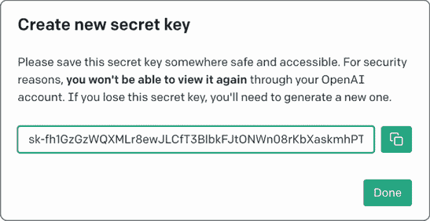
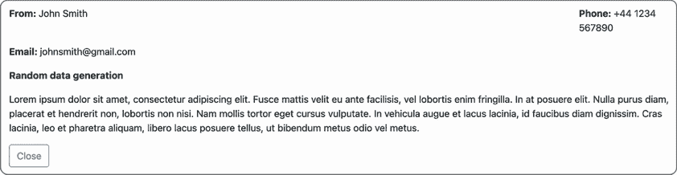
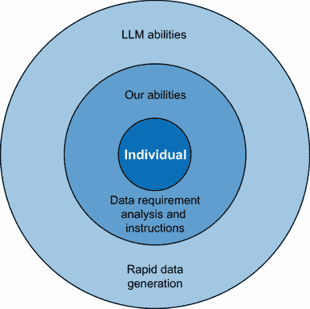

# 6 使用 AI 快速创建数据

本章涵盖

+   使用 LLMs 生成基本测试数据

+   改变测试数据的格式

+   使用复杂数据集来提示 LLMs 创建新的数据集

+   将 LLMs 集成作为自动化检查的测试数据管理器

管理测试数据是测试和软件开发中最具挑战性的方面之一。通常，数据需求随着系统的复杂性而增长。为了自动化检查和人工驱动的测试，我们需要合成与我们的上下文相关的数据，并在需要时进行大规模匿名化，这可能会对测试时间和资源造成巨大消耗，而这些时间和资源本可以用于其他测试活动。

然而，我们需要测试数据。如果没有必要的数据来触发动作和观察行为，就无法进行大多数测试活动。这就是为什么本章展示了我们可以如何使用大型语言模型（LLMs）来生成测试数据，提供不同的提示来创建简单和复杂的数据结构，并通过第三方 API 将 LLMs 集成到我们的自动化框架中。

## 6.1 使用 LLMs 生成和转换数据

由于 LLMs 是强大的、概率性的文本生成器，因此，通过适当的提示，它们可以轻松地生成和转换测试数据，这是合理的。但这取决于编写清晰的提示，明确传达我们的数据需求，以便我们得到我们想要的数据，格式正确，并且没有由于幻觉引起的任何错误。我们可以以多种方式来处理这个问题，但让我们首先看看我们可以随意使用的一些基本提示，以创建各种测试活动的测试数据。

### 6.1.1 通过提示 LLMs 生成简单数据集

首先，让我们探索如何创建基本数据集示例，如下所示：

```py
{
  "room_name": "Cozy Suite",
  "type": "single",
  "beds": 1,
  "accessible": true,
  "image": "https://example.com/room1.jpg",
  "description": "Charming room",
  "features": ["Wifi", "TV"],
  "roomPrice": 150
}
```

如我们所见，JSON 数据集使用相当简单的结构混合了多种数据类型。我们将在本章后面部分看到如何处理更复杂的结构，但现在，让我们回到第二章中我们用来创建一些样本测试数据的一个提示。首先，我们设定提示的主要说明，并使用思考时间原则来提高输出 JSON 的质量：

|


| 你是一个 JSON 数据生成器。生成一个包含 5 个 JSON 对象的数组，并在输出结果之前检查是否已创建了 5 个 JSON 对象。 |
| --- |

我们使用不同的分隔符来设定我们的数据需求规则：

|


|    *   每个参数都用一个`%`符号标识。    *   每个列按照键、值数据类型和选项的顺序描述，使用`&#124;`符号。    *   如果列数据选项说明为随机，则根据建议的格式和列名随机化数据。 |
| --- |

然后我们提供我们想要根据我们的分隔规则集创建的数据：

|


| 这里是说明：

```py
% room_name &#124; string &#124; random
% type &#124; string &#124;  'single' or 'double'
% beds &#124; integer &#124; 1 to 6
% accessible &#124; boolean &#124; true or false
% image &#124; string &#124; random url
% description &#124; string &#124; random max 20 characters
% features &#124; array[string] &#124; 'Wifi', 'TV' or 'Safe'
% roomPrice &#124;  integer &#124; 100 to 200
```

|

这个提示依赖于一系列提示工程策略来明确说明我们想要生成的内容。我们使用格式策略来声明我们希望测试数据以何种格式返回。分隔符策略用于设置我们结构化数据以及格式值的规则。此外，我们还指示 LLM 在输出之前先找出解决方案，以降低幻觉的风险。

将此提示发送到 ChatGPT 返回以下数据集：

|


|

```py
[
  {
    "room_name": "Cozy Suite",
    "type": "single",
    "beds": 1,
    "accessible": true,
    "image": "https://example.com/room1.jpg",
    "description": "Charming room",
    "features": ["Wifi", "TV"],
    "roomPrice": 150
  },
  {
    "room_name": "Deluxe Room",
    "type": "double",
    "beds": 2,
    "accessible": false,
    "image": "https://example.com/room2.jpg",
    "description": "Luxury abode",
    "features": ["Wifi", "Safe"],
    "roomPrice": 180
  },
  {
    "room_name": "Economy Stay",
    "type": "single",
    "beds": 1,
    "accessible": true,
    «image»: «https://example.com/room3.jpg»,
    "description": "Budget-friendly",
    "features": ["TV"],
    "roomPrice": 120
  },
  {
    "room_name": "Family Suite",
    "type": "double",
    "beds": 3,
    "accessible": true,
    "image": "https://example.com/room4.jpg",
    "description": "Spacious and comfy",
    "features": ["Wifi", "TV", "Safe"],
    "roomPrice": 200
  },
  {
    "room_name": "Executive Loft",
    "type": "single",
    "beds": 1,
    "accessible": false,
    «image»: «https://example.com/room5.jpg»,
    "description": "Modern design",
    "features": ["Wifi", "Safe"],
    "roomPrice": 170
  }
]
```

|

从生成的数据中可以得出一些观察结果。我们可以看到，在提示明确数据期望的地方，我们得到的数据接近我们的期望——例如，`accessible`和`roomPrice`特征。然而，也有一些较弱的地方，我们的提示让 LLM 决定输出什么。两个值得注意的领域是选择了`example.com`的图像 URL 以及`beds`和`type`之间的关系。图像 URL 虽然有效，但并不指向实际的图像。根据我们的需求，我们可能需要进一步调整我们的提示，使 URL 更加明确。另一个关系也很有趣，因为其中一条记录表明房间类型是双人，但它提供了三张床。尽管如此，这仍然是一个良好的开端，有时这种类型的生成数据足以支持我们的测试。

但如果我们想以不同的数据结构来获取这些数据呢？这可以通过快速重写提示来处理。例如，这个提示请求相同的数据，但这次是以 XML 格式。我们首先将初始说明重写为以 XML 格式创建数据：

|


| 你是一个 XML 数据生成器。在一个数组中生成 3 个 XML 条目，并在输出结果之前检查是否已创建了 3 个 XML 对象。 |
| --- |

我们添加一个初始说明来处理根 XML 节点：

|


| |   *   根节点元素名称用`#`符号标识   *   每个元素用`%`符号标识   *   每个列按元素名称、数据类型和选项的顺序描述，使用`&#124;`符号   *   如果列数据选项为随机，则根据建议的格式和列名称随机化数据 |
| --- | --- |

然后我们提供与之前相同的数据步骤：

|


| 这里是说明：

```py
# rooms
% room_name &#124; string &#124; random
% type &#124; string &#124;  'single' or 'double'
% beds &#124; integer &#124; 1 to 6
% accessible &#124; boolean &#124; true or false
% image &#124; string &#124; random url
% description &#124; string &#124; random max 20 characters
% features &#124; array[string] &#124; 'Wifi', 'TV' or 'Safe'
% roomPrice &#124;  integer &#124; 100 to 200
```

|

虽然在一个应用程序中处理不同的数据格式并不一定常见，但这个提示展示了与 LLMs 合作生成数据的一个优点。使用结构化输出策略，我们能够保持大多数提示与 JSON 提示示例相同，只需稍作修改即可生成 XML；当我将其发送到 ChatGPT 时，得到了以下结果：

|


|

```py
<rooms>
    <room>
        <room_name>A1</room_name>
        <type>single</type>
        <beds>3</beds>
        <accessible>true</accessible>
        <image>https://example.com/room_a1.jpg</image>
        <description>Cozy room</description>
        <features>
            <feature>Wifi</feature>
            <feature>TV</feature>
        </features>
        <roomPrice>150</roomPrice>
    </room>
    <room>
        <room_name>B2</room_name>
        <type>double</type>
        <beds>2</beds>
        <accessible>false</accessible>
        <image>https://example.com/room_b2.jpg</image>
        <description>Spacious suite</description>
        <features>
            <feature>TV</feature>
            <feature>Safe</feature>
        </features>
        <roomPrice>180</roomPrice>
    </room>
    <room>
        <room_name>C3</room_name>
        <type>single</type>
        <beds>1</beds>
        <accessible>true</accessible>
        <image>https://example.com/room_c3.jpg</image>
        <description>Modern design</description>
        <features>
            <feature>Wifi</feature>
            <feature>Safe</feature>
        </features>
        <roomPrice>130</roomPrice>
    </room>
</rooms>
```

|

再次，输出具有与先前示例相似的属性。XML 的结构是有效的，确定使用哪些数据的规则已被遵循。但是，与 JSON 示例类似，我们做出了一些不寻常的选择。使用带有三个床位的单人房间，奇特的房间名称和虚拟 URL。在两个提示中，我们可以添加更多信息来减轻这些问题，但我们会面临在提示中创建大量规则以管理数据点之间关系的风险。然而，我们还可以在我们的提示中做出其他选择来处理更复杂的规则集，但首先，让我们探索 LLMs 如何通过其转换数据的能力来帮助我们。

活动第 6.1 节

使用本节中共享的提示，更改数据结构以创建新的 XML 或 JSON 测试数据。

### 6.1.2 将测试数据转换为不同的格式

LLMs 的核心优势之一，已被技术倡导者强调，是其将文本从一种语言翻译成另一种语言的能力——例如，从法语翻译成英语再翻译回来。我们还可以使用这种方法将数据或代码从一种结构或语言转换成另一种。例如，看看以下将一些 JSON 转换为 SQL 语句的提示。我们使用分隔符策略和指令来启动提示：

|


| 你是一个 JSON 到 SQL 转换器。将用三个井号分隔的 JSON 对象转换为 SQL 语句，该语句将：   1. 创建一个 SQL 表以插入转换后的记录   2. 创建插入语句将每条记录添加到数据库中 |
| --- |

接下来，我们指示模型检查解决方案以改进输出：

|


| 在输出结果之前检查每个 SQL 语句是否涵盖了 JSON 的所有方面 |
| --- |

然后我们提供我们想要转换的数据：

|


|

```py
###
[{
    "firstname": "Sally",
    "lastname": "Wilson",
    "totalprice": 229,
    "depositpaid": false,
    "bookingdates": {
        "checkin": "2017-02-20",
        "checkout": "2019-07-05"
    },
    "additionalneeds": "Breakfast"
},{
    "firstname": "Jim",
    "lastname": "Jones",
    "totalprice": 871,
    "depositpaid": false,
    "bookingdates": {
        "checkin": "2017-08-11",
        "checkout": "2021-06-30"
    },
    "additionalneeds": "Breakfast"
},{
    "firstname": "Mary",
    "lastname": "Ericsson",
    "totalprice": 558,
    "depositpaid": true,
    "bookingdates": {
        "checkin": "2018-07-04",
        "checkout": "2022-09-25"
    }
}]
###
```

|

在这个提示中，我们要求一个 LLM 不仅将一个 JSON 对象转换为我们可以运行的 SQL `INSERT` 语句，而且还创建必要的 `CREATE` 语句，以便我们首先能够插入数据。将此发送到 ChatGPT 返回了以下 SQL 语句：

|


|

```py
-- Create the table
CREATE TABLE bookings (
    id SERIAL PRIMARY KEY,
    firstname VARCHAR(255),
    lastname VARCHAR(255),
    totalprice DECIMAL(10, 2),
    depositpaid BOOLEAN,
    checkin DATE,
    checkout DATE,
    additionalneeds VARCHAR(255)
);

-- Insert the records
INSERT INTO bookings (firstname, lastname, totalprice, depositpaid,
 checkin, checkout, additionalneeds)
VALUES
    ('Sally', 'Wilson', 229.00, false, '2017-02-20', '2019-07-05',
 'Breakfast'),
    ('Jim', 'Jones', 871.00, false, '2017-08-11', '2021-06-30',
 'Breakfast'),
    ('Mary', 'Ericsson', 558.00, true, '2018-07-04', '2022-09-25', 
NULL);
```

|

在这个回答中引人注目的不仅仅是生成了正确的 SQL 语句来创建和将我们的数据插入数据库，而且它还尊重了原始 JSON 对象中的值。这证明了这些策略的重要性，这些策略被纳入提示中：

|


| 在输出结果之前检查每个 SQL 语句是否涵盖了 JSON 的所有方面 |
| --- |

该提示有助于确保在转换过程中数据参数本身不会被修改。

这些快速提示演示了 LLM 可以用来快速生成和转换数据，这些提示可以通过替换每个提示分隔部分内的数据对象来多次重复使用。这可能在需要快速数据以帮助我们进行测试活动（如探索性测试和调试）时很有用。但正如所展示的，随着我们要求的复杂化，我们可能会迅速遇到不一致或无效的数据。

活动六.2

构建一个提示，尝试将一个 XML 片段转换为 SQL 或 JSON 数据结构。确保 XML 中的测试数据在转换过程中没有问题。

## 6.2 使用 LLM 处理复杂测试数据

在原始的生成数据提示中，我们用普通语言设定了规则和期望。这意味着我们要求在明确说明提示中的学习规则之前，解码我们数据结构和其关系——这是一个可能迅速变得相当复杂的工作。因此，我们不如看看如何发送不同的数据规范格式或现有数据，以提示 LLM 创建更复杂的数据。

### 6.2.1 在提示中使用格式标准

让我们从探讨如何使用 OpenAPI v3 和 XSD 等数据规范格式开始，这些格式概述了我们的数据必须遵循的结构和规则。这类规范有几个原因可能是有用的：

+   *现成解决方案*—规范框架的创建者已经处理了在不同格式中传达数据结构的繁重工作。考虑我们之前创建的带有分隔规则提示，这些规则概述了数据名称和类型。所有这些已经在规范框架中考虑并制定出来。因此，使用它们而不是自己构建是有意义的。

+   *普遍性*—我们将使用的框架是标准化的，并且已经被许多团队和组织采用。这增加了 LLM 在规范框架上训练的可能性，这将最大化我们在发送提示时获得期望输出的机会。

+   *免费使用*—如果我们是在使用 OpenAPI 和 XSD 等工具来指定数据结构或 API 的团队中工作，那么这些规范已经为我们准备好了。在设计阶段就已经完成了功能或应用程序的设计工作。

+   *内在可测试性*—使用常用的结构意味着 LLM 在其训练中可能比我们使用专有结构时更多地接触到了它。这意味着 LLM 可能增加产生更高价值输出的概率，并进一步协助我们的测试。

既然这种方法有几个好处，让我们看看它们如何被添加到提示中，以生成我们所需的数据。

带有 OpenAPI 的 JSON

我们将首先创建一个提示，使用 OpenAPI 3.0 格式创建 JSON 数据，结果如下提示，使用分隔符、格式和工作解决方案策略来设置提示说明

|


| 你是一个 JSON 数据生成器。根据 OpenAPI 模式，生成一个包含 3 个随机 JSON 对象的 JSON 数组，以三个井号作为分隔符。在输出结果之前，确认所有 3 个 JSON 对象都符合 OpenAPI 模式规则。 |
| --- |

然后我们提供 OpenAPI 规范以进行处理：

|


|

```py
###
openapi: 3.0.0
components:
  schemas:
    Room:
      title: Room
      type: object
      properties:
        accessible:
          type: boolean
        description:
          type: string
        type:
          type: string
          pattern: Single&#124;Double&#124;Twin&#124;Family&#124;Suite
        features:
          type: array
          items:
            type: string
            pattern: WiFi&#124;TV&#124;Radio&#124;Refreshments&#124;Safe&#124;
        image:
          type: string
        roomNumber:
          type: string
        roomPrice:
          type: integer
          format: int32
          minimum: 0
          maximum: 999
          exclusiveMinimum: true
          exclusiveMaximum: false
        roomid:
          type: integer
          format: int32
      required:
        - accessible
        - description
        - features
        - image
        - roomNumber
        - roomPrice
###
```

|

注意提示开头如何表明我们打算使用 OpenAPI 格式来概述我们的数据需求。我们使用这一点来设定我们对结果数据的结构预期，这在我们向 ChatGPT 提交提示并收到以下输出时可以看到：

|


|

```py
[
  {
    "accessible": true,
    "description": "Cozy single room with a view",
    "type": "Single",
    "features": ["WiFi", "TV"],
    "image": "single_room.jpg",
    "roomNumber": "101",
    "roomPrice": 75,
    "roomid": 1
  },
  {
    "accessible": false,
    "description": "Spacious double room with amenities",
    "type": "Double",
    "features": ["WiFi", "TV", "Refreshments"],
    "image": "double_room.jpg",
    "roomNumber": "202",
    "roomPrice": 120,
    "roomid": 2
  },
  {
    "accessible": true,
    "description": "Family suite with a view and entertainment",
    "type": "Family",
    "features": ["WiFi", "TV", "Radio", "Refreshments", "Safe"],
    "image": "family_suite.jpg",
    "roomNumber": "305",
    "roomPrice": 180,
    "roomid": 3
  }
]
```

|

与我们之前生成的前数据相比，这些数据感觉更准确。描述更详细，并引用了在别处找到的房间其他属性。例如，家庭套房描述引用了与房间类型和功能相关的数据。

图像属性值得怀疑，因为它们仅仅提供了一个图像名称，但如果图像存储在我们的应用程序中，这可能就足够了。然而，我们使用 OpenAPI 语言的使用允许我们设置更详细的规则，这意味着我们可以更新规范中的图像部分，从

|


|

```py
image:
  type: string
```

|

到以下内容，其中模式指向我们可能之前生成的测试图像：

|


|

```py
image:
  type: string
  items:
    type: string
    pattern:
https://realdomain.com/image_1.png&#124;https://realdomain.com/image_2.png
```

|

如果我们将此模式添加到我们的提示中并发送给 LLM，它将返回如下对象：

|


|

```py
{
    "accessible": true,
    "description": "Cozy single room with a city view",
    "type": "Single",
    "features": ["WiFi", "TV"],
    «image»: «https://realdomain.com/image_1.png»,
    "roomNumber": "101",
    "roomPrice": 89,
    "roomid": 12345
}
```

|

通过利用 OpenAPI 中使用的不同规范规则，我们可以更成功地控制我们的输出。

XML 和 XSD

同样的过程可以应用于其他格式。考虑以下提示，它使用与上一个提示相同的方法，但使用 XML 模式定义（XSD）代替。我们使用格式、分隔符和工作解决方案策略来概述提示以采用 XSD 格式：

|


| 你是一个 XML 数据生成器。根据 XSD 模式，生成 3 个随机 XML 对象，以三个井号作为分隔符。将所有 XML 对象添加到 rooms 的父元素中。在输出结果之前，确认所有 3 个 XML 子对象都符合 XSD 模式规则。 |
| --- |

接下来，我们提供 XSD 格式以设置我们想要的数据输出格式：

|


|

```py
###
<?xml version="1.0" encoding="UTF-8"?>
<xs:schema >

    <xs:element name="room">
        <xs:complexType>
            <xs:sequence>
                <xs:element name="accessible" type="xs:boolean"/>
                <xs:element name="description" type="xs:string"/>
                <xs:element name="type">
                    <xs:simpleType>
                        <xs:restriction base="xs:string">
                            <xs:enumeration value="Single"/>
                            <xs:enumeration value="Double"/>
                            <xs:enumeration value="Twin"/>
                            <xs:enumeration value="Family"/>
                            <xs:enumeration value="Suite"/>
                        </xs:restriction>
                    </xs:simpleType>
                </xs:element>
                <xs:element name="features">
                    <xs:complexType>
                        <xs:sequence>
                            <xs:element name="feature" 
                            ➥type="FeatureType" minOccurs="0"
                            maxOccurs="unbounded"/>
                        </xs:sequence>
                    </xs:complexType>
                </xs:element>
                <xs:element name="image" type="xs:string"/>
                <xs:element name="roomNumber" type="xs:string"/>
                <xs:element name="roomPrice" type="xs:decimal"/>
                <xs:element name="roomid" type="xs:integer"/>
            </xs:sequence>
        </xs:complexType>
    </xs:element>

    <xs:simpleType name="FeatureType">
        <xs:restriction base="xs:string">
            <xs:enumeration value="WiFi"/>
            <xs:enumeration value="TV"/>
            <xs:enumeration value="Radio"/>
            <xs:enumeration value="Refreshments"/>
            <xs:enumeration value="Safe"/>
            <xs:enumeration value="Views"/>
        </xs:restriction>
    </xs:simpleType>

</xs:schema>
###
```

|

提示的工作方式与之前的类似。这个提示增加了一个额外步骤，以确保我们的测试数据通过存储在单个根节点下进行分组。但提示的其余部分工作方式相同，结果生成与之前生成 JSON 数据的提示类似的 XML 输出，正如我在提示 ChatGPT 生成 XML 测试数据时得到的响应所示：

|


|

```py
<?xml version="1.0" encoding="UTF-8"?>
<rooms 
 xsi:noNamespaceSchemaLocation="schema.xsd">
    <room>
        <accessible>true</accessible>
        <description>Cozy single room with a view</description>
        <type>Single</type>
        <features>
            <feature>WiFi</feature>
            <feature>TV</feature>
            <feature>Views</feature>
        </features>
        <image>single_room.jpg</image>
        <roomNumber>101</roomNumber>
        <roomPrice>89.99</roomPrice>
        <roomid>1001</roomid>
    </room>
    <room>
        <accessible>false</accessible>
        <description>Luxurious suite with all amenities</description>
        <type>Suite</type>
        <features>
            <feature>WiFi</feature>
            <feature>TV</feature>
            <feature>Safe</feature>
            <feature>Refreshments</feature>
            <feature>Views</feature>
        </features>
        <image>suite_room.jpg</image>
        <roomNumber>201</roomNumber>
        <roomPrice>349.99</roomPrice>
        <roomid>1002</roomid>
    </room>
    <room>
        <accessible>true</accessible>
        <description>Spacious family room for a comfortable 
stay</description>
        <type>Family</type>
        <features>
            <feature>WiFi</feature>
            <feature>TV</feature>
            <feature>Radio</feature>
            <feature>Safe</feature>
        </features>
        <image>family_room.jpg</image>
        <roomNumber>301</roomNumber>
        <roomPrice>179.99</roomPrice>
        <roomid>1003</roomid>
    </room>
</rooms>
```

|

这类提示在我们需要为 NoSQL 数据库创建测试数据时非常有用。我记得有一次在一个包含超过 1,000 个元素的项目中工作。实际上不可能生成我们所需的全部测试数据，所以我们不得不妥协。但是，使用 LLM 和与我们刚才看到的类似的提示，创建 XML 文档的过程只需几分钟。

活动第 6.3 节

使用 OpenAPI 或 XSD 规范创建新的测试数据。如果您有权访问规范，请尝试使用它们。或者，找到示例规范并在提示中尝试使用它们来生成测试数据。

### 6.2.2 SQL 导出作为提示指南

我们之前探索的提示已经创建了作为单一实体的数据实体，但与数据分散在不同位置的应用程序一起工作也同样常见。例如，我们如何提示 LLM 为包含数据分布在多个表中的基于 SQL 的数据库创建数据？

一种方法是采用少样本策略（向提示提供示例）并提供数据库的结构，以及示例，以展示创建的数据以及数据所在的位置。以以下请求生成跨两个不同表的 SQL 数据的提示为例。首先，我们使用分隔符和结构化格式策略为提示设置初始指令：

|


| 你是一个 SQL 生成器。使用由三个井号分隔的 sql 语句创建一个 SQL 语句，该语句生成 5 个新的记录，这些记录遵循提供的语句格式。 |
| --- |

然后我们让 LLM 在分享输出之前先找出解决方案：

|


| 在输出新生成数据之前检查每个新条目是否与提供的 SQL 语句不匹配，并且在输出之前确保 SQL 可以成功执行。 |
| --- |

最后，我们为每个表提供 SQL 语句供 LLM 处理

|


|

```py
###
CREATE TABLE rooms (roomid int NOT NULL AUTO_INCREMENT, room_name
➥varchar(255), type varchar(255), beds int, accessible boolean,
➥image varchar(2000), description varchar(2000),
➥features varchar(100) ARRAY, roomPrice int, primary key (roomid));

INSERT INTO rooms (room_name, type, beds, accessible, image,
➥description, features, roomPrice) VALUES ('101', 'single', 1, 
➥true, 'https://www.mwtestconsultancy.co.uk/img/testim/room2.jpg',
➥'Aenean porttitor mauris sit amet lacinia molestie. In posuere
➥accumsan aliquet. Maecenas sit amet nisl massa. Interdum et
➥malesuada fames ac ante.', ARRAY['TV', 'WiFi', 'Safe'], 100);

CREATE TABLE bookings (bookingid int NOT NULL AUTO_INCREMENT, roomid
➥int, firstname varchar(255), lastname varchar(255),
➥depositpaid boolean, checkin date, checkout date,
➥primary key (bookingid), FOREIGN KEY (roomid) REFERENCES
➥ROOMS(roomid));

INSERT INTO bookings (roomid, firstname, lastname, depositpaid,
➥checkin, checkout) VALUES (1, 'James', 'Dean', true, '2022-02-01',
➥'2022-02-05');
###
```

|

在这个提示中，我们提供了通过`roomid`连接的两个不同表的 SQL 语句。第一个是`rooms`表，它具有以下属性（以更易读的格式列出）：

|


|

```py
roomid int NOT NULL AUTO_INCREMENT,
room_name varchar(255),
type varchar(255),
beds int,
accessible boolean,
image varchar(2000),
description varchar(2000),
features varchar(100) ARRAY,
roomPrice int,
primary key (roomid)
```

|

第二个是`bookings`表：

|


|

```py
bookingid int NOT NULL AUTO_INCREMENT,
roomid int,
firstname varchar(255),
lastname varchar(255),
depositpaid boolean,
checkin date,
checkout date,
primary key (bookingid),
FOREIGN KEY (roomid) REFERENCES ROOMS(roomid)
```

|

向 LLM 提供`CREATE`和`INSERT`语句有助于最大化期望的输出，确保不仅正确类型的测试数据被创建，而且数据集之间的关系也是正确的。如果我们只提供插入语句，我们将提供较少的上下文，并增加外键被填充到不存在记录的关系中的风险。

将此提示发送到 ChatGPT 返回以下响应：

|


|

```py
-- Generate new rooms records
INSERT INTO rooms (room_name, type, beds, accessible, image,
 description, features, roomPrice) VALUES 
  ('102', 'double', 2, true, 'https://www.example.com/image1.jpg',
 'Lorem ipsum dolor sit amet, consectetur adipiscing elit.',
 ARRAY['TV', 'WiFi'], 150),
  ('103', 'single', 1, false, 'https://www.example.com/image2.jpg',
 'Nulla facilisi. Sed at lorem nec elit rhoncus tristique.',
 ARRAY['WiFi', 'Safe'], 120),
  ('104', 'suite', 3, true, 'https://www.example.com/image3.jpg',
 'Pellentesque fermentum tortor a dui interdum, ut efficitur felis
 pharetra.', ARRAY['TV', 'Safe', 'Minibar'], 220),
  ('105', 'double', 2, false, 'https://www.example.com/image4.jpg',
 'Vestibulum non tortor sit amet lacus mattis efficitur.',
 ARRAY['WiFi'], 160),
  ('106', 'single', 1, true, 'https://www.example.com/image5.jpg',
 'Fusce ut ligula nec ligula auctor tincidunt vel sit amet dui.',
 ARRAY['TV', 'WiFi'], 130);

-- Generate new bookings records
INSERT INTO bookings (roomid, firstname, lastname, depositpaid,
 checkin, checkout) VALUES 
  (2, 'Emma', 'Watson', true, '2023-08-15', '2023-08-20'),
  (3, 'John', 'Smith', false, '2023-09-01', '2023-09-05'),
  (4, 'Sophia', 'Johnson', true, '2023-08-25', '2023-08-30'),
  (5, 'Michael', 'Williams', false, '2023-09-10', '2023-09-15'),
  (6, 'Olivia', 'Brown', true, '2023-09-20', '2023-09-25');
```

|

插入的测试数据与来自其他提示的响应相似，但现在增加了使用`roomid`值的`roomid`，这些值将预订与现有房间连接起来，这些房间也在响应中生成。

这些提示所展示的是，如果我们有包含复杂关系或许多不同参数的数据，我们可以使用现有文档来协助测试数据生成。这不仅是一个节省时间的好方法，而且也是一个确保我们的测试数据生成可以与任何给定时间的数据结构保持同步的方法，从而在测试数据维护上节省我们更多的时间。

不要忘记数据隐私

在本章提供的示例中，我们使用了虚拟数据结构和规范，但当我们为我们的应用程序创建测试数据时，我们可能会依赖于我们组织的知识产权或用户数据。如果我们打算使用这些项目来创建我们的测试数据，我们需要确保我们没有违反内部关于知识产权共享的政策或用户数据隐私的法律。根据我们可以和不能分享的内容，将决定我们如何构建我们的提示。

活动六.4

使用 SQL 提示创建您自己的测试数据。尝试从您正在工作的应用程序中定位 SQL 或使用示例 SQL 来查看会发生什么。

## 6.3 设置 LLMs 作为测试数据管理员

我们已经探讨了如何通过发送提示通过工具如 ChatGPT 来创建数据。但我们如何将这些类型的提示集成到我们的自动化检查中？让我们通过增强这个简单的 UI 自动化检查，并使用 LLM 模型的数据生成来查看访问 LLMs 通过 API 平台的潜力：

```py
@Test
public void exampleContactUsFormTest() throws InterruptedException {
```

我们使用 Selenium 打开网页：

```py
    driver.get("https://automationintesting.online/#/");
```

接下来，我们在网页上完成“联系我们”表单：

```py
    ContactFormPage contactFormPage = new ContactFormPage(driver);
    contactFormPage.enterName("John Smith");
    contactFormPage.enterEmail("john@example.com");
    contactFormPage.enterPhone("01234567890");
    contactFormPage.enterSubject("Test Subject");
    contactFormPage.enterDescription("This is a test message");
    contactFormPage.clickSubmitButton();
```

然后，我们断言联系表单页面已被提交：

```py
    assert contactFormPage.getSuccessMessage().contains("Thanks for getting
    ➥in touch");
```

通过这个自动检查，我们将用硬编码的字符串替换完成联系表单所用的字符串，并连接到 OpenAI API 平台，提示其 LLM 模型创建测试数据，然后我们可以解析并用于我们的检查。初始和完成的 OpenAI 集成检查的示例可以在支持存储库[`mng.bz/n0dv`](https://mng.bz/n0dv)中找到。

### 6.3.1 设置 OpenAI 账户

在我们开始使用 OpenAI API 平台发送提示之前，我们需要设置一个账户。这可以通过在[`platform.openai.com/`](https://platform.openai.com/)注册来完成。

OpenAI 平台费用

OpenAI 根据您发送到和从 LLM（大型语言模型）接收的 token 数量来收费。一个*token*本质上是一个单词或一组较小的单词。例如，“Hello ChatGPT”算作两个 token。您使用的 token 越多，意味着您收到的提示和内容越大，费用也就越高。如果您此时正在注册 OpenAI 的新账户，他们将会给您 5 美元的免费信用额度，您可以在前三个月内使用。这已经足够我们完成练习所需了。然而，由于免费信用额度在三个月后到期，如果您没有剩余的免费信用额度，您需要在发送和接收提示之前提供账单详情：[`mng.bz/vJRx`](https://mng.bz/vJRx)。此外，强烈建议您设置一个最适合您的使用限制，以免最终收到令人惊讶的账单：[`platform.openai.com/account/billing/limits`](https://platform.openai.com/account/billing/limits)。

注册后，我们需要生成一个 API 密钥，我们将将其提供在我们的请求中以进行身份验证。这可以通过[`platform.openai.com/account/api-keys`](https://platform.openai.com/account/api-keys)完成，点击“创建新密钥”按钮，它要求我们为 API 密钥命名。在输入名称并点击“创建密钥”后，我们将获得一个 API 密钥，如图 6.1 所示。



图 6.1 Open API 平台的新创建的 API 密钥

根据说明，我们需要将此 API 密钥记录在其他地方以备将来使用，因为我们无法再次查看它。因此，我们记录下密钥，然后点击“完成”以确保我们的密钥已被保存，如图 6.2 所示。


图 6.2 OpenAI API 平台 API 密钥管理器的屏幕截图

在创建并记录了密钥之后，我们就可以开始将 OpenAI 集成到我们的项目中了。

### 6.3.2 连接到 OpenAI

我们的第一步是构建必要的代码，向 OpenAI 发送 HTTP 请求并确认我们能够收到响应。因此，我们首先将以下库添加到我们的`pom.xml`文件中，我们将使用它来发送我们的请求：  

```py
<dependency>
    <groupId>dev.langchain4j</groupId>
    <artifactId>langchain4j-open-ai</artifactId>
    <version>0.31.0</version>
</dependency>
```

LangChain4j 是 LangChain 工具集的 Java 实现，该工具集是用 Python 编写的。它提供了一系列工具，可用于与不同的 LLM 集成。在我们的示例测试中，我们将依赖 OpenAI 的 GPT 模型来生成我们的测试数据。因此，我们将使用 OpenAI 特定的 LangChain 版本来获取发送提示的基本访问权限。然而，如果我们想要更多的控制或选项，我们可以使用 LangChain 的完整 AI 服务版本。

gpt-3.5-turbo 和其他模型

OpenAI API 平台提供的一项功能是能够向不同的 LLM 模型发送提示。gpt-3.5-turbo 是在撰写本文时用于驱动 ChatGPT 免费版本的模型。我们将了解到，我们可以将其替换为调用其他模型，如 gpt-4o。不同的模型在不同的价格点提供不同的功能。例如，gpt-4o 相比于 gpt-3.5-turbo 是一个更有效的 LLM。然而，使用 gpt-4o 的价格点要高得多。有关其他模型的更多详细信息，请参阅 OpenAI 平台文档[`platform.openai.com/docs/models/overview`](https://platform.openai.com/docs/models/overview)。

在安装了必要的库之后，我们的下一步是构建一个请求 LLM 生成所需测试数据的提示。初始指令使用结构化输出和分隔符策略：

|


| 你是一个数据生成器。根据由三个井号分隔的标准创建随机数据，并以 JSON 格式提供。额外的数据要求在反引号之间共享。 |
| --- |

添加了额外说明要处理的数据：

|


| ###nameemailphone `UK format`subject `Over 20 characters in length`description `Over 50 characters in length`### |
| --- |

我们可以通过添加此提示和必要的代码将其发送到新的自动化检查来测试此提示：

```py
@Test
public void exampleContactUsFormTestWithGPT() {
```

我们创建一个新的 OpenAIChat 模型并提供 API 密钥：

```py
OpenAiChatModel model = OpenAiChatModel.withApiKey("Enter API key");
```

然后，我们将我们的提示添加到字符串中：

```py
String prompt = """
        You are a data generator. Create me random data in a
        JSON format based on the criteria delimited by three hashes.
        Additional data requirements are shared between back ticks.
        ###
        name
        email
        phone `UK format`
        subject `Over 20 characters in length`
        description `Over 50 characters in length`
        ###
        """;
```

最后，我们将提示发送到 GPT 模型并将响应存储在字符串中：

```py
String testData = model.generate(prompt);

System.out.println(testData);
}
```

再次运行检查，我们将看到 LLM 返回类似的内容

|


|

```py
{
  "name": "John Doe",
  "email": "johndoe@example.com",
  "phone": "+44 1234 567890",
  "subject": "Lorem ipsum dolor sit amet consectetur",
  "description": "Lorem ipsum dolor sit amet, consectetur adipiscing
  ➥elit. Suspendisse aliquet, tortor eu aliquet tincidunt, erat mi.»
}
```

|

接下来，我们需要将此解析为 Java 对象，因此我们创建一个新的类 `ContactFormDetails`，它可以把 JSON 转换为对象：

```py
public class ContactFormDetails {

    private String name;
    private String email;
    private String phone;
    private String subject;
    private String description;

    public ContactFormDetails(String name, String email,
    ➥String phone, String subject, String description) {
        this.name = name;
        this.email = email;
        this.phone = phone;
        this.subject = subject;
        this.description = description;
    }

    public String getName() {
        return name;
    }

    public String getEmail() {
        return email;
    }

    public String getPhone() {
        return phone;
    }

    public String getSubject() {
        return subject;
    }

    public String getDescription() {
        return description;
    }
}
```

在创建了 `ContactFormDetails` 类之后，我们现在可以将当前为字符串的提示响应转换为 POJO 以供进一步使用：

```py
OpenAiChatModel model = OpenAiChatModel.*withApiKey*("Enter API key");
String prompt = """
        You are a data generator. Create me random data in a
        JSON format based on the criteria delimited by three hashes.
        Additional data requirements are shared between back ticks.
        ###
        name
        email
        phone `UK format`
        subject `Over 20 characters in length`
        description `Over 50 characters in length`
        ###
        """;

String testData = model.generate(prompt);

ContactFormDetails contactFormDetails = 
➥new Gson().fromJson(testData, ContactFormDetails.class);
```

现在我们已经有了在自动化检查中使用所需的测试数据：

```py
@Test
public void exampleContactUsFormTestWithGPT() {
```

以下代码块将提示发送到 OpenAI 以生成测试数据：

```py
OpenAiChatModel model = OpenAiChatModel.*withApiKey*("Enter API key");
String prompt = """
        You are a data generator. Create me random data in a
        JSON format based on the criteria delimited by three hashes.
        Additional data requirements are shared between back ticks.
        ###
        name
        email
        phone `UK format`
        subject `Over 20 characters in length`
        description `Over 50 characters in length`
        ###
        """;

String testData = model.generate(prompt);
```

接下来，我们从响应中提取测试数据并将其转换为对象：

```py
ContactFormDetails contactFormDetails = 
➥new Gson().fromJson(testData, ContactFormDetails.class);

*driver*.get("https://automationintesting.online/#/");
```

然后，我们使用测试数据来完成“联系我们”表单并断言成功：

```py
ContactFormPage contactFormPage = new ContactFormPage(*driver*);
contactFormPage.enterName(contactFormDetails.getName());
contactFormPage.enterEmail(contactFormDetails.getEmail());
contactFormPage.enterPhone(contactFormDetails.getPhone());
contactFormPage.enterSubject(contactFormDetails.getSubject());
contactFormPage.enterDescription(contactFormDetails.getDescription());
contactFormPage.clickSubmitButton();

assert contactFormPage.getSuccessMessage()
       ➥.contains("Thanks for getting in touch");
```

这完成了 OpenAI API 平台集成到我们的自动化检查中。在执行检查时，我们应该看到它通过，并且测试数据已成功用于创建联系信息，如图 6.3 所示。

我们可以通过将提示存储在外部文件中并在需要时将它们导入到我们的检查中进一步改进代码。这可能在使用提示多次时是有益的。这也意味着，当需要更改测试数据时，我们只需以新的详细信息更新我们的提示即可，这样无论谁，无论其与测试数据工作的经验如何，都可以做到。



图 6.3 使用 LLM 测试数据创建的消息

活动 6.5

创建一个新的需要输入测试数据的自动化检查。使用提示方法，创建一个新的提示来生成测试数据，然后将其传递到您的自动化检查中。

## 6.4 从生成的测试数据中获益

本章展示了 LLM 在生成测试数据方面非常擅长。它可以帮助我们快速创建用于各种测试活动的数据，从自动化测试到探索性测试，支持管理复杂的数据集，并简化使用自然语言提示管理测试数据的过程。然而，为此，我们需要创建提供关于我们想要的数据格式和从中抽取的示例的明确说明的提示，确保我们发送给 LLM 的内容不会影响个人和组织隐私。回到我们的影响范围模型，我们可以看到图 6.4 中描述的人类和 AI 在测试数据生成中的角色。



图 6.4 描述人类和 AI 在测试数据生成中角色的影响范围模型

通过以创造性的方式使用我们学到的提示工程策略，我们可以为各种情况创建测试数据，从简单到复杂，以帮助我们节省测试数据管理的时间。

## 摘要

+   可以构建提示来快速生成任何常见格式的数据（例如 JSON、XML 或 SQL）。

+   如果在提示中未明确设置，数据之间的关系有时可能是不正确的。

+   可以构建提示来将数据从一种格式转换为另一种格式，同时确保从原始格式复制的原始数据。

+   我们可以在提示中使用数据规范格式，如 OpenAPI 和 XSD，来设置我们对数据结构的期望。

+   使用创建数据库初始结构的 SQL 语句可以用来在处理分布式数据结构时提示 LLM。

+   OpenAI 提供了一个 API 平台，可以用来与不同的 AI 模型交互，包括 gpt-3.5 和 gpt-4o。

+   我们可以编程构建 HTTP 请求，将提示发送到 OpenAI LLM 以生成测试数据。

+   为测试数据提示 LLM 需要构建具有明确期望和有用示例的清晰提示。
