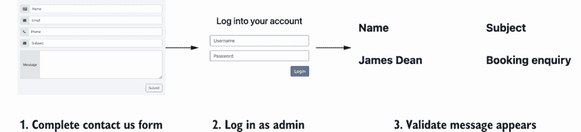

# 7 使用 AI 加速和改进 UI 自动化

本章涵盖

+   如何使用 GitHub Copilot 和 ChatGPT 快速创建 UI 自动化

+   如何使用 GitHub Copilot 和 ChatGPT 快速提高 UI 自动化

如果在软件测试行业中有一个领域在 AI 工具的使用方面获得了最多的关注，那就是 UI 自动化。随着大型语言模型（LLMs）开始吸引人们的注意，测试领域的人们迅速关注了如何通过 Copilot 和 ChatGPT 等工具轻松生成 UI 自动化检查。围绕使用 AI 工具进行 UI 自动化的可能性和想法正在迅速扩展。尽管对这些工具的热情很高，工具供应商和自动化人员都急于使用 AI，但我们必须注意 AI 在哪里以及如何有用。

在使用 AI 创建自动化方面取得成功，不仅在于知道*何时*使用 AI 工具，还在于知道*如何*使用它。因此，本章重点介绍如何分解创建和维护自动化检查的过程，并发现 AI 工具如何加快我们的流程，同时确保我们仍然提供有价值的自动化。

## 7.1 快速创建 UI 自动化

前往 ChatGPT 并要求它生成一个 Java Selenium 测试，用于自动化登录页面，它会欣然从命。这看起来可能是一条有效的途径，但让我们简要看看这个过程的一个例子，看看会发生什么。对于提示，我们可以使用

|


| 假设测试自动化者的角色，使用 Selenium 和 Java 创建一个自动化测试，用于自动化和验证应用程序的登录过程 |
| --- |

它将返回一个代码示例，例如

|


|

```py
import org.openqa.selenium.By;
import org.openqa.selenium.WebDriver;
import org.openqa.selenium.WebElement;
import org.openqa.selenium.chrome.ChromeDriver;

public class LoginTest {
    public static void main(String[] args) {
        // Set the path to the chromedriver executable
        System.setProperty("webdriver.chrome.driver", "path/to/
        ➥ chromedriver");

        // Create an instance of ChromeDriver
        WebDriver driver = new ChromeDriver();

        // Open the application login page
        driver.get("https://example.com/login");

        // Find the username and password input fields
        WebElement usernameField =
        ➥ driver.findElement(By.id("username"));
        WebElement passwordField =
        ➥ driver.findElement(By.id("password"));

        // Enter the username and password
        usernameField.sendKeys("your-username");
        passwordField.sendKeys("your-password");

        // Submit the login form
        driver.findElement(By.id("login-button")).click();

        // Wait for the page to load
        // You can use an explicit wait here to ensure the page is 
        ➥ fully loaded

        // Verify the login success by checking for a specific 
        ➥ element on the next page
        WebElement welcomeMessage = driver.findElement(By.xpath("//
        ➥ h1[contains(text(),'Welcome')]"));
        if (welcomeMessage.isDisplayed()) {
            System.out.println("Login successful!");
        } else {
            System.out.println("Login failed!");
        }

        // Close the browser
        driver.quit();
    }
}
```

|

代码看起来是正确的，并且很可能会编译。但如果我们要把这段代码带入我们的自动化框架，我们应该问自己，“我们需要修改多少才能让它与我们的测试产品一起工作？”可能性很大，我们需要

+   移除`Driver`实例化以使用我们自己的驱动器工厂。

+   通过更新`driver.get`将检查指向正确的应用程序。

+   将`findElements`方法移动到相关的页面对象中。

+   更新选择器，以便它们使用与我们的产品一致的选择器。

+   更新断言以符合我们的假设。

我们还没意识到，我们几乎已经用 ChatGPT 建议的所有代码替换了，这并不感觉像是我们时间的高效利用。这是因为尽管 ChatGPT 和 Copilot 等工具可以快速按需生成代码，但它们缺乏我们系统的上下文。也就是说，如果我们让这些工具在提供很少输入的情况下创建我们的自动化检查，结果将是需要大量重写的代码。相反，我们希望采取一种更共生的方法，有针对性地使用 AI 工具来帮助我们完成创建自动化 UI 检查的特定任务。

考虑图 7.1 中的可视化，它分解了包含在常见的基于 UI 层的自动化检查中的各种组件。

如我们所见，有许多动态部分——从处理自动化检查的依赖关系和报告的框架本身，到自动化检查执行的各种活动，以创建状态、与 UI 交互以及断言期望。这些部分都可以通过 AI 进行指导，因此，我们不是试图依赖 AI 一次性创建所有内容，而是在构建和维护自动化检查的过程中专注于具体任务，并使用 LLMs 来加速这个过程。

与记录和回放工具相比，AI

一个值得提出的问题是，AI 的使用与记录和回放工具及其记录我们的动作并将它们转换为代码的能力有何不同。如果我们使用 LLMs 来生成自动化检查，那么这种差异不会很大。事实上，记录和回放工具可能会更好，因为它们在与系统交互时，在记录过程中隐式地学习产品的上下文和规则。

然而，记录和回放的一个局限性在于，当它们遇到更复杂的框架时，这些框架将使用诸如页面对象和剧本模式等方法进行安排，以使其更易于维护。记录和回放工具往往会将生成的代码作为独立运行的脚本输出，与其他代码分离。当这个脚本需要集成到框架中时，我们可能需要大幅重写和重组我们的初始脚本，这又把我们带回了最初的问题——自动化 UI 检查的创建进度缓慢。

本章提出的是，我们在非常具体的情况下使用 LLMs，针对特定的动作。如果我们想快速创建页面对象，LLM 可以帮助我们完成这项任务——它的输出可以快速集成到一个更广泛的框架中，最小化重写。


图 7.1 自动化 UI 检查组件部分的视觉表示

为了演示这个过程，让我们看看我们如何可以在自动化工作流程中使用诸如 Copilot 和 ChatGPT 等工具，通过构建针对网站[`automationintesting.online`](https://automationintesting.online)的自动化检查来选择 AI 工具可以协助的具体动作，这是一个模拟的民宿预订网站，可以用来练习各种测试和自动化活动。

在这个例子中，我们检查消息是否显示在网站的管理员部分。为此，我们需要将以下步骤编码化：

1.  启动浏览器。

1.  前往[automationintesting.online](https://automationintesting.online)。

1.  在主页面上完成联系我们表单。

1.  前往网站的管理员部分并登录。

1.  加载消息部分并确认创建的消息出现。

这个过程在图 7.2 中进行了总结。



图 7.2 自动化 UI 检查的视觉表示

尽管这个例子本身并不引人注目，但我们将了解到，我们可以通过使用 AI 工具来加速我们的工作，每完成一步——让我们开始吧。为了参考，你可以查看 GitHub 上为这个例子生成的代码（[`mng.bz/4pXB`](https://mng.bz/4pXB)）。

设置 Copilot

本章假设你已经在你 IDE 中安装并配置了 Copilot 插件。如果你还没有完成设置过程，你可以在附录 B 中找到安装说明。

活动 7.1

按照本章的步骤进行，看看你是否能生成类似的自动检查。像往常一样，请记住，来自 ChatGPT 和 Copilot 的输出可能与以下示例中捕获的输出不同。

### 7.1.1 设置项目

我们将在本节中使用 Java 进行示例。这是一种演示使用 AI 工具价值的有用语言，因为 Java 以其依赖模板代码（LLMs 可以帮助我们构建的好地方）而闻名。在我们的第一步，我们需要创建一个新的 Maven 项目，一旦项目创建完成，就将以下依赖项添加到我们的`pom.xml`文件中：

```py
<dependencies>
    <dependency>
        <groupId>org.junit.jupiter</groupId>
        <artifactId>junit-jupiter-engine</artifactId>
        <version>5.9.2</version>
        <scope>test</scope>
    </dependency>
    <dependency>
        <groupId>org.seleniumhq.selenium</groupId>
        <artifactId>selenium-java</artifactId>
        <version>4.9.1</version>
        <scope>test</scope>
    </dependency>
    <dependency>
        <groupId>io.github.bonigarcia</groupId>
        <artifactId>webdrivermanager</artifactId>
        <version>5.5.3</version>
        <scope>test</scope>
    </dependency>
</dependencies>
```

现在我们已经拥有了开始开发我们的自动检查所需的一切。

在我们的依赖项就绪后，我们可以创建必要的包——`com.example`和我们的`Test`类，我们将它命名为`MessageTest`。从这里，我们可以开始使用 Copilot 构建我们的自动检查，但我们需要向 Copilot 提供一些信息以开始这个过程。所以首先我们在`MessageTest`类中添加一个`WebDriver`变量

```py
private static WebDriver driver;
```

紧接着是代码注释：

```py
// Use WebDriverManager to download the driver binaries
// and start the browser server for us.
```

代码和注释的组合足以作为提示来触发 Copilot 的以下响应：

```py
public static void setupClass() {
    WebDriverManager.chromedriver().setup();
}
```

这是一个好的开始，但它缺少了驱动程序实例化和`BeforeAll`钩子，我们可以在`WebDriverManager`调用下面的下一行添加：

```py
driver = new ChromeDriver();
```

这给我们以下`Before`钩子：

```py
@BeforeAll
public static void setupClass() {
    WebDriverManager.chromedriver().setup();

    driver = new ChromeDriver();
}
```

是否调整提示：做出高效的选择

关于使用提示生成所需输出的另一个观察是，可能会诱使人们多次调整提示以产生正确的输出，这可能会很耗时。在先前的例子中，代码注释可能对 Copilot 来说不够清晰，无法生成我们所需的完整代码片段。那么，可以选择改进提示或添加所需的代码部分。在这种情况下，添加所需的代码是有意义的。我知道我需要什么，花费时间调整提示将是浪费的。然而，如果我对想要的东西的了解较浅，我可能会选择进一步调整提示。效率是通过意识到在特定时刻做出正确选择而产生的。

我们已经设置了`BeforeAll`钩子，所以接下来我们想要创建一个拆卸钩子，我们可以通过添加以下注释来实现：

```py
@AfterAll
```

提示 Copilot 返回

```py
public static void teardown() {
    driver.quit();
}
```

我们的第二个提示词可能比第一个更准确，因为我们开始具体化 Copilot 可以提示的上下文。我们添加到我们的代码库越多，Copilot 就越有可能准确地添加我们想要的。最后，为了验证一切是否正常工作，让我们添加一个裸骨的`@Test`来确保一切都在运行：

```py
@Test
public void testMessageIsCreated() {
    driver.get("https://automationintesting.online");
}
```

到目前为止，一切顺利。我们在 Copilot 的支持下设置了我们的项目以及初始测试。我们还观察到，最初，Copilot 缺乏细节来帮助推荐正确的代码行。但随着我们的发展，我们将开始观察到其准确性的提高。这是一个很好的开始——现在让我们看看工具如 ChatGPT 如何帮助我们更快地完成工作。

### 7.1.2 在 ChatGPT 的支持下创建我们的初始检查

在框架就绪后，我们可以将注意力转向完成主页上的“联系我们”表单。为了帮助具体化我们将要处理的内容，请参阅图 7.3。


图 7.3 测试网站上的“联系我们”表单

图表显示了需要完成的多个表单字段和一个提交按钮，所有这些我们都需要在我们的自动化检查中进行编码。为此，我们需要创建一个页面对象来捕获每个元素，我们将使用它来填充和提交表单。这个过程是费时的（而且我个人觉得这个过程既耗时又无聊，这是第一章中探讨的情感触发类型）。那么，我们如何加快创建页面对象的过程呢？我们可以使用 Copilot 来帮助我们编写类，但识别每个元素的每个 CSS 选择器的过程可能会占用大量时间。相反，让我们看看我们如何使用 ChatGPT 中的提示来快速创建我们的页面对象。

首先，让我们看看一个可以触发 ChatGPT 生成我们的页面对象的提示词（你可以将提示词复制并粘贴到 ChatGPT 中：[`mng.bz/QVpm`](https://mng.bz/QVpm)）。我们使用分隔策略设置了指令：

|


| 你是一位 Java 开发专家。使用`PageFactory`库和`@FindBy`注解，将三个井号分隔的 HTML 转换为 Java Selenium 页面对象。 |
| --- |

我们在分隔部分提供 HTML：

|


|

```py
###
<Enter HTML here>
###
```

|

分析提示词，我们可以观察到它采取以下形式：

+   开头的清晰指令，告知 ChatGPT 我们想要实现的目标

+   一系列约束，明确指出我们对 ChatGPT 的期望，说明在创建我们的页面对象时我们希望明确使用哪些库和方法

要创建页面对象，我们将刚刚探索的提示词添加到我们的联系表单 HTML 的底部，然后将其粘贴到 ChatGPT 中。再次提醒，你可以使用 GitHub 上已经创建的提示词，链接为[`mng.bz/QVpm`](https://mng.bz/QVpm)：

|


|

```py
<form>
  <div class="input-group mb-3">
    <div class="input-group-prepend">
      <span class="input-group-text" id="basic-addon1">
        <span class="fa fa-id-card"></span>
      </span>
    </div>
    <input type="text" data-testid="ContactName"
    ➥class="form-control" placeholder="Name" aria-label="Name"
    ➥id="name" aria-describedby="basic-addon1">
  </div>
  <div class="input-group mb-3">
    <div class="input-group-prepend">
      <span class="input-group-text" id="basic-addon1">
        <span class="fa fa-envelope"></span>
      </span>
    </div>
    <input type="text" data-testid="ContactEmail"
    ➥class="form-control" placeholder="Email" aria-label="Email"
    ➥id="email" aria-describedby="basic-addon1">
  </div>
  <div class="input-group mb-3">
    <div class="input-group-prepend">
      <span class="input-group-text" id="basic-addon1">
        <span class="fa fa-phone"></span>
      </span>
    </div>
    <input type="text" data-testid="ContactPhone"
    ➥class="form-control" placeholder="Phone" aria-label="Phone"
    ➥id="phone" aria-describedby="basic-addon1">
  </div>
  <div class="input-group mb-3">
    <div class="input-group-prepend">
      <span class="input-group-text" id="basic-addon1">
        <span class="fa fa-envelope"></span>
      </span>
    </div>
    <input type="text" data-testid="ContactSubject"
    ➥class="form-control" placeholder="Subject" aria-label="Subject"
    ➥id="subject" aria-describedby="basic-addon1">
  </div>
  <div class="input-group">
    <div class="input-group-prepend">
      <span class="input-group-text">Message</span>
    </div>
    <textarea data-testid="ContactDescription" class="form-control"
    ➥aria-label="Description" id="description" rows="5"></textarea>
  </div>
  <br>
  <button type="button" class="btn btn-outline-primary float-right"
  ➥id="submitContact">Submit</button>
</form>
```

|

将此提示输入 ChatGPT，得到以下用于我们的页面对象的代码：

|


|

```py
import org.openqa.selenium.WebDriver;
import org.openqa.selenium.WebElement;
import org.openqa.selenium.support.FindBy;
import org.openqa.selenium.support.PageFactory;

public class ContactFormPage {

    // WebDriver instance
    private WebDriver driver;

    // Constructor to initialize the PageFactory
    public ContactFormPage(WebDriver driver) {
        this.driver = driver;
        PageFactory.initElements(driver, this);
    }

    // WebElements for the form fields
    @FindBy(id = "name")
    private WebElement nameInput;

    @FindBy(id = "email")
    private WebElement emailInput;

    @FindBy(id = "phone")
    private WebElement phoneInput;

    @FindBy(id = "subject")
    private WebElement subjectInput;

    @FindBy(id = "description")
    private WebElement descriptionTextarea;

    @FindBy(id = "submitContact")
    private WebElement submitButton;

    // Methods to interact with the form
    public void enterName(String name) {
        nameInput.sendKeys(name);
    }

    public void enterEmail(String email) {
        emailInput.sendKeys(email);
    }

    public void enterPhone(String phone) {
        phoneInput.sendKeys(phone);
    }

    public void enterSubject(String subject) {
        subjectInput.sendKeys(subject);
    }

    public void enterDescription(String description) {
        descriptionTextarea.sendKeys(description);
    }

    public void clickSubmitButton() {
        submitButton.click();
    }
}
```

|

ChatGPT 不仅成功创建了一个包含完成和提交联系表单所需所有必要方法的类，而且这是在单个提示后迅速完成的。在这个例子中，类相当小，但常规页面对象可能相当大。编写和维护页面对象所需的时间会随着我们所需数量的增加而增加。因此，通过使用 ChatGPT 快速生成我们的代码，我们可以更快地开发我们的自动化检查。

测试性和 AI 工具

即使有 AI 工具，产品的可测试性也会影响工具的有效性。创建“联系我们”表单的 HTML 方式可以说具有很高的*可测试性*。HTML 是语义正确的，并且在`input`和`textarea`元素中包含清晰的、稳定的 HTML 属性，ChatGPT 可以预测并将其放入创建的类中。然而，如果我们正在处理的 HTML 需要我们识别更复杂的选择器，可能是因为自动生成的 ID 或 HTML 元素的缺乏，那么我们的提示的性能可能不会那么有效，需要我们更新和调整我们的页面对象以更好地满足我们的需求。

在创建好页面对象后，我们可以回到`MessageTest`并按 Tab 键浏览 Copilot 的建议来创建我们需要的“联系我们”表单填写代码：

```py
ContactFormPage contactFormPage = new ContactFormPage(driver);
contactFormPage.enterName("John Smith");
contactFormPage.enterEmail("test@email.com");
contactFormPage.enterPhone("0123456789");
contactFormPage.enterSubject("Testing");
contactFormPage.enterDescription("This is a test message");
contactFormPage.clickSubmitButton();
```

Copilot 读取了我们的对象并帮助我们绘制了填写表单的流程图。尽管它可以读取`ContactFormPage`中存在的函数并预测下一步，但它缺乏对每个表单字段验证规则的上下文，这影响了它创建的测试数据。与上一章不同，其中测试数据是基于预期准确设置的，返回的数据是通用的，并可能导致问题。例如，为电话号码字段设置的验证规则要求输入 11 位或更多的数字，因此我们的预测测试数据会导致我们的自动化测试失败。因此，让我们更新`enterPhone`参数，使用将通过电话号码验证的数据：

```py
contactFormPage.enterPhone("07123456789");
```

我们创建好消息后，现在想要登录，可以通过遵循与我们刚刚遵循的类似模式来实现。首先，我们创建必要的代码以跳转到管理页面：

```py
driver.get("https://automationintesting.online/#/admin/");
```

然后，回到我们与 ChatGPT 的当前聊天中，我们可以重用我们之前的提示来为管理登录页面创建一个页面对象，这次只需简单地引用原始提示并提供新的 HTML 来生成我们的类：

|


| 再次遵循之前的提示，但这次使用以下 HTML：

```py
<div class="col-sm-4">
    <div class="form-group">
        <input data-testid="username" type="text"
        ➥style="border: 1px solid grey;" class="form-control"
        ➥id="username"
        ➥placeholder="Username">
    </div>
    <div class="form-group">
        <input data-testid="password" type="password"
        ➥style="border: 1px solid grey;" class="form-control"
        ➥id="password"
        ➥placeholder="Password">
    </div>
    <button type="submit" data-testid="submit" id="doLogin"
    ➥class="btn btn-primary float-right">Login</button>
</div>
```

|

这为我们项目添加了以下`LoginPage`代码：

|


|

```py
import org.openqa.selenium.WebDriver;
import org.openqa.selenium.WebElement;
import org.openqa.selenium.support.FindBy;
import org.openqa.selenium.support.PageFactory;

public class LoginPage {

    // WebDriver instance
    private WebDriver driver;

    // Constructor to initialize the PageFactory
    public LoginPage(WebDriver driver) {
        this.driver = driver;
        PageFactory.initElements(driver, this);
    }

    // WebElements for the form fields
    @FindBy(id = "username")
    private WebElement usernameInput;

    @FindBy(id = "password")
    private WebElement passwordInput;

    @FindBy(id = "doLogin")
    private WebElement loginButton;

    // Methods to interact with the form
    public void enterUsername(String username) {
        usernameInput.sendKeys(username);
    }

    public void enterPassword(String password) {
        passwordInput.sendKeys(password);
    }

    public void clickLoginButton() {
        loginButton.click();
    }
}
```

|

接下来，我们在代码中创建 `LoginPage` 类，修复我们的缺失导入，然后回到 `MessageTest` 并使用 Copilot 通过按提示创建以下登录步骤：

```py
LoginPage loginPage = new LoginPage(driver);
loginPage.enterUsername("admin");
loginPage.enterPassword("password");
loginPage.clickLoginButton();
```

最后，我们可以再执行一次使用 ChatGPT 和 Copilot 完成自动化测试的循环，首先添加必要的代码以导航到消息页面：

```py
driver.get("https://automationintesting.online/#/admin/messages");
```

然后我们创建我们的最终页面对象，这次调整我们的提示以让 ChatGPT 创建一个返回消息计数的函数：

|


| 再次遵循提示，这次我需要一个返回消息计数的函数：

```py
<div class="messages">
    <div class="row">
        <div class="col-sm-2 rowHeader">
            <p>Name</p>
        </div>
        <div class="col-sm-9 rowHeader">
            <p>Subject</p>
        </div>
        <div class="col-sm-1"></div>
    </div>
    <div class="row detail read-false" id="message0">
        <div class="col-sm-2" data-testid="message0">
            <p>James Dean</p>
        </div>
        <div class="col-sm-9" data-testid="messageDescription0">
            <p>Booking enquiry</p>
        </div>
        <div class="col-sm-1">
            <span data-testid="DeleteMessage0" class="fa fa-remove roomDelete"></span>
        </div>
    </div>
</div>
```

|

它返回以下 `MessagePage` 类：

|


|

```py
import org.openqa.selenium.WebDriver;
import org.openqa.selenium.WebElement;
import org.openqa.selenium.support.FindBy;
import org.openqa.selenium.support.PageFactory;

import java.util.List;

public class MessagePage {

    @FindBy(className = "detail")
    private List<WebElement> messageList;

    public MessagePage(WebDriver driver) {
        PageFactory.initElements(driver, this);
    }

    public int getMessageCount() {
        return messageList.size();
    }
}
```

|

与之前一样，我们在代码库中创建一个 `MessagePage` 类，修复我们的导入，然后回到 `MessageTest` 让 Copilot 预测以下代码以完成我们的自动化检查：

```py
MessagePage messagePage = new MessagePage(driver);
assert messagePage.getMessageCount() == 1;
```

### 7.1.3 从生成的代码中填补空白

这样就完成了我们的自动化检查，但如果运行这段代码，很可能会导致自动化检查失败。失败的原因是我们必须等待消息计数加载，而我们的自动化检查中缺少这一步骤。尽管这种失败与我们之前遇到的 Copilot 添加的错误测试数据不同，但我们当前问题的原因相似。ChatGPT 根据提示内容和提供的 HTML 预测我们需要的代码。它缺乏理解我们系统哪些部分可能需要等待以防止自动化检查失败的能力。然而，我们可以通过回到 ChatGPT 并提交以下提示来解决这个问题：

|


| 你能改进 `MessagePage` 类，使其等待消息列表加载吗 |
| --- |

ChatGPT 响应了一个更新版本的 `MessagePage`：

|


|

```py
private WebDriver driver;
private WebDriverWait wait;

@FindBy(className = "detail")
private List<WebElement> messageList;

public MessagePage(WebDriver driver) {
    this.driver = driver;
    // Adjust the timeout as needed
    this.wait = new WebDriverWait(driver, 10); 
    PageFactory.initElements(driver, this);
}

public int getMessageCount() {
    wait.until(ExpectedConditions.visibilityOfElementLocated(
      By.className("detail")));

    return messageList.size();
}
```

|

这是在提高我们的自动化检查方面的一个进步，但也再次展示了 ChatGPT 是如何基于较旧的库和 API 版本进行训练的。如果我们把这段代码复制到我们的检查中，我们会看到 `WebDriverWait` 出现错误，因为它不再接受整数——这是在 ChatGPT 接受 Selenium 材料训练之后发生的改变。因此，我们需要将 `WebDriverWait` 更新为接受 `Duration` 参数：

```py
this.wait = new WebDriverWait(driver, Duration.ofSeconds(10));
```

最后，为了提高我们从自动化测试中获得的反馈，我们将 Copilot 提出的断言更新为一个更具有信息量的版本：

```py
assertEquals(1, messagePage.getMessageCount());
```

在所有这些准备就绪的情况下，假设平台上没有额外的消息，我们可以运行检查并看到它通过。关键的行为是观察我们如何使用 Copilot 和 ChatGPT 快速构建我们的自动化检查。而不是向 ChatGPT 发送如下提示

|


| 创建一个用于联系我们的表单的自动化测试，并检查消息是否已创建 |
| --- |

这种方法会产生相当通用的输出，需要大量修改。我们通过 Copilot 和 ChatGPT 的每个步骤来处理我们的自动化检查，快速创建检查的部分，在工具之间切换以帮助我们解决特定问题。如果我们回到我们的影响范围模型，这种方法在图 7.4 中得到了总结。

模型显示，如果我们能够识别自动化检查中发生的特定操作——比如确定检查需要什么状态或需要做出什么断言——那么我们可以有效地使用 LLM（大型语言模型）进行这些操作。正如示例中所示，ChatGPT 和 Copilot（以及其他 LLM 工具）在预测和生成自动化代码方面非常快速。然而，它们无法访问我们正在自动化的产品的上下文。诸如错误的测试数据和缺少等待等问题需要我们引导自动化创建，而 AI 工具则在我们最需要的地方提供支持。


图 7.4 展示个人和工具在自动化检查开发中带来的影响范围模型

活动 7.2

使用 Copilot 和 ChatGPT 创建您自己的自动化检查，请访问[`automationintesting.online`](https://automationintesting.online)。这次，创建一个执行以下操作的自动化检查：

+   登录到网站的管理员部分

+   创建一个新的房间

+   断言房间出现在主页上

使用示例中共享的提示来生成您自己的页面对象，或者构建可能更有效的提示。

## 7.2 改进现有的 UI 自动化

我们最初的示例演示了如何与 LLM 工具合作快速创建新的自动化检查，但对于现有的检查又如何呢？与自动化工作意味着处理由于测试产品中的快速变化或不可靠性导致的失败的自动化检查。LLM 工具如何帮助我们快速改进自动化，同时确保它们仍然提供价值？让我们回到我们刚刚创建的自动化检查，看看 LLM 的使用模式如何帮助我们创建更健壮的自动化检查。

### 7.2.1 更新状态管理以使用适当的层

如果我们评估我们的自动化检查关注的内容，我们可以看到目标是检查消息是否可以在管理员面板中看到。这意味着对于我们的状态管理来说，我们不需要通过 UI 创建消息。这既慢又可能脆弱。因此，让我们看看我们如何通过 API 调用创建消息，这样我们可以改进我们的自动化检查并学习如何使用 LLM 构建 API 调用。

我们的目标是捕获通过“联系我们”页面创建消息时发送的 HTTP 请求，并将其编码到我们的自动化测试中。因此，我们的第一步是按照以下步骤捕获 HTTP 请求作为一个`curl`命令：

1.  在我们的浏览器中打开开发者工具。

1.  选择网络标签。

1.  通过 UI 中的“联系我们”表单手动发送消息。

1.  在网络标签页上找到 HTTP 请求，然后将其复制到 `curl` 命令中（在开发者工具中右键单击请求）。

我们确定了命令位置后，就可以再次构建一个提示，将我们的 `curl` 请求转换为所需的 Java 代码，使用以下提示。我们首先为提示设置指令并使用分隔符策略：

|


| 将以下由三个井号分隔的 `curl` 请求转换为 Java，使用以下规则：   1.  请求封装在方法中   2.  方法将使用 Spring 框架发送 HTTP 请求   3.  HTTP 响应不需要解析   4.  方法将接受一个表示 HTTP 负载的 POJO 作为参数 |
| --- |

我们在分隔的段落中提供了 `curl` 请求：

|


|

```py
###
curl 'https://automationintesting.online/message/' -X POST -H
➥'Accept: application/json' -H 'Content-Type: application/json'
➥--data-raw '{"name":"Mark","email":"test@test.com",
➥ "phone":"071234567890","subject":"This is a test message",
➥ "description":"This allows me to create a message rapidly"}'
###
```

|

与我们用来创建页面对象的提示类似，这个提示在添加具体指令以帮助 ChatGPT 预测我们所需的正确代码之前，在第一句话中说明了我们想要 ChatGPT 做的事情。例如，指出该方法希望体负载参数以 POJO（Plain Old Java Object）的格式传入，确保 ChatGPT 生成的解决方案使用 Java 类来构建我们的负载，而不是存储在大型字符串中的 JSON 对象，这将难以解析和维护。将带有 `curl` 请求的提示添加到底部并将提示传递进去，将得到以下代码：

|


|

```py
import org.springframework.http.HttpHeaders;
import org.springframework.http.HttpMethod;
import org.springframework.http.MediaType;
import org.springframework.http.RequestEntity;
import org.springframework.web.client.RestTemplate;

public class HttpRequestSender {
    public void sendRequest(MessagePayload payload) {
        // Create a RestTemplate instance
        RestTemplate restTemplate = new RestTemplate();

        // Set the request URL
        String url = "https://automationintesting.online/message/";

        // Set the request headers
        HttpHeaders headers = new HttpHeaders();
        headers.set(HttpHeaders.ACCEPT,
        ➥MediaType.APPLICATION_JSON_VALUE);
        headers.set(HttpHeaders.CONTENT_TYPE,
        ➥MediaType.APPLICATION_JSON_VALUE);

        // Create the request entity with the payload and headers
        RequestEntity<MessagePayload> requestEntity = new 
        ➥RequestEntity<>(
                payload,
                headers,
                HttpMethod.POST,
                URI.create(url)
        );

        // Send the HTTP request
        restTemplate.exchange(requestEntity, Void.class);
    }
}
```

|

这个预测的代码需要向我们的项目中添加新的依赖项，我们可以使用以下提示从 ChatGPT 请求：

|


| 该方法需要哪些依赖项？ |
| --- |

这导致 ChatGPT 返回

|


|

```py
<dependency>
    <groupId>org.springframework.boot</groupId>
    <artifactId>spring-boot-starter-web</artifactId>
    <version>2.5.0</version>
</dependency>
```

|

然后，我们可以将依赖项添加到我们的 `pom.xml` 文件中，确保我们使用的是最新版本，接着将 HTTP 请求代码复制到我们的框架中一个新的名为 `requests` 的包中。我选择将类名从 `HttpRequestSender` 改为 `MessageRequest`。

这为我们提供了发送请求所需的代码，但由于我们通知 ChatGPT `sendRequest` 将需要一个表示请求体的 POJO 参数，我们接下来需要 ChatGPT 创建构建我们的 POJO 的代码。为此，我们回到与 ChatGPT 的现有对话中，并添加以下提示：

|


| 为 `MessagePayload` 创建一个包含构造函数和 getter 以及 setter 方法的 POJO |
| --- |

提示清楚地表明我们需要构造函数和 getter/setter 方法，因为这些对于创建和发送我们的 HTTP 请求是必要的。将提示发送到 ChatGPT 得到以下代码：

|


|

```py
public class MessagePayload {
    private String name;
    private String email;
    private String phone;
    private String subject;
    private String description;

    public MessagePayload() {
    }

    public MessagePayload(String name, String email, String phone,
 String subject, String description) {
        this.name = name;
        this.email = email;
        this.phone = phone;
        this.subject = subject;
        this.description = description;
    }

    public String getName() {
        return name;
    }

    public void setName(String name) {
        this.name = name;
    }

    public String getEmail() {
        return email;
    }

    public void setEmail(String email) {
        this.email = email;
    }

    public String getPhone() {
        return phone;
    }

    public void setPhone(String phone) {
        this.phone = phone;
    }

    public String getSubject() {
        return subject;
    }

    public void setSubject(String subject) {
        this.subject = subject;
    }

    public String getDescription() {
        return description;
    }

    public void setDescription(String description) {
        this.description = description;
    }
}
```

|

因为我们提供了初始提示中的`curl`请求，ChatGPT 可以预测我们的 POJO 创建通过 HTTP 发送消息的代码应该是什么样子，然后可以复制到我们项目`requests`包中的`MessagePayload`类。

在我们放置好用于创建消息负载并发送请求到`POST /message/`端点的类之后，我们可以回到`MessageTest`并使用 Copilot 来改进我们的检查。首先，我们移除以下检查部分：

```py
driver.get("https://automationintesting.online");

ContactFormPage contactFormPage = new ContactFormPage(driver);
contactFormPage.enterName("John Smith");
contactFormPage.enterEmail("test@email.com");
contactFormPage.enterPhone("07123456789");
contactFormPage.enterSubject("Testing");
contactFormPage.enterDescription("This is a test message");
contactFormPage.clickSubmitButton();
```

并开始输入`MessagePayload`以触发 Copilot 添加以下代码作为替换：

```py
MessagePayload messagePayload = new MessagePayload();
messagePayload.setName("Test User");
messagePayload.setEmail("test@email.com");
messagePayload.setPhone("0123456789");
messagePayload.setSubject("Test Subject");
messagePayload.setDescription("Test Description");

MessageRequest messageRequest = new MessageRequest();
messageRequest.sendRequest(messagePayload);
```

类似于我们使用 Copilot 在 UI 中生成创建消息的代码时，第一次运行自动检查会导致失败。检查将运行并收到 400 状态码，因为预测的测试数据再次不符合验证规则。因此，为了确保我们的消息符合必要的验证规则，我们需要更新以下方法以正确的测试数据：

```py
messagePayload.setPhone("074123456789");
messagePayload.setDescription("Test Description that is larger");
```

一旦这些测试数据参数被更新，我们现在应该看到自动检查再次通过。

这个例子表明我们可以使用 LLM 工具帮助我们更新自动检查的特定方面，使其更加健壮，但这要求我们具备良好的分析眼光，了解哪些检查区域需要改进。这是因为我们既了解我们的自动检查，也了解我们正在测试的系统，这是我们迄今为止使用的工具所缺乏的。例如，如果我们给 ChatGPT 以下提示

|


| 建议如何改进这个自动测试，使其不那么不可靠 |
| --- |

然后将我们的自动检查代码添加到提示中，这些将是返回的建议（总结）：

|


| |   •   添加显式等待   •   使用稳定的定位器   •   处理异步操作   •   隔离测试   •   重试失败的操作   •   检查错误条件   •   审查和更新测试环境 |
| --- | --- |

这些都是合法的考虑因素，但它们是通用问题，并不一定给我们提供足够的信息来解决具体问题。因此，我们构建改进过程，寻求工具帮助我们快速生成必要的代码。

活动七.3

使用 ChatGPT 和 Copilot，尝试将登录过程转换为 API 调用。为此练习，你需要编写代码

+   将凭证发送到`POST /auth/login`

+   从 HTTP 响应中提取`token`值

+   在前往消息页面之前，将`token`值存储为浏览器中的 cookie

### 7.2.2 使用 AI 工具进入状态

本章展示了无论我们是在构建 UI 自动化、API 自动化还是其他完全不同的东西，使用 AI 的成功模式始终相同。我们对自动化检查的设计和结构的深入了解让我们知道何时何地使用 AI 工具来帮助我们完成特定任务以创建和维护有价值的自动化。围绕 AI 自动化的营销可能会让我们相信，当涉及 AI 时，我们在创建自动化检查中的作用是有限的。但如果我们想要帮助我们创建高质量产品的自动化，那么我们最好的行动方案是与 AI 工具建立关系，将我们的技能集置于工作的核心。

## 摘要

+   仅使用 ChatGPT 等工具尝试生成整个自动化 UI 测试可能需要大量的重做。相反，我们希望在 UI 自动化过程的特定点上选择性地使用 AI 工具。

+   使用 Copilot 等工具开始一个新项目可能会产生不同的结果。

+   我们在项目中添加的细节越多，Copilot 就会越准确。

+   通过提供 HTML 和转换指令，我们可以使用正确的提示类型在 ChatGPT 中快速生成页面对象。

+   我们可以通过结合 ChatGPT 和 Copilot（或类似工具）快速生成自动化检查。

+   AI 工具的输出并非 100%准确，因为它缺乏上下文——例如，使用测试数据或使用来自库的最新方法。

+   在创建自动化检查时使用 AI 工具的成功来自于在创建过程中使用 AI 工具完成特定任务。

+   我们领导创建过程，确定何时 AI 工具可以帮助我们加快速度。

+   如果我们能够识别自动化检查特定元素的可改进之处，我们可以使用 AI 工具更快地完成这些改进。

+   如果我们要求 LLMs 评估我们的检查并提出改进意见，我们会得到一些通用的答案作为回报。

+   我们可以使用在自动化检查中特定任务上使用 AI 工具的相同过程来维护它们。
