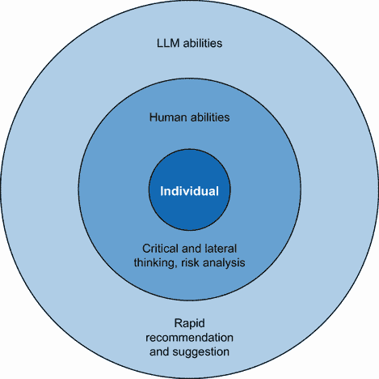
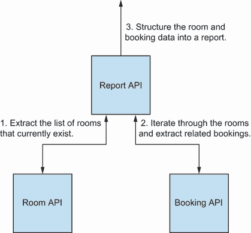

# 第八章：使用人工智能辅助探索性测试

本章涵盖

+   使用 LLMs 增强探索性测试章程的创建

+   识别在探索性测试会话中使用 LLMs 的机会

+   使用 LLMs 在探索性测试会话期间支持各种活动

+   使用大型语言模型（LLMs）总结探索性测试会话报告

到目前为止，我们已经探讨了大型语言模型（LLMs）如何帮助我们处理一系列算法性的测试活动和工件。例如代码和数据生成具有独特的语法和格式规则，并且具有一定的可重复性，与 LLMs 配合良好。但是，对于更基于启发式的测试活动，如探索性测试呢？当我们亲自执行测试时，LLMs 如何支持我们？重要的是要重申，LLMs 不能取代测试或测试人员，但通过仔细观察我们在探索性测试期间所做的一切以及了解提示工程，我们可以选择性地增强我们的探索，而不会损害探索性测试的核心价值。为此，我们将检查以下三个方面的探索性测试以及 LLMs 如何帮助：使用章程组织探索性测试、执行探索性测试以及报告我们所发现的内容。

基于算法和启发式活动

当我们提到一个活动是启发式的基础上，我们指定该活动没有明确的步骤来执行或难以明确定义，而算法活动在本质上更程序化，可以用明确术语定义。在测试的背景下，测试用例和脚本可以被视为算法性的，而探索性测试则更启发式，因为它依赖于人类观察和分析情况以确定下一步行动的能力。

## 8.1 使用 LLMs 组织探索性测试

让我们首先关注 LLMs 如何帮助我们确定探索性测试的章程。通常，在执行探索性测试会话时，它们由以下测试章程指导：

|


| 探索使用不同提供商预订航班，以确定是否所有提供商都显示在结果中 |
| --- |

在本章程示例中，我们遵循 Elisabeth Hendrickson 在其书籍《探索》（来自 Pragmatic Bookshelf）中提出的章程模板：

|


|

```py
Explore <target>
With <resource>
To discover <information>
```

|

我们可以从这些章程中构建我们想要专注于探索的特性和产品，以及要忽略的内容。想法是拥有许多不同的章程，从不同的角度或更具体地说，不同的风险来探索特性。在生成章程时，我们理想情况下希望从风险中推导出它们，这样当我们根据章程进行探索性测试时，我们就知道以下内容：

+   我们应该将我们的章程放在什么优先级上（风险越高，优先级越高）

+   探索了哪些风险以及哪些尚未探索

+   我们从每次探索性测试会话中获得的价值

为了将其转化为视觉模型，图 8.1 展示了风险、任务书和探索性测试会话之间的关系。

该模型显示我们首先识别风险，然后将其编码为任务书，我们可以在这些任务书上运行多个探索性测试会话，以了解我们可以学到什么。


图 8.1 显示风险、任务书和探索性测试之间关系的视觉模型

识别风险和任务书主要是一种基于启发式的方法，因为没有明确的模式或程序可以遵循来识别风险。它基于测试人员和他们的团队的关键和横向思维技能。然而，我们将风险格式化为任务书的结构化性质意味着有时 LLMs 可以帮助增强我们的现有技能并提高我们的覆盖率。

### 8.1.1 使用 LLMs 增强已识别的风险

由于识别风险是一种基于启发式的方法，因此它容易受到偏见的影响。这意味着有时我们可能会错过需要我们注意的潜在风险（例如，功能固定性认知偏差，其中我们过于专注于观察一个事件，以至于完全错过了另一个）。那么，我们如何防止这些差距出现呢？测试人员努力提高他们的技能，以接受和处理这些偏见，并利用测试启发式方法来帮助我们改变在识别风险时的视角。但我们也可以使用 LLMs 作为额外的工具，帮助我们考虑不同的途径，并可能突出我们没有考虑到的潜在风险。

为了帮助展示它们如何帮助，让我们探索一个由团队创建的样本用户故事：

|  |   •   为了作为管理员管理我的预订，我希望能够查看所有预订的报告   •   接受标准：   −   假设我已登录为管理员，并且我有多个预订，当我加载报告页面时，我可以看到我的预订以月历视图呈现，并且选中的月份是当前月份   −   假设我在报告页面上点击导航控件，那么我能够移动到一年中的不同月份   −   假设我在报告页面上点击并拖动多个日期，那么我会看到一个包含以下字段的新预订表单：姓名 | 姓氏 | 房间 | 已支付押金 |   −   假设我在完成预订表单的其余部分时加载了管理员预订弹出窗口，那么报告将被重新加载，并且新的预订将出现 |
| --- | --- | --- | --- | --- | --- |

使用示例，用户故事详细说明了从用户角度我们期望功能如何工作。这种类型的用户故事我们通常会在规划会议（可能更多或更少细节）中遇到，它将被用作开始讨论如何构建的起点，同样重要的是，讨论可能影响我们功能质量的风险。通常，这是测试员或注重质量的人会花时间提问并记录潜在风险以供进一步调查的地方。例如，一个基本的风险列表可能包含以下项目：

+   预订在报告视图中未显示。

+   报告视图难以解析。

+   导航控件工作不正确。

+   管理员预订无法提交。

这是一个很好的开始，但感觉还不够充分。这个列表模拟了我们可能发现自己难以进一步识别风险的情况，因此在此阶段，我们可以选择使用以下提示来帮助我们扩展分析。我们在指令中使用分隔符策略来区分发送的不同数据集：

|


| 你是一位专业的软件测试员。你将获得一个由三个井号分隔的用户故事和一个由三个反引号分隔的已识别风险列表。审查用户故事并扩展风险列表。 |
| --- |

接下来，我们指导模型在输出之前先找出解决方案：

|


| 检查所有生成的风险是否不是原始风险的重复，并且它们与以下质量特性相关：可用性和准确性。 |
| --- |

最后，我们在分隔的段落中提供数据集：

|


| ###<用户故事添加于此>###```py   −   Bookings are not shown in the report view   −   Report view is hard to parse   −   Navigation controls don’t work correctly   −   Admin bookings can’t be submitted``` |
| --- |

在这个提示中，我们提供了三组不同的数据集，以帮助指导 LLM：

+   *质量特性*—质量特性帮助我们定义对我们最终用户来说质量意味着什么。例如，交易平台的质量特性可能与个人助理应用的特征大不相同。将这些添加到我们的提示中可以帮助我们明确我们感兴趣的风险领域，并防止 LLM 产生无关或不感兴趣的风险。

+   *用户故事*—我们提供用户故事以给出提示上下文。再次强调，我们提供的关于一个特性预期要做什么的描述越多，我们就能越最大化 LLM 输出的风险的相关性。

+   *当前风险*—最后，提供现有风险可以防止 LLM 简单地输出我们已有的信息。通过要求 LLM 在输出风险之前先找出解决方案，我们确保输出的风险是新的，值得考虑的。这并不意味着它的输出更有用，而是它有助于界定我们一直在思考的内容。

本提示的目标是让一个大型语言模型提供可以添加到我们现有列表中的额外风险。例如，将提示发送到 ChatGPT 返回以下输出：

|


| 可用性风险：用户困惑：用户可能难以理解如何访问报告页面，这会导致挫败感和不良的用户体验。复杂的日历视图：如果月度日历视图没有设计得直观，可能会让管理员感到压倒性或困惑，影响可用性。导航控件：如果用于在月份之间移动的导航控件不够用户友好或响应，管理员可能会在导航时遇到困难，影响可用性。预订表单可用性：通过点击和拖动日期生成的新预订表单应该是用户友好和直观的。如果不是，管理员在填写时可能会出错。缺乏反馈：如果提交新预订后没有反馈或确认消息，管理员可能会不确定预订是否成功，影响可用性。错误处理：错误处理不当，例如未处理边缘情况或预订表单中的无效输入，可能会导致管理员困惑和挫败。准确性风险：遗漏的预订：在报告视图中未显示的预订可能会导致报告不完整或不准确，影响数据准确性。数据完整性：如果系统未能正确验证和保存管理员输入的预订数据，可能会导致报告中出现不准确的数据。错误的月份选择：如果报告中显示的默认月份不是指定的当前月份，这将是一个准确性问题。错误的导航：如果导航控件不符合预期，管理员可能无法准确导航到所需的月份。报告刷新中遗漏的预订：如果在完成预订表单后新预订未出现在报告中，这将影响显示数据的准确性。预订提交失败：如果管理员无法正确提交预订，这会导致系统中出现不完整或缺失的数据，影响数据准确性。 |
| --- |

首先要注意的是，ChatGPT 已经有效地根据质量特性对提出的风险进行了分类。第二个观察点是每个风险都附带一个简短的句子来进一步解释它。这可以帮助我们理解它输出的风险或激发进一步风险的想法。 |

观察到提出的风险列表，其中一些风险被认为是有用且与我们用户故事相关的，例如：

+   用户困惑

+   错误处理

+   报告刷新中遗漏的预订

+   数据完整性

进一步的分析显示，一些显示的风险几乎彼此重复：例如，`可用性`类别中的`导航控件`和`导航错误`在`准确性`类别中（注意，这些不是我们原始风险的重复）。尽管措辞不同，但重点似乎相同：导航控件工作不正常。新风险和重复的组合表明，LLM 可以作为一个有用的工具来扩展我们的风险评估，但它们不能替代我们识别风险的能力。因此，在阅读 ChatGPT 的风险列表后，我们可能会选择扩大我们的风险列表，包括

+   预订在报告视图中未显示。

+   报告视图难以解析。

+   导航控件工作不正确。

+   行政预订无法提交。

+   对如何使用报告控制和行政预订存在困惑。

+   错误处理不正确。

在我们的最终列表中，我们选择采用并重构了一些从 ChatGPT 收到的风险，并忽略了其他风险。如果我们不满意，我们可以要求 ChatGPT 返回更多风险以供审查。然而，存在一个权衡，如果我们请求更多风险，我们面临 ChatGPT 响应中重复增加的风险。一旦我们对我们的列表感到满意，我们就可以开始将这些转换为章程，并返回到 LLM 以获取进一步的想法。

活动 8.1

从你正在工作的项目的待办事项中挑选一个用户故事或一系列需求。确定一些初始风险，然后编写一个提示，以建议考虑的其他风险。如果你不确定在提示中使用哪些质量特性，可以从以下来自《测试之眼》的综合性特性列表中选择一个或两个，该列表可在[`mng.bz/XV9Y`](https://mng.bz/XV9Y)找到。

### 8.1.2 使用 LLM 增强章程列表

一旦我们确定了风险，现在我们可以将它们转换为测试章程来指导我们的探索性测试。例如，以下风险：

|


| 预订在报告视图中未显示 |
| --- |

可以翻译为：

|


| 探索预订在报告视图中的渲染方式，使用一组预订，以发现是否所有预订都正确显示 |
| --- |

这个章程给我们提供了一些关于我们想要关注的内容、我们将使用的工具以及我们希望发现的内容的更多细节。如前所述，章程的形成遵循一个清晰的结构，就像风险一样，我们可以将其输入 LLM 以扩展我们未来测试可能考虑的章程列表。

因此，我们再次创建一个与之前风险导向提示类似的提示。首先，我们提供初始指令和分隔策略，以明确章程将在何处找到：

|


| 你是一位专业的软件测试员。审查由三个井号分隔的探索性测试章程，并提出额外的章程建议。 |
| --- |

然后我们指示模型在输出解决方案之前先找出解决方案：

|


| 在输出额外内容之前，检查所有生成的额外内容是否不是原始内容的重复，并且它们与以下质量特征相关：可用性和准确性。 |
| --- |

以下提示提供了分隔的多个数据集：

|


| ### 探索报告视图中预订的渲染方式，通过一组预订来发现是否所有预订都正确显示；探索报告视图中预订的渲染方式，通过一个非常大的预订集合来发现大量预订是否易于阅读；探索报告视图的导航，通过一组预订来发现导航控件是否按预期工作；探索提交预订，通过管理员预订表单来发现管理员是否可以提交预订；探索报告视图的核心功能，通过不同的角色来发现报告功能是否易于理解；探索管理员表单中的不同错误输出，使用损坏的数据和代理工具来发现错误是否被正确处理。### |
| --- |

提示的结构与我们提供质量特征和当前已识别的额外内容列表作为提示内容的结构相似。每个额外内容都遵循相同的模板，这意味着当我将提示发送到 ChatGPT 时，我会得到以下建议的额外内容：

|


| 探索报告视图的响应性，通过不同的屏幕尺寸和设备来发现报告视图是否适应不同的屏幕尺寸；探索报告视图中的搜索功能，通过多种搜索条件来发现用户是否能够准确找到特定的预订；探索报告视图中日期过滤的准确性，通过不同的日期范围和时区来确保在指定日期范围内的预订正确显示；探索管理员预订表单中的用户权限，通过不同的用户角色（管理员、普通用户）来确保只有管理员可以访问和提交管理员表单中的预订；探索预订数据存储的准确性，通过提交具有各种数据格式和输入的预订来验证系统是否准确存储所有数据。 |
| --- |

就像其他 LLM 输出一样，返回的内容质量存在差异。一些内容因其适合作为额外内容的候选而突出，例如：

+   探索报告视图的响应性

+   通过不同的屏幕尺寸和设备

+   为了发现报告视图是否适应不同的屏幕尺寸

其他一些内容，例如以下内容，超出了将预订添加到报告范围，可以丢弃：

+   探索报告视图中的搜索功能

+   通过多种搜索条件

+   为了发现用户是否能够准确找到特定的预订

再次，这表明 LLMs 可以帮助我们扩展我们的选项并识别新的探索途径。但它们绝不是完美的。虽然调整提示以使其更可靠当然可以帮助，但我们始终应该有选择性地从 LLM 中获取什么，忽略什么，这再次可以用图 8.2 所示的影响区域模型来总结。

我们运用创造性思维和使用横向和批判性思维技能来识别和组织我们的探索性测试的能力是至关重要的。在这个例子中，LLMs 为我们提供了一个在我们没有想法时改变事情的方法。

活动八.2

从上一个活动中提取风险，并使用“探索、使用、利用”模板将其中一些转换为章程。将这些添加到我们刚刚探索的提示中，以查看返回的建议提示。



图 8.2 影响区域模型，展示 LLMs 如何扩展我们的分析

## 8.2 在探索性测试中使用 LLMs

我们已经看到如何使用 LLMs 来组织探索性测试。现在让我们看看如何在执行探索性测试时使用 LLMs。

探索性测试中使用 LLMs 之所以有趣，是因为在探索性测试过程中可能会发生多种活动。在测试过程中，我们需要依赖工具以特定方式操作系统，这涉及到技术元素，同时还有基于启发式的人类驱动元素，其中我们使用心理启发式和或然性来理解我们所学的知识，并将其用于启发进一步的测试。这两个方面都可以通过使用 LLMs 来支持，为了更好地理解我们如何获得最大价值，让我们探索一个探索性测试会话的使用案例，其中使用了以下章程：

|


| 探索报告视图中预订的呈现方式，使用大量预订以发现大量预订是否易于阅读 |
| --- |

为了进一步确定会话的上下文，会话的目标是测试报告页面的呈现，如图 8.3 所示。


图 8.3 测试中的报告页面

报告页面中的日历渲染了应用程序中每个房间存在的所有预订，我们的目标是了解它在有大量预订时的功能，特别是了解它可能如何影响日历的渲染和可用性。这意味着在理解数据如何发送到日历、如何快速创建它以及与我们的章程相符的测试类型等方面存在挑战。

### 8.2.1 建立理解

第一个挑战是理解报告数据如何到达日历，这意味着分析`Report` API 代码以更好地理解它。为此，我创建了以下提示。我们首先设定了添加代码注释的指令，并给系统留出思考时间：

|


| 你是一位 Java 开发者。为以下由三个井号分隔的代码添加代码注释。检查代码是否已被修改，并确保注释与提供的代码的每个部分相匹配，然后再输出创建的代码。 |
| --- |

接下来，我们提供使用分隔符策略注释的代码：

|


|

```py
###
public Report getAllRoomsReport(String token) {
        List<Room> rooms = roomRequests.searchForRooms().getRooms();
        List<Entry> parsedRooms = new ArrayList<>();

        for(Room r : rooms){
            Bookings roomBookings = bookingRequests.getBookings
            ➥(r.getRoomid(), token);

            for(Booking b : roomBookings.getBookings()){
                Entry entry = new Entry(
                ➥b.getBookingDates().getCheckin(),
                ➥b.getBookingDates().getCheckout(),
                ➥b.getFirstname() + " " + b.getLastname() + " - Room: " +
                ➥r.getRoomName());
                parsedRooms.add(entry);
            }
        }

        return new Report(parsedRooms);
    }
###
```

|

提示被设计为提取存在于`Report`API 中的服务层代码，并为我添加代码注释。通过使用代码注释，我可以更多地了解其工作原理以及它是如何构建发送到日历的必要报告数据的（这是通过使用工具监控发送到日历的 HTTP 流量所发现的）。这种类型的提示在我们想要快速了解系统某个部分的工作原理时很有帮助，并且对于那些可能不太自信的程序员来说可能非常有用。

因此，我构建了提示并将其发送给 ChatGPT，它返回了以下带有代码注释的代码：

|


|

```py
/**
 * Method: getAllRoomsReport
 * Description: Retrieves a report containing booking details for all
 * rooms.
 * 
 * @param token The authentication token for accessing room and 
 * booking information.
 * @return Report object containing parsed room booking entries.
 */
public Report getAllRoomsReport(String token) {
    // Retrieve a list of rooms
    List<Room> rooms = roomRequests.searchForRooms().getRooms();
    // Initialize a list to store parsed room entries
    List<Entry> parsedRooms = new ArrayList<>();

    // Iterate through each room
    for(Room r : rooms){
        // Retrieve bookings for the current room
        Bookings roomBookings = 
        ➥bookingRequests.getBookings(r.getRoomid(), token);

        // Iterate through each booking in the room
        for(Booking b : roomBookings.getBookings()){
            // Create an entry for each booking with relevant details
            Entry entry = new Entry(
            ➥b.getBookingDates().getCheckin(),
            ➥b.getBookingDates().getCheckout(),
            ➥b.getFirstname() + " " + b.getLastname() + " - Room: " +
            ➥r.getRoomName());
            // Add the entry to the list of parsed rooms
            parsedRooms.add(entry);
        }
    }

    // Return a new report containing parsed room entries
    return new Report(parsedRooms);
}
```

|

由于初始提示中的指令“检查代码是否已被修改”，提供的原始代码保持不变（尽管检查一下以防幻觉导致代码被修改是很重要的）。除了代码，我们现在还有代码注释，这让我对代码的工作原理有了更多背景和细节的了解。这反过来又允许我将数据检索过程建模成与图 8.4 类似的可视化。

该模型基于提示中的信息来确定数据是如何创建的，并帮助阐明我需要如何创建所需的数据。这是一种快速建立理解的好方法，但正如往常一样，重要的是要核实这种理解并减轻 LLM 幻觉的风险。这就是为什么我在之后对过程进行了可视化建模，以便可视化可以轻松与他人分享，以确认我的假设是否正确或需要更新。



图 8.4 表示报告数据创建过程的模型

### 8.2.2 为会话创建数据需求

深入理解报告数据的构建方式后，我就可以继续探索测试会话中的下一个挑战——创建测试数据。我需要大量的预订（实际上成千上万），这意味着

+   创建测试房间以添加预订

+   为每个测试房间创建至少 1000 个测试预订

为了做到这一点，我再次使用了一个 LLM 来帮助我生成可以添加到`seed.sql`文件中的 SQL 数据，这些文件是`room`和`booking`API 项目的一部分。如果我能将这些种子文件中的 SQL 数据设置正确，那么我就可以启动产品，并带有进行测试所需的所有数据。

我们已经在第六章中探讨了数据创建，因此对于`Room`API 的第一个提示将感觉熟悉。为了创建必要的房间数据，我构建了以下提示。首先，我们使用初始指令和分隔符策略来提供 SQL 数据：

|


| 你是一位 MySQL 生成器。创建一个 MySQL 脚本，插入 10 条新记录，这些记录遵循由三个井号分隔的 MySQL 语句结构。 |
| --- |

然后，我们提供额外的细节来处理数组数据的创建：

|


| |   *   如果使用了 ARRAY 关键字，则使用 MySQL ARRAY 函数创建相关数据类型 |
| --- | --- |

指令以思考时间策略结束：

|


| 在输出之前，检查每个新条目是否匹配正确的数据类型，并使用有效的 MySQL。 |
| --- |

最后，我们提供将扩展为更多测试数据的 SQL 数据：

|


|

```py
###
INSERT INTO ROOMS (room_name, type, beds, accessible, image,
➥description, features, roomPrice) VALUES ('101', 'single', 1,
➥true, 'https://www.mwtestconsultancy.co.uk/img/testim/room2.jpg',
➥'Aenean porttitor mauris sit amet lacinia molestie. In posuere
➥accumsan aliquet. Maecenas sit amet nisl massa. Interdum et
➥malesuada fames ac ante.', ARRAY['TV', 'WiFi', 'Safe'], 100);
###
```

|

提示旨在将现有的`INSERT`语句扩展为多个`INSERT`语句，这些语句可以添加到我的`seed.sql`文件中。所需的一个特定指令是处理`INSERT`语句中的字符串数组。在添加之前，`ARRAY`数据类型没有正确创建，这导致为功能创建了奇怪的数据。然而，通过在提示中添加以下规则，

|


|

```py
If the keyword ARRAY is used, use the MySQL ARRAY function to create related data type
```

|

LLM 能够创建必要的数据。这是一个很好的例子，说明在某个时刻，现有的提示（如第六章中的原始数据创建提示）需要调整以适应特定要求。

创建了提示后，我将它发送到 ChatGPT，它返回了以下数据（我已经缩短了它，但原始响应给了我所需的十条记录）：

|


|

```py
-- Record 1
INSERT INTO ROOMS (room_name, type, beds, accessible, image, 
description, features, roomPrice) VALUES ('101', 'single', 1, true, 
'https://www.mwtestconsultancy.co.uk/img/testim/room2.jpg', 'Aenean 
porttitor mauris sit amet lacinia molestie. In posuere accumsan 
aliquet. Maecenas sit amet nisl massa. Interdum et malesuada fames
 ac ante.', ARRAY['TV', 'WiFi', 'Safe'], 100);

-- Record 2
INSERT INTO ROOMS (room_name, type, beds, accessible, image, 
description, features, roomPrice) VALUES ('102', 'double', 2, false, 
'https://www.example.com/image2.jpg', 'Lorem ipsum dolor sit amet, 
consectetur adipiscing elit. Nullam eget odio nec urna consequat 
placerat.', ARRAY['WiFi', 'Mini Fridge'], 150);

-- Record 3
INSERT INTO ROOMS (room_name, type, beds, accessible, image, 
description, features, roomPrice)VALUES ('103', 'suite', 3, true, 
'https://www.example.com/image3.jpg', 'Sed et fermentum lectus. 
Proin feugiat tortor sed elit feugiat, vel laoreet ante fermentum.', 
ARRAY['TV', 'WiFi', 'Kitchen', 'Balcony'], 250);
```

|

生成的数据并不最具启发性，但鉴于我的重点是简单地将一些房间添加到 API 中，这已经足够了。将此信息添加到`seed.sql`文件中，并移除注释，我能够重建包含必要数据的`Room`API。

接下来，我将注意力转向创建 1,000 个预订，以便添加到预订 API 的`seed.sql`文件中。然而，这带来了一项新的挑战。要求一个 LLM（大型语言模型）响应 1,000 个`INSERT`语句是一项对任何 LLM 都具有挑战性的活动。一些 LLM 受到响应大小的限制，而有些 LLM 则无法以我所需的大小返回 token 计数。因此，我不得不以不同的方式来解决这个问题。不是提示 LLM 创建必要的数据，而是要求它创建一个脚本，该脚本会为我生成`INSERT`语句。最初使用分隔符策略的指令如下：

|


| 你是一位 NodeJS 开发者。创建一个脚本，将 1,000 条新记录插入名为`seed.sql`的 SQL 文件中，该文件遵循由三个井号分隔的 MySQL 语句结构。 |
| --- |

以下是一些确保正确生成数据的额外说明：

|


| |   *   房间 ID 必须在 1 到 10 之间   *   退房和入住日期必须在 2023-11-01 和 2023-11-30 之间 |
| --- | --- |

以下代码提供了一个脚本最终将生成的 SQL 语句：

|


|

```py
###
INSERT INTO BOOKINGS (roomid, firstname, lastname, depositpaid,
 checkin, checkout) VALUES (1, 'James', 'Dean', true, '2022-02-01',
 '2022-02-05');
###
```

|

在这个提示中，我要求一个 LLM 将 SQL 语句转换成一个 NodeJS 脚本，该脚本将输出包含所有必要数据的`seed.sql`文件。这样，我就可以运行一次脚本，然后将新创建的`seed.sql`文件移动到我的预订 API 中。语言的选择完全是个人偏好，但使用格式策略，我们可以快速将其更新为让 LLM 生成不同语言的脚本。

将此提示发送到 ChatGPT 触发了 LLM 返回以下脚本以供使用：

|


|

```py
const fs = require('fs');

// Function to generate a random date between two dates
const randomDate = (startDate, endDate) => {
  return new Date(startDate.getTime() + Math.random() * 
(endDate.getTime() - startDate.getTime()));
}

// Function to generate a random boolean value
const randomBoolean = () => {
  return Math.random() < 0.5;
}

// Function to generate a random integer between min and max 
// (inclusive)
const randomInt = (min, max) => {
  return Math.floor(Math.random() * (max - min + 1)) + min;
}

const generateSeedData = () => {
  const startDate = new Date('2023-11-01');
  const endDate = new Date('2023-11-30');
  const bookings = [];

  for (let i = 0; i < 1000; i++) {
    const roomId = randomInt(1, 10);
    const firstName = `First${i}`;
    const lastName = `Last${i}`;
    const depositPaid = randomBoolean();
    const checkinDate = randomDate(startDate, 
    endDate).toISOString().slice(0, 10);
    const checkoutDate = randomDate(new Date(checkinDate), 
    endDate).toISOString().slice(0, 10);

    const booking = `INSERT INTO BOOKINGS (roomid, firstname, lastname, 
    depositpaid, checkin, checkout) VALUES (${roomId}, '${firstName}', 
    '${lastName}', ${depositPaid}, '${checkinDate}', 
    '${checkoutDate}');\n`;

    bookings.push(booking);
  }

  return bookings.join('\n');
}

const seedData = generateSeedData();

fs.appendFile('seed.sql', seedData, (err) => {
  if (err) {
    console.error('Error appending data to seed.sql:', err);
  } else {
    console.log('Data appended to seed.sql successfully!');
  }
});
```

|

将此脚本复制到文件中并运行，我得到了所需的`seed.sql`文件。这种方法意味着我仍然能够获取所需的测试数据，但提示和响应的大小比直接请求 SQL 时得到的响应要小得多。

再次，现在我的预订`seed.sql`文件中已经有了必要的数据，我能够重建`booking` API，用所有我需要的数据启动应用程序，并开始探索它如何处理如此庞大的数据集。

### 8.2.3 探索和调查错误

在测试数据就绪的情况下，我能够尝试一系列受本次会议章程启发的测试想法，包括以下内容：

+   *当我加载页面时会发生什么？* 我发现可以在日历视图中看到预订，并且需要通过点击特定日期的“查看更多”文本来查看额外的预订。我还了解到，当有大量预订时，页面加载数据非常缓慢。

+   *当我使用导航控件时会发生什么？* 与之前的观察相似，在月份之间导航时，日历加载较慢。但尽管页面加载缓慢，我仍然能够通过日历进行导航。

+   *如果我想要查看更多的预订呢？* 我发现了一个问题，即显示额外日预订的弹出窗口会从页面顶部溢出，因此某些预订无法阅读。对于预订量较大的日子，弹出窗口加载也较慢。

+   *我能否使用键盘访问日历？* 我发现我能够成功地在日历的主要视图中使用 Tab 键导航，并且按下 Enter 键在“查看更多”链接上会打开包含额外预订的弹出窗口。我还发现，在弹出窗口中 Tab 键导航时，我无法聚焦到超出页面边界的溢出预订。

这些想法的共同之处在于，它们都是通过我在多年的探索性测试中发展出的心理启发式方法识别出来的。这种使用无意识启发式方法的概念，即通过经验内化的启发式方法，在 Richard Bradshaw 和 Sarah Deery 的文章“Mind the Gap”中得到了探讨：[`mng.bz/yoRJ`](https://mng.bz/yoRJ)。它讨论了我们如何使用有意识和无意识的启发式方法来指导我们的探索性测试。在我的探索性测试中，我依赖无意识的启发式方法。然而，当我到了想法枯竭的点时，我转向了更明确的意识启发式方法来产生更多的测试想法——例如，使用测试寓意 PAOLO。

PAOLO 是一个由 Maik Nog 创建的寓意法，它作为触发关于屏幕方向和渲染的测试想法的工具。每个字母代表考虑方向和渲染的不同方面，具体如下：

+   *竖屏*——在竖屏视图中看起来如何？

+   *音频*——需要考虑音频伪影吗？

+   *对象*——还有哪些其他对象在视图中需要考虑？

+   *横幅*——在横幅视图中看起来如何？

+   *叠加*——需要考虑叠加吗？

寓意法的价值在于它们能帮助不同的人触发不同的想法——这既是祝福也是诅咒，因为我们仍然在一定程度上依赖于我们的个人经验和偏见来产生新想法。因此，为了打破我的思维定式，我创建了一个新的提示，使用 PAOLO 寓意法来查看我可能从 LLM 那里得到哪些想法。在第一个提示中，我们设定了指令，使用了分隔策略，并提供了上下文：

|


| 你是一位探索性测试员。使用由三个井号分隔的准则列表，为每个列表项提出不同的测试想法，以尝试一个有多个预订的报告日历。通过先提及列表项，然后提出建议来格式化它们。 |
| --- |

然后我使用少量射击策略来设定我希望响应的格式：

|


| 例如：导航 - 是否可以使用键盘在报告日历中导航。 |
| --- |

接下来，我在分隔的章节中提供了寓意法：

|


| ###   *   竖屏   *   音频   *   对象   *   横幅   *   叠加### |
| --- |

在这个提示中，我需要提供一些关于我希望生成的测试想法的上下文。省略这些细节可能会产生相当通用的响应，或者可能导致幻觉。因此，我提供了细节以提高我可能收到的想法。然后我提供了写出的寓意法来构建响应，如果我想的话，我可以更改寓意法来查看 LLM 可能返回的其他想法。将这个提示发送到 ChatGPT 返回了大量想法，例如以下这些值得注意的想法：

|


| 竖屏   −   UI 响应性：验证报告日历在不同屏幕尺寸和分辨率下的竖屏模式显示。   −   交互测试：在竖屏模式下测试添加/编辑/删除预订的功能。   −   滚动行为：检查在竖屏模式下滚动日历是否平滑，不会导致预订之间的任何故障或重叠。   −   竖屏特定功能：探索是否存在任何特定于竖屏模式的独特功能或选项，并验证其功能。   −   文本可读性：确保当设备切换到竖屏模式时，日历中的文本和标签仍然清晰易读。横屏   −   方向切换：测试在竖屏和横屏模式之间的转换，并确保日历平滑调整，不会丢失数据或导致显示问题。   −   预订布局：验证横屏模式下预订的布局和排列，确保它们保持组织良好且易于阅读。   −   多日预订：检查设备在横屏模式下多日预订的显示和行为。   −   UI 一致性：确保在竖屏模式下可用的所有功能和功能在横屏模式下也可访问且功能正常。   −   旋转速度：测试日历是否能够快速响应设备方向的变化，而不会出现延迟或延迟。 |
| --- |

从这个列表中，我挑选了一些对我有启发性的想法，特别是：

|


| 报告日历在不同屏幕尺寸和分辨率下的竖屏模式显示。 |
| --- |

这引发了一个想法，即放大和缩小日历来观察会发生什么，结果发现当缩小放大时，性能问题被发现，当放大时，日历隐藏了“显示更多按钮”链接。下一个提示想法是：

|


| 测试日历是否能够快速响应设备方向的变化，而不会出现延迟或延迟。 |
| --- |

这引发了一个问题：如果我尝试不同的屏幕尺寸会怎样？尝试用不同尺寸的移动屏幕查看日历时，发现页面在尝试为新视图组织自身时出现了更多的性能问题。然而，日历最终还是很好地处理了不同的视图。最后，我选择了以下提示想法：

|


| 确保当设备切换到纵向模式时，日历中的文本和标签仍然清晰易读。 |
| --- |

我更明确地遵循了这个建议，并发现，在移动屏幕尺寸上，文本非常小且难以阅读。

我还使用了更多想法，并且还有更多可以探索的可能性，但鉴于这是一个展示 LLMs 在探索性测试中价值的环节，我选择结束会议并整理笔记以供未来报告。

### 8.2.4 使用 LLMs 辅助探索性测试

这个用例再次展示了如何利用 LLM（大型语言模型）快速满足特定的技术需求，例如数据生成，并在我们需要新想法时充当建议引擎。在整个探索性测试过程中，LLM 从未负责过。它被用来帮助我在进展过程中——所有这些都可以再次使用图 8.5 所示的影响区域模型来定义。

关键技能是能够识别出 LLM 在不会打断探索性测试流程的情况下对我们有用的时刻。这正是创建提示库变得有用的地方。通过构建提示库，我们开始识别 LLM 可以帮助我们巩固何时使用它们的痛点。然后，一旦我们进入会议，我们可以快速复制我们选择的提示，生成所需响应，并迅速继续。


图 8.5 探索性测试中的角色影响区域模型

关键技能是能够识别出 LLM 在不会打断探索性测试流程的情况下对我们有用的时刻。这正是创建提示库变得有用的地方。通过构建提示库，我们开始识别 LLM 可以帮助我们巩固何时使用它们的痛点。然后，一旦我们进入会议，我们可以快速复制我们选择的提示，生成所需响应，并迅速继续。

活动 8.3

考虑你过去进行过的探索性测试会议，或者你必须调试一个复杂问题的情景。写下不同的方式，LLM 可能在你进行探索性测试或问题解决中有所裨益。

## 8.3 使用 LLM 总结测试笔记

一旦探索性测试会议结束，需要将结果报告给相关个人，这可能会很具挑战性，与报告其他测试活动不同。鉴于我们的目标是分享我们所学的，将会议的所有细节提炼成一个简洁的报告可能会很困难，报告中需要分享的细节包括

+   我们如何进行探索性测试会议

+   需要什么样的设置

+   我们进行了哪些测试

+   我们从测试中学到了什么

+   发现了哪些错误

理想情况下，我们在探索过程中创建笔记以捕捉上述细节。但为了确保我们的笔记不会让我们感到不知所措或分散我们的探索注意力，我们通常不会添加太多细节。如果我们会在会议后进行总结，这会很有用。我们可以通过使用笔记作为触发器来讨论测试的某些方面来分享我们所学的。问题是，如果我们被要求分享关于过去进行的会议的细节，我们的笔记只能起到提示我们记忆的作用。

因此，作为一种替代方案，我们可以转向大型语言模型（LLMs），让它们创建一个*测试故事*，这是一种报告，讲述了某些测试是如何进行的以及在此过程中学到了什么。为此，我们可以创建以下提示：

|


| 你是一位探索性测试员。将用三个井号分隔的探索性测试笔记转换为测试故事，详细描述探索性测试会话中发生的事情。   *   确保所有识别出的错误都列在故事的末尾，以便快速参考。###<输入原始测试笔记>### |
| --- |

在这个提示中，我们要求 LLM 将我们的测试笔记转换为测试故事。在我的探索性测试会话中，笔记是用 Markdown 编写的（完整的笔记见附录 C），并将被复制到提示中找到的分隔部分（再次，完整的笔记见附录 C）。提示还包含额外的指令，将发现的错误作为单独的列表列出，这在我们与团队讨论时可能很有用。将附录 C 中的测试笔记复制到分隔部分并发送给 ChatGPT 返回了以下响应。

|


| 测试故事：探索报告视图中的预订渲染在最近的一次探索性测试会话中，我深入研究了报告视图界面中预订的渲染情况，重点关注大量预订的显示。主要目标是评估处理大量预订数据时的可读性和功能性。会话概述我通过分析关联房间和预订的 API 中的代码结构开始会话，以理解报告页面的数据生成。以下是我探索的分解：数据设置：   *   探索生成报告页面的测试数据，结果创建了房间和预订 API 的测试数据。   *   由于测试数据集成问题，在重建预订 API 时遇到了挑战，需要通过 IDE 进行直接操作。调查：   *   页面加载性能：   *   当存在大量预订时，观察到页面加载速度显著变慢。   *   导航控件：   *   注意到在日历视图中在繁忙月份和空闲月份之间导航时速度变慢，尽管导航仍然可行。   *   查看预订：   *   发现弹出显示预订时存在问题，导致溢出并使某些预订难以阅读。   *   在具有许多预订的日子里，加载弹出窗口时遇到延迟。   *   创建新预订：   *   在取消创建新预订时发现延迟问题，影响了日历组件的渲染时间。   *   键盘可访问性：   *   成功通过日历进行标签导航，但在弹出窗口中标签导航和导航时面临挑战。进一步探索：   *   测试了日历在不同场景下的行为，例如调整大小、缩放和设备方向变化，揭示了在不同屏幕尺寸和方向上的多个渲染和显示问题。已识别的错误：1.  当预订量高时，页面加载速度显著变慢。   2.  在繁忙月份和空闲月份之间切换时，日历导航体验速度变慢。   3.  查看预订的弹出窗口溢出，阻碍了某些预订的可读性。   4.  取消创建新预订时的延迟问题影响了日历渲染。   5.  弹出窗口中的键盘导航存在可访问性问题。   6.  调整大小和缩放日历时渲染和内容消失速度慢。   7.  由于字体大小小，移动设备上存在文本可读性问题。   8.  在移动设备上无法执行点击和拖动操作以进行管理员预订。这些发现表明，需要关注几个方面，以增强报告视图中预订系统的性能、可用性和显示效果。 |
| --- |

大型语言模型（LLM）成功地把我探索性测试的笔记转换成了一个内容更丰富的报告。它从对整个探索性测试的总结以及进入会话前的意图开始，然后详细说明了会话的细节。

检查这份报告展示了在使用大型语言模型（LLMs）时可以做出的选择。报告显示了大量使用项目符号和编号列表，这是 ChatGPT 中相当常见的模式。然而，我们可以通过应用额外的指令或特定的模板结构来解决这个问题。例如，如果我们更新我们的提示以使用康奈尔笔记法（[`mng.bz/M1M2`](https://mng.bz/M1M2)）：

|


| 你是一位探索性测试员。使用康奈尔笔记法将用三个井号分隔的探索性测试笔记转换成一份报告。###<Enter original testing notes>### |
| --- |

我们得到了一种不同类型的报告，它具有标题、提示、笔记和总结结构，这些结构可以通过康奈尔方法找到：

|


| 探索性测试报告：报告视图中的预订渲染总结：探索性测试旨在评估报告视图中预订的渲染效果，特别是关注处理大量预订的情况。检查内容包括调查页面加载时间、导航控件、创建新预订、键盘可访问性、对屏幕尺寸变化的响应性、设备方向以及横竖屏模式下的文本可读性。提示列：任务：使用大量预订探索报告视图中的预订渲染，以确定可读性。会话笔记：   •   API 数据创建：   −   分析了（房间和预订）API 中的代码以理解数据生成。   −   设计了使用 SQL 和脚本生成房间和预订 API 测试数据的策略。   •   调查：   −   加载页面：注意到包含大量预订的页面加载速度较慢。   −   导航控件：从繁忙月份过渡到安静月份时观察到页面反应迟缓。   −   查看更多预订：检测到弹出窗口问题 - 内容溢出和加载缓慢。   −   创建新预订：取消预订操作后出现延迟。   −   键盘可访问性：成功进行标签导航，弹出窗口中的标签导航存在问题。   •   PAOLO 寓意法：   −   横屏模式：评估了不同屏幕尺寸和分辨率下的日历响应性。   −   缩放：识别出缓慢调整大小和内容隐藏的问题。   −   设备方向：检查了屏幕调整大小和方向变化的处理。   −   文本可读性：在移动屏幕上注意到小文本的问题。笔记列：   •   问题/错误：   −   包含大量预订时的页面加载缓慢。   −   在繁忙月份和安静月份之间导航时的反应迟缓。   −   弹出窗口显示问题 - 内容溢出和加载缓慢。   −   取消预订操作后的延迟。   −   弹出窗口中的标签导航问题，尤其是在内容溢出时。   −   缩放时的缓慢调整大小和内容隐藏。   −   屏幕调整大小时的混乱初始布局。   −   移动屏幕上的小文本影响了可读性。   −   在移动视图中无法点击和拖动日历进行管理员预订。总结列：   •   关键发现：   −   页面加载和导航控件的性能问题。   −   影响用户交互的弹出窗口显示问题。   −   移动设备上的调整大小和文本可读性问题。   −   移动视图中管理员预订的功能有限。评估列：   •   影响：   −   需要性能优化以实现更平滑的页面加载。   −   需要改进弹出窗口显示以获得更好的用户体验。   −   需要调整响应式设计以适应不同的屏幕尺寸和方向。   −   需要调整文本大小以在小屏幕上提高可读性。行动列：   •   行动项：   −   优化页面加载时间以获得更好的性能。   −   优先修复弹出窗口显示问题以增强可用性。   −   实施针对不同屏幕尺寸的响应式设计改进。   −   调整文本大小以在移动设备上提高可读性。反思：探索性测试揭示了与性能、可用性和响应性相关的关键问题，这些问题与报告视图中预订的渲染有关。解决这些发现将显著提高系统的整体用户体验和功能。 |
| --- |

在这里，实验是关键，但这一点表明 LLMs 有潜力以其他更传统工具无法实现的方式支持我们。在测试中，报告有时会受到忽视，因为快速分享大量知识可能很困难，这促使团队依赖更多基于定量和测试脚本的报告，这是我们通常看到的。然而，使用 LLMs，我们现在可以构建和展示报告，这些报告可以更全面地展示我们在探索性测试中学到的东西，分享隐藏在测试脚本或会话数量背后的丰富信息。

活动 8.4

基于你过去捕获的笔记创建一个测试报告。将笔记复制到本章本部分我们探索过的其中一个提示中，看看会产生什么样的报告。反思这个报告对你是否有用，或者提示是否需要调整以改进报告。

## 摘要

+   LLMs 可以用于识别探索性测试的风险和任务。

+   在识别风险时，如功能固定性等偏见可能会使我们错过探索潜在风险。

+   我们可以使用 LLMs 分析我们已经发现的风险，并提出进一步考虑的额外风险。

+   LLMs 生成的风险将包含一些可能有用或无用的建议。

+   我们可以执行一个类似的过程，请求 LLMs 提出额外的测试任务。

+   在探索性测试和 LLMs 的背景下，目标是利用 LLMs 来颠覆我们的思维并提供新的视角，而不是盲目地接受它们作为额外的风险和任务。

+   LLMs 可以用于帮助支持探索性测试会话中的活动。

+   我们可以使用 LLMs 转换代码并添加代码注释，这有助于提高我们的理解。

+   我们还可以通过请求 LLMs 为我们输出测试数据或创建我们可以用来生成数据的脚本来使用 LLMs 创建所需的测试数据。

+   将提示与测试启发式方法相结合可以生成建议的测试想法。

+   我们可以确定哪些建议的测试想法是有用的，并丢弃其余的。

+   LLMs 可以用于将测试笔记转换为更丰富的测试报告，例如测试故事。
