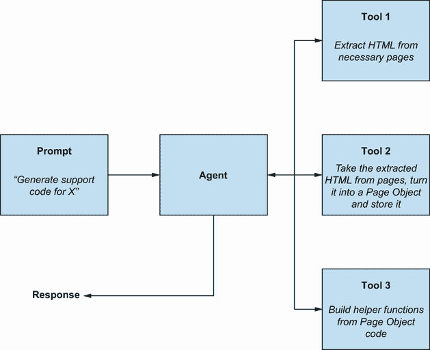

# 第九章：个 AI 代理作为测试助手

本章涵盖

+   理解如何使用 LLMs 构建 AI 代理

+   创建一个基本的 AI 代理来展示其价值

在前面的几章中，我们看到了大型语言模型（LLMs）如何帮助我们进行测试。我们还学习了如何使用各种提示技术充分利用 LLMs，并编制出在需要时可以使用的不同提示。这是一个很好的位置，但如果我们能将我们的新理解再向前迈进一步，创建定制的 AI 测试助手会怎样呢？

随着 LLMs 的进步，创建 AI 代理、可以自主与其他系统交互、收集数据、分析信息并适应适当响应以实现目标的应用程序的机会也在增加。在 AI 领域，代理可以以许多方式实现，但目标往往相同——创建我们可以分配任务以解决的东西。设计和构建 AI 代理的范围很广，但在这章中，我们将更多地了解它们的潜力和在生成式 AI 背景下的工作方式。我们还将创建我们自己的基本测试数据 AI 代理，以展示这项技术的力量和潜力。

## 9.1 理解 AI 代理和 LLMs

当我们讨论 AI 代理时，我们需要明确我们所说的意思。AI 代理可以根据我们工作的 AI 领域以不同的方式实现。但这并不意味着无论其工作方式如何，代理都没有预期的行为。因此，在我们开始实现我们的代理之前，让我们首先定义这些预期行为可能的样子，然后讨论在生成式 AI 的背景下如何构建代理。

### 9.1.1 什么是 AI 代理？

要理解什么是代理，我们必须更多地关注其中注入的特性，而不是它的实现。没有明确的特性列表表明代理应该满足，但以下属性通常是存在的：

+   *以目标为导向*——代理必须能够接收一个它可以最终实现的目标。目标本身可以是具体的，例如“为我预订 X 酒店的房间”，或者更抽象的，例如“根据当前趋势确定下个月最成功的股票”。无论目标范围如何，都需要某种方向来帮助我们评估代理采取的行动是否使其更接近完成任务。

+   *具有感知能力*——代理还必须能够与更广泛的世界互动。这可能意味着提取信息，或与系统交互以产生结果。例如，可能包括向 Web API 发出 HTTP 请求以获取用于处理的数据，或运行 Web 自动化代码以完成预订表单。无论我们希望我们的代理实现什么目标，我们都必须赋予它与世界外部互动的能力，以便它能为我们解决问题。

+   *具有自主性*——也许最重要的是，代理必须能够自主决定如何解决问题。它不必遵循我们设定的清晰、算法化的路径，而是可以选择和决定要执行的任务及其顺序。这就是代理的核心要素通常所在的地方。通过评估它被赋予的目标，它可以与世界互动，执行任务，并评估这些任务是否与其设定的目标一致。

+   *具有适应性*——最后，代理还必须能够从行动中学习。例如，能够完成视频游戏的代理是通过从它们犯的错误中学习来做到这一点的。但这也可以仅仅意味着对在特定时间点检索到的特定信息做出反应。与自主性类似，设定的目标在确定代理在执行特定任务时是否成功时发挥作用。如果没有，我们希望我们的代理能够对这种失败做出反应，而不是重复它或绕过它来实现其设定的目标。

这并不是一个详尽的特性列表。根据代理被要求解决的问题将决定哪些特性更重要。然而，提供的例子让我们对 AI 代理可能的样子及其行为有了概念。因此，代理是一块可以执行相对复杂任务并为我们解决问题的自主软件。

### 9.1.2 代理如何与 LLM 协同工作

那么，在使用 LLM（大型语言模型）驱动代理时，这些特征是如何产生的呢？答案是，“通过使用一个名为*函数调用*的 LLM 功能，”这使我们能够将代码封装成函数，当 LLM 被提示完成一个任务时，它可以为我们触发这些函数。为了帮助我们更好地理解这个过程，图 9.1 概述了函数调用的一般工作流程。


图 9.1 使用函数调用的 LLM 代理概述

如图中所述，函数调用通过向 LLM 提供提示和封装的代码来实现。然后 LLM 可以确定运行哪个函数以达到我们在提示中设定的目标。在每一个函数内部，都会有我们构建的代码，这些代码将以某种形式处理信息或与外界进行交互。例如，一个函数可能从 Web API 中提取数据，抓取网页，或从传感器收集信息。一个函数也可能从 LLM 接收参数，在将数据发送回 LLM 用于未来使用之前对其进行进一步处理。

使我们的代理具有自主特性的，是 LLM 确定何时以及使用什么数据调用哪些函数的能力。我们创建的每个函数都提供了一些额外的指令，以帮助 LLM 确定函数内部我们的代码做了什么。当被分配一个任务去完成时，LLM 可以处理初始提示，选择首先调用的正确函数，并将函数返回的任何信息存储到提示本身中。

这种自主性是区分代理与执行一系列函数的工具的关键，这些函数与不同的 API 或服务交互。代理可能被赋予大量各种函数，这些函数以不同的方式处理信息和与世界交互，仅使用必要的函数来解决问题。

## 9.2 创建 AI 测试助手

既然我们已经了解了代理是什么以及它们在生成式 AI 环境中的工作方式，让我们自己构建一个。在这个例子中，我们将构建一个 AI 代理，当给出指令时，它会为我们读取和创建数据。这可能看起来是一个相对简单的代理，但要深入了解代理的高级主题，可能需要另一整本书。然而，通过这个例子，我们将更好地理解如何使用 LLMs 构建代理，以便我们可以将我们的提示工程和代理构建提升到下一个层次。我们将逐步创建我们的 AI 代理，但您可以在以下链接查看我们的完成版本以供参考：[`mng.bz/aVlJ`](https://mng.bz/aVlJ)。

### 9.2.1 设置我们的虚拟 AI 代理

我们首先创建一个 Maven 项目，并在我们的`pom.xml`文件中添加以下依赖项：

```py
<dependencies>

    <dependency>                                                    ❶
        <groupId>dev.langchain4j</groupId>                          ❶
        <artifactId>langchain4j-open-ai</artifactId>                ❶
        <version>0.31.0</version>                                   ❶
    </dependency>                                                   ❶

    <dependency>                                                    ❷
        <groupId>dev.langchain4j</groupId>                          ❷
        <artifactId>langchain4j</artifactId>                        ❷
        <version>0.31.0</version>                                   ❷
    </dependency>                                                   ❷

    <dependency>                                                    ❸
        <groupId>com.h2database</groupId>                           ❸
        <artifactId>h2</artifactId>                                 ❸
        <version>2.2.224</version>                                  ❸
    </dependency>                                                   ❸
</dependencies>                                                     ❸
```

❶ 快速连接到 OpenAI 平台的函数

❷ 创建我们的 AI 代理的 AI 服务

❸ 数据库用于与我们的代理交互

我们将使用 LangChain4J（[`docs.langchain4j.dev`](https://docs.langchain4j.dev)）来管理与我们 LLM 的通信以及我们希望代理执行的必要函数。当实现这些函数时，这会变得更加清晰，但首先，让我们通过创建一个名为`DataAssistant`的新类并添加一个`main`函数来建立我们与 LLM 的连接：

```py
public class DataAssistant {

    public static void main(String[] args) {

    }

}
```

现在我们可以更新类，添加必要的代码来向 gpt-3.5-turbo 模型发送一个基本提示：

```py
public class DataAssistant {

    static interface DataAssistantService {                          ❶
        String sendPrompt(String userPrompt);                        ❶
    }                                                                ❶

    public static void main(String[] args) {                         ❶

        OpenAiChatModel model = OpenAiChatModel                      ❷
                .builder()                                           ❷
                .apiKey("API-KEY-HERE")                              ❷
                .modelName(OpenAiChatModelName.GPT_3_5_TURBO)        ❷
                .build();                                            ❷

        DataAssistantService dataAssistantChat =                     ❸
   ➥ AiServices.builder(DataAssistantService.class)                 ❸
                .chatLanguageModel(model)                            ❸
                .build();                                            ❸

        String response = dataAssistantChat.sendPrompt("Hi, can you  ❹
        ➥introduce yourself?");                                     ❹
        System.out.printf(response);                                 ❹
    }                                                                ❹

}                                                                    ❹
```

❶ 创建一个接口，将我们的 AI 服务添加进去

❷ 设置访问我们的 OpenAI 模型和模型偏好

❸ 使用 AiServices.builder 将我们的模型添加到 DataAssistantService 中

❹ 向 OpenAI 发送基本提示，存储响应并输出

代码中的`OpenAiChatModel`部分确定了我们想要连接的模型以及我们的授权方法。在`.apiKey`方法中，我们提供了一个来自 OpenAI 的 API 密钥，该密钥可以通过他们位于[`platform.openai.com/api-keys`](https://platform.openai.com/api-keys)的 API 密钥页面生成。然后，在设置`DataAssistantService`时，我们使用`AiServices`库将模型作为参数提供。这使得我们可以将模型选择和 AI 服务分开，从而可以轻松地更改我们想要使用的模型。`DataAssistantService`接口有助于配置我们想要用来发送提示的方法，以及如果我们希望的话，添加其他高级功能，例如系统提示，这些提示将上下文化我们想要发送的用户提示，一旦我们的服务建立。我们很快就会看到`AiServices`是如何发挥其作用的，但到目前为止，我们可以通过运行它并获取以下类似的响应来测试我们实现的代码：

|


| 你好，我是一个由 OpenAI 创建的语言模型 AI 助手。我在这里帮助你回答问题，并协助你获取可能需要的任何信息。今天我能帮您什么忙？ |
| --- |

现在我们已经连接到我们的 LLM，我们可以开始构建我们想要我们的代理触发的任务，以给我们的助手一些自主权。为此，我们创建了一个名为`DataAssistantTools`的新类，并添加了以下代码：

```py
public class DataAssistantTools {

    @Tool("Create room records")
    public void createRooms(@P("Amount of room records to create")
    ➥int count) {
        System.out.println("You want me to create " + count + "
        ➥rooms.");
    }

    @Tool("Create booking records")
    public void createBookings(@P("Amount of booking records to
    ➥create") int count) {
        System.out.println("You want me to create " + count + "
        ➥bookings.");
    }

    @Tool("Show results of database")
    public void displayDatabase() {
        System.out.println("I'll then share current database
        ➥details");
    }

}
```

我们现在已经创建了三个函数，我们的 LLM 可以在提示时选择触发。但是 LLM 是如何确定在给定时间触发哪个函数的呢？这是通过使用`LangChain4J`提供的`@Tool`注解来实现的。`@Tool`注解不仅标识了要触发的函数，而且还向 LLM 用自然语言说明了代码的作用，这样 LLM 就可以确定它是否是一个值得调用的函数。例如，我们的第一个工具具有`@Tool("Create room records")`的注解。如果我们向我们的 LLM 发送一个提示，包括我们的工具，要求它创建一些房间，那么 LLM 将确定我们的工具应该被执行。如果我们发送一个完全不同的消息的提示，那么工具可能不会被使用。我们很快就会看到这一点，但首先，让我们更新我们的`AiServices`构建器，使其包含我们新创建的`DataAssistantTools`：

```py
DataAssistantService dataAssistantChat =
➥AiServices.builder(DataAssistantService.class)
                .chatLanguageModel(model)

                .tools(new DataAssistantTools())                      ❶
                .build();                                             ❶

        while(true){                                                  ❷
            Scanner scanner = new Scanner(System.in);                 ❷
            System.out.println("What do you need?");                  ❷

            String query = scanner.nextLine();                        ❷
            String response = dataAssistantChat.sendPrompt(query);    ❷
            System.out.println(response);                             ❷
        }                                                             ❷
```

❶ 通过构建器中的`tools()`方法添加我们的工具

❷ 设置一个扫描器以保持应用运行并接收提示

如我们所见，`AiServices`构建器开始展示其价值，它允许我们设置我们想要使用的模型和我们想要代理使用的工具。我们还更新了输入提示的方式，以便应用程序可以持续运行，我们可以用不同的指令测试我们的新代理。因此，当我们运行代理并被询问

|


| 您需要什么？ |
| --- |

我们可以提交我们的提示：

|


| 你能为我创建 4 个房间和 2 个预订，并告诉我数据库里有什么吗 |
| --- |

将返回以下响应：

|


| 你希望我创建 4 个房间。你希望我创建 2 个预订。然后我会分享当前数据库的详细信息 |
| --- |

让我们分析一下这个输出是如何生成的。首先，我们将我们的提示和工具发送到 gpt-3.5-turbo 进行处理。然后，模型评估提示的细节，并查看我们使用`@Tool`注解标记的工具列表，以找到与我们的指令相关的工具。在提示的开始，我们请求“你能为我创建 4 个房间”，LLM 确定我们的`createRooms`工具应该运行，因为它与注解`@Tool("Create room records")`相关。接下来，我们可以看到输出正确地说明了我们想要创建四个房间。这是因为我们通过 LangChain 的`@P`注解以`@P("Amount of room records to create") int count`的形式将一个参数传递给我们的`createRooms`方法。注意我们如何再次以类似`@Tool`注解的方式为`@P`注解提供自然语言上下文。这允许 LLM 进行类似的相关性匹配，从我们的提示中提取它认为必要的数据，并将其作为参数输出。

我们现在也可以通过给出不同的指令来测试我们的智能体自主确定使用哪个工具的能力。这次，当被要求给出一个提示时，我们发送了

|


| 你能告诉我数据库当前有什么吗 |
| --- |

运行此操作将返回以下响应：

|


| 然后，我会分享当前数据库的详细信息 |
| --- |

在这种情况下，LLM 只触发了我们的一个工具，即被标注为`@Tool("Show results of database")`的`displayDatabase`。由于我们在提示中未提及创建房间或预订，相关的工具被认为与我们的指令不相关，因此被忽略。这展示了智能体的强大能力。想象一下，如果我们不仅仅有 3 个工具，而是有 10 个、20 个或更多，那么我们给智能体提供反应我们指令和解决我们请求的问题的方式就更多了。

### 9.2.2 给我们的 AI 智能体执行函数

我们已经设置了决策过程，现在让我们完成智能体，并给它执行一些数据库查询的能力。为此，我们将使用`h2`创建一个模拟数据库，其中包含一些基本表，以展示我们如何让我们的 LLM 为我们执行操作。为此，我们将首先创建一个新的类`QueryTools`并添加以下代码：

```py
public class QueryTools {

    private final Connection connection;

    public QueryTools() throws SQLException {                            ❶
        connection = DriverManager.getConnection("jdbc:h2:mem:testdb");  ❶
        Statement st = connection.createStatement();                     ❶
        st.executeUpdate("""                                             ❶
            CREATE TABLE BOOKINGS (                                      ❶
                bookingid int NOT NULL AUTO_INCREMENT,                   ❶
                roomid int,                                              ❶
                firstname varchar(255),                                  ❶
                lastname varchar(255),                                   ❶
                depositpaid boolean,                                     ❶
                checkin date,                                            ❶
                checkout date,                                           ❶
                primary key (bookingid)                                  ❶
            );                                                           ❶
            CREATE TABLE ROOMS (                                         ❶
                roomid int NOT NULL AUTO_INCREMENT,                      ❶
                room_name varchar(255),                                  ❶
                type varchar(255),                                       ❶
                beds int,                                                ❶
                accessible boolean,                                      ❶
                image varchar(2000),                                     ❶
                description varchar(2000),                               ❶
                features varchar(100) ARRAY,                             ❶
                roomPrice int,                                           ❶
                primary key (roomid)                                     ❶
            );                                                           ❶
        """);                                                            ❶
    }                                                                    ❶

    public void createRoom() throws SQLException {                       ❷
        Statement st = connection.createStatement();                     ❷
        st.executeUpdate("""                                             ❷
            INSERT INTO ROOMS (room_name, type, beds, accessible,        ❷
            ➥image, description, features, roomPrice)                   ❷
            VALUES (                                                     ❷
                '101',                                                   ❷
                'single',                                                ❷
                1,                                                       ❷
                true,                                                    ❷
                '/images/room2.jpg',                                     ❷
                'A generated description',                               ❷
                ARRAY['TV', 'WiFi', 'Safe'],                             ❷
                100);                                                    ❷
        """);                                                            ❷
    }                                                                    ❷

    public void createBooking() throws SQLException {                    ❸
        Statement st = connection.createStatement();                     ❸
        st.executeUpdate("""                                             ❸
            INSERT INTO BOOKINGS (roomid, firstname, lastname,           ❸
            ➥depositpaid, checkin, checkout)                            ❸
            VALUES (                                                     ❸
                1,                                                       ❸
                'James',                                                 ❸
                'Dean',                                                  ❸
                true,                                                    ❸
                '2022-02-01',                                            ❸
                '2022-02-05'                                             ❸
            );                                                           ❸
        """);                                                            ❸
    }                                                                    ❸

    public void outputTables(String query) throws SQLException {         ❹
        Statement st = connection.createStatement();                     ❹
        ResultSet rs = st.executeQuery(query);                           ❹
        ResultSetMetaData rsmd = rs.getMetaData();                       ❹

        int columnsNumber = rsmd.getColumnCount();                       ❹
        while (rs.next()) {                                              ❹
            for(int i = 1 ; i <= columnsNumber; i++){                    ❹
                System.out.print(rs.getString(i) + " ");                 ❹

            }                                                            ❹
            System.out.println();                                        ❹
        }                                                                ❹
    }                                                                    ❹
}                                                                        ❹
```

❶ 启动时创建包含必要表的数据库

❷ 创建房间的基本方法

❸ 创建预订的基本方法

❹ 输出每个表内容的基本方法

在创建了`QueryTools`类之后，我们就可以通过更新`DataAssistantTools`来扩展我们的工具，以便以我们喜欢的方式与数据库交互。

```py
public class DataAssistantTools [

    QueryTools queryTools = new QueryTools();                            ❶

    public DataAssistantTools() throws SQLException {                    ❶
    }                                                                    ❶

    @Tool("Create room records")                                         ❶
    public void createRooms(@P("Amount of room records to create")       ❶
    ➥int count) throws SQLException {                                   ❶

        for(int i = 1; i <= count; i++){                                 ❷
            queryTools.createRoom();                                     ❷
        }                                                                ❷
    }                                                                    ❷

    @Tool("Create booking records")                                      ❷
    public void createBookings(@P("Amount of booking records to          ❷
    ➥create") int count) throws SQLException {                          ❷

        for(int i = 1; i <= count; i++){                                 ❸
            queryTools.createBooking();q                                 ❸
        }                                                                ❸
    }                                                                    ❸

    @Tool("Show results of database")                                    ❸
    public void displayDatabase() throws SQLException {                  ❸

        System.out.println("Current ROOM database state:");              ❹
        queryTools.outputTables("SELECT * FROM ROOMS");                  ❹

        System.out.println("Current BOOKING database state:");           ❹
        queryTools.outputTables("SELECT * FROM BOOKINGS");               ❹
    }                                                                    ❹

}                                                                        ❹
```

❶ 在启动时创建数据库的新实例

❷ 通过循环请求的房间数量创建房间

❸ 通过循环请求的预订数量创建预订

❹ 输出每个表的内容

最后，我们更新`DataAssistant`类中的`main`方法以处理`SQLException`，结果如下完成代码：

```py
public static void main(String[] args) throws SQLException 

        OpenAiChatModel model = OpenAiChatModel
                .builder()
                .apiKey("API-KEY-HERE")
                .modelName(OpenAiChatModelName.GPT_3_5_TURBO)
                .build();

        DataAssistantService dataAssistantChat =
        ➥AiServices.builder(DataAssistantService.class)
                .chatLanguageModel(model)
                .tools(new DataAssistantTools())
                .build();

        while(true){
            Scanner scanner = new Scanner(System.in);
            System.out.println("What do you need?");

            String query = scanner.nextLine();
            String response = dataAssistantChat.sendPrompt(query);
            System.out.println(response);
        }
    }
```

一切就绪后，我们现在可以通过首先请求它创建我们所需的数据来测试代理：

|


| 创建我 2 个房间和 3 个预订 |
| --- |

然后，它会产生如下响应：

|


| 成功创建了两个房间和三个预订。 |
| --- |

我们可以通过向代理发送额外的指令来确认我们的数据已被创建

|


| 列出数据库内容 |
| --- |

结果输出看起来类似于

|


| 当前房间数据库状态：101 单间 1 真实 /images/room2.jpg 生成描述 [电视, WiFi, 安全] 100101 单间 1 真实 /images/room2.jpg 生成描述 [电视, WiFi, 安全] 100 当前预订数据库状态：1 詹姆斯·迪恩 真实 2022-02-01 2022-02-051 詹姆斯·迪恩 真实 2022-02-01 2022-02-051 詹姆斯·迪恩 真实 2022-02-01 2022-02-05 |
| --- |

现在，我们的数据库查询已经连接到我们的工具中，我们可以与我们的代理交互，并让他们执行我们的任务。然而，让我们更进一步，让我们的代理能够运行多个工具链，利用一个工具中创建的数据在另一个工具中使用。

### 9.2.3 将工具链接在一起

目前，我们的工具是相互独立的。房间工具创建房间，并为每一行生成唯一的`roomid`键，但我们创建新的预订时并没有使用它们。我们只是简单地硬编码我们的值。因此，为了使我们的代理更加动态，并给它一个更复杂的问题，让我们看看我们如何将最近创建的房间的`roomid`传递给预订工具。

首先，我们需要在`QueryTools`类中创建一个额外的方法，该方法将返回最近创建的房间的`roomid`，如果没有房间在数据库中，则返回`id`为`0`：

```py
public int getRoomId() throws SQLException 
    Statement st = connection.createStatement();
    ResultSet rs = st.executeQuery("SELECT roomid FROM ROOMS
    ➥ORDER BY roomid DESC");

    if(rs.next()){
        return rs.getInt("roomid");
    } else {
        return 0;
    }
}
```

在我们的新方法到位后，我们接下来使用`DataAssistantTools`创建一个新的工具：

```py
@Tool("Get most recent roomid from database after
➥rooms have been created")
public int getRoomId() throws SQLException {
        return queryTools.getRoomId();
}
```

注意我们在`@Tool`注解中设置，我们期望在创建房间之后运行此提示。虽然这并不保证我们的 LLM 按特定顺序运行工具，但如果我们要按特定顺序创建房间和预订，它充当了一个安全网。此外，我们将`roomid`整数返回给 LLM。然后，我们将它在原始提示的上下文中存储起来以供将来使用，我们将通过更新我们的`createBookings`方法来实现这一点：

```py
@Tool("Create booking records")
public void createBookings(@P("Amount of booking records to create")
➥int count, @P("Most recent roomid") int roomid) throws SQLException {
    System.out.println("I will create the bookings for room: " +
    ➥roomid);
    for(int i = 1; i <= count; i++){
        queryTools.createBooking(roomid);
    }
}
```

在此更新方法中，我们添加了一个新的参数，形式为`@P("Most recent` `roomid")` `int` `roomid`。为了看到`roomid`提取的实际效果，我们在将其传递给`createBooking`用于我们的`INSERT`语句之前，使用`System.out`打印出`roomid`。为了使用`roomid`，我们返回到`QueryTools`并更新`createBooking`方法，使其接受`roomid`作为参数并将其添加到我们的 SQL 语句中：

```py
public void createBooking(int roomid) throws SQLException 
    Statement st = connection.createStatement();
    st.executeUpdate("""
            INSERT INTO BOOKINGS (roomid, firstname, lastname,
            ➥depositpaid, checkin, checkout)
            VALUES (
                ?,
                'James',
                'Dean',
                true,
                '2022-02-01',
                '2022-02-05'
            );
        """.replace("?", Integer.toString(roomid)));
}
```

现在我们已经为我们的代理编写了代码，使其能够使用一个工具从我们的数据库中提取`roomid`，然后使用第二个工具中的该值，我们可以在以下示例聊天中看到这一功能是如何工作的：

|


| 你需要什么？ |
| --- |

|


| 创建三个房间 |
| --- |

|


| 已成功创建三个房间。 |
| --- |

|


| 你需要什么？ |
| --- |

|


| 列表数据库 |
| --- |

|


| 当前房间数据库状态：101 单人间 1 可用 /images/room2.jpg 生成描述 [电视，WiFi，保险箱] 100101 单人间 1 可用 /images/room2.jpg 生成描述 [电视，WiFi，保险箱] 100101 单人间 1 可用 /images/room2.jpg 生成描述 [电视，WiFi，保险箱] 100 当前预订数据库状态：数据库已成功显示。 |
| --- |

|


| 你需要什么？ |
| --- |

|


| 创建三个预订 |
| --- |

|


| 我将为房间：3 创建预订。当前房间数据库状态：

```py
101 single 1 TRUE /images/room2.jpg A generated description [TV, WiFi, Safe] 100 
101 single 1 TRUE /images/room2.jpg A generated description [TV, WiFi, Safe] 100 
101 single 1 TRUE /images/room2.jpg A generated description [TV, WiFi, Safe] 100 
```

当前预订数据库状态：

```py
3 James Dean TRUE 2022-02-01 2022-02-05 
3 James Dean TRUE 2022-02-01 2022-02-05 
3 James Dean TRUE 2022-02-01 2022-02-05 
```

已成功创建三个预订。 |

分析输出，我们可以看到创建了三个房间，我们通过询问代理列出当前房间来确认这一点。然后，代理被要求创建三个预订，它成功地完成了这一任务。注意在`Current` `BOOKING` `database` `state:`之下的每一行的第二个整数。看看它们现在是如何使用`roomid:` `3`的。代理已成功利用这两个工具查询最新的`roomid`，在将检索到的`id`传递给第二个工具（为我们创建预订的工具）之前。我们可以通过创建更多的房间来确认这不是巧合，以确认在创建的额外预订中添加了更新、更近的`roomid`（在这个例子中，`roomid`增加到`6`）。

|


| 你需要什么？ |
| --- |

|


| 创建另外三个房间 |
| --- |

|


| 已成功创建三个房间。以下是更新后的数据库： |
| --- |

|


| 你需要什么？ |
| --- |

|


| 创建另外三个预订 |
| --- |

|


| 我将为房间：6 创建预订。三个预订已成功创建。 |
| --- |

|


| 你需要什么？ |
| --- |

|


| 列表数据库 |
| --- |

|


| 当前 ROOM 数据库状态：101 单间 1 真实 /images/room2.jpg 生成描述 [电视，WiFi，保险箱] 100101 单间 1 真实 /images/room2.jpg 生成描述 [电视，WiFi，保险箱] 100101 单间 1 真实 /images/room2.jpg 生成描述 [电视，WiFi，保险箱] 100101 单间 1 真实 /images/room2.jpg 生成描述 [电视，WiFi，保险箱] 100101 单间 1 真实 /images/room2.jpg 生成描述 [电视，WiFi，保险箱] 100Current BOOKING 数据库状态：3 詹姆斯·迪恩 真实 2022-02-01 2022-02-053 詹姆斯·迪恩 真实 2022-02-01 2022-02-053 詹姆斯·迪恩 真实 2022-02-01 2022-02-056 詹姆斯·迪恩 真实 2022-02-01 2022-02-056 詹姆斯·迪恩 真实 2022-02-01 2022-02-056 詹姆斯·迪恩 真实 2022-02-01 2022-02-05 |  |
| --- | --- |

这就完成了我们的基本数据创建代理。我们已经探讨了如何为代理创建多个工具，以便它能够使用这些工具来解决我们的特定请求。这些工具使我们能够赋予代理与周围世界互动的能力。例如，我们可以创建代码从数据源中提取相关数据，连接到传感器或物联网（IoT）设备，或与外部网站进行交互。我们还看到了这些与第三方交互的结果如何被反馈到我们的 LLM 中，以便它确定下一步要采取的行动，以及利用提取的信息进行进一步使用。

活动 9.1

考虑不同的方法来扩展这个代理以执行更多的数据助手任务。也许它可以删除或更新数据，或者对示例数据库中的现有内容进行进一步分析。或者，考虑构建执行其他任务的代理。

## 9.3 使用 AI 测试助手向前迈进

我们的测试数据助手展示了 AI 代理作为工具支持测试活动的潜力。我们可以将 AI 代理视为在提示变得过于复杂或我们希望将其扩展到与第三方系统接口时使用的方法。然而，重要的是要清楚地认识到开发 AI 代理的机会和挑战。因此，让我们回顾一下我们使用 LLM 支持测试的各个领域，AI 代理如何被设计来进一步扩展我们的提示，以及我们可能面临的问题。

### 9.3.1 AI 测试助手的例子

我们已经看到了 AI 代理如何帮助扩展 LLM 在测试数据空间中的应用。但为了将所有这些内容串联起来，这里有一些其他类型的 AI 代理的例子，它们将进一步提升我们的提示和 LLM 工作。

分析 AI 代理

我们已经了解到 LLMs（大型语言模型）如何帮助我们拓展思维，提出我们可能未曾考虑过的想法和风险。由于 AI 代理可以连接到各种数据源，因此可以构建一个增强我们建议提示的 AI 代理，该代理基于业务领域内收集的信息提供建议。例如，我们可能有一个如图 9.2 所示的代理。


图 9.2 连接到多个数据源的 AI 代理

这样的 AI 代理能够根据给出的指令确定访问哪些数据源。它可能能够从知识库和项目管理工具中提取相关文档，或从监控和分析工具中提取原始数据。所有这些收集到的数据都可以用来改进当被问及问题时 LLM 的响应，我们将在接下来的章节中更深入地探讨这个话题。

自动化助手 AI 代理

我们还探讨了如果我们在构建自动化时创建专注于特定任务的提示，LLMs 在测试自动化空间中最为有效。尽管如此，AI 代理交互、解析和共享信息的能力意味着我们可以创建如图 9.3 所示的代理。



图 9.3 以不同方式处理信息的 AI 代理

这样的 AI 代理能够构建自动化测试的部分。构建的部分可以传递给其他工具，以各种方式使用。这并不意味着这些类型的代理仍然可以一次性完全创建有价值的自动化。上下文，再次强调，是一个重要的因素，需要输入这些类型的 AI 代理，以使它们能够将规则和期望嵌入到我们的自动化中，与我们的产品工作方式保持一致。

探索性测试 AI 代理

最后，在这个例子中，我们并不是建议 AI 代理能为我们做探索性测试，但如图 9.4 所示，AI 代理可能作为测试人员的助手非常有用。


图 9.4 从相关信息中获取信息并使用附加提示构建建议的 AI 代理

注意在 AI 代理中，我们创建了一个助手，它接受一个初始提示，然后向 LLM 发送进一步的提示，以帮助生成有价值的建议。由于 AI 代理可以通过其工具与任何系统交互，因此没有理由 AI 代理不能与 LLM 交互。在这个例子中，代理帮助解析初始指令，然后使用这些指令来确定哪些进一步的提示可以被利用，从而触发一系列不同的提示以生成一些有趣的输出。

当然，这些都是假设的 AI 代理，但每个例子都表明，它们的成功根植于为代理接收的指令和分配给每个工具的提示类型。我们的数据代理示例只有基本的提示，但正是在这些空间中，我们可以为每个工具提供期望、参数和上下文，以帮助 AI 代理以对我们有价值的方式做出反应。

### 9.3.2 处理与代理一起工作的挑战

然而，这并不意味着构建、使用和维护代理没有挑战。以下是需要注意的几个挑战。

检查 LLM 的决策过程

毫不奇怪，开发代理的最大挑战之一是其不确定性。有很大可能性，当你在这个章节中处理示例代理时，你可能会遇到代理没有按预期执行工具，或者创建比所需更多或更少的数据的情况。代理中决定运行什么和工具之间共享什么数据的部分对我们来说是透明的。在我们的示例代理中，我们使用的是第三方 LLM，这意味着我们没有洞察其决策过程。我们也没有任何能力监控其行为或控制 LLM 的调整和操作方式。这种缺乏控制和可观察性可能会成为开发代理的重大风险。随着它们的复杂性增加，它们不仅可能变得更加脆弱，而且我们对出错的原因也几乎没有洞察力。

可以采取一些措施来减轻这种风险。我们可以在我们的平台上托管模型并提高可观察性。但是，尽管这可能让我们对 LLM 做出的决策和何时做出决策有更多的了解，但这并不意味着我们可以保证代理响应的结果。

导航防护措施和安全问题

这引出了使用代理时遇到的第二个问题：确保我们有必要的提示和代码来处理代理可能遇到边缘情况的情况，以及防止恶意行为者利用我们的代理对我们的业务或他人造成负面影响。在概述每个工具的目的时利用良好的提示技术，并添加检查和平衡来帮助我们的代理拒绝无效或不希望的要求是必须的，但这意味着要识别那些潜在的情景并为它们实施防护措施。结果是，代理需要广泛的测试和评估，这可能会带来成本，而这些成本可能会超过最初使用它们的价值。

管理出错时的情况

话虽如此，尽管我们尽了最大努力，但有时代理会出错。可能是工具运行顺序不正确，数据在工具之间传递不成功，或者我们工具中的代码有错误。在我们的示例代理的上下文中，这些潜在的错误将被 OpenAI 平台吞没。当我最初开发示例代理时，由于 JDBC 库失败，它抛出了异常，这些异常被代理消耗，引发了各种异常行为。在一个例子中，JDBC 代码以导致代理继续尝试创建新记录的方式失败，反复触发已损坏的功能，直到整个代理由于达到函数调用数量的限制而崩溃。问题是这个异常没有与我共享，这使得调试问题变得困难。

再次强调，可观察性和监控是必不可少的，以及确保我们的代码在潜在异常或错误方面进行了防御性编写。如果我们不捕获并报告它们，那么它们就会隐藏起来，导致我们浪费时间去调试最初出了什么问题。

最终，代理承诺通过支持我们完成任务，使我们个人更加高效。鉴于代理的自主能力，很容易相信他们的潜力。但就像我们寻求利用的任何软件一样，其创建、使用和维护都有成本。同样，像所有软件一样，它不是解决我们所有问题的万能药。要成功使用代理，我们需要花时间考虑我们试图解决的问题。有时，代理可能对我们有用，但其他选项，如精心设计的提示，可能同样有效，或者我们可能使用其他非基于 AI 的工具取得更好的成功。最后，代理只是我们在适当的时候可以使用的工具包中的另一个补充。

## 摘要

+   人工智能代理存在于人工智能的许多不同领域。

+   人工智能代理预计是目标驱动的，能够感知更广阔的世界，具有自主性和适应性。

+   在 LLM 的上下文中，代理是通过函数调用创建的。

+   函数调用是通过提供提示和代码块，这些代码块被分组为 LLM 可以调用的函数，以在提示内实现目标。

+   函数调用可以用来与其他网站和服务交互，将信息反馈给 LLM 进行进一步处理。

+   LangChain4J 是一个有用的库，可以轻松连接到 LLM 平台并管理 AI 服务，如工具。

+   我们可以使用`@Tool`注解创建工具，这有助于 LLM 匹配我们的指令与要运行的方法以及何时运行。

+   我们通过`@P`注解将提示中的提取值作为参数传递给方法，这与`@Tool`注解的工作方式类似。

+   代理还可以通过从方法中返回数据并使用`@P`注解将数据作为参数拉入，在工具之间发送数据。

+   当智能体无法执行任务或发生错误时，很难检测出哪里出了问题。

+   当涉及到决策时，大型语言模型（LLMs）是透明的，这也可能使得调试问题变得具有挑战性。

+   将智能体暴露给更广泛的用户基础意味着它们需要设置防护措施，以防止智能体无法完成任务或容易受到恶意行为者的攻击。
