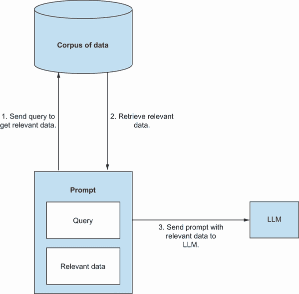
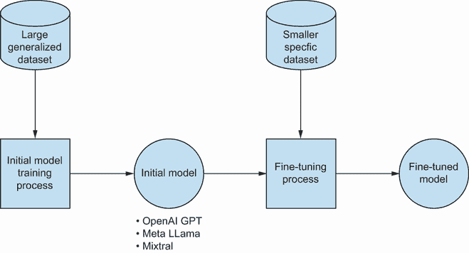
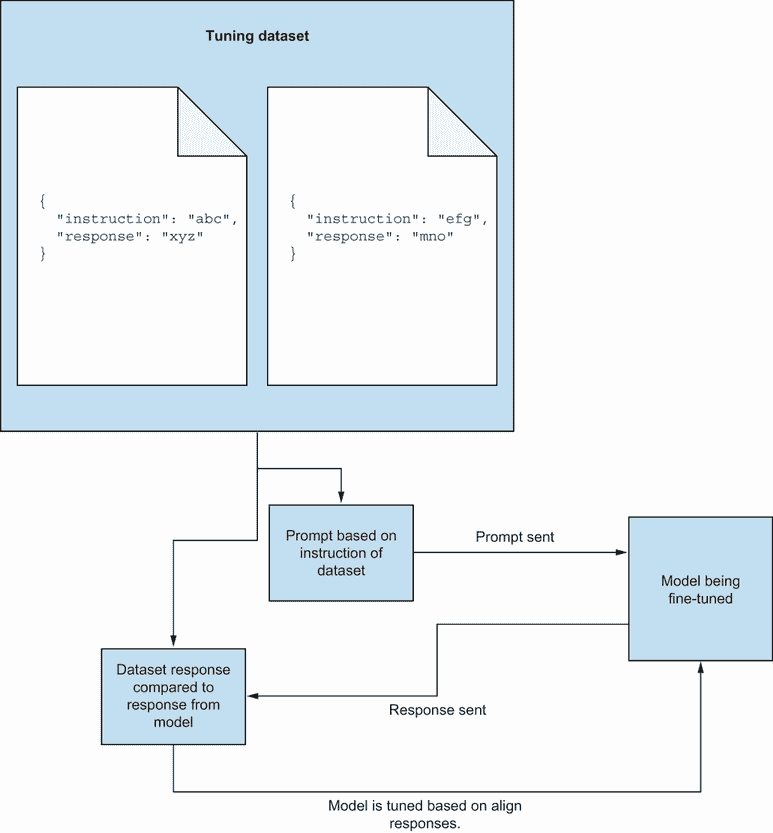

# 第十章：介绍定制化 LLM

本章涵盖

+   缺乏上下文如何影响大型语言模型（LLM）的性能

+   RAG 的工作原理及其价值

+   LLM 微调的工作原理及其价值

+   比较 RAG 和微调方法

在过去的几章中，我们看到了如何磨练我们的技能，以识别大型语言模型（LLMs）可以支持的不同、专注的任务。结合一系列提示工程技巧，我们已经成功地让 LLMs 返回对我们测试活动有价值的响应。然而，尽管我们学到了教训，我们收到的响应可能仍然不完全符合我们的需求和上下文。尽管认为我们可以完全使 LLM 与我们的上下文一致是愚蠢的，但我们可以利用更多高级选项，与提示工程结合使用，以进一步最大化 LLM 的输出，以支持我们的测试。因此，在本部分最后，我们将探讨如何增强 LLMs，使它们能够更多地嵌入我们的上下文，特别是关注检索增强生成（RAG）和微调。但在深入探讨这些方法的具体细节和行动之前，我们将首先检查为什么更常用的 LLMs，如 ChatGPT、Claude 和 Gemini，可能难以调整到我们的上下文，然后逐渐熟悉 RAG 和微调等更高级的主题，比较它们以确定在特定情况下哪一个更适合。

## 10.1 LLMs 和上下文的挑战

我们了解到，与 LLM 一起工作的关键挑战是让他们以输出响应，

+   与我们的上下文相关

+   遵循我们的提示规则

+   不包含幻觉

我们所使用的提示工程技巧帮助我们实现了这些目标。例如，如果我们回到第五章的示例提示，我们可以看到一个弱的提示，例如

|


| 创建文件上传功能的测试 |
| --- |

这将返回一个弱响应，具有相当通用的结果：

|


| 1. 测试文件上传功能：   • 测试用例 1.1：上传有效的文件   − 输入：选择一个有效格式的文件（例如，.jpg, .pdf）。   − 预期结果：文件成功上传，并显示确认消息。   • 测试用例 1.2：尝试上传无效的文件   − 输入：选择一个无效格式的文件（例如，.exe, .xhtml）。   − 预期结果：显示错误消息，指出文件格式不受支持。   2. 测试文件大小限制：   • 测试用例 2.1：上传小于最大允许大小的文件。   − 输入：选择一个小于最大允许大小的文件。   − 预期结果：文件成功上传，并显示确认消息。   • 测试用例 2.2：尝试上传超过大小限制的文件。   − 输入：选择一个大于最大允许大小的文件。   − 预期结果：显示错误消息，指出文件超过最大大小限制。 |
| --- |

然而，一个更详细且使用正确提示工程策略的提示可以导致更优化的响应。例如，一个提示

|


| 你是一位软件测试专家。为以下由三个井号分隔的行为生成尽可能多的测试用例。###一个授权 API，它将从不同的 API 获取令牌并检查该令牌是否有效且在有效期内，然后根据结果积极或消极地响应。### |
| --- |

返回更具体的结果，如

|


| 1. 有效的令牌检查：   • 使用在有效期内有效的令牌进行测试。预期结果：API 响应积极。   2. 过期令牌检查：   • 使用已过期的有效令牌进行测试。预期结果：API 响应消极。   3. 无效令牌检查：   • 使用无效的令牌格式进行测试（例如，字符错误，长度不正确）。预期结果：API 响应消极。   4. 空令牌检查：   • 使用空令牌输入进行测试。预期结果：API 响应消极或返回适当的错误信息。   5. 空值令牌检查：   • 使用空值令牌输入进行测试。预期结果：API 响应消极或返回适当的错误信息。 |
| --- |

我们的第二个提示更成功，因为我们不仅分享了更多的上下文，还使用了特定的提示工程策略。因此，如果我们想最大限度地利用 LLM（大型语言模型），我们不仅需要依赖良好的提示工程技巧，还需要提供尽可能相关的上下文。原因有两点：

+   很可能 LLM（大型语言模型）没有在我们的上下文中接受过训练。因此，LLM 对我们上下文没有增加的权重或偏见。

+   LLM（大型语言模型）接受过如此大量的通用数据训练，当被问及一个通用问题时，它将依赖于从训练过程中识别出的更强、更通用的模式。

因此，如果我们想从 LLM 中获得最佳效果，表面上，答案似乎很简单：尽可能提供更多的上下文细节（我们已经在某种程度上这样做）。然而，如果我们这样做，我们很快就会遇到在提示中可以发送的上下文量的一些限制。

### 10.1.1 令牌、上下文窗口和限制

在我们讨论这个提示限制之前，还有一些关于 LLM 的概念我们需要了解——即令牌和上下文窗口。理解这两个方面的 LLM 将帮助我们理解为什么当前的 LLM 在可以提供的上下文量上有上限，以及这如何影响我们的使用策略。

令牌

假设我们正在向一个 LLM 发送以下提示：

|


| 列出世界上人口最多的五个城市。 |
| --- |

一个只能使用机器码解释信息的 LLM 如何解析这个提示并返回响应？这是通过一个称为 *分词* 的过程完成的，在这个过程中，自然语言文本被转换成 LLM 可以读取的匹配整数。为了理解这是如何工作的，让我们考虑我们的城市人口提示。如果我们将其通过分词过程，这个句子将被切割成更小的、离散的部分。例如，我们的提示可以被分成 12 个部分：

```py
List
 me
 five
 of
 the
 most
 populated
 cities
 in
 the
 world
.
```

如我们所见，句子中的每个单词以及句尾的句号都被切分成更小的部分，这些部分被称为 *令牌*。注意它们还包括每个单词左侧的空白。一般来说，句子中的每个单词都会被分割成其对应的令牌；然而，一些分词器（用于进行这种转换的工具）有时会将较大的单词分割成单独的令牌，或者将较小的单词组合在一起。

一旦句子被切割成令牌，每个令牌都会被转换成一个整数，使用一个唯一的数字作为每个单词的标识符。例如，完成我们的提示的分词将产生一个数字列表（逗号和空白已被添加以帮助可读性）：

|


|

```py
861, 757, 4330, 315, 279, 1455, 35459, 9919, 304, 279, 1917, 13
```

|

列表中的每个数字都与从我们的提示中提取的特定切片相关联。例如，令牌 `the` 的 ID 为 279，我们可以看到它在列表中出现了两次，每次 `the` 在句子中使用时都会出现。一旦提示完成分词过程，我们使用的模型就能够处理整数列表并开始确定如何回应。然后，分词过程再次被用来创建我们从模型收到的响应文本，因此我们的模型可能会以一系列整数的形式回应：

|


|

```py
53954, 16417, 11, 6457, 198, 16939, 6151, 11, 6890, 198, 2059, 31170, 11, 5734, 198, 50, 3496, 38026, 11, 16327, 198, 44, 30955, 11, 6890
```

|

当转换回文本时，它会产生以下响应（行中断也包含在整数列表中，每次提到迭代 11 都是一个行中断）：

|


| 东京，日本 | 德里，印度 | 上海，中国 | 圣保罗，巴西 | 孟买，印度 |
| --- | --- | --- | --- | --- |

尝试不同的标记化器

为了更好地理解标记化过程是如何工作的，以及单词、数字和符号是如何被分割的，我们可以尝试使用标记化预览工具，例如[`gpt-tokenizer.dev/`](https://gpt-tokenizer.dev/)。

因此，标记是 LLM（大型语言模型）的一个重要方面，因为它们不仅告诉我们模型如何解析提示并形成响应，还告诉我们在我们遇到问题之前可以向该模型发送多长的提示。这引出了上下文窗口和我们的上下文挑战的核心。

上下文窗口

由于标记化过程将自然语言转换为 LLM 可以处理的数字序列，提示越长，需要处理的标记就越多。具有大量标记的提示的问题在于它会影响 LLM 处理我们的提示的有效性以及它消耗的资源。提示越大，生成响应就越复杂，这意味着更多的硬件使用。所有这些都会产生成本，无论是使用私有 LLM 的托管费用还是发送提示的 API 费用（例如，OpenAI 根据发送和接收的标记数量收费）。

再加上更大的上下文窗口并不一定意味着 LLM 性能更好，我们开始看到 LLM 提供商需要在某些方面做出权衡。因此，LLM 可能会在模型中内置某种类型的限制，限制它在特定时间内可以接收的标记数量。这被称为模型的`上下文` `窗口`。不同的模型包含不同大小的上下文窗口，有时也被称为上下文长度。所有这些都取决于所训练的模型类型、运行它的硬件以及它与其他支持应用程序的部署方式。例如，OpenAI 的 ChatGPT 4 据估计具有 128k 标记的上下文窗口，而 Meta 的 Llama-2 为 4k（在修改之前）。因此，在确定在特定情况下使用哪个 LLM 时，我们必须意识到上下文长度。选择一个为了节省成本而限制大小的模型可能会限制我们可以添加到提示中的上下文。

并非所有上下文窗口都相同

讨论上下文窗口时需要注意的一点是，即使模型能够接收例如 128k 标记的请求，这并不意味着响应会有相同的限制。事实上，可能响应有一个更小的窗口来帮助降低成本。这不一定会影响我们接下来章节的学习，但这是一个在期望模型返回大型响应时值得记住的细节。

### 10.1.2 将上下文作为解决方案

现在我们了解到 LLMs 通过分词来解释我们的请求，并且我们可以发送给 LLM 的 token 大小是有限的，我们就可以开始看到当我们向提示中添加更多上下文时所面临的问题。尽管 LLMs 正在快速发展，变得更加高效，并提供了更大的上下文窗口，但例如添加一个应用程序的完整代码库作为提示的指令，这并不划算。我们可能会达到模型能力的上限，或者快速烧光我们的预算。相反，为了最大化准确性，我们需要考虑如何以智能的方式将上下文嵌入到我们的提示和 LLMs 中。幸运的是，AI 社区已经做了很多工作，我们可以利用这些工作来进一步嵌入上下文，从而提高准确性，同时不会让我们的预算（或模型）受损。

## 10.2 将上下文进一步嵌入到提示和 LLMs 中

为了提高 LLM 接触我们上下文的能力，我们可以利用两种技术之一。第一种是 RAG，第二种是微调。在接下来的章节中，我们将探讨这两种方法是如何工作的，它们之间有何不同，以及我们如何确定哪种方法更适合提高 LLM 的响应。尽管这两种方法在应用上不同，但它们的最终目标相似：通过允许我们向 LLM 的工作流程添加更多上下文，帮助我们提高模型的表现。检索增强生成试图通过关注我们如何增强提示的方式来解决问题，而微调则试图将我们的上下文直接嵌入到模型本身中。让我们简要地看看这两种方法，以便我们更加熟悉它们，并确定在特定情况下哪种方法更合适。

### 10.2.1 RAG

如我们之前所学的，如果一个 LLM 由于上下文窗口的限制而在接收提示的大小上存在限制，那么试图将所有上下文都放入一个提示中，希望它能改善 LLM 的响应，是不明智的。然而，这并不意味着我们不能在选择我们提供的提示中的上下文类型时有所选择。这意味着，在 LLM 中提高准确性，不是通过将我们的上下文强行施加到 LLM 上，而是通过精心设计我们的提示，使它们包含关于我们上下文的全部相关信息，以支持我们的指令。更具体地说，这意味着如果我们想让 LLM 为自动化检查生成模板页面对象，提供页面的特定 HTML 和任何相关的代码会比将整个代码库添加到提示中更好。

表面上看，这似乎是一个有效且简单的方法：编写我们的提示，找到相关的支持信息，将两者合并成最终的提示，然后发送给 LLM。然而，问题在于这可能是一项劳动密集型活动，需要研究和确定要添加什么信息以及要忽略什么信息。幸运的是，这正是 RAG 能帮助我们的地方。如图 10.1 所示，RAG 通过使用提示的初始指令来自动化将相关信息嵌入到我们的提示中的过程，以确定要添加到我们的提示中的信息。



图 10.1 RAG 的高级工作流程图

为了帮助我们更好地理解这个过程，让我们回到我们的 Page-object-generation 提示示例。使用 RAG 框架，方法将是这样进行的：

1.  信息语料库将被创建。在我们的例子中，它可能包含我们应用程序每一页的标记 HTML 文档。

1.  创建了一个提示，要求 LLM 为我们预订列表页面生成一个页面对象。

1.  我们的 RAG 框架会分析我们的提示，并在我们的 HTML 文档语料库中程序化地找到最相关的文档。如果 RAG 框架工作正常，它将确定包含预订列表的 HTML 文档是最相关的。

1.  将最相关的 HTML 文档添加到我们最初创建的提示中，然后将提示发送给 LLM 以返回响应。

RAG 通过分析我们所询问的内容，然后自动识别正确的上下文类型，帮助我们进一步地语境化我们的提示。这使得它非常有用，因为它帮助我们创建一个包含对 LLM 来说最有用的信息的提示，从而生成比没有这些信息更准确的响应。这同样是一种有用的方法，因为 RAG 允许我们嵌入任何易于解析和搜索相关性的数据类型，无论是代码、文档、数据库条目还是原始指标。我们还可以控制相关性的确定方式，这意味着我们仍然对可能添加到提示中的信息类型有控制权。

由于这些原因以及其相对容易的设置，RAG 已成为增强我们与 LLMs 互动的一种流行方法。一旦我们开始欣赏 RAG 的工作原理，我们就可以开始看到它在测试环境中的潜在用途。我们已经探讨了使用 RAG 提取代码库部分以支持旨在创建自动化的提示的想法，但它也可以用于支持关于风险评估、理解我们的产品如何工作以及生成测试想法的查询。还有在 RAG 框架中使用测试工件的可能性，例如探索性测试笔记、测试脚本或自动化代码，以加强我们在前几章中探讨的提示想法。从本质上讲，如果我们想要使用的数据可以以一致的形式存储并轻松查询，那么它有潜力被用于 RAG 框架中。

### 10.2.2 微调 LLMs

虽然 RAG 侧重于通过添加有针对性的上下文材料来增强提示，但微调侧重于增强我们使用的模型本身。微调利用一系列工具和技术，用于进一步训练一个已经初步训练过的模型，希望它能进一步使模型偏向于它已经被微调的数据，如图 10.2 所示。



图 10.2 展示了训练和微调之间的差异的可视化

如图中所示，微调是在已经在大规模数据集上训练过的模型上进行的。例如，ChatGPT 的免费版本是 OpenAI 的 gpt-3.5-turbo 模型的微调版本。gpt-3.5 经历了一系列的训练过程以获得其核心能力，但与人类互动时，它缺乏聊天机器人的语气和特征。例如，在向 gpt-3.5（在微调之前）发送以下提示后：

|


| 你是一位专业的旅行代理人。为我列出伦敦前三个必游之地。 |
| --- |

我收到了以下回应：

|


| 1. 大英博物馆 - 这座标志性的博物馆收藏了来自全球各地的艺术和文物，包括罗塞塔石碑和有争议的伊林大理石。它是历史和文化爱好者的必游之地。   2. 伦敦塔 - 这座位于泰晤士河岸的历史堡垒曾作为皇家宫殿、监狱和军械库。游客可以探索王冠珠宝，看到著名的乌鸦，并了解伦敦塔迷人的历史。   3. 西区 - 伦敦著名的剧院区是世界上最顶级制作和音乐剧的家园。在皇家歌剧院或国家剧院等众多历史场馆之一观看演出，体验伦敦充满活力的表演艺术场景。 |
| --- |

相反，当我将提示发送给 ChatGPT（gpt-3.5 的微调版本）时，我收到了以下回应：

|


| 绝对没错！伦敦提供了众多景点，但以下这三个地方是必游之地：   1. 大英博物馆：它是人类历史和文化的宝库，收藏着跨越数个世纪和大陆的数百万件文物。从罗塞塔石碑到埃及木乃伊和伊辛大理石，大英博物馆是一段穿越文明的迷人之旅。   2. 伦敦塔：历史悠久，充满传说，伦敦塔是一座标志性的堡垒，在几个世纪中曾作为皇家宫殿、监狱和金库使用。游客可以探索其古老的城墙，惊叹于王冠珠宝，并聆听著名囚犯和处决的故事。   3. 威斯敏斯特教堂：哥特式建筑的杰作，威斯敏斯特教堂不仅是礼拜场所，也是皇家加冕、婚礼和葬礼的地点。游客可以欣赏其令人惊叹的彩色玻璃窗、精致的石雕，以及艾萨克·牛顿、查尔斯·达尔文和伊丽莎白一世等著名人物的陵墓。这些景点为伦敦的历史、文化和遗产提供了丰富的视角。 |
| --- |

实际上，它们是相似的。但观察第二个回答，我们可以看到它多了些风味。它有更随和、友好的语气，这一切都归功于它经过精心调整的过程，使其更具对话感。

类似于 ChatGPT 更随和的语气这样的品质，是通过使用精心挑选的数据集来训练模型，希望将其内部参数偏向于期望的语气、风格或特定上下文来实现的。总结一下，一个模型由数百万或数十亿个参数组成，这些参数决定了哪个词应该跟在另一个词或一组词之后。当开始微调会话时，这些参数已经存在，微调过程旨在进一步影响这些参数，使其更接近最终目标。我们将在第十一章中更详细地讨论这个问题，但我们可以从图 10.3 中看到这种方法是如何工作的。

微调是从数据集中提取信息，并使用这些信息形成发送给正在微调的模型的提示。然后，将响应与预期响应进行比较。如果响应不一致，模型将进行调整，以便在下一次提高产生一致响应的机会。这个过程可能需要成千上万次，甚至数百万次，以逐渐调整模型，使其更接近我们希望微调模型达到的目标，这意味着需要一个非常大的数据集才能成功训练模型。

将微调应用于模型可以带来一系列好处。我们已经在将 GPT 微调到 ChatGPT 中看到了它们，但我们还利用了微调后的 GPT 模型，以 GitHub Copilot 的形式出现。这些例子展示了微调在测试环境中可以提供的各种用途。因此，我们可以根据可能来自文档或测试工件的自然语言文本来调整模型。这可以用来将领域语言嵌入其响应中，并促进更符合我们上下文的响应。它们也可以在我们的代码库上进行调整，以帮助我们进行额外的风险评估、理解我们的代码在做什么，或者作为更一致的代码助手。 

当讨论微调时，我们需要小心不要陷入这样的陷阱：认为我们在教模型关于我们的上下文。大型语言模型（LLMs）并不像人类那样思考。但是，作为一个类比，教模型关于我们的上下文是非常接近的。挑战在于这并不是一个精确的过程，这意味着可能需要多次迭代才能得到我们想要的结果，并且随着我们的上下文变化，可能还需要进一步的调整会话。



图 10.3 微调工作原理的视觉模型

### 10.2.3 比较两种方法

采取哪种方法很大程度上取决于我们想要实现的目标，以及施加在我们身上的限制。这两种方法并不完全相同。但如果我们处于需要决定采取哪种方法的位置，使用一些一般属性来帮助我们确定每种方法的优缺点是有益的。

学习曲线

尽管学习新技能总是与个人的能力和技能集相关，但对于那些一直跟随本书学习的人来说，熟悉 RAG 框架的学习跳跃比微调要小。可以认为，使用 RAG 框架是一种高级提示工程，并且有许多现成的工具可以用来以最小的努力开始使用 RAG。

然而，微调的学习曲线更陡峭，因为它是一系列不同的动作、工具和考虑因素，其范围比使用 RAG 要大得多。在微调章节中，你将学习在准备数据以进行微调、执行微调会话和评估成功时采取的不同步骤。每个部分都需要了解工具、框架和方法来完成每个步骤。幸运的是，微调周围的生态系统正在使微调过程更加易于访问和开始。

成本

我们需要考虑成本的两个方面：工具和人才。正如我们所学的，RAG 的学习曲线可能比微调更容易。这意味着围绕实施 RAG 的培训或雇佣人才的关联成本可能更低。至于工具，RAG 框架工具的初始设置成本可能相当低。然而，RAG 框架工具和第三方 LLMs 的使用可能会使成本激增，尤其是如果我们通过 LLM API 平台按发送和接收的令牌数量收费的话。

与流行的 RAG 框架不同，许多微调工具是开源的，这可以使工具的初始投资更便宜。出现了一些平台，它们使微调过程更容易，但它们确实有代价。对于工具而言，成本更多地体现在支持微调所需的硬件上。运行微调会话需要大量的 CPU、GPU 和 RAM 资源，如果我们想要大规模微调，那么就需要更多的投资。此外，一旦微调模型准备好使用，还需要考虑托管成本。最后，由于微调是由一系列活动组合而成的，因此培训或雇佣的成本可能非常高，这取决于我们想要在每个微调过程部分中达到多少细节。

生产速度

考虑到支持 RAG 框架的现有工具，RAG 的设置和运行可以相当快。当与 RAG 迭代时，重点将放在以下两个领域：我们想要发送给我们的 LLM 的提示（包括附加数据）以及我们想要存储并从所需数据中提取相关信息的数据。尽管有很多改进的空间，但将 RAG 框架的这些方面设置到初始令人满意的状态并不需要太多时间。

然而，微调可能相对较慢，因为涉及的活动更多。例如，为微调准备数据集本身可能是一项复杂的活动。根据硬件的不同，微调也可能需要时间来完成，即使是小的调整也可能需要数小时。再加上我们可能需要运行多个微调，因为我们调整微调、模型设置以及我们使用的数据集，所以我们可能需要一段时间才能达到一个令人满意的微调模型。

控制

尽管到目前为止的大多数比较都倾向于 RAG 框架，但这些好处确实有代价。当我们提到控制作为使用 LLMs 的质量特征时，这暗示了我们有多大程度的影响力来改进过程，我们对模型性能有多深的洞察，以及我们对 LLM 行为的控制程度。此外，还需要考虑隐私控制的问题。

大多数可购买的 RAG 工具都托管在可能相当不透明的平台上。这可能意味着对数据存储和检索方式或相关性算法的控制较少。例如，RAG 中使用的一种技术是向量数据库。数据在向量数据库中的存储和关系维护可能超出我们的控制，但这对返回的相关数据有很大影响。再加上许多这些工具倾向于鼓励我们使用像 OpenAI 的 API 这样的平台，那么我们对想要使用的模型以及 LLM 如何响应的控制就更少了。

微调非常依赖于实验，这意味着我们必须完全控制微调的所有方面。因为微调包含许多步骤，所以我们可以在过程的每个部分都有很多控制权。我们可以控制我们想要使用的数据以及它的格式，我们可以控制我们想要调整的模型类型及其调整方式。此外，因为结果是可以在其他地方部署的调整后的模型，所以我们有更多控制权来决定模型部署的位置以及谁可以访问它，这使得它更适合企业级应用。

这些比较帮助我们了解两种方法的比较，这在图 10.4 中已总结。

当然，这些比较高度依赖于上下文，但它们确实表明 RAG 可以是一个更快、更经济的初步方法。然而，如果我们想要对 LLM 的响应有更多的控制，那么如果我们愿意投入，转向微调可以给我们带来更多的回报。

### 10.2.4 结合 RAG 和微调

我们已经探讨了这两种方法的不同之处，但在我们结束本章之前，值得指出的是，这两种技术并不是相互排斥的。鉴于 RAG 侧重于提示，而微调侧重于对模型的调整，两者可以结合起来进一步提高响应质量。代价是引入了更多的复杂性，在构建、训练和调试过程中。将调整后的模型引入 RAG 框架进行生产要昂贵得多，而且如果它没有按预期（或希望）工作，我们如何确定需要我们关注的问题？这是与不确定性系统一起工作的挑战，无论我们选择专注于 RAG、微调还是两者的结合。评估 LLM 作为测试助手的使用方法需要持续的、健康的怀疑态度。


图 10.4 RAG 和微调的快速比较

## 摘要

+   使用 LLM 的一个关键挑战是让它们返回上下文相关的、有价值的结果。

+   要获得一个良好对齐的响应，一个大型语言模型（LLM）需要尽可能多地提供相关上下文。

+   LLM 通过将文本转换为称为标记的数字来解释自然语言文本，这一过程称为标记化。

+   根据 LLM 模型复杂性和运行它的硬件，LLM 在给定时间内只能接受一定数量的标记。

+   LLM 在给定时间内可以接受的标记数量称为上下文窗口。

+   由于 LLM 的上下文窗口有限，我们必须想出不同的策略，以便在不产生巨大成本的情况下嵌入上下文。

+   可以用来提高上下文感知度的两种方法是检索增强生成（RAG）和微调。

+   RAG 是一个过程，其中将额外的相关信息添加到提示中，以改善 LLM 的响应。

+   RAG 通过连接到一个数据语料库，并根据提供的提示查询找到最相关的材料。然后，所有这些材料都被组合成一个用于 LLM 的单个提示。

+   微调利用训练技术使用额外的数据调整已经训练好的模型。

+   微调允许我们修改 LLM 响应的语气、细节或方式。

+   微调可以帮助我们在 LLM 的参数中推广我们的上下文，使其对我们的需求更加敏感。

+   学习如何利用 RAG 框架通常比微调更快、更容易。

+   微调需要了解不同的流程和工具来执行完整的微调过程。

+   RAG 的工具和人才成本相对低于微调。

+   现有的 RAG 平台使得设置和运行 RAG 变得容易。

+   微调需要更多的时间投资来使模型准备好生产。

+   与我们最终使用的模型或框架相比，微调比 RAG 提供了更多的控制。

+   RAG 和微调可以一起使用。
